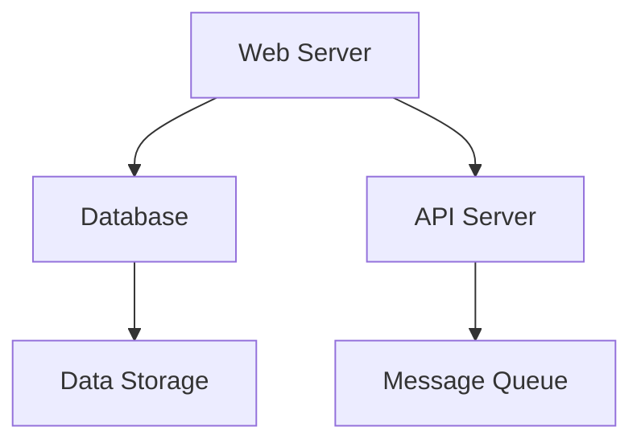

                 

让我们一步步深入探讨技术选型决策的框架与流程。

## 第1章: 技术选型决策的重要性与背景

### 1.1 技术选型决策的问题背景

在当今快速发展的信息技术时代，企业面临着越来越复杂的技术选型挑战。技术的多样性和更新速度使得企业必须在有限的时间和资源内做出最佳的技术决策。技术选型决策不仅影响系统的性能和稳定性，还直接关系到企业的长期发展和竞争优势。

首先，技术选型决策的需求来源于以下几个方面：

1. **业务需求变化**：随着市场竞争的加剧和用户需求的多样化，企业需要不断调整和升级其技术架构以满足新的业务需求。
2. **技术更新换代**：技术领域的创新步伐不断加快，新的技术和解决方案层出不穷，企业需要及时评估和采纳新技术来保持竞争力。
3. **资源限制**：企业在做出技术决策时往往面临预算、人力和时间的限制，需要综合考虑多种因素来选择最合适的技术方案。
4. **风险控制**：技术选型不当可能导致系统稳定性差、性能低下甚至安全漏洞，企业需要评估潜在风险并采取相应的预防措施。

### 1.2 技术选型决策的概述

技术选型决策是一个复杂的过程，涉及到多个环节和多个利益相关者。首先，我们需要明确几个关键概念：

- **技术选型决策的定义**：技术选型决策是指企业在特定业务需求和资源约束下，从多个可行的技术方案中选出最佳方案的过程。
- **技术选型决策的类型**：根据选型的目标和场景，技术选型决策可以分为以下几种类型：
  - **新系统开发**：在开发新的系统时，从多种开发框架、数据库、中间件等技术中进行选择。
  - **系统升级**：在现有系统需要升级或优化时，选择新的技术版本或替代技术。
  - **技术迁移**：企业从一种技术平台迁移到另一种平台时，如从本地部署迁移到云服务。
  - **技术并购**：企业在并购其他公司时，需要对被并购公司的技术进行评估和整合。

- **技术选型决策的边界与外延**：技术选型决策不仅仅局限于技术本身，还需要考虑与业务流程、人力资源、财务预算等其他因素的结合。边界与外延包括以下几个方面：
  - **业务需求**：技术选型必须符合企业的业务战略和目标，不能脱离业务实际需求。
  - **资源限制**：技术选型需要考虑企业在预算、人力和硬件资源等方面的限制。
  - **市场趋势**：技术选型需要考虑市场的发展趋势，避免选择即将被淘汰的技术。
  - **风险管理**：技术选型需要评估技术方案的风险，包括技术风险、市场风险和运营风险等。

### 1.3 技术选型决策的核心要素

技术选型决策的核心要素包括以下几个方面：

- **技术需求分析**：了解企业的具体技术需求，包括性能、可靠性、扩展性、安全性等方面。
- **技术评估标准**：制定明确的评估标准，包括技术成熟度、成本效益、技术支持等方面。
- **技术选型流程**：制定详细的技术选型流程，包括需求分析、评估筛选、决策选择、实施监控等步骤。

### 1.4 技术选型决策的重要性

技术选型决策对企业的长期发展具有重要影响：

- **影响系统性能和稳定性**：选型不当可能导致系统性能下降、稳定性差，影响企业的运营效率。
- **决定技术发展路线**：正确的技术选型可以帮助企业形成长远的技术发展战略，保持竞争优势。
- **节约成本和资源**：合理的技术选型可以避免不必要的资源浪费，提高投资回报率。
- **降低运营风险**：通过风险评估和技术选型的综合考虑，可以降低系统运行过程中可能出现的各种风险。

### 1.5 本章小结

本章介绍了技术选型决策的重要性与背景，包括问题背景、问题描述、问题解决、边界与外延、概念结构与核心要素组成。在接下来的章节中，我们将详细探讨技术选型决策的核心概念、框架与流程，为读者提供一套完整的技术选型方法论。

---

在了解了技术选型决策的基本背景和重要性之后，我们将在下一章深入探讨技术选型决策中的核心概念及其相互联系。这将帮助我们建立清晰的技术选型决策框架，为后续的详细分析打下坚实的基础。## 第2章: 技术选型决策框架概述

### 2.1 技术选型决策框架的定义

技术选型决策框架是一种系统化的方法论，用于指导企业在众多技术方案中做出最佳选择。它通过定义明确的目标、评估标准和流程，帮助企业在技术选型过程中做出理性、全面和高效的决策。

**技术选型决策框架的构成**：

1. **目标设定**：明确技术选型的目标，如性能提升、成本节约、安全性提高等。
2. **评估指标**：根据目标设定评估指标，如技术成熟度、成本效益、可维护性等。
3. **评估方法**：选择合适的评估方法，如定量评估、定性评估或两者的结合。
4. **决策流程**：制定详细的技术选型流程，包括需求分析、评估筛选、决策选择、实施监控等步骤。
5. **风险管理**：评估和应对技术选型过程中的风险，确保选型的可持续性和安全性。

**技术选型决策框架的作用**：

1. **指导决策**：提供明确的决策路径和评估标准，减少决策的主观性和随意性。
2. **提高效率**：通过系统化的流程和方法，加快技术选型的速度，提高决策效率。
3. **降低风险**：通过风险评估和风险控制，降低技术选型过程中的不确定性，确保技术选型的可靠性和稳定性。
4. **促进创新**：鼓励企业在技术选型过程中积极尝试新技术，推动技术进步和业务创新。

### 2.2 技术选型决策框架的核心概念

技术选型决策框架的核心概念包括以下几个方面：

**1. 技术评估模型**：

技术评估模型是技术选型决策框架的重要组成部分，用于评估和比较不同技术方案的性能和适用性。常见的评估模型包括：

- **成本效益分析（CBA）**：通过比较技术的总成本和预期效益，评估技术方案的经济合理性。
- **技术成熟度模型（TMM）**：根据技术发展的成熟度和可靠性评估技术方案。
- **平衡记分卡（BSC）**：从财务、客户、内部流程、学习与成长四个维度评估技术方案。

**2. 技术选型策略**：

技术选型策略是指企业在技术选型过程中采取的决策方法和策略。常见的选型策略包括：

- **最佳实践**：基于行业最佳实践和成功案例进行技术选型。
- **定制化**：根据企业的具体需求和技术环境，定制化选择最适合的技术方案。
- **风险规避**：在技术选型过程中充分考虑风险，选择风险较小但可能不是最佳的技术方案。

**3. 技术风险评估**：

技术风险评估是技术选型决策的重要环节，用于识别和评估技术方案在性能、安全性、可靠性等方面的潜在风险。技术风险评估通常包括以下步骤：

- **风险识别**：识别技术选型过程中可能遇到的各种风险。
- **风险分析**：分析各种风险的性质、可能性和影响。
- **风险应对**：制定风险应对策略，包括风险规避、风险转移和风险接受。

### 2.3 技术选型决策的流程

技术选型决策流程是确保技术选型过程有序、高效的关键。一个完整的技术选型决策流程通常包括以下几个步骤：

**1. 需求分析与识别**：

在需求分析阶段，企业需要明确业务需求、用户需求和系统需求。通过用户调研、业务流程分析等方法，收集和整理需求信息，为技术选型提供依据。

**2. 技术评估与筛选**：

在技术评估与筛选阶段，根据需求分析结果，对不同的技术方案进行评估和比较。评估内容包括技术性能、成本效益、技术支持、可维护性等。通过定量和定性评估方法，筛选出符合需求的候选技术方案。

**3. 技术决策与选择**：

在技术决策与选择阶段，根据评估结果和企业的战略目标，选择最佳技术方案。决策过程中需要充分考虑评估指标、技术策略和风险评估结果。

**4. 技术实施与监控**：

在技术实施与监控阶段，企业需要按照选定的技术方案进行系统开发和部署。同时，建立监控机制，跟踪技术方案的实施进度和效果，确保技术选型的成功落地。

**4. 技术选型决策框架的应用场景**

技术选型决策框架在不同应用场景中具有广泛的适用性：

- **新系统开发**：在开发新系统时，框架可以帮助企业选择最适合的开发框架、数据库和中间件等技术。
- **系统升级**：在系统升级时，框架可以帮助企业评估和选择新的技术版本或替代技术。
- **技术迁移**：在技术平台迁移时，框架可以帮助企业评估和选择新的平台架构和技术方案。
- **技术并购**：在并购其他公司时，框架可以帮助企业评估和整合被并购公司的技术资源。

**5. 技术选型决策框架的优势与局限**

技术选型决策框架具有以下优势：

1. **系统化**：通过系统化的流程和方法，提高技术选型的科学性和可操作性。
2. **全面性**：考虑了技术选型的各个方面，包括需求分析、评估筛选、决策选择和实施监控等。
3. **灵活性**：框架可以根据企业的具体需求和外部环境进行调整，具有较好的灵活性。

但技术选型决策框架也存在一定的局限：

1. **时间成本**：技术选型决策需要投入大量的时间和精力，可能会影响企业的运营效率。
2. **数据质量**：技术选型决策依赖于准确的需求分析和评估数据，数据质量直接影响决策结果。
3. **市场变化**：技术选型决策框架无法完全应对市场的快速变化，可能需要定期更新和调整。

### 2.5 本章小结

本章介绍了技术选型决策框架的定义、核心概念和流程，并分析了其在不同应用场景中的优势与局限。在了解了技术选型决策框架的基本概念之后，我们将进一步探讨如何进行技术需求分析与识别，为技术选型奠定基础。### 第3章: 技术需求分析与识别

#### 3.1 技术需求分析的定义

技术需求分析是技术选型决策过程的第一步，其核心目标是了解企业的业务需求、用户需求和系统需求，为后续的技术选型提供依据。技术需求分析不仅包括对现有业务流程的理解，还包括对用户行为的洞察以及对未来需求的预测。

**技术需求分析的目标**：

1. **明确业务目标**：通过需求分析，明确企业的业务目标和技术发展愿景，确保技术选型与业务战略的一致性。
2. **识别用户需求**：了解用户在使用系统过程中遇到的问题和期望，确保技术选型能够满足用户需求。
3. **系统需求定义**：明确系统的功能、性能、可靠性、可扩展性等要求，为技术评估提供具体的衡量标准。

**技术需求分析的步骤**：

1. **需求收集**：通过访谈、问卷、用户反馈等方式收集业务需求、用户需求和系统需求。
2. **需求整理**：对收集到的需求进行整理和分类，确保需求的具体性、完整性和一致性。
3. **需求优先级排序**：根据业务优先级和系统重要性，对需求进行优先级排序，为后续的技术评估提供指导。

#### 3.2 技术需求识别的方法

技术需求识别是技术需求分析的关键环节，以下是一些常用的需求识别方法：

**1. 用户需求调查**：

用户需求调查是了解用户需求的有效方法，可以通过以下几种方式进行：

- **面对面访谈**：直接与用户进行深入交流，了解用户在使用系统中遇到的问题和期望。
- **问卷调查**：通过设计问卷，广泛收集用户意见，进行分析和总结。
- **用户反馈**：收集用户在实际使用系统过程中提供的反馈和改进建议。

**2. 竞争对手分析**：

竞争对手分析可以帮助企业了解市场上其他企业的技术方案和用户需求，从而为自身的技术选型提供参考。具体方法包括：

- **产品分析**：分析竞争对手的产品特性、优势和劣势。
- **用户评价**：收集用户对竞争对手产品的评价和反馈。
- **市场报告**：参考市场研究报告，了解竞争对手的市场策略和技术布局。

**3. 市场趋势预测**：

市场趋势预测是预测未来市场需求和发展方向的重要方法，可以帮助企业提前布局和规划。具体方法包括：

- **数据分析**：通过分析历史数据和当前市场趋势，预测未来的市场需求。
- **专家咨询**：邀请行业专家进行趋势分析，结合专业知识和市场洞察进行预测。
- **技术监测**：关注新技术的发展动态，预测其对市场需求的影响。

#### 3.3 技术需求分析工具与技巧

在技术需求分析过程中，可以运用多种工具和技巧来提高分析的准确性和效率。以下是一些常用的工具和技巧：

**1. SWOT分析**：

SWOT分析是一种常用的战略规划工具，可以帮助企业全面了解自身的优势（Strengths）、劣势（Weaknesses）、机会（Opportunities）和威胁（Threats）。通过SWOT分析，可以明确企业的技术需求和选型方向。

**2. 敏捷方法论**：

敏捷方法论强调快速迭代和用户反馈，适合用于技术需求分析。通过敏捷方法论，可以持续收集用户需求，快速调整技术方案，确保技术选型与实际需求的一致性。

**3. 技术优先级排序**：

技术优先级排序是一种常用的需求管理技巧，可以帮助企业明确不同需求的重要性和优先级。具体方法包括：

- **Kano模型**：根据用户满意度对需求进行分类，区分必要需求、充分需求、无需求等。
- **MoSCoW模型**：根据需求的紧急程度和影响范围，将需求分为必须做（Mandatory）、应该做（Should）、可以做（Could）和不会做（Wont）。

#### 3.4 技术需求案例研究

**案例一：云计算服务选型**

在某企业的云计算服务选型过程中，首先进行了需求收集和整理，明确了业务目标、用户需求和系统需求。通过用户调查和竞争对手分析，了解了市场上主流云计算服务提供商的特点和用户评价。然后，采用SWOT分析，分析了企业自身和竞争对手的优势、劣势、机会和威胁。最后，根据需求优先级排序，选择了最适合企业的云计算服务提供商。

**案例二：物联网平台选型**

在某物联网项目的技术需求分析中，首先明确了项目的业务目标和用户需求，包括数据采集、数据存储、数据处理、数据可视化等方面。然后，通过市场趋势预测，分析了物联网技术的发展方向和未来需求。接着，进行了技术评估和筛选，选择了几个具有前景的物联网平台。最后，通过用户反馈和技术实施，进一步优化了技术选型方案。

#### 3.5 本章小结

本章介绍了技术需求分析的定义、方法、工具和技巧，并通过实际案例展示了技术需求分析的过程和应用。在明确了技术需求之后，我们将进一步探讨技术评估与筛选的方法，为技术选型决策提供更具体的指导。### 第4章: 技术评估与筛选

#### 4.1 技术评估标准的制定

技术评估标准的制定是技术选型过程中的关键环节，它决定了评估过程的公正性和科学性。一个合理的技术评估标准应该综合考虑多方面的因素，确保评估结果的客观性和准确性。

**技术评估标准的重要性**：

1. **确保评估的客观性**：技术评估标准可以避免主观判断，确保评估过程的公正性。
2. **提供决策依据**：明确的技术评估标准可以为技术选型决策提供科学、系统的依据。
3. **指导技术改进**：通过技术评估标准，企业可以发现现有技术方案的不足，指导技术改进和优化。

**技术评估标准的构成**：

1. **功能与性能**：包括系统的功能完整性、响应时间、吞吐量、并发处理能力等指标。
2. **成本与效益**：包括系统的初始投资、运营成本、ROI（投资回报率）等经济指标。
3. **可靠性**：包括系统的稳定性、故障率、恢复时间等指标。
4. **安全性**：包括系统的数据保护、访问控制、漏洞修复等安全指标。
5. **可维护性**：包括系统的可扩展性、易维护性、文档完整性等指标。
6. **技术支持**：包括供应商的技术支持能力、服务响应时间、技术培训等指标。
7. **市场适应性**：包括市场占有率、用户反馈、行业发展趋势等指标。

**技术评估标准的制定方法**：

1. **专家评审**：邀请业内专家对技术方案进行评估，结合专业知识和经验提出评估标准。
2. **用户调研**：通过用户调研，了解用户对技术方案的具体需求和期望，形成评估标准。
3. **数据分析**：收集和分析相关数据，如市场报告、技术文档、用户反馈等，形成评估标准。
4. **综合评审**：结合专家评审、用户调研和数据分析，形成综合评估标准。

#### 4.2 技术评估方法的选择

技术评估方法的选择取决于评估目标和评估对象的复杂性。常用的技术评估方法包括定量评估和定性评估，以及两者的结合。

**定量评估方法**：

1. **成本效益分析（CBA）**：通过计算系统的总成本和预期效益，评估技术方案的经济合理性。
2. **性能指标对比**：通过具体的性能指标（如响应时间、吞吐量等），量化评估技术方案的性能。
3. **风险评估矩阵**：通过量化评估技术方案的风险，评估其可行性和安全性。

**定性评估方法**：

1. **用户满意度调查**：通过用户满意度调查，评估技术方案的适用性和用户体验。
2. **专家评审**：通过邀请专家对技术方案进行评审，评估技术方案的可行性、可靠性和创新性。
3. **情景分析**：通过模拟不同的使用场景，评估技术方案在实际应用中的效果。

**定量与定性评估方法的结合**：

定量评估和定性评估方法各有所长，结合使用可以更全面地评估技术方案。具体方法包括：

1. **综合评分法**：将定量评估结果和定性评估结果进行加权综合，形成最终评分。
2. **多维度评估法**：从多个维度（如成本、性能、安全性等）进行评估，形成综合评估结果。
3. **模糊综合评价法**：利用模糊数学方法，结合定量和定性评估结果，形成更为科学的评估模型。

#### 4.3 技术评估

技术评估是技术选型决策的核心环节，其目的是通过对不同技术方案的全面评估，选出最符合企业需求的技术方案。技术评估通常包括以下几个步骤：

**1. 确定评估指标**：

根据技术评估标准，明确需要评估的指标。如功能完整性、性能、成本、可靠性、安全性等。

**2. 收集评估数据**：

收集与评估指标相关的数据，包括技术文档、用户反馈、市场报告等。

**3. 评估方法选择**：

根据评估目标和评估对象，选择合适的评估方法。如定量评估、定性评估或两者的结合。

**4. 实施评估**：

根据评估方法，对技术方案进行具体评估，记录评估结果。

**5. 分析评估结果**：

对评估结果进行分析和综合，形成技术评估报告。

**6. 决策建议**：

根据评估结果，提出技术选型建议，供决策者参考。

#### 4.4 技术评估案例分析

**案例一：数据库选型**

在某企业数据库选型项目中，首先明确了功能与性能、成本与效益、可靠性、安全性、可维护性等技术评估指标。然后，通过用户调研、市场报告和技术文档收集相关数据。采用定量评估方法，如性能测试、成本效益分析，对候选数据库进行评估。同时，通过专家评审和用户满意度调查进行定性评估。最终，结合定量和定性评估结果，选择了最适合企业需求的数据库方案。

**案例二：云计算服务提供商选型**

在某企业云计算服务提供商选型项目中，首先明确了评估指标，如成本效益、技术支持、安全性、可靠性等。然后，通过用户调研、市场报告和供应商提供的文档收集相关数据。采用定量评估方法，如成本效益分析和性能测试，对候选云计算服务提供商进行评估。同时，通过专家评审和用户满意度调查进行定性评估。最终，结合定量和定性评估结果，选择了最优质的云计算服务提供商。

#### 4.5 本章小结

本章介绍了技术评估标准的制定、技术评估方法的选择和技术评估的流程。通过实际案例，展示了技术评估的具体方法和步骤。在下一章中，我们将进一步探讨技术决策与选择的过程，为企业提供完整的技术选型解决方案。### 第5章: 技术决策与选择

#### 5.1 技术决策的背景

技术决策是技术选型过程中的关键环节，其背景包括以下几个方面：

1. **需求分析结果**：技术决策基于需求分析的结果，明确企业的业务需求、用户需求和系统需求。
2. **评估报告**：技术决策依赖于技术评估报告，评估报告提供了详细的评估结果和推荐方案。
3. **市场趋势**：技术决策需要考虑市场发展趋势，选择具有前瞻性和适应性的技术方案。
4. **企业战略**：技术决策应符合企业的长期发展战略和业务目标，确保技术选型与企业的整体战略一致。
5. **资源限制**：技术决策需要考虑企业在预算、人力和硬件资源等方面的限制，确保决策的可行性。

#### 5.2 技术决策的目标

技术决策的目标包括以下几个方面：

1. **最优性能**：选择具有最佳性能的技术方案，确保系统的高效运行。
2. **最佳成本效益**：选择在满足性能需求的前提下，成本效益最高的技术方案。
3. **最高可靠性**：选择具有高可靠性的技术方案，确保系统的稳定性和安全性。
4. **最佳可维护性**：选择易于维护和升级的技术方案，降低长期运维成本。
5. **最大适应性**：选择能够适应未来技术发展和业务需求变化的技术方案。

#### 5.3 技术决策的关键因素

技术决策过程中，需要综合考虑多个关键因素，包括：

1. **技术性能**：技术方案的性能指标，如响应时间、吞吐量、并发处理能力等。
2. **成本效益**：技术方案的成本与预期效益的平衡，包括初始投资、运营成本和ROI等。
3. **可靠性**：技术方案的稳定性和安全性，包括故障率、恢复时间和数据保护等。
4. **可维护性**：技术方案的易维护性和扩展性，包括文档完整性、社区支持和用户培训等。
5. **技术支持**：技术方案的供应商支持能力，包括服务响应时间、技术培训和问题解决等。
6. **市场适应性**：技术方案的市场接受度和未来发展潜力，包括市场份额、用户反馈和行业趋势等。

#### 5.4 技术决策流程

技术决策流程包括以下几个步骤：

1. **制定决策标准**：根据评估结果和企业的需求，制定具体的决策标准。
2. **筛选候选方案**：根据决策标准，筛选出符合需求的候选技术方案。
3. **评估候选方案**：对筛选出的候选方案进行进一步的评估，包括技术性能、成本效益、可靠性、可维护性等方面。
4. **决策选择**：根据评估结果，选择最佳的技术方案，制定决策方案。
5. **决策评审**：对决策方案进行评审，确保决策的科学性和可行性。
6. **决策执行**：执行决策方案，包括技术实施、系统部署和监控等。

#### 5.5 决策过程中的难点和挑战

技术决策过程中可能会遇到以下难点和挑战：

1. **信息不对称**：企业可能无法获取全面的技术和市场信息，影响决策的准确性。
2. **决策延迟**：技术决策过程复杂，涉及多个部门和利益相关者，可能导致决策延迟。
3. **风险评估不足**：技术决策过程中可能未能充分评估技术方案的风险，影响系统的长期稳定性和安全性。
4. **市场变化**：技术市场变化快速，决策过程中可能未能及时应对市场变化，影响决策的适应性。
5. **技术成熟度**：某些新技术可能尚未成熟，决策过程中需要评估其可行性和风险。

#### 5.6 决策案例分析

**案例一：云计算平台选型**

在某企业的云计算平台选型项目中，首先明确了技术性能、成本效益、可靠性、可维护性、技术支持等决策标准。然后，根据需求分析和评估报告，筛选出几个候选云计算平台。接着，对这些候选平台进行详细的评估，包括性能测试、成本效益分析、可靠性测试等。最终，根据评估结果，选择了最符合企业需求的云计算平台。

**案例二：大数据技术选型**

在某企业的大数据技术选型项目中，首先明确了数据处理能力、成本效益、可靠性、可扩展性等决策标准。然后，根据需求分析和市场调研，筛选出几个候选大数据技术方案。接着，对这些候选方案进行详细的评估，包括性能测试、成本效益分析、可靠性测试等。最终，根据评估结果，选择了最适合企业的大数据技术方案。

#### 5.7 本章小结

本章介绍了技术决策的背景、目标、关键因素和流程，并通过实际案例分析了决策过程中的难点和挑战。在了解了技术决策的基本方法和步骤之后，读者可以更好地应用这些方法，做出科学、合理的技术决策。### 第6章: 技术实施与监控

#### 6.1 技术实施的准备阶段

技术实施是技术选型决策后的关键环节，其成功与否直接影响项目的整体效果。为了确保技术实施的顺利进行，需要做好充分的准备。

**1. 环境搭建**：

在技术实施前，需要搭建合适的技术环境，包括硬件设备、软件环境、网络环境等。确保所有环境满足技术方案的要求，以便后续的部署和测试。

**2. 团队组建**：

组建一支专业的实施团队，包括项目经理、开发人员、测试人员、运维人员等。明确各团队成员的职责和任务，确保团队成员具备相关技能和经验。

**3. 训练与文档**：

对团队成员进行技术培训，确保他们熟悉所选技术方案的特点和操作方法。同时，准备详细的技术文档，包括系统设计文档、操作手册、维护手册等，以便后续的运维和管理。

**4. 风险评估**：

在技术实施前，对可能出现的风险进行评估和预防。制定风险应对策略，确保在风险发生时能够迅速响应和处理。

#### 6.2 技术实施的过程

技术实施过程通常包括以下几个步骤：

**1. 系统设计**：

根据技术方案，设计系统的架构和模块。使用Mermaid类图描述系统的领域模型，明确各模块的功能和关系。

```mermaid
classDiagram
Class01 <|-- Class02
Class03 --|oid=123 -- Class04
Class05 : <<interface>>
Class06 : <<abstract>>
Class07 : <<enum>> e1 e2 e3
Class01 {
    int x
    int y
    int z
}
Class02 {
    > int a
    > int b
}
```

**2. 系统开发**：

根据系统设计，进行具体的系统开发。使用Python等编程语言编写代码，实现各模块的功能。以下是简单的Python代码示例：

```python
def add(a, b):
    return a + b

def subtract(a, b):
    return a - b

def multiply(a, b):
    return a * b

def divide(a, b):
    if b != 0:
        return a / b
    else:
        return "Error: Division by zero"
```

**3. 系统测试**：

在系统开发完成后，进行全面的系统测试，包括功能测试、性能测试、安全测试等。确保系统满足需求和预期性能。

**4. 部署上线**：

在测试通过后，将系统部署到生产环境。使用Mermaid架构图描述系统的架构，包括各个组件的部署方式和依赖关系。



**5. 监控与运维**：

部署完成后，建立监控机制，实时监控系统的运行状态，包括性能指标、系统健康状态、日志等。同时，制定运维计划，确保系统的稳定运行。

#### 6.3 监控与优化

**1. 性能监控**：

通过性能监控工具（如Prometheus、Grafana等），实时监控系统的性能指标，如响应时间、吞吐量、CPU利用率、内存使用率等。发现性能瓶颈，进行优化调整。

**2. 安全监控**：

通过安全监控工具（如ELK堆栈、Splunk等），实时监控系统的安全事件，如恶意攻击、异常登录等。确保系统的安全性。

**3. 日志分析**：

通过日志分析工具（如Logstash、Kibana等），分析系统的运行日志，发现潜在问题，进行优化和改进。

**4. 自动化运维**：

使用自动化工具（如Ansible、Puppet等），实现系统的自动化部署、监控和运维，提高运维效率和系统的稳定性。

#### 6.4 案例分析

**案例一：企业级应用系统实施**

在某企业的应用系统实施项目中，首先进行了详细的需求分析和系统设计。然后，使用Python等编程语言开发了系统的各个模块，并进行了全面的测试。接着，将系统部署到生产环境，并建立了完善的监控和运维体系。通过性能监控和安全监控，实时监控系统的运行状态，并进行定期优化和升级，确保系统的稳定运行。

**案例二：大数据平台部署**

在某企业的大数据平台部署项目中，首先进行了硬件设备和软件环境的搭建。然后，根据系统设计，使用了Hadoop、Spark等大数据技术，搭建了分布式数据处理平台。接着，进行了性能测试和安全性测试，确保平台满足需求。最后，建立了监控和运维体系，实时监控平台的运行状态，并进行定期维护和升级。

#### 6.5 本章小结

本章介绍了技术实施与监控的相关内容，包括实施准备阶段、实施过程、监控与优化以及实际案例分析。在技术实施过程中，需要充分考虑环境搭建、团队组建、训练与文档、风险评估等因素，确保项目的成功实施。通过监控与优化，确保系统的稳定运行和持续改进。### 第7章: 最佳实践、注意事项和拓展阅读

#### 7.1 最佳实践

在技术选型决策的实施过程中，以下最佳实践可以帮助企业和团队更有效地进行技术决策：

1. **充分需求分析**：在技术选型前，进行深入的需求分析，确保对业务需求和用户需求有全面的了解。
2. **多角度评估**：在技术评估过程中，从多个维度进行评估，包括性能、成本、安全性、可维护性等，确保评估结果的全面性。
3. **定期复审**：技术选型决策不是一次性的，应定期复审技术方案，确保其持续满足业务需求和市场变化。
4. **技术风险评估**：在技术选型过程中，充分考虑技术风险，并制定相应的风险应对策略。
5. **沟通与协作**：确保团队成员之间的有效沟通，明确各自的职责和任务，提高决策效率和执行力。

#### 7.2 注意事项

在技术选型决策过程中，需要注意以下事项：

1. **避免盲目跟风**：市场趋势和新技术的发展方向应考虑，但不应盲目跟风，应结合企业自身实际需求进行选型。
2. **数据准确性**：技术评估过程中依赖的数据应确保准确性，否则可能导致错误的决策。
3. **风险评估**：技术选型过程中应进行全面的风险评估，包括技术风险、市场风险和运营风险等。
4. **可持续性**：技术选型应考虑长期可持续性，确保技术方案能够适应未来的发展需求。
5. **专业指导**：在技术选型过程中，必要时可邀请专业顾问或第三方评估机构提供指导，提高决策的科学性和权威性。

#### 7.3 拓展阅读

为了更好地理解技术选型决策的框架与流程，以下推荐一些拓展阅读资源：

1. **《软件架构设计：复杂系统的产品设计与开发方法》**：作者Mark Richards，详细介绍了软件架构设计的方法和最佳实践。
2. **《敏捷软件开发：原则、实践与模式》**：作者Ron Jeffries，阐述了敏捷方法论在软件开发中的应用和实践。
3. **《数据驱动决策》**：作者Andrew Ng，介绍了数据驱动决策的方法和工具，对技术选型有很好的参考价值。
4. **《技术风险与管理》**：作者John W. Mc Manus，探讨了技术风险的管理方法和实践。
5. **《云计算：概念、技术和应用》**：作者Thomas A. Mowbray，全面介绍了云计算的基础知识、技术架构和应用场景。

通过这些拓展阅读资源，读者可以进一步深化对技术选型决策的理解，掌握更全面的技术选型方法和实践技巧。### 结束语

在本文中，我们系统地探讨了技术选型决策的框架与流程。从背景介绍到核心概念，从技术需求分析到评估筛选，再到技术决策与实施监控，我们逐步构建了一个全面的技术选型方法论。

**核心观点总结**：

- 技术选型决策是一个复杂但至关重要的过程，它关系到企业的长期发展和竞争力。
- 技术需求分析是技术选型的基础，需要全面了解业务需求、用户需求和系统需求。
- 技术评估与筛选是技术选型的关键环节，需要制定合理的评估标准，采用科学的方法进行评估。
- 技术决策需要结合评估结果和企业的战略目标，综合考虑性能、成本、可靠性、可维护性等因素。
- 技术实施与监控是确保技术方案成功落地和持续优化的重要步骤。

**实际应用意义**：

本文提供的技术选型框架和方法，可以帮助企业在快速变化的技术环境中做出更科学、更合理的决策。通过有效的技术选型，企业可以提升系统的性能和稳定性，降低运营风险，实现资源的最大化利用。

**未来展望**：

随着技术的不断进步和市场环境的快速变化，技术选型决策的框架与流程也需要不断更新和优化。未来，我们将继续关注新技术的发展趋势，探索更高效、更智能的技术选型方法，以期为企业和开发者提供更有价值的指导。

最后，感谢您的阅读，希望本文能够对您在技术选型决策过程中提供一些启示和帮助。如果您对技术选型有任何疑问或建议，欢迎在评论区留言，我们期待与您共同探讨技术选型的最佳实践。**作者：AI天才研究院/AI Genius Institute & 禅与计算机程序设计艺术 /Zen And The Art of Computer Programming**

