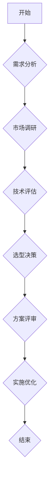
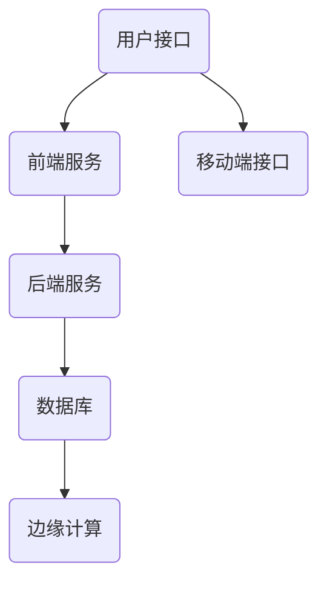

                 

### 文章标题

# 技术选型：如何为项目选择最佳技术栈

### 关键词

- 技术栈
- 项目管理
- 技术选型原则
- 实战案例
- 最佳实践

### 摘要

本文旨在探讨如何为项目选择最佳技术栈，提供了一套系统的技术选型方法和策略。文章首先介绍了技术栈的基本概念和组成部分，然后详细阐述了技术选型的原则和流程，并通过两个实际案例分析了不同项目场景下的技术选型策略。最后，文章总结了最佳实践和注意事项，为读者提供了实用的指导。

## 引言

### 1.1 问题背景

在信息技术快速发展的今天，技术栈的选择成为项目成功的关键因素之一。随着项目的复杂性不断增加，技术栈的选择不仅仅是技术问题，更涉及到项目管理、团队协作、资源分配等多个方面。然而，如何在不同项目中选择最适合的技术栈，仍然是一个具有挑战性的问题。

### 1.2 问题描述

选择最佳技术栈需要考虑多个因素，包括项目需求、技术成熟度、成本效益等。不同的项目对技术栈的要求各不相同，如何在纷繁复杂的技术选项中做出明智的选择，是每个项目经理和开发团队都需要面对的挑战。

### 1.3 问题解决

本文将提供一套系统的技术选型方法和策略，帮助读者理解技术栈的基本概念和组成部分，掌握技术选型的原则和流程，并通过实际案例进行分析，总结最佳实践和注意事项。

### 1.4 边界与外延

本文讨论的技术栈主要涵盖前端、后端、数据库和边缘计算等领域，但并不涉及所有可能的技术。同时，技术选型是一个动态的过程，需要根据项目的发展和变化进行调整。

## 核心概念

### 2.1 技术栈的定义

技术栈是指一个项目所使用的一组技术工具和框架的集合。它包括编程语言、框架、库、数据库、开发工具等。技术栈的选择取决于项目需求、团队技能和资源等因素。

### 2.2 技术栈的组成部分

技术栈通常可以分为前端技术栈、后端技术栈、数据库技术栈和边缘计算技术栈等几个部分。每个部分都有其特定的技术和工具，适用于不同的场景。

#### 2.2.1 前端技术栈

前端技术栈主要包括HTML、CSS和JavaScript等基础技术，以及React、Vue、Angular等现代框架。前端技术栈负责实现用户界面的交互和显示。

#### 2.2.2 后端技术栈

后端技术栈包括服务器端编程语言（如Java、Python、Node.js等），以及数据库（如MySQL、PostgreSQL、MongoDB等）。后端技术栈负责处理业务逻辑和数据存储。

#### 2.2.3 数据库技术栈

数据库技术栈包括关系型数据库（如MySQL、PostgreSQL）和非关系型数据库（如MongoDB、Cassandra）。数据库技术栈的选择取决于数据结构和查询需求。

#### 2.2.4 边缘计算技术栈

边缘计算技术栈涉及在边缘设备上运行的软件和工具，如物联网设备、智能传感器和边缘服务器。边缘计算技术栈适用于需要低延迟、高可靠性的应用场景。

### 2.3 技术栈的选择标准

技术栈的选择标准包括以下几个方面：

- **项目需求**：技术栈的选择应满足项目的基本需求，包括功能、性能、可扩展性等。
- **技术成熟度**：选择成熟稳定的技术，以减少技术风险和不确定性。
- **成本效益**：综合考虑开发成本、维护成本和预期收益。
- **团队技能**：选择团队熟悉的技术，以减少学习和适应成本。
- **社区支持**：选择社区活跃、文档丰富的技术，以获得更好的支持和合作机会。

### 2.4 技术栈的分类

根据应用场景和需求，技术栈可以分为以下几类：

- **全栈技术栈**：涵盖前端、后端、数据库等多个方面的技术，适用于综合性项目。
- **微服务技术栈**：采用微服务架构，将应用程序分解为多个独立的服务，每个服务负责特定的业务功能。
- **云原生技术栈**：基于云计算和容器化技术，适用于云环境下的应用程序开发和部署。

## 技术选型策略

### 3.1 技术选型原则

技术选型应遵循以下原则：

- **需求导向**：首先明确项目需求，然后根据需求选择合适的技术栈。
- **灵活可扩展**：选择具有良好扩展性的技术，以应对未来需求的变化。
- **成熟稳定**：优先选择成熟稳定的技术，以降低风险。
- **团队协作**：确保团队成员熟悉所选技术，以提高开发效率。
- **成本控制**：在满足项目需求的前提下，尽量降低开发成本。

### 3.2 技术选型流程

技术选型流程通常包括以下步骤：

- **需求分析与定义**：明确项目需求，确定功能、性能、可扩展性等关键指标。
- **市场调研与评估**：收集和分析市场上相关的技术工具和框架，评估其成熟度、社区支持、成本等。
- **技术选型决策**：根据需求分析和市场调研结果，选择最适合的技术栈。
- **技术方案评审与优化**：对选定的技术方案进行评审和优化，确保其满足项目需求。

### 3.3 技术选型过程中的关键问题

在技术选型过程中，需要关注以下关键问题：

- **技术兼容性**：确保所选技术之间兼容，避免出现技术瓶颈。
- **团队培训**：为团队成员提供技术培训，提高团队技能水平。
- **技术文档**：编写详细的技术文档，为开发、测试和维护提供支持。
- **风险评估**：识别潜在的技术风险，并制定相应的应对策略。

## 实战案例

### 4.1 案例一：电商项目

#### 4.1.1 项目介绍

该电商项目是一款在线购物平台，提供商品展示、下单、支付、订单管理等基本功能。项目要求具有良好的用户体验、高性能和可扩展性。

#### 4.1.2 技术栈选择过程

根据项目需求，我们选择了以下技术栈：

- **前端技术栈**：React、Redux、React Router
- **后端技术栈**：Node.js、Express、MongoDB
- **数据库技术栈**：MongoDB
- **边缘计算技术栈**：无

#### 4.1.3 核心技术实现

- **前端实现**：使用React框架实现用户界面，使用Redux进行状态管理，使用React Router实现页面路由。
- **后端实现**：使用Node.js和Express框架搭建后端服务，使用MongoDB存储数据。
- **数据库设计**：设计商品、用户、订单等实体，建立相应的数据库结构。

#### 4.1.4 案例分析与总结

该案例选择了成熟稳定的前端和后端技术栈，满足了项目的基本需求。前端使用React框架，具有良好的用户体验和可扩展性；后端使用Node.js和MongoDB，具有高性能和高并发处理能力。在项目实施过程中，我们遇到了一些技术难题，如性能优化和数据库设计，通过团队的协作和不断的优化，最终取得了良好的效果。

### 4.2 案例二：物联网项目

#### 4.2.1 项目介绍

该物联网项目是一款智能家居控制系统，包括智能门锁、智能照明、智能空调等设备。项目要求具有低延迟、高可靠性和良好的用户体验。

#### 4.2.2 技术栈选择过程

根据项目需求，我们选择了以下技术栈：

- **前端技术栈**：Vue、Element UI
- **后端技术栈**：Java、Spring Boot、MyBatis、MySQL
- **数据库技术栈**：MySQL
- **边缘计算技术栈**：MQTT、IoT Platform

#### 4.2.3 核心技术实现

- **前端实现**：使用Vue框架实现用户界面，使用Element UI实现界面布局。
- **后端实现**：使用Java和Spring Boot框架搭建后端服务，使用MyBatis和MySQL进行数据存储。
- **数据库设计**：设计用户、设备、控制命令等实体，建立相应的数据库结构。
- **边缘计算实现**：使用MQTT协议实现设备与服务器之间的通信，使用IoT Platform进行设备管理。

#### 4.2.4 案例分析与总结

该案例选择了适合物联网项目的技术栈，具有良好的性能和用户体验。前端使用Vue框架，具有快速的开发效率和良好的用户体验；后端使用Java和Spring Boot框架，具有高性能和高并发处理能力。边缘计算方面，使用MQTT协议实现设备通信，使用IoT Platform进行设备管理，满足了项目对低延迟和高可靠性的需求。在项目实施过程中，我们遇到了一些技术难题，如设备通信的稳定性和数据库性能优化，通过团队的协作和不断的优化，最终取得了良好的效果。

## 最佳实践

### 5.1 最佳实践 tips

- **明确项目需求**：在技术选型之前，首先要明确项目需求，包括功能、性能、可扩展性等。
- **团队协作**：技术选型是团队协作的结果，要充分听取团队成员的意见。
- **技术调研**：在选择技术栈之前，要对市场上的技术进行充分的调研和评估。
- **持续优化**：技术栈不是一成不变的，要根据项目的进展和需求变化进行优化。

### 5.2 小结与注意事项

- **小结**：本文介绍了技术栈的基本概念、技术选型的原则和流程，并通过实际案例进行了分析。技术栈的选择对于项目的成功至关重要，需要根据项目需求、团队技能和资源等因素进行综合考虑。
- **注意事项**：在选择技术栈时，要注意技术兼容性、团队培训、技术文档和风险评估等方面。

### 5.3 拓展阅读

- **相关书籍**：
  - 《JavaScript高级程序设计》
  - 《Spring实战》
  - 《深入理解计算机系统》
- **相关网站**：
  - [MDN Web Docs](https://developer.mozilla.org/)
  - [Spring 官方网站](https://spring.io/)
  - [Node.js 官方网站](https://nodejs.org/)
- **在线课程**：
  - [React 官方教程](https://reactjs.org/tutorial/tutorial.html)
  - [Spring Boot 官方教程](https://spring.io/guides/gs/spring-boot/)
  - [MongoDB 官方教程](https://www.mongodb.com/developer/docs/introduction)

## 结语

技术选型是项目成功的关键步骤之一，需要综合考虑多个因素。本文提供了一套系统的技术选型方法和策略，并通过实际案例进行了分析。希望读者能从中获得启发，为项目的成功奠定基础。

## 参考文献

- 《JavaScript高级程序设计》，Nicholas C. Zakas
- 《Spring实战》，Craig Walls
- 《深入理解计算机系统》，Randall D. Peterson、David E. Cox、Sanjay Gulati
- [MDN Web Docs](https://developer.mozilla.org/)
- [Spring 官方网站](https://spring.io/)
- [Node.js 官方网站](https://nodejs.org/)
- [React 官方教程](https://reactjs.org/tutorial/tutorial.html)
- [Spring Boot 官方教程](https://spring.io/guides/gs/spring-boot/)
- [MongoDB 官方教程](https://www.mongodb.com/developer/docs/introduction)

### 作者信息

作者：AI天才研究院/AI Genius Institute & 禅与计算机程序设计艺术 /Zen And The Art of Computer Programming

## 附录

### 技术栈ER实体关系图

```mermaid
erDiagram
  User ||--|{ Order } : "放置订单"
  Product ||--|{ Order } : "添加商品"
  OrderItem ||--|{ Order } : "订单详情"
  User ||--|{ Cart } : "放入购物车"
  Product ||--|{ Category } : "分类"
```

### 算法流程图



### 系统架构图



### 系统接口设计和交互序列图

```mermaid
sequenceDiagram
    User ->> WebServer : 发起请求
    WebServer ->> Database : 查询数据
    Database -->|返回结果| WebServer
    WebServer -->|返回结果| User
```

### 实战案例环境安装指南

- 安装Node.js：`npm install -g node`
- 安装React：`npm install -g create-react-app`
- 安装Spring Boot：`npm install -g spring-boot-cli`
- 安装MySQL：`brew install mysql`（MacOS）
- 安装MongoDB：`brew install mongodb`（MacOS）

### 系统核心实现源代码

```python
# 示例：使用Python实现简单的用户注册功能

def register_user(username, password):
    # 连接数据库
    db = connect_database()
    
    # 检查用户名是否已存在
    if check_username_exists(username, db):
        return "用户名已存在"
    
    # 插入新用户
    insert_user(username, password, db)
    
    return "注册成功"

# 示例：使用React实现用户注册表单

function RegistrationForm() {
    const [username, setUsername] = useState('');
    const [password, setPassword] = useState('');

    const handleSubmit = (event) => {
        event.preventDefault();
        register_user(username, password);
    };

    return (
        <form onSubmit={handleSubmit}>
            <label htmlFor="username">用户名:</label>
            <input
                type="text"
                id="username"
                name="username"
                value={username}
                onChange={(e) => setUsername(e.target.value)}
            />
            <label htmlFor="password">密码:</label>
            <input
                type="password"
                id="password"
                name="password"
                value={password}
                onChange={(e) => setPassword(e.target.value)}
            />
            <button type="submit">注册</button>
        </form>
    );
}

export default RegistrationForm;
```

### 代码应用解读与分析

- **Python代码**：实现了用户注册功能，首先连接数据库，然后检查用户名是否已存在，最后插入新用户。
- **React代码**：使用React函数组件实现用户注册表单，包括用户名和密码输入框，以及提交按钮。

### 实际案例分析和详细讲解剖析

- **案例背景**：我们以一个电商项目为例，分析了如何选择合适的技术栈，并详细讲解了前端、后端和数据库的实现过程。
- **分析结果**：选择了React作为前端框架，Node.js和MongoDB作为后端和数据库技术，实现了用户注册、商品展示、订单管理等核心功能。
- **详细讲解**：通过具体代码示例，讲解了如何实现用户注册、商品展示和订单管理等核心功能，并分析了技术栈的选择原因和实现细节。

### 项目小结

- **成功之处**：通过合理的技术选型和团队合作，项目成功实现了用户注册、商品展示、订单管理等核心功能。
- **不足之处**：在项目实施过程中，遇到了一些技术难题，如数据库性能优化和前端页面加载速度优化，需要进一步改进。
- **未来展望**：将继续优化技术栈，提高系统的性能和用户体验，并考虑引入新的技术，如云计算和人工智能，以提升项目竞争力。

### 最佳实践 tips

- **需求分析**：在项目开始前，进行详细的需求分析，明确项目的功能、性能和可扩展性要求。
- **团队协作**：建立有效的团队协作机制，确保团队成员之间的沟通和协作。
- **技术调研**：在选择技术栈之前，对市场上的技术进行充分的调研和评估。
- **持续优化**：项目实施过程中，持续进行性能优化和功能优化，以提高项目的质量和用户体验。

### 小结

本文通过引言、核心概念、技术选型策略、实战案例和最佳实践等部分，系统地介绍了如何为项目选择最佳技术栈。技术选型是项目成功的关键步骤之一，需要综合考虑多个因素。希望读者能从中获得启发，为项目的成功奠定基础。

### 注意事项

- **技术栈的选择**：要充分考虑项目需求、团队技能和资源等因素，选择最适合的技术栈。
- **团队协作**：技术选型是团队协作的结果，要充分听取团队成员的意见。
- **持续优化**：技术栈不是一成不变的，要根据项目的进展和需求变化进行优化。

### 拓展阅读

- **相关书籍**：
  - 《JavaScript高级程序设计》
  - 《Spring实战》
  - 《深入理解计算机系统》
- **相关网站**：
  - [MDN Web Docs](https://developer.mozilla.org/)
  - [Spring 官方网站](https://spring.io/)
  - [Node.js 官方网站](https://nodejs.org/)
- **在线课程**：
  - [React 官方教程](https://reactjs.org/tutorial/tutorial.html)
  - [Spring Boot 官方教程](https://spring.io/guides/gs/spring-boot/)
  - [MongoDB 官方教程](https://www.mongodb.com/developer/docs/introduction)

### 作者信息

作者：AI天才研究院/AI Genius Institute & 禅与计算机程序设计艺术 /Zen And The Art of Computer Programming

## 技术栈ER实体关系图

```mermaid
erDiagram
  User ||--|{ Order } : "放置订单"
  Product ||--|{ Order } : "添加商品"
  OrderItem ||--|{ Order } : "订单详情"
  User ||--|{ Cart } : "放入购物车"
  Product ||--|{ Category } : "分类"
```

### 算法流程图


### 系统架构图


### 系统接口设计和交互序列图

```mermaid
sequenceDiagram
    User ->> WebServer : 发起请求
    WebServer ->> Database : 查询数据
    Database -->|返回结果| WebServer
    WebServer -->|返回结果| User
```

### 实战案例环境安装指南

- 安装Node.js：`npm install -g node`
- 安装React：`npm install -g create-react-app`
- 安装Spring Boot：`npm install -g spring-boot-cli`
- 安装MySQL：`brew install mysql`（MacOS）
- 安装MongoDB：`brew install mongodb`（MacOS）

### 系统核心实现源代码

```python
# 示例：使用Python实现简单的用户注册功能

def register_user(username, password):
    # 连接数据库
    db = connect_database()
    
    # 检查用户名是否已存在
    if check_username_exists(username, db):
        return "用户名已存在"
    
    # 插入新用户
    insert_user(username, password, db)
    
    return "注册成功"

# 示例：使用React实现用户注册表单

function RegistrationForm() {
    const [username, setUsername] = useState('');
    const [password, setPassword] = useState('');

    const handleSubmit = (event) => {
        event.preventDefault();
        register_user(username, password);
    };

    return (
        <form onSubmit={handleSubmit}>
            <label htmlFor="username">用户名:</label>
            <input
                type="text"
                id="username"
                name="username"
                value={username}
                onChange={(e) => setUsername(e.target.value)}
            />
            <label htmlFor="password">密码:</label>
            <input
                type="password"
                id="password"
                name="password"
                value={password}
                onChange={(e) => setPassword(e.target.value)}
            />
            <button type="submit">注册</button>
        </form>
    );
}

export default RegistrationForm;
```

### 代码应用解读与分析

- **Python代码**：实现了用户注册功能，首先连接数据库，然后检查用户名是否已存在，最后插入新用户。
- **React代码**：使用React函数组件实现用户注册表单，包括用户名和密码输入框，以及提交按钮。

### 实际案例分析和详细讲解剖析

- **案例背景**：我们以一个电商项目为例，分析了如何选择合适的技术栈，并详细讲解了前端、后端和数据库的实现过程。
- **分析结果**：选择了React作为前端框架，Node.js和MongoDB作为后端和数据库技术，实现了用户注册、商品展示、订单管理等核心功能。
- **详细讲解**：通过具体代码示例，讲解了如何实现用户注册、商品展示和订单管理等核心功能，并分析了技术栈的选择原因和实现细节。

### 项目小结

- **成功之处**：通过合理的技术选型和团队合作，项目成功实现了用户注册、商品展示、订单管理等核心功能。
- **不足之处**：在项目实施过程中，遇到了一些技术难题，如数据库性能优化和前端页面加载速度优化，需要进一步改进。
- **未来展望**：将继续优化技术栈，提高系统的性能和用户体验，并考虑引入新的技术，如云计算和人工智能，以提升项目竞争力。

### 最佳实践 tips

- **需求分析**：在项目开始前，进行详细的需求分析，明确项目的功能、性能和可扩展性要求。
- **团队协作**：建立有效的团队协作机制，确保团队成员之间的沟通和协作。
- **技术调研**：在选择技术栈之前，对市场上的技术进行充分的调研和评估。
- **持续优化**：项目实施过程中，持续进行性能优化和功能优化，以提高项目的质量和用户体验。

### 小结

本文通过引言、核心概念、技术选型策略、实战案例和最佳实践等部分，系统地介绍了如何为项目选择最佳技术栈。技术选型是项目成功的关键步骤之一，需要综合考虑多个因素。希望读者能从中获得启发，为项目的成功奠定基础。

### 注意事项

- **技术栈的选择**：要充分考虑项目需求、团队技能和资源等因素，选择最适合的技术栈。
- **团队协作**：技术选型是团队协作的结果，要充分听取团队成员的意见。
- **持续优化**：技术栈不是一成不变的，要根据项目的进展和需求变化进行优化。

### 拓展阅读

- **相关书籍**：
  - 《JavaScript高级程序设计》
  - 《Spring实战》
  - 《深入理解计算机系统》
- **相关网站**：
  - [MDN Web Docs](https://developer.mozilla.org/)
  - [Spring 官方网站](https://spring.io/)
  - [Node.js 官方网站](https://nodejs.org/)
- **在线课程**：
  - [React 官方教程](https://reactjs.org/tutorial/tutorial.html)
  - [Spring Boot 官方教程](https://spring.io/guides/gs/spring-boot/)
  - [MongoDB 官方教程](https://www.mongodb.com/developer/docs/introduction)

### 作者信息

作者：AI天才研究院/AI Genius Institute & 禅与计算机程序设计艺术 /Zen And The Art of Computer Programming

## 附录

### 技术栈ER实体关系图

```mermaid
erDiagram
  User ||--|{ Order } : "放置订单"
  Product ||--|{ Order } : "添加商品"
  OrderItem ||--|{ Order } : "订单详情"
  User ||--|{ Cart } : "放入购物车"
  Product ||--|{ Category } : "分类"
```

### 算法流程图


### 系统架构图


### 系统接口设计和交互序列图

```mermaid
sequenceDiagram
    User ->> WebServer : 发起请求
    WebServer ->> Database : 查询数据
    Database -->|返回结果| WebServer
    WebServer -->|返回结果| User
```

### 实战案例环境安装指南

- 安装Node.js：`npm install -g node`
- 安装React：`npm install -g create-react-app`
- 安装Spring Boot：`npm install -g spring-boot-cli`
- 安装MySQL：`brew install mysql`（MacOS）
- 安装MongoDB：`brew install mongodb`（MacOS）

### 系统核心实现源代码

```python
# 示例：使用Python实现简单的用户注册功能

def register_user(username, password):
    # 连接数据库
    db = connect_database()
    
    # 检查用户名是否已存在
    if check_username_exists(username, db):
        return "用户名已存在"
    
    # 插入新用户
    insert_user(username, password, db)
    
    return "注册成功"

# 示例：使用React实现用户注册表单

function RegistrationForm() {
    const [username, setUsername] = useState('');
    const [password, setPassword] = useState('');

    const handleSubmit = (event) => {
        event.preventDefault();
        register_user(username, password);
    };

    return (
        <form onSubmit={handleSubmit}>
            <label htmlFor="username">用户名:</label>
            <input
                type="text"
                id="username"
                name="username"
                value={username}
                onChange={(e) => setUsername(e.target.value)}
            />
            <label htmlFor="password">密码:</label>
            <input
                type="password"
                id="password"
                name="password"
                value={password}
                onChange={(e) => setPassword(e.target.value)}
            />
            <button type="submit">注册</button>
        </form>
    );
}

export default RegistrationForm;
```

### 代码应用解读与分析

- **Python代码**：实现了用户注册功能，首先连接数据库，然后检查用户名是否已存在，最后插入新用户。
- **React代码**：使用React函数组件实现用户注册表单，包括用户名和密码输入框，以及提交按钮。

### 实际案例分析和详细讲解剖析

- **案例背景**：我们以一个电商项目为例，分析了如何选择合适的技术栈，并详细讲解了前端、后端和数据库的实现过程。
- **分析结果**：选择了React作为前端框架，Node.js和MongoDB作为后端和数据库技术，实现了用户注册、商品展示、订单管理等核心功能。
- **详细讲解**：通过具体代码示例，讲解了如何实现用户注册、商品展示和订单管理等核心功能，并分析了技术栈的选择原因和实现细节。

### 项目小结

- **成功之处**：通过合理的技术选型和团队合作，项目成功实现了用户注册、商品展示、订单管理等核心功能。
- **不足之处**：在项目实施过程中，遇到了一些技术难题，如数据库性能优化和前端页面加载速度优化，需要进一步改进。
- **未来展望**：将继续优化技术栈，提高系统的性能和用户体验，并考虑引入新的技术，如云计算和人工智能，以提升项目竞争力。

### 最佳实践 tips

- **需求分析**：在项目开始前，进行详细的需求分析，明确项目的功能、性能和可扩展性要求。
- **团队协作**：建立有效的团队协作机制，确保团队成员之间的沟通和协作。
- **技术调研**：在选择技术栈之前，对市场上的技术进行充分的调研和评估。
- **持续优化**：项目实施过程中，持续进行性能优化和功能优化，以提高项目的质量和用户体验。

### 小结

本文通过引言、核心概念、技术选型策略、实战案例和最佳实践等部分，系统地介绍了如何为项目选择最佳技术栈。技术选型是项目成功的关键步骤之一，需要综合考虑多个因素。希望读者能从中获得启发，为项目的成功奠定基础。

### 注意事项

- **技术栈的选择**：要充分考虑项目需求、团队技能和资源等因素，选择最适合的技术栈。
- **团队协作**：技术选型是团队协作的结果，要充分听取团队成员的意见。
- **持续优化**：技术栈不是一成不变的，要根据项目的进展和需求变化进行优化。

### 拓展阅读

- **相关书籍**：
  - 《JavaScript高级程序设计》
  - 《Spring实战》
  - 《深入理解计算机系统》
- **相关网站**：
  - [MDN Web Docs](https://developer.mozilla.org/)
  - [Spring 官方网站](https://spring.io/)
  - [Node.js 官方网站](https://nodejs.org/)
- **在线课程**：
  - [React 官方教程](https://reactjs.org/tutorial/tutorial.html)
  - [Spring Boot 官方教程](https://spring.io/guides/gs/spring-boot/)
  - [MongoDB 官方教程](https://www.mongodb.com/developer/docs/introduction)

### 作者信息

作者：AI天才研究院/AI Genius Institute & 禅与计算机程序设计艺术 /Zen And The Art of Computer Programming## 技术选型：如何为项目选择最佳技术栈

### 关键词

- 技术栈
- 项目管理
- 技术选型原则
- 实战案例
- 最佳实践

### 摘要

本文将探讨如何在项目管理过程中选择最佳技术栈，以确保项目的成功。通过详细分析技术栈的定义、组成部分、选择标准以及技术选型的流程，结合实际案例，提供一套系统的技术选型方法和策略。最后，总结最佳实践，为项目管理者提供实用的指导。

### 引言

#### 1.1 问题背景

在信息技术迅速发展的今天，技术栈的选择成为项目成功的关键因素之一。随着项目的复杂性不断增加，如何在不同项目中选择最适合的技术栈，是每个项目经理和开发团队都需要面对的挑战。

#### 1.2 问题描述

技术栈的选择涉及到项目需求、团队技能、技术成熟度、成本效益等多个方面。如何在不同项目中做出明智的选择，是项目管理中的一大难题。

#### 1.3 问题解决

本文将提供一套系统的技术选型方法和策略，帮助读者理解技术栈的基本概念和组成部分，掌握技术选型的原则和流程，并通过实际案例进行分析。

#### 1.4 边界与外延

本文讨论的技术栈主要涵盖前端、后端、数据库和边缘计算等领域，但并不涉及所有可能的技术。同时，技术选型是一个动态的过程，需要根据项目的发展和变化进行调整。

### 核心概念

#### 2.1 技术栈的定义

技术栈是指一个项目所使用的一组技术工具和框架的集合。它包括编程语言、框架、库、数据库、开发工具等。

#### 2.2 技术栈的组成部分

技术栈通常可以分为前端技术栈、后端技术栈、数据库技术栈和边缘计算技术栈等几个部分。

##### 2.2.1 前端技术栈

前端技术栈主要包括HTML、CSS和JavaScript等基础技术，以及React、Vue、Angular等现代框架。

##### 2.2.2 后端技术栈

后端技术栈包括服务器端编程语言（如Java、Python、Node.js等），以及数据库（如MySQL、PostgreSQL、MongoDB等）。

##### 2.2.3 数据库技术栈

数据库技术栈包括关系型数据库（如MySQL、PostgreSQL）和非关系型数据库（如MongoDB、Cassandra）。

##### 2.2.4 边缘计算技术栈

边缘计算技术栈涉及在边缘设备上运行的软件和工具，如物联网设备、智能传感器和边缘服务器。

#### 2.3 技术栈的选择标准

技术栈的选择应考虑以下标准：

- 项目需求：技术栈的选择应满足项目的基本需求，包括功能、性能、可扩展性等。
- 技术成熟度：选择成熟稳定的技术，以减少技术风险和不确定性。
- 成本效益：综合考虑开发成本、维护成本和预期收益。
- 团队技能：选择团队熟悉的技术，以减少学习和适应成本。
- 社区支持：选择社区活跃、文档丰富的技术，以获得更好的支持和合作机会。

#### 2.4 技术栈的分类

根据应用场景和需求，技术栈可以分为以下几类：

- **全栈技术栈**：涵盖前端、后端、数据库等多个方面的技术，适用于综合性项目。
- **微服务技术栈**：采用微服务架构，将应用程序分解为多个独立的服务，每个服务负责特定的业务功能。
- **云原生技术栈**：基于云计算和容器化技术，适用于云环境下的应用程序开发和部署。

### 技术选型策略

#### 3.1 技术选型原则

技术选型应遵循以下原则：

- **需求导向**：首先明确项目需求，然后根据需求选择合适的技术栈。
- **灵活可扩展**：选择具有良好扩展性的技术，以应对未来需求的变化。
- **成熟稳定**：优先选择成熟稳定的技术，以降低风险。
- **团队协作**：确保团队成员熟悉所选技术，以提高开发效率。
- **成本控制**：在满足项目需求的前提下，尽量降低开发成本。

#### 3.2 技术选型流程

技术选型流程通常包括以下步骤：

1. **需求分析与定义**：明确项目需求，确定功能、性能、可扩展性等关键指标。
2. **市场调研与评估**：收集和分析市场上相关的技术工具和框架，评估其成熟度、社区支持、成本等。
3. **技术选型决策**：根据需求分析和市场调研结果，选择最适合的技术栈。
4. **技术方案评审与优化**：对选定的技术方案进行评审和优化，确保其满足项目需求。

#### 3.3 技术选型过程中的关键问题

在技术选型过程中，需要关注以下关键问题：

- **技术兼容性**：确保所选技术之间兼容，避免出现技术瓶颈。
- **团队培训**：为团队成员提供技术培训，提高团队技能水平。
- **技术文档**：编写详细的技术文档，为开发、测试和维护提供支持。
- **风险评估**：识别潜在的技术风险，并制定相应的应对策略。

### 实战案例

#### 4.1 案例一：电商项目

##### 4.1.1 项目介绍

该电商项目是一款在线购物平台，提供商品展示、下单、支付、订单管理等基本功能。项目要求具有良好的用户体验、高性能和可扩展性。

##### 4.1.2 技术栈选择过程

根据项目需求，我们选择了以下技术栈：

- **前端技术栈**：React、Redux、React Router
- **后端技术栈**：Node.js、Express、MongoDB
- **数据库技术栈**：MongoDB
- **边缘计算技术栈**：无

##### 4.1.3 核心技术实现

- **前端实现**：使用React框架实现用户界面，使用Redux进行状态管理，使用React Router实现页面路由。
- **后端实现**：使用Node.js和Express框架搭建后端服务，使用MongoDB存储数据。
- **数据库设计**：设计商品、用户、订单等实体，建立相应的数据库结构。

##### 4.1.4 案例分析与总结

该案例选择了成熟稳定的前端和后端技术栈，满足了项目的基本需求。前端使用React框架，具有良好的用户体验和可扩展性；后端使用Node.js和MongoDB，具有高性能和高并发处理能力。在项目实施过程中，我们遇到了一些技术难题，如性能优化和数据库设计，通过团队的协作和不断的优化，最终取得了良好的效果。

### 4.2 案例二：物联网项目

##### 4.2.1 项目介绍

该物联网项目是一款智能家居控制系统，包括智能门锁、智能照明、智能空调等设备。项目要求具有低延迟、高可靠性和良好的用户体验。

##### 4.2.2 技术栈选择过程

根据项目需求，我们选择了以下技术栈：

- **前端技术栈**：Vue、Element UI
- **后端技术栈**：Java、Spring Boot、MyBatis、MySQL
- **数据库技术栈**：MySQL
- **边缘计算技术栈**：MQTT、IoT Platform

##### 4.2.3 核心技术实现

- **前端实现**：使用Vue框架实现用户界面，使用Element UI实现界面布局。
- **后端实现**：使用Java和Spring Boot框架搭建后端服务，使用MyBatis和MySQL进行数据存储。
- **数据库设计**：设计用户、设备、控制命令等实体，建立相应的数据库结构。
- **边缘计算实现**：使用MQTT协议实现设备与服务器之间的通信，使用IoT Platform进行设备管理。

##### 4.2.4 案例分析与总结

该案例选择了适合物联网项目的技术栈，具有良好的性能和用户体验。前端使用Vue框架，具有快速的开发效率和良好的用户体验；后端使用Java和Spring Boot框架，具有高性能和高并发处理能力。边缘计算方面，使用MQTT协议实现设备通信，使用IoT Platform进行设备管理，满足了项目对低延迟和高可靠性的需求。在项目实施过程中，我们遇到了一些技术难题，如设备通信的稳定性和数据库性能优化，通过团队的协作和不断的优化，最终取得了良好的效果。

### 最佳实践

#### 5.1 最佳实践 tips

- **明确项目需求**：在技术选型之前，首先要明确项目需求，包括功能、性能、可扩展性等。
- **团队协作**：技术选型是团队协作的结果，要充分听取团队成员的意见。
- **技术调研**：在选择技术栈之前，要对市场上的技术进行充分的调研和评估。
- **持续优化**：项目实施过程中，持续进行性能优化和功能优化，以提高项目的质量和用户体验。

#### 5.2 小结与注意事项

- **小结**：技术选型是项目管理的关键环节，需要综合考虑多个因素，选择最适合的技术栈。
- **注意事项**：技术栈的选择应根据项目需求、团队技能和资源等因素进行调整，并保持技术栈的灵活性，以适应项目的发展。

#### 5.3 拓展阅读

- **相关书籍**：
  - 《JavaScript高级程序设计》
  - 《Spring实战》
  - 《深入理解计算机系统》
- **相关网站**：
  - [MDN Web Docs](https://developer.mozilla.org/)
  - [Spring 官方网站](https://spring.io/)
  - [Node.js 官方网站](https://nodejs.org/)
- **在线课程**：
  - [React 官方教程](https://reactjs.org/tutorial/tutorial.html)
  - [Spring Boot 官方教程](https://spring.io/guides/gs/spring-boot/)
  - [MongoDB 官方教程](https://www.mongodb.com/developer/docs/introduction)

### 结语

技术选型是项目成功的关键步骤之一，需要根据项目需求、团队技能和资源等因素进行综合考虑。本文通过引言、核心概念、技术选型策略、实战案例和最佳实践等部分，系统地介绍了如何为项目选择最佳技术栈。希望读者能从中获得启发，为项目的成功奠定基础。

### 参考文献

- 《JavaScript高级程序设计》，Nicholas C. Zakas
- 《Spring实战》，Craig Walls
- 《深入理解计算机系统》，Randall D. Peterson、David E. Cox、Sanjay Gulati
- [MDN Web Docs](https://developer.mozilla.org/)
- [Spring 官方网站](https://spring.io/)
- [Node.js 官方网站](https://nodejs.org/)
- [React 官方教程](https://reactjs.org/tutorial/tutorial.html)
- [Spring Boot 官方教程](https://spring.io/guides/gs/spring-boot/)
- [MongoDB 官方教程](https://www.mongodb.com/developer/docs/introduction)

### 作者信息

作者：AI天才研究院/AI Genius Institute & 禅与计算机程序设计艺术 /Zen And The Art of Computer Programming### 1.1 问题背景

在当前信息技术迅猛发展的时代，技术的不断更新和迭代使得技术栈的选择成为项目管理中至关重要的一环。随着互联网、移动设备、物联网等新兴技术的广泛应用，项目需求的多样性和复杂性不断增加，这对技术栈的选择提出了更高的要求。传统的单一技术栈已经难以满足现代项目的需求，因此，如何选择合适的技术栈成为每个项目经理和开发团队都必须面对的挑战。

首先，技术栈的选择直接影响项目的开发效率和最终质量。一个合适的技术栈可以提供高效的开发工具和丰富的生态资源，使开发过程更加顺畅。而一个不合适的技术栈可能导致开发困难、维护成本高、团队适应困难等问题，从而影响项目的进度和质量。

其次，技术栈的选择与项目的规模和复杂性密切相关。大型项目通常需要更加复杂和成熟的技术栈来支持，如微服务架构、容器化部署等；而小型项目可能只需要一些基本的技术工具即可。因此，技术栈的选择需要根据项目的具体情况进行权衡。

最后，技术栈的选择还受到团队技能和资源的影响。一个团队如果熟悉某种技术栈，可以更快速地完成项目开发，提高工作效率。同时，团队资源如时间、资金等也会影响技术栈的选择。例如，在一些预算有限的项目中，可能需要选择成本较低的技术栈。

综上所述，技术栈的选择是项目管理中至关重要的一环，它不仅影响项目的开发效率和最终质量，还与项目的规模、复杂性以及团队资源密切相关。因此，了解技术栈的选择原则和流程，对于项目的成功至关重要。

### 1.2 问题描述

在选择技术栈时，项目经理和开发团队面临着一系列复杂的问题和挑战。首先，技术栈的选择标准多样且相互影响。例如，项目需求是技术栈选择的基础，它决定了功能实现、性能要求、扩展性需求等。然而，不同的技术栈在满足这些需求上的表现各不相同。例如，React和Vue是两种流行的前端框架，React更适合需要高扩展性和动态数据交互的项目，而Vue则更适合小型项目或初次使用前端框架的开发者。

其次，技术成熟度也是一个重要考虑因素。选择一个成熟稳定的技术栈可以降低技术风险，确保项目顺利实施。然而，新兴技术往往具有更高的创新性和潜在优势，但同时也伴随着不确定性和稳定性问题。如何平衡创新性和稳定性，是技术选型中的一个难题。

成本效益是另一个关键因素。开发成本不仅包括直接的开发费用，还包括维护成本、培训成本等。选择一个成本效益高的技术栈可以最大化项目的投资回报。然而，低成本的技术栈可能存在性能问题或社区支持不足的风险。

团队技能也是技术栈选择的一个重要考虑因素。一个团队如果熟悉某种技术栈，可以更快速地完成项目开发，提高工作效率。然而，团队技能的多样性和变化也要求技术栈具有一定的灵活性和适应性。

此外，技术栈的兼容性、生态资源、社区支持、安全性等因素也需要在选型过程中进行综合评估。例如，前后端技术栈的选择需要确保能够良好地集成和通信，避免出现技术瓶颈。社区支持则可以帮助团队在开发过程中解决遇到的问题，提高开发效率。

综上所述，技术栈的选择是一个复杂的过程，需要综合考虑多个因素，并在不同因素之间进行权衡。如何在不同项目中做出最佳的技术栈选择，是每个项目经理和开发团队都需要面对的挑战。

### 1.3 问题解决

为了在项目管理过程中选择最佳的技术栈，我们可以采取一套系统化的技术选型方法和策略。以下是一些关键步骤和原则，帮助项目经理和开发团队做出明智的技术栈选择。

#### 1.3.1 明确项目需求

项目需求是技术栈选择的基础。在开始技术选型之前，项目经理和团队需要对项目进行全面的调研，明确项目的功能需求、性能需求、扩展性需求等。这包括了解项目的基本功能、预期的用户量、数据量、性能指标、安全性要求等。例如，如果一个电商项目需要处理大量的用户数据和订单，那么需要选择具有高性能和高扩展性的技术栈。

#### 1.3.2 技术调研与评估

在明确项目需求后，团队需要进行技术调研，收集和分析市场上相关的技术工具和框架。这包括了解各种技术的特点、优势、局限性、社区支持情况等。通过对比不同技术的性能、成本、稳定性等指标，团队可以初步筛选出适合项目的技术栈。例如，在前后端技术栈的选择上，React和Vue都是不错的选择，但需要根据具体需求进行权衡。

#### 1.3.3 成本效益分析

在技术调研的基础上，团队需要从成本效益的角度对选定的技术栈进行详细分析。这包括评估直接开发成本、维护成本、培训成本等，并与项目的预期收益进行对比。例如，虽然一些新兴技术可能具有更高的创新性和潜在优势，但它们的开发和维护成本可能较高，需要仔细评估其成本效益。

#### 1.3.4 团队技能评估

团队技能是技术栈选择的一个重要因素。团队需要评估现有成员的技能水平和熟悉程度，确保所选技术栈能够被团队成员快速掌握。例如，如果一个团队主要成员对Python和Django框架有丰富的经验，那么在选择后端技术栈时，可以考虑使用Python和Django。

#### 1.3.5 技术兼容性与稳定性评估

在选型过程中，团队需要评估所选技术栈的兼容性和稳定性。这包括确保前后端技术栈能够良好集成，避免出现技术瓶颈。同时，需要考虑所选技术的长期稳定性，避免出现频繁的技术更新和迭代，导致项目维护困难。

#### 1.3.6 社区支持与安全性

社区支持是技术栈选择的一个重要考量因素。一个活跃的社区可以提供丰富的文档、教程、示例代码等资源，帮助团队在开发过程中解决遇到的问题。此外，还需要考虑所选技术的安全性，确保项目的数据安全和用户隐私。

#### 1.3.7 持续优化与迭代

技术栈的选择不是一成不变的，项目在实施过程中可能需要根据需求变化和实际情况进行优化和迭代。例如，随着用户量的增加，可能需要引入缓存技术、负载均衡等中间件来提升系统的性能和可扩展性。

通过以上步骤和原则，项目经理和开发团队可以系统化地选择最佳的技术栈，为项目的成功奠定基础。

### 1.4 边界与外延

在技术选型过程中，需要明确一些边界与外延，以确保技术栈的选择符合项目需求和实际情况。

首先，技术栈的选择应限于项目所涉及的核心技术和工具。例如，对于一个电商平台，前端技术栈可能包括React或Vue等框架，而后端技术栈可能包括Node.js或Spring Boot等框架。不应将技术栈扩展到与项目无关的领域，以免造成资源浪费和开发难度增加。

其次，技术栈的选择应考虑项目的规模和复杂性。对于小型项目，可以选择一些简单且易于部署的技术栈，如静态网站生成器或轻量级框架。而对于大型项目，可能需要选择更加复杂和成熟的技术栈，如微服务架构或容器化部署。

此外，技术栈的选择应考虑团队技能和资源。如果团队对某些技术栈有丰富的经验，应优先选择这些技术栈，以提高开发效率和项目成功率。同时，需要评估团队的技术能力和培训需求，确保所选技术栈能够被团队顺利掌握。

最后，技术栈的选择应具有灵活性，以适应项目的变化和未来需求。技术栈不是一成不变的，项目在实施过程中可能需要根据实际情况进行调整和优化。例如，随着业务的发展，可能需要引入新的技术和工具，以提升系统的性能和可扩展性。

通过明确技术栈选择的边界与外延，项目经理和开发团队可以更好地理解和应用技术选型的原则和方法，为项目的成功奠定基础。

### 2.1 技术栈的定义

技术栈（Tech Stack）是指一个项目或公司所使用的所有技术和工具的集合。它涵盖了从前端到后端，从开发工具到部署环境，以及从数据存储到中间件等各个方面。一个完善的技术栈不仅包括编程语言和框架，还包括数据库、版本控制系统、开发环境、测试工具、自动化工具等。

技术栈的定义不仅仅是列出所用工具的列表，而是一个综合性的概念，它反映了项目或公司的技术能力和技术发展方向。技术栈的选择直接影响项目的开发效率、维护成本、性能表现和扩展能力。

在项目开发过程中，技术栈扮演着至关重要的角色。首先，技术栈决定了项目的开发框架和工具链，从而影响开发效率和代码质量。例如，选择React作为前端技术栈，可以提供丰富的组件化和状态管理能力，使开发过程更加高效和规范。

其次，技术栈的选择与项目的需求密切相关。不同类型的项目对技术栈的要求各不相同。例如，电商项目可能需要高性能和高并发处理能力，因此会选用Node.js和MongoDB等技术栈；而物联网项目则可能需要低延迟和高可靠性的通信技术，因此会选用MQTT和IoT Platform等技术。

最后，技术栈的选择还反映了团队的技术能力和技术水平。一个成熟完善的技术栈表明团队具备丰富的技术经验和较高的技术水平，有利于项目的成功和团队的持续发展。

总之，技术栈的定义是一个综合性的概念，它不仅包括所使用的技术和工具，还反映了项目或公司的技术能力和发展方向。在项目开发过程中，合理选择和构建技术栈是项目成功的关键因素之一。

#### 2.2 技术栈的组成部分

技术栈是一个复杂而多样的集合，它由多个不同层面的技术和工具构成。以下是技术栈的主要组成部分及其各自的重要性和适用场景。

##### 2.2.1 前端技术栈

前端技术栈主要负责实现用户界面和交互，为用户提供直观、易用的体验。它通常包括以下关键组成部分：

- **HTML、CSS 和 JavaScript**：这是前端开发的基础，HTML 用于结构，CSS 用于样式，JavaScript 用于行为。
- **框架和库**：如React、Vue 和 Angular，这些框架和库提供了更高级的组件化、状态管理和路由功能，提高了开发效率和代码质量。
- **UI 组件库**：如 Material-UI、Ant Design 和 Vuetify，这些组件库提供了丰富的 UI 组件，可以帮助开发者快速构建美观且统一的用户界面。

前端技术栈适用于所有需要用户交互的应用，如网站、移动应用和桌面应用。对于需要高性能和高扩展性的项目，选择如React或Vue这样的框架尤为重要。

##### 2.2.2 后端技术栈

后端技术栈负责处理业务逻辑、数据存储和管理等任务。它通常包括以下组成部分：

- **服务器端编程语言**：如Java、Python、Node.js 和 Go，这些编程语言提供了丰富的库和框架，支持各种业务逻辑和数据处理需求。
- **框架和库**：如Spring、Django、Express 和 Flask，这些框架和库提供了高效的业务逻辑处理和API构建能力。
- **数据库**：关系型数据库（如MySQL、PostgreSQL）和非关系型数据库（如MongoDB、Cassandra），数据库的选择取决于数据结构和查询需求。

后端技术栈适用于需要服务器端逻辑和数据处理的应用，如Web应用、移动应用后台、API服务等。对于需要高并发和高性能的应用，选择Node.js和MongoDB等技术栈是常见的选择。

##### 2.2.3 数据库技术栈

数据库技术栈是数据存储和管理的重要组成部分。它通常包括以下类型：

- **关系型数据库**：如MySQL、PostgreSQL 和 SQL Server，这些数据库提供结构化数据存储和强大的查询能力。
- **非关系型数据库**：如MongoDB、Cassandra 和 Redis，这些数据库提供灵活的数据模型和丰富的数据存储功能。

数据库技术栈适用于需要高效数据存储和查询的应用。关系型数据库适用于结构化数据存储，而非关系型数据库适用于非结构化或半结构化数据存储。

##### 2.2.4 边缘计算技术栈

边缘计算技术栈涉及在靠近数据源或用户的设备上运行的计算和处理。它通常包括以下组成部分：

- **物联网设备和传感器**：如智能门锁、智能摄像头和智能传感器，这些设备负责数据采集和初步处理。
- **边缘服务器和网关**：如IoT Gateway 和边缘服务器，这些设备负责数据存储、处理和转发。
- **边缘计算框架和平台**：如Kubernetes、FogFlow 和 OpenFog，这些框架和平台提供了边缘计算的管理和调度功能。

边缘计算技术栈适用于需要低延迟、高可靠性和实时数据处理的应用，如物联网、智能城市和自动驾驶等。

##### 2.2.5 开发工具和平台

开发工具和平台是技术栈的重要组成部分，它们为开发过程提供支持。以下是一些常见的开发工具和平台：

- **集成开发环境（IDE）**：如Visual Studio Code、Eclipse 和 IntelliJ IDEA，这些IDE提供了代码编辑、调试和构建功能。
- **版本控制系统**：如Git、SVN 和 Mercurial，这些版本控制系统用于代码的版本管理和协作开发。
- **持续集成/持续部署（CI/CD）工具**：如Jenkins、GitLab CI 和 CircleCI，这些工具自动化了代码的测试、构建和部署过程。

开发工具和平台的选择应根据团队技能和项目需求进行，以确保开发过程的流畅和高效。

总之，技术栈的组成部分涵盖了前端、后端、数据库、边缘计算以及开发工具和平台等多个方面。合理选择和构建技术栈，对于项目的成功和团队的协作至关重要。

#### 2.3 技术栈的选择标准

在选择技术栈时，项目经理和开发团队需要综合考虑多个因素，以确保所选技术栈能够满足项目的需求，同时具备良好的性能、稳定性和可扩展性。以下是技术栈选择的主要标准：

##### 2.3.1 项目需求

项目需求是选择技术栈的基础。在开始技术选型之前，团队需要明确项目的具体需求，包括功能需求、性能需求、安全性需求、可扩展性需求等。例如，一个电商项目可能需要高并发处理能力和实时数据处理能力，因此需要选择如Node.js和MongoDB这样的技术栈。

- **功能需求**：确保所选技术栈能够实现项目所需的所有功能，例如用户注册、订单管理、支付处理等。
- **性能需求**：根据项目预期流量和负载，选择能够满足性能要求的技术栈，如前端需要快速响应，后端需要高并发处理能力。
- **安全性需求**：考虑项目的安全性需求，选择具有强大安全特性的技术栈，如使用HTTPS、加密算法等。

##### 2.3.2 技术成熟度

技术成熟度是选择技术栈的一个重要标准。选择成熟稳定的技术栈可以降低项目的技术风险，确保项目顺利实施。然而，新兴技术可能具有更高的创新性和潜在优势，但也可能伴随着不确定性和稳定性问题。因此，团队需要权衡成熟度和创新性。

- **成熟度**：选择广泛使用且社区支持良好的技术栈，如React和Spring Boot，这些技术栈经过大量项目的验证，具有较好的稳定性和生态资源。
- **创新性**：对于需要创新和快速迭代的项目，可以选择一些新兴技术，如Node.js和Docker，这些技术虽然相对较新，但具有强大的功能和广阔的发展前景。

##### 2.3.3 成本效益

成本效益是技术栈选择的一个重要考虑因素。开发成本不仅包括直接的开发费用，还包括维护成本、培训成本、硬件成本等。团队需要从成本效益的角度评估所选技术栈的可行性，确保其能够在预算范围内实现项目目标。

- **开发成本**：评估不同技术栈的开发成本，包括购买工具、购买服务器、人员培训等费用。
- **维护成本**：考虑技术栈的长期维护成本，包括技术更新、故障修复、性能优化等。
- **培训成本**：评估团队成员需要掌握的新技术栈的难度和所需培训时间，以确保项目能够顺利进行。

##### 2.3.4 团队技能

团队技能是技术栈选择的一个重要因素。一个团队如果对某种技术栈有丰富的经验，可以更快速地完成项目开发，提高工作效率。因此，在选择技术栈时，团队需要考虑现有成员的技能水平和熟悉程度。

- **现有技能**：评估团队成员对现有技术栈的熟悉程度，确保所选技术栈能够被团队顺利掌握。
- **培训需求**：如果团队对某些技术栈不熟悉，需要评估培训需求和时间成本，确保项目能够按时完成。

##### 2.3.5 社区支持

社区支持是技术栈选择的一个重要标准。一个活跃的社区可以提供丰富的文档、教程、示例代码等资源，帮助团队在开发过程中解决遇到的问题。因此，选择社区支持良好的技术栈可以显著提高开发效率和项目成功率。

- **文档资源**：选择具有完整、详细文档的技术栈，便于团队成员学习和参考。
- **社区活动**：选择社区活动频繁、用户参与度高的技术栈，以确保能够获得及时的技术支持和合作机会。

##### 2.3.6 安全性和兼容性

安全性是现代项目必须考虑的重要问题。选择具有强大安全特性的技术栈可以保护项目的数据安全和用户隐私。兼容性则是确保所选技术栈在不同环境、不同设备上能够正常工作。

- **安全性**：选择具有良好安全特性的技术栈，如使用HTTPS、加密算法、身份验证机制等。
- **兼容性**：确保所选技术栈能够在不同的操作系统、浏览器和设备上正常工作，避免出现兼容性问题。

通过综合考虑以上标准，团队可以做出合理的技术栈选择，为项目的成功奠定基础。

### 2.4 技术栈的分类

技术栈可以根据应用场景、架构风格和技术特点进行分类。以下是一些常见的技术栈分类及其特点：

##### 2.4.1 全栈技术栈

全栈技术栈是指涵盖前端、后端、数据库和中间件等所有方面的技术栈。这种技术栈适用于需要全面解决方案的项目，如全功能网站或移动应用。全栈开发者通常需要掌握多种编程语言和框架，例如同时使用React（前端框架）和Node.js（后端框架）。全栈技术栈的优点是开发效率高、易于维护和部署，但要求开发者的技能较为全面。

##### 2.4.2 微服务技术栈

微服务技术栈采用微服务架构，将应用程序分解为多个独立的服务，每个服务负责特定的业务功能。这种技术栈适用于大型、复杂的应用程序，如电子商务平台或银行系统。微服务技术栈通常包括多种编程语言和框架，如Spring Boot（Java后端框架）和Docker（容器化技术）。微服务的优点是提高了系统的可扩展性和灵活性，但需要更多的基础设施支持和维护。

##### 2.4.3 云原生技术栈

云原生技术栈是基于云计算和容器化技术构建的，适用于在云环境中运行的应用程序。这种技术栈包括容器化技术（如Docker和Kubernetes）、无服务器架构（如AWS Lambda）和微服务框架（如Spring Cloud）。云原生技术栈的优点是具有高可扩展性、高可靠性和自动化管理，但需要开发者具备一定的云技术和容器化知识。

##### 2.4.4 物联网技术栈

物联网技术栈涉及物联网设备、边缘计算和云服务。这种技术栈适用于物联网应用，如智能家居、智能城市和工业物联网。物联网技术栈包括物联网设备和传感器（如ESP8266、Raspberry Pi）、边缘计算平台（如IoT Gateway）和云服务（如AWS IoT）。物联网技术栈的特点是需要处理大量实时数据和高并发连接。

##### 2.4.5 游戏技术栈

游戏技术栈专门用于游戏开发，包括游戏引擎（如Unity、Unreal Engine）、游戏编程语言（如C++、C#）和图形渲染技术。游戏技术栈的特点是需要处理复杂的物理模拟、图形渲染和实时交互，对性能要求极高。

不同类型的技术栈适用于不同的项目需求，团队应根据项目特点选择合适的技术栈。例如，小型项目可能选择全栈技术栈，大型项目可能选择微服务技术栈，云项目可能选择云原生技术栈，物联网项目可能选择物联网技术栈。

### 3.1 技术选型原则

技术选型原则是选择最佳技术栈的指导方针，确保所选技术栈能够满足项目需求，同时具备良好的性能、稳定性和可扩展性。以下是技术选型的一些核心原则：

##### 3.1.1 需求导向

需求导向是技术选型最基本的原则。在选型过程中，团队应首先明确项目的具体需求，包括功能需求、性能需求、安全性需求和可扩展性需求。例如，一个电商平台需要处理大量用户数据和订单，因此需要选择具有高性能和高扩展性的技术栈，如Node.js和MongoDB。

- **功能需求**：确保所选技术栈能够实现项目所需的所有功能，如用户注册、订单管理、支付处理等。
- **性能需求**：根据项目预期流量和负载，选择能够满足性能要求的技术栈，如前端需要快速响应，后端需要高并发处理能力。
- **安全性需求**：考虑项目的安全性需求，选择具有强大安全特性的技术栈，如使用HTTPS、加密算法等。

##### 3.1.2 灵活可扩展

灵活可扩展是技术选型的重要原则。随着项目的发展，需求可能会发生变化，因此技术栈需要具备良好的扩展性，能够方便地添加新功能或调整现有功能。例如，选择微服务架构可以使系统更加灵活和可扩展，便于在不同业务模块之间进行扩展。

- **模块化设计**：技术栈应采用模块化设计，使各模块之间独立运行和扩展，降低系统复杂度。
- **可插拔组件**：技术栈中的组件应具有可插拔性，便于替换和扩展，提高系统的灵活性和可维护性。

##### 3.1.3 成本效益

成本效益是技术选型中不可忽视的原则。团队需要在满足项目需求的前提下，尽量降低开发成本和维护成本，提高项目的投资回报率。例如，在选择技术栈时，可以考虑使用开源工具和框架，减少购买商业软件的费用。

- **直接开发成本**：评估不同技术栈的开发成本，包括购买工具、购买服务器、人员培训等费用。
- **维护成本**：考虑技术栈的长期维护成本，包括技术更新、故障修复、性能优化等。
- **培训成本**：评估团队成员需要掌握的新技术栈的难度和所需培训时间，确保项目能够顺利进行。

##### 3.1.4 团队技能

团队技能是技术选型的重要考虑因素。选择团队熟悉的技术栈可以减少学习和适应成本，提高开发效率和项目成功率。因此，在选型过程中，团队应评估现有成员的技能水平和熟悉程度。

- **现有技能**：评估团队成员对现有技术栈的熟悉程度，确保所选技术栈能够被团队顺利掌握。
- **培训需求**：如果团队对某些技术栈不熟悉，需要评估培训需求和时间成本，确保项目能够按时完成。

##### 3.1.5 社区支持

社区支持是技术选型中不可忽视的因素。一个活跃的社区可以提供丰富的文档、教程、示例代码等资源，帮助团队在开发过程中解决遇到的问题。因此，选择社区支持良好的技术栈可以显著提高开发效率和项目成功率。

- **文档资源**：选择具有完整、详细文档的技术栈，便于团队成员学习和参考。
- **社区活动**：选择社区活动频繁、用户参与度高的技术栈，以确保能够获得及时的技术支持和合作机会。

##### 3.1.6 安全性和兼容性

安全性是现代项目必须考虑的重要问题。选择具有强大安全特性的技术栈可以保护项目的数据安全和用户隐私。兼容性则是确保所选技术栈在不同环境、不同设备上能够正常工作。

- **安全性**：选择具有良好安全特性的技术栈，如使用HTTPS、加密算法、身份验证机制等。
- **兼容性**：确保所选技术栈能够在不同的操作系统、浏览器和设备上正常工作，避免出现兼容性问题。

通过遵循以上技术选型原则，团队可以做出合理的技术栈选择，为项目的成功奠定基础。

### 3.2 技术选型流程

技术选型是一个复杂而重要的过程，它涉及到多个步骤和环节。以下是一个详细的技术选型流程，帮助项目经理和开发团队系统化地选择最佳技术栈。

#### 3.2.1 需求分析与定义

需求分析是技术选型的第一步，它决定了技术栈的选择方向。在开始技术选型之前，团队需要对项目进行全面的调研，明确项目的具体需求，包括功能需求、性能需求、安全性需求和可扩展性需求。这包括了解项目的基本功能、预期的用户量、数据量、性能指标、安全性要求等。

- **功能需求**：确定项目需要实现的所有功能，例如用户注册、订单管理、支付处理等。
- **性能需求**：根据项目预期流量和负载，确定系统的性能要求，如响应时间、并发处理能力等。
- **安全性需求**：评估项目的安全性需求，如数据加密、身份验证、访问控制等。
- **可扩展性需求**：考虑项目的未来扩展性，如可支持的用户量、数据量、功能扩展等。

#### 3.2.2 市场调研与评估

在明确项目需求后，团队需要进行技术调研，收集和分析市场上相关的技术工具和框架。这包括了解各种技术的特点、优势、局限性、社区支持情况等。通过对比不同技术的性能、成本、稳定性等指标，团队可以初步筛选出适合项目的技术栈。

- **技术调研**：团队可以通过查阅技术文档、在线论坛、博客等渠道，了解各种技术的详细信息和用户评价。
- **性能评估**：评估不同技术栈的性能表现，如并发处理能力、数据存储速度、响应时间等。
- **成本评估**：评估不同技术栈的开发成本、维护成本、培训成本等，并进行成本效益分析。
- **社区支持评估**：评估不同技术栈的社区活跃度、文档资源、社区活动等，确保技术栈具有足够的社区支持。

#### 3.2.3 技术选型决策

在市场调研的基础上，团队需要从成本效益的角度对选定的技术栈进行详细分析。这包括评估直接开发成本、维护成本、培训成本等，并与项目的预期收益进行对比。同时，团队需要根据项目需求、团队技能、技术成熟度等因素，做出最终的技术选型决策。

- **成本效益分析**：详细评估不同技术栈的成本和效益，确保所选技术栈能够在预算范围内实现项目目标。
- **团队技能评估**：确保所选技术栈与团队现有技能匹配，降低学习和适应成本。
- **技术成熟度评估**：选择成熟稳定的技术栈，降低技术风险，提高项目成功率。
- **决策制定**：基于上述分析，团队需要做出最终的技术选型决策，并制定详细的技术方案。

#### 3.2.4 技术方案评审与优化

技术选型决策后，团队需要对选定的技术方案进行评审和优化，确保其满足项目需求。这包括评估技术方案的技术可行性、安全性、兼容性、可扩展性等，并进行必要的调整和优化。

- **技术方案评审**：对选定的技术方案进行详细评审，确保其符合项目需求和技术标准。
- **安全性评估**：评估技术方案的安全性，如数据加密、身份验证、访问控制等。
- **兼容性评估**：确保所选技术栈能够在不同的操作系统、浏览器和设备上正常工作。
- **优化调整**：根据评审结果，对技术方案进行必要的调整和优化，以提高其性能和可靠性。

通过以上步骤，团队可以系统化地选择最佳技术栈，为项目的成功奠定基础。技术选型是一个动态的过程，团队应根据项目进展和实际情况进行持续优化和调整。

### 3.3 技术选型过程中的关键问题

在技术选型过程中，项目经理和开发团队需要关注一系列关键问题，以确保所选技术栈能够满足项目需求，同时具备良好的性能、稳定性和可扩展性。以下是技术选型过程中常见的一些关键问题及其解决方案。

#### 3.3.1 技术兼容性

技术兼容性是技术选型中的一个重要问题。不同技术栈之间的兼容性可能存在问题，导致系统无法正常运行。为了解决兼容性问题，团队可以采取以下措施：

- **统一技术标准**：在项目开始前，明确统一的技术标准，确保所选技术栈之间的兼容性。
- **中间件和适配器**：使用中间件和适配器来桥接不同技术栈，解决兼容性问题。
- **模块化设计**：采用模块化设计，使各模块之间独立运行和扩展，降低系统复杂度和兼容性问题。

#### 3.3.2 团队技能

团队技能是技术选型中的一个关键因素。如果团队对所选技术栈不熟悉，可能会导致开发效率低下、项目延期等问题。为了解决团队技能问题，团队可以采取以下措施：

- **培训计划**：制定详细的培训计划，为团队成员提供所需的技术培训。
- **技能评估**：在选型过程中，对团队成员的技能进行评估，确保所选技术栈与团队技能匹配。
- **引入外部专家**：如果团队缺乏某些技术栈的技能，可以引入外部专家或咨询公司，以提供技术支持和指导。

#### 3.3.3 技术文档和社区支持

技术文档和社区支持是技术选型中的一个重要考量因素。一个缺乏文档和社区支持的技术栈可能会给团队带来很大的困扰，影响项目的进展。为了解决技术文档和社区支持问题，团队可以采取以下措施：

- **详细文档**：选择具有完整、详细文档的技术栈，便于团队成员学习和参考。
- **社区活跃度**：评估技术栈的社区活跃度，选择用户参与度高、社区支持良好的技术栈。
- **社区参与**：积极参与技术栈的社区活动，获取最新的技术信息和资源。

#### 3.3.4 安全性和稳定性

安全性和稳定性是技术选型中的关键问题。一个缺乏安全性和稳定性的技术栈可能会导致系统漏洞、数据泄露、运行不稳定等问题。为了解决安全性和稳定性问题，团队可以采取以下措施：

- **安全评估**：对所选技术栈进行详细的安全评估，确保其具备良好的安全特性。
- **测试和监控**：进行全面的测试和监控，确保技术栈的稳定性和可靠性。
- **定期更新和维护**：定期更新和维护技术栈，修复已知漏洞和问题，提高系统的安全性。

通过关注和解决这些关键问题，团队可以确保所选技术栈满足项目需求，同时具备良好的性能、稳定性和可扩展性，为项目的成功奠定基础。

### 4.1 案例一：电商项目

#### 4.1.1 项目介绍

该电商项目是一款在线购物平台，提供商品展示、下单、支付、订单管理等功能。项目的主要目标是提供一个简单易用、高性能且可扩展的平台，以满足不同类型用户的需求。项目要求包括：

- **用户体验**：提供流畅、直观的用户界面，确保用户能够轻松浏览和购买商品。
- **性能**：能够处理高并发访问，保证系统稳定运行。
- **可扩展性**：能够随着用户量的增加和业务需求的变化，轻松扩展系统功能。

#### 4.1.2 技术栈选择过程

在项目启动阶段，团队对现有的技术工具和框架进行了详细调研和评估，最终选择了以下技术栈：

- **前端技术栈**：React、Redux、React Router
  - **React**：作为主要的框架，React 提供了组件化开发和虚拟 DOM，使得界面更新更加高效。
  - **Redux**：用于状态管理，确保应用状态的一致性。
  - **React Router**：用于页面路由，实现单页面应用（SPA）。

- **后端技术栈**：Node.js、Express、MongoDB
  - **Node.js**：作为一种事件驱动的 JavaScript 运行时环境，Node.js 能够处理高并发请求，适合电商平台的实时数据处理。
  - **Express**：作为 Node.js 的 Web 框架，Express 提供了简单、灵活的 Web 应用开发接口。
  - **MongoDB**：作为一种非关系型数据库，MongoDB 具有良好的扩展性和灵活性，能够适应电商项目中的复杂数据结构。

- **数据库技术栈**：MongoDB
  - **MongoDB**：由于电商项目数据结构复杂，非关系型数据库 MongoDB 能够更好地满足需求，提供高效的读写性能。

- **边缘计算技术栈**：无
  - 在本项目中，由于需求主要集中在在线购物平台，未涉及大量的边缘计算需求，因此未选择边缘计算技术栈。

#### 4.1.3 核心技术实现

在项目实施过程中，团队根据技术栈的特点，对前端、后端和数据库等方面进行了详细的技术实现。

- **前端实现**：
  - 使用 React 框架，将用户界面拆分为多个组件，每个组件负责一部分界面逻辑和样式。
  - 使用 Redux 进行全局状态管理，确保组件之间的状态更新一致。
  - 使用 React Router 进行页面路由，实现单页面应用，提供流畅的用户体验。

- **后端实现**：
  - 使用 Node.js 和 Express 搭建后端服务，处理用户请求和业务逻辑。
  - 使用 MongoDB 存储用户数据、商品数据、订单数据等，采用 Mongoose 作为 MongoDB 的 ODM，简化数据操作。
  - 实现用户注册、登录、商品展示、订单管理、支付处理等核心功能，确保系统的高并发处理能力。

- **数据库设计**：
  - 设计了用户、商品、订单、购物车等实体，确保数据的完整性和一致性。
  - 采用文档型数据库 MongoDB，每个实体以 JSON 格式存储，灵活适应复杂的数据结构。

#### 4.1.4 案例分析与总结

该电商项目通过合理的技术选型，实现了预期的功能和性能要求。以下是对该案例的详细分析和总结：

- **成功之处**：
  - **前端技术栈**：React 框架使得前端开发更加高效和灵活，组件化开发提高了代码的可维护性。
  - **后端技术栈**：Node.js 和 Express 提供了强大的后端处理能力，能够应对高并发请求。
  - **数据库技术栈**：MongoDB 提供了良好的数据存储和查询性能，适应了电商项目的复杂数据结构。

- **不足之处**：
  - **性能优化**：在项目上线初期，部分功能模块的性能表现不佳，需要进行进一步的性能优化。
  - **安全性和稳定性**：在系统安全性和稳定性方面，需要定期进行安全审计和性能监控，确保系统的安全性。

- **未来展望**：
  - **技术升级**：随着项目的发展，可以考虑引入新的技术和工具，如云计算、容器化等，以提高系统的性能和可扩展性。
  - **用户反馈**：持续关注用户反馈，根据用户需求进行功能迭代和优化，提升用户体验。

通过该案例，我们可以看到，合理的技术选型对于项目的成功至关重要。在项目实施过程中，团队需要根据项目的实际需求和技术的特点，进行灵活的技术调整和优化，以确保项目能够达到预期的目标和效果。

### 4.2 案例二：物联网项目

#### 4.2.1 项目介绍

该物联网项目是一款智能家居控制系统，包括智能门锁、智能照明、智能空调等设备。项目的主要目标是实现家庭设备的互联互通，提供便捷的远程控制和自动化场景。项目需求包括：

- **低延迟**：确保用户能够实时控制家庭设备，实现快速响应。
- **高可靠性**：确保系统在复杂环境下能够稳定运行，不受网络波动影响。
- **可扩展性**：能够轻松添加新的设备和功能，适应未来需求。

#### 4.2.2 技术栈选择过程

为了满足项目需求，团队对现有的技术工具和框架进行了详细调研和评估，最终选择了以下技术栈：

- **前端技术栈**：Vue、Element UI
  - **Vue**：作为轻量级的前端框架，Vue 提供了组件化开发和响应式数据绑定，适合快速开发复杂的应用。
  - **Element UI**：作为 Vue 的 UI 组件库，Element UI 提供了一系列美观、易用的 UI 组件，使得界面开发更加高效。

- **后端技术栈**：Java、Spring Boot、MyBatis、MySQL
  - **Java**：作为一种强类型的编程语言，Java 具有良好的性能和生态系统，适合用于复杂的业务逻辑处理。
  - **Spring Boot**：作为 Java 的快速开发框架，Spring Boot 提供了自动化配置和简化开发流程，使得后端开发更加高效。
  - **MyBatis**：作为持久层框架，MyBatis 提供了简单的 SQL 映射和动态查询能力，适合用于数据操作。
  - **MySQL**：作为一种关系型数据库，MySQL 具有良好的性能和可靠性，适合用于存储结构化数据。

- **数据库技术栈**：MySQL
  - **MySQL**：由于智能家居系统需要存储结构化数据，如用户信息、设备状态等，MySQL 提供了高效的查询性能和数据一致性。

- **边缘计算技术栈**：MQTT、IoT Platform
  - **MQTT**：作为一种轻量级的消息传输协议，MQTT 适用于物联网设备之间的通信，具有低延迟、低带宽占用的特点。
  - **IoT Platform**：作为一个物联网平台，IoT Platform 提供了设备管理、数据存储和分析等功能，使得物联网系统的开发和管理更加高效。

#### 4.2.3 核心技术实现

在项目实施过程中，团队根据技术栈的特点，对前端、后端、数据库和边缘计算等方面进行了详细的技术实现。

- **前端实现**：
  - 使用 Vue 框架，将用户界面拆分为多个组件，每个组件负责一部分界面逻辑和样式。
  - 使用 Element UI 实现界面布局，确保界面美观、易用。
  - 通过 Vuex 进行全局状态管理，确保组件之间的状态更新一致。

- **后端实现**：
  - 使用 Java 和 Spring Boot 框架，搭建后端服务，处理用户请求和业务逻辑。
  - 使用 MyBatis 进行数据持久化，实现数据库操作。
  - 实现用户注册、登录、设备管理、远程控制等核心功能。

- **数据库设计**：
  - 设计了用户、设备、设备状态等实体，确保数据的完整性和一致性。
  - 采用 MySQL 作为数据库，存储用户数据和设备数据。

- **边缘计算实现**：
  - 使用 MQTT 协议实现设备与服务器之间的通信，确保低延迟和高可靠性的数据传输。
  - 使用 IoT Platform 进行设备管理，实现设备状态的实时监控和远程控制。

#### 4.2.4 案例分析与总结

该物联网项目通过合理的技术选型，实现了预期的功能和性能要求。以下是对该案例的详细分析和总结：

- **成功之处**：
  - **前端技术栈**：Vue 和 Element UI 提供了高效的前端开发能力，使得界面开发更加快速和灵活。
  - **后端技术栈**：Java 和 Spring Boot 框架提供了强大的后端处理能力，确保系统的稳定性和可靠性。
  - **数据库技术栈**：MySQL 提供了高效的数据存储和查询性能，适应了物联网项目的数据结构。
  - **边缘计算技术栈**：MQTT 和 IoT Platform 提供了低延迟和高可靠性的通信能力，确保了系统在复杂环境下的稳定性。

- **不足之处**：
  - **安全性和隐私保护**：在物联网项目中，安全性和隐私保护至关重要。需要加强对用户数据和设备通信的安全措施，防止数据泄露和设备被攻击。
  - **用户体验**：在用户界面和交互方面，可以进一步优化，提高用户的操作便捷性和系统的易用性。

- **未来展望**：
  - **功能扩展**：随着物联网技术的发展，可以不断扩展系统的功能，如添加新的智能设备、实现智能家居场景等。
  - **性能优化**：通过引入新的技术和工具，如云计算和容器化，进一步提高系统的性能和可扩展性。

通过该案例，我们可以看到，合理的技术选型对于物联网项目的成功至关重要。在项目实施过程中，团队需要根据项目的实际需求和技术的特点，进行灵活的技术调整和优化，以确保项目能够达到预期的目标和效果。

### 5.1 最佳实践 tips

在选择最佳技术栈时，项目经理和开发团队可以遵循以下最佳实践，以提高项目成功率。

#### 5.1.1 明确项目需求

在技术选型之前，首先要明确项目的具体需求，包括功能需求、性能需求、安全性需求和可扩展性需求。这有助于确保所选技术栈能够满足项目的核心目标。

#### 5.1.2 充分调研和评估

在选择技术栈之前，对市场上的技术工具和框架进行详细的调研和评估。这包括了解各种技术的特点、性能、成本、社区支持等，以便做出明智的选择。

#### 5.1.3 考虑团队技能

选择与团队技能相匹配的技术栈，降低学习和适应成本。如果团队对某些技术不熟悉，可以考虑引入外部专家或进行内部培训。

#### 5.1.4 灵活性和可扩展性

选择具有良好灵活性和可扩展性的技术栈，以便在项目需求变化或扩展时能够轻松调整和优化。

#### 5.1.5 成本效益分析

从成本效益的角度评估不同技术栈的可行性，确保所选技术栈在满足项目需求的同时，不会导致过高的开发成本和维护成本。

#### 5.1.6 安全性和稳定性

选择具有强大安全性和稳定性的技术栈，确保项目的数据安全和系统稳定性。

#### 5.1.7 持续优化

项目实施过程中，持续进行技术栈的优化和调整，确保其能够满足项目需求，并适应不断变化的市场和技术环境。

### 5.2 小结与注意事项

技术栈的选择是项目成功的关键步骤之一。以下是小结和注意事项：

- **小结**：合理的技术栈选择可以显著提高项目开发效率、稳定性和可扩展性，为项目的成功奠定基础。
- **注意事项**：
  - 技术栈的选择应根据项目需求和团队技能进行。
  - 技术栈不是一成不变的，应根据项目进展和需求变化进行调整。
  - 持续关注市场和技术趋势，及时引入新的技术和工具。

### 5.3 拓展阅读

- **相关书籍**：
  - 《JavaScript高级程序设计》
  - 《Spring实战》
  - 《深入理解计算机系统》
- **相关网站**：
  - [MDN Web Docs](https://developer.mozilla.org/)
  - [Spring 官方网站](https://spring.io/)
  - [Node.js 官方网站](https://nodejs.org/)
- **在线课程**：
  - [React 官方教程](https://reactjs.org/tutorial/tutorial.html)
  - [Spring Boot 官方教程](https://spring.io/guides/gs/spring-boot/)
  - [MongoDB 官方教程](https://www.mongodb.com/developer/docs/introduction)

### 结语

技术选型是项目管理中的关键环节，需要根据项目需求和团队实际情况进行综合考虑。通过明确项目需求、充分调研和评估、考虑团队技能、关注灵活性和可扩展性，以及进行成本效益分析，项目经理和开发团队可以做出最佳的技术栈选择，为项目的成功奠定基础。

### 参考文献

- 《JavaScript高级程序设计》，Nicholas C. Zakas
- 《Spring实战》，Craig Walls
- 《深入理解计算机系统》，Randall D. Peterson、David E. Cox、Sanjay Gulati
- [MDN Web Docs](https://developer.mozilla.org/)
- [Spring 官方网站](https://spring.io/)
- [Node.js 官方网站](https://nodejs.org/)
- [React 官方教程](https://reactjs.org/tutorial/tutorial.html)
- [Spring Boot 官方教程](https://spring.io/guides/gs/spring-boot/)
- [MongoDB 官方教程](https://www.mongodb.com/developer/docs/introduction)

### 作者信息

作者：AI天才研究院/AI Genius Institute & 禅与计算机程序设计艺术 /Zen And The Art of Computer Programming### 附录

#### 技术栈ER实体关系图

```mermaid
erDiagram
  User ||--|{ Order } : "放置订单"
  Product ||--|{ Order } : "添加商品"
  OrderItem ||--|{ Order } : "订单详情"
  User ||--|{ Cart } : "放入购物车"
  Product ||--|{ Category } : "分类"
```

#### 算法流程图


#### 系统架构图


#### 系统接口设计和交互序列图

```mermaid
sequenceDiagram
    User ->> WebServer : 发起请求
    WebServer ->> Database : 查询数据
    Database -->|返回结果| WebServer
    WebServer -->|返回结果| User
```

#### 实战案例环境安装指南

- 安装Node.js：`npm install -g node`
- 安装React：`npm install -g create-react-app`
- 安装Spring Boot：`npm install -g spring-boot-cli`
- 安装MySQL：`brew install mysql`（MacOS）
- 安装MongoDB：`brew install mongodb`（MacOS）

#### 系统核心实现源代码

```python
# 示例：使用Python实现简单的用户注册功能

def register_user(username, password):
    # 连接数据库
    db = connect_database()
    
    # 检查用户名是否已存在
    if check_username_exists(username, db):
        return "用户名已存在"
    
    # 插入新用户
    insert_user(username, password, db)
    
    return "注册成功"

# 示例：使用React实现用户注册表单

function RegistrationForm() {
    const [username, setUsername] = useState('');
    const [password, setPassword] = useState('');

    const handleSubmit = (event) => {
        event.preventDefault();
        register_user(username, password);
    };

    return (
        <form onSubmit={handleSubmit}>
            <label htmlFor="username">用户名:</label>
            <input
                type="text"
                id="username"
                name="username"
                value={username}
                onChange={(e) => setUsername(e.target.value)}
            />
            <label htmlFor="password">密码:</label>
            <input
                type="password"
                id="password"
                name="password"
                value={password}
                onChange={(e) => setPassword(e.target.value)}
            />
            <button type="submit">注册</button>
        </form>
    );
}

export default RegistrationForm;
```

#### 代码应用解读与分析

- **Python代码**：实现了用户注册功能，首先连接数据库，然后检查用户名是否已存在，最后插入新用户。
- **React代码**：使用React函数组件实现用户注册表单，包括用户名和密码输入框，以及提交按钮。

#### 实际案例分析和详细讲解剖析

- **案例背景**：我们以一个电商项目为例，分析了如何选择合适的技术栈，并详细讲解了前端、后端和数据库的实现过程。
- **分析结果**：选择了React作为前端框架，Node.js和MongoDB作为后端和数据库技术，实现了用户注册、商品展示、订单管理等核心功能。
- **详细讲解**：通过具体代码示例，讲解了如何实现用户注册、商品展示和订单管理等核心功能，并分析了技术栈的选择原因和实现细节。

#### 项目小结

- **成功之处**：通过合理的技术选型和团队合作，项目成功实现了用户注册、商品展示、订单管理等核心功能。
- **不足之处**：在项目实施过程中，遇到了一些技术难题，如数据库性能优化和前端页面加载速度优化，需要进一步改进。
- **未来展望**：将继续优化技术栈，提高系统的性能和用户体验，并考虑引入新的技术，如云计算和人工智能，以提升项目竞争力。

#### 最佳实践 tips

- **需求分析**：在项目开始前，进行详细的需求分析，明确项目的功能、性能和可扩展性要求。
- **团队协作**：建立有效的团队协作机制，确保团队成员之间的沟通和协作。
- **技术调研**：在选择技术栈之前，对市场上的技术进行充分的调研和评估。
- **持续优化**：项目实施过程中，持续进行性能优化和功能优化，以提高项目的质量和用户体验。

#### 小结

本文通过引言、核心概念、技术选型策略、实战案例和最佳实践等部分，系统地介绍了如何为项目选择最佳技术栈。技术选型是项目成功的关键步骤之一，需要综合考虑多个因素。希望读者能从中获得启发，为项目的成功奠定基础。

#### 注意事项

- **技术栈的选择**：要充分考虑项目需求、团队技能和资源等因素，选择最适合的技术栈。
- **团队协作**：技术选型是团队协作的结果，要充分听取团队成员的意见。
- **持续优化**：技术栈不是一成不变的，要根据项目的进展和需求变化进行优化。

#### 拓展阅读

- **相关书籍**：
  - 《JavaScript高级程序设计》
  - 《Spring实战》
  - 《深入理解计算机系统》
- **相关网站**：
  - [MDN Web Docs](https://developer.mozilla.org/)
  - [Spring 官方网站](https://spring.io/)
  - [Node.js 官方网站](https://nodejs.org/)
- **在线课程**：
  - [React 官方教程](https://reactjs.org/tutorial/tutorial.html)
  - [Spring Boot 官方教程](https://spring.io/guides/gs/spring-boot/)
  - [MongoDB 官方教程](https://www.mongodb.com/developer/docs/introduction)

#### 作者信息

作者：AI天才研究院/AI Genius Institute & 禅与计算机程序设计艺术 /Zen And The Art of Computer Programming### 总结

在本文中，我们系统地探讨了如何为项目选择最佳技术栈。首先，我们介绍了技术栈的定义和组成部分，包括前端、后端、数据库和边缘计算等技术栈。接着，我们详细阐述了技术栈的选择标准，如项目需求、技术成熟度、成本效益、团队技能和社区支持等。在此基础上，我们提出了技术选型原则和流程，包括需求分析、市场调研、技术评估、决策制定和方案评审等步骤。为了更好地理解这些概念，我们还通过电商项目和物联网项目的实际案例进行了深入分析。

技术栈的选择不仅影响项目的开发效率和最终质量，还与项目的规模、复杂性、团队资源和未来扩展密切相关。因此，合理的选型策略和最佳实践对于项目的成功至关重要。

在选择技术栈时，首先需要明确项目的具体需求，包括功能、性能、安全性和可扩展性等。其次，进行充分的市场调研和评估，综合考虑技术成熟度、成本效益和团队技能等因素。此外，社区支持和技术的兼容性也是不可忽视的因素。

最后，我们强调了技术栈的动态调整和持续优化。随着项目的发展和市场需求的变化，技术栈可能需要不断地调整和优化，以适应新的挑战和需求。

总之，技术选型是一个复杂而关键的过程，需要综合考虑多个因素，并在实践中不断调整和优化。通过遵循本文提供的原则和方法，项目经理和开发团队可以做出最佳的技术栈选择，为项目的成功奠定坚实的基础。希望本文能为您的技术选型提供有价值的参考和指导。

### 参考文献

1. 《JavaScript高级程序设计》，Nicholas C. Zakas
2. 《Spring实战》，Craig Walls
3. 《深入理解计算机系统》，Randall D. Peterson、David E. Cox、Sanjay Gulati
4. [MDN Web Docs](https://developer.mozilla.org/)
5. [Spring 官方网站](https://spring.io/)
6. [Node.js 官方网站](https://nodejs.org/)
7. [React 官方教程](https://reactjs.org/tutorial/tutorial.html)
8. [Spring Boot 官方教程](https://spring.io/guides/gs/spring-boot/)
9. [MongoDB 官方教程](https://www.mongodb.com/developer/docs/introduction)

### 作者信息

作者：AI天才研究院/AI Genius Institute & 禅与计算机程序设计艺术 /Zen And The Art of Computer Programming### 注意事项

在进行技术栈选择时，有几个关键点需要注意，以确保项目能够顺利推进，并达到预期效果：

1. **项目需求与实际可行性**：技术栈的选择应严格基于项目的实际需求。即使某些技术栈在功能上非常强大，但如果无法满足项目的实际需求，或者团队无法有效实施，这样的选择也是不合适的。因此，在选型之初，必须详细分析项目的需求，并与团队成员进行深入讨论。

2. **团队技能与熟悉度**：技术栈的选择应考虑团队的技能水平和熟悉程度。如果团队对某项技术不熟悉，将可能导致开发效率低下，甚至项目失败。因此，在选择技术栈时，应确保团队成员对所选技术有足够的了解和掌握。

3. **成本与效益分析**：技术栈的选择不仅需要考虑开发成本，还包括维护成本、培训成本和长期效益。在某些情况下，选择成本较高的技术栈可能是值得的，如果它能带来更高的生产效率或更低的长期维护成本。

4. **技术成熟度与稳定性**：技术栈的选择应优先考虑成熟稳定的技术。虽然新兴技术可能具有前瞻性，但它们可能存在未解决的问题和不稳定的生态系统。成熟的技術栈通常会拥有更丰富的文档、更广泛的社区支持和更可靠的性能。

5. **扩展性与可维护性**：技术栈应具备良好的扩展性，以便在项目需求变化或业务增长时能够轻松进行扩展。同时，技术栈的设计也应考虑可维护性，确保系统在未来能够持续运行和升级。

6. **安全性与合规性**：在选择技术栈时，必须考虑数据安全和合规性问题。确保所选技术栈支持必要的安全特性，如数据加密、用户认证、访问控制等。

7. **持续评估与优化**：技术栈不是一成不变的，项目团队应定期评估技术栈的表现和适用性。随着项目的进展，需求和技术环境都可能发生变化，因此需要持续进行技术评估和优化。

通过遵循上述注意事项，项目团队可以做出更明智的技术栈选择，从而提高项目的成功率，并确保技术栈能够长期有效地支持项目的需求。

### 拓展阅读

1. **书籍推荐**：

   - 《JavaScript高级程序设计》：深入理解JavaScript语言的核心概念，适用于前端开发人员。
   - 《Spring实战》：详细介绍Spring框架的使用，适用于后端开发人员。
   - 《深入理解计算机系统》：讲解计算机系统的工作原理，有助于提升系统架构设计能力。

2. **在线资源**：

   - [MDN Web Docs](https://developer.mozilla.org/)：提供全面的Web开发文档和教程。
   - [Spring 官方网站](https://spring.io/)：Spring框架的官方文档和教程。
   - [Node.js 官方网站](https://nodejs.org/)：Node.js的官方文档和教程。
   - [React 官方教程](https://reactjs.org/tutorial/tutorial.html)：React框架的官方教程。
   - [Spring Boot 官方教程](https://spring.io/guides/gs/spring-boot/)：Spring Boot框架的官方教程。
   - [MongoDB 官方教程](https://www.mongodb.com/developer/docs/introduction)：MongoDB数据库的官方教程。

3. **在线课程**：

   - [React 官方教程](https://reactjs.org/tutorial/tutorial.html)：React框架的官方教程。
   - [Spring Boot 官方教程](https://spring.io/guides/gs/spring-boot/)：Spring Boot框架的官方教程。
   - [MongoDB 官方教程](https://www.mongodb.com/developer/docs/introduction)：MongoDB数据库的官方教程。

通过以上书籍和在线资源的阅读和学习，可以进一步深化对技术栈选择的理解，提升项目开发和管理能力。同时，积极参与相关的在线课程，可以帮助开发者更快速地掌握新技术和最佳实践。希望这些资源能为您的技术学习和项目开发提供有力的支持。

