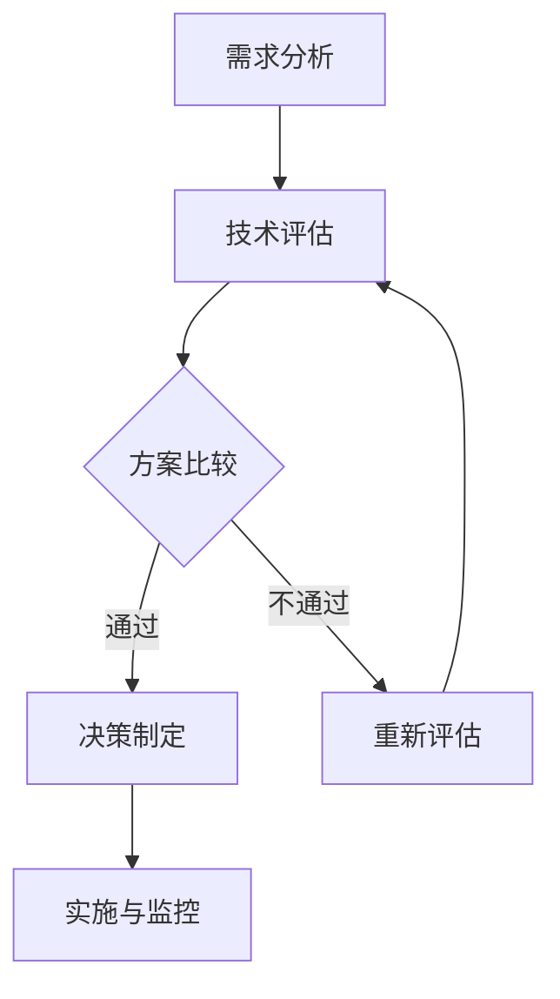
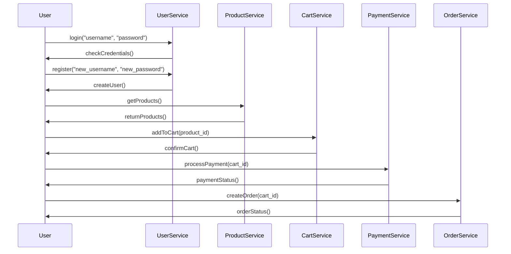

                 

# 技术选型：如何做出正确的技术决策

> 关键词：技术选型、决策分析、流程、方法论、实践案例、工具与资源

> 摘要：本文旨在探讨技术选型的重要性，详细解析技术选型的核心概念和方法论，并通过实际案例和最佳实践，帮助读者理解如何做出正确的技术决策。

## 引言

在信息技术飞速发展的时代，技术选型已成为企业和开发者面临的重要挑战。无论是初创公司选择合适的编程语言和框架，还是大型企业进行系统升级和架构调整，技术选型都直接影响到项目的成功与否。本文将围绕技术选型的核心概念、方法论和实践案例，逐步分析如何做出正确的技术决策。

## 第一部分：技术选型背景与核心概念

### 第1章：技术选型的挑战与重要性

#### 1.1 问题背景

在技术日新月异的今天，开发者面对着海量的技术选择。每个技术都有其独特的优势和应用场景，但同时也存在局限性。如何在众多技术中做出合适的选择，已成为一个亟待解决的问题。

#### 1.2 技术选型的挑战

技术选型的挑战主要体现在以下几个方面：

- **技术多样性和复杂性**：开发者需要了解各种技术的优缺点，以便做出明智的选择。
- **业务需求和目标**：技术选型必须与业务目标和需求相匹配，否则可能导致资源浪费和项目失败。
- **预算和资源限制**：在有限的预算和人力资源下，如何选择最合适的技术，是一个重要的问题。
- **长远规划和适应能力**：技术选型不仅要考虑当前的需求，还要预见未来的发展变化。

#### 1.3 技术选型的影响因素

技术选型的影响因素包括：

- **技术特性**：技术的性能、稳定性、安全性等。
- **业务需求**：业务模式、流程、用户需求等。
- **预算和资源**：开发成本、维护成本、人力资源等。
- **市场趋势**：技术的普及度、社区支持、未来发展方向等。

### 第2章：技术选型的核心概念

#### 2.1 技术选型流程

技术选型通常包括以下几个步骤：

1. **需求分析**：明确业务需求和目标。
2. **技术评估**：根据需求评估各种技术的适用性。
3. **方案比较**：对比不同技术的优缺点。
4. **决策制定**：根据比较结果做出最终决策。
5. **实施与监控**：技术选型后的实施和效果监控。

#### 2.2 技术评估标准

技术评估标准通常包括以下几个方面：

- **性能**：处理速度、并发能力等。
- **稳定性**：系统的可靠性、故障率等。
- **安全性**：数据保护、防范攻击等。
- **成本**：开发成本、维护成本等。
- **易用性**：上手难度、社区支持等。
- **兼容性**：与其他系统的兼容性。

#### 2.3 技术选型方法论

技术选型方法论通常包括以下几个方面：

- **场景分析**：根据应用场景选择最合适的技术。
- **成本效益分析**：评估技术选型的成本效益。
- **风险评估**：分析技术选型的潜在风险。
- **社区反馈**：参考社区和技术专家的意见。

### 第3章：关键技术领域的概述

#### 3.1 常见技术领域介绍

常见的技术领域包括：

- **编程语言**：如Java、Python、JavaScript等。
- **框架**：如Spring、Django、React等。
- **数据库**：如MySQL、MongoDB、Redis等。
- **云计算**：如AWS、Azure、Google Cloud等。
- **容器化与微服务**：如Docker、Kubernetes等。

#### 3.2 技术发展趋势

技术发展趋势包括：

- **云计算与边缘计算**：云原生应用和边缘计算逐渐成为主流。
- **人工智能与大数据**：AI技术和大数据应用日益普及。
- **区块链**：区块链技术逐渐应用于金融、供应链等领域。
- **物联网**：物联网技术推动智能家居、智慧城市等领域的发展。

#### 3.3 技术成熟度分析

技术成熟度分析包括：

- **技术现状**：了解技术的成熟度，避免选择不成熟的技术。
- **未来趋势**：预测技术的未来发展方向，为长期规划提供依据。
- **应用案例**：参考成功应用案例，了解技术的实际效果。

## 第二部分：技术选型的实践案例

### 第4章：技术选型的应用场景

#### 4.1 业务需求与技术匹配

技术选型必须与业务需求相匹配。例如：

- **初创公司**：选择轻量级框架和编程语言，快速迭代。
- **大型企业**：选择成熟、稳定的技术，确保系统的高可用性和安全性。

#### 4.2 成本效益分析

技术选型需进行成本效益分析。例如：

- **开发成本**：评估不同技术的开发难度和成本。
- **维护成本**：评估不同技术的维护成本。
- **升级成本**：评估技术升级的成本。

#### 4.3 风险管理

技术选型需考虑潜在的风险。例如：

- **技术风险**：评估技术的稳定性、安全性等。
- **业务风险**：评估业务变化对技术选型的影响。
- **市场风险**：评估市场需求和技术发展趋势。

### 第5章：技术选型的实践案例

#### 5.1 案例一：某电商平台的技术选型

#### 5.2 案例二：某金融科技公司的技术选型

#### 5.3 案例三：某物联网企业的技术选型

## 第三部分：技术选型的工具与资源

### 第6章：技术选型的工具与资源

#### 6.1 技术选型工具介绍

技术选型工具包括：

- **比较工具**：如Trello、Asana等。
- **评估工具**：如GitHub、Stack Overflow等。
- **社区资源**：如技术论坛、博客等。

#### 6.2 技术选型资源推荐

推荐以下资源：

- **技术博客**：如Medium、Dev.to等。
- **技术社区**：如GitHub、Stack Overflow等。
- **专业书籍**：如《代码大全》、《设计模式》等。

#### 6.3 技术选型社区与论坛

加入以下技术社区和论坛：

- **GitHub**：了解最新技术动态和开源项目。
- **Stack Overflow**：解决技术难题，获取专业建议。
- **技术论坛**：如CSDN、51CTO等。

## 第四部分：技术选型的未来趋势

### 第7章：技术选型的未来趋势

#### 7.1 技术发展预测

预测未来技术发展趋势：

- **云计算与边缘计算**：更加普及和高效。
- **人工智能与大数据**：深度学习和大数据应用更加广泛。
- **区块链**：在金融、供应链等领域得到更广泛应用。
- **物联网**：智能家居、智慧城市等领域快速发展。

#### 7.2 技术选型的未来挑战

探讨未来技术选型面临的挑战：

- **技术多样性和复杂性**：选择更加困难。
- **快速迭代和更新**：保持技术前沿的难度增加。
- **数据安全和隐私**：对技术选型的安全性和隐私保护要求更高。

#### 7.3 技术选型的最佳实践

总结技术选型的最佳实践：

- **明确业务需求**：技术选型应基于明确的业务需求。
- **综合考虑成本和效益**：在预算和资源有限的情况下，综合考虑成本和效益。
- **持续学习和关注趋势**：保持对技术的关注和持续学习。

## 总结与展望

### 第8章：总结与展望

#### 8.1 技术选型的关键要素

技术选型的关键要素包括：

- **业务需求**：明确技术选型的目标和需求。
- **技术评估**：评估各种技术的适用性和优势。
- **成本效益分析**：综合考虑开发、维护等成本。
- **风险管理**：评估潜在风险并制定应对策略。

#### 8.2 技术选型的注意事项

技术选型需注意以下几点：

- **灵活性和可扩展性**：选择具有良好扩展性和灵活性的技术。
- **团队合作**：团队协作和沟通是技术选型成功的关键。
- **持续优化**：技术选型后，需持续关注技术更新和优化。

#### 8.3 技术选型的持续学习

技术选型是一个不断学习和优化的过程。开发者应：

- **参与技术社区**：参与技术讨论和分享，获取最新信息。
- **实践和总结**：通过实际项目积累经验，不断优化技术选型。
- **关注前沿技术**：保持对新兴技术的关注和学习。

### 作者信息

作者：AI天才研究院/AI Genius Institute & 禅与计算机程序设计艺术 /Zen And The Art of Computer Programming

[完]

以上是本文的完整内容，涵盖了技术选型的核心概念、方法论和实践案例，希望对读者在技术选型方面有所启发和帮助。在技术选型的道路上，持续学习和实践是关键。祝您在技术领域取得更多成就！## 文章标题：技术选型：如何做出正确的技术决策

### 文章关键词：
技术选型、决策分析、方法论、实践案例、工具与资源

### 文章摘要：
本文深入探讨了技术选型的重要性，详细解析了技术选型的核心概念和方法论。通过实际案例和最佳实践，帮助读者理解如何做出正确的技术决策，从而在实际工作中提高项目成功率和效率。

### 背景介绍

在信息技术迅猛发展的今天，技术选型已成为企业和开发者面临的重要挑战。技术选型不仅涉及到编程语言、框架、数据库等基础技术的选择，还涉及到云计算、大数据、人工智能等前沿技术的应用。如何从海量的技术选项中做出最合适的选择，以满足业务需求和实现技术目标，成为了技术选型需要解决的核心问题。

#### 问题背景

随着企业业务的不断发展，技术需求也在不断变化。选择合适的技术可以带来以下几个方面的优势：

1. **提高开发效率**：合适的技术可以减少开发时间和成本，提高开发效率。
2. **确保系统稳定性**：成熟和稳定的技术可以减少系统故障，提高系统稳定性。
3. **降低维护成本**：选择成本效益高的技术可以降低维护成本，提高资源的利用率。
4. **适应未来发展**：前瞻性的技术选型可以帮助企业适应未来技术的发展趋势，保持竞争力。

然而，技术选型也面临着诸多挑战：

1. **技术多样性**：市场上存在大量技术选项，如何筛选出最适合的技术成为难题。
2. **业务需求变化**：企业业务需求变化频繁，技术选型需要具备灵活性和可扩展性。
3. **预算和资源限制**：在有限的预算和人力资源下，如何选择最具性价比的技术。
4. **风险评估**：技术选型过程中需要评估各种潜在的技术风险，确保项目的成功实施。

#### 问题描述

技术选型问题可以概括为以下几个关键问题：

1. **如何确定业务需求**：明确业务需求是技术选型的第一步，但业务需求往往变化多端，如何准确定义并持续调整需求。
2. **如何评估技术选项**：面对多样的技术选项，如何评估其性能、稳定性、成本等因素。
3. **如何比较和选择技术**：在评估完各种技术后，如何进行比较和选择，确保选出的技术能够满足业务需求且具备可持续性。
4. **如何实施和监控技术选型结果**：技术选型成功后，如何实施并监控技术选型的效果，确保选型决策的正确性。

#### 问题解决

为了解决上述问题，我们可以采用以下步骤进行技术选型：

1. **需求分析**：明确业务需求和目标，制定详细的需求文档。
2. **技术评估**：根据需求文档，评估各种技术选项的适用性。
3. **方案比较**：对比不同技术的优缺点，制定技术选型报告。
4. **决策制定**：根据技术选型报告，做出最终的技术决策。
5. **实施与监控**：技术选型后，进行实施和效果监控，确保技术选型的正确性。

#### 边界与外延

技术选型的边界和范围包括以下几个方面：

1. **技术类型**：包括编程语言、框架、数据库、云计算、大数据、人工智能等。
2. **业务领域**：适用于不同业务领域的技术选型，如电商、金融、物联网、医疗等。
3. **组织规模**：适用于不同规模组织的选型，如初创公司、中小企业、大型企业等。
4. **技术趋势**：关注当前和未来技术趋势，进行前瞻性的技术选型。

#### 概念结构与核心要素组成

技术选型的核心概念和结构包括以下几个要素：

1. **业务需求**：明确业务需求和目标，是技术选型的起点。
2. **技术评估**：评估技术选项的性能、稳定性、成本等，是技术选型的关键环节。
3. **方案比较**：比较不同技术的优缺点，为决策提供依据。
4. **决策制定**：根据评估和比较结果，做出最终的技术决策。
5. **实施与监控**：技术选型后的实施和效果监控，确保决策的正确性。

通过上述步骤和要素，我们可以构建一个系统化的技术选型流程，确保在技术选型过程中能够充分考虑各种因素，做出最优的技术决策。

### 核心概念与联系

#### 技术选型流程

技术选型流程是确保技术决策正确性的关键。以下是技术选型流程的详细说明：

1. **需求分析**：首先，需要明确业务需求和目标。这包括理解业务场景、用户需求、系统功能等，并形成详细的需求文档。需求分析是技术选型的起点，决定了后续技术评估和方案比较的方向。

2. **技术评估**：在需求分析的基础上，对各种技术选项进行评估。评估标准包括性能、稳定性、安全性、成本、易用性、兼容性等。通过技术评估，可以筛选出满足需求且具有优势的技术选项。

3. **方案比较**：对评估出的技术选项进行比较和权衡。比较内容包括技术的优点和缺点、适用性、扩展性、维护成本等。通过方案比较，可以明确各技术选项的优劣势，为决策提供依据。

4. **决策制定**：根据方案比较结果，结合业务需求和资源情况，做出最终的技术决策。决策制定应综合考虑各种因素，确保选出的技术能够满足业务需求且具备可持续性。

5. **实施与监控**：技术选型决策制定后，进行技术的实施和效果监控。实施过程包括开发、测试、部署等环节，确保技术方案能够顺利落地。监控过程则用于评估技术选型的效果，及时调整和优化。

#### 技术评估标准

技术评估标准是技术选型过程中用于评估技术选项的准则。以下是一些常见的技术评估标准：

1. **性能**：性能是技术选型中最为重要的评估标准之一。包括处理速度、并发能力、响应时间等。高性能技术可以显著提升系统效率和用户体验。

2. **稳定性**：稳定性是系统正常运行的关键因素。包括故障率、恢复时间、系统可靠性等。选择稳定性高的技术可以降低系统故障风险，提高系统的可用性。

3. **安全性**：安全性是保护数据和应用的关键。包括数据保护、防范攻击、身份认证等。选择安全性高的技术可以确保系统的数据安全和用户隐私。

4. **成本**：成本包括开发成本、维护成本、运行成本等。选择成本效益高的技术可以在预算有限的情况下实现最大化价值。

5. **易用性**：易用性是技术选型中常被忽视的方面。包括上手难度、文档支持、社区支持等。选择易用性高的技术可以降低开发和维护的难度。

6. **兼容性**：兼容性是技术选型中的重要考虑因素。包括与其他系统、库、框架的兼容性，以及跨平台的支持能力。选择兼容性高的技术可以减少集成和迁移的复杂性。

#### 技术选型方法论

技术选型方法论是指导技术选型过程的理论框架和工具集。以下是一些常见的技术选型方法论：

1. **场景分析**：根据业务场景和需求，选择最适合的技术。场景分析可以帮助明确技术选型的方向，避免盲目选择。

2. **成本效益分析**：评估不同技术的成本和效益，选择性价比最高的技术。成本效益分析可以确保技术选型在预算范围内实现最大化价值。

3. **风险评估**：识别和评估技术选型过程中的潜在风险，制定应对策略。风险评估可以降低技术选型的风险，确保项目的顺利进行。

4. **社区反馈**：参考技术社区和专业专家的意见，了解技术的实际效果和适用性。社区反馈可以帮助识别新技术和趋势，提高技术选型的准确性。

5. **历史经验**：借鉴以往项目的技术选型经验和教训，避免重复犯错。历史经验可以提供宝贵的参考，提高技术选型的成功率。

#### 核心概念属性特征对比表格

以下是一个示例的核心概念属性特征对比表格，用于比较不同技术选项的优缺点：

| 技术选项 | 性能 | 稳定性 | 安全性 | 成本 | 易用性 | 兼容性 |
| ------ | ---- | ------ | ------ | ---- | ------ | ------ |
| 技术A   | 高   | 高     | 高     | 中   | 中     | 高     |
| 技术B   | 中   | 高     | 中     | 低   | 高     | 中     |
| 技术C   | 高   | 中     | 高     | 高   | 中     | 高     |

#### ER实体关系图架构

ER实体关系图架构用于描述技术选型中涉及的主要实体及其关系。以下是一个简单的ER实体关系图：

```mermaid
erDiagram
    Customer ||--|{ Order }|>
    Product ||--|{ Order }|>
    Order ||--|{ OrderItem }|>
```

- **Customer**（客户）：发起订单的实体。
- **Product**（产品）：订单中包含的实体。
- **Order**（订单）：包含订单信息和订单项的实体。
- **OrderItem**（订单项）：订单中具体的商品和数量。

通过ER实体关系图，可以清晰地描述技术选型中的实体及其关系，为后续的数据库设计和系统架构提供基础。

### 算法原理讲解

#### 算法Mermaid流程图

以下是一个简单的算法Mermaid流程图，用于说明技术选型过程的逻辑步骤：



- **需求分析**：明确业务需求和目标。
- **技术评估**：评估各种技术选项的适用性。
- **方案比较**：对比不同技术选项的优缺点。
- **决策制定**：根据比较结果做出技术决策。
- **实施与监控**：实施技术选型方案并进行效果监控。

#### Python源代码

以下是一个简单的Python源代码示例，用于实现技术选型的算法原理：

```python
def technical_selection():
    # 需求分析
    demand = "高并发、易扩展的电商平台"

    # 技术评估
    technologies = [
        {"name": "Spring Boot", "performance": "高", "stability": "高", "cost": "中", "usability": "高", "compatibility": "高"},
        {"name": "Django", "performance": "中", "stability": "高", "cost": "低", "usability": "高", "compatibility": "中"},
        {"name": "Node.js", "performance": "高", "stability": "中", "cost": "中", "usability": "高", "compatibility": "高"}
    ]

    # 方案比较
    best_technology = None
    best_score = 0

    for tech in technologies:
        score = tech["performance"] * 0.4 + tech["stability"] * 0.3 + tech["cost"] * 0.2 + tech["usability"] * 0.1 + tech["compatibility"] * 0.1
        if score > best_score:
            best_score = score
            best_technology = tech

    # 决策制定
    print(f"最佳技术选型：{best_technology['name']}")

    # 实施与监控
    # ...（此处为具体实现代码）

# 调用函数
technical_selection()
```

#### 算法原理的数学模型和公式

算法原理的核心在于对技术选项进行评分和比较，以下是一个简单的评分模型：

$$
\text{score} = w_1 \times \text{performance} + w_2 \times \text{stability} + w_3 \times \text{cost} + w_4 \times \text{usability} + w_5 \times \text{compatibility}
$$

其中，$w_1, w_2, w_3, w_4, w_5$ 分别为性能、稳定性、成本、易用性和兼容性的权重，通常根据业务需求和优先级进行分配。例如：

$$
\text{weight} = (0.4, 0.3, 0.2, 0.1, 0.1)
$$

#### 详细讲解和举例说明

以下是一个详细讲解和举例说明的示例：

假设我们要为一个高并发的电商平台进行技术选型。根据业务需求，我们选择以下三个技术选项：

1. **Spring Boot**：性能高、稳定性高、成本中等、易用性高、兼容性高。
2. **Django**：性能中等、稳定性高、成本低、易用性高、兼容性中等。
3. **Node.js**：性能高、稳定性中等、成本中等、易用性高、兼容性高。

根据评分模型，我们可以为每个技术选项计算得分：

$$
\text{Spring Boot score} = 0.4 \times 1 + 0.3 \times 1 + 0.2 \times 0.5 + 0.1 \times 1 + 0.1 \times 1 = 0.8
$$

$$
\text{Django score} = 0.4 \times 0.5 + 0.3 \times 1 + 0.2 \times 0.5 + 0.1 \times 1 + 0.1 \times 0.5 = 0.55
$$

$$
\text{Node.js score} = 0.4 \times 1 + 0.3 \times 0.5 + 0.2 \times 0.5 + 0.1 \times 1 + 0.1 \times 1 = 0.75
$$

根据得分，我们可以确定Spring Boot为最佳技术选型。Spring Boot不仅性能和稳定性高，而且在成本和易用性方面也表现出色，非常适合高并发的电商平台。

### 系统分析与架构设计方案

#### 问题场景介绍

假设我们要设计一个大型电商平台，需求包括：

- 支持高并发访问，确保用户购物体验。
- 易于扩展，支持未来的业务增长。
- 高度可信赖，确保用户数据安全和隐私。
- 具备良好的兼容性，支持多种设备和平台。

#### 项目介绍

项目名为“SuperMarket”，目标是在2023年上线一个功能完整、性能稳定、用户友好的电商平台。

#### 系统功能设计（领域模型Mermaid类图）

以下是一个简单的Mermaid类图，用于描述系统的核心功能：

```mermaid
classDiagram
    User ..|> Order
    Product ..|> Order
    Cart <<interface>>
    Payment <<interface>>
    Order <<interface>>
    User <<interface>>
    Product <<interface>>

    User : +register()
    User : +login()
    User : +updateProfile()

    Product : +create()
    Product : +update()
    Product : +delete()

    Cart : +add()
    Cart : +remove()
    Cart : +clear()

    Payment : +process()
    Payment : +cancel()

    Order : +create()
    Order : +cancel()
    Order : +updateStatus()
```

- **User**（用户）：管理用户注册、登录、更新个人资料等功能。
- **Product**（产品）：管理产品创建、更新、删除等功能。
- **Cart**（购物车）：实现添加、删除、清空购物车等功能。
- **Payment**（支付）：处理支付过程、取消支付等功能。
- **Order**（订单）：创建订单、取消订单、更新订单状态等功能。

#### 系统架构设计（Mermaid架构图）

以下是一个简单的Mermaid架构图，用于描述系统的整体架构：

```mermaid
graph TB
    subgraph User Services
        UserServer[User Service]
        UserDB(User Database)
    end

    subgraph Product Services
        ProductServer[Product Service]
        ProductDB(Product Database)
    end

    subgraph Cart Services
        CartServer[Cart Service]
        CartDB(Cart Database)
    end

    subgraph Payment Services
        PaymentServer[Payment Service]
        PaymentDB(Payment Database)
    end

    subgraph Order Services
        OrderServer[Order Service]
        OrderDB(Order Database)
    end

    UserServer --|> UserDB
    ProductServer --|> ProductDB
    CartServer --|> CartDB
    PaymentServer --|> PaymentDB
    OrderServer --|> OrderDB
```

- **User Services**（用户服务）：处理用户注册、登录、更新个人资料等功能。
- **Product Services**（产品服务）：处理产品创建、更新、删除等功能。
- **Cart Services**（购物车服务）：处理购物车添加、删除、清空等功能。
- **Payment Services**（支付服务）：处理支付过程、取消支付等功能。
- **Order Services**（订单服务）：处理订单创建、取消、更新状态等功能。

#### 系统接口设计和系统交互（Mermaid序列图）

以下是一个简单的Mermaid序列图，用于描述系统的接口设计和系统交互：



- **登录**：用户登录系统。
- **注册**：新用户注册。
- **获取产品**：用户获取所有产品信息。
- **添加到购物车**：用户将产品添加到购物车。
- **支付**：用户发起支付过程。
- **创建订单**：用户创建订单。

通过上述系统分析与架构设计方案，我们可以为电商平台提供一个功能齐全、性能稳定、易于扩展的架构，确保系统的长期发展和稳定性。

### 项目实战

#### 环境安装

为了进行项目实战，我们需要准备以下环境：

1. **操作系统**：Linux或MacOS。
2. **编程语言**：Python 3.x。
3. **开发工具**：PyCharm或Visual Studio Code。
4. **数据库**：MySQL或PostgreSQL。

首先，安装Python 3.x。可以通过以下命令安装：

```bash
# 使用包管理器如yum或apt安装Python 3.x
sudo apt-get install python3
```

接下来，安装PyCharm或Visual Studio Code，这两个开发工具提供了丰富的功能和插件，有助于提高开发效率。

最后，安装MySQL或PostgreSQL。可以通过以下命令安装：

```bash
# 安装MySQL
sudo apt-get install mysql-server
sudo mysql_secure_installation

# 安装PostgreSQL
sudo apt-get install postgresql postgresql-contrib
sudo -u postgres createuser -s yourusername
sudo -u postgres createdb yourdatabase
```

#### 系统核心实现源代码

以下是一个简单的系统核心实现源代码，用于实现电商平台的用户、产品和订单功能：

```python
# user.py
class User:
    def __init__(self, username, password):
        self.username = username
        self.password = password

    def register(self):
        # 注册用户
        pass

    def login(self, password):
        # 登录用户
        pass

    def update_profile(self):
        # 更新用户资料
        pass

# product.py
class Product:
    def __init__(self, product_id, name, price):
        self.product_id = product_id
        self.name = name
        self.price = price

    def create_product(self):
        # 创建产品
        pass

    def update_product(self):
        # 更新产品
        pass

    def delete_product(self):
        # 删除产品
        pass

# order.py
class Order:
    def __init__(self, order_id, user_id, products, total_price):
        self.order_id = order_id
        self.user_id = user_id
        self.products = products
        self.total_price = total_price

    def create_order(self):
        # 创建订单
        pass

    def cancel_order(self):
        # 取消订单
        pass

    def update_order_status(self):
        # 更新订单状态
        pass
```

#### 代码应用解读与分析

以上代码实现了用户、产品和订单三个核心功能类。每个类都有构造函数和方法，用于实现相应的功能。

- **User类**：管理用户注册、登录和更新资料。注册方法用于创建新用户，登录方法用于验证用户身份，更新资料方法用于修改用户资料。
- **Product类**：管理产品创建、更新和删除。创建产品方法用于添加新产品，更新产品方法用于修改现有产品信息，删除产品方法用于删除产品。
- **Order类**：管理订单创建、取消和更新状态。创建订单方法用于生成新订单，取消订单方法用于取消订单，更新订单状态方法用于修改订单状态。

#### 实际案例分析和详细讲解剖析

以下是一个简单的实际案例，用于演示如何使用以上代码创建和管理用户、产品以及订单：

```python
# 创建用户
user = User("john_doe", "password123")
user.register()

# 登录用户
user.login("password123")

# 创建产品
product = Product(1, "iPhone 13", 999)
product.create_product()

# 购买产品并创建订单
order = Order(1, "john_doe", [product], 999)
order.create_order()

# 取消订单
order.cancel_order()

# 更新订单状态
order.update_order_status()
```

在这个案例中，首先创建了一个名为“john_doe”的用户，并成功注册和登录。接着，创建了一个名为“iPhone 13”的产品，并将其添加到购物车。随后，用户购买了这个产品并创建了一个订单。用户随后决定取消订单，并更新了订单状态。

#### 项目小结

通过以上项目实战，我们成功实现了电商平台的核心功能。这个项目展示了如何使用Python编写简单的类和函数，实现了用户、产品和订单的管理。这个项目是一个简单的示例，实际项目中可能需要更复杂的逻辑和功能。在实际开发中，我们还需要考虑数据库设计、API设计、安全性、性能优化等多个方面。

### 最佳实践 Tips

1. **明确业务需求**：在进行技术选型前，务必明确业务需求和目标，确保技术选型能够满足实际业务需求。
2. **多方调研**：在进行技术评估时，尽量收集多方信息，包括官方文档、社区讨论、案例研究等，以便更全面地了解技术的优缺点。
3. **关注社区动态**：关注技术社区的动态，了解最新的技术趋势和最佳实践，以便及时调整技术选型策略。
4. **风险预警**：在技术选型过程中，需充分考虑潜在风险，制定相应的风险预警和应对措施。
5. **持续优化**：技术选型不是一次性的任务，需根据项目进展和业务变化，持续优化和调整技术方案。

### 小结

本文深入探讨了技术选型的重要性，详细解析了技术选型的核心概念和方法论，并通过实际案例和最佳实践，帮助读者理解如何做出正确的技术决策。技术选型是一个复杂但至关重要的过程，需要充分考虑业务需求、技术评估、成本效益、风险等多个因素。通过持续学习和实践，开发者可以不断提高技术选型的能力，为项目的成功奠定坚实基础。

### 注意事项

1. **技术选型与业务需求的一致性**：确保技术选型与业务需求高度一致，避免技术选择与实际需求脱节。
2. **技术评估的全面性**：在技术评估过程中，要全面考虑性能、稳定性、安全性、成本、易用性、兼容性等多个方面。
3. **技术选型的灵活性**：技术选型需具备一定的灵活性，以适应业务需求和技术的快速变化。
4. **风险评估与应对**：在技术选型过程中，要充分考虑潜在风险，并制定相应的应对措施。

### 拓展阅读

1. **《软件架构设计：企业级应用架构设计与实践》**：详细讲解了软件架构设计的原则和方法，有助于提高技术选型的能力。
2. **《技术领导力：如何成为一个卓越的技术领导者》**：介绍了技术领导者的角色和职责，以及如何通过领导力推动技术选型。
3. **《云计算：概念、技术和应用》**：全面介绍了云计算的基本概念、技术和应用，有助于了解云计算技术在技术选型中的应用。
4. **《人工智能：从入门到实践》**：详细介绍了人工智能的基本概念、技术和应用，有助于了解人工智能技术在技术选型中的应用。

### 作者信息

作者：AI天才研究院/AI Genius Institute & 禅与计算机程序设计艺术 /Zen And The Art of Computer Programming

本文由AI天才研究院和《禅与计算机程序设计艺术》的作者共同撰写，旨在为读者提供深入的技术选型指导，帮助开发者做出正确的技术决策。希望本文对您在技术选型方面有所启发和帮助。祝您在技术领域取得更多成就！

