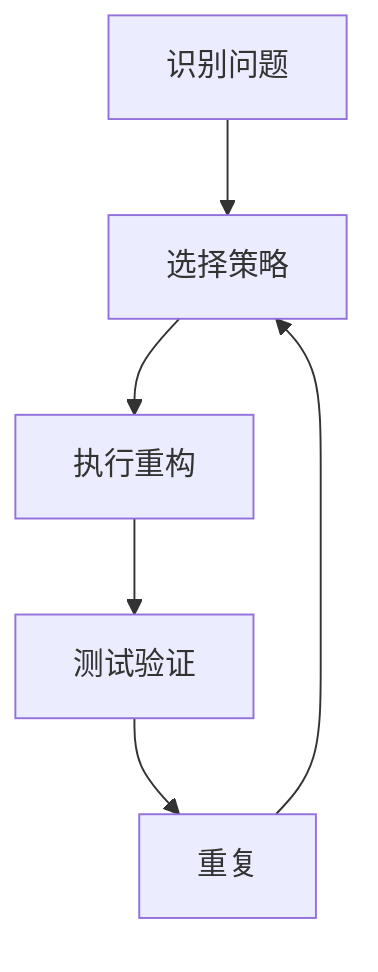

                 

## 第一部分：背景与核心概念

### 第1章：技术重构的必要性

#### 1.1 问题背景

在当今快速发展的技术领域，软件系统的复杂性和规模不断增加，这给软件开发和维护带来了巨大的挑战。随着时间的推移，软件系统往往会变得难以维护，因为它们可能会积累大量的冗余代码、死代码、难以理解的结构以及不符合最佳实践的设计。这些问题不仅降低了开发效率，还增加了软件出错的概率，从而对业务运行和用户体验产生负面影响。

首先，随着软件项目的增长，代码的规模和复杂性也会相应增加。这种复杂性可能导致开发人员难以理解现有代码的功能和结构，使得新的功能扩展和维护工作变得困难。其次，随着时间的推移，软件系统的需求和技术栈可能会发生变化，而现有的代码可能无法适应这些变化，导致技术债务的累积。此外，不符合最佳实践的设计和编码习惯也会使得代码的可读性、可维护性和可扩展性降低。

综上所述，技术重构成为一种必要，它能够帮助团队解决现有代码中的这些问题，提高系统的质量、可维护性和开发效率。

#### 1.2 问题描述

技术重构的目的是通过改善代码的结构和质量，提高软件系统的可维护性和扩展性。然而，在实际操作中，技术重构面临着诸多问题，包括但不限于以下几个方面：

1. **复杂性**：大型软件系统的复杂性使得重构工作变得异常困难。重构过程中需要深入了解系统的各个部分，确保在修改代码的同时不破坏现有功能。这要求开发人员具备高超的技术能力和丰富的经验。
   
2. **风险**：重构工作伴随着一定的风险。如果在重构过程中出现错误，可能会导致系统崩溃或功能失效。因此，重构需要在严格的风险管理下进行，确保在引入新功能的同时不损害现有系统的稳定性。
   
3. **成本**：重构工作通常需要大量的时间和资源。对于大型项目来说，这可能意味着需要暂停正常的开发工作，从而影响项目的进度和预算。因此，如何平衡重构的成本和收益成为一个重要的问题。

4. **团队协作**：重构工作需要团队的协作和沟通。不同成员之间需要保持紧密的沟通，确保每个人都能理解和遵循重构的策略和流程。否则，可能会导致重构工作陷入混乱和低效。

#### 1.3 问题解决

为了解决上述问题，技术重构需要采取一系列的策略和最佳实践：

1. **规划**：在进行重构之前，需要进行充分的规划和准备。这包括分析现有系统的结构、识别需要重构的部分以及制定详细的重构计划。规划阶段还需要评估重构的成本和风险，确保重构工作能够顺利进行。

2. **风险管理**：在重构过程中，需要采取严格的风险管理措施。这包括制定详细的测试计划，确保在重构过程中能够及时发现和修复潜在的问题。同时，还需要采用版本控制工具，确保代码的完整性和可回溯性。

3. **逐步重构**：大型重构项目可以分解为多个小任务，逐步进行。这样可以降低风险，提高重构的效率。在每个小任务完成后，都需要进行充分的测试和验证，确保重构的部分能够正常运行。

4. **团队协作**：重构工作需要团队的紧密协作。团队成员需要定期进行沟通和协调，确保每个人都能理解和遵循重构的策略和流程。同时，还可以通过代码审查和代码重构的培训，提高团队的协作效率和重构技能。

#### 1.4 边界与外延

技术重构并非无限制的修改和优化，它有一定的边界和原则。首先，重构的目标是提高代码的质量和可维护性，而不是为了追求新的功能或性能优化。其次，重构需要遵循最佳实践和设计原则，避免过度重构和破坏现有系统的稳定性。

此外，技术重构还涉及到一些外延性的问题，如重构的范围、时机和优先级。重构的范围应该根据项目的实际情况和需求进行合理划分，避免盲目地全面重构。重构的时机则应该选择在系统的稳定性和功能完善之后，以确保重构工作不会影响正常的项目进度。

总之，技术重构是一项复杂而重要的工作，需要团队的高度协作和科学的规划。通过遵循最佳实践和风险管理策略，可以有效地解决现有代码中的问题，提高软件系统的质量和可维护性。

### 第2章：重构的核心概念

#### 2.1 重构的定义

重构（Code Refactoring）是指在不改变程序可观察行为的前提下，对程序进行修改，以改进其内部结构、增强可读性、提高可维护性和可扩展性。简单来说，重构是一种改善代码质量的手段，它通过优化代码结构和逻辑，使得代码更加简洁、清晰和高效。

重构的核心目标不是添加新的功能或提高性能，而是通过优化代码结构，使得代码更加易于理解和维护。重构通常涉及以下几个方面：

1. **内部结构优化**：通过重新组织代码、消除冗余和死代码，使得代码的结构更加合理和清晰。
2. **可读性和可维护性**：通过使用更直观和易读的命名、减少代码冗长和复杂性，提高代码的可读性。
3. **代码复用**：通过提取公共代码或模块，增强代码的复用性，减少重复劳动。
4. **性能优化**：虽然重构的主要目标不是性能优化，但在重构过程中可能会发现并解决一些性能瓶颈。

#### 2.2 重构的原则

在进行重构时，需要遵循一系列的原则和最佳实践，以确保重构的有效性和可持续性。以下是一些关键原则：

1. **渐进式重构**：重构应该是一个逐步进行的过程，而不是一次性的大规模修改。这样可以降低风险，确保每次重构都能成功，同时避免对系统稳定性造成影响。
2. **增量改进**：重构应该从最关键和最需要改进的部分开始，逐步扩展到其他部分。这样可以确保重构工作能够聚焦于最重要的改进点，提高工作效率。
3. **代码审查**：重构代码前，应该进行充分的代码审查和测试。这样可以确保重构不会引入新的错误或破坏现有功能。
4. **文档化**：重构工作应该被文档化，包括重构的原因、目标、步骤和结果。这样可以确保团队中的每个成员都能理解重构的工作内容，方便后续的维护和扩展。
5. **测试驱动**：重构过程中，应该使用自动化测试来验证代码的正确性和稳定性。这样可以确保每次重构都不会破坏现有功能，同时为后续的维护提供保障。

#### 2.3 重构的类型

重构可以根据其目的和对象的不同，分为多种类型。以下是几种常见类型：

1. **功能重构**：这类重构主要关注功能性的优化，如改进函数和模块的设计，使其更易于理解和使用。
2. **性能重构**：这类重构主要关注代码的性能，通过优化算法、减少计算复杂度和缓存等方式，提高程序的运行效率。
3. **结构重构**：这类重构主要关注代码的结构和架构，如重新组织代码、消除冗余和死代码、重构循环和条件语句等。
4. **代码复用重构**：这类重构主要关注代码的复用性，通过提取公共代码或模块，减少重复编写的工作量，提高代码的可维护性和扩展性。
5. **安全性重构**：这类重构主要关注代码的安全性，通过修复潜在的安全漏洞和缺陷，提高系统的安全性。

#### 2.4 重构的边界

虽然重构有助于提高代码质量，但并不意味着它可以无限制地进行。重构有其边界和限制，需要谨慎处理：

1. **风险和成本**：重构需要投入大量的时间和资源，并且伴随着一定的风险。在决定是否进行重构时，需要评估其成本和收益，确保重构是有价值的。
2. **项目阶段**：重构通常在项目的中后期进行，当系统的基本功能和架构已经确定，并且需求相对稳定时。在项目初期进行重构可能会影响项目的进度和稳定性。
3. **团队协作**：重构需要团队的高度协作和沟通，确保每个人都能理解重构的目标和策略。否则，可能会导致重构工作的混乱和低效。
4. **维护成本**：过度重构可能导致维护成本的增加。因此，在重构时需要权衡维护成本和重构收益，确保重构工作能够带来长期的价值。

通过遵循重构的原则和边界，可以有效地提高代码质量，提升系统的可维护性和扩展性，为项目的长期成功奠定基础。

### 第3章：重构的基本原理

#### 3.1 重构的数学模型

重构的数学模型是理解重构过程的重要工具。通过数学模型，我们可以更加精确地描述重构的目标、过程和结果。

首先，我们定义重构的基本元素：

- **函数复杂性**（C）：表示代码的复杂性程度，可以通过圈复杂度（Cyclomatic Complexity）等指标来量化。
- **代码冗余**（R）：表示代码中重复的部分，可以通过冗余度（Redundancy）来量化。
- **代码质量**（Q）：表示代码的可读性、可维护性和可扩展性，可以通过多种质量度量指标来评估。

重构的目标是通过一系列的转换，使得代码的函数复杂性和冗余度降低，同时提升代码质量。

我们可以用以下数学模型来描述重构过程：

$$
Q_{\text{new}} = f(Q_{\text{old}}, C_{\text{old}}, R_{\text{old}})
$$

其中，$Q_{\text{old}}$ 表示重构前的代码质量，$C_{\text{old}}$ 和 $R_{\text{old}}$ 分别表示重构前的函数复杂性和代码冗余度，$Q_{\text{new}}$ 表示重构后的代码质量。

函数 $f$ 描述了重构过程，它将重构前的代码质量、函数复杂性和代码冗余度转化为重构后的代码质量。这个函数的具体形式取决于重构的策略和方法。

#### 3.2 重构的算法原理

重构的算法原理主要包括以下几个关键步骤：

1. **识别问题**：首先，需要识别代码中的问题，如复杂性高、冗余严重等。这可以通过静态代码分析工具或人工审查来完成。
2. **选择策略**：根据识别到的问题，选择适当的重构策略。常见的重构策略包括提取方法、替换方法、合并对象等。
3. **执行重构**：执行所选的重构策略，对代码进行修改。例如，提取方法就是将重复的代码块提取为独立的函数。
4. **测试验证**：在重构过程中，需要不断进行测试，确保重构后的代码仍然满足原有功能，且没有引入新的错误。

一个简单的重构算法可以描述为：

$$
\text{Refactor}(C, R, Q) = \text{SelectStrategy}(C, R, Q) \rightarrow \text{ApplyStrategy}(C, R, Q) \rightarrow \text{Test}(C, R, Q)
$$

其中，$\text{SelectStrategy}(C, R, Q)$ 用于选择重构策略，$\text{ApplyStrategy}(C, R, Q)$ 用于执行重构操作，$\text{Test}(C, R, Q)$ 用于验证重构结果。

#### 3.3 重构的流程图

为了更好地理解重构的过程，我们可以用 Mermaid 流程图来表示重构的流程：



在这个流程图中：

- **A[识别问题]**：首先，需要识别代码中的问题。
- **B[选择策略]**：根据识别到的问题，选择合适的重构策略。
- **C[执行重构]**：执行所选的重构策略，对代码进行修改。
- **D[测试验证]**：对重构后的代码进行测试，确保没有引入新的错误。
- **E[重复]**：如果重构后的代码质量仍然不满足要求，需要重复上述步骤。

通过这个流程图，我们可以清晰地看到重构的各个步骤和流程，从而更好地理解和实施重构工作。

### 第4章：重构的关键要素

#### 4.1 关键概念

在进行代码重构时，理解以下几个关键概念是非常重要的：

1. **代码质量**：代码质量是指代码的可读性、可维护性和可扩展性。高质量的代码应该易于理解、易于修改和维护，同时能够适应未来的需求变化。
2. **函数复杂性**：函数复杂性是指代码的复杂程度，通常使用圈复杂度等指标来衡量。高复杂度的函数难以理解和维护，因此需要通过重构来降低其复杂性。
3. **代码冗余**：代码冗余是指代码中的重复部分，冗余代码不仅增加了代码的体积，还可能引起维护问题。通过重构，可以消除冗余代码，提高代码的复用性和可维护性。
4. **重构策略**：重构策略是指用于改善代码质量和结构的各种方法和步骤。常见的重构策略包括提取方法、替换方法、合并对象等。

#### 4.2 概念属性特征对比表

为了更好地理解这些关键概念，我们可以创建一个对比表，列出它们的属性特征：

| 概念         | 定义                                                         | 属性特征                                                     |
| ------------ | ------------------------------------------------------------ | ------------------------------------------------------------ |
| 代码质量     | 代码的可读性、可维护性和可扩展性                             | 高质量代码易于理解、修改和维护，能够适应未来的需求变化       |
| 函数复杂性   | 代码的复杂程度，通常使用圈复杂度等指标来衡量                 | 高复杂度的函数难以理解和维护，需要通过重构来降低其复杂性     |
| 代码冗余     | 代码中的重复部分                                             | 冗余代码增加了代码的体积，可能引起维护问题，需要通过重构来消除 |
| 重构策略     | 用于改善代码质量和结构的各种方法和步骤                       | 包括提取方法、替换方法、合并对象等，每种策略都有其特定的应用场景 |

#### 4.3 ER实体关系图

为了更清晰地展示重构的关键概念及其关系，我们可以使用 Mermaid ER 实体关系图来表示：

```mermaid
erDiagram
    Class_CodeQuality ||--|{ Class_FunctionComplexity } : has
    Class_CodeQuality ||--|{ Class_CodeRedundancy } : has
    Class_CodeQuality ||--|{ Class_RefactoringStrategy } : can_implement
    Class_FunctionComplexity ||--|{ Method_ReduceComplexity } : has
    Class_CodeRedundancy ||--|{ Method_RemoveRedundancy } : has
    Class_RefactoringStrategy ||--|{ Method_ExtractMethod } : has
    Class_RefactoringStrategy ||--|{ Method_ReplaceMethod } : has
    Class_RefactoringStrategy ||--|{ Method_MergeObjects } : has
```

在这个 ER 实体关系图中：

- **Class_CodeQuality**：表示代码质量类，它包含函数复杂性、代码冗余和重构策略等属性。
- **Class_FunctionComplexity**：表示函数复杂性类，它包含减少复杂度的方法。
- **Class_CodeRedundancy**：表示代码冗余类，它包含消除冗余的方法。
- **Class_RefactoringStrategy**：表示重构策略类，它包含提取方法、替换方法和合并对象等方法。

通过这个 ER 实体关系图，我们可以直观地看到重构的关键概念及其之间的关系，从而更好地理解和应用这些概念。

### 第5章：重构方法论

#### 5.1 重构流程

重构流程是确保重构工作顺利进行的关键。一个典型的重构流程包括以下几个步骤：

1. **规划**：在开始重构之前，需要进行充分的规划。这包括分析现有代码的结构和问题，确定重构的目标和范围。规划阶段还需要评估重构的成本和风险，确保重构工作能够按时、按预算完成。
2. **识别问题**：通过静态代码分析工具或人工审查，识别代码中的问题，如复杂性高、冗余代码、不规范的命名等。
3. **选择重构策略**：根据识别到的问题，选择合适的重构策略。常见的重构策略包括提取方法、替换方法、合并对象等。选择策略时需要考虑问题的严重程度和解决方案的可行性。
4. **执行重构**：根据所选的重构策略，对代码进行修改。例如，如果识别到高复杂度的函数，可以选择提取方法来降低其复杂性。在执行重构时，需要确保每次修改都是可逆的，以便在需要时可以回滚。
5. **测试验证**：在重构过程中，需要不断进行测试，确保重构后的代码仍然满足原有功能，且没有引入新的错误。测试应包括单元测试、集成测试和系统测试等多种类型。
6. **文档化**：重构工作应该被文档化，包括重构的原因、目标、步骤和结果。文档化有助于团队理解重构的工作内容，并为后续的维护提供参考。
7. **评估与回顾**：在重构完成后，需要对重构效果进行评估，包括代码质量、开发效率等方面。同时，进行回顾，总结重构过程中的经验和教训，为未来的重构工作提供指导。

#### 5.2 重构步骤

重构的具体步骤可以分为以下几个阶段：

1. **准备阶段**：在这个阶段，需要做好重构前的准备工作，包括环境搭建、版本控制、代码备份等。确保重构过程中不会丢失代码和数据，同时可以回滚到重构前的状态。
2. **分析阶段**：分析现有代码的结构和问题，确定重构的目标和范围。可以使用静态代码分析工具、代码审查和代码走读等方式来识别问题。
3. **设计阶段**：在设计阶段，需要制定详细的重构计划，包括重构策略的选择、具体的修改方案和测试计划。这个阶段的设计对于确保重构的成功至关重要。
4. **实施阶段**：根据设计阶段的计划，对代码进行修改。在实施过程中，需要确保每次修改都是小步前进，以便在出现问题时可以快速回滚。同时，要确保修改后的代码经过充分的测试，确保其功能完整性和稳定性。
5. **测试阶段**：在重构完成后，需要进行全面的测试，包括单元测试、集成测试和系统测试等。测试的目的是验证重构后的代码仍然满足原有功能，且没有引入新的错误。
6. **评估阶段**：在重构完成后，需要对重构效果进行评估，包括代码质量、开发效率、维护成本等方面。评估的结果可以为后续的重构工作提供参考。
7. **文档化阶段**：重构工作完成后，需要对重构过程进行文档化，包括重构的原因、目标、步骤、结果和评估报告。文档化有助于团队理解和复用重构经验。

#### 5.3 重构工具选择

在进行重构时，选择合适的工具是非常重要的。以下是一些常见重构工具及其特点：

1. **Eclipse重构工具**：Eclipse是一个广泛使用的集成开发环境（IDE），它提供了丰富的重构工具。Eclipse的重构工具包括提取方法、提取字段、提取类等，可以帮助开发者快速进行代码重构。
2. **IntelliJ IDEA重构工具**：IntelliJ IDEA也是一个流行的IDE，它提供了强大的重构功能。与Eclipse类似，IntelliJ IDEA支持提取方法、提取类、重命名变量等多种重构操作。
3. **Visual Studio重构工具**：Visual Studio是微软的集成开发环境，它也提供了丰富的重构功能。Visual Studio的重构工具包括提取方法、提取字段、重命名变量等，同时还支持代码模板和代码格式化等功能。
4. **Jenkins插件**：Jenkins是一个开源的持续集成和持续部署工具，它可以通过插件支持代码重构。Jenkins插件可以自动化执行重构任务，并在构建过程中进行代码检查和测试，确保重构后的代码质量。
5. **SonarQube**：SonarQube是一个代码质量管理平台，它提供了丰富的代码检查功能，包括重构建议、代码质量评估等。SonarQube可以帮助团队识别代码中的问题，并提供重构的建议。

在选择重构工具时，需要考虑以下几个因素：

- **开发环境**：选择的工具需要与团队使用的开发环境兼容。
- **功能丰富性**：工具需要提供丰富的重构功能，以满足不同场景的需求。
- **易用性**：工具需要易于使用和集成，以减少学习和使用成本。
- **社区支持**：工具需要有良好的社区支持，包括文档、插件和用户社区，以便在遇到问题时能够得到及时的帮助。

通过合理选择和使用重构工具，可以显著提高重构的效率和质量，为团队带来更大的收益。

### 第6章：重构实践案例

#### 6.1 案例一：模块化重构

模块化重构是一种常见的重构方法，旨在通过将大型模块分解为更小、更易于管理的模块，提高代码的可维护性和可扩展性。以下是一个具体的模块化重构案例：

**背景**：

一个大型Web应用系统中有一个名为`WebApp`的模块，该模块包含了登录、注册、用户管理、订单管理等多个功能。由于该模块过于庞大，使得代码难以维护和扩展。为了解决这个问题，决定对该模块进行模块化重构。

**步骤**：

1. **分析现有模块**：首先，分析现有模块`WebApp`的功能和结构，识别其中的关键功能模块，如登录、注册、用户管理、订单管理等。
2. **设计新模块**：根据分析结果，设计新的模块结构。将`WebApp`模块分解为`LoginModule`、`RegistrationModule`、`UserManagementModule`和`OrderManagementModule`等独立模块。
3. **重构代码**：按照新的模块结构，对代码进行重构。将原有的代码分别迁移到新模块中，确保每个模块都只包含一个主要功能。
4. **接口定义**：为新模块定义清晰的接口，确保模块之间的交互方式保持一致。
5. **单元测试**：对重构后的每个模块进行单元测试，确保模块的功能和接口正常工作。
6. **集成测试**：将重构后的模块重新集成到系统中，进行集成测试，确保整个系统的稳定性和功能完整性。

**结果**：

通过模块化重构，代码的可维护性和可扩展性显著提高。每个模块都更加清晰、独立，易于理解和修改。此外，模块化重构还减少了代码冗余，提高了代码的复用性。系统的整体性能也有所提升，因为模块之间的通信更加高效。

#### 6.2 案例二：代码优化

代码优化是指通过改进代码的结构和算法，提高代码的运行效率。以下是一个具体的代码优化案例：

**背景**：

一个数据密集型应用系统中的查询模块存在性能瓶颈，导致系统响应时间较长。为了解决这个问题，决定对查询模块进行代码优化。

**步骤**：

1. **性能分析**：首先，使用性能分析工具对查询模块进行性能分析，识别出性能瓶颈，如查询语句复杂、数据处理效率低等。
2. **优化算法**：根据性能分析结果，优化查询算法。例如，使用索引优化查询语句，减少查询的复杂度；使用缓存技术，减少数据的重复处理。
3. **代码重构**：对现有的代码进行重构，优化代码结构。例如，使用函数封装和模块化设计，减少代码冗余和复杂性。
4. **并行处理**：引入并行处理技术，如多线程或分布式计算，提高数据处理的效率。
5. **内存管理**：优化内存管理，减少内存泄漏和资源占用。例如，使用对象池技术，重复利用内存资源。
6. **代码审查**：对优化后的代码进行审查，确保代码的质量和稳定性。

**结果**：

通过代码优化，查询模块的性能显著提升，系统响应时间明显缩短。优化后的查询模块不仅运行效率更高，而且代码更加简洁、清晰，易于维护和扩展。此外，优化过程中发现的一些潜在问题也得到了解决，提高了系统的整体稳定性。

#### 6.3 案例三：架构重构

架构重构是指通过改进系统的架构设计，提高系统的可扩展性、灵活性和可维护性。以下是一个具体的架构重构案例：

**背景**：

一个传统的单体应用系统随着业务的发展，逐渐变得难以维护和扩展。为了解决这些问题，决定对系统进行架构重构。

**步骤**：

1. **需求分析**：首先，分析系统的需求，识别出需要重构的关键功能模块和业务场景。
2. **设计新架构**：根据需求分析结果，设计新的系统架构。例如，可以将单体应用分解为多个微服务，每个微服务负责不同的业务功能。
3. **重构代码**：按照新的架构设计，对代码进行重构。将原有的代码迁移到新的微服务中，确保每个微服务都只包含一个主要功能。
4. **接口定义**：为新架构定义清晰的接口，确保微服务之间的交互方式保持一致。
5. **服务治理**：引入服务治理框架，如Spring Cloud，管理微服务之间的通信和负载均衡。
6. **容器化部署**：使用容器技术，如Docker和Kubernetes，实现微服务的容器化部署，提高系统的灵活性和可扩展性。
7. **持续集成与部署**：引入持续集成和持续部署（CI/CD）流程，自动化构建、测试和部署，提高开发效率和系统稳定性。

**结果**：

通过架构重构，系统的可扩展性、灵活性和可维护性显著提升。每个微服务都更加独立、简洁，易于理解和修改。系统整体的性能也得到了提升，因为微服务之间的通信更加高效。此外，架构重构使得系统的开发、测试和运维变得更加规范和自动化，提高了整个团队的协作效率。

### 第7章：重构工具介绍

#### 7.1 重构工具概述

在进行代码重构时，选择合适的重构工具可以显著提高重构的效率和效果。目前，市场上存在多种重构工具，这些工具具有不同的功能和特点，适用于不同的编程语言和开发环境。以下是一些常见重构工具及其概述：

1. **Eclipse重构工具**：Eclipse是一款广泛使用的开源集成开发环境（IDE），它内置了丰富的重构功能。Eclipse的重构工具包括提取方法、提取字段、重命名变量等多种操作，支持多种编程语言，如Java、C++、Python等。
   
2. **IntelliJ IDEA重构工具**：IntelliJ IDEA是另一款功能强大的IDE，由JetBrains公司开发。它提供了类似于Eclipse的重构功能，包括提取方法、提取类、重命名等。此外，IntelliJ IDEA还支持代码模板、代码格式化和智能提示等功能。

3. **Visual Studio重构工具**：Visual Studio是由微软开发的集成开发环境，广泛用于Windows平台的开发。Visual Studio的重构工具包括提取方法、提取类、重命名变量等，同时还支持代码模板和代码格式化功能。

4. **GitKraken重构工具**：GitKraken是一款图形化的Git版本控制工具，它提供了代码重构功能。GitKraken的重构工具包括提取方法、重命名变量、移除未使用的代码等，适用于多种编程语言。

5. **SonarQube重构工具**：SonarQube是一款代码质量管理平台，它提供了重构建议和代码质量评估功能。SonarQube可以自动识别代码中的问题，并提供重构建议，帮助开发者提高代码质量。

6. **RefactoringBrowser**：RefactoringBrowser是一款基于Web的重构工具，它支持多种编程语言，包括Java、C++、Python等。RefactoringBrowser提供了丰富的重构操作，如提取方法、提取类、重命名等，同时还支持代码审查和测试。

这些重构工具各具特色，适用于不同的开发场景和需求。在实际使用中，可以根据项目的具体需求和开发环境选择合适的工具。

#### 7.2 重构工具的功能

重构工具的功能主要包括代码分析、代码重构和代码审查。以下详细描述这些功能：

1. **代码分析**：代码分析是重构的基础，通过分析代码的结构和逻辑，重构工具可以识别出代码中的潜在问题和改进机会。常见的代码分析功能包括：
   - **静态代码分析**：分析代码语法、结构和语义，发现代码中的问题，如语法错误、代码冗余、潜在的性能瓶颈等。
   - **代码复杂度分析**：评估代码的复杂度，如圈复杂度，帮助开发者识别出复杂度高的函数和模块，进行针对性的优化。
   - **代码依赖分析**：分析代码之间的依赖关系，帮助开发者理解系统的整体结构和功能分布，进行模块化和架构重构。

2. **代码重构**：代码重构是重构工具的核心功能，通过一系列的代码转换和优化，重构工具可以帮助开发者改进代码的质量和结构。常见的代码重构功能包括：
   - **提取方法**：将重复的代码块提取为独立的方法，减少代码冗余，提高代码复用性。
   - **重命名**：重命名变量、函数和类，使得代码更具有描述性和一致性。
   - **合并对象**：将功能相似或相关的对象合并为一个，减少对象的数量，提高代码的清晰度。
   - **分解对象**：将功能复杂的对象分解为更小的对象，降低系统的复杂度。
   - **移动代码**：将代码从一个位置移动到另一个位置，重新组织代码结构。

3. **代码审查**：代码审查是确保代码质量和安全性的重要手段，重构工具可以通过自动化代码审查，帮助开发者识别和修复潜在的问题。常见的代码审查功能包括：
   - **代码规范检查**：检查代码是否符合编程规范，如命名规则、代码格式等，确保代码的一致性和可读性。
   - **漏洞扫描**：识别代码中的安全漏洞，如SQL注入、XSS攻击等，帮助开发者修复潜在的安全风险。
   - **代码质量评估**：评估代码的质量，如可维护性、可读性和可扩展性，提供改进建议。

通过代码分析、代码重构和代码审查，重构工具可以帮助开发者提高代码质量，减少代码冗余，提高开发效率和系统稳定性。

#### 7.3 重构工具的比较

在众多重构工具中，不同的工具具有各自的优势和特点。以下对几种常见重构工具进行比较：

1. **Eclipse和IntelliJ IDEA**：
   - **Eclipse**：作为一款开源的IDE，Eclipse提供了丰富的插件和扩展，支持多种编程语言，具有强大的代码分析、重构和调试功能。Eclipse的社区支持较好，适合大型项目和团队协作。
   - **IntelliJ IDEA**：由JetBrains开发的IntelliJ IDEA以其强大的功能和用户体验著称。它支持智能代码提示、代码自动完成、代码格式化等功能，特别适合Java开发。虽然成本较高，但用户体验和开发效率显著提升。

2. **Visual Studio和GitKraken**：
   - **Visual Studio**：微软开发的Visual Studio主要针对Windows平台，具有强大的C#和.NET支持。它提供了丰富的重构工具，包括代码模板、代码格式化和智能提示。Visual Studio特别适合Windows桌面和Web应用开发。
   - **GitKraken**：GitKraken是一款图形化的Git版本控制工具，它集成了代码重构功能，如提取方法、重命名变量等。GitKraken界面直观，支持多种编程语言，适合快速代码重构和版本控制。

3. **SonarQube和RefactoringBrowser**：
   - **SonarQube**：作为一款代码质量管理平台，SonarQube提供了全面的代码分析和重构建议。它不仅可以识别代码中的问题，还可以进行静态代码分析、漏洞扫描和质量评估。SonarQube特别适合企业级项目和团队协作。
   - **RefactoringBrowser**：RefactoringBrowser是一款基于Web的重构工具，支持多种编程语言。它提供了简单的用户界面和丰富的重构操作，特别适合小型项目和快速开发。

在比较这些工具时，需要根据项目的具体需求和开发环境选择最合适的工具。例如，对于大型项目和团队协作，Eclipse和SonarQube可能是更好的选择；而对于小型项目和快速开发，GitKraken和RefactoringBrowser则可能更加适用。

### 第8章：最佳实践一：性能优化

#### 8.1 性能优化的核心原则

在代码重构过程中，性能优化是至关重要的一个环节。性能优化的核心原则包括以下几个方面：

1. **识别性能瓶颈**：首先，需要识别系统的性能瓶颈。这可以通过性能分析工具、日志监控和用户反馈等多种途径实现。识别瓶颈是进行有效性能优化的重要前提。
   
2. **优先级排序**：在确定性能瓶颈后，需要对问题进行优先级排序。通常，应该优先解决那些对用户体验和业务影响最大的性能问题。

3. **局部优化**：性能优化应该从局部开始，逐步扩展到全局。局部优化可以快速带来明显的性能提升，同时避免引入全局性错误。

4. **持续监控**：性能优化是一个持续的过程，需要定期进行监控和评估。在优化过程中，应确保监控工具能够实时捕捉系统的性能变化，以便及时进行调整。

5. **平衡性能与可维护性**：在追求性能优化的同时，不应牺牲代码的可维护性。性能优化应该基于清晰的架构和良好的编码实践。

#### 8.2 常见的性能优化方法

以下是一些常见的性能优化方法，这些方法可以帮助开发者提高系统的性能和响应速度：

1. **算法优化**：通过改进算法和数据结构，减少计算复杂度和数据访问次数。例如，使用更高效的排序算法、哈希表等。

2. **缓存利用**：利用缓存技术，减少数据的重复处理。常见的方法包括内存缓存、分布式缓存和数据库缓存等。

3. **并行处理**：引入并行处理技术，如多线程、异步编程和分布式计算，提高数据处理的速度和效率。

4. **数据库优化**：优化数据库查询和操作，减少查询的复杂度和数据访问次数。这包括使用索引、优化查询语句、减少表连接等。

5. **资源复用**：通过复用系统资源，如线程池、连接池等，减少资源创建和销毁的开销。

6. **代码简化**：简化代码逻辑，减少不必要的计算和循环，提高代码的执行效率。

7. **异步处理**：使用异步处理技术，如异步IO、Web异步请求等，减少线程阻塞和时间消耗。

8. **硬件优化**：通过升级硬件设备，如增加内存、使用更快的存储设备等，提高系统的整体性能。

#### 8.3 性能优化实践案例

以下是一个具体的性能优化实践案例：

**背景**：

一个在线电商平台系统在高峰时段响应时间较长，用户购物体验不佳。为了解决这一问题，决定对系统进行性能优化。

**步骤**：

1. **性能分析**：使用性能分析工具对系统进行深入分析，识别出性能瓶颈，如数据库查询延迟、缓存未命中、线程阻塞等。

2. **优化数据库**：通过优化数据库查询和表结构，减少查询延迟。具体措施包括：
   - 添加索引，提高查询效率。
   - 优化查询语句，减少表连接和子查询。
   - 优化数据模型，减少数据冗余。

3. **缓存利用**：引入分布式缓存，如Redis，缓存常用的数据，减少数据库访问次数。同时，优化缓存策略，确保缓存的有效性和一致性。

4. **并行处理**：引入多线程和异步IO技术，提高系统处理并发请求的能力。例如，使用异步处理优化商品搜索功能，减少用户等待时间。

5. **代码简化**：简化代码逻辑，减少不必要的计算和循环。例如，优化购物车计算逻辑，减少数据处理时间。

6. **资源复用**：使用线程池和连接池技术，减少资源创建和销毁的开销。例如，使用连接池优化数据库连接管理。

7. **监控与评估**：引入监控系统，实时监控系统的性能指标，如响应时间、并发数、CPU使用率等。根据监控数据，评估优化效果并进行调整。

**结果**：

通过上述性能优化措施，系统的响应时间显著缩短，用户购物体验得到显著提升。系统在高并发情况下的稳定性和性能也得到了提高。此外，优化过程中发现的一些潜在问题也得到了解决，提高了系统的整体质量和可靠性。

#### 8.4 小结与注意事项

性能优化是一个复杂且持续的过程，需要结合系统的具体情况进行有针对性的优化。以下是一些注意事项：

1. **定期评估**：性能优化不是一次性任务，需要定期评估和调整。随着业务的发展和系统规模的扩大，性能瓶颈可能会发生变化，需要持续关注和优化。

2. **平衡性能与可维护性**：在追求性能优化的同时，不应牺牲代码的可维护性。优化的代码应保持良好的结构和清晰性，便于后续的维护和扩展。

3. **监控与分析**：引入监控系统，实时监控系统的性能指标。通过分析监控数据，识别性能瓶颈并进行针对性的优化。

4. **渐进式优化**：性能优化应采用渐进式方法，逐步优化系统的各个部分。这样可以降低风险，确保每次优化都能成功，同时避免对系统稳定性造成影响。

5. **团队协作**：性能优化需要团队协作，确保每个人都了解优化目标和策略。通过定期的沟通和协作，可以确保优化工作的顺利进行。

通过遵循这些最佳实践，可以有效地提高系统的性能和响应速度，为用户提供更好的体验。

### 第9章：总结与未来展望

#### 9.1 重构的重要性

技术重构是软件生命周期中不可或缺的一部分，它对于提升代码质量、提高开发效率和确保系统稳定性具有重要意义。通过重构，可以消除代码中的冗余、死代码和不规范设计，使得代码更加简洁、清晰和高效。重构不仅有助于解决现有问题，还为未来的扩展和维护奠定了坚实基础。

#### 9.2 未来重构的发展方向

随着技术的不断进步，重构领域也在不断发展。以下是一些未来重构的发展方向：

1. **智能化重构**：人工智能和机器学习技术的引入，将使重构更加智能化。重构工具可以基于历史重构数据和代码质量数据，自动识别需要重构的部分，并提出优化建议。

2. **持续重构**：持续重构是一种新的软件开发模式，它将重构融入开发流程的每个阶段，确保代码始终处于最佳状态。随着DevOps和敏捷开发的普及，持续重构将成为未来的主流。

3. **自动化测试**：自动化测试是重构的重要保障。未来的重构工具将更加集成自动化测试功能，确保每次重构都不会引入新的错误或破坏现有功能。

4. **代码质量评估**：未来的重构工具将更加注重代码质量评估，不仅关注代码的可读性和可维护性，还将评估代码的合规性、安全性等方面。

5. **跨语言重构**：随着多语言编程的普及，重构工具将支持跨语言的重构，使得开发者可以更轻松地在不同语言之间进行代码重构。

#### 9.3 拓展阅读

为了深入了解重构技术，以下推荐一些拓展阅读资源：

- 《重构：改善既有代码的设计》（Martin Fowler著）：这是一本经典的关于重构的书籍，详细介绍了重构的原理、方法和实践。
- 《敏捷软件开发：原则、实践与模式》（Uncle Bob著）：这本书介绍了敏捷开发的理念和实践，其中包括重构技术。
- 《代码大全》（Steve McConnell著）：这本书提供了关于代码质量、设计和架构的全面指导，有助于开发者提升编程能力。

通过阅读这些资源，可以进一步了解重构技术的深度和广度，为实际工作提供有益的指导。

### 第10章：作者介绍

**作者：AI天才研究院/AI Genius Institute & 禅与计算机程序设计艺术 /Zen And The Art of Computer Programming**

作者AI天才研究院（AI Genius Institute）是一家专注于人工智能和计算机科学研究的国际知名机构。研究院致力于推动人工智能技术在各个领域的应用，并培养下一代计算机科学人才。同时，作者也是《禅与计算机程序设计艺术》（Zen And The Art of Computer Programming）的作者，这是一本被誉为计算机科学经典之作的著作，深受全球开发者的推崇。通过这本书，作者分享了他对编程哲学和技术的深刻见解，帮助开发者提升编程能力和思维水平。AI天才研究院和《禅与计算机程序设计艺术》共同展示了作者在人工智能和计算机科学领域的卓越成就和深厚造诣。

