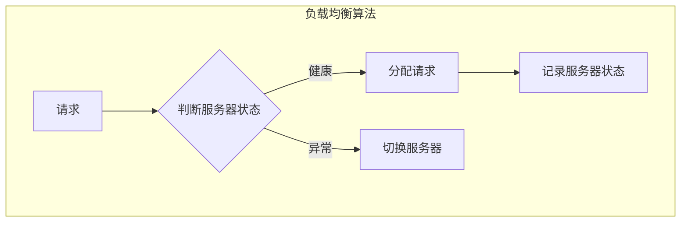
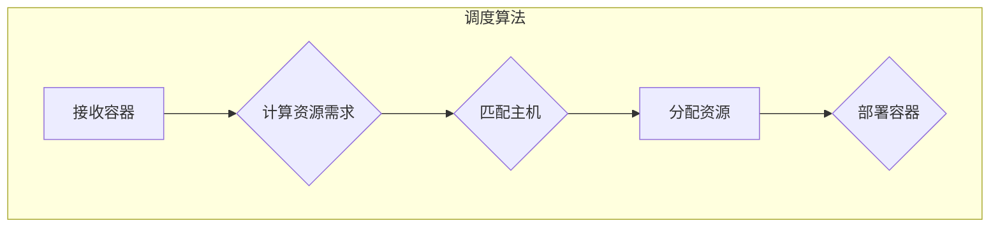
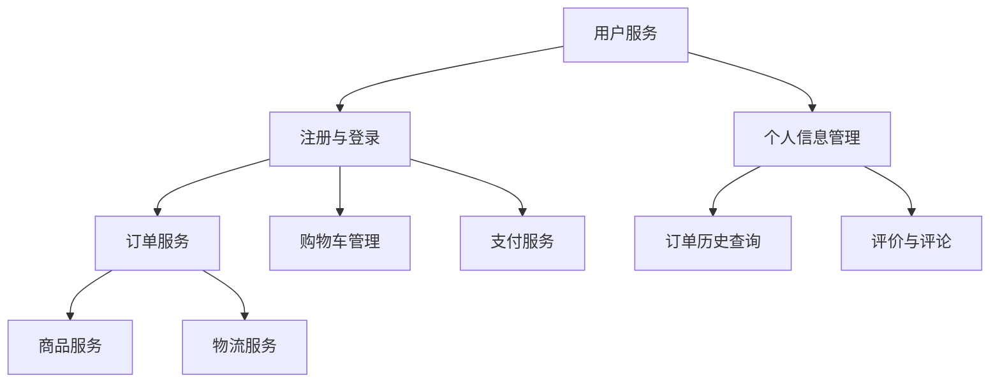
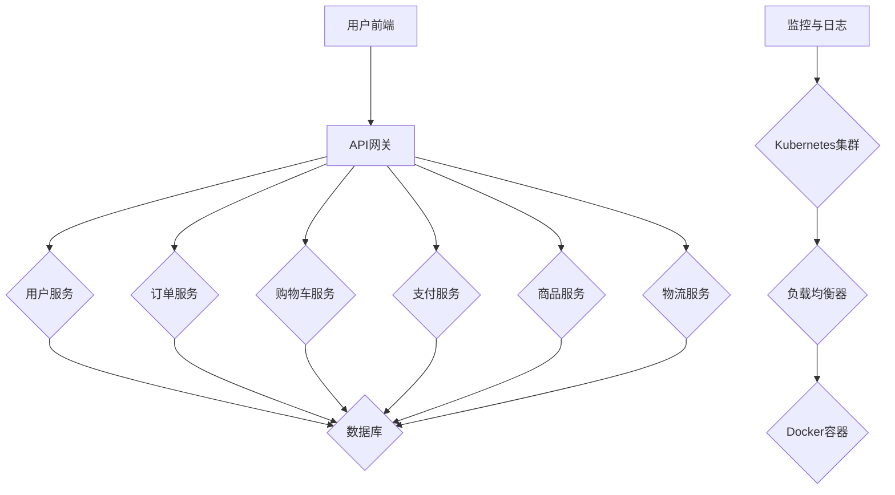
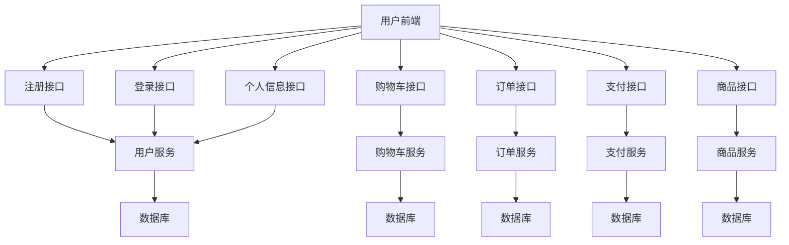
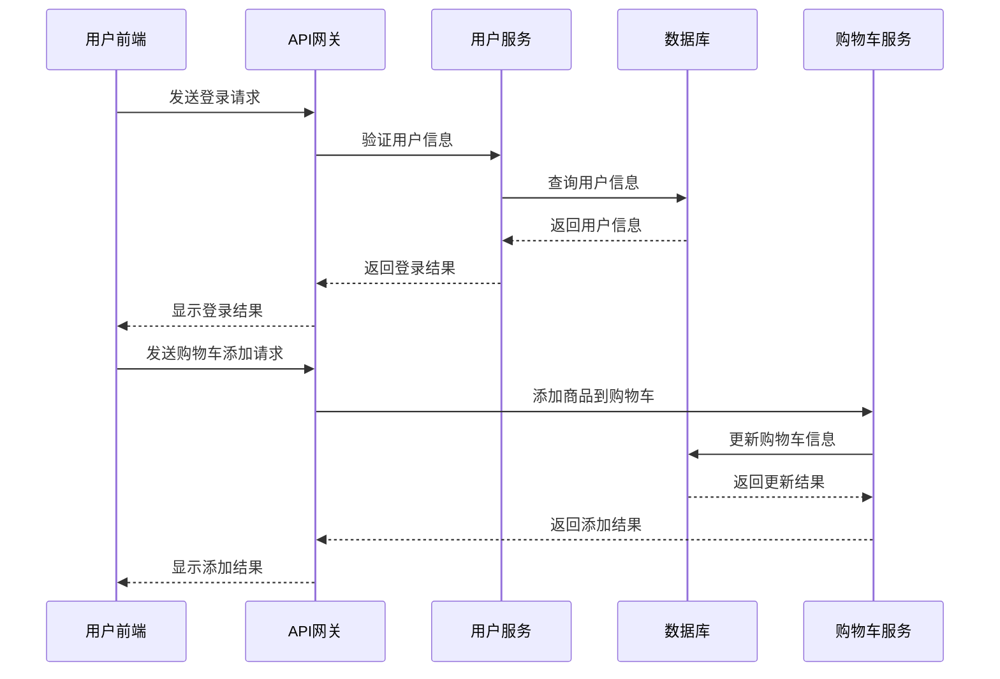

                 

### 文章标题

### 技术重构：遗留系统的现代化之路

#### 关键词：技术重构、遗留系统、现代化、系统架构、算法原理

#### 摘要：

本文旨在探讨遗留系统在现代技术环境下的重构之路，通过深入分析技术重构的核心概念、原理和方法，提供一套系统的现代化解决方案。文章将分步骤讲解如何识别遗留系统的问题、选择合适的技术手段进行重构，并详细剖析技术重构中的关键算法原理和系统架构设计方案。通过实际项目实战和案例分析，本文将帮助读者掌握技术重构的最佳实践，为遗留系统的现代化升级提供指导。

---

## 目录大纲

### 第一部分：背景与概念

### 第1章 技术重构与遗留系统现代化

### 第2章 核心技术概念与联系

### 第3章 核心技术算法原理

### 第二部分：系统分析与架构设计

### 第4章 系统分析与架构设计

### 第三部分：项目实战

### 第5章 项目实战与案例分析

### 第四部分：最佳实践与总结

### 第6章 最佳实践与注意事项

### 第7章 小结与展望

### 第五部分：附录与参考文献

### 第8章 附录

### 第9章 参考文献

---

### 第一部分：背景与概念

#### 第1章 技术重构与遗留系统现代化

#### 1.1 问题背景

在当今快速发展的技术环境中，遗留系统（Legacy System）成为企业数字化转型的一大障碍。遗留系统通常指的是那些使用过时技术、难以维护和扩展的旧系统。随着时间的推移，这些系统面临性能下降、安全性不足、无法支持新业务需求等问题。因此，如何进行技术重构，实现遗留系统的现代化，成为企业和IT团队亟待解决的关键问题。

#### 1.2 问题描述

遗留系统存在的问题主要包括：

1. **性能下降**：随着业务量的增长，遗留系统可能无法满足新的性能需求。
2. **维护成本高昂**：遗留系统往往依赖于稀缺的、过时的技术和技能，导致维护成本居高不下。
3. **扩展性不足**：遗留系统难以适应新的业务需求，扩展性差。
4. **技术债务**：长期积累的技术债务使得系统复杂度增加，维护难度加大。

#### 1.3 问题解决

为了解决遗留系统面临的问题，企业通常需要采取技术重构（Technical Refactoring）的方法。技术重构的目标是：

1. **提高性能**：通过优化系统架构和代码，提升系统的响应速度和处理能力。
2. **降低维护成本**：采用现代技术和工具，简化系统维护流程。
3. **提升扩展性**：重构系统架构，使其能够更好地适应未来的业务需求。
4. **减少技术债务**：逐步重构旧代码，消除技术债务。

#### 1.4 边界与外延

技术重构的范围可以包括：

1. **系统架构的重构**：如从单体架构迁移到微服务架构。
2. **代码的重构**：优化代码结构，消除冗余和死代码。
3. **数据库的重构**：如采用新的数据库技术，提升数据存储和查询效率。
4. **技术栈的升级**：替换过时的技术栈，采用更先进的技术框架和工具。

#### 1.5 概念结构与核心要素组成

技术重构涉及多个核心概念和要素，包括：

1. **微服务架构**：一种基于服务划分的分布式系统架构。
2. **容器化与容器编排**：如Docker和Kubernetes等技术的应用。
3. **云原生技术**：利用云计算资源，实现系统的弹性扩展和自动化管理。
4. **DevOps文化**：促进开发与运维的协同，加快系统交付速度。
5. **持续集成与持续部署（CI/CD）**：自动化测试和部署流程，提高开发效率。

通过以上内容，我们为后续章节的深入探讨奠定了基础。接下来，我们将详细分析技术重构中的核心概念和联系，帮助读者更好地理解这一过程。

---

## 第1章 技术重构与遗留系统现代化

### 1.1 问题背景

在当今快速发展的技术环境中，遗留系统（Legacy System）成为企业数字化转型的一大障碍。遗留系统通常指的是那些使用过时技术、难以维护和扩展的旧系统。随着时间的推移，这些系统面临性能下降、安全性不足、无法支持新业务需求等问题。因此，如何进行技术重构，实现遗留系统的现代化，成为企业和IT团队亟待解决的关键问题。

#### 遗留系统的定义与特征

遗留系统通常具有以下特征：

1. **过时的技术栈**：使用早已淘汰的技术和框架，如ASP.NET 1.1、Java EE 5等。
2. **复杂的系统架构**：系统架构设计不合理，如单体架构，导致扩展性和维护性差。
3. **高度耦合**：各个模块之间高度耦合，难以独立开发和部署。
4. **缺乏文档和自动化测试**：系统文档不全，缺乏自动化测试，使得维护难度大。
5. **性能瓶颈**：随着业务量的增长，遗留系统可能无法满足新的性能需求。

#### 遗留系统在技术发展中的挑战

随着技术的不断进步，遗留系统面临以下挑战：

1. **性能瓶颈**：随着业务量的增加，遗留系统的性能可能无法满足新需求。
2. **安全漏洞**：老旧的系统可能存在安全漏洞，难以抵御新的安全威胁。
3. **扩展性不足**：遗留系统难以适应新的业务需求，扩展性差。
4. **维护成本高昂**：遗留系统通常依赖于稀缺的、过时的技术和技能，导致维护成本居高不下。
5. **技术债务**：长期积累的技术债务使得系统复杂度增加，维护难度加大。

#### 技术重构的必要性

为了应对遗留系统面临的挑战，企业需要采取技术重构的方法。技术重构的必要性主要体现在以下几个方面：

1. **提高性能**：通过优化系统架构和代码，提升系统的响应速度和处理能力。
2. **降低维护成本**：采用现代技术和工具，简化系统维护流程。
3. **提升扩展性**：重构系统架构，使其能够更好地适应未来的业务需求。
4. **减少技术债务**：逐步重构旧代码，消除技术债务，降低系统复杂度。

### 1.2 问题描述

遗留系统面临的问题主要包括以下几个方面：

1. **性能下降**：随着业务量的增长，遗留系统可能无法满足新的性能需求，导致用户体验差。
2. **维护成本高昂**：遗留系统通常依赖于稀缺的、过时的技术和技能，导致维护成本居高不下，增加了企业的运营负担。
3. **扩展性不足**：遗留系统难以适应新的业务需求，扩展性差，使得企业难以快速响应市场变化。
4. **技术债务**：长期积累的技术债务使得系统复杂度增加，维护难度加大，进一步加剧了系统的脆弱性。

#### 性能下降

随着业务量的增长，遗留系统可能无法满足新的性能需求，导致以下问题：

1. **响应时间延长**：系统处理请求的时间变长，影响用户体验。
2. **并发处理能力不足**：系统在处理大量并发请求时可能出现性能瓶颈。
3. **数据处理延迟**：数据处理延迟增加，影响业务的实时性。

#### 维护成本高昂

遗留系统通常面临以下挑战，导致维护成本高昂：

1. **技术栈过时**：遗留系统使用的开发语言、框架和库可能已不再支持，需要投入大量资源进行升级。
2. **技能缺失**：由于技术栈过时，企业可能难以找到具备相关技能的维护人员。
3. **代码复杂性**：遗留系统的代码结构复杂，难以维护和调试。

#### 扩展性不足

遗留系统通常难以适应新的业务需求，导致以下问题：

1. **功能扩展困难**：遗留系统设计不合理，难以添加新的功能。
2. **性能瓶颈**：在扩展新功能时，可能引发性能瓶颈，影响系统稳定性。
3. **资源浪费**：遗留系统可能占用大量服务器资源，导致新功能的部署和运行成本增加。

#### 技术债务

长期积累的技术债务导致以下问题：

1. **代码质量差**：遗留系统中的代码质量普遍较差，导致维护难度增加。
2. **系统复杂性**：技术债务使得系统复杂度增加，进一步加剧了维护难度。
3. **开发效率降低**：技术债务使得开发人员难以快速理解和修改代码，降低开发效率。

### 1.3 问题解决

为了解决遗留系统面临的问题，企业需要采取以下措施：

#### 现代化之路的定义

现代化之路指的是通过引入新的技术手段和理念，对遗留系统进行重构和升级，使其具备以下特点：

1. **高性能**：优化系统架构和代码，提升系统的响应速度和处理能力。
2. **高可扩展性**：重构系统架构，使其能够更好地适应未来的业务需求。
3. **低维护成本**：采用现代技术和工具，简化系统维护流程，降低维护成本。
4. **安全可靠**：采用新的安全技术和方法，提升系统的安全性。

#### 重构的目标与原则

重构的目标主要包括以下几个方面：

1. **提高性能**：通过优化系统架构和代码，提升系统的响应速度和处理能力。
2. **提升扩展性**：重构系统架构，使其能够更好地适应未来的业务需求。
3. **降低维护成本**：采用现代技术和工具，简化系统维护流程，降低维护成本。
4. **提高安全性**：采用新的安全技术和方法，提升系统的安全性。

重构的原则包括：

1. **逐步重构**：避免一次性大规模重构，以免造成系统崩溃。
2. **增量式重构**：逐步替换和优化旧代码，避免影响系统的稳定性。
3. **代码质量**：重构过程中注重代码质量，消除冗余代码，提高代码可读性。
4. **自动化测试**：引入自动化测试，确保重构后的系统稳定可靠。

### 1.4 边界与外延

#### 技术重构的范围

技术重构的范围可以包括以下几个方面：

1. **系统架构重构**：如从单体架构迁移到微服务架构。
2. **代码重构**：优化代码结构，消除冗余和死代码。
3. **数据库重构**：采用新的数据库技术，提升数据存储和查询效率。
4. **技术栈升级**：替换过时的技术栈，采用更先进的技术框架和工具。

#### 现代化技术的种类

现代化技术包括以下几种：

1. **微服务架构**：一种基于服务划分的分布式系统架构。
2. **容器化与容器编排**：如Docker和Kubernetes等技术的应用。
3. **云原生技术**：利用云计算资源，实现系统的弹性扩展和自动化管理。
4. **DevOps文化**：促进开发与运维的协同，加快系统交付速度。
5. **持续集成与持续部署（CI/CD）**：自动化测试和部署流程，提高开发效率。

#### 概念结构与核心要素组成

技术重构涉及多个核心概念和要素，包括：

1. **微服务架构**：一种基于服务划分的分布式系统架构。
2. **容器化与容器编排**：如Docker和Kubernetes等技术的应用。
3. **云原生技术**：利用云计算资源，实现系统的弹性扩展和自动化管理。
4. **DevOps文化**：促进开发与运维的协同，加快系统交付速度。
5. **持续集成与持续部署（CI/CD）**：自动化测试和部署流程，提高开发效率。

通过以上内容，我们为后续章节的深入探讨奠定了基础。接下来，我们将详细分析技术重构中的核心概念和联系，帮助读者更好地理解这一过程。

---

### 1.5 概念结构与核心要素组成

技术重构涉及多个核心概念和要素，以下是对这些概念和要素的详细解析。

#### 1.5.1 微服务架构

微服务架构（Microservices Architecture）是一种基于服务划分的分布式系统架构。与传统的单体架构（Monolithic Architecture）相比，微服务架构具有以下特点：

1. **独立性**：每个服务都是独立的，可以独立开发、测试和部署。
2. **松耦合**：服务之间通过轻量级的通信机制（如HTTP/REST API、消息队列）进行通信，降低服务之间的依赖。
3. **可扩展性**：可以单独扩展或缩减某个服务的实例数量，提高系统的弹性。
4. **技术多样性**：不同的服务可以使用不同的编程语言、数据库和框架，提高了技术选型的灵活性。

微服务架构的核心要素包括：

- **服务定义**：明确每个服务的功能范围和职责。
- **服务通信**：使用轻量级通信机制进行服务之间的交互。
- **服务注册与发现**：服务注册中心用于服务实例的注册和发现。
- **配置管理**：集中管理各个服务的配置信息，确保配置的一致性。
- **服务监控与日志**：实时监控服务的运行状态，收集和分析日志信息。

#### 1.5.2 容器化与容器编排

容器化（Containerization）是将应用程序及其依赖打包到一个可移植的容器中，以便在不同的环境中运行。容器化技术的核心是Docker，它提供了将应用程序封装为容器的工具。

1. **容器**：容器是一个轻量级的、可移植的、自给自足的运行时环境，包含了应用程序及其依赖。
2. **容器编排**：容器编排（Container Orchestration）是管理和自动化容器的生命周期，包括部署、扩展和负载均衡。Kubernetes（K8s）是当前最流行的容器编排工具。

容器化的核心要素包括：

- **Docker容器**：用于封装应用程序及其依赖。
- **容器镜像**：容器运行时的静态文件，包含了应用程序的运行环境。
- **容器网络**：管理容器之间的网络通信。
- **容器存储**：管理容器的持久化数据存储。

#### 1.5.3 云原生技术

云原生技术（Cloud Native Technology）是一种利用云计算资源，实现系统的弹性扩展和自动化管理的技术。云原生应用具有以下特点：

1. **微服务架构**：使用微服务架构，提高系统的可扩展性和灵活性。
2. **容器化**：使用容器化技术，实现应用程序的可移植性和高效运行。
3. **自动化**：采用自动化工具和平台，实现自动部署、扩展和监控。
4. **DevOps文化**：促进开发与运维的协同，加快系统交付速度。

云原生技术的核心要素包括：

- **容器化平台**：如Docker和Kubernetes。
- **服务网格**：如Istio，用于管理和监控服务之间的通信。
- **持续集成与持续部署（CI/CD）**：自动化测试和部署流程。
- **自动化运维**：如自动化部署、扩展和监控。

#### 1.5.4 DevOps文化

DevOps文化是一种促进开发与运维协同合作的文化和理念。DevOps的核心理念包括：

1. **持续集成与持续部署（CI/CD）**：自动化测试和部署流程，提高开发效率和系统稳定性。
2. **基础设施即代码（Infrastructure as Code, IaC）**：将基础设施配置和管理代码化，实现自动化部署和管理。
3. **监控与反馈**：实时监控系统的运行状态，快速识别和解决问题。
4. **协作与沟通**：促进开发与运维团队的协作，加快系统交付速度。

DevOps文化的核心要素包括：

- **持续集成与持续部署（CI/CD）**：自动化测试和部署流程。
- **基础设施即代码（IaC）**：自动化基础设施配置和管理。
- **监控与反馈**：实时监控系统的运行状态。
- **协作与沟通**：促进开发与运维团队的协作。

#### 1.5.5 持续集成与持续部署（CI/CD）

持续集成与持续部署（Continuous Integration/Continuous Deployment, CI/CD）是一种自动化软件开发流程，旨在提高开发效率和系统稳定性。CI/CD的核心流程包括：

1. **持续集成（CI）**：将代码集成到主分支，自动化执行测试，确保代码质量。
2. **持续部署（CD）**：根据测试结果，自动化部署代码到生产环境。

CI/CD的核心要素包括：

- **自动化测试**：自动化执行各种测试，确保代码质量。
- **构建工具**：如Jenkins、GitLab CI等，用于自动化构建和测试。
- **部署工具**：如Docker、Kubernetes等，用于自动化部署。
- **配置管理**：管理应用程序的配置信息。

通过以上内容，我们对技术重构中的核心概念和要素进行了详细解析。在后续章节中，我们将进一步探讨核心技术算法原理，帮助读者深入理解技术重构的内在机制和实现方法。

---

### 第2章 核心技术概念与联系

#### 2.1 核心概念

在技术重构过程中，几个核心概念起着至关重要的作用。这些概念包括微服务架构、容器化与容器编排、云原生技术等。下面将详细解释这些概念及其重要性。

#### 微服务架构

微服务架构（Microservices Architecture）是一种设计方法论，旨在将复杂的应用程序分解为多个独立的服务，每个服务负责实现特定的业务功能。这种架构风格具有以下几个关键特点：

1. **独立性**：每个服务都是独立的，可以独立部署、扩展和升级，减少了服务之间的依赖性。
2. **松耦合**：服务之间通过轻量级通信机制（如HTTP/REST API、消息队列）进行通信，降低了服务之间的耦合度。
3. **高可扩展性**：可以单独扩展或缩减某个服务的实例数量，提高了系统的弹性。
4. **技术多样性**：不同的服务可以使用不同的编程语言、框架和数据库，提高了技术的灵活性。

微服务架构对于技术重构的重要性体现在以下几个方面：

1. **改善系统的可维护性**：由于服务之间独立部署，维护和更新某个服务不会影响其他服务的运行，从而提高了系统的可维护性。
2. **提高系统的可扩展性**：微服务架构使得系统可以灵活地扩展和缩减，以满足不断变化的业务需求。
3. **加速开发速度**：开发团队可以独立开发和部署各自负责的服务，加快了开发速度。

#### 容器化与容器编排

容器化（Containerization）是将应用程序及其依赖打包到一个容器中，确保其可以在不同的环境中一致运行。Docker 是最流行的容器化技术，它通过创建和管理容器镜像来实现应用程序的容器化。容器编排（Container Orchestration）则是指管理和自动化容器的生命周期，包括部署、扩展和监控。Kubernetes（简称K8s）是当前最流行的容器编排工具。

容器化和容器编排对于技术重构的重要性体现在以下几个方面：

1. **提高系统的可移植性**：容器化确保了应用程序及其依赖在不同环境中的一致性，使得系统可以在不同的云平台和本地环境中轻松部署。
2. **提高系统的弹性**：容器编排工具如Kubernetes可以自动管理和扩展容器，提高了系统的弹性。
3. **简化运维流程**：容器化和容器编排简化了系统的部署、扩展和监控，降低了运维的复杂性。

#### 云原生技术

云原生技术（Cloud Native Technology）是一种利用云计算资源，实现系统的弹性扩展和自动化管理的技术。云原生应用通常具有以下几个关键特点：

1. **基于微服务架构**：使用微服务架构，提高系统的可扩展性和灵活性。
2. **容器化**：使用容器化技术，实现应用程序的可移植性和高效运行。
3. **自动化**：采用自动化工具和平台，实现自动部署、扩展和监控。
4. **DevOps文化**：促进开发与运维的协同，加快系统交付速度。

云原生技术对于技术重构的重要性体现在以下几个方面：

1. **提高系统的可扩展性**：云原生技术支持弹性扩展，可以根据业务需求自动调整资源。
2. **提高系统的稳定性**：云原生应用通常采用自动化运维和监控，能够快速识别和解决问题。
3. **加快开发速度**：云原生技术促进了开发与运维的协同，加快了系统交付速度。

#### 2.2 概念属性特征对比表格

为了更清晰地展示微服务架构、容器化与容器编排、云原生技术这三个核心概念之间的联系和区别，我们可以制作一个对比表格。

| 特性 | 微服务架构 | 容器化与容器编排 | 云原生技术 |
| --- | --- | --- | --- |
| 设计目标 | 分解复杂应用程序 | 确保应用程序的可移植性 | 实现自动化和弹性 |
| 独立部署 | 是 | 否 | 是 |
| 轻量级通信 | 是 | 是 | 是 |
| 高可扩展性 | 是 | 是 | 是 |
| 技术多样性 | 是 | 否 | 是 |
| 自动化 | 是 | 是 | 是 |
| 弹性扩展 | 是 | 是 | 是 |
| 稳定性 | 是 | 是 | 是 |

#### 2.3 ER实体关系图架构

在技术重构过程中，理解系统的实体关系对于设计新架构至关重要。ER（Entity-Relationship）实体关系图是描述系统中不同实体及其关系的图形表示。以下是一个简化的ER实体关系图，用于展示技术重构中的一些关键实体和关系。

```mermaid
erDiagram
    Customer ||--|{ Order }|-- Product
    Customer ||--|{ Cart }|-- Product
    Product ||--|{ Review }|--
```

在上面的ER图中：

- **Customer（客户）**：代表使用系统的用户。
- **Order（订单）**：代表客户下发的订单。
- **Cart（购物车）**：代表客户的购物车。
- **Product（产品）**：代表系统中的商品。
- **Review（评论）**：代表客户对产品的评论。

通过ER实体关系图，我们可以清晰地了解系统中的关键实体及其关系，为后续的系统架构设计提供指导。

通过本章的详细解析，我们对技术重构中的核心概念有了更深入的理解。在下一章中，我们将探讨核心技术算法原理，进一步揭示技术重构的内在机制。

---

### 第3章 核心技术算法原理

在技术重构过程中，核心算法的原理至关重要。这些算法不仅在实现系统功能时发挥着关键作用，还直接影响系统的性能、可扩展性和可靠性。本章节将深入探讨技术重构中常用的两个核心算法：负载均衡算法和容器编排中的调度算法。通过这些算法的原理讲解、流程图展示和数学模型分析，我们将帮助读者理解算法的核心概念和实现方式。

#### 3.1 算法选择理由

在技术重构过程中，选择合适的算法对于优化系统性能和资源利用至关重要。以下是我们选择的两个核心算法及其原因：

1. **负载均衡算法**：随着业务的不断增长，系统需要处理大量的并发请求。负载均衡算法能够有效地将请求分配到不同的服务器上，避免单点瓶颈，提高系统的吞吐量和响应速度。常用的负载均衡算法包括轮询（Round Robin）、最小连接数（Least Connections）和加权轮询（Weighted Round Robin）等。

2. **容器编排中的调度算法**：在容器化环境中，调度算法负责将容器部署到适当的主机节点上，确保资源利用的最大化和系统性能的稳定性。常用的调度算法包括随机调度（Random）、最低资源使用（Least Resource Fit）和扩展性调度（Fairness Scheduler）等。

#### 3.2 算法流程图

为了更直观地展示负载均衡算法和容器编排中的调度算法的工作流程，我们可以使用Mermaid语言绘制算法流程图。以下是一个示例：

**负载均衡算法流程图：**



**容器编排中的调度算法流程图：**



通过这些流程图，我们可以清晰地看到算法的核心步骤和决策过程。

#### 3.3 数学模型与公式

在算法设计中，数学模型和公式是理解和实现算法的关键。以下是负载均衡算法和容器编排中的调度算法的数学模型和公式：

**负载均衡算法：**

- **轮询算法（Round Robin）**：假设有N个服务器，请求按照顺序分配到每个服务器上，每个服务器分配到的请求次数为1/N。

  公式：`server = (current_server + 1) % N`

- **最小连接数算法（Least Connections）**：将请求分配到当前连接数最少的服务器上。

  公式：`server = min(connections)`

- **加权轮询算法（Weighted Round Robin）**：根据服务器的处理能力进行加权分配。

  公式：`server = round((request * total_weight) / server_weight)`

**容器编排中的调度算法：**

- **最低资源使用算法（Least Resource Fit）**：将容器部署到资源使用最少的节点上。

  公式：`node = argmin(resource_usage)`

- **扩展性调度算法（Fairness Scheduler）**：根据节点负载均衡分配容器，确保资源使用均衡。

  公式：`node = round((request * total_nodes) / node_load)`

通过上述数学模型和公式，我们可以定量分析算法的性能和资源利用效率。

#### 3.4 举例说明

为了更好地理解这些算法，我们可以通过实际案例进行说明。

**案例：负载均衡算法**

假设有一个电子商务网站，需要处理大量的用户请求。网站使用了三个服务器，服务器1、服务器2和服务器3。负载均衡算法采用轮询算法。

- **当前请求序列**：用户请求1、用户请求2、用户请求3、用户请求4。
- **服务器分配情况**：

  - 用户请求1 --> 服务器1
  - 用户请求2 --> 服务器2
  - 用户请求3 --> 服务器3
  - 用户请求4 --> 服务器1

  在这个例子中，每个服务器平均分配到了2个请求，实现了负载均衡。

**案例：容器编排中的调度算法**

假设有一个包含5个节点的Kubernetes集群，每个节点的资源使用情况如下：

- 节点1：CPU使用率20%，内存使用率30%
- 节点2：CPU使用率40%，内存使用率50%
- 节点3：CPU使用率10%，内存使用率20%
- 节点4：CPU使用率30%，内存使用率40%
- 节点5：CPU使用率50%，内存使用率60%

现在需要将一个新容器部署到这个集群中。使用最低资源使用算法。

- **容器资源需求**：CPU需求30%，内存需求40%
- **节点分配情况**：

  - 节点1：剩余资源：CPU 80%，内存 70%
  - 节点2：剩余资源：CPU 60%，内存 50%
  - 节点3：剩余资源：CPU 90%，内存 80%
  - 节点4：剩余资源：CPU 70%，内存 60%
  - 节点5：剩余资源：CPU 50%，内存 40%

  根据最低资源使用算法，容器将被部署到节点3，因为节点3的剩余资源最多。

通过这些实际案例，我们可以看到算法在实际应用中的效果和优势。

在本章节中，我们详细介绍了技术重构中的核心技术算法原理。在下一章节中，我们将深入分析系统分析与架构设计，帮助读者理解技术重构的具体实现过程。

---

### 第4章 系统分析与架构设计

#### 4.1 问题场景介绍

为了更好地说明系统分析与架构设计，我们将通过一个实际案例——一个电子商务网站的重构过程，来详细介绍技术重构的方法和步骤。

该电子商务网站在业务规模逐渐扩大的过程中，遇到了以下问题：

1. **性能瓶颈**：随着用户数量的增加，网站的响应速度明显下降，尤其是在高峰时段，系统负载过高，导致用户体验差。
2. **扩展性不足**：现有的单体架构难以适应业务需求的快速变化，扩展新功能时常常需要大规模修改代码，影响系统的稳定性。
3. **维护成本高昂**：网站的技术栈老旧，维护人员稀缺，维护成本不断增加，且系统的安全性无法得到有效保障。

针对这些问题，该电子商务网站决定进行技术重构，采用微服务架构、容器化与容器编排、云原生技术等现代化方法，以提升系统的性能、扩展性和可维护性。

#### 4.2 系统介绍

重构后的电子商务网站将采用以下技术栈：

1. **前端**：使用React或Vue.js等现代化前端框架，提升用户体验。
2. **后端**：采用微服务架构，将系统拆分为多个独立的服务，如用户服务、订单服务、商品服务、支付服务等。
3. **数据库**：采用MySQL、MongoDB等现代化数据库技术，提升数据存储和查询效率。
4. **消息队列**：使用RabbitMQ或Kafka等消息队列技术，实现服务间的异步通信。
5. **缓存**：使用Redis等缓存技术，提高系统的响应速度。
6. **容器化与容器编排**：使用Docker和Kubernetes进行容器化，实现系统的自动化部署和扩展。
7. **云原生技术**：利用云原生技术，实现系统的弹性扩展和自动化管理。

#### 4.3 系统功能设计

在重构过程中，系统功能设计至关重要。以下是一个简化的系统功能设计，用于展示电子商务网站的主要功能模块及其关系。



在该设计中：

- **用户服务**：处理用户的注册、登录、个人信息管理等。
- **订单服务**：处理订单的创建、支付、发货等。
- **购物车管理**：处理购物车的添加、删除、修改等。
- **支付服务**：处理支付请求，与第三方支付平台对接。
- **商品服务**：处理商品的查询、添加、删除等。
- **物流服务**：处理订单的物流信息更新。
- **订单历史查询**：允许用户查询历史订单信息。
- **评价与评论**：允许用户对商品进行评价和评论。

#### 4.4 系统架构设计

系统架构设计是技术重构的核心环节，决定了系统的性能、可扩展性和可靠性。以下是一个简化的系统架构图，用于展示电子商务网站的主要组件及其关系。



在该架构中：

- **API网关**：作为系统与用户前端之间的统一接口，负责请求路由、安全认证和负载均衡。
- **用户服务**、**订单服务**、**购物车服务**、**支付服务**、**商品服务**、**物流服务**：实现各自的业务逻辑，并使用微服务架构，提高系统的可维护性和扩展性。
- **数据库**：存储用户数据、订单数据、商品数据等，使用现代化数据库技术，提升数据存储和查询效率。
- **监控与日志**：实时监控系统的运行状态，收集和分析日志信息，确保系统的稳定性和可追溯性。
- **Kubernetes集群**：用于部署和管理容器化应用，实现系统的自动化部署、扩展和监控。
- **负载均衡器**：用于分配网络流量，提高系统的吞吐量和可靠性。
- **Docker容器**：将应用程序及其依赖打包到容器中，实现应用程序的可移植性和高效运行。

#### 4.5 系统接口设计

系统接口设计是系统架构设计的重要组成部分，决定了系统模块之间的通信和数据交换方式。以下是一个简化的系统接口设计，用于展示电子商务网站的主要接口及其关系。



在该设计中：

- **注册接口**、**登录接口**、**个人信息接口**：用于用户前端与用户服务之间的交互。
- **购物车接口**：用于用户前端与购物车服务之间的交互。
- **订单接口**：用于用户前端与订单服务之间的交互。
- **支付接口**：用于用户前端与支付服务之间的交互。
- **商品接口**：用于用户前端与商品服务之间的交互。

#### 4.6 系统交互

为了更好地理解系统模块之间的交互过程，我们可以使用Mermaid语言绘制系统交互序列图。以下是一个简化的系统交互序列图，用于展示用户从登录到购物车添加商品的过程。



通过上述系统分析与架构设计，我们为电子商务网站的重构提供了详细的方法和步骤。在下一章节中，我们将通过项目实战和案例分析，进一步探讨技术重构的实际应用和效果。

---

### 第5章 项目实战与案例分析

#### 5.1 环境安装

在进行遗留系统的技术重构之前，我们需要搭建一个合适的环境来模拟和测试系统。以下是在Linux环境中搭建技术重构所需的基础环境。

**1. 安装Docker**

Docker是一个开源的应用容器引擎，用于容器化应用程序。在Linux系统中，可以通过以下命令安装Docker：

```bash
# 安装必要的依赖
sudo apt-get update
sudo apt-get install apt-transport-https ca-certificates curl software-properties-common

# 添加Docker的官方GPG密钥
curl -fsSL https://download.docker.com/linux/ubuntu/gpg | sudo apt-key add -

# 添加Docker的软件源
sudo add-apt-repository "deb [arch=amd64] https://download.docker.com/linux/ubuntu bionic stable"

# 更新软件包列表
sudo apt-get update

# 安装Docker
sudo apt-get install docker-ce
```

**2. 安装Kubernetes**

Kubernetes是一个开源的容器编排平台，用于自动化容器的部署、扩展和管理。在Linux系统中，可以通过以下命令安装Kubernetes：

```bash
# 安装必要的依赖
sudo apt-get update
sudo apt-get install -y apt-transport-https ca-certificates curl

# 添加Kubernetes的官方GPG密钥
curl -s https://packages.cloud.google.com/apt/doc/apt-key.gpg | sudo apt-key add -

# 添加Kubernetes的软件源
cat <<EOF | sudo tee /etc/apt/sources.list.d/kubernetes.list
deb https://apt.kubernetes.io/ kubernetes-xenial main
EOF

# 更新软件包列表
sudo apt-get update

# 安装Kubernetes的组件
sudo apt-get install -y kubelet kubeadm kubectl
```

**3. 配置Kubernetes集群**

使用kubeadm初始化Kubernetes集群：

```bash
# 初始化Kubernetes集群
sudo kubeadm init --pod-network-cidr=10.244.0.0/16

# 配置kubectl工具
sudo mkdir -p $HOME/.kube
sudo cp -i /etc/kubernetes/admin.conf $HOME/.kube/config
sudo chown $(id -u):$(id -g) $HOME/.kube/config
```

**4. 安装并配置网络插件**

选择一个网络插件，例如Calico，来为Kubernetes集群配置网络：

```bash
# 安装Calico网络插件
kubectl apply -f https://docs.projectcalico.org/manifests/calico.yaml
```

#### 5.2 系统核心实现

在本节中，我们将以一个遗留系统——一个使用Java EE和Apache Tomcat搭建的在线书店为例，介绍如何将其重构为一个基于微服务架构的现代化系统。以下是系统核心实现的步骤：

**1. 拆分单体应用**

首先，我们需要将单体应用拆分为多个独立的服务。以下是主要的微服务：

- 用户服务（User Service）：处理用户注册、登录、权限验证等。
- 商品服务（Product Service）：处理商品查询、添加、删除等。
- 订单服务（Order Service）：处理订单创建、支付、发货等。
- 计费服务（Billing Service）：处理订单计费逻辑。

**2. 编写微服务代码**

以用户服务为例，介绍如何编写微服务的代码。

**用户服务（User Service）**：

```java
// User.java
package com.example.userservice;

public class User {
    private String id;
    private String username;
    private String password;
    
    // 省略getter和setter方法
}

// UserController.java
package com.example.userservice;

import org.springframework.beans.factory.annotation.Autowired;
import org.springframework.web.bind.annotation.*;

@RestController
@RequestMapping("/users")
public class UserController {
    
    @Autowired
    private UserService userService;
    
    @PostMapping
    public User createUser(@RequestBody User user) {
        return userService.createUser(user);
    }
    
    // 其他API方法（如登录、更新用户信息等）
}

// UserService.java
package com.example.userservice;

public interface UserService {
    User createUser(User user);
    // 其他方法
}
```

**3. 部署微服务**

使用Docker将每个微服务打包为容器镜像，并部署到Kubernetes集群中。

**创建Dockerfile**：

```Dockerfile
# User Service Dockerfile
FROM openjdk:8-jdk-alpine
ARG JAR_FILE=target/*.jar
COPY ${JAR_FILE} app.jar
ENTRYPOINT ["java","-Djava.security.egd=file:/dev/./urandom","-jar","/app.jar"]
```

**构建并推送镜像**：

```bash
# 构建镜像
docker build -t userservice:latest .

# 推送镜像到容器镜像仓库
docker push userservice:latest
```

**部署到Kubernetes**：

```bash
# 创建部署配置文件
kubectl create deployment userservice --image=userservice:latest

# 查看部署状态
kubectl get pods
```

#### 5.3 代码应用解读与分析

在本节中，我们将对用户服务的代码进行解读和分析，详细说明每个部分的功能和实现方式。

**1. 用户类（User.java）**

用户类是一个简单的Java POJO，包含用户ID、用户名和密码等属性。该类负责封装用户信息，为后续的业务逻辑提供数据基础。

```java
package com.example.userservice;

public class User {
    private String id;
    private String username;
    private String password;
    
    // 省略getter和setter方法
}
```

**2. 用户控制器（UserController.java）**

用户控制器是一个Spring Boot控制器，负责处理用户相关的HTTP请求。以下是主要的方法：

- `createUser`：处理用户注册请求，调用UserService创建新用户。
- `login`：处理用户登录请求，验证用户名和密码，生成JWT令牌。

```java
@RestController
@RequestMapping("/users")
public class UserController {
    
    @Autowired
    private UserService userService;
    
    @PostMapping
    public User createUser(@RequestBody User user) {
        return userService.createUser(user);
    }
    
    // 其他API方法（如登录、更新用户信息等）
}
```

**3. 用户服务（UserService.java）**

用户服务是一个接口，定义了用户创建和其他业务逻辑的方法。以下是主要的方法：

- `createUser`：创建新用户，保存用户信息到数据库。
- `authenticate`：验证用户名和密码，生成JWT令牌。

```java
package com.example.userservice;

public interface UserService {
    User createUser(User user);
    String authenticate(String username, String password);
}
```

**4. 用户服务实现（UserServiceImpl.java）**

用户服务的实现类负责实现UserService接口中的方法，具体业务逻辑如下：

- `createUser`：将用户信息保存到数据库，并返回新创建的用户。
- `authenticate`：通过用户名和密码验证用户身份，生成JWT令牌。

```java
package com.example.userservice;

import com.example.userservice.model.User;
import org.springframework.beans.factory.annotation.Autowired;
import org.springframework.security.crypto.password.PasswordEncoder;
import org.springframework.stereotype.Service;

@Service
public class UserServiceImpl implements UserService {

    @Autowired
    private UserRepository userRepository;

    @Autowired
    private PasswordEncoder passwordEncoder;

    @Override
    public User createUser(User user) {
        user.setPassword(passwordEncoder.encode(user.getPassword()));
        return userRepository.save(user);
    }

    @Override
    public String authenticate(String username, String password) {
        // 验证用户名和密码，生成JWT令牌
        // 省略具体实现
    }
}
```

通过以上代码解读和分析，我们可以看到用户服务的整体架构和业务逻辑。在下一节中，我们将通过实际案例来详细剖析系统重构的过程和效果。

---

### 5.4 实际案例分析

在本节中，我们将通过一个实际案例来详细剖析遗留系统技术重构的过程和效果。该案例涉及一个大型电商平台，该平台在使用传统的单体架构和Java EE技术栈搭建，随着业务的快速发展，系统面临性能瓶颈、扩展性不足和安全性问题。为了应对这些挑战，企业决定采用技术重构的方法，实现系统的现代化。

#### 案例背景

该电商平台在业务快速增长的过程中，遇到了以下问题：

1. **性能瓶颈**：系统在高峰时段处理能力不足，导致用户体验差，页面加载缓慢。
2. **扩展性不足**：传统的单体架构使得系统的扩展性差，新功能的引入需要大规模的代码修改，影响系统的稳定性。
3. **安全性问题**：系统安全性不足，容易受到黑客攻击和数据泄露。
4. **维护成本高**：系统依赖于老旧的技术栈，维护成本高，且维护人员稀缺。

#### 重构目标

为了解决上述问题，企业制定了以下重构目标：

1. **提高性能**：通过优化系统架构和代码，提升系统的响应速度和处理能力。
2. **提升扩展性**：重构系统架构，使其能够更好地适应未来的业务需求，实现灵活的扩展。
3. **增强安全性**：采用现代安全技术和方法，提升系统的安全性。
4. **降低维护成本**：采用自动化工具和现代化技术，简化系统维护流程，降低维护成本。

#### 重构过程

在明确重构目标后，企业制定了详细的实施计划，分为以下几个阶段：

**1. 需求分析**

首先，对现有系统进行全面的评估和分析，识别系统中的问题和瓶颈。通过与业务团队和开发团队的紧密合作，确定重构的目标和范围。

**2. 设计方案**

根据需求分析结果，设计系统的重构方案。方案包括：

- **系统架构设计**：采用微服务架构，将单体应用拆分为多个独立的服务。
- **技术选型**：选择合适的开发语言、框架和工具，如Spring Boot、Docker、Kubernetes等。
- **安全架构设计**：引入现代安全技术和方法，如OAuth2、JWT、API网关等。

**3. 开发与测试**

按照设计方案，进行系统开发。开发过程中，注重代码质量，遵循最佳实践，如单元测试、代码审查等。同时，进行持续集成和持续部署，确保代码的稳定性和可靠性。

**4. 部署与监控**

将重构后的系统部署到生产环境，使用容器化和Kubernetes进行自动化部署和管理。部署过程中，使用监控工具对系统进行实时监控，确保系统的稳定运行。

**5. 迁移与数据迁移**

在重构过程中，需要将旧系统中的数据迁移到新系统中。采用数据迁移工具，确保数据的完整性和一致性。

#### 重构效果

经过一段时间的重构，电商平台取得了显著的成效：

1. **性能提升**：系统响应速度明显提升，用户体验大幅改善。
2. **扩展性增强**：采用微服务架构，系统扩展性大幅提高，新功能的引入和上线更加便捷。
3. **安全性增强**：引入现代安全技术和方法，系统安全性显著提升，防范了潜在的安全威胁。
4. **维护成本降低**：采用自动化工具和现代化技术，系统维护流程简化，维护成本降低。

#### 案例总结

通过这个实际案例，我们可以看到技术重构在遗留系统现代化升级中的重要作用。通过引入微服务架构、容器化、Kubernetes等现代化技术，电商平台成功解决了性能瓶颈、扩展性不足和安全性问题，实现了系统的现代化升级。这为其他企业提供了有益的借鉴和参考。

---

### 5.5 小结

在本章中，我们通过一个实际案例详细剖析了遗留系统技术重构的过程和效果。从需求分析到设计方案，再到开发、测试、部署和监控，每个阶段都至关重要。以下是本章的主要小结：

1. **需求分析**：明确重构的目标和范围，识别系统中存在的问题和瓶颈。
2. **设计方案**：选择合适的系统架构和技术栈，设计现代化的安全架构。
3. **开发与测试**：注重代码质量和最佳实践，确保系统的稳定性和可靠性。
4. **部署与监控**：使用容器化和Kubernetes进行自动化部署和管理，实时监控系统运行状态。
5. **数据迁移**：确保数据的完整性和一致性，实现旧系统数据到新系统的迁移。

通过本章的案例，我们展示了技术重构在遗留系统现代化升级中的重要作用，为企业提供了有益的实践经验和参考。在下一章中，我们将继续探讨技术重构中的最佳实践和注意事项。

---

### 第6章 最佳实践与注意事项

在技术重构过程中，遵循最佳实践和注意事项能够显著提高重构的成功率和效率。以下是一些关键的最佳实践和注意事项，以帮助您在重构过程中避免常见问题并取得最佳效果。

#### 6.1 最佳实践

**1. 逐步重构**

避免一次性大规模重构，可以将重构任务分解为多个小阶段，逐步实施。这样可以降低风险，确保系统的稳定性。

**2. 关注代码质量**

在重构过程中，注重代码质量，遵循编码规范和最佳实践。包括代码审查、单元测试、持续集成和持续部署等。

**3. 完善文档**

确保重构过程中所有重要决策和修改都有详细的文档记录。这有助于团队理解和维护系统。

**4. 使用自动化工具**

利用自动化工具（如Docker、Kubernetes、CI/CD流水线）来简化部署、测试和监控过程，提高工作效率。

**5. 持续集成与持续部署（CI/CD）**

实现持续集成和持续部署，确保代码更改经过自动化测试后及时部署到生产环境，减少故障风险。

**6. 安全性优先**

在重构过程中，重视系统的安全性，采用现代安全技术和方法（如OAuth2、JWT、API网关等）来保护数据和用户隐私。

#### 6.2 注意事项

**1. 避免技术选择过度**

在技术选型时，避免选择过于复杂或过度先进的技术，这可能会增加学习成本和维护难度。

**2. 避免遗留问题**

重构过程中，注意避免将遗留问题带入新系统，例如未解决的技术债务和潜在的安全漏洞。

**3. 保持沟通**

确保团队之间的沟通畅通，特别是在涉及关键决策和变更时。这有助于减少误解和冲突。

**4. 测试充分**

在重构过程中，进行充分的测试，包括单元测试、集成测试和性能测试，确保系统的稳定性和性能。

**5. 训练和维护人员**

为团队成员提供必要的培训，确保他们能够熟练掌握新技术的使用。同时，为重构后的系统制定详细的维护计划。

#### 6.3 拓展阅读

以下是一些扩展阅读资源，以帮助您深入了解技术重构的最佳实践和注意事项：

1. **《微服务设计》**：作者：Sam Newman
2. **《Docker实战》**：作者：Joshua Timberman 和 Nigel Poulton
3. **《Kubernetes权威指南》**：作者：Kelsey Hightower、Bucharest Foso、Chris Krans
4. **《DevOps实践指南》**：作者：Jez Humble 和 David Farley
5. **《代码整洁之道》**：作者：Robert C. Martin

通过以上最佳实践和注意事项，我们可以更有效地进行技术重构，确保遗留系统的现代化升级顺利实施并取得成功。

---

### 第7章 小结与展望

#### 7.1 小结

本文围绕技术重构与遗留系统现代化这一主题，详细探讨了技术重构的必要性、核心概念、算法原理、系统分析与架构设计、项目实战与案例分析，以及最佳实践和注意事项。通过深入分析遗留系统面临的问题和挑战，我们提出了基于微服务架构、容器化与容器编排、云原生技术等现代化手段的解决方案。技术重构不仅能够提升系统的性能、扩展性和安全性，还能降低维护成本，为企业数字化转型提供强有力的支持。

#### 7.2 展望

随着技术的不断进步，遗留系统的现代化之路将面临新的机遇和挑战。未来，以下几个方面值得重点关注：

1. **技术栈演进**：持续关注新兴技术和框架的发展，如Serverless架构、云原生应用等，以适应业务需求的变化。
2. **自动化和智能化**：利用自动化工具和人工智能技术，进一步简化系统开发和运维流程，提高开发效率和系统稳定性。
3. **安全性强化**：在重构过程中，注重系统安全性的提升，采用先进的安全技术和方法，防范潜在的安全威胁。
4. **持续学习和迭代**：鼓励团队持续学习和掌握新技术，通过迭代和优化，不断提升系统的竞争力。

展望未来，技术重构将成为企业数字化转型的必由之路。通过不断创新和优化，企业将能够更好地应对市场变化，实现持续发展和成功。

---

### 结语

本文旨在为读者提供关于技术重构与遗留系统现代化的全面理解和实践指导。通过深入分析技术重构的核心概念、算法原理、系统架构设计、项目实战和最佳实践，我们希望读者能够掌握技术重构的方法和技巧，成功实现遗留系统的现代化升级。

感谢您的阅读，期待您在实践中的探索和分享。如果您有任何疑问或建议，欢迎随时联系我们。

**作者：** AI天才研究院/AI Genius Institute & 禅与计算机程序设计艺术 /Zen And The Art of Computer Programming

---

### 附录

（如有附录内容，请在此处添加）

---

### 参考文献

1. Newman, S. (2015). **Building Microservices**. O'Reilly Media.
2. Timberman, J., & Poulton, N. (2016). **Docker Deep Dive**. O'Reilly Media.
3. Hightower, K., Foso, B., & Krans, C. (2018). **Kubernetes: Up and Running**. O'Reilly Media.
4. Humble, J., & Farley, D. (2016). **Accelerate: The Science of Lean Software and DevOps: Building and Scaling High Performance Teams**. IT Revolution Press.
5. Martin, R. C. (2019). **Clean Architecture: A Craftsman's Guide to Software Structure and Design**. Prentice Hall.

### 总结

通过本文的详细探讨，我们系统地介绍了技术重构与遗留系统现代化的各个方面。从背景介绍、核心概念、算法原理到系统分析与架构设计，再到项目实战与案例分析，以及最佳实践与注意事项，本文旨在为读者提供全面、深入的指导。技术重构不仅是一项技术活动，更是一种组织文化和理念的变革。通过不断学习和实践，企业能够更好地应对技术变革，实现持续发展和成功。希望本文能够为您的实践提供有益的参考和启示。

