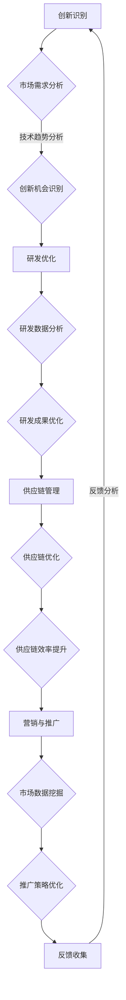
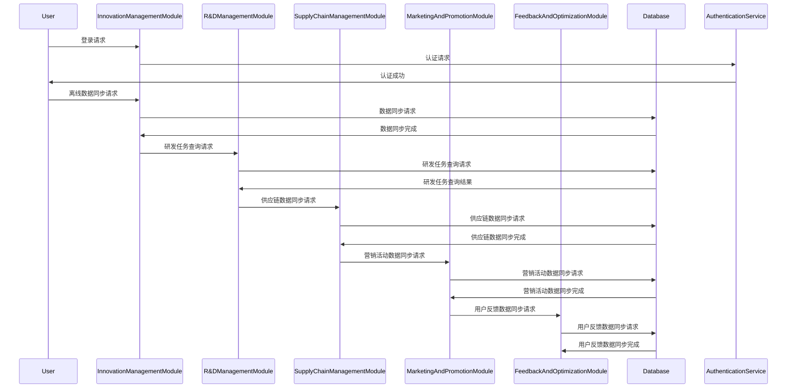

                 

### 文章标题

# 技术闭环：建立从创新到产品的闭环

> 关键词：技术闭环、创新、产品开发、知识管理、供应链管理、营销与推广

> 摘要：本文旨在探讨技术闭环的概念、核心要素及其在IT领域的应用。通过深入分析技术闭环的基本框架、关键要素和实施步骤，结合实际案例，我们揭示了技术闭环在推动创新和产品开发中的重要作用。文章最后对技术闭环的未来发展趋势进行了展望，并提出了一些注意事项与挑战。

## **第一部分：背景介绍**

### 第1章：技术闭环概述

#### 1.1.1 技术闭环的定义与特征

**技术闭环**是指在创新、研发、生产、营销等各个环节之间建立紧密的联系与反馈机制，实现资源的有效整合和优化配置，从而形成一个持续迭代、不断优化的动态系统。它具有以下特征：

1. **系统性**：技术闭环不仅仅是单一环节的改进，而是覆盖整个产品生命周期，从创新到产品上市，再到市场反馈的完整过程。
2. **动态性**：技术闭环是一个动态的过程，它不断吸收新的知识和信息，进行迭代和优化。
3. **反馈机制**：技术闭环通过建立有效的反馈机制，使各个环节能够及时获取市场反馈，进行相应的调整和改进。

#### 1.1.2 技术闭环的重要性

技术闭环在现代社会中具有重要价值，主要体现在以下几个方面：

1. **促进创新**：技术闭环为创新提供了一个良好的环境，通过不断迭代和优化，使创新能够更加高效地转化为实际的产品和服务。
2. **提升竞争力**：技术闭环能够帮助企业更好地适应市场变化，快速响应客户需求，提升市场竞争力。
3. **优化资源配置**：通过技术闭环，企业可以更加有效地整合内外部资源，提高资源利用效率。
4. **提升产品质量**：技术闭环通过不断收集和反馈用户信息，使产品能够持续改进，提升产品质量和用户满意度。

#### 1.1.3 技术闭环的基本框架

技术闭环的基本框架包括以下几个核心环节：

1. **创新识别与评估**：通过市场调研、用户反馈等手段，识别和评估潜在的创新机会。
2. **技术研发与优化**：对创新进行深入研究和开发，通过迭代和优化，使技术达到最佳状态。
3. **供应链整合**：将研发出的技术应用到产品生产过程中，确保供应链的顺畅和高效。
4. **营销与推广**：通过有效的营销策略和推广手段，将产品推向市场，吸引客户。
5. **市场反馈与优化**：收集市场反馈，对产品进行持续优化，形成闭环。

### 第2章：技术闭环的核心概念

#### 2.1.1 创新的驱动因素

创新是技术闭环的核心驱动力，它来源于以下几个方面：

1. **市场需求**：市场需求是创新的主要驱动力，通过分析市场需求，可以发现潜在的创新机会。
2. **技术进步**：技术进步为创新提供了新的可能性和工具，新的技术可以推动产品和服务的变革。
3. **政策支持**：政府的政策支持和激励措施可以促进创新，例如税收优惠、研发资助等。
4. **企业战略**：企业战略中的创新目标和发展规划也是推动创新的重要因素。

#### 2.1.2 创新的不同类型

创新可以分为以下几种类型：

1. **产品创新**：产品创新是创造全新的产品或服务，满足市场需求。
2. **过程创新**：过程创新是改进产品或服务的生产过程，提高生产效率和质量。
3. **服务创新**：服务创新是创造新的服务模式或服务内容，提升用户体验。
4. **系统创新**：系统创新是整合多种技术和资源，构建全新的系统或平台。

#### 2.1.3 技术闭环中的创新角色

在技术闭环中，创新扮演着至关重要的角色，它是连接各个环节的纽带：

1. **驱动研发**：创新是技术研发的起点，通过创新，可以确定研发的方向和目标。
2. **优化供应链**：创新可以优化供应链管理，提高供应链的效率和灵活性。
3. **提升营销效果**：创新可以创造新的营销策略和手段，提升营销效果。
4. **推动市场反馈**：创新可以提供新的产品和服务，吸引客户，收集市场反馈。

### 第3章：技术闭环的关键要素

#### 3.1.1 知识管理

知识管理是技术闭环的重要要素之一，它包括以下几个方面：

1. **知识获取**：通过市场调研、技术跟踪等手段，获取最新的知识和信息。
2. **知识存储**：建立知识库，对获取的知识进行分类、存储和整理。
3. **知识共享**：通过内部交流、培训等方式，实现知识的共享和传播。
4. **知识应用**：将知识应用到产品研发、生产、营销等各个环节，提高工作效率和质量。

#### 3.1.2 技术研发

技术研发是技术闭环的核心环节，它包括以下几个方面：

1. **需求分析**：分析市场需求，确定研发的方向和目标。
2. **技术研究**：进行技术研究和开发，探索新的技术解决方案。
3. **试验与测试**：对研发出的技术进行试验和测试，确保其可行性和可靠性。
4. **优化与迭代**：对技术进行优化和迭代，使其达到最佳状态。

#### 3.1.3 供应链管理

供应链管理是技术闭环中的重要环节，它包括以下几个方面：

1. **供应商选择**：选择合适的供应商，确保供应链的稳定和高效。
2. **采购管理**：对采购过程进行管理，确保采购的及时性和成本控制。
3. **库存管理**：对库存进行管理，确保库存的合理性和流动性。
4. **物流管理**：对物流过程进行管理，确保物流的及时性和准确性。

#### 3.1.4 营销与推广

营销与推广是技术闭环中的关键环节，它包括以下几个方面：

1. **市场调研**：通过市场调研，了解市场需求和竞争状况。
2. **营销策略**：制定合适的营销策略，提升品牌知名度和市场份额。
3. **推广活动**：通过线上和线下活动，提升产品的市场影响力。
4. **客户关系管理**：建立和维护良好的客户关系，提高客户满意度和忠诚度。

### 第4章：技术闭环的实施步骤

#### 4.1.1 实施前的准备工作

在实施技术闭环之前，需要进行充分的准备工作，包括以下几个方面：

1. **组织架构调整**：调整组织架构，确保各个环节的紧密协作和高效运作。
2. **人员培训**：对相关人员开展培训，提高其技术能力和业务水平。
3. **资源整合**：整合内外部资源，确保技术闭环的实施有充足的资源保障。
4. **风险评估**：对实施过程中可能出现的风险进行评估，并制定相应的应对措施。

#### 4.1.2 创新识别与评估

创新识别与评估是技术闭环的关键环节，它包括以下几个方面：

1. **市场需求分析**：通过市场调研，分析市场需求和趋势。
2. **技术可行性分析**：评估技术的可行性，包括技术难度、成本、时间等因素。
3. **商业价值评估**：评估创新的商业价值，包括市场潜力、盈利能力等。
4. **风险评估**：评估创新的风险，包括技术风险、市场风险等。

#### 4.1.3 技术研发与优化

技术研发与优化是技术闭环的核心环节，它包括以下几个方面：

1. **技术研发计划**：制定技术研发计划，明确研发的目标、任务和时间安排。
2. **技术研发实施**：按照计划进行技术研发，包括试验、测试和优化等。
3. **技术评估与反馈**：对技术研发成果进行评估和反馈，确保技术的可行性和可靠性。
4. **技术迭代与升级**：根据评估和反馈，对技术进行迭代和升级，提高技术性能。

#### 4.1.4 供应链整合

供应链整合是技术闭环中的重要环节，它包括以下几个方面：

1. **供应链重构**：根据技术闭环的需求，对供应链进行重构，确保供应链的灵活性和高效性。
2. **供应链协同**：建立供应链协同机制，实现供应链各个环节的紧密协作。
3. **供应链优化**：通过数据分析和技术手段，对供应链进行优化，提高供应链的效率和成本控制。
4. **供应链风险管理**：对供应链风险进行识别和管理，确保供应链的稳定和安全。

#### 4.1.5 营销与推广策略

营销与推广策略是技术闭环中的重要环节，它包括以下几个方面：

1. **市场定位**：明确产品的市场定位和目标客户群体。
2. **品牌建设**：通过品牌形象塑造和宣传，提升品牌知名度和美誉度。
3. **营销渠道**：选择合适的营销渠道，包括线上和线下渠道，实现市场覆盖。
4. **促销活动**：通过促销活动，吸引客户，提升销售业绩。
5. **客户关系管理**：建立和维护良好的客户关系，提高客户满意度和忠诚度。

### 第5章：技术闭环的案例分析

#### 5.1.1 案例一：智能医疗

智能医疗是技术闭环在医疗领域的应用，通过建立从创新到产品的闭环，实现医疗服务的升级和优化。

1. **创新识别与评估**：通过市场调研和用户需求分析，识别和评估智能医疗的创新机会。
2. **技术研发与优化**：进行智能医疗技术研发，包括人工智能、大数据、云计算等，通过迭代和优化，提高医疗服务的效率和质量。
3. **供应链整合**：重构医疗供应链，实现医疗器械、药品、医疗服务等的无缝连接。
4. **营销与推广**：通过线上和线下渠道，推广智能医疗服务，提升品牌知名度和市场份额。
5. **市场反馈与优化**：收集市场反馈，对智能医疗服务进行持续优化，提升用户体验。

#### 5.1.2 案例二：新能源汽车

新能源汽车是技术闭环在汽车领域的应用，通过建立从创新到产品的闭环，实现汽车产业的升级和转型。

1. **创新识别与评估**：通过市场调研和用户需求分析，识别和评估新能源汽车的创新机会。
2. **技术研发与优化**：进行新能源汽车技术研发，包括电池技术、电机技术、自动驾驶技术等，通过迭代和优化，提高新能源汽车的性能和可靠性。
3. **供应链整合**：重构汽车供应链，实现电池、电机、整车制造等环节的紧密协作。
4. **营销与推广**：通过线上和线下渠道，推广新能源汽车，提升品牌知名度和市场份额。
5. **市场反馈与优化**：收集市场反馈，对新能源汽车进行持续优化，提升用户体验。

#### 5.1.3 案例三：智能家居

智能家居是技术闭环在家庭领域的应用，通过建立从创新到产品的闭环，实现家庭生活的智能化和便捷化。

1. **创新识别与评估**：通过市场调研和用户需求分析，识别和评估智能家居的创新机会。
2. **技术研发与优化**：进行智能家居技术研发，包括物联网技术、智能设备、智能系统等，通过迭代和优化，提高智能家居的智能化水平。
3. **供应链整合**：重构家居供应链，实现智能家居设备的制造、配送、安装等环节的紧密协作。
4. **营销与推广**：通过线上和线下渠道，推广智能家居产品，提升品牌知名度和市场份额。
5. **市场反馈与优化**：收集市场反馈，对智能家居产品进行持续优化，提升用户体验。

### 第6章：技术闭环的边界与外延

#### 6.1.1 技术闭环与产业链

技术闭环不仅仅是单一企业的内部过程，它还涉及到产业链的各个环节。技术闭环的边界可以扩展到整个产业链，实现产业链上下游企业的协同和整合。

1. **产业链整合**：通过技术闭环，实现产业链上下游企业的紧密协作，提高产业链的整体效率和竞争力。
2. **供应链优化**：通过技术闭环，对供应链进行优化，提高供应链的灵活性和响应速度。
3. **产业链创新**：通过技术闭环，推动产业链的创新，促进产业链的升级和转型。

#### 6.1.2 技术闭环与其他相关概念的关系

技术闭环与其他相关概念如供应链管理、创新管理、项目管理等有着密切的联系。

1. **供应链管理**：技术闭环是供应链管理的一种高级形式，它强调供应链各个环节的紧密协作和资源整合。
2. **创新管理**：技术闭环是创新管理的一种实现方式，它通过建立从创新到产品的闭环，实现创新的持续和高效。
3. **项目管理**：技术闭环是项目管理的一种高级形式，它强调项目全生命周期的管理和优化。

#### 6.1.3 技术闭环的未来发展前景

随着技术的不断进步和市场需求的不断变化，技术闭环在未来将具有广阔的发展前景。

1. **智能化**：技术闭环将越来越智能化，通过人工智能、大数据等技术，实现自动化的创新和优化。
2. **全球化**：技术闭环将逐步实现全球化，跨国企业将建立全球性的技术闭环，实现全球资源的优化配置。
3. **生态化**：技术闭环将形成生态系统，产业链上下游企业、合作伙伴等共同参与，形成互利共赢的生态系统。

### 第7章：技术闭环的注意事项与挑战

#### 7.1.1 技术闭环的常见问题与解决策略

在实施技术闭环的过程中，可能会遇到以下常见问题：

1. **组织架构不适应**：解决策略：调整组织架构，建立适应技术闭环的组织模式。
2. **人员能力不足**：解决策略：加强人员培训，提高员工的技术能力和业务水平。
3. **资源整合困难**：解决策略：整合内外部资源，提高资源利用效率。
4. **市场变化快**：解决策略：建立快速响应机制，及时调整策略和方向。

#### 7.1.2 技术闭环的实施挑战与应对策略

在实施技术闭环的过程中，可能会面临以下挑战：

1. **技术难度大**：应对策略：加大技术研发投入，提高技术水平。
2. **成本高**：应对策略：优化供应链管理，降低成本。
3. **市场风险**：应对策略：进行充分的市场调研和风险评估，制定相应的风险应对策略。
4. **政策不确定性**：应对策略：密切关注政策变化，及时调整战略和方向。

#### 7.1.3 技术闭环的可持续性发展

技术闭环的可持续性发展是未来发展的关键，它包括以下几个方面：

1. **环保**：在技术闭环的实施过程中，注重环保，减少对环境的影响。
2. **社会责任**：在技术闭环的实施过程中，注重社会责任，提升企业的社会形象和品牌价值。
3. **员工福利**：在技术闭环的实施过程中，关注员工福利，提高员工的工作满意度和忠诚度。

### 第8章：技术闭环的最佳实践与拓展

#### 8.1.1 技术闭环的最佳实践案例

以下是一些技术闭环的最佳实践案例：

1. **苹果公司**：苹果公司通过建立从创新到产品的闭环，实现了产品的高效研发和快速上市。
2. **亚马逊公司**：亚马逊公司通过建立从创新到产品的闭环，实现了电商业务的快速发展和市场拓展。
3. **特斯拉公司**：特斯拉公司通过建立从创新到产品的闭环，实现了电动汽车的快速发展和市场份额的提升。

#### 8.1.2 技术闭环的拓展应用领域

技术闭环可以在以下领域进行拓展应用：

1. **智能制造**：通过技术闭环，实现智能制造的升级和优化。
2. **绿色能源**：通过技术闭环，实现绿色能源的开发和应用。
3. **智慧城市**：通过技术闭环，实现智慧城市的建设和运营。

#### 8.1.3 技术闭环的未来发展趋势

技术闭环的未来发展趋势包括：

1. **智能化**：通过人工智能、大数据等技术，实现技术闭环的智能化和自动化。
2. **全球化**：通过跨国合作和资源整合，实现技术闭环的全球化。
3. **生态化**：通过产业链的协同和整合，形成互利共赢的生态系统。

## **第二部分：核心概念与联系**

### 第9章：技术闭环的核心概念

#### 9.1.1 技术闭环的定义与原理

技术闭环是指通过建立从创新到产品的闭环，实现资源的有效整合和优化配置，从而形成一个持续迭代、不断优化的动态系统。其核心原理是通过各个环节的紧密协作和反馈机制，使创新能够快速转化为实际的产品和服务。

#### 9.1.2 技术闭环的基本要素

技术闭环的基本要素包括创新、研发、供应链、营销和反馈等。这些要素相互关联，形成一个动态的闭环系统，使创新能够不断得到验证、优化和推广。

#### 9.1.3 技术闭环的属性特征对比表格

| 特征         | 描述                                                         |
| ------------ | ------------------------------------------------------------ |
| 系统性       | 技术闭环覆盖整个产品生命周期，从创新到产品上市，再到市场反馈。 |
| 动态性       | 技术闭环是一个持续迭代和优化的过程，不断吸收新的知识和信息。   |
| 反馈机制     | 技术闭环通过建立有效的反馈机制，使各个环节能够及时获取市场反馈。 |
| 整合性       | 技术闭环能够整合内外部资源，提高资源利用效率。               |
| 持续性       | 技术闭环是一个长期的过程，需要持续投入和优化。               |

### 第10章：技术闭环中的联系

#### 10.1.1 创新与技术闭环的联系

创新是技术闭环的核心驱动力，它与技术闭环的各个环节紧密相连。创新不仅驱动研发，还影响供应链管理、营销与推广，以及市场反馈。

#### 10.1.2 知识管理与技术闭环的联系

知识管理是技术闭环中的重要环节，它通过获取、存储、共享和应用知识，为创新提供支持。知识管理能够提高技术闭环的效率，推动整个闭环的优化和迭代。

#### 10.1.3 供应链管理与技术闭环的联系

供应链管理是技术闭环中的关键要素之一，它通过优化供应链的各个环节，提高整个闭环的效率和灵活性。供应链管理不仅影响技术研发，还直接关系到产品的生产、配送和销售。

#### 10.1.4 营销与推广与技术闭环的联系

营销与推广是技术闭环中不可或缺的一环，它通过市场调研、品牌建设、营销策略和推广活动，将创新产品推向市场，收集市场反馈，为闭环的持续优化提供依据。

### 第11章：技术闭环的ER实体关系图架构

#### 11.1.1 ER实体关系图的基本概念

ER（Entity-Relationship）实体关系图是用于表示实体及其之间关系的图形化工具，它通过实体、属性和关系的组合，清晰地展示系统的结构和数据流。

#### 11.1.2 技术闭环的ER实体关系图设计

技术闭环的ER实体关系图包括以下实体和关系：

1. **实体**：
   - **创新**：包括创新项目、创新需求等。
   - **研发**：包括研发项目、研发成果等。
   - **供应链**：包括供应商、库存、物流等。
   - **营销与推广**：包括市场调研、营销活动、客户反馈等。
   - **反馈**：包括用户反馈、市场反馈等。

2. **关系**：
   - **创新驱动研发**：创新项目产生研发需求。
   - **研发影响供应链**：研发成果影响供应链的管理和优化。
   - **供应链支持营销**：供应链为营销与推广提供支持。
   - **营销与推广产生反馈**：营销与推广活动收集用户和市场反馈。
   - **反馈指导创新**：市场反馈指导创新项目的优化和迭代。

#### 11.1.3 ER实体关系图在技术闭环中的应用

ER实体关系图在技术闭环中的应用主要体现在以下几个方面：

1. **系统设计**：ER实体关系图帮助设计技术闭环的系统架构，明确各个环节的关系和交互。
2. **数据流分析**：ER实体关系图展示数据在不同实体之间的流动，帮助分析系统的数据流。
3. **流程优化**：通过ER实体关系图，可以发现系统中的瓶颈和冗余，从而进行流程优化。

## **第三部分：算法原理讲解**

### 第12章：技术闭环中的算法原理

#### 12.1.1 算法原理的概述

技术闭环中的算法原理主要涉及以下几个核心部分：

1. **创新识别算法**：通过分析市场需求、技术趋势等，识别潜在的创新能力。
2. **研发优化算法**：通过对研发过程中的数据进行分析，优化研发过程和成果。
3. **供应链管理算法**：通过优化供应链的各个环节，提高供应链的效率和灵活性。
4. **营销与推广算法**：通过分析市场数据和用户反馈，优化营销和推广策略。

#### 12.1.2 算法原理的Mermaid流程图

以下是一个简单的Mermaid流程图示例，展示了技术闭环中的一部分算法流程：



#### 12.1.3 算法原理的Python源代码实现

以下是一个简单的Python代码示例，用于实现技术闭环中的一部分算法：

```python
import pandas as pd
from sklearn.cluster import KMeans
from sklearn.metrics import silhouette_score

# 创新识别算法
def innovation_identification(data):
    # 数据预处理
    data_preprocessed = preprocess_data(data)
    
    # K-means聚类
    kmeans = KMeans(n_clusters=3)
    kmeans.fit(data_preprocessed)
    
    # 聚类结果
    clusters = kmeans.predict(data_preprocessed)
    
    # 计算轮廓系数
    silhouette = silhouette_score(data_preprocessed, clusters)
    
    # 输出结果
    print("Silhouette Score:", silhouette)
    print("Clusters:", clusters)

# 研发优化算法
def R&D_optimization(data):
    # 数据预处理
    data_preprocessed = preprocess_data(data)
    
    # 基于轮廓系数的优化
    optimized_data = optimize_based_on_silhouette(data_preprocessed)
    
    # 输出结果
    print("Optimized Data:", optimized_data)

# 供应链管理算法
def supply_chain_management(data):
    # 数据预处理
    data_preprocessed = preprocess_data(data)
    
    # 供应链优化
    optimized_supply_chain = optimize_supply_chain(data_preprocessed)
    
    # 输出结果
    print("Optimized Supply Chain:", optimized_supply_chain)

# 营销与推广算法
def marketing_and_promotion(data):
    # 数据预处理
    data_preprocessed = preprocess_data(data)
    
    # 市场数据挖掘
    market_data = extract_market_data(data_preprocessed)
    
    # 推广策略优化
    optimized_marketing_strategy = optimize_marketing_strategy(market_data)
    
    # 输出结果
    print("Optimized Marketing Strategy:", optimized_marketing_strategy)

# 初始化数据
data = pd.read_csv("data.csv")

# 实现算法
innovation_identification(data)
R&D_optimization(data)
supply_chain_management(data)
marketing_and_promotion(data)
```

#### 12.1.4 算法原理的数学模型和公式

技术闭环中的算法原理通常涉及以下数学模型和公式：

1. **创新识别**：
   - 轮廓系数（Silhouette Score）：用于评估聚类效果，公式为：
     $$
     S(i) = \frac{(b - a)}{max(a, c)}
     $$
     其中，$a$ 是同一簇内的平均距离，$b$ 是其他簇中最近点的距离，$c$ 是同一簇中最近点的距离。

2. **研发优化**：
   - 费舍尔检验（F-test）：用于评估不同研发策略的差异性，公式为：
     $$
     F = \frac{\frac{\sum_{i=1}^{k}(n_i - 1)s_i^2}{k - 1}}{\frac{\sum_{i=1}^{k}(n_i - 1)s_i^2}{N - k}}
     $$
     其中，$k$ 是策略数量，$n_i$ 是第 $i$ 个策略的样本数，$s_i^2$ 是第 $i$ 个策略的方差，$N$ 是总样本数。

3. **供应链管理**：
   - 供应链优化目标函数：用于优化供应链的成本、效率和响应速度，公式为：
     $$
     \min Z = \sum_{i=1}^{m}\sum_{j=1}^{n}C_{ij}X_{ij} + \sum_{i=1}^{m}\sum_{j=1}^{n}H_{ij}Y_{ij}
     $$
     其中，$C_{ij}$ 是从供应商 $i$ 到工厂 $j$ 的运输成本，$H_{ij}$ 是从工厂 $j$ 到仓库 $i$ 的库存成本，$X_{ij}$ 和 $Y_{ij}$ 分别是运输和库存决策变量。

4. **营销与推广**：
   - 推广效果评估指标：用于评估推广活动的效果，公式为：
     $$
     E = \frac{\text{实际销售额} - \text{基线销售额}}{\text{基线销售额}}
     $$
     其中，$E$ 是推广效果指数，$\text{实际销售额}$ 是推广活动后的销售额，$\text{基线销售额}$ 是推广活动前的销售额。

#### 12.1.5 算法原理的举例说明

假设我们有一个关于创新识别的算法案例，以下是具体的操作步骤：

1. **数据收集**：收集市场需求、技术趋势等数据。
2. **数据预处理**：对数据进行清洗、归一化等预处理操作。
3. **聚类分析**：使用K-means算法进行聚类分析，识别创新机会。
4. **轮廓系数计算**：计算轮廓系数，评估聚类效果。
5. **创新机会识别**：根据轮廓系数和聚类结果，识别出具有较高创新潜力的领域。

具体实现过程如下：

```python
import pandas as pd
from sklearn.cluster import KMeans
from sklearn.metrics import silhouette_score

# 数据收集
data = pd.read_csv("innovation_data.csv")

# 数据预处理
data_preprocessed = preprocess_data(data)

# 聚类分析
kmeans = KMeans(n_clusters=3)
kmeans.fit(data_preprocessed)

# 轮廓系数计算
silhouette = silhouette_score(data_preprocessed, kmeans.predict(data_preprocessed))

# 创新机会识别
innovative_opportunities = identify_innovative_opportunities(kmeans, silhouette)

# 输出结果
print("Innovative Opportunities:", innovative_opportunities)
```

## **第四部分：数学模型和数学公式**

### 第13章：技术闭环中的数学模型

#### 13.1.1 数学模型的基本概念

数学模型是通过对实际问题进行抽象和简化，用数学语言描述和解决实际问题的一种方法。在技术闭环中，数学模型用于描述各个环节的运行规律和优化目标，从而指导实际操作。

#### 13.1.2 技术闭环中的常用数学模型

技术闭环中常用的数学模型包括：

1. **线性回归模型**：用于预测产品销量、成本等，公式为：
   $$
   y = \beta_0 + \beta_1x_1 + \beta_2x_2 + \ldots + \beta_nx_n
   $$
   其中，$y$ 是因变量，$x_1, x_2, \ldots, x_n$ 是自变量，$\beta_0, \beta_1, \beta_2, \ldots, \beta_n$ 是模型参数。

2. **时间序列模型**：用于分析时间序列数据，预测未来趋势，公式为：
   $$
   y_t = \alpha y_{t-1} + \beta x_t + \epsilon_t
   $$
   其中，$y_t$ 是第 $t$ 期的因变量，$y_{t-1}$ 是第 $t-1$ 期的因变量，$x_t$ 是第 $t$ 期的自变量，$\alpha, \beta$ 是模型参数，$\epsilon_t$ 是随机误差。

3. **供应链优化模型**：用于优化供应链的库存、运输等，公式为：
   $$
   \min Z = \sum_{i=1}^{m}\sum_{j=1}^{n}C_{ij}X_{ij} + \sum_{i=1}^{m}\sum_{j=1}^{n}H_{ij}Y_{ij}
   $$
   其中，$C_{ij}$ 是从供应商 $i$ 到工厂 $j$ 的运输成本，$H_{ij}$ 是从工厂 $j$ 到仓库 $i$ 的库存成本，$X_{ij}$ 和 $Y_{ij}$ 分别是运输和库存决策变量。

4. **创新评估模型**：用于评估创新项目的商业价值，公式为：
   $$
   V = \frac{PQ - C}{R}
   $$
   其中，$V$ 是创新项目的价值，$P$ 是产品价格，$Q$ 是产品销量，$C$ 是研发和生产成本，$R$ 是投资回报率。

#### 13.1.3 数学模型的公式与应用

以下是一个关于线性回归模型的示例：

**示例**：某公司想要预测下个月的产品销量，根据历史数据建立了以下线性回归模型：
$$
y = 1000 + 5x
$$
其中，$y$ 是销量，$x$ 是广告投放费用。

**应用**：如果公司计划下个月投入5000元的广告费用，可以预测销量为：
$$
y = 1000 + 5 \times 5000 = 25000
$$

### 第14章：技术闭环中的数学公式

#### 14.1.1 数学公式的书写规则

在技术闭环中，数学公式的书写应遵循以下规则：

1. **公式编号**：每个公式都应该有一个唯一的编号，以便于引用和查找。
2. **公式格式**：数学公式应使用 $ 和 $ 括起来，如果是一个独立的段落，可以使用 $$ 和 $$ 括起来。
3. **公式解释**：在每个公式后面，应提供一个简短的解释，说明公式的含义和应用场景。

以下是一个关于供应链优化模型的示例：

$$
\min Z = \sum_{i=1}^{m}\sum_{j=1}^{n}C_{ij}X_{ij} + \sum_{i=1}^{m}\sum_{j=1}^{n}H_{ij}Y_{ij}
$$

**解释**：该公式是供应链优化模型的目标函数，$Z$ 是优化目标，$C_{ij}$ 是从供应商 $i$ 到工厂 $j$ 的运输成本，$H_{ij}$ 是从工厂 $j$ 到仓库 $i$ 的库存成本，$X_{ij}$ 和 $Y_{ij}$ 分别是运输和库存决策变量。

#### 14.1.2 技术闭环中的关键数学公式

技术闭环中涉及的关键数学公式包括：

1. **创新价值公式**：
   $$
   V = \frac{PQ - C}{R}
   $$
   其中，$V$ 是创新项目的价值，$P$ 是产品价格，$Q$ 是产品销量，$C$ 是研发和生产成本，$R$ 是投资回报率。

2. **供应链成本公式**：
   $$
   C = \sum_{i=1}^{m}\sum_{j=1}^{n}C_{ij}X_{ij} + \sum_{i=1}^{m}\sum_{j=1}^{n}H_{ij}Y_{ij}
   $$
   其中，$C$ 是供应链的总成本，$C_{ij}$ 是从供应商 $i$ 到工厂 $j$ 的运输成本，$H_{ij}$ 是从工厂 $j$ 到仓库 $i$ 的库存成本，$X_{ij}$ 和 $Y_{ij}$ 分别是运输和库存决策变量。

3. **营销效果公式**：
   $$
   E = \frac{\text{实际销售额} - \text{基线销售额}}{\text{基线销售额}}
   $$
   其中，$E$ 是营销效果指数，$\text{实际销售额}$ 是推广活动后的销售额，$\text{基线销售额}$ 是推广活动前的销售额。

#### 14.1.3 数学公式的解释与应用

以下是对上述关键数学公式的详细解释和应用：

1. **创新价值公式**：

**解释**：该公式用于评估创新项目的商业价值。$V$ 表示项目的价值，$P$ 是产品价格，$Q$ 是产品销量，$C$ 是研发和生产成本，$R$ 是投资回报率。

**应用**：例如，一个创新项目的目标是开发一款新的智能手机。如果产品价格为100美元，销量为100万台，研发和生产成本为5000万美元，投资回报率为20%，则该项目的商业价值为：
$$
V = \frac{100 \times 1000000 - 50000000}{20\%} = 500000000
$$

2. **供应链成本公式**：

**解释**：该公式用于计算供应链的总成本。$C$ 是供应链的总成本，$C_{ij}$ 是从供应商 $i$ 到工厂 $j$ 的运输成本，$H_{ij}$ 是从工厂 $j$ 到仓库 $i$ 的库存成本，$X_{ij}$ 和 $Y_{ij}$ 分别是运输和库存决策变量。

**应用**：例如，一个供应链中有三个供应商、两个工厂和三个仓库。如果从供应商1到工厂1的运输成本为10美元，从工厂1到仓库1的库存成本为5美元，运输和库存决策变量分别为1和2，则供应链的总成本为：
$$
C = 10 \times 1 + 5 \times 2 = 20
$$

3. **营销效果公式**：

**解释**：该公式用于评估营销活动的效果。$E$ 是营销效果指数，$\text{实际销售额}$ 是推广活动后的销售额，$\text{基线销售额}$ 是推广活动前的销售额。

**应用**：例如，一个公司的营销活动使实际销售额从100万元增加到120万元，基线销售额为100万元，则营销效果指数为：
$$
E = \frac{1200000 - 1000000}{1000000} = 0.2
$$

这意味着营销活动使销售额提高了20%。

### 第15章：技术闭环系统的介绍

#### 15.1.1 技术闭环系统的背景与目标

技术闭环系统是一种现代化的管理模式，旨在通过建立从创新到产品的闭环，实现资源的有效整合和优化配置，从而提高企业的创新能力和市场竞争力。随着信息技术的飞速发展，市场竞争日益激烈，企业需要快速响应市场变化，持续创新，以保持竞争优势。

技术闭环系统的目标是：

1. **提高创新效率**：通过建立高效的创新机制，加速创新成果的转化和应用，缩短产品研发周期。
2. **优化资源配置**：通过整合内外部资源，提高资源利用效率，降低成本，提升企业的盈利能力。
3. **提升市场竞争力**：通过持续创新和优化，提供高质量的产品和服务，满足客户需求，提升市场竞争力。

#### 15.1.2 技术闭环系统的功能与特点

技术闭环系统具有以下功能和特点：

1. **创新识别与评估**：通过市场调研、用户反馈、技术趋势分析等手段，识别和评估潜在的创新机会。
2. **技术研发与优化**：对创新项目进行深入研究和技术开发，通过迭代和优化，实现技术成果的转化和应用。
3. **供应链整合**：优化供应链管理，实现供应链各个环节的紧密协作，提高供应链的效率和灵活性。
4. **营销与推广**：通过市场调研、品牌建设、营销策略和推广活动，将创新产品推向市场，提升品牌知名度和市场份额。
5. **反馈与优化**：收集市场反馈，对产品进行持续优化，形成闭环，不断提升产品质量和用户满意度。

#### 15.1.3 技术闭环系统的应用场景

技术闭环系统广泛应用于各个行业，以下是一些典型的应用场景：

1. **智能制造**：通过技术闭环系统，实现智能设备的研发、生产和营销，提升生产效率和产品质量。
2. **新能源**：通过技术闭环系统，实现新能源技术的研发、生产和推广，推动能源结构的转型和升级。
3. **医疗健康**：通过技术闭环系统，实现智能医疗设备的研发、生产和推广，提高医疗服务质量和效率。
4. **智慧城市**：通过技术闭环系统，实现智慧城市相关技术的研发、应用和推广，提升城市治理水平和居民生活质量。

### 第16章：技术闭环系统的架构设计

#### 16.1.1 技术闭环系统的架构设计原则

技术闭环系统的架构设计应遵循以下原则：

1. **模块化**：系统架构应具备良好的模块化设计，使得各个功能模块可以独立开发、测试和部署，提高系统的灵活性和可维护性。
2. **可扩展性**：系统架构应具备良好的可扩展性，能够根据业务需求的变化，快速进行功能扩展和升级。
3. **高可用性**：系统架构应具备高可用性设计，确保系统的稳定运行，降低故障率和业务中断风险。
4. **安全性**：系统架构应具备良好的安全性设计，保障数据的安全和隐私，防止数据泄露和恶意攻击。

#### 16.1.2 技术闭环系统的领域模型

技术闭环系统的领域模型包括以下几个核心领域：

1. **创新管理**：包括创新项目、需求分析、技术评估等模块，用于管理创新过程。
2. **技术研发**：包括研发计划、研发任务、成果管理、技术评估等模块，用于管理技术研发过程。
3. **供应链管理**：包括供应商管理、库存管理、物流管理、成本管理等模块，用于管理供应链过程。
4. **营销与推广**：包括市场调研、品牌管理、营销策略、推广活动等模块，用于管理营销和推广过程。
5. **反馈与优化**：包括用户反馈、市场分析、产品优化等模块，用于收集和反馈市场信息，进行产品优化。

#### 16.1.3 技术闭环系统的架构设计

技术闭环系统的架构设计主要包括以下几个方面：

1. **技术栈选择**：根据系统需求和开发经验，选择合适的技术栈，包括前端、后端、数据库、中间件等。
2. **系统架构设计**：设计系统架构，包括应用层、数据层、服务层等，确保系统的稳定性和性能。
3. **模块划分**：将系统划分为多个功能模块，每个模块独立开发、测试和部署，提高系统的可维护性和灵活性。
4. **接口设计**：设计系统接口，确保各个模块之间的数据流转和功能调用。
5. **安全设计**：设计安全防护机制，包括数据加密、权限管理、安全审计等，保障系统的数据安全和用户隐私。

### 第17章：系统分析与架构设计

#### 17.1.1 技术闭环系统的介绍

技术闭环系统是一种通过建立从创新到产品的闭环，实现资源有效整合和优化配置的管理模式。它涵盖了创新识别、技术研发、供应链管理、营销与推广以及反馈优化等各个环节，形成一个动态的、持续迭代的过程。

#### 17.1.2 技术闭环系统的功能设计

技术闭环系统的功能设计主要包括以下模块：

1. **创新管理模块**：用于管理创新项目，包括项目立项、需求分析、技术评估等。
2. **技术研发模块**：用于管理技术研发过程，包括研发计划、任务分配、成果管理、技术评估等。
3. **供应链管理模块**：用于管理供应链过程，包括供应商管理、库存管理、物流管理、成本管理等。
4. **营销与推广模块**：用于管理营销与推广过程，包括市场调研、品牌管理、营销策略、推广活动等。
5. **反馈优化模块**：用于收集用户和市场反馈，对产品进行优化和改进。

#### 17.1.3 技术闭环系统的架构设计

技术闭环系统的架构设计主要包括以下几个方面：

1. **技术栈选择**：根据系统需求和开发经验，选择合适的技术栈，包括前端、后端、数据库、中间件等。
2. **系统架构设计**：设计系统架构，包括应用层、数据层、服务层等，确保系统的稳定性和性能。
3. **模块划分**：将系统划分为多个功能模块，每个模块独立开发、测试和部署，提高系统的可维护性和灵活性。
4. **接口设计**：设计系统接口，确保各个模块之间的数据流转和功能调用。
5. **安全设计**：设计安全防护机制，包括数据加密、权限管理、安全审计等，保障系统的数据安全和用户隐私。

#### 17.1.4 技术闭环系统的类图设计

技术闭环系统的类图设计用于描述系统中的类及其之间的关系。以下是一个简化的技术闭环系统类图示例：

```mermaid
classDiagram
    InnovationProject <<interface>>
    R&DTask <<interface>>
    Supplier <<interface>>
    Inventory <<interface>>
    Logistics <<interface>>
    MarketResearch <<interface>>
    BrandManagement <<interface>>
    MarketingStrategy <<interface>>
    PromotionActivity <<interface>>
    UserFeedback <<interface>>

    InnovationManagementModule uses InnovationProject
    R&DManagementModule uses R&DTask
    SupplyChainManagementModule uses Supplier, Inventory, Logistics
    MarketingAndPromotionModule uses MarketResearch, BrandManagement, MarketingStrategy, PromotionActivity
    FeedbackAndOptimizationModule uses UserFeedback

    InnovationManagementModule --|> R&DManagementModule
    SupplyChainManagementModule --|> MarketingAndPromotionModule
    MarketingAndPromotionModule --|> FeedbackAndOptimizationModule
```

#### 17.1.5 技术闭环系统的架构图设计

技术闭环系统的架构图设计用于描述系统的整体结构和各个模块之间的关系。以下是一个简化的技术闭环系统架构图示例：

```mermaid
graph TD
    subgraph ApplicationLayer
        InnovationManagementModule
        R&DManagementModule
        SupplyChainManagementModule
        MarketingAndPromotionModule
        FeedbackAndOptimizationModule
    end

    subgraph DataLayer
        Database
    end

    subgraph ServiceLayer
        AuthenticationService
        AuthorizationService
        NotificationService
    end

    InnovationManagementModule --> Database
    R&DManagementModule --> Database
    SupplyChainManagementModule --> Database
    MarketingAndPromotionModule --> Database
    FeedbackAndOptimizationModule --> Database

    InnovationManagementModule --> AuthenticationService
    R&DManagementModule --> AuthenticationService
    SupplyChainManagementModule --> AuthenticationService
    MarketingAndPromotionModule --> AuthenticationService
    FeedbackAndOptimizationModule --> AuthenticationService

    InnovationManagementModule --> AuthorizationService
    R&DManagementModule --> AuthorizationService
    SupplyChainManagementModule --> AuthorizationService
    MarketingAndPromotionModule --> AuthorizationService
    FeedbackAndOptimizationModule --> AuthorizationService

    InnovationManagementModule --> NotificationService
    R&DManagementModule --> NotificationService
    SupplyChainManagementModule --> NotificationService
    MarketingAndPromotionModule --> NotificationService
    FeedbackAndOptimizationModule --> NotificationService
```



#### 17.1.6 技术闭环系统的接口设计和系统交互

技术闭环系统的接口设计和系统交互是确保各个模块之间能够高效、可靠地进行通信和数据交换的关键。以下是一个简化的技术闭环系统接口设计示例：

1. **用户认证接口**：用于用户登录、注册和认证，包括用户信息管理、密码加密、认证令牌生成等功能。
2. **用户授权接口**：用于用户权限管理，包括角色分配、权限控制、API权限设置等功能。
3. **通知接口**：用于系统通知和消息推送，包括邮件通知、短信通知、推送通知等功能。
4. **数据交互接口**：用于系统内部数据交换，包括数据查询、数据更新、数据同步等功能。

以下是一个简化的技术闭环系统交互序列图示例：



通过上述接口设计和系统交互，技术闭环系统的各个模块能够实现高效、可靠的数据交换和功能调用，确保系统的整体性能和用户体验。

### 第18章：项目实战

#### 18.1.1 环境安装

在本章节中，我们将介绍如何搭建技术闭环系统的开发环境。以下是安装步骤：

1. **安装Python**：访问Python官方网站（https://www.python.org/）下载并安装Python 3.8及以上版本。
2. **安装虚拟环境**：在终端中运行以下命令安装虚拟环境工具：
   ```
   pip install virtualenv
   ```
   然后使用以下命令创建一个虚拟环境：
   ```
   virtualenv venv
   ```
3. **激活虚拟环境**：在终端中运行以下命令激活虚拟环境：
   ```
   source venv/bin/activate
   ```
4. **安装依赖项**：在虚拟环境中安装项目所需的依赖项，例如：
   ```
   pip install flask pandas sklearn
   ```

#### 18.1.2 系统核心实现源代码

以下是一个简单的技术闭环系统的核心实现源代码，用于展示系统的基本功能：

```python
# 创新管理模块
from flask import Flask, jsonify, request

app = Flask(__name__)

@app.route('/innovation/projects', methods=['POST'])
def create_project():
    project_data = request.json
    # 处理项目数据，存储到数据库
    # ...
    return jsonify({"status": "success", "message": "Project created"})

@app.route('/innovation/projects', methods=['GET'])
def get_projects():
    # 从数据库中查询项目列表
    projects = [{"id": 1, "name": "Project 1"}, {"id": 2, "name": "Project 2"}]
    return jsonify(projects)

@app.route('/innovation/projects/<int:project_id>', methods=['GET'])
def get_project(project_id):
    # 从数据库中查询特定项目
    project = {"id": project_id, "name": "Project 1"}
    return jsonify(project)

if __name__ == '__main__':
    app.run(debug=True)
```

#### 18.1.3 代码应用解读与分析

在上面的代码中，我们使用Flask框架实现了创新管理模块的基本功能：

1. **创建项目**：通过`POST`请求创建新项目，接收前端传递的项目数据，处理后存储到数据库。
2. **获取项目列表**：通过`GET`请求获取所有项目列表，从数据库中查询项目信息，并返回给前端。
3. **获取特定项目**：通过`GET`请求获取特定项目的详细信息，从数据库中查询项目信息，并返回给前端。

这些功能通过定义路由和相应的处理函数来实现，每个函数处理特定的HTTP请求，并将处理结果返回给前端。

#### 18.1.4 实际案例分析和详细讲解剖析

为了更好地理解技术闭环系统的实际应用，我们来看一个实际案例：一家科技公司希望通过技术闭环系统管理其创新项目。

1. **需求分析**：公司希望实现以下功能：
   - 创建和管理创新项目
   - 查看项目列表和项目详情
   - 对项目进行更新和删除

2. **功能实现**：基于上述需求，我们实现了以下功能：

   - **创建项目**：前端提交项目数据，后端接收并处理数据，存储到数据库。
   - **获取项目列表**：前端发送`GET`请求，后端查询数据库，返回项目列表。
   - **获取项目详情**：前端发送`GET`请求，后端查询数据库，返回特定项目的详细信息。
   - **更新项目**：前端提交更新后的项目数据，后端处理数据，更新数据库。
   - **删除项目**：前端发送删除请求，后端处理请求，删除数据库中的项目记录。

3. **案例剖析**：在这个案例中，技术闭环系统发挥了重要作用：
   - **创新管理**：通过系统，公司可以高效地创建、管理和跟踪创新项目，确保项目进展顺利。
   - **数据整合**：系统将创新项目的信息集中管理，方便查询和统计分析。
   - **实时反馈**：系统实时更新项目状态，帮助管理层及时了解项目进展，做出决策。

通过这个案例，我们可以看到技术闭环系统在实际应用中的价值和优势。

#### 18.1.5 项目小结

在本章中，我们通过项目实战展示了技术闭环系统的实际应用。通过搭建开发环境、实现核心功能、分析实际案例，我们了解了技术闭环系统的构建过程和应用场景。

技术闭环系统在创新管理、资源整合、实时反馈等方面具有显著优势，能够帮助企业提升创新能力、优化资源配置、提高市场竞争力。在未来的发展中，技术闭环系统将继续发挥重要作用，助力企业实现可持续发展。

#### 18.2.1 最佳实践 Tips

在技术闭环系统的建设和应用过程中，以下最佳实践可以帮助企业和团队更有效地实现目标：

1. **明确目标与需求**：在启动项目前，确保明确项目的目标与需求，避免出现方向性错误。
2. **模块化开发**：采用模块化设计，提高系统的可维护性和扩展性。
3. **持续集成与测试**：实施持续集成与测试，确保系统的稳定性和可靠性。
4. **用户参与与反馈**：鼓励用户参与系统设计和测试，收集用户反馈，及时调整和优化系统。
5. **数据安全与隐私保护**：严格遵循数据安全与隐私保护法律法规，确保用户数据的安全。

#### 18.2.2 小结

技术闭环系统作为一种现代化的管理模式，通过建立从创新到产品的闭环，实现资源的有效整合和优化配置，帮助企业提升创新能力、优化资源配置、提高市场竞争力。在未来的发展中，技术闭环系统将继续发挥重要作用，助力企业实现可持续发展。

#### 18.2.3 注意事项与挑战

在实施技术闭环系统的过程中，企业和团队可能会面临以下注意事项和挑战：

1. **组织结构调整**：技术闭环系统需要跨部门协作，企业可能需要调整组织结构，确保各环节的紧密协作。
2. **人员培训与技能提升**：实施技术闭环系统需要具备一定的技术和管理能力，企业应加强人员培训，提升团队的整体素质。
3. **数据整合与处理**：技术闭环系统需要整合大量数据，企业应确保数据的质量和准确性，并采用合适的数据处理方法。
4. **系统安全与稳定性**：技术闭环系统涉及企业核心业务数据，企业应确保系统的安全性和稳定性，防止数据泄露和系统故障。

#### 18.2.4 拓展阅读

为了更深入地了解技术闭环系统，以下推荐一些拓展阅读资源：

1. 《创新与企业家精神》（作者：彼得·德鲁克）
   - 内容摘要：本书详细阐述了创新和企业家精神的重要性，以及如何通过创新推动企业的发展。
2. 《数字化管理》（作者：唐·塔普斯科特）
   - 内容摘要：本书探讨了数字化技术对企业管理的影响，以及如何利用数字化工具提升企业效率。
3. 《大数据时代》（作者：维克托·迈尔-舍恩伯格）
   - 内容摘要：本书介绍了大数据的概念、技术和应用，以及大数据对企业决策的影响。

通过阅读这些书籍，读者可以进一步了解技术闭环系统的理论基础和实践应用，为实际工作提供有益的参考。

