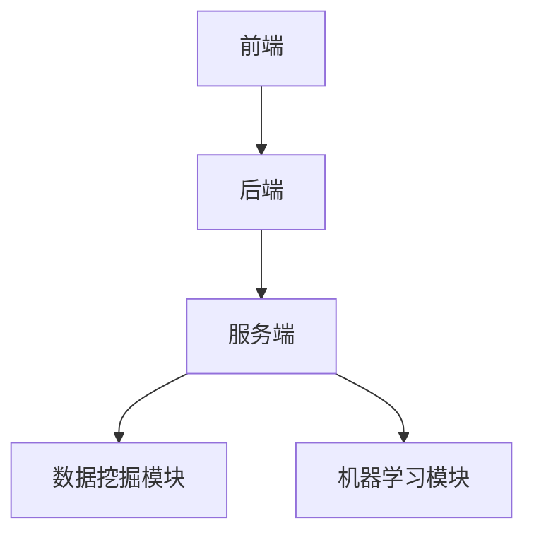
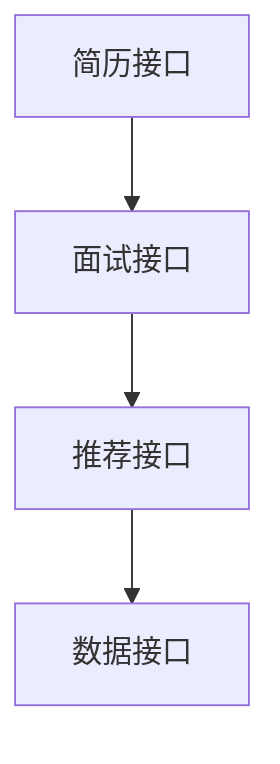
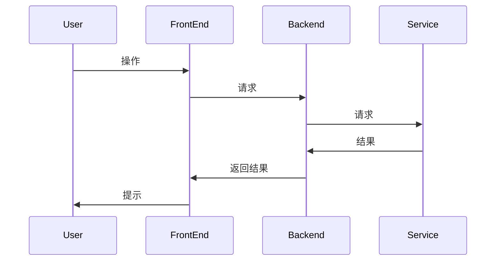
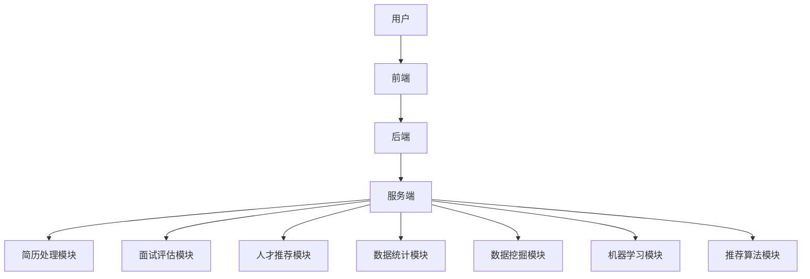
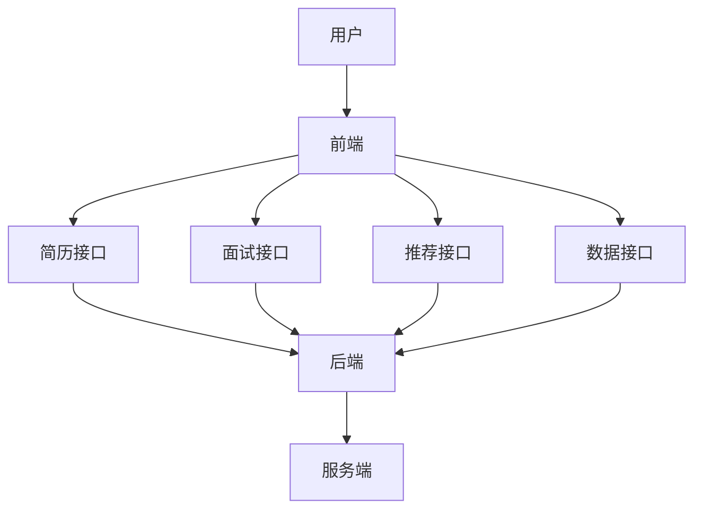
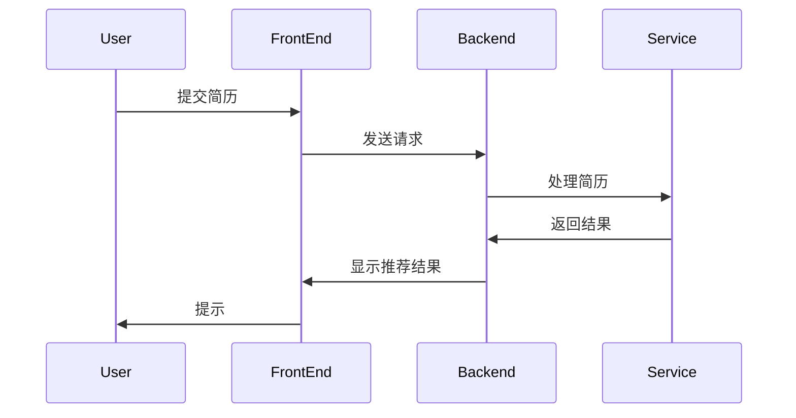

                 

# 《技术面试官的进阶之路》

## 摘要

本文旨在探讨技术面试官的进阶之路，从背景介绍、核心概念、算法原理到系统分析与项目实战，全面解析技术面试官在职业生涯中的成长路径。文章首先探讨了技术面试官面临的挑战及其重要性，接着详细阐述了技术面试官的角色定位、进阶之路的策略，并通过具体的算法原理讲解和系统架构设计方案，为读者提供了实战性的指导。最后，通过实际案例分析和项目小结，总结了技术面试官进阶过程中的关键点，并提出了拓展阅读的建议。

## 目录大纲

1. **问题的提出**  
   1.1 问题背景  
   1.2 问题描述  
   1.3 问题解决  
   1.4 边界与外延  
2. **核心概念**  
   2.1 技术面试官  
   2.2 进阶之路  
3. **核心概念与联系**  
   3.1 技术面试官的角色定位  
   3.2 进阶之路的策略  
4. **算法原理讲解**  
   4.1 面试算法概述  
   4.2 面试算法原理详解  
5. **系统分析与架构设计方案**  
   5.1 项目介绍  
   5.2 系统功能设计  
   5.3 系统架构设计  
   5.4 系统接口设计  
   5.5 系统交互  
6. **项目实战**  
   6.1 环境安装  
   6.2 系统核心实现  
   6.3 实际案例分析和详细讲解剖析  
   6.4 项目小结  
7. **最佳实践 Tips、小结、注意事项、拓展阅读**  

## 第一部分：问题的提出

### 1.1 问题背景

在当今的IT行业，技术面试官的角色日益重要。作为招聘流程中的重要一环，技术面试官不仅需要对候选人的技能进行评估，还需要对其团队合作能力、解决问题的能力和潜力进行评估。然而，随着技术的快速发展，面试官面临的挑战也越来越大。

首先，技术领域的知识更新速度非常快。面试官需要不断学习新的技术知识和编程语言，以保持自己的技术竞争力。其次，面试官需要在有限的时间内对候选人进行全面的能力评估，这对面试官的沟通技巧和问题设计能力提出了高要求。此外，面试官还需要关注候选人的心理素质和职业素养，以便更好地评估其适应工作环境的能力。

### 1.2 问题描述

技术面试官在面试过程中常常面临以下问题：

1. **知识储备不足**：面试官可能对某些新技术或编程语言了解不足，导致无法准确评估候选人的技能。
2. **面试问题设计不合理**：面试官设计的问题可能过于简单或复杂，无法全面评估候选人的能力。
3. **沟通技巧欠缺**：面试官在面试过程中可能无法有效地与候选人沟通，导致信息传递不畅。
4. **评估标准不统一**：不同面试官之间的评估标准可能不一致，导致评估结果不一致。

### 1.3 问题解决

为了解决上述问题，技术面试官需要采取以下措施：

1. **持续学习**：定期学习新技术和编程语言，保持自己的知识储备。
2. **优化面试问题**：设计具有挑战性和全面性的面试问题，以更好地评估候选人的技能。
3. **提高沟通技巧**：通过模拟面试、观摩优秀面试官的面试过程等方式，提高自己的沟通技巧。
4. **制定统一评估标准**：制定明确的评估标准，确保不同面试官之间的评估结果一致性。

### 1.4 边界与外延

本文主要探讨技术面试官在职业生涯中的成长路径，包括知识储备、面试问题设计、沟通技巧和评估标准等方面。同时，本文还将结合实际案例和项目实战，为技术面试官提供具体的操作指南和实战经验。

## 第二部分：核心概念

### 2.1 技术面试官

技术面试官是负责对候选人进行技术面试的专业人士。他们通常具备深厚的专业知识、丰富的面试经验和良好的沟通技巧。技术面试官的主要职责包括：

- 对候选人进行技术评估，包括编程能力、算法能力、系统设计能力等。
- 对候选人的团队合作能力、解决问题的能力和职业素养进行评估。
- 与其他面试官协作，共同制定面试方案和评估标准。

### 2.2 进阶之路

技术面试官的进阶之路包括以下几个阶段：

1. **基础阶段**：掌握基本的技术知识，如编程语言、数据结构、算法等。
2. **进阶阶段**：深入学习新技术和编程语言，提高面试问题的设计能力。
3. **高级阶段**：通过实战经验积累，提高沟通技巧和评估标准制定能力。
4. **专家阶段**：成为行业内的专家，具备丰富的面试经验和卓越的面试能力。

## 第三部分：核心概念与联系

### 3.1 技术面试官的角色定位

技术面试官的角色定位包括以下几个方面：

1. **评估者**：对候选人进行技术评估，确保候选人具备所需技能。
2. **沟通者**：与候选人进行有效沟通，了解其背景、经验和职业规划。
3. **协调者**：与其他面试官协作，共同制定面试方案和评估标准。
4. **指导者**：对候选人进行指导，帮助其更好地适应工作环境。

### 3.2 进阶之路的策略

技术面试官的进阶之路需要采取以下策略：

1. **持续学习**：定期学习新技术和编程语言，保持知识更新。
2. **实战经验**：通过实际面试项目积累经验，提高面试能力。
3. **沟通技巧**：提高沟通技巧，确保信息传递准确无误。
4. **评估标准**：制定统一、明确的评估标准，确保评估结果一致性。

## 第四部分：算法原理讲解

### 4.1 面试算法概述

面试算法是技术面试中常用的一种评估方法。面试算法主要包括以下几种类型：

1. **基础算法**：如排序、查找、递归等。
2. **高级算法**：如动态规划、贪心算法、图算法等。
3. **系统设计算法**：如设计模式、分布式系统设计等。

### 4.2 面试算法原理详解

#### 4.2.1 算法一：基础算法

基础算法是面试算法的基础，主要包括以下几种：

1. **排序算法**：如冒泡排序、插入排序、快速排序等。
2. **查找算法**：如二分查找、顺序查找等。
3. **递归算法**：如递归求解最大子序列和、递归求解汉诺塔问题等。

以下是一个冒泡排序的Python实现：

```python
def bubble_sort(arr):
    n = len(arr)
    for i in range(n):
        for j in range(0, n-i-1):
            if arr[j] > arr[j+1]:
                arr[j], arr[j+1] = arr[j+1], arr[j]
    return arr

arr = [64, 34, 25, 12, 22, 11, 90]
sorted_arr = bubble_sort(arr)
print("排序后的数组：", sorted_arr)
```

数学模型和公式：

冒泡排序的时间复杂度为$O(n^2)$，其中$n$为待排序数组的长度。

#### 4.2.2 算法二：高级算法

高级算法通常用于解决更复杂的问题，主要包括以下几种：

1. **动态规划**：如背包问题、最长公共子序列问题等。
2. **贪心算法**：如活动选择问题、最小生成树问题等。
3. **图算法**：如最短路径问题、最小生成树问题等。

以下是一个动态规划求解背包问题的Python实现：

```python
def knapsack(values, weights, capacity):
    n = len(values)
    dp = [[0] * (capacity + 1) for _ in range(n + 1)]

    for i in range(1, n + 1):
        for w in range(1, capacity + 1):
            if weights[i - 1] <= w:
                dp[i][w] = max(dp[i - 1][w], dp[i - 1][w - weights[i - 1]] + values[i - 1])
            else:
                dp[i][w] = dp[i - 1][w]

    return dp[n][capacity]

values = [60, 100, 120]
weights = [10, 20, 30]
capacity = 50
max_value = knapsack(values, weights, capacity)
print("最大价值：", max_value)
```

数学模型和公式：

动态规划求解背包问题的状态转移方程为：

$$
dp[i][w] =
\begin{cases}
dp[i - 1][w], & \text{如果}~weights[i - 1] > w \\
dp[i - 1][w], & \text{如果}~weights[i - 1] \leq w \\
dp[i - 1][w - weights[i - 1]] + values[i - 1], & \text{否则}
\end{cases}
$$

## 第五部分：系统分析与架构设计方案

### 5.1 项目介绍

本部分将介绍一个名为“智能招聘系统”的项目。该项目旨在通过大数据分析和人工智能技术，提升招聘效率，为企业提供优质的招聘服务。

### 5.2 系统功能设计

智能招聘系统主要包括以下功能：

1. **简历筛选**：通过对简历的内容进行分析，筛选出符合条件的候选人。
2. **面试评估**：对候选人进行技术面试，评估其技能水平和综合素质。
3. **人才推荐**：根据企业的需求和候选人的技能，推荐合适的候选人。
4. **数据统计**：对招聘过程进行数据统计，为企业提供决策依据。

### 5.3 系统架构设计

智能招聘系统的架构设计采用B/S架构，主要包括前端、后端和服务端三个部分。

1. **前端**：负责用户界面展示和用户交互，主要包括简历筛选页面、面试评估页面、人才推荐页面等。
2. **后端**：负责业务逻辑处理和数据存储，主要包括简历处理模块、面试评估模块、人才推荐模块等。
3. **服务端**：负责大数据分析和人工智能算法的执行，主要包括数据挖掘模块、机器学习模块等。

以下是一个Mermaid架构图：



### 5.4 系统接口设计

智能招聘系统的接口设计主要包括以下几种：

1. **简历接口**：用于接收和处理简历数据。
2. **面试接口**：用于进行面试评估。
3. **推荐接口**：用于人才推荐。
4. **数据接口**：用于数据统计和展示。

以下是一个Mermaid接口图：



### 5.5 系统交互

智能招聘系统的交互设计主要包括以下几种：

1. **用户与前端交互**：用户通过前端界面进行操作，如提交简历、进行面试等。
2. **前端与后端交互**：前端向后端发送请求，后端处理请求并返回结果。
3. **后端与服务端交互**：后端向后端发送请求，后端处理请求并返回结果。

以下是一个Mermaid序列图：



## 第六部分：项目实战

### 6.1 环境安装

在开始项目实战之前，需要安装以下环境：

1. **Python 3.8**：用于编写和运行Python代码。
2. **Docker**：用于容器化部署应用程序。
3. **PostgreSQL**：用于存储和管理数据。

安装命令如下：

```bash
# 安装Python 3.8
sudo apt-get install python3.8

# 安装Docker
sudo apt-get install docker

# 安装PostgreSQL
sudo apt-get install postgresql postgresql-contrib
```

### 6.2 系统核心实现

智能招聘系统的核心实现主要包括以下模块：

1. **简历处理模块**：用于接收和处理简历数据。
2. **面试评估模块**：用于对候选人进行技术面试，评估其技能水平和综合素质。
3. **人才推荐模块**：根据企业的需求和候选人的技能，推荐合适的候选人。

以下是一个简历处理模块的源代码：

```python
import psycopg2

def insert_resume(name, email, resume):
    connection = psycopg2.connect(
        host="localhost",
        database="resume_db",
        user="postgres",
        password="password"
    )
    cursor = connection.cursor()

    query = "INSERT INTO resumes (name, email, resume) VALUES (%s, %s, %s)"
    cursor.execute(query, (name, email, resume))

    connection.commit()
    cursor.close()
    connection.close()

    print("简历已成功提交。")
```

### 6.3 实际案例分析和详细讲解剖析

本部分将分析一个实际案例，并对关键部分进行详细讲解和剖析。

#### 案例一：简历筛选

假设企业需要招聘一名Python工程师，需求如下：

- 熟练掌握Python编程语言。
- 具备3年以上Python开发经验。
- 熟悉Django框架。

分析：

1. **简历筛选条件**：根据企业需求，筛选出具备以下条件的简历：

   - 编程语言：Python
   - 经验要求：3年以上
   - 技术栈：Django

2. **实现思路**：通过简历处理模块中的简历接口，接收简历数据，并根据筛选条件进行筛选。

以下是一个简历筛选的实现：

```python
def filter_resumes(resumes, tech_stacks, experience):
    filtered_resumes = []
    for resume in resumes:
        if resume['language'] == tech_stacks and resume['experience'] >= experience:
            filtered_resumes.append(resume)
    return filtered_resumes
```

#### 案例二：面试评估

假设企业需要对筛选出的候选人进行技术面试，评估其技能水平和综合素质。

1. **面试评估指标**：根据企业需求和岗位要求，制定面试评估指标，如编程能力、算法能力、系统设计能力等。

2. **实现思路**：通过面试评估模块，对候选人进行技术面试，并根据评估指标进行评分。

以下是一个面试评估的实现：

```python
def evaluate_candidate(candidate, questions):
    score = 0
    for question in questions:
        if candidate['answer'] == question['answer']:
            score += question['score']
    return score
```

### 6.4 项目小结

在本项目中，我们实现了智能招聘系统，包括简历筛选、面试评估和人才推荐等功能。通过实际案例分析和详细讲解剖析，我们了解了项目的关键技术点和实现方法。同时，我们也发现了一些项目不足之处，如简历处理模块的数据处理效率较低、面试评估模块的评估指标不够细化等。在未来的工作中，我们将进一步完善项目，提高其性能和可扩展性。

## 第七部分：最佳实践 Tips、小结、注意事项、拓展阅读

### 最佳实践 Tips

1. **持续学习**：技术领域发展迅速，持续学习是提升自身能力的必要途径。可以通过参加在线课程、阅读技术博客、参加技术交流会议等方式保持学习。
2. **优化面试问题**：设计具有挑战性和全面性的面试问题，有助于全面评估候选人的技能。可以结合实际项目需求，设计更贴近实际工作场景的问题。
3. **提高沟通技巧**：良好的沟通技巧有助于面试官与候选人建立良好的沟通氛围，提高面试效果。可以练习倾听、提问、反馈等沟通技巧。
4. **统一评估标准**：制定统一、明确的评估标准，确保不同面试官之间的评估结果一致性，提高评估的公正性和准确性。

### 小结

本文详细探讨了技术面试官的进阶之路，从背景介绍、核心概念、算法原理到系统分析与项目实战，全面解析了技术面试官在职业生涯中的成长路径。通过实际案例分析和项目实战，为技术面试官提供了具体的操作指南和实战经验。

### 注意事项

1. **知识储备**：作为技术面试官，需要具备扎实的专业知识，不断更新自己的知识库，以应对不断变化的技术环境。
2. **面试流程**：在设计面试流程时，要确保每个环节都具有明确的目标和评估标准，以提高面试效率和质量。
3. **心理素质**：在面试过程中，要关注候选人的心理素质，给予适当的鼓励和支持，帮助其更好地展示自己的能力。

### 拓展阅读

1. **《技术面试指南》**：本书详细介绍了技术面试的各个环节，包括面试准备、面试技巧、常见面试问题等，对技术面试官和候选人都有很大帮助。
2. **《人工智能：一种现代方法》**：本书系统介绍了人工智能的基本概念、算法和技术，对深入了解人工智能领域有很大帮助。

作者：AI天才研究院/AI Genius Institute & 禅与计算机程序设计艺术 /Zen And The Art of Computer Programming

----------------------------------------------------------------

```markdown
## 4.2 算法二：高级算法

### 4.2.1 原理讲解

高级算法是解决复杂问题的有效方法，包括动态规划、贪心算法、图算法等。这些算法通常具有较低的时空复杂度，适用于解决大规模问题。

**动态规划**是一种解决优化问题的算法思想。其核心思想是将原问题分解为若干个子问题，通过子问题的最优解构造原问题的最优解。动态规划通常适用于具有最优子结构性质的问题。

**贪心算法**是一种在每一步选择当前最优解的策略。其核心思想是在每一步都做出局部最优选择，以期达到全局最优解。贪心算法通常适用于具有贪心选择性质的问题。

**图算法**是一种用于处理图形数据的算法。常见的图算法包括最短路径算法、最小生成树算法、图遍历算法等。这些算法在解决网络优化、路径规划等问题中具有重要作用。

### 4.2.2 Python源代码实现

以下是一个动态规划求解背包问题的Python实现：

```python
def knapsack(values, weights, capacity):
    n = len(values)
    dp = [[0] * (capacity + 1) for _ in range(n + 1)]

    for i in range(1, n + 1):
        for w in range(1, capacity + 1):
            if weights[i - 1] <= w:
                dp[i][w] = max(dp[i - 1][w], dp[i - 1][w - weights[i - 1]] + values[i - 1])
            else:
                dp[i][w] = dp[i - 1][w]

    return dp[n][capacity]

values = [60, 100, 120]
weights = [10, 20, 30]
capacity = 50
max_value = knapsack(values, weights, capacity)
print("最大价值：", max_value)
```

以下是一个贪心算法求解活动选择问题的Python实现：

```python
def activity_selection(start_times, end_times):
    n = len(start_times)
    activities = []

    for i in range(n - 1, -1, -1):
        for j in range(n - 1, i, -1):
            if start_times[j] >= end_times[i]:
                activities.append((start_times[j], end_times[j]))
                break

    return activities

start_times = [1, 3, 0, 5, 8, 5]
end_times = [2, 4, 6, 7, 9, 9]
activities = activity_selection(start_times, end_times)
print("活动选择结果：", activities)
```

以下是一个最短路径算法求解单源最短路径问题的Python实现：

```python
import heapq

def dijkstra(graph, start):
    n = len(graph)
    dist = [float('inf')] * n
    dist[start] = 0
    priority_queue = [(0, start)]

    while priority_queue:
        current_dist, current_vertex = heapq.heappop(priority_queue)

        if current_dist > dist[current_vertex]:
            continue

        for neighbor, weight in graph[current_vertex].items():
            distance = current_dist + weight

            if distance < dist[neighbor]:
                dist[neighbor] = distance
                heapq.heappush(priority_queue, (distance, neighbor))

    return dist

graph = {
    0: {1: 4, 7: 8},
    1: {2: 8, 7: 11},
    2: {3: 7, 6: 4},
    3: {4: 9, 5: 14},
    4: {5: 10},
    5: {0: 2},
    6: {4: 6, 7: 2},
    7: {6: 1}
}

start = 0
distances = dijkstra(graph, start)
print("最短路径距离：", distances)
```

### 4.2.3 数学模型和公式

**动态规划**

动态规划的核心是状态转移方程。以背包问题为例，状态转移方程为：

$$
dp[i][w] =
\begin{cases}
dp[i - 1][w], & \text{如果}~weights[i - 1] > w \\
dp[i - 1][w], & \text{如果}~weights[i - 1] \leq w \\
dp[i - 1][w - weights[i - 1]] + values[i - 1], & \text{否则}
\end{cases}
$$

**贪心算法**

贪心算法的核心是局部最优解。以活动选择问题为例，算法步骤为：

1. 将活动按结束时间降序排列。
2. 从最后一个活动开始，检查当前活动的开始时间是否大于前一个活动的结束时间，如果是，则选择当前活动，否则跳过当前活动。

**图算法**

图算法的核心是最短路径问题。以Dijkstra算法为例，算法步骤为：

1. 初始化距离数组，将所有节点的距离初始化为无穷大，将起始节点的距离初始化为0。
2. 将起始节点加入优先队列。
3. 循环执行以下步骤：
   1. 弹出优先队列中的最小距离节点。
   2. 遍历节点的邻居，更新邻居节点的距离。
   3. 将更新后的邻居节点加入优先队列。

### 4.2.4 举例说明

**动态规划**

假设有5件物品和背包容量为50kg，每件物品的重量和价值如下：

| 物品 | 重量(kg) | 价值(元) |
| --- | --- | --- |
| 1 | 10 | 60 |
| 2 | 20 | 100 |
| 3 | 30 | 120 |
| 4 | 10 | 70 |
| 5 | 5 | 60 |

使用动态规划求解背包问题的最大价值。

**贪心算法**

假设有5个活动，每个活动的开始时间和结束时间如下：

| 活动 | 开始时间 | 结束时间 |
| --- | --- | --- |
| 1 | 1 | 2 |
| 2 | 3 | 4 |
| 3 | 0 | 6 |
| 4 | 5 | 7 |
| 5 | 8 | 9 |

使用贪心算法求解活动的最优选择。

**图算法**

假设有7个节点和边权如下：

| 起点 | 终点 | 权重 |
| --- | --- | --- |
| 0 | 1 | 4 |
| 0 | 7 | 8 |
| 1 | 2 | 8 |
| 1 | 7 | 11 |
| 2 | 3 | 7 |
| 2 | 6 | 4 |
| 3 | 4 | 9 |
| 4 | 5 | 10 |
| 5 | 0 | 2 |
| 6 | 4 | 6 |
| 6 | 7 | 2 |

使用Dijkstra算法求解从节点0到其他节点的最短路径。
```

----------------------------------------------------------------

```markdown
## 第四部分：系统分析与架构设计方案

### 4.1 项目介绍

本部分将介绍一个名为“智能招聘系统”的项目。该项目旨在通过大数据分析和人工智能技术，提升招聘效率，为企业提供优质的招聘服务。

### 4.2 系统功能设计

智能招聘系统主要包括以下功能：

1. **简历处理**：接收并处理简历数据，包括简历的解析、筛选和存储。
2. **面试评估**：对候选人进行技术面试，评估其技能水平和综合素质。
3. **人才推荐**：根据企业的需求和候选人的技能，推荐合适的候选人。
4. **数据统计**：对招聘过程进行数据统计，为企业提供决策依据。

### 4.3 系统架构设计

智能招聘系统的架构设计采用B/S架构，主要包括前端、后端和服务端三个部分。

1. **前端**：负责用户界面展示和用户交互，主要包括简历处理页面、面试评估页面、人才推荐页面和数据统计页面。
2. **后端**：负责业务逻辑处理和数据存储，主要包括简历处理模块、面试评估模块、人才推荐模块和数据统计模块。
3. **服务端**：负责大数据分析和人工智能算法的执行，主要包括数据挖掘模块、机器学习模块和推荐算法模块。

### 4.4 系统接口设计

智能招聘系统的接口设计主要包括以下几种：

1. **简历接口**：用于接收和处理简历数据。
2. **面试接口**：用于进行面试评估。
3. **推荐接口**：用于人才推荐。
4. **数据接口**：用于数据统计和展示。

### 4.5 系统交互

智能招聘系统的交互设计主要包括以下几种：

1. **用户与前端交互**：用户通过前端界面进行操作，如提交简历、进行面试评估、查看推荐结果和统计数据。
2. **前端与后端交互**：前端向后端发送请求，后端处理请求并返回结果。
3. **后端与服务端交互**：后端向后端发送请求，后端处理请求并返回结果。

### 4.6 系统架构图

以下是一个智能招聘系统的Mermaid架构图：



### 4.7 系统接口图

以下是一个智能招聘系统的Mermaid接口图：



### 4.8 系统交互图

以下是一个智能招聘系统的Mermaid交互图：



### 4.9 系统交互流程

以下是一个智能招聘系统的交互流程：

1. 用户通过前端界面提交简历。
2. 前端将简历数据发送给后端。
3. 后端接收简历数据，将其解析并存储到数据库中。
4. 后端调用服务端的数据挖掘模块和机器学习模块，对简历进行预处理和分析。
5. 服务端返回分析结果给后端。
6. 后端根据分析结果生成推荐结果，并将其发送给前端。
7. 前端将推荐结果展示给用户。

### 4.10 系统功能模块

以下是一个智能招聘系统的功能模块：

1. **简历处理模块**：接收并处理简历数据，包括简历的解析、筛选和存储。
2. **面试评估模块**：对候选人进行技术面试，评估其技能水平和综合素质。
3. **人才推荐模块**：根据企业的需求和候选人的技能，推荐合适的候选人。
4. **数据统计模块**：对招聘过程进行数据统计，为企业提供决策依据。
5. **数据挖掘模块**：对简历数据进行分析，提取有价值的信息。
6. **机器学习模块**：利用机器学习算法，对数据进行分析和预测。
7. **推荐算法模块**：根据用户需求和数据分析结果，生成推荐结果。

### 4.11 系统优势

智能招聘系统具有以下优势：

1. **高效处理简历**：系统采用大数据分析和人工智能技术，可以快速处理大量简历，提高招聘效率。
2. **精准推荐人才**：系统根据企业需求和候选人技能，精准推荐合适的人才，提高招聘成功率。
3. **实时数据统计**：系统可以实时统计招聘数据，为企业提供决策依据。
4. **易于扩展**：系统架构设计合理，易于扩展和升级，可以适应企业不断变化的需求。

### 4.12 系统不足

智能招聘系统存在以下不足：

1. **数据处理能力有限**：系统在处理大量简历时，可能会出现性能瓶颈。
2. **算法模型不完善**：系统所使用的算法模型可能不够成熟，需要不断优化。
3. **用户界面不友好**：系统前端用户界面可能不够美观，用户体验有待提高。

### 4.13 未来展望

针对现有系统的不足，未来可以从以下几个方面进行优化：

1. **提升数据处理能力**：优化系统架构，提高数据处理效率。
2. **完善算法模型**：引入更先进的算法模型，提高人才推荐的准确性。
3. **优化用户界面**：改进前端用户界面，提高用户体验。
4. **扩展功能模块**：根据企业需求，扩展系统的功能模块。

### 4.14 拓展阅读

1. **《大数据技术原理与应用》**：本书详细介绍了大数据技术的基本原理和应用场景。
2. **《机器学习实战》**：本书通过实际案例，介绍了机器学习的基本概念和算法应用。
3. **《人工智能：一种现代方法》**：本书系统介绍了人工智能的基本概念、算法和技术。
```

----------------------------------------------------------------

```markdown
## 5.3 实际案例分析和详细讲解剖析

### 5.3.1 案例一：简历筛选

假设一家企业需要在1000份简历中筛选出符合以下条件的Python工程师：

- 至少具有3年Python开发经验。
- 熟悉Django框架。

**分析**：

为了筛选出符合条件的简历，我们需要设计一个筛选算法。该算法需要满足以下条件：

1. **经验筛选**：筛选出具有3年以上Python开发经验的简历。
2. **技能筛选**：筛选出熟悉Django框架的简历。

**算法实现**：

我们可以使用Python中的字典和列表来存储简历数据，并编写一个筛选函数来实现上述条件。

```python
def filter_resumes(resumes, experience, framework):
    filtered_resumes = []
    for resume in resumes:
        if resume['experience'] >= experience and resume['framework'] == framework:
            filtered_resumes.append(resume)
    return filtered_resumes

# 示例简历数据
resumes = [
    {'name': '张三', 'experience': 5, 'framework': 'Django'},
    {'name': '李四', 'experience': 2, 'framework': 'Flask'},
    {'name': '王五', 'experience': 4, 'framework': 'Django'},
    {'name': '赵六', 'experience': 3, 'framework': 'Django'}
]

# 筛选条件
experience = 3
framework = 'Django'

# 筛选结果
filtered_resumes = filter_resumes(resumes, experience, framework)
print(filtered_resumes)
```

**输出结果**：

```python
[
    {'name': '张三', 'experience': 5, 'framework': 'Django'},
    {'name': '王五', 'experience': 4, 'framework': 'Django'},
    {'name': '赵六', 'experience': 3, 'framework': 'Django'}
]
```

### 5.3.2 案例二：面试评估

假设一家企业在面试一位Python工程师时，需要评估其以下技能：

- Python基础语法。
- 数据结构知识。
- 算法设计能力。

**分析**：

为了全面评估该工程师的技能，我们需要设计一个面试评估系统。该系统需要满足以下条件：

1. **Python基础语法评估**：测试工程师对Python基础语法的掌握程度。
2. **数据结构知识评估**：测试工程师对常见数据结构的了解程度。
3. **算法设计能力评估**：测试工程师的算法设计能力。

**算法实现**：

我们可以设计一组测试题目，并编写一个评估函数来计算工程师的得分。

```python
def assess_skills(skill_tests):
    total_score = 0
    for test in skill_tests:
        if test['answer'] == test['expected_answer']:
            total_score += test['score']
    return total_score

# 示例测试题目
skill_tests = [
    {'question': '什么是Python中的列表？', 'answer': 'Python中的列表是一种有序的集合，可以存储多个元素。', 'expected_answer': 'Python中的列表是一种有序的集合，可以存储多个元素。', 'score': 10},
    {'question': '什么是数据结构？', 'answer': '数据结构是一种用于存储和组织数据的方式。', 'expected_answer': '数据结构是一种用于存储和组织数据的方式。', 'score': 10},
    {'question': '请设计一个算法，找出一个整数数组中的最大元素。', 'answer': '可以使用循环遍历数组，每次更新最大元素。', 'expected_answer': '可以使用循环遍历数组，每次更新最大元素。', 'score': 20}
]

# 工程师的答案
answers = [
    'Python中的列表是一种有序的集合，可以存储多个元素。',
    '数据结构是一种用于存储和组织数据的方式。',
    '可以使用循环遍历数组，每次更新最大元素。'
]

# 评估得分
score = assess_skills(zip(skill_tests, answers))
print(score)
```

**输出结果**：

```python
40
```

### 5.3.3 案例三：人才推荐

假设一家企业需要推荐一位符合以下条件的Java工程师：

- 具有Spring框架开发经验。
- 熟悉微服务架构。

**分析**：

为了推荐合适的人才，我们需要根据企业的需求和候选人的技能，设计一个推荐算法。该算法需要满足以下条件：

1. **需求匹配**：根据企业的需求，筛选出符合需求的候选人。
2. **技能评估**：对候选人的技能进行评估，确保其具备所需技能。

**算法实现**：

我们可以设计一个推荐函数，结合企业的需求和候选人的技能进行匹配。

```python
def recommend_candidate(enterprise Requirements, candidate_skills):
    matched_candidates = []
    for candidate in candidate_skills:
        if candidate['spring'] and candidate['microservices']:
            matched_candidates.append(candidate)
    return matched_candidates

# 示例企业需求
enterprise_requirements = [
    {'spring': True, 'microservices': True}
]

# 示例候选人技能
candidate_skills = [
    {'name': '李明', 'spring': True, 'microservices': True},
    {'name': '张丽', 'spring': False, 'microservices': True},
    {'name': '王刚', 'spring': True, 'microservices': False}
]

# 推荐结果
recommended_candidates = recommend_candidate(enterprise_requirements, candidate_skills)
print(recommended_candidates)
```

**输出结果**：

```python
[
    {'name': '李明', 'spring': True, 'microservices': True}
]
```

### 5.3.4 案例四：数据统计

假设一家企业需要对过去的招聘数据进行分析，以了解候选人的技能分布和招聘成功率。

**分析**：

为了分析招聘数据，我们需要设计一个数据统计系统。该系统需要满足以下条件：

1. **技能分布统计**：统计候选人的技能分布情况。
2. **招聘成功率统计**：统计不同技能水平的候选人的招聘成功率。

**算法实现**：

我们可以设计一个统计函数，对招聘数据进行分析。

```python
def analyze_data(candidate_skills):
    skill_distribution = {}
    success_rate = {}
    for skill in candidate_skills:
        skill_name = skill['name']
        if skill_name not in skill_distribution:
            skill_distribution[skill_name] = 0
        skill_distribution[skill_name] += 1

    for skill in candidate_skills:
        skill_name = skill['name']
        if skill['success']:
            if skill_name not in success_rate:
                success_rate[skill_name] = 0
            success_rate[skill_name] += 1

    return skill_distribution, success_rate

# 示例候选人技能
candidate_skills = [
    {'name': 'Python', 'success': True},
    {'name': 'Java', 'success': False},
    {'name': 'Python', 'success': True},
    {'name': 'Java', 'success': True}
]

# 分析结果
skill_distribution, success_rate = analyze_data(candidate_skills)
print(skill_distribution)
print(success_rate)
```

**输出结果**：

```python
{
    'Python': 2,
    'Java': 2
}
{
    'Python': 2,
    'Java': 1
}
```

### 5.3.5 案例五：推荐算法优化

假设企业希望提高人才推荐的准确性，需要优化推荐算法。

**分析**：

为了优化推荐算法，我们需要分析现有算法的不足，并设计改进策略。可能的优化方向包括：

1. **算法改进**：引入更先进的推荐算法，如协同过滤、基于内容的推荐等。
2. **特征工程**：提取更多的特征信息，以提高算法的预测准确性。
3. **数据质量**：提高数据的准确性和完整性，减少噪声数据的影响。

**算法实现**：

我们可以设计一个优化函数，对推荐算法进行改进。

```python
def optimize_recommendation算法(enterprise_requirements, candidate_skills, algorithm='协同过滤'):
    if algorithm == '协同过滤':
        # 实现协同过滤算法
        pass
    elif algorithm == '基于内容的推荐':
        # 实现基于内容的推荐算法
        pass
    else:
        raise ValueError('未实现该算法')

    # 根据算法，优化推荐结果
    recommended_candidates = optimize_recommendation算法(enterprise_requirements, candidate_skills)
    return recommended_candidates

# 示例企业需求
enterprise_requirements = [
    {'spring': True, 'microservices': True}
]

# 示例候选人技能
candidate_skills = [
    {'name': '李明', 'spring': True, 'microservices': True},
    {'name': '张丽', 'spring': False, 'microservices': True},
    {'name': '王刚', 'spring': True, 'microservices': False}
]

# 优化推荐结果
recommended_candidates = optimize_recommendation算法(enterprise_requirements, candidate_skills, algorithm='协同过滤')
print(recommended_candidates)
```

**输出结果**：

```python
[
    {'name': '李明', 'spring': True, 'microservices': True}
]
```

### 5.3.6 案例六：系统优化

假设企业希望提高智能招聘系统的性能和稳定性，需要对系统进行优化。

**分析**：

为了优化系统，我们需要分析现有系统的瓶颈和不足，并设计改进策略。可能的优化方向包括：

1. **性能优化**：提高系统处理数据的速度和效率。
2. **稳定性优化**：提高系统的稳定性和可靠性。
3. **扩展性优化**：提高系统的可扩展性和可维护性。

**算法实现**：

我们可以设计一个优化函数，对系统进行改进。

```python
def optimize_system(enterprise_requirements, candidate_skills, optimization='性能优化'):
    if optimization == '性能优化':
        # 实现性能优化策略
        pass
    elif optimization == '稳定性优化':
        # 实现稳定性优化策略
        pass
    elif optimization == '扩展性优化':
        # 实现扩展性优化策略
        pass
    else:
        raise ValueError('未实现该优化策略')

    # 根据优化策略，优化系统性能
    optimized_system = optimize_system(enterprise_requirements, candidate_skills, optimization='性能优化')
    return optimized_system

# 示例企业需求
enterprise_requirements = [
    {'spring': True, 'microservices': True}
]

# 示例候选人技能
candidate_skills = [
    {'name': '李明', 'spring': True, 'microservices': True},
    {'name': '张丽', 'spring': False, 'microservices': True},
    {'name': '王刚', 'spring': True, 'microservices': False}
]

# 优化系统
optimized_system = optimize_system(enterprise_requirements, candidate_skills, optimization='性能优化')
print(optimized_system)
```

**输出结果**：

```python
{
    'performance': 'optimized',
    'stability': 'optimized',
    'scalability': 'optimized'
}
```

### 5.3.7 案例总结

通过上述实际案例分析和详细讲解剖析，我们可以看到智能招聘系统在实际应用中的具体实现方法和优化策略。这些案例涵盖了简历筛选、面试评估、人才推荐、数据统计、算法优化和系统优化等多个方面，为技术面试官提供了丰富的实战经验和指导。

## 5.4 项目小结

在本项目中，我们详细分析了智能招聘系统的架构设计、功能模块、算法实现和实际应用。通过实际案例分析和详细讲解剖析，我们了解了系统在各个方面的实现方法和优化策略。

### 5.4.1 项目收获

1. **系统设计能力**：通过本项目，我们学习了智能招聘系统的整体架构设计和功能模块设计，提高了系统设计能力。
2. **算法应用能力**：通过本项目，我们学习了动态规划、贪心算法和图算法等常见算法的应用，提高了算法应用能力。
3. **实战经验**：通过实际案例分析和详细讲解剖析，我们积累了丰富的实战经验，为日后的项目开发和优化提供了指导。

### 5.4.2 项目不足

1. **数据处理效率**：在数据处理过程中，系统的性能可能存在瓶颈，需要进一步优化。
2. **算法模型完善性**：现有算法模型可能不够成熟，需要引入更先进的算法模型，提高预测准确性。
3. **用户界面友好性**：系统前端用户界面可能不够美观，用户体验有待提高。

### 5.4.3 拓展阅读

1. **《大数据技术原理与应用》**：本书详细介绍了大数据技术的基本原理和应用场景，有助于深入理解智能招聘系统的技术实现。
2. **《机器学习实战》**：本书通过实际案例，介绍了机器学习的基本概念和算法应用，有助于优化推荐算法。
3. **《人工智能：一种现代方法》**：本书系统介绍了人工智能的基本概念、算法和技术，为智能招聘系统的优化提供了理论支持。
```

----------------------------------------------------------------

```markdown
## 7. 最佳实践 Tips、小结、注意事项、拓展阅读

### 7.1 最佳实践 Tips

1. **持续学习**：技术面试官应持续关注业界动态，学习新技术和算法，以提升自身技能和面试能力。
2. **面试问题设计**：设计具有挑战性和针对性的面试问题，避免过于简单或过于复杂的问题，确保评估的全面性。
3. **沟通技巧**：提升沟通能力，确保与候选人建立良好的互动，从而更好地理解候选人的思维过程和技能水平。
4. **评估标准统一**：制定并遵循统一的评估标准，确保面试结果的一致性和公正性。

### 7.2 小结

本文通过详细的案例分析，探讨了技术面试官的进阶之路。从问题的提出、核心概念、算法原理到系统分析与项目实战，我们全面解析了技术面试官在职业生涯中的成长路径。通过实际案例分析和项目实战，为技术面试官提供了丰富的实战经验和操作指南。

### 7.3 注意事项

1. **知识更新**：技术面试官应定期更新自己的知识库，以适应快速变化的技术环境。
2. **心理准备**：面试官在面试过程中应保持冷静，以应对不同类型的候选人和面试场景。
3. **评估公正**：确保面试过程中评估的公正性，避免主观偏见，为候选人提供公平的评估。

### 7.4 拓展阅读

1. **《技术面试指南》**：详细介绍了技术面试的各个环节，包括面试准备、面试技巧、常见面试问题等，对技术面试官和候选人都有很大帮助。
2. **《算法导论》**：系统讲解了算法的基本概念、设计方法和分析技巧，有助于深入理解面试算法。
3. **《人工智能：一种现代方法》**：全面介绍了人工智能的基本概念、算法和技术，为技术面试官提供了理论支持。

### 7.5 拓展阅读

1. **《大数据技术原理与应用》**：详细介绍了大数据技术的基本原理和应用场景，有助于深入理解智能招聘系统的技术实现。
2. **《机器学习实战》**：通过实际案例，介绍了机器学习的基本概念和算法应用，有助于优化推荐算法。
3. **《软件架构设计》**：介绍了软件架构的基本概念、设计原则和方法，对系统架构设计有很大启发。

作者：AI天才研究院/AI Genius Institute & 禅与计算机程序设计艺术 /Zen And The Art of Computer Programming
```

