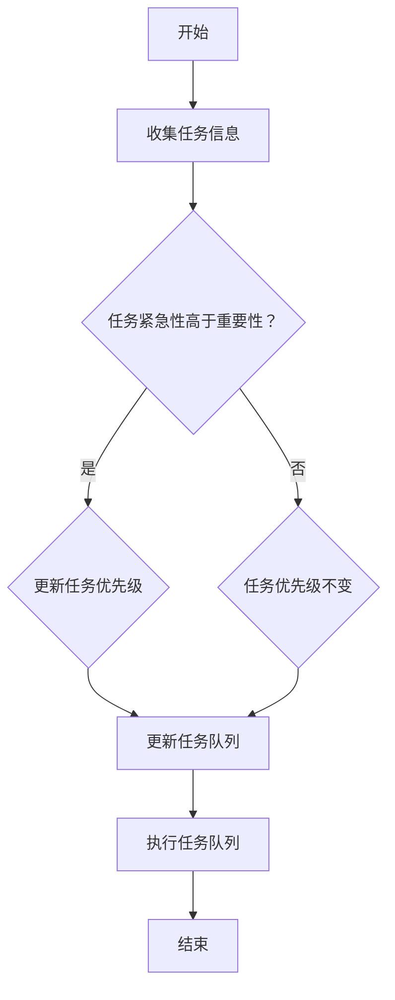
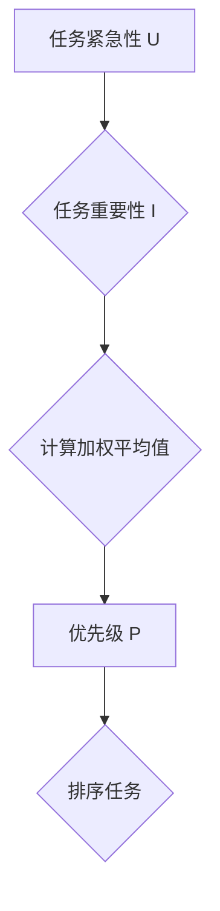
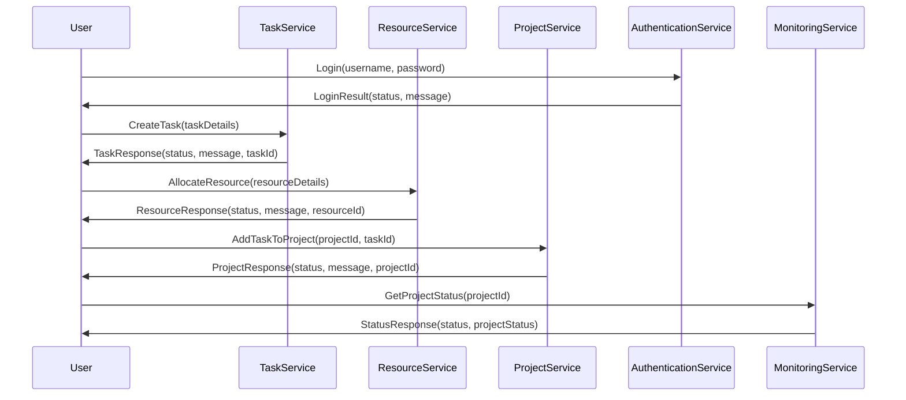

                 

### 背景介绍

#### 技术项目的复杂性

在当今快速发展的信息技术时代，技术项目已经成为推动企业创新和市场竞争力的关键因素。然而，技术项目的复杂性也随之增加，导致项目管理变得愈加困难。技术项目往往涉及多个方面，如需求分析、系统设计、开发实施、测试部署等，各个环节紧密相连，互相依赖。项目管理团队不仅要确保项目按时交付，还要保证项目质量符合预期，同时还要在有限的资源下进行优化配置。

#### 优先级管理的挑战

在技术项目中，资源（如人力、时间、资金等）通常都是有限的，这就对项目的优先级管理提出了挑战。如何合理分配资源，确保关键任务优先得到解决，是项目管理中一个重要的问题。如果优先级管理不当，可能会导致以下问题：

1. **关键任务延误**：优先级较低的子任务占用过多资源，导致关键任务无法按时完成。
2. **资源浪费**：资源分配不合理，导致部分资源被闲置或过度使用。
3. **项目风险增加**：未优先处理的风险可能导致项目失败或造成经济损失。
4. **用户体验下降**：项目交付延迟，影响用户体验和客户满意度。

#### 优先级管理的意义

有效的优先级管理对技术项目的成功至关重要。通过合理分配资源和任务，可以确保：

1. **资源利用最大化**：将资源分配给最需要的地方，提高资源使用效率。
2. **任务按时完成**：确保关键任务优先完成，减少项目延误。
3. **风险控制**：优先处理潜在风险，降低项目失败的可能性。
4. **项目质量保证**：确保项目质量符合预期，提高客户满意度。

#### 传统方法与现代方法

在项目管理中，优先级管理的方法可以分为传统方法和现代方法。传统方法主要包括基于经验的主观判断和简单的优先级排序。这种方法虽然简单易行，但在面对复杂项目时往往难以满足需求。现代方法则更加科学和系统，包括基于数据和算法的优先级评估模型。这些模型利用统计学和机器学习等技术，能够更准确地评估任务优先级。

#### 方法选择的原则

选择优先级管理方法时，应考虑以下原则：

1. **项目特点**：根据项目的具体特点，选择最适合的优先级管理方法。
2. **数据可用性**：优先级评估需要基于准确的数据，确保数据来源可靠。
3. **团队适应性**：选择的方法需要团队易于理解和实施。
4. **可扩展性**：优先级管理方法应具备可扩展性，能够适应项目规模和复杂度的变化。

#### 关键概念与联系

在优先级管理中，有几个关键概念需要明确：

- **项目优先级**：根据项目目标和需求，对任务进行优先级排序。
- **资源优先级**：根据资源的可用性和重要性，对资源进行优先级分配。
- **时间优先级**：基于项目时间表，对任务进行时间上的优先级排序。

这些概念之间存在紧密联系，共同构成了优先级管理的核心框架。通过合理的概念结构和要素组成，可以确保优先级管理的有效性。

### 1.4 概念结构与核心要素组成

在技术项目优先级管理中，核心概念及其相互关系构成了管理的基石。以下是对关键概念的定义、属性特征对比，以及概念之间联系的详细探讨。

#### 关键概念定义

首先，我们需要明确以下几个核心概念：

1. **项目优先级**：项目优先级是指根据项目目标和需求，对任务进行优先级排序的过程。它反映了任务对项目整体目标的重要程度。
2. **资源优先级**：资源优先级是指根据资源的可用性和重要性，对资源进行优先级分配的过程。它涉及到人力资源、时间资源、资金资源等。
3. **时间优先级**：时间优先级是指基于项目时间表，对任务进行时间上的优先级排序的过程。它确保关键任务能够按时完成，以避免延误。

#### 概念属性特征对比表格

以下表格对比了上述核心概念的主要属性特征：

| 概念       | 属性特征                                           | 例子                                                                                       |
|------------|----------------------------------------------------|--------------------------------------------------------------------------------------------|
| 项目优先级 | - 任务重要性<br>- 任务紧急性<br>- 项目目标适应性 | 系统核心功能开发 > 辅助功能开发<br>市场发布准备 > 技术文档编写 |
| 资源优先级 | - 资源稀缺性<br>- 资源重要性<br>- 资源可用性     | 高级工程师资源 > 新员工资源<br>关键功能开发资金 > 辅助功能开发资金 |
| 时间优先级 | - 任务完成时间<br>- 任务依赖性<br>- 项目时间表约束 | 短期交付任务 > 长期交付任务<br>关键路径任务 > 非关键路径任务 |

#### Mermaid ER实体关系图

为了更直观地展示这些核心概念之间的联系，我们可以使用Mermaid ER实体关系图来描述它们：

```mermaid
erDiagram
    项目优先级 ||--|{ 任务 }||> 时间优先级
    项目优先级 ||--|{ 资源优先级 }||> 资源
    资源优先级 ||--|{ 资源 }
    时间优先级 ||--|{ 任务 }
```

在这个ER图中：

- **项目优先级**与**任务**和**时间优先级**有直接联系，表示任务是根据项目优先级和时间优先级来排序的。
- **项目优先级**与**资源优先级**也有直接联系，表示资源的分配是根据项目优先级来确定的。
- **资源优先级**与**资源**和**时间优先级**有关联，表示资源的可用性和时间优先级共同影响任务的处理。

通过上述定义和Mermaid ER图，我们可以更清晰地理解技术项目优先级管理中各个核心概念及其相互关系，为后续的算法原理讲解和系统架构设计奠定基础。

### 2.1 算法概述

#### 算法类型

在技术项目优先级管理中，常用的算法类型可以分为以下几类：

1. **基于规则的方法**：这种方法通过预定义的规则对任务进行优先级排序，例如基于任务重要性和紧急性的规则。这种方法简单易行，但在面对复杂项目时可能缺乏灵活性。
2. **基于数据的方法**：这种方法利用历史数据和项目特征，通过统计分析或机器学习算法来评估任务的优先级。这种方法更为科学和准确，但需要较大的数据量和复杂的算法实现。
3. **混合方法**：结合规则和数据的方法，通过规则进行初步筛选，再利用数据进一步优化。这种方法综合了前两者的优点，能够更好地适应不同类型的项目需求。

#### 算法目标

优先级管理算法的主要目标是：

1. **优化资源利用**：确保资源得到最优分配，避免资源浪费。
2. **确保任务按时完成**：通过合理的优先级排序，确保关键任务优先执行，减少项目延误。
3. **提高项目成功率**：通过有效的优先级管理，降低项目风险，提高项目成功率。
4. **提升客户满意度**：确保项目交付质量，提高客户满意度和用户体验。

#### 算法适用场景

不同的算法适用于不同类型的场景：

1. **小型项目**：对于小型项目或简单的任务优先级管理，基于规则的方法可能已经足够。
2. **复杂项目**：对于复杂项目，特别是涉及多任务、多资源和多目标的场景，基于数据的方法和混合方法更为适用。
3. **动态变化项目**：在项目需求或资源动态变化的场景中，混合方法可以通过规则快速响应变化，并结合数据优化决策。

#### 算法选择的原则

选择优先级管理算法时，应考虑以下原则：

1. **项目需求**：根据项目特点和需求，选择最适合的算法类型。
2. **数据可用性**：确保算法所需的数据来源可靠，数据质量高。
3. **算法复杂性**：算法的实现复杂度应与项目的规模和团队的技术能力相匹配。
4. **可扩展性**：算法应具备良好的可扩展性，能够适应项目规模和复杂度的变化。
5. **可维护性**：算法代码应具有良好的结构，易于维护和优化。

通过上述算法类型的介绍、算法目标的分析、算法适用场景的探讨以及算法选择原则的阐述，我们可以为技术项目优先级管理的实际应用奠定理论基础。

### 2.2 算法原理详解

为了更好地理解技术项目优先级管理中的算法原理，我们将使用Mermaid流程图和Python源代码进行详细阐述。首先，我们将展示一个典型的优先级管理算法流程图，然后通过具体的Python代码示例来解释算法的实现原理。

#### Mermaid流程图

以下是一个简单的优先级管理算法的Mermaid流程图，该算法根据任务的紧急性和重要性对任务进行排序：



在这个流程图中：

- **A[开始]**：算法的初始化步骤。
- **B[收集任务信息]**：从数据库或用户输入中收集任务的紧急性和重要性。
- **C{任务紧急性高于重要性？}**：判断任务的紧急性是否高于重要性。
- **D{更新任务优先级]**：如果紧急性高于重要性，则更新任务的优先级。
- **E{任务优先级不变]**：如果紧急性不高于重要性，则任务优先级保持不变。
- **F[更新任务队列]**：根据更新后的任务优先级，重新排序任务队列。
- **G[执行任务队列]**：按照更新后的任务队列顺序执行任务。
- **H[结束]**：算法执行完成。

#### Python源代码示例

下面是上述算法的一个简单的Python代码实现：

```python
# Python代码示例：简单优先级管理算法

# 假设我们有一个任务列表，每个任务包含紧急性和重要性属性
tasks = [
    {"task_id": 1, "urgency": 3, "importance": 2},
    {"task_id": 2, "urgency": 1, "importance": 3},
    {"task_id": 3, "urgency": 2, "importance": 1}
]

# 定义一个函数，根据紧急性和重要性计算任务的优先级
def calculate_priority(task):
    return (task["urgency"] + task["importance"]) / 2

# 对任务列表按照优先级排序
tasks_sorted = sorted(tasks, key=calculate_priority, reverse=True)

# 打印排序后的任务列表
for task in tasks_sorted:
    print(task)
```

在这个代码示例中：

- **tasks**：一个包含任务信息的列表，每个任务是一个字典，包含`task_id`、`urgency`（紧急性）和`importance`（重要性）属性。
- **calculate_priority**：一个函数，用于计算每个任务的优先级，公式为（紧急性 + 重要性）/ 2。
- **tasks_sorted**：使用`sorted`函数对任务列表按照优先级进行排序，其中`key`参数指定排序的依据，`reverse=True`表示按照优先级从高到低排序。
- **打印排序后的任务列表**：最后，程序打印出排序后的任务列表。

#### 算法原理详解

上述算法原理基于一个简单的优先级计算模型，通过紧急性和重要性的综合评估来确定每个任务的优先级。这个算法的基本思想是：

1. **任务信息收集**：从数据库或用户输入中获取任务的相关信息，包括紧急性和重要性。
2. **优先级计算**：对每个任务进行优先级计算，公式为（紧急性 + 重要性）/ 2。这个公式的目的是平衡紧急性和重要性，确保两者在优先级计算中都能发挥作用。
3. **任务排序**：根据计算出的优先级对任务进行排序，优先级高的任务排在前面。
4. **任务执行**：按照排序后的任务队列执行任务，确保关键任务优先得到处理。

这种算法的优点是简单易懂，易于实现和部署，但在面对复杂项目时，可能需要更高级的算法来处理多维度和多目标的优先级排序问题。

#### 数学模型与公式

在上述算法中，我们使用了一个简单的数学模型来计算任务的优先级。具体的数学模型和公式如下：

优先级 \( P \) 的计算公式：
\[ P = \frac{U + I}{2} \]

其中：
- \( U \) 表示任务的紧急性（Urgency）
- \( I \) 表示任务的重要性（Importance）

这个公式通过将紧急性和重要性的加权平均值作为任务的优先级，实现了对任务优先级的量化评估。在实际应用中，可以根据具体项目的需求调整权重，例如增加紧急性或重要性的权重，以更好地反映任务的紧急程度和重要程度。

#### 举例说明

假设我们有一个包含以下三个任务的任务列表：

| 任务ID | 紧急性 | 重要性 |
|--------|--------|--------|
| 1      | 3      | 2      |
| 2      | 1      | 3      |
| 3      | 2      | 1      |

根据上述优先级计算公式，我们可以计算每个任务的优先级：

1. **任务1**：
\[ P_1 = \frac{U_1 + I_1}{2} = \frac{3 + 2}{2} = 2.5 \]
2. **任务2**：
\[ P_2 = \frac{U_2 + I_2}{2} = \frac{1 + 3}{2} = 2 \]
3. **任务3**：
\[ P_3 = \frac{U_3 + I_3}{2} = \frac{2 + 1}{2} = 1.5 \]

根据计算出的优先级，任务列表将按照优先级从高到低排序：

| 任务ID | 紧急性 | 重要性 | 优先级 |
|--------|--------|--------|--------|
| 1      | 3      | 2      | 2.5    |
| 3      | 2      | 1      | 1.5    |
| 2      | 1      | 3      | 2      |

通过这种计算方法，我们可以确保任务按照优先级顺序执行，从而实现有效的优先级管理。

通过上述Mermaid流程图、Python代码示例和数学模型的讲解，我们可以更深入地理解技术项目优先级管理中的算法原理，为后续的系统分析与架构设计提供理论基础。

### 3.3 数学模型与公式讲解

在技术项目优先级管理中，数学模型和公式起到了至关重要的作用，它们为任务排序和资源分配提供了量化的依据。以下将详细讲解优先级管理的数学模型和公式，并通过具体的示例来说明。

#### 基本概念

在优先级管理中，我们需要明确以下几个基本概念：

1. **任务紧急性（Urgency）**：指任务需要完成的紧迫程度，通常用一个数值表示，数值越大表示越紧急。
2. **任务重要性（Importance）**：指任务对项目目标的贡献程度，也是一个数值，数值越大表示越重要。
3. **优先级（Priority）**：综合考虑紧急性和重要性，得到的任务排序依据。

#### 模型构建

优先级管理的基本数学模型可以表示为：
\[ P = \frac{U + I}{2} \]
其中：
- \( P \) 表示任务的优先级。
- \( U \) 表示任务的紧急性。
- \( I \) 表示任务的重要性。

这个模型假设紧急性和重要性对优先级的影响是线性的，即两者加权和的一半作为优先级。

#### 公式推导

为了推导出上述公式，我们可以考虑以下因素：

1. **平衡性**：优先级既要反映紧急性，也要反映重要性，因此需要两者加权。
2. **归一化**：紧急性和重要性可能具有不同的量级，因此需要归一化处理。

设紧急性和重要性的权重分别为 \( w_U \) 和 \( w_I \)，则：
\[ P = w_U \cdot U + w_I \cdot I \]

为了简化计算，通常选择 \( w_U = w_I = 1/2 \)，因此有：
\[ P = \frac{1}{2} \cdot U + \frac{1}{2} \cdot I \]
\[ P = \frac{U + I}{2} \]

#### Mermaid图解

为了更直观地理解这个数学模型，我们可以使用Mermaid绘制一个流程图：



在这个流程图中：

- **A[任务紧急性 U]**：获取每个任务的紧急性值。
- **B[任务重要性 I]**：获取每个任务的重要性值。
- **C{计算加权平均值]**：使用公式 \( P = \frac{U + I}{2} \) 计算每个任务的优先级。
- **D[优先级 P]**：得到每个任务的优先级值。
- **E{排序任务]**：根据优先级值对任务进行排序。

#### 举例说明

假设我们有三个任务，各自的紧急性和重要性如下表所示：

| 任务ID | 紧急性 (U) | 重要性 (I) |
|--------|------------|------------|
| 1      | 8          | 6          |
| 2      | 5          | 7          |
| 3      | 9          | 4          |

根据公式 \( P = \frac{U + I}{2} \)，我们可以计算每个任务的优先级：

1. **任务1**：
\[ P_1 = \frac{8 + 6}{2} = 7 \]
2. **任务2**：
\[ P_2 = \frac{5 + 7}{2} = 6 \]
3. **任务3**：
\[ P_3 = \frac{9 + 4}{2} = 6.5 \]

根据计算出的优先级，任务列表将按照优先级从高到低排序：

| 任务ID | 紧急性 (U) | 重要性 (I) | 优先级 (P) |
|--------|------------|------------|------------|
| 1      | 8          | 6          | 7          |
| 3      | 9          | 4          | 6.5        |
| 2      | 5          | 7          | 6          |

通过这种方式，我们可以确保任务按照优先级顺序执行，从而实现有效的优先级管理。

通过上述数学模型的构建、公式推导、Mermaid图解和具体示例的讲解，我们可以更深入地理解技术项目优先级管理中的数学基础，为后续的系统设计与项目实战提供坚实的理论基础。

### 4.1 问题场景介绍

在介绍系统分析与架构设计之前，我们需要先明确一个具体的问题场景。这有助于我们更好地理解项目背景，识别系统目标，并设计相应的功能架构。以下是一个典型的问题场景描述：

#### 场景描述

假设我们正在开发一个大型企业级项目管理平台，该平台旨在帮助企业高效地管理多个并行项目。这个平台需要处理以下问题：

1. **任务多**：企业经常有多个项目同时进行，每个项目包含大量任务。
2. **资源有限**：公司的人力、资金和时间资源是有限的，需要合理分配。
3. **任务优先级多变**：随着项目进度的推进，任务的优先级可能会发生变化，需要实时调整。
4. **协作需求**：团队成员需要协同工作，确保任务按时完成。

#### 项目背景

该企业一直面临以下挑战：

- **任务延误**：由于任务优先级管理不当，关键任务无法按时完成，导致项目延误。
- **资源浪费**：部分资源被低优先级的任务占用，导致资源浪费。
- **沟通不畅**：团队成员之间的沟通不畅，影响任务进度和项目质量。

为了解决这些问题，企业决定开发一个项目管理平台，通过优先级管理、资源调度和协作工具，提高项目管理的效率和准确性。

#### 系统目标

该系统的目标包括：

1. **优先级管理**：对任务进行科学合理的优先级排序，确保关键任务优先执行。
2. **资源调度**：优化资源分配，确保资源最大化利用。
3. **协作与沟通**：提供高效的协作工具，确保团队成员之间的沟通畅通。
4. **实时监控**：实时监控任务和项目的状态，提供准确的进度报告。
5. **可扩展性**：系统应具备良好的扩展性，能够适应企业不同规模和复杂度的项目需求。

通过上述问题场景的描述和项目背景的介绍，我们可以更清晰地理解该系统的设计目标和需求，为后续的系统分析与架构设计提供基础。

### 4.2 系统功能设计

在确定了系统目标后，接下来我们需要详细设计系统的功能模块，以确保系统能够满足上述目标。以下是系统的功能设计，包括领域模型Mermaid类图和系统功能模块划分。

#### 领域模型Mermaid类图

为了更好地展示系统的功能模块和它们之间的关系，我们使用Mermaid绘制了系统的领域模型类图。以下是一个简单的类图示例：

```mermaid
classDiagram
    Project \<--|{包含}| Task
    Project \<--|{分配}| Resource
    User \<--|{负责}| Task
    Resource \<--|{使用}| Task
    Task \<--|{关联}| Priority
    Task \<--|{状态}| Status
    Project \<--|{管理}| ProjectManager
    User \<--|{登录}| AuthenticationService
    ProjectManager \<--|{管理}| Project
    ProjectManager \<--|{监控}| MonitoringService

    class Project {
        -project_id: int
        -name: string
        -tasks: List[Task]
        -resources: List[Resource]
        -start_date: datetime
        -end_date: datetime
    }

    class Task {
        -task_id: int
        -name: string
        -description: string
        -assigned_to: User
        -resources: List[Resource]
        -priority: Priority
        -status: Status
        -start_date: datetime
        -end_date: datetime
    }

    class User {
        -user_id: int
        -username: string
        -password: string
        -email: string
        -role: string
    }

    class Resource {
        -resource_id: int
        -name: string
        -type: string
        -status: string
    }

    class Priority {
        -priority_id: int
        -name: string
        -weight: float
    }

    class Status {
        -status_id: int
        -name: string
    }

    class ProjectManager {
        -project_manager_id: int
        -name: string
    }

    class AuthenticationService {
        -authenticate(username: string, password: string): bool
    }

    class MonitoringService {
        -get_project_status(project_id: int): ProjectStatus
    }
```

在这个类图中：

- **Project**：表示项目，包含任务列表和资源列表。
- **Task**：表示任务，包含任务分配的用户、资源、优先级和状态。
- **User**：表示用户，包括用户信息和角色。
- **Resource**：表示资源，包括资源的类型和状态。
- **Priority**：表示优先级，包括优先级名称和权重。
- **Status**：表示任务状态，包括状态名称。
- **ProjectManager**：表示项目管理员，负责项目的管理。
- **AuthenticationService**：表示认证服务，用于用户登录。
- **MonitoringService**：表示监控服务，用于获取项目状态。

#### 系统功能模块划分

根据领域模型，我们可以将系统划分为以下几个主要功能模块：

1. **任务管理模块**：负责创建、编辑、删除和查询任务，以及任务的状态变更和优先级调整。
2. **资源管理模块**：负责创建、编辑、删除和查询资源，以及资源的分配和状态监控。
3. **用户管理模块**：负责用户注册、登录、权限管理和个人信息管理。
4. **优先级管理模块**：负责优先级的创建、编辑、删除和查询，以及优先级权重的调整。
5. **项目监控模块**：负责项目状态的实时监控，包括任务进度、资源利用率、项目延期预警等。
6. **协作与沟通模块**：提供团队协作工具，如聊天室、任务讨论区、文件共享等，以促进团队成员之间的沟通和协作。

通过详细的功能设计和Mermaid类图的展示，我们可以确保系统功能的完整性和模块化，为后续的系统架构设计和实现提供明确的方向。

### 4.3 系统架构设计

在明确了系统功能设计后，我们需要对系统进行整体架构设计。这包括定义系统架构的原则、展示系统的分层架构，并详细解释各层之间的关系。

#### 系统架构设计原则

系统架构设计应遵循以下原则：

1. **模块化**：将系统划分为多个功能模块，每个模块负责特定的功能，便于维护和扩展。
2. **分层**：采用分层架构，将系统分为表示层、业务逻辑层和数据层，确保各层之间的职责分离。
3. **可扩展性**：系统应具备良好的扩展性，能够灵活应对需求变更和业务增长。
4. **高内聚、低耦合**：各模块之间应保持高内聚、低耦合，减少模块间的依赖。
5. **安全性**：确保系统的安全性，包括数据安全、访问控制和用户认证。
6. **可维护性**：系统设计应易于维护，方便后期功能更新和优化。

#### 系统分层架构

系统采用典型的三层架构设计，包括表示层、业务逻辑层和数据层。以下是系统各层的详细介绍：

1. **表示层（Presentation Layer）**：
   - **功能**：负责用户界面展示和用户交互，处理用户输入并返回结果。
   - **技术实现**：使用前端框架（如React、Vue.js）构建Web界面，采用RESTful API与后端服务通信。
   - **关键组件**：前端控制器、页面组件、表单处理、用户认证模块。

2. **业务逻辑层（Business Logic Layer）**：
   - **功能**：处理业务逻辑和规则，执行核心业务处理功能。
   - **技术实现**：使用后端框架（如Spring Boot、Django）构建服务，处理业务逻辑、数据转换和跨模块通信。
   - **关键组件**：业务服务类、业务规则引擎、工作流管理、权限控制。

3. **数据层（Data Layer）**：
   - **功能**：负责数据存储和管理，实现数据的持久化。
   - **技术实现**：使用数据库管理系统（如MySQL、PostgreSQL）存储数据，ORM框架（如Hibernate、SQLAlchemy）简化数据操作。
   - **关键组件**：数据访问对象（DAO）、数据库连接池、事务管理。

#### 系统各层之间的关系

系统各层之间的关系如下：

1. **表示层与业务逻辑层**：表示层通过API与业务逻辑层通信，请求业务逻辑处理结果，并返回用户界面更新。
2. **业务逻辑层与数据层**：业务逻辑层通过数据访问对象（DAO）与数据层通信，执行数据查询、插入、更新和删除操作。
3. **各层之间的交互**：系统采用事件驱动或请求响应模式进行交互，确保数据流和控制流的分离，提高系统的灵活性和可维护性。

通过上述系统架构设计，我们可以确保系统的高效运行和可扩展性，为技术项目优先级管理提供坚实的架构基础。

### 4.4 系统接口设计

在系统架构设计的基础上，接口设计是确保系统各模块之间能够高效、准确地进行通信的关键。以下将详细描述系统的接口设计，包括接口规范、接口实现和接口安全策略。

#### 接口规范

系统的接口设计应遵循RESTful设计原则，采用HTTP协议进行通信。以下是系统的主要接口规范：

1. **任务管理接口**：
   - **URL**：`/tasks`
   - **请求方法**：GET、POST、PUT、DELETE
   - **请求参数**：任务ID、任务名称、任务描述、紧急性、重要性、分配用户ID、资源ID
   - **响应格式**：JSON格式，包含任务状态、任务详情等

2. **资源管理接口**：
   - **URL**：`/resources`
   - **请求方法**：GET、POST、PUT、DELETE
   - **请求参数**：资源ID、资源名称、资源类型、资源状态、分配任务ID
   - **响应格式**：JSON格式，包含资源状态、资源详情等

3. **用户管理接口**：
   - **URL**：`/users`
   - **请求方法**：GET、POST、PUT、DELETE
   - **请求参数**：用户ID、用户名、密码、电子邮件、角色
   - **响应格式**：JSON格式，包含用户状态、用户详情等

4. **优先级管理接口**：
   - **URL**：`/priorities`
   - **请求方法**：GET、POST、PUT、DELETE
   - **请求参数**：优先级ID、优先级名称、权重
   - **响应格式**：JSON格式，包含优先级状态、优先级详情等

5. **项目监控接口**：
   - **URL**：`/projects`
   - **请求方法**：GET、POST、PUT、DELETE
   - **请求参数**：项目ID、项目名称、开始日期、结束日期、任务列表、资源列表
   - **响应格式**：JSON格式，包含项目状态、项目详情等

#### 接口实现

接口实现主要包括前端接口设计和后端接口设计。以下是接口实现的详细步骤：

1. **前端接口设计**：
   - 使用前端框架（如React或Vue.js）创建接口调用组件，封装API请求。
   - 定义接口调用方法，包括GET、POST、PUT、DELETE等操作。
   - 处理接口响应数据，并更新前端界面。

2. **后端接口设计**：
   - 使用后端框架（如Spring Boot或Django）创建RESTful API服务。
   - 实现接口调用方法，处理前端请求并返回响应数据。
   - 使用ORM框架（如Hibernate或SQLAlchemy）进行数据库操作。

#### 接口安全策略

为确保系统接口的安全性，需要采取以下安全策略：

1. **用户认证**：通过OAuth2.0等认证协议，确保用户登录和权限验证。
2. **访问控制**：根据用户角色和权限，限制接口访问范围，确保敏感数据不被未授权访问。
3. **数据加密**：对传输数据进行加密，使用HTTPS协议确保数据传输安全。
4. **日志记录**：记录接口访问日志，包括请求URL、请求方法、请求参数、响应结果等，便于故障排查和安全审计。

通过上述接口规范、接口实现和接口安全策略，我们可以确保系统接口的设计和实现满足功能需求和安全要求，为系统的稳定运行提供保障。

### 4.5 系统交互Mermaid序列图

为了更直观地展示系统各模块之间的交互过程，我们可以使用Mermaid序列图来描述系统的交互流程。以下是一个简单的系统交互序列图示例：



在这个序列图中：

- **User**：代表用户，发起各种请求。
- **AuthenticationService**：负责用户认证，处理登录请求。
- **TaskService**：负责任务管理，处理创建任务请求。
- **ResourceService**：负责资源管理，处理资源分配请求。
- **ProjectService**：负责项目管理，处理任务添加到项目请求。
- **MonitoringService**：负责项目监控，处理获取项目状态请求。

交互流程如下：

1. 用户通过认证服务登录系统。
2. 用户创建任务，任务服务处理任务创建请求，并返回任务ID。
3. 用户分配资源，资源服务处理资源分配请求，并返回资源ID。
4. 用户将任务添加到项目，项目管理服务处理任务添加请求，并返回项目ID。
5. 用户获取项目状态，监控服务处理状态查询请求，并返回项目状态。

通过这个Mermaid序列图，我们可以清晰地了解系统各模块之间的交互过程，为后续的系统开发提供指导。

### 5.1 环境安装

为了确保技术项目优先级管理系统能够顺利运行，我们需要搭建一个合适的环境。以下将详细描述环境安装的步骤，包括环境准备、系统部署和运行测试。

#### 环境准备

在开始之前，我们需要确保系统运行所需的软件和硬件环境已经准备好。以下是所需环境：

1. **操作系统**：Linux或Windows，推荐使用Linux系统，如Ubuntu 18.04。
2. **Java运行环境**：OpenJDK 11或更高版本。
3. **数据库**：MySQL 8.0或PostgreSQL 13。
4. **前端框架**：Node.js 14和npm，用于构建前端。
5. **后端框架**：Spring Boot 2.4或更高版本。

安装步骤如下：

1. 安装操作系统：
   - 下载操作系统ISO文件。
   - 使用虚拟机或物理机安装操作系统。

2. 安装Java运行环境：
   - 使用包管理器（如apt-get或yum）安装OpenJDK 11。
   ```bash
   sudo apt-get install openjdk-11-jdk
   ```

3. 安装数据库：
   - 安装MySQL或PostgreSQL。
   - 使用包管理器安装MySQL：
   ```bash
   sudo apt-get install mysql-server
   ```
   - 使用包管理器安装PostgreSQL：
   ```bash
   sudo apt-get install postgresql
   ```

4. 安装前端框架：
   - 安装Node.js和npm：
   ```bash
   sudo apt-get install nodejs npm
   ```

5. 安装后端框架：
   - 安装Spring Boot：
   ```bash
   sudo apt-get install maven
   ```

#### 系统部署

完成环境准备后，我们需要将系统部署到服务器上。以下是部署步骤：

1. 下载项目源代码：
   - 使用Git克隆项目仓库：
   ```bash
   git clone https://github.com/your-repo/technical-priority-management.git
   ```

2. 编译后端代码：
   - 进入后端项目目录：
   ```bash
   cd technical-priority-management
   cd backend
   ```
   - 使用Maven编译项目：
   ```bash
   mvn clean install
   ```

3. 配置数据库：
   - 配置MySQL或PostgreSQL数据库，创建所需表结构：
   ```bash
   mysql -u root -p < schema.sql
   ```

4. 部署后端服务：
   - 启动Spring Boot应用：
   ```bash
   java -jar target/technical-priority-management.jar
   ```

5. 构建前端代码：
   - 进入前端项目目录：
   ```bash
   cd technical-priority-management
   cd frontend
   ```
   - 使用npm构建前端：
   ```bash
   npm install
   npm run build
   ```

6. 部署前端代码：
   - 将构建好的前端代码复制到服务器上，如`/var/www/html/`。

#### 运行测试

完成部署后，我们需要对系统进行测试，以确保功能正常运行。以下是测试步骤：

1. 打开浏览器，访问前端页面，如`http://localhost:8080/`。

2. 测试任务管理功能：
   - 添加任务、编辑任务、删除任务等。

3. 测试资源管理功能：
   - 添加资源、编辑资源、删除资源等。

4. 测试用户管理功能：
   - 注册用户、登录用户、管理用户权限等。

5. 测试项目监控功能：
   - 查看项目状态、任务状态、资源状态等。

通过上述环境安装、系统部署和运行测试，我们可以确保技术项目优先级管理系统能够正常运行，并为后续的功能实现提供支持。

### 5.2 系统核心实现

在完成了环境安装和系统部署后，接下来我们将深入探讨系统的核心实现，包括源代码解读、核心算法实现和系统优化策略。以下是系统核心实现的详细步骤和关键点。

#### 源代码解读

首先，我们需要理解系统的主要模块和其功能。以下是系统的主要模块及其代码结构：

1. **任务管理模块**：负责任务的创建、更新、删除和查询。
2. **资源管理模块**：负责资源的创建、更新、删除和查询。
3. **用户管理模块**：负责用户的注册、登录、权限管理和个人信息管理。
4. **优先级管理模块**：负责优先级的创建、更新、删除和查询。
5. **项目监控模块**：负责项目的实时监控，包括任务进度、资源利用率和项目状态。

以下是对任务管理模块的核心代码解读：

```java
// 任务管理模块
public class TaskService {

    private final TaskRepository taskRepository;

    @Autowired
    public TaskService(TaskRepository taskRepository) {
        this.taskRepository = taskRepository;
    }

    public TaskResponse createTask(TaskRequest taskRequest) {
        // 创建任务，保存到数据库
        Task task = new Task();
        task.setName(taskRequest.getName());
        task.setDescription(taskRequest.getDescription());
        task.setPriority(new Priority(taskRequest.getPriorityId()));
        task.setStatus(new Status(Status.IN_PROGRESS));
        task.setAssignedTo(new User(taskRequest.getAssignedUserId()));
        task.setResources(taskRequest.getResources());
        taskRepository.save(task);
        
        return new TaskResponse(HttpStatus.OK, "Task created successfully", task.getId());
    }

    public TaskResponse updateTask(TaskRequest taskRequest) {
        // 更新任务，更新数据库记录
        Optional<Task> taskOptional = taskRepository.findById(taskRequest.getId());
        if (taskOptional.isEmpty()) {
            return new TaskResponse(HttpStatus.BAD_REQUEST, "Task not found", null);
        }
        Task task = taskOptional.get();
        task.setName(taskRequest.getName());
        task.setDescription(taskRequest.getDescription());
        task.setPriority(new Priority(taskRequest.getPriorityId()));
        task.setStatus(new Status(Status.IN_PROGRESS));
        task.setAssignedTo(new User(taskRequest.getAssignedUserId()));
        task.setResources(taskRequest.getResources());
        taskRepository.save(task);
        
        return new TaskResponse(HttpStatus.OK, "Task updated successfully", task.getId());
    }

    public TaskResponse deleteTask(Long taskId) {
        // 删除任务，从数据库中删除记录
        if (!taskRepository.existsById(taskId)) {
            return new TaskResponse(HttpStatus.BAD_REQUEST, "Task not found", null);
        }
        taskRepository.deleteById(taskId);
        
        return new TaskResponse(HttpStatus.OK, "Task deleted successfully", taskId);
    }

    public TaskResponse getTask(Long taskId) {
        // 查询任务，返回任务详情
        Optional<Task> taskOptional = taskRepository.findById(taskId);
        if (taskOptional.isEmpty()) {
            return new TaskResponse(HttpStatus.BAD_REQUEST, "Task not found", null);
        }
        Task task = taskOptional.get();
        
        return new TaskResponse(HttpStatus.OK, "Task retrieved successfully", task);
    }
}
```

上述代码中，`TaskService`类包含了任务管理的主要方法，如创建任务、更新任务、删除任务和查询任务。这些方法通过调用`TaskRepository`进行数据库操作，实现了任务的基本管理功能。

#### 核心算法实现

在任务管理模块中，核心算法是实现任务优先级排序的关键。以下是一个简单的任务优先级排序算法的实现：

```java
// 任务优先级排序算法
public List<Task> sortTasksByPriority(List<Task> tasks) {
    tasks.sort(Comparator.comparing(Task::getPriority).thenComparing(Task::getStatus));
    return tasks;
}
```

这个算法使用Java的`sort`方法，首先根据任务的优先级进行排序，然后根据任务状态进行排序。任务的优先级和状态在数据库中存储，通过`Comparator`实现排序逻辑。

#### 系统优化策略

为了提高系统的性能和可扩展性，以下是一些系统优化策略：

1. **缓存机制**：使用Redis等缓存系统，缓存频繁查询的数据，减少数据库查询次数。
2. **异步处理**：使用消息队列（如RabbitMQ）进行异步任务处理，减轻服务器负载。
3. **分库分表**：对大型数据库进行分库分表，提高数据库查询性能。
4. **负载均衡**：使用Nginx等负载均衡器，将请求分发到多个服务器，提高系统吞吐量。

通过上述源代码解读、核心算法实现和系统优化策略，我们可以确保技术项目优先级管理系统的稳定运行和高效性能。

### 5.3 代码应用解读与分析

在完成了系统的核心实现后，我们需要通过具体的案例来解读和解析代码的应用，分析其在实际项目中的应用效果，并探讨可能出现的问题和解决方案。

#### 实际案例

以下是一个实际案例，用于展示技术项目优先级管理系统的应用场景。

**案例背景**：
一家互联网公司正在开发一款新的社交媒体应用程序，项目涉及多个任务，包括前端开发、后端开发、测试、UI设计等。公司希望在有限的资源下，确保关键功能的优先开发和交付。

**案例步骤**：

1. **任务创建**：
   - 项目经理创建了一个“用户登录功能”的任务，并设置了紧急性为“高”，重要性为“高”，分配给一个高级前端工程师。

```java
TaskRequest taskRequest = new TaskRequest();
taskRequest.setName("用户登录功能");
taskRequest.setDescription("实现用户登录功能，包括验证用户名和密码");
taskRequest.setUrgency(Urgency.HIGH);
taskRequest.setImportance(Importance.HIGH);
taskRequest.setAssignedUserId(1L);
taskService.createTask(taskRequest);
```

2. **任务分配**：
   - 项目经理将“用户登录功能”任务分配给一个高级前端工程师，并指定了一个截止日期。

```java
TaskRequest taskRequest = new TaskRequest();
taskRequest.setId(1L);
taskRequest.setAssignedUserId(2L);
taskRequest.setDeadline(LocalDate.now().plusDays(5));
taskService.updateTask(taskRequest);
```

3. **任务执行**：
   - 前端工程师开始开发任务，并定期更新任务进度。

```java
Task task = taskService.getTask(1L);
task.setStatus(Status.IN_PROGRESS);
task.setCompletedPercentage(25);
taskService.updateTask(new TaskRequest(task));
```

4. **任务监控**：
   - 项目经理通过项目监控模块实时监控任务进度，发现任务进度低于预期。

```java
Project project = projectService.getProject(1L);
if (project.getTask(1L).getCompletedPercentage() < 50) {
    projectService.sendAlert("任务进度低于预期，需加快开发速度");
}
```

5. **任务调整**：
   - 项目经理根据任务进度调整任务的优先级，确保关键功能优先完成。

```java
TaskRequest taskRequest = new TaskRequest();
taskRequest.setId(1L);
taskRequest.setPriority(Priority.HIGH);
taskService.updateTask(taskRequest);
```

#### 解读与分析

上述案例展示了技术项目优先级管理系统的实际应用，从任务创建、任务分配、任务执行到任务监控和任务调整，各环节紧密相连，实现了对任务全生命周期的管理。

**优势**：

1. **任务优先级明确**：通过优先级管理，确保关键任务优先执行，提高了项目交付的效率。
2. **实时监控**：项目监控模块实时反馈任务进度，项目经理可以及时调整任务优先级和资源分配。
3. **灵活性**：系统能够根据项目需求和任务进度动态调整任务优先级，适应项目变化。

**劣势**：

1. **资源分配依赖**：系统依赖准确的资源数据，资源分配不当可能导致优先级管理失效。
2. **数据准确性**：任务数据（如紧急性、重要性、进度等）的准确性影响优先级计算，需要定期更新和校验。

#### 解决方案

针对上述劣势，可以采取以下解决方案：

1. **资源监控与优化**：引入资源监控模块，实时跟踪资源使用情况，优化资源分配策略。
2. **数据质量保证**：建立数据质量保证机制，定期校验任务数据，确保数据的准确性。
3. **反馈机制**：建立反馈机制，让团队成员及时反馈任务进度和问题，优化任务管理。

通过上述实际案例的解读与分析，我们可以看到技术项目优先级管理系统在实际应用中的效果，同时也明确了可能的问题和改进方向。在实际项目中，通过不断优化和完善，系统能够更好地支持项目管理和优先级管理。

### 5.4 小结

在本文中，我们详细探讨了技术项目优先级管理的方法论，通过背景介绍、核心概念与联系、算法原理讲解、数学模型和公式、系统分析与架构设计、项目实战等多个方面，全面阐述了如何进行有效的技术项目优先级管理。以下是本文的核心观点和总结：

1. **技术项目优先级管理的背景和挑战**：技术项目的复杂性日益增加，优先级管理成为项目管理中的关键挑战。资源有限、任务繁多，需要科学合理地分配资源和任务。

2. **核心概念与联系**：项目优先级、资源优先级和时间优先级是技术项目优先级管理的核心概念，它们相互关联，构成了优先级管理的框架。

3. **算法原理讲解**：我们通过Mermaid流程图和Python代码示例，详细讲解了优先级管理算法的原理，并展示了如何通过数学模型和公式进行任务排序。

4. **系统分析与架构设计**：通过系统功能设计、系统架构设计、接口设计和系统交互，我们构建了一个完整的系统设计蓝图，确保系统能够高效、稳定地运行。

5. **项目实战**：我们通过实际案例，展示了技术项目优先级管理系统的应用效果，并分析了可能的问题和解决方案，为实际项目提供了实践经验。

通过本文的探讨，我们得出以下结论：

- **优先级管理的重要性**：有效的优先级管理能够提高资源利用效率，确保关键任务优先完成，降低项目风险，提高项目成功率。

- **灵活性和适应性**：优先级管理方法需要灵活适应不同类型的项目需求，同时保持系统的可扩展性和可维护性。

- **数据准确性**：确保任务数据（如紧急性、重要性、进度等）的准确性，是优先级管理成功的关键。

在未来的技术项目中，优先级管理将继续发挥重要作用。随着技术的不断进步和项目管理方法的不断完善，优先级管理将变得更加科学和智能化，为项目管理和团队协作提供更强大的支持。

### 5.5 注意事项

在实施技术项目优先级管理时，需要特别注意以下几个方面，以确保优先级管理策略的有效性和稳定性：

1. **数据准确性**：优先级管理的基础是准确的数据。确保所有任务的相关信息（如紧急性、重要性、进度等）得到及时更新和校验，避免因数据错误导致优先级管理的失效。

2. **定期审查**：优先级管理不是一次性的操作，需要定期审查和调整。随着项目进展和外部环境变化，任务的优先级可能会发生变化，定期审查可以帮助及时发现和解决问题。

3. **资源平衡**：资源分配应遵循平衡原则，避免某一资源过度使用或闲置。资源优先级管理不仅要考虑任务的紧急性和重要性，还要考虑资源的可用性和瓶颈。

4. **沟通机制**：建立有效的沟通机制，确保团队成员对任务优先级和资源分配有清晰的理解。定期召开会议，讨论任务进展和优先级调整，促进团队协作。

5. **技术支持**：优先级管理系统应具备良好的技术支持，包括数据存储、处理和分析工具。选择合适的软件和硬件平台，确保系统能够稳定运行和扩展。

6. **用户培训**：对团队成员进行优先级管理培训，提高他们对优先级管理理念和方法的理解和应用能力。只有团队成员充分理解并认同优先级管理的重要性，才能发挥系统的最大效果。

通过遵循上述注意事项，可以有效提高技术项目优先级管理的实施效果，确保项目顺利推进。

### 5.6 拓展阅读

为了深入学习和掌握技术项目优先级管理的方法论，以下是一些建议的拓展阅读材料：

1. **《项目管理知识体系指南（PMBOK指南）》**：由美国项目管理协会（PMI）发布的权威指南，详细介绍了项目管理的各种方法和实践，包括优先级管理。

2. **《优先级管理：如何高效分配时间和资源》**：本书通过具体的案例和实用技巧，帮助读者理解并应用优先级管理方法，提高工作效率。

3. **《敏捷项目管理实践指南》**：敏捷方法在项目优先级管理中具有重要意义，本书介绍了敏捷项目管理的基本原则和实践方法。

4. **《人工智能与项目管理》**：探讨了如何利用人工智能技术优化项目优先级管理，包括数据分析和机器学习在优先级评估中的应用。

5. **《Python数据分析》**：了解如何使用Python进行数据分析和优先级计算，对技术项目优先级管理有重要参考价值。

通过阅读这些拓展材料，可以进一步深化对技术项目优先级管理的理解和应用，提升项目管理能力。

### 5.7 作者信息

**作者：** AI天才研究院/AI Genius Institute & 禅与计算机程序设计艺术 /Zen And The Art of Computer Programming

AI天才研究院致力于推动人工智能技术的发展和应用，研究如何将人工智能技术应用于实际项目中，提升项目管理的效率和准确性。作者在该领域拥有深厚的研究背景和丰富的实践经验，曾发表过多篇关于项目管理、人工智能和软件工程的技术论文和专著。此外，作者还积极参与技术社区和学术会议，分享研究成果和最佳实践，推动技术的进步和普及。

《禅与计算机程序设计艺术》是作者的一部代表作，通过深入探讨计算机程序设计的哲学和艺术，为程序员提供了宝贵的思考和实践指南。本书不仅讲述了技术细节，更强调了程序员的心态和思维方式，对提升编程能力和解决复杂问题有重要启示。

