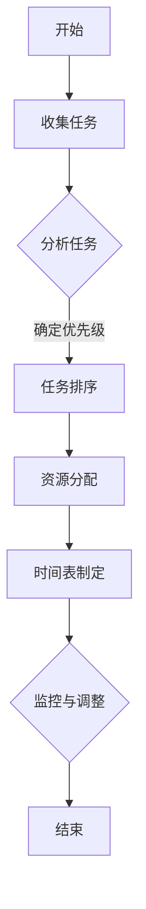
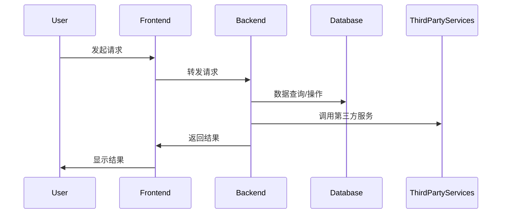
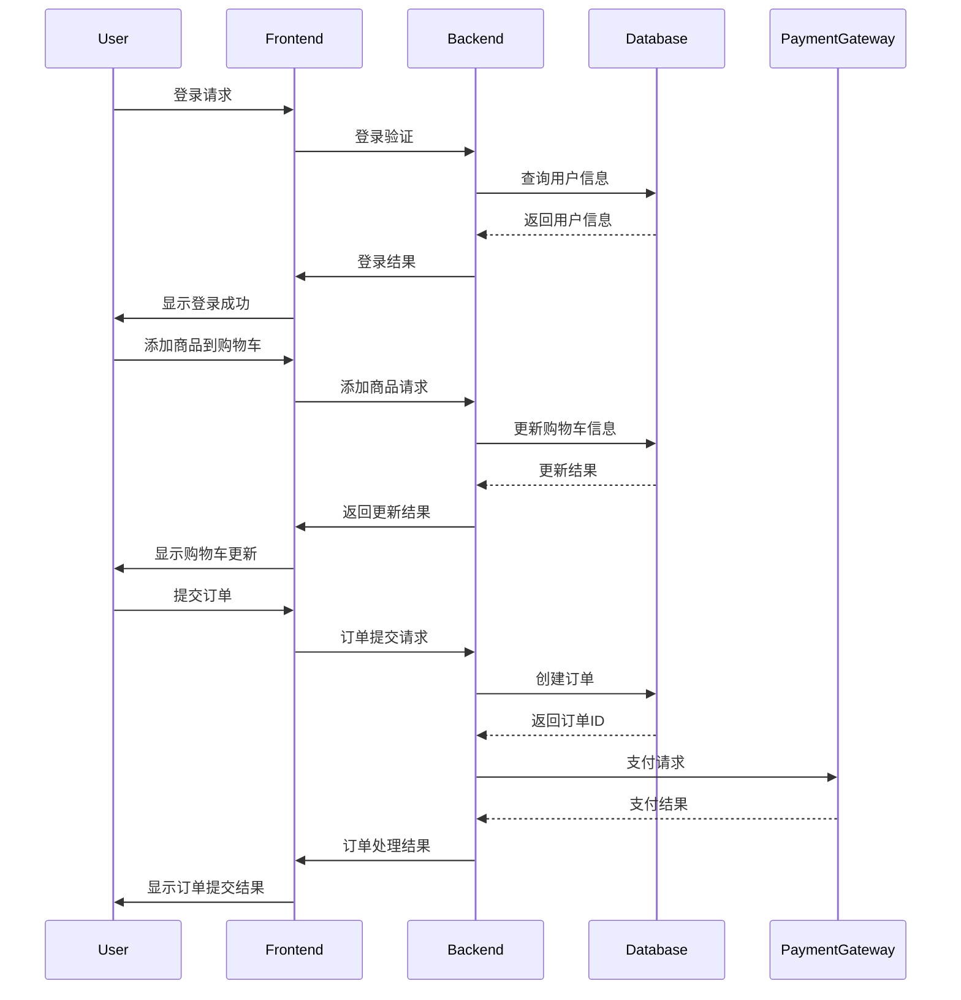

                 

# 技术项目的优先级管理方法

## 关键词
- 技术项目管理
- 优先级管理
- 资源分配
- 项目计划
- 沟通协作

## 摘要
本文旨在深入探讨技术项目的优先级管理方法，帮助项目经理和团队有效地识别、评估和管理项目中的任务和需求。通过分析核心概念、模型、实践方法和案例分析，本文将为读者提供一套全面且实用的优先级管理策略，以提升项目成功率和效率。

## 引言

### 技术项目管理的挑战
在当今快速变化的技术环境中，项目管理面临着诸多挑战。首先，技术项目通常涉及复杂的系统和技术架构，这要求项目经理具备深厚的专业知识。其次，技术项目的需求往往变化频繁，这使得项目计划和资源分配变得极为困难。此外，团队协作和沟通也是项目管理中的重要挑战，特别是在多团队协作和跨文化环境中。

### 优先级管理的重要性
优先级管理是技术项目管理中至关重要的环节。有效的优先级管理可以帮助团队明确哪些任务最为关键，从而确保项目资源的最佳利用和项目目标的按时达成。通过合理地排序任务，团队可以集中精力处理高优先级的工作，避免资源浪费和项目延误。

### 书籍结构概述
本文将分为以下几个部分：

1. **核心概念与模型**：介绍优先级管理的基础概念和常见模型。
2. **资源与时间管理**：探讨资源分配和时间管理策略。
3. **项目需求分析**：分析项目需求并确定优先级。
4. **项目计划与执行**：制定和执行项目计划。
5. **团队协作与沟通**：讨论团队协作和沟通的重要性及其技巧。
6. **最佳实践与案例分析**：总结最佳实践并分析典型案例。
7. **结论**：总结优先级管理的关键要点和未来发展方向。

## 第一部分：核心概念与模型

### 1.1 优先级管理框架

#### 什么是优先级
优先级是指任务或需求在时间表上的重要性和紧迫性。高优先级任务通常需要更快地处理，因为它们对项目的成功或对业务的影响更为关键。

#### 优先级管理的目的
优先级管理的目的是确保项目资源和时间得到最佳利用，从而最大化项目价值和客户满意度。通过优先级管理，项目团队能够：

- **集中精力**：处理最关键的任务。
- **减少延误**：确保关键任务按时完成。
- **优化资源**：有效分配人力资源和技术资源。

#### 常见的优先级管理模型

##### MoSCoW 模型
MoSCoW 模型是一种常见的优先级管理方法，它将需求分为以下四类：

- **必须的（MUST）**：项目无法成功执行的关键需求。
- **应该的（SHOULD）**：对项目成功有帮助，但不是绝对必要的需求。
- **可以接受的（COULD）**：对项目有一定影响，但可以暂时忽略的需求。
- **可以延迟的（WON'T THIS TIME）**：在当前版本中不实现的需求。

##### RICE 模型
RICE 模型是一种基于需求价值和可行性的优先级评估方法，其中：

- ** Reach **：需求的潜在用户规模。
- ** Impact **：需求对用户体验和业务的影响。
- ** Confidence **：实现需求的信心水平。
- ** Effort **：实现需求所需的努力。

### 1.2 关键性能指标（KPI）

#### KPI 的定义与作用
关键性能指标（KPI）是衡量项目成功的重要标准。KPI 用于评估项目目标是否达成，以及资源使用的效率。

#### 常见的 KPI 类型
- **项目进度 KPI**：如完成百分比、关键路径进度等。
- **成本 KPI**：如预算花费、成本节约等。
- **质量 KPI**：如缺陷率、客户满意度等。
- **效率 KPI**：如员工生产力、资源利用率等。

#### 如何设置合理的 KPI
设置 KPI 时，应考虑以下因素：

- **相关性**：KPI 应与项目目标紧密相关。
- **可衡量性**：KPI 应是可量化且可追踪的。
- **挑战性**：KPI 应具有适当的难度，以激励团队努力达成。
- **及时性**：KPI 应提供及时的信息，以支持决策。

### 1.3 资源与时间管理

#### 资源分配策略
资源分配策略旨在确保项目所需的资源得到合理利用。以下是一些常见的资源分配策略：

- **优先级分配**：根据任务的优先级分配资源。
- **均衡分配**：确保资源在不同任务之间平衡分配。
- **负载均衡**：根据员工的工作负荷分配任务。

#### 时间管理技巧
时间管理是优先级管理的重要组成部分。以下是一些有效的时间管理技巧：

- **时间块**：将时间划分为固定的时间块，专注于处理高优先级任务。
- **优先级排序**：使用如“四象限法”将任务分为紧急与重要，处理高优先级的任务。
- **避免拖延**：使用“番茄工作法”等技巧，减少拖延，提高工作效率。

## 第二部分：项目需求分析

### 2.1 需求分析流程

#### 需求定义
需求定义是需求分析的第一步，涉及确定项目的目标、功能和非功能需求。

#### 需求分类
需求可以按以下方式分类：

- **功能需求**：描述系统应具备的功能。
- **非功能需求**：描述系统的性能、安全性、可靠性等。
- **优先级需求**：根据需求的重要性和紧迫性进行分类。

#### 需求优先级排序方法
常见的需求优先级排序方法包括：

- **MoSCoW 模型**：基于需求的紧急性和重要性进行排序。
- **RICE 模型**：基于需求的价值和可行性进行排序。

### 2.2 需求变更管理

#### 变更的原因与影响
需求变更可能由以下原因引起：

- **客户需求变化**
- **技术环境变化**
- **项目管理决策**
  
需求变更会影响项目的进度、成本和质量，因此必须进行严格控制。

#### 变更控制流程
变更控制流程通常包括以下步骤：

- **变更请求**：提出变更请求并记录。
- **评估影响**：评估变更对项目的影响。
- **审批变更**：根据影响评估结果，审批或拒绝变更。
- **更新计划**：更新项目计划以反映变更。

#### 如何处理优先级变更
处理优先级变更时，应考虑以下因素：

- **变更的紧急性和重要性**：高优先级变更应优先处理。
- **资源可用性**：确保有足够的资源来处理变更。
- **项目目标**：确保变更与项目目标保持一致。

## 第三部分：项目计划与执行

### 3.1 项目计划制定

#### 项目计划的关键要素
项目计划应包括以下关键要素：

- **项目目标**：明确项目的目标和预期成果。
- **任务列表**：列出所有项目任务和活动。
- **时间表**：确定每个任务的开始和结束时间。
- **资源分配**：分配所需的人员、设备和其他资源。
- **预算**：确定项目成本预算。
- **风险评估**：识别潜在的风险并制定应对策略。

#### 项目计划制定流程
项目计划制定流程包括以下步骤：

- **项目启动**：确定项目目标和范围。
- **需求分析**：收集和整理项目需求。
- **任务分解**：将项目分解为更小的任务。
- **时间表制定**：制定项目时间表。
- **资源分配**：分配项目资源。
- **预算制定**：制定项目预算。
- **风险评估**：识别和评估项目风险。
- **计划评审**：评审和批准项目计划。

#### 如何优化项目计划
优化项目计划的方法包括：

- **关键路径法**：识别项目中的关键路径，以确保项目按时完成。
- **资源平衡**：优化资源分配，以避免资源浪费和过度使用。
- **敏捷方法**：采用敏捷方法，以快速响应变化并提高项目灵活性。

### 3.2 项目执行监控

#### 执行监控的目的与作用
执行监控的目的是确保项目按照计划顺利进行，及时发现和解决项目中的问题。执行监控有助于：

- **确保项目进度**：监控任务进度，确保项目按时完成。
- **控制成本**：监控项目成本，确保项目在预算范围内完成。
- **评估质量**：监控项目质量，确保项目满足预期标准。
- **风险控制**：监控潜在风险，及时采取应对措施。

#### 常用的监控工具与方法
常用的监控工具和方法包括：

- **甘特图**：用于可视化项目进度和时间表。
- **项目管理软件**：如 Microsoft Project、JIRA 等。
- **关键绩效指标（KPI）**：用于衡量项目绩效和进度。
- **定期会议**：如周会、月会等，用于项目进度更新和问题讨论。

#### 如何应对执行中的问题
应对执行中的问题包括以下步骤：

- **问题识别**：及时发现和识别项目中的问题。
- **问题分析**：分析问题的原因和影响。
- **问题解决**：制定和实施解决问题的方案。
- **问题跟踪**：跟踪问题解决进度，确保问题得到妥善解决。

## 第四部分：团队协作与沟通

### 4.1 团队协作的重要性

#### 团队协作的概念
团队协作是指团队成员共同努力，协同工作以实现共同目标的过程。有效的团队协作可以带来以下好处：

- **提高工作效率**：团队成员可以互相支持，共同完成任务。
- **促进创新**：多样化的团队背景和思维可以激发创新和创造力。
- **增强团队凝聚力**：通过共同的工作经历，团队成员之间的信任和合作精神得到增强。

#### 团队协作的关键要素
有效的团队协作需要以下关键要素：

- **共同目标**：团队成员应明确共同的目标和愿景。
- **明确的角色和职责**：每个团队成员应了解自己的角色和职责。
- **良好的沟通**：团队成员应保持开放的沟通渠道，共享信息和知识。
- **相互尊重**：团队成员应尊重彼此的意见和贡献。

#### 提高团队协作效率的方法
以下是一些提高团队协作效率的方法：

- **定期会议**：定期召开团队会议，讨论项目进展和问题。
- **共享工具**：使用共享工具，如共享文档和项目管理软件，以促进信息共享和协作。
- **团队建设活动**：通过团队建设活动，增强团队成员之间的信任和合作。
- **反馈机制**：建立有效的反馈机制，鼓励团队成员提供和接受反馈，以不断改进协作方式。

### 4.2 沟通技巧

#### 沟通的目的与类型
沟通的目的是传递信息、协调工作和解决问题。根据沟通的内容和方式，沟通可以分为以下类型：

- **正式沟通**：通过正式的渠道和文档进行沟通，如会议记录、报告等。
- **非正式沟通**：通过非正式的渠道进行沟通，如面对面交流、电子邮件等。
- **垂直沟通**：上下级之间的沟通，如项目经理与团队成员之间的沟通。
- **水平沟通**：团队成员之间的沟通，如开发团队与测试团队之间的沟通。

#### 沟通障碍与解决方法
常见的沟通障碍包括：

- **信息过载**：过多的信息可能导致重要信息被忽视。
- **误解和误传**：信息在传递过程中可能被误解或误传。
- **文化差异**：不同文化背景的团队成员可能存在沟通障碍。

解决方法包括：

- **清晰表达**：确保信息清晰、简洁且易于理解。
- **积极倾听**：鼓励团队成员积极倾听，理解对方的观点。
- **反馈机制**：建立有效的反馈机制，确保信息得到正确理解。
- **跨文化沟通技巧**：了解不同文化的沟通习惯，采取适当的沟通策略。

#### 高效的沟通技巧
以下是一些高效的沟通技巧：

- **有效提问**：通过提问引导对话，获取更多信息。
- **积极倾听**：倾听对方的观点，避免中断和干扰。
- **使用视觉辅助工具**：如幻灯片、图表等，帮助传达复杂信息。
- **沟通确认**：在沟通过程中，确认对方理解了信息。

## 第五部分：最佳实践与案例分析

### 5.1 最佳实践总结

#### 经验总结
在技术项目管理中，以下最佳实践已被证明是有效的：

- **明确项目目标和范围**：确保所有团队成员对项目目标和范围有清晰的理解。
- **定期沟通和反馈**：建立定期的沟通和反馈机制，确保项目进展得到有效监控。
- **灵活应对变更**：建立变更管理流程，确保项目能够灵活应对需求变更。
- **持续学习和改进**：鼓励团队成员学习和分享经验，以不断改进项目管理实践。

#### 实践中的难点与解决方案
在实践优先级管理时，常见的难点包括：

- **资源冲突**：解决方案是采用资源平衡策略，优化资源分配。
- **需求变更**：解决方案是建立严格的变更管理流程，确保变更得到有效控制。

#### 需要注意的事项
在实施优先级管理时，需要注意以下几点：

- **避免过度依赖工具**：工具是辅助手段，核心在于团队的协作和沟通。
- **持续监控和调整**：项目环境和需求不断变化，优先级也需要不断调整。
- **平衡短期目标和长期目标**：在追求短期目标的同时，也要考虑长期项目的可持续性和发展。

### 5.2 案例分析

#### 案例一：项目优先级管理成功案例
在一家高科技公司，项目经理采用 MoSCoW 模型对项目需求进行分类和管理。通过优先处理“必须”需求，项目团队成功在规定时间内完成了项目，并获得了客户的高度评价。

#### 案例二：项目优先级管理失败案例
在另一家公司的项目中，由于未能有效管理优先级，项目团队在处理多个高优先级任务时出现资源冲突。导致项目延误，最终客户对项目质量表示不满。

#### 案例分析与启示
从成功和失败的案例中可以得出以下启示：

- **优先级管理是关键**：明确优先级，确保项目资源得到最佳利用。
- **沟通与协作至关重要**：有效的沟通和协作可以减少资源冲突和项目延误。
- **灵活应对变更**：建立变更管理流程，确保项目能够应对需求变更。

## 结论

### 8.1 书籍总结
本文通过对技术项目优先级管理的深入分析，提供了从核心概念到实践方法的一系列指导。以下是一些关键要点：

- **优先级管理框架**：MoSCoW 和 RICE 模型是有效的优先级管理工具。
- **资源与时间管理**：优化资源分配和时间管理，提高项目效率。
- **需求分析**：准确识别和优先排序需求，确保项目目标的实现。
- **项目计划与执行**：制定和执行有效的项目计划，监控项目进展。
- **团队协作与沟通**：通过有效的团队协作和沟通，提高项目成功率。

### 8.2 未来的发展方向
未来的优先级管理研究可能包括：

- **人工智能在优先级管理中的应用**：利用 AI 技术自动分析项目数据，优化优先级排序。
- **敏捷优先级管理**：结合敏捷方法，提高项目的灵活性和响应速度。
- **跨领域优先级管理**：研究不同领域项目的优先级管理特点，提供定制化解决方案。

### 8.3 对读者的建议
对于项目经理和团队成员，以下是一些建议：

- **持续学习**：保持对新技术和管理方法的关注，持续提升项目管理能力。
- **实践反思**：在项目中实践优先级管理方法，反思并改进实践。
- **团队协作**：积极参与团队协作，共享知识和经验，共同提升项目管理水平。

作者：AI天才研究院/AI Genius Institute & 禅与计算机程序设计艺术 /Zen And The Art of Computer Programming

---

**背景介绍**

### 核心概念术语说明

**优先级管理**：优先级管理是指在技术项目管理过程中，根据任务的重要性和紧迫性对各项任务进行排序和分配资源的过程。

**MoSCoW 模型**：MoSCoW 模型是一种需求分类和优先级排序的方法，将需求分为“必须”、“应该”、“可以接受”和“可以延迟”四类。

**RICE 模型**：RICE 模型是一种基于需求的价值和可行性的优先级评估方法，包括“Reach”、“Impact”、“Confidence”和“Effort”四个要素。

**关键性能指标（KPI）**：关键性能指标是用于衡量项目成功的重要标准，如项目进度、成本、质量和效率等。

**资源分配策略**：资源分配策略是指根据任务的优先级和资源状况，合理分配人力资源、设备和其他资源的方法。

**时间管理技巧**：时间管理技巧是指用于优化项目时间分配和工作效率的方法，如时间块、优先级排序和避免拖延等。

**项目需求分析**：项目需求分析是识别和整理项目需求的过程，包括功能需求、非功能需求和优先级需求等。

**需求变更管理**：需求变更管理是处理项目需求变更的过程，确保变更对项目的影响得到有效控制。

**项目计划制定**：项目计划制定是制定项目时间表、任务列表、资源分配和预算等关键要素的过程。

**项目执行监控**：项目执行监控是监控项目进展和问题，确保项目按计划顺利进行的过程。

**团队协作与沟通**：团队协作与沟通是项目成功的关键，涉及共同目标、角色职责、沟通技巧和协作工具等。

### 问题背景

在当今快速变化的技术环境中，技术项目管理面临着诸多挑战。首先，技术项目通常涉及复杂的系统和技术架构，这要求项目经理具备深厚的专业知识。其次，技术项目的需求往往变化频繁，这使得项目计划和资源分配变得极为困难。此外，团队协作和沟通也是项目管理中的重要挑战，特别是在多团队协作和跨文化环境中。

这些挑战导致了以下问题：

- **资源浪费**：未有效管理资源，导致资源过度分配或不足。
- **项目延误**：未能按时完成关键任务，导致项目延期。
- **质量下降**：未能优先处理关键任务，导致项目质量下降。
- **沟通障碍**：团队之间沟通不畅，导致信息误传和误解。

这些问题对项目的成功和客户满意度产生了负面影响，因此需要一套有效的优先级管理方法来应对。

### 问题描述

技术项目管理中的优先级管理问题可以描述为：

- **任务排序不明确**：任务之间的优先级排序不明确，导致资源分配和时间安排混乱。
- **资源冲突**：多个高优先级任务需要同一资源，导致资源分配冲突。
- **需求变更管理不善**：需求变更管理不当，导致项目计划频繁变更，影响项目进度和质量。
- **沟通不畅**：团队之间沟通不畅，导致信息误传和误解，影响项目执行和协作。

这些问题的核心在于未能有效管理任务优先级、资源分配和需求变更，以及未能建立有效的沟通机制。

### 问题解决

解决技术项目中的优先级管理问题需要以下步骤：

1. **明确任务优先级**：采用 MoSCoW 或 RICE 模型等优先级管理方法，对任务进行分类和排序，确保任务优先级明确。
2. **优化资源分配**：根据任务优先级和资源状况，合理分配人力资源、设备和其他资源，避免资源冲突。
3. **建立需求变更管理流程**：制定需求变更管理流程，确保需求变更对项目的影响得到有效控制。
4. **提升沟通效率**：建立有效的沟通机制，确保团队之间信息畅通，减少信息误传和误解。

通过上述步骤，可以有效解决技术项目中的优先级管理问题，提高项目成功率和效率。

### 边界与外延

**边界**：
- **边界条件**：优先级管理方法适用于所有类型的技术项目，但可能需要根据项目特点和需求进行适当调整。
- **适用范围**：优先级管理方法适用于项目管理的各个阶段，包括项目启动、规划、执行和收尾。

**外延**：
- **相关领域**：优先级管理涉及项目管理、需求分析、资源管理、时间管理和团队协作等多个领域。
- **扩展应用**：优先级管理方法可以应用于不同类型的项目，如软件开发、系统集成、市场营销等。

### 概念结构与核心要素组成

**概念结构**：
- **优先级管理**：任务排序、资源分配、需求变更管理、沟通机制。
- **资源管理**：人力资源、设备资源、技术资源。
- **时间管理**：任务时间表、进度监控、时间优化。
- **需求分析**：功能需求、非功能需求、优先级需求。
- **变更管理**：变更请求、影响评估、变更控制、计划更新。

**核心要素组成**：
- **任务优先级**：任务的重要性、紧迫性、需求紧迫性。
- **资源状况**：资源可用性、资源分配效率。
- **沟通机制**：沟通渠道、沟通工具、沟通确认。
- **变更流程**：变更请求、评估、审批、更新计划。

## 核心概念与联系

### 核心概念

**优先级管理**：在技术项目管理中，优先级管理是一个关键过程，它涉及对项目任务、需求、资源和时间进行排序和分配。其核心概念包括任务优先级、资源状况、需求变更管理和沟通机制。

- **任务优先级**：根据任务的重要性和紧迫性对任务进行排序，以确保关键任务首先得到处理。
- **资源状况**：了解和监控资源的可用性，合理分配资源，避免资源浪费和冲突。
- **需求变更管理**：在项目进行中，需求可能会发生变化，有效的需求变更管理可以确保变更得到及时处理，同时不影响项目整体进度和质量。
- **沟通机制**：建立有效的沟通渠道和机制，确保项目团队成员之间信息畅通，减少误解和冲突。

### 概念属性特征对比表格

| 概念           | 属性特征                                             |
| -------------- | ---------------------------------------------------- |
| 任务优先级     | 重要性、紧迫性、需求紧迫性                           |
| 资源状况       | 资源可用性、资源分配效率、资源冲突                   |
| 需求变更管理   | 变更请求、评估、审批、更新计划                       |
| 沟通机制       | 沟通渠道、沟通工具、沟通确认                         |

### ER实体关系图架构

```mermaid
erDiagram
    Task --> |{管理}| Priority
    Resource --> |{管理}| Allocation
    Requirement --> |{管理}| Change
    Communication --> |{管理}| Channel

    Task ||--|{定义}| Description
    Resource ||--|{定义}| Type
    Requirement ||--|{定义}| Category
    Communication ||--|{定义}| Medium

    Priority ..|{影响}| Task
    Allocation ..|{影响}| Resource
    Change ..|{影响}| Requirement
    Channel ..|{影响}| Communication
```

在上述ER图架构中，各实体及其关系如下：

- **Task（任务）**：实体代表项目中的各项任务，与优先级（Priority）实体相关联，表示任务的重要性和紧迫性。
- **Resource（资源）**：实体代表项目中使用的各类资源，与分配（Allocation）实体相关联，表示资源的分配和利用情况。
- **Requirement（需求）**：实体代表项目需求，与变更（Change）实体相关联，表示需求的变化和更新。
- **Communication（沟通）**：实体代表项目沟通机制，与渠道（Channel）实体相关联，表示沟通的途径和方式。

各实体之间的关系反映了优先级管理中的核心概念及其相互作用。

## 算法原理讲解

### 算法流程图



### 算法步骤

1. **收集任务**：首先收集项目中的所有任务，包括功能任务和非功能任务。
2. **分析任务**：对每个任务进行分析，确定其重要性、紧迫性和需求紧迫性。
3. **确定优先级**：根据任务分析结果，采用 MoSCoW 或 RICE 模型等优先级管理方法，确定每个任务的优先级。
4. **任务排序**：根据优先级对任务进行排序，确保关键任务首先得到处理。
5. **资源分配**：根据任务排序结果，合理分配人力资源、设备资源和技术资源，避免资源冲突。
6. **时间表制定**：根据任务排序和资源分配情况，制定项目时间表，包括任务开始和结束时间。
7. **监控与调整**：在项目执行过程中，持续监控任务进度和资源使用情况，根据实际情况进行必要的调整，确保项目按时完成。

### 算法原理

算法的核心在于对任务优先级的管理和资源分配的优化。通过合理排序任务和优化资源分配，可以确保项目资源得到最佳利用，提高项目成功率和效率。

### 数学模型和公式

为了更直观地理解算法原理，我们可以使用以下数学模型和公式：

1. **优先级排序公式**：
   $$P(i) = w_i \times I_i$$
   其中，$P(i)$ 表示任务 $i$ 的优先级，$w_i$ 表示任务 $i$ 的重要性权重，$I_i$ 表示任务 $i$ 的紧迫性指数。

2. **资源分配公式**：
   $$R(a) = \frac{C_a}{\sum_{i=1}^{n} C_i} \times T$$
   其中，$R(a)$ 表示资源 $a$ 的分配量，$C_a$ 表示资源 $a$ 的可用量，$C_i$ 表示任务 $i$ 的资源需求量，$T$ 表示总资源量。

通过这些公式，我们可以量化任务优先级和资源分配，从而更科学地管理项目。

### 举例说明

假设项目中有以下任务：

- **任务A**：开发关键功能模块，重要性权重为0.5，紧迫性指数为0.8。
- **任务B**：进行系统测试，重要性权重为0.3，紧迫性指数为0.6。
- **任务C**：编写文档，重要性权重为0.2，紧迫性指数为0.2。

根据优先级排序公式，我们可以计算出每个任务的优先级：

- **任务A**：$P(A) = 0.5 \times 0.8 = 0.4$。
- **任务B**：$P(B) = 0.3 \times 0.6 = 0.18$。
- **任务C**：$P(C) = 0.2 \times 0.2 = 0.04$。

根据优先级排序结果，任务A的优先级最高，应首先处理。

接下来，假设资源情况如下：

- **资源A**：可用量100小时。
- **资源B**：可用量50小时。
- **资源C**：可用量30小时。

根据资源分配公式，我们可以计算出每个资源的分配量：

- **资源A**：$R(A) = \frac{100}{100 + 50 + 30} \times 180 = 72$小时。
- **资源B**：$R(B) = \frac{50}{100 + 50 + 30} \times 180 = 36$小时。
- **资源C**：$R(C) = \frac{30}{100 + 50 + 30} \times 180 = 18$小时。

根据资源分配结果，资源A的分配量最大，应优先分配给任务A。

通过上述举例，我们可以看到如何使用数学模型和公式来计算任务优先级和资源分配，从而实现优先级管理。

## 系统分析与架构设计方案

### 问题场景介绍

假设我们正在开发一个复杂的在线购物平台，该项目涉及多个功能模块，包括用户管理、商品管理、订单处理和支付等。在项目开发过程中，由于需求变化和技术挑战，项目管理面临了诸多挑战。为了确保项目能够按时完成并满足客户需求，我们需要设计一套有效的优先级管理方法，以指导项目开发过程。

### 项目介绍

项目名称：在线购物平台开发

项目目标：开发一个功能完善、用户友好且具备高扩展性的在线购物平台。

项目范围：包括用户管理、商品管理、订单处理、支付系统、购物车、搜索功能等。

项目团队：由前端开发、后端开发、测试、UI/UX 设计、项目经理等组成。

### 系统功能设计

为了实现项目目标，我们需要设计以下核心功能模块：

1. **用户管理**：注册、登录、权限管理、个人信息维护等。
2. **商品管理**：商品信息录入、分类管理、库存管理、价格管理、促销活动管理等。
3. **订单处理**：订单创建、订单状态更新、订单支付、订单发货等。
4. **支付系统**：集成支付宝、微信支付等第三方支付服务。
5. **购物车**：添加商品、删除商品、更新购物车商品数量等。
6. **搜索功能**：实现商品搜索、模糊搜索、关键字搜索等。

### 系统架构设计

为了满足系统功能需求和性能要求，我们采用了以下系统架构设计：

#### 架构图



#### 架构说明

1. **用户**：系统的最终用户，通过前端访问系统。
2. **前端**：负责用户界面展示，接收用户请求并转发给后端。
3. **后端**：处理业务逻辑，与数据库和第三方服务进行交互。
4. **数据库**：存储用户数据、商品信息、订单信息等。
5. **第三方服务**：如支付服务、短信服务、邮件服务。

### 系统接口设计

系统接口设计是确保不同模块之间能够有效通信的关键。以下是一些主要的接口设计：

1. **用户管理接口**：包括用户注册、登录、权限验证等。
2. **商品管理接口**：包括商品信息录入、分类管理、库存更新等。
3. **订单处理接口**：包括订单创建、订单查询、订单支付等。
4. **支付接口**：与第三方支付服务进行交互，处理支付请求和支付结果。
5. **购物车接口**：包括购物车添加商品、删除商品、更新商品数量等。

### 系统交互设计

系统交互设计通过序列图来描述用户与系统之间的交互过程。以下是一个简化的序列图示例：



通过上述系统架构设计、接口设计和系统交互设计，我们可以确保在线购物平台在功能、性能和可维护性方面得到有效支持，从而实现项目的成功。

### 项目实战

#### 环境安装

1. **安装操作系统**：在虚拟机中安装 Ubuntu 18.04 LTS。
2. **安装编程环境**：安装 Python 3.8、pip、virtualenv 等。
3. **安装数据库**：安装 PostgreSQL 12。
4. **安装前端框架**：安装 Django 3.2。
5. **安装后端框架**：安装 Flask 1.1.2。

#### 系统核心实现源代码

以下是一个简单的用户管理模块的源代码示例：

```python
# app.py
from flask import Flask, request, jsonify
from models import User

app = Flask(__name__)

@app.route('/register', methods=['POST'])
def register():
    username = request.json['username']
    password = request.json['password']
    user = User(username=username, password=password)
    user.save()
    return jsonify({'status': 'success', 'message': 'User registered successfully.'})

@app.route('/login', methods=['POST'])
def login():
    username = request.json['username']
    password = request.json['password']
    user = User.query.filter_by(username=username, password=password).first()
    if user:
        return jsonify({'status': 'success', 'message': 'Login successful.'})
    else:
        return jsonify({'status': 'error', 'message': 'Invalid credentials.'})

if __name__ == '__main__':
    app.run(debug=True)
```

#### 代码应用解读与分析

1. **功能解读**：该代码实现了一个简单的用户注册和登录功能，用户可以通过 POST 请求向服务器发送用户名和密码，服务器验证用户信息后返回相应的响应。
2. **代码分析**：
   - `app.py` 是 Flask 应用程序的入口文件，定义了两个路由：`/register` 和 `/login`。
   - `register()` 函数处理用户注册请求，从请求中获取用户名和密码，创建 User 对象并保存到数据库。
   - `login()` 函数处理用户登录请求，从请求中获取用户名和密码，查询数据库以验证用户身份。
   - 代码使用了 ORM 模型 `User`，简化了数据库操作。

#### 实际案例分析

**案例一**：成功注册用户

1. **请求**：
   ```json
   {
       "username": "testuser",
       "password": "password123"
   }
   ```
2. **响应**：
   ```json
   {
       "status": "success",
       "message": "User registered successfully."
   }
   ```

**案例二**：登录失败

1. **请求**：
   ```json
   {
       "username": "testuser",
       "password": "wrongpassword"
   }
   ```
2. **响应**：
   ```json
   {
       "status": "error",
       "message": "Invalid credentials."
   }
   ```

#### 项目小结

通过上述实战案例分析，我们实现了用户注册和登录功能，验证了系统核心实现的代码。这为在线购物平台的基础功能奠定了基础。在接下来的开发过程中，我们将继续实现其他功能模块，如商品管理、订单处理和支付系统，以确保项目目标的实现。

### 最佳实践 tips

**1. 定期进行项目回顾**：定期回顾项目进展和问题，总结经验教训，及时调整项目计划和策略。

**2. 保持透明沟通**：确保项目团队成员之间的沟通畅通，及时分享项目进展和问题，减少误解和冲突。

**3. 使用项目管理工具**：使用如 JIRA、Trello 等项目管理工具，提高任务管理、进度追踪和协作效率。

**4. 鼓励团队参与**：鼓励团队成员积极参与项目决策和问题解决，提高团队凝聚力和项目成功率。

**5. 持续优化流程**：根据项目实践和反馈，持续优化项目流程和方法，提高项目执行效率和成功率。

### 小结

本文通过对技术项目优先级管理的深入分析，提出了从核心概念到实践方法的一系列指导。通过合理排序任务、优化资源分配、建立有效的沟通机制和需求变更管理流程，可以显著提高项目成功率和效率。在实际项目中，团队应根据具体情况进行灵活应用，不断总结和优化管理方法，以实现项目目标。

### 注意事项

**1. 避免过度依赖工具**：优先级管理工具和方法是辅助手段，核心在于团队的实际操作和沟通。

**2. 持续监控和调整**：项目环境和需求不断变化，优先级也需要不断调整，以保持项目目标的实现。

**3. 平衡短期目标和长期目标**：在追求短期目标的同时，也要考虑长期项目的可持续性和发展。

**4. 加强团队协作和沟通**：有效的团队协作和沟通是项目成功的关键，应确保团队之间的信息畅通和协作高效。

### 拓展阅读

**1. "The Practice of System and Project Management" by Karen S. topic**
   - 详细介绍了系统管理和项目管理的方法和技巧，适用于不同类型的项目。

**2. "Agile Project Management: Creating Innovative Products" by Jim Highsmith**
   - 探讨了敏捷项目管理的原则和实践，适用于快速变化和迭代开发的项目。

**3. "The Art of Project Management" by Jim Highsmith**
   - 提供了项目管理的基础知识和实践技巧，适用于初学者和经验丰富的项目经理。

**4. "Prioritization Matrix: A Practical Guide to Prioritizing Tasks, Projects, and Resources" by David Parmenter**
   - 详细介绍了优先级矩阵的构建和应用，适用于需要有效管理任务和资源的团队。

**5. "The Lean Startup" by Eric Ries**
   - 探讨了精益创业的理念和实践，适用于创新项目和高风险项目。

作者：AI天才研究院/AI Genius Institute & 禅与计算机程序设计艺术 /Zen And The Art of Computer Programming

