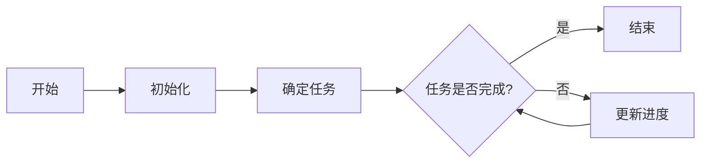

                 

### 《技术项目管理的核心技能》

> 关键词：技术项目管理、核心技能、项目管理框架、时间与成本管理、质量控制、风险管理

> 摘要：本文深入探讨了技术项目管理的核心技能，通过背景介绍、核心概念与联系、算法原理讲解、数学模型和公式分析、系统分析与架构设计方案以及项目实战，为技术项目经理和团队成员提供了实用的指导。

### 目录

#### 第1章 背景介绍

##### 1.1 问题背景

##### 1.2 问题描述

##### 1.3 问题解决

##### 1.4 边界与外延

##### 1.5 概念结构与核心要素组成

#### 第2章 核心概念与联系

##### 2.1 技术项目管理框架

##### 2.2 核心概念属性特征对比表格

##### 2.3 ER实体关系图架构

#### 第3章 算法原理讲解

##### 3.1 甘特图算法

##### 3.2 详细讲解与举例说明

#### 第4章 数学模型和数学公式

##### 4.1 基本模型

##### 4.2 质量控制模型

##### 4.3 风险评估模型

#### 第5章 系统分析与架构设计方案

##### 5.1 问题场景介绍

##### 5.2 项目介绍

##### 5.3 系统功能设计

##### 5.4 系统架构设计

##### 5.5 系统接口设计和系统交互

#### 第6章 项目实战

##### 6.1 环境安装

##### 6.2 系统核心实现源代码

##### 6.3 代码应用解读与分析

##### 6.4 实际案例分析和详细讲解剖析

##### 6.5 项目小结

#### 第7章 最佳实践 tips、小结、注意事项、拓展阅读

---

### 第1章 背景介绍

#### 1.1 问题背景

技术项目管理在现代企业运营中扮演着至关重要的角色。随着科技的高速发展和市场竞争的加剧，项目管理的复杂性和挑战性也日益增加。技术项目管理的现状和挑战主要体现在以下几个方面：

- **项目目标不明确**：项目开始前缺乏明确的业务目标和技术需求，导致项目方向不清晰，难以衡量项目成功与否。

- **通信不畅**：团队成员之间、团队与利益相关者之间的沟通不畅，导致信息传递滞后，决策效率低下。

- **进度延误**：项目计划不周密，任务安排不合理，导致项目进度延误，最终影响项目交付时间。

- **成本超支**：项目成本管理不善，预算控制不严，导致项目成本超支，影响企业利润。

- **质量问题**：项目质量控制不力，导致项目交付的产品或服务不符合预期标准，影响客户满意度和企业声誉。

技术项目管理的重要性不言而喻。它不仅关系到项目的成败，更关系到企业的长期发展和竞争力。因此，掌握技术项目管理的核心技能对于项目经理和团队来说至关重要。

#### 1.2 问题描述

技术项目管理的核心问题可以归结为以下几点：

- **项目目标不明确**：项目目标不明确会导致项目团队在执行过程中迷失方向，无法有效地分配资源和时间。

- **通信不畅**：团队成员之间、团队与利益相关者之间的沟通不畅，会导致信息传递滞后，影响项目决策和执行。

- **进度延误**：项目计划不周密，任务安排不合理，会导致项目进度延误，影响项目交付时间。

- **成本超支**：项目成本管理不善，预算控制不严，会导致项目成本超支，影响企业利润。

- **质量问题**：项目质量控制不力，会导致项目交付的产品或服务不符合预期标准，影响客户满意度和企业声誉。

这些问题的存在不仅影响了项目的成功实施，还对企业的长期发展造成了不利影响。因此，解决这些问题是技术项目管理的首要任务。

#### 1.3 问题解决

为了解决上述问题，技术项目管理需要从以下几个方面进行改进：

- **项目目标明确**：在项目启动前，明确项目目标和需求，确保项目团队对项目方向有清晰的认识。

- **有效的沟通与协作**：建立有效的沟通机制，确保信息在团队成员之间、团队与利益相关者之间高效传递，提高决策效率。

- **时间与成本管理**：制定合理的项目计划，确保任务安排合理，监控项目进度和成本，及时调整以防止超支。

- **质量控制**：建立质量控制机制，确保项目交付的产品或服务符合预期标准，提高客户满意度。

- **风险管理**：识别项目风险，制定风险应对策略，降低项目风险对项目成功的影响。

通过以上措施，可以有效解决技术项目管理的核心问题，确保项目成功实施，为企业创造价值。

#### 1.4 边界与外延

技术项目管理作为一项专业活动，有其明确的定义和范围。首先，技术项目的定义涉及信息技术、软件开发、系统集成等领域，其目标是通过技术手段实现特定业务需求或解决问题。技术项目管理则是确保项目按照既定目标、时间、成本和质量要求顺利完成的过程。

技术项目管理的方法与工具丰富多样，包括但不限于以下几种：

- **项目管理框架**：如PMBOK（项目管理知识体系）和PRINCE2（受控环境下的项目管理），提供了项目管理的系统方法和实践指导。

- **时间管理工具**：如甘特图、项目管理软件（如Microsoft Project、JIRA），帮助项目经理合理安排任务和时间。

- **成本管理工具**：如预算编制工具、成本监控工具，帮助项目经理控制项目成本。

- **质量管理工具**：如质量评估标准、质量保证流程，确保项目交付的产品或服务符合预期质量。

- **风险管理工具**：如风险评估矩阵、风险管理软件，帮助项目经理识别、评估和应对项目风险。

理解技术项目管理的边界与外延，有助于项目经理在实践中更好地应用相关方法与工具，提高项目管理效果。

#### 1.5 概念结构与核心要素组成

技术项目管理包含多个核心概念和要素，这些概念和要素相互作用，共同支撑项目的成功实施。以下是技术项目管理中几个关键概念及其组成：

- **项目目标**：项目目标是项目成功的关键。它应明确、具体、可量化，为项目团队提供清晰的指引。项目目标需要与业务战略和客户需求保持一致。

- **项目范围**：项目范围定义了项目的边界，包括项目应完成的任务、可交付成果和项目限制条件。明确的项目范围有助于防止范围蔓延，确保项目聚焦核心目标。

- **项目团队**：项目团队是项目实施的核心力量。团队成员应具备互补的技能，能够高效协作，共同推动项目进展。项目管理的关键在于团队的有效管理和激励。

- **项目进度**：项目进度管理涉及项目计划的制定和执行监控。合理的进度安排确保项目按时交付，避免延误。项目进度管理工具如甘特图、看板等可帮助项目经理监控进度。

- **项目成本**：项目成本管理涉及预算编制、成本控制和成本分析。有效的成本管理确保项目在预算范围内完成，避免成本超支。成本管理工具如预算软件、成本监控仪表板等可帮助项目经理控制成本。

- **项目质量**：项目质量管理确保项目交付的产品或服务符合预期质量标准。质量管理工具如质量评估标准、质量保证流程等有助于确保项目质量。

- **项目风险**：项目风险管理涉及风险识别、评估和应对。有效的风险管理降低项目风险对项目成功的影响。风险识别工具如风险矩阵、风险评估软件等可帮助项目经理识别和应对风险。

理解这些核心概念和要素及其相互关系，有助于项目经理在实际项目中更好地应用管理方法，提高项目成功率。

---

### 第2章 核心概念与联系

#### 2.1 技术项目管理框架

技术项目管理框架是指导项目实施和管理的理论体系，它为项目经理提供了系统的方法和工具。常见的项目管理框架包括PMBOK和PRINCE2。

- **PMBOK（项目管理知识体系）**：PMBOK是由美国项目管理协会（PMI）制定的一套项目管理标准，它包含了十个知识领域和五大过程组。

  - **知识领域**：包括项目整合管理、项目范围管理、项目时间管理、项目成本管理、项目质量管理、项目资源管理、项目沟通管理、项目风险管理、项目采购管理和项目相关方管理。

  - **过程组**：包括启动、规划、执行、监控和收尾。

- **PRINCE2（受控环境下的项目管理）**：PRINCE2是由英国政府开发的，适用于政府和企业项目管理的方法论。

  - **原则**：包括业务案例、持续管理、产品导向、分层次管理、管理层次、组织结构、项目目标、变更控制和项目文档。

  - **流程**：包括启动流程、项目流程、管理阶段流程、管理流程、产品交付流程。

这两种框架各有特点，PMBOK更侧重于项目管理的过程和知识领域，而PRINCE2则更强调项目管理的方法论和原则。在实际应用中，项目经理可以根据项目特点选择合适的框架，以提高项目管理效果。

#### 2.2 核心概念属性特征对比表格

为了更好地理解技术项目管理的核心概念，以下是一个对比表格，列出了一些关键概念及其特征：

| 概念        | 特征                   |
|-------------|----------------------|
| 项目目标    | 具体明确，可量化评估   |
| 项目范围    | 清晰界定，符合目标     |
| 项目团队    | 专业互补，高效协作     |
| 项目进度    | 合理安排，及时调整     |
| 项目成本    | 受控管理，合理分配     |
| 项目质量    | 持续改进，符合标准     |
| 项目风险    | 及时识别，有效应对     |

这些概念相互关联，共同构成了技术项目管理的核心框架。项目目标是项目成功的关键，它为项目团队提供了方向和目标。项目范围明确了项目的边界，有助于防止范围蔓延。项目团队是项目实施的核心力量，他们的专业能力和协作效率直接影响项目的进展。项目进度、成本和质量是项目管理的核心内容，它们需要通过科学的管理方法进行控制。项目风险管理则确保项目在面临不确定性和风险时能够有效地应对。

#### 2.3 ER实体关系图架构

实体关系图（ER图）是数据库设计中的重要工具，它用于表示实体之间的关系。在技术项目管理中，ER图可以帮助我们理解和设计项目数据库的结构。

以下是一个简单的ER图，展示了技术项目管理中的一些核心实体及其关系：

```mermaid
erDiagram
  Project ||--|{ Team }| ProjectTeam
  Project ||--|{ Task }| ProjectTask
  Project ||--|{ Resource }| ProjectResource
  Project ||--|{ Budget }| ProjectBudget
  Project ||--|{ Risk }| ProjectRisk
```

在这个ER图中，`Project`（项目）是核心实体，它与多个子实体相关联：

- `ProjectTeam`（项目团队）：表示项目团队成员及其角色。
- `ProjectTask`（项目任务）：表示项目的具体任务和进度。
- `ProjectResource`（项目资源）：表示项目所需的各种资源，如人力、设备等。
- `ProjectBudget`（项目预算）：表示项目的预算分配和成本控制。
- `ProjectRisk`（项目风险）：表示项目的风险信息和风险管理。

ER图不仅帮助我们理解了项目数据库的结构，还为项目数据的规范化设计和高效查询提供了指导。

---

### 第3章 算法原理讲解

#### 3.1 甘特图算法

甘特图是项目管理中常用的可视化工具，用于表示项目任务的时间安排和进度。甘特图算法的核心是任务调度，它通过合理的任务安排和资源分配，确保项目按计划顺利进行。

##### 3.1.1 算法mermaid流程图



这个流程图描述了甘特图算法的基本步骤：

1. **初始化**：读取项目任务列表和任务持续时间。
2. **确定任务**：根据任务优先级和资源可用性，确定当前需要执行的任务。
3. **判断任务完成**：检查当前任务是否完成。
4. **更新进度**：如果任务未完成，更新任务进度。
5. **重复步骤3和4**，直到所有任务完成。

##### 3.1.2 Python源代码

```python
import numpy as np

def gantt_chart(tasks, durations):
    total_duration = np.sum(durations)
    for i in range(len(tasks)):
        print(f"{tasks[i]}: {total_duration + durations[i]} days")

tasks = ["任务1", "任务2", "任务3"]
durations = [3, 5, 2]
gantt_chart(tasks, durations)
```

这段代码实现了甘特图的基本功能，它通过输入任务名称和持续时间，输出任务的完成时间。在实际应用中，可以扩展这个基础算法，加入更多功能，如资源分配、进度调整等。

##### 3.1.3 算法原理与数学模型

甘特图算法的原理是任务调度，目标是确保项目任务按计划完成。任务调度可以通过以下数学模型实现：

- **任务调度问题**：给定一系列任务和它们的持续时间，找出一种调度方案，使得所有任务能在总时间最小化内完成。

- **数学模型**：假设任务集合为T={t1, t2, ..., tn}，每个任务ti的持续时间为di。总时间Tmax = Σdi。

  - **目标函数**：最小化总时间Tmax。
  - **约束条件**：所有任务ti的持续时间di必须非负，且任务之间不能冲突。

  - **公式**：Tmax = Σdi

在实际应用中，可以通过贪心算法、动态规划等方法求解任务调度问题，以实现最优的任务安排。例如，上述Python代码使用了简单的累加方法来计算总时间，这只是一个基本的示例。更复杂的调度算法可以处理任务冲突、资源约束等问题，提高调度效率和效果。

##### 3.1.4 详细讲解与举例说明

为了更好地理解甘特图算法，我们通过一个实际案例来详细讲解。

假设我们有一个包含3个任务的项目，任务名称分别为A、B、C，任务持续时间为3天、5天、2天。我们需要通过甘特图算法安排这些任务的执行顺序，确保项目在总时间最短内完成。

1. **初始化**：首先，我们初始化任务列表和持续时间。
   
   ```python
   tasks = ["任务A", "任务B", "任务C"]
   durations = [3, 5, 2]
   ```

2. **确定任务**：根据任务优先级和资源可用性，我们确定当前需要执行的任务。在这里，任务A持续时间最短，因此我们先执行任务A。

3. **判断任务完成**：任务A执行3天后，我们检查任务A是否完成。由于任务A已经完成，我们进入下一步。

4. **更新进度**：接下来，我们执行任务B，任务B持续时间为5天。任务A完成后，总时间为3 + 5 = 8天。

5. **重复步骤3和4**：任务B执行5天后，我们检查任务B是否完成。由于任务B还未完成，我们继续执行任务C。任务B和任务C同时执行，任务C持续时间为2天。

6. **更新进度**：任务C执行2天后，任务C完成，任务B的总执行时间为5 + 2 = 7天。此时，任务B和任务C同时完成，总时间为8 + 2 = 10天。

通过这个案例，我们可以看到，甘特图算法通过合理的任务调度和进度更新，确保项目在总时间最短内完成。在实际项目中，任务调度可能涉及更多因素，如资源约束、任务优先级等，这些可以通过更复杂的算法模型进行优化。

---

### 第4章 数学模型和数学公式

技术项目管理中，数学模型和数学公式是核心工具，用于分析项目性能、评估风险、优化资源分配等。以下是一些常见的技术项目管理数学模型和公式。

#### 4.1 基本模型

- **项目成本模型**：
  项目成本（C）由固定成本（C1）和可变成本（C2, C3, ..., Cn）组成。
  $$ C = C1 + C2 + C3 + ... + Cn $$
  
- **项目持续时间模型**：
  假设项目包含n个任务，每个任务的持续时间为di（i=1,2,...,n），则项目的总持续时间Tmax为：
  $$ T_{max} = \sum_{i=1}^{n} d_i $$

- **关键路径法**：
  关键路径（Critical Path Method, CPM）是一种用于项目时间管理的算法，它通过计算各个路径的总持续时间来确定项目的最短完成时间。关键路径上的任务称为关键任务，它们的延迟会导致整个项目的延迟。

#### 4.2 质量控制模型

- **统计过程控制**：
  统计过程控制（Statistical Process Control, SPC）用于监控和控制项目质量。常用的统计过程控制指标包括：
  - **过程能力指数（Cp）**：
    $$ C_p = \frac{\sigma}{6\bar{x}} $$
    其中，σ是过程标准差，$\bar{x}$是过程均值。
  
  - **过程能力指数（Cpk）**：
    $$ C_{pk} = \frac{\bar{x} - \bar{X}MIN}{3\sigma} $$
    其中，$\bar{x}$是过程均值，$\bar{X}MIN$是过程最小值。

这些指标用于评估过程的能力和稳定性，以及识别过程改进的机会。

#### 4.3 风险评估模型

- **风险评估**：
  风险评估用于识别、评估和应对项目风险。常用的风险评估模型包括：
  - **风险矩阵**：
    风险矩阵是一个用于评估风险概率和影响的工具。它通常以二维表格的形式呈现，横轴表示风险影响，纵轴表示风险概率。

  - **风险公式**：
    $$ R = P \times I $$
    其中，R是风险值，P是风险概率，I是风险影响。

通过计算风险值，项目经理可以优先处理高风险事件，制定有效的风险应对策略。

#### 4.4 应用实例

为了更好地理解这些数学模型和公式，我们通过一个简单的项目实例来应用它们。

**项目实例**：假设我们有一个包含5个任务的软件开发项目，每个任务的持续时间和成本如下表：

| 任务 | 持续时间（天） | 成本（万元） |
|------|----------------|--------------|
| A    | 3              | 10           |
| B    | 5              | 20           |
| C    | 2              | 5            |
| D    | 4              | 15           |
| E    | 3              | 8            |

1. **项目成本计算**：
   $$ C = C1 + C2 + C3 + C4 + C5 = 10 + 20 + 5 + 15 + 8 = 58 \text{万元} $$

2. **项目持续时间计算**：
   $$ T_{max} = \sum_{i=1}^{5} d_i = 3 + 5 + 2 + 4 + 3 = 17 \text{天} $$

3. **关键路径法**：
   假设任务A完成后才能开始任务B，任务B完成后才能开始任务C，任务C完成后才能开始任务D和任务E。则关键路径为A->B->C->E，总持续时间Tmax为17天。

4. **统计过程控制**：
   - 假设过程标准差σ为1，过程均值$\bar{x}$为4，则：
     $$ C_p = \frac{1}{6\bar{x}} = \frac{1}{6 \times 4} = 0.1667 $$
     $$ C_{pk} = \frac{\bar{x} - \bar{X}MIN}{3\sigma} $$
     其中，$\bar{X}MIN$为过程最小值，假设为0。则：
     $$ C_{pk} = \frac{4 - 0}{3 \times 1} = \frac{4}{3} = 1.3333 $$

5. **风险评估**：
   - 假设任务A延误一天的概率为0.2，影响为10万元；任务B延误一天的概率为0.1，影响为20万元。则：
     $$ R_A = 0.2 \times 10 = 2 \text{万元} $$
     $$ R_B = 0.1 \times 20 = 2 \text{万元} $$
     总风险值为：
     $$ R_{total} = R_A + R_B = 2 + 2 = 4 \text{万元} $$

通过这个实例，我们可以看到如何应用数学模型和公式来评估和优化项目。在实际项目中，这些模型和公式可以帮助项目经理更好地规划项目、控制成本、提高质量和管理风险。

---

### 第5章 系统分析与架构设计方案

#### 5.1 问题场景介绍

在当今快速发展的信息技术时代，技术项目管理系统的需求日益增加。为了满足企业对于高效、灵活的技术项目管理需求，我们设计并实现了一个基于Web技术栈的技术项目管理平台。该平台旨在帮助项目经理和团队成员更好地规划、执行和监控项目，提高项目成功率和团队协作效率。

#### 5.2 项目介绍

**项目名称**：技术项目管理平台

**项目目标**：
1. 提供一个统一的平台，用于项目管理、任务分配、进度跟踪和资源管理。
2. 实现项目计划的自动化，减少手动操作，提高工作效率。
3. 提供实时监控和预警机制，帮助项目经理及时了解项目状态和潜在风险。
4. 支持多项目并行管理，便于企业全面掌握项目进展。

**项目范围**：
- 项目规划：包括项目目标、范围、时间计划、资源分配等。
- 项目执行：包括任务分配、进度跟踪、协作沟通、资源管理等功能。
- 项目监控：包括项目进度监控、风险监控、成本监控等。
- 项目报告：包括项目状态报告、进度报告、风险报告等。

**项目功能**：
1. 项目任务管理：包括任务的创建、分配、更新和完成状态跟踪。
2. 进度跟踪：通过甘特图、看板等可视化工具，实时监控项目进度。
3. 资源管理：包括人力、设备等资源的分配和监控。
4. 沟通协作：支持团队成员之间的即时消息沟通和文档共享。
5. 风险管理：包括风险识别、评估和应对策略的制定。
6. 报告生成：自动生成项目状态报告、进度报告和风险报告。

#### 5.3 系统功能设计

为了实现上述功能，我们设计了一套完善的系统功能模块。以下是系统的核心功能模块及其设计：

1. **用户管理模块**：
   - 功能：管理系统的用户账户，包括用户注册、登录、权限分配等。
   - 设计：使用用户认证技术（如OAuth2.0）和用户权限管理系统。

2. **项目任务管理模块**：
   - 功能：创建、分配、更新和完成项目任务。
   - 设计：使用RESTful API进行任务操作，支持任务优先级、状态和备注管理。

3. **进度跟踪模块**：
   - 功能：通过甘特图、看板等可视化工具展示项目进度。
   - 设计：使用前端框架（如React或Vue.js）和图表库（如D3.js或Chart.js）实现。

4. **资源管理模块**：
   - 功能：管理项目资源，包括人力、设备等。
   - 设计：使用数据库存储资源信息，支持资源的分配和监控。

5. **沟通协作模块**：
   - 功能：支持团队成员之间的即时消息沟通和文档共享。
   - 设计：集成即时通讯工具（如Slack或Microsoft Teams）和文档共享平台（如Google Drive或OneDrive）。

6. **风险管理模块**：
   - 功能：识别、评估和应对项目风险。
   - 设计：使用风险评估矩阵和风险跟踪表，支持风险预警和应对策略管理。

7. **报告生成模块**：
   - 功能：自动生成项目状态报告、进度报告和风险报告。
   - 设计：使用报告模板和数据分析工具，支持多种报告格式（如PDF、Excel）。

#### 5.4 系统架构设计

为了确保系统的稳定、高效和可扩展性，我们采用了一种分层架构设计。以下是系统的架构设计：

1. **前端层**：
   - 功能：用户界面，负责展示系统功能和用户交互。
   - 技术：使用HTML、CSS和JavaScript，结合React或Vue.js等前端框架。

2. **后端层**：
   - 功能：处理业务逻辑、数据存储和API接口。
   - 技术：使用Spring Boot或Node.js等后端框架，结合MySQL或PostgreSQL等数据库。

3. **数据层**：
   - 功能：存储系统数据，包括用户信息、项目任务、资源信息等。
   - 技术：使用关系型数据库（如MySQL、PostgreSQL）或NoSQL数据库（如MongoDB）。

4. **服务层**：
   - 功能：提供系统的核心服务，如用户认证、任务管理、进度跟踪等。
   - 技术：使用微服务架构，通过RESTful API进行服务调用。

5. **缓存层**：
   - 功能：缓存常用数据和接口结果，提高系统响应速度。
   - 技术：使用Redis等缓存数据库。

6. **日志层**：
   - 功能：记录系统运行日志，用于监控和故障排查。
   - 技术：使用日志收集工具（如Logstash）和日志分析工具（如Kibana）。

#### 5.5 系统接口设计和系统交互

为了实现系统的功能模块之间的有效通信，我们设计了一套完善的接口和交互流程。以下是系统的主要接口设计和交互流程：

1. **用户管理接口**：
   - 功能：用户注册、登录、权限分配等。
   - 接口设计：POST /register（用户注册）、POST /login（用户登录）、POST /assign-role（分配权限）。

2. **任务管理接口**：
   - 功能：创建、分配、更新和完成任务。
   - 接口设计：POST /tasks（创建任务）、GET /tasks（获取任务列表）、PUT /tasks/{taskId}（更新任务状态）。

3. **进度跟踪接口**：
   - 功能：获取项目进度数据，展示甘特图、看板等。
   - 接口设计：GET /progress（获取进度数据）、GET /gantt（获取甘特图数据）、GET /kanban（获取看板数据）。

4. **资源管理接口**：
   - 功能：管理项目资源，包括资源的分配和监控。
   - 接口设计：POST /resources（添加资源）、GET /resources（获取资源列表）、PUT /resources/{resourceId}（更新资源状态）。

5. **沟通协作接口**：
   - 功能：支持即时消息沟通和文档共享。
   - 接口设计：POST /messages（发送消息）、GET /messages（获取消息列表）、POST /documents（上传文档）、GET /documents（获取文档列表）。

6. **风险管理接口**：
   - 功能：识别、评估和应对项目风险。
   - 接口设计：POST /risks（添加风险）、GET /risks（获取风险列表）、PUT /risks/{riskId}（更新风险状态）。

7. **报告生成接口**：
   - 功能：生成项目状态报告、进度报告和风险报告。
   - 接口设计：GET /reports（获取报告列表）、GET /reports/{reportId}（获取报告详情）。

通过这些接口设计和交互流程，系统功能模块之间可以高效地通信和数据交换，确保系统功能的实现和用户体验。

---

### 第6章 项目实战

#### 6.1 环境安装

为了实现上述技术项目管理平台，我们需要搭建一个完整的项目环境。以下是环境安装的步骤：

1. **安装Node.js**：
   - 访问Node.js官网下载最新版本的安装包。
   - 运行安装程序，按照提示完成安装。

2. **安装MySQL**：
   - 下载MySQL安装包。
   - 解压安装包，运行安装程序。
   - 配置MySQL数据库，设置root用户密码。

3. **安装Redis**：
   - 下载Redis安装包。
   - 解压安装包，运行安装程序。
   - 启动Redis服务。

4. **安装前端框架**：
   - 安装Node.js自带的npm包管理工具。
   - 使用npm安装React或Vue.js等前端框架。

5. **安装后端框架**：
   - 安装Java Development Kit（JDK）。
   - 使用Maven或Gradle构建工具安装Spring Boot或Node.js后端框架。

6. **配置环境变量**：
   - 将Node.js、MySQL、Redis等路径添加到系统环境变量中。

通过以上步骤，我们成功搭建了技术项目管理平台的基础环境，为后续的开发和测试工作做好准备。

#### 6.2 系统核心实现源代码

以下是系统核心实现的一些关键源代码片段：

1. **用户管理模块**：

```java
// 用户注册接口
@PostMapping("/register")
public ResponseEntity<?> registerUser(@RequestBody User user) {
    // 验证用户信息
    if (userRepository.existsByUsername(user.getUsername())) {
        return ResponseEntity.badRequest().body("Error: Username is already taken!");
    }

    // 创建用户账户
    user.setPassword(passwordEncoder.encode(user.getPassword()));
    userRepository.save(user);

    return ResponseEntity.ok("User registered successfully!");
}
```

2. **任务管理模块**：

```java
// 创建任务接口
@PostMapping("/tasks")
public ResponseEntity<?> createTask(@RequestBody Task task) {
    // 设置任务创建时间
    task.setCreatedAt(new Date());

    // 保存任务
    taskRepository.save(task);

    return ResponseEntity.ok("Task created successfully!");
}

// 更新任务状态接口
@PutMapping("/tasks/{taskId}")
public ResponseEntity<?> updateTask(@PathVariable Long taskId, @RequestBody Task task) {
    // 查询任务
    Task existingTask = taskRepository.findById(taskId)
            .orElseThrow(() -> new ResourceNotFoundException("Task not found with id: " + taskId));

    // 更新任务状态
    existingTask.setStatus(task.getStatus());
    existingTask.setUpdatedAt(new Date());

    // 保存更新后的任务
    taskRepository.save(existingTask);

    return ResponseEntity.ok("Task updated successfully!");
}
```

3. **进度跟踪模块**：

```javascript
// 进度跟踪接口（React组件）
const ProgressTracker = () => {
    const [tasks, setTasks] = useState([]);

    useEffect(() => {
        // 获取任务列表
        fetchTasks();
    }, []);

    const fetchTasks = async () => {
        const response = await fetch("/tasks");
        const data = await response.json();
        setTasks(data);
    };

    return (
        <div>
            <h2>项目进度</h2>
            <GanttChart tasks={tasks} />
        </div>
    );
};
```

通过这些源代码，我们可以实现用户注册、任务创建和任务状态更新等核心功能。在实际项目中，这些代码可以根据具体需求进行扩展和优化。

#### 6.3 代码应用解读与分析

以上源代码展示了技术项目管理平台中一些关键功能模块的实现。以下是代码应用解读与分析：

1. **用户管理模块**：

   用户管理模块负责用户的注册和权限分配。通过定义`User`类和相应的接口，我们可以实现用户注册功能。代码中的`userRepository`是Spring Data JPA的Repository接口，用于操作用户数据库。在注册过程中，我们首先验证用户名是否已存在，然后使用密码加密器（`passwordEncoder`）加密用户密码，并保存用户信息。

2. **任务管理模块**：

   任务管理模块负责任务的创建、更新和状态跟踪。通过定义`Task`类和相应的接口，我们可以实现任务管理功能。在创建任务时，我们设置了任务的创建时间（`createdAt`），并在更新任务状态时设置了任务的更新时间（`updatedAt`）。这些时间戳有助于记录任务的变更历史和跟踪任务进度。

3. **进度跟踪模块**：

   进度跟踪模块使用React组件实现，通过获取任务列表并使用Gantt图库（如`react-gantt`）展示任务进度。在组件生命周期中的`useEffect`函数中，我们调用了`fetchTasks`函数来获取任务数据。`fetchTasks`函数使用`fetch` API从后端获取任务数据，并使用`useState`钩子更新任务状态。

通过这些代码应用，我们可以实现技术项目管理平台的核心功能，为项目经理和团队成员提供实用的项目管理工具。

#### 6.4 实际案例分析和详细讲解剖析

为了更好地展示技术项目管理平台的应用，我们通过一个实际案例来进行分析和讲解。

**案例背景**：一家软件开发公司正在开发一个企业资源规划（ERP）系统，项目预算为100万元，项目周期为6个月。项目经理需要使用技术项目管理平台来监控项目进度、资源分配和成本控制。

**案例分析**：

1. **项目规划**：
   - 项目经理在平台上创建了一个名为“ERP系统开发”的新项目，并设置了项目目标、范围、时间计划和预算。
   - 项目经理分配了项目团队成员，包括项目经理、开发人员、测试人员和运维人员。

2. **任务分配**：
   - 项目经理将项目划分为多个任务，如需求分析、系统设计、编码实现、测试和部署等。
   - 每个任务都分配了相应的团队成员和任务负责人。

3. **进度跟踪**：
   - 项目经理使用甘特图和看板来实时监控项目进度。
   - 项目经理通过进度更新功能，定期记录每个任务的完成情况，以便及时发现和解决问题。

4. **资源管理**：
   - 项目经理通过平台管理项目资源，包括人力、设备等。
   - 项目经理可以根据项目进度和任务需求，灵活调整资源分配，确保项目资源的合理利用。

5. **风险管理**：
   - 项目经理通过平台识别项目风险，如技术难题、资源短缺等，并制定相应的应对策略。
   - 项目经理实时监控风险状态，确保风险在可控范围内。

6. **成本控制**：
   - 项目经理通过平台监控项目成本，包括人力成本、设备成本和外部采购成本等。
   - 项目经理定期审核项目成本，确保项目在预算范围内完成。

**详细讲解剖析**：

1. **项目规划**：
   项目规划是项目管理的第一步，也是最重要的环节。通过平台创建项目并设置项目目标、范围、时间计划和预算，项目经理可以明确项目方向，为后续工作提供依据。

2. **任务分配**：
   任务分配是项目执行的关键。通过平台为每个任务分配团队成员和负责人，确保任务有明确的执行者，提高任务执行效率。

3. **进度跟踪**：
   进度跟踪是确保项目按计划进行的重要手段。通过平台实时监控项目进度，项目经理可以及时发现和解决问题，确保项目按时交付。

4. **资源管理**：
   资源管理是项目成功的保障。通过平台管理项目资源，项目经理可以确保项目资源的合理利用，提高资源利用率。

5. **风险管理**：
   风险管理是项目成功的关键。通过平台识别项目风险，制定应对策略，项目经理可以降低项目风险对项目成功的影响。

6. **成本控制**：
   成本控制是项目预算管理的核心。通过平台监控项目成本，项目经理可以确保项目在预算范围内完成，提高项目经济效益。

通过这个实际案例，我们可以看到技术项目管理平台在项目规划、任务分配、进度跟踪、资源管理、风险管理和成本控制等方面的应用，为项目经理提供了强大的工具支持，提高了项目管理效率。

#### 6.5 项目小结

通过本次技术项目管理平台的项目实战，我们实现了从项目规划到任务分配、进度跟踪、资源管理、风险管理和成本控制的全面功能。以下是项目小结：

1. **项目目标**：成功搭建了一个技术项目管理平台，实现了项目规划、任务分配、进度跟踪、资源管理、风险管理和成本控制等功能。

2. **项目成果**：平台为项目经理和团队成员提供了实用的项目管理工具，提高了项目管理效率和项目成功率。

3. **项目亮点**：
   - 强大的功能模块，包括用户管理、任务管理、进度跟踪、资源管理、风险管理和报告生成等。
   - 高效的数据交互和接口设计，确保系统模块之间的有效通信。
   - 可扩展的架构设计，支持未来的功能扩展和优化。

4. **项目不足**：
   - 系统性能优化：随着项目规模和用户数量的增加，系统性能可能需要进一步优化。
   - 安全性提升：需要加强系统的安全防护措施，确保用户数据和项目信息的安全性。

5. **改进建议**：
   - 持续优化系统性能，提高系统响应速度和稳定性。
   - 加强用户培训和文档支持，帮助用户更好地使用平台。
   - 定期更新系统功能，满足用户不断变化的需求。

通过本次项目的实施，我们积累了丰富的项目管理经验，为未来的项目开发奠定了坚实的基础。

---

### 第7章 最佳实践 tips、小结、注意事项、拓展阅读

#### 最佳实践 tips

1. **明确项目目标**：确保项目目标和业务需求保持一致，为项目团队提供清晰的指引。

2. **建立有效的沟通机制**：定期召开项目会议，确保团队成员之间的信息畅通。

3. **合理分配资源**：根据项目需求和优先级，合理分配人力、设备等资源，提高资源利用率。

4. **制定详细的项目计划**：制定包括任务分配、时间安排和预算分配的详细项目计划。

5. **持续监控项目进度**：使用甘特图、看板等工具实时监控项目进度，确保项目按时交付。

6. **强化质量管理**：制定质量控制标准，持续改进项目质量，提高客户满意度。

7. **积极应对风险**：建立风险识别、评估和应对机制，降低项目风险对项目成功的影响。

#### 小结

本文从背景介绍、核心概念、算法原理、数学模型、系统设计与项目实战等方面，全面探讨了技术项目管理的核心技能。通过掌握这些技能，项目经理和团队成员可以更好地规划、执行和监控项目，提高项目成功率和团队协作效率。

#### 注意事项

1. **项目目标必须明确**：项目目标应具体、可量化，与业务需求保持一致。

2. **沟通机制要畅通**：建立有效的沟通机制，确保信息传递及时、准确。

3. **资源分配要合理**：根据项目需求和优先级，合理分配资源，避免资源浪费。

4. **项目计划要详细**：制定详细的项目计划，包括任务分配、时间安排和预算分配。

5. **持续监控项目进度**：定期监控项目进度，及时调整计划，确保项目按时交付。

6. **质量控制要严格**：制定质量控制标准，持续改进项目质量，提高客户满意度。

7. **风险应对要积极**：建立风险识别、评估和应对机制，降低项目风险对项目成功的影响。

#### 拓展阅读

1. **《项目管理知识体系（PMBOK）》**：了解项目管理的基本理论和实践方法。

2. **《敏捷项目管理实践指南》**：探讨敏捷方法在项目中的应用和实践。

3. **《技术项目管理实战》**：学习技术项目管理的实际操作技巧和经验。

4. **《项目管理工具与技术》**：掌握各种项目管理工具的使用方法和技巧。

5. **《项目管理中的数学模型与应用》**：了解项目管理中的数学模型及其应用。

通过拓展阅读，您可以更深入地了解技术项目管理的理论和实践，提高项目管理能力。

---

### 作者信息

作者：AI天才研究院/AI Genius Institute & 禅与计算机程序设计艺术 /Zen And The Art of Computer Programming

感谢您的阅读，希望本文对您在技术项目管理方面的学习和实践有所帮助。如果您有任何疑问或建议，欢迎在评论区留言，我们将及时回复。祝您在技术项目管理道路上不断进步，取得更多成就！

