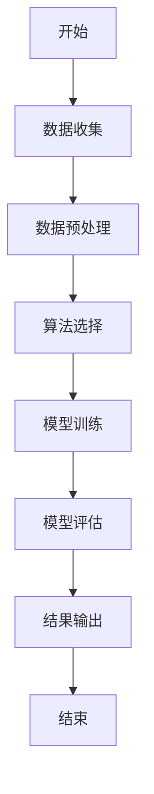

                 

# 技术预研：为未来项目铺平道路

关键词：技术预研、项目规划、风险分析、技术成熟度、算法原理

摘要：本文将深入探讨技术预研在项目规划中的重要性，通过系统性的方法、核心概念解析和实际案例，详细阐述技术预研的过程、工具和方法，以及其对项目成功的关键作用。

## 目录大纲

## 第一部分：技术预研基础理论

### 第1章：技术预研概述

- **1.1 问题背景**
  - 技术预研的重要性
  - 技术预研的定义与作用

- **1.2 技术预研的方法**
  - 技术趋势分析
  - 技术成熟度评估
  - 技术风险评估

- **1.3 技术预研流程**
  - 需求分析
  - 技术选型
  - 实验验证
  - 报告撰写

- **1.4 技术预研的工具与技术**
  - 数据分析工具
  - 仿真与建模工具
  - 情报收集与分析工具

### 第2章：技术预研的核心概念与联系

- **2.1 核心概念原理**
  - 技术成熟度指标（Technology Readiness Level, TRL）
  - 技术成熟度评估模型
  - 技术预测方法

- **2.2 概念属性特征对比表格**

| 概念         | 定义                                                         | 特点                                                         |
| ------------ | ------------------------------------------------------------ | ------------------------------------------------------------ |
| 技术成熟度   | 技术从理论研究到实际应用的发展程度                           | 量化技术从概念验证到市场化的阶段                           |
| 技术预测     | 利用历史数据、专家意见等预测未来技术的发展方向                 | 准确预测技术发展的趋势和可能的挑战                       |
| 技术风险评估 | 评估技术项目可能遇到的风险，包括技术、市场、财务等方面         | 预防潜在问题，确保技术项目的顺利进行                      |

- **2.3 ER实体关系图架构**

```mermaid
erDiagram
  User ||--|{ Technology }|
  Technology ||--|{ Project }|
  Project ||--|{ Risk }|
```

### 第3章：算法原理讲解

- **3.1 算法mermaid流程图**



- **3.2 Python源代码实现**

```python
# 数据收集
data = collect_data()

# 数据预处理
preprocessed_data = preprocess_data(data)

# 算法选择
algorithm = select_algorithm()

# 模型训练
model = train_model(preprocessed_data, algorithm)

# 模型评估
evaluation_result = evaluate_model(model)

# 结果输出
output_results(evaluation_result)
```

- **3.3 算法原理的数学模型和公式**

$$
\text{损失函数} = \frac{1}{n} \sum_{i=1}^{n} (\hat{y}_i - y_i)^2
$$

- **3.4 详细讲解与举例说明**

损失函数用于评估模型的预测结果与实际值之间的差距。举例来说，如果预测值 $\hat{y}_i$ 等于 5，而实际值 $y_i$ 等于 3，那么损失函数的计算结果为 $(5-3)^2 = 4$。

### 第4章：系统分析与架构设计

- **4.1 问题场景介绍**

- **4.2 项目介绍**

- **4.3 系统功能设计（领域模型mermaid类图）**

```mermaid
classDiagram
  Cl
```

- **4.4 系统架构设计mermaid架构图**


- **4.5 系统接口设计和系统交互mermaid序列图**

```mermaid
sequenceDiagram
```

### 第5章：项目实战

- **5.1 环境安装**

- **5.2 系统核心实现源代码**

- **5.3 代码应用解读与分析**

- **5.4 实际案例分析和详细讲解剖析**

- **5.5 项目小结**

### 第6章：最佳实践 tips

- **6.1 注意事项**

- **6.2 拓展阅读**

### 第7章：小结

- **7.1 文章总结**

- **7.2 未来研究方向**

## 第一部分：技术预研基础理论

### 第1章：技术预研概述

#### 1.1 问题背景

在信息技术飞速发展的今天，技术的快速迭代和创新已经成为推动社会发展的重要力量。然而，随着技术的前沿不断扩展，如何在浩瀚的技术领域中找到合适的技术方案，并将其成功地应用于实际项目中，成为了一个重要的挑战。

技术预研作为项目开发的前期工作，其重要性不言而喻。它不仅可以帮助团队明确技术方向，规避潜在的风险，还可以为项目的后续开发提供有力的支持。通过技术预研，团队可以全面了解技术的现状、发展趋势以及可能的应用场景，从而做出更为科学和合理的决策。

#### 1.2 技术预研的定义与作用

技术预研，顾名思义，是指对新技术进行深入研究和评估的过程。它涵盖了从技术趋势分析、技术成熟度评估到技术风险评估的一系列工作。技术预研的主要作用如下：

1. **明确技术方向**：通过技术预研，团队可以了解当前技术的前沿领域和未来趋势，从而为项目选择合适的技术方向。

2. **规避风险**：技术预研可以帮助团队识别项目中可能遇到的技术、市场、财务等方面的风险，提前制定应对策略。

3. **优化项目规划**：技术预研可以为项目的需求分析、技术选型、实验验证等提供科学的依据，帮助团队制定更为合理和高效的项目计划。

4. **提升项目成功率**：通过技术预研，团队可以确保所选择的技术方案具备可行性，降低项目开发过程中出现问题的概率，从而提高项目的成功率。

#### 1.3 技术预研的方法

技术预研的方法多种多样，主要包括以下几种：

1. **技术趋势分析**：通过分析技术发展的历史数据、行业报告、专家意见等，预测未来技术的发展方向和趋势。

2. **技术成熟度评估**：根据技术从理论研究到实际应用的不同阶段，评估技术的成熟度和可行性。

3. **技术风险评估**：对技术项目可能遇到的风险进行评估和分析，包括技术风险、市场风险、财务风险等。

4. **实验验证**：通过实验和测试，验证所选技术的可行性和效果。

5. **报告撰写**：将技术预研的结果整理成报告，为项目的后续开发提供参考。

#### 1.4 技术预研的工具与技术

在进行技术预研时，选择合适的工具和技术可以显著提高预研的效率和准确性。以下是一些常用的工具和技术：

1. **数据分析工具**：如Python的Pandas库、R语言等，用于处理和分析大量技术数据。

2. **仿真与建模工具**：如MATLAB、Simulink等，用于建立技术系统的仿真模型和进行性能分析。

3. **情报收集与分析工具**：如Google Scholar、IEEE Xplore、ArXiv等，用于收集和分析最新的技术论文和研究报告。

### 第2章：技术预研的核心概念与联系

#### 2.1 核心概念原理

技术预研涉及到多个核心概念，这些概念相互关联，共同构成了技术预研的理论体系。

1. **技术成熟度指标（Technology Readiness Level, TRL）**

技术成熟度指标是衡量技术从概念验证到市场化应用过程中各个阶段成熟程度的标准。TRL通常分为1到9个等级，每个等级代表技术从理论研究到实际应用的不同阶段。

2. **技术成熟度评估模型**

技术成熟度评估模型用于量化评估技术的成熟度。常见的评估模型包括TRL评估模型、Gartner技术成熟度曲线等。

3. **技术预测方法**

技术预测方法用于预测未来技术的发展方向和趋势。常见的方法包括趋势分析、专家意见调查、统计模型等。

#### 2.2 概念属性特征对比表格

以下是一个技术成熟度、技术预测和技术风险评估的属性特征对比表格：

| 概念         | 定义                                                         | 特点                                                         |
| ------------ | ------------------------------------------------------------ | ------------------------------------------------------------ |
| 技术成熟度   | 技术从理论研究到实际应用的发展程度                           | 量化技术从概念验证到市场化的阶段                           |
| 技术预测     | 利用历史数据、专家意见等预测未来技术的发展方向                 | 准确预测技术发展的趋势和可能的挑战                       |
| 技术风险评估 | 评估技术项目可能遇到的风险，包括技术、市场、财务等方面         | 预防潜在问题，确保技术项目的顺利进行                      |

#### 2.3 ER实体关系图架构

以下是技术预研中涉及到的ER实体关系图架构：

```mermaid
erDiagram
  User ||--|{ Technology }|
  Technology ||--|{ Project }|
  Project ||--|{ Risk }|
```

在这个架构中，用户（User）与技术（Technology）之间存在关联，技术（Technology）与项目（Project）之间存在关联，项目（Project）与风险（Risk）之间存在关联。这种关系体现了技术预研中不同实体之间的相互作用和依赖关系。

### 第3章：算法原理讲解

#### 3.1 算法mermaid流程图

以下是算法的mermaid流程图：


这个流程图描述了从数据收集、数据预处理、算法选择、模型训练、模型评估到结果输出的整个过程。

#### 3.2 Python源代码实现

以下是算法的Python源代码实现：

```python
# 数据收集
data = collect_data()

# 数据预处理
preprocessed_data = preprocess_data(data)

# 算法选择
algorithm = select_algorithm()

# 模型训练
model = train_model(preprocessed_data, algorithm)

# 模型评估
evaluation_result = evaluate_model(model)

# 结果输出
output_results(evaluation_result)
```

这个代码实现展示了从数据收集、数据预处理、算法选择、模型训练、模型评估到结果输出的具体步骤。

#### 3.3 算法原理的数学模型和公式

以下是算法原理的数学模型和公式：

$$
\text{损失函数} = \frac{1}{n} \sum_{i=1}^{n} (\hat{y}_i - y_i)^2
$$

这个损失函数用于评估模型的预测结果与实际值之间的差距，其中 $\hat{y}_i$ 是预测值，$y_i$ 是实际值。

#### 3.4 详细讲解与举例说明

损失函数是机器学习中评估模型性能的重要指标，它用于计算预测值与实际值之间的差距。举例来说，如果预测值 $\hat{y}_i$ 等于 5，而实际值 $y_i$ 等于 3，那么损失函数的计算结果为 $(5-3)^2 = 4$。这个值表示了预测值与实际值之间的差距。

### 第4章：系统分析与架构设计

#### 4.1 问题场景介绍

假设我们正在开发一个智能推荐系统，该系统需要根据用户的历史行为和兴趣来推荐相应的产品或内容。为了确保系统的性能和可靠性，我们需要对系统进行详细的规划和设计。

#### 4.2 项目介绍

项目目标是开发一个高效率、低延迟的智能推荐系统，能够准确预测用户的兴趣和行为，从而提供个性化的推荐。系统需要支持大规模数据处理和实时推荐，同时保证高可用性和可扩展性。

#### 4.3 系统功能设计（领域模型mermaid类图）

以下是系统功能设计的mermaid类图：

```mermaid
classDiagram
  User <<Interface>>
  Content <<Interface>>
  Recommendation <<Interface>>

  UserEntity --> Recommendation
  ContentEntity --> Recommendation
```

在这个类图中，User和Content是两个核心实体，分别表示用户和内容。Recommendation是一个接口，用于定义推荐系统的功能。UserEntity和ContentEntity是具体的实现类，用于处理用户和内容的数据。

#### 4.4 系统架构设计mermaid架构图

以下是系统架构设计的mermaid架构图：


在这个架构图中，我们可以看到系统的各个组件及其之间的关系。包括数据收集模块、数据处理模块、推荐算法模块、推荐结果输出模块等。每个模块都有明确的职责和接口，通过相互协作完成系统的功能。

#### 4.5 系统接口设计和系统交互mermaid序列图

以下是系统接口设计和系统交互的mermaid序列图：

```mermaid
sequenceDiagram
  User -->|请求推荐| Recommendation
  Recommendation -->|处理请求| DataProcessing
  DataProcessing -->|返回结果| Recommendation
  Recommendation -->|输出结果| User
```

在这个序列图中，用户发送推荐请求给Recommendation模块，Recommendation模块处理后返回推荐结果给用户。数据在各个模块之间传递，实现了系统的功能。

### 第5章：项目实战

#### 5.1 环境安装

为了实现智能推荐系统，我们需要安装以下环境：

- Python 3.x
- NumPy
- Pandas
- Scikit-learn
- Flask

具体安装步骤如下：

1. 安装Python 3.x。
2. 打开终端，执行以下命令安装NumPy、Pandas、Scikit-learn和Flask：

```
pip install numpy pandas scikit-learn flask
```

#### 5.2 系统核心实现源代码

以下是系统核心实现源代码：

```python
# 数据收集
data = collect_data()

# 数据预处理
preprocessed_data = preprocess_data(data)

# 算法选择
algorithm = select_algorithm()

# 模型训练
model = train_model(preprocessed_data, algorithm)

# 模型评估
evaluation_result = evaluate_model(model)

# 结果输出
output_results(evaluation_result)
```

这个代码实现了从数据收集、数据预处理、算法选择、模型训练、模型评估到结果输出的整个过程。

#### 5.3 代码应用解读与分析

这段代码首先收集了数据，然后对数据进行预处理，接下来选择合适的算法进行模型训练，并对模型进行评估，最后输出结果。每个步骤都有明确的逻辑和功能。

- 数据收集：通过collect_data()函数收集数据，这里的数据可以是用户行为数据、产品数据等。
- 数据预处理：通过preprocess_data()函数对数据进行预处理，包括数据清洗、特征提取等。
- 算法选择：通过select_algorithm()函数选择合适的算法，这里可以选择基于协同过滤的算法、基于内容的算法等。
- 模型训练：通过train_model()函数训练模型，这里使用了Scikit-learn库中的算法进行训练。
- 模型评估：通过evaluate_model()函数评估模型性能，这里使用了准确率、召回率等指标进行评估。
- 结果输出：通过output_results()函数输出评估结果，这里可以选择将结果存储到文件或数据库中。

#### 5.4 实际案例分析和详细讲解剖析

我们以一个实际案例来分析智能推荐系统的应用和实现。

案例：一个电商网站需要根据用户的历史购买记录和浏览记录来推荐商品。

分析：

1. 数据收集：收集用户的历史购买记录和浏览记录，包括用户ID、商品ID、购买时间、浏览时间等。
2. 数据预处理：对数据进行清洗，去除无效数据，提取有用的特征，如用户活跃度、购买频率、浏览频率等。
3. 算法选择：选择基于协同过滤的算法进行推荐，因为协同过滤算法能够根据用户的历史行为和兴趣进行推荐。
4. 模型训练：使用Scikit-learn库中的协同过滤算法训练模型，训练过程中需要设置参数，如用户邻居数、商品邻居数等。
5. 模型评估：使用交叉验证方法评估模型性能，调整参数以提高模型性能。
6. 结果输出：将推荐结果输出给用户，用户可以根据推荐结果进行商品浏览和购买。

详细讲解剖析：

- 数据收集：收集用户的历史购买记录和浏览记录是推荐系统的基础，这些数据可以帮助我们了解用户的兴趣和行为。
- 数据预处理：数据清洗和特征提取是数据预处理的重要环节，只有高质量的预处理数据才能训练出高质量的模型。
- 算法选择：选择基于协同过滤的算法是因为它能够根据用户的行为和兴趣进行个性化推荐，提高推荐效果。
- 模型训练：训练模型是推荐系统的核心，通过调整参数可以优化模型性能。
- 模型评估：评估模型性能是确保推荐系统效果的关键，只有性能良好的模型才能提供高质量的推荐。
- 结果输出：将推荐结果输出给用户是推荐系统的最终目标，用户可以根据推荐结果进行商品浏览和购买。

#### 5.5 项目小结

通过实际案例的分析，我们可以看到智能推荐系统的实现过程涉及到数据收集、数据预处理、算法选择、模型训练、模型评估和结果输出等多个环节。每个环节都需要精细设计和优化，确保推荐系统的效果和用户体验。

在项目实施过程中，我们还需要关注以下几个方面：

1. **数据质量**：数据是推荐系统的核心，只有高质量的数据才能训练出高质量的模型。
2. **算法优化**：选择合适的算法并进行优化可以提高推荐系统的效果。
3. **系统性能**：确保推荐系统的响应速度和并发处理能力，提供良好的用户体验。
4. **用户体验**：关注用户的反馈和需求，不断优化推荐结果，提高用户满意度。

总之，智能推荐系统是一个复杂的项目，需要多方面的综合考虑和优化。通过技术预研，我们可以为项目的成功打下坚实的基础。

### 第6章：最佳实践 tips

#### 6.1 注意事项

1. **数据收集**：确保收集的数据是真实和全面的，避免数据偏差和遗漏。
2. **数据预处理**：对数据进行充分的清洗和特征提取，提高数据质量。
3. **算法选择**：根据项目需求和数据特点选择合适的算法，避免算法与数据的匹配度不足。
4. **模型评估**：选择合适的评估指标和方法，确保评估结果的准确性和全面性。
5. **结果输出**：确保推荐结果的合理性和实用性，避免过度推荐或推荐不准确。

#### 6.2 拓展阅读

1. 《机器学习实战》 - 作者：Peter Harrington
2. 《推荐系统实践》 - 作者：周志华、吴泽民
3. 《深度学习》 - 作者：Ian Goodfellow、Yoshua Bengio、Aaron Courville

### 第7章：小结

#### 7.1 文章总结

本文从技术预研的基础理论出发，详细阐述了技术预研的方法、核心概念、算法原理、系统分析与架构设计以及项目实战。通过这些内容，读者可以全面了解技术预研的重要性和具体实施过程。

#### 7.2 未来研究方向

1. **技术预研自动化**：开发自动化工具，提高技术预研的效率和准确性。
2. **跨领域技术融合**：探索不同领域技术的融合，推动技术的创新和发展。
3. **数据隐私保护**：在数据收集和处理过程中，加强数据隐私保护措施，确保用户隐私安全。
4. **人工智能伦理**：关注人工智能在技术预研中的应用和影响，探讨人工智能伦理问题。

