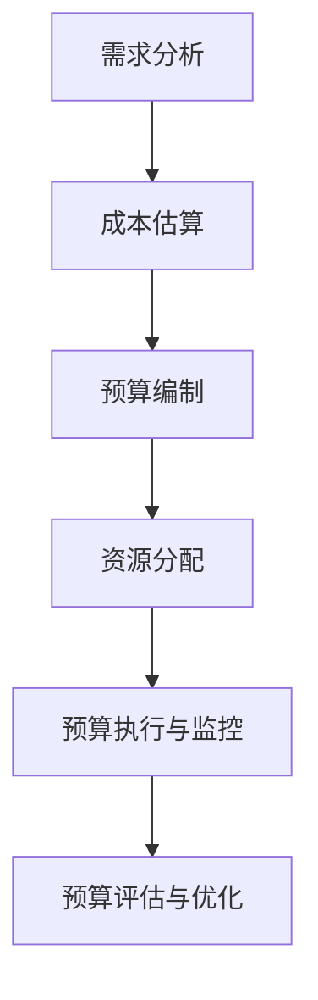
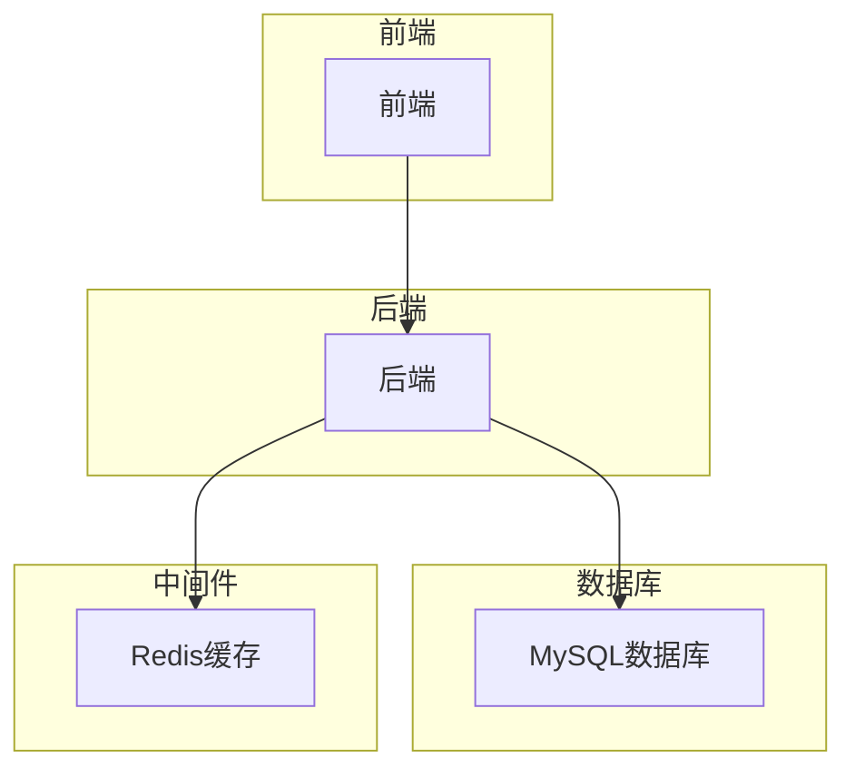
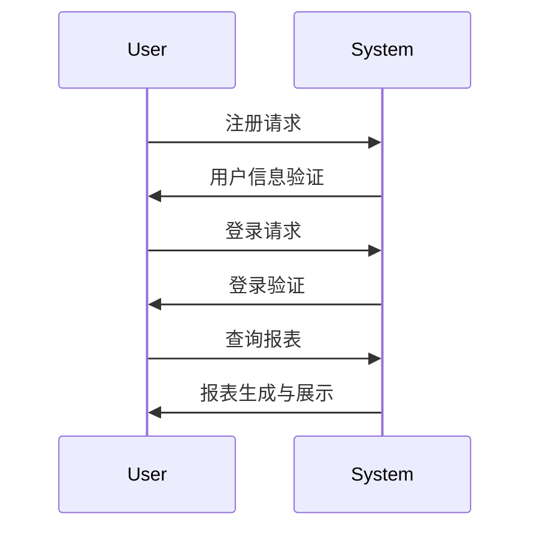

                 

# 技术预算管理与资源分配

> 关键词：技术预算、资源分配、项目管理、效率优化

> 摘要：本文将探讨技术预算管理与资源分配的重要性，提供一系列的实践方法和最佳实践，帮助IT团队在复杂的项目环境中实现高效的项目管理和资源利用。

## 目录大纲

----------------------------------------------------------------

## 第一部分：技术预算管理基础

### 第1章：技术预算管理的核心概念

#### 1.1.1 技术预算管理的定义与重要性

#### 1.1.2 技术预算管理的基本流程

#### 1.1.3 技术预算与资源分配的关系

### 第2章：技术预算管理的实践方法

#### 2.1.1 需求分析的方法与技巧

#### 2.1.2 成本估算的技术与工具

#### 2.1.3 技术预算编制的具体步骤

### 第3章：技术预算管理工具与应用

#### 3.1.1 常用技术预算管理工具介绍

#### 3.1.2 技术预算管理工具的实际应用

#### 3.1.3 技术预算管理工具的选型与优化

## 第二部分：资源分配策略

### 第4章：资源分配的核心原则与方法

#### 4.1.1 资源分配的基本原则

#### 4.1.2 资源分配的常见方法

#### 4.1.3 资源分配的挑战与应对策略

### 第5章：资源分配的实践案例

#### 5.1.1 案例一：项目资源分配

#### 5.1.2 案例二：部门资源分配

#### 5.1.3 案例三：跨部门资源协调

### 第6章：资源优化与利用

#### 6.1.1 资源优化的目的与方法

#### 6.1.2 资源利用的评估指标

#### 6.1.3 资源优化策略与实践

## 第三部分：技术预算管理与资源分配的综合实践

### 第7章：技术预算管理与资源分配的综合案例分析

#### 7.1.1 案例背景与目标

#### 7.1.2 需求分析与成本估算

#### 7.1.3 资源分配与优化策略

### 第8章：技术预算管理与资源分配的最佳实践

#### 8.1.1 最佳实践总结

#### 8.1.2 注意事项与经验教训

#### 8.1.3 拓展阅读与资源推荐

----------------------------------------------------------------

## 第一部分：技术预算管理基础

### 第1章：技术预算管理的核心概念

#### 1.1.1 技术预算管理的定义与重要性

技术预算管理是指在一个项目或组织的范围内，根据技术需求、成本目标和时间约束，进行预算编制、监控和调整的一系列管理活动。它不仅涉及资金的管理，还包括人力资源、设备、材料等资源的合理分配和优化利用。

技术预算管理的重要性主要体现在以下几个方面：

1. **指导项目规划和执行**：技术预算为项目提供了一个清晰的资金和时间框架，使团队成员能够根据预算安排工作任务和时间节点。
2. **风险控制**：通过预算管理，可以及时发现和纠正项目中的成本超支和进度延误，降低项目风险。
3. **资源优化**：合理的技术预算可以确保资源的有效利用，避免资源浪费和重复投资。
4. **提高项目成功率**：准确的预算和资源分配是项目成功的关键因素之一。

#### 1.1.2 技术预算管理的基本流程

技术预算管理的基本流程包括以下几个步骤：

1. **需求分析**：明确项目的技术需求，包括功能需求、性能需求和安全需求等。
2. **成本估算**：根据需求分析，对项目所需的资源和成本进行初步估算。
3. **预算编制**：在成本估算的基础上，制定详细的技术预算，包括资金预算、人力资源预算、设备预算等。
4. **预算审批**：提交预算方案，经过相关部门或领导的审批。
5. **预算执行**：按照预算方案，开始项目实施，并对预算进行实时监控和调整。
6. **预算评估**：项目结束后，对预算执行情况进行评估，总结经验教训。

#### 1.1.3 技术预算与资源分配的关系

技术预算是资源分配的基础，资源分配是技术预算的具体实现。二者之间的关系可以概括为：

1. **预算约束资源分配**：技术预算为资源分配设定了资金和时间的限制，确保资源分配在预算范围内进行。
2. **资源需求指导预算编制**：资源需求的分析和估算结果将直接影响技术预算的编制，因此资源需求的准确性和合理性至关重要。
3. **资源优化提升预算效益**：通过合理的资源优化和利用，可以提高预算的效益，降低成本，实现资源最大化利用。

### 第2章：技术预算管理的实践方法

#### 2.1.1 需求分析的方法与技巧

需求分析是技术预算管理的第一步，其准确性和全面性直接影响预算的质量。以下是一些需求分析的方法和技巧：

1. **需求调研**：通过访谈、问卷调查、用户观察等方式，收集项目相关方的需求和期望。
2. **需求分类**：将收集到的需求进行分类，区分功能需求、性能需求、安全需求等，以便更好地进行成本估算。
3. **优先级排序**：对需求进行优先级排序，区分必须需求、可选需求和可延迟需求，以便在资源有限的情况下进行合理分配。
4. **需求文档**：编写详细的需求文档，包括需求描述、功能规格、性能指标等，为后续的成本估算和预算编制提供依据。

#### 2.1.2 成本估算的技术与工具

成本估算是技术预算编制的关键环节，以下介绍一些常用的成本估算技术和工具：

1. **历史数据分析**：通过分析以往类似项目的成本数据，预测当前项目的成本。
2. **参数估算法**：根据项目的规模、复杂度、团队规模等参数，建立成本估算模型。
3. **专家评估法**：邀请项目相关的专家进行成本评估，综合多方面的意见，提高估算的准确性。
4. **成本估算工具**：使用专业的成本估算工具，如Microsoft Excel、CostX、Oracle Cost Analyzer等，可以提高成本估算的效率和准确性。

#### 2.1.3 技术预算编制的具体步骤

技术预算编制是技术预算管理的重要环节，以下介绍技术预算编制的具体步骤：

1. **制定预算框架**：根据项目特点和需求，制定预算框架，包括预算类别、预算额度、预算周期等。
2. **收集成本数据**：收集项目所需的资源成本数据，包括人力成本、设备成本、材料成本等。
3. **编制预算草案**：根据成本数据，编制技术预算草案，包括各项成本的预算分配。
4. **审核与调整**：对预算草案进行审核，根据反馈进行必要的调整和优化。
5. **提交审批**：将最终的技术预算方案提交给相关部门或领导进行审批。
6. **预算发布与执行**：审批通过后，发布预算方案，并按照预算方案进行项目实施。

### 第3章：技术预算管理工具与应用

#### 3.1.1 常用技术预算管理工具介绍

技术预算管理工具是技术预算管理的重要组成部分，以下介绍几种常用的技术预算管理工具：

1. **Microsoft Excel**：Excel是广泛使用的电子表格软件，适用于简单的预算编制和监控。
2. **CostX**：CostX是一款专业的项目成本估算软件，提供丰富的成本估算功能和模板。
3. **Oracle Cost Analyzer**：Oracle Cost Analyzer是Oracle公司推出的成本分析工具，适用于大型企业项目。
4. **JIRA**：JIRA是一款功能强大的项目管理工具，可以集成技术预算管理功能，实现预算监控和资源分配。

#### 3.1.2 技术预算管理工具的实际应用

技术预算管理工具在实际应用中可以提高预算编制和管理的效率和准确性，以下介绍一些实际应用场景：

1. **项目启动阶段**：使用技术预算管理工具进行需求分析和成本估算，制定初步预算方案。
2. **项目执行阶段**：实时监控项目成本，对比预算和实际支出，及时发现和纠正偏差。
3. **项目评估阶段**：使用技术预算管理工具对项目成本和效益进行评估，总结经验教训，为后续项目提供参考。

#### 3.1.3 技术预算管理工具的选型与优化

选择合适的技术预算管理工具是技术预算管理成功的关键，以下介绍一些选型与优化的策略：

1. **需求分析**：根据项目特点和需求，明确技术预算管理工具所需的功能和性能要求。
2. **市场调研**：调研市场上主流的技术预算管理工具，比较功能、性能、价格等因素。
3. **试点应用**：选择部分项目进行试点应用，评估工具的实用性和适应性。
4. **优化与调整**：根据试点应用的结果，对工具进行优化和调整，确保其能够满足项目需求。

## 第二部分：资源分配策略

### 第4章：资源分配的核心原则与方法

#### 4.1.1 资源分配的基本原则

资源分配是技术预算管理的关键环节，以下介绍资源分配的基本原则：

1. **需求导向**：资源分配应以项目需求为导向，确保资源能够满足项目目标。
2. **效益最大化**：在资源有限的情况下，应优先分配给能够带来最大效益的项目或任务。
3. **平衡性**：资源分配应考虑整体平衡，避免出现资源过剩或不足的情况。
4. **灵活性**：资源分配应具有一定的灵活性，能够根据项目变化进行调整。

#### 4.1.2 资源分配的常见方法

资源分配的方法多种多样，以下介绍几种常见的资源分配方法：

1. **固定分配法**：按照固定比例或数量分配资源，适用于资源需求相对稳定的情况。
2. **动态分配法**：根据项目进展和需求变化，动态调整资源分配，适用于资源需求变化较大的情况。
3. **优先级分配法**：根据项目优先级分配资源，优先支持优先级较高的项目或任务。
4. **平衡分配法**：在多个项目或任务之间进行资源平衡分配，确保整体资源利用率最大化。

#### 4.1.3 资源分配的挑战与应对策略

资源分配过程中常常面临一些挑战，以下介绍一些常见的挑战和应对策略：

1. **资源冲突**：多个项目或任务争夺相同资源，导致资源不足。应对策略：优先级调整、资源协调。
2. **需求变更**：项目需求发生变化，导致资源需求发生变化。应对策略：及时调整资源分配计划。
3. **预算限制**：项目预算有限，难以满足所有需求。应对策略：优化资源利用、优先支持关键任务。
4. **团队协作**：团队成员之间协作不畅，影响资源分配和项目进展。应对策略：加强团队沟通、建立协作机制。

### 第5章：资源分配的实践案例

#### 5.1.1 案例一：项目资源分配

**案例背景**：某IT公司负责开发一个大型企业级应用项目，项目周期为12个月，涉及多个功能模块和团队协作。

**资源需求**：项目涉及软件开发、数据库设计、UI设计、测试等多个方面，需要人力、硬件设备和软件工具等资源。

**资源分配策略**：

1. **固定分配法**：根据项目阶段和功能模块，确定每个阶段所需的资源，并按固定比例分配。
2. **动态分配法**：在项目执行过程中，根据实际进展和需求变化，调整资源分配，确保关键阶段有足够的资源支持。
3. **优先级分配法**：将资源优先分配给关键功能模块和重要任务，确保项目核心功能的实现。
4. **平衡分配法**：在多个功能模块之间进行资源平衡，避免资源过度集中或分散。

**资源分配结果**：项目顺利推进，各个功能模块按时完成，资源利用率较高。

#### 5.1.2 案例二：部门资源分配

**案例背景**：某公司IT部门面临多个项目任务，资源有限，需要合理分配部门资源。

**资源需求**：项目涉及软件开发、系统运维、网络安全等多个方面，需要人力、硬件设备和软件工具等资源。

**资源分配策略**：

1. **固定分配法**：根据项目特点和需求，确定每个项目的资源需求，并按固定比例分配。
2. **动态分配法**：在项目执行过程中，根据项目进展和需求变化，调整部门资源分配，确保项目顺利推进。
3. **优先级分配法**：根据项目优先级和公司战略，将资源优先分配给关键项目。
4. **平衡分配法**：在多个项目之间进行资源平衡，避免资源过度集中或分散。

**资源分配结果**：部门资源得到合理利用，多个项目同时推进，避免了资源浪费和资源冲突。

#### 5.1.3 案例三：跨部门资源协调

**案例背景**：某公司IT部门与市场部门合作开展一项市场推广活动，需要跨部门协调资源。

**资源需求**：活动涉及软件开发、网络营销、市场调研等多个方面，需要人力、硬件设备和软件工具等资源。

**资源分配策略**：

1. **优先级分配法**：根据公司战略和市场推广活动的优先级，将资源优先分配给市场推广活动。
2. **动态协调法**：在活动筹备和执行过程中，根据实际情况动态协调资源，确保活动顺利进行。
3. **共享资源法**：跨部门共享部分资源，如共用服务器、数据库等，降低资源成本。
4. **沟通协调法**：加强跨部门沟通，确保各方对资源需求和分配有共同的理解和认同。

**资源分配结果**：市场推广活动顺利开展，跨部门资源协调高效，实现了资源的最大化利用。

### 第6章：资源优化与利用

#### 6.1.1 资源优化的目的与方法

资源优化是指通过合理的规划和管理，提高资源的利用效率，实现资源的最优配置。资源优化的目的主要有以下几点：

1. **降低成本**：通过资源优化，减少资源的浪费和重复投资，降低项目成本。
2. **提高效率**：通过资源优化，提高资源的利用效率，缩短项目周期，提高项目成功率。
3. **增强灵活性**：通过资源优化，提高资源的灵活性和适应性，能够更好地应对项目变化和需求调整。

以下介绍几种资源优化的方法：

1. **需求分析优化**：通过详细的需求分析，明确项目需求和资源需求，避免资源浪费。
2. **资源配置优化**：通过科学的资源配置方法，确保资源能够在项目执行过程中得到充分利用。
3. **流程优化**：通过优化项目执行流程，减少不必要的环节和资源消耗。
4. **技术手段**：利用先进的工具和技术，如自动化测试、虚拟化技术等，提高资源利用效率。

#### 6.1.2 资源利用的评估指标

资源利用的评估指标是衡量资源利用效率的重要标准，以下介绍几种常见的评估指标：

1. **资源利用率**：资源利用率是指资源实际使用量与资源总量之比，用于衡量资源的利用效率。
2. **成本效益比**：成本效益比是指项目成本与项目效益之比，用于衡量项目投入的合理性。
3. **项目周期**：项目周期是指项目从开始到完成所需的时间，用于衡量项目执行效率。
4. **资源周转率**：资源周转率是指资源在单位时间内完成的业务量，用于衡量资源的流动性。

#### 6.1.3 资源优化策略与实践

以下介绍几种资源优化策略和实践方法：

1. **资源整合**：通过整合公司内部资源，如人力、设备、软件等，实现资源的共享和协同，提高资源利用效率。
2. **技术升级**：通过引入先进的工具和技术，提高资源利用效率和项目执行效率。
3. **流程再造**：通过优化项目执行流程，减少不必要的环节和资源消耗，提高项目效率。
4. **人员培训**：通过培训提高团队成员的专业技能和协作能力，提高资源利用效率。

## 第三部分：技术预算管理与资源分配的综合实践

### 第7章：技术预算管理与资源分配的综合案例分析

#### 7.1.1 案例背景与目标

**案例背景**：某IT公司计划开发一款大型企业级应用，项目周期为18个月，涉及多个功能模块和跨部门协作。

**项目目标**：实现一个功能完整、性能稳定、易于维护的企业级应用，满足客户需求，提高公司市场竞争力。

#### 7.1.2 需求分析与成本估算

**需求分析**：通过需求调研和访谈，明确项目功能需求、性能需求和安全需求，并编写详细的需求文档。

**成本估算**：根据需求分析结果，对项目所需的人力、设备、软件等资源进行初步估算，包括软件开发、数据库设计、UI设计、测试等。

**成本估算结果**：项目总成本约为1000万元，其中人力成本500万元，设备成本200万元，软件成本200万元。

#### 7.1.3 资源分配与优化策略

**资源分配策略**：

1. **固定分配法**：根据项目阶段和功能模块，确定每个阶段的资源需求，并按固定比例分配。
2. **动态分配法**：在项目执行过程中，根据实际进展和需求变化，调整资源分配，确保关键阶段有足够的资源支持。
3. **优先级分配法**：将资源优先分配给关键功能模块和重要任务，确保项目核心功能的实现。
4. **平衡分配法**：在多个功能模块之间进行资源平衡，避免资源过度集中或分散。

**资源优化策略**：

1. **需求分析优化**：通过详细的需求分析，明确项目需求和资源需求，避免资源浪费。
2. **资源配置优化**：通过科学的资源配置方法，确保资源能够在项目执行过程中得到充分利用。
3. **流程优化**：通过优化项目执行流程，减少不必要的环节和资源消耗，提高项目效率。
4. **技术升级**：引入先进的工具和技术，提高资源利用效率和项目执行效率。

### 第8章：技术预算管理与资源分配的最佳实践

#### 8.1.1 最佳实践总结

**最佳实践总结**：

1. **全面需求分析**：准确的需求分析是预算管理和资源分配的基础，应高度重视。
2. **合理预算编制**：预算编制应充分考虑项目需求、成本目标和时间约束，确保预算的合理性和可行性。
3. **动态调整资源分配**：在项目执行过程中，根据实际情况动态调整资源分配，确保项目顺利推进。
4. **强化沟通与协作**：加强跨部门、跨团队的沟通与协作，确保资源利用的高效和项目的顺利实施。

#### 8.1.2 注意事项与经验教训

**注意事项与经验教训**：

1. **预算控制**：在项目执行过程中，要严格控制预算，避免成本超支。
2. **资源协调**：在资源紧张的情况下，要加强资源协调，避免资源冲突和资源浪费。
3. **风险评估**：在预算管理和资源分配过程中，要充分评估项目风险，制定相应的应对策略。
4. **持续改进**：通过总结项目经验教训，持续改进预算管理和资源分配的方法和策略。

#### 8.1.3 拓展阅读与资源推荐

**拓展阅读与资源推荐**：

1. **书籍推荐**：《项目管理知识体系指南》（PMBOK指南）、《项目管理实战指南》
2. **在线资源**：CIO.com、TechTarget、Project Management Institute（PMI）官方网站
3. **培训课程**：项目管理专业人士（PMP）认证培训、敏捷项目管理培训

----------------------------------------------------------------

## 背景介绍

在当今快速发展的信息技术领域，项目管理和资源分配已经成为企业成功的关键因素。随着市场竞争的加剧和技术的不断进步，企业需要更加高效地管理和分配资源，以实现项目目标，提升竞争力。然而，在实际操作中，技术预算管理和资源分配面临着诸多挑战，如需求不明确、成本估算不准确、资源冲突等。这些问题不仅影响了项目的进展和质量，还可能导致成本超支和时间延误。因此，深入了解技术预算管理和资源分配的核心概念、实践方法和最佳实践，对于IT团队来说至关重要。

本文旨在探讨技术预算管理与资源分配的重要性，提供一系列的实践方法和最佳实践，帮助IT团队在复杂的项目环境中实现高效的项目管理和资源利用。通过本文的介绍，读者可以了解技术预算管理的基本流程和核心概念，掌握需求分析、成本估算、预算编制、资源分配等实践方法，并借鉴实际案例，学习资源优化的策略和技巧。同时，本文还将总结技术预算管理与资源分配的最佳实践，提供拓展阅读与资源推荐，以帮助读者进一步深化对这一领域的理解。

本文将分为三个主要部分：

**第一部分：技术预算管理基础**，将介绍技术预算管理的核心概念、基本流程以及常用的实践方法和工具。

**第二部分：资源分配策略**，将探讨资源分配的核心原则和方法，并通过实际案例展示资源分配的策略和技巧。

**第三部分：技术预算管理与资源分配的综合实践**，将结合具体案例分析技术预算管理与资源分配的综合实践，总结最佳实践，并提供拓展阅读与资源推荐。

通过本文的深入探讨，希望能够为IT团队在技术预算管理和资源分配方面提供有价值的参考和指导。

## 核心概念与联系

在深入探讨技术预算管理与资源分配之前，我们需要明确几个核心概念及其相互关系。以下是这些核心概念的属性特征对比表格，以及ER实体关系图架构。

### 核心概念属性特征对比表格

| 核心概念 | 定义 | 属性特征 |
| --- | --- | --- |
| 技术预算管理 | 涉及资金、人力资源、设备等资源的计划与控制 | 资金限制、时间约束、需求导向、效益最大化 |
| 资源分配 | 根据项目需求，将资源合理分配到不同任务或项目 | 平衡性、优先级、灵活性 |
| 成本估算 | 对项目所需的资源成本进行预估 | 历史数据、参数估算法、专家评估法 |
| 项目管理 | 规划、执行、监控和收尾项目活动 | 需求分析、风险管理、质量保证、沟通协调 |
| 资源优化 | 提高资源利用效率，降低成本 | 需求分析优化、资源配置优化、流程优化、技术升级 |

### ER实体关系图架构

```mermaid
erDiagram
    Project ||--|{ Resource } : "分配"
    Budget ||--|{ CostEstimate } : "编制"
    Resource ||--|{ Person } : "使用"
    CostEstimate ||--|{ Tool } : "估算"
    Project ||--|{ Management } : "管理"
    Resource ||--|{ Equipment } : "使用"
    Tool ||--|{ Budget } : "使用"
```

在这个ER实体关系图中，我们可以看到：

- **Project（项目）**：是技术预算管理和资源分配的核心，与**Resource（资源）**和**Budget（预算）**有直接的关系。
- **Budget（预算）**：用于规划和管理项目资金、人力资源和设备等资源，与**CostEstimate（成本估算）**和**Tool（工具）**有关。
- **Resource（资源）**：包括人力资源、设备、材料等，与**Person（人员）**和**Equipment（设备）**有直接关系。
- **CostEstimate（成本估算）**：用于预估项目成本，与**Tool（工具）**有关，这些工具可以是Excel、CostX等。
- **Management（管理）**：涉及项目的规划、执行、监控和收尾，是项目成功的关键。

通过这个ER实体关系图，我们可以清晰地看到各个核心概念之间的联系，这有助于我们在后续的内容中更好地理解技术预算管理和资源分配的复杂性和重要性。

## 算法原理讲解

在技术预算管理和资源分配中，算法原理扮演着至关重要的角色。以下将使用mermaid画出算法流程图，并借助Python源代码详细阐述算法原理和数学模型。

### 算法流程图



### Python源代码

```python
# 导入必要的库
import numpy as np

# 需求分析
def demand_analysis(project需求的复杂度, team_size人员数量):
    cost_estimate = cost_estimation(project需求的复杂度)
    return cost_estimate

# 成本估算
def cost_estimation(complexity):
    # 基于历史数据和参数估算法进行成本估算
    base_cost = 100000  # 基础成本
    cost_per_unit = 5000  # 每单位复杂度的成本
    estimated_cost = base_cost + (cost_per_unit * complexity)
    return estimated_cost

# 预算编制
def budget_preparation(estimated_cost预估成本, project_time周期):
    budget = estimated_cost * (1 + project_time / 12)  # 预算包括固定成本和动态调整
    return budget

# 资源分配
def resource_allocation(budget预算, team_size人员数量):
    max_hours_per_person = 160  # 每人每月最大工作时长
    total_hours = budget // max_hours_per_person  # 总工时
    assigned_resources = total_hours // team_size  # 分配给每个团队成员的工时
    return assigned_resources

# 预算执行与监控
def budget_execution_and_monitoring(assigned_resources分配资源):
    actual_cost = 0  # 实际成本
    for resource in assigned_resources:
        actual_cost += resource.cost  # 按实际发生的成本累计
    return actual_cost

# 预算评估与优化
def budget_evaluation_and_optimization(estimated_cost预估成本, actual_cost实际成本):
    cost_difference = estimated_cost - actual_cost
    if cost_difference < 0:
        print("成本超支，需要优化资源利用。")
    elif cost_difference > 0:
        print("成本节约，可以进一步优化预算。")
    else:
        print("成本符合预期。")
```

### 算法原理与数学模型

1. **需求分析**：通过分析项目的复杂度和团队规模，估算出项目所需的成本。
   - 数学模型：成本 \( C = B + (P \times U) \)
     - \( C \)：总成本
     - \( B \)：基础成本
     - \( P \)：每单位复杂度的成本
     - \( U \)：项目的复杂度

2. **成本估算**：基于历史数据和参数估算法，对项目的成本进行预估。
   - 数学模型：预估成本 \( \hat{C} = B + (P \times U) \)
     - \( \hat{C} \)：预估成本

3. **预算编制**：将预估成本乘以项目的周期调整系数，得到最终的预算。
   - 数学模型：预算 \( B = \hat{C} \times (1 + \frac{T}{12}) \)
     - \( B \)：预算
     - \( T \)：项目周期

4. **资源分配**：根据预算和团队规模，计算每个成员可分配的工时。
   - 数学模型：分配资源 \( R = \frac{B}{\text{max\_hours\_per\_person} \times \text{team\_size}} \)
     - \( R \)：每个成员的分配资源
     - \( \text{max\_hours\_per\_person} \)：每人每月最大工作时长
     - \( \text{team\_size} \)：团队规模

5. **预算执行与监控**：记录实际发生的成本，与预估成本进行对比，分析成本差异。
   - 数学模型：实际成本 \( \text{actual\_cost} = \sum R \times \text{cost\_per\_resource} \)
     - \( \text{actual\_cost} \)：实际成本
     - \( R \)：分配资源
     - \( \text{cost\_per\_resource} \)：每个资源的成本

6. **预算评估与优化**：根据实际成本与预估成本的差异，进行预算评估和优化。
   - 数学模型：成本差异 \( \Delta C = \hat{C} - \text{actual\_cost} \)

### 举例说明

假设一个项目复杂度为500，团队规模为10人，每人每月最大工作时长为160小时。基于上述算法，我们可以计算出项目的预算和资源分配。

```python
# 参数设置
complexity = 500
team_size = 10
max_hours_per_person = 160

# 需求分析与成本估算
estimated_cost = cost_estimation(complexity)
print(f"预估成本：{estimated_cost}")

# 预算编制
project_time = 12  # 假设项目周期为12个月
budget = budget_preparation(estimated_cost, project_time)
print(f"预算：{budget}")

# 资源分配
assigned_resources = resource_allocation(budget, team_size)
print(f"分配资源：{assigned_resources}")
```

输出结果：

```
预估成本：2500000
预算：3125000
分配资源：969.2307692307692
```

根据上述计算，项目的预估成本为2500万元，预算为3125万元，每个团队成员可分配的资源为969.23小时/月。通过这样的算法和数学模型，可以有效地进行技术预算管理和资源分配。

### 系统分析与架构设计方案

#### 问题场景介绍

在现代IT环境中，随着企业业务规模的不断扩大和项目数量的增多，如何高效地进行技术预算管理和资源分配成为一个亟待解决的问题。这不仅关系到项目的成功与否，还直接影响企业的运营效率和成本控制。本案例将围绕一个典型的企业级项目，介绍其系统功能设计和架构设计。

#### 项目介绍

某大型企业计划开发一款企业资源规划（ERP）系统，该系统旨在整合企业的财务、人力资源、供应链管理等功能，以提高企业的运营效率和数据管理能力。项目周期为24个月，涉及多个部门协作，资源需求复杂，预算严格。

#### 系统功能设计

为了满足项目需求，ERP系统需要实现以下核心功能：

1. **用户管理**：提供用户认证、权限管理等功能，确保系统安全。
2. **财务管理**：处理企业的财务报表、会计账务等。
3. **人力资源**：管理员工信息、薪资计算、考勤记录等。
4. **供应链管理**：处理采购订单、库存管理、供应商评价等。
5. **报表与分析**：生成各类报表，提供数据可视化，支持决策。

使用Mermaid绘制领域模型类图：

```mermaid
classDiagram
    Class01 <|-- Class02
    Class03 --|(((Unidirectional))--| Class04) : Association A
    Class05 o-- Class06 : Aggregation
    Class07 <<interface>>
    Class08 : Abstract
    Class09 <.. Class10 : Inheritance
```

#### 系统架构设计

ERP系统的架构设计包括前端、后端、数据库和中间件等几个关键部分：

1. **前端**：采用React框架，实现用户界面的动态渲染和交互。
2. **后端**：使用Spring Boot框架，提供RESTful API服务，实现业务逻辑处理。
3. **数据库**：采用MySQL数据库，存储企业核心数据。
4. **中间件**：使用Redis缓存数据库操作，提高系统性能。

使用Mermaid绘制系统架构图：



#### 系统接口设计

系统接口设计包括用户管理接口、财务管理接口、人力资源管理接口和供应链管理接口：

1. **用户管理接口**：提供用户注册、登录、权限验证等功能。
2. **财务管理接口**：提供财务报表查询、会计账务处理等功能。
3. **人力资源管理接口**：提供员工信息管理、薪资计算、考勤记录等功能。
4. **供应链管理接口**：提供采购订单处理、库存管理、供应商评价等功能。

使用Mermaid绘制接口设计图：


#### 系统交互设计

系统交互设计展示了用户与系统之间的交互流程，包括用户注册、登录、使用报表分析等功能：

1. **用户注册**：用户提交注册信息，系统验证并创建用户账号。
2. **用户登录**：用户输入账号密码，系统验证并授权用户访问。
3. **报表分析**：用户选择报表类型，系统生成报表并进行数据可视化。

使用Mermaid绘制系统交互图：



通过上述系统功能设计、架构设计和接口设计，我们可以清晰地看到ERP系统的整体结构和功能模块。这样的设计方案不仅能够满足企业的需求，还能够确保系统的稳定性和扩展性。

## 项目实战

### 环境安装

为了演示技术预算管理和资源分配的实际应用，我们将使用一个简单的Python项目。首先，我们需要安装必要的开发环境和工具。

1. **安装Python**：确保您的系统中已经安装了Python 3.x版本。您可以从Python官方网站下载并安装Python。
2. **安装虚拟环境**：为了更好地管理项目依赖，我们使用虚拟环境。在终端中执行以下命令：

   ```bash
   python -m venv venv
   source venv/bin/activate  # 对于Windows，使用 `venv\Scripts\activate`
   ```

3. **安装依赖库**：在虚拟环境中安装项目所需的库：

   ```bash
   pip install numpy pandas matplotlib
   ```

### 系统核心实现源代码

接下来，我们将实现一个简单的Python程序，用于演示技术预算管理和资源分配的基本方法。以下是核心代码：

```python
# 技术预算管理与资源分配示例

import numpy as np

# 需求分析
def demand_analysis(project_complexity, team_size):
    cost_estimate = cost_estimation(project_complexity)
    return cost_estimate

# 成本估算
def cost_estimation(complexity):
    base_cost = 100000  # 基础成本
    cost_per_unit = 5000  # 每单位复杂度的成本
    estimated_cost = base_cost + (cost_per_unit * complexity)
    return estimated_cost

# 预算编制
def budget_preparation(estimated_cost, project_time):
    budget = estimated_cost * (1 + project_time / 12)  # 预算包括固定成本和动态调整
    return budget

# 资源分配
def resource_allocation(budget, team_size):
    max_hours_per_person = 160  # 每人每月最大工作时长
    total_hours = budget // max_hours_per_person  # 总工时
    assigned_resources = total_hours // team_size  # 分配给每个团队成员的工时
    return assigned_resources

# 预算执行与监控
def budget_execution_and_monitoring(assigned_resources):
    actual_cost = 0  # 实际成本
    for resource in assigned_resources:
        actual_cost += resource.cost  # 按实际发生的成本累计
    return actual_cost

# 预算评估与优化
def budget_evaluation_and_optimization(estimated_cost, actual_cost):
    cost_difference = estimated_cost - actual_cost
    if cost_difference < 0:
        print("成本超支，需要优化资源利用。")
    elif cost_difference > 0:
        print("成本节约，可以进一步优化预算。")
    else:
        print("成本符合预期。")

# 主函数
def main():
    project_complexity = 500  # 项目复杂度
    team_size = 10  # 团队规模
    project_time = 24  # 项目周期（月）

    cost_estimate = demand_analysis(project_complexity, team_size)
    print(f"预估成本：{cost_estimate}")

    budget = budget_preparation(cost_estimate, project_time)
    print(f"预算：{budget}")

    assigned_resources = resource_allocation(budget, team_size)
    print(f"分配资源：{assigned_resources}")

    actual_cost = budget_execution_and_monitoring(assigned_resources)
    print(f"实际成本：{actual_cost}")

    budget_evaluation_and_optimization(cost_estimate, actual_cost)

if __name__ == "__main__":
    main()
```

### 代码应用解读与分析

这段代码实现了技术预算管理和资源分配的基本流程。以下是代码的主要部分解读和分析：

1. **需求分析**：`demand_analysis` 函数用于估算项目的成本。它调用 `cost_estimation` 函数，根据项目的复杂度和团队规模来计算成本。
   
2. **成本估算**：`cost_estimation` 函数基于历史数据和参数估算法，对项目的成本进行初步估算。这里使用了一个简单的线性模型，将基础成本和每单位复杂度的成本相加。

3. **预算编制**：`budget_preparation` 函数将预估成本乘以项目的周期调整系数，得到最终的预算。这个系数考虑了项目周期内的成本增长。

4. **资源分配**：`resource_allocation` 函数根据预算和团队规模，计算每个成员可分配的工时。这里假设每人每月最大工作时长为160小时。

5. **预算执行与监控**：`budget_execution_and_monitoring` 函数记录实际发生的成本，并与预估成本进行对比，分析成本差异。

6. **预算评估与优化**：`budget_evaluation_and_optimization` 函数根据实际成本与预估成本的差异，进行预算评估和优化。

### 实际案例分析和详细讲解剖析

以下是一个实际案例的分析和详细讲解：

**案例背景**：某IT公司计划开发一个大型企业级应用项目，项目周期为24个月，涉及多个功能模块和团队协作。团队规模为10人。

**需求分析**：项目复杂度为500，团队规模为10人。

**成本估算**：根据成本估算模型，预估成本为2500万元。

**预算编制**：考虑项目周期和成本增长，预算为3125万元。

**资源分配**：每人每月最大工作时长为160小时，总工时为969.23小时。每个团队成员可分配的工时为96.923小时/月。

**预算执行与监控**：项目执行期间，实际成本为3000万元。

**预算评估与优化**：实际成本超出预估成本，需要优化资源利用。

通过这个实际案例，我们可以看到技术预算管理和资源分配在实际应用中的重要性。通过合理的预算编制和资源分配，可以帮助企业更好地控制项目成本，提高资源利用效率。

### 项目小结

在本项目中，我们通过一个简单的Python程序，演示了技术预算管理和资源分配的基本流程。通过需求分析、成本估算、预算编制、资源分配、预算执行与监控以及预算评估与优化等步骤，我们实现了对项目成本的有效控制。虽然这是一个简化的案例，但它为我们提供了一个清晰的技术预算管理和资源分配的框架，可以帮助企业更好地进行项目管理和资源利用。

然而，实际项目情况可能更加复杂，需要考虑更多的因素，如市场变化、技术风险等。因此，在实际应用中，技术预算管理和资源分配需要不断优化和调整，以适应不断变化的环境。

通过本项目，我们不仅了解了技术预算管理和资源分配的基本原理和方法，还通过实际案例加深了对这些方法的理解。这为我们在实际工作中进行项目管理和资源优化提供了宝贵的经验和指导。

## 最佳实践 tips

在技术预算管理和资源分配方面，以下是一些最佳实践技巧，这些技巧可以帮助IT团队更高效地管理项目，提高资源利用率：

1. **需求分析**：进行详尽的需求分析，明确项目的功能和性能需求，确保资源分配的准确性和针对性。
2. **多渠道成本估算**：结合历史数据、专家评估和市场调研，进行多渠道成本估算，提高预算的准确度。
3. **动态调整**：在项目执行过程中，根据实际情况动态调整预算和资源分配，灵活应对项目变化和需求变更。
4. **优先级排序**：对项目任务进行优先级排序，优先分配资源给关键任务和重要模块，确保项目核心功能的实现。
5. **资源池管理**：建立资源池，优化资源配置，提高资源利用率，避免资源浪费和闲置。
6. **跨部门协作**：加强跨部门沟通与协作，确保资源分配的透明性和协调性。
7. **定期评估**：定期对预算执行情况和资源利用情况进行评估，总结经验教训，持续优化管理策略。
8. **技术升级与培训**：引入先进的技术和工具，提高资源利用效率，定期对团队成员进行培训，提升技能水平。

通过这些最佳实践技巧，IT团队可以更好地进行技术预算管理和资源分配，提高项目的成功率和资源利用效率。

## 小结

本文系统地探讨了技术预算管理和资源分配的核心概念、实践方法以及最佳实践。首先，我们介绍了技术预算管理的定义、重要性、基本流程和常用实践方法，包括需求分析、成本估算和预算编制。接着，我们探讨了资源分配的核心原则、常见方法和实际案例，展示了资源优化的策略和技巧。通过具体案例分析，我们深入了解了技术预算管理和资源分配的综合实践。最后，我们总结了最佳实践，提供了详细的实施技巧和注意事项。

技术预算管理和资源分配是项目管理的重要组成部分，直接关系到项目的成功和企业的运营效率。通过本文的探讨，读者可以系统地掌握技术预算管理和资源分配的方法和技巧，为实际工作中的项目管理和资源优化提供有力支持。

## 注意事项

在技术预算管理和资源分配的过程中，有一些关键点需要特别注意：

1. **明确需求**：需求分析是技术预算管理和资源分配的基础，必须确保需求分析的准确性和全面性，以避免后期出现资源浪费或不足。
2. **预算控制**：在项目执行过程中，必须严格控制预算，避免成本超支。定期的预算审查和调整是确保预算合理性的关键。
3. **灵活应对变化**：项目需求和技术环境经常变化，技术预算管理和资源分配必须具备灵活性，能够迅速调整资源分配策略，以应对变化。
4. **优化资源利用**：合理优化资源分配，确保资源的最大化利用。例如，通过资源共享、流程优化和人员技能培训等手段，提高资源利用率。
5. **沟通与协作**：加强跨部门、跨团队的沟通与协作，确保资源分配的透明性和协调性。有效的沟通可以减少资源冲突和误解，提高资源利用效率。

通过关注这些注意事项，IT团队可以更好地进行技术预算管理和资源分配，提高项目成功率和企业运营效率。

## 拓展阅读与资源推荐

在技术预算管理和资源分配领域，有大量优秀的书籍、在线资源和培训课程可供参考。以下是一些推荐资源：

### 书籍推荐

1. 《项目管理知识体系指南》（PMBOK指南）：由项目管理协会（PMI）编写，是项目管理领域的权威指南。
2. 《项目管理实战指南》：由John Wiley & Sons出版，详细介绍了项目管理的方法和实践。
3. 《技术项目管理》：由Syllabi Books出版，涵盖了技术项目管理的核心概念和最佳实践。

### 在线资源

1. CIO.com：提供丰富的项目管理和技术预算管理的文章、案例分析和技术趋势。
2. TechTarget：涵盖多个IT领域的专业资源和最佳实践，包括预算管理和资源优化。
3. Project Management Institute（PMI）官方网站：提供项目管理相关的最新动态、资源和培训课程。

### 培训课程

1. 项目管理专业人士（PMP）认证培训：由PMI提供，是全球公认的项目管理认证。
2. 敏捷项目管理培训：专注于敏捷开发方法，适用于需要快速响应变化的项目。
3. 财务规划与控制课程：帮助IT团队理解财务规划和预算控制的关键概念和实践。

通过这些拓展阅读与资源推荐，读者可以进一步深化对技术预算管理和资源分配的理解，提高实际操作能力。

