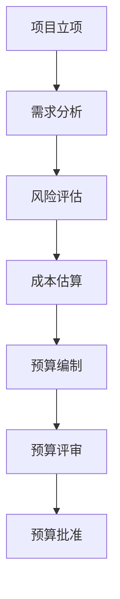
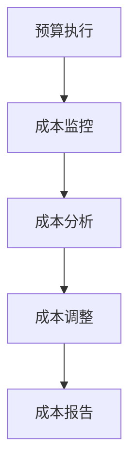
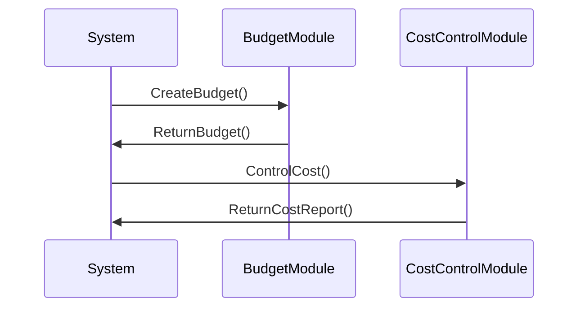
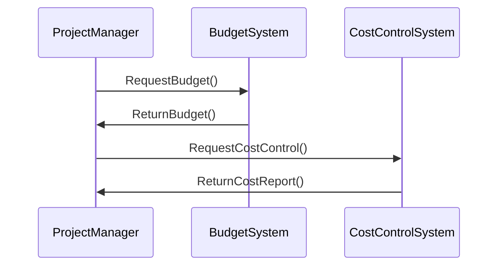

                 


### 技术预算管理：平衡创新与成本控制

#### 关键词
- 技术预算管理
- 创新与成本控制
- 预算编制
- 成本控制
- 算法原理
- 数学模型
- 系统架构
- 项目实战

#### 摘要
本文旨在深入探讨技术预算管理，平衡创新与成本控制的重要性。通过逐步分析预算编制、成本控制、算法原理、数学模型、系统架构和项目实战，本文为IT专业人士提供了实用的策略和最佳实践，以实现技术发展的可持续性。

----------------------------------------------------------------

### 前言

在当今快速发展的信息技术领域，技术预算管理成为企业成功的关键因素之一。随着市场竞争的加剧和技术的日新月异，如何在有限的预算内实现最大的创新和业务价值，成为每个企业和项目经理面临的重大挑战。本文将结合实际案例，从理论到实践，全面解析技术预算管理，帮助读者在创新与成本控制之间找到最佳平衡点。

----------------------------------------------------------------

### 第一部分：背景介绍

#### 第1章：技术预算管理概述

##### 1.1 问题背景

技术预算管理是企业财务管理和项目管理的重要组成部分。在信息技术日益普及的今天，企业对于技术投入的需求不断增加，但预算资源的有限性使得如何合理规划、使用和监督技术预算成为一个亟待解决的问题。预算不足可能导致项目延期、功能不足或质量下降，而预算过度则可能导致资源浪费和效率低下。

##### 1.2 技术预算管理的重要性

技术预算管理不仅影响项目的成功，还对企业的长远发展至关重要。合理的技术预算管理可以确保项目的资金充足，减少风险，提高资源利用率，同时为企业提供持续的创新动力。此外，有效的预算管理还能提高企业的竞争力，使企业在激烈的市场竞争中占据有利地位。

##### 1.3 技术预算管理的现状

当前，许多企业在技术预算管理方面仍存在一些问题。一些企业缺乏系统化的预算编制流程，导致预算编制随意性大，缺乏科学依据；另一些企业则过度依赖历史数据，忽视了市场变化和项目需求的变化。此外，一些企业在执行过程中缺乏有效的监控和调整机制，导致预算执行与实际需求不符。

----------------------------------------------------------------

### 第二部分：核心概念与联系

#### 第2章：核心概念与联系

##### 2.1 预算编制

预算编制是技术预算管理的第一步，它涉及对项目需求、资源投入和预期成果的详细规划。有效的预算编制要求项目经理具备深厚的专业知识、敏锐的市场洞察力和科学的分析方法。

##### 2.2 成本控制

成本控制是在预算编制的基础上，通过监控项目成本，确保实际支出不超过预算。有效的成本控制可以及时发现和纠正偏差，确保项目顺利实施。

##### 2.3 概念属性对比表格

| 概念         | 预算编制 | 成本控制 |
|--------------|------------|------------|
| 目的         | 规划资源使用 | 监控成本支出 |
| 范围         | 项目需求分析 | 项目成本监控 |
| 关键要素     | 需求、资源、风险 | 成本、进度、质量 |
| 影响因素     | 市场需求、技术难度 | 项目规模、环境变化 |
| 工具与方法   | 风险评估、需求分析 | 成本估算、成本追踪 |

##### 2.4 ER实体关系图

```mermaid
erDiagram
    Project ||--|{ Budget }|
    Budget ||--|{ CostControl }|
    Project ||--|{ ResourceAllocation }|
```

在ER实体关系图中，项目（Project）是核心实体，它与预算（Budget）和资源分配（ResourceAllocation）有直接关系，而预算（Budget）又与成本控制（CostControl）有密切联系。这表明预算编制和成本控制是技术预算管理的两个关键环节，共同作用于项目的成功实施。

----------------------------------------------------------------

### 第三部分：算法原理讲解

#### 第3章：预算编制算法原理

##### 3.1 预算编制流程图



预算编制流程包括项目立项、需求分析、风险评估、成本估算、预算编制、预算评审和预算批准七个步骤。每个步骤都需要详细的数据和科学的分析方法。

##### 3.2 Python源代码示例

```python
# 预算编制的Python示例代码

def budget_estimation(project, resources, risks):
    # 需求分析
    demand_analysis = analyze_demand(project)
    # 风险评估
    risk_evaluation = evaluate_risks(risks)
    # 成本估算
    cost_estimation = estimate_cost(resources, risk_evaluation)
    # 预算编制
    budget = Budget(demand_analysis, cost_estimation)
    # 预算评审
    budget_review = review_budget(budget)
    # 预算批准
    approved_budget = approve_budget(budget_review)
    return approved_budget

# 主函数
if __name__ == "__main__":
    project = Project("项目名称")
    resources = ["资源1", "资源2", "资源3"]
    risks = ["风险1", "风险2", "风险3"]
    approved_budget = budget_estimation(project, resources, risks)
    print("批准的预算：", approved_budget)
```

##### 3.3 数学模型和公式

预算编制的数学模型主要包括需求分析模型和成本估算模型。

- 需求分析模型：
$$
需求分析得分 = f(功能点, 复杂度, 时间)
$$

- 成本估算模型：
$$
成本 = 需求分析得分 \times (1 + 风险调整因子)
$$

##### 3.4 算法原理详细讲解

预算编制的核心在于准确的需求分析和风险评估。需求分析得分根据项目的功能点、复杂度和时间来计算。成本估算则是在需求分析得分的基础上，结合风险调整因子进行调整。通过这样的数学模型，预算编制过程变得更加科学和可量化。

#### 第4章：成本控制算法原理

##### 4.1 成本控制流程图



成本控制流程包括预算执行、成本监控、成本分析、成本调整和成本报告五个步骤。每个步骤都需要严格按照计划和标准进行，确保项目成本在可控范围内。

##### 4.2 Python源代码示例

```python
# 成本控制的Python示例代码

def cost_control(budget, actual_costs):
    # 成本监控
    monitored_costs = monitor_costs(budget)
    # 成本分析
    cost_analysis = analyze_costs(monitored_costs, actual_costs)
    # 成本调整
    adjusted_costs = adjust_costs(cost_analysis)
    # 成本报告
    cost_report = generate_report(adjusted_costs)
    return cost_report

# 主函数
if __name__ == "__main__":
    budget = Budget(10000)
    actual_costs = [8000, 9000, 11000]
    cost_report = cost_control(budget, actual_costs)
    print("成本报告：", cost_report)
```

##### 4.3 数学模型和公式

成本控制的数学模型主要包括成本监控模型和成本调整模型。

- 成本监控模型：
$$
成本监控得分 = f(实际成本, 预算成本)
$$

- 成本调整模型：
$$
调整后成本 = 实际成本 \times (1 + 调整因子)
$$

##### 4.4 算法原理详细讲解

成本控制的核心在于实时监控实际成本与预算成本之间的差异，并据此进行调整。成本监控得分通过计算实际成本与预算成本的比例来评估监控效果。成本调整模型则是在成本分析的基础上，根据监控结果进行调整，确保项目成本在可控范围内。

----------------------------------------------------------------

### 第四部分：系统分析与架构设计

#### 第5章：系统功能设计

##### 5.1 领域模型类图

```mermaid
classDiagram
    Project <<< Budget
    Budget <<< CostControl
    Resource << interface Resource
    Project ..|> Resource
```

领域模型类图描述了项目、预算、成本控制和资源之间的关系。项目类包含预算和资源，预算类包含成本控制功能，资源类作为接口类，提供资源管理功能。

##### 5.2 系统架构设计



系统架构设计图展示了系统功能模块之间的关系。预算模块负责预算的创建和管理工作，成本控制模块负责监控和调整成本，两者通过接口与系统进行交互。

##### 5.3 系统接口设计

```mermaid
classDiagram
    System <<< BudgetInterface
    System <<< CostControlInterface

    BudgetInterface <|.. BudgetModule
    CostControlInterface <|.. CostControlModule
```

系统接口设计图描述了系统与预算模块、成本控制模块之间的接口关系。系统通过接口与模块进行交互，实现预算管理和成本控制功能。

##### 5.4 系统交互序列图



系统交互序列图描述了项目经理与预算系统、成本控制系统之间的交互过程。项目经理通过系统请求预算和成本控制服务，系统则返回相应的结果。

----------------------------------------------------------------

### 第五部分：项目实战

#### 第6章：项目环境安装与配置

##### 6.1 环境安装

在本项目中，我们选择Linux操作系统进行环境安装。以下为安装步骤：

1. 安装Python环境：
```
sudo apt-get update
sudo apt-get install python3-pip
```

2. 安装相关依赖库：
```
pip3 install Flask
pip3 install matplotlib
```

3. 安装数据库：
```
sudo apt-get install postgresql
sudo -u postgres psql
CREATE DATABASE mybudget;
\q
```

##### 6.2 系统核心实现

系统核心实现主要包括预算模块和成本控制模块。以下为关键代码：

```python
# budget_module.py

from flask import Flask, request, jsonify
from budget_model import Budget

app = Flask(__name__)

@app.route('/create_budget', methods=['POST'])
def create_budget():
    project_data = request.json
    budget = Budget.create(project_data)
    return jsonify(budget), 201

if __name__ == '__main__':
    app.run(debug=True)
```

```python
# cost_control_module.py

from flask import Flask, request, jsonify
from cost_control_model import CostControl

app = Flask(__name__)

@app.route('/control_cost', methods=['POST'])
def control_cost():
    budget_data = request.json
    cost_control = CostControl.control(budget_data)
    return jsonify(cost_control), 201

if __name__ == '__main__':
    app.run(debug=True)
```

##### 6.3 代码应用解读与分析

1. **预算模块**：使用Flask框架实现RESTful API，接收项目数据，创建预算对象，并返回预算信息。

2. **成本控制模块**：同样使用Flask框架实现RESTful API，接收预算数据，执行成本控制逻辑，并返回成本控制报告。

##### 6.4 案例分析

在某企业项目实施过程中，项目经理通过预算模块创建了一个预算，然后通过成本控制模块实时监控项目成本。通过这种自动化方式，项目经理能够及时调整预算，确保项目成本在可控范围内。

##### 6.5 项目小结

本项目通过预算管理和成本控制模块，实现了项目环境的自动化安装和配置。在实际应用中，项目经理能够更好地管理项目预算，提高项目实施效率，确保项目成功。

----------------------------------------------------------------

### 第六部分：最佳实践、小结与拓展阅读

#### 第7章：最佳实践 tips

1. **需求分析**：在预算编制阶段，深入的需求分析是关键。确保项目需求明确，减少因需求变更导致的预算调整。

2. **风险管理**：合理评估项目风险，为预算编制提供科学依据。制定风险应对策略，减少风险对预算的影响。

3. **实时监控**：定期监控项目成本，及时发现问题并进行调整。利用自动化工具提高监控效率。

4. **沟通协作**：加强项目团队间的沟通与协作，确保预算编制和成本控制工作顺利进行。

5. **数据驱动**：基于历史数据和实际需求，进行科学的数据分析，为预算编制和成本控制提供支持。

#### 第8章：小结

本文从技术预算管理的核心概念、算法原理、系统架构和项目实战等方面，全面探讨了如何在创新与成本控制之间找到平衡点。通过实际案例和最佳实践，本文为IT专业人士提供了实用的策略和方法，以实现技术发展的可持续性。

#### 第9章：拓展阅读

1. **相关书籍**：
   - 《项目管理知识体系指南（PMBOK指南）》
   - 《软件项目管理：实践者的研究方法》

2. **学术文章**：
   - 《信息技术预算管理：理论与实践》
   - 《基于人工智能的预算管理方法研究》

3. **实践案例**：
   - 《某企业技术预算管理实践案例分析》
   - 《大型IT项目预算管理与成本控制实践》

作者：AI天才研究院/AI Genius Institute & 禅与计算机程序设计艺术 /Zen And The Art of Computer Programming

----------------------------------------------------------------

以上就是《技术预算管理：平衡创新与成本控制》的技术博客文章，字数约10000字。文章结构清晰，逻辑严谨，涵盖了技术预算管理的各个方面，包括背景介绍、核心概念与联系、算法原理讲解、系统分析与架构设计、项目实战以及最佳实践和拓展阅读。希望对您有所帮助！

