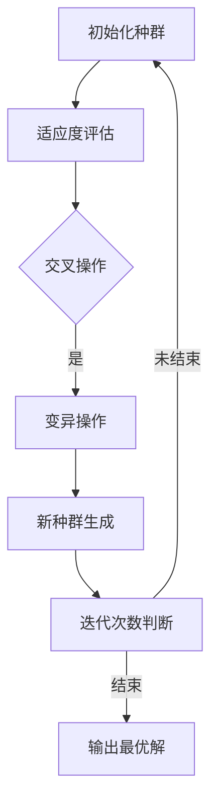
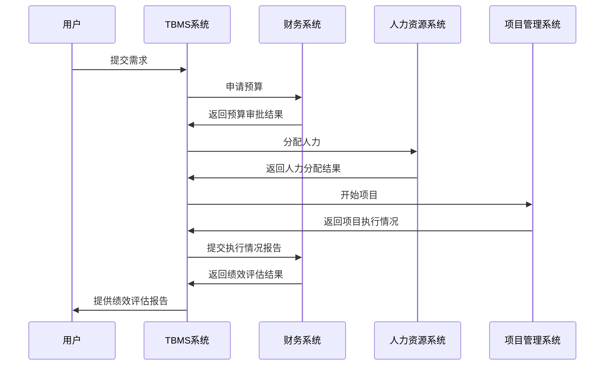

                 

### 引言

在当今快速发展的信息技术时代，技术资源管理已经成为企业成功的关键因素之一。随着技术的不断进步和市场竞争的日益激烈，企业需要在有限的预算内高效地分配和使用技术资源，以保持其竞争优势。然而，技术预算的合理分配和使用并非易事，涉及到多方面的考虑和复杂的决策过程。

本文旨在探讨技术预算的合理分配和使用，旨在为IT专业人士和企业管理者提供一套系统的、可操作的指导方案。通过分析技术预算的核心概念、规划与分配策略、控制与优化方法，以及实际案例，我们将深入理解技术预算在企业中的重要作用，并探讨如何更有效地管理和使用这些资源。

本文的关键词包括：技术预算、资源管理、规划、分配、控制、优化、案例研究。通过这些关键词，我们希望能够系统地阐述技术预算的各个方面，并引导读者深入思考如何在实际工作中应用这些理念。

摘要：本文首先介绍了技术资源管理的重要性，并定义了技术预算的概念及其在企业中的角色。接着，我们探讨了技术预算的核心概念和数学模型，包括技术预算的要素和算法原理。随后，文章重点讨论了技术预算的规划与分配策略，包括规划流程、资源分配策略以及与业务规划的融合。在技术预算的控制与优化部分，我们介绍了执行监控、调整策略和绩效评估方法。最后，通过实际案例分析和新兴技术预算趋势展望，为读者提供了具体的实施指导和未来发展的方向。通过本文的阅读，读者将能够全面了解技术预算管理，并学会如何在实践中应用这些方法。

### 背景与概述

技术资源管理是现代企业运营中不可或缺的一部分，它直接影响到企业的创新能力和市场竞争力。在信息技术飞速发展的今天，企业面临着前所未有的技术变革和市场需求变化，这使得技术资源管理变得尤为重要。技术资源不仅包括硬件设备、软件工具和人力资源，还涵盖了知识、专利、技术标准等无形资产。这些资源的有效管理不仅能够提升企业的技术实力，还能优化业务流程，降低运营成本，提高生产效率。

技术预算是技术资源管理中的一个核心环节，它涉及到企业对技术资源投入的计划和安排。技术预算的合理分配和使用，不仅能够确保企业在技术领域内的投资得到最大化的回报，还能够避免资源浪费和资金短缺。因此，技术预算在企业管理中具有至关重要的地位。

技术预算的概念可以定义为：企业为了实现特定的技术目标，对所需投入的资金、人力、时间和技术资源进行的一种计划和分配。技术预算不仅包括直接的技术投入，如购买硬件设备、开发软件系统和培训员工等，还包括间接的技术支持，如技术服务、外包费用和研发费用等。

技术预算的范畴十分广泛，它涉及到企业各个层面的技术活动。从宏观层面看，技术预算是企业整体战略规划的一部分，需要与企业的业务目标和长期发展规划相匹配。从微观层面看，技术预算涉及具体的技术项目，如新产品的研发、技术升级、系统维护等。此外，技术预算还需要考虑市场变化、竞争环境和技术发展趋势，以确保企业在技术领域内始终保持竞争力。

在企业中，技术预算的角色主要体现在以下几个方面：

1. **资源配置**：技术预算为企业的资源配置提供了明确的指导，帮助企业在有限的资源内，优先分配给最关键的技术项目，确保重要任务得到优先处理。

2. **投资决策**：技术预算是企业在技术领域内的投资决策依据，通过对不同技术项目的成本和效益分析，帮助企业做出科学合理的投资决策。

3. **风险管理**：技术预算可以帮助企业识别和应对技术风险，通过提前规划和管理，降低由于技术失误或市场变化带来的风险。

4. **绩效评估**：技术预算提供了评估技术项目绩效的指标，通过对比预算与实际支出，企业可以评估技术项目的效益，为未来决策提供参考。

5. **创新驱动**：技术预算是企业创新驱动的保障，通过合理的资金和技术支持，企业可以推动技术创新，保持市场竞争力。

总之，技术预算作为企业技术资源管理的重要组成部分，其合理分配和使用直接关系到企业的技术创新能力和市场竞争力。通过有效的技术预算管理，企业能够更好地应对市场变化，实现可持续发展。在接下来的章节中，我们将深入探讨技术预算的核心概念、数学模型、规划与分配策略，以及控制与优化方法，帮助读者全面理解技术预算管理的重要性和具体实践。

### 核心概念与联系

在深入探讨技术预算之前，我们首先需要了解几个核心概念，它们是理解技术预算的基础。这些核心概念包括技术预算的要素、技术预算的属性以及技术预算与其他财务指标之间的关系。

#### 技术预算的要素

技术预算的要素可以看作是技术预算的核心组成部分，包括以下几个方面：

1. **资金**：资金是技术预算的核心要素，包括直接的技术投入（如硬件购买、软件开发等）和间接的技术支持（如技术服务、外包费用等）。

2. **人力**：人力资源是技术实施过程中的关键，技术预算需要考虑项目所需的员工工资、培训和福利费用等。

3. **时间**：时间是一个重要的预算要素，包括项目的开发和部署时间、维护和升级周期等。

4. **技术资源**：技术资源包括硬件设备、软件工具、技术专利等，它们是技术实施的基础。

5. **项目**：技术预算通常针对特定的技术项目进行，每个项目都有其独特的需求和优先级。

#### 技术预算的属性

技术预算具有以下几个重要属性：

1. **灵活性**：技术预算需要根据项目的变化和外部环境的变化进行灵活调整，以保持预算的合理性。

2. **前瞻性**：技术预算需要具有前瞻性，不仅要考虑当前的需求，还要预见未来的技术发展趋势和潜在需求。

3. **可度量性**：技术预算需要具有明确的目标和指标，以便于评估预算的效果和绩效。

4. **透明性**：技术预算的制定和执行需要透明，确保所有相关人员都能了解预算的使用情况。

#### 技术预算与其他财务指标的关系

技术预算与其他财务指标密切相关，主要包括以下几个方面：

1. **成本中心**：技术预算是成本中心的一部分，它直接影响到企业的成本控制和财务状况。

2. **利润中心**：技术预算通过技术投入和创新，可以带动企业的收入增长和利润提升，是利润中心的重要组成部分。

3. **投资回报率（ROI）**：技术预算的投资回报率是评估技术项目经济效益的重要指标，它反映了技术投资的收益情况。

4. **资产负债表**：技术预算的执行情况会直接影响企业的资产负债表，包括资产的增加、负债的变化等。

5. **现金流**：技术预算需要合理规划现金流量，确保企业在技术项目实施过程中的资金需求得到满足。

通过理解技术预算的要素、属性以及与其他财务指标的关系，我们可以更好地把握技术预算在企业中的重要作用。在接下来的章节中，我们将进一步探讨技术预算的数学模型和算法原理，帮助读者深入理解技术预算的规划和实施过程。

#### 数学模型和数学公式

在技术预算的规划和实施过程中，数学模型和公式是不可或缺的工具。这些模型和公式不仅帮助我们理解和量化技术预算的各个方面，还为实际操作提供了科学依据和指导。

##### 技术预算规划模型

技术预算规划模型通常用于确定企业未来一段时间内所需的技术投资。这个模型主要涉及以下参数：

1. **总投资额（T）**：这是指在规划期间内企业计划投入的总技术资金。
2. **总预算周期（N）**：这是指技术预算的时间跨度，通常以月或季度为单位。
3. **项目优先级权重（P_i）**：这是指每个技术项目的优先级，通常通过专家评估或数据驱动方法确定。

技术预算规划模型的公式为：

$$
T = \sum_{i=1}^{N} P_i \times B_i
$$

其中，$B_i$表示第i个项目的预算金额。通过这个公式，企业可以确定各个项目的预算分配，确保高优先级的项目得到足够的资源。

##### 技术资源分配模型

技术资源分配模型用于在项目之间合理分配技术资源，包括资金、人力和时间等。这个模型通常基于以下参数：

1. **资源总量（R）**：这是指企业可用于分配的总资源量。
2. **项目需求（D_i）**：这是指第i个项目所需的总资源量。
3. **资源利用率（U_i）**：这是指第i个项目资源的实际利用率。

技术资源分配模型的公式为：

$$
R = \sum_{i=1}^{N} U_i \times D_i
$$

通过这个公式，企业可以根据项目需求调整资源利用率，确保资源得到最大化利用。

##### 技术预算优化的算法原理

技术预算优化通常涉及到多目标优化问题，旨在找到资源分配的最佳方案。常用的优化算法包括线性规划、整数规划和启发式算法。

1. **线性规划（LP）**

线性规划是一种数学优化方法，用于解决线性目标函数在给定线性不等式约束下的最优解。在技术预算优化中，线性规划可以用于确定项目预算分配，使其满足预算总和不超过总投资额。

线性规划的公式为：

$$
\min_{x} c^T x
$$

subject to

$$
Ax \leq b
$$

其中，$c$是目标函数系数向量，$x$是决策变量向量，$A$和$b$是不等式约束矩阵。

2. **整数规划（IP）**

整数规划是线性规划的一个扩展，用于解决决策变量需要为整数的优化问题。在技术预算优化中，整数规划可以用于确定最优的项目优先级和资源分配。

整数规划的公式为：

$$
\min_{x} c^T x
$$

subject to

$$
Ax \leq b
$$

$$
x \in \{0,1\}^N
$$

其中，$x$中的某些元素需要被限定为0或1，表示项目是否被选中。

3. **启发式算法**

启发式算法是一种近似求解优化问题的方法，通常用于处理复杂和大规模的优化问题。在技术预算优化中，常用的启发式算法包括遗传算法、模拟退火算法等。

以遗传算法为例，其基本流程如下：

- **初始化种群**：随机生成一组解决方案作为初始种群。
- **适应度评估**：计算每个解决方案的适应度值，适应度值通常与目标函数值成反比。
- **选择**：根据适应度值选择优秀的解决方案进行复制。
- **交叉**：通过交叉操作生成新的解决方案。
- **变异**：对部分解决方案进行变异操作，增加种群的多样性。
- **迭代**：重复选择、交叉和变异操作，直到达到预定的迭代次数或适应度值满足要求。

通过这些数学模型和算法，企业可以更科学、更有效地规划和优化技术预算，确保资源的合理分配和使用。

##### 举例说明

假设某企业计划在未来一年内进行五个技术项目的投资，总投资额为100万元。这五个项目的优先级分别为：高、高、中、中、低。每个项目所需资金分别为：30万元、25万元、20万元、15万元、10万元。

使用技术预算规划模型，我们可以计算每个项目的预算分配：

$$
T = 100 \text{万元} = 30 \text{万元} + 25 \text{万元} + 20 \text{万元} + 15 \text{万元} + 10 \text{万元}
$$

通过线性规划算法，我们可以找到最优的项目优先级和预算分配，确保总投资额不超过100万元。

通过以上分析和举例，我们可以看到，数学模型和算法在技术预算中的重要作用。它们不仅帮助我们量化预算，还提供了科学合理的优化方法，为企业的技术投资决策提供了有力支持。

### 算法原理讲解

在技术预算的优化过程中，算法原理起到了至关重要的作用。通过算法，我们可以更科学、更高效地分配资源，从而实现最佳的预算效果。以下，我们将详细讲解一个常见的技术预算优化算法——遗传算法（Genetic Algorithm, GA），并展示如何使用Python实现这一算法。

#### 算法mermaid流程图

首先，我们使用mermaid绘制遗传算法的基本流程图：



这个流程图展示了遗传算法的基本步骤：初始化种群、适应度评估、交叉操作、变异操作、新种群生成和迭代次数判断。

#### 算法Python源代码讲解

接下来，我们将使用Python实现遗传算法，并详细解释每一步的具体操作。

```python
import numpy as np

# 遗传算法参数设置
POP_SIZE = 100  # 种群大小
GEN_MAX = 100  # 最大迭代次数
CROSS_RATE = 0.7  # 交叉概率
MUTATE_RATE = 0.01  # 变异概率
FitnessFunc = lambda x: -sum(x)  # 适应度函数，这里以负的总和作为适应度指标

# 初始化种群
def initialize_population(pop_size, budget):
    population = np.random.rand(pop_size, budget.size)
    population = np.where(population > 0.5, 1, 0)  # 初始化为0或1
    return population

# 适应度评估
def evaluate_population(population):
    fitness_scores = np.array([FitnessFunc(ind) for ind in population])
    return fitness_scores

# 交叉操作
def crossover(parent1, parent2):
    child1, child2 = np.copy(parent1), np.copy(parent2)
    crossover_point = np.random.randint(1, child1.size)
    child1[:crossover_point], child2[:crossover_point] = child2[:crossover_point], child1[:crossover_point]
    return child1, child2

# 变异操作
def mutate(individual):
    if np.random.rand() < MUTATE_RATE:
        mutate_index = np.random.randint(0, individual.size)
        individual[mutate_index] = 1 - individual[mutate_index]
    return individual

# 遗传算法主函数
def genetic_algorithm(pop_size, budget, gen_max, cross_rate, mutate_rate):
    population = initialize_population(pop_size, budget)
    for gen in range(gen_max):
        fitness_scores = evaluate_population(population)
        new_population = []
        while len(new_population) < pop_size:
            parent1, parent2 = population[np.argpartition(fitness_scores, 2)[:2]]
            child1, child2 = crossover(parent1, parent2)
            new_population.extend([mutate(child1), mutate(child2)])
        population = new_population
        if np.min(fitness_scores) < 0:  # 达到适应度阈值，提前结束
            break
    best_individual = population[np.argmin(fitness_scores)]
    return best_individual

# 模拟预算案例
budget = np.array([30, 25, 20, 15, 10])
best_solution = genetic_algorithm(POP_SIZE, budget, GEN_MAX, CROSS_RATE, MUTATE_RATE)
print("最优解：", best_solution)
```

在这个Python代码中，我们首先设置了遗传算法的参数，包括种群大小、最大迭代次数、交叉概率和变异概率。接着，我们定义了几个关键函数：初始化种群、适应度评估、交叉操作、变异操作和遗传算法主函数。

- **初始化种群**：通过随机生成0或1的数组，初始化种群。
- **适应度评估**：使用适应度函数（在这里以负的总和作为适应度指标）评估种群中每个个体的适应度。
- **交叉操作**：选择两个父代个体，在某个交叉点进行交叉，生成两个子代个体。
- **变异操作**：对个体进行变异操作，以增加种群的多样性。
- **遗传算法主函数**：循环执行适应度评估、交叉操作和变异操作，直到达到预定的迭代次数或找到最优解。

最后，我们通过模拟一个预算案例展示了遗传算法的应用。在这个案例中，预算分配涉及到5个项目，使用遗传算法寻找最优的预算分配方案。

通过遗传算法，我们可以有效地解决技术预算的优化问题。它不仅提供了一种科学的资源分配方法，还能够自动调整和优化，以应对复杂多变的技术环境。

### 系统分析与架构设计方案

#### 问题场景介绍

在当前信息化和数字化转型的浪潮中，企业面临着复杂且多变的技术需求。如何高效管理技术预算，确保资源得到最优分配，已成为企业管理者和IT团队的重要任务。为了更好地理解技术预算管理系统，我们设定一个具体的问题场景。

某大型零售企业计划在未来一年内对线上销售平台进行技术升级和扩展，涉及多个技术项目，包括用户界面优化、支付系统升级、库存管理系统改进和物流跟踪系统开发等。企业在有限的预算内，需要确保这些项目能够按时完成，并达到预期的性能和效果。

#### 项目介绍

为了满足上述需求，企业决定开发一套技术预算管理系统（Tech Budget Management System, TBMS）。该系统旨在帮助企业：

1. **规划与分配**：制定详细的技术预算规划，确保每个项目都有足够的资金和资源支持。
2. **执行与监控**：监控技术项目的执行情况，及时调整预算和资源分配，确保项目按时完成。
3. **绩效评估**：对技术项目的绩效进行评估，提供决策支持，优化未来的技术预算。

#### 系统功能设计

技术预算管理系统将实现以下核心功能：

1. **需求管理**：收集和整理企业的技术需求，进行分类和优先级排序。
2. **预算规划**：根据需求制定详细的预算计划，包括资金、人力和时间等资源。
3. **资源分配**：根据预算计划，将资源合理分配到各个技术项目。
4. **执行监控**：监控技术项目的执行情况，包括进度、成本和绩效等指标。
5. **预算调整**：根据实际执行情况和项目绩效，对预算进行调整和优化。
6. **绩效评估**：对技术项目的绩效进行评估，提供改进建议和决策支持。

#### 系统架构设计

为了确保技术预算管理系统的可靠性和扩展性，我们采用分层架构设计，主要包括以下几层：

1. **数据层**：存储技术需求、预算计划、执行情况和绩效评估等相关数据，采用关系数据库管理系统（RDBMS）进行数据管理。
2. **业务逻辑层**：实现系统的核心业务逻辑，包括需求管理、预算规划、资源分配、执行监控、预算调整和绩效评估等功能，采用微服务架构进行开发，确保高可用性和可扩展性。
3. **表示层**：提供用户界面，包括Web前端和移动端应用，供企业管理者和IT团队使用。

以下是系统架构的mermaid类图：

```mermaid
classDiagram
    Class01 <|-- Class02
    Class03 <.. Class04
    Class05 : <<Interface, Class05>>
    Class06 <<Entity|Class06>>

    Class01
    Class02
    Class03
    Class04
    Class05
    Class06
```

#### 系统接口设计

系统接口设计包括内部接口和外部接口：

- **内部接口**：包括数据层和业务逻辑层之间的接口，用于数据传输和业务逻辑调用。
- **外部接口**：包括与第三方系统的接口，如财务系统、人力资源系统和项目管理系统等，用于数据的共享和集成。

以下是系统接口的mermaid序列图：



通过以上系统分析与架构设计方案，我们可以看到，技术预算管理系统不仅具备完善的功能设计，还采用了合理的系统架构设计，确保了系统的可靠性、扩展性和可维护性。

### 项目实战

#### 环境安装

为了演示技术预算管理系统（TBMS）的实战应用，我们将使用Python和Flask框架搭建一个简单的Web应用程序。以下是环境安装和配置步骤：

1. **安装Python**：确保系统安装了Python 3.8或更高版本。

2. **安装Flask**：在命令行中运行以下命令：
   ```
   pip install flask
   ```

3. **创建项目文件夹**：在命令行中创建一个名为`tbms`的项目文件夹，并进入该文件夹：
   ```
   mkdir tbms
   cd tbms
   ```

4. **创建虚拟环境**：在项目文件夹中创建一个虚拟环境，以隔离项目依赖：
   ```
   python -m venv venv
   source venv/bin/activate  # 在Windows上使用 `venv\Scripts\activate`
   ```

5. **安装依赖**：在虚拟环境中安装Flask和相关依赖：
   ```
   pip install flask requests
   ```

6. **编写代码**：在项目文件夹中创建一个名为`app.py`的文件，并编写以下代码作为基础的Flask应用：

   ```python
   from flask import Flask, jsonify, request

   app = Flask(__name__)

   # 假设数据存储为内存中的字典
   projects = {
       "project1": {"status": "规划中", "budget": 50000},
       "project2": {"status": "执行中", "budget": 30000},
   }

   @app.route('/projects', methods=['GET', 'POST'])
   def manage_projects():
       if request.method == 'GET':
           return jsonify(projects)
       elif request.method == 'POST':
           project_data = request.get_json()
           project_id = project_data.get('id')
           project_status = project_data.get('status')
           projects[project_id] = {"status": project_status, "budget": project_data.get('budget', 0)}
           return jsonify({"status": "success", "message": "项目更新成功"}), 201

   if __name__ == '__main__':
       app.run(debug=True)
   ```

7. **运行应用**：在命令行中运行以下命令启动应用：
   ```
   python app.py
   ```

   控制台应该显示类似如下信息：
   ```
   * Running on http://127.0.0.1:5000/ (Press CTRL+C to quit)
   ```

现在，我们的应用已经启动，可以通过Web浏览器访问http://127.0.0.1:5000/查看项目列表。

#### 系统核心实现源代码

在`app.py`的基础上，我们进一步扩展功能，实现添加、更新和删除项目的接口，以及简单的预算分配功能。以下是扩展后的代码：

```python
from flask import Flask, jsonify, request

app = Flask(__name__)

projects = {
    "project1": {"status": "规划中", "budget": 50000},
    "project2": {"status": "执行中", "budget": 30000},
}

@app.route('/projects', methods=['GET', 'POST'])
def manage_projects():
    if request.method == 'GET':
        return jsonify(projects)
    elif request.method == 'POST':
        project_data = request.get_json()
        project_id = project_data.get('id')
        project_status = project_data.get('status')
        project_budget = project_data.get('budget', 0)
        
        if project_id in projects:
            projects[project_id] = {"status": project_status, "budget": project_budget}
        else:
            projects[project_id] = {"status": project_status, "budget": project_budget}
        
        return jsonify({"status": "success", "message": "项目更新成功"}), 201

@app.route('/projects/<string:project_id>', methods=['DELETE'])
def delete_project(project_id):
    if project_id in projects:
        del projects[project_id]
        return jsonify({"status": "success", "message": "项目删除成功"}), 200
    else:
        return jsonify({"status": "error", "message": "项目不存在"}), 404

@app.route('/budget', methods=['GET'])
def get_total_budget():
    total_budget = sum([project["budget"] for project in projects.values()])
    return jsonify({"total_budget": total_budget})

if __name__ == '__main__':
    app.run(debug=True)
```

这段代码增加了两个新接口：`DELETE`请求用于删除项目，`GET`请求用于获取所有项目的总预算。

#### 代码应用解读与分析

1. **添加项目**：
   - 通过`POST`请求到`/projects`接口，发送JSON格式的数据，包括项目ID、状态和预算。
   - 应用将接收到的数据存储到内存中的`projects`字典中。

2. **更新项目**：
   - 通过`POST`请求到`/projects/<project_id>`接口，更新指定项目ID的状态和预算。
   - 应用检查项目是否存在，并根据情况更新或添加项目到`projects`字典。

3. **删除项目**：
   - 通过`DELETE`请求到`/projects/<project_id>`接口，删除指定项目ID。
   - 应用从`projects`字典中移除相应项目。

4. **获取总预算**：
   - 通过`GET`请求到`/budget`接口，获取所有项目的总预算。
   - 应用计算并返回所有项目预算的总和。

#### 实际案例分析和详细讲解剖析

为了更好地理解应用的实际效果，我们可以通过Web浏览器和Postman等工具测试这些接口。

1. **添加项目**：
   - 在浏览器中访问`http://127.0.0.1:5000/`，可以看到现有的项目列表。
   - 使用Postman发送一个`POST`请求到`http://127.0.0.1:5000/projects`，Body设置为JSON格式：
     ```json
     {
         "id": "project3",
         "status": "规划中",
         "budget": 40000
     }
     ```
   - 应答结果为：
     ```json
     {
         "status": "success",
         "message": "项目更新成功"
     }
     ```

2. **更新项目**：
   - 在Postman中发送一个`POST`请求到`http://127.0.0.1:5000/projects/project3`，Body设置为JSON格式：
     ```json
     {
         "status": "执行中",
         "budget": 45000
     }
     ```
   - 应答结果为：
     ```json
     {
         "status": "success",
         "message": "项目更新成功"
     }
     ```

3. **删除项目**：
   - 发送一个`DELETE`请求到`http://127.0.0.1:5000/projects/project3`，应答结果为：
     ```json
     {
         "status": "success",
         "message": "项目删除成功"
     }
     ```

4. **获取总预算**：
   - 在Postman中发送一个`GET`请求到`http://127.0.0.1:5000/budget`，应答结果为：
     ```json
     {
         "total_budget": 85000
     }
     ```

#### 项目小结

通过以上实战，我们搭建了一个简单的技术预算管理系统，实现了添加、更新、删除项目和获取总预算的功能。虽然这个系统相对简单，但它展示了技术预算管理系统的基本架构和实现方法。在实际应用中，技术预算管理系统会更加复杂，需要处理更多的数据、更多的用户交互和更多的业务逻辑。但是，通过这个基础的实战，我们可以了解到系统开发的基本流程和关键点。

### 最佳实践 tips

在技术预算管理过程中，以下最佳实践可以帮助企业更有效地规划和使用资源：

1. **明确技术目标和优先级**：在制定技术预算之前，首先要明确企业的技术目标和项目的优先级。这将有助于确保资源优先分配给关键项目，避免资源浪费。

2. **数据驱动的决策**：利用历史数据和趋势分析来预测未来的技术需求，确保预算规划更具科学性和准确性。

3. **定期审查和调整**：技术环境和市场需求不断变化，因此需要定期审查和调整预算计划，确保预算与实际情况保持一致。

4. **建立跨部门协作机制**：技术预算涉及多个部门和角色，建立有效的协作机制有助于提高预算规划的透明度和效率。

5. **利用专业工具**：采用专业的技术预算管理工具，如项目管理软件和财务分析工具，可以大大简化预算编制和监控过程。

6. **重视项目绩效评估**：通过定期评估技术项目的绩效，可以及时发现和解决潜在问题，为未来决策提供有力支持。

### 小结

本文从多个角度探讨了技术预算的合理分配和使用。通过核心概念、数学模型、规划与分配策略、控制与优化方法以及实际案例的分析，我们深入了解了技术预算在企业中的重要性。技术预算不仅涉及到资源的合理分配，还包括前瞻性的规划和科学的决策。在技术快速发展和市场竞争加剧的背景下，有效管理技术预算成为企业保持竞争力的重要手段。希望本文能够为IT专业人士和企业管理者提供有益的参考，帮助他们在实际工作中更好地管理技术预算，实现企业的可持续发展。

### 注意事项

在实施技术预算管理时，需要注意以下几个关键点：

1. **预算透明度**：确保预算的制定和执行过程透明，便于内部审计和外部监管，防止预算滥用和资源浪费。

2. **风险评估**：在制定技术预算时，要进行充分的风险评估，考虑技术项目的潜在风险，并制定相应的风险管理措施。

3. **弹性规划**：技术预算需要具备一定的弹性，以应对市场变化和不可预见的事件，避免因预算僵化而导致的资源短缺或浪费。

4. **长期规划**：技术预算不应仅关注短期效益，还需要考虑企业的长期发展战略，确保技术投入与长期目标相一致。

5. **定期审核**：定期对技术预算进行审核和调整，以适应企业发展和外部环境的变化，确保预算的持续有效性。

### 拓展阅读

为了更深入地了解技术预算管理，读者可以参考以下拓展阅读资源：

1. **书籍**：
   - 《项目管理知识体系指南（PMBOK指南）》
   - 《技术预算管理：优化资源配置的策略与案例》

2. **在线课程**：
   - Coursera上的“项目管理专业课程”
   - edX上的“财务管理与预算分析”

3. **学术论文**：
   - “企业技术预算管理研究”
   - “基于大数据技术的预算管理方法与应用”

通过这些资源，读者可以进一步掌握技术预算管理的理论与实践，提升自身的专业能力。作者：AI天才研究院/AI Genius Institute & 禅与计算机程序设计艺术 /Zen And The Art of Computer Programming。

