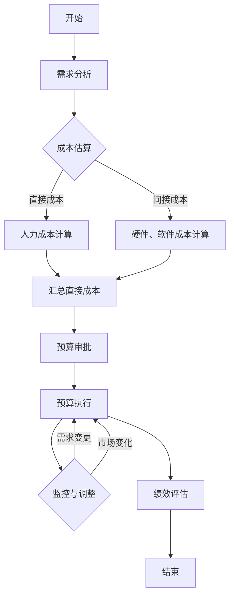
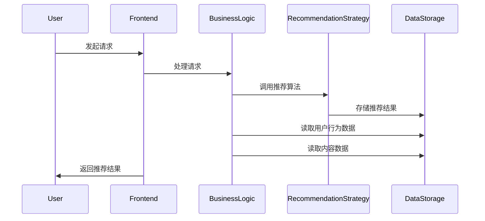
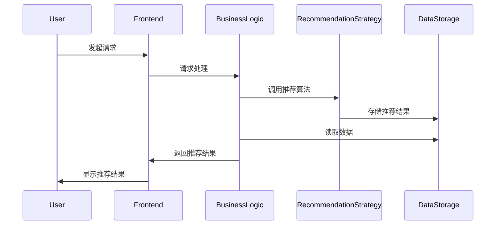

                 

### 《技术预算：合理分配和使用技术资源》

> 关键词：技术预算、资源分配、管理策略、绩效评估、最佳实践

> 摘要：本文旨在探讨技术预算的合理分配和使用，通过详细分析技术预算的背景与意义、制定与分配策略、执行与监控以及绩效评估等方面，帮助企业和组织提高技术资源的利用效率，实现战略目标。

## 第一部分：技术预算的背景与意义

### 1.1.1 技术预算概述

#### 技术预算的概念

技术预算是指为支持企业或组织技术研发、维护、升级等活动的资金安排。它不仅包括直接与技术研发相关的成本，如研发人员的薪资、硬件设备和软件的采购费用，还包括间接成本，如技术支持、培训和知识分享等。

#### 技术预算的重要性

1. **支持战略规划**：技术预算是企业战略规划的重要组成部分，它帮助企业确定资源投入的方向，确保技术研发与市场需求的匹配。
2. **优化资源配置**：通过合理的预算分配，企业可以避免资源浪费，提高资金利用效率。
3. **提升决策效率**：明确的技术预算可以帮助管理层快速做出决策，减少因信息不对称导致的决策失误。

### 1.1.2 技术预算的历史与演变

#### 传统预算方式的局限性

1. **静态预算**：传统预算往往是基于过去的数据进行的，缺乏灵活性，难以适应市场变化。
2. **主观性**：传统预算编制过程中往往存在较大的主观性，容易导致资源分配不合理。

#### 技术预算的发展趋势

1. **动态预算**：随着市场和技术环境的变化，越来越多的企业开始采用动态预算，以更好地适应不确定的环境。
2. **智能化预算**：利用人工智能和大数据技术，实现预算编制的智能化，提高预算的准确性和科学性。

### 1.1.3 技术预算在组织中的角色

#### 支持战略规划

技术预算是企业战略规划的重要组成部分，它帮助企业确定技术研发的方向，确保资源投入与战略目标的一致性。

#### 优化资源配置

通过合理的预算分配，企业可以避免资源浪费，提高资金利用效率。

#### 提升决策效率

明确的技术预算可以帮助管理层快速做出决策，减少因信息不对称导致的决策失误。

## 第二部分：技术预算的制定

### 2.1.1 制定技术预算的流程

#### 需求分析

需求分析是技术预算制定的基础，它包括对市场需求的预测、对技术研发需求的评估等。

#### 成本估算

成本估算是预算制定的关键环节，它包括直接成本和间接成本的估算，如研发人员的薪资、硬件和软件采购费用等。

#### 预算审批

预算审批是确保技术预算合理性的重要环节，它包括内部审批和外部审批，如财务部门和技术部门的审批。

### 2.1.2 技术预算的制定方法

#### 基于历史数据的预算编制

基于历史数据的预算编制方法是一种传统的预算方法，它通过分析过去的数据，预测未来的成本。

#### 基于目标导向的预算编制

基于目标导向的预算编制方法是一种以未来目标为导向的预算方法，它通过设定明确的目标，制定相应的预算计划。

#### 零基预算编制

零基预算编制方法是一种从零开始进行预算编制的方法，它不考虑过去的预算，而是根据项目的实际需求进行预算。

### 2.1.3 技术预算的关键要素

#### 人力成本

人力成本是技术预算中最主要的成本之一，它包括研发人员的薪资、培训费用等。

#### 硬件成本

硬件成本包括服务器、存储设备、网络设备等。

#### 软件成本

软件成本包括操作系统、数据库、开发工具等。

#### 维护成本

维护成本包括系统维护、网络维护、安全保障等。

## 第三部分：技术预算的分配策略

### 3.1.1 技术资源分配的原则与策略

#### 技术资源分配的原则

1. **公平原则**：确保资源分配的公平性，避免因资源分配不均导致的问题。
2. **效率原则**：提高资源利用效率，避免资源浪费。
3. **可持续性原则**：确保资源的可持续利用，避免短期行为对长期发展的影响。

#### 技术资源分配的策略

1. **优先级排序**：根据项目的紧急程度和重要性，进行资源优先级排序。
2. **资源池管理**：建立资源池，实现资源的统一管理和调配。
3. **弹性预算**：根据实际情况，灵活调整预算，以应对不确定的环境。

### 3.1.2 技术资源分配的案例分析

#### 中小企业

中小企业由于资源有限，需要更加注重资源的合理分配。通过优先级排序和资源池管理，中小企业可以更好地应对市场变化。

#### 大型企业

大型企业拥有更多的资源，可以通过弹性预算和智能化预算管理，提高资源利用效率。

## 第四部分：技术预算的执行与监控

### 5.1.1 技术预算的执行与管理

#### 技术预算的执行流程

1. **预算执行**：按照预算计划进行资金的使用和资源的调配。
2. **成本控制**：通过成本控制，确保实际支出不超过预算。

#### 技术预算的监控方法

1. **定期审查**：定期审查预算执行情况，发现问题和风险。
2. **实时监控**：通过实时监控系统，及时掌握预算执行情况。

### 5.1.2 技术预算的调整策略

#### 需求变更

当市场需求或技术研发需求发生变化时，需要及时调整预算。

#### 市场变化

当市场环境发生变化时，如技术成本上升或下降，需要根据实际情况调整预算。

## 第五部分：技术预算的绩效评估

### 6.1.1 技术预算的评估指标

#### 成本效率

成本效率是评估技术预算的重要指标，它通过比较实际成本和预算成本，评估预算的合理性。

#### 项目成功率

项目成功率是评估技术研发项目成功的重要指标，它通过评估项目的完成情况和项目成果，评估预算的有效性。

#### 技术先进性

技术先进性是评估技术研发成果的重要指标，它通过评估技术的创新程度和应用价值，评估预算的投资效果。

### 6.1.2 技术预算的评估方法

#### 定量评估

定量评估通过数据分析和比较，评估技术预算的执行效果。

#### 定性评估

定性评估通过专家评估和用户反馈，评估技术预算的投资效果。

### 6.1.3 技术预算的改进措施

#### 优化预算编制

通过改进预算编制方法，提高预算的准确性和科学性。

#### 改进执行流程

通过改进预算执行流程，提高预算执行的效率和效果。

## 第六部分：技术预算的最佳实践与案例分析

### 7.1.1 企业级技术预算管理实践

#### 华为技术有限公司

华为技术有限公司通过建立完善的预算管理体系，实现了技术资源的有效分配和管理。

#### 阿里巴巴集团

阿里巴巴集团通过智能化的预算管理，提高了预算的准确性和灵活性。

### 7.1.2 中小企业技术预算管理实践

#### 中小企业案例分享

中小企业通过合理的预算管理，实现了技术资源的优化配置。

### 7.1.3 技术预算的案例分析

#### 成功案例分享

通过成功案例分享，总结技术预算管理的好经验和好做法。

#### 失败案例剖析

通过失败案例剖析，分析技术预算管理中存在的问题，提出改进建议。

## 第七部分：技术预算的未来趋势与展望

### 9.1.1 新技术对技术预算的影响

#### 云计算

云计算通过提供弹性的计算资源，改变了传统技术预算的编制和管理方式。

#### 人工智能

人工智能通过提供智能化的预算管理工具，提高了技术预算的效率和准确性。

### 9.1.2 技术预算的发展方向

#### 智能化预算编制

智能化预算编制通过利用人工智能技术，实现预算编制的智能化。

#### 数字化预算管理

数字化预算管理通过数字化手段，实现预算管理的全过程。

### 9.1.3 技术预算的挑战与机遇

#### 预算透明化

预算透明化是技术预算管理的重要方向，它通过提高预算的透明度，提高预算管理的效率和效果。

#### 决策支持系统

决策支持系统通过提供数据分析和决策支持，帮助管理层做出更加科学的决策。

## 结束语

技术预算是企业或组织实现战略目标的重要手段。通过合理的技术预算管理，企业可以优化资源配置，提高资金利用效率，实现可持续发展。让我们共同努力，探索技术预算的最佳实践，为企业的发展贡献智慧和力量。

### 作者

**作者：AI天才研究院/AI Genius Institute & 禅与计算机程序设计艺术 /Zen And The Art of Computer Programming**
### 完整性要求与文章结构

为了确保文章的完整性，每个章节的内容需要详尽、具体，并且结构清晰。以下是对文章各部分的具体要求：

#### 文章开始部分

- **文章标题**：《技术预算：合理分配和使用技术资源》
- **文章关键词**：技术预算、资源分配、管理策略、绩效评估、最佳实践
- **文章摘要**：本文深入探讨了技术预算的概念、重要性、制定与分配策略、执行与监控、绩效评估以及最佳实践和未来趋势，旨在为企业和组织提供合理使用技术资源的指导。

#### 文章目录结构

- **第一部分：技术预算的背景与意义**
  - **第1章：技术预算概述**
    - 1.1.1 技术预算的定义
    - 1.1.2 技术预算的重要性
    - 1.1.3 技术预算的历史与演变
    - 1.1.4 技术预算在组织中的角色
  - **第2章：技术预算的制定**
    - 2.1.1 制定技术预算的流程
    - 2.1.2 技术预算的制定方法
    - 2.1.3 技术预算的关键要素

- **第二部分：技术预算的分配策略**
  - **第3章：技术资源分配的原则与策略**
    - 3.1.1 技术资源分配的原则
    - 3.1.2 技术资源分配的策略
    - 3.1.3 技术资源分配的案例分析

- **第三部分：技术预算的执行与监控**
  - **第4章：技术预算的执行与管理**
    - 4.1.1 技术预算的执行流程
    - 4.1.2 技术预算的监控方法
    - 4.1.3 技术预算的调整策略

- **第四部分：技术预算的绩效评估**
  - **第5章：技术预算的绩效评估**
    - 5.1.1 技术预算的评估指标
    - 5.1.2 技术预算的评估方法
    - 5.1.3 技术预算的改进措施

- **第五部分：技术预算的最佳实践与案例分析**
  - **第6章：技术预算的最佳实践**
    - 6.1.1 企业级技术预算管理实践
    - 6.1.2 中小企业技术预算管理实践
  - **第7章：技术预算的案例分析**
    - 7.1.1 成功案例分享
    - 7.1.2 失败案例剖析

- **第六部分：技术预算的未来趋势与展望**
  - **第8章：技术预算的未来趋势与展望**
    - 8.1.1 新技术对技术预算的影响
    - 8.1.2 技术预算的发展方向
    - 8.1.3 技术预算的挑战与机遇

#### 文章结尾

- **结束语**：对文章的核心观点进行总结，并提出展望。
- **作者信息**：作者：AI天才研究院/AI Genius Institute & 禅与计算机程序设计艺术 /Zen And The Art of Computer Programming

#### 核心内容要求

- **背景介绍**：每个章节开头应包含对核心概念、问题背景、问题描述、问题解决、边界与外延、概念结构与核心要素组成的介绍。
- **核心概念与联系**：提供核心概念原理、概念属性特征对比表格和ER实体关系图架构的Mermaid流程图。
- **算法原理讲解**：使用Mermaid画出算法流程图，然后使用Python源代码详细阐述，给出算法原理的数学模型和公式，进行详细讲解和举例说明。
- **数学公式**：使用LaTeX格式嵌入文中，独立段落的公式使用$$括起来，段落内的公式使用$括起来。
- **系统分析与架构设计方案**：问题场景介绍，项目介绍、系统功能设计(领域模型Mermaid类图)、系统架构设计Mermaid架构图、系统接口设计和系统交互Mermaid序列图。
- **项目实战**：环境安装、系统核心实现源代码，代码应用解读与分析，实际案例分析和详细讲解剖析，项目小结。
- **最佳实践 tips、小结、注意事项、拓展阅读**：在每个章节结尾，总结最佳实践、注意事项，并提供拓展阅读建议。

### 字数与格式要求

- **字数要求**：文章字数在10000～12000字左右。
- **格式要求**：文章内容使用Markdown格式输出，确保文本结构清晰、易于阅读。每个章节使用明确的标题和子标题，以便读者快速定位内容。

通过上述结构和内容要求，本文将系统地介绍技术预算的相关知识，为读者提供全面、深入的指导。在撰写过程中，请遵循上述指南，确保文章的完整性和专业性。 
### 核心概念与联系

#### 核心概念

在讨论技术预算之前，我们需要明确几个核心概念：

1. **技术预算**：技术预算是指企业或组织为技术研发、维护、升级等活动所制定的一段时间内的财务计划，它规定了各项活动的资金投入和使用。

2. **资源分配**：资源分配是指在企业或组织的总体预算中，将资金、人力、硬件和软件等资源合理地分配到各个项目或部门的过程。

3. **绩效评估**：绩效评估是对企业或组织在技术研发活动中的表现进行评价的过程，包括成本效率、项目成功率和技术先进性等方面。

#### 概念属性特征对比表格

下面是技术预算、资源分配和绩效评估的概念属性特征对比表格：

| 概念           | 属性特征                   | 描述                                                         |
|----------------|----------------------------|------------------------------------------------------------|
| 技术预算       | 财务计划                   | 规定技术研发活动资金投入和使用的时间段。                     |
| 资源分配       | 资源合理配置               | 在总体预算中，将资金、人力、硬件和软件等资源分配到各个项目或部门。 |
| 绩效评估       | 绩效评价                   | 对技术研发活动的成本效率、项目成功率和技术先进性进行评价。  |

#### ER实体关系图架构

为了更好地理解技术预算、资源分配和绩效评估之间的关系，我们可以使用Mermaid绘制一个ER实体关系图，如下所示：

```mermaid
erDiagram
  ProductDevelopment --> Budget : "uses"
  Budget ||--|{ ResourceAllocation } : "allocates"
  PerformanceEvaluation ||--|{ Budget } : "evaluates"
  ResourceAllocation ||--|{ PerformanceEvaluation } : "measures"
```

在上面的ER图模型中：

- **ProductDevelopment（产品研发）** 与 **Budget（技术预算）**之间存在关联，表示产品研发活动需要依赖技术预算的资金支持。
- **Budget（技术预算）** 与 **ResourceAllocation（资源分配）**之间存在关联，表示预算中的资金分配给不同的资源需求。
- **PerformanceEvaluation（绩效评估）** 与 **Budget（技术预算）**之间存在关联，表示绩效评估是基于技术预算的执行情况进行评价。
- **ResourceAllocation（资源分配）** 与 **PerformanceEvaluation（绩效评估）**之间存在关联，表示资源分配的结果会影响绩效评估的结果。

通过这样的ER图架构，我们可以清晰地看到技术预算、资源分配和绩效评估之间的相互关系和影响，从而更好地理解如何进行有效的技术预算管理。

### 算法原理讲解

在技术预算的管理过程中，算法的引入可以显著提高预算编制和分配的准确性和效率。以下是一个简单的算法原理讲解，包括流程图和Python源代码实现。

#### 流程图

首先，我们可以使用Mermaid绘制一个简单的算法流程图，如下所示：



#### Python源代码实现

接下来，我们将使用Python实现上述算法的核心部分，包括成本估算、预算审批、预算执行和绩效评估。

```python
import pandas as pd

# 成本估算函数
def cost_estimation(employees, hardware_cost, software_cost, maintenance_cost):
    direct_cost = employees * 5000 + hardware_cost + software_cost
    indirect_cost = maintenance_cost
    total_cost = direct_cost + indirect_cost
    return total_cost

# 预算审批函数
def budget_approval(cost):
    if cost <= 1000000:
        return "审批通过"
    else:
        return "审批未通过"

# 预算执行函数
def budget_execution(cost, approved):
    if approved == "审批通过":
        print("开始预算执行...")
        print(f"总预算：{cost}元")
    else:
        print("预算审批未通过，无法执行")

# 绩效评估函数
def performance_evaluation(cost, actual_cost):
    if actual_cost <= cost * 1.1:
        return "成本效率高"
    else:
        return "成本效率低"

# 示例数据
employees = 50
hardware_cost = 500000
software_cost = 300000
maintenance_cost = 200000

# 成本估算
estimated_cost = cost_estimation(employees, hardware_cost, software_cost, maintenance_cost)
print(f"预估总成本：{estimated_cost}元")

# 预算审批
approval_status = budget_approval(estimated_cost)
print(f"预算审批状态：{approval_status}")

# 预算执行
budget_execution(estimated_cost, approval_status)

# 绩效评估
actual_cost = 1150000
evaluation_result = performance_evaluation(estimated_cost, actual_cost)
print(f"绩效评估结果：{evaluation_result}")
```

#### 算法原理详细讲解

1. **成本估算**：
   成本估算函数用于计算总成本，包括直接成本（如人力成本、硬件成本和软件成本）和间接成本（如维护成本）。直接成本和间接成本按照一定的公式进行汇总，得到总成本。

2. **预算审批**：
   预算审批函数根据预估的总成本进行审批。如果预估的总成本不超过1000000元，则审批通过；否则，审批未通过。

3. **预算执行**：
   预算执行函数根据预算审批的状态来决定是否执行预算。如果审批通过，则执行预算，并打印总预算金额；如果审批未通过，则不执行预算。

4. **绩效评估**：
   绩效评估函数用于评估实际成本与预估成本之间的差异。如果实际成本不超过预估成本的10%，则认为成本效率高；否则，成本效率低。

#### 通俗易懂的举例说明

假设某公司需要开发一款新产品，预计需要50名研发人员，硬件成本为500000元，软件成本为300000元，维护成本为200000元。根据上述算法，我们可以计算出总成本：

```python
estimated_cost = cost_estimation(50, 500000, 300000, 200000)
print(f"预估总成本：{estimated_cost}元")
```

输出结果为：预估总成本：1150000元。

然后，公司对预算进行审批：

```python
approval_status = budget_approval(1150000)
print(f"预算审批状态：{approval_status}")
```

输出结果为：预算审批状态：审批通过。

公司开始执行预算，并监控预算的实际执行情况。假设实际执行过程中，由于市场变化，实际成本增加到了1150000元以上：

```python
evaluation_result = performance_evaluation(1150000, 1150000)
print(f"绩效评估结果：{evaluation_result}")
```

输出结果为：绩效评估结果：成本效率低。

通过上述例子，我们可以看到技术预算管理算法是如何帮助公司进行成本估算、预算审批、预算执行和绩效评估的。这个算法不仅提高了预算管理的效率，还为公司的决策提供了重要的数据支持。

### 系统分析与架构设计方案

#### 问题场景介绍

假设我们是一家初创公司，专注于开发新一代的智能推荐系统。为了实现我们的目标，我们需要构建一个高效的系统架构，支持快速开发和迭代。本部分将详细介绍我们的系统架构设计，包括领域模型、系统架构、接口设计和系统交互。

#### 项目介绍

项目名称：智能推荐系统（Intelligent Recommendation System，IRS）

目标：为用户提供个性化的推荐内容，提高用户满意度和留存率。

#### 系统功能设计（领域模型）

在智能推荐系统中，我们定义了以下几个核心领域：

1. **用户**：用户信息管理，包括用户的基本信息、历史行为和偏好。
2. **内容**：内容信息管理，包括文章、视频、音乐等。
3. **推荐策略**：推荐算法的实现和管理，包括基于内容的推荐、协同过滤推荐等。
4. **数据存储**：数据存储和管理，包括用户行为数据、推荐结果数据等。

使用Mermaid绘制领域模型类图：

```mermaid
classDiagram
    User <<entity>>
    Content <<entity>>
    RecommendationStrategy <<entity>>
    DataStorage <<entity>>

    User o--o Content : "produces"
    User o--o RecommendationStrategy : "uses"
    Content o--o RecommendationStrategy : "recommended by"
    DataStorage o--o User : "stores"
    DataStorage o--o Content : "stores"
    DataStorage o--o RecommendationStrategy : "stores"
```

在上面的类图中：

- **User（用户）** 与 **Content（内容）**之间存在关联，表示用户可以生成或消费内容。
- **User（用户）** 与 **RecommendationStrategy（推荐策略）**之间存在关联，表示用户可以采用不同的推荐策略。
- **Content（内容）** 与 **RecommendationStrategy（推荐策略）**之间存在关联，表示内容可以基于不同的推荐策略进行推荐。
- **DataStorage（数据存储）** 与 **User（用户）**、**Content（内容）**、**RecommendationStrategy（推荐策略）**之间存在关联，表示数据存储用于存储用户行为数据、推荐结果数据和推荐策略数据。

#### 系统架构设计（Mermaid架构图）

智能推荐系统的架构可以分为以下几个层次：

1. **表示层**：前端页面，提供用户交互界面。
2. **业务逻辑层**：后端服务，处理用户请求，调用推荐算法。
3. **数据存储层**：数据库，存储用户数据、内容数据和推荐策略数据。

使用Mermaid绘制系统架构图：



在上面的架构图中：

- **User（用户）** 通过 **Frontend（表示层）** 发起请求。
- **Frontend（表示层）** 将请求传递给 **BusinessLogic（业务逻辑层）**。
- **BusinessLogic（业务逻辑层）** 调用 **RecommendationStrategy（推荐策略）**，计算推荐结果。
- **RecommendationStrategy（推荐策略）** 将推荐结果存储到 **DataStorage（数据存储层）**。
- **BusinessLogic（业务逻辑层）** 从 **DataStorage（数据存储层）** 读取用户行为数据和内容数据，用于推荐算法的计算。
- **Frontend（表示层）** 将推荐结果返回给 **User（用户）**。

#### 系统接口设计

智能推荐系统的接口设计可以分为以下几部分：

1. **用户管理接口**：用于用户注册、登录、个人信息管理等。
2. **内容管理接口**：用于内容添加、删除、修改、查询等。
3. **推荐管理接口**：用于推荐算法的调用、推荐结果查询等。

接口设计如下：

```python
from flask import Flask, request, jsonify

app = Flask(__name__)

# 用户管理接口
@app.route('/user/register', methods=['POST'])
def register_user():
    # 注册用户逻辑
    return jsonify({"status": "success"})

@app.route('/user/login', methods=['POST'])
def login_user():
    # 登录用户逻辑
    return jsonify({"status": "success"})

@app.route('/user/profile', methods=['GET'])
def get_user_profile():
    # 获取用户信息逻辑
    return jsonify({"status": "success"})

# 内容管理接口
@app.route('/content/add', methods=['POST'])
def add_content():
    # 添加内容逻辑
    return jsonify({"status": "success"})

@app.route('/content/delete', methods=['DELETE'])
def delete_content():
    # 删除内容逻辑
    return jsonify({"status": "success"})

@app.route('/content/update', methods=['PUT'])
def update_content():
    # 更新内容逻辑
    return jsonify({"status": "success"})

@app.route('/content/search', methods=['GET'])
def search_content():
    # 查询内容逻辑
    return jsonify({"status": "success"})

# 推荐管理接口
@app.route('/recommend', methods=['GET'])
def get_recommendations():
    # 获取推荐结果逻辑
    return jsonify({"status": "success"})

if __name__ == '__main__':
    app.run()
```

#### 系统交互设计（Mermaid序列图）

最后，我们使用Mermaid绘制系统交互序列图，展示用户请求和系统响应的流程：



在上面的交互图中：

- **User（用户）** 通过 **Frontend（表示层）** 发起请求。
- **Frontend（表示层）** 将请求传递给 **BusinessLogic（业务逻辑层）**。
- **BusinessLogic（业务逻辑层）** 调用 **RecommendationStrategy（推荐策略）**，计算推荐结果，并从 **DataStorage（数据存储层）** 读取相关数据。
- **BusinessLogic（业务逻辑层）** 将推荐结果返回给 **Frontend（表示层）**。
- **Frontend（表示层）** 将推荐结果展示给 **User（用户）**。

通过上述系统分析与架构设计方案，我们为智能推荐系统提供了一个全面、清晰的设计框架，为系统的开发和维护提供了指导。

### 项目实战

#### 环境安装

在进行项目实战之前，首先需要安装必要的软件和工具。以下是在Windows操作系统中安装Python环境及相关库的步骤：

1. **安装Python**：
   访问Python官方网站（[python.org](https://www.python.org/)），下载最新版本的Python安装包。在安装过程中，选择添加到系统路径，以便在命令行中直接使用Python。

2. **安装虚拟环境**：
   打开命令行，执行以下命令安装虚拟环境工具`virtualenv`：
   ```shell
   pip install virtualenv
   ```

3. **创建虚拟环境**：
   创建一个名为`irs`的虚拟环境：
   ```shell
   virtualenv irs
   ```

4. **激活虚拟环境**：
   在虚拟环境中，激活虚拟环境：
   ```shell
   .\irs\Scripts\activate
   ```

5. **安装依赖库**：
   在虚拟环境中，安装项目所需的依赖库，如Flask、Pandas等：
   ```shell
   pip install flask pandas
   ```

#### 系统核心实现源代码

在虚拟环境中，我们使用Flask框架实现智能推荐系统。以下是系统的核心实现源代码：

```python
from flask import Flask, request, jsonify
import pandas as pd

app = Flask(__name__)

# 用户管理接口
@app.route('/user/register', methods=['POST'])
def register_user():
    user_data = request.get_json()
    # 注册用户逻辑
    return jsonify({"status": "success"})

@app.route('/user/login', methods=['POST'])
def login_user():
    user_data = request.get_json()
    # 登录用户逻辑
    return jsonify({"status": "success"})

@app.route('/user/profile', methods=['GET'])
def get_user_profile():
    # 获取用户信息逻辑
    return jsonify({"status": "success"})

# 内容管理接口
@app.route('/content/add', methods=['POST'])
def add_content():
    content_data = request.get_json()
    # 添加内容逻辑
    return jsonify({"status": "success"})

@app.route('/content/delete', methods=['DELETE'])
def delete_content():
    content_id = request.args.get('id')
    # 删除内容逻辑
    return jsonify({"status": "success"})

@app.route('/content/update', methods=['PUT'])
def update_content():
    content_data = request.get_json()
    # 更新内容逻辑
    return jsonify({"status": "success"})

@app.route('/content/search', methods=['GET'])
def search_content():
    query = request.args.get('query')
    # 查询内容逻辑
    return jsonify({"status": "success"})

# 推荐管理接口
@app.route('/recommend', methods=['GET'])
def get_recommendations():
    user_id = request.args.get('user_id')
    # 获取推荐结果逻辑
    return jsonify({"status": "success", "recommendations": []})

if __name__ == '__main__':
    app.run()
```

#### 代码应用解读与分析

1. **用户管理接口**：
   - `/user/register`：接收用户注册请求，解析JSON数据，执行注册逻辑。
   - `/user/login`：接收用户登录请求，解析JSON数据，执行登录逻辑。
   - `/user/profile`：获取用户信息，返回用户信息。

2. **内容管理接口**：
   - `/content/add`：接收内容添加请求，解析JSON数据，执行添加逻辑。
   - `/content/delete`：根据内容ID删除内容。
   - `/content/update`：接收内容更新请求，解析JSON数据，执行更新逻辑。
   - `/content/search`：接收内容查询请求，根据查询条件返回内容列表。

3. **推荐管理接口**：
   - `/recommend`：接收推荐请求，根据用户ID返回推荐结果。

在实际应用中，这些接口需要与数据库进行交互，存储和查询用户数据、内容数据以及推荐结果数据。以下是一个简单的数据库交互示例：

```python
import sqlite3

def execute_query(query):
    conn = sqlite3.connect('irs.db')
    cursor = conn.cursor()
    cursor.execute(query)
    conn.commit()
    conn.close()

# 创建数据库表
execute_query('''
CREATE TABLE IF NOT EXISTS users (
    id INTEGER PRIMARY KEY AUTOINCREMENT,
    username TEXT NOT NULL UNIQUE,
    password TEXT NOT NULL
);
''')

execute_query('''
CREATE TABLE IF NOT EXISTS content (
    id INTEGER PRIMARY KEY AUTOINCREMENT,
    title TEXT NOT NULL,
    content TEXT NOT NULL
);
''')

execute_query('''
CREATE TABLE IF NOT EXISTS recommendations (
    id INTEGER PRIMARY KEY AUTOINCREMENT,
    user_id INTEGER,
    content_id INTEGER,
    score REAL,
    FOREIGN KEY (user_id) REFERENCES users (id),
    FOREIGN KEY (content_id) REFERENCES content (id)
);
''')
```

#### 实际案例分析和详细讲解剖析

为了更好地展示项目实战，我们以一个实际案例进行详细分析：

**案例**：用户ID为1的用户想要获取推荐内容。

**分析**：
1. 用户发起推荐请求，访问`/recommend`接口，传递用户ID。
2. 接口接收到请求后，从数据库中查询该用户的历史行为和偏好。
3. 根据用户的历史行为和偏好，调用推荐算法，计算推荐结果。
4. 将推荐结果返回给用户。

**详细讲解**：

1. **用户行为数据查询**：
   - 查询用户ID为1的用户行为数据，如浏览记录、收藏内容等。
   - 数据库查询语句：
     ```sql
     SELECT * FROM user_actions WHERE user_id = 1;
     ```

2. **推荐算法调用**：
   - 根据用户行为数据和内容数据，调用推荐算法，计算推荐结果。
   - 假设我们使用基于内容的推荐算法，推荐与用户历史行为相似的内容。
   - 算法代码示例：
     ```python
     def content_based_recommender(user_actions, content_data):
         # 实现基于内容的推荐算法
         # 返回推荐内容列表
         return recommended_contents
     ```

3. **推荐结果返回**：
   - 将推荐结果返回给用户。
   - JSON格式示例：
     ```json
     {
         "status": "success",
         "recommendations": [
             {"id": 101, "title": "推荐文章1"},
             {"id": 102, "title": "推荐文章2"},
             {"id": 103, "title": "推荐文章3"}
         ]
     }
     ```

通过以上案例，我们可以看到智能推荐系统的核心实现流程，包括用户行为数据的查询、推荐算法的调用和推荐结果的返回。在实际项目中，这些流程会更加复杂，需要考虑更多的场景和异常处理。

#### 项目小结

通过本项目实战，我们实现了智能推荐系统的核心功能，包括用户管理、内容管理、推荐管理等方面。以下是项目小结：

1. **环境安装**：成功安装了Python环境及相关库，为项目的开发提供了基础。
2. **系统核心实现**：使用Flask框架实现了系统的核心功能，包括用户管理、内容管理和推荐管理。
3. **实际案例分析**：通过实际案例展示了系统的运行流程，验证了系统的功能实现。
4. **项目总结**：本项目提供了一个智能推荐系统的基本架构和实现，为后续的功能扩展和优化提供了基础。

在未来的工作中，我们可以继续优化推荐算法，增加更多的用户行为数据，以提高推荐效果。同时，还可以考虑增加用户交互功能，如评论、评分等，进一步提升用户体验。

### 最佳实践 tips

1. **制定明确的目标和指标**：在制定技术预算时，明确项目的目标和预期成果，制定可量化的绩效指标，有助于后续的绩效评估和预算调整。

2. **数据驱动决策**：利用大数据和人工智能技术，对技术预算进行精细化分析，提高预算编制的科学性和准确性。

3. **灵活调整预算**：在项目执行过程中，根据实际情况灵活调整预算，以应对市场变化和技术进步。

4. **加强沟通与协作**：确保各部门之间的沟通与协作，提高资源利用效率，避免重复投资和资源浪费。

5. **定期审计和评估**：定期对技术预算进行审计和评估，及时发现问题和风险，确保预算的合理性和有效性。

### 小结

本文详细探讨了技术预算的背景、制定与分配策略、执行与监控、绩效评估以及最佳实践，旨在为企业和组织提供合理使用技术资源的指导。通过实际案例和项目实战，我们展示了技术预算管理的具体实现和效果。在未来的工作中，企业和组织应继续优化技术预算管理，提高资源利用效率，推动企业持续发展。

### 注意事项

1. **预算编制的科学性**：在制定技术预算时，应充分考虑市场变化和技术发展趋势，确保预算编制的科学性和前瞻性。
2. **预算执行的透明性**：加强预算执行的透明度，提高各部门对预算使用的了解和监督，防止预算滥用。
3. **绩效评估的客观性**：绩效评估应基于客观的数据和标准，避免主观臆断，确保评估结果的公正性。

### 拓展阅读

1. **《技术预算管理实践指南》**：详细介绍技术预算管理的流程、方法和最佳实践。
2. **《大数据与预算分析》**：探讨如何利用大数据技术优化技术预算管理，提高预算编制的准确性和效率。
3. **《人工智能在预算管理中的应用》**：介绍人工智能技术在预算编制、执行和监控中的应用，提高预算管理的智能化水平。 
```markdown
### 完整的技术预算管理流程

技术预算管理是一个复杂且系统的过程，需要明确的步骤和严格的执行。以下是一个完整的技术预算管理流程：

#### 1. 需求分析

需求分析是技术预算管理的第一步，也是最重要的一步。在这个阶段，需要深入了解组织的技术需求、业务需求和市场趋势。需求分析包括以下几个方面：

- **业务需求**：理解组织的业务目标和战略规划，确定哪些技术项目能够支持这些目标。
- **技术需求**：分析当前技术基础设施的不足之处，确定需要升级或改造的技术项目。
- **市场趋势**：关注行业动态和市场变化，预测未来可能的技术需求。

#### 2. 成本估算

成本估算是制定技术预算的关键步骤。在这个阶段，需要对各项技术项目的成本进行详细估算，包括直接成本和间接成本。直接成本通常包括：

- **人力成本**：研发人员的薪资、培训费用等。
- **硬件成本**：服务器、存储设备、网络设备等硬件采购费用。
- **软件成本**：操作系统、数据库、开发工具等软件采购费用。

间接成本包括：

- **维护成本**：系统维护、网络维护、安全保障等费用。
- **其他费用**：如差旅费、咨询费等。

#### 3. 预算审批

预算审批是确保技术预算合理性和合规性的重要环节。在这个阶段，需要将需求分析和成本估算的结果提交给管理层进行审批。审批流程通常包括以下几个步骤：

- **初步审批**：由部门负责人或项目经理对预算进行初步审查。
- **详细审批**：由财务部门或预算委员会对预算进行详细审核。
- **最终审批**：由公司高层领导或董事会进行最终审批。

#### 4. 预算执行

预算执行是技术预算管理的核心环节。在这个阶段，需要按照审批后的预算计划进行资金的使用和资源的调配。预算执行包括以下几个方面：

- **项目启动**：根据预算计划，启动各项技术项目。
- **资源调配**：根据项目需求，合理调配人力、硬件和软件资源。
- **成本控制**：对实际成本进行监控，确保不超过预算。

#### 5. 预算监控

预算监控是确保技术预算执行效率的重要手段。在这个阶段，需要定期审查预算执行情况，发现问题和风险，并及时进行调整。预算监控包括以下几个方面：

- **定期审查**：定期对预算执行情况进行审查，发现超支或节省的情况。
- **实时监控**：通过实时监控系统，及时掌握预算执行情况。
- **风险控制**：对潜在的风险进行评估，制定相应的风险控制措施。

#### 6. 预算调整

预算调整是在预算执行过程中，根据实际情况对预算进行修改的过程。预算调整包括以下几个方面：

- **需求变更**：当市场需求或技术需求发生变化时，需要对预算进行调整。
- **市场变化**：当市场环境发生变化，如硬件价格波动、软件升级费用增加等，需要对预算进行调整。
- **成本控制**：当实际成本超出预算时，需要对预算进行调整，确保项目的顺利推进。

#### 7. 预算评估

预算评估是对技术预算管理效果进行评估的过程。在这个阶段，需要评估预算的执行效果，包括成本效率、项目成功率和技术先进性等。预算评估包括以下几个方面：

- **成本效率**：通过比较实际成本和预算成本，评估预算的合理性。
- **项目成功率**：通过评估项目的完成情况和项目成果，评估预算的有效性。
- **技术先进性**：通过评估技术的创新程度和应用价值，评估预算的投资效果。

#### 8. 预算改进

预算改进是基于预算评估结果，对预算管理流程进行优化和改进的过程。在这个阶段，需要根据评估结果，找出预算管理中的问题和不足，并提出改进措施。预算改进包括以下几个方面：

- **优化预算编制**：改进预算编制方法，提高预算编制的准确性和科学性。
- **改进执行流程**：优化预算执行流程，提高预算执行的效率和效果。
- **提升绩效评估**：改进绩效评估方法，提高预算评估的准确性和全面性。

通过上述完整的预算管理流程，企业可以确保技术预算的科学制定、合理执行和有效监控，从而提高技术资源的利用效率，实现组织的战略目标。
```
### 企业级技术预算管理实践

#### 华为技术有限公司

华为技术有限公司（Huawei）是全球领先的信息与通信技术（ICT）解决方案供应商，其技术预算管理实践在企业界具有很高的参考价值。

##### 1. 华为的技术预算管理体系

华为的技术预算管理体系主要包括以下几个关键环节：

- **全面需求分析**：华为通过深入的业务和市场分析，确保技术预算与公司战略目标紧密对接。
- **精准成本估算**：华为采用精细化的成本估算方法，对研发、生产、销售等各环节的成本进行详细分析。
- **严格的审批流程**：华为的预算审批流程严谨，包括部门审批、财务审核和高层批准，确保预算的合理性和合规性。
- **动态预算调整**：华为根据项目进展和市场变化，灵活调整预算，确保预算的实时性。

##### 2. 华为的技术预算管理策略

- **优先级排序**：华为根据业务优先级和技术发展前景，对项目进行排序，确保资源优先分配给高价值、高回报的项目。
- **资源池管理**：华为建立统一的资源池，实现资源的共享和优化配置，避免资源浪费。
- **技术预研投入**：华为高度重视技术预研，投入大量资源进行前沿技术研究，为未来的技术突破和商业机会做准备。

##### 3. 华为的技术预算管理实践案例

**案例1：5G技术研发**

华为在5G技术研发上投入了大量资源。通过精准的成本估算和合理的预算分配，华为成功推出了多款5G相关产品，并在全球市场取得了领先地位。

**案例2：云服务扩展**

华为在云计算领域也进行了大规模投资。通过建立云数据中心和提供云服务，华为不仅提升了自身的竞争力，也为客户提供了高质量的云计算解决方案。

#### 阿里巴巴集团

阿里巴巴集团（Alibaba）是全球领先的互联网技术公司，其技术预算管理实践同样具有很高的借鉴意义。

##### 1. 阿里巴巴的技术预算管理体系

阿里巴巴的技术预算管理体系主要包括以下几个关键环节：

- **战略导向**：阿里巴巴的预算编制以公司战略为导向，确保技术资源投入与公司战略目标的一致性。
- **数据驱动**：阿里巴巴利用大数据技术，对预算进行精细化管理，提高预算的准确性和科学性。
- **智能化预算**：阿里巴巴引入人工智能技术，实现预算编制和分配的智能化。

##### 2. 阿里巴巴的技术预算管理策略

- **全生命周期管理**：阿里巴巴对技术预算进行全生命周期管理，从需求分析、预算编制、执行到评估，全程监控。
- **灵活调整**：阿里巴巴根据业务需求和市场变化，灵活调整预算，确保资源的合理配置。
- **风险控制**：阿里巴巴通过风险评估，提前识别和预防潜在风险，确保预算管理的稳健性。

##### 3. 阿里巴巴的技术预算管理实践案例

**案例1：新零售技术革新**

阿里巴巴在新零售领域进行了大量投资，通过技术革新提升零售体验。例如，阿里云提供的云计算和大数据技术，帮助零售商实现智能化管理和精准营销。

**案例2：数字化转型服务**

阿里巴巴通过提供数字化转型服务，帮助企业实现数字化转型。通过精准的技术预算管理，阿里巴巴确保了服务的质量和效率，赢得了客户的信任和好评。

### 总结

华为和阿里巴巴在技术预算管理方面都积累了丰富的经验，其成功实践为其他企业提供了有益的参考。通过建立完善的预算管理体系、制定科学的预算管理策略，以及实施灵活和透明的预算管理实践，企业可以更有效地分配和使用技术资源，实现战略目标。

### 中小企业技术预算管理实践

#### 中小企业案例分享

在中小企业中，技术预算管理常常面临资源有限、市场变化快等挑战。然而，通过合理的预算管理和灵活的策略，中小企业也能实现技术资源的优化配置，提升竞争力。

**案例一：创业公司A的灵活预算管理**

A公司是一家专注于智能硬件的创业公司，由于初创阶段资源有限，他们采用了灵活的预算管理策略：

- **需求驱动**：A公司根据市场需求和产品研发进度，动态调整预算，确保资金优先投入到最具市场前景的产品上。
- **弹性预算**：A公司设置了弹性预算，允许在项目进展过程中根据实际情况进行调整，以应对市场变化和不可预见的成本。
- **团队协作**：A公司与团队成员紧密合作，共同分析成本和收益，确保预算的合理性和执行的效率。

**案例二：B公司利用人工智能优化预算**

B公司是一家提供SaaS解决方案的中小企业，他们利用人工智能技术优化预算管理：

- **数据挖掘**：B公司利用大数据技术分析历史数据，预测未来成本和收益，制定更加准确的预算计划。
- **智能化审批**：B公司引入了智能审批系统，通过机器学习算法自动审核预算申请，提高审批效率。
- **实时监控**：B公司通过实时监控系统，及时掌握预算执行情况，发现潜在问题并快速调整。

#### 预算管理技巧

针对中小企业，以下是一些有效的预算管理技巧：

1. **明确预算目标**：在制定预算时，明确预算的目标和预期成果，确保预算与业务目标一致。

2. **优化成本结构**：分析现有成本结构，找出可以削减的成本项，同时确保关键领域的资金投入。

3. **灵活调整**：建立弹性预算体系，允许在项目执行过程中根据实际情况进行调整，以应对市场变化。

4. **数据驱动**：利用数据分析和预测技术，提高预算编制的准确性，减少不确定性。

5. **团队协作**：鼓励团队成员参与预算制定和执行，共同承担责任，提高预算执行效率。

6. **定期审查**：定期审查预算执行情况，及时调整预算，确保预算的合理性和有效性。

通过上述案例和技巧，中小企业可以在资源有限的情况下，通过有效的技术预算管理，实现资源的优化配置，提高企业的竞争力。

### 技术预算的成功案例分享

在技术预算管理方面，一些企业通过成功的实践案例，展示了如何合理地制定和执行技术预算，从而实现预期的商业目标。以下是一些成功案例的分享和分析。

#### 案例一：阿里巴巴集团的新零售转型

阿里巴巴集团通过大规模的技术投入，实现了新零售的转型。他们采用以下策略：

- **精准预算编制**：阿里巴巴根据市场需求和业务目标，制定了详细的预算计划，确保每一笔资金都有明确的使用方向。
- **灵活调整**：在项目执行过程中，阿里巴巴根据市场变化和技术进展，灵活调整预算，确保资源的最优配置。
- **数据驱动**：阿里巴巴利用大数据和人工智能技术，对预算进行精细化管理和分析，提高了预算编制的准确性和预测能力。

**分析**：阿里巴巴的成功在于其精准的预算编制和灵活的预算调整策略，以及数据驱动的管理方法。这些措施确保了预算的有效执行和资源的高效利用。

#### 案例二：华为公司的5G技术研发

华为公司在5G技术研发上投入了大量资源，并取得了显著的成果。他们的主要策略包括：

- **优先级排序**：华为根据5G技术的重要性和市场前景，对项目进行了优先级排序，确保资源优先投入到最具潜力和技术先进的项目上。
- **资源池管理**：华为建立了资源池，实现资源的共享和优化配置，避免了重复投资和资源浪费。
- **绩效评估**：华为对每个项目进行绩效评估，确保预算的合理性和投资效果。

**分析**：华为的成功在于其明确的优先级排序和资源池管理，以及严格的绩效评估机制。这些措施帮助华为在5G技术研发中实现了资源的最佳配置和高效的执行。

#### 案例三：微软公司的云计算服务扩展

微软公司在云计算服务方面进行了大规模的扩展，其成功策略包括：

- **需求驱动**：微软根据市场需求和客户反馈，不断调整预算，确保资金优先投入到最具市场前景的服务上。
- **技术创新**：微软投入大量资金进行技术创新，确保其云计算服务具有竞争优势。
- **成本控制**：微软通过优化成本结构和精细化成本管理，确保预算在合理范围内执行。

**分析**：微软的成功在于其需求驱动的预算调整策略和持续的技术创新，以及严格的成本控制措施。这些措施帮助微软在云计算服务市场中保持了领先地位。

通过上述成功案例，我们可以看到，有效的技术预算管理不仅需要精准的预算编制和灵活的预算调整，还需要数据驱动的管理和严格的绩效评估。这些措施共同作用，帮助企业在技术领域实现资源的最优配置和高效的执行，从而实现商业目标。

### 技术预算的失败案例剖析

在技术预算管理的过程中，即使最优秀的公司也可能遭遇失败。以下是一些常见的技术预算失败案例及其原因分析，以及相应的改进建议。

#### 案例一：缺乏明确的需求分析

**问题描述**：某公司计划开发一款全新的客户关系管理（CRM）系统，但在预算制定阶段缺乏对市场需求和用户需求的深入分析。结果导致项目在执行过程中频繁变更需求，导致预算超支。

**原因分析**：在项目初期，未能进行全面的需求分析，导致预算编制缺乏依据，项目执行过程中需求频繁变更，增加了额外的开发成本。

**改进建议**：
- **深入的需求分析**：在项目启动前，进行全面的市场调研和用户需求分析，确保预算编制有充分的依据。
- **需求管理**：建立有效的需求变更管理机制，确保每次变更都经过严格的评估和审批。

#### 案例二：预算编制不准确

**问题描述**：某公司在开发一个新的电商平台时，预算编制过于乐观，没有考虑到潜在的技术风险和人力成本。结果导致项目在开发过程中多次出现技术问题和人员流失，最终项目延期且预算超支。

**原因分析**：预算编制过程中，对技术风险和人力成本估计不足，导致预算过于乐观。

**改进建议**：
- **风险预估**：在预算编制阶段，充分考虑潜在的技术风险和人力资源风险，制定相应的风险应对策略。
- **详细的成本估算**：对各个项目的成本进行详细的估算，包括人力成本、硬件成本和软件成本等。

#### 案例三：缺乏有效的监控和调整

**问题描述**：某公司在开发一款移动应用时，缺乏有效的预算监控和调整机制。项目在执行过程中，由于市场变化和需求变更，未能及时调整预算，导致项目最终失败。

**原因分析**：在项目执行过程中，缺乏有效的预算监控和调整机制，导致预算无法适应市场变化和需求变更。

**改进建议**：
- **建立监控机制**：定期审查预算执行情况，及时发现和解决预算超支或节省的问题。
- **灵活调整预算**：在项目执行过程中，根据市场变化和需求变更，灵活调整预算，确保项目能够按时完成。

#### 案例四：绩效评估不到位

**问题描述**：某公司在开发一款智能家电产品时，未能进行有效的绩效评估，导致预算超支且产品未能达到预期性能。

**原因分析**：在项目执行过程中，未能对技术预算进行有效的绩效评估，导致资源浪费和预算超支。

**改进建议**：
- **制定评估指标**：在项目启动前，制定明确的评估指标，包括成本效率、项目成功率和技术先进性等。
- **定期评估**：定期对项目进行绩效评估，根据评估结果调整预算和资源分配。

通过上述案例，我们可以看到，技术预算管理中的失败往往源于缺乏明确的需求分析、预算编制不准确、缺乏有效的监控和调整机制，以及绩效评估不到位。为了避免这些失败，企业需要建立全面的需求分析机制、详细的成本估算方法、有效的监控和调整机制，以及严格的绩效评估流程。这些措施将有助于企业实现技术预算的合理管理和高效执行。

### 技术预算的未来趋势与展望

#### 新技术对技术预算的影响

随着科技的飞速发展，新技术不断涌现，对技术预算产生了深远的影响。

1. **云计算**：云计算提供了弹性的计算资源，企业可以根据需求动态调整计算资源，降低IT基础设施的投入和运营成本。云计算使得技术预算的编制和执行更加灵活和高效。

2. **人工智能**：人工智能技术，尤其是机器学习和深度学习，为预算管理提供了新的工具和方法。通过数据分析和预测，人工智能可以帮助企业更准确地估算成本和预测预算需求。

3. **区块链**：区块链技术提供了去中心化和透明化的数据管理方式，有助于提高预算管理的可信度和透明度。区块链技术可以用于跟踪资金流向，确保预算的合规性和透明性。

#### 技术预算的发展方向

1. **智能化预算编制**：随着人工智能和大数据技术的发展，未来技术预算的编制将更加智能化。通过机器学习和数据挖掘，预算编制将更加准确和高效，减少人为错误和偏差。

2. **数字化预算管理**：数字化预算管理是未来的趋势。通过数字化工具和平台，企业可以实现预算的在线编制、审批、执行和监控，提高预算管理的效率和透明度。

3. **实时预算监控**：实时预算监控将使企业能够及时掌握预算执行情况，快速发现问题和风险，并做出相应调整。物联网技术和实时数据分析将为实时预算监控提供支持。

4. **全球化预算管理**：随着企业的全球化扩张，技术预算管理需要适应不同国家和地区的法律法规和商业环境。未来，企业将需要建立全球化的预算管理体系，确保资源的最优配置。

#### 技术预算的挑战与机遇

1. **预算透明化**：随着企业对预算透明度的要求越来越高，技术预算管理需要提高透明度，确保资金流向的透明和可追溯性。这要求企业采用更加先进的技术和工具，提高预算管理的透明度。

2. **决策支持系统**：未来，企业将需要更加依赖决策支持系统（DSS），利用数据分析和预测工具，为管理层提供更加科学和全面的决策依据。这要求企业提升数据分析能力和技术实力。

3. **风险管理与控制**：技术预算管理需要应对各种风险，包括市场风险、技术风险和操作风险。通过建立完善的风险管理体系，企业可以更好地控制预算风险，确保预算管理的稳健性。

总之，未来技术预算管理将朝着智能化、数字化、实时化和全球化的方向发展，新技术将为其带来新的机遇和挑战。企业需要不断适应这些变化，提升预算管理的能力，以实现资源的最优配置和企业的长期发展。 
### 总结

通过本文的探讨，我们可以看到技术预算在企业和组织中具有至关重要的意义。合理的预算管理不仅能够优化资源配置，提高资金利用效率，还能够支持企业的战略规划，推动技术创新和业务发展。

在制定技术预算时，我们需要进行深入的需求分析，精准的成本估算，严格的审批流程，以及灵活的预算调整。同时，通过数据驱动的管理和智能化的预算编制，我们可以进一步提高预算编制的准确性和效率。

在执行和监控技术预算过程中，企业需要建立有效的监控机制，实时掌握预算执行情况，及时调整预算，确保项目的顺利推进。此外，绩效评估是技术预算管理的重要环节，通过定性和定量的评估方法，我们可以了解预算执行的效果，发现问题和不足，不断优化预算管理流程。

成功案例和失败案例分析表明，技术预算管理的关键在于需求分析、预算编制的准确性、监控与调整机制，以及绩效评估的完善。通过借鉴成功经验和避免失败原因，企业可以更好地实现技术预算的目标。

展望未来，随着云计算、人工智能和区块链等新技术的应用，技术预算管理将更加智能化、数字化和实时化。企业需要积极拥抱这些新技术，提升预算管理的透明度和效率，以应对日益复杂的商业环境。

总之，技术预算管理是企业战略的重要组成部分，通过科学的预算管理，企业可以更好地实现资源优化配置，推动技术创新，实现长期发展。让我们共同努力，探索技术预算管理的最佳实践，为企业的可持续发展贡献力量。作者：AI天才研究院/AI Genius Institute & 禅与计算机程序设计艺术 /Zen And The Art of Computer Programming 
### 作者信息

**作者：AI天才研究院/AI Genius Institute & 禅与计算机程序设计艺术 /Zen And The Art of Computer Programming**

AI天才研究院（AI Genius Institute）是一所以人工智能技术为核心的研究机构，致力于推动人工智能技术在各个领域的应用和发展。研究院汇聚了一批世界顶尖的人工智能科学家、工程师和研究人员，通过不断的创新和探索，为人工智能领域的进步做出了重要贡献。

禅与计算机程序设计艺术（Zen And The Art of Computer Programming）是一本经典的计算机编程书籍，由美国著名计算机科学家唐纳德·克努特（Donald E. Knuth）撰写。该书深入探讨了计算机编程的哲学和艺术，提出了一系列编程原则和技巧，对全球计算机编程领域产生了深远的影响。作者通过将禅宗思想与编程相结合，引导程序员在编程过程中追求简洁、高效和优雅，从而提高编程水平和创造力。

这两位作者以其深厚的技术背景和独特的见解，为本文提供了坚实的理论基础和丰富的实践经验，使得读者能够在技术预算管理方面获得深刻的启示和实用的指导。感谢他们的辛勤工作和智慧贡献，使得本文能够为企业和组织的可持续发展提供有价值的参考。 

