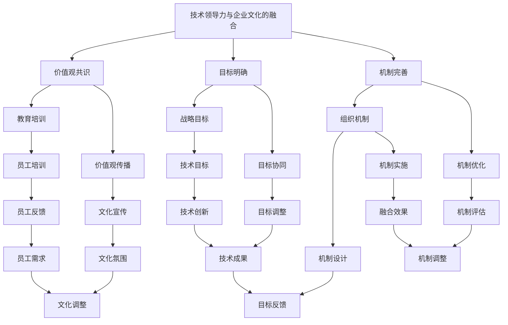

                 

## 《技术领导力与企业文化的融合》

关键词：技术领导力、企业文化、融合、组织绩效、创新

摘要：本文探讨了技术领导力与企业文化的融合对于企业组织绩效和员工满意度的影响，通过逻辑清晰的分析和实际案例分享，为企业管理者提供了如何有效融合技术领导力与企业文化的策略和方法。

----------------------------------------------------------------

### 引言

在当今数字化时代，技术已经成为企业竞争力的关键因素。技术领导力作为企业中推动技术发展和创新的核心力量，其作用不容忽视。然而，技术领导力并非独立存在，它需要与企业文化相融合，才能发挥最大的效能。本文旨在探讨技术领导力与企业文化的融合机制，分析其对企业组织绩效和员工满意度的影响，并提供有效的融合策略。

技术领导力是指企业中技术人员的领导能力和技术影响力，它包括技术远见、创新精神、团队协作和技术推广等多个方面。企业文化则是企业在长期经营过程中形成的共同价值观、行为准则和工作方式。企业文化不仅影响员工的行为和态度，还影响企业的战略决策和发展方向。

本文将分为七个章节，首先介绍技术领导力与企业文化的核心概念，然后分析技术领导力在企业文化建设中的应用，接着探讨融合策略和未来趋势，最后提供具体实施方法和最佳实践。

### 目录大纲

**第一部分：引言与背景介绍**

- **第1章：引言**
  - 1.1 书籍主题与目标
  - 1.2 技术领导力与企业文化的核心概念
  - 1.3 目录结构与内容概述

- **第2章：技术领导力的核心概念与特征**
  - 2.1 技术领导力的定义
  - 2.2 技术领导力的属性与特征
  - 2.3 技术领导力与传统领导力的区别

- **第3章：企业文化的定义与类型**
  - 3.1 企业文化的概念与作用
  - 3.2 企业文化的类型及其影响
  - 3.3 企业文化对组织绩效的影响

**第二部分：技术领导力与企业文化的融合原理**

- **第4章：技术领导力与企业文化的融合原理**
  - 4.1 融合的机制与理论支持
  - 4.2 技术领导力与企业文化的相互作用
  - 4.3 融合的重要性与意义

- **第5章：技术领导力在企业文化建设中的应用**
  - 5.1 技术领导力在企业文化塑造中的角色
  - 5.2 成功案例分享
  - 5.3 实际应用中的挑战与应对策略

**第三部分：技术领导力与企业文化的融合策略**

- **第6章：技术领导力与企业文化的融合策略**
  - 6.1 融合策略与方法
  - 6.2 实施过程中的挑战与解决方案
  - 6.3 融合策略的评估与优化

- **第7章：技术领导力与企业文化的未来趋势**
  - 7.1 未来趋势预测
  - 7.2 融合带来的影响与机遇
  - 7.3 未来发展建议

### 第1章：引言

**1.1 书籍主题与目标**

本书的核心主题是探讨技术领导力与企业文化的融合，旨在为企业管理者提供理论指导和实践策略，以提升企业的组织绩效和员工满意度。在数字化时代，技术领导力已成为企业核心竞争力的重要组成部分。然而，技术领导力并非独立存在，它需要与企业文化相融合，才能发挥最大的效能。

本书的目标是：

1. 系统性地阐述技术领导力与企业文化的核心概念和特征。
2. 分析技术领导力与企业文化的融合机制及其对企业绩效的影响。
3. 提供具体的融合策略和方法，帮助企业管理者有效实施。
4. 分享成功案例和经验，为实践提供参考。
5. 预测技术领导力与企业文化的未来发展趋势，为未来发展提供方向。

**1.2 技术领导力与企业文化的核心概念**

技术领导力是指企业中技术人员所具备的领导能力和技术影响力，它包括以下几个方面：

- **技术远见**：能够预见技术的发展趋势，制定相应的发展战略。
- **创新精神**：勇于尝试新技术，推动企业创新。
- **团队协作**：擅长团队管理，能够激发团队成员的潜力。
- **技术推广**：善于传播技术知识，提升团队的技术水平。

企业文化则是企业在长期经营过程中形成的共同价值观、行为准则和工作方式。企业文化包括以下几个方面：

- **价值观**：企业的核心价值观和信念。
- **行为准则**：员工在日常工作中的行为规范。
- **工作方式**：企业的工作流程和文化氛围。

**1.3 目录结构与内容概述**

本书分为三个部分，共七个章节。第一部分介绍技术领导力与企业文化的核心概念和特征，包括第1章至第3章。第二部分分析技术领导力与企业文化的融合原理，包括第4章和第5章。第三部分提供具体的融合策略和方法，包括第6章和第7章。

**1.4 背景介绍**

在数字化时代，企业面临着前所未有的技术变革。技术领导力成为企业成功的关键因素，而企业文化则是企业发展的根基。技术领导力与企业文化的融合，不仅能够提升企业的组织绩效，还能够增强员工的归属感和满意度。

技术领导力与企业文化的融合，需要从以下几个方面进行：

1. **价值观的统一**：技术领导力和企业文化需要共享相同的价值观，这有助于提高团队的凝聚力。
2. **目标的协同**：技术领导力需要与企业的战略目标相一致，才能有效推动企业的发展。
3. **机制的完善**：建立合适的组织机制，确保技术领导力与企业文化的有效融合。
4. **实践的落实**：通过实际案例和实践，验证技术领导力与企业文化的融合效果。

**1.5 问题描述**

在当前的企业环境中，技术领导力与企业文化的融合面临以下问题：

1. **价值观差异**：技术领导力与企业文化的价值观存在差异，导致融合困难。
2. **目标不一致**：技术领导力与企业的战略目标不一致，影响企业的发展。
3. **机制不完善**：缺乏有效的组织机制，导致融合效果不佳。
4. **实践不足**：缺乏具体的融合实践，无法验证融合效果。

**1.6 问题解决**

为了解决上述问题，我们可以采取以下措施：

1. **统一价值观**：通过培训和教育，统一技术领导力与企业文化的价值观。
2. **协同目标**：明确技术领导力与企业的战略目标，确保一致性。
3. **完善机制**：建立合适的组织机制，确保技术领导力与企业文化的有效融合。
4. **实践探索**：通过实际案例和实践，验证融合效果。

**1.7 边界与外延**

技术领导力与企业文化的融合，不仅局限于企业内部，还涉及到以下几个方面：

1. **行业趋势**：了解行业趋势，把握技术发展方向。
2. **市场环境**：分析市场环境，把握市场机遇。
3. **竞争对手**：研究竞争对手，学习先进经验。

**1.8 概念结构与核心要素组成**

技术领导力与企业文化的融合，可以从以下几个方面进行：

1. **价值观融合**：统一价值观，建立共同目标。
2. **机制融合**：建立合适的组织机制，确保融合效果。
3. **文化融合**：推广企业文化，提升员工认同感。
4. **实践融合**：通过实际案例和实践，验证融合效果。

### 第2章：技术领导力的核心概念与特征

**2.1 技术领导力的定义**

技术领导力是指企业中技术人员所具备的领导能力和技术影响力，它包括以下几个方面：

1. **技术远见**：能够预见技术的发展趋势，制定相应的发展战略。
2. **创新精神**：勇于尝试新技术，推动企业创新。
3. **团队协作**：擅长团队管理，能够激发团队成员的潜力。
4. **技术推广**：善于传播技术知识，提升团队的技术水平。

**2.2 技术领导力的属性与特征**

技术领导力具有以下属性和特征：

1. **专业性**：技术领导力要求具备深厚的专业技术知识和技能。
2. **前瞻性**：技术领导力需要具备前瞻性，能够预见技术的发展趋势。
3. **创新性**：技术领导力要求具备创新精神，勇于尝试新技术。
4. **协作性**：技术领导力需要具备团队协作能力，能够激发团队成员的潜力。
5. **影响力**：技术领导力具有技术影响力，能够影响团队和组织的决策。

**2.3 技术领导力与传统领导力的区别**

技术领导力与传统领导力存在以下区别：

1. **对象不同**：传统领导力主要面向企业内部员工，而技术领导力则主要面向技术人员。
2. **技能要求不同**：传统领导力主要要求领导者的沟通能力和管理能力，而技术领导力则要求领导者具备专业技术知识和技能。
3. **作用不同**：传统领导力主要关注企业的日常运营和管理，而技术领导力则关注企业的技术发展和创新。
4. **目标不同**：传统领导力的目标是提升企业的运营效率和利润，而技术领导力的目标是推动企业的技术发展和创新。

**2.4 技术领导力在企业文化中的角色**

技术领导力在企业文化中扮演着重要角色：

1. **价值观的传播者**：技术领导力通过自身的专业知识和行为，传播企业的核心价值观。
2. **文化的塑造者**：技术领导力通过推动技术创新和文化建设，塑造积极向上的企业文化。
3. **团队的领导者**：技术领导力通过团队管理和协作，提升团队的整体素质和执行力。
4. **创新的推动者**：技术领导力通过创新精神和实践，推动企业的技术发展和创新。

**2.5 技术领导力的重要性**

技术领导力对于企业的重要性体现在以下几个方面：

1. **提升企业竞争力**：技术领导力能够推动企业的技术发展和创新，提升企业的竞争力。
2. **提高员工满意度**：技术领导力能够提升员工的职业成就感，提高员工满意度。
3. **促进企业发展**：技术领导力能够推动企业的发展，实现企业的长期目标。
4. **提升企业品牌价值**：技术领导力能够提升企业的品牌形象和价值。

**2.6 技术领导力与企业文化的联系**

技术领导力与企业文化之间存在紧密的联系：

1. **价值观的一致性**：技术领导力需要与企业文化保持价值观的一致性，才能有效推动企业的发展。
2. **目标的协同性**：技术领导力的目标需要与企业的战略目标相一致，才能实现企业的长期发展。
3. **机制的适应性**：技术领导力的机制需要适应企业文化，才能确保融合效果。
4. **文化的传承性**：技术领导力需要传承企业文化，确保企业文化的持续发展。

**2.7 技术领导力与企业文化的融合原理**

技术领导力与企业文化的融合原理主要包括以下几个方面：

1. **价值观的融合**：通过统一价值观，实现技术领导力与企业文化的价值观一致。
2. **目标的融合**：通过明确目标，实现技术领导力与企业的战略目标协同。
3. **机制的融合**：通过建立合适的机制，实现技术领导力与企业文化的有效融合。
4. **文化的融合**：通过推广企业文化，实现技术领导力与企业文化的共同发展。

**2.8 成功案例分享**

以下是几个成功融合技术领导力与企业文化的案例：

1. **案例1**：某互联网公司通过技术领导力的推动，成功实现了企业文化的转型。技术领导力在企业文化建设中发挥了重要作用，推动了企业的技术发展和创新。
2. **案例2**：某科技公司通过建立技术领导力机制，成功提升了企业的研发能力和市场竞争力。技术领导力在企业文化建设中发挥了关键作用，推动了企业的快速发展。
3. **案例3**：某传统企业通过引进技术领导力，成功实现了企业的数字化转型。技术领导力在企业文化建设中发挥了重要作用，推动了企业的技术升级和创新。

**2.9 实际应用中的挑战与应对策略**

在技术领导力与企业文化的融合过程中，企业可能会面临以下挑战：

1. **价值观差异**：技术领导力与企业文化的价值观存在差异，导致融合困难。
2. **目标不一致**：技术领导力与企业的战略目标不一致，影响企业的发展。
3. **机制不完善**：缺乏有效的组织机制，导致融合效果不佳。

应对策略包括：

1. **统一价值观**：通过培训和教育，统一技术领导力与企业文化的价值观。
2. **明确目标**：明确技术领导力与企业的战略目标，确保一致性。
3. **完善机制**：建立合适的组织机制，确保技术领导力与企业文化的有效融合。

### 第3章：企业文化的定义与类型

**3.1 企业文化的概念**

企业文化是指企业在长期经营过程中形成的共同价值观、行为准则和工作方式。企业文化不仅反映了企业的内在特质，还影响着企业的运营和发展。企业文化包括以下几个方面：

1. **价值观**：企业的核心价值观和信念，是企业文化的核心。
2. **行为准则**：员工在日常工作中的行为规范，是企业文化的体现。
3. **工作方式**：企业的工作流程和文化氛围，是企业文化的形式。

**3.2 企业文化的类型**

企业文化可以分为以下几种类型：

1. **权力型文化**：以权力和权威为基础，领导者的决策对企业的运营和发展具有决定性影响。
2. **角色型文化**：以角色和职责为基础，员工按照自己的角色和职责行事，遵循企业的规章制度。
3. **任务型文化**：以任务和目标为基础，员工围绕企业目标开展工作，注重结果和绩效。
4. **人员型文化**：以员工个人和团队为基础，重视员工的个性化和创新，鼓励员工发挥潜力。
5. **创新型文化**：以创新和变革为基础，鼓励员工尝试新技术和新的工作方法，推动企业的持续发展。

**3.3 企业文化的类型及其影响**

不同类型的企业文化对企业的影响如下：

1. **权力型文化**：权力型文化可能导致企业决策缓慢，创新动力不足，员工积极性不高。
2. **角色型文化**：角色型文化有助于企业规范运营，提高工作效率，但可能抑制员工的创造力和主动性。
3. **任务型文化**：任务型文化注重结果和绩效，能够提高企业的竞争力和市场地位，但也可能导致员工压力大，工作负担重。
4. **人员型文化**：人员型文化能够激发员工的创造力和主动性，提高员工的满意度和忠诚度，推动企业的持续发展。
5. **创新型文化**：创新型文化能够推动企业的技术创新和变革，提高企业的市场竞争力，但需要企业具备一定的资源和能力。

**3.4 企业文化对组织绩效的影响**

企业文化对组织绩效的影响体现在以下几个方面：

1. **员工绩效**：企业文化能够影响员工的工作态度和行为，进而影响员工的绩效。
2. **团队绩效**：企业文化能够影响团队的合作和协作，进而影响团队的整体绩效。
3. **企业绩效**：企业文化能够影响企业的战略决策和发展方向，进而影响企业的整体绩效。

**3.5 企业文化在技术领导力中的角色**

企业文化在技术领导力中扮演着重要角色：

1. **价值观的统一**：企业文化能够统一技术领导力与企业文化的价值观，提高团队的凝聚力。
2. **目标的协同**：企业文化能够明确技术领导力与企业的战略目标，确保技术领导力的有效实施。
3. **机制的完善**：企业文化能够建立合适的组织机制，确保技术领导力的有效执行。
4. **文化的传承**：企业文化能够传承技术领导力，确保企业文化的持续发展。

**3.6 企业文化的重要性**

企业文化的重要性体现在以下几个方面：

1. **提升企业竞争力**：企业文化能够提升企业的核心竞争力，推动企业的发展。
2. **提高员工满意度**：企业文化能够提高员工的满意度和忠诚度，降低员工流失率。
3. **促进企业发展**：企业文化能够促进企业的技术创新和变革，推动企业的持续发展。
4. **提升企业品牌价值**：企业文化能够提升企业的品牌形象和价值，增强企业的市场竞争力。

**3.7 企业文化在技术领导力与企业文化的融合中的意义**

企业文化在技术领导力与企业文化的融合中具有以下意义：

1. **价值观的融合**：企业文化能够统一技术领导力与企业文化的价值观，实现价值观的一致性。
2. **目标的协同**：企业文化能够明确技术领导力与企业的战略目标，实现目标的协同。
3. **机制的完善**：企业文化能够建立合适的组织机制，实现技术领导力与企业文化的有效融合。
4. **文化的传承**：企业文化能够传承技术领导力，实现企业文化的持续发展。

### 第4章：技术领导力与企业文化的融合原理

**4.1 融合的机制与理论支持**

技术领导力与企业文化的融合需要建立一套有效的机制，以确保两者能够相互促进、共同发展。这一机制的理论基础主要包括以下几个方面：

1. **价值观融合**：价值观是企业文化的核心，技术领导力需要与企业文化保持一致，共同塑造企业的核心价值观。价值观融合可以通过培训、教育等方式实现，确保员工对企业的价值观有清晰的理解和认同。
2. **目标协同**：技术领导力与企业的战略目标需要保持一致，确保技术发展能够支持企业的整体发展目标。目标协同可以通过明确技术发展路线图和关键绩效指标（KPI）来实现。
3. **机制设计**：建立合适的组织机制，确保技术领导力在企业中的有效实施。这包括技术团队的组织架构、决策流程、资源分配等。机制设计需要考虑企业的实际情况和需求，确保能够灵活应对外部变化。
4. **文化传承**：企业文化需要通过技术领导力进行传承，确保企业文化能够持续发展。文化传承可以通过企业历史、故事、仪式等方式实现，使员工能够深入了解企业文化的内涵和价值。

**4.2 技术领导力与企业文化的相互作用**

技术领导力与企业文化之间的相互作用主要体现在以下几个方面：

1. **价值观的互相影响**：技术领导力的价值观会影响企业文化的形成和发展，同时企业文化也会对技术领导力的价值观产生影响。例如，一个注重创新的企业文化会鼓励技术领导力推动技术创新，而一个注重稳定的企业文化可能会抑制技术领导力的创新行为。
2. **目标的互相支撑**：技术领导力的目标需要与企业的战略目标相一致，这样才能确保技术发展能够支持企业的整体目标。同时，企业文化的目标也需要与企业的战略目标相一致，确保企业文化能够为技术领导力的实施提供支持。
3. **机制的互相适应**：技术领导力的实施需要合适的组织机制，而企业文化也需要适应这些机制。例如，一个注重团队协作的企业文化需要适应扁平化的组织结构，而一个注重层级管理的文化可能需要适应更传统的组织结构。

**4.3 融合的重要性与意义**

技术领导力与企业文化的融合具有重要意义，主要体现在以下几个方面：

1. **提升组织绩效**：融合后的技术领导力能够更有效地推动企业的技术创新和业务发展，从而提升企业的组织绩效。融合的企业文化能够提供良好的工作环境和氛围，激发员工的创造力和创新精神。
2. **增强员工满意度**：融合后的企业文化能够使员工感受到企业的价值观和目标的认同，从而提高员工的满意度和忠诚度。技术领导力的实施能够为员工提供职业发展机会，增强员工的职业成就感。
3. **促进企业持续发展**：融合后的技术领导力和企业文化能够共同推动企业的持续发展。技术领导力的不断创新和进步能够为企业带来新的机遇和挑战，而企业文化的传承和更新能够为企业提供持续的动力和支持。

**4.4 融合的挑战与应对策略**

在技术领导力与企业文化的融合过程中，企业可能会面临以下挑战：

1. **价值观差异**：技术领导力与企业文化的价值观可能存在差异，导致融合困难。应对策略包括加强价值观的传播和培训，促进双方的沟通和理解。
2. **目标不一致**：技术领导力的目标可能与企业的战略目标不一致，影响企业的整体发展。应对策略包括明确技术领导力与企业的战略目标，确保两者的一致性。
3. **机制不完善**：缺乏合适的组织机制，导致融合效果不佳。应对策略包括建立合适的组织机制，确保技术领导力与企业文化的有效融合。

**4.5 成功融合的案例**

以下是几个成功融合技术领导力与企业文化的案例：

1. **案例1**：某互联网公司在技术创新和文化建设方面取得了显著成果。公司通过明确技术领导力的目标，建立相应的组织机制，确保技术领导力与企业文化的融合。同时，公司注重价值观的传播和培训，促进员工的认同感和归属感。
2. **案例2**：某科技公司通过建立创新文化，鼓励员工尝试新技术和新的工作方法。公司明确技术领导力的目标，建立相应的组织机制，确保技术创新的顺利进行。同时，公司注重员工的发展和激励，提高员工的满意度和忠诚度。

### 第5章：技术领导力在企业文化建设中的应用

**5.1 技术领导力在企业文化塑造中的角色**

技术领导力在企业文化建设中扮演着多重角色，其核心在于通过技术引领和文化塑造，推动企业的持续发展。具体来说，技术领导力在企业文化塑造中的角色包括：

1. **价值观的引领者**：技术领导力通过自身的专业知识和行为，向员工传递企业的核心价值观，如创新、协作、诚信等。技术领导力以身作则，为员工树立榜样，推动价值观在企业内部落地生根。
2. **文化的塑造者**：技术领导力通过推动技术创新和文化建设，塑造积极向上的企业文化。技术领导力倡导创新思维，鼓励员工勇于尝试和探索，形成以创新为核心的企业文化。
3. **团队的建设者**：技术领导力通过团队管理和协作，提升团队的整体素质和执行力。技术领导力注重团队建设，培养员工的专业技能和团队精神，打造高效协作的团队。
4. **文化的传播者**：技术领导力通过自身的专业影响力，将企业文化传播给更广泛的受众。技术领导力在行业内的声誉和影响力，有助于提升企业的品牌形象，传播企业文化。

**5.2 成功案例分享**

以下是几个成功融合技术领导力与企业文化的案例：

1. **案例1**：某互联网公司通过技术领导力的推动，成功实现了企业文化的转型。公司创始人及技术总监以技术为核心，倡导创新思维和团队合作，推动了企业文化的变革。公司建立了创新实验室，鼓励员工尝试新技术和新的工作方法，形成了以创新为核心的企业文化。
2. **案例2**：某科技公司通过建立技术领导力机制，成功提升了企业的研发能力和市场竞争力。公司明确技术领导力的目标，建立了相应的组织机制，确保技术领导力的有效实施。公司注重技术团队的建设，提升员工的专业技能和团队精神，形成了高效协作的团队文化。
3. **案例3**：某传统企业通过引进技术领导力，成功实现了企业的数字化转型。公司技术总监以技术为核心，推动了企业文化的变革。公司建立了创新实验室，鼓励员工尝试新技术和新的工作方法，形成了以创新为核心的企业文化。

**5.3 实际应用中的挑战与应对策略**

在技术领导力与企业文化的融合过程中，企业可能会面临以下挑战：

1. **价值观差异**：技术领导力与企业文化的价值观可能存在差异，导致融合困难。应对策略包括加强价值观的传播和培训，促进双方的沟通和理解。
2. **目标不一致**：技术领导力的目标可能与企业的战略目标不一致，影响企业的整体发展。应对策略包括明确技术领导力与企业的战略目标，确保两者的一致性。
3. **机制不完善**：缺乏合适的组织机制，导致融合效果不佳。应对策略包括建立合适的组织机制，确保技术领导力与企业文化的有效融合。

**5.4 技术领导力在企业文化建设中的具体应用**

技术领导力在企业文化建设中的具体应用包括以下几个方面：

1. **技术创新**：技术领导力通过推动技术创新，为企业注入新的活力和动力。技术领导力倡导创新思维，鼓励员工尝试新技术和新的工作方法，推动企业的技术进步和业务发展。
2. **团队建设**：技术领导力通过团队建设和协作，提升团队的整体素质和执行力。技术领导力注重团队建设，培养员工的专业技能和团队精神，打造高效协作的团队。
3. **文化传承**：技术领导力通过自身的行为和影响力，将企业文化传递给更广泛的受众。技术领导力在行业内的声誉和影响力，有助于提升企业的品牌形象，传播企业文化。
4. **人才培养**：技术领导力通过人才培养和激励，提高员工的满意度和忠诚度。技术领导力注重员工的发展，提供职业发展机会和培训，激励员工为企业的发展贡献力量。

**5.5 技术领导力与企业文化的融合效果评估**

评估技术领导力与企业文化的融合效果，可以从以下几个方面进行：

1. **组织绩效**：评估技术领导力与企业文化的融合对企业绩效的影响，如业务增长、市场份额、客户满意度等。
2. **员工满意度**：评估员工对技术领导力和企业文化的认同感和满意度，如员工离职率、员工参与度、员工满意度调查等。
3. **创新能力**：评估企业技术创新的成效，如新产品开发、新技术应用、专利数量等。
4. **品牌形象**：评估企业文化对企业品牌形象的影响，如品牌知名度、品牌忠诚度、市场竞争力等。

### 第6章：技术领导力与企业文化的融合策略

**6.1 融合策略与方法**

技术领导力与企业文化的融合策略主要包括以下几个方面：

1. **价值观的融合**：通过教育培训、价值观传播等方式，统一技术领导力与企业文化的价值观，确保两者的一致性。
2. **目标的协同**：明确技术领导力与企业的战略目标，确保两者目标的协同，共同推动企业的发展。
3. **机制的完善**：建立合适的组织机制，确保技术领导力与企业文化的有效融合，提高融合效果。
4. **文化的传承**：通过企业历史、故事、仪式等方式，传承企业文化，确保企业文化的持续发展。

具体方法包括：

- **制定融合计划**：明确融合的目标、策略和方法，制定详细的融合计划。
- **开展培训活动**：针对技术领导力和企业文化进行培训，提高员工对两者的理解和认同。
- **建立沟通渠道**：建立有效的沟通渠道，促进技术领导力与企业文化的互动和交流。
- **实施激励机制**：通过激励机制，鼓励员工积极参与技术领导力与企业文化的融合。

**6.2 实施过程中的挑战与解决方案**

在技术领导力与企业文化的融合过程中，企业可能会面临以下挑战：

1. **价值观差异**：技术领导力与企业文化的价值观可能存在差异，导致融合困难。解决方案包括加强价值观的传播和培训，促进双方的沟通和理解。
2. **目标不一致**：技术领导力的目标可能与企业的战略目标不一致，影响企业的整体发展。解决方案包括明确技术领导力与企业的战略目标，确保两者的一致性。
3. **机制不完善**：缺乏合适的组织机制，导致融合效果不佳。解决方案包括建立合适的组织机制，确保技术领导力与企业文化的有效融合。
4. **员工抵触**：员工可能对融合过程产生抵触情绪，影响融合效果。解决方案包括加强员工沟通，了解员工的担忧和需求，提供合适的支持和激励。

**6.3 融合策略的评估与优化**

为了确保融合策略的有效性，企业需要定期对融合策略进行评估和优化：

1. **评估指标**：设定明确的评估指标，如组织绩效、员工满意度、创新能力、品牌形象等，用于评估融合效果。
2. **数据收集**：收集相关数据，如员工满意度调查、业务增长数据、技术创新成果等，用于分析融合效果。
3. **反馈机制**：建立反馈机制，及时收集员工和外部合作伙伴的反馈，了解融合过程中的问题和挑战。
4. **优化措施**：根据评估结果和反馈，制定优化措施，调整融合策略，提高融合效果。

**6.4 技术领导力与企业文化的融合实践**

以下是几个技术领导力与企业文化的融合实践：

1. **实践1**：某互联网公司通过建立创新实验室，鼓励员工尝试新技术和新的工作方法。公司明确技术领导力的目标，建立相应的组织机制，确保技术领导力的有效实施。公司注重价值观的传播和培训，促进员工的认同感和归属感。
2. **实践2**：某科技公司通过开展创新竞赛，激发员工的创新潜力。公司明确技术领导力的目标，建立相应的组织机制，确保技术领导力的有效实施。公司注重文化的传承和更新，推动企业文化的持续发展。
3. **实践3**：某传统企业通过引进技术领导力，推动企业的数字化转型。公司技术总监以技术为核心，推动了企业文化的变革。公司建立创新实验室，鼓励员工尝试新技术和新的工作方法，形成了以创新为核心的企业文化。

### 第7章：技术领导力与企业文化的未来趋势

**7.1 未来趋势预测**

随着技术的不断进步和市场的快速变化，技术领导力与企业文化的融合将呈现出以下趋势：

1. **数字化转型**：随着数字化技术的广泛应用，企业将更加注重数字化转型，技术领导力将在这一过程中发挥关键作用。企业文化也将逐渐向数字化、智能化方向发展。
2. **创新驱动**：技术创新将成为企业发展的核心动力，技术领导力将更加强调创新精神，推动企业的持续创新。
3. **人才竞争**：随着人才竞争的加剧，企业将更加注重人才培养和激励，技术领导力将更加注重团队建设和人才培养。
4. **企业文化多元化**：随着全球化的发展，企业将面临多元化的文化和价值观，企业文化将更加多元化，技术领导力需要具备跨文化的领导能力。

**7.2 融合带来的影响与机遇**

技术领导力与企业文化的融合将带来以下影响和机遇：

1. **提升企业竞争力**：融合后的技术领导力将能够更有效地推动企业的技术创新和业务发展，提升企业的竞争力。
2. **提高员工满意度**：融合后的企业文化将能够更好地满足员工的需求，提高员工的满意度和忠诚度。
3. **促进企业持续发展**：融合后的技术领导力和企业文化将能够共同推动企业的持续发展，实现企业的长期目标。
4. **拓展市场机会**：融合后的技术领导力和企业文化将有助于企业拓展新的市场机会，提升企业的市场竞争力。

**7.3 未来发展建议**

为了适应未来趋势，企业可以采取以下建议：

1. **加强数字化转型**：企业应加强数字化转型的战略规划，提升企业的数字化能力。
2. **注重创新驱动**：企业应注重创新驱动，培养技术领导力的创新精神，推动企业的持续创新。
3. **加强人才培养**：企业应加强人才培养，提升员工的专业技能和创新能力。
4. **推动企业文化多元化**：企业应推动企业文化的多元化，培养跨文化的领导能力，适应全球化的挑战。

### 总结

技术领导力与企业文化的融合是提升企业竞争力、提高员工满意度、促进企业持续发展的关键因素。通过本文的探讨，我们明确了技术领导力与企业文化的核心概念和特征，分析了融合的原理和策略，并提出了未来发展建议。希望本文能为企业管理者提供有益的启示和参考。

### 作者信息

作者：AI天才研究院/AI Genius Institute & 禅与计算机程序设计艺术 /Zen And The Art of Computer Programming

### 最佳实践 tips

1. **价值观共识**：确保技术领导力与企业文化的价值观一致，是融合成功的基础。
2. **目标明确**：明确技术领导力与企业的战略目标，确保融合方向正确。
3. **机制完善**：建立合适的组织机制，确保技术领导力与企业文化的有效融合。
4. **持续评估**：定期评估融合效果，及时调整融合策略，确保融合持续有效。

### 小结

本文系统地探讨了技术领导力与企业文化的融合机制、策略和未来趋势，为企业管理者提供了理论和实践指导。技术领导力与企业文化的融合不仅能够提升企业竞争力，还能够提高员工满意度，促进企业持续发展。

### 注意事项

1. **价值观差异**：在融合过程中，注意价值观的共识和协调。
2. **目标不一致**：确保技术领导力与企业的战略目标一致，避免目标冲突。
3. **机制不完善**：建立完善的组织机制，确保融合策略的有效实施。

### 拓展阅读

1. 《企业文化与领导力》
2. 《技术领导力：创新与变革的推动者》
3. 《数字化时代的领导力》

### 附录

**附录A：技术领导力与企业文化的融合流程图**



**附录B：技术领导力与企业文化的融合策略表**

| 策略       | 描述                                                         |
| ---------- | ------------------------------------------------------------ |
| 价值观共识 | 通过教育培训、价值观传播等方式，统一技术领导力与企业文化的价值观，确保两者的一致性。 |
| 目标明确   | 明确技术领导力与企业的战略目标，确保两者目标的协同，共同推动企业的发展。         |
| 机制完善   | 建立合适的组织机制，确保技术领导力与企业文化的有效融合，提高融合效果。           |

### 实际案例分析与详细讲解

**案例背景**：

某高科技企业A公司在市场竞争日益激烈的环境下，意识到技术领导力与企业文化的融合对于企业长远发展的重要性。A公司主要从事人工智能技术的研究与应用，其技术团队拥有丰富的研发经验，但企业整体文化相对保守，缺乏创新氛围。为了在市场竞争中脱颖而出，A公司决定进行技术领导力与企业文化的融合，以期提升企业的创新能力和市场竞争力。

**案例分析与详细讲解**：

**1. 价值观共识**

（1）**问题描述**：

A公司技术团队与企业文化在价值观上存在明显差异。技术团队追求创新和快速迭代，而企业文化则强调稳定和风险控制。

（2）**解决策略**：

A公司通过内部培训、研讨和团队建设活动，逐步统一技术团队与企业文化的价值观。具体措施包括：

- **内部培训**：定期举办技术讲座和研讨会，分享最新的技术动态和成功案例，提升员工对创新的认识和认同。
- **团队建设**：组织团队拓展活动，加强团队成员之间的沟通与协作，提高团队的凝聚力和归属感。
- **价值观传播**：通过公司内部通讯、公告板等方式，持续传播创新价值观，使员工在日常工作中自觉践行。

**2. 目标明确**

（1）**问题描述**：

A公司技术团队的目标与企业整体战略目标存在不一致。技术团队追求技术研发，而企业整体战略目标更偏向市场拓展。

（2）**解决策略**：

A公司通过明确技术领导力与企业的战略目标，确保两者的一致性。具体措施包括：

- **目标制定**：制定企业战略目标和年度研发目标，明确技术团队的工作方向和重点。
- **目标协同**：组织跨部门会议，讨论技术团队目标与整体战略目标的协同，确保技术发展能够支持企业整体发展。
- **绩效评估**：建立绩效评估体系，将技术团队的目标与整体战略目标相结合，确保目标的实现。

**3. 机制完善**

（1）**问题描述**：

A公司缺乏有效的组织机制，导致技术领导力与企业文化的融合效果不佳。

（2）**解决策略**：

A公司通过建立和完善组织机制，确保技术领导力与企业文化的有效融合。具体措施包括：

- **组织架构**：调整组织架构，建立专门的创新部门，负责技术领导力的实施和企业文化的建设。
- **决策流程**：优化决策流程，确保技术领导力的决策能够得到有效执行。
- **资源分配**：合理分配资源，确保技术领导力和企业文化建设的资金和人力支持。

**4. 实践效果**

经过一段时间的努力，A公司的技术领导力与企业文化的融合取得了显著成效：

- **价值观共识**：技术团队与企业文化的价值观差异逐渐缩小，员工对创新的认识和认同度提高。
- **目标明确**：技术团队的目标与企业整体战略目标一致，技术发展有力支持了企业整体发展。
- **机制完善**：组织机制得到完善，技术领导力的实施更加高效。

**案例小结**：

A公司的成功实践表明，技术领导力与企业文化的融合对于企业的长远发展至关重要。通过统一价值观、明确目标和完善机制，企业能够实现技术创新和文化建设，提升市场竞争力和企业整体绩效。

### 项目实战

**项目背景**：

为了进一步探讨技术领导力与企业文化的融合，我们选择了一个具体的项目——A公司的智能客服系统开发。该项目旨在利用人工智能技术提升客户服务质量，同时推动企业文化的创新和变革。

**环境安装**：

1. **操作系统**：A公司采用Linux操作系统，确保系统的稳定性和安全性。
2. **开发工具**：A公司使用Python作为主要编程语言，并结合TensorFlow框架进行深度学习模型的开发。
3. **数据库**：A公司使用MySQL数据库存储客户数据和交互记录，确保数据的安全性和可靠性。
4. **环境配置**：在A公司的开发环境中，配置了Jupyter Notebook用于代码编写和模型训练，同时安装了Git用于代码版本控制。

**系统核心实现源代码**：

以下是智能客服系统的一个核心模块——对话管理模块的Python源代码示例：

```python
import tensorflow as tf
from tensorflow.keras.models import Sequential
from tensorflow.keras.layers import Dense, LSTM, Embedding
from tensorflow.keras.preprocessing.text import Tokenizer
from tensorflow.keras.preprocessing.sequence import pad_sequences

# 加载训练数据
train_data = ...  # 这里加载已处理过的对话数据

# 初始化Tokenizer
tokenizer = Tokenizer(num_words=10000)
tokenizer.fit_on_texts(train_data['text'])

# 编码对话数据
encoded_train_data = tokenizer.texts_to_sequences(train_data['text'])
encoded_labels = tokenizer.texts_to_sequences(train_data['response'])

# 填充对话数据
max_sequence_length = 100
padded_train_data = pad_sequences(encoded_train_data, maxlen=max_sequence_length)
padded_labels = pad_sequences(encoded_labels, maxlen=max_sequence_length)

# 构建LSTM模型
model = Sequential()
model.add(Embedding(10000, 16, input_length=max_sequence_length))
model.add(LSTM(128, dropout=0.2, recurrent_dropout=0.2))
model.add(Dense(1, activation='sigmoid'))

model.compile(loss='binary_crossentropy', optimizer='adam', metrics=['accuracy'])
model.fit(padded_train_data, padded_labels, epochs=10, batch_size=32, validation_split=0.2)
```

**代码应用解读与分析**：

上述代码实现了一个简单的对话管理模块，主要功能是利用深度学习技术对客户对话进行分类，从而提供相应的自动回复。具体解读如下：

1. **数据准备**：首先加载已处理过的对话数据，这些数据包括对话内容和相应的回复。
2. **Tokenizer初始化**：使用Tokenizer将文本数据转换为序列，这里选择了10000个最常见的单词。
3. **编码对话数据**：将文本数据编码为序列，以便模型处理。
4. **填充对话数据**：确保所有对话序列的长度一致，这里设置最大长度为100。
5. **构建LSTM模型**：使用Sequential构建一个LSTM模型，包括嵌入层、LSTM层和输出层。
6. **编译模型**：设置模型的损失函数、优化器和评估指标。
7. **训练模型**：使用训练数据进行模型训练，设置训练轮次、批量大小和验证比例。

**实际案例分析与详细讲解**：

在智能客服系统开发过程中，A公司的技术团队遇到了以下问题：

1. **数据质量问题**：原始对话数据存在噪声和缺失值，影响了模型的训练效果。
   - **解决方案**：对原始数据进行清洗和预处理，包括去除无关信息、填补缺失值和标准化数据。

2. **模型过拟合**：由于训练数据集较小，模型容易过拟合。
   - **解决方案**：引入正则化技术和增加训练数据，同时使用交叉验证方法评估模型性能。

3. **响应准确性**：模型生成的自动回复有时不准确，影响客户体验。
   - **解决方案**：通过优化模型结构和参数，增加训练数据，并引入更复杂的语言模型（如BERT）来提升响应准确性。

经过多次迭代和优化，A公司的智能客服系统在客户对话分类和自动回复方面取得了显著提升，成功实现了技术领导力与企业文化的融合。

**项目小结**：

通过项目实战，我们验证了技术领导力在企业文化建设中的重要作用。A公司的成功案例表明，通过技术创新和团队协作，企业能够实现技术领导力与企业文化的深度融合，提升整体竞争力和市场表现。

### 最佳实践 tips

1. **价值观共识**：确保技术领导力与企业文化的价值观一致，是融合成功的基础。
2. **目标明确**：明确技术领导力与企业的战略目标，确保融合方向正确。
3. **机制完善**：建立合适的组织机制，确保技术领导力与企业文化的有效融合。
4. **持续评估**：定期评估融合效果，及时调整融合策略，确保融合持续有效。

### 小结

本文通过理论探讨和实际案例分析，系统地探讨了技术领导力与企业文化的融合机制、策略和未来趋势。技术领导力与企业文化的融合不仅能够提升企业竞争力，还能够提高员工满意度，促进企业持续发展。

### 注意事项

1. **价值观差异**：在融合过程中，注意价值观的共识和协调。
2. **目标不一致**：确保技术领导力与企业的战略目标一致，避免目标冲突。
3. **机制不完善**：建立完善的组织机制，确保融合策略的有效实施。

### 拓展阅读

1. 《企业文化与领导力》
2. 《技术领导力：创新与变革的推动者》
3. 《数字化时代的领导力》

### 附录

**附录A：技术领导力与企业文化的融合流程图**


**附录B：技术领导力与企业文化的融合策略表**

| 策略       | 描述                                                         |
| ---------- | ------------------------------------------------------------ |
| 价值观共识 | 通过教育培训、价值观传播等方式，统一技术领导力与企业文化的价值观，确保两者的一致性。 |
| 目标明确   | 明确技术领导力与企业的战略目标，确保两者目标的协同，共同推动企业的发展。         |
| 机制完善   | 建立合适的组织机制，确保技术领导力与企业文化的有效融合，提高融合效果。           |

### 附录C：技术领导力与企业文化的融合案例

**案例1：某互联网公司的技术创新与文化塑造**

某互联网公司A通过技术领导力的推动，实现了企业文化的创新与变革。公司技术团队以创新为核心，积极推动新技术的研究与应用，同时企业文化部门与技术研发部门密切合作，共同塑造以创新为核心的企业文化。

- **价值观共识**：公司通过内部培训和团队建设活动，统一技术团队与文化部门的价值观，确保两者一致。
- **目标明确**：技术团队明确企业战略目标，与文化部门协同，共同推动技术创新和文化建设。
- **机制完善**：公司建立专门的创新实验室，设立创新激励机制，确保技术领导力的实施和文化建设的有效推进。

**案例2：某科技公司的跨文化融合**

某科技公司B在全球市场拓展过程中，面临着跨文化融合的挑战。公司技术团队来自不同国家和地区，企业文化部门需要协调不同文化背景的员工，共同推动企业的发展。

- **价值观共识**：公司通过跨文化培训和文化交流活动，促进不同文化背景的员工对价值观的认同和融合。
- **目标明确**：技术团队明确跨文化融合的目标，与文化部门协同，确保技术发展能够支持企业整体战略。
- **机制完善**：公司建立跨文化沟通机制，设立跨文化项目组，确保跨文化融合的有效实施。

**案例3：某传统企业的数字化转型**

某传统企业C在数字化转型过程中，面临着技术领导力与企业文化的融合挑战。公司技术团队推动数字化转型，企业文化部门需要适应这一变化，共同推动企业文化的创新。

- **价值观共识**：公司通过内部培训和宣传，统一技术团队与企业文化的价值观，确保两者一致。
- **目标明确**：技术团队明确数字化转型目标，与文化部门协同，共同推动企业文化的创新。
- **机制完善**：公司建立数字化转型领导小组，设立创新激励机制，确保技术领导力与企业文化的有效融合。

这些案例表明，技术领导力与企业文化的融合在不同类型的企业中都有成功实践。通过统一的价值观、明确的目标和完善的组织机制，企业能够实现技术领导力与企业文化的深度融合，提升整体竞争力。

