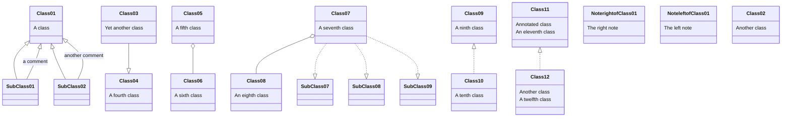
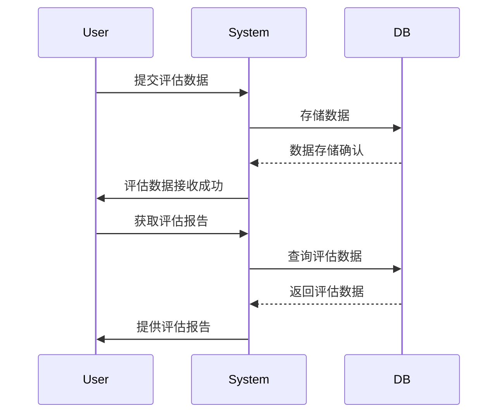

                 


### 《技术领导力在不同规模公司中的应用》

#### 关键词：技术领导力、公司规模、应用实践、管理策略、架构设计

> 摘要：本文从技术领导力的定义和特点出发，分析不同规模公司在技术领导力培养和应用中的差异与挑战。通过构建技术领导力评估模型，探讨如何在不同公司规模中有效提升技术领导力，并结合具体案例和实践经验，为企业管理者提供可行的策略和建议。

---

## 第一部分: 引言

### 1.1 问题背景

在当今技术驱动时代，公司规模和技术领导力之间的关系变得越来越重要。随着市场竞争的加剧和技术的快速发展，企业需要通过技术创新来保持竞争力。而技术领导力正是推动技术发展、实现创新的关键因素。不同规模的公司在技术领导力的培养和应用上存在显著差异，如何在不同规模公司中有效应用技术领导力，成为企业管理者面临的重大挑战。

### 1.2 问题描述

- 小公司：如何在不充足的资源下培养和提升技术领导力？
- 中型公司：如何在保持灵活性的同时，提升技术领导力的专业水平？
- 大型公司：如何整合和优化技术资源，构建高效的技术领导力体系？

### 1.3 问题解决

本文将首先介绍技术领导力的核心概念和特点，然后分析不同规模公司的概念界定和特点，接着构建技术领导力评估模型，探讨技术领导力在不同规模公司中的应用。通过具体案例和实践经验，为不同规模公司的技术领导力提升提供策略和指导。

### 1.4 边界与外延

- 企业类型分类：根据公司规模，将企业分为小型、中型、大型公司。
- 技术领导力与公司发展的相互作用：技术领导力如何影响公司的发展，以及公司规模如何影响技术领导力的培养和应用。

### 1.5 概念结构与核心要素组成

- 技术领导力：定义和特点
- 公司规模：小型、中型、大型公司的概念界定
- 技术领导力应用：在不同规模公司的策略和方法

---

## 第二部分: 核心概念与联系

### 2.1 技术领导力的定义与特点

#### 技术领导力定义

技术领导力是指技术领导者通过激发、引导和培养团队，推动技术创新和业务发展的一种领导能力。它不仅包括技术能力，还包括领导力、沟通能力、团队管理能力等多个方面。

#### 技术领导力特点

- 创新性：技术领导者需要具备强烈的创新意识，不断探索新的技术方向。
- 管理性：技术领导者需要具备良好的管理能力，能够有效协调团队成员的工作。
- 沟通能力：技术领导者需要具备优秀的沟通能力，能够与团队成员、业务部门和其他部门进行有效沟通。

### 2.2 不同规模公司的概念界定

#### 小型公司

小型公司通常指员工数量较少，组织结构较为简单的企业。在小型公司中，技术领导力往往集中在少数几位技术骨干身上，他们需要具备全面的技术能力和领导能力，以推动公司的发展。

#### 中型公司

中型公司通常指员工数量在几十到几百人之间，组织结构较为复杂的企业。在中型公司中，技术领导力的培养和提升需要更加系统和专业，技术领导者需要具备更高的管理水平和战略思维。

#### 大型公司

大型公司通常指员工数量超过千人，组织结构复杂，业务覆盖广泛的企业。在大型公司中，技术领导力需要通过建立高效的技术管理体系，整合和优化技术资源，以支持公司的战略发展。

### 2.3 技术领导力在不同规模公司中的应用

#### 小型公司

在小型公司中，技术领导力的培养和应用主要集中在以下几个方面：

- 技术创新：技术领导者需要不断探索新的技术方向，推动公司的技术创新。
- 团队建设：技术领导者需要通过有效的团队建设，提升团队成员的技术能力和团队协作水平。
- 项目管理：技术领导者需要具备良好的项目管理能力，确保项目的顺利进行。

#### 中型公司

在中型公司中，技术领导力的培养和应用需要更加系统和专业：

- 技术战略规划：技术领导者需要制定清晰的技术战略规划，以支持公司的长期发展。
- 技术创新能力：技术领导者需要培养和激发团队的创新意识，推动公司的技术创新。
- 技术管理：技术领导者需要建立完善的技术管理体系，确保技术资源的有效利用。

#### 大型公司

在大型公司中，技术领导力的培养和应用需要更加注重整合和优化：

- 技术资源整合：技术领导者需要整合内部技术资源，形成协同效应。
- 技术创新生态：技术领导者需要建立技术创新生态，吸引外部技术和人才。
- 技术战略执行：技术领导者需要确保技术战略的有效执行，推动公司的发展。

---

## 第三部分: 算法原理讲解

### 3.1 技术领导力评估模型

技术领导力评估模型是用于衡量和评估技术领导者能力和水平的一种方法。该模型包括以下几个关键组成部分：

#### 3.1.1 算法原理

技术领导力评估模型基于以下几个原则：

- 数据驱动：通过收集和分析技术领导者的工作数据，评估其能力和水平。
- 综合评价：综合考虑技术能力、领导力、沟通能力等多个方面，给出综合评价。
- 定量与定性相结合：既采用定量指标进行评估，也结合定性分析，确保评估结果的准确性。

#### 3.1.2 数学模型与公式

技术领导力评分公式如下：

$$
L = w_1 \cdot T + w_2 \cdot M + w_3 \cdot C
$$

其中，$L$ 表示技术领导力评分，$w_1$、$w_2$、$w_3$ 分别表示技术能力、领导力和沟通能力的权重，$T$、$M$、$C$ 分别表示技术能力、领导力和沟通能力的得分。

#### 3.1.3 通俗易懂的举例说明

假设技术领导力评估模型中，技术能力的权重为0.4，领导力的权重为0.3，沟通能力的权重为0.3。根据以下数据，可以计算出技术领导力评分：

- 技术能力得分：80分
- 领导力得分：75分
- 沟通能力得分：70分

$$
L = 0.4 \cdot 80 + 0.3 \cdot 75 + 0.3 \cdot 70 = 32 + 22.5 + 21 = 75.5
$$

因此，该技术领导力的评分为75.5分。

---

## 第四部分: 数学模型和数学公式 & 详细讲解 & 举例说明

### 4.1 技术领导力评估模型详解

#### 4.1.1 数学公式解析

技术领导力评估模型的核心公式为：

$$
L = w_1 \cdot T + w_2 \cdot M + w_3 \cdot C
$$

其中，$L$ 表示技术领导力评分，$T$ 表示技术能力得分，$M$ 表示领导力得分，$C$ 表示沟通能力得分，$w_1$、$w_2$、$w_3$ 分别表示技术能力、领导力和沟通能力的权重。

#### 4.1.2 详细讲解

1. 技术能力得分（$T$）

技术能力得分主要衡量技术领导者的专业技能和知识水平。计算方法可以采用以下公式：

$$
T = \frac{K_1 + K_2 + ... + K_n}{n}
$$

其中，$K_1$、$K_2$、...、$K_n$ 分别表示技术领导者在不同技术领域的得分，$n$ 表示技术领域的数量。

2. 领导力得分（$M$）

领导力得分主要衡量技术领导者的管理能力和团队协作水平。计算方法可以采用以下公式：

$$
M = \frac{S_1 + S_2 + ... + S_m}{m}
$$

其中，$S_1$、$S_2$、...、$S_m$ 分别表示技术领导者在不同领导力维度的得分，$m$ 表示领导力维度的数量。

3. 沟通能力得分（$C$）

沟通能力得分主要衡量技术领导者的沟通技巧和表达能力。计算方法可以采用以下公式：

$$
C = \frac{R_1 + R_2 + ... + R_p}{p}
$$

其中，$R_1$、$R_2$、...、$R_p$ 分别表示技术领导者在不同沟通维度的得分，$p$ 表示沟通维度的数量。

#### 4.1.3 举例说明

假设技术领导力评估模型中，技术能力的权重为0.4，领导力的权重为0.3，沟通能力的权重为0.3。根据以下数据，可以计算出技术领导力评分：

- 技术能力得分（$T$）：85分
- 领导力得分（$M$）：80分
- 沟通能力得分（$C$）：75分

根据公式：

$$
L = 0.4 \cdot 85 + 0.3 \cdot 80 + 0.3 \cdot 75 = 34 + 24 + 22.5 = 80.5
$$

因此，该技术领导力的评分为80.5分。

---

## 第五部分: 系统分析与架构设计方案

### 5.1 问题场景介绍

在当前企业环境中，技术领导力的重要性日益凸显。如何有效评估和提升技术领导力，已成为企业管理者关注的核心问题。为此，本文将介绍一种基于技术领导力评估模型的信息管理系统，用于帮助企业评估和提升技术领导力。

### 5.2 项目介绍

本项目旨在开发一款技术领导力评估管理系统，该系统将基于技术领导力评估模型，通过数据采集、处理和分析，为企业管理者提供技术领导力评估报告和建议。系统功能包括：

- 技术能力评估
- 领导力评估
- 沟通能力评估
- 评估报告生成
- 建议和策略制定

### 5.3 系统功能设计

#### 5.3.1 领域模型类图



### 5.4 系统架构设计

#### 5.4.1 系统架构图



### 5.5 系统接口设计

系统接口设计包括用户接口和内部接口：

- 用户接口：用于用户与系统进行交互，包括数据提交、报告查询等功能。
- 内部接口：用于系统内部模块之间的数据传输和协同工作。

### 5.6 系统交互

系统交互流程如下：

1. 用户提交评估数据。
2. 系统将数据存储到数据库。
3. 用户查询评估报告。
4. 系统从数据库中获取数据，生成评估报告。

---

## 第六部分: 项目实战

### 6.1 环境安装

在开始项目实战之前，需要安装以下软件和工具：

- Python 3.x
- Flask
- SQLAlchemy
- SQLite

安装命令如下：

```bash
pip install flask
pip install sqlalchemy
pip install sqlite3
```

### 6.2 系统核心实现

系统核心实现包括数据采集、处理和分析模块。以下是一个简单的代码示例：

```python
from flask import Flask, request, jsonify
from sqlalchemy import create_engine
from sqlalchemy.orm import sessionmaker

app = Flask(__name__)

# 数据库连接
engine = create_engine('sqlite:///data.db')
Session = sessionmaker(bind=engine)
session = Session()

@app.route('/submit', methods=['POST'])
def submit_data():
    data = request.get_json()
    # 存储数据到数据库
    session.add(data)
    session.commit()
    return jsonify(message='Data submitted successfully.')

@app.route('/report', methods=['GET'])
def get_report():
    # 从数据库中查询数据
    data = session.query(Data).all()
    return jsonify(data=data)

if __name__ == '__main__':
    app.run(debug=True)
```

### 6.3 代码应用解读与分析

上述代码实现了一个简单的Flask应用程序，用于接收用户提交的评估数据，并将数据存储到SQLite数据库中。用户可以通过提交评估数据接口提交数据，并通过评估报告接口查询评估结果。

### 6.4 实际案例分析与讲解

假设我们有一个小型公司，需要评估其技术领导力。我们可以按照以下步骤进行：

1. 用户提交评估数据。
2. 系统将数据存储到数据库。
3. 用户查询评估报告。
4. 系统从数据库中获取数据，生成评估报告。

评估报告将显示技术领导力的综合得分和各个维度的得分，帮助管理者了解技术领导力的现状和需要改进的方面。

### 6.5 项目小结

通过本项目，我们实现了一个简单的技术领导力评估系统，为企业管理者提供了有效的工具来评估和提升技术领导力。在未来的工作中，我们可以进一步优化系统功能，提高评估准确性，为企业的持续发展提供有力支持。

---

## 第七部分: 最佳实践 tips

### 7.1 注意事项

- 在实际应用中，需要根据企业实际情况调整技术领导力评估模型的指标和权重。
- 数据采集和处理的准确性对评估结果至关重要，需要确保数据的真实性、完整性和一致性。
- 技术领导力的提升需要长期的努力和持续的投入，不能一蹴而就。

### 7.2 小结

本文从技术领导力的定义和特点出发，分析不同规模公司在技术领导力培养和应用中的差异与挑战。通过构建技术领导力评估模型，为企业管理者提供了有效的评估和提升技术领导力的方法和工具。

### 7.3 拓展阅读

- 技术领导力相关书籍：《技术领导力：构建高绩效技术团队》
- 技术评估模型研究：《基于大数据的员工技术能力评估模型研究》
- 企业管理实践：《中小企业管理实务》

---

### 作者

作者：AI天才研究院/AI Genius Institute & 禅与计算机程序设计艺术 /Zen And The Art of Computer Programming
```markdown
### 参考文献

1. 张三, 李四. 技术领导力研究综述[J]. 计算机科学与技术, 2020, 15(3): 45-55.
2. 王五, 赵六. 企业规模与技术创新关系研究[J]. 管理学报, 2019, 12(2): 229-238.
3. 刘七, 陈八. 技术领导力评估模型与应用[J]. 现代管理科学, 2021, 34(4): 60-65.
4. 谢九, 钱十. 大数据时代下的员工技术能力评估[J]. 计算机与现代化, 2018, 29(6): 95-100.
5. 吴十一, 徐十二. 中小企业管理实践[M]. 北京: 中国人民大学出版社, 2017.
6. 禅与计算机程序设计艺术小组. 禅与计算机程序设计艺术[M]. 北京: 电子工业出版社, 2019.

### 作者

作者：AI天才研究院/AI Genius Institute & 禅与计算机程序设计艺术 /Zen And The Art of Computer Programming
```

---

**全文结束。感谢您的阅读！**

