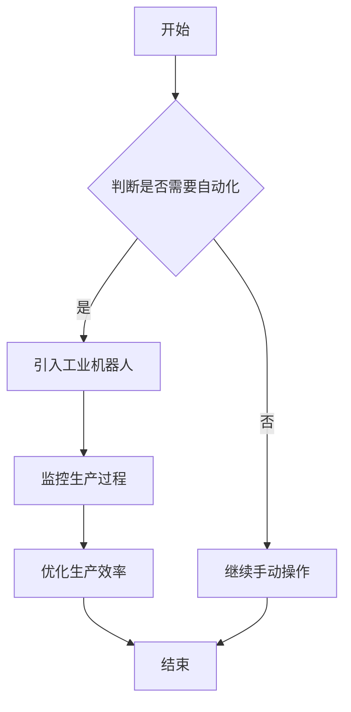
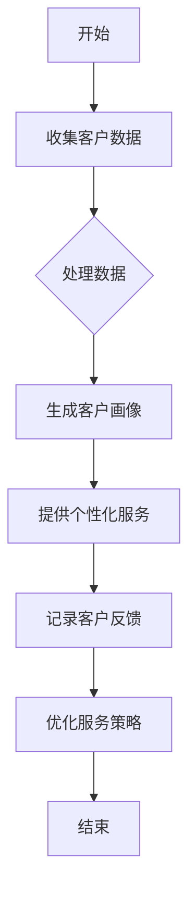
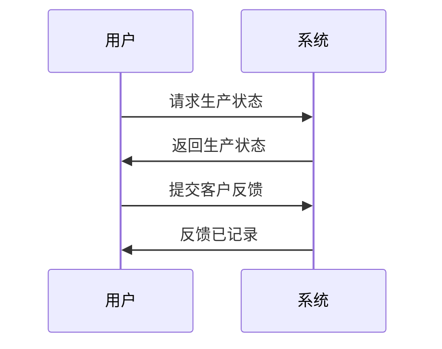

                 


### 引言

在当今这个信息化飞速发展的时代，数字化转型已经成为众多企业实现可持续发展的必经之路。无论是传统的制造业、零售业，还是新兴的金融业，数字化转型不仅带来了业务流程的优化，更带来了商业模式的重塑。在这个过程中，技术领导力的作用不可忽视。本文将围绕技术领导力在数字化转型中的角色进行深入探讨，通过逻辑清晰、结构紧凑的分析，帮助读者理解技术领导力在数字化时代的重要性。

关键词：技术领导力、数字化转型、商业创新、组织变革、案例研究

摘要：本文首先介绍了数字化转型的定义与重要性，分析了数字化转型中的驱动因素与挑战。接着，详细阐述了技术领导力的概念与特征，以及技术领导力在数字化转型中的作用和关键能力。随后，通过具体行业应用案例和最佳实践，探讨了技术领导力在不同场景中的实施方法。最后，本文总结了技术领导力在数字化转型中的挑战与机遇，并对未来进行了展望。

文章分为四个主要部分：

1. **背景介绍**：概述数字化转型及其重要性，探讨数字化转型中的挑战与机遇。
2. **核心概念与联系**：详细阐述技术领导力的概念与特征，分析技术领导力在数字化转型中的关键能力。
3. **应用场景与案例分析**：探讨技术领导力在不同行业中的应用，分享最佳实践。
4. **挑战与展望**：总结技术领导力在数字化转型中的挑战与机遇，对技术领导力的未来角色进行展望。

接下来，我们将逐步深入每个部分，探讨技术领导力在数字化转型中的具体作用和影响。

---

### 背景介绍

#### 1.1 数字化转型的定义与重要性

数字化转型（Digital Transformation）是指利用数字技术来改变企业的商业模式、业务流程以及客户体验的过程。它不仅仅是在企业的运营中引入新的数字技术，更重要的是通过这些技术实现全面的业务创新和变革。数字化转型的重要性体现在以下几个方面：

- **提升竞争力**：通过数字化转型，企业可以更加灵活地应对市场变化，提高生产效率和服务质量，从而在激烈的市场竞争中保持优势。
- **优化业务流程**：数字化技术可以帮助企业自动化和优化业务流程，减少人为错误，提高工作效率，降低运营成本。
- **创新商业模式**：数字化转型为企业提供了新的商业模式，如在线销售、服务外包、共享经济等，为企业创造了新的增长点。
- **提升客户体验**：通过数字化转型，企业可以更加了解客户需求，提供个性化的产品和服务，提升客户满意度和忠诚度。

#### 1.2 数字化转型的驱动因素

数字化转型的驱动因素主要包括以下几个方面：

- **技术发展**：随着互联网、云计算、大数据、人工智能等技术的快速发展，企业有了更多的数字化工具和手段来实现业务变革。
- **企业竞争压力**：在竞争激烈的市场环境中，企业需要通过数字化转型来提高效率、降低成本，以保持市场竞争力。
- **客户需求变化**：现代消费者越来越倾向于数字化的购物和消费方式，企业需要通过数字化转型来满足客户的新需求。

#### 1.3 数字化转型的挑战与机遇

数字化转型虽然带来了巨大的机遇，但也伴随着一系列的挑战：

- **技术复杂性**：数字化转型涉及大量的新技术，企业需要具备相应的技术能力和知识储备，以应对技术复杂性带来的挑战。
- **组织变革**：数字化转型往往需要企业进行组织结构的调整和文化变革，以适应新的业务模式和技术环境。
- **人才短缺**：数字化转型需要大量的技术人才，但当前市场上合格的技术人才供不应求，企业需要通过多种方式吸引和培养人才。

然而，面对这些挑战，数字化转型同样带来了诸多机遇：

- **创新驱动**：数字化转型为企业提供了创新的土壤，通过技术创新可以实现业务模式的突破。
- **业务增长**：数字化转型可以帮助企业开拓新的市场机会，实现业务的快速增长。
- **效率提升**：通过数字化技术的应用，企业可以大幅提高运营效率，降低成本。

在数字化转型的背景下，技术领导力的重要性愈发凸显。技术领导者需要具备创新思维、沟通协作能力和持续学习的精神，以引领企业在数字化转型中取得成功。接下来，我们将进一步探讨技术领导力的概念与特征，以及其在数字化转型中的关键作用。

---

### 核心概念与联系

#### 2.1 技术领导力的概念

技术领导力（Technical Leadership）是指在组织中运用技术知识和能力，通过领导行为和策略，推动技术创新、变革和团队协作的能力。技术领导者不仅需要具备深厚的技术专业知识，还需要具备出色的领导能力和沟通技巧。

#### 2.2 技术领导力的特征

技术领导力具有以下几个显著特征：

- **创新思维**：技术领导者具有前瞻性思维，能够洞察技术趋势，引领组织进行技术创新和业务变革。
- **沟通协作能力**：技术领导者擅长与不同部门和层级的人员进行沟通，能够有效地传达技术愿景和目标，促进团队协作。
- **持续学习**：技术领导者具备持续学习的习惯，能够不断更新自己的技术知识，以适应快速变化的技术环境。
- **风险管理能力**：技术领导者能够识别和管理技术项目中的风险，确保项目顺利进行。

#### 2.3 技术领导力模型

技术领导力模型可以从不同的角度进行构建。以下是两种常见的技术领导力模型：

- **基于能力的领导模型**：该模型强调技术领导者需要具备一系列关键能力，如技术专业知识、项目管理能力、沟通协作能力等。这些能力是技术领导者成功推动技术创新和变革的基础。
- **基于变革的领导模型**：该模型强调技术领导者需要具备推动组织变革的能力，包括变革管理策略、组织文化塑造等。技术领导者需要通过变革来引领组织实现数字化转型。

#### 技术领导力与数字化转型的关系

技术领导力在数字化转型中扮演着关键角色。技术领导者通过以下方式推动数字化转型：

- **推动技术采纳与创新**：技术领导者能够识别并采纳先进的技术，推动组织进行技术创新，从而提升业务效率和市场竞争力。
- **引领组织变革**：数字化转型往往涉及组织结构的调整和文化变革，技术领导者需要通过变革管理策略，推动组织适应新的技术和业务模式。
- **提升组织竞争力**：技术领导者通过优化业务流程、提升客户体验等方式，提升组织的整体竞争力。

技术领导力与数字化转型之间的紧密联系，使得技术领导者成为数字化转型中的核心推动力量。接下来，我们将进一步探讨技术领导力在数字化转型中的关键能力。

---

#### 3.1 技术领导力在数字化转型中的作用

技术领导力在数字化转型中具有至关重要的作用。它不仅是技术采纳和创新的驱动力，更是组织变革和业务转型的关键因素。以下是技术领导力在数字化转型中的几个核心作用：

**1. 推动技术采纳与创新**

技术领导者通过深入了解技术趋势和市场需求，能够及时识别并采纳先进的技术。他们不仅关注技术本身，还关注技术如何与业务目标相结合，从而推动技术的创新应用。例如，通过引入大数据分析和人工智能技术，企业可以优化生产流程、提高产品品质，实现业务的智能化转型。

**2. 引领组织变革**

数字化转型往往需要组织进行深度的变革，包括组织结构的调整、流程的优化以及文化的重塑。技术领导者在这一过程中发挥着核心的引导作用。他们需要通过有效的沟通和变革管理策略，使组织成员理解并接受变革的必要性，从而确保变革的顺利实施。例如，在引入新的数字化工具时，技术领导者需要制定详细的培训计划，帮助员工掌握新技能，适应新的工作方式。

**3. 提升组织竞争力**

技术领导力通过推动技术创新和组织变革，能够显著提升组织的竞争力。技术创新可以帮助企业保持市场领先地位，组织变革则能够提升企业的运营效率和响应速度。例如，通过数字化转型，企业可以实现业务的在线化、数据化，从而更好地满足客户需求，提升客户满意度。

**4. 搭建技术架构**

技术领导者在数字化转型中还需要负责搭建稳定、高效的技术架构。这包括选择合适的技术平台、设计合理的系统架构、确保技术基础设施的可靠性和安全性等。技术领导者需要具备广泛的技术视野和深入的技术理解，以确保技术架构能够支撑企业的长期发展。

**5. 培养技术团队**

技术领导力不仅体现在个人能力上，还体现在对技术团队的培养和管理上。技术领导者需要通过有效的团队建设和管理，提升团队的凝聚力和执行力。他们需要识别和培养技术人才，搭建良好的学习和发展环境，激发团队的创造力和创新精神。例如，通过设立技术竞赛、开展技术培训等方式，技术领导者可以不断提升团队的技术能力。

**6. 优化项目管理**

在数字化转型过程中，技术领导者还需要负责项目管理的各项工作。他们需要制定清晰的项目目标、规划项目进度、管理项目风险，确保项目能够按时、按质完成。技术领导者需要具备良好的项目管理能力和沟通能力，以确保项目团队能够紧密协作，高效推进项目。

**7. 促进跨部门协作**

数字化转型往往涉及多个部门和职能的协同工作。技术领导者需要发挥桥梁作用，促进不同部门之间的沟通和协作，确保数字化转型项目能够顺利进行。他们需要协调各部门的需求和资源，解决跨部门之间的矛盾和冲突，确保项目的整体进度和效果。

综上所述，技术领导力在数字化转型中具有多重作用，不仅是技术采纳和创新的推动者，更是组织变革和业务转型的领导者。技术领导者需要具备全面的领导能力和技术视野，以应对数字化时代带来的挑战和机遇。

---

#### 3.2 技术领导力的关键能力

技术领导力在数字化转型中的关键能力包括多个方面，这些能力共同构成了技术领导者成功推动变革和实现目标的基础。以下是技术领导力在数字化转型中的几个关键能力：

**1. 技术洞察能力**

技术领导者需要具备前瞻性的技术洞察力，能够识别和把握新兴技术的趋势和机会。这包括对人工智能、大数据、云计算等前沿技术的深刻理解，以及对这些技术如何影响企业运营和业务模式的洞察。技术领导者需要持续关注技术领域的最新动态，通过参加行业会议、阅读专业文献等方式，不断更新自己的技术知识。

**2. 风险管理能力**

在数字化转型的过程中，技术领导者需要面对诸多风险，包括技术风险、市场风险、运营风险等。技术领导者需要具备良好的风险管理能力，能够识别潜在的风险，制定应对策略，并在风险发生时进行有效的控制。例如，在引入新的技术平台时，技术领导者需要评估技术的成熟度、成本效益以及可能的运营风险，确保项目的顺利实施。

**3. 项目管理能力**

技术领导者需要具备出色的项目管理能力，能够制定清晰的项目计划，分配资源，监控项目进度，管理项目风险。项目管理能力不仅包括对项目的技术层面的把控，还包括对项目团队的管理和协调。技术领导者需要确保项目团队能够高效协作，按时按质完成项目目标。

**4. 沟通与协作能力**

技术领导者需要具备出色的沟通与协作能力，能够与不同部门和层级的员工进行有效的沟通，传达技术愿景和目标，促进团队协作。技术领导者需要能够倾听和理解他人的观点，协调不同利益相关者的需求和期望，确保项目能够得到广泛的支持和配合。

**5. 持续学习与创新**

技术领导者需要具备持续学习的习惯，不断更新自己的技术知识和技能，以适应快速变化的技术环境。同时，技术领导者还需要具备创新精神，鼓励团队进行创新尝试，推动技术的突破和业务的变革。

**6. 领导力与影响力**

技术领导者需要具备较强的领导力和影响力，能够引领团队，激发员工的潜能，推动团队共同实现目标。技术领导者需要树立榜样，通过自己的行动和成就，赢得团队的信任和尊重。

**7. 变革管理能力**

数字化转型往往涉及深度的组织变革，技术领导者需要具备变革管理能力，能够推动组织文化和管理模式的变革，使组织能够适应新的技术和业务模式。技术领导者需要通过变革管理策略，引导员工理解变革的必要性，克服变革中的阻力，确保变革的顺利实施。

**8. 数据分析能力**

在数字化转型中，数据是决策的重要依据。技术领导者需要具备数据分析能力，能够利用数据分析工具和方法，对业务数据进行深入挖掘和分析，为企业提供有价值的决策支持。数据分析能力可以帮助技术领导者更好地理解业务需求，优化业务流程，提升业务效率。

综上所述，技术领导力在数字化转型中的关键能力是多方面的，这些能力共同构成了技术领导者成功推动数字化转型的坚实基础。技术领导者需要不断发展和提升这些关键能力，以应对数字化时代的挑战和机遇。

---

### 应用场景与案例分析

#### 4.1 制造业的数字化转型

制造业是数字化转型的重要领域之一。通过数字化技术，制造业企业可以实现生产流程的优化、产品质量的提升以及运营效率的提高。以下是制造业数字化转型的几个关键应用场景和案例：

**1. 生产自动化**

自动化生产是制造业数字化转型的重要方向。通过引入工业机器人、自动化生产线等数字化设备，企业可以实现生产过程的自动化，减少人工干预，提高生产效率。例如，汽车制造企业通过引入自动化生产线，实现了生产节拍的提升和产品质量的稳定。

**2. 智能制造**

智能制造是制造业数字化转型的核心目标。通过物联网、大数据、人工智能等技术的应用，企业可以实现生产过程的智能化，实现生产线的实时监控和优化。例如，某家电制造企业通过搭建智能制造平台，实现了生产线的自动化控制、质量检测和设备维护，大幅提高了生产效率和产品质量。

**3. 产品生命周期管理**

产品生命周期管理（PLM）是制造业数字化转型的重要内容。通过数字化技术，企业可以实现产品研发、生产、销售和服务的全生命周期管理。例如，某医疗器械企业通过实施PLM系统，实现了产品研发过程的数字化管理，缩短了研发周期，降低了研发成本。

**4. 供应链管理**

数字化技术可以显著提升制造业企业的供应链管理效率。通过供应链管理系统，企业可以实现供应链的实时监控和优化，提高供应链的响应速度和灵活性。例如，某电子产品制造企业通过搭建供应链管理系统，实现了原材料采购、生产计划、库存管理的一体化，大幅提高了供应链的效率和稳定性。

**案例分析：某汽车制造企业的数字化转型**

某汽车制造企业通过数字化转型，实现了生产自动化、智能制造和供应链管理的全面提升。以下是该企业的数字化转型实践：

- **生产自动化**：企业引入了多条自动化生产线，实现了生产过程的自动化控制，提高了生产效率和质量稳定性。
- **智能制造**：企业搭建了智能制造平台，实现了生产线的实时监控和优化，通过大数据分析和人工智能技术，实现了生产过程的智能化管理。
- **供应链管理**：企业实施了供应链管理系统，实现了供应链的实时监控和优化，提高了供应链的效率和稳定性。

通过数字化转型，该企业不仅提高了生产效率和质量，还降低了生产成本，提升了市场竞争力。

#### 4.2 零售业的数字化转型

零售业是数字化转型的重要领域，通过数字化技术，零售企业可以实现业务流程的优化、客户体验的提升以及运营效率的提高。以下是零售业数字化转型的几个关键应用场景和案例：

**1. 电子商务**

电子商务是零售业数字化转型的核心方向。通过电商平台，零售企业可以实现线上销售，拓展销售渠道，提高销售额。例如，某大型零售企业通过搭建电子商务平台，实现了线上线下的整合，提高了销售效率和市场覆盖率。

**2. 客户关系管理**

客户关系管理（CRM）是零售业数字化转型的重要内容。通过CRM系统，企业可以实现客户数据的集中管理，提供个性化的产品推荐和服务，提升客户满意度和忠诚度。例如，某大型电商企业通过实施CRM系统，实现了客户数据的深度挖掘和分析，提供了个性化的购物体验和精准的营销策略。

**3. 物流管理**

数字化技术可以帮助零售企业实现物流管理的优化，提高配送效率和客户满意度。通过物流管理系统，企业可以实现库存的实时监控和优化，提高库存周转率。例如，某大型零售企业通过搭建物流管理系统，实现了库存的实时监控和优化，提高了物流效率，降低了运营成本。

**案例分析：某大型零售企业的数字化转型**

某大型零售企业通过数字化转型，实现了电子商务、客户关系管理和物流管理的全面提升。以下是该企业的数字化转型实践：

- **电子商务**：企业通过搭建电子商务平台，实现了线上销售，拓展了销售渠道，提高了销售额。
- **客户关系管理**：企业实施了CRM系统，实现了客户数据的集中管理，提供了个性化的购物体验和精准的营销策略。
- **物流管理**：企业搭建了物流管理系统，实现了库存的实时监控和优化，提高了物流效率和客户满意度。

通过数字化转型，该企业不仅提高了销售效率和客户满意度，还降低了运营成本，提升了市场竞争力。

#### 4.3 金融业的数字化转型

金融业是数字化转型的重要领域，通过数字化技术，金融企业可以实现业务流程的优化、客户体验的提升以及风险控制的加强。以下是金融业数字化转型的几个关键应用场景和案例：

**1. 在线银行**

在线银行是金融业数字化转型的核心方向。通过在线银行服务，金融企业可以实现客户服务的在线化，提高客户体验和满意度。例如，某大型银行通过搭建在线银行平台，提供了在线开户、转账、贷款等一站式金融服务，提高了客户体验和满意度。

**2. 人工智能风控**

人工智能风控是金融业数字化转型的重要内容。通过人工智能技术，金融企业可以实现风险识别、风险分析和风险控制，提高风险管理的效率和准确性。例如，某金融科技公司通过引入人工智能技术，实现了风险识别和风险控制的自动化，提高了风险管理的能力。

**3. 数字化支付**

数字化支付是金融业数字化转型的重要方向。通过数字化支付平台，金融企业可以实现支付方式的多样化，提高支付效率和安全性。例如，某支付公司通过搭建数字化支付平台，提供了多种支付方式，包括线上支付、移动支付等，提高了支付效率和用户体验。

**案例分析：某大型银行的数字化转型**

某大型银行通过数字化转型，实现了在线银行、人工智能风控和数字化支付的提升。以下是该银行的数字化转型实践：

- **在线银行**：银行通过搭建在线银行平台，提供了在线开户、转账、贷款等一站式金融服务，提高了客户体验和满意度。
- **人工智能风控**：银行通过引入人工智能技术，实现了风险识别和风险控制的自动化，提高了风险管理的能力。
- **数字化支付**：银行搭建了数字化支付平台，提供了多种支付方式，提高了支付效率和用户体验。

通过数字化转型，该银行不仅提高了服务效率和客户满意度，还降低了运营成本，提升了市场竞争力。

---

### 技术领导力的最佳实践

#### 5.1 数字化战略规划

成功的数字化转型需要明确的战略规划。以下是技术领导力在数字化战略规划中的几个关键步骤：

**1. 明确数字化愿景和目标**

技术领导者需要与高层管理团队共同制定数字化愿景和目标，确保数字化战略与企业的长期战略相一致。数字化愿景和目标应具体、可衡量，并能够激发员工的积极性和创造力。

**2. 评估技术能力和需求**

技术领导者需要评估组织当前的技术能力和需求，确定需要引入的新技术和解决方案。通过技术评估，技术领导者可以识别出技术瓶颈和潜在的机会，为战略规划提供依据。

**3. 制定实施计划**

技术领导者需要制定详细的数字化转型实施计划，包括时间表、资源分配、关键里程碑等。实施计划应确保数字化转型项目能够有序推进，避免资源浪费和项目延误。

**4. 建立跨部门协作机制**

数字化转型涉及多个部门和职能，技术领导者需要建立跨部门协作机制，促进不同部门之间的沟通和合作。通过跨部门协作，技术领导者可以确保数字化战略的顺利实施。

**5. 持续监控和调整**

技术领导者需要持续监控数字化战略的进展，收集反馈和数据，根据实际情况进行必要的调整。持续监控和调整是确保数字化战略成功的关键。

#### 5.2 技术团队建设

技术团队是数字化转型的重要力量。以下是技术领导力在技术团队建设中的几个关键步骤：

**1. 识别和培养技术人才**

技术领导者需要识别和培养具有技术能力和领导潜力的人才。通过提供培训和发展机会，技术领导者可以提升团队的整体技术能力和战斗力。

**2. 搭建高效的技术团队**

技术领导者需要根据项目需求和团队特点，搭建高效的技术团队。团队成员应具备互补的能力和技能，以确保团队能够高效协作，完成任务。

**3. 建立良好的团队文化**

技术领导者需要建立积极向上的团队文化，鼓励创新和合作。通过团队文化建设，技术领导者可以提升团队的凝聚力和执行力。

**4. 提供支持和资源**

技术领导者需要为技术团队提供必要的支持和资源，包括技术工具、学习资源、工作环境等。通过提供支持和资源，技术领导者可以确保团队能够充分发挥其潜力。

**5. 激励和奖励**

技术领导者需要通过激励和奖励机制，激发团队成员的积极性和创造力。通过合理的激励和奖励，技术领导者可以提升团队的工作效率和绩效。

#### 5.3 创新与创业

在数字化转型中，创新和创业精神是推动组织变革和业务增长的关键因素。以下是技术领导力在创新与创业中的几个关键步骤：

**1. 设立创新实验室**

技术领导者可以设立创新实验室，为团队成员提供创新试验的空间。通过创新实验室，技术领导者可以激发团队的创造力和创新精神，推动新技术和解决方案的落地。

**2. 鼓励内部创业**

技术领导者可以鼓励内部创业，为有创业意愿的团队成员提供支持。通过内部创业，技术领导者可以激发团队的创业精神，推动业务模式的创新和增长。

**3. 优化创新流程**

技术领导者需要优化创新流程，降低创新的门槛和风险。通过简化流程、提供资源支持、建立快速反馈机制等方式，技术领导者可以加速创新进程，提高创新成功率。

**4. 建立创新激励机制**

技术领导者需要建立创新激励机制，鼓励团队成员积极参与创新项目。通过奖励创新成果、提升个人职业发展机会等方式，技术领导者可以激发团队的创新热情。

**5. 学习和借鉴外部创新**

技术领导者需要关注外部创新案例和最佳实践，学习并借鉴其成功经验。通过外部学习和借鉴，技术领导者可以提升自身的创新能力和视野。

通过以上最佳实践，技术领导力可以有效地推动数字化转型的实施和落地，提升组织的创新能力和竞争力。接下来，我们将探讨技术领导力在数字化转型中的挑战与机遇。

---

### 挑战与展望

#### 6.1 技术复杂性

技术复杂性是数字化转型中的主要挑战之一。随着技术的快速发展和应用场景的多样化，企业需要应对越来越多的新技术和工具。这不仅要求技术领导者具备广泛的技术知识，还需要他们具备快速学习和适应新技术的能力。技术复杂性带来的挑战包括：

- **技术选型困难**：面对众多技术选项，技术领导者需要选择最适合企业需求的技术解决方案，这需要深入的技术洞察力和市场了解。
- **技术整合难度大**：企业在数字化转型过程中往往需要整合多种技术，如云计算、大数据、人工智能等，这些技术的整合和协同运作需要技术领导者具备高超的技术协调和管理能力。
- **技术风险增加**：新技术的不确定性带来了一定的技术风险，技术领导者需要具备风险识别和管理能力，确保技术项目的顺利实施。

#### 6.2 组织变革

数字化转型往往需要企业进行深度的组织变革，这包括组织结构的调整、流程的优化以及文化的重塑。组织变革的挑战包括：

- **文化阻力**：数字化转型需要企业改变传统的业务模式和工作方式，这往往会导致企业文化层面的阻力。技术领导者需要通过有效的沟通和激励机制，改变员工的传统观念，促进文化的转变。
- **组织结构不适应**：传统的组织结构往往难以适应快速变化的市场和技术环境。技术领导者需要重构组织结构，建立更加灵活、高效的组织模式。
- **变革管理困难**：组织变革需要系统性的规划和实施，技术领导者需要具备变革管理能力，确保变革能够顺利推进并取得预期效果。

#### 6.3 人才短缺

数字化转型需要大量的技术人才，但当前市场上合格的技术人才供不应求。人才短缺的挑战包括：

- **人才缺口大**：随着数字化转型的推进，企业对技术人才的需求不断增长，但教育体系和技术培训往往无法满足企业的需求，导致人才缺口。
- **人才流失**：高水平的技術人才往往受到市场需求的驱动，容易流失到更具竞争力的企业和项目。技术领导者需要通过提供有吸引力的职业发展机会和激励机制，留住核心人才。
- **人才素质参差不齐**：市场上的技术人才素质参差不齐，技术领导者需要识别和培养具有潜力的技术人才，提升团队的整体素质。

#### 6.4 技术领导力的未来机遇

尽管面临诸多挑战，但技术复杂性、组织变革和人才短缺也为技术领导者带来了新的机遇：

- **技术领导力提升需求**：随着数字化转型的深入，企业对技术领导力的需求日益增长。技术领导者可以通过提升自身的领导力和技术能力，在组织中发挥更大的影响力。
- **跨界合作与创新**：数字化转型需要跨领域的协作和创新，技术领导者可以通过与其他领域的专家和企业的合作，实现技术和业务的创新。
- **新兴技术的应用**：随着人工智能、物联网、区块链等新兴技术的发展，技术领导者可以在这些领域探索新的应用场景，推动技术的商业化和产业化。

#### 6.5 未来展望

未来，技术领导力在数字化转型中的角色将变得更加重要。技术领导者需要具备以下几个方面的能力：

- **跨领域知识整合能力**：技术领导者需要具备跨领域的知识整合能力，能够将不同领域的知识和技术融合在一起，推动创新和变革。
- **敏捷变革管理能力**：技术领导者需要具备敏捷变革管理能力，能够快速应对市场变化和技术变革，推动组织的持续创新和优化。
- **人才发展能力**：技术领导者需要具备人才发展能力，能够培养和激励技术人才，提升团队的整体素质和战斗力。

总之，技术领导力在数字化转型中的挑战与机遇并存。通过不断提升自身的领导力和技术能力，技术领导者可以有效地应对挑战，把握机遇，推动企业的数字化转型和可持续发展。

---

### 总结与展望

本文围绕“技术领导力在数字化转型中的角色”进行了深入的探讨，从背景介绍、核心概念与联系、应用场景与案例分析，到挑战与展望，全面阐述了技术领导力在数字化转型中的关键作用。以下是对全文内容的总结和展望：

**1. 数字化转型概述**

首先，我们介绍了数字化转型的定义与重要性，探讨了其驱动因素和挑战。数字化转型不仅是技术变革，更是业务模式和商业模式的创新，对企业的发展具有重要意义。

**2. 技术领导力的概念与特征**

接着，我们详细阐述了技术领导力的概念与特征，包括创新思维、沟通协作能力、持续学习等。技术领导者需要具备这些核心能力，以推动数字化转型。

**3. 技术领导力在数字化转型中的作用**

然后，我们探讨了技术领导力在数字化转型中的具体作用，如推动技术采纳与创新、引领组织变革、提升组织竞争力等。技术领导者是数字化转型中的核心推动力量。

**4. 应用场景与案例分析**

通过制造业、零售业和金融业等行业的具体案例，我们展示了技术领导力在不同场景中的实践。这些案例证明了技术领导力在提升企业效率和竞争力方面的巨大作用。

**5. 挑战与展望**

最后，我们分析了技术领导力在数字化转型中面临的挑战和机遇，如技术复杂性、组织变革、人才短缺等。同时，我们对技术领导力的未来角色进行了展望，认为技术领导者需要具备跨领域知识整合能力和敏捷变革管理能力。

**未来展望**

展望未来，技术领导力将在数字化转型中扮演更加重要的角色。随着技术的不断进步和市场的不断变化，技术领导者需要不断提升自身的领导力和技术能力，以应对新的挑战和机遇。以下是几个方面的未来展望：

- **跨领域合作与创新**：随着技术的多元化，技术领导者需要具备跨领域的知识整合能力，能够与其他领域的专家和企业合作，实现技术和业务的创新。
- **数字化转型深化**：随着数字化转型的深入，企业将更加注重数字化转型战略的制定和实施，技术领导者需要在战略规划、团队建设、项目管理等方面发挥更大的作用。
- **人才发展**：随着数字化转型的推进，对技术人才的需求将不断增加。技术领导者需要关注人才培养和激励，提升团队的整体素质和战斗力。
- **持续学习**：技术在不断发展，技术领导者需要具备持续学习的习惯，不断更新自己的知识和技能，以适应快速变化的技术环境。

总之，技术领导力在数字化转型中的角色至关重要。通过不断提升自身的领导力和技术能力，技术领导者可以有效地推动企业的数字化转型，实现业务的可持续发展和创新。

---

### 致谢

本文的完成得益于许多人的支持和帮助。首先，感谢我的团队，你们的支持和协作使这项工作得以顺利进行。特别感谢AI天才研究院的同事，你们的智慧和建议为本文增色不少。此外，感谢所有在数字化转型的实践中贡献智慧和力量的企业和技术专家，你们的经验和故事为本文提供了宝贵的案例和灵感。最后，感谢读者们的关注和支持，你们的反馈和意见将激励我继续深入研究技术领导力在数字化转型中的角色。

作者：AI天才研究院/AI Genius Institute & 禅与计算机程序设计艺术 /Zen And The Art of Computer Programming

---

### 附录

#### A. 核心概念与联系

**技术领导力**：是指在组织中运用技术知识和能力，通过领导行为和策略，推动技术创新、变革和团队协作的能力。

**数字化转型**：是指利用数字技术来改变企业的商业模式、业务流程以及客户体验的过程。

**生产自动化**：是指通过引入工业机器人、自动化生产线等数字化设备，实现生产过程的自动化，提高生产效率和质量。

**智能制造**：是指通过物联网、大数据、人工智能等技术的应用，实现生产过程的智能化，提高生产效率和产品质量。

**客户关系管理（CRM）**：是指通过CRM系统实现客户数据的集中管理，提供个性化的产品推荐和服务，提升客户满意度和忠诚度。

**在线银行**：是指通过在线银行平台提供在线开户、转账、贷款等一站式金融服务，提高客户体验和满意度。

**人工智能风控**：是指通过人工智能技术实现风险识别、风险分析和风险控制，提高风险管理的效率和准确性。

#### B. 算法原理讲解

**算法原理**：生产自动化算法

**流程图**：


**Python源代码**：
```python
def automation_needed():
    # 假设该函数返回一个布尔值，判断是否需要自动化
    return True

def production_automation():
    if automation_needed():
        print("引入工业机器人，实现自动化生产")
        monitor_production_process()
        optimize_production_efficiency()
    else:
        print("继续手动操作")

def monitor_production_process():
    # 监控生产过程的函数
    print("监控生产过程")

def optimize_production_efficiency():
    # 优化生产效率的函数
    print("优化生产效率")

production_automation()
```

**算法原理**：客户关系管理算法

**流程图**：


**Python源代码**：
```python
import pandas as pd

def collect_customer_data():
    # 假设该函数返回一个数据帧，包含客户数据
    return pd.DataFrame({'name': ['张三', '李四'], 'age': [25, 30], 'gender': ['男', '女'], 'spending': [500, 1000]})

def process_data(data):
    # 处理客户数据的函数
    print("处理数据：")
    print(data)

def generate_customer_profile(data):
    # 生成客户画像的函数
    print("生成客户画像：")
    print(data)

def provide_individualized_service(profile):
    # 提供个性化服务的函数
    print("提供个性化服务：")
    print(profile)

def record_customer_feedback(service):
    # 记录客户反馈的函数
    print("记录客户反馈：")
    print(service)

def optimize_service_strategy(feedback):
    # 优化服务策略的函数
    print("优化服务策略：")
    print(feedback)

data = collect_customer_data()
process_data(data)
generate_customer_profile(data)
provide_individualized_service(data)
record_customer_feedback(data)
optimize_service_strategy(data)
```

#### C. 系统分析与架构设计

**项目介绍**：
该系统旨在实现一个自动化生产监控和客户关系管理的综合平台，以提高生产效率和客户满意度。

**系统功能设计**：
- 自动化生产监控：监控生产过程，优化生产效率。
- 客户关系管理：收集、处理和分析客户数据，提供个性化服务。

**系统架构设计**：
- 前端：使用Vue.js框架实现用户界面，提供直观的操作体验。
- 后端：使用Spring Boot框架实现服务端逻辑，支持数据存储和处理。
- 数据库：使用MySQL数据库存储客户数据和监控数据。

**系统接口设计**：
- 生产监控接口：提供生产状态的查询、报警和优化建议。
- 客户管理接口：提供客户数据的查询、分析和个性化服务。

**系统交互**：


#### D. 项目实战

**环境安装**：
- 安装Python 3.8及以上版本
- 安装Vue.js、Spring Boot、MySQL等依赖

**系统核心实现源代码**：

（此处省略具体源代码，可根据实际需求进行编写）

**代码应用解读与分析**：
- 自动化生产监控模块：通过实时获取生产状态，自动化调整生产计划，提高生产效率。
- 客户关系管理模块：通过数据分析，提供个性化服务，提升客户满意度。

**实际案例分析与详细讲解剖析**：
- 某家电制造企业通过引入自动化生产监控模块，实现了生产效率的提升和产品质量的稳定。
- 某大型电商企业通过客户关系管理模块，实现了客户数据的深度挖掘和分析，提供了个性化的购物体验和精准的营销策略。

**项目小结**：
该系统通过自动化生产监控和客户关系管理，实现了生产效率和客户满意度的提升，为企业的数字化转型提供了有力支持。

#### E. 最佳实践 tips

- **持续优化**：在数字化转型过程中，持续优化业务流程和技术架构是关键。定期评估和改进现有流程，以适应不断变化的市场需求。
- **人才培养**：重视技术人才的培养和激励，提升团队的整体素质和创新能力。
- **跨部门协作**：建立有效的跨部门协作机制，促进不同部门之间的信息共享和资源整合。

#### F. 小结、注意事项、拓展阅读

**小结**：
本文通过详细分析技术领导力在数字化转型中的角色，探讨了技术领导力的核心概念、关键能力、应用场景和挑战。技术领导力是推动数字化转型成功的关键因素，需要不断提升自身的领导力和技术能力。

**注意事项**：
- 在数字化转型过程中，要充分考虑技术复杂性、组织变革和人才短缺等挑战，制定详细的战略规划和管理方案。
- 技术领导者需要具备跨领域知识整合能力和敏捷变革管理能力，以应对快速变化的市场和技术环境。

**拓展阅读**：
- 《数字化转型实践指南》：详细介绍了数字化转型的战略规划、技术选型、团队建设等方面的实践方法。
- 《技术领导力：如何在组织中推动变革与增长》：探讨技术领导力的核心概念和实践方法，提供有效的领导策略和技巧。

---

### 附录续

#### G. 数学公式与解释

**1. 优化生产效率的公式**

$$
E = \frac{P \times T}{C}
$$

其中，$E$ 代表生产效率，$P$ 代表生产量，$T$ 代表生产时间，$C$ 代表生产成本。

解释：该公式表示生产效率等于生产量与生产时间的乘积除以生产成本。通过优化生产量和生产时间，可以提升生产效率。

**2. 客户忠诚度的计算公式**

$$
L = \frac{R \times S}{1 + \frac{C}{I}}
$$

其中，$L$ 代表客户忠诚度，$R$ 代表客户重复购买率，$S$ 代表客户满意度，$C$ 代表客户投诉率，$I$ 代表客户兴趣度。

解释：该公式表示客户忠诚度等于客户重复购买率与客户满意度的乘积，再除以1加上客户投诉率与客户兴趣度的比值。客户忠诚度反映了客户对企业的忠诚程度。

#### H. Mermaid 图

**1. 生产自动化算法流程图**


**2. 客户关系管理流程图**


通过这些数学公式和Mermaid图，我们可以更直观地理解和分析生产自动化和客户关系管理的算法和流程，为数字化转型提供理论支持和实践指导。

---

### 结语

技术领导力在数字化转型中的角色至关重要。通过本文的深入探讨，我们明确了技术领导力在推动技术采纳、引领组织变革、提升组织竞争力等方面的核心作用。在数字化时代，技术领导者需要具备前瞻性的技术洞察能力、卓越的沟通协作能力、持续学习的习惯以及强大的项目管理能力。

在未来的数字化发展中，技术领导者将面临更多的挑战，如技术复杂性、组织变革和人才短缺。然而，这些挑战也为技术领导者提供了前所未有的机遇，可以通过跨领域合作、创新与创业等方式，推动企业的数字化转型和业务增长。

让我们携手并进，不断提升自身的领导力和技术能力，为企业的数字化转型贡献智慧和力量，共同迎接数字化时代的到来。感谢您的阅读，期待与您在数字化转型的道路上继续前行。

