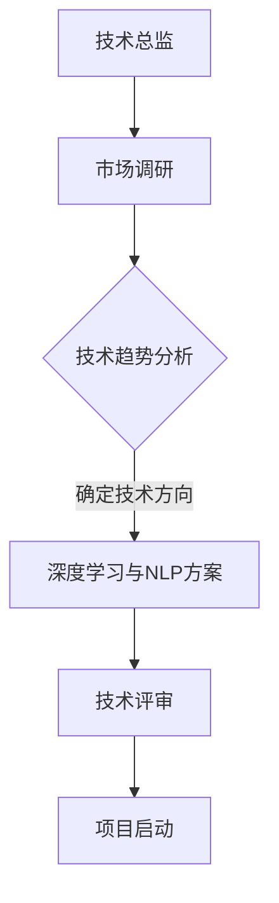
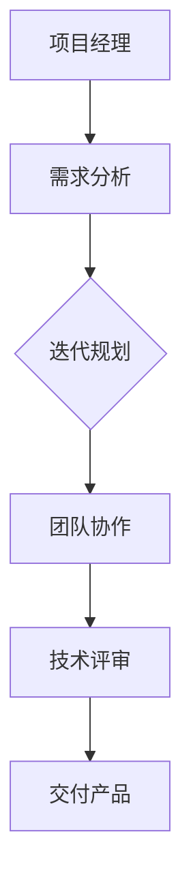
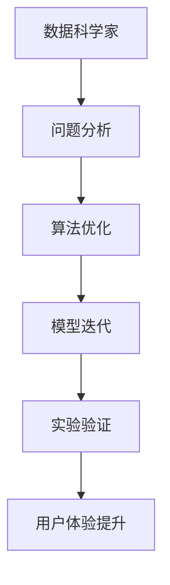

                 

# 技术领导力提升计划：从管理者到领导者的进阶之路

> 关键词：技术领导力、管理者、领导者、团队管理、创新思维、风险管理

> 摘要：本文旨在探讨技术领导力的提升路径，从管理者到领导者的转变过程。通过分析技术领导力的核心要素，结合实战应用与案例分析，为读者提供系统化、实用性的提升策略，帮助读者在技术领域实现从管理者到领导者的进阶。

## 目录大纲

**《技术领导力提升计划：从管理者到领导者的进阶之路》**

----------------------------------------------------------------

## 第一部分：引言与背景

### 1.1 问题背景与重要性

#### 1.1.1 管理者与领导者的区别

#### 1.1.2 技术行业中的领导力需求

#### 1.1.3 从管理者到领导者的挑战

### 1.2 目标读者

#### 1.2.1 管理者面临的常见问题

#### 1.2.2 领导者的关键能力

#### 1.2.3 适合读者的经验和技能水平

### 1.3 书籍结构

#### 1.3.1 各章节主要内容概述

#### 1.3.2 学习方法和时间规划

#### 1.3.3 最佳实践分享与案例分析

### 1.4 小结

----------------------------------------------------------------

## 第二部分：技术领导力核心要素

### 2.1 技术领导力定义

#### 2.1.1 技术领导力的内涵

#### 2.1.2 技术领导力与业务领导力的结合

### 2.2 技术视野与知识拓展

#### 2.2.1 技术前沿动态

#### 2.2.2 行业趋势分析

#### 2.2.3 拓展阅读与学习资源

### 2.3 团队管理与协作

#### 2.3.1 管理者与领导者的角色转变

#### 2.3.2 高效团队建设

#### 2.3.3 项目管理与协作工具

### 2.4 创新思维与方法

#### 2.4.1 创新领导力的要素

#### 2.4.2 创新思维训练

#### 2.4.3 创新实践案例解析

### 2.5 风险管理与决策

#### 2.5.1 技术风险识别与评估

#### 2.5.2 决策模型与工具

#### 2.5.3 实战案例分析

### 2.6 领导力提升路径

#### 2.6.1 职业发展规划

#### 2.6.2 领导力培训与实践

#### 2.6.3 自我评估与持续成长

### 2.7 小结

----------------------------------------------------------------

## 第三部分：实战应用与案例分析

### 3.1 实战项目介绍

#### 3.1.1 项目背景

#### 3.1.2 项目目标

#### 3.1.3 项目团队组成

### 3.2 技术领导力在项目中的实践

#### 3.2.1 技术视野与决策

#### 3.2.2 团队管理与协作

#### 3.2.3 创新思维与实践

### 3.3 案例分析

#### 3.3.1 案例一：成功领导团队实现项目目标

#### 3.3.2 案例二：技术创新驱动项目突破

#### 3.3.3 案例三：有效风险管理确保项目顺利进行

### 3.4 项目小结

#### 3.4.1 项目成果总结

#### 3.4.2 经验与教训

#### 3.4.3 对后续项目的启示

### 3.5 小结

----------------------------------------------------------------

## 第四部分：拓展阅读与持续学习

### 4.1 拓展阅读

#### 4.1.1 最新技术趋势与动态

#### 4.1.2 领导力理论与实践

#### 4.1.3 相关书籍与论文推荐

### 4.2 持续学习建议

#### 4.2.1 学习资源与工具

#### 4.2.2 自我评估与反馈

#### 4.2.3 领导力发展的长期规划

### 4.3 小结

----------------------------------------------------------------

## 附录

### 附录A：技术领导力自我评估问卷

### 附录B：常见问题解答

----------------------------------------------------------------

## 第一部分：引言与背景

### 1.1 问题背景与重要性

在当今技术飞速发展的时代，技术领导力已经成为企业成功的关键因素之一。技术领导力不仅关乎技术本身，更涉及到团队管理、创新思维、风险管理等多个方面。然而，许多管理者在向领导者转变的过程中面临着诸多挑战。

首先，管理者与领导者的区别在于角色和责任的差异。管理者主要负责日常事务的执行和监督，而领导者则更关注团队的长远发展和战略规划。其次，技术行业中的领导力需求日益增加，技术领导者需要具备深厚的技术背景，同时具备出色的沟通、协调和领导能力。最后，从管理者到领导者的挑战包括适应角色转变、提升领导力和管理技能，以及应对不断变化的市场和技术环境。

本篇文章旨在探讨技术领导力的提升路径，帮助管理者实现从管理者到领导者的进阶。通过分析技术领导力的核心要素，结合实战应用与案例分析，为读者提供系统化、实用性的提升策略。

### 1.2 目标读者

本文的目标读者主要包括以下几类：

1. **现有管理者**：正在寻求提升领导力和管理技能的技术管理者，希望实现从管理者到领导者的转变。
2. **未来领导者**：有志于成为技术领导者，希望在职业发展中提升自身领导力和管理能力的年轻技术人才。
3. **技术爱好者**：对技术领导力感兴趣的技术爱好者，希望通过本文了解技术领导力的核心要素和实践方法。

### 1.3 书籍结构

本文分为四个部分，结构如下：

1. **第一部分：引言与背景**：介绍技术领导力的重要性、问题背景和目标读者，为后续内容奠定基础。
2. **第二部分：技术领导力核心要素**：详细探讨技术领导力的核心要素，包括技术视野、团队管理、创新思维、风险管理和领导力提升路径等。
3. **第三部分：实战应用与案例分析**：通过实际项目介绍和案例分析，展示技术领导力在项目实践中的应用。
4. **第四部分：拓展阅读与持续学习**：提供拓展阅读和持续学习建议，帮助读者深入理解和应用技术领导力。

### 1.4 小结

本文为技术领导力的提升提供了全面的规划和指导。通过了解技术领导力的重要性、问题背景和目标读者，读者可以更好地定位自己的职业发展方向，并从核心要素、实战应用和拓展阅读等方面逐步提升自己的领导力和管理能力。让我们一同踏上从管理者到领导者的进阶之路。

----------------------------------------------------------------

## 第二部分：技术领导力核心要素

### 2.1 技术领导力定义

技术领导力是一种独特的领导能力，它不仅仅要求技术领导者具备深厚的技术背景，还要求其能够在团队中发挥领导作用，推动技术创新和业务发展。技术领导力可以简单定义为在技术领域内，领导者通过激励、指导和协调团队成员，实现技术目标和业务目标的能力。

#### 2.1.1 技术领导力的内涵

技术领导力的内涵主要包括以下几个方面：

1. **技术深度与广度**：技术领导者需要具备扎实的技术知识和深厚的专业素养，对当前和未来的技术趋势有深刻的理解和洞察力。
2. **领导与影响力**：技术领导者需要具备出色的领导能力和影响力，能够激励团队，建立信任，推动团队成员共同实现目标。
3. **战略思维**：技术领导者需要具备战略思维能力，能够从业务角度出发，制定和执行长期的技术战略。
4. **创新驱动**：技术领导者需要具备创新精神，能够推动团队进行技术创新，保持技术领先地位。

#### 2.1.2 技术领导力与业务领导力的结合

技术领导力与业务领导力并不是相互独立的，而是相互补充的。技术领导力侧重于技术层面的领导，而业务领导力则侧重于业务层面的领导。两者的结合能够更好地推动企业的发展。

1. **技术驱动业务**：技术领导力可以驱动业务创新，通过技术创新提升企业的竞争力。
2. **业务指导技术**：业务领导力可以为技术领导提供战略方向，确保技术发展符合业务需求。

### 2.2 技术视野与知识拓展

技术视野是技术领导者的重要素质之一。一个优秀的技术领导者需要具备广阔的技术视野，能够紧跟技术前沿动态，了解行业趋势，并据此做出正确的决策。

#### 2.2.1 技术前沿动态

技术前沿动态主要包括以下几个方面：

1. **人工智能与机器学习**：深度学习、自然语言处理、计算机视觉等技术的发展。
2. **云计算与大数据**：云计算服务、大数据处理和分析技术的演进。
3. **区块链技术**：区块链在金融、供应链等领域的应用。
4. **物联网与边缘计算**：物联网设备和边缘计算技术的发展。

#### 2.2.2 行业趋势分析

行业趋势分析是技术领导者了解行业发展趋势的重要手段。通过分析行业趋势，技术领导者可以预判技术发展方向，为企业的技术战略提供支持。

1. **数字化转型**：企业向数字化转型，提高效率和降低成本。
2. **物联网与智能设备**：物联网设备和智能设备在企业中的应用。
3. **人工智能与自动化**：人工智能技术在各个行业的自动化应用。
4. **可持续发展和绿色技术**：企业对可持续发展和绿色技术的重视。

#### 2.2.3 拓展阅读与学习资源

为了提升技术视野，技术领导者可以阅读以下书籍和论文：

1. **《深度学习》**：Goodfellow、Bengio 和 Courville 著，详细介绍深度学习的基础知识和应用。
2. **《云原生应用架构》**：Armbrust、Brewer 和 Hadley 著，介绍云计算和分布式系统的设计和应用。
3. **《区块链革命》**：Nakamoto 著，详细介绍区块链技术的工作原理和应用场景。
4. **《物联网架构设计》**：O'Reilly 著，介绍物联网系统的设计原则和应用。

### 2.3 团队管理与协作

团队管理是技术领导者的重要职责之一。一个高效的技术团队可以提升企业的创新能力，实现技术目标。因此，技术领导者需要掌握有效的团队管理方法。

#### 2.3.1 管理者与领导者的角色转变

管理者与领导者的角色转变主要体现在以下几个方面：

1. **从任务导向到目标导向**：领导者更关注团队的目标实现，而非具体的任务执行。
2. **从控制到激励**：领导者通过激励和引导，激发团队成员的潜力，而非仅仅控制他们的行为。
3. **从命令式到协商式**：领导者通过协商和沟通，与团队成员共同解决问题，而非单方面下达指令。

#### 2.3.2 高效团队建设

高效团队建设需要从以下几个方面入手：

1. **明确团队目标**：确保团队成员对团队目标有清晰的认识，并为之努力。
2. **合理分工与协作**：根据团队成员的能力和特长，进行合理的分工，促进协作。
3. **建立信任与沟通**：建立团队成员之间的信任，促进信息共享和沟通，提高团队效率。
4. **持续培训与发展**：提供持续的培训和职业发展机会，提升团队成员的能力。

#### 2.3.3 项目管理与协作工具

项目管理与协作工具是技术领导者提升团队协作效率的重要手段。常用的工具包括：

1. **JIRA**：用于项目管理和任务跟踪，支持敏捷开发。
2. **Trello**：用于任务管理和团队协作，界面直观，易于使用。
3. **Slack**：用于团队沟通和协作，支持实时消息、文件共享和集成其他工具。
4. **GitHub**：用于版本控制和协作开发，支持代码管理和协作。

### 2.4 创新思维与方法

创新思维是技术领导者的重要素质之一。创新可以推动技术进步，提升企业的竞争力。技术领导者需要掌握创新思维和方法，激发团队的创新能力。

#### 2.4.1 创新领导力的要素

创新领导力的要素主要包括以下几个方面：

1. **开放的心态**：领导者需要具备开放的心态，鼓励团队成员提出新的想法和解决方案。
2. **鼓励试错**：领导者需要鼓励团队成员尝试新的方法和方案，即使失败也不会受到惩罚。
3. **资源投入**：领导者需要为创新项目提供必要的资源和支持，确保创新的顺利进行。
4. **团队协作**：创新需要团队协作，领导者需要促进团队成员之间的合作，共同实现创新目标。

#### 2.4.2 创新思维训练

创新思维训练主要包括以下几个方面：

1. **头脑风暴**：通过集体头脑风暴，激发团队成员的创意和灵感。
2. **思维导图**：通过思维导图，将创意和想法进行结构化和可视化。
3. **原型设计**：通过原型设计，快速验证和迭代创意和想法。
4. **交叉学科学习**：通过学习其他学科的知识，拓展思维方式，激发创新灵感。

#### 2.4.3 创新实践案例解析

以下是一个创新实践案例：

**案例：Google 的无人驾驶汽车项目**

Google 的无人驾驶汽车项目是一个典型的创新实践案例。该项目通过以下方式实现了创新：

1. **技术突破**：Google 的工程师在人工智能、机器学习、传感器和算法等领域进行了深入研究，取得了重要突破。
2. **团队协作**：Google 建立了一个跨学科团队，包括软件工程师、硬件工程师、数据科学家等，通过紧密合作，实现了技术整合。
3. **持续迭代**：Google 对无人驾驶汽车进行了大量的测试和迭代，不断优化算法和系统，提高了汽车的可靠性和安全性。
4. **开放合作**：Google 与其他企业和机构合作，共同推动无人驾驶技术的发展。

通过这个案例，我们可以看到，创新需要技术突破、团队协作、持续迭代和开放合作。技术领导者需要在这些方面发挥关键作用，推动团队实现创新目标。

### 2.5 风险管理与决策

风险管理与决策是技术领导者的重要职责之一。在技术领域，风险无处不在，技术领导者需要具备良好的风险管理能力和决策能力，确保项目的顺利进行。

#### 2.5.1 技术风险识别与评估

技术风险识别与评估主要包括以下几个方面：

1. **技术可行性研究**：在项目启动前，对技术的可行性进行充分研究，评估技术风险。
2. **风险评估**：对项目中的技术风险进行评估，确定风险的概率和影响程度。
3. **风险分类**：根据风险的性质和影响程度，对风险进行分类，制定相应的风险管理策略。

#### 2.5.2 决策模型与工具

决策模型与工具主要包括以下几个方面：

1. **成本效益分析**：通过成本效益分析，评估项目的投资回报，为决策提供依据。
2. **决策树**：通过决策树，对项目中的各种决策路径进行模拟和分析，确定最佳决策方案。
3. **敏感性分析**：通过敏感性分析，评估项目参数变化对决策结果的影响，提高决策的稳定性。

#### 2.5.3 实战案例分析

以下是一个风险管理和决策的案例：

**案例：Facebook 的数据中心项目**

Facebook 的数据中心项目是一个典型的风险管理和决策案例。在项目启动前，Facebook 对项目进行了全面的风险评估：

1. **技术风险**：Facebook 对数据中心的技术架构进行了深入研究，确保技术的可行性和稳定性。
2. **成本风险**：Facebook 对数据中心的建设成本进行了详细的预算和分析，确保项目的成本控制在预算范围内。
3. **环境影响**：Facebook 考虑到数据中心的能源消耗和环境影响，采取了节能和环保措施。

在决策过程中，Facebook 采用了一系列决策模型和工具：

1. **成本效益分析**：Facebook 通过成本效益分析，评估了不同数据中心建设方案的投资回报，选择了最优方案。
2. **决策树**：Facebook 通过决策树，分析了项目中的各种决策路径，确定了最佳建设方案。
3. **敏感性分析**：Facebook 通过敏感性分析，评估了项目参数变化对决策结果的影响，确保了决策的稳定性。

通过这个案例，我们可以看到，技术领导者需要具备良好的风险管理能力和决策能力，确保项目的顺利进行。

### 2.6 领导力提升路径

技术领导力的提升是一个长期而系统的过程，需要技术领导者通过职业发展规划、领导力培训与实践以及自我评估与持续成长来实现。

#### 2.6.1 职业发展规划

职业发展规划是技术领导者提升自身能力的重要手段。技术领导者应该明确自己的职业目标，制定详细的职业规划，并为此付出努力。

1. **短期目标**：设定在1-3年内可以实现的目标，如提升技术能力、参与重要项目等。
2. **中期目标**：设定在3-5年内可以实现的目标，如晋升为技术经理、参与企业战略规划等。
3. **长期目标**：设定在5年以上可以实现的目标，如成为技术总监、技术专家等。

#### 2.6.2 领导力培训与实践

领导力培训与实践是技术领导者提升领导力的重要途径。技术领导者可以通过以下方式提升自己的领导力：

1. **参加培训课程**：参加专业领导力培训课程，学习领导力理论和实践方法。
2. **实际操作**：通过实际项目管理、团队领导等操作，积累领导力经验。
3. **请教导师**：向有经验的领导者请教，学习他们的领导技巧和经验。

#### 2.6.3 自我评估与持续成长

自我评估与持续成长是技术领导者提升自身能力的重要手段。技术领导者应该定期进行自我评估，找出自身的不足，并采取相应的措施进行改进。

1. **定期评估**：定期进行自我评估，分析自己在领导力、技术能力等方面的表现。
2. **设定改进目标**：根据自我评估的结果，设定改进目标，并制定具体的行动计划。
3. **持续学习**：通过阅读书籍、参加研讨会、交流学习等途径，不断提升自己的知识和技能。

### 2.7 小结

技术领导力是技术领导者必须具备的重要能力。通过了解技术领导力的核心要素，技术领导者可以逐步提升自己的领导力和管理能力，实现从管理者到领导者的转变。本部分内容涵盖了技术领导力的定义、技术视野与知识拓展、团队管理与协作、创新思维与方法、风险管理与决策以及领导力提升路径等核心要素，为技术领导者提供了全面的提升策略。

----------------------------------------------------------------

### 3.1 实战项目介绍

为了更好地展示技术领导力在项目中的实践，我们将介绍一个实际的项目——某大型互联网公司的智能客服系统项目。该项目旨在通过人工智能技术，提高客户服务效率和用户体验。

#### 3.1.1 项目背景

随着互联网的普及，客户服务需求日益增加。传统的客户服务方式已无法满足用户快速、高效的服务需求。因此，公司决定开发一款智能客服系统，利用人工智能技术实现自动化客户服务。

#### 3.1.2 项目目标

1. **提高客户满意度**：通过智能客服系统，快速响应客户需求，提高客户满意度。
2. **降低运营成本**：减少人工客服的投入，降低运营成本。
3. **提升服务效率**：实现自动化问答，提高服务效率。
4. **拓展服务范围**：覆盖更多客户问题，提供全天候服务。

#### 3.1.3 项目团队组成

项目团队由以下成员组成：

1. **项目经理**：负责项目的整体规划和管理。
2. **技术总监**：负责技术方案的设计和实现。
3. **数据科学家**：负责数据分析和算法优化。
4. **前端开发工程师**：负责智能客服系统的前端开发。
5. **后端开发工程师**：负责智能客服系统的后端开发。
6. **测试工程师**：负责智能客服系统的测试。

### 3.2 技术领导力在项目中的实践

在智能客服系统项目中，技术领导力在以下几个方面发挥了重要作用：

#### 3.2.1 技术视野与决策

项目初期，技术总监通过对当前人工智能技术的发展趋势进行深入研究，提出了基于深度学习和自然语言处理技术的智能客服系统方案。技术总监的技术视野和决策能力为项目奠定了坚实的基础。

**Mermaid 技术视野与决策流程图：**



#### 3.2.2 团队管理与协作

项目经理通过科学的项目管理和团队协作，确保了项目的顺利进行。项目经理采用了敏捷开发方法，定期组织团队会议，及时解决项目中的问题。

**Mermaid 团队协作流程图：**



#### 3.2.3 创新思维与实践

数据科学家在项目过程中，不断创新，提出了一系列优化算法和模型的方法。通过不断实验和迭代，智能客服系统的准确率和用户体验得到了显著提升。

**Mermaid 创新思维与实践流程图：**



### 3.3 案例分析

#### 3.3.1 案例一：成功领导团队实现项目目标

在智能客服系统项目中，项目经理通过有效的团队管理和协作，成功实现了项目目标。项目团队在项目经理的带领下，紧密合作，克服了诸多技术和管理上的挑战，最终完成了项目任务。

**Mermaid 项目目标实现流程图：**

```mermaid
graph TD
A[项目目标] --> B[团队协作}
B --> C[技术挑战}
C --> D[项目管理}
D --> E[项目交付]
E --> F[目标实现}
```

#### 3.3.2 案例二：技术创新驱动项目突破

技术总监在项目过程中，不断推动技术创新，提出了基于深度学习和自然语言处理技术的智能客服系统方案。通过技术创新，项目团队在短时间内实现了智能客服系统的核心功能，提升了系统的性能和用户体验。

**Mermaid 技术创新驱动流程图：**

```mermaid
graph TD
A[技术总监] --> B[技术创新}
B --> C[方案确定}
C --> D[技术实现}
D --> E[性能提升}
E --> F[用户体验提升}
```

#### 3.3.3 案例三：有效风险管理确保项目顺利进行

在项目过程中，项目经理对技术风险进行了有效识别和评估，并制定了相应的风险管理策略。通过风险管理和决策，项目团队成功规避了潜在的技术风险，确保了项目的顺利进行。

**Mermaid 风险管理流程图：**

```mermaid
graph TD
A[项目风险] --> B[风险评估}
B --> C[风险应对}
C --> D[风险监控}
D --> E[风险控制}
E --> F[项目顺利}
```

### 3.4 项目小结

智能客服系统项目是一个成功的案例，展示了技术领导力在项目中的重要作用。通过技术视野与决策、团队管理与协作、创新思维与实践以及风险管理，项目团队成功地实现了项目目标，提升了客户服务效率和用户体验。

1. **项目成果总结**：智能客服系统成功上线，提高了客户满意度，降低了运营成本，提升了服务效率。
2. **经验与教训**：通过项目实践，团队积累了丰富的经验，包括技术创新、团队协作、风险管理等。同时，也认识到了项目中的不足，如部分技术风险未能完全预测等。
3. **对后续项目的启示**：技术领导力是项目成功的关键，技术领导者需要不断提升自身能力，推动技术创新，确保项目的顺利进行。

### 3.5 小结

通过智能客服系统项目，我们可以看到技术领导力在项目实践中的重要作用。技术领导者需要具备技术视野、团队管理、创新思维和风险管理等多方面的能力，通过实践不断提升自身能力，推动项目成功。本部分内容通过实际项目案例分析，展示了技术领导力在项目中的实践方法和应用效果，为技术领导者提供了宝贵的经验和启示。

----------------------------------------------------------------

## 第四部分：拓展阅读与持续学习

### 4.1 拓展阅读

为了帮助读者深入理解技术领导力，本部分推荐一些拓展阅读资源：

#### 4.1.1 最新技术趋势与动态

1. **《人工智能的未来》**：由 Andrew Ng 著，介绍了人工智能的最新发展趋势和应用场景。
2. **《深度学习手册》**：由 Goodfellow、Bengio 和 Courville 著，系统讲解了深度学习的基础知识和实践方法。
3. **《云计算的未来》**：由 Armbrust、Brewer 和 Hadley 著，探讨了云计算技术的演进和应用。

#### 4.1.2 领导力理论与实践

1. **《领导力五要素》**：由 John Maxwell 著，介绍了领导力的核心要素和实践方法。
2. **《聪明的决策》**：由 Daniel Kahneman 著，探讨了决策心理学，为领导者提供决策参考。
3. **《第五项修炼》**：由 Peter Senge 著，介绍了团队协作和系统思考的方法。

#### 4.1.3 相关书籍与论文推荐

1. **《区块链革命》**：由 Nakamoto 著，详细介绍了区块链技术的工作原理和应用。
2. **《物联网架构设计》**：由 O'Reilly 著，探讨了物联网系统的设计和实现方法。
3. **《智能客服系统设计与实现》**：详细介绍了智能客服系统的设计和实现方法。

### 4.2 持续学习建议

为了持续提升技术领导力，以下是一些建议：

#### 4.2.1 学习资源与工具

1. **在线课程**：利用 Coursera、edX 等在线学习平台，学习人工智能、机器学习、领导力等课程。
2. **专业书籍**：定期阅读专业书籍，深入了解技术领域和领导力知识。
3. **技术社区**：参与技术社区，与同行交流学习，分享经验和心得。

#### 4.2.2 自我评估与反馈

1. **定期自我评估**：定期进行自我评估，分析自己在技术能力和领导力方面的表现，找出不足和改进方向。
2. **请教导师**：向有经验的领导者请教，获取反馈和建议，提升自身能力。

#### 4.2.3 领导力发展的长期规划

1. **设定长期目标**：明确自己的职业目标和领导力发展目标，制定详细的长期规划。
2. **持续学习与成长**：保持持续学习的态度，不断提升自己的知识和技能。
3. **实践与反思**：通过实际项目和团队管理，积累经验，不断反思和总结。

### 4.3 小结

拓展阅读和持续学习是提升技术领导力的重要途径。通过阅读相关书籍、参加在线课程和参与技术社区，读者可以深入了解技术领域和领导力知识。同时，通过自我评估、请教导师和实践反思，读者可以不断提升自身能力，实现领导力的持续发展。让我们一同踏上技术领导力提升的旅程。

----------------------------------------------------------------

## 附录

### 附录A：技术领导力自我评估问卷

为了帮助读者更好地了解自己在技术领导力方面的表现，我们提供了一个技术领导力自我评估问卷。请根据您的实际情况，对以下问题进行评分（1-5分，5分为最高分）。

1. 我是否具备深厚的技术知识和专业素养？
2. 我是否能够有效地激励和指导团队成员？
3. 我是否具备战略思维，能够制定和执行长期的技术战略？
4. 我是否具备创新精神，能够推动团队进行技术创新？
5. 我是否能够有效地管理团队，提高团队协作效率？
6. 我是否能够识别和应对技术风险，确保项目的顺利进行？
7. 我是否具备良好的沟通和协调能力，能够建立信任和合作？
8. 我是否能够持续学习和成长，不断提升自己的能力？

请将评分结果汇总，分析自己在技术领导力方面的优势和不足，制定相应的改进计划。

### 附录B：常见问题解答

1. **什么是技术领导力？**

技术领导力是在技术领域内，领导者通过激励、指导和协调团队成员，实现技术目标和业务目标的能力。它不仅要求技术领导者具备深厚的技术背景，还需要具备出色的领导能力和战略思维。

2. **如何提升技术领导力？**

提升技术领导力可以通过以下几个方面进行：

- **学习与培训**：参加领导力培训课程，学习领导力理论和实践方法。
- **实践经验**：通过实际项目和管理经验，提升自己的领导力能力。
- **自我反思**：定期进行自我评估，分析自己在技术领导和团队管理方面的不足，制定改进计划。
- **持续学习**：关注技术领域的发展趋势，不断更新自己的知识和技能。

3. **技术领导力与业务领导力的区别是什么？**

技术领导力侧重于技术层面的领导，包括技术战略规划、技术创新、技术风险管理等；而业务领导力侧重于业务层面的领导，包括市场分析、业务拓展、团队管理等。两者是相互补充的，技术领导力可以驱动业务创新，业务领导力可以为技术提供战略方向。

4. **如何进行有效的团队管理？**

有效的团队管理包括以下几个方面：

- **明确目标**：确保团队成员对团队目标有清晰的认识，并为之努力。
- **合理分工**：根据团队成员的能力和特长，进行合理的分工，促进协作。
- **建立信任**：建立团队成员之间的信任，促进信息共享和沟通，提高团队效率。
- **持续培训**：提供持续的培训和职业发展机会，提升团队成员的能力。

### 附录小结

附录部分提供了技术领导力自我评估问卷和常见问题解答，旨在帮助读者更好地了解和提升自己的技术领导力。通过自我评估和持续学习，读者可以逐步实现从管理者到领导者的转变，提升自己的领导力和管理能力。让我们在技术领导力提升的道路上，不断前行。作者：AI天才研究院/AI Genius Institute & 禅与计算机程序设计艺术 /Zen And The Art of Computer Programming。

