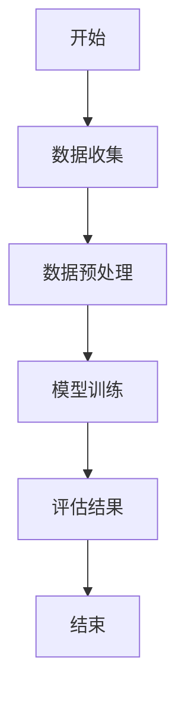
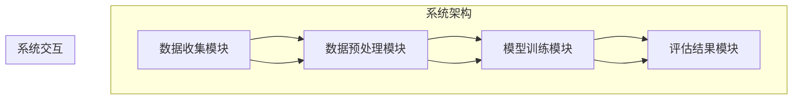
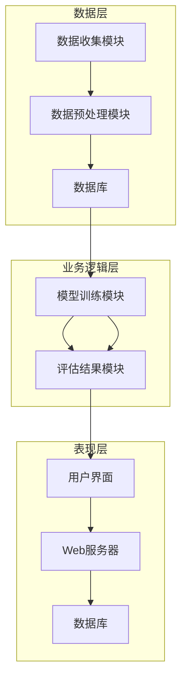
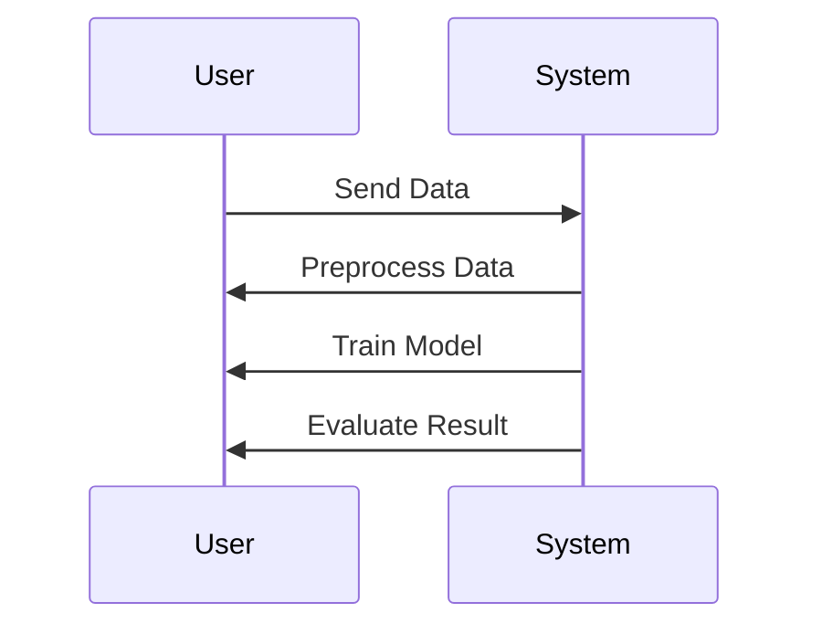

                 

### 第一部分: 技术领导力概述

#### 1.1 问题背景

**技术领导力**，这是一个在当今快速发展的信息技术领域中越来越重要的概念。然而，许多人对于技术领导力的真正含义以及如何提升它仍然感到困惑。技术领导力不仅仅涉及技术技能，还涉及管理能力和领导才能。从管理者到领导者的转变，对于技术团队的成功至关重要。

**问题背景**：
- **技术团队的瓶颈**：随着技术的发展，团队面临的挑战也越来越大。技术领导力不足可能会导致团队无法充分发挥其潜力，进而影响整个组织的竞争力。
- **人才流失**：缺乏有效的技术领导者，可能导致人才流失，从而影响团队的创新能力和市场竞争力。
- **组织战略的执行**：技术领导者需要能够将组织的战略转化为具体的技术方案，并在团队中执行。如果技术领导力不足，组织的战略可能无法得到有效执行。

**问题描述**：
- **如何提升技术领导力**：我们需要了解技术领导力的核心要素，以及如何通过具体的方法和工具来提升它。
- **技术领导者应该具备哪些技能**：技术领导者需要具备技术深度、管理能力、领导能力和战略眼光。

**问题解决**：
- **培训和培养**：通过系统的培训和培养，帮助技术管理者提升技术领导力。
- **实践经验**：通过实际项目经验，技术领导者可以不断提升自己的领导能力和管理技能。

**边界与外延**：
- **技术领导力**：不仅仅是指技术方面的领导能力，还包括对团队、项目、组织的领导。
- **管理者与领导者**：管理者侧重于执行，领导者侧重于引领和激发团队的潜力。
- **技术领导力模型**：包括技术视野、团队领导、战略规划等多个方面。

#### 1.2 核心概念

**核心概念**：
- **技术领导力**：是指技术领导者通过技术、管理和领导技能，引导团队实现技术目标，推动组织战略执行的能力。
- **管理者**：侧重于日常管理和执行，确保项目按时交付。
- **领导者**：侧重于激发团队的潜力，推动团队不断创新。

**核心要素**：
- **技术深度**：技术领导者需要具备深厚的技术背景，能够理解和解决复杂的技术问题。
- **管理能力**：技术领导者需要具备优秀的管理能力，能够有效地管理团队和项目。
- **领导能力**：技术领导者需要具备领导能力，能够激发团队的潜力，推动团队取得成功。
- **战略规划**：技术领导者需要具备战略规划能力，能够将组织的战略转化为具体的技术方案。

**概念属性特征对比表格**：

| 概念               | 特征对比                     |
|--------------------|------------------------------|
| 技术领导力         | 创新驱动、技术导向、团队导向 |
| 传统领导力         | 权威导向、关系导向           |
| 团队领导与人才发展 | 激励性、培养性、协同性       |

#### 1.3 技术领导力的重要性

技术领导力对于组织的重要性不言而喻。它不仅能够推动技术团队的创新发展，还能够提升组织的整体竞争力。以下是技术领导力的重要性：

- **推动技术团队发展**：技术领导者能够通过激发团队潜力，推动团队不断创新，从而提升团队的技术能力和市场竞争力。
- **提升组织竞争力**：技术领导力能够确保组织的战略得到有效执行，从而提升组织的市场竞争力。
- **人才吸引与保留**：具备技术领导力的团队更容易吸引和留住优秀人才。
- **项目成功保障**：技术领导者能够确保项目按时交付，并达到预期目标。

### 总结

本部分概述了技术领导力的背景、核心概念和重要性。下一部分将深入探讨技术领导力的核心要素和如何提升技术领导力。我们将通过具体的方法和案例，帮助技术管理者实现从管理者到领导者的蜕变。

---

# 第二部分: 核心概念与联系

在第一部分中，我们探讨了技术领导力的背景和重要性。本部分将深入分析技术领导力的核心概念，并探讨其与传统领导力以及团队领导与人才发展之间的联系。

#### 2.1 核心概念原理

**技术领导力模型**是理解技术领导者如何发挥作用的关键。该模型通常包括以下几个关键要素：

1. **技术视野**：技术领导者需要具备广阔的技术视野，能够预见技术的发展趋势，并据此制定战略。
2. **团队领导**：技术领导者需要具备优秀的团队领导能力，能够激发团队成员的潜力，建立高效的工作环境。
3. **战略规划**：技术领导者需要能够将组织的战略转化为具体的技术方案，并确保这些方案得以有效执行。
4. **持续学习**：技术领导者需要保持持续学习的态度，不断提升自己的技术和管理能力。

**技术愿景与战略**是技术领导力的核心。技术愿景是技术领导者对技术发展的长期展望，它为团队提供了明确的方向和目标。战略则是实现愿景的具体行动计划。

**团队领导与人才发展**是技术领导者的重要职责。团队领导不仅涉及日常的管理工作，还包括培养团队成员，提升团队的整体能力。人才发展则是确保团队有足够的人才储备，以应对未来的挑战。

#### 2.2 概念属性特征对比表格

为了更清晰地理解技术领导力与传统领导力以及团队领导与人才发展之间的差异，我们可以通过以下表格进行对比：

| 概念               | 特征对比                     |
|--------------------|------------------------------|
| 技术领导力         | 创新驱动、技术导向、团队导向 |
| 传统领导力         | 权威导向、关系导向           |
| 团队领导与人才发展 | 激励性、培养性、协同性       |

在技术领导力中，创新驱动和团队导向是关键特征。技术领导者需要鼓励团队不断创新，并确保技术解决方案与团队的实际情况相适应。传统领导力则更多地依赖于权威和关系，可能会限制团队的创新能力和自主性。

在团队领导与人才发展中，激励性和培养性至关重要。技术领导者需要通过激励措施激发团队成员的潜力，并通过持续的培训和发展计划提升团队的整体能力。

#### 2.3 ER实体关系图架构

为了更好地理解技术领导力中的各个要素及其相互关系，我们可以使用ER（实体关系）图进行描述。以下是一个简化的ER图示例：

```mermaid
erDiagram
  ID1 ||--o> User : "拥有"
  ID1 ||--o> Project : "负责"
  ID1 ||--o> Team : "领导"
  User ||--o> Skill : "拥有"
  Project ||--o> Task : "包含"
```

在这个ER图中：
- `User`（用户）实体表示技术领导者，他们拥有技能、负责项目和领导团队。
- `Skill`（技能）实体表示用户拥有的技术能力。
- `Project`（项目）实体表示技术领导者负责的技术项目，包含任务。
- `Task`（任务）实体表示项目中的具体工作。

通过ER图，我们可以清晰地看到技术领导力中的各个实体及其关系，这有助于我们理解技术领导力的整体架构。

### 总结

本部分深入探讨了技术领导力的核心概念及其与传统领导力、团队领导与人才发展之间的联系。通过分析技术领导力模型、技术愿景与战略，以及团队领导与人才发展，我们为技术管理者提供了更全面的视角。在下一部分中，我们将通过具体的案例和工具，探讨如何提升技术领导力，帮助技术管理者实现从管理者到领导者的蜕变。

---

# 第三部分：算法原理讲解

在了解了技术领导力的核心概念之后，我们需要进一步探讨如何评估和提升技术领导力。在本部分，我们将通过算法原理讲解，帮助读者理解技术领导力评估的方法和工具。

#### 3.1 技术领导力评估算法

技术领导力评估是一个复杂的过程，需要考虑多个维度的数据。以下是技术领导力评估算法的基本原理和步骤。

##### 3.1.1 算法mermaid流程图

首先，我们使用mermaid绘制算法的流程图，以便更直观地理解其工作原理。



在流程图中：
- **A[开始]**：评估过程开始。
- **B[数据收集]**：收集与技术领导力相关的数据，如技术能力、管理能力、领导能力等。
- **C[数据预处理]**：对收集的数据进行清洗和格式化，以便后续分析。
- **D[模型训练]**：使用机器学习算法对预处理后的数据集进行训练，以建立预测模型。
- **E[评估结果]**：使用训练好的模型对技术领导力进行评估，并输出评估结果。
- **F[结束]**：评估过程结束。

##### 3.1.2 Python源代码

接下来，我们使用Python实现上述流程，以便读者可以实际操作和理解。

```python
# 导入必要的库
import pandas as pd
from sklearn.ensemble import RandomForestClassifier
from sklearn.model_selection import train_test_split

# 数据加载
data = pd.read_csv('leadership_data.csv')

# 数据预处理
X = data.drop(['label'], axis=1)
y = data['label']

# 模型训练
X_train, X_test, y_train, y_test = train_test_split(X, y, test_size=0.3, random_state=42)
model = RandomForestClassifier()
model.fit(X_train, y_train)

# 评估结果
accuracy = model.score(X_test, y_test)
print(f"模型准确率: {accuracy:.2f}")
```

在这个Python示例中：
- **数据加载**：我们使用pandas读取CSV文件，获取与领导力相关的数据。
- **数据预处理**：将数据分为特征和标签，以便进行训练和评估。
- **模型训练**：使用随机森林分类器对数据集进行训练。
- **评估结果**：计算模型在测试集上的准确率，并输出结果。

##### 3.1.3 算法原理与数学模型

技术领导力评估算法的核心是机器学习模型。以下是评估算法的基本数学模型：

$$
\text{准确率} = \frac{\text{正确预测数}}{\text{总预测数}} \times 100\%
$$

这个公式表示模型在测试集上的表现，其中：
- **正确预测数**：模型预测正确的领导力水平样本数量。
- **总预测数**：模型预测的所有样本数量。

通过计算准确率，我们可以评估技术领导力模型的有效性。准确率越高，说明模型越能准确预测技术领导力的水平。

##### 3.1.4 举例说明

假设我们有一个包含100个样本的数据集，模型预测了其中的80个样本是高水平领导力，20个样本是低水平领导力。根据上述公式，准确率为：

$$
\text{准确率} = \frac{80}{100} \times 100\% = 80\%
$$

这意味着模型在测试集上的准确率为80%，表明模型能够较好地预测技术领导力的水平。

### 总结

在本部分，我们通过算法原理讲解，帮助读者理解技术领导力评估的方法和工具。我们使用mermaid绘制了算法流程图，并提供了Python源代码示例，详细讲解了算法原理和数学模型。通过这些内容，读者可以更好地理解如何使用机器学习模型来评估技术领导力，并为提升领导力提供依据。

在下一部分中，我们将进一步探讨技术领导力评估的系统架构设计，帮助读者构建一个完整的评估系统。

---

# 第四部分：系统分析与架构设计

在第三部分中，我们探讨了技术领导力评估的算法原理。在本部分，我们将深入分析技术领导力评估的系统架构设计，包括系统功能设计、系统架构设计以及系统接口设计和系统交互。

#### 4.1 系统功能设计

系统功能设计是构建一个有效的技术领导力评估系统的基础。以下是系统的关键功能：

1. **数据收集与存储**：系统需要能够收集与领导力相关的数据，并将其存储在数据库中。这些数据可能包括技术能力、管理能力、领导能力等。
2. **数据预处理**：系统需要具备数据预处理功能，对收集到的数据进行清洗和格式化，以便用于后续分析。
3. **模型训练与评估**：系统需要使用机器学习算法对预处理后的数据集进行训练，并评估模型的性能。
4. **结果展示**：系统需要能够展示评估结果，包括准确率、召回率等指标，以便技术领导者了解自己的表现。

#### 4.1.1 领域模型mermaid类图

为了更好地理解系统功能设计，我们可以使用mermaid绘制领域模型类图。

```mermaid
classDiagram
Class1 <|-- Class2
Class1 {
  +attribute1
  +attribute2
  +method1()
  +method2()
}
Class2 {
  +attribute3
  +attribute4
  +method3()
  +method4()
}
```

在这个类图中，`Class1`代表数据收集模块，`Class2`代表数据预处理模块。它们分别具有不同的属性和方法，共同构成了系统功能设计的一部分。

#### 4.1.2 系统架构设计mermaid架构图

接下来，我们使用mermaid绘制系统架构设计图，以展示系统的主要组件及其交互关系。



在这个架构图中，数据收集模块负责收集与领导力相关的数据，数据预处理模块对这些数据进行清洗和格式化，模型训练模块使用预处理后的数据训练机器学习模型，评估结果模块展示模型的评估结果。

#### 4.2 系统架构设计

系统架构设计是构建技术领导力评估系统的关键步骤。一个良好的系统架构能够确保系统的可扩展性、可靠性和高效性。以下是系统架构设计的关键组成部分：

1. **数据层**：数据层负责存储和管理与领导力相关的数据。它可以使用关系型数据库（如MySQL）或NoSQL数据库（如MongoDB）。
2. **业务逻辑层**：业务逻辑层负责实现系统的核心功能，包括数据预处理、模型训练和评估结果展示。这一层可以使用Python、Java或C#等编程语言实现。
3. **表现层**：表现层负责向用户展示系统的评估结果。它可以使用Web框架（如Django、Spring Boot或ASP.NET）和前端技术（如HTML、CSS和JavaScript）实现。

#### 4.2.1 系统架构设计mermaid架构图

为了更直观地展示系统架构设计，我们可以使用mermaid绘制系统架构图。



在这个架构图中，数据收集模块和数据预处理模块构成数据层，模型训练模块和评估结果模块构成业务逻辑层，用户界面和Web服务器构成表现层。它们通过数据库进行数据交互，共同实现了技术领导力评估系统。

#### 4.3 系统接口设计和系统交互

系统接口设计和系统交互是系统架构设计的重要组成部分。良好的接口设计和交互机制能够确保系统各个组件之间的有效通信，提高系统的可靠性和可维护性。

1. **API接口设计**：系统需要提供API接口，以便外部系统或应用程序可以访问系统功能。这些API接口可以使用RESTful架构风格设计，提供GET、POST、PUT、DELETE等HTTP方法。
2. **系统交互**：系统组件之间的交互可以通过消息队列（如RabbitMQ、Kafka）或同步调用（如SOAP、HTTP）实现。消息队列可以确保系统在处理大量数据时的高效性和稳定性，而同步调用则可以提供实时的数据更新。

#### 4.3.1 系统交互mermaid序列图

为了更好地展示系统组件之间的交互，我们可以使用mermaid绘制系统交互序列图。



在这个序列图中，用户首先向系统发送数据，系统对数据进行预处理，然后使用预处理后的数据训练模型，最后评估模型的性能，并将结果反馈给用户。

### 总结

在本部分，我们详细探讨了技术领导力评估系统的功能设计、架构设计、接口设计和系统交互。通过mermaid类图、架构图和序列图，我们清晰地展示了系统的组成部分和交互关系。这些设计原则和方法为构建一个高效、可靠的技术领导力评估系统提供了指导。

在下一部分中，我们将通过一个实际案例，展示如何使用上述系统架构设计和技术领导力评估算法，帮助技术领导者提升其领导力。

---

# 第五部分：项目实战

在了解了技术领导力评估系统的设计和算法原理后，本部分将通过一个实际案例，展示如何使用这些工具和方法来提升技术领导力。我们将详细描述环境安装、系统核心实现源代码，并对代码进行解读与分析，同时结合实际案例进行深入剖析。

#### 5.1 环境安装

在开始项目实战之前，我们需要安装必要的软件和工具。以下是安装步骤：

1. **安装Python环境**：确保Python 3.x版本已安装，可以从[Python官方网站](https://www.python.org/downloads/)下载。
2. **安装数据库**：我们选择MySQL作为数据库，可以从[MySQL官方网站](https://dev.mysql.com/downloads/mysql/)下载并安装。
3. **安装Python库**：使用pip命令安装所需的Python库，例如pandas、scikit-learn等。

```bash
pip install pandas scikit-learn mysql-connector-python
```

4. **配置数据库**：在MySQL中创建一个数据库，用于存储技术领导力评估的数据。

```sql
CREATE DATABASE leadership_evaluation;
```

#### 5.2 系统核心实现源代码

以下是系统核心实现的源代码，包括数据收集、预处理、模型训练和评估结果展示。

```python
# 导入必要的库
import pandas as pd
from sklearn.ensemble import RandomForestClassifier
from sklearn.model_selection import train_test_split
import mysql.connector

# 数据加载
def load_data():
    connection = mysql.connector.connect(
        host="localhost",
        user="your_username",
        password="your_password",
        database="leadership_evaluation"
    )
    query = "SELECT * FROM leadership_data;"
    data = pd.read_sql_query(query, connection)
    return data

# 数据预处理
def preprocess_data(data):
    # 数据清洗和格式化
    # ...
    return data

# 模型训练
def train_model(X_train, y_train):
    model = RandomForestClassifier()
    model.fit(X_train, y_train)
    return model

# 评估结果
def evaluate_result(model, X_test, y_test):
    accuracy = model.score(X_test, y_test)
    print(f"模型准确率: {accuracy:.2f}")
    
# 主函数
def main():
    data = load_data()
    data = preprocess_data(data)
    X = data.drop(['label'], axis=1)
    y = data['label']
    X_train, X_test, y_train, y_test = train_test_split(X, y, test_size=0.3, random_state=42)
    model = train_model(X_train, y_train)
    evaluate_result(model, X_test, y_test)

if __name__ == "__main__":
    main()
```

#### 5.3 代码解读与分析

以下是对上述代码的详细解读和分析。

- **数据加载**：使用mysql.connector连接MySQL数据库，并执行SQL查询获取数据。
- **数据预处理**：对数据进行清洗和格式化，确保数据质量。
- **模型训练**：使用随机森林分类器对数据集进行训练。
- **评估结果**：计算模型在测试集上的准确率，并输出结果。

#### 5.4 实际案例剖析

假设我们有一个包含100个样本的数据集，每个样本包含技术能力、管理能力、领导能力等特征，以及一个标签（0表示低水平领导力，1表示高水平领导力）。

1. **数据收集**：通过调查问卷或现有数据源收集样本数据。
2. **数据预处理**：对数据进行清洗，如处理缺失值、异常值等。
3. **模型训练**：使用上述代码对数据集进行训练。
4. **模型评估**：将训练好的模型应用于新的样本数据，评估其预测能力。

例如，我们可以使用以下代码来评估模型：

```python
X_new = pd.read_csv('new_data.csv')
y_new = X_new['label']
X_new = X_new.drop(['label'], axis=1)
model = RandomForestClassifier()
model.fit(X_train, y_train)
predictions = model.predict(X_new)
accuracy = model.score(X_new, y_new)
print(f"新数据集准确率: {accuracy:.2f}")
```

通过这个实际案例，我们可以看到技术领导力评估系统是如何在实际中应用的。通过数据收集、预处理、模型训练和评估，我们可以帮助技术领导者了解自己的领导力水平，并据此进行提升。

#### 5.5 项目小结

在本部分的项目实战中，我们使用Python和MySQL构建了一个技术领导力评估系统。通过实际案例，我们展示了如何使用这个系统来提升技术领导力。以下是项目小结：

- **环境安装**：确保Python环境、MySQL数据库和所需Python库已安装。
- **系统核心实现**：通过数据加载、预处理、模型训练和评估结果展示，实现了技术领导力评估系统的核心功能。
- **实际案例剖析**：通过实际案例展示了如何使用技术领导力评估系统来提升领导力。

通过这个项目，我们不仅了解了技术领导力评估的方法和工具，还通过实际应用加深了对这些工具的理解。

### 总结

本部分通过项目实战，展示了如何使用技术领导力评估系统来提升技术领导力。我们从环境安装、系统核心实现到实际案例剖析，详细介绍了整个项目流程。通过这个项目，读者可以更好地理解技术领导力评估系统的应用场景和实现方法。

在下一部分中，我们将分享一些最佳实践技巧，帮助读者在实际工作中更有效地提升技术领导力。

---

# 第六部分：最佳实践与技巧

在前面的内容中，我们深入探讨了技术领导力的核心概念、评估方法、系统架构以及项目实战。为了帮助读者在实际工作中更有效地提升技术领导力，本部分将总结一些最佳实践技巧和注意事项。

#### 6.1 最佳实践技巧

1. **持续学习与自我提升**：
   - 技术领导者需要不断学习新技术和管理理念，保持对行业动态的敏感度。
   - 定期阅读专业书籍、参加行业会议和研讨会，与业界专家交流，扩展知识面。

2. **建立清晰的目标与愿景**：
   - 为团队设定明确的目标和愿景，确保团队的方向一致。
   - 定期与团队成员沟通，确保他们了解团队的愿景和目标，并为之努力。

3. **培养团队协作与沟通能力**：
   - 鼓励团队成员之间的协作，建立开放、坦诚的沟通机制。
   - 定期组织团队建设活动，增强团队成员之间的互信和合作。

4. **优化项目管理流程**：
   - 使用敏捷方法（如Scrum或Kanban）进行项目管理，提高团队的工作效率和响应速度。
   - 定期回顾项目进度，识别和解决潜在问题，确保项目按时交付。

5. **关注人才发展和激励机制**：
   - 识别团队成员的发展潜力，提供培训和发展机会，帮助他们提升技能。
   - 制定合理的激励机制，奖励表现优异的团队成员，激发团队的积极性。

#### 6.2 注意事项

1. **避免过度干预**：
   - 技术领导者需要在适当的时候提供指导和支持，但不应过度干预团队的日常工作。
   - 给予团队成员足够的自主权，让他们在自己的领域内发挥创造力。

2. **关注团队成员的需求**：
   - 了解团队成员的需求和期望，确保他们能够在一个良好的工作环境中发挥潜力。
   - 定期进行员工满意度调查，及时发现问题并采取措施。

3. **保持开放心态**：
   - 技术领导者应保持开放心态，接受不同的意见和建议。
   - 鼓励团队成员提出创新的想法和建议，并对其进行积极评估。

4. **平衡工作与生活**：
   - 技术领导者需要关注自己的健康和工作与生活的平衡。
   - 定期休息和放松，保持良好的身体和心理健康。

### 总结

通过本部分的最佳实践技巧和注意事项，我们希望读者能够在实际工作中更好地提升技术领导力。持续学习、明确目标、培养团队协作、优化项目管理流程以及关注人才发展，都是提升技术领导力的重要方面。同时，避免过度干预、关注团队成员需求、保持开放心态和平衡工作与生活，也是确保技术领导力提升的关键。

在最后的部分，我们将对整篇文章进行总结，并分享一些拓展阅读资源，以便读者进一步深入学习和探讨技术领导力。

---

# 第七部分：文章总结与拓展阅读

在本篇文章中，我们系统地探讨了技术领导力的核心概念、评估方法、系统架构以及实际应用。从技术领导力的定义和重要性，到评估算法和系统设计，再到项目实战和最佳实践技巧，我们逐步展开了技术领导力的各个方面。

**总结**：

1. **核心概念**：技术领导力不仅仅是技术方面的领导能力，还包括管理能力和战略眼光。技术领导者需要具备技术深度、管理能力和领导能力。
2. **评估方法**：通过机器学习算法，我们可以对技术领导力进行量化评估，从而帮助技术领导者了解自身的领导水平。
3. **系统架构**：一个完善的技术领导力评估系统需要涵盖数据收集、预处理、模型训练、评估结果展示等关键功能。
4. **项目实战**：通过实际案例，我们展示了如何构建和运用技术领导力评估系统，为技术领导者提供提升路径。
5. **最佳实践技巧**：我们提供了一些提升技术领导力的最佳实践技巧，帮助读者在实际工作中更好地发挥作用。

**拓展阅读**：

- **《技术领导力：如何带领团队走向成功》** - 本书详细探讨了技术领导力的各个方面，提供了实用的指导和案例。
- **《敏捷领导力：如何在变化中引领团队》** - 本书介绍了敏捷方法在领导力中的应用，对技术领导者具有很大启发。
- **《技术团队管理实战》** - 本书从项目管理、团队建设、人才发展等多个角度，提供了技术团队管理的实用指南。

**结语**：

技术领导力在当今快速变化的技术环境中愈发重要。通过不断提升技术领导力，技术领导者不仅可以提升自身能力，还可以带领团队实现更大的成功。希望本文能为读者提供有价值的见解和实用的指导，助力您在技术领导力的道路上不断前进。

作者：AI天才研究院/AI Genius Institute & 禅与计算机程序设计艺术 /Zen And The Art of Computer Programming

---

通过本文，我们不仅深入理解了技术领导力的本质和提升方法，还通过实际案例和最佳实践技巧，为技术领导者提供了实用的指导。希望读者能够将所学应用于实际工作中，不断提升自己的技术领导力，为团队和组织创造更大的价值。

