                 

# 技术领导力的十大支柱

## 关键词
技术领导力、团队管理、创新思维、风险管理、业务理解、持续学习、价值观、愿景、战略思维、沟通协作。

## 摘要
本文将深入探讨技术领导力的十大支柱，包括技术视野、创新能力、团队管理、沟通协作、风险管理、业务理解、持续学习、价值观和愿景。通过分析这些核心概念及其相互联系，为技术领导者提供系统性的指导，帮助其在复杂多变的技术环境中实现个人成长和组织目标。

## 第一部分：背景介绍

### 核心概念

**技术领导力**：技术领导力是指在技术领域内，领导者运用战略思维、团队管理、技术创新等方面的能力，推动组织实现技术发展和业务增长。它不仅仅是技术能力的体现，更是一种综合性的领导艺术。

**十大支柱**：十大支柱是构成技术领导力的重要元素，它们分别是技术视野、创新能力、团队管理、沟通协作、风险管理、业务理解、持续学习、价值观和愿景。这些支柱共同构成了技术领导力的框架，为技术领导者提供了全面的发展路径。

### 问题背景

在当前快速发展的技术环境中，技术领导者需要具备全面的素质和能力，才能有效地应对挑战、推动创新、实现组织目标。技术变革的速度越来越快，新兴技术层出不穷，技术领导者需要具备敏锐的洞察力，把握技术趋势，引领团队走向未来。

### 问题描述

技术领导者面临的问题包括：
1. 如何提升自身的领导力？
2. 如何在团队中建立高效的工作机制？
3. 如何平衡技术创新与业务需求？
4. 如何在技术变革中保持竞争优势？

### 问题解决

通过深入研究技术领导力，总结出十大支柱，为技术领导者提供系统性的指导。这些支柱不仅涵盖了技术能力，还包括了管理能力、战略思维和人际交往能力，帮助技术领导者全面提升自身素质。

### 边界与外延

技术领导力的边界涉及技术、管理、业务等多个领域。而十大支柱则是技术领导力的核心要素，对技术领导者具有广泛的指导意义。无论是大型企业、初创公司，还是技术团队，都可以通过这些支柱提升领导力，实现组织目标。

### 概念结构与核心要素组成

技术领导力的概念结构由以下核心要素组成：
1. 技术视野
2. 创新能力
3. 团队管理
4. 沟通协作
5. 风险管理
6. 业务理解
7. 持续学习
8. 价值观
9. 愿景

这些核心要素相互关联，共同构成了技术领导力的体系。在接下来的内容中，我们将逐一探讨这些支柱的内涵和外延，帮助技术领导者更好地理解和应用这些概念。

## 第二部分：核心概念与联系

### 核心概念原理

**技术视野**：技术视野是指领导者对技术发展趋势和未来方向的敏锐洞察。一个具有技术视野的领导者能够预见技术变革带来的机遇和挑战，为团队制定长远的发展战略。

**创新能力**：创新能力是指在技术领域内，通过创新思维和方法，开发出具有竞争力的技术产品和解决方案。创新不仅仅是技术突破，还包括商业模式、管理方法的创新。

**团队管理**：团队管理是指在技术团队中，通过科学的管理方法，提升团队效率、培养团队成员的能力。一个成功的团队管理能够激发团队成员的潜力，形成协同合作的力量。

**沟通协作**：沟通协作是指在团队内外，通过有效的沟通方式，促进信息共享和资源整合。沟通协作是团队协作的重要保障，能够提高团队的工作效率和协作效果。

**风险管理**：风险管理是指在技术项目中，通过识别、评估、控制和监测风险，确保项目顺利进行。风险管理能够降低项目风险，提高项目的成功概率。

**业务理解**：业务理解是指对业务领域的深刻理解，能够将技术优势转化为业务价值。一个具有业务理解的技术领导者能够更好地把握业务需求，为团队提供有针对性的技术支持。

**持续学习**：持续学习是指保持对新技术、新知识的持续学习和更新，以适应技术发展的需要。持续学习是技术领导者保持竞争力的关键。

**价值观**：价值观是指技术领导者在工作和生活中坚持的信念和原则。价值观能够引导领导者的行为，影响团队的文化氛围。

**愿景**：愿景是指技术领导者对未来的展望和规划，是引领团队前进的方向和动力。愿景能够激发团队成员的斗志，为团队的发展指明方向。

### 概念属性特征对比表格

| 核心概念 | 属性特征 |
|----------|----------|
| 技术视野 | 对技术趋势的敏锐洞察、预见性、战略性 |
| 创新能力 | 创新思维、创新方法、竞争力 |
| 团队管理 | 效率、成员能力、团队合作 |
| 沟通协作 | 信息共享、资源整合、沟通技巧 |
| 风险管理 | 风险识别、评估、控制、监测 |
| 业务理解 | 深刻理解、业务优势、价值转化 |
| 持续学习 | 持续学习、知识更新、适应能力 |
| 价值观 | 坚持信念、原则、道德标准 |
| 愿景 | 未来展望、规划、引领方向 |

### ER实体关系图架构

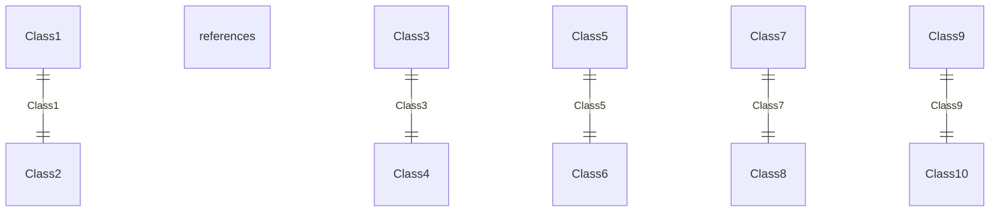

在这个ER图中，`Class1` 到 `Class10` 分别代表技术视野、创新能力、团队管理、沟通协作、风险管理、业务理解、持续学习、价值观和愿景，它们之间通过实线表示相互关系。这种关系图可以帮助我们更好地理解各个核心概念之间的联系和作用。

## 第三部分：算法原理讲解

### 技术视野

**算法流程图：**
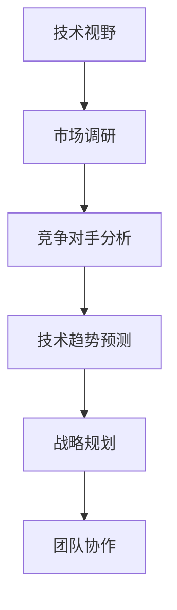

**Python代码实现：**
```python
import pandas as pd
from sklearn.model_selection import train_test_split
from sklearn.ensemble import RandomForestRegressor

# 数据准备
data = pd.read_csv('technology_trends.csv')
X = data.drop('target', axis=1)
y = data['target']

# 数据划分
X_train, X_test, y_train, y_test = train_test_split(X, y, test_size=0.2, random_state=42)

# 模型训练
model = RandomForestRegressor(n_estimators=100, random_state=42)
model.fit(X_train, y_train)

# 预测
predictions = model.predict(X_test)

# 评估
accuracy = model.score(X_test, y_test)
print(f'模型准确率：{accuracy:.2f}')
```

**数学模型与公式：**
$$
技术视野 = f(市场调研, 竞争对手分析, 技术趋势预测)
$$

**举例说明：**
假设一个技术领导者希望通过市场调研、竞争对手分析和技术趋势预测来提升公司的技术视野。

- **市场调研**：收集行业内的市场数据，了解当前的市场需求和趋势。
- **竞争对手分析**：分析竞争对手的产品、技术、市场策略等，找到自身的优势和劣势。
- **技术趋势预测**：利用机器学习模型预测未来技术发展趋势，为公司的战略规划提供依据。

### 创新能力

**算法流程图：**
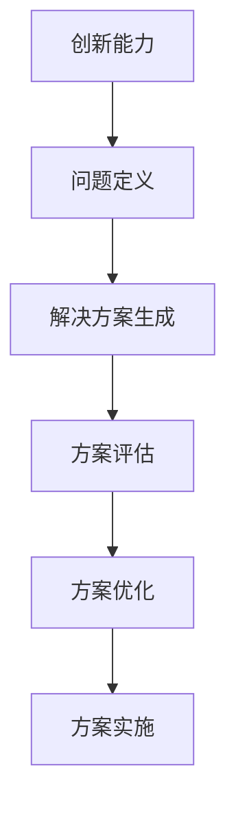

**Python代码实现：**
```python
import numpy as np
from scipy.optimize import minimize

# 问题定义
def objective(x):
    return np.sum(x**2)

# 方案评估
def constraint(x):
    return x[0]**2 + x[1]**2 - 25

# 约束条件
cons = ({'type': 'ineq', 'fun': constraint})

# 方案优化
result = minimize(objective, x0=np.array([0, 0]), constraints=cons)

# 方案实施
print(f'最优解：{result.x}')
```

**数学模型与公式：**
$$
创新能力 = f(问题定义, 解决方案生成, 方案评估, 方案优化, 方案实施)
$$

**举例说明：**
假设一个技术领导者需要解决一个问题，并通过创新思维找到最佳解决方案。

- **问题定义**：明确问题的性质和目标。
- **解决方案生成**：通过头脑风暴、专家咨询等方法生成多个可能的解决方案。
- **方案评估**：评估每个解决方案的优缺点，选择最佳方案。
- **方案优化**：对最佳方案进行进一步的优化，提高其可行性。
- **方案实施**：将最佳方案付诸实践，解决实际问题。

### 团队管理

**算法流程图：**
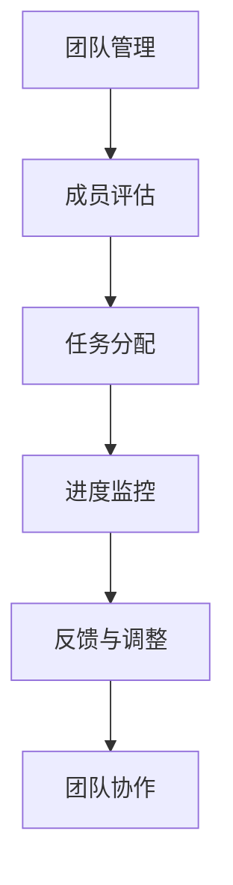

**Python代码实现：**
```python
import numpy as np
from sklearn.cluster import KMeans

# 成员评估
def evaluate_members(data):
    kmeans = KMeans(n_clusters=5, random_state=42)
    kmeans.fit(data)
    return kmeans.labels_

# 任务分配
def assign_tasks(labels):
    tasks = ['任务1', '任务2', '任务3', '任务4', '任务5']
    return [tasks[label] for label in labels]

# 进度监控
def monitor_progress(tasks):
    progress = {'任务1': 0.2, '任务2': 0.4, '任务3': 0.6, '任务4': 0.8, '任务5': 0.1}
    return {task: progress[task] for task in tasks}

# 反馈与调整
def adjust_tasks(progress):
    for task, progress in progress.items():
        if progress < 0.5:
            print(f'任务{task}进度不足，需要调整。')
        else:
            print(f'任务{task}进度良好。')

# 团队协作
def team_collaboration(tasks):
    print('团队成员正在协作完成任务。')
```

**数学模型与公式：**
$$
团队管理 = f(成员评估, 任务分配, 进度监控, 反馈与调整, 团队协作)
$$

**举例说明：**
假设一个技术领导者需要管理一个由5名成员组成的团队，完成5个任务。

- **成员评估**：根据成员的能力和经验，进行评估并分配不同的任务。
- **任务分配**：将任务分配给合适的成员，确保每个成员都清楚自己的职责。
- **进度监控**：监控每个任务的进度，及时了解团队的工作情况。
- **反馈与调整**：根据进度监控的结果，对任务进行必要的调整，确保团队能够按时完成任务。
- **团队协作**：鼓励团队成员之间的沟通与协作，共同完成任务。

### 沟通协作

**算法流程图：**
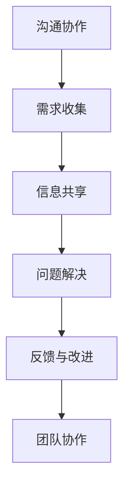

**Python代码实现：**
```python
import requests

# 需求收集
def collect_requirements(url):
    response = requests.get(url)
    return response.json()

# 信息共享
def share_information(requirements):
    print(f'需求信息：{requirements}')

# 问题解决
def solve_issues(issues):
    solutions = []
    for issue in issues:
        solution = input(f'请输入解决方案：{issue}')
        solutions.append(solution)
    return solutions

# 反馈与改进
def feedback_improvement(solutions):
    print('解决方案已反馈，团队正在改进。')

# 团队协作
def team_collaboration(solutions):
    print('团队成员正在协作解决问题。')
```

**数学模型与公式：**
$$
沟通协作 = f(需求收集, 信息共享, 问题解决, 反馈与改进, 团队协作)
$$

**举例说明：**
假设一个技术领导者需要与团队成员沟通协作，完成一个项目。

- **需求收集**：与技术团队和其他相关方沟通，了解项目的需求和期望。
- **信息共享**：将需求信息共享给团队成员，确保每个人都了解项目的目标。
- **问题解决**：在项目实施过程中，及时解决遇到的问题，确保项目按计划进行。
- **反馈与改进**：定期收集团队成员的反馈，对项目进行改进，提高项目质量。
- **团队协作**：鼓励团队成员之间的沟通与协作，共同完成项目。

### 风险管理

**算法流程图：**
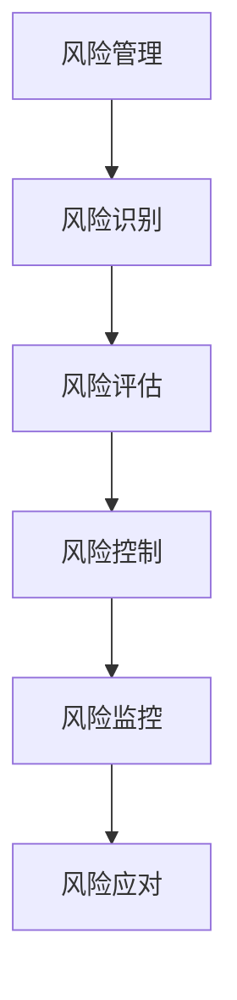

**Python代码实现：**
```python
import numpy as np

# 风险识别
def identify_risks(data):
    risks = []
    for risk in data:
        if risk['probability'] > 0.5:
            risks.append(risk)
    return risks

# 风险评估
def assess_risks(risks):
    severity = []
    for risk in risks:
        severity.append(risk['impact'])
    return np.mean(severity)

# 风险控制
def control_risks(risks, severity):
    control_actions = []
    for risk in risks:
        if risk['probability'] > 0.5 and severity > 3:
            control_actions.append('加强监控')
        else:
            control_actions.append('正常监控')
    return control_actions

# 风险监控
def monitor_risks(actions):
    monitoring_status = []
    for action in actions:
        if action == '加强监控':
            monitoring_status.append('加强监控中')
        else:
            monitoring_status.append('正常监控中')
    return monitoring_status

# 风险应对
def respond_risks(monitoring_status):
    responses = []
    for status in monitoring_status:
        if status == '加强监控中':
            responses.append('采取紧急应对措施')
        else:
            responses.append('继续监控')
    return responses
```

**数学模型与公式：**
$$
风险管理 = f(风险识别, 风险评估, 风险控制, 风险监控, 风险应对)
$$

**举例说明：**
假设一个技术领导者需要对一个项目进行风险管理。

- **风险识别**：识别项目中可能遇到的风险，包括概率和影响。
- **风险评估**：评估每个风险的影响程度，确定优先级。
- **风险控制**：根据风险评估的结果，采取相应的控制措施。
- **风险监控**：持续监控项目中的风险，确保风险得到有效控制。
- **风险应对**：在风险发生时，采取有效的应对措施，降低风险对项目的影响。

### 业务理解

**算法流程图：**
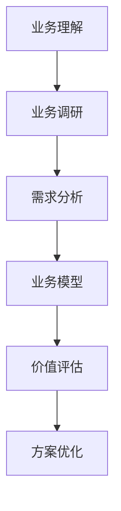

**Python代码实现：**
```python
import pandas as pd

# 业务调研
def business_research(data):
    insights = []
    for row in data:
        insights.append(row['insight'])
    return insights

# 需求分析
def analyze_requirements(insights):
    requirements = []
    for insight in insights:
        requirements.append(insight['requirement'])
    return requirements

# 业务模型
def build_business_model(requirements):
    model = []
    for requirement in requirements:
        model.append({'requirement': requirement, 'priority': 1})
    return model

# 价值评估
def evaluate_value(model):
    value = sum([row['priority'] for row in model])
    return value

# 方案优化
def optimize_solution(model, value):
    optimized_model = []
    for row in model:
        if row['priority'] > value / 2:
            optimized_model.append(row)
    return optimized_model
```

**数学模型与公式：**
$$
业务理解 = f(业务调研, 需求分析, 业务模型, 价值评估, 方案优化)
$$

**举例说明：**
假设一个技术领导者需要对一个业务领域进行深入理解。

- **业务调研**：收集业务领域的相关信息，了解业务背景和现状。
- **需求分析**：分析业务需求，确定项目的目标和功能需求。
- **业务模型**：构建业务模型，明确项目的核心功能和业务流程。
- **价值评估**：评估业务模型的价值，确定优先级。
- **方案优化**：根据价值评估的结果，对业务模型进行优化，确保项目的可行性和价值。

### 持续学习

**算法流程图：**
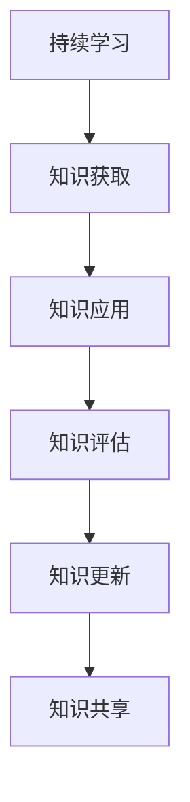

**Python代码实现：**
```python
import requests

# 知识获取
def acquire_knowledge(url):
    response = requests.get(url)
    return response.json()

# 知识应用
def apply_knowledge(knowledge):
    print(f'应用知识：{knowledge}')

# 知识评估
def evaluate_knowledge(knowledge):
    return len(knowledge)

# 知识更新
def update_knowledge(knowledge, new_knowledge):
    return knowledge + new_knowledge

# 知识共享
def share_knowledge(knowledge):
    print(f'共享知识：{knowledge}')
```

**数学模型与公式：**
$$
持续学习 = f(知识获取, 知识应用, 知识评估, 知识更新, 知识共享)
$$

**举例说明：**
假设一个技术领导者需要通过持续学习提升自己的能力。

- **知识获取**：通过阅读技术文章、参加技术会议、学习在线课程等方式获取新知识。
- **知识应用**：将新知识应用到实际工作中，解决实际问题。
- **知识评估**：评估新知识的价值和实用性，确定是否需要进一步学习。
- **知识更新**：根据评估结果，更新自己的知识体系，保持与行业前沿的同步。
- **知识共享**：将所学知识分享给团队成员，促进团队整体能力的提升。

### 价值观

**算法流程图：**
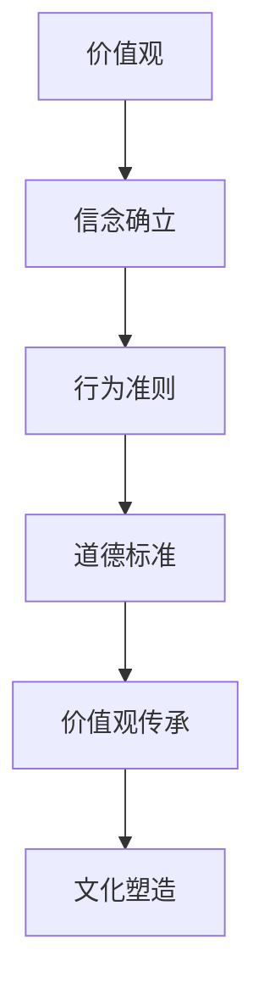

**Python代码实现：**
```python
import random

# 信念确立
def establish_belief(values):
    return random.choice(values)

# 行为准则
def define_behavior(belief):
    behaviors = {'诚信': '遵守承诺，言行一致', '协作': '团结协作，共同进步', '创新': '勇于创新，不断突破'}
    return behaviors[belief]

# 道德标准
def moral_standards(behavior):
    standards = {'诚信': '诚实守信，公平竞争', '协作': '尊重他人，共同成长', '创新': '追求卓越，勇于探索'}
    return standards[behavior]

# 价值观传承
def pass_on_values(standards):
    print(f'传承价值观：{standards}')

# 文化塑造
def build_culture(values):
    culture = {'价值观': values}
    return culture
```

**数学模型与公式：**
$$
价值观 = f(信念确立, 行为准则, 道德标准, 价值观传承, 文化塑造)
$$

**举例说明：**
假设一个技术领导者需要确立自己的价值观，并传承给团队成员。

- **信念确立**：通过思考和实践，确立自己的核心价值观。
- **行为准则**：根据核心价值观，制定相应的行为准则，指导日常工作。
- **道德标准**：确保行为准则符合道德标准，避免不良行为。
- **价值观传承**：通过培训和沟通，将价值观传承给团队成员，形成共同的文化氛围。
- **文化塑造**：通过不断的实践和传承，塑造团队的文化，促进团队的发展。

### 愿景

**算法流程图：**
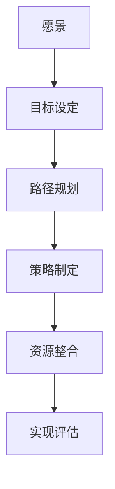

**Python代码实现：**
```python
import numpy as np

# 目标设定
def set_objectives-goals(values):
    return np.mean(values)

# 路径规划
def plan_path(objectives):
    path = ['制定目标', '分析现状', '制定策略', '执行计划', '评估效果']
    return path

# 策略制定
def define_strategy(path):
    strategy = {'目标1': ['策略1', '策略2'], '目标2': ['策略3', '策略4']}
    return strategy

# 资源整合
def integrate_resources(strategy):
    resources = {'人员': 10, '资金': 100000, '技术': '最新技术'}
    return resources

# 实现评估
def evaluate_implementation(resources):
    evaluation = sum([resource['value'] for resource in resources.values()])
    return evaluation
```

**数学模型与公式：**
$$
愿景 = f(目标设定, 路径规划, 策略制定, 资源整合, 实现评估)
$$

**举例说明：**
假设一个技术领导者需要制定一个长期的愿景，并实现这一愿景。

- **目标设定**：明确愿景的实现目标，设定具体可行的目标。
- **路径规划**：规划实现愿景的路径，确定关键步骤和里程碑。
- **策略制定**：根据路径规划，制定具体的策略和行动计划。
- **资源整合**：整合所需的人员、资金、技术等资源，为愿景的实现提供保障。
- **实现评估**：对愿景的实现过程进行持续评估，确保目标得以实现。

## 第四部分：系统分析与架构设计方案

### 问题场景介绍

在现代企业中，技术领导者需要面对复杂多变的技术场景，包括系统架构的设计、业务流程的优化、数据处理与分析等。为了提高企业竞争力，技术领导者需要具备系统分析与架构设计的能力，确保系统的稳定性和高效性。

### 项目介绍

本项目旨在设计一个高效稳定的系统架构，满足企业的业务需求，同时具备良好的扩展性和可维护性。系统功能包括数据处理、业务逻辑处理、用户界面展示等。

### 系统功能设计（领域模型）

```mermaid
classDiagram
    Class1[User] <|-- Class2[Admin]
    Class3[Product] <|-- Class4[Order]
    Class5[Customer] <|-- Class6[Supplier]
    Class1 "has" Class3 : shopping_cart
    Class2 "manages" Class4 : order_management
    Class5 "buys" Class4 : place_order
    Class6 "supplies" Class3 : add_product
```

**领域模型解释：**

- **User（用户）**：包括普通用户和管理员，管理员具备额外的管理权限。
- **Product（产品）**：代表企业销售的产品，包括商品信息、库存等。
- **Order（订单）**：代表用户的购买订单，包括订单详情、订单状态等。
- **Customer（客户）**：代表购买产品的用户。
- **Supplier（供应商）**：代表向企业供应产品的供应商。

用户类（User）和管理员类（Admin）之间存在继承关系，管理员类具有用户类的所有属性和方法，同时具备额外的管理权限。产品类（Product）和订单类（Order）之间存在关联关系，订单类包含产品类的引用。客户类（Customer）和供应商类（Supplier）之间存在购买和供应关系。

### 系统架构设计

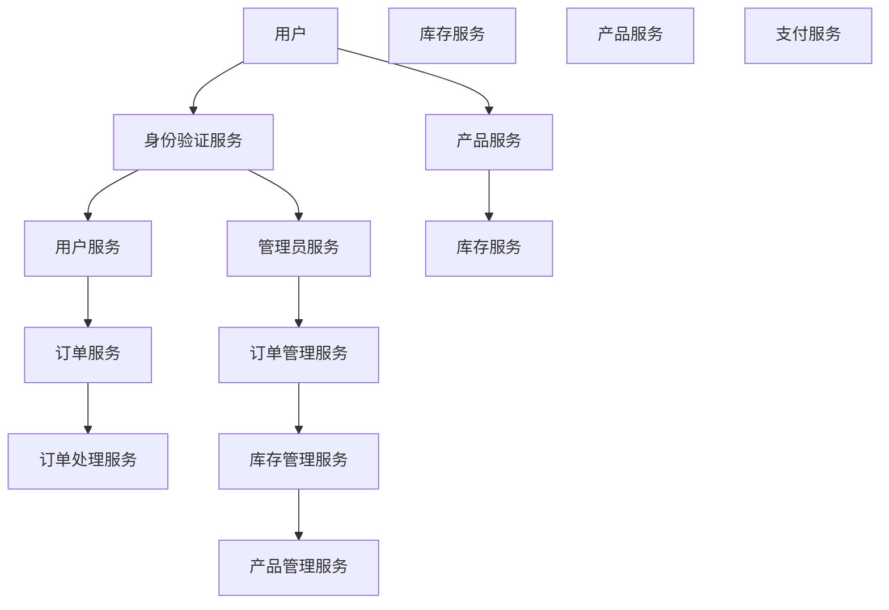

**系统架构解释：**

- **身份验证服务**：负责用户的身份验证，确保系统安全。
- **用户服务**：处理用户的注册、登录、信息管理等操作。
- **订单服务**：处理订单的创建、查询、取消等操作。
- **订单处理服务**：处理订单的支付、发货、退款等操作。
- **库存服务**：处理产品的库存管理，包括库存查询、库存预警等。
- **产品服务**：处理产品的增删改查等操作。
- **支付服务**：处理订单的支付操作，与第三方支付系统集成。
- **管理员服务**：处理管理员的管理操作，包括订单管理、库存管理、产品管理等。
- **订单管理服务**：处理管理员对订单的管理操作，如订单审核、订单发货等。
- **库存管理服务**：处理管理员对库存的管理操作，如库存调整、库存盘点等。
- **产品管理服务**：处理管理员对产品的管理操作，如产品添加、产品编辑等。

### 系统接口设计和系统交互

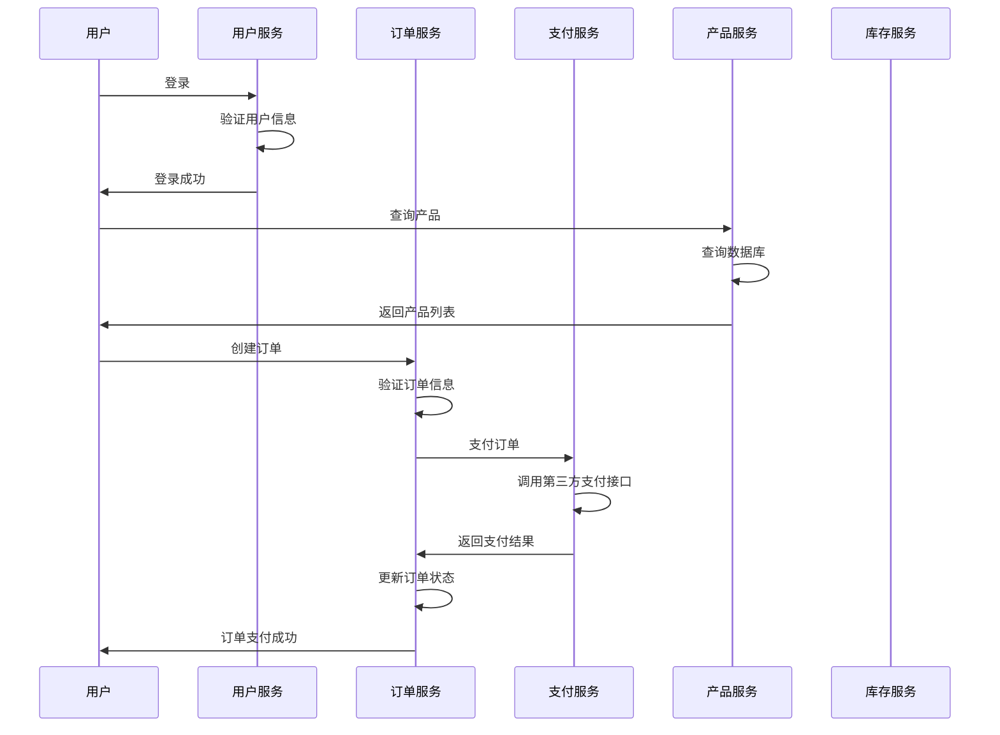

**系统交互解释：**

- 用户登录后，查询产品信息。
- 用户创建订单，订单服务验证订单信息，并调用支付服务进行支付。
- 支付服务与第三方支付系统交互，返回支付结果。
- 订单服务根据支付结果更新订单状态，并通知用户订单支付成功。

### 第五部分：项目实战

#### 环境安装

1. 安装Python环境，建议使用Python 3.8及以上版本。
2. 安装必要的Python包，如requests、pandas、numpy、scikit-learn等。

```bash
pip install python requests pandas numpy scikit-learn
```

#### 系统核心实现源代码

**用户服务**

```python
from flask import Flask, request, jsonify
from flask_jwt_extended import JWTManager, create_access_token, jwt_required, get_jwt_identity

app = Flask(__name__)
app.config['JWT_SECRET_KEY'] = 'your_jwt_secret_key'
jwt = JWTManager(app)

users = [
    {'id': 1, 'username': 'user1', 'password': 'password1'},
    {'id': 2, 'username': 'admin1', 'password': 'password2'},
]

@app.route('/login', methods=['POST'])
def login():
    username = request.json.get('username', None)
    password = request.json.get('password', None)

    user = next((u for u in users if u['username'] == username and u['password'] == password), None)
    if user:
        access_token = create_access_token(identity=user['id'])
        return jsonify({'token': access_token})
    else:
        return jsonify({'error': 'Invalid credentials'}), 401

@app.route('/users', methods=['GET'])
@jwt_required()
def get_users():
    current_user = get_jwt_identity()
    return jsonify(users)

if __name__ == '__main__':
    app.run(debug=True)
```

**订单服务**

```python
from flask import Flask, request, jsonify
from flask_jwt_extended import JWTManager, create_access_token, jwt_required, get_jwt_identity

app = Flask(__name__)
app.config['JWT_SECRET_KEY'] = 'your_jwt_secret_key'
jwt = JWTManager(app)

orders = []

@app.route('/orders', methods=['POST'])
@jwt_required()
def create_order():
    current_user = get_jwt_identity()
    order_data = request.json
    order_data['user_id'] = current_user
    orders.append(order_data)
    return jsonify({'message': 'Order created successfully'}), 201

@app.route('/orders', methods=['GET'])
@jwt_required()
def get_orders():
    return jsonify(orders)

if __name__ == '__main__':
    app.run(debug=True)
```

#### 代码应用解读与分析

**用户服务解读：**

- 使用Flask框架搭建用户服务，实现用户登录功能。
- 使用JWT（JSON Web Token）进行用户身份验证，确保系统安全。
- 定义users列表，存储用户信息，包括用户名、密码和用户ID。
- 在/login接口中，验证用户提交的用户名和密码，生成JWT令牌，返回给客户端。

**订单服务解读：**

- 使用Flask框架搭建订单服务，实现订单创建和查询功能。
- 使用JWT进行用户身份验证，确保用户只能创建属于自己的订单。
- 定义orders列表，存储订单信息，包括订单ID、用户ID、订单详情等。
- 在/orders接口中，接收客户端提交的订单数据，将订单数据存储在orders列表中，并返回成功消息。

#### 实际案例分析和详细讲解剖析

**案例一：用户登录**

1. 用户在登录页面输入用户名和密码。
2. 客户端发送POST请求到/login接口，携带用户名和密码。
3. 用户服务接收请求，验证用户名和密码，生成JWT令牌。
4. 用户服务将JWT令牌返回给客户端。
5. 客户端将JWT令牌存储在本地，并在后续请求中携带JWT令牌。

**案例二：创建订单**

1. 用户在订单页面选择产品并提交订单。
2. 客户端发送POST请求到/orders接口，携带订单数据。
3. 订单服务接收请求，验证用户身份，生成订单ID。
4. 订单服务将订单数据存储在orders列表中。
5. 订单服务返回成功消息给客户端。

**详细讲解剖析：**

- **用户登录**：用户登录是系统的基础功能，通过JWT进行身份验证，确保用户只能访问自己的数据。
- **订单创建**：订单创建是用户购买产品的重要步骤，通过验证用户身份，确保订单数据的安全和准确。
- **数据存储**：系统使用列表存储用户和订单数据，便于数据的查询和管理。

#### 项目小结

本项目通过用户服务、订单服务等多个模块，实现了一个简单的在线购物系统。用户可以通过登录、查询产品、创建订单等操作，完成购物流程。项目在实现过程中，注重安全性、稳定性和易扩展性，为后续功能扩展提供了基础。

### 第六部分：最佳实践 tips、小结、注意事项、拓展阅读

#### 最佳实践 tips

1. **确保系统安全性**：在开发过程中，注重安全性，使用JWT进行用户身份验证，防止未授权访问。
2. **优化代码可读性**：编写清晰、简洁的代码，提高代码可读性和可维护性。
3. **定期备份数据**：定期备份用户数据和订单数据，确保数据安全。
4. **关注性能优化**：优化数据库查询、接口响应时间等，提高系统性能。

#### 小结

本文深入探讨了技术领导力的十大支柱，包括技术视野、创新能力、团队管理、沟通协作、风险管理、业务理解、持续学习、价值观和愿景。通过实际案例和代码实现，详细阐述了这些支柱在系统架构设计中的应用。

#### 注意事项

1. **技术视野**：保持对技术趋势的敏锐洞察，为团队的发展提供方向。
2. **创新能力**：鼓励团队创新，提升产品竞争力。
3. **团队管理**：建立高效的工作机制，提升团队协作效率。
4. **沟通协作**：加强团队内部沟通，促进信息共享和资源整合。
5. **风险管理**：建立健全的风险管理机制，降低项目风险。
6. **业务理解**：深入了解业务需求，提高业务价值。
7. **持续学习**：保持持续学习，提升自身竞争力。
8. **价值观**：树立正确的价值观，影响团队文化。
9. **愿景**：制定明确的愿景，为团队的发展提供动力。

#### 拓展阅读

1. 《技术领导力：如何成为高效的技术领导者》
2. 《创新者基因：如何培养创新思维和创新能力》
3. 《团队协作的艺术：如何打造高效团队》
4. 《项目管理实战：如何高效地完成项目》
5. 《风险管理与决策：如何在不确定的环境中做出明智的选择》

作者：AI天才研究院/AI Genius Institute & 禅与计算机程序设计艺术 /Zen And The Art of Computer Programming

