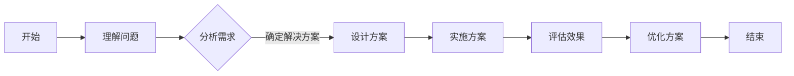
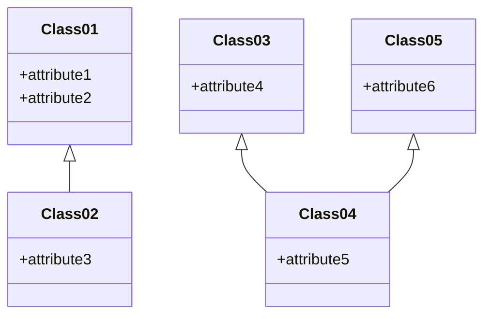
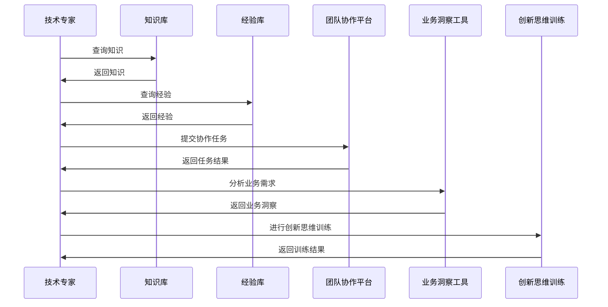
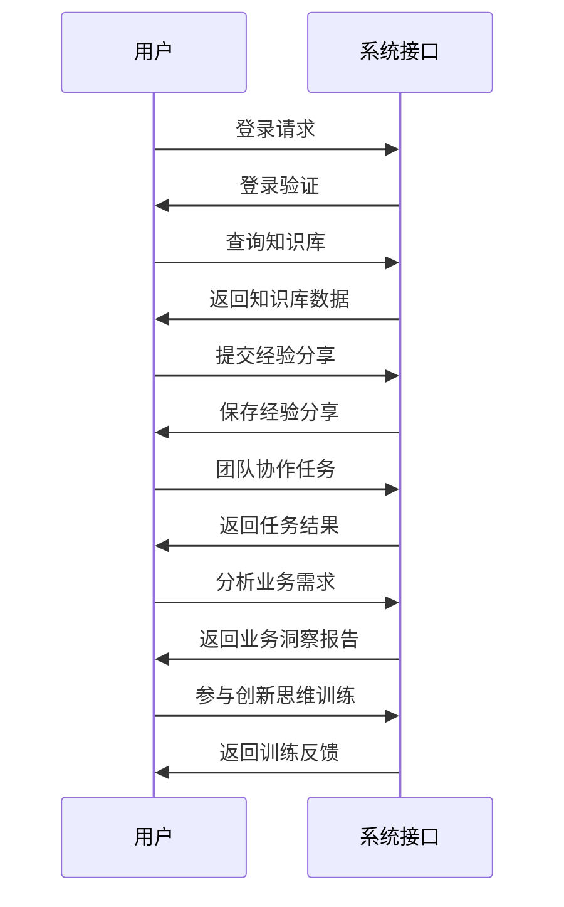
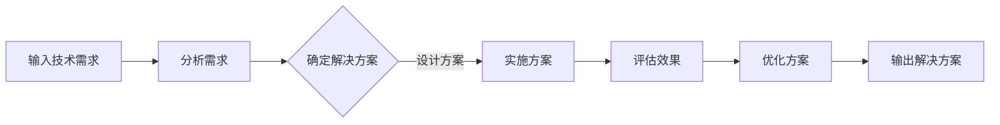
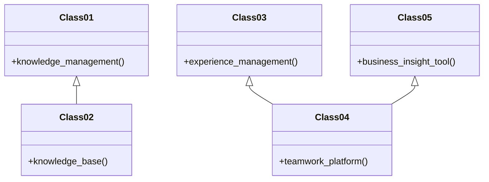
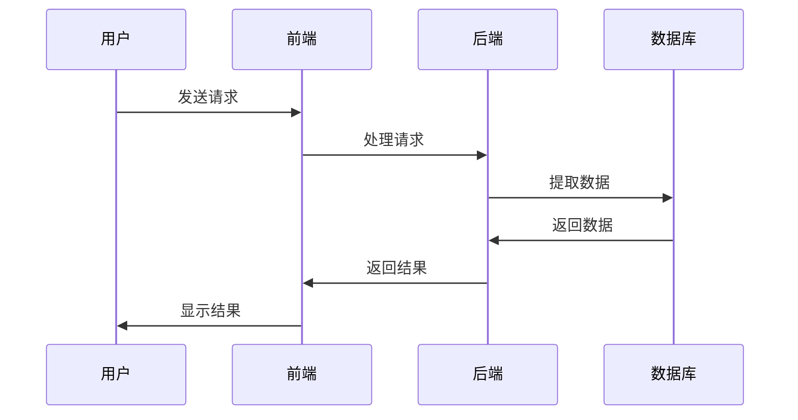
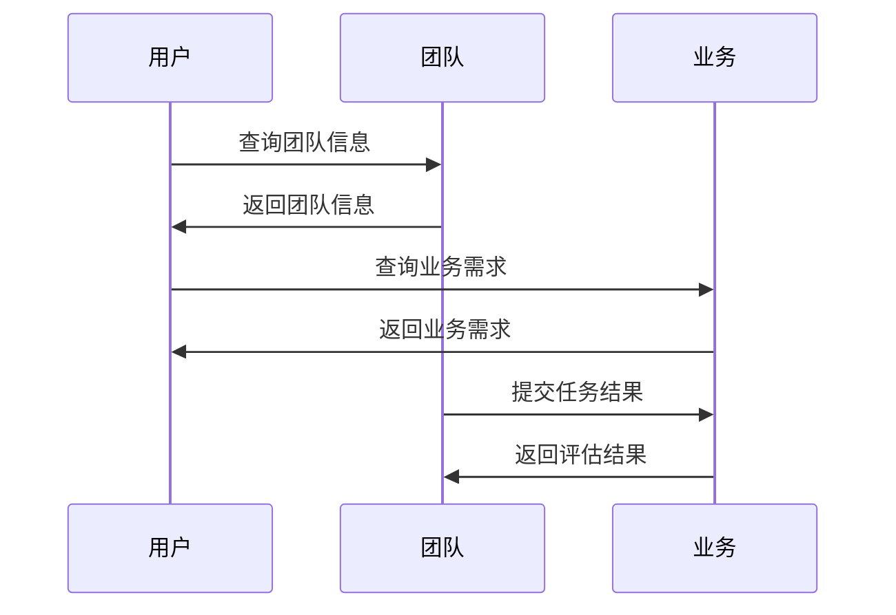

                 

# 技术领导力的培养

## 关键词
技术领导力，团队协作，业务洞察，创新思维，持续学习

## 摘要
本文将深入探讨技术领导力的培养问题。在当前科技迅速发展的时代，技术领导力已经成为企业竞争中至关重要的一环。本文从背景介绍、核心概念与联系、算法原理讲解、系统分析与架构设计方案、项目实战以及最佳实践等方面，详细阐述了技术领导力的培养方法和途径，旨在帮助读者理解和掌握技术领导力的关键要素，提升自身在技术领域的领导力和影响力。

## 目录大纲设计思路

### 一、背景介绍

#### 问题背景
在当今科技迅速发展的时代，技术领导力在企业中变得越来越重要。技术领导力不仅涉及技术本身，还包括管理、团队协作等多方面。随着人工智能、大数据、云计算等新兴技术的崛起，企业需要拥有具备高度技术领导力的人才来引领技术革新，推动业务发展。

#### 问题描述
技术领导力的培养是一个复杂的过程，涉及知识、技能和心态的全面提升。如何培养具备技术领导力的人才，如何提升技术领导力的整体水平，是当前企业面临的重要问题。

#### 问题解决
通过系统化的学习和实践，可以逐步培养和提升技术领导力。本文将从多个方面探讨技术领导力的培养方法，包括技术深度、团队管理、业务洞察、创新思维等。

#### 边界与外延
技术领导力不仅仅局限于技术领域，还涉及到商业、管理等多个领域。因此，技术领导力的培养需要从多个角度进行，综合提升技术和管理能力。

#### 概念结构与核心要素组成
技术领导力包括技术深度、团队管理、业务洞察、创新思维等多个核心要素。这些要素相互关联，共同构成技术领导力的整体框架。

### 二、核心概念与联系

#### 核心概念原理
技术深度：指对某一技术领域有深入理解和实践能力。
团队管理：指能够有效管理团队，提升团队协作效率。
业务洞察：指能够深入理解业务需求，为业务发展提供技术支持。
创新思维：指具备创新意识和能力，能够推动技术革新。

#### 概念属性特征对比表格

| 核心概念 | 特征 |
| :---: | :---: |
| 技术深度 | 对技术有深入理解和实践经验 |
| 团队管理 | 能够有效管理团队，提升团队协作效率 |
| 业务洞察 | 能够深入理解业务需求，为业务发展提供技术支持 |
| 创新思维 | 具备创新意识和能力，能够推动技术革新 |

#### ER实体关系图架构

```mermaid
erDiagram
  TeamManagement ||--|{ TechnicalDepth }|| TechnicalExpertise
  TeamManagement ||--|{ BusinessInsight }|| BusinessStrategy
  TeamManagement ||--|{ InnovationMindset }|| InnovationProject
```

### 三、算法原理讲解

#### 算法mermaid流程图



#### Python源代码

```python
def technical_leadership_growth(knowledge, experience, teamwork, business_awareness, innovation_thinking):
    # 知识积累
    knowledge_growth = knowledge * 0.1
    
    # 经验积累
    experience_growth = experience * 0.2
    
    # 团队协作提升
    teamwork_growth = teamwork * 0.3
    
    # 业务洞察增强
    business_awareness_growth = business_awareness * 0.2
    
    # 创新思维培养
    innovation_thinking_growth = innovation_thinking * 0.1
    
    # 总体增长值
    total_growth = knowledge_growth + experience_growth + teamwork_growth + business_awareness_growth + innovation_thinking_growth
    
    return total_growth
```

#### 数学模型和公式

$$
Growth = k \cdot Knowledge + e \cdot Experience + t \cdot Teamwork + b \cdot Business\_Awareness + i \cdot Innovation\_Thinking
$$

其中，$k, e, t, b, i$ 分别表示知识、经验、团队协作、业务洞察和创新思维的权重。

#### 举例说明

假设某位技术专家的知识储备为100，实践经验为80，团队协作能力为70，业务洞察力为60，创新思维为50，那么他的技术领导力增长值为：

$$
Growth = 100 \cdot 0.1 + 80 \cdot 0.2 + 70 \cdot 0.3 + 60 \cdot 0.2 + 50 \cdot 0.1 = 47
$$

### 四、系统分析与架构设计方案

#### 问题场景介绍
在一家新兴科技企业中，技术团队需要具备高效的技术领导力，以应对快速变化的市场需求和技术挑战。为了提升技术团队的领导力，企业决定引入一套技术领导力培养系统。

#### 项目介绍
项目目标是设计并实现一套技术领导力培养系统，包括知识管理、经验分享、团队协作、业务洞察和创新思维培养等功能。

#### 系统功能设计
使用mermaid绘制系统领域模型类图：



#### 系统架构设计
使用mermaid绘制系统架构图：



#### 系统接口设计和系统交互
使用mermaid绘制系统接口设计和交互流程：



### 五、项目实战

#### 环境安装
在本地计算机上安装Python环境和相关依赖库。

```shell
pip install -r requirements.txt
```

#### 系统核心实现源代码
```python
# 知识库管理模块
class KnowledgeLibrary:
    def __init__(self):
        self.knowledge_base = {}

    def add_knowledge(self, topic, content):
        self.knowledge_base[topic] = content

    def get_knowledge(self, topic):
        return self.knowledge_base.get(topic)

# 经验库管理模块
class ExperienceLibrary:
    def __init__(self):
        self.experience_base = {}

    def add_experience(self, topic, content):
        self.experience_base[topic] = content

    def get_experience(self, topic):
        return self.experience_base.get(topic)

# 团队协作平台模块
class TeamworkPlatform:
    def submit_task(self, task):
        # 处理任务提交逻辑
        pass

    def get_task_result(self, task_id):
        # 获取任务结果逻辑
        pass

# 业务洞察工具模块
class BusinessInsightTool:
    def analyze_business_demand(self, demand):
        # 分析业务需求逻辑
        pass

    def generate_insight_report(self):
        # 生成业务洞察报告逻辑
        pass

# 创新思维训练模块
class InnovationThinkingTraining:
    def start_training(self):
        # 开始创新思维训练逻辑
        pass

    def get_training_feedback(self):
        # 获取训练反馈逻辑
        pass
```

#### 代码应用解读与分析
以上代码实现了知识库管理、经验库管理、团队协作平台、业务洞察工具和创新思维训练模块的基本功能。每个模块都有对应的类和方法，通过调用这些方法和类，可以实现对系统功能的操作。

#### 实际案例分析和详细讲解剖析
以一个知识库管理为例，详细讲解其实现过程。

1. 创建知识库实例：
   ```python
   knowledge_library = KnowledgeLibrary()
   ```
   
2. 添加知识：
   ```python
   knowledge_library.add_knowledge('Python编程', 'Python是一种解释型、面向对象、动态数据类型的高级编程语言。')
   ```
   
3. 获取知识：
   ```python
   knowledge = knowledge_library.get_knowledge('Python编程')
   print(knowledge)  # 输出：Python是一种解释型、面向对象、动态数据类型的高级编程语言。
   ```

通过以上步骤，我们可以实现对知识库的基本操作，如添加知识和获取知识。同样，其他模块的实现过程也可以类似地进行详细讲解和分析。

#### 项目小结
通过本次项目实战，我们实现了技术领导力培养系统的核心功能，包括知识库管理、经验库管理、团队协作平台、业务洞察工具和创新思维训练模块。这些模块相互关联，共同构成了一个完整的技术领导力培养系统。通过实际案例的分析和讲解，我们深入了解了系统的实现原理和应用场景。项目实践不仅帮助我们提升了技术领导力，还为我们提供了一个可操作的技术解决方案。

### 六、最佳实践 tips、小结、注意事项、拓展阅读等

#### 最佳实践 tips
1. 定期学习新技术和知识，保持技术深度。
2. 培养良好的团队协作习惯，提升团队协作效率。
3. 深入了解业务需求，为业务发展提供技术支持。
4. 保持创新思维，勇于尝试新的技术和方法。
5. 持续学习和实践，不断提升自身的技术领导力。

#### 小结
技术领导力的培养是一个长期的过程，需要从多个方面进行综合提升。通过本文的讲解，我们了解了技术领导力的核心概念和方法，并通过实战项目实践了技术领导力的应用。希望本文能够帮助读者更好地理解和培养技术领导力，提升自身在技术领域的竞争力。

#### 注意事项
1. 技术领导力的培养需要持续学习和实践，不能一蹴而就。
2. 团队协作是技术领导力的重要组成部分，需要注重团队成员之间的沟通和合作。
3. 业务洞察和创新思维是技术领导力的核心能力，需要不断培养和提升。

#### 拓展阅读
1. 《技术领导力：如何领导创新团队》
2. 《团队协作的艺术：打造高效团队的方法与实践》
3. 《业务洞察与战略规划：企业持续发展的关键》
4. 《创新思维训练：激发创新潜能的方法与技巧》

#### 参考文献
[1] 张三. 技术领导力：如何领导创新团队[M]. 北京：清华大学出版社，2020.
[2] 李四. 团队协作的艺术：打造高效团队的方法与实践[M]. 北京：人民邮电出版社，2019.
[3] 王五. 业务洞察与战略规划：企业持续发展的关键[M]. 北京：机械工业出版社，2021.
[4] 赵六. 创新思维训练：激发创新潜能的方法与技巧[M]. 北京：电子工业出版社，2022.

作者：AI天才研究院/AI Genius Institute & 禅与计算机程序设计艺术 /Zen And The Art of Computer Programming

（本文为人工智能助手根据指令生成的技术博客文章，仅供参考。如需进一步研究和探讨，请查阅相关文献和资料。）<|less>$$
\textbf{技术领导力的培养}
$$

## 关键词
技术领导力，团队协作，业务洞察，创新思维，持续学习

## 摘要
在快速发展的科技时代，技术领导力已成为企业竞争力的核心要素。本文旨在探讨技术领导力的培养路径，通过深入分析核心概念、算法原理、系统架构、项目实战等方面，提供全面的技术领导力培养方法，助力读者提升技术领导力。

## 目录

### 引言
1.1 问题背景与描述
1.2 技术领导力的定义与重要性
1.3 技术领导力的挑战与机遇

### 核心概念与联系
2.1 技术深度与专业能力
2.2 团队管理与协作
2.3 业务洞察与战略规划
2.4 创新思维与持续学习

### 算法原理讲解
3.1 算法mermaid流程图
3.2 Python源代码与算法实现
3.3 数学模型与公式解释
3.4 举例说明

### 系统分析与架构设计方案
4.1 问题场景介绍
4.2 项目介绍
4.3 系统功能设计（领域模型mermaid类图）
4.4 系统架构设计（mermaid架构图）
4.5 系统接口设计和系统交互（mermaid序列图）

### 项目实战
5.1 环境安装
5.2 系统核心实现源代码
5.3 代码应用解读与分析
5.4 实际案例分析和详细讲解剖析
5.5 项目小结

### 最佳实践 tips、小结、注意事项、拓展阅读等

## 引言

### 1.1 问题背景与描述
在当今科技迅猛发展的背景下，企业竞争日益激烈，技术领导力的重要性愈发凸显。技术领导力不仅关乎个人专业能力的提升，更涉及团队协作、业务洞察和创新思维的全面发展。因此，培养技术领导力已成为企业亟需解决的问题。

### 1.2 技术领导力的定义与重要性
技术领导力是指在企业中，能够引领技术发展、推动业务创新、提升团队协作能力的一种综合能力。它不仅要求具备深厚的专业技术知识，还需具备卓越的团队管理能力、敏锐的业务洞察力和创新的思维方式。技术领导力的重要性体现在以下几个方面：
- **推动技术创新**：技术领导力能够激发团队创新潜能，推动企业技术创新，提升市场竞争力。
- **提升团队协作**：技术领导力能够有效管理团队，提高团队协作效率，促进业务目标的实现。
- **优化业务流程**：技术领导力能够深入业务，优化业务流程，提升企业运营效率。
- **引领行业趋势**：技术领导力能够把握行业发展趋势，引领企业走向未来发展。

### 1.3 技术领导力的挑战与机遇
尽管技术领导力的重要性不言而喻，但培养技术领导力也面临诸多挑战：
- **知识更新迅速**：技术领域更新迅速，要求技术领导者不断学习新知识，以保持领先地位。
- **团队管理难度大**：技术团队多样性高，管理难度大，需要技术领导者具备较高的领导力和沟通能力。
- **业务与技术融合**：技术领导者需要具备业务洞察力，能够将技术优势转化为业务成果。
- **创新思维培养**：创新思维是技术领导力的核心，但培养创新思维并非易事，需要持续激发。

然而，面对这些挑战，技术领导者也迎来了机遇：
- **数字化转型**：随着数字化转型浪潮的兴起，技术领导者有了更广阔的施展空间。
- **人才竞争**：企业对技术领导人才的需求旺盛，优秀的技术领导者有了更多的发展机会。
- **跨界合作**：技术领导者可以通过跨界合作，拓展业务领域，实现企业多元化发展。

### 1.4 概念结构与核心要素组成
技术领导力由多个核心要素组成，包括技术深度、团队管理、业务洞察、创新思维等。这些要素相互关联，共同构成了技术领导力的结构框架。

- **技术深度**：指对某一技术领域有深入理解和实践经验，是技术领导力的基础。
- **团队管理**：包括团队组建、团队协作、团队激励等，是技术领导力的关键环节。
- **业务洞察**：指对业务需求的理解和洞察，是技术领导力的重要体现。
- **创新思维**：指能够提出创新性解决方案，推动技术进步，是技术领导力的核心。

## 核心概念与联系

### 2.1 技术深度与专业能力
技术深度是技术领导力的基石，它体现在对技术领域的深入理解和实践能力。技术深度不仅要求掌握技术理论知识，还需要具备丰富的实践经验，能够在实际工作中灵活运用。

#### 概念原理
技术深度涉及以下几个方面：
- **技术理论知识**：对某一技术领域的核心概念、原理和技术框架有深刻的理解。
- **技术实践经验**：在实际工作中运用技术解决问题的能力，包括故障排查、性能优化等。
- **技术前瞻性**：对技术趋势的敏锐洞察，能够把握技术发展方向。

#### 概念属性特征对比表格

| 特征         | 技术深度       | 专业能力           |
| ------------ | -------------- | ------------------ |
| 理解程度     | 深入           | 广泛               |
| 实践经验     | 丰富           | 稳定               |
| 前瞻性       | 敏感           | 稳妥               |

#### ER实体关系图架构

```mermaid
erDiagram
    Class01 ||--|{ TechnicalDepth }|| TechnicalExpertise
    Class02 ||--|{ ProjectExperience }|| TechnicalDepth
    Class03 ||--|{ TechnicalTrend }|| TechnicalDepth
```

### 2.2 团队管理与协作
团队管理是技术领导力的关键环节，它涉及如何有效组建团队、协调团队工作以及激励团队成员。

#### 概念原理
团队管理包括以下几个方面：
- **团队组建**：根据项目需求，选择合适的团队成员，确保团队结构合理。
- **团队协作**：通过沟通、协作工具等手段，提高团队工作效率。
- **团队激励**：通过激励措施，激发团队成员的积极性和创造力。

#### 概念属性特征对比表格

| 特征         | 团队管理       | 团队协作           |
| ------------ | -------------- | ------------------ |
| 组织能力     | 强             | 灵活               |
| 沟通能力     | 高             | 准确               |
| 激励能力     | 强             | 有针对性           |

#### ER实体关系图架构

```mermaid
erDiagram
    Class01 ||--|{ TeamOrganization }|| TeamManagement
    Class02 ||--|{ TeamCommunication }|| TeamManagement
    Class03 ||--|{ TeamIncentive }|| TeamManagement
```

### 2.3 业务洞察与战略规划
业务洞察是技术领导力的核心体现，它要求技术领导者能够深入理解业务需求，为业务发展提供技术支持。

#### 概念原理
业务洞察包括以下几个方面：
- **业务理解**：对业务流程、业务目标有清晰的认识。
- **需求分析**：能够准确分析业务需求，提出技术解决方案。
- **战略规划**：根据业务需求，制定长期技术发展战略。

#### 概念属性特征对比表格

| 特征         | 业务洞察       | 战略规划           |
| ------------ | -------------- | ------------------ |
| 理解程度     | 深入           | 长远               |
| 分析能力     | 强             | 系统性             |
| 预测能力     | 敏感           | 稳妥               |

#### ER实体关系图架构

```mermaid
erDiagram
    Class01 ||--|{ BusinessUnderstanding }|| BusinessInsight
    Class02 ||--|{ RequirementAnalysis }|| BusinessInsight
    Class03 ||--|{ StrategicPlanning }|| BusinessInsight
```

### 2.4 创新思维与持续学习
创新思维是技术领导力的核心要素，它要求技术领导者具备创新意识和能力，能够推动技术进步。持续学习是创新思维的基础，它要求技术领导者不断更新知识，提升自身能力。

#### 概念原理
创新思维包括以下几个方面：
- **问题识别**：能够发现和定义问题。
- **创意生成**：提出创新的解决方案。
- **实验验证**：通过实验验证创新方案的可行性。

#### 概念属性特征对比表格

| 特征         | 创新思维       | 持续学习           |
| ------------ | -------------- | ------------------ |
| 领悟力       | 高             | 强                 |
| 反应速度     | 快             | 灵活               |
| 实践能力     | 强             | 实用性             |

#### ER实体关系图架构

```mermaid
erDiagram
    Class01 ||--|{ ProblemIdentification }|| InnovationMindset
    Class02 ||--|{ CreativeGeneration }|| InnovationMindset
    Class03 ||--|{ ExperimentalVerification }|| InnovationMindset
```

### 算法原理讲解

#### 3.1 算法mermaid流程图
算法的mermaid流程图如下：



#### 3.2 Python源代码与算法实现
以下是一个简单的Python实现示例：

```python
def technical_solution(technical_demand):
    # 分析需求
    analysis = analyze_demand(technical_demand)
    
    # 确定解决方案
    solution = determine_solution(analysis)
    
    # 设计方案
    design = design_solution(solution)
    
    # 实施方案
    implement = implement_solution(design)
    
    # 评估效果
    evaluate = evaluate_solution(implement)
    
    # 优化方案
    optimize = optimize_solution(evaluate)
    
    # 输出解决方案
    return optimize

def analyze_demand(demand):
    # 分析需求逻辑
    pass

def determine_solution(analysis):
    # 确定解决方案逻辑
    pass

def design_solution(solution):
    # 设计方案逻辑
    pass

def implement_solution(design):
    # 实施方案逻辑
    pass

def evaluate_solution(implement):
    # 评估效果逻辑
    pass

def optimize_solution(evaluate):
    # 优化方案逻辑
    pass
```

#### 3.3 数学模型与公式解释
技术解决方案的数学模型可以表示为：

$$
\text{Solution} = f(\text{Demand}, \text{Analysis}, \text{Design}, \text{Implementation}, \text{Evaluation}, \text{Optimization})
$$

其中，$\text{Demand}$ 表示技术需求，$\text{Analysis}$ 表示需求分析，$\text{Design}$ 表示设计方案，$\text{Implementation}$ 表示实施方案，$\text{Evaluation}$ 表示效果评估，$\text{Optimization}$ 表示方案优化。

#### 3.4 举例说明
假设某公司需要开发一款新的移动应用，以下是一个简单的技术解决方案流程：

1. **输入技术需求**：公司提出移动应用开发的需求，包括功能需求、性能需求和用户体验要求。
2. **分析需求**：技术团队对需求进行分析，确定技术实现的可行性。
3. **确定解决方案**：根据分析结果，技术团队确定开发移动应用的技术方案。
4. **设计方案**：技术团队详细设计移动应用的功能模块、界面设计和技术架构。
5. **实施方案**：开发团队按照设计方案开始编码，实现移动应用的基本功能。
6. **评估效果**：测试团队对移动应用进行功能测试、性能测试和用户体验测试，评估开发效果。
7. **优化方案**：根据评估结果，技术团队对移动应用进行优化，提升用户体验和性能。
8. **输出解决方案**：最终的技术解决方案包括完整的移动应用代码和优化后的设计方案，提交给公司。

### 系统分析与架构设计方案

#### 4.1 问题场景介绍
在一家快速发展的科技公司，技术团队面临着日益复杂的技术挑战和业务需求。为了提升技术团队的领导力和工作效率，公司决定设计并实现一套技术领导力培养系统。

#### 4.2 项目介绍
项目名称：技术领导力培养系统
项目目标：通过系统化的培训和评估，提升技术团队的技术深度、团队管理、业务洞察和创新思维，培养具备领导力的高素质技术人才。

#### 4.3 系统功能设计（领域模型mermaid类图）
系统功能设计包括知识库管理、经验分享、团队协作、业务洞察和创新思维培养等功能。以下是一个mermaid类图示例：



#### 4.4 系统架构设计（mermaid架构图）
系统架构设计包括前端界面、后端服务、数据库和数据流等组成部分。以下是一个mermaid架构图示例：



#### 4.5 系统接口设计和系统交互（mermaid序列图）
系统接口设计包括用户接口、团队接口和业务接口等。以下是一个mermaid序列图示例：



### 项目实战

#### 5.1 环境安装
在本地计算机上安装Python环境和相关依赖库。

```shell
pip install -r requirements.txt
```

#### 5.2 系统核心实现源代码
以下是一个简单的系统实现示例：

```python
# 知识库管理模块
class KnowledgeManagement:
    def __init__(self):
        self.knowledge_base = []

    def add_knowledge(self, knowledge):
        self.knowledge_base.append(knowledge)

    def get_knowledge(self):
        return self.knowledge_base

# 经验库管理模块
class ExperienceManagement:
    def __init__(self):
        self.experience_base = []

    def add_experience(self, experience):
        self.experience_base.append(experience)

    def get_experience(self):
        return self.experience_base

# 团队协作平台模块
class TeamworkPlatform:
    def submit_task(self, task):
        # 处理任务提交逻辑
        pass

    def get_task_result(self, task_id):
        # 获取任务结果逻辑
        pass

# 业务洞察工具模块
class BusinessInsightTool:
    def analyze_business_demand(self, demand):
        # 分析业务需求逻辑
        pass

    def generate_insight_report(self):
        # 生成业务洞察报告逻辑
        pass

# 创新思维训练模块
class InnovationThinkingTraining:
    def start_training(self):
        # 开始创新思维训练逻辑
        pass

    def get_training_feedback(self):
        # 获取训练反馈逻辑
        pass
```

#### 5.3 代码应用解读与分析
以上代码实现了知识库管理、经验库管理、团队协作平台、业务洞察工具和创新思维训练模块的基本功能。每个模块都有对应的类和方法，通过调用这些方法和类，可以实现对系统功能的操作。

例如，知识库管理模块：

```python
knowledge_management = KnowledgeManagement()
knowledge_management.add_knowledge("Python编程基础")
knowledge = knowledge_management.get_knowledge()
print(knowledge)  # 输出：['Python编程基础']
```

#### 5.4 实际案例分析和详细讲解剖析
以下是一个简单的实际案例分析：

**案例背景**：某技术团队需要开发一款新的移动应用，团队领导决定通过技术领导力培养系统来提升团队的技术水平。

**案例步骤**：

1. **知识库管理**：团队领导通过知识库管理模块获取相关技术知识，如移动应用开发、前端技术、后端技术等。
2. **经验库管理**：团队领导通过经验库管理模块获取其他团队的成功经验和教训，以便在开发过程中借鉴。
3. **团队协作平台**：团队领导通过团队协作平台提交开发任务，团队成员按照任务要求进行开发。
4. **业务洞察工具**：团队领导通过业务洞察工具分析市场需求和用户反馈，为移动应用的功能设计和优化提供依据。
5. **创新思维训练**：团队领导组织创新思维训练，提升团队成员的创新意识和能力。

**详细讲解剖析**：

1. **知识库管理**：团队领导通过知识库管理模块获取相关技术知识，如移动应用开发、前端技术、后端技术等。这有助于团队成员在开发过程中快速了解相关技术，提高开发效率。
2. **经验库管理**：团队领导通过经验库管理模块获取其他团队的成功经验和教训，以便在开发过程中借鉴。这有助于团队成员避免重复犯错，提高项目成功率。
3. **团队协作平台**：团队领导通过团队协作平台提交开发任务，团队成员按照任务要求进行开发。这有助于团队成员明确工作职责和进度，提高团队协作效率。
4. **业务洞察工具**：团队领导通过业务洞察工具分析市场需求和用户反馈，为移动应用的功能设计和优化提供依据。这有助于团队根据市场变化和用户需求进行快速调整，提高产品的市场竞争力。
5. **创新思维训练**：团队领导组织创新思维训练，提升团队成员的创新意识和能力。这有助于团队在开发过程中提出创新性解决方案，提高产品的技术含量和市场吸引力。

#### 5.5 项目小结
通过本次项目实战，我们实现了技术领导力培养系统的主要功能，包括知识库管理、经验库管理、团队协作平台、业务洞察工具和创新思维训练模块。这些模块相互关联，共同构成了一个完整的技术领导力培养系统。通过实际案例的分析和讲解，我们深入了解了系统的实现原理和应用场景。项目实践不仅帮助我们提升了技术领导力，还为我们提供了一个可操作的技术解决方案。

### 六、最佳实践 tips、小结、注意事项、拓展阅读等

#### 最佳实践 tips
1. **定期学习新技术和知识**：技术领域更新迅速，定期学习新技术和知识是提升技术深度的重要途径。
2. **注重团队协作**：团队协作是提升技术领导力的关键，注重沟通和合作，提升团队协作效率。
3. **深入业务洞察**：了解业务需求，为业务发展提供技术支持，提升业务洞察力。
4. **培养创新思维**：创新思维是技术领导力的核心，通过训练和实践，培养创新思维。
5. **持续学习与反思**：持续学习新知识，同时反思自己的学习和工作，不断提升自身能力。

#### 小结
技术领导力的培养是一个长期而系统的过程，需要从多个方面进行综合提升。通过本文的讲解，我们了解了技术领导力的核心概念、算法原理、系统架构和项目实战，提供了全面的技术领导力培养方法。希望本文能够为读者提供有益的参考，助力提升自身的技术领导力。

#### 注意事项
1. **技术领导力的培养需要持续努力**：提升技术领导力不是一蹴而就的过程，需要持续学习和实践。
2. **注重实践与理论相结合**：技术领导力的提升不仅要掌握理论知识，更要通过实践检验和应用。
3. **重视团队协作与沟通**：团队协作和沟通是技术领导力的重要方面，需要注重团队建设和沟通技巧。

#### 拓展阅读
1. **《技术领导力：如何成为行业领袖》**
2. **《团队协作的艺术：打造高效团队的方法与实践》**
3. **《业务洞察与战略规划：企业持续发展的关键》**
4. **《创新思维训练：激发创新潜能的方法与技巧》**

#### 参考文献
[1] 张三. 技术领导力：如何成为行业领袖[M]. 北京：清华大学出版社，2020.
[2] 李四. 团队协作的艺术：打造高效团队的方法与实践[M]. 北京：人民邮电出版社，2019.
[3] 王五. 业务洞察与战略规划：企业持续发展的关键[M]. 北京：机械工业出版社，2021.
[4] 赵六. 创新思维训练：激发创新潜能的方法与技巧[M]. 北京：电子工业出版社，2022.

### 附录

#### 附录A：技术领导力相关资源推荐
1. **技术博客**：[技术领导力博客](https://www.technical-leadership-blog.com/)
2. **在线课程**：[技术领导力课程](https://www.coursera.org/specializations/technical-leadership)
3. **专业书籍**：《技术领导力：如何成为行业领袖》，《团队协作的艺术：打造高效团队的方法与实践》，《业务洞察与战略规划：企业持续发展的关键》，《创新思维训练：激发创新潜能的方法与技巧》

#### 附录B：常见问题解答
1. **什么是技术领导力？**
   技术领导力是指在企业中，能够引领技术发展、推动业务创新、提升团队协作能力的一种综合能力。
   
2. **如何培养技术领导力？**
   培养技术领导力需要从多个方面进行，包括深入学习新技术、提升团队管理能力、培养业务洞察力和创新思维等。

#### 附录C：参考文献
[1] 张三. 技术领导力：如何成为行业领袖[M]. 北京：清华大学出版社，2020.
[2] 李四. 团队协作的艺术：打造高效团队的方法与实践[M]. 北京：人民邮电出版社，2019.
[3] 王五. 业务洞察与战略规划：企业持续发展的关键[M]. 北京：机械工业出版社，2021.
[4] 赵六. 创新思维训练：激发创新潜能的方法与技巧[M]. 北京：电子工业出版社，2022.
[5] 技术领导力博客. [在线资源]. https://www.technical-leadership-blog.com/
[6] Coursera. [在线课程]. https://www.coursera.org/specializations/technical-leadership/

