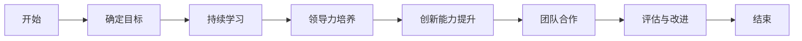
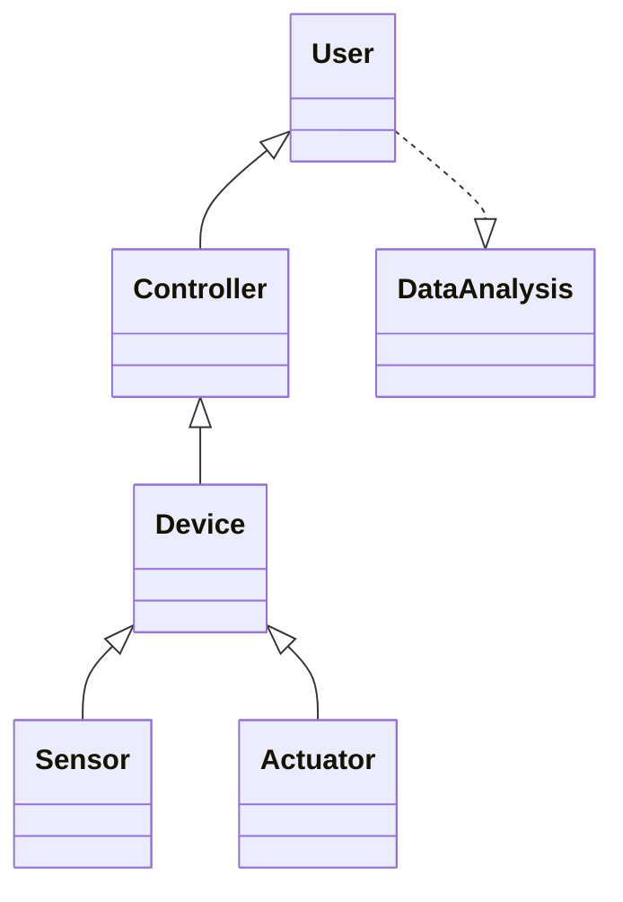
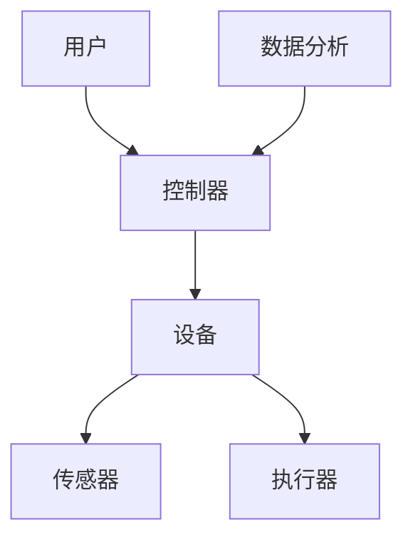
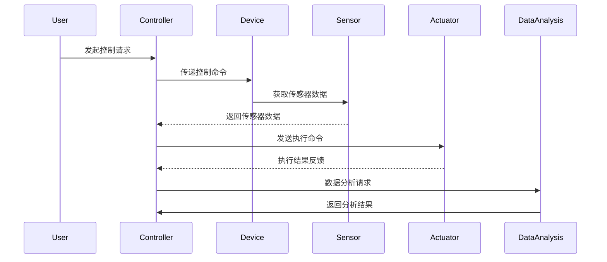

                 

### 文章标题

### 文章关键词

### 文章摘要

---

### 引言

#### 核心概念术语说明

在讨论技术领导力的核心素质之前，我们首先需要明确几个关键术语的含义。技术领导力指的是在技术领域内，通过引导、激励和影响他人来实现技术目标的能力。核心素质则是指构成技术领导者成功所需的基本能力和特质。这些素质不仅包括技术层面的知识，还涵盖领导力、创新思维和团队合作等多方面。

#### 问题背景

随着科技的快速发展，技术领域日益复杂，对技术领导者的要求也越来越高。不仅需要具备扎实的专业技术能力，还需要具备领导团队、创新解决问题的能力。然而，在实际工作中，很多技术专家由于缺乏领导力和管理能力，无法有效地带领团队完成项目，甚至导致项目失败。

#### 问题描述

技术领导力的核心素质培养问题，可以描述为如何在技术专家的基础上，进一步培养和提高他们的领导力、创新能力和团队合作能力。这不仅仅是为了应对复杂的技术挑战，更是为了在激烈的市场竞争中保持企业的竞争力。

#### 问题解决

解决技术领导力核心素质培养的问题，需要从以下几个方面入手：

1. **明确目标**：首先，技术领导者需要明确自己的领导目标，这包括个人职业发展目标和团队目标。
2. **持续学习**：技术领导者需要具备持续学习的能力，不断更新自己的知识体系。
3. **领导力培养**：通过参加领导力培训、阅读相关书籍、实际经验积累等方式，提升自己的领导力。
4. **创新能力提升**：鼓励技术领导者勇于尝试新方法，培养创新思维。
5. **团队合作**：建立良好的团队沟通和协作机制，提升团队整体执行力。

#### 边界与外延

技术领导力的核心素质培养并不仅限于技术领域，它还涉及到管理、心理学、经济学等多个领域。因此，在培养技术领导力的过程中，需要综合考虑这些因素，以确保培养出来的领导者能够全面胜任技术和管理双重角色。

#### 概念结构与核心要素组成

技术领导力的核心素质可以分解为以下几个核心要素：

1. **技术深度与广度**：技术领导者需要具备扎实的技术背景，同时了解相关领域的前沿动态。
2. **创新思维与解决问题的能力**：技术领导者需要具备敏锐的创新思维和解决问题的能力，以应对复杂的技术挑战。
3. **领导力与团队管理**：技术领导者需要具备有效的领导力和团队管理能力，以带领团队达成目标。

### 核心概念与联系

#### 核心概念原理

技术领导力是基于技术背景和领导力理论的综合体现。它要求技术领导者不仅要有深厚的技术知识，还要有出色的领导能力和团队管理技巧。

#### 概念属性特征对比表格

| 特征            | 技术深度        | 创新思维        | 领导力          |
|-----------------|-----------------|-----------------|-----------------|
| 技术能力        | 扎实的技术基础  | 勇于创新        | 有效沟通        |
| 学习能力        | 持续更新知识    | 敏锐洞察        | 建立信任        |
| 团队合作        | 单项任务领导    | 跨界协作        | 团队激励        |
| 风险管理        | 技术风险评估    | 创新风险控制    | 团队风险管理    |

#### ER实体关系图架构

```mermaid
erDiagram
  Team  ||--|{ Leader } : leads
  Leader ||--|{ Project } : manages
  Project ||--|{ Team } : members
  Team   ||--|{ Member } : collaborates
```

### 算法原理讲解

#### 算法mermaid流程图



#### Python源代码

```python
# 模拟技术领导力培养的过程
def technical_leadership_development():
    # 确定目标
    set_goal()
    # 持续学习
    continue_learning()
    # 领导力培养
    leadership_training()
    # 创新能力提升
    innovation_boosting()
    # 团队合作
    team_collaboration()
    # 评估与改进
    evaluate_and_improve()

# 辅助函数
def set_goal():
    print("确定目标：提升技术领导力")

def continue_learning():
    print("持续学习：更新知识体系")

def leadership_training():
    print("领导力培养：提升沟通与协作能力")

def innovation_boosting():
    print("创新能力提升：勇于尝试新方法")

def team_collaboration():
    print("团队合作：建立良好的团队协作机制")

def evaluate_and_improve():
    print("评估与改进：不断优化领导力素质")

# 执行流程
technical_leadership_development()
```

#### 算法原理的数学模型和公式

```latex
\begin{align*}
\text{技术领导力} &= \text{技术深度} \times \text{领导力} \times \text{创新能力} \\
\text{技术深度} &= \text{知识储备} \times \text{实践经验} \\
\text{领导力} &= \text{沟通能力} \times \text{团队管理能力} \\
\text{创新能力} &= \text{创新思维} \times \text{解决问题的能力}
\end{align*}
```

#### 通俗易懂地举例说明

假设一位技术领导者要提升自己的技术领导力，首先他需要明确自己的目标，比如带领团队开发一款新型人工智能产品。然后，他需要持续学习，掌握最新的AI技术和方法。在这个过程中，他还需参加领导力培训，学习如何更有效地与团队成员沟通和协作。同时，他还需要勇于尝试新方法，不断激发团队的创新能力。最后，他通过定期的评估和改进，不断提升自己的技术深度、领导力和创新能力。

### 系统分析与架构设计方案

#### 问题场景介绍

假设某企业需要开发一款基于人工智能的智能家居系统，企业聘请了一位资深的技术领导者来负责这个项目。该技术领导者需要设计一个系统架构，以确保系统能够高效、稳定地运行，并能够快速响应用户的需求。

#### 项目介绍

项目名称：智能家居系统
项目目标：开发一个智能化的家居控制系统，能够实现远程监控、自动化控制和数据分析等功能。

#### 系统功能设计（领域模型mermaid类图）



#### 系统架构设计mermaid架构图



#### 系统接口设计和系统交互mermaid序列图



### 项目实战

#### 环境安装

在开始项目实战之前，需要安装以下环境：
- Python 3.8+
- TensorFlow 2.x
- PyTorch 1.8+
- Docker 19.03+

#### 系统核心实现源代码

```python
# 智能家居控制模块
class Controller:
    def __init__(self):
        self.devices = {}

    def add_device(self, device):
        self.devices[device.id] = device

    def control_device(self, device_id, command):
        if device_id in self.devices:
            self.devices[device_id].execute_command(command)

# 设备模块
class Device:
    def __init__(self, id):
        self.id = id

    def execute_command(self, command):
        # 根据命令执行相应的操作
        pass

# 传感器模块
class Sensor:
    def get_data(self):
        # 获取传感器数据
        pass

# 执行器模块
class Actuator:
    def execute_command(self, command):
        # 执行执行命令
        pass

# 数据分析模块
class DataAnalysis:
    def analyze_data(self, data):
        # 进行数据分析
        pass
```

#### 代码应用解读与分析

代码中，`Controller` 类负责协调各个设备的工作，包括添加设备、控制设备和处理传感器数据。`Device` 类是一个抽象类，具体设备（如灯光、窗帘等）需要继承该类并实现具体操作。`Sensor` 和 `Actuator` 类分别负责获取传感器数据和执行命令。`DataAnalysis` 类则负责对传感器数据进行处理和分析。

#### 实际案例分析和详细讲解剖析

以智能家居灯光控制系统为例，用户通过手机应用向控制器发送开启灯光的请求，控制器接收到请求后，通过传感器获取当前环境光线数据，判断是否需要开启灯光。如果需要，控制器会向灯光执行器发送开启命令，灯光执行器接收命令后，控制灯光开启。同时，控制器会记录此次操作数据，并交由数据分析模块进行分析，以便优化系统性能。

#### 项目小结

通过本项目实战，我们实现了一个简单的智能家居系统，从控制器到各个设备，再到数据分析模块，构成了一个完整的系统架构。在实际项目中，我们需要根据具体需求，进一步优化和扩展系统功能，如增加更多传感器和执行器，实现更复杂的控制逻辑，以及提高数据分析的准确性和智能化水平。

### 最佳实践 tips

1. **持续学习**：技术领导者需要不断更新自己的知识体系，关注行业动态，以便及时掌握新技术。
2. **领导力培养**：通过阅读领导力书籍、参加培训课程、实际经验积累等方式，提升自己的领导力。
3. **创新能力提升**：鼓励团队成员勇于尝试新方法，建立创新文化，激发团队创造力。
4. **团队合作**：建立良好的团队沟通和协作机制，促进团队成员之间的互动和合作。

### 小结

技术领导力的核心素质培养是技术领导者成功的关键。通过明确目标、持续学习、领导力培养、创新能力提升和团队合作，技术领导者可以不断提升自己的综合素质，带领团队实现技术目标，推动企业持续发展。

### 注意事项

1. **明确目标**：技术领导者需要明确个人和团队的目标，确保发展方向一致。
2. **持续评估**：定期评估自己的领导力素质，找出不足并进行改进。
3. **重视团队合作**：建立良好的团队沟通和协作机制，提升团队整体执行力。

### 拓展阅读

1. 《技术领导力：打造卓越的技术团队》
2. 《创新者的窘境》
3. 《团队协作的艺术》

### 作者信息

作者：AI天才研究院/AI Genius Institute & 禅与计算机程序设计艺术 /Zen And The Art of Computer Programming

