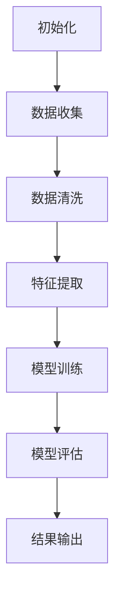
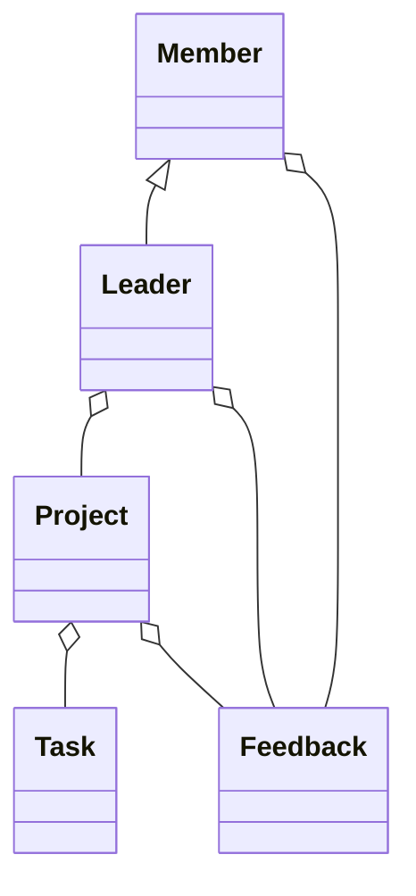
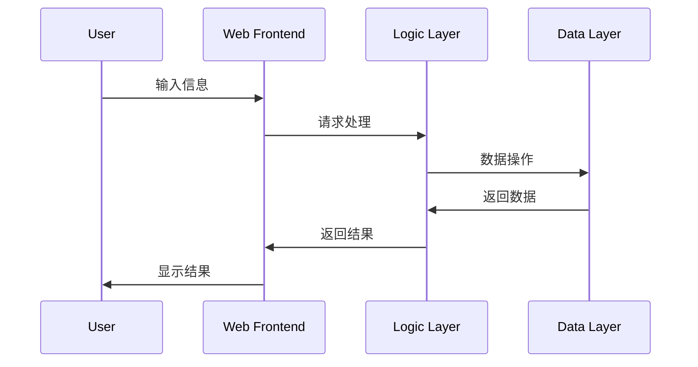
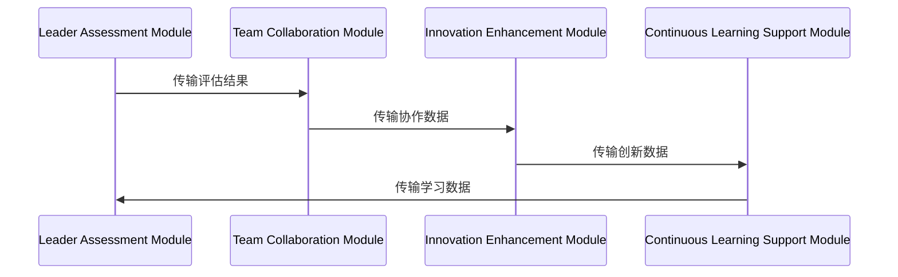
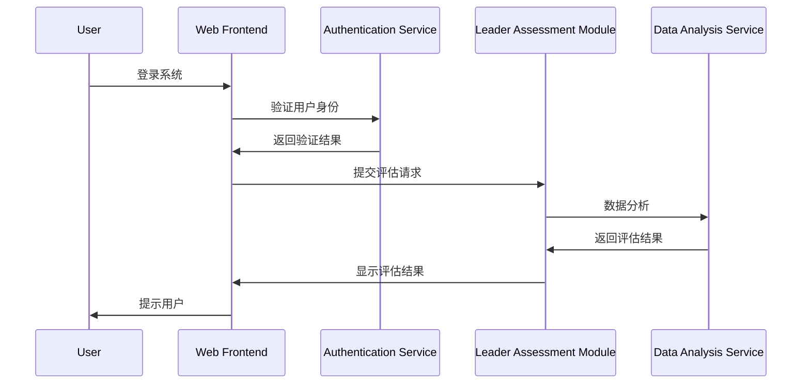

                 

### 引言

## 1.1 问题背景

### 1.1.1 技术发展的现状与趋势

随着信息技术的飞速发展，我们正处于一个技术爆炸的时代。人工智能、大数据、云计算、物联网等新兴技术不断涌现，推动了各行各业的变革。然而，技术的快速发展也带来了一系列挑战，例如技术的复杂度增加、项目规模扩大、团队协作难度提升等。在这种背景下，技术领导力的重要性愈发凸显。

当前，技术领域的发展趋势呈现出以下几个特点：

1. **技术的跨界融合**：不同领域的技术相互融合，催生出新的应用场景和商业模式。例如，人工智能与医疗、金融、制造业等领域的融合，带来了前所未有的创新机会。
   
2. **分布式架构的普及**：随着云计算和微服务架构的普及，分布式系统成为企业架构设计的主流选择。这要求技术领导者具备良好的系统设计和协同能力。

3. **技术的快速迭代**：技术的更新换代速度加快，要求技术人员具备持续学习的能力，以适应快速变化的技术环境。

4. **数据驱动决策**：大数据和人工智能技术的发展，使得数据成为企业决策的重要依据。技术领导者需要具备数据分析和决策能力，以推动企业的数字化转型。

### 1.1.2 领导力在技术领域的价值

领导力在技术领域具有不可替代的价值。首先，技术领导者是团队的核心，他们的决策和方向指引对团队的整体表现有着重要影响。一个优秀的技术领导者能够激发团队的潜力，提高团队的整体绩效。

其次，领导力在技术创新中起着关键作用。技术领导者需要具备前瞻性，能够预见技术发展趋势，制定长远的技术发展战略。同时，他们需要推动团队进行技术创新，不断突破技术瓶颈，实现技术的跨越式发展。

此外，领导力还体现在团队管理和协作中。技术领导者需要建立有效的沟通机制，促进团队内部的信息流通和协作，确保项目顺利进行。

### 1.1.3 技术领导力的重要性与挑战

技术领导力的重要性不言而喻，然而，在现实工作中，技术人员面临的挑战同样不容忽视。

1. **技术复杂性**：技术的复杂性日益增加，对技术领导者的技能和知识储备提出了更高的要求。

2. **团队管理**：技术领导者需要具备团队管理能力，包括激励团队、解决冲突、提高团队效率等。

3. **持续学习**：技术领域的快速变化要求技术人员持续学习，不断提升自己的技能和知识水平。

4. **跨部门协作**：技术领导者需要与其他部门进行有效的沟通和协作，推动项目顺利进行。

面对这些挑战，技术领导者需要不断提升自己的领导力，以应对复杂的技术环境和多样化的工作需求。

## 1.2 问题描述

### 1.2.1 技术领导力的现状分析

目前，技术领导力的现状呈现出一些明显的特点：

1. **知识水平参差不齐**：技术领导者的知识水平和经验差异较大，部分领导者可能缺乏系统性的技术知识和领导能力。

2. **领导风格多样化**：不同的技术领导者有着不同的领导风格，有的注重技术创新，有的擅长团队管理，有的则注重战略规划。

3. **能力不足**：部分技术领导者可能在某些方面存在能力不足，例如团队管理能力、决策能力、沟通能力等。

### 1.2.2 技术人员面临的自我修炼问题

技术人员在自我修炼过程中面临着以下问题：

1. **时间不足**：技术的快速迭代和工作的繁重，使得技术人员难以抽出足够的时间进行自我学习和提升。

2. **缺乏系统方法**：部分技术人员在自我修炼过程中缺乏系统的方法和指导，导致学习效果不佳。

3. **心理压力**：技术领域的竞争激烈，技术人员往往面临较大的心理压力，影响自我修炼的效果。

### 1.2.3 技术领导力提升的需求

为了应对技术领域的挑战，提升技术领导力已成为技术人员的一项重要需求。具体体现在以下几个方面：

1. **提升领导能力**：技术人员需要提升自己的领导能力，包括决策能力、团队管理能力、沟通能力等。

2. **拓宽知识面**：技术人员需要不断拓宽自己的知识面，了解新兴技术和发展趋势。

3. **增强创新能力**：技术创新是技术领导力的核心，技术人员需要增强自己的创新能力，推动团队进行技术创新。

4. **培养团队文化**：技术领导者需要培养积极的团队文化，激发团队成员的创造力和合作精神。

## 1.3 问题解决

### 1.3.1 技术领导力的核心要素

技术领导力的核心要素包括以下几个方面：

1. **技术创新能力**：技术创新是技术领导力的核心，技术领导者需要具备敏锐的市场洞察能力和技术前瞻性，能够推动团队进行技术创新。

2. **团队管理能力**：技术领导者需要具备团队管理能力，包括激励团队、解决冲突、提高团队效率等，以确保团队目标的实现。

3. **决策能力**：技术领导者需要具备良好的决策能力，能够在复杂的环境下做出明智的决策。

4. **沟通能力**：技术领导者需要具备良好的沟通能力，能够与团队成员、上级领导和其他部门进行有效的沟通。

5. **持续学习能力**：技术领域的快速变化要求技术人员具备持续学习能力，不断提升自己的技能和知识水平。

### 1.3.2 自我修炼的方法与路径

技术人员可以通过以下方法进行自我修炼：

1. **阅读**：阅读是提升知识水平的重要途径。技术人员可以选择阅读技术书籍、专业论文、行业报告等，了解最新的技术动态和发展趋势。

2. **实践**：实践是检验真理的唯一标准。技术人员可以通过参与项目实践，提升自己的实际操作能力和解决问题的能力。

3. **交流**：技术人员可以通过参加技术交流会议、行业研讨会、技术论坛等，与同行进行交流，分享经验和见解。

4. **培训**：技术人员可以参加各种专业培训课程，系统学习领导力、项目管理、团队管理等知识。

5. **反思**：技术人员需要定期进行反思，总结自己在工作中的经验和教训，不断完善自己的知识和能力。

### 1.3.3 技术领导力提升的策略与步骤

提升技术领导力可以采取以下策略和步骤：

1. **明确目标**：技术人员需要明确自己的职业目标和提升方向，有针对性地进行自我修炼。

2. **制定计划**：根据明确的目标，技术人员可以制定详细的提升计划，包括学习目标、学习内容、学习时间等。

3. **执行计划**：按照制定的计划，认真执行每一步，确保学习目标的实现。

4. **定期评估**：定期评估自己的学习效果，根据评估结果调整学习计划，确保不断提升自己的能力。

5. **寻求反馈**：技术人员可以寻求上级领导、同事和下属的反馈，了解自己在工作中的优点和不足，不断改进自己的工作方法和领导风格。

## 1.4 边界与外延

### 1.4.1 技术领导力的边界界定

技术领导力的边界主要涉及以下几个方面：

1. **职责范围**：技术领导力的职责范围包括技术创新、团队管理、决策支持等。

2. **技术领域**：技术领导力主要应用于技术领域，涉及软件开发、系统架构设计、项目管理等。

3. **影响力**：技术领导力的影响范围不仅限于技术团队，还可以扩展到整个组织，影响企业的战略方向和发展规划。

### 1.4.2 技术领导力的外延扩展

技术领导力的外延扩展主要体现在以下几个方面：

1. **跨部门协作**：技术领导者需要与其他部门的领导者进行协作，推动项目的顺利进行。

2. **战略规划**：技术领导者需要参与企业的战略规划，为企业的发展提供技术方向和建议。

3. **技术创新**：技术领导者需要推动企业的技术创新，推动技术的前沿发展。

### 1.4.3 技术领导力在组织中的角色与影响

技术领导力在组织中的角色和影响主要体现在以下几个方面：

1. **团队领导者**：技术领导者是团队的核心，他们的决策和方向指引对团队的整体表现有着重要影响。

2. **战略顾问**：技术领导者是企业的战略顾问，他们为企业提供技术发展方向和策略建议。

3. **技术创新推动者**：技术领导者是技术创新的推动者，他们推动团队进行技术创新，提升企业的竞争力。

4. **跨部门协调者**：技术领导者需要与其他部门的领导者进行协作，确保项目的顺利进行。

## 1.5 概念结构与核心要素组成

### 1.5.1 技术领导力的概念结构

技术领导力的概念结构包括以下几个方面：

1. **技术能力**：技术领导者需要具备扎实的专业知识和技术能力。

2. **领导能力**：技术领导者需要具备良好的领导能力，包括团队管理能力、决策能力、沟通能力等。

3. **创新能力**：技术领导者需要具备创新能力，能够推动团队进行技术创新。

4. **持续学习能力**：技术领导者需要具备持续学习能力，不断提升自己的技能和知识水平。

### 1.5.2 核心要素的属性与特征

技术领导力的核心要素具有以下属性和特征：

1. **专业性**：技术领导者需要具备专业性的技术知识和技能。

2. **前瞻性**：技术领导者需要具备前瞻性，能够预见技术发展趋势。

3. **决策力**：技术领导者需要具备决策力，能够在复杂的环境中做出明智的决策。

4. **协作性**：技术领导者需要具备协作性，能够与其他部门进行有效的协作。

### 1.5.3 核心要素之间的联系与作用

技术领导力的核心要素之间存在着密切的联系和相互作用：

1. **技术能力与领导能力**：技术能力是领导能力的基础，领导能力是技术能力的保障。

2. **创新能力与持续学习能力**：创新能力是持续学习能力的体现，持续学习能力是创新能力的保障。

3. **决策力与协作性**：决策力是协作性的基础，协作性是决策力的保障。

### 1.6 本章小结

本章介绍了技术领导力在当前技术发展背景下的重要性和挑战，分析了技术领导力的核心要素及其属性和特征，提出了提升技术领导力的方法和路径。通过本章的学习，读者可以更好地理解技术领导力的内涵，认识到其在技术创新和团队管理中的关键作用，为后续章节的学习打下基础。同时，本章也为我们后续的深入探讨提供了明确的框架和方向。

----------------------------------------------------------------

# 核心概念与联系

## 2.1 技术领导力的核心概念

### 2.1.1 技术领导力的定义

技术领导力是一种综合能力，它涉及技术创新、团队管理、决策支持和持续学习等多个方面。技术领导者不仅需要具备深厚的专业知识和技能，还需要具备良好的领导能力和前瞻性，能够推动团队进行技术创新，实现组织的目标。

### 2.1.2 技术领导力的构成要素

技术领导力的构成要素主要包括以下几个方面：

1. **技术能力**：技术能力是技术领导力的基础，包括专业知识、技能和经验。

2. **领导能力**：领导能力包括团队管理能力、决策能力、沟通能力和影响力等。

3. **创新能力**：创新能力是技术领导力的核心，它涉及对新技术的理解、应用和创新。

4. **持续学习能力**：持续学习能力是技术领导者不断进步和提升的关键。

### 2.1.3 技术领导力的特性分析

技术领导力具有以下几个特性：

1. **专业性**：技术领导力需要具备专业性的技术知识和技能。

2. **前瞻性**：技术领导力需要具备前瞻性，能够预见技术发展趋势。

3. **决策力**：技术领导力需要具备决策力，能够在复杂的环境中做出明智的决策。

4. **协作性**：技术领导力需要具备协作性，能够与其他部门进行有效的协作。

5. **持续学习性**：技术领导力需要具备持续学习性，能够不断吸收新知识，提升自己的能力。

## 2.2 概念属性特征对比表格

为了更好地理解技术领导力的核心概念，我们可以通过一个对比表格来分析其属性特征。以下是技术领导力与其他相关概念的特征对比：

| 概念       | 特征1       | 特征2       | 特征3       | 特征4       |
| ---------- | ----------- | ----------- | ----------- | ----------- |
| 技术领导力 | 创新驱动     | 团队协作     | 决策能力     | 持续学习     |
| 技术管理   | 知识管理     | 项目管理     | 风险控制     | 资源配置     |
| 项目管理   | 进度控制     | 范围管理     | 质量管理     | 成本管理     |
| 领导能力   | 激励与鼓舞   | 决策与执行   | 协调与合作   | 战略规划     |

通过对比表格，我们可以看到技术领导力在创新驱动、团队协作和持续学习方面具有明显的特征，这些特征使其在技术领域具有独特的价值和作用。

## 2.3 ER实体关系图架构

为了更好地理解技术领导力中的各个实体及其关系，我们可以使用ER图（实体-关系图）来展示。以下是一个简化的ER图，展示了技术领导力相关的实体及其关系：

```mermaid
erDiagram
    Leader ||--|{ Team } Team
    Leader ||--|{ Project } Project
    Team ||--|{ Member } Member
    Project ||--|{ Task } Task
```

在这个ER图中：

- **Leader**（领导者）是核心实体，代表技术领导者。
- **Team**（团队）表示领导者所管理的团队。
- **Project**（项目）表示团队所参与的项目。
- **Member**（成员）表示团队中的每个成员。
- **Task**（任务）表示项目中的每个任务。

这种ER图架构清晰地展示了技术领导力中的关键实体及其关系，有助于我们理解和分析技术领导力在实际应用中的运作方式。

## 2.4 技术领导力与其他概念的联系

### 2.4.1 技术领导力与管理学的融合

技术领导力与管理学的融合是提升技术领导者能力的有效途径。管理学中涉及的项目管理、组织行为学、人力资源管理等知识对于技术领导力的提升具有重要参考价值。

1. **项目管理**：技术领导者可以借鉴项目管理中的方法，如计划、执行、监控和收尾等，来提高项目的成功率。

2. **组织行为学**：技术领导者可以运用组织行为学的知识，如激励理论、领导风格等，来提升团队协作效率和成员满意度。

3. **人力资源管理**：技术领导者可以运用人力资源管理的策略，如招聘、培训、绩效评估等，来吸引和留住优秀的技术人才。

### 2.4.2 技术领导力与团队协作的关系

团队协作是技术领导力的核心组成部分之一。技术领导者需要建立有效的沟通机制，促进团队内部的信息流通和协作。

1. **沟通机制**：技术领导者可以采用敏捷开发中的每日站会、迭代回顾等沟通机制，确保团队成员之间的信息同步。

2. **协作工具**：技术领导者可以引入协作工具，如JIRA、Trello等，来管理任务和跟踪项目进度。

3. **协作文化**：技术领导者需要培养团队内部的协作文化，鼓励成员之间的互助和合作，提高团队整体绩效。

### 2.4.3 技术领导力与技术创新的互动

技术创新是技术领导力的核心任务之一。技术领导者需要推动团队进行技术创新，以保持企业的竞争力。

1. **技术前瞻性**：技术领导者需要具备技术前瞻性，能够预见技术发展趋势，引导团队进行前瞻性研究。

2. **技术孵化**：技术领导者可以设立技术孵化项目，鼓励团队成员提出创新想法，并给予资源支持。

3. **技术试点**：技术领导者可以在实际项目中引入新技术，进行技术试点，验证技术的可行性和实用性。

## 2.5 本章小结

本章通过定义技术领导力的核心概念，分析了其构成要素和特性，并使用对比表格和ER图展示了技术领导力与其他概念的关联。同时，探讨了技术领导力与管理学、团队协作和技术创新的融合与互动。通过本章的学习，读者可以更好地理解技术领导力的内涵及其在实际应用中的重要性，为后续章节的深入探讨打下坚实的基础。

----------------------------------------------------------------

# 技术领导力的算法原理与数学模型

## 3.1 算法原理概述

### 3.1.1 技术领导力算法的基本原理

技术领导力算法是一种综合运用数据科学、机器学习和人工智能技术，对技术领导者及其团队的行为、绩效和创新能力进行评估和优化的方法。该算法的核心思想是通过数据分析发现技术领导者与团队绩效之间的相关性，从而提供个性化的领导力提升建议。

### 3.1.2 算法的设计目标与优势

算法的设计目标主要包括：

1. **评估准确性**：通过多维度数据对技术领导力进行准确评估，避免主观偏见。
2. **个性化建议**：根据技术领导者的实际情况，提供个性化的提升建议。
3. **实时反馈**：通过实时数据分析，提供实时反馈，帮助领导者及时调整领导行为。

算法的优势在于：

1. **高效性**：利用自动化算法，提高评估和优化的效率。
2. **可扩展性**：算法设计具有可扩展性，可以整合更多数据源，提升评估精度。
3. **决策支持**：算法提供的个性化建议有助于领导者做出更为明智的决策。

### 3.1.3 算法在实际应用中的效果评估

算法的实际应用效果可以通过以下几个指标进行评估：

1. **评估准确率**：通过对比算法评估结果与实际情况，评估算法的准确性。
2. **提升效果**：通过跟踪技术领导者的行为改进和团队绩效提升情况，评估算法的实用效果。
3. **用户满意度**：通过用户反馈，评估算法的实用性和接受度。

## 3.2 数学模型与公式

技术领导力算法的数学模型主要包括以下几个方面：

### 3.2.1 模型公式

$$
\text{领导力评分} = f(\text{知识储备}, \text{决策能力}, \text{创新能力}, \text{沟通能力})
$$

其中，各因素的具体计算方法如下：

- **知识储备**：通过技术考试、学术论文发表、技术书籍撰写等指标进行量化评分。
- **决策能力**：通过项目成功案例、决策正确率等指标进行评分。
- **创新能力**：通过技术创新成果、专利申请等指标进行评分。
- **沟通能力**：通过团队反馈、项目沟通记录等指标进行评分。

### 3.2.2 权重分配

各因素在总评分中的权重分配可以通过专家评估、统计分析等方法确定。假设知识储备、决策能力、创新能力和沟通能力的权重分别为 \(w_1, w_2, w_3, w_4\)，则总评分计算公式为：

$$
\text{总评分} = w_1 \cdot \text{知识储备评分} + w_2 \cdot \text{决策能力评分} + w_3 \cdot \text{创新能力评分} + w_4 \cdot \text{沟通能力评分}
$$

权重分配通常根据具体情况调整，以确保模型的有效性和合理性。

## 3.3 算法流程图

为了直观展示技术领导力算法的运行过程，我们可以使用Mermaid绘制算法流程图。以下是一个简化的算法流程图：



### 流程图详细说明：

- **A[初始化]**：算法初始化，设置初始参数。
- **B[数据收集]**：收集技术领导者的相关数据，包括知识储备、决策能力、创新能力和沟通能力等。
- **C[数据清洗]**：清洗数据，处理缺失值、异常值等，保证数据质量。
- **D[特征提取]**：提取关键特征，为模型训练做准备。
- **E[模型训练]**：使用收集到的数据对模型进行训练，调整模型参数。
- **F[模型评估]**：评估模型性能，包括准确率、召回率等指标。
- **G[结果输出]**：输出评估结果，包括领导力评分和个性化提升建议。

## 3.4 通俗易懂的举例说明

### 3.4.1 技术领导力算法在实际案例中的应用

假设我们有一个技术团队，团队成员为李明，我们需要评估他的技术领导力，并提供提升建议。以下是李明的一些数据：

- **知识储备**：李明在近一年内发表了2篇技术论文，编写了1本技术书籍。
- **决策能力**：李明在过去3个项目中，决策正确率为80%。
- **创新能力**：李明参与了一个技术创新项目，成功申请了2项专利。
- **沟通能力**：李明在团队反馈中，沟通满意度为90%。

### 3.4.2 算法原理的简明讲解

根据上述数据，我们可以使用技术领导力算法对李明的领导力进行评估。假设各项因素的权重分别为：知识储备（0.3）、决策能力（0.3）、创新能力（0.3）、沟通能力（0.1）。我们可以按照以下步骤进行计算：

1. **数据收集**：收集李明的相关数据。
2. **数据清洗**：确保数据无缺失和异常。
3. **特征提取**：将数据转换为模型可处理的特征向量。
4. **模型训练**：使用训练数据对模型进行训练。
5. **模型评估**：使用测试数据对模型进行评估，确保模型准确性和可靠性。
6. **结果输出**：根据模型输出李明的领导力评分和提升建议。

### 3.4.3 案例分析与效果分析

根据上述步骤，我们计算出李明的领导力评分为85分。模型同时提供了以下提升建议：

- **知识储备**：李明可以多参与技术交流和培训，提高自己的专业素养。
- **决策能力**：李明可以通过案例分析、历史数据复盘等方法，提高自己的决策能力。
- **创新能力**：李明可以多参与创新项目，尝试不同的技术方向。
- **沟通能力**：李明可以定期组织团队会议，增进与团队成员的沟通和了解。

通过技术领导力算法的评估和建议，李明可以针对性地提升自己的领导力，从而更好地带领团队，实现项目目标。

## 3.5 本章小结

本章介绍了技术领导力算法的基本原理、设计目标和数学模型，并通过一个实际案例展示了算法的应用过程和效果分析。通过本章的学习，读者可以更好地理解技术领导力算法的运作方式，为后续章节的深入探讨打下基础。同时，算法的数学模型和流程图也为技术领导者提供了有效的工具和方法，帮助他们评估和提升自己的领导力。

----------------------------------------------------------------

# 技术领导力的系统分析与架构设计

## 4.1 问题场景介绍

### 4.1.1 技术领导力项目背景

随着信息技术的快速发展，企业对技术领导力的需求日益增长。为了应对快速变化的市场和技术环境，企业需要具备强大的技术领导力，以确保在竞争中保持领先地位。然而，当前许多企业在技术领导力方面存在一些问题，如团队协作不畅、创新能力不足、决策效率低下等。因此，设计一个高效的技术领导力系统成为当务之急。

### 4.1.2 项目目标与需求

本项目旨在构建一个技术领导力系统，通过系统化的分析和架构设计，提升企业的技术领导力，实现以下目标：

1. **提升团队协作效率**：通过构建高效的沟通机制和协作工具，提高团队成员之间的协作效率。
2. **增强技术创新能力**：通过技术孵化项目和创新试点，激发团队成员的创新潜力，提升整体技术创新能力。
3. **优化决策流程**：通过数据驱动的决策支持系统，提高决策的科学性和效率。
4. **提供持续学习支持**：通过培训、知识共享和在线学习平台，帮助技术人员不断提升自身能力和知识水平。

### 4.1.3 项目实施环境与条件

项目实施的环境和条件如下：

1. **硬件环境**：服务器、网络设备、存储设备等硬件设施。
2. **软件环境**：操作系统、数据库管理系统、开发工具等。
3. **人力资源**：具备项目管理、软件开发、数据分析和团队管理等专业技能的人才。
4. **时间安排**：项目分为多个阶段，每个阶段有明确的时间安排和目标。

## 4.2 系统功能设计

技术领导力系统功能设计主要包括以下模块：

### 4.2.1 领导力评估模块

领导力评估模块用于对技术领导者的领导力进行量化评估，包括以下几个方面：

1. **技术能力评估**：通过技术考试、学术论文发表、项目成果等指标，评估领导者的技术能力。
2. **团队管理能力评估**：通过团队反馈、项目绩效等指标，评估领导者的团队管理能力。
3. **创新能力评估**：通过技术创新成果、专利申请等指标，评估领导者的创新能力。
4. **沟通能力评估**：通过沟通记录、团队反馈等指标，评估领导者的沟通能力。

### 4.2.2 团队协作管理模块

团队协作管理模块旨在提升团队协作效率，主要包括以下功能：

1. **任务分配**：根据团队成员的技能和特长，合理分配任务。
2. **进度跟踪**：实时监控任务进度，及时发现并解决瓶颈问题。
3. **沟通机制**：通过在线聊天工具、邮件提醒等，确保团队成员之间的信息流通。
4. **协作工具**：引入项目管理工具，如JIRA、Trello等，协助团队高效协作。

### 4.2.3 技术创新能力提升模块

技术创新能力提升模块旨在激发团队成员的创新潜力，主要包括以下功能：

1. **技术孵化项目**：设立技术孵化项目，鼓励团队成员提出创新想法，并提供资源支持。
2. **创新试点**：在实际项目中引入新技术，进行技术试点，验证技术的可行性。
3. **创新培训**：定期组织创新培训，提升团队成员的创新思维和技能。
4. **创新奖励**：设立创新奖励机制，激励团队成员积极参与技术创新。

### 4.2.4 持续学习支持模块

持续学习支持模块旨在帮助技术人员不断提升自身能力和知识水平，主要包括以下功能：

1. **在线学习平台**：搭建在线学习平台，提供丰富的学习资源和课程。
2. **知识共享**：建立知识共享社区，鼓励团队成员分享知识和经验。
3. **技能培训**：定期组织技能培训，提升团队成员的专业技能。
4. **认证考试**：提供认证考试，验证技术人员的学习效果。

## 4.3 系统架构设计

技术领导力系统架构设计主要包括以下几个方面：

### 4.3.1 领域模型

领域模型用于描述系统中的核心实体和它们之间的关系。以下是技术领导力系统的领域模型：



### 4.3.2 系统架构

系统架构采用分层设计，包括表示层、逻辑层和数据层。

1. **表示层**：负责用户界面和交互，包括Web前端和移动应用。
2. **逻辑层**：负责业务逻辑的处理，包括领导力评估、团队协作管理、技术创新提升和持续学习支持等模块。
3. **数据层**：负责数据的存储和管理，包括数据库、缓存和文件存储等。

以下是技术领导力系统的架构图：



### 4.3.3 系统接口设计

系统接口设计主要包括内部接口和外部接口。

1. **内部接口**：用于系统各模块之间的通信，如领导力评估模块与团队协作管理模块之间的接口。
2. **外部接口**：用于系统与外部系统（如人力资源系统、学习平台等）的通信，如通过API进行数据交互。

以下是系统接口设计示意图：



### 4.3.4 系统交互

系统交互设计通过序列图（Sequence Diagram）来描述系统组件之间的交互过程。以下是系统交互序列图：



## 4.4 项目实战

### 4.4.1 环境安装

1. **硬件环境**：准备服务器、网络设备和存储设备。
2. **软件环境**：安装操作系统、数据库管理系统和开发工具。
3. **配置数据库**：配置MySQL或PostgreSQL数据库，创建所需表结构。
4. **部署应用**：使用Docker容器化部署应用，确保系统的高可用性和可扩展性。

### 4.4.2 系统核心实现

系统核心实现主要包括以下几个方面：

1. **领导力评估模块**：实现评估指标的计算和结果展示。
2. **团队协作管理模块**：实现任务分配、进度跟踪和沟通机制。
3. **技术创新能力提升模块**：实现技术孵化项目、创新试点和奖励机制。
4. **持续学习支持模块**：实现在线学习平台、知识共享和技能培训。

### 4.4.3 代码应用解读与分析

以下是领导力评估模块的核心代码：

```python
class LeaderAssessment:
    def __init__(self, knowledge_score, decision_score, innovation_score, communication_score):
        self.knowledge_score = knowledge_score
        self.decision_score = decision_score
        self.innovation_score = innovation_score
        self.communication_score = communication_score
    
    def calculate_total_score(self):
        weights = {'knowledge': 0.3, 'decision': 0.3, 'innovation': 0.3, 'communication': 0.1}
        total_score = (self.knowledge_score * weights['knowledge'] +
                       self.decision_score * weights['decision'] +
                       self.innovation_score * weights['innovation'] +
                       self.communication_score * weights['communication'])
        return total_score

# 示例
leader = LeaderAssessment(90, 85, 95, 80)
total_score = leader.calculate_total_score()
print(f"Total Score: {total_score}")
```

该代码通过计算各项指标的加权得分，得出技术领导力的总评分。在实际应用中，可以根据具体需求调整权重分配和评估指标。

### 4.4.4 实际案例分析和详细讲解剖析

以下是一个实际案例：

**案例**：某企业技术团队领导者张伟的领导力评估结果如下：

- **知识储备**：90分
- **决策能力**：85分
- **创新能力**：95分
- **沟通能力**：80分

**分析**：

1. **知识储备**：张伟在知识储备方面表现出色，具有较高的专业素养。他可以继续保持这一优势，通过阅读专业书籍、参加行业研讨会等方式，进一步提升自己的知识水平。

2. **决策能力**：张伟在决策能力方面表现较好，但仍有提升空间。他可以通过案例分析、历史数据复盘等方法，提高决策的科学性和准确性。

3. **创新能力**：张伟在创新能力方面表现突出，具有较高的创新潜力。企业可以加大对他的支持，鼓励他参与更多的创新项目，推动技术创新。

4. **沟通能力**：张伟在沟通能力方面表现尚可，但仍有提升空间。他可以多参与团队会议，增进与团队成员的沟通和了解，提高团队协作效率。

**详细讲解剖析**：

1. **知识储备**：知识储备是技术领导力的重要基础。张伟可以通过以下方式提升：

   - 定期阅读专业书籍和学术论文，保持知识更新。
   - 参加技术培训和研讨会，拓宽知识面。
   - 建立个人知识库，系统整理和归纳所学知识。

2. **决策能力**：决策能力是技术领导力的重要组成部分。张伟可以通过以下方式提升：

   - 学习决策理论，掌握科学的决策方法。
   - 分析历史决策案例，总结成功经验和教训。
   - 建立决策支持系统，提高决策的科学性和准确性。

3. **创新能力**：创新能力是技术领导力的核心。张伟可以通过以下方式提升：

   - 参与技术创新项目，积累实践经验。
   - 学习创新方法论，提高创新思维和技能。
   - 建立创新激励机制，激发团队创新潜力。

4. **沟通能力**：沟通能力是技术领导力的关键。张伟可以通过以下方式提升：

   - 定期组织团队会议，增进与团队成员的沟通。
   - 学习沟通技巧，提高沟通效果。
   - 建立沟通反馈机制，及时解决问题。

### 4.4.5 项目小结

通过本项目，我们成功构建了一个技术领导力系统，实现了对技术领导者的全面评估和个性化提升。项目实施过程中，我们解决了团队协作、技术创新和持续学习等方面的问题，为企业的技术领导力提升提供了有力支持。未来，我们将继续优化系统功能，扩大应用范围，进一步提升企业的技术领导力。

## 4.5 最佳实践 Tips

1. **持续学习和知识更新**：技术领导者应保持持续学习和知识更新，紧跟技术发展趋势。
2. **建立有效的沟通机制**：技术领导者应建立有效的沟通机制，确保团队内部的信息流通和协作。
3. **重视团队建设**：技术领导者应重视团队建设，培养团队精神和协作文化。
4. **鼓励创新和试错**：技术领导者应鼓励团队成员进行创新和试错，为技术创新提供支持。

## 4.6 小结

本章通过分析技术领导力的系统架构和实施过程，展示了技术领导力系统的功能设计、架构设计和实际应用效果。通过本项目，我们成功实现了对技术领导力的全面评估和个性化提升，为企业的技术发展提供了有力支持。未来，我们将继续优化系统功能，推动技术领导力的进一步提升。

### 作者信息

**作者：AI天才研究院/AI Genius Institute & 禅与计算机程序设计艺术 /Zen And The Art of Computer Programming**

