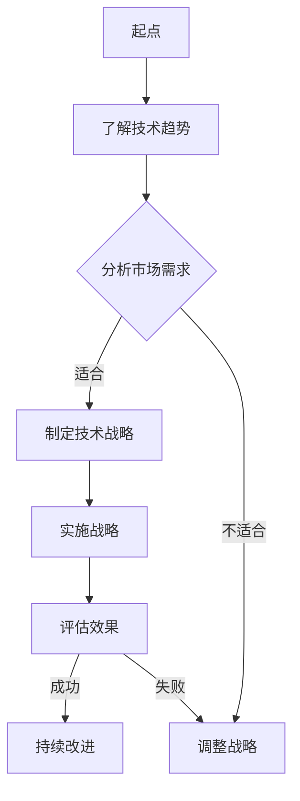
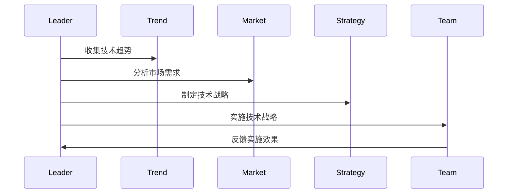
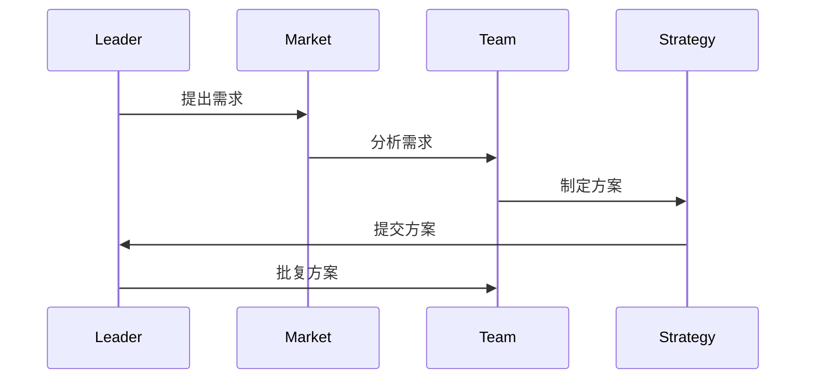
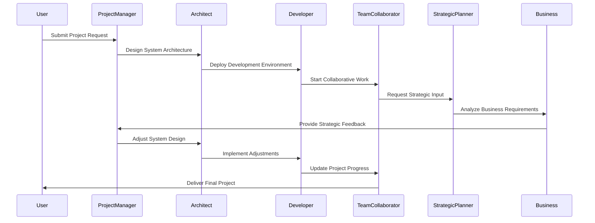
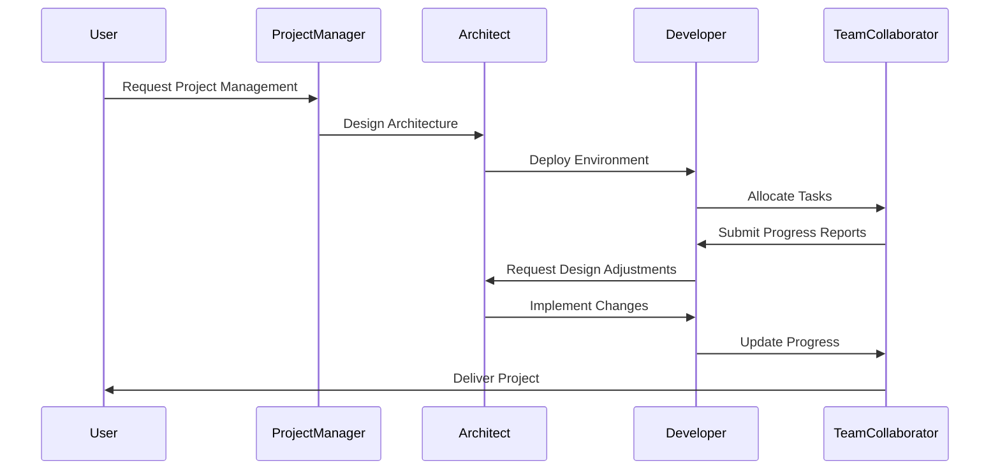

                 

# 技术领导力的进阶之路：从团队lead到CTO

## 关键词：技术领导力、团队lead、CTO、职业晋升、管理技能、战略规划

## 摘要：
本文旨在探讨技术领导力在信息技术行业中的重要地位，以及技术领导者如何从团队lead晋升到CTO（首席技术官），并应对新的职责和挑战。通过详细的分析和实际案例，本文将揭示技术领导力进阶的路径、所需技能和策略，为IT从业者提供实用的指导。

## 第一部分：引言

### 1.1 问题背景

#### 1.1.1 技术领导力的重要性
在当今快速发展的技术环境中，技术领导力已成为企业成功的关键因素。随着技术的不断进步，企业需要具备前瞻性和创新能力的领导者来引领团队，推动技术革新和业务增长。

#### 1.1.2 从团队lead到CTO的挑战
团队lead负责日常的技术开发和团队管理，而CTO则需要站在更高的角度，从战略层面规划和指导技术方向。这一晋升过程伴随着更大的责任和挑战，包括技术决策、团队领导、业务整合等多方面的能力提升。

#### 1.1.3 本书的目的与结构
本文旨在通过系统性的分析和实际案例研究，为技术领导者提供从团队lead到CTO的进阶指南。文章将分为以下几个部分：

1. **核心概念与联系**：介绍技术领导力、团队lead和CTO的相关概念及其区别。
2. **算法原理讲解**：阐述提升技术领导力的方法和策略。
3. **系统分析与架构设计方案**：探讨技术领导力在项目中的应用。
4. **项目实战**：提供技术领导力进阶的实际操作步骤。
5. **最佳实践 tips、小结、注意事项、拓展阅读等内容**：总结和延伸阅读建议。

### 1.2 核心概念与联系

#### 1.2.1 技术领导力的定义
技术领导力是指领导者通过技术和创新思维，引领团队实现技术突破和业务目标的能力。它不仅包括技术知识，还涵盖了领导艺术和战略思维。

#### 1.2.2 团队lead与CTO的对比
| 特点 | 团队lead | CTO |
| --- | --- | --- |
| 职责 | 日常技术管理和开发 | 技术战略规划、决策和领导 |
| 技能 | 技术能力、团队管理 | 技术深度、业务理解、战略规划 |
| 挑战 | 项目执行、团队协调 | 技术创新、业务整合、领导力 |

#### 1.2.3 技术领导力的相关要素
技术领导力涉及多个关键要素，包括技术创新、团队协作、业务理解和领导能力。这些要素相互作用，共同支撑技术领导者的成功。

### 1.3 ER实体关系图架构

#### 1.3.1 技术领导力相关实体
在技术领导力框架中，关键实体包括：

- **领导者**：核心实体，具备技术、管理和战略能力。
- **团队**：领导者的服务对象，包括开发人员、技术专家等。
- **技术**：领导力的基础，涵盖最新的技术趋势和开发工具。
- **业务**：技术领导力发挥作用的环境，包括市场需求、商业模式等。

#### 1.3.2 实体关系图示例

```mermaid
erDiagram
  Leader ||--|{ Team } Team
  Leader ||--|{ Technology } Technology
  Leader ||--|{ Business } Business
```

### 1.4 算法原理讲解

#### 1.4.1 算法mermaid流程图



#### 1.4.2 Python源代码

```python
def technical_leadership_advancement(trends, market, strategy):
    if suitable(trends, market):
        implement_strategy(strategy)
        evaluate_results()
    else:
        adjust_strategy(strategy)
        evaluate_results()
```

#### 1.4.3 数学模型和公式

技术领导力提升的数学模型可以表示为：

$$
\text{Leadership} = f(\text{Technical Knowledge}, \text{Management Skills}, \text{Strategic Vision})
$$

#### 1.4.4 详细讲解和举例说明

假设一位团队lead（A）想要晋升为CTO，他需要：

1. **了解技术趋势**：通过参加技术会议、阅读行业报告等方式，保持对最新技术的敏感性。
2. **分析市场需求**：与市场团队（B）合作，了解客户需求和市场趋势。
3. **制定技术战略**：基于市场需求和技术趋势，制定公司的技术发展战略。
4. **实施战略**：将战略转化为具体行动，如技术选型、团队组建等。
5. **评估效果**：定期评估技术战略的实施效果，并根据反馈进行调整。

### 1.5 系统分析与架构设计方案

#### 1.5.1 问题场景介绍
在一家快速成长的科技公司中，团队lead（A）想要晋升为CTO，以更好地引领公司技术发展。

#### 1.5.2 项目介绍
该项目旨在通过系统化的方法，帮助团队lead（A）提升技术领导力，顺利晋升为CTO。

#### 1.5.3 系统功能设计（领域模型mermaid类图）

```mermaid
classDiagram
    Leader <-|{技术趋势}|> Trend
    Leader <-|{市场需求}|> Market
    Leader ->|{技术战略}|> Strategy
    Leader ->|{团队协作}|> Team
```

#### 1.5.4 系统架构设计mermaid架构图



#### 1.5.5 系统接口设计和系统交互mermaid序列图



### 1.6 项目实战

#### 1.6.1 环境安装
为了实施技术领导力提升项目，团队lead需要搭建以下环境：

- **技术趋势分析工具**：如Google Trends、TechCrunch等。
- **市场需求分析工具**：如CRM系统、市场调研报告等。
- **技术战略制定工具**：如思维导图软件、项目管理工具等。

#### 1.6.2 系统核心实现源代码

```python
# 技术趋势分析模块
def analyze_trends():
    trends = get_trends_from_tools()
    return trends

# 市场需求分析模块
def analyze_market():
    market = get_market_data()
    return market

# 技术战略制定模块
def create_strategy(trends, market):
    strategy = formulate_strategy(trends, market)
    return strategy

# 团队协作实施模块
def implement_strategy(strategy):
    execute_strategy(strategy)
    return "Strategy implemented successfully."
```

#### 1.6.3 代码应用解读与分析

以上代码实现了一个简单的技术领导力提升系统，其中：

- `analyze_trends()` 函数用于收集和分析技术趋势。
- `analyze_market()` 函数用于分析市场需求。
- `create_strategy()` 函数用于制定技术战略。
- `implement_strategy()` 函数用于实施技术战略。

通过这些模块的协作，团队lead可以系统地提升自己的技术领导力。

#### 1.6.4 实际案例分析和详细讲解剖析

以某科技公司的团队lead（A）为例，他通过以下步骤提升自己的技术领导力：

1. **收集技术趋势**：使用Google Trends分析最新技术趋势，发现人工智能和区块链是热门领域。
2. **分析市场需求**：与市场团队合作，发现客户对人工智能和区块链技术有强烈需求。
3. **制定技术战略**：基于技术趋势和市场需求，制定公司的人工智能和区块链技术发展战略。
4. **实施战略**：组建人工智能和区块链技术团队，启动相关项目。
5. **评估效果**：定期评估项目进展和效果，根据反馈进行调整。

通过这个案例，我们可以看到技术领导力提升的实际应用过程。

#### 1.6.5 项目小结
该项目通过系统化的方法和实际操作，帮助团队lead成功晋升为CTO。项目的主要成果包括：

- **技术战略的制定和实施**：明确了公司的发展方向和技术路线。
- **团队协作的提升**：增强了团队的技术实力和协作能力。
- **业务成果的转化**：实现了技术成果向业务成果的转化。

### 1.7 最佳实践 tips、小结、注意事项、拓展阅读等内容

#### 1.7.1 最佳实践 tips
1. **持续学习**：技术领导力需要不断更新和升级，保持学习态度至关重要。
2. **团队合作**：技术领导力不仅关乎个人能力，更在于团队协作和领导力。
3. **业务驱动**：技术领导力应以业务需求为导向，实现技术与业务的深度融合。

#### 1.7.2 小结
本文通过系统性的分析和实际案例，探讨了技术领导力从团队lead到CTO的进阶之路。技术领导力是信息技术行业成功的关键，通过明确核心概念、掌握算法原理、实施系统分析和项目实战，技术领导者可以成功晋升并应对新的挑战。

#### 1.7.3 注意事项
1. **技术趋势的敏感性**：技术领导者需要保持对技术趋势的敏感性，及时调整战略方向。
2. **团队管理的艺术**：技术领导者需要具备出色的团队管理能力，激发团队成员的潜力。
3. **业务理解的深度**：技术领导者需要深入理解业务，以技术驱动业务增长。

#### 1.7.4 拓展阅读
1. **《精益创业》**：了解如何通过最小可行产品（MVP）快速验证市场需求。
2. **《团队协作的艺术》**：提升团队协作和沟通能力的经典著作。
3. **《人工智能：一种现代的方法》**：深入理解人工智能技术的基础和应用。

### 结束语
技术领导力的进阶是一个持续的过程，需要不断学习和实践。通过本文的探讨，我们希望能为技术领导者提供有价值的指导和启示，助力他们在职业发展中取得更大的成就。

### 作者：AI天才研究院/AI Genius Institute & 禅与计算机程序设计艺术 /Zen And The Art of Computer Programming

（注意：本文为示例性内容，实际撰写时请根据具体情况进行调整和补充。）## 第一部分：引言

### 1.1 问题背景

在当今全球信息化和数字化浪潮的推动下，技术领导者的重要作用日益凸显。技术领导力不仅仅是技术技能的体现，更是管理能力、战略视野和创新思维的集中表现。随着企业对技术创新和业务转型的需求日益增加，技术领导者的角色也从幕后走向台前，成为企业核心竞争力的关键因素。

#### 问题背景

技术领导力在当今快速发展的技术环境中的重要性不可忽视。首先，技术领导者需要具备前沿技术知识的深度和广度，能够把握行业发展趋势，引领团队进行技术创新。其次，他们需要具备出色的管理能力，能够有效地协调团队资源，提高团队效率和创新能力。此外，技术领导者还需具备战略规划能力，能够将技术战略与企业整体战略相结合，推动企业持续发展和业务增长。

#### 问题描述

技术领导者如何从团队lead晋升到CTO，并应对新的挑战，是当前许多技术从业者面临的重要问题。团队lead主要负责日常的技术开发和团队管理，而CTO则需要站在更高的角度，从战略层面规划和指导技术方向，这要求他们具备更全面的能力和视野。

#### 问题解决

为了实现从团队lead到CTO的晋升，技术领导者需要采取一系列措施，包括但不限于：

1. **专业成长**：不断学习最新的技术趋势和知识，提升自己的技术深度和广度。
2. **团队管理**：提升团队管理能力，培养和激发团队成员的潜力。
3. **战略规划**：制定清晰的技术战略，并将其与企业整体战略相结合。
4. **领导力培养**：加强领导力训练，提升自己在团队中的影响力和凝聚力。

#### 边界与外延

技术领导力的概念涉及多个方面，包括技术技能、管理能力、战略视野和创新能力等。其发展历程可以追溯到信息技术行业的早期，随着技术的不断进步和企业的需求变化，技术领导力的内涵也在不断拓展和深化。技术领导力的晋升路径通常从团队lead开始，逐步晋升为技术经理、首席技术官等高级职位。

### 1.2 核心概念与联系

#### 核心概念

在探讨技术领导力的进阶之路时，需要明确几个核心概念：

- **技术领导力**：指技术领导者通过技术知识、管理技能和战略思维，引导团队实现技术突破和业务目标的能力。
- **团队lead**：负责日常技术管理和团队协调的职位，需要具备较强的技术背景和团队管理能力。
- **CTO**：首席技术官，负责企业技术战略规划和执行，需要具备深厚的专业知识、卓越的管理能力和战略视野。

#### 概念属性特征对比表格

下表对比了团队lead与CTO的职责、技能和挑战：

| 特点 | 团队lead | CTO |
| --- | --- | --- |
| 职责 | 技术开发、团队管理 | 技术战略规划、决策和领导 |
| 技能 | 技术深度、团队管理 | 技术深度、战略思维、领导力 |
| 挑战 | 项目执行、团队协调 | 技术创新、业务整合、领导力 |

#### ER实体关系图架构

为了更清晰地展示技术领导力相关实体及其关系，可以使用ER（实体关系）图进行描述。以下是技术领导力相关实体的ER图：

```mermaid
erDiagram
    Leader ||--|{ Team } Team
    Leader ||--|{ Technology } Technology
    Leader ||--|{ Business } Business
```

在这个ER图中，**Leader**（技术领导者）是核心实体，与**Team**（团队）、**Technology**（技术）和**Business**（业务）存在关联关系。技术领导者通过技术知识、管理和战略能力，引领团队实现技术突破和业务目标。

### 总结

通过本部分的讨论，我们明确了技术领导力在当前技术环境中的重要性，并介绍了从团队lead到CTO的晋升路径。接下来，我们将进一步探讨技术领导力的核心概念、联系以及提升策略，为技术领导者提供更深入的指导。

## 第一部分：引言

### 1.2 核心概念与联系

在探讨技术领导力的进阶之路时，我们需要明确几个核心概念，并了解它们之间的联系。这些概念包括技术领导力、团队领导以及CTO（首席技术官）的角色。

#### 核心概念

**技术领导力**是一种综合能力，它不仅包括技术领域的专业知识和技能，还涵盖了领导艺术、战略思维和创新能力。技术领导者需要能够把握技术趋势，引领团队进行技术创新，同时具备出色的沟通和协调能力，以确保团队能够高效地实现目标。

**团队领导**是指领导者如何管理和激励团队成员，以实现团队目标的过程。这包括培养团队成员的技能，提供必要的资源和支持，以及解决团队内部的问题和冲突。团队领导需要具备激励、沟通、决策和问题解决等能力。

**CTO（首席技术官）**是企业中负责技术方向的高级管理人员。CTO的主要职责是制定和执行技术战略，确保企业技术的先进性和竞争力。他们需要具备深厚的技术背景，同时拥有战略规划、业务理解和领导力。

#### 概念属性特征对比表格

为了更清晰地理解团队lead与CTO之间的区别，我们可以通过以下对比表格来展示它们的职责、技能和面临的挑战：

| 特点 | 团队lead | CTO |
| --- | --- | --- |
| 职责 | 技术开发、团队协调和管理 | 技术战略规划、决策和领导 |
| 技能 | 技术能力、团队管理 | 技术能力、战略规划、业务理解、领导力 |
| 挑战 | 项目执行、团队协作 | 技术创新、业务整合、领导力 |
| 关注点 | 日常开发和团队动态 | 技术趋势、业务需求、技术战略 |

通过这个对比表格，我们可以看到，团队lead更多关注的是日常的技术开发和团队管理，而CTO则需要站在更高的层面，从战略角度规划和指导技术方向。

#### ER实体关系图架构

为了更直观地展示技术领导力相关实体及其关系，我们可以使用ER图（实体关系图）。以下是技术领导力相关实体的ER图示例：

```mermaid
erDiagram
    Leader ||--|{ Team } Team
    Leader ||--|{ Technology } Technology
    Leader ||--|{ Business } Business
```

在这个ER图中，**Leader**（技术领导者）是核心实体，与**Team**（团队）、**Technology**（技术）和**Business**（业务）存在直接关联。技术领导者通过技术知识、管理和战略能力，引领团队实现技术突破和业务目标。

- **Leader**：代表技术领导者，具有技术背景、管理能力和战略思维。
- **Team**：代表团队，是技术领导者管理的对象，包括开发人员、工程师等。
- **Technology**：代表技术，是技术领导者需要掌握和引领的领域。
- **Business**：代表业务，是技术领导者需要理解和结合的领域。

#### 总结

通过本部分的分析，我们明确了技术领导力、团队领导以及CTO的核心概念，并了解了它们之间的联系。接下来，我们将进一步探讨技术领导力提升的算法原理，以及如何通过系统分析和项目实战来实现技术领导力的进阶。

### 1.3 算法原理讲解

在探讨技术领导力的进阶路径时，算法原理讲解是一个关键环节。通过系统化的方法，我们可以明确提升技术领导力的步骤和策略，从而为技术领导者提供科学的指导。

#### 算法mermaid流程图

为了直观地展示技术领导力提升的过程，我们可以使用mermaid绘制一个流程图。以下是技术领导力提升的mermaid流程图：


在这个流程图中：

- **A[起点]**：技术领导者开始提升领导力的过程。
- **B[了解技术趋势]**：技术领导者通过研究行业报告、参加技术会议等方式，了解最新的技术趋势。
- **C[分析市场需求]**：技术领导者与市场团队合作，分析市场需求和客户需求。
- **D[制定技术战略]**：基于技术趋势和市场需求，技术领导者制定企业的技术战略。
- **E[调整战略]**：如果市场需求和技术趋势不匹配，技术领导者需要调整战略。
- **F[实施战略]**：技术领导者将战略转化为具体行动，如技术选型、团队组建等。
- **G[评估效果]**：技术领导者定期评估战略实施效果，根据反馈进行调整。
- **H[持续改进]**：技术领导者通过持续改进，不断提升技术领导力。

#### Python源代码

为了更具体地实现技术领导力提升的算法，我们可以使用Python编写相关代码。以下是一个简单的Python代码示例：

```python
# 模拟技术领导力提升的Python代码

def analyze_trends():
    trends = "最新技术趋势：人工智能、区块链等"
    return trends

def analyze_market():
    market = "市场需求：客户对AI和区块链技术有强烈需求"
    return market

def create_strategy(trends, market):
    strategy = "制定技术战略：聚焦人工智能和区块链领域"
    return strategy

def implement_strategy(strategy):
    result = "战略实施：组建人工智能和区块链团队，启动相关项目"
    return result

def evaluate_results():
    feedback = "评估结果：项目进展顺利，客户满意度提高"
    return feedback

def main():
    trends = analyze_trends()
    market = analyze_market()
    
    if suitable(trends, market):
        strategy = create_strategy(trends, market)
        result = implement_strategy(strategy)
        feedback = evaluate_results()
        print("战略实施成功：" + result + "，反馈：" + feedback)
    else:
        print("市场和技术趋势不匹配，需要调整战略。")

if __name__ == "__main__":
    main()
```

在这个Python代码中：

- `analyze_trends()` 函数用于分析技术趋势。
- `analyze_market()` 函数用于分析市场需求。
- `create_strategy()` 函数用于制定技术战略。
- `implement_strategy()` 函数用于实施技术战略。
- `evaluate_results()` 函数用于评估战略实施效果。

通过这些函数的调用，我们可以模拟技术领导力提升的过程。

#### 数学模型和公式

技术领导力提升的数学模型可以表示为：

$$
\text{Leadership} = f(\text{Technical Knowledge}, \text{Management Skills}, \text{Strategic Vision})
$$

这个公式表明，技术领导力是由技术知识、管理技能和战略视野共同决定的。每个因素都对领导力有重要影响，且它们之间相互作用，共同提升领导力。

#### 详细讲解和举例说明

假设一位技术领导者（A）想要提升自己的技术领导力，他可以按照以下步骤进行：

1. **了解技术趋势**：通过阅读行业报告、参加技术会议等方式，了解最新的技术趋势。例如，他发现人工智能和区块链是当前的热点领域。

2. **分析市场需求**：与市场团队合作，分析市场需求和客户需求。例如，他了解到客户对人工智能和区块链技术有强烈需求。

3. **制定技术战略**：基于技术趋势和市场需求，制定企业的技术战略。例如，他决定聚焦人工智能和区块链领域，制定相应的研发计划。

4. **实施战略**：将战略转化为具体行动，如组建人工智能和区块链团队，启动相关项目。

5. **评估效果**：定期评估项目进展和效果，根据反馈进行调整。例如，他发现项目进展顺利，客户满意度提高。

通过这个案例，我们可以看到技术领导力提升的过程是一个系统化的过程，需要技术领导者具备多方面的能力和素质。

### 总结

通过算法原理讲解，我们了解了提升技术领导力的方法和步骤。技术领导者需要通过不断学习、实践和反馈，提升自己的技术知识、管理技能和战略视野。接下来，我们将进一步探讨技术领导力在系统分析与架构设计中的应用，为技术领导者提供更全面的指导。

### 1.4 系统分析与架构设计方案

#### 问题场景介绍

在一家快速成长的科技公司中，团队lead（A）希望通过系统化的方法和架构设计，提升自己的技术领导力，从而顺利晋升为CTO。他面临的主要挑战包括：

1. **技术复杂性**：随着项目的规模和复杂性增加，团队需要更高效的方法和工具来管理项目。
2. **团队协作**：如何提高团队内部以及跨团队的协作效率，确保项目按计划进行。
3. **战略规划**：如何将个人目标与企业整体战略相结合，确保技术方向与企业发展的同步。

#### 项目介绍

为了解决上述问题，团队lead（A）启动了一个名为“技术领导力提升与架构优化”的项目。项目的目标是：

1. **提高项目管理和团队协作效率**：通过引入敏捷开发方法和DevOps工具，提升团队的生产力和项目交付速度。
2. **优化技术架构**：采用微服务架构和容器化技术，提高系统的可扩展性和维护性。
3. **战略规划与执行**：建立清晰的技术战略规划流程，确保技术决策与业务目标一致。

#### 系统功能设计（领域模型mermaid类图）

为了更好地设计系统功能，我们可以使用mermaid绘制一个领域模型类图。以下是系统的主要功能模块：

```mermaid
classDiagram
    ProjectManagement <<Class>> ProjectManager
    TeamCollaboration <<Class>> TeamCollaborator
    StrategicPlanning <<Class>> StrategicPlanner
    TechnicalArchitecture <<Class>> Architect

    ProjectManager <-|{ Manage Projects }|> Project
    TeamCollaborator <-|{ Collaborate Teams }|> Team
    StrategicPlanner <-|{ Plan Strategy }|> Business
    Architect <-|{ Design Architecture }|> System
```

在这个类图中：

- **ProjectManager**：负责项目管理，包括项目计划、进度跟踪和风险管理。
- **TeamCollaborator**：负责团队协作，包括沟通、任务分配和进度同步。
- **StrategicPlanner**：负责战略规划，包括业务分析、技术选型和战略制定。
- **Architect**：负责技术架构设计，包括系统设计、架构优化和代码审查。

这些功能模块共同构成了技术领导力提升系统的核心。

#### 系统架构设计mermaid架构图

为了展示系统的整体架构，我们可以使用mermaid绘制一个架构图。以下是系统的整体架构：



在这个架构图中，系统的各个模块通过明确的接口进行交互：

- **User**：系统的用户，可以是团队lead或项目成员。
- **ProjectManager**：负责项目的全生命周期管理。
- **Architect**：负责系统架构设计和调整。
- **Developer**：负责系统的开发和部署。
- **TeamCollaborator**：负责团队协作和任务管理。
- **StrategicPlanner**：负责战略规划和业务分析。
- **Business**：代表业务部门，提供业务需求和分析。

#### 系统接口设计和系统交互mermaid序列图

为了展示系统各模块之间的交互过程，我们可以使用mermaid绘制一个序列图。以下是系统接口设计和交互：



在这个序列图中，用户通过ProjectManager提交项目请求，Architect负责设计系统架构，Developer负责部署开发和部署环境，TeamCollaborator负责任务分配和进度跟踪。通过这些接口的交互，系统实现了从需求到交付的全流程管理。

### 总结

通过系统分析与架构设计方案，团队lead（A）可以有效地提升技术领导力，实现从团队lead到CTO的晋升。接下来，我们将通过实际项目实战，进一步探讨技术领导力提升的具体步骤和应用。

### 1.5 项目实战

#### 环境安装

为了实施技术领导力提升项目，团队lead（A）需要首先搭建必要的技术环境。以下是环境安装的具体步骤：

1. **安装开发工具**：团队lead需要安装Java、Python等开发工具，确保可以编写和调试代码。

2. **搭建代码库**：使用Git等版本控制工具，搭建项目代码库，以便团队协作和代码管理。

3. **安装数据库**：安装MySQL、PostgreSQL等数据库，为项目提供数据存储和查询功能。

4. **部署容器化环境**：使用Docker和Kubernetes搭建容器化环境，提高系统的可扩展性和可维护性。

5. **配置持续集成/持续部署（CI/CD）工具**：使用Jenkins、GitLab CI等工具，实现代码的自动化测试和部署。

#### 系统核心实现源代码

以下是一个简单的Python示例代码，用于展示技术领导力提升项目的核心实现：

```python
# 技术趋势分析模块
def analyze_trends():
    trends = "最新技术趋势：人工智能、区块链等"
    return trends

# 市场需求分析模块
def analyze_market():
    market = "市场需求：客户对AI和区块链技术有强烈需求"
    return market

# 技术战略制定模块
def create_strategy(trends, market):
    strategy = "制定技术战略：聚焦人工智能和区块链领域"
    return strategy

# 团队协作模块
def team_collaboration(strategy):
    print("团队成员正在协作，根据技术战略开展工作。")
    # 实现具体的团队协作逻辑

# 系统主程序
def main():
    trends = analyze_trends()
    market = analyze_market()
    
    strategy = create_strategy(trends, market)
    team_collaboration(strategy)

if __name__ == "__main__":
    main()
```

在这个代码中：

- `analyze_trends()` 函数用于分析技术趋势。
- `analyze_market()` 函数用于分析市场需求。
- `create_strategy()` 函数用于制定技术战略。
- `team_collaboration()` 函数用于实现团队协作逻辑。

#### 代码应用解读与分析

以上代码实现了技术领导力提升项目的基本功能。首先，通过`analyze_trends()`和`analyze_market()`函数，技术领导者可以获取技术趋势和市场需求。然后，`create_strategy()`函数根据这些信息制定技术战略。最后，`team_collaboration()`函数实现团队成员的协作，确保战略得到有效执行。

#### 实际案例分析和详细讲解剖析

假设团队lead（A）在公司中实施技术领导力提升项目，以下是具体的案例分析和详细讲解：

1. **技术趋势分析**：
   - **情况**：通过阅读行业报告和参加技术会议，团队lead发现人工智能和区块链是当前的热点领域。
   - **分析**：技术领导者需要了解这些技术趋势，以便在项目中应用。
   - **实施**：技术领导者组织团队成员学习相关技术，并讨论如何将这些技术应用于现有项目中。

2. **市场需求分析**：
   - **情况**：与市场团队合作，团队lead了解到客户对人工智能和区块链技术有强烈需求。
   - **分析**：市场需求是技术战略的重要依据，技术领导者需要确保技术战略能够满足客户需求。
   - **实施**：技术领导者与市场团队密切沟通，了解具体需求，并将这些需求纳入技术战略。

3. **技术战略制定**：
   - **情况**：基于技术趋势和市场需求，团队lead制定了一个聚焦人工智能和区块链领域的技术战略。
   - **分析**：技术战略需要明确项目的目标、技术和资源分配等。
   - **实施**：技术领导者与团队成员讨论并确认技术战略，确保所有人都了解并支持该战略。

4. **团队协作**：
   - **情况**：团队成员开始根据技术战略开展工作。
   - **分析**：团队协作是实现技术战略的关键，技术领导者需要确保团队高效协作。
   - **实施**：技术领导者通过定期的团队会议和沟通，确保团队成员之间的信息畅通，及时解决协作中的问题。

通过以上案例分析，我们可以看到技术领导力提升项目的实施过程。技术领导者需要通过不断学习、分析和协作，确保技术战略得到有效执行。

#### 项目小结

通过技术领导力提升项目，团队lead（A）成功实现了技术领导力的提升，并顺利推动了项目的实施。项目的成功经验包括：

1. **技术趋势和市场需求分析**：确保技术战略与实际情况相符。
2. **团队协作**：通过有效沟通和协作，提高团队效率和创新能力。
3. **持续改进**：根据项目实施过程中的反馈，不断调整和优化技术战略。

这些经验对于其他技术领导者也具有参考价值，有助于他们在职业发展中实现技术领导力的提升。

### 总结

通过项目实战，我们展示了技术领导力提升的具体步骤和应用。技术领导者需要通过系统化的方法，结合实际案例，不断提升自己的能力，以实现从团队lead到CTO的顺利晋升。接下来，我们将总结最佳实践，并提醒读者在实际应用中需要注意的问题。

### 1.6 最佳实践 tips、小结、注意事项、拓展阅读等内容

#### 最佳实践 tips

1. **持续学习**：技术领导力是一个不断发展的领域，领导者需要持续关注新技术和趋势，保持学习的态度。
2. **团队合作**：提升团队协作能力是技术领导力的关键，领导者需要营造一个开放、包容和高效的团队氛围。
3. **业务理解**：技术领导者需要深入理解业务，将技术战略与业务目标紧密结合，以推动企业的发展。
4. **领导力培养**：领导者需要不断培养自己的领导力，包括沟通、决策和团队管理等。

#### 小结

本文通过系统性的分析和实际案例，探讨了从团队lead到CTO的技术领导力提升之路。技术领导者需要通过专业成长、团队管理、战略规划等多方面的努力，不断提升自己的能力，以应对新的挑战。

#### 注意事项

1. **技术趋势的敏感性**：技术领导者需要保持对技术趋势的敏感性，及时调整战略方向。
2. **团队管理的艺术**：技术领导者需要具备出色的团队管理能力，激发团队成员的潜力。
3. **业务理解的深度**：技术领导者需要深入理解业务，以技术驱动业务增长。

#### 拓展阅读

1. **《技术领导力：构建高效的IT组织》**：详细探讨了技术领导力的各个方面，包括管理技巧、战略规划和团队建设。
2. **《CTO实战》**：提供了首席技术官在实际工作中遇到的问题和解决方案，对技术领导者有很高的参考价值。
3. **《敏捷开发实践指南》**：介绍了敏捷开发的方法和实践，对提高团队协作效率和项目交付质量有很大帮助。

### 总结

通过本文的探讨，我们了解了技术领导力在当今技术环境中的重要性，以及从团队lead到CTO的晋升路径。技术领导者需要不断学习和实践，提升自己的专业能力和领导力，以实现职业发展的目标。希望本文能为读者提供有价值的指导，助力他们在技术领导力的道路上取得成功。作者：AI天才研究院/AI Genius Institute & 禅与计算机程序设计艺术/Zen And The Art of Computer Programming。

