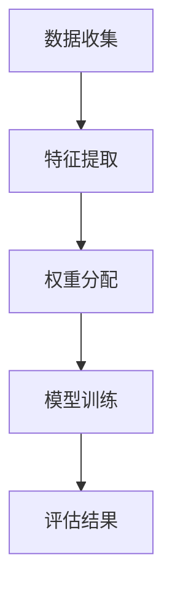
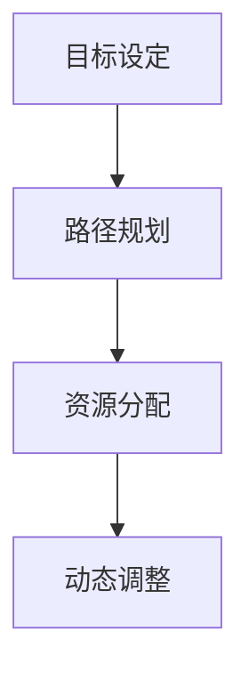
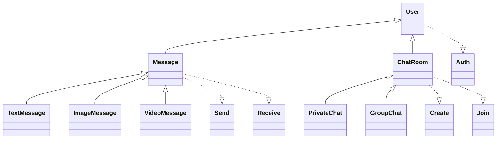
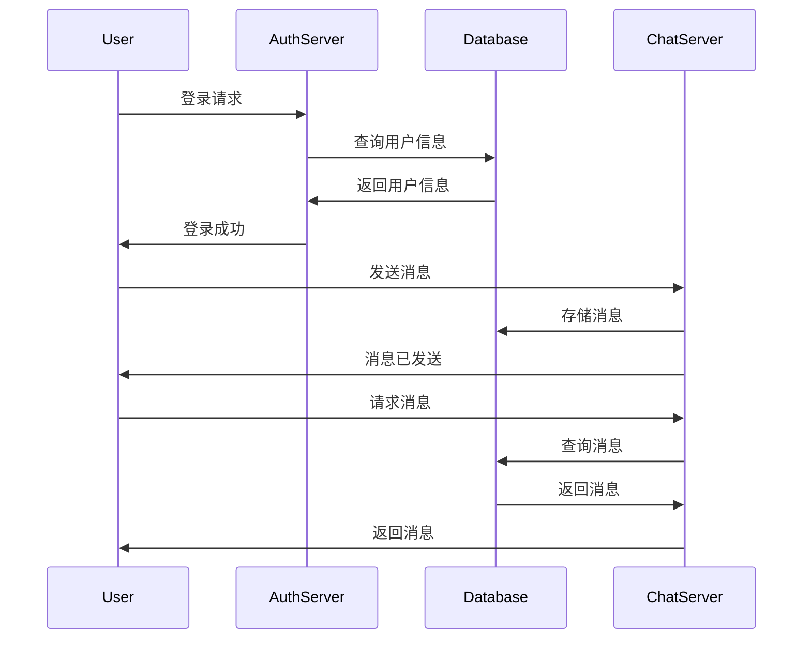
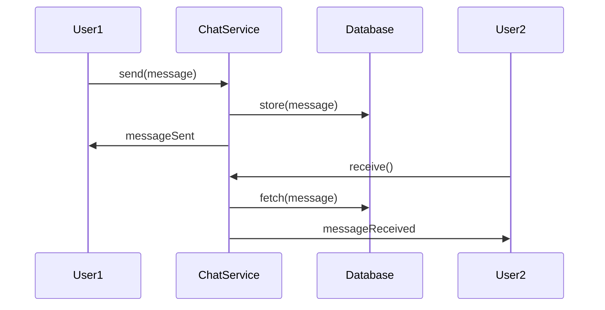

                 

# 技术领导力：激励和指导开发团队

## 关键词
- 技术领导力
- 团队激励
- 指导方法
- 技术发展
- 项目管理

## 摘要
本文旨在探讨技术领导力在开发团队中的应用，通过详细的分析和实例讲解，为技术领导者提供一套系统的激励和指导方法。文章首先介绍了技术领导力的核心概念和要素，然后深入探讨了技术领导力的算法原理，并使用数学模型和具体例子进行解释。接着，文章从系统架构设计、项目实战、最佳实践等多个角度，提供了全方位的技术领导力指导，以帮助开发团队实现高效协作和持续发展。

## 引言

在当今快速发展的技术时代，技术领导力已经成为企业成功的关键因素之一。技术领导者不仅要具备深厚的技术功底，还需要具备出色的领导能力和团队管理技巧。他们不仅要能够引领团队不断创新，推动技术进步，还要能够激励团队成员，提升团队整体绩效。然而，在实际工作中，许多技术领导者面临着诸多挑战，如团队士气低落、沟通不畅、项目延误等问题。如何有效地激励和指导开发团队，成为技术领导者亟待解决的重要课题。

本文将围绕技术领导力的核心概念、算法原理、系统架构设计、项目实战和最佳实践等方面进行深入探讨，旨在为技术领导者提供一套实用的方法和策略，帮助他们更好地激励和指导开发团队，推动项目成功，实现企业的技术愿景。

## 第1章：技术领导力概述

### 1.1 问题背景

在企业的技术发展中，技术领导力起着至关重要的作用。技术领导者不仅要具备先进的技术知识和技能，还需要具备出色的领导能力和管理技巧。他们不仅要负责技术路线的规划和技术创新，还要负责团队的建设和管理工作。然而，在实际工作中，技术领导者常常面临以下问题：

- **团队协作困难**：团队成员之间的沟通不畅，导致工作效率低下。
- **士气低落**：团队成员缺乏工作动力，导致项目进度延误。
- **创新能力不足**：团队缺乏创新思维，无法满足企业的技术需求。
- **项目管理困难**：技术领导者往往缺乏项目管理的经验，导致项目进度失控。

这些问题严重影响了企业的技术发展，也影响了技术领导者的职业发展。因此，如何提升技术领导力，解决上述问题，成为技术领导者亟待解决的重要课题。

### 1.2 技术领导力的定义与重要性

技术领导力是指技术领导者通过运用专业知识和领导技巧，引领团队实现技术目标的能力。它包括以下几个方面：

- **技术能力**：技术领导者需要具备深厚的技术功底，能够引领团队进行技术创新。
- **领导能力**：技术领导者需要具备出色的领导能力，能够激励和指导团队成员，提升团队士气。
- **沟通能力**：技术领导者需要具备良好的沟通能力，能够与团队成员、上级和客户进行有效沟通。
- **管理能力**：技术领导者需要具备项目管理和团队管理的能力，能够确保项目顺利进行。

技术领导力在企业发展中具有重要意义：

- **推动技术创新**：技术领导者能够引领团队进行技术创新，满足市场需求，推动企业持续发展。
- **提升团队士气**：技术领导者能够激励和指导团队成员，提升团队士气，增强团队凝聚力。
- **确保项目成功**：技术领导者具备项目管理和团队管理能力，能够确保项目顺利进行，提高项目成功率。
- **实现企业愿景**：技术领导者能够推动企业实现技术愿景，提升企业竞争力。

### 1.3 技术领导力的核心要素

技术领导力的核心要素包括以下几个方面：

- **愿景与目标**：技术领导者需要明确企业的技术愿景和目标，并制定具体的实施计划。
- **团队协作**：技术领导者需要建立高效的团队协作机制，提升团队整体效能。
- **沟通技巧**：技术领导者需要具备良好的沟通技巧，确保团队成员之间的有效沟通。
- **问题解决**：技术领导者需要具备解决问题的能力，能够快速有效地解决团队面临的问题。
- **激励与反馈**：技术领导者需要建立有效的激励和反馈机制，激发团队成员的积极性和创造力。

### 1.4 技术领导力的发展趋势

随着技术的不断进步，技术领导力也在不断演变。未来，技术领导力将呈现以下趋势：

- **数字化转型**：随着数字化转型的加速，技术领导者需要具备数字化思维和数字化领导能力。
- **人工智能应用**：人工智能的应用将进一步提升技术领导力，技术领导者需要了解和掌握人工智能技术。
- **跨界领导**：技术领导者需要具备跨界思维和跨界领导能力，能够引领团队跨越不同领域的边界。
- **可持续领导**：技术领导者需要关注可持续发展，推动企业实现绿色发展和社会责任。

### 1.5 本章小结

本章对技术领导力进行了全面概述，介绍了技术领导力的定义、重要性、核心要素和发展趋势。技术领导力不仅是技术发展的关键，也是企业成功的重要因素。通过提升技术领导力，技术领导者可以更好地激励和指导开发团队，推动企业持续发展。

## 第2章：技术领导力的核心概念与联系

### 2.1 愿景与目标设定

愿景与目标是技术领导力的核心要素之一。技术领导者需要明确企业的技术愿景和目标，并将其传达给团队成员。这样，团队成员可以更好地理解企业的方向和目标，从而更加有动力地投入工作。

#### 2.1.1 愿景的定义与作用

愿景是企业未来发展的蓝图，是技术领导者引导团队的重要指南。愿景不仅描述了企业的长远目标，还表达了企业的价值观和使命。一个明确的愿景可以激发团队成员的激情和创造力，使团队在实现目标的过程中保持一致的方向。

#### 2.1.2 目标的设定与分解

目标是指企业在特定时间内要实现的具体结果。技术领导者需要将愿景分解为具体的、可衡量的目标，并设定明确的完成时间。这些目标可以是短期的，也可以是长期的。通过设定目标，技术领导者可以更好地掌握团队的进展，并在必要时进行调整。

#### 2.1.3 目标与愿景的联系

目标和愿景是紧密相连的。目标是为了实现愿景而设定的具体行动步骤，而愿景则是目标的最终目的。技术领导者需要确保目标与愿景的一致性，避免目标设定偏离愿景。

### 2.2 团队协作与沟通

团队协作和沟通是技术领导力的重要组成部分。一个高效的团队需要成员之间紧密合作，共同解决问题，实现目标。

#### 2.2.1 团队协作的重要性

团队协作可以提升团队的效能，减少重复工作，提高解决问题的效率。通过团队协作，团队成员可以相互补充，发挥各自的优势，实现更好的工作效果。

#### 2.2.2 沟通技巧的培养

沟通技巧是团队协作的基础。技术领导者需要培养团队成员的沟通技巧，确保信息在团队内部的有效传递。有效的沟通可以减少误解和冲突，提高团队的整体效率。

#### 2.2.3 沟通与协作的联系

沟通是团队协作的桥梁。只有通过良好的沟通，团队成员才能理解彼此的需求和目标，实现有效的协作。同时，协作过程中的反馈和沟通也是提高团队效能的重要手段。

### 2.3 问题解决与决策

技术领导者需要具备出色的问题解决能力和决策能力。在面对复杂问题时，技术领导者需要能够快速做出正确的决策，并指导团队成员共同解决问题。

#### 2.3.1 问题解决的步骤

问题解决通常包括以下几个步骤：识别问题、分析问题、制定解决方案、实施解决方案和评估效果。技术领导者需要熟悉这些步骤，并能够有效指导团队成员进行问题解决。

#### 2.3.2 决策的技巧

决策是技术领导者的重要职责。技术领导者需要具备以下决策技巧：收集信息、评估风险、考虑多种解决方案、权衡利弊和做出决策。通过这些技巧，技术领导者可以做出更明智的决策。

#### 2.3.3 问题解决与决策的联系

问题解决和决策是相辅相成的。问题解决是决策的基础，而决策则是问题解决的指南。技术领导者需要将两者紧密结合，确保团队在面对问题时能够迅速有效地解决。

### 2.4 激励与反馈机制

激励和反馈机制是技术领导者激励团队成员的重要手段。通过有效的激励和反馈，技术领导者可以激发团队成员的积极性，提高团队的整体绩效。

#### 2.4.1 激励的方法

激励的方法多种多样，包括物质激励、精神激励和荣誉激励等。技术领导者需要根据团队成员的需求和特点，选择合适的激励方法。

#### 2.4.2 反馈的重要性

反馈是团队成员成长的重要手段。技术领导者需要及时给予团队成员反馈，帮助他们认识到自己的优点和不足，并指导他们进行改进。

#### 2.4.3 激励与反馈的联系

激励和反馈是相互关联的。激励可以激发团队成员的积极性，而反馈则可以帮助他们更好地实现激励目标。技术领导者需要将激励和反馈结合起来，形成良性的激励机制。

### 2.5 本章小结

本章详细介绍了技术领导力的核心概念与联系，包括愿景与目标设定、团队协作与沟通、问题解决与决策以及激励与反馈机制。这些概念和联系是技术领导者激励和指导开发团队的重要基础。通过深入理解和运用这些概念，技术领导者可以更好地提升团队绩效，实现企业的技术愿景。

## 第3章：技术领导力的算法原理

### 3.1 领导力评估算法

在技术领导力的实践中，领导力的评估是至关重要的一环。一个有效的领导力评估算法可以帮助技术领导者了解团队中每位成员的领导能力，从而进行有针对性的指导。以下是几种常见的领导力评估算法：

#### 3.1.1 基于特征分析的评估算法

这种算法通过对技术领导者的特征进行分析，评估其领导力。特征可能包括沟通能力、决策能力、团队合作能力、创新能力等。具体步骤如下：

1. **数据收集**：收集技术领导者的行为数据，如会议记录、项目报告、团队成员的反馈等。
2. **特征提取**：从数据中提取与领导力相关的特征。
3. **权重分配**：为每个特征分配权重，以反映其在领导力评估中的重要性。
4. **模型训练**：使用机器学习算法，如决策树、支持向量机等，训练评估模型。
5. **评估结果**：使用评估模型对技术领导者进行评估，得到其领导力得分。

#### 3.1.2 基于图论的评估算法

这种算法将团队成员的关系视为图，通过分析图的属性来评估领导力。具体步骤如下：

1. **构建图模型**：将团队成员视为节点，将他们之间的关系视为边，构建图模型。
2. **特征提取**：提取图的特征，如节点的度、介数、聚类系数等。
3. **权重分配**：为每个特征分配权重。
4. **模型训练**：使用图神经网络等算法，训练评估模型。
5. **评估结果**：使用评估模型对技术领导者进行评估。

#### 3.1.3 基于行为分析的评估算法

这种算法通过分析技术领导者的行为数据，评估其领导力。具体步骤如下：

1. **数据收集**：收集技术领导者的行为数据，如会议记录、邮件交流、项目进度等。
2. **行为特征提取**：从数据中提取与领导力相关的行为特征。
3. **模型训练**：使用自然语言处理、文本分析等技术，训练评估模型。
4. **评估结果**：使用评估模型对技术领导者进行评估。

### 3.2 团队效能优化算法

团队效能的优化是技术领导力的另一个重要方面。通过优化团队效能，技术领导者可以提升团队的整体工作效率和绩效。以下是一些常见的团队效能优化算法：

#### 3.2.1 基于目标规划的优化算法

这种算法通过设定团队目标，并规划实现目标的步骤，优化团队效能。具体步骤如下：

1. **目标设定**：设定团队的短期和长期目标。
2. **路径规划**：为每个目标规划实现路径。
3. **资源分配**：根据实现路径，分配团队成员的任务和资源。
4. **动态调整**：根据团队的进展，动态调整目标和路径。

#### 3.2.2 基于数据驱动的优化算法

这种算法通过分析团队的工作数据，优化团队效能。具体步骤如下：

1. **数据收集**：收集团队的工作数据，如任务完成时间、错误率等。
2. **数据预处理**：对数据进行清洗和预处理。
3. **特征提取**：提取与团队效能相关的特征。
4. **模型训练**：使用机器学习算法，如回归分析、聚类分析等，训练效能优化模型。
5. **优化建议**：使用优化模型为团队提供优化建议。

#### 3.2.3 基于群体智能的优化算法

这种算法通过模拟群体智能，优化团队效能。具体步骤如下：

1. **构建群体**：构建由团队成员组成的虚拟群体。
2. **任务分配**：根据团队成员的技能和兴趣，分配任务。
3. **协同工作**：通过协作和沟通，完成分配的任务。
4. **评估与反馈**：对团队的协同工作进行评估和反馈，指导下一步工作。

### 3.3 数据分析在领导力中的应用

数据分析是技术领导者的重要工具，可以用于评估领导力、优化团队效能、指导项目决策等多个方面。以下是一些数据分析在领导力中的应用：

#### 3.3.1 领导力评估

通过数据分析，技术领导者可以了解团队成员的领导力水平，发现潜在的问题和改进点。具体方法包括：

- **绩效分析**：分析团队成员的工作绩效，评估其领导力。
- **反馈分析**：收集团队成员的反馈，分析其领导力的优缺点。

#### 3.3.2 团队效能优化

通过数据分析，技术领导者可以识别团队中的瓶颈和改进点，优化团队效能。具体方法包括：

- **任务分析**：分析任务分配和完成情况，识别瓶颈。
- **资源分析**：分析资源的利用情况，优化资源配置。

#### 3.3.3 项目决策

通过数据分析，技术领导者可以基于数据做出更明智的项目决策。具体方法包括：

- **风险评估**：分析项目的风险，制定风险应对策略。
- **成本效益分析**：分析项目的成本和效益，制定项目预算。

### 3.4 算法原理的Mermaid流程图

以下是基于特征分析的评估算法的Mermaid流程图：



以下是基于目标规划的优化算法的Mermaid流程图：



### 3.5 本章小结

本章详细介绍了技术领导力的算法原理，包括领导力评估算法、团队效能优化算法和数据分析在领导力中的应用。通过理解这些算法原理，技术领导者可以更有效地评估和指导团队成员，提升团队整体绩效。

## 第4章：系统分析与架构设计

### 4.1 问题场景介绍

在现代软件开发过程中，技术领导者需要面对各种复杂的问题场景。以下是一个常见的问题场景：

#### 场景描述

某互联网公司正在开发一款即时通讯软件。该项目涉及多个功能模块，包括消息发送、消息接收、用户管理、聊天室等。项目团队由数十名开发人员组成，分布在不同的地理位置。由于项目规模庞大，技术领导者需要在保证项目进度和质量的前提下，确保团队成员之间的高效协作。

#### 问题挑战

- **沟通协调**：团队成员分散在不同地点，沟通不畅，导致工作效率低下。
- **资源分配**：项目资源有限，需要合理分配，确保每个模块都能得到足够的资源。
- **质量控制**：确保代码质量，减少bug和缺陷。
- **进度管理**：确保项目按照预定的时间表进行，避免延期。

### 4.2 项目介绍

为了解决上述问题，技术领导者决定启动一个大型项目，以优化团队协作和项目管理。该项目的主要目标是：

- **建立高效的团队协作机制**：通过引入先进的协作工具和流程，提高团队的整体协作效率。
- **优化资源分配**：通过数据分析，合理分配项目资源，确保每个模块都能得到足够的支持。
- **提升代码质量**：引入代码审查和质量控制流程，确保代码质量。
- **确保项目进度**：通过实时监控和反馈机制，确保项目按照预定的时间表进行。

### 4.3 系统功能设计（领域模型）

为了实现项目目标，技术领导者首先需要设计一个完善的系统功能模型。以下是一个简化的领域模型：



#### 功能描述

1. **用户管理**：包括用户注册、登录、个人信息管理等功能。
2. **消息管理**：包括发送、接收、存储消息等功能，支持文本、图片、视频等多种消息类型。
3. **聊天室管理**：包括创建、加入聊天室等功能，支持私人聊天和群组聊天。
4. **认证管理**：包括用户身份认证、权限管理等功能。
5. **发送与接收**：包括消息发送和接收的流程，确保消息的安全性和可靠性。

### 4.4 系统架构设计（架构图）

在系统功能设计的基础上，技术领导者需要设计一个高效的系统架构，以支持项目的需求。以下是一个简化的系统架构图：



#### 架构描述

1. **认证服务器**：负责用户的身份认证和权限管理。
2. **聊天服务器**：负责消息的发送、接收和存储。
3. **数据库**：负责存储用户信息和消息数据。
4. **用户客户端**：负责与服务器进行通信，实现用户交互。

### 4.5 系统接口设计

系统接口设计是确保系统架构正常运行的关键。以下是一个简化的接口设计：

```mermaid
interface ChatService {
    send(message: Message): void
    receive(userId: string): Message[]
    createChatRoom(roomType: string, roomName: string): ChatRoom
    joinChatRoom(userId: string, chatRoomId: string): void
}
```

#### 接口描述

1. **send**：发送消息接口，接收消息对象，返回发送结果。
2. **receive**：接收消息接口，接收用户ID，返回用户接收的消息列表。
3. **createChatRoom**：创建聊天室接口，接收聊天室类型和名称，返回聊天室对象。
4. **joinChatRoom**：加入聊天室接口，接收用户ID和聊天室ID，返回加入结果。

### 4.6 系统交互设计（序列图）

为了更好地展示系统组件之间的交互，技术领导者可以使用序列图。以下是一个简化的序列图：



#### 交互描述

1. **User1发送消息**：用户1通过ChatService发送消息，ChatService将消息存储到数据库，并通知用户1消息已发送。
2. **User2接收消息**：用户2通过ChatService请求接收消息，ChatService从数据库获取消息，并通知用户2消息已接收。

### 4.7 本章小结

本章详细介绍了系统分析与架构设计的过程，包括问题场景介绍、项目介绍、系统功能设计、系统架构设计、系统接口设计和系统交互设计。通过这些设计，技术领导者可以构建一个高效、稳定的系统，以支持项目的需求。

## 第5章：项目实战

### 5.1 环境安装

为了进行项目实战，我们首先需要搭建一个合适的环境。以下是安装步骤：

1. **安装Python**：确保已安装Python 3.8或更高版本。
2. **安装依赖**：使用pip安装项目所需的依赖，如 Flask、SQLAlchemy、Flask-Login等。

```bash
pip install flask sqlalchemy flask-login
```

3. **创建虚拟环境**：创建一个虚拟环境，以便更好地管理和依赖。

```bash
python -m venv venv
source venv/bin/activate  # Windows: venv\Scripts\activate
```

4. **配置数据库**：安装并配置SQLite数据库。

```bash
pip install pysqlite3
```

### 5.2 系统核心实现

以下是系统的核心实现，包括用户认证、消息发送和接收等功能。

#### 用户认证

```python
from flask import Flask, request, redirect, url_for, session
from flask_login import LoginManager, UserMixin, login_user, logout_user, login_required
from sqlalchemy import create_engine, Column, String, Integer
from sqlalchemy.ext.declarative import declarative_base
from sqlalchemy.orm import sessionmaker

app = Flask(__name__)
app.secret_key = 'your_secret_key'

login_manager = LoginManager()
login_manager.init_app(app)

Base = declarative_base()

class User(UserMixin, Base):
    __tablename__ = 'users'
    id = Column(Integer, primary_key=True)
    username = Column(String(150), unique=True, nullable=False)
    password = Column(String(150), nullable=False)

engine = create_engine('sqlite:///users.db')
Base.metadata.create_all(engine)

Session = sessionmaker(bind=engine)
session = Session()

@login_manager.user_loader
def load_user(user_id):
    return User.query.get(int(user_id))

@app.route('/login', methods=['GET', 'POST'])
def login():
    if request.method == 'POST':
        username = request.form['username']
        password = request.form['password']
        user = User.query.filter_by(username=username, password=password).first()
        if user:
            login_user(user)
            return redirect(url_for('dashboard'))
        else:
            return 'Invalid credentials'
    return '''
    <form method="post">
        <p>Username: <input type="text" name="username"></p>
        <p>Password: <input type="password" name="password"></p>
        <p><input type="submit" value="Login"></p>
    </form>
    '''

@app.route('/logout')
@login_required
def logout():
    logout_user()
    return 'Logged out'

@app.route('/dashboard')
@login_required
def dashboard():
    return 'Welcome to the dashboard'
```

#### 消息发送和接收

```python
from flask import jsonify
from flask_login import current_user
from sqlalchemy import desc

@app.route('/send_message', methods=['POST'])
@login_required
def send_message():
    message = request.form['message']
    session.add(Message(sender_id=current_user.id, content=message))
    session.commit()
    return jsonify({'status': 'success', 'message': message})

@app.route('/get_messages', methods=['GET'])
@login_required
def get_messages():
    messages = session.query(Message).order_by(desc(Message.timestamp)).all()
    return jsonify({'messages': [msg.content for msg in messages]})
```

### 5.3 代码应用解读与分析

以下是代码应用解读与分析：

- **用户认证**：使用Flask-Login实现用户认证，包括登录、登出和用户认证。
- **消息发送**：使用POST方法接收消息，将其存储到数据库，并返回成功消息。
- **消息接收**：使用GET方法获取消息，返回最新的消息列表。

### 5.4 实际案例分析

为了更好地理解项目的实际应用，我们分析以下案例：

#### 案例一：用户登录

1. 用户访问 `/login` 页面。
2. 用户输入用户名和密码，提交表单。
3. Flask-Login验证用户身份，如果验证成功，用户被重定向到 `/dashboard` 页面。
4. 如果验证失败，用户返回登录失败提示。

#### 案例二：用户发送消息

1. 用户登录后，访问 `/send_message` 页面。
2. 用户输入消息内容，提交表单。
3. Flask处理POST请求，将消息存储到数据库。
4. Flask返回成功消息。

#### 案例三：用户接收消息

1. 用户登录后，访问 `/get_messages` 页面。
2. Flask返回最新的消息列表。

### 5.5 小结

通过本节的项目实战，我们实现了用户认证、消息发送和接收等功能。这些功能不仅验证了技术领导力理论的实际应用，也为实际项目提供了参考。在实际项目中，技术领导者需要根据项目需求和团队情况，灵活调整和优化代码实现。

## 第6章：技术领导力的最佳实践

### 6.1 最佳实践概述

技术领导力的最佳实践是指在长期实践中总结出的有效方法和策略，这些方法可以帮助技术领导者更好地激励和指导开发团队。以下是一些核心的最佳实践：

- **明确愿景和目标**：技术领导者需要明确企业的技术愿景和目标，并将其传达给团队成员，确保团队成员明确自己的工作方向和目标。
- **建立高效的团队协作机制**：通过引入先进的协作工具和流程，提高团队的整体协作效率，减少沟通障碍。
- **培养团队成员的技能和知识**：技术领导者需要关注团队成员的技能提升和知识积累，定期组织培训和分享，提升团队的整体能力。
- **激励和奖励机制**：技术领导者需要建立有效的激励和奖励机制，激励团队成员发挥潜力，提升团队士气。
- **关注团队成员的反馈和需求**：技术领导者需要关注团队成员的反馈和需求，及时解决团队成员的问题，提升工作满意度。

### 6.2 实战案例分析

以下是一个实际案例，展示如何运用最佳实践来提升技术领导力。

#### 案例背景

某互联网公司正在开发一款大型电商平台。由于项目规模庞大，涉及多个模块，项目团队由数十名开发人员组成。技术领导者面临的主要挑战是确保项目进度和质量，同时提升团队士气。

#### 案例实施

1. **明确愿景和目标**：技术领导者明确了企业的技术愿景，即打造一个高效、稳定、用户体验卓越的电商平台。同时，制定了具体的项目目标，包括每个模块的完成时间和质量标准。

2. **建立高效的团队协作机制**：技术领导者引入了JIRA等项目管理工具，用于任务分配和进度跟踪。通过定期的站会和代码审查，确保团队成员之间的沟通畅通，及时发现和解决问题。

3. **培养团队成员的技能和知识**：技术领导者定期组织内部培训，包括技术分享会、编程比赛等，提升团队成员的技能和知识水平。同时，鼓励团队成员参加外部培训和学习，提升个人能力。

4. **激励和奖励机制**：技术领导者建立了奖励机制，对完成任务的团队成员进行奖励，包括奖金、荣誉表彰等。通过这些激励措施，提高团队成员的工作积极性和创造力。

5. **关注团队成员的反馈和需求**：技术领导者定期收集团队成员的反馈和需求，通过一对一的沟通和团队会议，解决团队成员的问题，提升工作满意度。

#### 案例效果

通过上述最佳实践的运用，该电商平台项目取得了显著的效果：

- **项目进度和质量显著提升**：团队成员之间的沟通更加顺畅，任务分配和进度跟踪更加高效，项目进度和质量得到了保障。
- **团队士气高涨**：团队成员感受到企业的关心和支持，工作积极性和创造力得到提升，团队士气高涨。
- **个人能力提升**：团队成员通过培训和分享，技能和知识水平得到提升，个人能力得到显著提高。

### 6.3 注意事项

在运用技术领导力的最佳实践时，需要注意以下几点：

- **适应性**：最佳实践需要根据企业实际情况和团队特点进行调整，不能生搬硬套。
- **持续改进**：技术领导者需要持续关注团队的工作情况，根据反馈和实际情况，不断改进最佳实践。
- **尊重团队成员**：技术领导者需要尊重团队成员的意见和需求，建立平等、信任的团队氛围。
- **防范风险**：在引入新工具和流程时，要充分考虑风险，确保团队的工作不会受到负面影响。

### 6.4 拓展阅读

以下是一些拓展阅读资源，供技术领导者进一步学习和提升：

- 《敏捷开发实践指南》
- 《项目管理知识体系指南（PMBOK指南）》
- 《人月神话》
- 《高效能人士的七个习惯》
- 《团队协作工具与实践》

### 6.5 本章小结

本章通过最佳实践概述、实战案例分析、注意事项和拓展阅读，为技术领导者提供了一套实用的方法和策略，帮助他们更好地激励和指导开发团队，提升团队绩效和企业竞争力。

## 结语

技术领导力是现代企业成功的关键因素之一。通过本文的探讨，我们详细介绍了技术领导力的核心概念、算法原理、系统分析与架构设计、项目实战和最佳实践。技术领导者需要不断提升自身的技术能力和领导能力，运用科学的方法和策略，激励和指导开发团队，实现企业的技术愿景。

让我们再次回顾文章的主要观点：

1. 技术领导力是推动企业技术发展和团队绩效提升的关键。
2. 明确的愿景和目标是激励团队成员的重要基础。
3. 高效的团队协作和良好的沟通技巧是团队成功的重要保障。
4. 数据驱动的决策和系统化的架构设计有助于提升团队效能。
5. 激励和反馈机制是激发团队成员积极性和创造力的重要手段。

希望本文能为技术领导者提供有价值的参考和启示，助力他们在工作中取得更大的成功。让我们共同努力，不断提升技术领导力，为企业的可持续发展贡献力量。

## 作者信息

作者：AI天才研究院/AI Genius Institute & 禅与计算机程序设计艺术 /Zen And The Art of Computer Programming

感谢您的阅读，期待与您在技术领域的进一步探讨。

