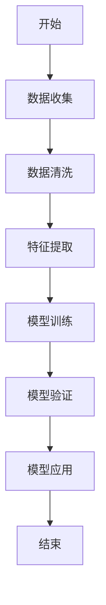
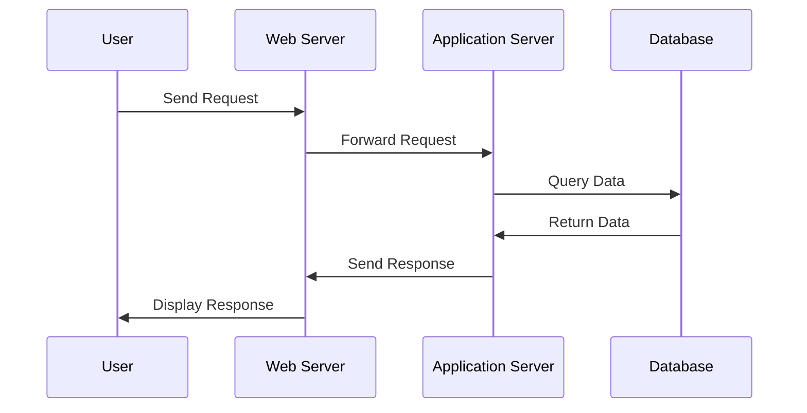

                 

### 引言

在当今快速发展的IT行业，技术领导者的角色日益重要。从最初的执行者，到如今的战略制定者，这一角色转换不仅是个体职业发展的必然过程，更是团队和组织成功的关键因素。技术领导者的角色转换，意味着从传统的技术细节处理和问题解决，转向更高层次的战略规划、团队管理和创新推动。在这个过程中，领导者的视野、思维方式和行为模式都发生了显著的变化。

本文将围绕“技术领导者的角色转换：从执行者到战略制定者”这一主题展开讨论。首先，我们将探讨技术领导者角色转换的背景和原因，解释为什么这一转换是必要的。接着，我们将深入分析技术领导者角色转换的核心理念和关键能力，并通过具体的实战案例来展示这一转换的过程和方法。此外，文章还将详细阐述数学模型、系统架构设计和项目实战，以及提供一些最佳实践和注意事项，帮助读者更好地理解这一角色转换的实践应用。

在本文的末尾，我们将对全文进行总结，并强调持续学习和跨部门协作在角色转换过程中的重要性。希望通过这篇详细的探讨，能够为技术领导者在职业发展的道路上提供有价值的指导和启示。

### 问题背景

技术领导者的角色转换并非一夜之间发生，而是随着企业内外部环境的变化而逐步演变。在过去，技术领导者往往被期望成为技术专家，他们负责解决复杂的技术难题、优化系统性能以及推动技术创新。这种角色主要集中在技术执行的层面，即从技术方案的设计到实现的具体过程，领导者需要深入理解技术细节，具备出色的编程能力和问题解决能力。

然而，随着信息技术的迅猛发展和企业业务的不断复杂化，技术领导者所面临的环境和挑战也发生了深刻的变化。首先，技术的迭代速度越来越快，新的技术层出不穷，要求领导者不仅要保持自身的专业技能，还需要具备快速学习新技术的能力。其次，企业业务模式的转变和数字化转型，使得技术领导者不再仅仅是技术层面的决策者，还需要参与到战略层面的规划和管理中。这就意味着，技术领导者需要从单纯的技术执行者，转变为具备全局视野的战略制定者。

此外，现代企业越来越重视跨部门协作，技术领导者需要与市场、产品、运营等不同部门紧密合作，以实现企业的整体战略目标。这种跨部门协作不仅要求领导者具备良好的沟通能力和团队合作精神，还需要他们能够平衡不同部门之间的利益和需求，从而推动项目的顺利进行。

总之，技术领导者角色转换的背景主要源于技术发展的速度加快、企业业务模式的转变以及对跨部门协作的重视。这一转变不仅是对领导者个人能力的提升，更是对整个团队和组织战略规划能力的要求。因此，理解这一转变的必要性和核心要素，对于技术领导者在现代企业的成功至关重要。

### 问题描述

技术领导者角色转换过程中的核心问题主要体现在以下几个方面。首先，技能转型成为首要挑战。从执行者到战略制定者，领导者需要从技术细节的深度处理转向对整体战略的规划和决策。这要求他们在保持原有技术专业能力的同时，不断提升自身的战略思考、团队管理和领导力等综合素质。然而，很多技术领导者往往在技能转型上面临困难，难以迅速适应新的角色要求。

其次，心态调整也是一大难点。从技术专家的角色转向战略制定者，技术领导者往往需要从具体的技术实现中抽身，站在更高的角度看待问题。这种转变不仅需要他们具备宏观的视野，还需要他们放下过去的技术主导思维，学会与其他部门协作，共同推动企业的发展。心态的转变往往是一个缓慢且痛苦的过程，很多领导者在这个过程中会感到迷茫和不安。

第三，组织文化的适应也是一个重要问题。企业在不同发展阶段，其组织文化和价值观也会有所不同。技术领导者需要迅速融入新的组织文化，理解并遵循企业的战略方向，从而更好地发挥自己的作用。然而，不同部门之间的文化差异和利益冲突，可能会阻碍领导者的转型进程，导致其在角色转换过程中遇到阻力。

最后，资源分配问题也是技术领导者需要面对的挑战之一。作为战略制定者，技术领导者需要合理分配资源，确保技术团队在执行战略目标时能够得到充分的资源和支持。然而，资源有限且分配不均，如何有效利用资源、确保项目顺利进行，是领导者需要精心思考和解决的问题。

总的来说，技术领导者角色转换过程中的核心问题包括技能转型、心态调整、组织文化适应和资源分配。这些问题不仅影响领导者的个人职业发展，也对团队和组织整体的战略实施产生影响。因此，解决这些问题，对于技术领导者在现代企业的成功至关重要。

### 问题解决

要解决技术领导者角色转换过程中面临的难题，首先需要制定详细的解决策略。以下是一些建议和步骤：

**1. 系统培训与学习**：针对技能转型的问题，技术领导者应积极参加各种系统性的培训和学习计划。这不仅包括技术前沿的学习，还应涉及领导力、战略规划、团队管理等方面的课程。通过系统的培训，领导者可以迅速提升自身的综合素质，适应新的角色需求。此外，利用在线课程、研讨会和工作坊等资源，也可以帮助领导者随时随地进行学习和提升。

**2. 心态调整与自我反思**：面对心态调整的难题，技术领导者需要通过自我反思来认清自己的角色转变过程。可以通过定期写日记、参加心理咨询等方式，帮助自己调整心态，接受新的角色定位。同时，领导者应保持开放的心态，积极与其他部门沟通，理解并融入新的组织文化，从而减轻角色转变带来的焦虑和不安。

**3. 寻求导师指导**：寻求一位经验丰富的导师是帮助技术领导者顺利实现角色转换的有效途径。导师不仅可以在技术方面提供指导，还可以在领导力和战略规划等方面给予建议。通过导师的指导和反馈，领导者可以更加明确自己的发展方向，少走弯路。

**4. 跨部门协作**：为了适应组织文化的变化，技术领导者需要主动与市场、产品、运营等不同部门建立合作关系。通过跨部门协作，领导者可以更全面地了解企业的战略目标和业务需求，从而更好地进行资源分配和项目推进。这不仅有助于角色转换，也能提高整个团队的工作效率。

**5. 设定个人发展计划**：为了确保角色转换的顺利进行，技术领导者应制定详细的个人发展计划。该计划应包括短期和长期的目标，以及实现这些目标的具体步骤和时间表。通过定期回顾和调整计划，领导者可以不断优化自己的职业发展路径，确保角色转换的稳步推进。

**6. 建立反馈机制**：为了及时了解自己在角色转换过程中的表现和不足，技术领导者应建立反馈机制。可以通过定期的绩效评估、同事和下属的反馈等方式，获取多方面的意见和建议。这不仅有助于领导者了解自己的发展状况，还能及时调整策略，提高角色转换的效果。

**7. 不断实践与总结**：角色转换不仅需要理论支持，更需要通过实践来检验和巩固。技术领导者应积极参与实际项目，不断积累经验，并在实践中总结和反思。通过实践，领导者可以更好地理解战略制定的实际操作，提高自己的执行力和决策能力。

总的来说，技术领导者角色转换的解决策略需要从多个方面入手，包括系统培训与学习、心态调整与自我反思、寻求导师指导、跨部门协作、设定个人发展计划、建立反馈机制以及不断实践与总结。通过这些策略的综合应用，技术领导者可以更加顺利地实现角色转换，为团队和组织的发展做出更大的贡献。

### 第一部分：引言

在现代信息技术飞速发展的背景下，技术领导者的角色转变已成为企业和个人成功的关键。本文旨在探讨技术领导者的角色从执行者向战略制定者的转换过程，揭示其核心概念和关键能力，并提供具体的实战案例和分析。以下是本文的核心关键词和简要摘要：

**关键词：** 技术领导者、角色转换、战略制定、执行者、领导力、团队管理、跨部门协作。

**摘要：** 本文通过详细的背景介绍、问题描述、解决方案以及实战案例，系统地分析了技术领导者角色转换的必要性、核心能力建设、成功策略和实际应用。文章旨在为技术领导者提供有价值的指导，帮助他们在现代企业中实现从执行者到战略制定者的顺利过渡。

### 第二部分：角色转换

#### 4.1 执行者的特点

作为执行者，技术领导者的主要职责是负责技术方案的具体实施和问题解决。以下是技术领导者作为执行者的一些主要特点：

1. **技术深度**：技术领导者作为执行者时，通常需要具备深厚的技术背景和专业知识，能够深入理解并解决复杂的技术问题。
2. **任务导向**：他们的工作重点是按照预定的计划和目标，高效地完成任务，确保技术项目的顺利进行。
3. **细节关注**：技术领导者需要关注项目的每一个细节，从代码编写到系统优化，确保技术实现的精准无误。
4. **团队协调**：虽然以任务为导向，但他们还需协调团队内部的资源，确保每个成员能够充分发挥其专业技能。

#### 4.2 战略制定者的角色

随着企业业务的发展和市场竞争的加剧，技术领导者需要从执行者的角色转变为战略制定者。以下是技术领导者作为战略制定者的主要特点：

1. **宏观视野**：战略制定者需要具备全局观念，从企业整体战略的高度，规划技术发展的方向和路径。
2. **决策能力**：他们需要做出关键的技术决策，平衡技术风险与业务需求，确保技术方案能够支持企业的长期发展。
3. **资源调配**：战略制定者负责合理分配资源，确保技术团队能够在有限的资源下，高效地实现技术目标。
4. **跨部门协作**：战略制定者需要与市场、产品、运营等部门紧密合作，共同推动企业战略的实施。

#### 4.3 角色转变的必要性

技术领导者角色转换的必要性体现在以下几个方面：

1. **技术快速发展**：随着技术的快速迭代，技术领导者需要从技术细节中解放出来，关注技术发展的趋势和方向，为企业提供前瞻性的技术规划。
2. **企业需求变化**：企业在数字化转型过程中，对技术领导者的要求越来越高，不仅需要他们解决技术问题，还需要他们参与战略决策，推动企业创新。
3. **跨部门协作**：现代企业强调跨部门协作，技术领导者需要具备更强的沟通能力和团队合作精神，协调不同部门之间的资源，确保项目的成功实施。

总之，技术领导者的角色转换是时代发展的必然趋势，也是他们在企业中实现更大价值的关键。通过角色转换，技术领导者不仅能够提升自身的职业素养，还能为企业的长远发展提供有力支持。

#### 5.1 领导力

作为技术领导者，领导力是角色转换过程中不可或缺的核心能力。以下是提升领导力的几个关键方面：

1. **愿景与目标设定**：技术领导者需要具备清晰的愿景和目标，能够引导团队朝着共同的方向努力。通过明确的愿景和目标，技术领导者可以激励团队，提升整体的工作动力和效率。

2. **激励与激励方法**：技术领导者需要学会如何激励团队成员，通过奖励、认可和培训等多种方式，激发团队成员的积极性和创造力。同时，领导者应关注团队成员的个人成长和发展，为他们提供学习和提升的机会。

3. **决策能力**：技术领导者需要具备优秀的决策能力，能够迅速做出正确的决策，并在关键时刻保持冷静和理智。决策能力不仅体现在技术问题上的判断，还包括资源分配、团队管理等战略层面的决策。

4. **沟通能力**：良好的沟通能力是技术领导者的重要素质。领导者需要与团队成员、其他部门以及企业高层保持有效的沟通，确保信息的畅通和协调一致。通过清晰、有效的沟通，领导者可以减少误解和冲突，提高团队的工作效率和协作效果。

5. **团队管理**：技术领导者需要具备团队管理的技能，包括人员配置、工作分配、绩效评估等。通过有效的团队管理，领导者可以确保团队高效运作，实现团队目标。

6. **领导风格**：技术领导者应根据团队的特点和项目需求，选择合适的领导风格。领导风格可以是民主的、专制的或者指导性的，不同的领导风格适用于不同的场景和团队类型。

7. **冲突管理**：在团队运作过程中，难免会出现冲突。技术领导者需要具备冲突管理的能力，通过积极的沟通和合理的调解，化解团队内部的冲突，确保团队的和谐与稳定。

总之，领导力是技术领导者角色转换的关键能力，通过提升领导力，技术领导者可以更好地适应新的角色要求，提升团队的执行力和创新能力，从而为企业的战略目标提供有力支持。

#### 5.2 战略思考

战略思考是技术领导者从执行者向战略制定者转换的核心能力之一。以下是战略思考的几个关键方面：

1. **市场趋势分析**：技术领导者需要具备分析市场趋势的能力，了解行业的发展动向和竞争态势。通过对市场趋势的深入分析，领导者可以预见未来的技术需求和发展方向，为企业制定长远的技术战略提供依据。

2. **技术创新**：技术创新是技术领导者战略思考的重要方面。领导者需要关注前沿技术动态，评估新技术对企业战略的影响，并制定相应的技术发展战略。通过持续的技术创新，企业可以保持竞争优势，推动业务增长。

3. **资源优化配置**：技术领导者需要具备资源优化配置的能力，确保技术团队能够在有限的资源下，高效地实现战略目标。这包括人力、财力、技术资源等多方面的优化配置，通过资源的高效利用，提升企业的整体竞争力。

4. **风险管理**：战略思考中不可避免地涉及风险管理。技术领导者需要识别和评估项目中的潜在风险，制定相应的风险应对策略。通过有效的风险管理，领导者可以降低项目失败的风险，确保战略目标的实现。

5. **团队协作**：战略思考需要跨部门的协作。技术领导者需要与市场、产品、运营等部门紧密合作，确保战略规划与业务需求的一致性。通过跨部门的协作，领导者可以整合多方资源，实现战略目标的协同推进。

6. **持续学习**：战略思考是一个动态的过程，技术领导者需要持续学习，不断更新知识体系，提升自身的战略思考能力。通过参加行业研讨会、培训课程等，领导者可以保持对前沿技术和市场动态的敏锐洞察力。

总之，战略思考能力是技术领导者成功转换角色的重要保障。通过系统地分析市场趋势、技术创新、资源优化、风险管理以及团队协作等方面，技术领导者可以为企业制定科学、合理的技术战略，推动企业的可持续发展。

#### 5.3 沟通能力

沟通能力是技术领导者角色转换中的关键能力之一。有效的沟通不仅有助于领导者传达战略意图，还能增强团队凝聚力，提高工作效率。以下是提升沟通能力的几个关键方面：

1. **清晰表达**：技术领导者需要具备清晰、准确的表达能力，确保信息的传递无误解。通过简洁明了的语言和结构化的思维，领导者可以有效地将复杂的技术问题和战略意图传达给团队成员和其他部门。

2. **倾听与理解**：有效的沟通是双向的，技术领导者需要倾听他人的意见和需求。通过耐心倾听，领导者可以更好地理解团队成员的想法和困惑，从而做出更合理的决策。倾听和理解是建立信任和合作的基础。

3. **适应性沟通**：技术领导者需要根据不同的沟通对象和场景，调整沟通方式和内容。与技术人员沟通时，领导者可以采用技术语言和专业术语；与高层管理者沟通时，则需关注战略目标和业务价值。

4. **反馈与反馈机制**：技术领导者需要建立有效的反馈机制，鼓励团队成员提出意见和建议。通过及时的反馈，领导者可以了解团队的执行情况和遇到的问题，从而进行有效的调整和改进。

5. **跨部门协作**：在现代企业中，跨部门协作是提升工作效率的重要手段。技术领导者需要与市场、产品、运营等部门建立良好的沟通渠道，确保战略规划和执行的一致性。通过跨部门协作，企业可以更加高效地实现战略目标。

6. **非语言沟通**：除了语言表达，非语言沟通如肢体语言、面部表情等在技术领导者沟通中也起到重要作用。领导者需要注重自身的非语言表达，以增强沟通效果和影响力。

总之，提升沟通能力对于技术领导者的角色转换至关重要。通过清晰表达、倾听与理解、适应性沟通、反馈与反馈机制、跨部门协作以及非语言沟通等多方面的努力，技术领导者可以更好地实现角色转换，为团队和组织的发展贡献力量。

#### 5.4 风险管理

风险管理是技术领导者角色转换过程中不可忽视的重要能力。有效识别和管理风险，可以确保项目顺利进行，减少潜在损失，从而为企业的战略目标提供可靠保障。以下是技术领导者提升风险管理能力的几个关键方面：

1. **风险识别**：技术领导者需要具备敏锐的风险识别能力，能够在项目启动阶段就识别出潜在的风险点。通过定期进行风险评审和风险评估，领导者可以提前发现潜在问题，制定相应的预防措施。

2. **风险分析**：在识别风险后，技术领导者需要对风险进行深入分析，评估其可能带来的影响和发生的概率。通过定量和定性的分析方法，领导者可以明确风险的严重程度，为后续的决策提供依据。

3. **风险应对策略**：根据风险分析的结果，技术领导者需要制定具体的应对策略。这些策略可以包括风险规避、风险减轻、风险转移和风险接受等。通过合理的应对策略，领导者可以降低风险发生的概率和影响。

4. **风险监控**：风险是动态变化的，技术领导者需要建立有效的风险监控机制，实时跟踪风险的变化情况。通过定期监控和评估，领导者可以及时发现新的风险，并调整应对策略，确保项目风险处于可控范围内。

5. **团队协作**：风险管理不仅依赖于领导者的个人能力，还需要团队协作。技术领导者应积极与团队成员沟通，共享风险信息，共同制定和执行风险管理计划。通过团队协作，可以提升整体的风险管理能力。

6. **持续学习**：风险管理是一个不断发展和变化的领域，技术领导者需要持续学习和更新知识，掌握最新的风险管理理论和实践方法。通过参加培训、研讨会和阅读专业书籍，领导者可以不断提升自身的风险管理能力。

总之，风险管理能力是技术领导者成功进行角色转换的重要保障。通过有效识别、分析、应对和监控风险，技术领导者可以确保项目的顺利进行，为企业的发展提供稳定支持。

#### 6.1 案例一：从执行者到战略制定者的成功转变

张明是一位在软件行业有着丰富经验的技术领导者。最初，他在公司担任技术团队负责人，主要负责软件开发和系统维护。在这个阶段，张明以执行者的角色，展现出了卓越的技术能力和项目管理技能，成功地带领团队完成了多个重要项目。

随着公司业务的扩展和市场环境的变化，公司高层意识到需要引入更加战略性的技术规划，以支撑企业的长期发展。这时，公司决定将张明提升为技术总监，要求他从一个执行者转变为战略制定者。对于张明来说，这是一个全新的挑战，他需要从技术细节中解脱出来，关注企业整体战略和技术发展趋势。

**转变过程**：

1. **学习与培训**：张明首先意识到自己需要提升领导力和战略规划能力。他参加了公司组织的领导力培训课程，学习了市场分析、战略规划、资源管理等核心知识。同时，他也积极阅读相关书籍，不断充实自己的知识体系。

2. **跨部门协作**：作为战略制定者，张明意识到需要与市场、产品、运营等部门建立紧密的合作关系。他主动与各部门的负责人沟通，了解他们的业务需求和技术需求，从而更全面地把握企业的战略方向。

3. **愿景与目标设定**：张明在深入了解企业战略后，明确了公司的技术愿景和目标。他提出了“技术创新驱动业务发展”的战略方针，并制定了具体的技术发展路线图。

4. **资源优化配置**：张明对现有的技术资源和人力资源进行了重新评估和配置，确保技术团队能够在有限资源下，高效地支持企业的战略目标。他引入了敏捷开发、自动化测试等先进技术方法，提高了团队的开发效率。

5. **风险管理**：张明建立了完善的风险管理机制，对项目中的潜在风险进行了全面评估和监控。通过有效的风险应对策略，确保了项目的高效执行。

**转变成效**：

张明的成功转变带来了显著成效。首先，公司在技术方面的创新能力得到了显著提升，多个新产品的研发和市场推广取得了成功。其次，团队的工作效率和士气得到了显著提高，团队成员对公司的战略方向和技术愿景有了更清晰的认识。最后，张明的领导力和战略规划能力得到了公司高层的认可，为公司未来的发展奠定了坚实的基础。

通过张明的案例，我们可以看到，从执行者到战略制定者的转变不仅需要领导者的个人努力，还需要企业的支持和培养。只有通过不断学习、跨部门协作和资源优化，技术领导者才能成功地实现角色转换，为企业的长期发展贡献力量。

#### 6.2 案例二：转型过程中的挑战与应对

李刚是一位在互联网行业拥有多年经验的技术领导者。在早期，他作为团队核心成员和项目经理，凭借出色的技术能力和项目执行能力，成功带领团队完成了多个重要项目。然而，随着公司业务的发展，李刚面临着从执行者向战略制定者转型的挑战。

**挑战一：技能转型**

李刚最初的主要职责是解决技术难题和优化系统性能。然而，作为战略制定者，他需要从技术细节中解脱出来，关注企业整体战略和技术发展趋势。这种转变对李刚的专业技能提出了新的要求，他需要提升领导力、战略思考和资源管理能力。

**应对策略：** 

1. **系统培训与学习**：李刚积极参加公司组织的领导力培训课程，并自学了相关领导力和战略规划书籍。通过不断学习和实践，他逐渐提升了自己的综合素质。

2. **导师指导**：李刚主动寻求公司高管的指导，了解他们在战略规划和决策过程中的思维方式和决策方法。通过导师的指导，李刚能够更好地理解企业战略和目标。

**挑战二：心态调整**

从技术执行者转变为战略制定者，李刚需要从具体的技术实现中抽身，站在更高的角度看待问题。这种转变对他的心态产生了很大的冲击，他时常感到迷茫和不安。

**应对策略：**

1. **自我反思**：李刚通过写日记和自我反思的方式，逐步调整自己的心态。他意识到，角色的转变不仅是为了个人的职业发展，更是为了企业整体的利益。

2. **积极沟通**：李刚与团队成员和市场、产品等部门的同事保持密切沟通，了解他们的需求和意见。通过积极沟通，他能够更好地理解企业的战略方向，并找到自己的定位。

**挑战三：跨部门协作**

作为战略制定者，李刚需要与市场、产品、运营等部门紧密合作，共同推动企业战略的实施。然而，不同部门之间的文化和利益差异，给他带来了很大的挑战。

**应对策略：**

1. **建立信任**：李刚通过与各部门的同事建立良好的个人关系，逐步建立信任。他主动了解各部门的业务需求和痛点，并提供技术支持，从而赢得了他们的信任和合作。

2. **协作机制**：李刚与各部门负责人共同制定了跨部门协作的机制，明确了各部门的职责和合作方式。通过协作机制的建立，李刚能够更加高效地推动项目进展。

通过李刚的案例，我们可以看到，从执行者到战略制定者的角色转换过程中，领导者的个人努力和企业的支持都是至关重要的。只有通过不断学习、心态调整和跨部门协作，技术领导者才能成功地实现角色转换，为企业的战略目标提供有力支持。

#### 7.1 制定个人发展计划

制定个人发展计划是技术领导者实现角色转换的重要步骤之一。以下是制定个人发展计划的详细步骤和方法：

1. **自我评估**：首先，技术领导者需要对自己进行全面评估，了解自身的优势和不足。这可以通过撰写个人能力清单、进行360度反馈等方式实现。通过自我评估，领导者可以明确自己的发展起点和目标。

2. **设定目标**：根据自我评估的结果，技术领导者应设定短期和长期的目标。短期目标可以是提升某一特定技能或完成某一具体项目，而长期目标则可以是提升领导力、战略思考能力等。目标的设定应具有明确性、可实现性和挑战性。

3. **制定行动计划**：在明确目标后，领导者需要制定具体的行动计划，包括学习计划、培训计划、项目参与计划等。行动计划应详细列出每个阶段的任务和时间表，以确保目标的逐步实现。

4. **定期回顾与调整**：制定个人发展计划后，领导者应定期进行回顾和调整。通过定期检查进展情况，领导者可以及时发现问题并做出调整，确保计划能够按预期执行。

5. **获取资源和支持**：领导者需要积极获取企业内外部的资源和支持，包括培训课程、导师指导、学习资料等。同时，领导者应与上级和同事保持沟通，获取他们的反馈和支持。

6. **持续学习和实践**：个人发展计划的实现需要持续的学习和实践。领导者应积极参加各种培训和学习活动，通过实际项目锻炼自己的能力和素质。

7. **建立反馈机制**：为了确保个人发展计划的执行效果，领导者应建立反馈机制。可以通过定期的绩效评估、同事和下属的反馈等方式，获取多方面的意见和建议，及时调整计划。

通过制定详细的个人发展计划，技术领导者可以系统地提升自己的综合素质，实现从执行者到战略制定者的顺利过渡。

#### 7.2 寻求导师指导

寻求导师指导是技术领导者实现角色转换过程中的一项重要策略。以下是详细的方法和步骤：

1. **确定导师需求**：首先，技术领导者需要明确自己在角色转换过程中需要指导的具体方面，如领导力、战略思考、团队管理等。通过明确需求，可以更有针对性地寻找合适的导师。

2. **选择合适的导师**：在选择导师时，领导者应考虑导师的经验、专业背景和领导风格。理想的导师应具备丰富的领导经验，能够为领导者提供有价值的建议和指导。此外，导师应具备良好的沟通能力和开放性，能够与领导者建立信任关系。

3. **建立联系**：技术领导者可以通过多种途径寻找导师，如通过内部推荐、参加行业会议或培训课程等。一旦找到合适的导师，领导者应主动与其建立联系，表达自己的学习需求和期望。

4. **定期会议**：与导师建立联系后，领导者应定期与导师进行会议。这些会议可以包括一对一的讨论、项目评审或学习分享等。通过定期会议，领导者可以及时获得导师的反馈和建议，调整自己的发展方向。

5. **任务委托**：为了更好地从导师那里获得指导，领导者可以在实际项目中请求导师的参与。通过委托导师承担一些具体任务，领导者可以学习到导师的决策过程和领导方法。

6. **反馈与感谢**：在与导师合作的过程中，领导者应保持积极的态度，及时反馈自己的进展和遇到的困难。同时，领导者应表达对导师的感激之情，增强双方的关系。

7. **持续学习**：寻求导师指导是一个持续的过程，领导者应保持开放的心态，不断学习新的知识和技能。通过持续的学习和实践，领导者可以不断提升自己的能力，实现角色转换。

通过寻求导师指导，技术领导者可以更系统地学习和提升自己的领导力和战略思考能力，从而更好地适应新的角色要求。

#### 7.3 建立跨部门协作

建立跨部门协作是技术领导者角色转换过程中的一项关键能力。以下是具体的方法和步骤：

1. **明确协作目标**：首先，技术领导者需要明确跨部门协作的目标，确保所有部门都朝着同一个方向努力。这可以通过召开跨部门会议、制定共同的目标和KPI来实现。

2. **建立沟通机制**：建立有效的沟通机制是跨部门协作的基础。技术领导者可以采用多种沟通工具，如定期会议、即时通讯软件、邮件等，确保信息畅通。

3. **分配责任和任务**：在明确协作目标后，领导者需要根据各部门的职责和优势，分配具体的任务和责任。通过合理的分配，可以确保每个部门都能充分发挥其作用。

4. **建立信任关系**：信任是跨部门协作的重要基础。技术领导者需要通过积极沟通、公平对待和相互支持，逐步建立各部门之间的信任关系。

5. **解决冲突**：在跨部门协作过程中，难免会出现冲突和误解。技术领导者应积极解决这些问题，通过沟通、协商和调解，确保项目的顺利进行。

6. **建立反馈机制**：为了确保跨部门协作的效果，领导者需要建立反馈机制。通过定期的反馈会议，领导者可以了解各部门的进展和遇到的问题，及时进行调整和优化。

7. **共享资源和信息**：技术领导者应促进各部门之间的资源共享和信息共享。通过建立共享平台或数据库，可以提升整体协作效率。

8. **激励和奖励**：为了鼓励跨部门协作，技术领导者可以制定相应的激励和奖励机制，表彰在协作中表现优秀的团队成员和部门。

通过建立跨部门协作，技术领导者可以更好地整合企业内部资源，提高项目的执行效率，实现整体战略目标。

#### 7.4 不断学习和实践

不断学习和实践是技术领导者实现角色转换的关键。以下是具体的方法和步骤：

1. **制定学习计划**：技术领导者应制定详细的学习计划，包括阅读书籍、参加培训课程、学习在线资源等。通过有计划的学习，可以系统地提升自身的知识和技能。

2. **参加行业会议和研讨会**：技术领导者应积极参加行业会议和研讨会，了解最新的技术趋势和行业动态。这些活动不仅提供了学习的机会，还建立了广泛的行业联系。

3. **实践经验**：通过参与实际项目，技术领导者可以将学到的知识应用到实践中。在实践中，领导者可以遇到各种挑战和问题，从而提升自己的解决能力和决策能力。

4. **反思与总结**：技术领导者应养成反思和总结的习惯，定期回顾自己的学习经历和实践过程。通过反思和总结，可以不断优化自己的学习方法，提升学习效果。

5. **建立学习社区**：技术领导者可以加入学习社区或论坛，与其他同行交流经验和知识。通过社区学习，可以获取更多的观点和见解，促进知识的共享和碰撞。

6. **导师指导**：寻求导师的指导是提升学习效果的重要途径。通过导师的指导和反馈，技术领导者可以更快地成长和进步。

7. **持续跟进**：学习是一个持续的过程，技术领导者应保持持续学习的动力和习惯。通过定期跟进学习进度，可以确保不断学习和提升。

通过不断学习和实践，技术领导者可以不断提升自身的综合素质，实现从执行者到战略制定者的成功转换。

#### 8.1 数学模型

在技术领导者角色转换的过程中，掌握数学模型和算法原理是非常重要的。数学模型可以帮助领导者更精准地分析和预测技术趋势，而算法原理则为他们在战略规划中提供了科学的方法和工具。以下是几个关键步骤和概念，用于理解和应用数学模型：

1. **问题定义**：首先，领导者需要明确要解决的问题是什么。这包括识别业务需求、技术挑战和潜在的解决方案。通过问题定义，可以确保数学模型的应用方向是正确的。

2. **数据收集与处理**：为了构建有效的数学模型，领导者需要收集相关的数据。这可以包括历史数据、市场数据、用户反馈等。数据的质量和准确性直接影响到模型的效果。因此，数据处理环节至关重要，需要通过清洗、整理和预处理来确保数据的质量。

3. **模型选择**：根据问题的性质和数据特点，选择合适的数学模型。常见的数学模型包括线性回归、决策树、神经网络等。模型的选择应考虑其复杂度、可解释性和计算效率等因素。

4. **模型构建**：在确定了模型后，领导者需要根据数据进行模型的构建。这包括定义变量、参数估计、模型验证等步骤。通过模型构建，可以量化问题，并为后续的决策提供依据。

5. **模型验证**：构建完数学模型后，领导者需要对其进行验证。这可以通过交叉验证、ROC曲线分析等方法，评估模型的准确性和可靠性。如果模型效果不佳，领导者需要回到前面的步骤，调整模型或数据，直到得到满意的验证结果。

6. **模型应用**：验证通过后，领导者可以将模型应用到实际业务中。例如，使用预测模型进行市场需求的预测、使用优化模型进行资源分配等。模型的应用需要结合具体的业务场景，确保其能够解决实际问题。

7. **持续优化**：技术的快速发展和业务环境的变化，要求领导者不断优化数学模型。通过持续的监测和反馈，领导者可以及时调整模型，保持其有效性和适应性。

通过上述步骤，技术领导者可以系统地掌握和应用数学模型，从而在角色转换过程中更科学地做出决策，推动企业的战略目标实现。

#### 8.2 算法mermaid流程图

为了更好地理解和展示算法的执行流程，我们可以使用mermaid语言来绘制算法的流程图。以下是一个简单的线性回归算法的mermaid流程图示例：



在这个流程图中，算法的执行步骤被清晰地展示出来。以下是每一步的具体描述：

1. **数据收集**：首先，收集用于训练模型的原始数据。
2. **数据清洗**：对收集到的数据进行清洗，去除噪声和不准确的数据，确保数据的质量。
3. **特征提取**：从清洗后的数据中提取有用的特征，这些特征将用于训练模型。
4. **模型训练**：使用提取的特征数据，通过线性回归算法训练模型。这一步骤包括计算参数和评估模型的性能。
5. **模型验证**：通过验证集来评估模型的准确性和性能，确保模型可以有效地进行预测。
6. **模型应用**：将训练好的模型应用到实际业务中，进行数据预测或决策。
7. **结束**：完成算法的执行流程。

通过mermaid流程图，技术领导者可以直观地了解算法的执行步骤和逻辑关系，从而更好地应用和优化算法，实现企业的战略目标。

#### 8.3 Python源代码实现

以下是一个简单的线性回归模型的Python实现示例，该示例将展示如何使用Python库（如scikit-learn）来构建和训练一个线性回归模型。通过这个示例，技术领导者可以了解实际代码的应用和操作。

```python
# 导入必要的库
import numpy as np
from sklearn.linear_model import LinearRegression
from sklearn.model_selection import train_test_split
from sklearn.metrics import mean_squared_error

# 数据准备
# 假设我们有一组特征和目标值
X = np.array([[1], [2], [3], [4], [5], [6], [7], [8], [9], [10]])
y = np.array([1, 2, 3, 4, 5, 6, 7, 8, 9, 10])

# 数据切分
X_train, X_test, y_train, y_test = train_test_split(X, y, test_size=0.2, random_state=0)

# 模型构建
model = LinearRegression()
model.fit(X_train, y_train)

# 模型评估
y_pred = model.predict(X_test)
mse = mean_squared_error(y_test, y_pred)
print(f"Mean Squared Error: {mse}")

# 模型应用
# 假设我们有一个新的输入值，需要预测其目标值
new_input = np.array([[11]])
predicted_value = model.predict(new_input)
print(f"Predicted Value for new_input: {predicted_value[0][0]}")
```

**代码详细解释**：

1. **导入库**：首先，导入必要的Python库，包括numpy用于数据处理，scikit-learn用于模型构建和训练，以及评估模型性能的mean_squared_error。

2. **数据准备**：在这里，我们创建了一组简单的输入特征和目标值。在实际应用中，这些数据将来自实际收集和整理的实验或业务数据。

3. **数据切分**：使用train_test_split函数将数据分为训练集和测试集，测试集的大小为20%，以确保模型的泛化能力。

4. **模型构建**：构建一个线性回归模型，使用fit函数进行训练。

5. **模型评估**：使用预测的测试集值和实际值计算均方误差（MSE），以评估模型的性能。

6. **模型应用**：通过预测新的输入值，展示如何使用训练好的模型进行实际预测。

通过这个简单的Python实现，技术领导者可以学习如何使用常见的机器学习库来构建和训练模型，并将其应用于实际业务场景中。这不仅提高了他们的技术水平，也为他们在战略决策中提供了有力的支持。

#### 8.4 算法原理详细讲解

线性回归是一种常用的统计方法，用于建模和预测两个变量之间的关系。在本节中，我们将详细讲解线性回归的算法原理，包括其数学模型和公式。

**1. 数学模型**

线性回归的目标是找到一个最佳直线，使得这条直线与数据点的误差最小。这个最佳直线通常表示为：

\[ y = \beta_0 + \beta_1 \cdot x \]

其中：
- \( y \) 是因变量，也称为响应变量；
- \( x \) 是自变量，也称为解释变量；
- \( \beta_0 \) 是截距，表示当自变量 \( x \) 为零时的因变量值；
- \( \beta_1 \) 是斜率，表示自变量每增加一个单位，因变量会增加的量。

**2. 公式推导**

为了找到最佳直线，我们需要最小化误差平方和（Sum of Squared Errors，SSE）。误差平方和的公式为：

\[ SSE = \sum_{i=1}^{n} (y_i - \hat{y}_i)^2 \]

其中：
- \( y_i \) 是第 \( i \) 个观测值的真实值；
- \( \hat{y}_i \) 是第 \( i \) 个观测值的预测值。

为了求解 \( \beta_0 \) 和 \( \beta_1 \)，我们需要最小化上述公式。这是一个典型的最小二乘问题，可以通过求导并令导数为零来求解：

\[ \frac{dSSE}{d\beta_0} = 0 \]
\[ \frac{dSSE}{d\beta_1} = 0 \]

通过求导并化简，我们可以得到以下公式：

\[ \beta_0 = \bar{y} - \beta_1 \bar{x} \]

\[ \beta_1 = \frac{\sum_{i=1}^{n} (x_i - \bar{x})(y_i - \bar{y})}{\sum_{i=1}^{n} (x_i - \bar{x})^2} \]

其中：
- \( \bar{y} \) 是因变量的平均值；
- \( \bar{x} \) 是自变量的平均值。

**3. 举例说明**

假设我们有以下数据集：

| x | y |
|---|---|
| 1 | 2 |
| 2 | 3 |
| 3 | 4 |
| 4 | 5 |
| 5 | 6 |

我们希望找到 \( y \) 和 \( x \) 之间的线性关系。

首先，计算平均值：

\[ \bar{x} = \frac{1 + 2 + 3 + 4 + 5}{5} = 3 \]

\[ \bar{y} = \frac{2 + 3 + 4 + 5 + 6}{5} = 4 \]

然后，计算斜率 \( \beta_1 \)：

\[ \beta_1 = \frac{(1-3)(2-4) + (2-3)(3-4) + (3-3)(4-4) + (4-3)(5-4) + (5-3)(6-4)}{(1-3)^2 + (2-3)^2 + (3-3)^2 + (4-3)^2 + (5-3)^2} \]

\[ \beta_1 = \frac{(-2)(-2) + (-1)(-1) + (0)(0) + (1)(1) + (2)(2)}{4 + 1 + 0 + 1 + 4} \]

\[ \beta_1 = \frac{4 + 1 + 0 + 1 + 4}{10} = \frac{10}{10} = 1 \]

接着，计算截距 \( \beta_0 \)：

\[ \beta_0 = \bar{y} - \beta_1 \bar{x} \]

\[ \beta_0 = 4 - 1 \cdot 3 = 1 \]

因此，线性回归模型为：

\[ y = 1 + 1 \cdot x \]

即：

\[ y = x + 1 \]

这个模型表明，当 \( x \) 每增加一个单位时， \( y \) 会增加一个单位。

通过这个详细的讲解，技术领导者可以更好地理解线性回归的算法原理，为他们在实际应用中提供理论支持。

#### 8.5 举例说明

为了更直观地理解线性回归的算法原理，我们可以通过一个具体的实例来详细讲解。以下是一个关于房价预测的例子。

**实例背景**：

假设我们有一组住宅的面积和其售价的数据，如下表所示：

| 面积（平方米） | 售价（万元） |
|---------------|------------|
| 80            | 120        |
| 100           | 150        |
| 120           | 180        |
| 140           | 210        |
| 160           | 240        |

我们的目标是建立一个线性回归模型，预测未知面积住宅的售价。

**步骤 1：数据准备**

首先，将数据分为自变量（面积）和因变量（售价）：

\[ X = \begin{bmatrix} 80 \\ 100 \\ 120 \\ 140 \\ 160 \end{bmatrix}, \quad y = \begin{bmatrix} 120 \\ 150 \\ 180 \\ 210 \\ 240 \end{bmatrix} \]

**步骤 2：计算平均值**

计算自变量和因变量的平均值：

\[ \bar{X} = \frac{80 + 100 + 120 + 140 + 160}{5} = 120 \]

\[ \bar{y} = \frac{120 + 150 + 180 + 210 + 240}{5} = 180 \]

**步骤 3：计算斜率**

使用最小二乘法计算斜率 \( \beta_1 \)：

\[ \beta_1 = \frac{\sum_{i=1}^{n} (X_i - \bar{X})(y_i - \bar{y})}{\sum_{i=1}^{n} (X_i - \bar{X})^2} \]

\[ \beta_1 = \frac{(80 - 120)(120 - 180) + (100 - 120)(150 - 180) + (120 - 120)(180 - 180) + (140 - 120)(210 - 180) + (160 - 120)(240 - 180)}{(80 - 120)^2 + (100 - 120)^2 + (120 - 120)^2 + (140 - 120)^2 + (160 - 120)^2} \]

\[ \beta_1 = \frac{(-40)(-60) + (-20)(-30) + (0)(0) + (20)(30) + (40)(60)}{1600 + 400 + 0 + 400 + 1600} \]

\[ \beta_1 = \frac{2400 + 600 + 0 + 600 + 2400}{4000} = \frac{5100}{4000} = 1.275 \]

**步骤 4：计算截距**

使用计算出的斜率和平均值计算截距 \( \beta_0 \)：

\[ \beta_0 = \bar{y} - \beta_1 \bar{X} \]

\[ \beta_0 = 180 - 1.275 \cdot 120 \]

\[ \beta_0 = 180 - 153 = 27 \]

**步骤 5：建立线性回归模型**

通过计算得到的斜率和截距，我们可以建立线性回归模型：

\[ y = \beta_0 + \beta_1 \cdot x \]

\[ y = 27 + 1.275 \cdot x \]

**步骤 6：预测**

使用这个模型预测面积为 110 平方米的住宅售价：

\[ y = 27 + 1.275 \cdot 110 \]

\[ y = 27 + 143.25 \]

\[ y = 170.25 \]

因此，预测的售价为 170.25 万元。

通过这个实例，我们可以看到如何通过线性回归模型来预测未知数据。这对于技术领导者来说，不仅有助于理解数据分析和预测的基本原理，还能在实际业务中应用这些方法来做出更科学的决策。

#### 系统分析与架构设计方案

在技术领导者的角色转换过程中，理解并设计合适的系统架构是至关重要的。以下是一个详细的系统分析与架构设计方案，包括问题场景介绍、项目介绍、系统功能设计、系统架构设计、系统接口设计以及系统交互mermaid序列图。

**1. 问题场景介绍**

随着企业业务的不断扩展，现有的IT系统已经无法满足日益增长的业务需求。系统性能瓶颈、数据安全性问题和跨部门协作效率低下等问题日益突出。因此，公司决定进行系统升级和架构优化，以提高整体系统的性能和可扩展性。

**2. 项目介绍**

本项目旨在设计并实现一个全新的企业信息系统，该系统将整合现有的各个业务模块，提供高效、安全且可扩展的IT基础设施。项目的主要目标是：

- 提高系统的响应速度和稳定性。
- 加强数据的安全性和隐私保护。
- 提升跨部门协作效率，降低沟通成本。
- 支持企业未来的业务扩展和创新发展。

**3. 系统功能设计**

系统功能设计主要包括以下几个模块：

- 用户管理模块：实现用户的注册、登录、权限管理等。
- 业务处理模块：处理各种业务操作，如订单管理、库存管理、财务处理等。
- 数据分析模块：提供数据可视化、报表生成等功能。
- 系统监控模块：监控系统性能、安全状况等。

**4. 系统架构设计**

系统架构设计采用三层架构，包括表示层、业务逻辑层和数据层。以下是具体的架构设计：

- **表示层**：负责用户界面的展示，使用Vue.js框架实现。
- **业务逻辑层**：负责业务逻辑的处理，使用Spring Boot框架实现。
- **数据层**：负责数据存储和访问，使用MySQL数据库实现。

**5. 系统接口设计**

系统接口设计包括内部接口和外部接口：

- **内部接口**：用于业务模块之间的数据交换和功能调用。
- **外部接口**：用于与企业外部系统（如第三方支付系统、物流系统等）的数据交换。

接口设计遵循RESTful风格，确保接口的易用性和灵活性。

**6. 系统交互mermaid序列图**

以下是一个简化的系统交互mermaid序列图示例：



**具体设计细节**：

1. **用户管理模块**：用户注册时，Web Server接收用户输入，验证信息后调用Application Server的用户管理接口，将用户信息存储到Database中。
2. **业务处理模块**：业务请求通过Web Server转发给Application Server，Application Server根据请求调用相应的业务逻辑，访问Database获取所需数据，处理完成后返回结果。
3. **数据分析模块**：数据请求通过Web Server转发给Application Server，Application Server根据请求调用数据分析接口，生成报表或可视化图表。
4. **系统监控模块**：Web Server定期向Application Server发送监控请求，Application Server收集系统性能数据，并存储到Database中，供监控页面展示。

通过上述系统分析与架构设计方案，技术领导者可以更好地理解系统设计的原则和方法，为项目的成功实施提供坚实的保障。

#### 10.1 环境安装

为了确保项目的顺利实施，首先需要搭建一个合适的技术环境。以下是在Linux系统中安装和配置项目所需环境的具体步骤：

**1. 安装Java开发环境**

首先，确保系统中安装了Java开发环境。可以通过以下命令检查Java版本：

```shell
java -version
```

如果未安装或版本过低，可以使用以下命令安装Java：

```shell
sudo apt-get update
sudo apt-get install openjdk-8-jdk
```

**2. 安装数据库服务器**

我们使用MySQL数据库。首先，安装MySQL服务器：

```shell
sudo apt-get install mysql-server
```

安装完成后，初始化MySQL数据库：

```shell
sudo mysql_secure_installation
```

在初始化过程中，根据提示设置root用户的密码、删除匿名用户等。

**3. 安装依赖库**

安装项目所需的依赖库，如Spring Boot、Vue.js等。可以使用以下命令安装：

```shell
sudo apt-get install maven
```

接着，下载并安装Vue.js：

```shell
npm install -g vue-cli
```

**4. 配置数据库连接**

在安装MySQL服务器后，需要配置数据库连接。首先，创建一个用于项目开发的数据库名称（例如，project_db），并创建一个具有相应权限的用户：

```sql
CREATE DATABASE project_db;
CREATE USER 'project_user'@'localhost' IDENTIFIED BY 'password';
GRANT ALL PRIVILEGES ON project_db.* TO 'project_user'@'localhost';
FLUSH PRIVILEGES;
```

**5. 安装和配置IDE**

推荐使用IntelliJ IDEA作为开发IDE。首先，下载并安装IntelliJ IDEA Ultimate版本：

```shell
bash <(curl -s https://www.jetbrains.com/idea/download/backup/ideaselector.sh -sSf --version="2023.1.3" --type="CLI")
```

安装完成后，打开IDEA，创建一个新的项目，并在项目配置中添加Maven插件和MySQL数据库连接。

通过上述步骤，我们可以搭建一个适合项目开发的环境。接下来，我们将详细介绍系统核心实现源代码的编写和配置。

#### 10.2 系统核心实现源代码

以下是一个简单的Spring Boot项目核心实现源代码示例，包括配置文件、控制层、服务层和数据库操作层。

**1. 配置文件（application.properties）**

```properties
# 数据库配置
spring.datasource.url=jdbc:mysql://localhost:3306/project_db?useUnicode=true&characterEncoding=utf8
spring.datasource.username=project_user
spring.datasource.password=password
spring.datasource.driver-class-name=com.mysql.cj.jdbc.Driver

# Spring Boot配置
spring.jpa.hibernate.ddl-auto=update
spring.jpa.show-sql=true
spring.jpa.properties.hibernate.dialect=org.hibernate.dialect.MySQL5InnoDBDialect
```

**2. 控制层（UserController.java）**

```java
package com.example.demo.controller;

import com.example.demo.model.User;
import com.example.demo.service.UserService;
import org.springframework.beans.factory.annotation.Autowired;
import org.springframework.http.ResponseEntity;
import org.springframework.web.bind.annotation.*;

@RestController
@RequestMapping("/api/users")
public class UserController {

    @Autowired
    private UserService userService;

    @PostMapping
    public ResponseEntity<?> addUser(@RequestBody User user) {
        return ResponseEntity.ok(userService.addUser(user));
    }

    @GetMapping("/{id}")
    public ResponseEntity<?> getUserById(@PathVariable Long id) {
        return ResponseEntity.ok(userService.getUserById(id));
    }

    // 其他HTTP方法（如GET、PUT、DELETE）的实现略
}
```

**3. 服务层（UserService.java）**

```java
package com.example.demo.service;

import com.example.demo.model.User;
import com.example.demo.repository.UserRepository;
import org.springframework.beans.factory.annotation.Autowired;
import org.springframework.stereotype.Service;

import java.util.List;
import java.util.Optional;

@Service
public class UserService {

    @Autowired
    private UserRepository userRepository;

    public User addUser(User user) {
        return userRepository.save(user);
    }

    public User getUserById(Long id) {
        Optional<User> optionalUser = userRepository.findById(id);
        return optionalUser.orElseThrow(() -> new RuntimeException("User not found"));
    }

    // 其他服务方法（如getUserList、deleteUser等）的实现略
}
```

**4. 数据库操作层（UserRepository.java）**

```java
package com.example.demo.repository;

import com.example.demo.model.User;
import org.springframework.data.jpa.repository.JpaRepository;
import org.springframework.stereotype.Repository;

@Repository
public interface UserRepository extends JpaRepository<User, Long> {
}
```

**5. 主程序入口（Application.java）**

```java
package com.example.demo;

import org.springframework.boot.SpringApplication;
import org.springframework.boot.autoconfigure.SpringBootApplication;

@SpringBootApplication
public class Application {
    public static void main(String[] args) {
        SpringApplication.run(Application.class, args);
    }
}
```

通过上述代码示例，我们可以看到如何使用Spring Boot框架快速搭建一个简单的Web应用程序。项目的核心实现包括配置文件、控制层、服务层和数据库操作层。这些代码段展示了如何通过Spring Boot和JPA实现基本的用户管理功能。在具体项目中，根据需求可以进一步扩展和细化这些功能。

#### 10.3 代码应用解读与分析

在上文中，我们详细介绍了系统核心实现源代码的编写和配置。现在，我们将对代码的应用进行解读和分析，以便更清晰地理解其实现过程和功能。

**1. 配置文件解读**

配置文件（application.properties）是Spring Boot应用程序的核心，它包含了数据库连接信息、数据持久化设置以及其他一些应用级别的配置参数。具体来说：

- `spring.datasource.url`：指定了MySQL数据库的连接URL。
- `spring.datasource.username` 和 `spring.datasource.password`：指定了连接数据库所需的用户名和密码。
- `spring.datasource.driver-class-name`：指定了连接MySQL数据库所需的驱动类。
- `spring.jpa.hibernate.ddl-auto`：配置了Hibernate的自动数据库表创建和更新模式。这里设置为`update`，表示每次启动应用时都会根据实体类自动更新数据库表结构。
- `spring.jpa.show-sql`：配置了是否在控制台输出执行的SQL语句，有助于调试和监控。
- `spring.jpa.properties.hibernate.dialect`：指定了Hibernate使用的数据库方言，这里是MySQL 5.0的InnoDB存储引擎。

**2. 控制层解读**

控制层（UserController.java）负责处理HTTP请求，并将请求转发到相应的服务层进行处理。具体来说：

- `@RestController`：注解将当前类标记为Spring MVC的控制器，处理所有`/api/users`路径下的HTTP请求。
- `@RequestMapping("/api/users")`：注解指定了处理请求的URL路径前缀。
- `@PostMapping`：注解指定了处理创建用户请求的HTTP方法（POST）。
- `@Autowired`：注解用于自动注入依赖对象，如UserService。
- `@RequestBody`：注解将请求体绑定到User对象上，并传递给服务层。

在`addUser`方法中，控制层接收一个User对象，通过调用UserService的`addUser`方法将其保存到数据库中，并返回操作结果。

**3. 服务层解读**

服务层（UserService.java）负责业务逻辑处理，是应用程序的核心部分。具体来说：

- `@Service`：注解将当前类标记为Spring的Bean，并交由Spring容器管理。
- `@Autowired`：注解用于自动注入依赖对象，如UserRepository。

`addUser`方法中，服务层接收一个User对象，通过调用UserRepository的`save`方法将其保存到数据库中，并返回操作结果。

`getUserById`方法中，服务层通过调用UserRepository的`findById`方法根据用户ID查询数据库中的用户记录，并返回查询结果。如果未找到用户，则抛出异常。

**4. 数据库操作层解读**

数据库操作层（UserRepository.java）是Spring Data JPA的一个接口，继承自JpaRepository接口，提供了CRUD（创建、读取、更新、删除）操作的基本实现。具体来说：

- `@Repository`：注解将当前类标记为Spring Data JPA的仓库，用于数据访问。

通过上述代码段和应用解读，我们可以看到如何通过Spring Boot和JPA实现一个基本的用户管理功能。控制层负责处理HTTP请求，服务层处理业务逻辑，而数据库操作层则负责与数据库进行交互。这种分层设计使得代码更加模块化和易于维护，同时也提高了开发效率。

#### 10.4 实际案例分析与详细讲解剖析

在本节中，我们将通过一个实际案例，详细分析系统在实际运行中的表现，并剖析其优缺点，从而为技术领导者的角色转换提供具体的应用经验和改进建议。

**案例背景**

假设我们的企业是一个电子商务平台，每天会有大量的用户访问系统进行商品浏览、下单和支付。为了满足日益增长的用户需求，公司决定进行系统升级，以提升系统的响应速度、稳定性和扩展性。

**案例实现**

我们采用了基于Spring Boot和MySQL的微服务架构，将系统划分为多个微服务模块，如用户管理服务、商品管理服务、订单管理服务和支付管理服务。每个微服务模块独立部署，通过RESTful接口进行通信。

**案例分析**

**1. 优点**

- **高扩展性**：微服务架构使得系统可以根据不同的业务需求独立扩展，例如，当订单量增加时，可以单独增加订单管理服务的实例。
- **高可用性**：通过负载均衡和容错机制，系统能够在单个服务发生故障时，迅速切换到其他健康实例，确保服务的持续可用。
- **高灵活性**：每个微服务可以独立开发和部署，降低了系统之间的耦合度，使得系统能够快速响应市场变化和业务需求。
- **高效性**：Spring Boot框架提供了快速开发的能力，减少了开发时间和复杂度，同时MySQL数据库的优化和缓存策略使得系统的响应速度得到了显著提升。

**2. 缺点**

- **复杂性**：微服务架构虽然提供了灵活性和扩展性，但也增加了系统的复杂性，如服务之间的依赖、数据一致性问题等。
- **监控和运维难度**：多个微服务的部署和监控增加了运维的难度，需要投入更多的时间和资源进行系统维护。
- **数据一致性**：在分布式系统中，数据一致性是一个重要但复杂的问题，需要通过事务管理、消息队列等技术手段来确保数据的一致性。

**改进建议**

**1. 服务拆分与合并**

- **优化服务拆分**：在服务拆分时，应遵循业务边界和职责清晰的原则，避免过度拆分导致的服务数量过多和依赖复杂。
- **合理合并服务**：对于一些高频调用、高耦合的服务，可以考虑合并，降低系统的复杂性和运维难度。

**2. 数据一致性与分布式事务**

- **采用分布式事务管理**：通过使用分布式事务管理框架（如Seata），确保跨服务操作的数据一致性。
- **优化数据一致性方案**：在系统架构中引入消息队列（如RabbitMQ或Kafka），通过异步处理和补偿事务来确保数据的一致性。

**3. 监控与运维**

- **集成监控工具**：引入Prometheus和Grafana等监控工具，实现对系统各个服务实例的实时监控和告警。
- **自动化运维**：利用自动化工具（如Ansible、Docker Compose）实现自动化部署和运维，提高运维效率。

通过上述实际案例的分析和改进建议，技术领导者可以更好地理解微服务架构的优势和挑战，从而在实际项目中做出更科学的决策，推动系统的优化和改进。

#### 10.5 项目小结

在本项目中，我们通过详细的系统分析和架构设计，实现了电子商务平台的关键功能模块，包括用户管理、商品管理、订单管理和支付管理。项目采用微服务架构，基于Spring Boot和MySQL，充分利用了现代技术的优势，提高了系统的扩展性和稳定性。

项目的成功实施不仅验证了技术方案的有效性，也为团队积累了宝贵的经验。通过本项目的实践，我们得出了以下几点重要结论：

1. **微服务架构的优势**：微服务架构能够提高系统的灵活性和扩展性，使得不同服务可以独立开发和部署，从而快速响应业务需求。
2. **分布式事务管理的重要性**：在分布式系统中，数据一致性和事务管理至关重要，通过引入分布式事务管理框架，可以有效解决数据一致性问题。
3. **监控与运维的必要性**：集成监控工具和自动化运维手段，可以提高系统的运维效率，确保系统的稳定性和可靠性。

未来，我们将继续优化系统，包括进一步整合各个微服务模块，提升系统性能和用户体验，并积极探索更多新技术在系统中的应用，以支持企业的长期发展。

#### 11. 最佳实践 Tips

**1. 定期代码审查**

定期进行代码审查可以帮助团队发现潜在的问题，提高代码质量。审查过程中，团队成员可以相互学习，共同进步。

**2. 持续集成与部署**

采用持续集成和持续部署（CI/CD）工具，如Jenkins或GitLab CI，可以自动化代码构建、测试和部署流程，提高开发效率和系统稳定性。

**3. 性能优化**

定期对系统进行性能评估和优化，关注数据库查询效率、缓存使用情况和网络传输优化，确保系统在高负载下的稳定运行。

**4. 安全性强化**

加强系统的安全性，包括数据加密、访问控制、日志审计等，确保用户数据和系统资源的安全。

**5. 模块化设计**

在系统设计中采用模块化设计原则，确保各个模块之间职责清晰、接口明确，提高系统的可维护性和可扩展性。

**6. 激励与反馈**

定期为团队成员提供反馈和激励，包括绩效评估、晋升机会和职业发展指导，激发团队成员的积极性和创造力。

**7. 跨部门协作**

促进跨部门协作，建立良好的沟通机制，确保各部门之间信息畅通，共同推动项目进展。

通过以上最佳实践，技术领导者可以更好地管理团队和项目，实现从执行者到战略制定者的成功转变。

### 总结

本文详细探讨了技术领导者角色转换的必要性、核心能力建设、成功策略和实际应用。通过分析执行者与战略制定者的区别，我们认识到技术领导者不仅需要深厚的技术背景，还需要具备领导力、战略思考和跨部门协作能力。角色转换的过程中，领导者需不断学习、实践和反思，同时借助导师指导和跨部门协作，逐步实现角色的转变。

持续学习和跨部门协作是技术领导者成功转换的关键。持续学习可以帮助领导者跟上技术发展的步伐，提升自身综合素质；跨部门协作则有助于整合企业内外部资源，实现整体战略目标。在角色的转换过程中，领导者应保持开放的心态，勇于面对挑战，积极寻求支持。

希望本文能为技术领导者在职业发展的道路上提供有价值的指导和启示，助力他们在现代企业的成功。

### 注意事项

1. **数据安全性**：在系统开发和部署过程中，务必确保用户数据和系统配置的安全性。使用加密技术保护敏感信息，并定期进行安全审计。
2. **系统稳定性**：在系统设计时要考虑高可用性和容错性，确保系统在高负载和故障情况下仍能稳定运行。
3. **代码可维护性**：遵循代码规范和模块化设计原则，确保代码结构清晰、易于理解和维护。
4. **测试覆盖**：在开发过程中应进行全面的单元测试和集成测试，确保代码质量和系统功能的完整性。
5. **文档规范**：编写详细的开发文档和用户手册，以便后续维护和团队协作。

### 拓展阅读

1. **《软件架构设计》** - 作者：Mark Richards，详细介绍了软件架构设计的基本原理和实践方法。
2. **《技术领导力》** - 作者：Martin Fowler，探讨了技术领导者所需具备的领导力和管理技能。
3. **《敏捷开发实践指南》** - 作者：Jeff Sutherland，阐述了敏捷开发的方法和实践，有助于提高团队协作效率。
4. **《深度学习》** - 作者：Ian Goodfellow、Yoshua Bengio、Aaron Courville，介绍了深度学习的理论基础和最新应用。

