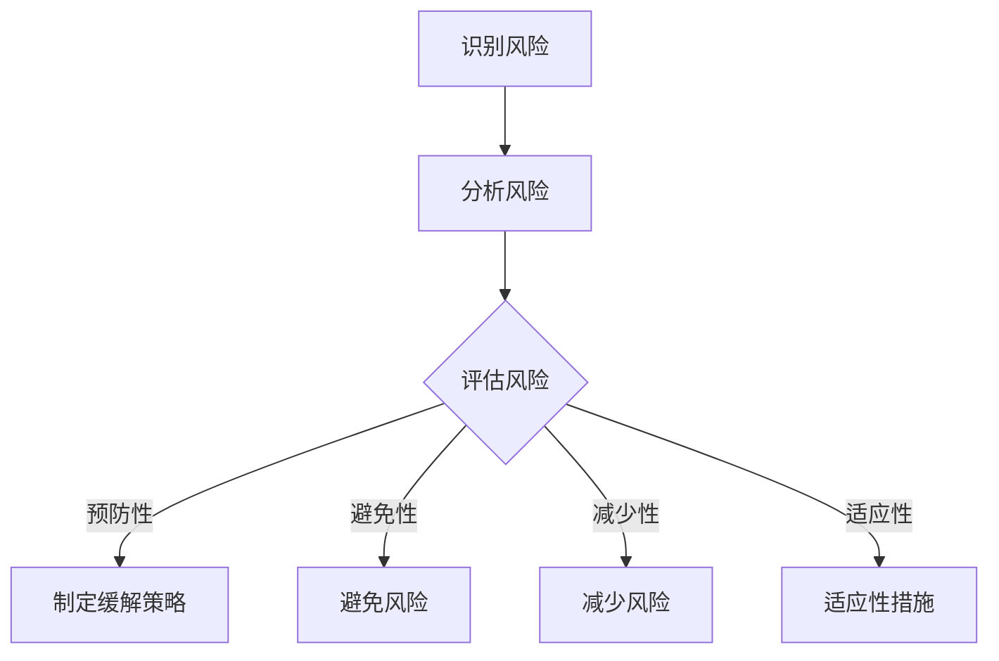

                 


### 第1章：风险管理的概述

**1.1 风险管理的背景**

在信息技术迅猛发展的今天，技术风险管理的重要性日益凸显。风险管理作为一种系统性的方法，旨在通过识别、评估、缓解和控制潜在的风险，确保组织在不确定的环境中保持稳定运营和可持续发展。

**问题背景：** 随着数字化转型的不断推进，技术风险对企业的业务影响日益严重。这些风险可能来源于技术本身的复杂性、外部攻击、内部操作失误等多种因素。

**问题描述：** 技术风险可能导致的后果包括系统瘫痪、数据泄露、经济损失、声誉受损等。

**问题解决：** 需要建立一套完善的技术风险管理框架，以识别和缓解潜在风险。

**边界与外延：** 技术风险管理不仅涉及技术层面，还涵盖管理层面、法律层面和财务层面。

**核心概念与联系：**

| 核心概念        | 概念属性特征对比表格 | ER实体关系图架构 |
|----------------|---------------------|-----------------|
| 风险管理        | 系统性、预防性、评估性 |  |
| 技术风险        | 技术复杂性、外部攻击、内部失误 |  |
| 风险识别        | 全面性、及时性、实用性 |  |
| 风险评估        | 定量、定性、组合评估 |  |
| 风险缓解        | 预防性、避免性、减少性、适应性 |  |

**算法原理讲解：**

使用Mermaid画出风险评估的流程图：



风险评估的算法原理可以概括为以下几个步骤：

1. **风险识别**：通过问卷调查、脚本攻击、故障树分析等方法全面识别技术风险。
2. **风险分析**：对识别出的风险进行定量和定性分析，确定风险的可能性和影响程度。
3. **风险评估**：根据分析结果，评估风险的综合等级。
4. **风险缓解**：根据评估结果，制定预防性、避免性、减少性和适应性策略来缓解风险。

**数学公式：**

风险评分 = (风险发生概率 * 风险影响程度)

**举例说明：** 假设某一系统的数据泄露风险的发生概率为0.2，且数据泄露的影响程度为严重，则该风险评分 = 0.2 * 严重 = 中等风险。

**系统分析与架构设计方案：**

**问题场景介绍：** 
企业面临网络攻击和数据泄露的风险，需要建立一套技术风险管理框架来应对。

**项目介绍：**
本系统旨在实现技术风险的全面识别、评估和缓解。

**系统功能设计（领域模型Mermaid类图）：**


**系统架构设计（Mermaid架构图）：**


**系统接口设计和系统交互（Mermaid序列图）：**


**项目实战：**

**环境安装：**
- 安装风险管理软件
- 配置专家系统

**系统核心实现源代码：**
```python
# 识别风险
def identify_risk():
    # 具体实现代码
    pass

# 风险评估
def assess_risk():
    # 具体实现代码
    pass

# 风险缓解
def mitigate_risk():
    # 具体实现代码
    pass
```

**代码应用解读与分析：**
具体解读与分析将在后续章节中详细阐述。

**实际案例分析和详细讲解剖析：**
通过案例研究一和案例研究二，深入分析技术风险管理的实际应用。

**项目小结：**
技术风险管理是实现企业数字化转型和安全运营的关键，本系统通过识别、评估和缓解技术风险，为企业提供了有力的风险管理工具。

### 最佳实践 tips：

- 定期进行风险评估，确保风险管理策略与业务发展同步。
- 建立跨部门的风险管理团队，促进风险管理工作的有效实施。
- 注重技术与管理的结合，提高风险识别和缓解的准确性。

**小结：**
本文系统地介绍了技术风险管理的背景、核心概念、识别方法、评估原理、缓解策略和实践案例，为读者提供了一套全面的技术风险管理框架。

**注意事项：**
在实施技术风险管理时，需充分考虑企业的实际情况，灵活运用各种方法和工具。

**拓展阅读：**
- 《技术风险管理：实践与案例分析》
- 《信息安全管理体系：ISO/IEC 27001 实施指南》
- 《企业风险管理：框架与实务》

**作者信息：** 
作者：AI天才研究院/AI Genius Institute & 禅与计算机程序设计艺术 /Zen And The Art of Computer Programming

