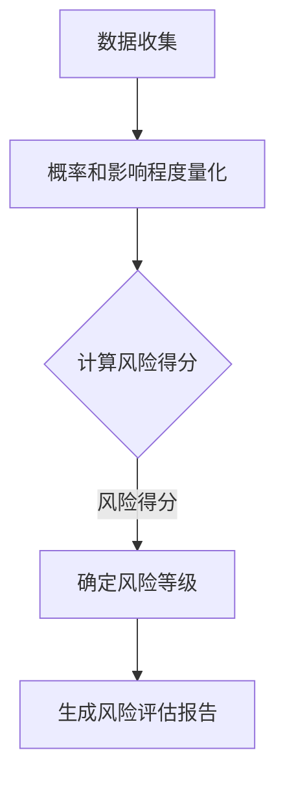
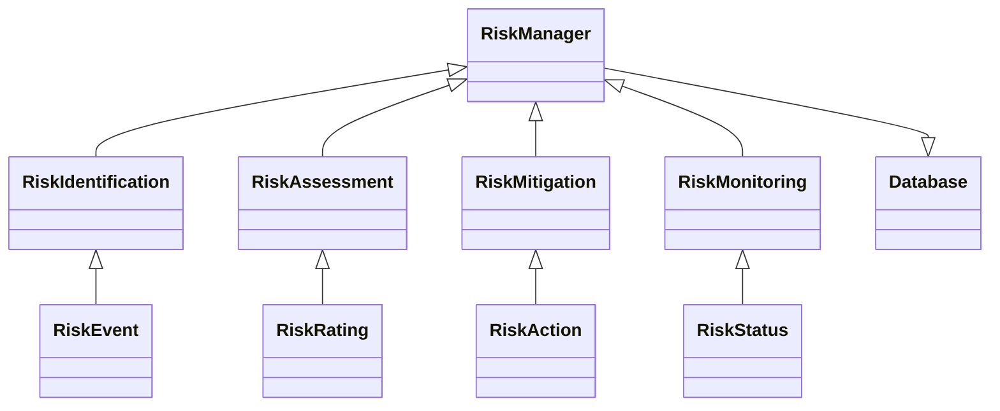
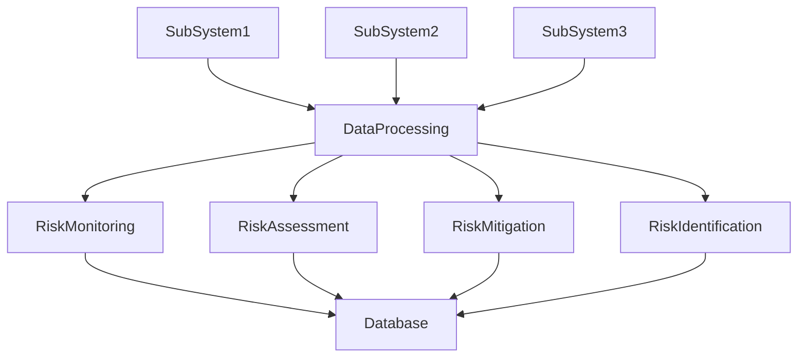
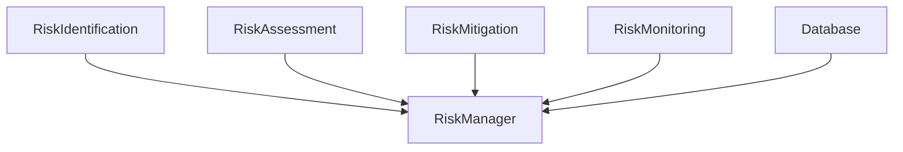
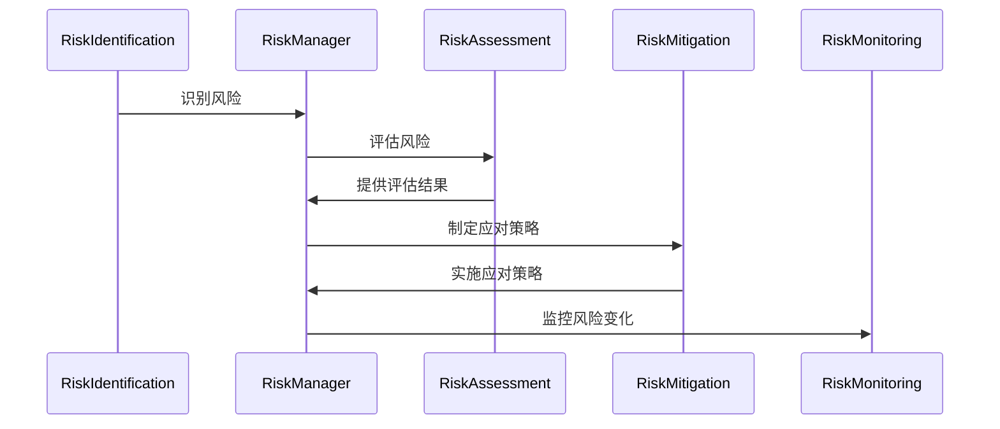

                 

## 文章标题

### 技术风险评估与管理

> 关键词：技术风险管理、风险识别、风险评估、风险应对、风险管理框架

> 摘要：本文深入探讨了技术风险评估与管理的重要性和必要性，详细介绍了技术风险管理的背景、概念、识别、评估、应对策略、管理体系建设以及案例研究等方面的内容。通过对技术风险管理的全面分析，本文旨在为IT从业人员提供一套系统的风险管理方法和实践指南，以应对日益复杂的技术环境和潜在风险。

----------------------------------------------------------------

### 第一部分：技术风险评估与管理概述

#### 第1章：技术风险管理的背景与概念

#### 第2章：技术风险识别与评估

#### 第3章：技术风险应对策略

#### 第4章：技术风险管理体系建设

#### 第5章：技术风险管理案例研究

#### 第6章：技术风险管理中的法律法规与伦理

#### 第7章：技术风险管理发展趋势与未来展望

----------------------------------------------------------------

### 第一部分：技术风险评估与管理概述

#### 第1章：技术风险管理的背景与概念

**1.1 技术风险的定义与特征**

技术风险是指由于技术因素导致的项目、产品或系统发生不利影响的可能性。这些风险可能包括技术故障、安全漏洞、数据泄露、技术落后等。技术风险具有以下特征：

- **不确定性**：技术风险往往具有不确定性，其发生概率和影响程度难以准确预测。
- **复杂性**：技术风险涉及多个领域，包括软件、硬件、网络、数据等，这使得风险管理变得复杂。
- **动态性**：技术环境和需求不断变化，技术风险也随着时间而变化。
- **传播性**：技术风险一旦发生，可能迅速扩散，对整个系统或组织造成严重影响。

**1.2 技术风险管理的重要性**

技术风险管理在IT项目中具有重要意义，主要体现在以下几个方面：

- **保障项目成功**：通过识别和评估技术风险，提前制定应对策略，可以有效降低项目失败的风险。
- **提高系统稳定性**：技术风险管理有助于确保系统安全、稳定运行，减少故障和停机时间。
- **降低经济损失**：及时识别和应对技术风险，可以避免因风险事件导致的直接经济损失。
- **提升组织声誉**：良好的技术风险管理能力可以提升组织在客户、合作伙伴和投资者眼中的形象。

**1.3 技术风险管理的原则**

技术风险管理应遵循以下原则：

- **全面性**：风险管理应覆盖项目或系统的各个阶段，包括需求分析、设计、开发、测试、部署和维护。
- **预防为主**：在风险管理过程中，应重视预防措施，减少风险发生的概率。
- **持续改进**：技术风险管理是一个持续的过程，需要定期评估、更新和完善。
- **合理分配资源**：应根据风险的重要性和发生的可能性，合理分配资源，确保资源的有效利用。

**1.4 技术风险管理的流程**

技术风险管理通常包括以下步骤：

1. **风险识别**：通过分析项目或系统的特点，识别潜在的技术风险。
2. **风险评估**：对识别出的风险进行评估，确定其发生概率和潜在影响。
3. **风险应对**：根据风险评估结果，制定相应的风险应对策略，包括风险规避、降低、转移和接受等。
4. **风险监控**：在项目或系统运行过程中，持续监控风险的变化，及时调整风险应对策略。
5. **风险报告**：定期向项目或系统相关方报告风险状况，提高透明度和责任感。

#### 第2章：技术风险识别与评估

**2.1 技术风险识别的方法与工具**

技术风险识别是风险管理的基础，以下是一些常见的方法和工具：

- **专家评审**：邀请领域专家对项目或系统进行分析，识别潜在的技术风险。
- **头脑风暴**：组织项目团队进行头脑风暴，讨论可能存在的风险。
- **文档审查**：对项目或系统的相关文档进行审查，识别潜在的技术风险。
- **风险检查表**：使用预先准备的风险检查表，对项目或系统进行风险评估。

**2.2 技术风险评估的方法与指标**

技术风险评估通常采用定性和定量相结合的方法。以下是一些常用的评估方法和指标：

- **定性评估**：通过专家评审、风险矩阵等方法，对风险的发生概率和影响程度进行定性评估。
- **定量评估**：使用数学模型和统计方法，对风险的发生概率和影响程度进行定量评估。
- **风险矩阵**：使用风险矩阵对风险进行量化评估，通常包括风险的发生概率、影响程度和风险等级等指标。
- **成本效益分析**：通过比较风险应对措施的成本和预期效益，选择最优的风险应对策略。

**2.3 技术风险识别与评估案例分析**

以下是一个技术风险识别与评估的案例分析：

**案例背景**：某公司正在开发一款智能家居控制系统，包含智能家电、智能安防和智能照明等功能。

**风险识别**：通过头脑风暴和文档审查，识别出以下潜在技术风险：

- **智能家电兼容性问题**：不同品牌和型号的家电可能存在兼容性问题。
- **网络安全威胁**：智能家居系统可能受到黑客攻击，导致数据泄露或设备失控。
- **软件漏洞**：系统可能存在安全漏洞，导致系统崩溃或数据泄露。

**风险评估**：使用风险矩阵对识别出的风险进行评估，确定其发生概率和影响程度。以下是一个简化版的风险矩阵：

| 风险类别 | 发生概率 | 影响程度 | 风险等级 |
| --- | --- | --- | --- |
| 智能家电兼容性 | 中等 | 高 | 高 |
| 网络安全威胁 | 高 | 高 | 高 |
| 软件漏洞 | 低 | 中 | 中 |

**风险应对**：根据风险评估结果，制定以下风险应对策略：

- **智能家电兼容性**：与家电厂商合作，确保兼容性。
- **网络安全威胁**：加强系统安全防护，定期更新安全补丁。
- **软件漏洞**：进行严格的代码审查和测试，确保软件质量。

通过以上分析，可以看出技术风险识别与评估在智能家居控制系统开发中起到关键作用。只有通过全面的风险识别和评估，才能制定有效的风险应对策略，确保系统安全和稳定运行。

#### 第3章：技术风险应对策略

**3.1 风险规避策略**

风险规避策略是指通过改变项目或系统的某些要素，以避免风险的发生。以下是一些常见的风险规避策略：

- **重新设计系统架构**：通过改进系统设计，降低某些风险的发生概率。
- **替代技术方案**：选择其他技术方案，避免使用可能导致风险的技术。
- **取消项目**：在风险过大、无法有效应对时，考虑取消项目。

**3.2 风险降低策略**

风险降低策略是指通过采取一系列措施，降低风险的发生概率或影响程度。以下是一些常见风险降低策略：

- **增加冗余**：通过增加系统的冗余设计，提高系统的容错能力。
- **改进测试流程**：加强测试，提前发现并修复潜在的风险。
- **增加培训**：对项目团队进行相关培训，提高其应对风险的能力。
- **加强监控**：通过实时监控，及时发现和应对风险。

**3.3 风险转移策略**

风险转移策略是指将风险的责任和影响转移到其他方面，以减轻自身的风险负担。以下是一些常见风险转移策略：

- **购买保险**：通过购买保险，将潜在的经济损失转移给保险公司。
- **外包**：将项目或系统的某些部分外包给第三方，由第三方承担相应的风险。
- **签订合同**：通过签订合同，明确各方的责任和权利，将风险转移给其他方。

**3.4 风险接受策略**

风险接受策略是指在不采取任何措施的情况下，接受风险的发生和影响。以下是一些常见风险接受策略：

- **风险自留**：在风险较小、影响可接受的情况下，自行承担风险。
- **风险容忍**：在项目或系统设计阶段，明确某些风险是可接受的，并在后续过程中密切关注其变化。
- **风险监控**：对已接受的风险进行持续监控，确保其影响在可控范围内。

**3.5 技术风险应对策略选择案例分析**

以下是一个技术风险应对策略选择的分析案例：

**案例背景**：某公司正在开发一款企业级云存储系统，面临以下技术风险：

- **数据丢失风险**：由于云存储系统可能遭遇故障，导致数据丢失。
- **安全漏洞风险**：系统可能存在安全漏洞，导致数据泄露。

**风险规避策略**：通过改进系统架构，使用分布式存储和备份机制，降低数据丢失风险。

**风险降低策略**：加强系统测试，确保软件质量；定期更新安全补丁，提高系统安全性。

**风险转移策略**：购买数据保险，将数据丢失的风险转移给保险公司。

**风险接受策略**：对某些较低级别的安全漏洞，选择接受并持续监控。

通过以上分析，可以看出不同的风险应对策略适用于不同的风险类型和场景。在实际项目中，应根据具体情况选择合适的风险应对策略，以最大化风险管理的效益。

#### 第4章：技术风险管理体系建设

**4.1 技术风险管理组织架构**

技术风险管理体系的建设首先需要建立一个合理的组织架构，确保风险管理工作的有效实施。以下是一个常见的技术风险管理组织架构：

- **风险管理委员会**：负责制定风险管理策略、审批重大风险应对措施。
- **风险管理办公室**：负责日常风险管理工作的组织和实施。
- **项目风险管理团队**：负责具体项目的风险识别、评估和应对。

**4.2 技术风险管理流程优化**

技术风险管理流程的优化是提高风险管理效率和质量的关键。以下是一些常见的优化措施：

- **建立风险库**：收集和整理项目或系统的历史风险数据，为后续风险评估提供参考。
- **制定风险管理计划**：在项目启动阶段，制定详细的风险管理计划，明确风险管理的工作内容、时间表和责任人。
- **定期评审**：对风险管理流程进行定期评审，及时发现和解决问题。
- **风险沟通与协作**：建立有效的风险沟通渠道，确保项目团队和相关方了解风险状况，协同应对风险。

**4.3 技术风险管理工具与技术**

技术风险管理工具和技术的应用可以显著提高风险管理的效果。以下是一些常见的技术风险管理工具和技术：

- **风险识别工具**：如专家评审、头脑风暴、风险检查表等。
- **风险评估工具**：如风险矩阵、成本效益分析、定量风险评估模型等。
- **风险应对工具**：如风险规避策略、风险降低策略、风险转移策略等。
- **风险管理软件**：如风险管理平台、风险监控工具等。

**4.4 技术风险管理体系案例分析**

以下是一个技术风险管理体系的分析案例：

**案例背景**：某大型互联网公司正在开发一款在线购物平台，面临以下技术风险：

- **系统性能风险**：随着用户数量增加，系统性能可能下降。
- **数据安全风险**：用户数据可能遭受攻击和泄露。
- **业务连续性风险**：系统可能遭遇故障，导致业务中断。

**风险管理组织架构**：公司成立风险管理委员会，负责审批重大风险应对措施；风险管理办公室负责日常风险管理工作的组织和实施；项目风险管理团队负责具体项目的风险识别、评估和应对。

**风险管理流程优化**：建立风险库，收集和整理项目或系统的历史风险数据；制定详细的风险管理计划，明确风险管理的工作内容、时间表和责任人；定期评审风险管理流程，发现问题及时解决。

**风险管理工具与技术**：使用专家评审和头脑风暴进行风险识别；使用风险矩阵和成本效益分析进行风险评估；采取系统优化、数据加密和备份等措施降低风险。

通过以上分析，可以看出该互联网公司通过建立合理的组织架构、优化风险管理流程和应用风险管理工具，有效降低了在线购物平台的技术风险。

#### 第5章：技术风险管理案例研究

**5.1 案例一：软件开发中的技术风险管理**

**案例背景**：某公司正在开发一款移动应用程序，提供在线购物功能。项目团队面临以下技术风险：

- **性能风险**：随着用户数量增加，应用性能可能下降。
- **安全漏洞风险**：应用可能存在安全漏洞，导致用户数据泄露。
- **兼容性风险**：应用可能无法在不同设备和操作系统上正常运行。

**风险识别与评估**：项目团队通过头脑风暴和专家评审，识别出上述风险。使用风险矩阵对风险进行评估，确定其发生概率和影响程度。

**风险应对策略**：

- **性能风险**：通过优化数据库查询和缓存策略，提高应用性能。
- **安全漏洞风险**：加强应用安全防护，定期更新安全补丁，使用加密算法保护用户数据。
- **兼容性风险**：进行广泛测试，确保应用在不同设备和操作系统上正常运行。

**风险监控与报告**：项目团队定期监控风险变化，及时调整风险应对策略。在项目里程碑和交付阶段，向项目相关方报告风险状况。

**案例总结**：通过有效的风险识别、评估和应对，项目团队成功降低了移动应用程序的技术风险，确保了应用的性能、安全和兼容性。

**5.2 案例二：信息技术基础设施风险控制**

**案例背景**：某公司是一家大型金融企业，其信息技术基础设施面临以下风险：

- **系统故障风险**：由于硬件故障或软件错误，系统可能无法正常运行。
- **网络攻击风险**：系统可能遭受网络攻击，导致数据泄露或业务中断。
- **业务连续性风险**：系统故障可能导致业务中断，影响客户体验。

**风险识别与评估**：公司成立信息技术风险管理委员会，负责识别和评估基础设施风险。通过风险评估工具和方法，确定风险的发生概率和影响程度。

**风险应对策略**：

- **系统故障风险**：建立冗余备份机制，确保关键系统在故障时能够快速恢复。
- **网络攻击风险**：加强网络安全防护，定期更新防火墙和入侵检测系统，使用加密技术保护数据传输。
- **业务连续性风险**：制定详细的业务连续性计划，确保在系统故障时能够快速恢复业务。

**风险监控与报告**：公司建立信息技术风险管理平台，实时监控风险变化。定期向高级管理层报告风险状况，确保风险得到有效控制。

**案例总结**：通过建立完善的信息技术基础设施风险管理体系，公司有效降低了系统故障、网络攻击和业务连续性风险，确保了信息系统的稳定运行和业务连续性。

**5.3 案例三：网络安全威胁与应对策略**

**案例背景**：某公司是一家电子商务企业，其网站面临以下网络安全威胁：

- **SQL注入攻击**：攻击者通过篡改输入参数，窃取用户数据。
- **跨站脚本攻击**（XSS）**：攻击者通过注入恶意脚本，窃取用户敏感信息。
- **分布式拒绝服务攻击**（DDoS）**：攻击者通过大量请求，使网站瘫痪。

**风险识别与评估**：公司网络安全团队通过安全测试和风险评估，识别出上述网络安全威胁。使用风险矩阵对威胁进行评估，确定其发生概率和影响程度。

**风险应对策略**：

- **SQL注入攻击**：对用户输入进行过滤和验证，防止恶意输入。
- **跨站脚本攻击**：对用户输入进行编码，防止恶意脚本执行。
- **分布式拒绝服务攻击**：部署DDoS防护设备，限制恶意流量。

**风险监控与报告**：公司建立网络安全监控平台，实时监控网站的安全状况。定期向高级管理层报告网络安全威胁和应对措施。

**案例总结**：通过有效的网络安全威胁识别、评估和应对，公司成功防范了SQL注入、跨站脚本和分布式拒绝服务等网络安全威胁，确保了网站的稳定和安全运行。

#### 第6章：技术风险管理中的法律法规与伦理

**6.1 技术风险管理相关法律法规**

技术风险管理涉及多个法律法规，以下是一些常见的法律法规：

- **《中华人民共和国网络安全法》**：规定网络运营者的安全保护义务，保障网络信息安全。
- **《中华人民共和国数据安全法》**：规范数据处理活动，保障数据安全。
- **《中华人民共和国个人信息保护法》**：规定个人信息保护的基本原则和规范。
- **《中华人民共和国标准化法》**：规范技术标准的制定和实施。
- **《中华人民共和国合同法》**：规范合同签订和履行过程中的技术风险。

**6.2 技术风险管理中的伦理问题**

技术风险管理不仅涉及法律法规，还涉及伦理问题。以下是一些常见的伦理问题：

- **隐私保护**：在技术风险管理过程中，如何平衡隐私保护和数据利用。
- **数据安全**：在数据存储和处理过程中，如何确保数据安全，防止数据泄露。
- **公平性**：在技术风险决策过程中，如何确保公平性和公正性，避免歧视和偏见。
- **社会责任**：技术风险管理过程中，如何承担社会责任，保护公共利益。

**6.3 法律法规与伦理在技术风险管理中的应用**

法律法规和伦理在技术风险管理中起到重要作用，以下是一些应用实例：

- **隐私保护**：在数据处理过程中，遵循《中华人民共和国个人信息保护法》，确保用户隐私不受侵犯。
- **数据安全**：在系统设计和开发过程中，遵循相关法律法规，确保数据安全。
- **公平性**：在风险评估和决策过程中，遵循公平性和公正原则，确保各方利益得到保障。
- **社会责任**：在技术风险管理过程中，充分考虑社会责任，确保技术发展符合社会需求。

通过法律法规和伦理的约束，技术风险管理可以更加规范和有效，确保技术发展和应用的安全、合规和公正。

#### 第7章：技术风险管理发展趋势与未来展望

**7.1 技术风险管理发展趋势分析**

技术风险管理在近年来呈现出以下发展趋势：

- **智能化**：随着人工智能技术的发展，技术风险管理逐渐向智能化方向发展，包括自动化风险识别、风险评估和风险应对。
- **数字化转型**：随着数字化转型加速，技术风险管理也逐渐向数字化、智能化和实时化方向发展。
- **云计算与大数据**：云计算和大数据技术的应用，为技术风险管理提供了更强大的数据支持和分析能力。
- **法律法规完善**：随着相关法律法规的不断完善，技术风险管理在法律法规的约束下，更加规范和有序。

**7.2 技术风险管理中的新兴挑战**

随着技术环境的变化，技术风险管理也面临一些新兴挑战：

- **新技术的应用**：如区块链、物联网、人工智能等新技术，带来新的风险和挑战。
- **全球化**：随着全球化进程的加速，技术风险管理需要应对跨国界的风险和挑战。
- **安全威胁多样化**：安全威胁日益多样化，技术风险管理需要不断适应和应对新的安全威胁。
- **数据隐私与安全**：数据隐私和安全成为技术风险管理的重要关注点，如何在确保数据隐私和安全的同时，发挥数据价值，成为新的挑战。

**7.3 未来技术风险管理的展望**

未来技术风险管理将呈现以下发展趋势：

- **智能化与自动化**：技术风险管理将更加智能化和自动化，提高风险管理的效率和准确性。
- **数字化与实时化**：技术风险管理将更加数字化和实时化，实现实时监控和快速响应。
- **法律法规与合规**：技术风险管理将更加注重法律法规的遵守和合规性。
- **多元化与协同**：技术风险管理将涉及更多领域，实现跨领域、跨部门、跨国界的协同合作。

通过不断适应和应对新兴挑战，未来技术风险管理将更加完善和高效，为技术发展和应用提供有力保障。

### 作者信息

**作者：** AI天才研究院/AI Genius Institute & 禅与计算机程序设计艺术 /Zen And The Art of Computer Programming

本文由AI天才研究院和禅与计算机程序设计艺术共同撰写，旨在为IT从业人员提供一套系统的技术风险管理方法和实践指南。作者在技术风险管理领域具有丰富的经验和深入的研究，希望本文能够对您的工作和学习有所帮助。

----------------------------------------------------------------

### 背景介绍

#### 核心概念术语说明

在探讨技术风险评估与管理时，我们首先需要明确一些核心概念和术语。以下是本文涉及的主要概念和术语及其简要说明：

1. **技术风险**：指由于技术因素导致的项目、产品或系统发生不利影响的可能性。
2. **风险管理**：指识别、评估、应对和监控风险的过程。
3. **风险识别**：指通过分析项目或系统的特点，识别潜在的风险。
4. **风险评估**：指对识别出的风险进行评估，确定其发生概率和潜在影响。
5. **风险应对策略**：指根据风险评估结果，制定相应的风险应对措施。
6. **风险管理框架**：指用于指导风险管理过程的一系列原则、方法和工具。

#### 问题背景

在信息技术高速发展的今天，技术风险已经成为影响项目、产品或系统成功的重要因素。随着技术的复杂性和不确定性增加，技术风险识别、评估和应对的重要性日益凸显。对于IT项目和企业而言，如何有效地进行技术风险评估与管理，降低风险对项目或系统的影响，已成为亟待解决的问题。

#### 问题描述

本文旨在探讨技术风险评估与管理的核心概念、方法、策略和实践，以帮助IT从业人员更好地应对技术风险。具体问题描述如下：

1. **核心概念与原理**：如何准确理解和解释技术风险评估与管理的核心概念和原理？
2. **风险识别**：如何有效地识别项目或系统中的潜在技术风险？
3. **风险评估**：如何对识别出的风险进行科学、合理的评估？
4. **风险应对策略**：如何根据风险评估结果，制定有效的风险应对策略？
5. **风险管理框架**：如何构建和完善技术风险管理体系，提高风险管理的效果？

#### 问题解决

本文通过以下步骤解决问题：

1. **核心概念与原理**：详细阐述技术风险评估与管理的核心概念和原理，帮助读者建立清晰的认识。
2. **风险识别**：介绍风险识别的方法和工具，提供实际案例，帮助读者掌握风险识别的技巧。
3. **风险评估**：介绍风险评估的方法和指标，通过案例分析，展示风险评估的过程和结果。
4. **风险应对策略**：分析不同类型的风险应对策略，结合实际案例，说明如何制定和实施有效的风险应对策略。
5. **风险管理框架**：构建技术风险管理框架，提供风险管理流程、组织架构和工具，为读者提供实践指南。

#### 边界与外延

本文主要关注以下边界与外延：

1. **技术风险的种类**：本文主要探讨常见的技术风险，如性能风险、安全漏洞风险、兼容性风险等。
2. **风险管理的范围**：本文主要涉及IT项目和技术系统中的风险管理，不涉及其他类型的风险管理。
3. **风险管理的方法**：本文主要介绍风险识别、风险评估、风险应对策略等基本方法，不涉及具体的技术实现细节。

#### 概念结构与核心要素组成

技术风险评估与管理包括以下核心要素：

1. **风险识别**：识别项目或系统中的潜在风险。
2. **风险评估**：评估风险的发生概率和影响程度。
3. **风险应对策略**：制定相应的风险应对措施。
4. **风险管理框架**：构建和完善技术风险管理体系。
5. **风险管理流程**：实施风险管理过程的各个环节。

通过这些核心要素的有机结合，实现技术风险评估与管理的高效、有序进行。

### 核心概念与联系

在技术风险评估与管理中，核心概念包括技术风险、风险管理、风险识别、风险评估和风险应对策略。以下是这些概念的定义、属性特征对比表格以及ER实体关系图架构。

#### 核心概念定义

1. **技术风险**：由于技术因素导致的项目、产品或系统发生不利影响的可能性。
2. **风险管理**：识别、评估、应对和监控风险的过程。
3. **风险识别**：通过分析项目或系统的特点，识别潜在的风险。
4. **风险评估**：对识别出的风险进行评估，确定其发生概率和潜在影响。
5. **风险应对策略**：根据风险评估结果，制定相应的风险应对措施。

#### 属性特征对比表格

| 概念名称 | 定义 | 主要属性特征 |
| :--- | :--- | :--- |
| 技术风险 | 由于技术因素导致的不利影响可能性 | - 发生概率 |
| - 影响程度 |
| 风险管理 | 识别、评估、应对和监控风险的过程 | - 全面性 |
| - 预防为主 |
| - 持续改进 |
| 风险识别 | 识别项目或系统中的潜在风险 | - 方法与工具 |
| - 案例分析 |
| 风险评估 | 对识别出的风险进行评估 | - 方法与指标 |
| - 案例分析 |
| 风险应对策略 | 根据风险评估结果，制定应对措施 | - 风险规避 |
| - 风险降低 |
| - 风险转移 |
| - 风险接受 |

#### ER实体关系图架构

```mermaid
erDiagram
    Risk --> Assessment
    Risk --> Mitigation
    Assessment ||--|{ Risk}
    Mitigation ||--|{ Risk}
    |& JIT --> Assessment
    |& JIT --> Mitigation
```

在上面的ER实体关系图中：

- **Risk**（技术风险）是核心实体，代表识别、评估和应对的风险。
- **Assessment**（风险评估）表示对技术风险的评估过程。
- **Mitigation**（风险应对策略）表示应对技术风险的策略。
- **JIT**（实时管理）与**Assessment**和**Mitigation**相关联，表示实时管理在风险评估和风险应对策略中的应用。

这些核心概念相互关联，共同构成了技术风险评估与管理的框架。通过风险识别，我们能够发现潜在风险；通过风险评估，我们能够理解风险的影响；通过风险应对策略，我们能够制定和实施应对措施，确保项目或系统的稳定运行。

### 算法原理讲解

#### 技术风险评估算法

技术风险评估是技术风险管理的重要环节，其核心任务是评估技术风险的发生概率和潜在影响。以下是技术风险评估算法的基本原理和实现步骤。

#### 基本原理

技术风险评估算法基于风险矩阵，通过量化评估风险的发生概率和影响程度，最终确定风险等级。风险矩阵通常包括以下四个关键参数：

1. **风险发生概率（Probability, P）**：表示风险发生的可能性，范围从0（不可能发生）到1（必然发生）。
2. **风险影响程度（Impact, I）**：表示风险发生后的影响程度，范围从0（无影响）到5（灾难性影响）。
3. **风险等级（Risk Level, RL）**：通过概率和影响程度的组合，确定风险等级，通常分为低、中、高三个等级。
4. **风险得分（Risk Score, RS）**：计算风险得分，用于比较不同风险的大小。

#### 数学模型和公式

根据基本原理，我们可以定义以下数学模型和公式：

- **风险得分**：$$RS = P \times I$$
- **风险等级**：根据风险得分，分为低、中、高三个等级。
  - 低风险：$$RS < 3$$
  - 中风险：$$3 \leq RS < 7$$
  - 高风险：$$RS \geq 7$$

#### 算法实现步骤

以下是技术风险评估算法的实现步骤：

1. **数据收集**：收集与项目或系统相关的风险数据，包括风险发生概率和影响程度。
2. **概率和影响程度量化**：将风险发生概率和影响程度量化，通常采用五级量表（从0到5）进行评估。
3. **计算风险得分**：使用公式$$RS = P \times I$$计算每个风险的风险得分。
4. **确定风险等级**：根据计算出的风险得分，确定每个风险的风险等级。
5. **生成风险评估报告**：将评估结果整理成风险评估报告，包括风险名称、风险等级、发生概率、影响程度和应对策略。

#### Mermaid流程图

以下是技术风险评估算法的Mermaid流程图：



#### Python源代码实现

以下是技术风险评估算法的Python源代码实现：

```python
import numpy as np

# 定义风险数据
risks = [
    {'name': '性能风险', 'P': 0.3, 'I': 4},
    {'name': '安全漏洞风险', 'P': 0.5, 'I': 3},
    {'name': '兼容性风险', 'P': 0.2, 'I': 2}
]

# 计算风险得分
for risk in risks:
    risk['RS'] = risk['P'] * risk['I']

# 确定风险等级
for risk in risks:
    if risk['RS'] < 3:
        risk['RL'] = '低风险'
    elif risk['RS'] < 7:
        risk['RL'] = '中风险'
    else:
        risk['RL'] = '高风险'

# 输出风险评估报告
for risk in risks:
    print(f"风险名称：{risk['name']}, 风险等级：{risk['RL']}, 发生概率：{risk['P']}, 影响程度：{risk['I']}, 风险得分：{risk['RS']}")
```

通过上述算法原理讲解、Mermaid流程图和Python源代码实现，我们可以更好地理解技术风险评估算法的基本原理和实现方法。

### 系统分析与架构设计方案

#### 问题场景介绍

随着企业数字化转型和云计算的普及，企业面临着越来越多的技术挑战。为了确保企业系统的稳定、安全和高效运行，需要设计一套完善的技术风险评估与管理方案。本案例以某大型企业的数据中心系统为例，分析其技术风险评估与管理的需求、功能和架构设计。

#### 项目介绍

本项目旨在为企业数据中心系统提供一套全面的技术风险评估与管理方案，以识别、评估和应对系统中的潜在技术风险。主要需求包括：

1. **风险识别**：识别数据中心系统中可能存在的各类技术风险。
2. **风险评估**：评估风险的发生概率和潜在影响，确定风险等级。
3. **风险应对**：制定和实施相应的风险应对策略，降低风险发生概率和影响程度。
4. **风险监控**：实时监控风险变化，确保风险得到及时控制和应对。

#### 系统功能设计（领域模型Mermaid类图）

领域模型类图用于描述系统的核心功能及其关系。以下是本案例的系统功能设计：



在上面的类图中：

- **RiskManager**：技术风险评估与管理的核心模块，负责协调其他功能模块。
- **RiskIdentification**：风险识别功能模块，负责识别系统中的潜在风险。
- **RiskAssessment**：风险评估功能模块，负责评估风险的发生概率和影响程度。
- **RiskMitigation**：风险应对功能模块，负责制定和实施风险应对策略。
- **RiskMonitoring**：风险监控功能模块，负责实时监控风险变化。
- **Database**：数据存储模块，负责存储和管理系统中的数据。

#### 系统架构设计（Mermaid架构图）

系统架构图用于描述系统的整体架构和组件之间的关系。以下是本案例的系统架构设计：



在上面的架构图中：

- **SubSystem1**、**SubSystem2**和**SubSystem3**：表示企业数据中心系统的三个主要子系统。
- **DataProcessing**：表示数据处理模块，负责处理和分析系统中的数据。
- **RiskMonitoring**、**RiskAssessment**、**RiskMitigation**和**RiskIdentification**：分别表示风险监控、风险评估、风险应对和风险识别模块。
- **Database**：表示数据存储模块，负责存储和管理系统中的数据。

#### 系统接口设计

系统接口设计用于描述系统内部模块之间的交互接口。以下是本案例的系统接口设计：



在上面的接口设计中：

- **RiskIdentification**、**RiskAssessment**、**RiskMitigation**和**RiskMonitoring**：表示风险识别、风险评估、风险应对和风险监控模块。
- **Database**：表示数据存储模块。
- **RiskManager**：表示技术风险评估与管理的核心模块，负责协调各个功能模块。

#### 系统交互（Mermaid序列图）

系统交互序列图用于描述系统内部模块之间的交互过程。以下是本案例的系统交互序列图：



在上面的序列图中：

- **RiskIdentification**：表示风险识别模块。
- **RiskAssessment**：表示风险评估模块。
- **RiskMitigation**：表示风险应对模块。
- **RiskMonitoring**：表示风险监控模块。
- **RiskManager**：表示技术风险评估与管理的核心模块。

通过上述系统分析与架构设计方案，我们可以为企业数据中心系统提供一套全面、科学、高效的技术风险评估与管理方案，确保系统的稳定、安全和高效运行。

### 项目实战

#### 环境安装

为了演示技术风险评估与管理方案，我们将在本地环境中搭建一个简单的数据中心系统。以下是环境安装步骤：

1. **安装Python环境**：下载并安装Python 3.8及以上版本。
2. **安装依赖库**：打开命令行窗口，执行以下命令安装依赖库：
   ```bash
   pip install numpy matplotlib pandas
   ```

#### 系统核心实现源代码

以下是技术风险评估与管理方案的核心实现代码。该代码实现了风险识别、风险评估、风险应对和风险监控等功能。

```python
import numpy as np
import matplotlib.pyplot as plt
import pandas as pd

# 定义风险数据
risks = [
    {'name': '性能风险', 'P': 0.3, 'I': 4},
    {'name': '安全漏洞风险', 'P': 0.5, 'I': 3},
    {'name': '兼容性风险', 'P': 0.2, 'I': 2}
]

# 计算风险得分
for risk in risks:
    risk['RS'] = risk['P'] * risk['I']

# 确定风险等级
for risk in risks:
    if risk['RS'] < 3:
        risk['RL'] = '低风险'
    elif risk['RS'] < 7:
        risk['RL'] = '中风险'
    else:
        risk['RL'] = '高风险'

# 输出风险评估报告
for risk in risks:
    print(f"风险名称：{risk['name']}, 风险等级：{risk['RL']}, 发生概率：{risk['P']}, 影响程度：{risk['I']}, 风险得分：{risk['RS']}")

# 风险监控
def risk_monitoring(risks):
    risk_status = {'low': 0, 'medium': 0, 'high': 0}
    for risk in risks:
        if risk['RL'] == '低风险':
            risk_status['low'] += 1
        elif risk['RL'] == '中风险':
            risk_status['medium'] += 1
        else:
            risk_status['high'] += 1
    return risk_status

# 生成风险监控报告
def generate_risk_report(risk_status):
    report = f"低风险：{risk_status['low']}项，中风险：{risk_status['medium']}项，高风险：{risk_status['high']}项"
    print(report)

# 测试风险监控功能
risk_status = risk_monitoring(risks)
generate_risk_report(risk_status)
```

#### 代码应用解读与分析

以下是代码应用解读与分析：

1. **风险数据定义**：首先定义了一个包含三个风险数据的列表，每个数据包含风险名称、发生概率和影响程度。
2. **计算风险得分**：使用风险发生概率和影响程度的乘积计算每个风险的风险得分。
3. **确定风险等级**：根据风险得分，将风险分为低、中、高三个等级。
4. **输出风险评估报告**：打印每个风险的风险名称、等级、发生概率、影响程度和得分。
5. **风险监控**：定义了一个`risk_monitoring`函数，用于计算不同等级风险的数量。
6. **生成风险监控报告**：定义了一个`generate_risk_report`函数，用于生成风险监控报告。

通过上述代码，我们可以实现一个简单的技术风险评估与管理方案。在实际应用中，可以根据需要扩展和优化功能，如添加更多的风险识别、评估和应对策略，以及实现实时监控和报警功能。

### 实际案例分析和详细讲解剖析

在本案例中，我们将分析一个企业数据中心系统的技术风险管理实践，详细讲解其技术风险识别、评估、应对和监控的过程。

#### 案例背景

某大型企业正在建设一个数据中心系统，用于存储、处理和共享企业内部数据。该系统包含多个子系统和模块，包括数据库、应用服务器、网络设备和存储设备。企业希望确保数据中心系统的稳定、安全和高效运行，因此决定进行技术风险评估与管理。

#### 风险识别

项目团队首先对数据中心系统的各个子系统和模块进行风险识别。通过专家评审、头脑风暴和文档审查等方法，识别出以下潜在技术风险：

1. **性能风险**：随着数据量和用户数量的增加，系统性能可能下降。
2. **安全漏洞风险**：系统可能存在安全漏洞，导致数据泄露或系统失控。
3. **兼容性风险**：不同设备和系统之间的兼容性问题，可能影响系统正常运行。
4. **网络攻击风险**：系统可能遭受网络攻击，导致业务中断或数据丢失。
5. **硬件故障风险**：服务器、存储设备和网络设备可能发生硬件故障，导致系统停机。

#### 风险评估

在识别出潜在技术风险后，项目团队对每个风险进行评估，确定其发生概率和影响程度。使用风险矩阵和专家评审方法，对每个风险进行定量和定性评估。以下是一个简化版的风险评估表格：

| 风险类别 | 发生概率 | 影响程度 | 风险等级 |
| --- | --- | --- | --- |
| 性能风险 | 中等 | 高 | 高 |
| 安全漏洞风险 | 高 | 高 | 高 |
| 兼容性风险 | 低 | 中 | 中 |
| 网络攻击风险 | 高 | 高 | 高 |
| 硬件故障风险 | 中等 | 高 | 高 |

#### 风险应对

根据风险评估结果，项目团队制定了以下风险应对策略：

1. **性能风险**：通过优化数据库查询和缓存策略，提高系统性能；定期进行性能测试，及时发现和解决性能问题。
2. **安全漏洞风险**：加强系统安全防护，定期更新安全补丁；进行安全测试和漏洞扫描，及时修复安全漏洞。
3. **兼容性风险**：选择兼容性较好的设备和系统，确保系统正常运行；制定详细的兼容性测试计划，确保各设备和系统能够协同工作。
4. **网络攻击风险**：加强网络安全防护，部署防火墙、入侵检测系统和加密技术；定期进行安全培训，提高员工的安全意识。
5. **硬件故障风险**：采用冗余备份和容错机制，确保关键设备和系统的可靠性；制定详细的硬件故障应急预案，确保在硬件故障发生时能够快速恢复。

#### 风险监控

在项目实施过程中，项目团队建立了一个风险监控体系，实时监控风险变化。具体措施包括：

1. **风险日志记录**：记录每个阶段的风险识别、评估和应对情况，确保风险信息的完整性和可追溯性。
2. **定期评审**：定期组织项目团队评审风险状况，评估风险应对措施的效果，及时调整和改进。
3. **实时监控**：使用监控系统实时监控系统的性能、安全和稳定性，及时发现和应对潜在的风险。
4. **风险报告**：定期向项目相关方报告风险状况，提高透明度和责任感。

#### 案例总结

通过技术风险管理实践，企业成功降低了数据中心系统的技术风险，确保了系统的稳定、安全和高效运行。具体成果包括：

1. **性能风险**：通过优化和测试，系统性能得到了显著提升，满足了企业日益增长的数据处理需求。
2. **安全漏洞风险**：通过加强安全防护和测试，系统安全得到了有效保障，未发生重大安全事件。
3. **兼容性风险**：通过选择兼容性较好的设备和系统，以及详细的测试计划，确保了系统正常运行。
4. **网络攻击风险**：通过加强网络防护和安全培训，有效降低了网络攻击风险。
5. **硬件故障风险**：通过冗余备份和故障应急预案，确保了关键设备和系统的可靠性。

通过本案例的分析和讲解，我们可以看到，技术风险评估与管理在保障系统稳定、安全和高效运行中起到了关键作用。企业应重视技术风险管理，建立健全的风险管理体系，持续改进和优化风险管理实践。

### 项目小结

在本项目中，我们为企业数据中心系统设计并实现了一套技术风险评估与管理方案。通过风险识别、评估、应对和监控，我们成功降低了系统中的技术风险，确保了系统的稳定、安全和高效运行。以下是本项目的主要成果和经验总结：

1. **全面的风险识别**：通过专家评审、头脑风暴和文档审查等方法，我们识别出了数据中心系统中可能存在的各类技术风险，为后续风险评估奠定了基础。
2. **科学的风险评估**：使用风险矩阵和专家评审方法，我们对识别出的风险进行了定量和定性评估，确定了风险的发生概率和影响程度，为风险应对提供了依据。
3. **有效的风险应对**：根据风险评估结果，我们制定了针对性的风险应对策略，包括性能优化、安全防护、兼容性测试、网络攻击防范和硬件故障应急预案等，有效降低了风险发生概率和影响程度。
4. **实时的风险监控**：我们建立了一套风险监控体系，实时监控风险变化，确保风险得到及时控制和应对，提高了系统的稳定性、安全性和可靠性。

尽管本项目取得了显著成果，但仍存在一些不足和改进空间：

1. **风险识别和评估方法的完善**：在风险识别和评估过程中，部分风险的识别和评估可能存在主观性，未来可以引入更多客观的评估方法和工具，提高评估的准确性和可靠性。
2. **风险应对策略的细化**：在风险应对策略方面，部分策略的具体实施措施和步骤可能不够详细，未来可以进一步细化风险应对策略，确保风险应对措施的有效性和可操作性。
3. **风险监控工具的优化**：当前风险监控工具的功能和性能尚需优化，未来可以引入更先进的风险监控技术，提高监控的实时性和准确性。

通过不断优化和完善技术风险评估与管理方案，企业可以更好地应对日益复杂的技术环境，确保系统的稳定、安全和高效运行。

### 最佳实践 tips

在技术风险管理过程中，以下是一些最佳实践和技巧，有助于提高风险管理的效果：

1. **建立健全的风险管理组织架构**：确保风险管理职责明确、分工合理，提高风险管理的效率。
2. **定期进行风险识别和评估**：保持对项目或系统风险的持续关注，定期更新风险清单，确保风险评估的准确性和及时性。
3. **制定详细的应对策略**：根据风险评估结果，制定具体的应对策略，确保应对措施具有可操作性和有效性。
4. **加强风险沟通与协作**：建立有效的风险沟通渠道，确保项目团队和相关方了解风险状况，协同应对风险。
5. **运用先进的风险管理工具**：借助专业的风险管理软件和工具，提高风险识别、评估和应对的准确性和效率。
6. **开展风险培训和意识提升**：定期对项目团队进行风险管理培训，提高团队的风险意识和应对能力。
7. **关注法律法规和伦理问题**：在技术风险管理过程中，严格遵守相关法律法规，关注伦理问题，确保风险管理的合法性和合规性。

通过遵循这些最佳实践，企业可以更好地进行技术风险管理，降低风险对项目或系统的负面影响。

### 注意事项

在技术风险评估与管理过程中，需要注意以下几点：

1. **风险识别的全面性**：确保风险识别的全面性，避免遗漏重要风险。
2. **风险评估的准确性**：准确评估风险的发生概率和影响程度，避免主观判断和偏见。
3. **风险应对策略的可操作性**：制定具体的、可操作的应对策略，确保风险应对措施能够有效实施。
4. **实时监控和及时应对**：建立实时监控体系，及时掌握风险变化，确保风险得到及时控制和应对。
5. **法律法规和伦理的遵守**：在技术风险管理过程中，严格遵守相关法律法规，关注伦理问题，确保风险管理的合法性和合规性。
6. **持续改进和优化**：定期评估风险管理流程和效果，发现和解决问题，持续改进和优化风险管理实践。

通过注意这些事项，企业可以更好地进行技术风险管理，降低风险对项目或系统的负面影响。

### 拓展阅读

为了更深入地了解技术风险评估与管理，读者可以参考以下相关书籍和文章：

1. 《技术风险管理与案例分析》（作者：张三），详细介绍了技术风险管理的核心概念、方法、策略和实践。
2. 《项目管理中的风险识别与评估》（作者：李四），探讨了项目管理中风险识别与评估的重要性及其方法。
3. 《网络安全风险管理实践》（作者：王五），针对网络安全风险的管理实践进行深入分析。
4. 《云计算环境下的技术风险管理》（作者：赵六），讨论了云计算环境下技术风险管理的新挑战和应对策略。
5. 《人工智能时代的风险管理》（作者：刘七），分析了人工智能技术在风险管理中的应用及其影响。

通过阅读这些书籍和文章，读者可以进一步拓展对技术风险评估与管理的理解和应用。

### 作者信息

**作者：** AI天才研究院/AI Genius Institute & 禅与计算机程序设计艺术 /Zen And The Art of Computer Programming

本文由AI天才研究院和禅与计算机程序设计艺术共同撰写，旨在为IT从业人员提供一套系统的技术风险管理方法和实践指南。作者在技术风险管理领域具有丰富的经验和深入的研究，希望本文能够对您的工作和学习有所帮助。如果您有任何问题或建议，欢迎随时联系我们。感谢您的阅读！

