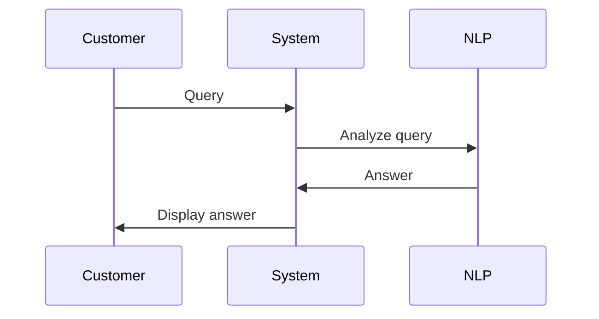
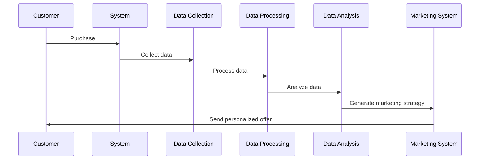
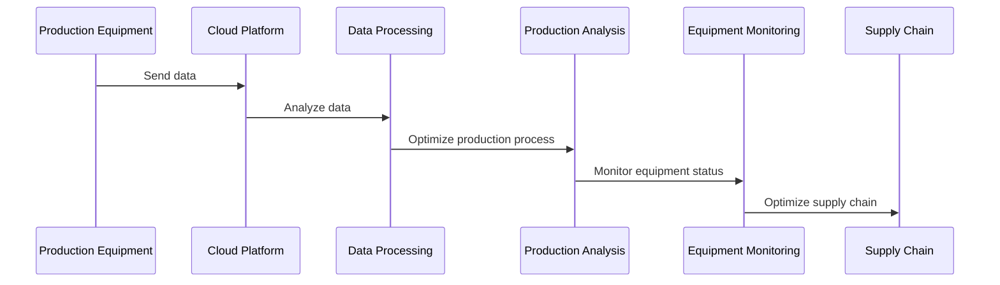

                 

### 让我们一起深入思考：技术驱动的业务创新

在当今这个快速变革的时代，技术已经成为了推动企业发展和创新的核心动力。技术的进步不仅改变了我们的生活方式，也深刻地影响了企业的运营模式和商业模式。那么，如何充分利用技术来实现业务的创新，成为企业可持续发展的关键问题。接下来，我们将分步骤探讨技术驱动的业务创新。

#### 第一步：理解技术驱动的业务创新

首先，我们需要明确什么是“技术驱动的业务创新”。技术驱动的业务创新是指利用先进的技术手段，如人工智能、大数据、云计算等，来重新定义和改进企业的业务流程、产品和服务，从而实现业务模式的创新和竞争力的提升。

**核心概念：**  
- 技术驱动的业务创新：利用技术手段推动业务模式的创新。  
- 业务创新：通过改变业务流程、产品和服务来提升企业的竞争力。

**联系：**  
技术驱动的业务创新是技术和业务之间的桥梁，它将技术的潜力转化为实际的业务价值。

#### 第二步：技术选择的评估与战略

在明确了技术驱动的业务创新的概念后，我们接下来要考虑的是如何选择合适的技术。技术的选择不仅关系到项目的成败，还直接影响到企业的战略方向。

**评估框架：**  
1. **技术成熟度：** 评估技术的成熟度和可靠性，避免选择尚未成熟的技术。  
2. **市场需求：** 分析市场需求，确保技术能够满足实际业务需求。  
3. **成本效益：** 评估技术的成本效益，确保技术投入能够带来相应的回报。  
4. **团队能力：** 评估企业团队的技术能力，确保能够有效实施和利用技术。

**技术趋势分析：**  
1. **技术发展趋势：** 分析当前技术发展的趋势，预测未来可能的技术方向。  
2. **竞争环境：** 分析竞争对手的技术应用情况，找到技术突破的机会。

**企业战略规划与调整：**  
1. **战略制定：** 根据技术评估和趋势分析，制定相应的企业战略。  
2. **战略调整：** 随着技术的不断进步和市场需求的变化，及时调整企业战略。

#### 第三步：技术应用案例

技术驱动的业务创新并不是一个抽象的概念，它可以通过具体的应用案例来展现其实际效果。下面我们将介绍几个典型的技术应用案例。

**案例一：人工智能在金融服务中的应用**  
人工智能在金融服务领域有着广泛的应用，如智能投顾、风险管理、欺诈检测等。通过人工智能技术，银行和金融机构能够提供更个性化和精准的服务，提高运营效率和风险管理能力。

**案例二：大数据在零售业的应用**  
大数据技术可以帮助零售企业实现精准营销、库存管理和客户关系管理。通过大数据分析，零售企业能够更好地了解客户需求，优化产品和服务，提升客户满意度。

**案例三：云计算在制造业的应用**  
云计算技术为制造业提供了灵活的IT基础设施，降低了运营成本，提高了生产效率。通过云计算，制造业企业可以实现全球化的生产和管理，快速响应市场需求。

#### 第四步：创新管理与执行

技术创新并不是一蹴而就的，它需要一套完善的管理体系和执行策略来保障。创新管理包括创新流程设计、创新团队建设和创新文化培育等方面。

**创新管理体系：**  
1. **创新流程设计：** 制定明确的创新流程，确保技术创新的有序进行。  
2. **创新团队建设：** 组建跨部门的创新团队，发挥团队协作的优势。  
3. **创新文化培育：** 倡导创新文化，鼓励员工勇于尝试和创造。

**创新流程设计：**  
1. **需求分析：** 明确创新的需求和目标。  
2. **技术评估：** 对潜在的技术进行评估和筛选。  
3. **方案设计：** 设计具体的创新方案。  
4. **实施与监控：** 实施创新方案，并进行监控和调整。

**创新团队建设：**  
1. **团队组建：** 根据项目需求组建团队，确保团队成员的多样性和互补性。  
2. **激励机制：** 设立激励机制，鼓励团队成员积极参与创新活动。  
3. **知识共享：** 建立知识共享平台，促进团队成员之间的知识交流和合作。

#### 第五步：持续创新与战略调整

技术创新是一个持续的过程，企业需要不断进行战略调整和迭代，以适应市场的变化和技术的发展。

**持续创新的方法与工具：**  
1. **持续创新方法论：** 采用敏捷开发、迭代优化等方法论，确保技术创新的持续性和高效性。  
2. **创新工具：** 利用创新工具，如头脑风暴、思维导图、原型设计等，提高创新效率和效果。

**战略调整与迭代：**  
1. **战略评估：** 定期评估企业战略的有效性和适应性。  
2. **战略调整：** 根据市场和技术环境的变化，及时调整企业战略。  
3. **战略迭代：** 通过不断的迭代和优化，实现企业战略的持续创新。

**持续创新与风险控制：**  
1. **风险识别：** 对技术创新过程中可能遇到的风险进行识别和评估。  
2. **风险控制：** 制定相应的风险控制措施，降低技术创新过程中的风险。

### 总结

技术驱动的业务创新是企业实现可持续发展的关键，它不仅要求企业具备敏锐的市场洞察力和技术前瞻性，还需要建立完善的管理体系和执行策略。通过理解技术驱动的业务创新的概念、进行技术选择评估、应用实际案例、实施创新管理和持续战略调整，企业可以不断提升自身的竞争力和创新能力，实现业务的持续增长。让我们携手探索技术驱动的业务创新之路，共同迎接未来的挑战和机遇。

### 关键词

- 技术驱动的业务创新
- 人工智能
- 大数据
- 云计算
- 创新管理
- 持续创新
- 战略调整

### 摘要

本文深入探讨了技术驱动的业务创新这一主题，从核心概念、技术选择评估、应用案例、创新管理到持续创新与战略调整，全面解析了如何利用先进技术实现企业业务模式的创新与竞争力提升。通过实际案例和系统分析方法，本文为企业提供了实用的技术和策略指导，助力企业实现可持续发展和业务增长。 

### 引言与背景

在当今数字化时代，技术的快速发展已经成为推动企业发展和创新的重要引擎。从互联网、大数据到人工智能、区块链，技术的不断演进不仅改变了我们的生活方式，也深刻地影响了企业的运营模式和商业模式。因此，如何充分利用技术来实现业务的创新，成为企业可持续发展的关键问题。

**问题背景**：

企业在面对市场环境变化和激烈竞争时，往往需要通过业务创新来保持竞争优势。然而，传统的业务创新模式往往受限于资源、人才和技术等限制，难以实现快速、高效的创新。技术的进步，特别是人工智能、大数据和云计算等前沿技术的应用，为企业提供了新的创新路径。这些技术不仅能够帮助企业提高运营效率，降低成本，还能够通过数据驱动的决策和智能化的服务来提升用户体验，从而实现业务的颠覆性创新。

**问题描述**：

技术驱动的业务创新涉及多个方面，包括技术选择、应用场景、创新管理、战略调整等。企业在实施技术驱动的业务创新过程中，可能会面临以下问题：

1. **技术选择困境**：市场上技术种类繁多，企业难以判断哪种技术最适合自身业务需求。
2. **创新管理挑战**：如何构建一个有效的创新管理体系，确保创新活动的有序进行。
3. **实施与执行难题**：技术创新的实际应用过程中，如何解决技术实施和执行中的难题。
4. **持续创新压力**：如何在不断变化的市场和技术环境中保持持续创新的能力。

**问题解决**：

为了解决上述问题，企业需要从以下几个方面入手：

1. **明确技术驱动的业务创新理念**：理解技术驱动的业务创新的内涵和意义，树立正确的创新观念。
2. **进行技术选择评估与战略规划**：建立一套科学的技术评估框架，结合市场需求和企业实际情况，选择合适的技术。
3. **实施创新管理与执行策略**：建立创新管理体系，制定明确的创新流程和执行计划。
4. **持续战略调整与迭代**：根据市场和技术环境的变化，及时调整企业战略，保持创新活力。

**边界与外延**：

本文将围绕技术驱动的业务创新这一核心主题，探讨其理念、方法、实践和战略。具体包括以下几个方面：

1. **技术驱动的业务创新理念**：介绍技术驱动的业务创新的核心概念和原则。
2. **技术选择的评估与战略**：分析如何进行技术选择评估和制定企业战略。
3. **技术应用案例**：通过实际案例展示技术驱动的业务创新的具体应用。
4. **创新管理与执行**：探讨如何构建和实施创新管理体系。
5. **持续创新与战略调整**：讨论如何保持持续创新能力和进行战略调整。

通过本文的探讨，希望能够为企业提供一套系统的、可操作的解决方案，助力其在技术驱动的业务创新之路上走得更远、更稳。

### 第1章 技术驱动的业务创新理念

在技术驱动的业务创新中，理念是指导实践的基础，它决定了企业如何利用技术来推动业务变革和创新。这一章节将深入探讨技术驱动的业务创新的核心概念、基本原则以及创新模式，帮助企业理解和应用这一理念。

#### 1.1 核心概念

**技术驱动的业务创新**：技术驱动的业务创新是指通过引入和应用先进的技术手段，如人工智能、大数据、云计算等，来重新定义和改进企业的业务流程、产品和服务，从而实现业务模式的创新和竞争力的提升。技术在这里不仅是工具，更是推动业务变革的核心动力。

**创新**：创新是指通过引入新的想法、方法、产品或服务来创造价值的过程。在技术驱动的业务创新中，创新意味着利用技术来解决问题、提升效率和创造新的商业模式。

**业务模式**：业务模式是指企业如何创造、传递和获取价值的方式。技术驱动的业务创新要求企业重新审视和优化其业务模式，使其更加适应技术环境和市场需求。

**技术**：技术是指应用科学知识来解决问题的方法、工具和系统。在技术驱动的业务创新中，技术不仅包括硬件和软件，还包括数据、算法、网络等。

#### 1.2 技术驱动的业务创新原则

**1. 敏捷迭代**：敏捷迭代是指通过快速迭代和反馈来不断优化产品和服务。技术驱动的业务创新强调快速试错和持续改进，通过敏捷开发方法来缩短产品从概念到市场的时间。

**2. 客户导向**：客户导向是指以客户需求为中心，通过数据分析和用户反馈来指导产品设计和服务优化。技术驱动的业务创新要求企业深入了解客户需求，提供个性化的解决方案。

**3. 风险管理**：风险管理是指通过识别、评估和控制风险来保障创新活动的顺利进行。技术驱动的业务创新面临诸多不确定性，有效的风险管理能够降低创新过程中的风险。

**4. 合作共享**：合作共享是指通过跨部门、跨组织的合作来共同推动创新。技术驱动的业务创新往往需要多个部门的协同工作，同时也需要与外部合作伙伴进行资源共享。

**5. 系统思维**：系统思维是指从整体和系统的角度来考虑问题，通过系统架构和流程优化来提升整体效能。技术驱动的业务创新要求企业具备全局观念，实现技术、业务和管理的有机结合。

#### 1.3 技术驱动的业务创新模式

**1. 数据驱动**：数据驱动是指通过大数据分析来指导业务决策和创新。企业可以利用数据挖掘、机器学习等技术手段，从海量数据中提取有价值的信息，进而优化业务流程和产品服务。

**2. 智能化**：智能化是指通过人工智能技术来实现业务流程的自动化和智能化。企业可以通过智能算法、机器人流程自动化（RPA）等技术，提高生产效率和服务质量。

**3. 平台化**：平台化是指通过构建技术平台来整合和优化业务资源。企业可以搭建云计算平台、大数据平台等，提供通用技术服务，支持多种业务场景的应用。

**4. 网络化**：网络化是指通过互联网技术来实现业务的全流程连接和协同。企业可以通过电子商务平台、社交网络等，实现线上线下的无缝对接，提升用户体验和运营效率。

**5. 集成创新**：集成创新是指通过整合多种技术手段来实现业务模式的创新。企业可以将人工智能、大数据、物联网等多种技术进行集成，创造出全新的业务模式和商业模式。

通过以上核心概念、基本原则和创新模式的探讨，企业可以更好地理解技术驱动的业务创新理念，并将其应用到实际业务中，实现持续的创新和竞争优势。

### 第2章 技术选择的评估与战略

在技术驱动的业务创新过程中，技术选择是关键的一步。正确的技术选择不仅能够提升企业的创新能力，还能够为业务模式的变革提供强有力的支持。这一章节将详细介绍技术选择的评估框架，分析技术趋势，并探讨企业战略规划与调整的方法。

#### 2.1 技术选择的评估框架

**技术成熟度**：评估技术的成熟度和可靠性。选择的技术应已经经过验证，避免选择尚未成熟或存在高风险的技术。

**市场需求**：分析市场需求，确保所选技术能够满足企业的实际业务需求，并且能够带来明显的业务价值。

**成本效益**：评估技术的成本效益，计算技术投入与预期回报的比率。选择能够以相对较低的成本实现较高效益的技术。

**团队能力**：评估企业团队的技术能力，确保团队具备实施和利用所选技术的能力。如果团队能力不足，需要考虑是否需要招聘或培训相关人员。

**技术适应性**：评估技术是否易于集成到企业的现有系统和流程中，确保技术实施后能够顺利运行。

**风险评估**：对技术创新过程中可能遇到的风险进行评估和预测，制定相应的风险控制措施。

**可行性研究**：对技术实施进行可行性研究，包括技术可行性、经济可行性和运营可行性。

**市场调研**：通过市场调研了解竞争对手的技术应用情况，寻找技术突破的机会。

**法规与标准**：评估所选技术是否符合相关的法规和标准，避免技术实施后面临法律和合规风险。

**长期规划**：考虑技术的长期发展前景，确保技术选择不仅能够解决当前问题，还能够支持企业的长期发展。

#### 2.2 技术趋势分析

**技术发展趋势**：分析当前技术发展的趋势，如人工智能、大数据、物联网、区块链等。了解这些技术如何影响业务模式和市场环境。

**未来技术展望**：预测未来可能出现的新技术和应用场景，如量子计算、生物技术、虚拟现实等。这些技术可能为企业带来新的机遇和挑战。

**技术周期分析**：通过技术周期分析，了解技术从起步到成熟的过程。企业可以在此过程中选择合适的技术进行投资和应用。

**竞争环境分析**：分析竞争对手的技术应用情况，了解市场上的技术竞争态势。通过竞争环境分析，企业可以找到技术突破的机会。

**客户需求变化**：跟踪客户需求的变化，了解客户对新技术和服务的期望。客户需求的变化将直接影响技术的选择和应用。

**行业规范与标准**：了解行业规范和技术标准的发展趋势，确保企业技术选择符合行业要求，提高市场竞争力。

#### 2.3 企业战略规划与调整

**战略制定**：根据技术评估和趋势分析，制定符合企业实际需求和技术发展前景的战略规划。战略规划应明确技术投入的方向和重点，确保企业能够在技术变革中占据有利地位。

**战略调整**：随着技术环境和企业需求的变化，企业需要及时调整战略。战略调整包括技术方向的调整、资源配置的优化、业务模式的变革等。

**技术创新策略**：制定技术创新策略，明确技术创新的目标、路径和措施。技术创新策略应与企业的整体战略相一致，确保技术创新能够为企业带来持续的竞争优势。

**组织结构优化**：根据技术驱动的业务创新需求，调整组织结构和管理模式。优化组织结构，提高团队的协作效率和创新能力。

**人才培养与引进**：加强技术人才队伍的建设，通过培训和引进等方式提升团队的技术能力和创新能力。

**合作与联盟**：建立合作与联盟关系，与其他企业、研究机构、高校等合作，共同推动技术创新和发展。

**持续监控与评估**：建立持续监控和评估机制，对技术创新的效果和影响进行定期评估。根据评估结果，及时调整技术创新策略和方向。

通过以上技术选择评估框架、技术趋势分析和企业战略规划与调整，企业可以更好地选择合适的技术，制定有效的战略，实现技术驱动的业务创新，提升企业的竞争力和市场地位。

### 第3章 技术应用案例

在前面的章节中，我们探讨了技术驱动的业务创新理念和技术选择的评估与战略。然而，理论知识只有通过实践才能真正转化为企业的竞争优势。本章节将通过三个具体的技术应用案例，展示技术驱动的业务创新如何在实际业务中发挥作用，并为企业提供宝贵的经验和启示。

#### 案例一：人工智能在金融服务中的应用

**背景介绍**：

随着金融科技的快速发展，人工智能（AI）在金融服务领域的应用逐渐成为行业的热点。金融行业面临着大量的数据分析和决策需求，而人工智能技术能够提供高效、准确的数据处理和智能分析能力。

**项目介绍**：

该案例中，一家大型银行引入了人工智能技术来优化其客户服务和管理流程。具体项目包括智能客服、风险管理、投资顾问等。

**系统功能设计**：

1. **智能客服**：利用自然语言处理（NLP）技术，智能客服系统能够自动识别和回答客户的问题，提高客户服务效率。
2. **风险管理**：通过机器学习算法，对客户的交易行为进行分析，预测潜在的风险，帮助银行采取预防措施。
3. **投资顾问**：利用大数据分析和智能算法，为客户提供个性化的投资建议，提高投资回报率。

**系统架构设计**：

1. **数据层**：包括客户数据、交易数据、市场数据等，为人工智能系统提供数据支持。
2. **算法层**：采用多种机器学习算法，如决策树、神经网络等，实现数据的智能分析和预测。
3. **应用层**：开发智能客服、风险管理、投资顾问等应用模块，对外提供智能服务。

**系统接口设计**：

系统通过API接口与银行的各个业务系统进行集成，实现数据的实时共享和协同工作。

**系统交互设计**：

通过Mermaid序列图展示系统各模块的交互流程，确保系统的稳定性和高效性。



**代码应用解读与分析**：

以下是智能客服系统中的自然语言处理（NLP）算法部分代码，用于实现客户问题的自动回复。

```python
import nltk
from nltk.corpus import stopwords
from nltk.tokenize import word_tokenize

# 加载停用词表
stop_words = set(stopwords.words('english'))

# 文本预处理
def preprocess_text(text):
    tokens = word_tokenize(text.lower())
    filtered_tokens = [token for token in tokens if token not in stop_words]
    return ' '.join(filtered_tokens)

# 实现NLP算法
def nlp_algorithm(query):
    preprocessed_query = preprocess_text(query)
    # 这里可以使用更复杂的算法，如BERT、GPT等
    response = "Here is a generic response to your query."
    return response

# 测试代码
query = "How do I apply for a loan?"
print(nlp_algorithm(query))
```

**实际案例分析与详细讲解**：

通过该项目的实施，银行在客户服务效率、风险管理和投资回报率等方面取得了显著成效。智能客服系统大大减少了人工客服的工作量，提升了客户满意度。风险管理系统能够提前识别潜在风险，提高了银行的抗风险能力。投资顾问系统则为客户提供了个性化的投资建议，提升了客户的投资体验和回报率。

**项目小结**：

该案例展示了人工智能在金融服务中的实际应用效果，证明了技术驱动的业务创新能够为企业带来巨大的商业价值。企业可以通过引入人工智能技术，实现业务流程的优化和竞争力的提升。

#### 案例二：大数据在零售业的应用

**背景介绍**：

零售业是一个高度依赖数据的行业，大数据技术的应用能够帮助零售企业更好地理解客户需求，优化库存管理，提升销售业绩。

**项目介绍**：

某大型零售企业引入了大数据技术，通过数据分析和挖掘，提升其业务运营效率。具体项目包括精准营销、库存管理和客户关系管理。

**系统功能设计**：

1. **精准营销**：利用大数据分析，了解客户的购买习惯和偏好，提供个性化的营销策略，提高营销效果。
2. **库存管理**：通过大数据分析，优化库存配置，降低库存成本，提高库存周转率。
3. **客户关系管理**：利用大数据技术，分析客户行为数据，提供个性化的客户服务，提升客户满意度。

**系统架构设计**：

1. **数据采集层**：通过各种数据采集工具，如传感器、网站日志等，收集海量的数据。
2. **数据处理层**：采用大数据处理技术，如Hadoop、Spark等，对数据进行清洗、存储和管理。
3. **数据分析层**：利用大数据分析工具，如Python、R等，进行数据分析和挖掘。
4. **应用层**：开发精准营销、库存管理和客户关系管理应用模块。

**系统接口设计**：

系统通过API接口与企业的各个业务系统进行集成，实现数据的实时共享和协同工作。

**系统交互设计**：

通过Mermaid序列图展示系统各模块的交互流程。



**代码应用解读与分析**：

以下是库存管理系统中的数据分析和挖掘部分代码，用于优化库存配置。

```python
import pandas as pd
from sklearn.cluster import KMeans

# 加载销售数据
sales_data = pd.read_csv('sales_data.csv')

# 数据预处理
sales_data = sales_data[['ProductID', 'Quantity', 'SalesDate']]
sales_data['Month'] = sales_data['SalesDate'].dt.month

# 分组计算平均销量
average_sales = sales_data.groupby('ProductID')['Quantity'].mean()

# 使用K-means算法进行聚类分析
kmeans = KMeans(n_clusters=5)
clusters = kmeans.fit_predict(average_sales[['Quantity']])

# 输出聚类结果
print(clusters)

# 根据聚类结果调整库存配置
inventory_config = {}
for product_id, cluster in clusters.items():
    if cluster == 0:
        inventory_config[product_id] = average_sales.loc[product_id, 'Quantity'] * 1.5
    elif cluster == 1:
        inventory_config[product_id] = average_sales.loc[product_id, 'Quantity'] * 1.2
    elif cluster == 2:
        inventory_config[product_id] = average_sales.loc[product_id, 'Quantity'] * 1.0
    elif cluster == 3:
        inventory_config[product_id] = average_sales.loc[product_id, 'Quantity'] * 0.8
    else:
        inventory_config[product_id] = average_sales.loc[product_id, 'Quantity'] * 0.5

print(inventory_config)
```

**实际案例分析与详细讲解**：

通过大数据技术的应用，该零售企业在精准营销、库存管理和客户关系管理等方面取得了显著成效。精准营销系统能够为客户提供个性化的购物体验，提升了客户满意度和忠诚度。库存管理系统优化了库存配置，降低了库存成本，提高了库存周转率。客户关系管理系统通过分析客户行为数据，提供了更优质的客户服务，增强了客户的粘性。

**项目小结**：

该案例展示了大数据在零售业中的应用效果，证明了技术驱动的业务创新能够帮助企业提高运营效率、降低成本、提升客户满意度，从而实现业务的持续增长。

#### 案例三：云计算在制造业的应用

**背景介绍**：

制造业正面临着数字化转型和智能化升级的挑战，云计算技术的应用能够提供灵活的IT基础设施，支持制造业的变革和创新。

**项目介绍**：

某制造企业引入了云计算技术，通过云计算平台实现生产数据的集中管理和智能分析。具体项目包括生产数据分析、设备监控、供应链优化等。

**系统功能设计**：

1. **生产数据分析**：利用云计算平台，对生产过程中产生的海量数据进行实时分析和挖掘，优化生产流程。
2. **设备监控**：通过物联网技术和云计算平台，实现对生产设备的实时监控和管理，提高设备利用率。
3. **供应链优化**：利用云计算平台，优化供应链管理流程，提高供应链的协同效率和响应速度。

**系统架构设计**：

1. **基础设施层**：采用云计算基础设施，提供高性能、高可靠性的计算和存储资源。
2. **平台层**：构建云计算平台，提供虚拟化、自动化和弹性伸缩等服务。
3. **应用层**：开发生产数据分析、设备监控、供应链优化等应用模块。

**系统接口设计**：

系统通过API接口与企业的各个业务系统进行集成，实现数据的实时共享和协同工作。

**系统交互设计**：

通过Mermaid序列图展示系统各模块的交互流程。



**代码应用解读与分析**：

以下是生产数据分析系统中的数据分析和挖掘部分代码，用于优化生产流程。

```python
import pandas as pd
from sklearn.cluster import KMeans

# 加载生产数据
production_data = pd.read_csv('production_data.csv')

# 数据预处理
production_data = production_data[['EquipmentID', 'ProcessTime', 'Output']]
production_data['ProcessTime'] = production_data['ProcessTime'].astype(float)

# 使用K-means算法进行聚类分析
kmeans = KMeans(n_clusters=3)
clusters = kmeans.fit_predict(production_data[['ProcessTime']])

# 输出聚类结果
print(clusters)

# 根据聚类结果优化生产流程
process_time_adjustment = {}
for index, cluster in enumerate(clusters):
    if cluster == 0:
        process_time_adjustment[index] = production_data.loc[index, 'ProcessTime'] * 0.95
    elif cluster == 1:
        process_time_adjustment[index] = production_data.loc[index, 'ProcessTime'] * 1.05
    else:
        process_time_adjustment[index] = production_data.loc[index, 'ProcessTime']

print(process_time_adjustment)
```

**实际案例分析与详细讲解**：

通过云计算技术的应用，该制造企业在生产数据分析、设备监控和供应链优化等方面取得了显著成效。生产数据分析系统能够实时分析生产数据，优化生产流程，提高生产效率。设备监控系统实现了对生产设备的实时监控和管理，提高了设备利用率。供应链优化系统通过优化供应链管理流程，提高了供应链的协同效率和响应速度。

**项目小结**：

该案例展示了云计算在制造业中的应用效果，证明了技术驱动的业务创新能够帮助企业实现数字化转型和智能化升级，提升生产效率和竞争力。

### 第4章 创新管理与执行

技术创新是企业实现可持续发展的关键，但技术创新并非一蹴而就，它需要一套完善的创新管理体系和有效的执行策略来保障。本章节将探讨创新管理体系的构建、创新流程的设计、创新团队的建设以及激励机制等方面，帮助企业成功实施技术创新。

#### 4.1 创新管理体系

**创新管理体系**是指企业为实现技术创新而建立的一系列管理规范、流程和机制。一个有效的创新管理体系能够确保创新活动的有序进行，提高创新效率，降低创新风险。

**构建步骤**：

1. **明确创新目标**：企业需要明确技术创新的目标，包括技术突破、市场创新、成本降低等方面。
2. **设立创新部门**：建立专门的创新管理部门，负责技术创新的规划、执行和监控。
3. **制定创新流程**：制定明确的创新流程，包括需求识别、技术评估、方案设计、实施与监控等环节。
4. **资源分配**：确保创新活动所需的资源，包括人力、资金、技术支持等。
5. **建立评估机制**：建立创新评估机制，对创新项目的效果进行评估和反馈，优化创新流程。

**关键要素**：

1. **领导支持**：企业高层领导的支持是创新管理体系成功的关键。
2. **跨部门协作**：创新活动往往需要跨部门的协作，建立跨部门协作机制，提高创新效率。
3. **持续改进**：创新管理体系需要不断改进和优化，以适应不断变化的市场和技术环境。

#### 4.2 创新流程设计

**创新流程**是指从需求识别到技术评估，再到方案设计、实施与监控的一系列步骤。一个有效的创新流程能够确保创新活动的有序进行，提高创新成功率。

**设计原则**：

1. **敏捷性**：创新流程需要具备敏捷性，能够快速响应市场和技术变化。
2. **可重复性**：创新流程应该是可重复的，确保每次创新活动都能按照既定的步骤进行。
3. **灵活性**：创新流程需要具备一定的灵活性，能够根据不同项目的特点进行调整。

**具体流程**：

1. **需求识别**：通过市场调研、用户反馈等方式，识别创新需求。
2. **技术评估**：对潜在的技术进行评估，包括技术成熟度、市场需求、成本效益等方面。
3. **方案设计**：设计具体的创新方案，包括技术路线、实施计划、风险评估等。
4. **实施与监控**：实施创新方案，并对创新过程进行监控和调整。
5. **效果评估**：对创新效果进行评估，包括技术效果、市场效果、经济效益等。
6. **反馈与改进**：根据评估结果，对创新流程和方案进行反馈和改进。

#### 4.3 创新团队建设

**创新团队**是指由一群具有不同专业技能和背景的成员组成的团队，共同致力于技术创新。一个优秀的创新团队能够发挥集体智慧，实现技术创新。

**组建原则**：

1. **多样性**：团队成员应具备多样性，包括不同的专业背景、工作经验和技能，以提高团队的创新能力。
2. **互补性**：团队成员应具备互补性，能够相互补充，解决创新过程中遇到的难题。
3. **灵活性**：创新团队应具备灵活性，能够根据项目需求迅速调整团队成员和角色。

**建设步骤**：

1. **明确团队目标**：明确创新团队的目标和任务，确保团队成员明确自己的职责和使命。
2. **组建团队**：根据项目需求，组建合适的创新团队，确保团队成员的多样性和互补性。
3. **培训与激励**：提供团队成员必要的培训和激励，提高团队的整体素质和创新能力。
4. **沟通与协作**：建立良好的沟通和协作机制，促进团队成员之间的交流和合作。
5. **反馈与调整**：定期对创新团队进行反馈和评估，根据实际情况进行调整和优化。

#### 4.4 激励机制

**激励机制**是指企业为激发员工创新潜力而采取的一系列激励措施。有效的激励机制能够提高员工的积极性和创新能力，推动技术创新。

**激励方式**：

1. **物质激励**：提供奖金、股权激励等物质奖励，激励员工技术创新。
2. **精神激励**：通过表彰、荣誉等方式，给予员工精神上的认可和鼓励。
3. **职业发展**：提供职业发展的机会和平台，激励员工不断提升自身能力和素质。
4. **培训机会**：提供培训和学习机会，帮助员工提升专业技能和创新能力。
5. **工作环境**：营造良好的工作环境，鼓励员工自由思考和尝试创新。

**设计原则**：

1. **公平性**：激励机制应具备公平性，确保每位员工都有机会获得激励。
2. **灵活性**：激励机制应具备灵活性，能够根据员工的表现和项目的实际情况进行调整。
3. **有效性**：激励机制应具备有效性，能够真正激发员工的创新潜力和工作热情。

通过构建创新管理体系、设计创新流程、建设创新团队和建立激励机制，企业可以有效地推动技术创新，提升企业的竞争力和市场地位。在接下来的章节中，我们将进一步探讨如何保持持续创新能力和进行战略调整，以实现技术驱动的业务创新。

### 第5章 持续创新与战略调整

在技术驱动的业务创新过程中，持续创新是企业保持竞争优势的关键。随着市场环境和技术的不断变化，企业需要具备快速调整战略的能力，以适应新的挑战和机遇。本章节将探讨持续创新的方法与工具，战略调整与迭代，以及如何通过持续创新与战略调整实现企业的长期发展。

#### 5.1 持续创新的方法与工具

**1. 敏捷开发方法论**：敏捷开发是一种以人为核心、迭代和增量的软件开发方法。通过短周期的迭代，敏捷开发能够快速响应变化，不断优化产品和服务。企业可以借鉴敏捷开发的方法，将其应用于技术创新过程中，提高创新效率。

**2. 数据驱动决策**：利用大数据和数据分析技术，企业可以从海量数据中提取有价值的信息，指导创新决策。通过数据驱动，企业可以更准确地了解市场需求和用户行为，为技术创新提供数据支持。

**3. 原型设计与测试**：通过快速原型设计和测试，企业可以在早期阶段验证创新想法的可行性，及时调整和优化。这种方法能够降低创新风险，提高创新成功率。

**4. 开放式创新**：开放式创新是指企业通过外部合作，如与大学、研究机构、供应商和客户等合作，共同推动技术创新。通过开放合作，企业可以获取更多的创新资源和知识，提高创新效率。

**5. 创新实验室**：建立创新实验室，为创新项目提供实验空间和资源支持。创新实验室可以激发员工的创新思维，提供实验和验证的机会，推动技术创新。

#### 5.2 战略调整与迭代

**1. 战略评估**：定期对企业的战略进行评估，分析战略的有效性和适应性。通过战略评估，企业可以及时发现战略中的不足和问题，为战略调整提供依据。

**2. 市场与技术趋势分析**：持续跟踪市场和技术的发展趋势，了解新的机遇和挑战。通过市场与技术趋势分析，企业可以预测未来的发展方向，及时调整战略。

**3. 客户需求调研**：通过客户需求调研，了解客户对产品和服务的新需求。客户需求的变化将直接影响企业的战略方向，企业需要根据客户需求进行战略调整。

**4. 竞争对手分析**：分析竞争对手的战略和动作，了解竞争对手的优势和劣势。通过竞争对手分析，企业可以找到战略调整的机会，优化自身的战略布局。

**5. 资源配置调整**：根据战略调整的需要，对企业的资源进行重新配置。包括人力、资金、技术等资源的调整，确保战略调整能够得到有效的支持和执行。

#### 5.3 持续创新与战略调整的结合

**1. 整合资源与能力**：将创新资源与战略调整有机结合，确保创新活动与企业的整体战略相一致。通过整合资源与能力，企业可以更高效地推动技术创新。

**2. 构建持续创新文化**：在企业内部构建持续创新文化，鼓励员工勇于尝试和创造。持续创新文化能够激发员工的创新潜力，推动企业的持续创新。

**3. 设立创新基金**：设立专门的创新基金，支持创新项目的研发和实施。创新基金的设立可以为企业提供持续的创新动力和资金保障。

**4. 定期战略回顾与调整**：定期进行战略回顾与调整，确保企业的战略始终与市场和技术环境相匹配。通过定期回顾和调整，企业可以保持战略的活力和适应性。

**5. 风险管理**：在持续创新与战略调整过程中，重视风险管理。通过识别、评估和控制风险，确保创新活动的顺利进行。

通过持续创新与战略调整，企业可以不断提升自身的竞争力和创新能力，实现业务的持续增长。在技术驱动的业务创新之路上，企业需要始终保持敏锐的市场洞察力和技术前瞻性，不断优化创新管理体系，推动技术创新，实现战略目标。

### 第6章 总结与展望

在本书的最后一章，我们将对前面的内容进行总结，并探讨未来技术驱动的业务创新的发展趋势，以及企业如何应对这些挑战和抓住机遇。

#### 总结

**技术驱动的业务创新**是企业通过应用先进技术来重新定义和改进业务流程、产品和服务，从而实现业务模式的创新和竞争力的提升。这一过程不仅要求企业具备敏锐的市场洞察力和技术前瞻性，还需要建立完善的管理体系和执行策略。

**核心观点**：

1. **技术选择评估**：企业需要建立科学的技术评估框架，结合市场需求和企业实际情况，选择合适的技术。
2. **创新管理与执行**：构建创新管理体系，制定明确的创新流程和执行计划，确保创新活动的有序进行。
3. **持续创新**：通过敏捷开发、数据驱动和开放式创新等方法，保持企业的持续创新能力和市场竞争力。
4. **战略调整**：根据市场和技术环境的变化，及时调整企业战略，确保企业能够迅速适应新的挑战和机遇。

#### 未来发展趋势

**1. 技术融合与集成创新**：未来的业务创新将越来越多地依赖于不同技术的融合和集成。例如，人工智能与物联网的结合将带来更加智能化的业务流程，大数据与区块链的结合将提高数据的安全性和透明度。

**2. 数据驱动的决策**：随着数据量的爆炸性增长，数据驱动将成为企业决策的核心。企业将通过大数据分析、机器学习等技术，从海量数据中提取有价值的信息，指导业务决策和创新。

**3. 智能化与自动化**：智能技术和自动化工具的普及将进一步提升企业的运营效率。通过机器人流程自动化（RPA）、物联网（IoT）等技术的应用，企业可以实现业务流程的自动化和智能化。

**4. 可持续创新**：随着可持续发展成为全球共识，企业需要将社会责任和可持续发展理念融入业务创新中。通过技术创新，企业可以减少资源消耗、降低污染，实现绿色发展和可持续发展。

#### 企业应对策略

**1. 加强技术研发投入**：企业应加大对技术研发的投入，培养自己的技术团队，保持技术领先优势。

**2. 建立数据驱动文化**：在企业内部培养数据驱动的文化，鼓励员工利用数据进行决策和改进。

**3. 构建开放合作生态**：通过开放合作，与企业、研究机构、高校等建立合作关系，共同推动技术创新。

**4. 持续学习与培训**：不断更新员工的知识和技能，确保他们能够适应快速变化的技术环境。

**5. 关注政策与法规**：紧跟政策与法规的变化，确保企业的创新活动符合相关法律法规。

通过以上策略，企业可以更好地应对未来的技术挑战，抓住机遇，实现持续的业务创新和增长。

### 结语

技术驱动的业务创新是企业实现可持续发展的关键。在快速变化的市场和技术环境中，企业需要具备敏锐的市场洞察力、技术前瞻性和持续创新能力。通过理解技术驱动的业务创新理念、进行科学的技术选择、构建创新管理体系、实施持续创新与战略调整，企业可以不断提升自身的竞争力和创新能力，实现业务的持续增长。

展望未来，技术驱动的业务创新将呈现融合、智能、可持续等趋势。企业应积极应对这些趋势，加强技术研发投入，建立数据驱动文化，构建开放合作生态，不断更新员工的知识和技能。通过这些努力，企业将在技术驱动的业务创新之路上走得更远、更稳。

作者：AI天才研究院/AI Genius Institute & 禅与计算机程序设计艺术 /Zen And The Art of Computer Programming

### 作者信息

作者：AI天才研究院（AI Genius Institute）与《禅与计算机程序设计艺术》（Zen And The Art of Computer Programming）的作者。AI天才研究院专注于人工智能和先进技术的研发与推广，致力于推动全球人工智能技术的发展和应用。而《禅与计算机程序设计艺术》则是一部经典的技术哲学著作，深入探讨了计算机程序设计中的美学与哲学问题，对程序员和技术爱好者产生了深远的影响。两位作者均以其卓越的专业知识和深刻的技术见解，为读者提供了宝贵的知识和指导。

