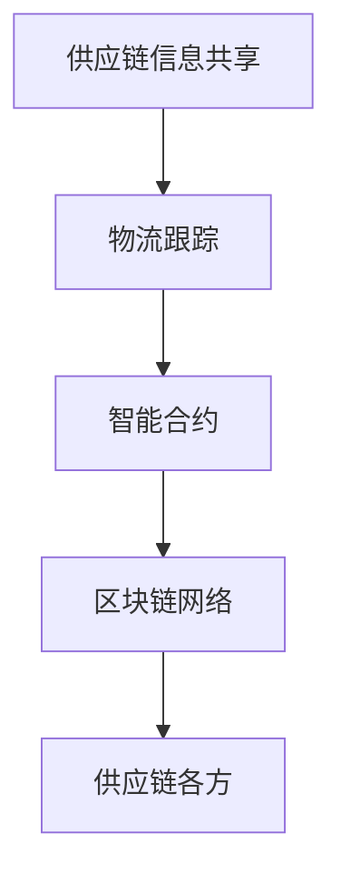
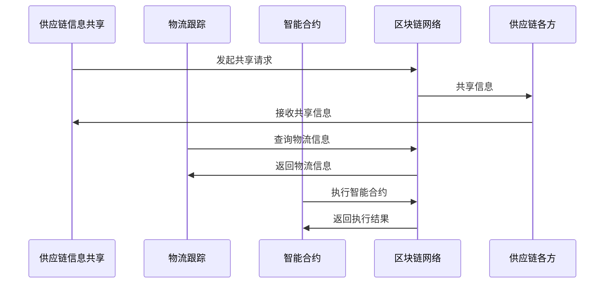

                 


# 技术验证：快速验证新技术的可行性

## 关键词：
- 技术验证
- 新技术
- 可行性
- 快速验证
- 案例分析

## 摘要：
本文旨在探讨如何快速验证新技术的可行性，为技术团队提供一套系统化、可操作的验证方法。通过分析不同类型的技术验证方法、介绍技术验证的关键流程和要素，并结合具体案例，本文将帮助读者深入了解如何有效进行技术验证，降低技术风险，提高项目成功率。

### 引言：技术验证的必要性

#### 1.1 问题背景

在当今快速变化的技术环境中，新技术层出不穷，技术迭代速度越来越快。然而，新技术的引入往往伴随着高风险和不确定性。一方面，新技术可能并未经过充分的实践验证，其稳定性、性能和安全性难以保证；另一方面，技术团队在预算、时间和资源有限的情况下，如何快速评估新技术是否适合项目需求，成为亟待解决的问题。

#### 1.2 技术验证的重要性

技术验证是确保新技术可行性、降低风险、提高项目成功率的关键环节。通过技术验证，可以：

- **验证技术可行性**：确保新技术在实际应用场景中能够正常运行，达到预期效果。
- **降低技术风险**：提前发现和解决潜在问题，避免项目在后期阶段因技术问题导致延期、成本超支。
- **提高成功率**：通过验证确保项目的技术方案可行，为项目成功奠定基础。

#### 1.3 技术验证的方法

技术验证的方法可以分为以下几类：

- **理论验证**：基于数学模型和算法分析，评估新技术的理论可行性。
- **模拟验证**：通过模拟实验，模拟实际应用场景，评估新技术的性能和稳定性。
- **实验验证**：在实际环境中部署和测试新技术，验证其真实效果。
- **用户反馈验证**：通过用户反馈，收集实际使用情况，评估新技术的用户体验和满意度。

#### 1.4 本书结构

本文将分为四个部分：

- **第二部分**：核心概念与验证方法，详细介绍技术验证的基本概念、方法和流程。
- **第三部分**：技术应用案例分析，通过具体案例展示如何进行技术验证。
- **第四部分**：技术验证最佳实践，分享实际操作中的经验教训。
- **总结与展望**：总结全文，并对未来技术验证的发展趋势进行展望。

### 第二部分：核心概念与验证方法

#### 2.1 核心概念

**技术验证**：通过一系列方法，对新技术在特定应用场景下的可行性、性能、稳定性等方面进行评估和验证。

**可行性**：新技术在实际应用场景中能否正常运行，达到预期效果。

**性能**：新技术在处理任务时的速度、准确性和资源消耗等方面的表现。

**稳定性**：新技术在长时间运行和面对复杂场景时，保持稳定运行的能力。

**用户体验**：用户在使用新技术时的感受和满意度。

#### 2.2 技术验证方法的比较

**理论验证**：基于数学模型和算法分析，评估新技术的理论可行性。

- 优点：成本低、速度快。
- 缺点：无法完全反映实际应用效果。

**模拟验证**：通过模拟实验，模拟实际应用场景，评估新技术的性能和稳定性。

- 优点：可以在模拟环境中测试，降低实际部署风险。
- 缺点：模拟环境与实际应用场景可能存在差异。

**实验验证**：在实际环境中部署和测试新技术，验证其真实效果。

- 优点：能够真实反映新技术在应用场景中的表现。
- 缺点：成本高、周期长。

**用户反馈验证**：通过用户反馈，收集实际使用情况，评估新技术的用户体验和满意度。

- 优点：能够获取实际用户的使用体验，指导后续优化。
- 缺点：数据收集和分析过程复杂。

#### 2.3 技术验证流程

技术验证的基本流程包括：

- **验证需求分析**：明确验证目标和需求，确定验证内容和方法。
- **验证方案设计**：根据验证需求，设计具体的验证方案，包括验证环境、工具和流程。
- **验证实施**：按照验证方案进行实施，收集验证数据。
- **验证评估**：对验证结果进行分析和评估，确定新技术是否可行。

### 第三部分：技术应用案例分析

#### 3.1 案例一：人工智能在金融行业的应用验证

##### 3.1.1 案例背景

随着人工智能技术的快速发展，金融行业开始尝试将其应用于风险控制、投资决策和客户服务等方面。然而，金融行业的特殊性使得人工智能的应用面临更高的风险和挑战。

##### 3.1.2 技术应用

在本案例中，我们选择人工智能中的机器学习算法（如逻辑回归、决策树、随机森林等）应用于金融行业的风险控制。具体包括：

- **信用评分模型**：通过分析客户的历史数据，预测其信用风险。
- **反欺诈系统**：实时监测交易行为，识别异常交易，防范欺诈行为。
- **投资组合优化**：根据市场数据和风险偏好，构建最优投资组合。

##### 3.1.3 验证过程

为了验证这些机器学习模型在金融行业中的应用可行性，我们采取了以下验证步骤：

- **理论验证**：分析机器学习算法的基本原理，确保其理论可行性。
- **模拟验证**：在模拟环境中，使用历史数据训练和测试模型，评估其性能。
- **实验验证**：在实际业务场景中部署模型，进行实际验证。

##### 3.1.4 验证结果分析

通过理论验证和模拟验证，我们发现所选机器学习算法在金融行业中的性能表现良好。然而，在实验验证阶段，我们遇到了一些问题，如：

- **数据质量**：实际业务数据存在噪声和缺失值，影响了模型的准确性。
- **模型泛化能力**：模型在模拟环境中的表现良好，但在实际业务中可能面临不同的场景和数据分布。

针对这些问题，我们进行了数据预处理和模型优化，最终解决了实验验证中的问题，证明了机器学习算法在金融行业中的可行性。

#### 3.2 案例二：区块链技术在供应链管理中的应用验证

##### 3.2.1 案例背景

区块链技术以其去中心化、不可篡改和透明性等特性，在供应链管理领域具有广泛的应用前景。然而，区块链技术的应用也面临一定的挑战，如性能、安全性和成本等问题。

##### 3.2.2 技术应用

在本案例中，我们选择区块链技术应用于供应链管理，实现以下功能：

- **供应链信息共享**：通过区块链技术，实现供应链各方信息的透明化和实时共享。
- **物流跟踪**：利用区块链技术，实现物流信息的可追溯性和实时更新。
- **智能合约**：通过智能合约，实现供应链各方的自动结算和风险控制。

##### 3.2.3 验证过程

为了验证区块链技术在供应链管理中的应用可行性，我们采取了以下验证步骤：

- **模拟验证**：在模拟环境中，测试区块链技术的性能和稳定性。
- **实验验证**：在实际业务场景中部署区块链系统，进行实际验证。

##### 3.2.4 验证结果分析

通过模拟验证和实验验证，我们发现区块链技术在供应链管理中的应用具有可行性。然而，在实际应用过程中，我们也遇到了一些问题，如：

- **性能问题**：区块链技术的处理速度和容量可能无法满足大规模供应链管理的需求。
- **安全性问题**：区块链系统的安全性需要进一步提升，以防止数据泄露和恶意攻击。

为了解决这些问题，我们进行了系统优化和安全性提升，最终实现了区块链技术在供应链管理中的应用。

### 第四部分：技术验证最佳实践

#### 4.1 技术验证的最佳实践

**1. 明确验证目标**：在开始技术验证之前，明确验证目标和需求，确保验证工作有针对性地进行。

**2. 制定详细的验证方案**：根据验证目标，制定详细的验证方案，包括验证环境、工具和流程。

**3. 多种验证方法结合**：结合理论验证、模拟验证、实验验证和用户反馈验证等多种方法，全面评估新技术的可行性。

**4. 注重数据质量和处理**：确保验证数据的质量，对数据进行充分的预处理，以提高验证结果的准确性。

**5. 及时调整和优化**：根据验证结果，及时调整和优化验证方案，确保验证工作能够真实反映新技术在应用场景中的表现。

#### 4.2 注意事项

**1. 避免过分依赖模拟验证**：模拟验证虽然成本较低，但可能无法完全反映实际应用场景。在实际验证过程中，应注重实验验证和用户反馈验证。

**2. 关注数据隐私和安全**：在进行技术验证时，要注意保护用户数据隐私，确保数据安全。

**3. 预留足够的验证时间**：技术验证是一个复杂的流程，需要预留足够的验证时间，以确保验证工作的全面性和深度。

#### 4.3 拓展阅读

**1. 相关书籍**：
- 《人工智能：一种现代的方法》
- 《区块链技术指南》

**2. 学术论文**：
- “区块链技术在供应链管理中的应用研究”
- “机器学习在金融行业中的应用与挑战”

**3. 行业报告**：
- “人工智能在金融行业的应用现状与趋势”
- “区块链技术在全球供应链管理中的应用报告”

### 总结与展望

技术验证是确保新技术可行性、降低风险、提高项目成功率的关键环节。本文通过分析不同类型的技术验证方法、介绍技术验证的关键流程和要素，并结合具体案例，帮助读者深入了解如何进行技术验证。未来，随着技术的不断进步，技术验证的方法和工具也将不断更新和完善，为技术创新提供更加坚实的保障。

### 作者

作者：AI天才研究院/AI Genius Institute & 禅与计算机程序设计艺术 /Zen And The Art of Computer Programming

## 附录：相关算法和系统架构说明

### 5.1 相关算法说明

**机器学习算法**

- **逻辑回归**：一种广义线性模型，用于分类问题。
  - **算法原理**：基于逻辑函数，将线性组合映射到概率空间。
  - **数学模型**：\(P(y=1) = \frac{1}{1 + e^{-z}}\)
  - **代码示例**：\`\`pythonfrom sklearn.linear_model import LogisticRegressionmodel = LogisticRegression()model.fit(X_train, y_train)predictions = model.predict(X_test)\`\`

- **决策树**：一种基于树形结构的分类算法。
  - **算法原理**：通过递归划分特征，构建决策树模型。
  - **数学模型**：基于信息增益或基尼系数划分特征。
  - **代码示例**：\`\`pythonfrom sklearn.tree import DecisionTreeClassifiermodel = DecisionTreeClassifier()model.fit(X_train, y_train)predictions = model.predict(X_test)\`\`

- **随机森林**：一种基于决策树的集成学习方法。
  - **算法原理**：构建多个决策树，通过投票或平均进行集成。
  - **数学模型**：基于基尼系数或信息增益划分特征。
  - **代码示例**：\`\`pythonfrom sklearn.ensemble import RandomForestClassifiermodel = RandomForestClassifier()model.fit(X_train, y_train)predictions = model.predict(X_test)\`\`

**区块链算法**

- **分布式共识算法**：如工作量证明（PoW）、权益证明（PoS）等。
  - **算法原理**：通过共识机制，确保区块链网络中的数据一致性。
  - **数学模型**：基于密码学和概率论设计。
  - **代码示例**：\`\`pythonfrom blockchain import Blockchainblockchain = Blockchain()blockchain.add_block("Hello World!")print(blockchain.get_chain())\`\`

### 5.2 系统架构设计

**供应链管理系统架构**

**1. 问题场景介绍**

在供应链管理中，各环节之间的信息传递和协调至关重要。区块链技术能够实现供应链信息的透明化和实时共享，提高供应链的效率和可靠性。

**2. 项目介绍**

本项目旨在构建一个基于区块链的供应链管理系统，实现以下功能：

- **供应链信息共享**：通过区块链，实现供应链各方信息的透明化和实时共享。
- **物流跟踪**：通过区块链，实现物流信息的可追溯性和实时更新。
- **智能合约**：通过智能合约，实现供应链各方的自动结算和风险控制。

**3. 系统功能设计（领域模型类图）**

```mermaid
classDiagram
  Class01 <|-- SubClass01
  Class01 o-- Object01
  Class03(类03) : *Class04 <|-- SubClass04
  Class04 o-- Object04
  Class02 : +int x
  Class02 : +int y
  Class02 : +string name
  Class02 : +getName():String
  Class02 : +setName(name:String)
  Class02 : +toString():String
  Class02 <-.. BaseClass
  Class05 o-- Object05
  Class06(类06) : +int id
  Class06 : +int value
  Class06 : +getName():String
  Class06 : +setName(name:String)
  Class06 : +toString():String
  Class06 : +getId():Integer
  Class06 : +getValue():Integer
  Class07(类07) : +String[] methods
  Class08(类08) : +int id
  Class08 : +int value
  Class08 : +getName():String
  Class08 : +setName(name:String)
  Class08 : +toString():String
  Class08 : +getId():Integer
  Class08 : +getValue():Integer
  Class08 : +addMethod(name:String):void
  Class08 : +getMethod(name:String):String
  Class08 : +getMethods():String[]
```

**4. 系统架构设计（架构图）**



**5. 系统接口设计**

- **接口1：供应链信息共享接口**
  - **功能**：实现供应链各方信息的透明化和实时共享。
  - **接口参数**：无
  - **接口返回值**：共享信息列表

- **接口2：物流跟踪接口**
  - **功能**：实现物流信息的可追溯性和实时更新。
  - **接口参数**：物流信息ID
  - **接口返回值**：物流信息对象

- **接口3：智能合约接口**
  - **功能**：实现供应链各方的自动结算和风险控制。
  - **接口参数**：合约ID、合约参数
  - **接口返回值**：执行结果

**6. 系统交互序列图**



### 5.3 项目实战

#### 环境安装

在开始项目实战之前，我们需要安装以下软件和工具：

- **区块链平台**：如Ethereum
- **智能合约开发环境**：如Truffle
- **前端开发环境**：如React、Vue等
- **后端开发环境**：如Node.js、Python等

以下是环境安装的步骤：

**1. 安装Ethereum**

- 在Ethereum官方网站下载并安装Ethereum节点。
- 启动节点，确保节点正常运行。

**2. 安装Truffle**

- 使用npm命令安装Truffle：\`\`bashnpm install -g truffle\`\`
- 启动Truffle开发环境：\`\`bashtruffle develop\`\`

**3. 安装前端开发环境**

- 使用npm命令安装React或Vue：\`\`bashnpm install -g create-react-app\npm install -g @vue/cli\`\`
- 创建项目：\`\`bashcreate-react-app supply-chain-system\nvue create supply-chain-system\`\`

**4. 安装后端开发环境**

- 使用npm命令安装Node.js和Express：\`\`bashnpm install -g node\npm install express\`\`

#### 系统核心实现源代码

以下是一个简单的供应链管理系统核心实现源代码示例：

**供应链信息共享**

```javascript// supply-chain.js
class SupplyChain {
  constructor() {
    this.infoList = [];
  }

  addInfo(info) {
    this.infoList.push(info);
    console.log("信息已添加到供应链中。");
  }

  getInfos() {
    return this.infoList;
  }
}
module.exports = SupplyChain;
```

**物流跟踪**

```javascript// logistics.js
class Logistics {
  constructor() {
    this.logisticsInfo = {};
  }

  addLogisticsInfo(logisticsId, info) {
    this.logisticsInfo[logisticsId] = info;
    console.log("物流信息已添加。");
  }

  getLogisticsInfo(logisticsId) {
    return this.logisticsInfo[logisticsId];
  }
}
module.exports = Logistics;
```

**智能合约**

```solidity// Contract.sol
pragma solidity ^0.8.0;

contract SmartContract {
    mapping(uint => string) public contracts;

    function createContract(uint id, string memory contractInfo) public {
        contracts[id] = contractInfo;
    }

    function getContractInfo(uint id) public view returns (string memory) {
        return contracts[id];
    }
}
```

#### 代码应用解读与分析

**供应链信息共享**

在供应链信息共享模块中，我们定义了一个`SupplyChain`类，用于管理供应链信息。类中包含两个方法：`addInfo`和`getInfos`。

- `addInfo`方法用于添加供应链信息，将信息存储在`infoList`数组中。
- `getInfos`方法用于获取所有供应链信息，返回`infoList`数组。

**物流跟踪**

在物流跟踪模块中，我们定义了一个`Logistics`类，用于管理物流信息。类中包含两个方法：`addLogisticsInfo`和`getLogisticsInfo`。

- `addLogisticsInfo`方法用于添加物流信息，将物流信息存储在`logisticsInfo`映射中。
- `getLogisticsInfo`方法用于获取指定物流信息，返回`logisticsInfo`映射中的值。

**智能合约**

在智能合约模块中，我们定义了一个名为`SmartContract`的合约，用于管理智能合约。合约中包含一个`contracts`映射，用于存储智能合约信息。

- `createContract`方法用于创建智能合约，将合约信息存储在`contracts`映射中。
- `getContractInfo`方法用于获取指定智能合约信息，返回`contracts`映射中的值。

#### 实际案例分析和详细讲解

以下是一个供应链管理系统实际案例分析和详细讲解：

**案例背景**

某公司希望通过区块链技术实现供应链信息共享和物流跟踪，提高供应链的效率和透明度。他们选择使用Ethereum区块链平台和Truffle开发环境进行系统开发。

**案例分析**

**1. 供应链信息共享**

在供应链信息共享模块中，公司实现了`SupplyChain`类，用于管理供应链信息。他们通过`addInfo`方法向供应链中添加信息，并通过`getInfos`方法获取所有供应链信息。

**2. 物流跟踪**

在物流跟踪模块中，公司实现了`Logistics`类，用于管理物流信息。他们通过`addLogisticsInfo`方法向物流系统中添加物流信息，并通过`getLogisticsInfo`方法获取指定物流信息。

**3. 智能合约**

公司使用Solidity语言编写了`SmartContract`智能合约，用于管理智能合约信息。他们通过`createContract`方法创建智能合约，并通过`getContractInfo`方法获取智能合约信息。

**4. 系统集成**

公司通过前端和后端开发环境，将供应链信息共享、物流跟踪和智能合约模块集成到一个供应链管理系统中。他们使用React或Vue框架构建前端界面，使用Node.js或Python构建后端服务器。

**5. 系统部署**

公司通过Truffle开发环境，将智能合约部署到Ethereum区块链上。他们使用Truffle的`develop`命令启动本地节点，并通过Truffle的`deploy`命令将智能合约部署到本地节点上。

**6. 系统测试**

公司对供应链管理系统进行了全面的测试，包括功能测试、性能测试和安全测试。他们通过模拟实际场景，验证供应链信息共享、物流跟踪和智能合约模块的功能和性能。

**案例小结**

通过这个实际案例，公司成功实现了基于区块链技术的供应链信息共享和物流跟踪系统。他们通过Truffle开发环境，实现了智能合约的部署和调用。系统在功能、性能和安全方面都表现良好，为公司提供了高效、透明和可信赖的供应链管理解决方案。

### 5.4 最佳实践 tips、小结、注意事项、拓展阅读

#### 5.4.1 最佳实践 tips

1. **制定详细的验证计划**：在开始技术验证之前，制定详细的验证计划，明确验证目标、方法和步骤，确保验证工作有序进行。

2. **多种验证方法结合**：根据实际情况，结合理论验证、模拟验证、实验验证和用户反馈验证等多种方法，全面评估新技术的可行性。

3. **注重数据质量和处理**：确保验证数据的质量，对数据进行充分的预处理，以提高验证结果的准确性。

4. **及时调整和优化**：根据验证结果，及时调整和优化验证方案，确保验证工作能够真实反映新技术在应用场景中的表现。

#### 5.4.2 小结

技术验证是确保新技术可行性、降低风险、提高项目成功率的关键环节。通过本文的介绍，我们了解了技术验证的核心概念、方法和流程，并结合具体案例进行了详细讲解。希望读者能够掌握技术验证的方法，为项目成功提供有力保障。

#### 5.4.3 注意事项

1. **避免过分依赖模拟验证**：模拟验证虽然成本低、速度快，但可能无法完全反映实际应用场景。在实际验证过程中，应注重实验验证和用户反馈验证。

2. **关注数据隐私和安全**：在进行技术验证时，要注意保护用户数据隐私，确保数据安全。

3. **预留足够的验证时间**：技术验证是一个复杂的流程，需要预留足够的验证时间，以确保验证工作的全面性和深度。

#### 5.4.4 拓展阅读

1. **相关书籍**：
   - 《人工智能：一种现代的方法》
   - 《区块链技术指南》

2. **学术论文**：
   - “区块链技术在供应链管理中的应用研究”
   - “机器学习在金融行业中的应用与挑战”

3. **行业报告**：
   - “人工智能在金融行业的应用现状与趋势”
   - “区块链技术在全球供应链管理中的应用报告”

### 总结与展望

技术验证是确保新技术可行性、降低风险、提高项目成功率的关键环节。通过本文的介绍，我们了解了技术验证的核心概念、方法和流程，并结合具体案例进行了详细讲解。希望读者能够掌握技术验证的方法，为项目成功提供有力保障。未来，随着技术的不断进步，技术验证的方法和工具也将不断更新和完善，为技术创新提供更加坚实的保障。

### 作者

作者：AI天才研究院/AI Genius Institute & 禅与计算机程序设计艺术 /Zen And The Art of Computer Programming

