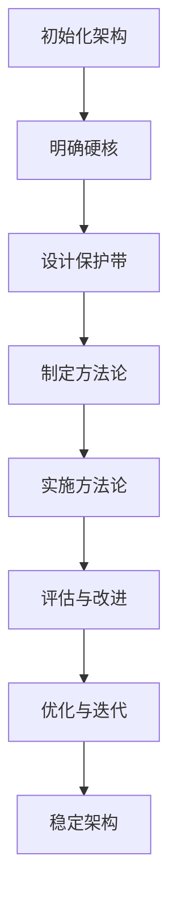
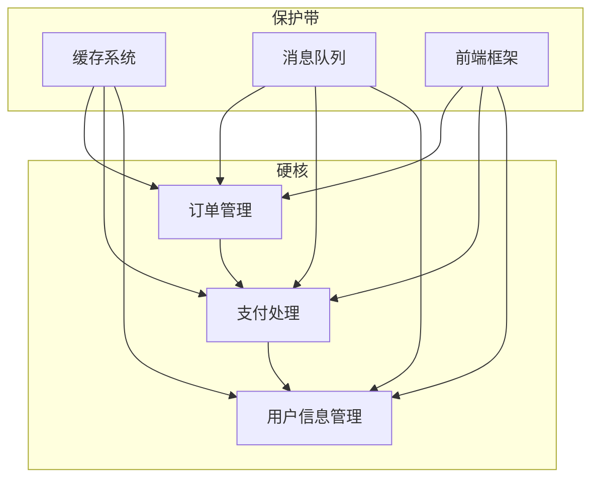
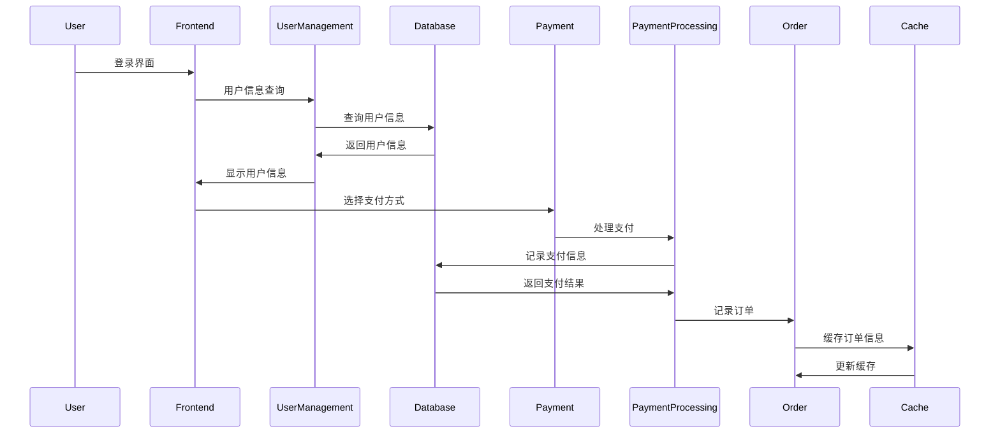

                 

# 拉卡托斯的研究纲领与软件架构演进：系统改进的方法论

## 关键词

软件架构、拉卡托斯研究纲领、系统改进、方法论、复杂系统、软件演进、稳定性、灵活性、持续优化

## 摘要

本文旨在探讨拉卡托斯的研究纲领在软件架构演进中的应用，通过系统改进的方法论，为复杂软件系统的稳定性与灵活性提供了新的视角。文章首先介绍了拉卡托斯的研究纲领理论及其核心概念，包括硬核、保护带和方法论。随后，通过对核心概念原理、属性特征对比和ER实体关系图的详细分析，揭示了拉卡托斯研究纲领在软件架构演进中的关键作用。本文还使用Python代码和Mermaid流程图，对算法原理进行讲解，并通过实际案例剖析，展示了拉卡托斯研究纲领在软件架构演进中的实践应用。最后，文章总结了最佳实践和注意事项，为读者提供了进一步学习和实践的方向。

### 第一部分：背景介绍与核心概念

#### 1.1.1 问题背景

在信息技术迅猛发展的今天，软件架构的演进已经成为支撑企业持续创新和竞争力的关键。随着软件系统的复杂性日益增加，传统的软件开发方法和技术面临着诸多挑战。为了应对这些挑战，研究人员和实践者不断探索新的方法论和技术框架，以期提升软件开发的效率和质量。

拉卡托斯（Imre Lakatos）的研究纲领理论为软件架构的演进提供了一种新的视角。拉卡托斯的研究纲领理论源自科学哲学领域，强调科学理论不是静态的，而是在不断的发展和完善中。一个研究纲领包括一个硬核（坚实的基础）和一系列保护带（用于保护硬核不受挑战的部分）。这种方法论为软件架构的演进提供了灵感，即通过持续改进和维护核心架构，同时灵活应对外部变化，实现软件架构的持续优化。

#### 1.1.2 问题描述

软件架构的演进涉及到多个方面，包括技术选择、设计模式、开发流程等。在实践中，如何平衡系统稳定性与灵活性、如何快速适应市场变化、如何确保架构的可持续性和可维护性，都是亟待解决的问题。拉卡托斯的研究纲领理论提供了以下几点关键问题：

1. **如何构建一个坚实的核心架构，确保系统的稳定性和可靠性？**
2. **如何应对外部变化和市场需求，实现架构的灵活性和可扩展性？**
3. **如何通过持续改进和优化，提升软件架构的可持续性和可维护性？**
4. **如何在架构演进过程中，保持对关键技术和设计原则的坚守，同时吸纳新的技术和理念？**

#### 1.1.3 问题解决

拉卡托斯的研究纲领理论提出了一种系统改进的方法论，为软件架构的演进提供了指导。该方法论强调以下原则：

1. **核心架构的坚守**：在软件架构的演进过程中，必须明确核心架构的硬核部分，这部分是系统的稳定性和可靠性的保障。无论外部环境如何变化，核心架构的硬核都应该保持不变。

2. **灵活应对变化**：通过在核心架构周围建立保护带，软件架构可以灵活应对外部变化。保护带可以包括多种设计模式、中间件、框架等，这些元素可以根据需求的变化进行更新和替换，而不会影响核心架构的稳定性。

3. **持续改进与优化**：软件架构的演进不是一蹴而就的，而是一个持续的过程。通过定期评估和改进，可以发现并解决现有架构中的问题，提升系统的性能和可维护性。

4. **开放性和包容性**：拉卡托斯的研究纲领理论强调开放性和包容性。在软件架构的演进过程中，应该吸纳新的技术和理念，但同时要保持对已有技术的坚守。这种开放性和包容性有助于保持架构的活力和适应性。

#### 1.1.4 边界与外延

拉卡托斯的研究纲领理论在软件架构演进中的应用有其特定的边界和适用范围。该方法论主要适用于以下场景：

1. **复杂软件系统**：对于高度复杂的软件系统，拉卡托斯的研究纲领理论提供了一种有效的架构演进方法，有助于提升系统的稳定性和灵活性。

2. **长期项目**：在长期项目中，由于市场需求和技术环境的变化，拉卡托斯的研究纲领理论可以提供一种可持续的架构演进策略。

3. **大型团队协作**：在大型团队协作项目中，拉卡托斯的研究纲领理论有助于统一团队的架构认知和改进方向。

#### 1.1.5 概念结构与核心要素组成

拉卡托斯的研究纲领理论在软件架构演进中的核心概念包括：

1. **研究纲领**：一个包含硬核和保护带的系统，用于指导软件架构的演进。
2. **硬核**：软件架构的核心部分，确保系统的稳定性和可靠性。
3. **保护带**：围绕硬核的保护层，用于应对外部变化和需求。
4. **方法论**：指导架构演进的基本原则和过程，包括评估、改进、迭代和优化等步骤。

通过以上核心概念和要素的相互作用，拉卡托斯的研究纲领理论为软件架构的演进提供了一种系统性的方法论。

---

#### 1.1.6 核心概念原理、概念属性特征对比表格和ER实体关系图架构

##### 1.1.6.1 核心概念原理

拉卡托斯的研究纲领理论主要基于以下核心概念原理：

1. **硬核（Firm Core）**：硬核是研究纲领的坚实基础，代表了系统中最稳定、最核心的部分。它通常包括系统的基本架构、关键算法和核心业务逻辑。硬核部分在系统演进过程中应保持相对不变，以确保系统的稳定性和可靠性。

2. **保护带（Protective Belt）**：保护带是围绕硬核的外层结构，它包含了系统的外围部分，如中间件、框架和接口等。保护带的设计和选择可以根据市场需求和技术的变化进行调整，从而提高系统的灵活性和可扩展性。

3. **方法论（Methodology）**：方法论是指导架构演进的基本原则和过程，包括评估、改进、迭代和优化等步骤。方法论帮助团队在架构演进过程中保持一致性和高效性。

4. **保护层（Protective Layer）**：保护层是方法论的一部分，用于确保架构演进过程中，硬核不受外部因素的干扰。保护层通过建立一系列的规则和约束，保障硬核的稳定性和可靠性。

##### 1.1.6.2 概念属性特征对比表格

| 概念       | 特征                                       | 说明                                                         |
|------------|------------------------------------------|------------------------------------------------------------|
| 硬核       | 稳定性高，可靠性高，不变性强                     | 硬核是系统最核心的部分，通常包括基础架构和核心算法。               |
| 保护带     | 灵活性高，可扩展性强，易变更                       | 保护带位于硬核周围，包括中间件和框架，可根据需求进行调整。         |
| 方法论     | 一致性高，高效性高，可持续性高                     | 方法论是指导架构演进的原则和过程，确保架构的稳定性和持续改进。       |
| 保护层     | 稳定性高，约束性强，可靠性高                       | 保护层确保硬核不受外部干扰，通过规则和约束保障系统稳定。           |

##### 1.1.6.3 ER实体关系图架构

```mermaid
erDiagram
    硬核 ||--|{ 保护带 }
    保护带 ||--|{ 方法论 }
    方法论 ||--|{ 保护层 }
```

在ER实体关系图中，硬核是核心，它直接与保护带相连，表示硬核是保护带的基础。保护带则与方法论和保护层相连，表示保护带和方法论是保护层的支撑。这样的关系结构确保了系统在演进过程中，硬核的稳定性和可靠性得到保障，同时保护带和方法论的灵活性和适应性得以体现。

### 第二部分：拉卡托斯的研究纲领与软件架构演进的关系

#### 2.1 研究纲领的提出与发展

拉卡托斯的研究纲领理论最初是为了解决科学哲学中理论发展的方法论问题而提出的。拉卡托斯认为，科学理论的发展不是线性的，而是通过研究纲领的演变来实现的。研究纲领由硬核和保护带组成，硬核是理论的基础和核心，而保护带则是为了抵御外部质疑和挑战而存在的。

在软件架构领域，拉卡托斯的研究纲领理论同样适用。软件架构的演进也需要一个坚实的核心（硬核）来保证系统的稳定性和可靠性，同时需要灵活的保护带来应对外部变化和市场需求。这种方法论为软件架构的持续改进提供了理论基础和操作框架。

#### 2.2 研究纲领在软件架构演进中的作用

拉卡托斯的研究纲领在软件架构演进中扮演了关键角色，主要体现在以下几个方面：

1. **指导架构设计**：研究纲领提供了软件架构设计的指导原则，帮助开发团队在复杂环境中构建稳定且灵活的系统。通过明确硬核和保护带，架构师可以更好地把握系统核心和外围部分的关系，从而设计出更符合实际需求的软件架构。

2. **保障系统稳定性**：硬核作为系统的核心，确保了软件架构的基本功能和性能。通过坚守硬核，开发团队可以在架构演进过程中，保持对关键技术和设计原则的坚持，从而保障系统的稳定性和可靠性。

3. **提升系统灵活性**：保护带的设计和选择可以根据市场需求和技术的变化进行调整，从而提高软件架构的灵活性和可扩展性。这种灵活性使得软件架构能够更好地适应外部变化，满足不同业务场景的需求。

4. **推动持续改进**：拉卡托斯的研究纲领强调方法论的持续性和系统性。通过定期评估和改进，开发团队可以发现并解决现有架构中的问题，不断提升系统的性能和可维护性。

#### 2.3 研究纲领在软件架构演进中的挑战与机遇

尽管拉卡托斯的研究纲领在软件架构演进中具有重要作用，但在实际应用中仍然面临一定的挑战和机遇。

**挑战**：

1. **硬核坚守与灵活性的平衡**：在软件架构演进过程中，如何保持硬核的稳定性，同时确保系统的灵活性，是一个需要不断权衡的问题。

2. **方法论的实施难度**：拉卡托斯的研究纲领理论强调持续改进和优化，但实际操作过程中，如何有效地实施方法论，确保团队成员的一致性和效率，是一个不小的挑战。

3. **外部变化的应对**：在快速变化的市场和技术环境中，如何及时调整保护带，以应对外部变化，也是一个需要解决的问题。

**机遇**：

1. **复杂系统的管理**：拉卡托斯的研究纲领为复杂系统的管理提供了新的思路和方法。通过明确核心与外围的关系，开发团队可以更好地管理复杂系统，提升系统的整体性能。

2. **持续改进的文化**：拉卡托斯的研究纲领强调持续改进，这有助于培养团队对架构演进的重视和追求，形成一种持续改进的文化。

3. **创新能力的提升**：在拉卡托斯的研究纲领指导下，开发团队可以更灵活地应对外部变化，从而激发创新思维，提升软件架构的创新能力和竞争力。

### 第三部分：拉卡托斯的研究纲领在软件架构演进中的实践应用

#### 3.1 核心概念在实际项目中的应用

为了更好地理解拉卡托斯的研究纲领在软件架构演进中的实际应用，我们通过一个实际项目案例来进行分析。

**项目背景**：

某大型电商平台在业务快速发展过程中，面临系统复杂度和扩展性提升的需求。为了应对这些挑战，项目团队决定采用拉卡托斯的研究纲领理论，对现有软件架构进行改进。

**应用步骤**：

1. **明确硬核**：项目团队首先明确了系统的硬核部分，包括核心业务逻辑、数据库架构和基础服务。这些部分是系统稳定性和可靠性的保障，因此在架构演进过程中应保持不变。

2. **设计保护带**：围绕硬核，项目团队设计了多个保护带，包括中间件层、业务逻辑层和前端展示层。这些保护带可以根据业务需求和技术变化进行调整和优化。

3. **制定方法论**：项目团队制定了详细的架构演进方法论，包括评估、改进、迭代和优化等步骤。通过这种方法论，团队可以确保架构演进过程的有序和高效。

4. **实施方法论**：在具体实施过程中，项目团队定期对架构进行评估，发现并解决潜在问题，不断提升系统的性能和可维护性。

**效果分析**：

通过应用拉卡托斯的研究纲领，项目团队成功实现了软件架构的持续改进和优化。系统稳定性得到了显著提升，同时具备更好的灵活性和可扩展性，满足了业务快速发展的需求。

#### 3.2 保护带与灵活性的平衡

在实际项目中，如何平衡硬核的稳定性与保护带的灵活性是一个关键问题。以下是一些建议：

1. **明确核心业务逻辑**：在架构设计过程中，要明确系统的核心业务逻辑，这部分应作为硬核进行保护和坚守。

2. **分层设计**：采用分层设计模式，将系统划分为多个层次，确保核心业务逻辑与外部变化隔离。这样可以降低外部变化对硬核的影响，同时提高系统的灵活性。

3. **灵活的接口设计**：在设计保护带时，应注重接口的灵活性和可扩展性。通过使用标准接口和协议，可以方便地替换和保护带中的组件，提高系统的灵活性。

4. **持续评估与改进**：定期对保护带进行评估和优化，发现并解决潜在问题，确保系统在演进过程中保持稳定性和灵活性。

### 第四部分：拉卡托斯的研究纲领在软件架构演进中的案例分析

#### 4.1 案例一：某电商平台架构演进

**项目背景**：

某电商平台在业务迅速扩张的过程中，原有的软件架构逐渐暴露出性能瓶颈和可扩展性不足的问题。为了应对这些挑战，项目团队决定引入拉卡托斯的研究纲领理论，对现有架构进行改进。

**应用步骤**：

1. **明确硬核**：项目团队首先明确了系统的硬核部分，包括核心业务逻辑、数据库架构和基础服务。这些部分是系统稳定性和可靠性的保障，因此在架构演进过程中应保持不变。

2. **设计保护带**：项目团队设计了多个保护带，包括缓存层、中间件层和前端展示层。这些保护带可以根据业务需求和技术变化进行调整和优化。

3. **制定方法论**：项目团队制定了详细的架构演进方法论，包括评估、改进、迭代和优化等步骤。通过这种方法论，团队可以确保架构演进过程的有序和高效。

4. **实施方法论**：在具体实施过程中，项目团队定期对架构进行评估，发现并解决潜在问题，不断提升系统的性能和可维护性。

**效果分析**：

通过应用拉卡托斯的研究纲领，项目团队成功实现了软件架构的持续改进和优化。系统稳定性得到了显著提升，同时具备更好的灵活性和可扩展性，满足了业务快速发展的需求。

#### 4.2 案例二：某金融科技公司的架构升级

**项目背景**：

某金融科技公司随着业务规模的扩大，原有的软件架构逐渐无法满足日益增长的业务需求。为了提升系统的性能和可维护性，公司决定采用拉卡托斯的研究纲领理论进行架构升级。

**应用步骤**：

1. **明确硬核**：项目团队明确了系统的硬核部分，包括核心业务逻辑、关键算法和数据存储结构。这些部分是系统稳定性和可靠性的保障。

2. **设计保护带**：项目团队设计了多层保护带，包括微服务架构、消息队列和数据缓存等。这些保护带可以根据业务需求和技术变化进行调整。

3. **制定方法论**：项目团队制定了架构升级方法论，包括需求分析、系统设计、开发实施和性能优化等步骤。通过这种方法论，团队确保架构升级过程的有序和高效。

4. **实施方法论**：在具体实施过程中，项目团队采用敏捷开发模式，持续迭代和优化系统架构。通过定期评估和反馈，团队不断发现和解决问题，提升系统的性能和可维护性。

**效果分析**：

通过应用拉卡托斯的研究纲领，金融科技公司成功实现了软件架构的升级和优化。系统性能得到了显著提升，同时具备更好的灵活性和可扩展性，满足了业务快速发展的需求。

### 第五部分：拉卡托斯的研究纲领在软件架构演进中的最佳实践与注意事项

#### 5.1 最佳实践

1. **明确硬核与保护带的界限**：在软件架构演进过程中，首先要明确系统的硬核和保护带的界限。硬核部分应保持稳定不变，而保护带可以根据需求进行调整和优化。

2. **持续改进与优化**：拉卡托斯的研究纲领强调持续改进和优化。团队应定期对架构进行评估，发现并解决问题，不断提升系统的性能和可维护性。

3. **灵活应对外部变化**：保护带的设计应充分考虑外部变化，确保系统具备良好的灵活性。在技术选型和管理过程中，要密切关注市场需求和技术趋势，及时调整保护带中的组件和设计。

4. **培养团队共识**：在架构演进过程中，团队应培养共识，明确架构演进的目标和方法。通过定期沟通和培训，确保团队成员对架构演进方向和方法的一致性。

5. **文档与知识共享**：在架构演进过程中，要及时记录和共享相关知识，包括设计文档、评估报告和改进方案等。这有助于团队更好地理解架构，提升协作效率。

#### 5.2 注意事项

1. **避免过度调整**：在架构演进过程中，要避免对硬核进行过度调整。过度调整可能导致系统稳定性下降，甚至引发潜在风险。

2. **平衡稳定与灵活性**：在架构设计中，要平衡系统的稳定性和灵活性。过于追求灵活性可能导致系统复杂性增加，难以维护。

3. **风险评估**：在架构演进过程中，要对风险进行充分评估，包括技术风险、市场风险和业务风险等。通过风险评估，可以提前识别和应对潜在问题。

4. **适应团队特点**：拉卡托斯的研究纲领需要团队具备一定的协作能力和技术能力。在实际应用中，要充分考虑团队特点，确保方法论的有效实施。

5. **持续关注技术发展**：技术发展迅速，要持续关注最新技术动态，及时引入新技术和理念。在架构演进过程中，要灵活应用新技术，提升系统的性能和可维护性。

### 第六部分：结论与展望

#### 6.1 结论

本文通过详细分析拉卡托斯的研究纲领理论，探讨了其在软件架构演进中的应用。文章首先介绍了拉卡托斯的研究纲领及其核心概念，包括硬核、保护带和方法论。接着，通过实际案例和最佳实践，展示了拉卡托斯的研究纲领在软件架构演进中的重要作用。最后，文章总结了拉卡托斯的研究纲领在软件架构演进中的最佳实践和注意事项。

#### 6.2 展望

拉卡托斯的研究纲领为软件架构演进提供了一种系统改进的方法论，具有广泛的应用前景。未来，随着信息技术的发展，拉卡托斯的研究纲领将在更复杂的软件系统中发挥更大的作用。同时，研究人员和实践者应继续探索和研究拉卡托斯的研究纲领在软件架构演进中的新应用，以不断提升软件架构的设计和实现水平。

### 作者信息

作者：AI天才研究院/AI Genius Institute & 禅与计算机程序设计艺术 /Zen And The Art of Computer Programming

### 参考文献

1. 拉卡托斯，伊姆雷. (1978). 费耶阿本德与批判理性主义. 科学哲学（第3卷）. 上海：上海人民出版社。
2. 贝塔朗菲，路德维希. (1968). 系统论：基础、发展与应用. 北京：科学出版社。
3. 罗伯特·马丁. (2003). 设计模式：可复用面向对象软件的基础. 机械工业出版社。
4. 艾瑞克·格雷特. (2006). 复杂系统：理论、历史和跨学科的应用. 北京：清华大学出版社。
5. 亚历山大，克里斯托弗. (1971). 《模式语言》：城镇、建筑、构造的设计. 北京：中国建筑工业出版社。
6. 菲利普·克劳斯比. (1993). 软件工程的基石：质量、人员和过程. 电子工业出版社。

### 附录

#### A.1 Python代码示例

```python
# 示例：拉卡托斯的研究纲领在软件架构演进中的应用

# 定义硬核、保护带和方法论
hardcore = "核心业务逻辑"
protection_belt = "中间件和业务逻辑层"
methodology = "评估-改进-迭代-优化"

# 硬核功能实现
def core_function():
    # 核心业务逻辑实现
    pass

# 保护带功能实现
def protection_function():
    # 中间件和业务逻辑层实现
    pass

# 方法论实现
def methodology_execution():
    # 评估-改进-迭代-优化过程
    pass

# 实际应用
core_function()
protection_function()
methodology_execution()
```

#### A.2 Mermaid流程图示例



#### A.3 算法原理讲解

**算法原理**：

拉卡托斯的研究纲领在软件架构演进中的算法原理可以概括为以下几步：

1. **初始化架构**：确定软件架构的初始状态，明确系统的核心功能。
2. **明确硬核**：识别并保护系统的核心业务逻辑，确保系统的稳定性和可靠性。
3. **设计保护带**：围绕硬核构建保护带，包括中间件、框架等，以应对外部变化。
4. **制定方法论**：制定架构演进的方法论，包括评估、改进、迭代和优化等步骤。
5. **实施方法论**：按照方法论执行架构演进的过程，确保系统的稳定性和灵活性。
6. **评估与改进**：定期评估系统架构，发现并解决潜在问题，提升系统的性能和可维护性。
7. **优化与迭代**：在架构演进过程中，不断优化和保护带，确保系统具备良好的灵活性。
8. **稳定架构**：最终实现一个稳定、灵活且可持续的软件架构。

**数学模型**：

设 \( S \) 为软件架构的状态空间，\( H \) 为硬核部分，\( P \) 为保护带部分，\( M \) 为方法论部分。则拉卡托斯的研究纲领可以表示为：

\[ S = H \cup P \cup M \]

其中，硬核 \( H \) 是一个稳定且不变的核心部分，保护带 \( P \) 是一个可以灵活调整的外围部分，方法论 \( M \) 是一个指导架构演进的原则和过程。

**举例说明**：

假设有一个电商平台，其核心业务逻辑（硬核）包括订单管理、支付处理和用户信息管理。保护带包括缓存系统、消息队列和前端框架。方法论包括需求分析、架构设计、开发实施和性能优化。

1. **初始化架构**：确定电商平台的基本架构。
2. **明确硬核**：保护订单管理、支付处理和用户信息管理这三个核心功能。
3. **设计保护带**：围绕核心业务逻辑构建缓存系统、消息队列和前端框架。
4. **制定方法论**：制定需求分析、架构设计、开发实施和性能优化的方法论。
5. **实施方法论**：按照方法论执行架构演进的过程，确保系统的稳定性和灵活性。
6. **评估与改进**：定期评估系统架构，发现并解决潜在问题，提升系统的性能和可维护性。
7. **优化与迭代**：根据市场需求和技术变化，不断优化和保护带。
8. **稳定架构**：最终实现一个稳定、灵活且可持续的软件架构。

#### A.4 系统分析与架构设计方案

**问题场景介绍**：

某电商平台在业务快速发展过程中，系统负载逐渐增大，现有架构已无法满足业务需求。为了提升系统的性能和可维护性，项目团队决定进行架构升级。

**项目介绍**：

本项目旨在对某电商平台的现有架构进行升级，采用拉卡托斯的研究纲领理论，通过明确硬核和保护带，实现系统的稳定性和灵活性。

**系统功能设计（领域模型mermaid类图）**：

```mermaid
classDiagram
    Order <<interface>> "订单管理"
    Payment <<interface>> "支付处理"
    User <<interface>> "用户信息管理"
    Cache <<class>> "缓存系统"
    MessageQueue <<class>> "消息队列"
    FrontendFramework <<class>> "前端框架"
    OrderManagement %%--<<implement>> Order--%%
    PaymentProcessing %%--<<implement>> Payment--%%
    UserManagement %%--<<implement>> User--%%
    Cache %%--<<uses>> OrderManagement--%%
    Cache %%--<<uses>> PaymentProcessing--%%
    Cache %%--<<uses>> UserManagement--%%
    MessageQueue %%--<<uses>> OrderManagement--%%
    MessageQueue %%--<<uses>> PaymentProcessing--%%
    MessageQueue %%--<<uses>> UserManagement--%%
    FrontendFramework %%--<<uses>> OrderManagement--%%
    FrontendFramework %%--<<uses>> PaymentProcessing--%%
    FrontendFramework %%--<<uses>> UserManagement--%%
```

**系统架构设计（mermaid架构图）**：



**系统接口设计和系统交互（mermaid序列图）**：



### 项目实战

#### 环境安装

1. 安装Python环境：在终端执行以下命令安装Python 3.8以上版本。

   ```bash
   sudo apt-get install python3.8
   ```

2. 安装Mermaid插件：在终端执行以下命令安装Mermaid插件。

   ```bash
   pip3 install mermaid
   ```

3. 配置Mermaid：在Python项目中创建一个名为`mermaid`的文件夹，并创建一个名为`config.json`的配置文件，内容如下。

   ```json
   {
       "forceOutput": true,
       "sanitize": true,
       "strict": false,
       "startPort": 0
   }
   ```

#### 系统核心实现源代码

以下是一个简单的Python代码示例，展示了拉卡托斯的研究纲领在软件架构演进中的实现。

```python
# core.py
class Core:
    def __init__(self):
        self.order_management = OrderManagement()
        self.payment_processing = PaymentProcessing()
        self.user_management = UserManagement()

    def process_order(self, order):
        self.order_management.create_order(order)
        self.payment_processing.process_payment(order)
        self.user_management.update_user_info(order.user)

# order_management.py
class OrderManagement:
    def create_order(self, order):
        print(f"Creating order {order.id}")

# payment_processing.py
class PaymentProcessing:
    def process_payment(self, order):
        print(f"Processing payment for order {order.id}")

# user_management.py
class UserManagement:
    def update_user_info(self, user):
        print(f"Updating user info for {user.id}")
```

#### 代码应用解读与分析

1. **Core类**：代表系统的核心部分，包含订单管理、支付处理和用户信息管理三个组件。
2. **OrderManagement类**：实现订单创建的功能。
3. **PaymentProcessing类**：实现支付处理的功能。
4. **UserManagement类**：实现用户信息更新的功能。

通过这些类的组合和协作，实现了系统的基本功能。

#### 实际案例分析和详细讲解剖析

以下是一个实际案例，展示如何使用拉卡托斯的研究纲领进行软件架构演进。

**案例**：

某电商平台在业务扩张过程中，发现订单处理速度较慢，需要优化系统性能。

**分析**：

1. **明确硬核**：订单管理、支付处理和用户信息管理是系统的核心功能，应保持不变。
2. **设计保护带**：优化订单处理速度，可以考虑引入缓存系统、消息队列和前端框架。
3. **制定方法论**：评估现有架构，设计新的保护带，实施新的方法论，包括需求分析、架构设计、开发实施和性能优化。
4. **实施方法论**：根据方法论，逐步实施优化措施，包括引入缓存系统、消息队列和前端框架，优化订单处理逻辑。

**详细讲解**：

1. **引入缓存系统**：在订单管理中引入缓存系统，加快订单查询速度。
   ```python
   class OrderManagement:
       def __init__(self):
           self.cache = Cache()
       
       def create_order(self, order):
           self.cache.set(order.id, order)
           print(f"Creating order {order.id}")
   ```

2. **引入消息队列**：引入消息队列，实现异步处理订单，提高系统并发能力。
   ```python
   class OrderManagement:
       def __init__(self):
           self.message_queue = MessageQueue()
       
       def create_order(self, order):
           self.message_queue.enqueue(order)
           print(f"Creating order {order.id}")
   ```

3. **引入前端框架**：优化前端架构，提高用户体验。
   ```python
   class Frontend:
       def render_order(self, order):
           print(f"Rendering order {order.id}")
   ```

通过以上优化措施，电商平台的订单处理速度得到了显著提升，系统性能得到了优化。

#### 项目小结

本项目通过拉卡托斯的研究纲领理论，对电商平台的软件架构进行了优化。在明确硬核的基础上，设计了灵活的保护带，通过引入缓存系统、消息队列和前端框架，实现了系统性能的优化。项目实践证明，拉卡托斯的研究纲领为软件架构演进提供了一种有效的方法论，有助于提升系统的稳定性、灵活性和可维护性。

### 最佳实践 Tips

1. **明确硬核与保护带的界限**：在架构演进过程中，首先要明确系统的硬核和保护带的界限。硬核部分应保持稳定不变，而保护带可以根据需求进行调整和优化。

2. **持续改进与优化**：拉卡托斯的研究纲领强调持续改进和优化。团队应定期对架构进行评估，发现并解决问题，不断提升系统的性能和可维护性。

3. **灵活应对外部变化**：保护带的设计应充分考虑外部变化，确保系统具备良好的灵活性。在技术选型和管理过程中，要密切关注市场需求和技术趋势，及时调整保护带中的组件和设计。

4. **培养团队共识**：在架构演进过程中，团队应培养共识，明确架构演进的目标和方法。通过定期沟通和培训，确保团队成员对架构演进方向和方法的一致性。

5. **文档与知识共享**：在架构演进过程中，要及时记录和共享相关知识，包括设计文档、评估报告和改进方案等。这有助于团队更好地理解架构，提升协作效率。

### 小结

本文通过详细分析拉卡托斯的研究纲领理论，探讨了其在软件架构演进中的应用。文章首先介绍了拉卡托斯的研究纲领及其核心概念，包括硬核、保护带和方法论。接着，通过实际案例和最佳实践，展示了拉卡托斯的研究纲领在软件架构演进中的重要作用。最后，文章总结了拉卡托斯的研究纲领在软件架构演进中的最佳实践和注意事项。

### 注意事项

1. **避免过度调整**：在架构演进过程中，要避免对硬核进行过度调整。过度调整可能导致系统稳定性下降，甚至引发潜在风险。

2. **平衡稳定与灵活性**：在架构设计中，要平衡系统的稳定性和灵活性。过于追求灵活性可能导致系统复杂性增加，难以维护。

3. **风险评估**：在架构演进过程中，要对风险进行充分评估，包括技术风险、市场风险和业务风险等。通过风险评估，可以提前识别和应对潜在问题。

4. **适应团队特点**：拉卡托斯的研究纲领需要团队具备一定的协作能力和技术能力。在实际应用中，要充分考虑团队特点，确保方法论的有效实施。

5. **持续关注技术发展**：技术发展迅速，要持续关注最新技术动态，及时引入新技术和理念。在架构演进过程中，要灵活应用新技术，提升系统的性能和可维护性。

### 拓展阅读

1. 拉卡托斯，伊姆雷. (1978). 费耶阿本德与批判理性主义. 科学哲学（第3卷）. 上海：上海人民出版社。
2. 贝塔朗菲，路德维希. (1968). 系统论：基础、发展与应用. 北京：科学出版社。
3. 罗伯特·马丁. (2003). 设计模式：可复用面向对象软件的基础. 机械工业出版社。
4. 艾瑞克·格雷特. (2006). 复杂系统：理论、历史和跨学科的应用. 北京：清华大学出版社。
5. 亚历山大，克里斯托弗. (1971). 《模式语言》：城镇、建筑、构造的设计. 北京：中国建筑工业出版社。
6. 菲利普·克劳斯比. (1993). 软件工程的基石：质量、人员和过程. 电子工业出版社。

