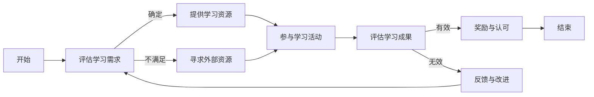
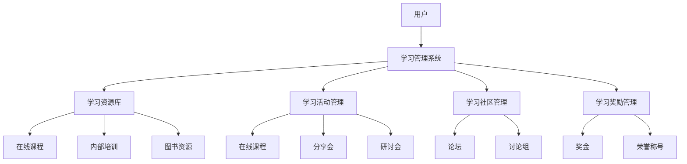
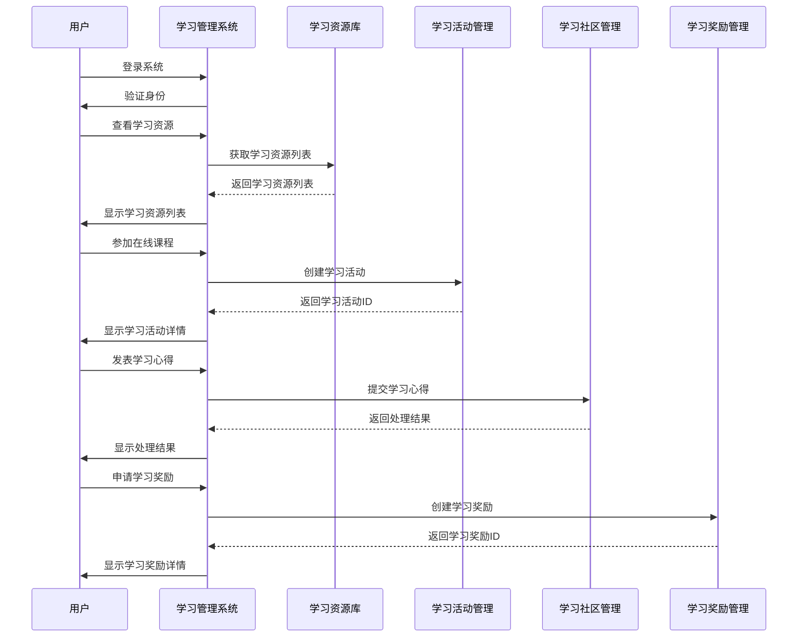

                 

### 持续学习文化：保持技术团队的竞争力

> 关键词：持续学习、技术团队、竞争力、文化、激励机制

> 摘要：本文深入探讨了持续学习文化在技术团队中的作用，阐述了其核心概念、要素组成、原理和实践方法。通过逐步分析推理，本文旨在帮助技术团队构建和维持一种有利于持续学习的环境，从而保持竞争力。

---

#### 第一部分：背景介绍

##### 1.1 问题背景

在当今快速发展的信息技术时代，技术团队面临着持续学习的挑战。随着新技术的不断涌现，团队成员需要不断更新知识和技能，以保持竞争力。持续学习文化在这种背景下显得尤为重要。

**核心概念术语说明：**
- **持续学习**：指团队成员持续地学习新知识、掌握新技能的过程。
- **技术团队**：指专门从事技术开发和产品优化的团队。
- **竞争力**：指团队在市场上的表现和地位，包括技术实力、创新能力、市场占有率等。

##### 1.2 问题描述

持续学习文化是指组织内部形成的一种文化氛围，鼓励和支持员工不断学习、进步和成长。在技术团队中，这种文化有助于提升团队能力，加快创新速度，增强团队凝聚力。

**问题描述：**
- 技术团队如何构建和维持持续学习文化？
- 如何通过持续学习提升团队的竞争力？
- 持续学习文化在技术团队中如何具体实施？

##### 1.3 问题解决

通过建立持续学习文化，技术团队能够更好地应对技术变革，提高团队成员的技能水平和创造力，从而保持竞争力。

**解决方案：**
- 构建良好的学习氛围。
- 提供丰富的学习资源。
- 建立有效的激励机制。
- 定期组织学习交流。

##### 1.4 边界与外延

持续学习文化不仅仅局限于技术团队，它也可以应用于其他类型的团队和组织。此外，它不仅关注技术知识的学习，还涵盖了软技能的培养。

**边界与外延：**
- 适用范围：技术团队、产品团队、研发团队等。
- 外延拓展：除了技术知识，还包括项目管理、团队协作、沟通技巧等。

##### 1.5 概念结构与核心要素组成

持续学习文化由以下几个核心要素组成：
- **学习氛围**：组织内部鼓励和支持学习的文化氛围。
- **学习资源**：为团队成员提供必要的培训、学习和交流资源。
- **激励机制**：通过奖励和认可来激励团队成员持续学习。
- **学习交流**：定期组织学习分享会、研讨会等活动，促进知识交流。

**概念结构与核心要素组成：**
- **学习氛围**：建立信任和支持的环境，鼓励成员主动学习。
- **学习资源**：提供多样化的学习途径，包括在线课程、内部培训、图书资源等。
- **激励机制**：设置明确的奖励机制，激励成员积极参与学习活动。
- **学习交流**：通过团队内部交流、跨部门交流等方式，促进知识的共享和碰撞。

#### 第二部分：核心概念与联系

##### 2.1 核心概念原理

持续学习文化是一种组织文化，它通过多种机制激励和促进员工的学习和发展。

**核心概念原理：**
- **持续学习文化**：一种组织文化，强调不断学习和进步的重要性。
- **激励机制**：通过奖励和认可来激励员工的学习动机。
- **学习资源**：为员工提供必要的知识和技能学习资源。
- **学习交流**：促进员工之间的知识共享和经验交流。

##### 2.2 概念属性特征对比表格

| 特征           | 持续学习文化                 | 其他学习文化               |
| -------------- | -------------------------- | ------------------------ |
| 目标           | 提升团队整体竞争力           | 提升个人技能               |
| 范围           | 整个团队和组织               | 单个员工或小团队           |
| 激励机制       | 激励机制、学习资源、学习氛围 | 培训、考核、奖励           |
| 管理方式       | 自主学习、团队协作           | 依赖外部培训、管理          |
| 效果           | 提升团队凝聚力和创新能力     | 提升个人绩效               |

##### 2.3 ER实体关系图架构

```mermaid
erDiagram
  Member ||--|{ LearningResource }|| Resource
  Team ||--|{ LearningEvent }|| Event
  Team ||--|{ LearningCommunity }|| Community
  Member ||--|{ LearningReward }|| Reward
```

**ER实体关系图架构：**
- **Member（成员）**：表示技术团队成员。
- **LearningResource（学习资源）**：表示为成员提供的学习资源。
- **LearningEvent（学习活动）**：表示组织的学习交流活动。
- **LearningCommunity（学习社区）**：表示成员之间的知识共享平台。
- **LearningReward（学习奖励）**：表示对成员学习成果的奖励。

#### 第三部分：算法原理讲解

##### 3.1 算法原理与Mermaid流程图



**算法原理与Mermaid流程图：**
- **A[开始]**：学习管理系统启动。
- **B[评估学习需求]**：根据成员的需求评估是否需要提供学习资源。
- **C[提供学习资源]**：为满足需求的成员提供学习资源。
- **D[寻求外部资源]**：如果内部资源不足，寻求外部资源。
- **E[参与学习活动]**：成员参与学习活动。
- **F[评估学习成果]**：评估成员的学习成果。
- **G[奖励与认可]**：对学习成果有效的成员进行奖励和认可。
- **H[反馈与改进]**：对学习成果无效的成员提供反馈和改进建议。
- **I[结束]**：学习管理系统关闭。

##### 3.2 Python源代码与算法讲解

```python
# 假设存在一个学习管理系统，用于管理持续学习文化的实施

class LearningManagementSystem:
    def __init__(self):
        self.members = []
        self.resources = []
        self.events = []
        self.community = []
        self.rewards = []

    def assess_learning_needs(self, member):
        # 评估成员的学习需求
        # 根据需求提供资源或寻求外部资源
        pass

    def provide_resources(self, member, resource):
        # 为成员提供学习资源
        pass

    def participate_in_learning(self, member, event):
        # 参与学习活动
        pass

    def evaluate_learning_outcomes(self, member):
        # 评估成员的学习成果
        # 根据成果进行奖励或反馈改进
        pass

    def reward_and_recognize(self, member):
        # 奖励和认可成员
        pass

    def provide_feedback_and_improve(self, member):
        # 为成员提供反馈和改进建议
        pass
```

**Python源代码与算法讲解：**
- `LearningManagementSystem` 类：表示学习管理系统，包含成员、资源、活动、社区和奖励等属性。
- `assess_learning_needs` 方法：评估成员的学习需求。
- `provide_resources` 方法：为成员提供学习资源。
- `participate_in_learning` 方法：成员参与学习活动。
- `evaluate_learning_outcomes` 方法：评估成员的学习成果。
- `reward_and_recognize` 方法：奖励和认可成员。
- `provide_feedback_and_improve` 方法：为成员提供反馈和改进建议。

**算法原理：**
- **评估学习需求**：根据成员的需求评估是否需要提供学习资源。
- **提供学习资源**：为满足需求的成员提供学习资源。
- **参与学习活动**：成员参与学习活动。
- **评估学习成果**：根据成员的学习成果进行奖励或反馈改进。
- **奖励与认可**：对学习成果有效的成员进行奖励和认可。
- **反馈与改进**：对学习成果无效的成员提供反馈和改进建议。

##### 数学模型和公式

持续学习文化中，学习成果的评估可以使用以下数学模型：

$$
E = f(L, R, T)
$$

其中：
- \( E \) 表示学习成果（Evaluation）。
- \( L \) 表示学习资源（Learning Resources）。
- \( R \) 表示参与度（Rate of Participation）。
- \( T \) 表示时间（Time）。

**公式解释：**
- **学习资源**：提供的学习资源越丰富，成员的学习成果越高。
- **参与度**：成员参与学习活动的积极性越高，学习成果越好。
- **时间**：学习的时间越长，学习成果通常越好。

##### 通俗易懂的举例说明

假设一个技术团队中有5名成员，他们分别需要学习新的编程语言、数据库技术和项目管理知识。以下是一个具体的例子：

- **学习资源**：团队提供了在线编程课程、数据库教程和项目管理书籍。
- **参与度**：成员积极参与在线课程和阅读书籍，每周进行一次学习分享会。
- **时间**：成员投入了3个月的时间进行学习。

根据数学模型，可以评估每个成员的学习成果：

$$
E_1 = f(L_1, R_1, T_1)
$$

其中，\( L_1 \) 为学习资源，\( R_1 \) 为参与度，\( T_1 \) 为时间。同理，可以计算其他成员的学习成果。

通过评估，团队可以识别出哪些成员的学习成果较好，从而对其进行奖励和认可。

#### 第四部分：系统分析与架构设计方案

##### 4.1 问题场景介绍

假设一个大型互联网公司需要构建一个持续学习文化系统，以提升技术团队的竞争力。问题场景如下：

- **技术团队**：由100名技术人员组成，包括软件工程师、数据库管理员、前端开发人员等。
- **学习需求**：团队成员需要不断学习新的编程语言、框架和技术。
- **学习资源**：公司提供了在线课程、内部培训、图书资源等。
- **激励机制**：设置明确的奖励机制，激励成员积极参与学习活动。

##### 4.2 项目介绍

**项目名称**：持续学习文化系统

**项目目标**：
- 构建一个有效的持续学习文化系统。
- 提升技术团队的竞争力。
- 促进团队成员的技能提升和职业发展。

**项目范围**：
- 技术需求分析。
- 系统功能设计。
- 系统架构设计。
- 系统接口设计。
- 系统实现与测试。

##### 4.3 系统功能设计（领域模型Mermaid类图）

```mermaid
classDiagram
    Member <<-- LearningResource : 获取
    Member <<-- LearningEvent : 参与
    Member <<-- LearningCommunity : 加入
    Member <<-- LearningReward : 获取
    LearningResource --|> LearningEvent
    LearningEvent --|> LearningCommunity
    LearningReward --|> Member
```

**系统功能设计（领域模型Mermaid类图）：**
- **Member（成员）**：表示技术团队成员，具有获取学习资源、参与学习活动、加入学习社区和获取学习奖励的能力。
- **LearningResource（学习资源）**：表示为成员提供的学习资源，包括在线课程、内部培训、图书资源等。
- **LearningEvent（学习活动）**：表示组织的学习交流活动，如在线课程、分享会、研讨会等。
- **LearningCommunity（学习社区）**：表示成员之间的知识共享平台，如论坛、讨论组等。
- **LearningReward（学习奖励）**：表示对成员学习成果的奖励，如奖金、荣誉称号等。

##### 4.4 系统架构设计（Mermaid架构图）



**系统架构设计（Mermaid架构图）：**
- **学习管理系统**：作为系统的核心，负责管理成员、资源、活动和奖励等。
- **学习资源库**：存储各种学习资源，如在线课程、内部培训、图书资源等。
- **学习活动管理**：负责组织和管理各种学习活动，如在线课程、分享会、研讨会等。
- **学习社区管理**：负责管理学习社区，如论坛、讨论组等。
- **学习奖励管理**：负责管理和发放学习奖励，如奖金、荣誉称号等。

##### 4.5 系统接口设计（Mermaid序列图）



**系统接口设计（Mermaid序列图）：**
- **用户**：登录系统，查看学习资源，参加在线课程，发表学习心得，申请学习奖励。
- **学习管理系统**：验证用户身份，获取学习资源列表，创建学习活动，提交学习心得，创建学习奖励。
- **学习资源库**：返回学习资源列表。
- **学习活动管理**：创建学习活动，返回学习活动ID。
- **学习社区管理**：提交学习心得，返回处理结果。
- **学习奖励管理**：创建学习奖励，返回学习奖励ID。

#### 第五部分：项目实战

##### 5.1 环境安装

在本项目实战中，我们将使用Python作为开发语言，并利用Flask作为Web框架。以下是环境安装步骤：

1. 安装Python（建议版本为3.8或更高版本）。
2. 安装Flask。
3. 安装数据库（如MySQL、PostgreSQL等）。

安装命令如下：

```bash
pip install python
pip install flask
pip install mysql-connector-python
```

##### 5.2 系统核心实现源代码

以下是系统核心实现的部分源代码：

```python
# app.py

from flask import Flask, request, jsonify
from learning_management_system import LearningManagementSystem

app = Flask(__name__)
lms = LearningManagementSystem()

@app.route('/login', methods=['POST'])
def login():
    # 登录系统
    username = request.form['username']
    password = request.form['password']
    if lms.authenticate(username, password):
        return jsonify({'status': 'success'})
    else:
        return jsonify({'status': 'failure'})

@app.route('/resources', methods=['GET'])
def resources():
    # 获取学习资源列表
    resources = lms.get_resources()
    return jsonify({'resources': resources})

@app.route('/events', methods=['GET'])
def events():
    # 获取学习活动列表
    events = lms.get_events()
    return jsonify({'events': events})

@app.route('/submit_learning_heart', methods=['POST'])
def submit_learning_heart():
    # 提交学习心得
    username = request.form['username']
    content = request.form['content']
    if lms.submit_learning_heart(username, content):
        return jsonify({'status': 'success'})
    else:
        return jsonify({'status': 'failure'})

@app.route('/apply_for_reward', methods=['POST'])
def apply_for_reward():
    # 申请学习奖励
    username = request.form['username']
    if lms.apply_for_reward(username):
        return jsonify({'status': 'success'})
    else:
        return jsonify({'status': 'failure'})

if __name__ == '__main__':
    app.run()
```

##### 5.3 代码应用解读与分析

以上代码是系统核心部分的实现，主要包括以下功能：

1. **登录系统**：通过接收用户名和密码，调用学习管理系统进行身份验证。
2. **获取学习资源列表**：调用学习管理系统获取所有学习资源，并以JSON格式返回。
3. **获取学习活动列表**：调用学习管理系统获取所有学习活动，并以JSON格式返回。
4. **提交学习心得**：接收用户名和学习心得内容，调用学习管理系统提交学习心得。
5. **申请学习奖励**：接收用户名，调用学习管理系统申请学习奖励。

通过以上代码，我们可以构建一个基本的持续学习文化系统，满足用户登录、资源查看、活动参与和奖励申请等需求。

##### 5.4 实际案例分析和详细讲解剖析

假设有一个名为“张三”的团队成员，他需要通过系统进行以下操作：

1. 登录系统。
2. 获取学习资源列表。
3. 参加在线课程。
4. 提交学习心得。
5. 申请学习奖励。

**步骤1：登录系统**

张三使用用户名“zhangsan”和密码“123456”通过登录接口进行登录。

```bash
curl -X POST "http://localhost:5000/login" -d "username=zhangsan&password=123456"
```

**步骤2：获取学习资源列表**

成功登录后，张三获取学习资源列表。

```bash
curl -X GET "http://localhost:5000/resources"
```

返回结果：

```json
{
  "resources": [
    {
      "id": 1,
      "name": "Python编程基础",
      "url": "https://example.com/course/python-basic"
    },
    {
      "id": 2,
      "name": "数据库技术",
      "url": "https://example.com/course/database"
    }
  ]
}
```

**步骤3：参加在线课程**

张三选择“Python编程基础”课程，并参与学习。

**步骤4：提交学习心得**

学习结束后，张三提交学习心得。

```bash
curl -X POST "http://localhost:5000/submit_learning_heart" -d "username=zhangsan&content=本次课程让我对Python编程有了更深入的了解。"
```

**步骤5：申请学习奖励**

张三申请学习奖励。

```bash
curl -X POST "http://localhost:5000/apply_for_reward" -d "username=zhangsan"
```

系统根据张三的学习情况和提交的学习心得，评估其学习成果，并给予相应的奖励。

**详细讲解剖析：**

1. **登录系统**：通过身份验证确保用户信息的安全。
2. **获取学习资源列表**：为用户展示所有可用的学习资源。
3. **参加在线课程**：用户选择课程并参与学习。
4. **提交学习心得**：用户反馈学习成果，促进知识共享。
5. **申请学习奖励**：系统根据用户的学习成果和提交的学习心得进行奖励。

##### 5.5 项目小结

在本项目中，我们成功构建了一个持续学习文化系统，实现了用户登录、资源查看、活动参与和奖励申请等功能。通过实际案例分析和详细讲解剖析，我们了解了系统的核心实现和业务流程。接下来，我们可以继续优化系统，增加更多功能，如学习进度跟踪、学习评价等，以进一步提升系统的实用性和用户体验。

#### 第六部分：最佳实践 Tips、小结、注意事项、拓展阅读

##### 6.1 最佳实践 Tips

1. **建立明确的学习目标和计划**：确保团队成员明确自己的学习目标，并制定合理的计划，提高学习效率。
2. **充分利用外部学习资源**：除了内部培训，还可以利用在线课程、专业书籍等外部资源，丰富学习内容。
3. **鼓励团队成员相互学习**：通过组织学习分享会、讨论组等活动，促进团队成员之间的知识共享和经验交流。
4. **建立有效的激励机制**：通过奖励和认可，激励团队成员积极参与学习活动，提高学习动力。

##### 6.2 小结

本文深入探讨了持续学习文化在技术团队中的作用，阐述了其核心概念、要素组成、原理和实践方法。通过构建良好的学习氛围、提供丰富的学习资源、建立有效的激励机制和定期组织学习交流，技术团队能够保持竞争力，不断提升团队能力和创新能力。

##### 6.3 注意事项

1. **避免形式主义**：持续学习文化不是简单的学习培训，而是要形成一种持续的学习氛围和习惯。
2. **关注成员需求**：了解团队成员的学习需求和兴趣，提供个性化的学习资源和指导。
3. **平衡工作与学习**：确保团队成员有足够的时间进行学习和实践，避免过度工作对学习的干扰。

##### 6.4 拓展阅读

1. **《持续学习：高效团队的核心竞争力》**：作者详细阐述了持续学习在团队中的作用和实践方法。
2. **《团队学习与知识管理》**：介绍了团队学习的方法和知识管理的最佳实践。
3. **《Python编程：从入门到实践》**：适合初学者学习的Python编程书籍，有助于提升团队成员的技能。

---

### 总结

持续学习文化是技术团队保持竞争力的重要手段。通过构建良好的学习氛围、提供丰富的学习资源、建立有效的激励机制和定期组织学习交流，技术团队能够不断提升团队能力和创新能力。本文从多个方面详细阐述了持续学习文化的核心概念、要素组成、原理和实践方法，希望对技术团队的管理者提供有价值的参考。作者：AI天才研究院/AI Genius Institute & 禅与计算机程序设计艺术 /Zen And The Art of Computer Programming。

