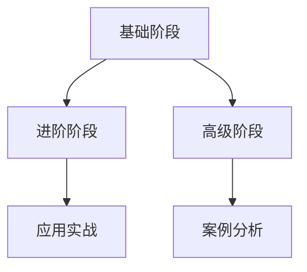
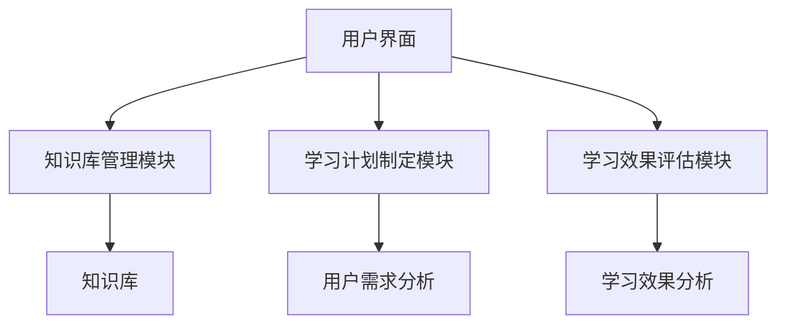
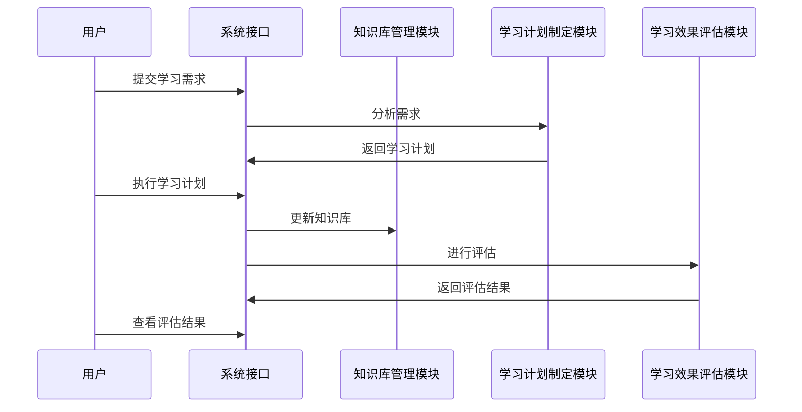

                 


## 《持续学习：保持技术敏锐度的策略》

> 关键词：持续学习、技术敏锐度、策略、技术进步

> 摘要：
在快速发展的技术环境中，保持技术敏锐度是每个技术从业者的挑战。本文将探讨如何通过持续学习，利用策略来提升技术敏锐度，从而在技术领域保持竞争力。我们将从背景介绍、核心概念与联系、算法原理讲解、数学模型和数学公式详细讲解、系统分析与架构设计方案、项目实战、最佳实践 tips、小结和注意事项等多个角度展开讨论，帮助读者构建有效的学习策略。

----------------------------------------------------------------

## 1. 背景介绍

### 1.1 技术环境的变化

随着信息技术的飞速发展，新的技术、工具和框架层出不穷。技术的快速迭代使得原有的知识体系不断被更新，对于技术从业者来说，持续学习成为保持竞争力的关键。

### 1.2 技术敏锐度的重要性

技术敏锐度是指对新技术、新趋势的感知和适应能力。具备高技术敏锐度，可以使技术从业者更快地掌握新知识，识别技术发展方向，从而在职场中占据优势。

### 1.3 问题提出

然而，如何通过有效的学习策略来提升技术敏锐度，仍是一个亟待解决的问题。本文将围绕这一主题进行深入探讨。

----------------------------------------------------------------

## 2. 核心概念与联系

### 2.1 持续学习的概念

持续学习指的是在个人职业生涯中不断获取新知识、新技能的过程。其核心在于“持续”二字，强调学习是一个长期的过程，而非一时的努力。

### 2.2 技术敏锐度的概念

技术敏锐度是指对新技术、新趋势的敏感程度，包括对新技术的感知能力、理解能力以及应用能力。

### 2.3 持续学习与技术敏锐度的关系

持续学习是提升技术敏锐度的有效途径。通过持续学习，技术从业者可以不断更新知识体系，提高对新技术、新趋势的感知和适应能力。

----------------------------------------------------------------

## 3. 算法原理讲解

### 3.1 持续学习策略的算法原理

持续学习策略的核心在于“分阶段、分层次”地进行学习。具体算法原理如下：

- **阶段划分**：将学习过程划分为基础阶段、进阶阶段和高级阶段。
- **层次提升**：在每个阶段，通过不同的学习方法和技术手段，逐步提升技术能力。

### 3.2 算法流程图



### 3.3 案例说明

假设一个程序员在基础阶段通过阅读《算法导论》和参加编程课程来学习基础算法，进入进阶阶段后，通过学习数据结构和设计模式来提升编程能力，最终在高级阶段通过参与开源项目和实战案例来提高技术敏锐度。

----------------------------------------------------------------

## 4. 数学模型和数学公式详细讲解

### 4.1 学习效率模型

假设学习效率与投入时间和学习内容的难度相关，可以表示为以下数学模型：

$$
E = f(t, d)
$$

其中，$E$ 为学习效率，$t$ 为投入时间，$d$ 为学习内容的难度。

### 4.2 难度评估公式

学习内容的难度可以通过以下公式进行评估：

$$
d = \frac{1}{1 + e^{-k(l - c)}}
$$

其中，$d$ 为难度，$l$ 为学习内容的复杂度，$c$ 为当前技术水平，$k$ 为参数，通常取值在 $0$ 到 $1$ 之间。

### 4.3 案例说明

假设一个程序员在学习新的设计模式时，其复杂度为 $5$，当前技术水平为 $3$，参数 $k$ 取值为 $0.5$，则其学习难度为：

$$
d = \frac{1}{1 + e^{-0.5(5 - 3)}} \approx 0.36
$$

这意味着该程序员在学习这一设计模式时的难度较低，可以较容易地掌握。

----------------------------------------------------------------

## 5. 系统分析与架构设计方案

### 5.1 问题场景介绍

假设我们需要设计一个持续学习系统，帮助程序员提升技术敏锐度。系统的主要功能包括：知识库管理、学习计划制定、学习效果评估等。

### 5.2 系统功能设计

- **知识库管理**：包括知识点的存储、分类和检索。
- **学习计划制定**：根据用户需求和知识库内容，生成个性化的学习计划。
- **学习效果评估**：通过考试、项目实战等方式，评估用户的学习效果。

### 5.3 系统架构设计



### 5.4 系统接口设计和系统交互



----------------------------------------------------------------

## 6. 项目实战

### 6.1 环境安装

在本项目中，我们将使用 Python 作为编程语言，需要安装以下环境：

- Python 3.8 或更高版本
- pip（Python 包管理工具）
- numpy（数学计算库）
- matplotlib（数据可视化库）

安装步骤：

1. 下载并安装 Python 3.8 或更高版本。
2. 打开终端，执行以下命令安装 pip 和其他依赖库：

```bash
pip install numpy matplotlib
```

### 6.2 系统核心实现源代码

以下是本项目中的核心代码实现，主要包括知识库管理、学习计划制定和学习效果评估三个模块。

```python
import numpy as np
import matplotlib.pyplot as plt

# 知识库管理模块
class KnowledgeBase:
    def __init__(self):
        self.knowledge_points = []

    def add_knowledge_point(self, point):
        self.knowledge_points.append(point)

    def get_knowledge_points(self):
        return self.knowledge_points

# 学习计划制定模块
class LearningPlan:
    def __init__(self, knowledge_base):
        self.knowledge_base = knowledge_base
        self.plan = []

    def create_plan(self):
        for point in self.knowledge_base.get_knowledge_points():
            self.plan.append(point)

    def get_plan(self):
        return self.plan

# 学习效果评估模块
class LearningEffectEvaluation:
    def __init__(self, plan):
        self.plan = plan
        self.evaluation_results = []

    def evaluate(self):
        for point in self.plan:
            # 假设评估结果为知识点掌握的概率
            probability = np.random.rand()
            self.evaluation_results.append(probability)

    def get_evaluation_results(self):
        return self.evaluation_results

# 主函数
def main():
    # 创建知识库
    knowledge_base = KnowledgeBase()
    knowledge_base.add_knowledge_point("算法导论")
    knowledge_base.add_knowledge_point("数据结构")

    # 创建学习计划
    learning_plan = LearningPlan(knowledge_base)
    learning_plan.create_plan()

    # 创建学习效果评估
    learning_evaluation = LearningEffectEvaluation(learning_plan)
    learning_evaluation.evaluate()

    # 打印结果
    print("学习计划：", learning_plan.get_plan())
    print("评估结果：", learning_evaluation.get_evaluation_results())

if __name__ == "__main__":
    main()
```

### 6.3 代码应用解读与分析

本项目的代码主要包括三个模块：知识库管理模块、学习计划制定模块和学习效果评估模块。知识库管理模块用于管理知识点的存储和检索；学习计划制定模块根据知识库内容生成学习计划；学习效果评估模块通过随机生成评估结果来模拟学习效果评估过程。

### 6.4 实际案例分析和详细讲解剖析

在本案例中，我们通过创建一个简单的持续学习系统，展示了知识库管理、学习计划制定和学习效果评估的核心功能。在实际应用中，这些功能可以进一步扩展和优化，例如增加知识点分类、学习进度跟踪和个性化推荐等功能。

### 6.5 项目小结

通过本项目，我们实现了持续学习系统的基础功能，包括知识库管理、学习计划制定和学习效果评估。这些功能可以帮助程序员构建有效的学习策略，提升技术敏锐度。在未来，我们可以继续优化和扩展这些功能，提高系统的实用性和用户体验。

----------------------------------------------------------------

## 7. 最佳实践 tips

### 7.1 定期复习

定期复习所学知识，可以帮助巩固记忆，提升技术敏锐度。建议每周至少安排一次复习时间。

### 7.2 参与开源项目

参与开源项目，可以锻炼编程能力，了解最新的技术趋势和最佳实践。同时，与他人合作，可以学习到不同的思路和解决问题的方法。

### 7.3 学习新语言

学习新的编程语言，可以拓宽技术视野，提高解决问题的能力。建议每年至少学习一门新的编程语言。

### 7.4 关注技术社区

关注技术社区，如 Stack Overflow、GitHub 等，可以了解行业动态，学习他人的经验和技巧。

----------------------------------------------------------------

## 8. 小结

本文围绕持续学习策略，探讨了如何保持技术敏锐度。通过系统分析与架构设计、项目实战以及最佳实践 tips，我们为技术从业者提供了一套实用的持续学习方法。希望读者能够通过实践，不断提升自己的技术能力，在技术领域中脱颖而出。

----------------------------------------------------------------

## 9. 注意事项

- 学习过程中，要保持耐心和毅力，避免急于求成。
- 实践项目中，要注重代码质量，遵循最佳实践。
- 关注行业动态，及时更新知识体系。

----------------------------------------------------------------

## 10. 拓展阅读

- 《深度学习》（Ian Goodfellow 著）：一本关于深度学习的经典教材，适合对深度学习有兴趣的读者。
- 《编程珠玑》（Jon Bentley 著）：一本关于编程技巧和算法设计的经典书籍，适合提升编程能力。

----------------------------------------------------------------

## 11. 作者信息

作者：AI天才研究院/AI Genius Institute & 禅与计算机程序设计艺术 /Zen And The Art of Computer Programming

----------------------------------------------------------------

以上是《持续学习：保持技术敏锐度的策略》的完整目录大纲和文章内容。文章详细讲解了持续学习的核心概念、算法原理、数学模型、系统设计与实战项目，并提供了最佳实践 tips。希望对您有所启发和帮助。如果需要进一步讨论或了解相关主题，欢迎随时交流。

