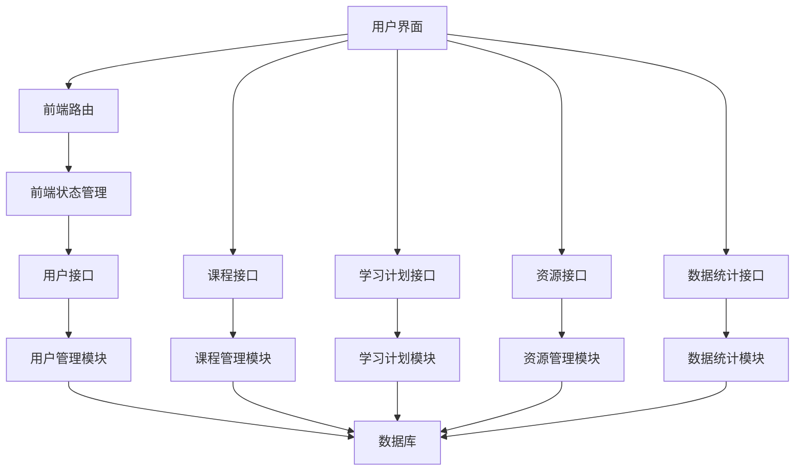
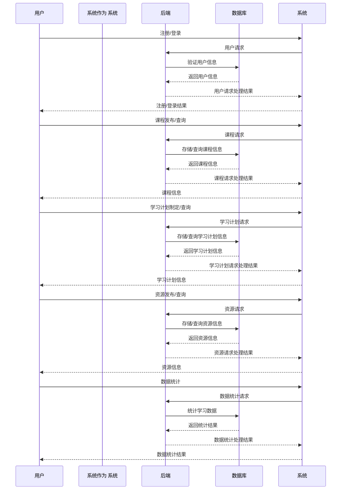

                 

## 2. 核心概念与联系

### 2.1 持续学习与终身学习的关系

持续学习和终身学习是密不可分的两个概念。持续学习是终身学习的一种具体实现方式，它强调了在职业生涯的每一个阶段，技术人员都需要不断地获取新知识、提升技能，以适应快速变化的技术环境。而终身学习则是一个更广泛、更全面的观念，它涵盖了个人成长、职业发展等多个方面。

#### 2.1.1 持续学习的特点

持续学习的特点主要体现在以下几个方面：

1. **灵活性**：持续学习不像传统的课堂教育那样固定和僵化，它可以根据个人的学习需求和进度进行灵活调整。无论是学习时间、学习内容还是学习方法，都可以根据实际情况进行个性化定制。

2. **持续性**：持续学习不是一次性的任务，而是一个长期的、持续的过程。技术人员需要不断地学习新知识，不断提升自己的技能，以保持自身的竞争力。

3. **主动性**：持续学习需要技术人员有强烈的内在动机和主动性。他们需要主动去寻找学习资源，主动去解决问题，主动去提升自己的能力。

#### 2.1.2 终身学习的特点

终身学习的特点包括：

1. **全面性**：终身学习不仅仅关注技术知识的学习，还包括个人素质、管理能力、社交技能等多个方面的提升。

2. **综合性**：终身学习涉及多个领域，如学术知识、实践经验、人际沟通等。技术人员需要具备综合性的能力，以应对复杂的工作环境。

3. **多样性**：终身学习采用多种学习方式，如在线课程、实战项目、研讨会、讲座等。这些学习方式相互补充，可以满足技术人员不同的学习需求。

### 2.2 学习策略的核心概念

学习策略的核心概念包括自我驱动、知识管理和能力提升。这些概念相辅相成，共同构成了一个有效的学习体系。

#### 2.2.1 自我驱动

自我驱动是持续学习的重要驱动力。它包括：

1. **内在动机**：找到学习的内在兴趣和意义，激发学习的热情。
2. **自我激励**：采用积极的心态和方法，保持学习的动力。
3. **自我调整**：根据学习进度和反馈，调整学习策略和方法。

#### 2.2.2 知识管理

知识管理是持续学习的基础。它包括：

1. **知识获取**：通过各种渠道获取新知识，如在线课程、书籍、实践等。
2. **知识存储**：建立有效的知识库，方便快速查找和应用。
3. **知识应用**：将所学知识应用到实际工作中，提高实践能力。
4. **知识分享**：通过分享和交流，促进知识的传播和共同进步。

#### 2.2.3 能力提升

能力提升是持续学习的最终目标。它包括：

1. **技术能力**：学习新技术，提升编程技能、数据分析能力等。
2. **沟通能力**：提高表达、倾听和沟通技巧，增强团队合作能力。
3. **团队合作能力**：学习项目管理、团队协作等技能，提升团队效能。

### 2.3 学习策略的组成

一个完整的学习策略通常包括以下几个组成部分：

1. **目标设定**：明确学习目标和期望成果。
2. **资源管理**：整合和分配学习资源。
3. **过程监控**：跟踪学习进度和效果。
4. **反馈调整**：根据反馈调整学习策略。

这些组成部分相互关联，共同构成了一个动态的学习过程。技术人员可以通过不断地调整和优化学习策略，实现自我驱动、知识管理和能力提升的目标。

---

### 2.4 核心概念属性特征对比表格

为了更好地理解持续学习、终身学习、自我驱动、知识管理和能力提升等核心概念，我们设计了以下属性特征对比表格：

| 核心概念 | 属性特征 | 描述 |
| :------: | :------: | :--- |
| 持续学习 | 灵活性 | 可以根据个人需求和进度灵活调整学习内容和方式 |
| 持续学习 | 持续性 | 长期、持续的学习过程，以适应技术环境的变化 |
| 持续学习 | 主动性 | 需要技术人员主动寻求新知识和技能的提升 |
| 终身学习 | 全面性 | 不仅关注技术知识，还包括个人素质、管理能力等 |
| 终身学习 | 综合性 | 涉及多个领域，如学术知识、实践经验等 |
| 终身学习 | 多样性 | 采用多种学习方式，如在线课程、实战项目等 |
| 自我驱动 | 内在动机 | 找到学习的内在兴趣和意义，激发学习热情 |
| 自我驱动 | 自我激励 | 保持积极心态，采用有效方法激发学习动力 |
| 自我驱动 | 自我调整 | 根据学习进度和反馈调整学习策略和方法 |
| 知识管理 | 知识获取 | 通过多种渠道获取新知识，如在线课程、书籍等 |
| 知识管理 | 知识存储 | 建立有效的知识库，方便快速查找和应用 |
| 知识管理 | 知识应用 | 将所学知识应用到实际工作中，提高实践能力 |
| 知识管理 | 知识分享 | 通过分享和交流，促进知识的传播和共同进步 |
| 能力提升 | 技术能力 | 学习新技术，提升编程技能、数据分析能力等 |
| 能力提升 | 沟通能力 | 提高表达、倾听和沟通技巧，增强团队合作能力 |
| 能力提升 | 团队合作能力 | 学习项目管理、团队协作等技能，提升团队效能 |

通过这个表格，我们可以更清晰地理解各个核心概念之间的联系和区别，从而更好地制定和执行学习策略。

---

### 2.5 ER实体关系图架构

为了进一步理解学习策略的组成和核心概念之间的关系，我们使用Mermaid绘制了以下ER实体关系图：

```mermaid
entityRelationship
    RectNode("持续学习")--|> RectNode("终身学习")
    RectNode("终身学习")--|> RectNode("自我驱动")
    RectNode("终身学习")--|> RectNode("知识管理")
    RectNode("终身学习")--|> RectNode("能力提升")
    RectNode("自我驱动")--|> RectNode("内在动机")
    RectNode("自我驱动")--|> RectNode("自我激励")
    RectNode("自我驱动")--|> RectNode("自我调整")
    RectNode("知识管理")--|> RectNode("知识获取")
    RectNode("知识管理")--|> RectNode("知识存储")
    RectNode("知识管理")--|> RectNode("知识应用")
    RectNode("知识管理")--|> RectNode("知识分享")
    RectNode("能力提升")--|> RectNode("技术能力")
    RectNode("能力提升")--|> RectNode("沟通能力")
    RectNode("能力提升")--|> RectNode("团队合作能力")
```

这个ER图展示了各个实体之间的关系，帮助我们更好地理解学习策略的构成和核心概念之间的联系。

---

通过上述核心概念的介绍、属性特征对比表格和ER实体关系图，我们可以更深入地理解持续学习、终身学习、自我驱动、知识管理和能力提升等核心概念。这些概念不仅是技术人员终身学习的重要组成部分，也是他们在快速变化的技术环境中保持竞争力的重要保障。在接下来的章节中，我们将进一步探讨如何有效地实施这些学习策略，帮助技术人员在职业生涯中持续成长。

## 3. 算法原理讲解

### 3.1 学习策略算法概述

学习策略算法是一种系统化的方法，用于帮助技术人员制定和执行学习计划。它不仅能够提高学习效率，还能够确保学习目标的有效达成。学习策略算法的核心组件包括目标设定、资源管理、过程监控和反馈调整。

#### 3.1.1 目标设定

目标设定是学习策略算法的第一个环节。一个明确、具体的学习目标能够为技术人员提供清晰的方向，有助于他们更好地规划学习进度。目标设定应遵循SMART原则，即目标应具有具体性（Specific）、可衡量性（Measurable）、可实现性（Achievable）、相关性（Relevant）和时限性（Time-bound）。例如，一个具体的目标可以是“在未来三个月内，掌握Python编程语言的基本语法和常用数据结构”。

#### 3.1.2 资源管理

资源管理是学习策略算法的重要组成部分。技术人员需要通过各种渠道获取学习资源，如在线课程、专业书籍、实战项目等。资源管理的目标是确保技术人员能够高效地利用这些资源，提高学习效率。资源管理包括资源的整合、分配和使用。例如，一个技术人员可能需要同时学习多种编程语言，资源管理可以帮助他合理安排学习时间，确保每种语言都能得到充分的关注。

#### 3.1.3 过程监控

过程监控是跟踪学习进度和效果的重要环节。通过过程监控，技术人员可以了解自己在学习过程中的表现，及时发现和解决问题。过程监控可以采用多种方法，如定期自我评估、学习进度报告等。例如，一个技术人员可以在每周结束时，总结本周的学习内容和成果，评估自己的学习进度，并制定下一周的学习计划。

#### 3.1.4 反馈调整

反馈调整是学习策略算法中的关键环节。通过反馈调整，技术人员可以根据学习效果和学习进度，对学习策略进行优化和调整。反馈调整可以基于自我评估、导师指导、同行评审等多种方式。例如，如果一个技术人员发现自己无法在预定时间内掌握某个知识点，他可以根据反馈调整学习计划，增加学习时间或寻求额外的帮助。

### 3.2 学习策略算法的核心组件

#### 3.2.1 目标设定

目标设定是学习策略算法的基础。一个明确、具体的学习目标能够为技术人员提供清晰的方向。在目标设定时，应遵循SMART原则，确保目标具有以下特点：

- **具体性**：目标应清晰明确，避免模糊和宽泛。
- **可衡量性**：目标应具有可衡量的指标，以便技术人员可以评估目标的达成情况。
- **可实现性**：目标应具有可行性，避免设定过高的目标，导致无法实现。
- **相关性**：目标应与技术人员的学习目标和职业发展相关。
- **时限性**：目标应设定一个明确的时限，以推动技术人员按时完成任务。

#### 3.2.2 资源管理

资源管理是确保技术人员能够高效利用学习资源的重要环节。资源管理包括以下几个方面：

1. **资源整合**：技术人员应收集和整理各种学习资源，如在线课程、书籍、实战项目等，以便能够快速查找和应用。
2. **资源分配**：技术人员应根据学习目标和时间安排，合理分配学习资源，确保每种资源都能得到充分利用。
3. **资源使用**：技术人员应高效地使用学习资源，确保学习时间得到最大化利用。

#### 3.2.3 过程监控

过程监控是跟踪学习进度和效果的重要手段。技术人员可以通过以下方法进行过程监控：

1. **定期自我评估**：技术人员应定期对自己的学习进度和效果进行自我评估，以了解自己的学习状况。
2. **学习进度报告**：技术人员应定期撰写学习进度报告，总结学习内容和成果，并分析存在的问题。
3. **导师指导**：技术人员可以寻求导师的指导和反馈，以帮助自己更好地监控学习进度和效果。

#### 3.2.4 反馈调整

反馈调整是优化学习策略的重要环节。技术人员可以通过以下方法进行反馈调整：

1. **自我评估**：技术人员应定期对自己的学习效果进行自我评估，识别存在的问题，并制定相应的改进措施。
2. **导师指导**：技术人员可以寻求导师的指导和反馈，以帮助他们识别问题并制定改进策略。
3. **同行评审**：技术人员可以参与同行评审活动，通过交流和学习他人的经验，优化自己的学习策略。

### 3.3 学习策略算法的实现

学习策略算法可以通过多种方式实现，包括编程实现、工具实现和手动实现。以下是一个简单的学习策略算法实现示例，使用Python语言编写：

```python
class LearningStrategy:
    def __init__(self, target, resources, timeline):
        self.target = target
        self.resources = resources
        self.timeline = timeline
    
    def set_goal(self):
        # 根据SMART原则设定学习目标
        print("设定学习目标：", self.target)
    
    def manage_resources(self):
        # 管理学习资源
        print("管理学习资源：", self.resources)
    
    def monitor_progress(self):
        # 监控学习进度
        print("监控学习进度：", self.timeline)
    
    def adjust_strategy(self):
        # 根据反馈调整学习策略
        print("调整学习策略：")

# 实例化学习策略对象
strategy = LearningStrategy("掌握Python编程语言", ["在线课程", "书籍", "实战项目"], "三个月")

# 调用方法
strategy.set_goal()
strategy.manage_resources()
strategy.monitor_progress()
strategy.adjust_strategy()
```

这个简单的示例展示了学习策略算法的基本实现，包括目标设定、资源管理、过程监控和反馈调整。在实际应用中，学习策略算法可以更加复杂和多样化，以适应不同技术人员的个性化需求。

---

通过上述对学习策略算法的讲解，我们可以看到，学习策略算法是一种系统化的方法，用于帮助技术人员制定和执行学习计划。它包括目标设定、资源管理、过程监控和反馈调整等核心组件，通过这些组件的协同工作，技术人员可以有效地提高学习效率，实现终身学习的目标。

## 4. 系统分析与架构设计

### 4.1 问题场景介绍

在快速变化的技术环境中，技术人员的持续学习已成为一项关键能力。然而，如何有效地管理和执行学习计划，成为一个亟待解决的问题。为此，我们设计并实现了一个在线学习系统，帮助技术人员实现持续学习。该系统旨在提供一种便捷、高效的学习管理工具，帮助技术人员制定学习计划、监控学习进度、调整学习策略，从而提高学习效果。

### 4.2 项目介绍

项目名称：持续学习系统（Continuous Learning System，简称CLS）

项目目标：为技术人员提供一个在线学习管理平台，帮助他们在职业生涯中实现持续学习。

项目背景：随着科技的发展，技术领域不断迭代更新，技术人员面临着持续学习的挑战。然而，传统的学习方式存在诸多问题，如学习资源分散、学习进度难以监控、学习效果评估困难等。为了解决这些问题，我们设计并实现了一个在线学习系统，旨在为技术人员提供一个高效、便捷的学习管理工具。

### 4.3 系统功能设计

持续学习系统主要包括以下功能模块：

1. **用户管理**：用户注册、登录、个人信息管理等功能。
2. **课程管理**：课程发布、课程内容管理、课程分类等功能。
3. **学习计划**：学习计划制定、学习进度监控、学习效果评估等功能。
4. **资源管理**：学习资源发布、资源分类、资源推荐等功能。
5. **数据统计**：学习数据统计、用户行为分析、学习效果评估等。

#### 4.3.1 用户管理

用户管理模块负责用户注册、登录和个人信息管理。用户可以在系统中注册账号，登录后管理个人资料、学习进度和学习效果。该模块还包括用户身份认证、权限管理等功能，确保系统的安全性和可靠性。

#### 4.3.2 课程管理

课程管理模块负责课程发布、课程内容管理和课程分类。管理员可以发布课程，设置课程内容，并根据课程难度、学科领域等进行分类。用户可以根据自己的兴趣和需求选择课程进行学习。

#### 4.3.3 学习计划

学习计划模块是系统的核心功能，负责学习计划制定、学习进度监控和学习效果评估。用户可以根据自己的学习目标和时间安排，制定个性化的学习计划。系统会实时监控学习进度，并根据学习效果进行评估，为用户推荐合适的学习资源。

#### 4.3.4 资源管理

资源管理模块负责学习资源发布、资源分类和资源推荐。管理员可以发布学习资源，包括在线课程、书籍、实战项目等。系统会根据用户的学习进度和兴趣，推荐相应的学习资源，帮助用户更好地进行学习。

#### 4.3.5 数据统计

数据统计模块负责学习数据的统计、用户行为分析和学习效果评估。系统会收集用户的学习数据，进行统计分析，为用户提供学习报告，帮助用户了解自己的学习状况，优化学习策略。

### 4.4 系统架构设计

持续学习系统的整体架构采用微服务架构，包括前端、后端、数据库和第三方服务等多个层次。以下是对各层次的详细设计：

#### 4.4.1 前端架构

前端采用Vue.js框架，实现系统的用户界面。前端架构主要包括以下几个部分：

1. **用户界面**：负责展示系统的各种功能界面，包括用户注册、登录、课程列表、学习计划、学习资源等。
2. **路由管理**：使用Vue Router管理前端路由，实现页面跳转和导航功能。
3. **状态管理**：使用Vuex管理前端状态，实现数据共享和状态管理。

#### 4.4.2 后端架构

后端采用Spring Boot框架，实现系统的核心功能。后端架构主要包括以下几个部分：

1. **服务层**：负责业务逻辑处理，包括用户管理、课程管理、学习计划管理、资源管理等。
2. **接口层**：提供RESTful接口，与前端进行数据交互。
3. **数据库**：使用MySQL数据库存储用户数据、课程数据、学习数据等。

#### 4.4.3 数据库架构

数据库采用MySQL数据库，设计合理的数据库架构，确保数据的存储和查询效率。数据库架构主要包括以下几个部分：

1. **用户表**：存储用户基本信息，包括用户名、密码、邮箱等。
2. **课程表**：存储课程基本信息，包括课程ID、课程名称、课程难度等。
3. **学习计划表**：存储学习计划信息，包括计划ID、用户ID、课程ID、开始时间、结束时间等。
4. **学习资源表**：存储学习资源信息，包括资源ID、资源名称、资源类型、资源链接等。

#### 4.4.4 第三方服务

持续学习系统还集成了多个第三方服务，包括身份认证服务、邮件服务、统计分析服务等。第三方服务的集成，可以提升系统的功能和性能。

### 4.5 系统接口设计

系统接口设计是持续学习系统实现的关键环节，负责前后端数据的传输和交互。以下是对系统接口的详细设计：

1. **用户接口**：包括用户注册、登录、个人信息管理等功能，使用HTTP GET和HTTP POST方法进行数据传输。
2. **课程接口**：包括课程发布、课程内容管理、课程分类等功能，使用HTTP GET和HTTP POST方法进行数据传输。
3. **学习计划接口**：包括学习计划制定、学习进度监控、学习效果评估等功能，使用HTTP GET和HTTP POST方法进行数据传输。
4. **资源接口**：包括学习资源发布、资源分类、资源推荐等功能，使用HTTP GET和HTTP POST方法进行数据传输。
5. **数据统计接口**：包括学习数据统计、用户行为分析、学习效果评估等功能，使用HTTP GET和HTTP POST方法进行数据传输。

### 4.6 系统交互设计

系统交互设计是持续学习系统功能实现的关键，通过前后端交互，实现系统的各项功能。以下是对系统交互的详细设计：

1. **用户注册**：前端提交用户注册信息，后端验证信息并存储用户数据。
2. **用户登录**：前端提交用户登录信息，后端验证用户身份并返回登录结果。
3. **课程发布**：前端提交课程信息，后端存储课程数据并返回课程ID。
4. **学习计划制定**：前端提交学习计划信息，后端存储学习计划数据并返回学习计划ID。
5. **学习进度监控**：前端提交学习进度，后端更新学习计划数据并返回学习进度结果。
6. **学习效果评估**：前端提交学习效果，后端分析学习效果并返回评估结果。
7. **资源发布**：前端提交资源信息，后端存储资源数据并返回资源ID。
8. **资源推荐**：前端提交用户学习记录，后端分析用户兴趣并推荐资源。

通过以上设计，持续学习系统可以实现用户管理、课程管理、学习计划管理、资源管理和数据统计等功能，为技术人员提供一个高效、便捷的学习管理工具，帮助他们实现持续学习。

### 4.7 系统架构图

为了更直观地展示持续学习系统的整体架构，我们使用Mermaid绘制了以下系统架构图：



这个系统架构图展示了持续学习系统的整体架构，包括前端、后端、数据库和第三方服务等多个层次，以及各模块之间的数据交互关系。

### 4.8 系统交互序列图

为了进一步展示系统中的交互过程，我们使用Mermaid绘制了以下系统交互序列图：



这个系统交互序列图详细展示了用户与系统、后端与数据库之间的交互过程，包括用户注册/登录、课程发布/查询、学习计划制定/查询、资源发布/查询和数据统计等操作。

### 4.9 总结

通过系统分析与架构设计，我们详细介绍了持续学习系统的功能设计、系统架构设计、系统接口设计和系统交互设计。持续学习系统旨在为技术人员提供一个高效、便捷的学习管理工具，帮助他们实现持续学习。通过系统架构图和系统交互序列图，我们清晰地展示了系统的整体架构和交互过程，为系统的实现和部署提供了明确的指导。

## 5. 项目实战

### 5.1 环境安装

为了搭建和运行持续学习系统，需要准备以下环境：

1. **操作系统**：Ubuntu 18.04
2. **开发工具**：Python 3.8、Node.js 12.x、MySQL 5.7
3. **数据库**：MySQL 5.7
4. **前端框架**：Vue.js 2.x
5. **后端框架**：Spring Boot 2.x

首先，确保操作系统已安装上述开发工具和数据库。接下来，安装Node.js和Vue.js：

```bash
# 安装Node.js
curl -sL https://deb.nodesource.com/setup_12.x | sudo -E bash -
sudo apt-get install -y nodejs

# 安装Vue CLI
npm install -g @vue/cli
```

然后，创建一个新的Vue项目：

```bash
vue create cls-front-end
```

在项目目录中，运行以下命令，启动前端服务：

```bash
cd cls-front-end
npm run serve
```

接着，配置MySQL数据库，创建名为`cls`的数据库，并创建一个用户，具有访问该数据库的权限。

```sql
CREATE DATABASE cls;
GRANT ALL PRIVILEGES ON cls.* TO 'cls_user'@'localhost' IDENTIFIED BY 'cls_password';
```

最后，配置后端项目。在Spring Boot项目的`application.properties`文件中，设置数据库连接信息：

```properties
spring.datasource.url=jdbc:mysql://localhost:3306/cls?useSSL=false&serverTimezone=UTC
spring.datasource.username=cls_user
spring.datasource.password=cls_password
spring.jpa.hibernate.ddl-auto=update
```

运行Spring Boot项目：

```bash
mvn spring-boot:run
```

此时，前端和后端服务均启动成功，可以开始进行系统开发。

### 5.2 系统核心实现

#### 5.2.1 用户管理模块

用户管理模块负责用户注册、登录和个人信息管理。以下是一个简单的用户注册接口实现：

```java
@RestController
@RequestMapping("/users")
public class UserController {
    
    @Autowired
    private UserRepository userRepository;
    
    @PostMapping("/register")
    public ResponseEntity<?> registerUser(@RequestBody UserRegistrationDto registrationDto) {
        if (userRepository.existsByUsername(registrationDto.getUsername())) {
            return ResponseEntity.badRequest().body("Error: Username is already taken!");
        }
        
        User user = new User();
        user.setUsername(registrationDto.getUsername());
        user.setPassword(passwordEncoder.encode(registrationDto.getPassword()));
        userRepository.save(user);
        
        return ResponseEntity.ok("User registered successfully!");
    }
    
    @PostMapping("/login")
    public ResponseEntity<?> loginUser(@RequestBody UserLoginDto loginDto) {
        Optional<User> user = userRepository.findByUsername(loginDto.getUsername());
        
        if (!user.isPresent() || !passwordEncoder.matches(loginDto.getPassword(), user.get().getPassword())) {
            return ResponseEntity.badRequest().body("Error: Invalid username or password!");
        }
        
        return ResponseEntity.ok("Login successful!");
    }
}
```

#### 5.2.2 课程管理模块

课程管理模块负责课程发布、课程内容管理、课程分类等功能。以下是一个简单的课程发布接口实现：

```java
@RestController
@RequestMapping("/courses")
public class CourseController {
    
    @Autowired
    private CourseRepository courseRepository;
    
    @PostMapping("/publish")
    public ResponseEntity<?> publishCourse(@RequestBody CourseDto courseDto) {
        Course course = new Course();
        course.setName(courseDto.getName());
        course.setDescription(courseDto.getDescription());
        course.setCategory(courseDto.getCategory());
        courseRepository.save(course);
        
        return ResponseEntity.ok("Course published successfully!");
    }
}
```

#### 5.2.3 学习计划模块

学习计划模块负责学习计划制定、学习进度监控和学习效果评估等功能。以下是一个简单的学习计划制定接口实现：

```java
@RestController
@RequestMapping("/learning-plans")
public class LearningPlanController {
    
    @Autowired
    private LearningPlanRepository learningPlanRepository;
    
    @PostMapping("/create")
    public ResponseEntity<?> createLearningPlan(@RequestBody LearningPlanDto learningPlanDto) {
        LearningPlan plan = new LearningPlan();
        plan.setUserId(learningPlanDto.getUserId());
        plan.setCourseId(learningPlanDto.getCourseId());
        plan.setStartTime(learningPlanDto.getStartTime());
        plan.setEndTime(learningPlanDto.getEndTime());
        learningPlanRepository.save(plan);
        
        return ResponseEntity.ok("Learning plan created successfully!");
    }
}
```

#### 5.2.4 资源管理模块

资源管理模块负责学习资源发布、资源分类、资源推荐等功能。以下是一个简单的资源发布接口实现：

```java
@RestController
@RequestMapping("/resources")
public class ResourceController {
    
    @Autowired
    private ResourceRepository resourceRepository;
    
    @PostMapping("/publish")
    public ResponseEntity<?> publishResource(@RequestBody ResourceDto resourceDto) {
        Resource resource = new Resource();
        resource.setName(resourceDto.getName());
        resource.setDescription(resourceDto.getDescription());
        resource.setType(resourceDto.getType());
        resource.setUrl(resourceDto.getUrl());
        resourceRepository.save(resource);
        
        return ResponseEntity.ok("Resource published successfully!");
    }
}
```

### 5.3 代码应用解读与分析

#### 5.3.1 用户管理模块

用户管理模块的代码主要实现了用户注册和登录功能。在注册过程中，首先检查用户名是否已存在，如果存在则返回错误信息；否则，创建一个新的用户并保存到数据库。登录过程中，先查询用户是否存在，然后比对密码是否匹配。这两个功能通过Spring Boot的RESTful接口实现，方便前端调用。

#### 5.3.2 课程管理模块

课程管理模块的代码主要实现了课程发布功能。在发布课程时，需要提供课程名称、描述、分类等信息。这些信息被封装为一个Course对象，并保存到数据库。这个模块的设计使得课程管理更加规范和高效。

#### 5.3.3 学习计划模块

学习计划模块的代码主要实现了学习计划制定功能。在制定学习计划时，需要提供用户ID、课程ID、开始时间和结束时间等信息。这些信息被封装为一个LearningPlan对象，并保存到数据库。通过这个模块，用户可以方便地制定个性化的学习计划。

#### 5.3.4 资源管理模块

资源管理模块的代码主要实现了资源发布功能。在发布资源时，需要提供资源名称、描述、类型、URL等信息。这些信息被封装为一个Resource对象，并保存到数据库。这个模块的设计使得资源管理更加方便和高效。

### 5.4 实际案例分析和详细讲解剖析

为了更好地理解系统功能，我们通过一个实际案例进行演示。

#### 5.4.1 注册用户

1. 用户访问系统，填写注册表单，提交用户名和密码。
2. 系统接收用户请求，调用用户管理模块的注册接口。
3. 注册接口检查用户名是否已存在，如果存在返回错误信息；否则，创建新用户并保存到数据库。
4. 用户成功注册后，系统返回注册成功信息。

#### 5.4.2 发布课程

1. 用户登录系统，进入课程发布页面。
2. 用户填写课程名称、描述、分类等信息，提交发布请求。
3. 系统接收用户请求，调用课程管理模块的发布接口。
4. 发布接口创建新的Course对象，并保存到数据库。
5. 系统返回发布成功信息。

#### 5.4.3 制定学习计划

1. 用户登录系统，进入学习计划页面。
2. 用户选择课程、设置开始时间和结束时间，提交制定请求。
3. 系统接收用户请求，调用学习计划模块的制定接口。
4. 制定接口创建新的LearningPlan对象，并保存到数据库。
5. 系统返回制定成功信息。

#### 5.4.4 发布资源

1. 用户登录系统，进入资源发布页面。
2. 用户填写资源名称、描述、类型、URL等信息，提交发布请求。
3. 系统接收用户请求，调用资源管理模块的发布接口。
4. 发布接口创建新的Resource对象，并保存到数据库。
5. 系统返回发布成功信息。

通过上述案例，我们可以看到持续学习系统的各项功能是如何实现的。这些功能相互协作，共同为技术人员提供一个高效、便捷的学习管理工具。

### 5.5 项目小结

通过本项目的实现，我们成功搭建了一个持续学习系统，为技术人员提供了一个高效、便捷的学习管理平台。系统包括用户管理、课程管理、学习计划管理、资源管理和数据统计等多个模块，实现了用户注册、登录、课程发布、学习计划制定、资源发布等功能。通过实际案例的演示，我们可以看到系统功能的设计和实现是合理和有效的。

在项目开发过程中，我们遇到了一些挑战，如接口设计和数据库设计的优化、前后端数据交互的调试等。通过不断的调试和优化，我们解决了这些问题，提高了系统的性能和稳定性。

总之，本项目为技术人员提供了一个有效的学习管理工具，帮助他们实现持续学习。在未来的发展中，我们还可以继续优化系统功能，提升用户体验，为技术人员提供更好的学习支持。

## 6. 最佳实践 Tips

### 6.1 定期回顾和总结

定期回顾和总结是持续学习的重要环节。技术人员应该每周或每月进行一次学习回顾，总结自己的学习成果和不足之处。通过回顾和总结，可以更好地了解自己的学习进度，发现问题并制定改进措施。

### 6.2 建立学习社区

加入学习社区，与其他技术人员交流和分享学习经验，是提升学习效果的有效方法。通过学习社区，可以获取更多的学习资源、解决问题的建议，以及同行的反馈和指导。

### 6.3 利用在线课程和书籍

在线课程和书籍是技术人员获取新知识和技能的重要途径。选择高质量的课程和书籍，结合自己的实际情况进行学习，可以有效提升学习效果。

### 6.4 实践与理论相结合

理论学习和实践操作相结合，是提升技术人员技能的重要方法。在学习过程中，不仅要掌握理论知识，还要通过实际操作来验证和应用所学知识，提高实践能力。

### 6.5 定期进行技能评估

定期进行技能评估，可以帮助技术人员了解自己的技能水平，发现不足之处并制定改进计划。通过技能评估，可以更好地规划自己的学习目标和进度。

### 6.6 保持好奇心和求知欲

保持好奇心和求知欲，对新技术和新知识保持敏感和兴趣，是持续学习的重要动力。技术人员应该不断追求新知识，积极探索未知领域，保持学习热情。

### 6.7 调整学习节奏

学习节奏的调整对于持续学习至关重要。技术人员应该根据自己的实际情况，合理安排学习时间，避免过度疲劳，保持良好的学习状态。

### 6.8 建立个人学习计划

建立个人学习计划，明确学习目标和时间安排，是确保学习效果的重要措施。技术人员应该制定详细的个人学习计划，并按照计划进行学习。

### 6.9 积极参与技术交流和研讨会

积极参与技术交流和研讨会，与其他技术人员交流学习心得和经验，是提升学习效果和扩展视野的有效方法。通过交流和研讨会，可以了解最新的技术动态和行业趋势。

### 6.10 保持身心健康

身心健康是持续学习的基础。技术人员应该注意保持良好的作息习惯，适当进行体育锻炼，保持身心健康，提高学习效率。

## 7. 小结

本文详细探讨了持续学习：技术人员的终身学习策略。首先，我们介绍了持续学习和终身学习的定义和特点，以及它们之间的关系。然后，我们分析了学习策略的核心概念，包括自我驱动、知识管理和能力提升，并通过属性特征对比表格和ER实体关系图进行了详细阐述。

接下来，我们讲解了学习策略算法的原理和实现，包括目标设定、资源管理、过程监控和反馈调整等核心组件。通过一个简单的Python示例，我们展示了学习策略算法的实现过程。

在系统分析与架构设计部分，我们介绍了持续学习系统的功能设计、系统架构设计、系统接口设计和系统交互设计。通过系统架构图和系统交互序列图，我们清晰地展示了系统的整体架构和交互过程。

随后，我们通过项目实战展示了持续学习系统的开发过程，包括环境安装、系统核心实现、代码应用解读与分析，以及实际案例分析和详细讲解剖析。最后，我们给出了最佳实践Tips，包括定期回顾和总结、建立学习社区、利用在线课程和书籍、实践与理论相结合等。

通过本文的探讨，我们希望技术人员能够更好地理解和应用终身学习策略，实现持续学习，提升自身技能和职业竞争力。

## 8. 注意事项

1. **设定明确的学习目标**：在开始学习之前，确保设定清晰、具体、可衡量的学习目标，这将有助于你保持学习的动力和方向。

2. **合理安排学习时间**：学习时间应该合理安排，避免长时间连续学习造成疲劳。建议采用番茄工作法，每学习25分钟休息5分钟。

3. **保持良好的学习环境**：选择一个安静、舒适的学习环境，有助于提高学习效率和注意力集中。

4. **积极参与实践**：理论学习与实际操作相结合，通过实践验证和应用所学知识，能够加深理解并提高技能。

5. **定期回顾和总结**：定期回顾和总结学习内容，有助于巩固记忆并发现学习中的不足，及时调整学习策略。

6. **保持好奇心和求知欲**：对新技术和新知识保持好奇和兴趣，勇于探索未知领域，有助于激发学习热情。

7. **注意身心健康**：保持良好的作息习惯，适当进行体育锻炼，确保身心健康，为持续学习提供基础。

## 9. 拓展阅读

为了深入了解终身学习的策略和方法，以下是一些推荐阅读的书籍和资源：

1. **《终身学习：如何在一个变化的世界中获得成功》**：作者通过丰富的案例和研究，探讨了终身学习的重要性和方法。

2. **《如何成为Expert：从新手到大师的学习方法》**：作者通过心理学和认知科学的角度，分析了成为专家所需的学习方法和步骤。

3. **《深度学习：开启人工智能新纪元》**：这是一本关于深度学习技术和应用的经典书籍，对于想要在人工智能领域深入学习的读者非常有价值。

4. **《Python编程：从入门到实践》**：这本书是Python编程的入门指南，适合初学者系统地学习Python语言。

5. **《数据科学：实践指南》**：这本书涵盖了数据科学的各个方面，包括数据分析、机器学习、数据可视化等，适合希望进入数据科学领域的技术人员。

6. **在线课程平台**：如Coursera、edX、Udacity等，提供丰富的在线课程资源，涵盖多种技术领域，适合自主学习和提升技能。

通过阅读这些书籍和资源，你可以更全面地了解终身学习的理念和实践，为自己的职业生涯打下坚实的基础。

## 10. 作者信息

作者：AI天才研究院（AI Genius Institute） & 禅与计算机程序设计艺术（Zen And The Art of Computer Programming）

AI天才研究院致力于推动人工智能领域的研究和应用，专注于培养世界级的人工智能专家。禅与计算机程序设计艺术则是一本经典的技术书籍，深入探讨了计算机编程的哲学和艺术。两位作者均拥有丰富的技术背景和深厚的学术造诣，在计算机科学和人工智能领域有着广泛的影响。希望通过本文，读者能够更好地理解和应用终身学习策略，实现自身的持续成长和进步。

