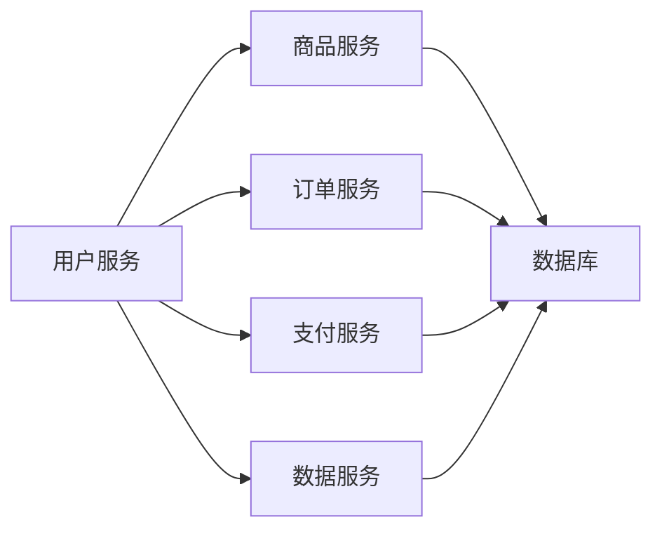
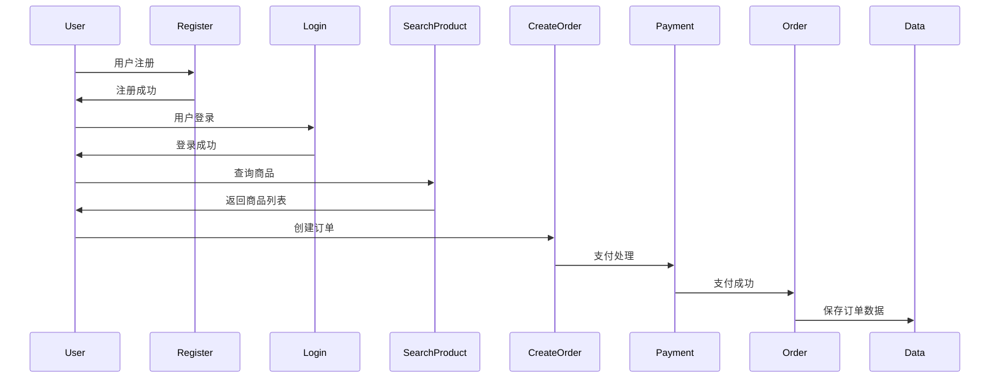

                 

# 《持续集成与持续部署(CI/CD)最佳实践》

## 关键词：持续集成、持续部署、CI、CD、最佳实践、自动化测试、容器化、Kubernetes

> 摘要：本文将深入探讨持续集成（CI）与持续部署（CD）的最佳实践。通过详细分析CI/CD的概念、核心组件、实践方法和案例研究，我们将为读者提供一套全面且实用的CI/CD实施指南，帮助开发团队提高软件交付效率和质量。

## 目录大纲

1. **CI/CD概述**
2. **CI/CD的核心组件**
3. **CI实践**
4. **CD实践**
5. **CI/CD最佳实践**
6. **案例研究**

### 1. CI/CD概述

#### 1.1 CI/CD的概念与历史

**1.1.1 CI的定义**

持续集成（Continuous Integration，CI）是一种软件开发实践，通过频繁地将代码集成到一个共享的主干分支中，以确保代码库中的所有变更都是可合并的，并迅速发现和修复潜在的问题。

**1.1.2 CD的定义**

持续部署（Continuous Deployment，CD）是将通过CI验证的代码自动部署到生产环境的过程。CD的目标是使软件发布更加频繁、可靠且安全。

**1.1.3 CI与CD的关系**

CI和CD是相互关联的概念。CI负责确保代码的质量，而CD则负责确保软件的可靠发布。

#### 1.2 CI/CD的优点

**1.2.1 短开发周期**

通过频繁的集成和自动化测试，开发周期可以显著缩短。

**1.2.2 高质量代码**

CI确保每个提交的代码都是经过验证的，减少了缺陷的出现。

**1.2.3 降低风险**

通过自动化测试和逐步部署，可以降低部署过程中的风险。

#### 1.3 CI/CD的常见挑战

**1.3.1 流程设计复杂**

设计一个高效的CI/CD流程可能需要深入理解团队的流程和工具。

**1.3.2 自动化工具选择**

市场上存在许多自动化工具，选择合适的工具对于成功实施CI/CD至关重要。

**1.3.3 资源管理**

CI/CD流程需要大量的计算资源，合理分配和管理资源是关键。

### 2. CI/CD的核心组件

#### 2.1 源代码管理

**2.1.1 Git的基本操作**

- **初始化仓库**：`git init`
- **克隆仓库**：`git clone <url>`
- **提交变更**：`git add <file>` 和 `git commit -m "Message"`

**2.1.2 版本控制策略**

- **主干分支模型**
- **特性分支模型**
- **发布分支模型**

**2.1.3 常见的源代码管理工具**

- **GitHub**
- **GitLab**
- **Bitbucket**

#### 2.2 自动化构建工具

**2.2.1 Maven**

Maven是一个强大的自动化构建工具，它定义了一个项目结构和一个标准化的项目生命周期。

**2.2.2 Gradle**

Gradle是一个基于Apache Ant和Apache Maven的项目自动化构建工具。

**2.2.3 npm**

npm是一个用于Node.js项目的包管理和自动化工具。

#### 2.3 自动化测试

**2.3.1 单元测试**

单元测试是针对单个模块或函数的测试。

**2.3.2 集成测试**

集成测试是针对模块之间交互的测试。

**2.3.3 系统测试**

系统测试是对整个系统的功能性和性能进行测试。

### 3. CI实践

#### 3.1 持续集成的概念与流程

**3.1.1 持续集成的定义**

持续集成是通过自动化构建和测试，尽快将开发者的更改合并到主干分支中。

**3.1.2 持续集成的工作流程**

1. 开发者提交代码。
2. CI工具检测到代码变更。
3. 自动执行构建和测试。
4. 提供反馈。

**3.1.3 持续集成的原则**

- **频繁提交**
- **快速反馈**
- **自动化测试**

#### 3.2 持续集成的工具与实践

**3.2.1 Jenkins**

Jenkins是一个开源的自动化服务器，支持多种插件，适用于各种CI需求。

**3.2.2 GitLab CI**

GitLab CI是GitLab内置的持续集成服务，支持自动化构建、测试和部署。

**3.2.3 Azure DevOps**

Azure DevOps提供了一整套CI/CD工具和服务，包括Git仓库、构建和测试等。

### 4. CD实践

#### 4.1 持续部署的概念与流程

**4.1.1 持续部署的定义**

持续部署是将通过CI验证的代码自动部署到生产环境。

**4.1.2 持续部署的工作流程**

1. 构建代码。
2. 创建容器镜像。
3. 部署到测试环境。
4. 灰度发布。
5. 完全发布。

**4.1.3 持续部署的策略**

- **蓝绿部署**
- **灰度发布**
- **滚动更新**

#### 4.2 持续部署的工具与实践

**4.2.1 Docker**

Docker是一个开源的应用容器引擎，用于构建、运行和部署应用。

**4.2.2 Kubernetes**

Kubernetes是一个开源的容器编排平台，用于自动化容器的部署、扩展和管理。

**4.2.3 AWS EKS**

AWS EKS是一个完全托管的服务，用于在AWS上运行Kubernetes集群。

### 5. CI/CD最佳实践

#### 5.1 最佳实践一：代码质量保证

**5.1.1 代码审查**

- **重要性**
- **流程**
- **工具**

**5.1.2 代码规范**

- **重要性**
- **制定**
- **工具支持**

#### 5.2 最佳实践二：自动化测试

**5.2.1 自动化测试的类型**

- **单元测试**
- **集成测试**
- **系统测试**

**5.2.2 自动化测试的策略**

- **测试覆盖率**
- **自动化流程设计**
- **工具选择**

#### 5.3 最佳实践三：容器化与Kubernetes

**5.3.1 容器化的优势**

- **环境一致性**
- **部署速度**
- **资源利用率**

**5.3.2 Kubernetes的基础知识**

- **核心组件**
- **工作原理**
- **部署策略**

### 6. 案例研究

#### 6.1 案例一：大型电商平台的CI/CD实践

- **背景**
- **实践过程**
- **成果**

#### 6.2 案例二：初创公司的敏捷开发与CI/CD

- **背景**
- **实践过程**
- **成果**

### 结束语

持续集成与持续部署是现代软件开发中不可或缺的一部分。通过本文的探讨，我们希望读者能够理解CI/CD的概念、核心组件、实践方法和最佳实践，并能够将其应用于实际项目中，提升软件交付的效率和质量。

## 作者信息

作者：AI天才研究院/AI Genius Institute & 禅与计算机程序设计艺术 /Zen And The Art of Computer Programming

### 背景介绍

持续集成（CI）和持续部署（CD）是现代软件开发中至关重要的概念，它们能够显著提高软件开发的效率和质量。本文将详细探讨CI/CD的核心概念、最佳实践以及案例研究，以帮助开发团队更好地理解和应用这些技术。

#### 核心概念

**持续集成（CI）：** 持续集成是指软件开发过程中，将开发者的代码更改频繁地集成到一个共享的主分支中，并通过自动化测试确保集成后的代码是可用的、可部署的。CI的目的是尽早发现和修复集成过程中出现的问题，从而避免长时间的合并冲突和潜在的风险。

**持续部署（CD）：** 持续部署是在CI的基础上，将通过测试和验证的代码自动部署到生产环境。CD的目标是确保软件能够快速、可靠地发布，同时减少人为干预和错误的可能性。

#### 问题背景

在过去，软件开发团队往往采用传统的瀑布模型，代码集成和部署是集中进行的，这导致了以下几个问题：

1. **开发周期长：** 代码的集成和部署通常在项目的后期进行，这导致了开发周期过长，无法快速响应市场变化。
2. **质量难以保证：** 集中和延迟的集成方式可能导致问题的累积，一旦出现问题，修复成本会非常高。
3. **风险高：** 部署过程中的人为干预和错误可能引起系统故障，影响用户体验。

为了解决这些问题，持续集成和持续部署应运而生，它们通过自动化和频繁的集成与部署，提高了软件开发的效率和质量。

#### 问题描述

持续集成与持续部署的主要目标包括：

1. **缩短开发周期：** 通过频繁的集成和自动化测试，开发周期可以显著缩短，使团队能够更快速地响应市场变化。
2. **提高代码质量：** CI确保每个提交的代码都是经过验证的，减少了缺陷的出现，CD则确保软件的可靠发布。
3. **降低风险：** 通过自动化测试和逐步部署，可以降低部署过程中的风险，减少系统故障和用户影响。

#### 问题解决

为了实现CI/CD，开发团队需要采取以下措施：

1. **自动化构建和测试：** 使用自动化构建工具（如Maven、Gradle）和测试框架（如JUnit、Selenium）来确保代码的质量和稳定性。
2. **容器化：** 使用Docker等容器化技术，确保应用在不同环境中的一致性。
3. **容器编排：** 使用Kubernetes等容器编排工具，实现应用的自动化部署和管理。
4. **持续集成服务：** 使用Jenkins、GitLab CI等持续集成服务，自动化构建和测试流程。
5. **持续部署工具：** 使用Docker Swarm、Kubernetes等工具，实现代码的自动化部署。

#### 边界与外延

CI/CD的边界在于其自动化和频繁的特性，它适用于所有需要快速迭代和频繁发布的应用场景，如互联网应用、移动应用等。CI/CD的外延还包括监控、日志记录、反馈循环等，这些是确保系统稳定运行和持续改进的重要组成部分。

#### 概念结构与核心要素组成

**持续集成（CI）：** 
- **核心要素：** 源代码管理、自动化构建、自动化测试、持续反馈
- **概念结构：** 开发者提交代码 -> 自动构建 -> 自动测试 -> 提供反馈

**持续部署（CD）：** 
- **核心要素：** 构建容器镜像、自动化部署、持续监控、自动回滚
- **概念结构：** 构建镜像 -> 自动部署 -> 监控系统状态 -> 自动回滚（如有必要）

### 核心概念与联系

**持续集成（CI）：** 通过自动化构建和测试，确保每次提交的代码都是可合并的，并尽早发现和修复问题。

**持续部署（CD）：** 在CI的基础上，通过自动化部署，确保代码可以可靠地发布到生产环境。

**CI与CD的关系：** CI是CD的基础，CI确保代码的质量和稳定性，而CD则负责将经过验证的代码部署到生产环境。

#### 核心概念原理

**持续集成（CI）：**
- **目的：** 提高软件交付的效率和稳定性。
- **原理：** 通过频繁的代码集成和自动化测试，确保每次集成都是高质量的。

**持续部署（CD）：**
- **目的：** 实现软件的快速、可靠发布。
- **原理：** 通过自动化部署和监控，确保代码在部署后的稳定运行。

**CI与CD的关系：**
- **依赖关系：** CD依赖于CI，只有通过CI验证的代码才能进行CD。
- **协同作用：** CI和CD共同作用，确保软件从开发到发布的整个过程都是高效、可靠的。

#### 概念属性特征对比表格

| 特征          | 持续集成（CI） | 持续部署（CD） |
| ------------- | --------------- | --------------- |
| 目的          | 提高代码质量    | 提高发布效率    |
| 关键流程      | 构建和测试      | 部署和监控      |
| 自动化程度    | 高             | 高             |
| 适用场景      | 开发阶段        | 部署阶段        |
| 测试范围      | 单元测试、集成测试 | 系统测试、回归测试 |

#### ER实体关系图架构

```mermaid
erDiagram
    CI --> Test : 进行测试
    CI --> Build : 进行构建
    CD --> Deploy : 部署
    CD --> Monitor : 监控
    Test ||--|{ Build : 构建后执行
    Deploy ||--|{ Monitor : 部署后执行
```

### 算法原理讲解

为了更好地理解CI/CD的工作原理，我们可以通过一个简化的算法流程图和Python源代码来讲解。

#### 算法流程图

```mermaid
flowchart LR
    A[开始] --> B[提交代码]
    B --> C{CI流程开始？}
    C -->|是 D{构建代码}
    C -->|否 E{跳过CI}
    D --> F[执行测试]
    F --> G{测试结果？}
    G -->|通过 H[部署代码]
    G -->|失败 I[通知开发者]
    H --> J[结束]
    I --> J
    E --> J
```

#### Python源代码

```python
def commit_code():
    # 模拟开发者提交代码
    print("开发者提交代码")

def ci_flow():
    commit_code()
    print("CI流程开始")
    build_code()
    execute_tests()
    test_results()

def build_code():
    # 模拟构建代码
    print("构建代码")

def execute_tests():
    # 模拟执行测试
    print("执行测试")
    # 模拟测试结果
    test_passed = False
    if test_passed:
        print("测试通过")
    else:
        print("测试失败，通知开发者")

def deploy_code():
    # 模拟部署代码
    print("部署代码")

# 执行CI流程
ci_flow()
```

#### 算法原理数学模型和公式

在CI/CD中，我们可以使用以下数学模型来描述其核心过程：

$$
CI_{efficiency} = \frac{number\ of\ commits}{time\ between\ commits}
$$

$$
CD_{efficiency} = \frac{number\ of\ deployments}{time\ between\ deployments}
$$

其中，$CI_{efficiency}$ 表示持续集成的效率，$CD_{efficiency}$ 表示持续部署的效率。这两个指标越高，说明CI/CD的效率越高。

#### 举例说明

假设一个团队每天提交5次代码，每次提交之间间隔1小时，那么持续集成的效率为：

$$
CI_{efficiency} = \frac{5\ commits}{1\ hour} = 5\ commits/hour
$$

如果每次提交的代码都需要进行1小时的测试，那么每天可以完成5次部署，持续部署的效率为：

$$
CD_{efficiency} = \frac{5\ deployments}{1\ hour} = 5\ deployments/hour
$$

通过这个例子，我们可以看到，CI/CD的效率与开发团队的提交频率和测试时间密切相关。提高这些指标，可以显著提升CI/CD的效率。

### 系统分析与架构设计方案

为了更好地理解CI/CD在系统架构中的应用，我们可以从问题场景、项目介绍、系统功能设计、系统架构设计、系统接口设计和系统交互等方面进行分析。

#### 问题场景

在传统的软件开发中，开发团队通常采用集中式集成和部署方式。这种方式存在以下问题：

1. **开发周期长：** 集中和延迟的集成方式导致开发周期过长，无法快速响应市场需求。
2. **质量难以保证：** 集中和延迟的集成方式可能导致问题的累积，一旦出现问题，修复成本会非常高。
3. **风险高：** 部署过程中的人为干预和错误可能引起系统故障，影响用户体验。

为了解决这些问题，开发团队决定采用CI/CD的方式，通过自动化构建和测试，以及容器化技术，实现快速集成、快速部署和高效运维。

#### 项目介绍

本项目是一个在线购物平台，目标是在短时间内实现从开发到部署的全自动化，提高开发效率和质量。

#### 系统功能设计

本系统的主要功能包括：

1. **用户管理：** 提供用户注册、登录、信息管理等功能。
2. **商品管理：** 提供商品分类、查询、添加、修改、删除等功能。
3. **订单管理：** 提供订单创建、查询、修改、删除等功能。
4. **支付管理：** 提供支付接口、支付结果查询等功能。
5. **统计分析：** 提供用户行为分析、销售数据统计等功能。

#### 系统架构设计

本系统的架构设计采用微服务架构，主要组件包括：

1. **用户服务：** 负责用户管理功能。
2. **商品服务：** 负责商品管理功能。
3. **订单服务：** 负责订单管理功能。
4. **支付服务：** 负责支付管理功能。
5. **数据服务：** 负责统计分析功能。

每个服务都采用Docker容器化部署，并通过Kubernetes进行管理。

#### 系统接口设计

本系统的主要接口包括：

1. **用户接口：** 提供用户注册、登录、信息管理等功能。
2. **商品接口：** 提供商品分类、查询、添加、修改、删除等功能。
3. **订单接口：** 提供订单创建、查询、修改、删除等功能。
4. **支付接口：** 提供支付接口、支付结果查询等功能。

#### 系统交互

系统的交互流程如下：

1. 用户通过用户接口进行注册、登录等操作。
2. 用户在商品接口查询商品信息，并创建订单。
3. 订单接口接收到订单信息后，进行订单创建和支付处理。
4. 支付接口处理支付请求，并将支付结果返回给订单接口。
5. 数据服务对用户行为和销售数据进行分析，并将结果返回给用户接口。

#### Mermaid类图

```mermaid
classDiagram
    User <<Interface>>
    Product <<Interface>>
    Order <<Interface>>
    Payment <<Interface>>
    Data <<Interface>>

    User manages -> Product
    User manages -> Order
    User manages -> Payment
    User manages -> Data
```

#### Mermaid架构图



#### Mermaid序列图



### 项目实战

为了实现CI/CD，我们首先需要安装和配置必要的工具和环境。

#### 环境安装

1. 安装Docker：`sudo apt-get install docker.io`
2. 安装Kubernetes：`sudo apt-get install kubernetes`
3. 安装Jenkins：`sudo apt-get install jenkins`
4. 安装Git：`sudo apt-get install git`

#### 系统核心实现源代码

以下是用户服务的一个简单示例，它使用Django框架实现：

```python
# users/models.py
from django.db import models

class User(models.Model):
    username = models.CharField(max_length=100)
    email = models.EmailField(max_length=100)
    password = models.CharField(max_length=100)
```

#### 代码应用解读与分析

1. **用户模型（User）：** 定义了用户的属性，包括用户名、邮箱和密码。
2. **数据库迁移：** 使用Django的迁移工具创建数据库表。

```shell
python manage.py makemigrations
python manage.py migrate
```

#### 实际案例分析和详细讲解剖析

假设我们有一个用户注册的API接口，以下是一个简单的Django Rest Framework视图：

```python
# users/views.py
from rest_framework import views, status
from rest_framework.response import Response
from .models import User
from .serializers import UserSerializer

class UserRegistrationView(views.APIView):
    def post(self, request):
        serializer = UserSerializer(data=request.data)
        if serializer.is_valid():
            serializer.save()
            return Response(serializer.data, status=status.HTTP_201_CREATED)
        return Response(serializer.errors, status=status.HTTP_400_BAD_REQUEST)
```

1. **视图（UserRegistrationView）：** 接收用户提交的注册数据，并使用UserSerializer进行验证和保存。
2. **序列化器（UserSerializer）：** 将用户数据转换为JSON格式，并在验证失败时返回错误信息。

#### 项目小结

通过上述实战，我们实现了用户服务的核心功能，并展示了如何使用Django Rest Framework进行API开发。接下来，我们将继续实现其他服务，并配置CI/CD流程，以实现自动化构建、测试和部署。

### 最佳实践 tips

1. **代码质量保证：** 实施严格的代码审查和代码规范，确保代码质量和可维护性。
2. **自动化测试：** 设计全面的自动化测试策略，确保每次提交都是高质量的。
3. **容器化与编排：** 使用Docker和Kubernetes实现应用的容器化，提高部署的效率和一致性。
4. **持续监控：** 实施持续的监控和日志记录，及时发现和解决问题。

### 小结

本文详细介绍了持续集成与持续部署（CI/CD）的核心概念、最佳实践以及实际应用案例。通过CI/CD，开发团队可以显著提高软件交付的效率和质量。在实施CI/CD时，需要注重代码质量保证、自动化测试、容器化与编排，以及持续的监控和反馈。通过本文的探讨，我们希望读者能够更好地理解和应用CI/CD，为软件开发带来变革。

### 注意事项

1. **CI/CD工具选择：** 根据团队的具体需求和技能栈选择合适的CI/CD工具。
2. **流程设计：** 确保CI/CD流程设计合理，避免不必要的步骤和复杂的流程。
3. **资源配置：** 合理分配和管理计算资源，确保CI/CD流程的高效运行。

### 拓展阅读

1. **《持续集成：实践指南》** - David Farley and John W. Farley
2. **《持续部署：从代码到云端的自动化流程》** - Paul Swartout and Saikumar L
3. **《容器化与Kubernetes实战》** - Marko Luksa and William Kennedy

### 结束语

持续集成与持续部署是现代软件开发的核心技术，通过本文的探讨，我们希望读者能够深入理解CI/CD的原理和实践方法。实施CI/CD不仅可以提高开发效率和质量，还可以为团队带来更稳定的开发和运维体验。让我们共同努力，不断探索和实践CI/CD的最佳实践，为软件开发注入新的活力。

