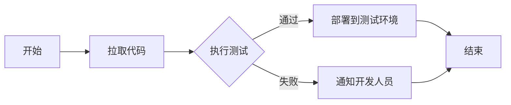
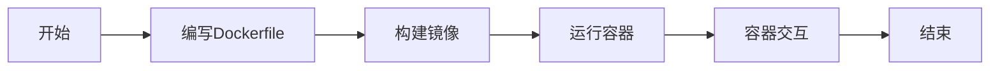
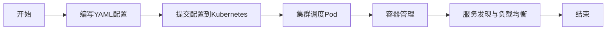
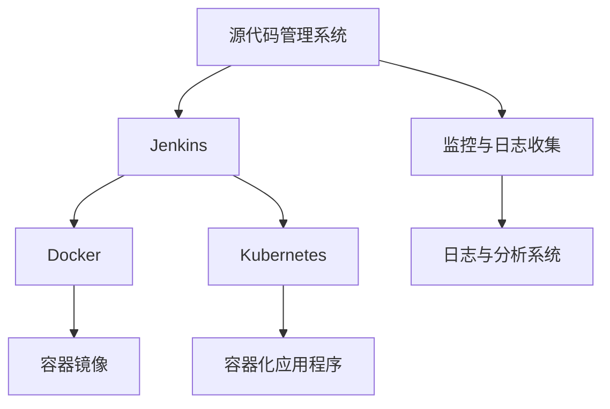
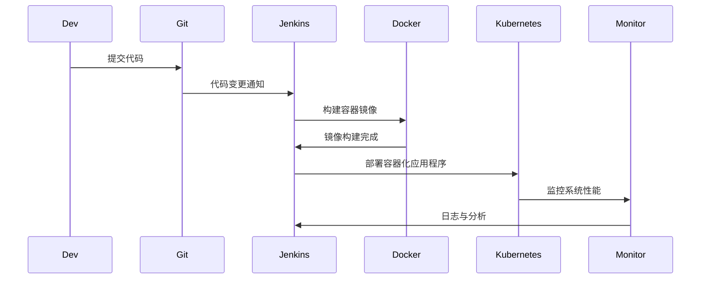

                 

### 文章标题：持续集成与持续部署（CI/CD）最佳实践

持续集成（Continuous Integration，简称CI）和持续部署（Continuous Deployment，简称CD）是现代软件开发中不可或缺的流程。CI/CD能够帮助企业更快速地交付高质量软件，减少软件缺陷，并提高开发效率。本文将详细介绍CI/CD的核心概念、实践方法、工具和最佳实践，旨在为开发者提供一套完整的CI/CD解决方案。

## 文章关键词：
- 持续集成（CI）
- 持续部署（CD）
- 持续交付（CD）
- 软件开发流程
- DevOps
- Jenkins
- Docker
- Kubernetes

## 摘要：
本文将首先介绍CI/CD的定义和背景，然后深入解析其核心概念和组成部分。随后，我们将探讨CI/CD的算法原理，包括Jenkins、Docker、Kubernetes等关键工具的原理和应用。接着，我们将通过系统分析与架构设计方案，展示如何设计和实现一个CI/CD系统。文章的最后将结合实际项目案例，讲解CI/CD的最佳实践，并提供一些建议和注意事项，帮助开发者顺利实施CI/CD流程。

## 目录：

### 引言
- CI/CD的定义和重要性

### 核心概念与联系
- 持续集成（CI）
- 持续部署（CD）
- 微服务架构
- 容器化技术

### 算法原理讲解
- Jenkins工作原理
- Docker容器化技术
- Kubernetes集群管理

### 数学模型和数学公式
- CI/CD流程的数学模型
- Jenkins流水线优化模型

### 系统分析与架构设计方案
- CI/CD系统架构
- CI/CD实现流程
- 系统接口设计与交互

### 项目实战
- 实际案例一：使用Jenkins实现CI/CD
- 实际案例二：基于Docker和Kubernetes的CD实践

### 最佳实践
- CI/CD实施的最佳实践
- 安全性和监控

### 小结与拓展阅读
- 文章总结
- 进一步阅读推荐

## 引言
### CI/CD的定义和重要性

持续集成（Continuous Integration，简称CI）和持续部署（Continuous Deployment，简称CD）是现代软件开发中不可或缺的流程。它们不仅能够显著提高开发效率，还能确保软件质量。CI/CD的核心理念是将代码更改频繁地合并到主干，并通过自动化测试确保这些更改不会破坏现有功能。

### 持续集成（CI）
持续集成是一种软件开发实践，旨在通过频繁的代码合并和自动化测试，确保代码库中的每一部分都能正常工作。CI的目标是尽早发现问题，防止代码缺陷积累。通过CI，开发人员可以在本地环境中进行开发，然后将更改推送到共享仓库，触发自动化测试流程。

### 持续部署（CD）
持续部署是在CI的基础上，进一步自动化软件的发布和部署过程。CD的目标是确保软件能够在任何环境下，包括生产环境，快速、可靠地部署。CD通常包括自动化部署脚本、容器化技术（如Docker）和容器编排工具（如Kubernetes）。

### CI/CD的重要性
CI/CD对于现代软件开发具有重要意义：

1. **提高开发效率**：通过自动化测试和部署，开发人员可以更快地迭代和交付软件。
2. **提高软件质量**：频繁的测试和反馈能够及早发现和修复问题，减少缺陷。
3. **降低风险**：通过自动化流程，可以确保每次部署都是可控的，降低人为错误的风险。
4. **增强团队协作**：CI/CD鼓励开发、测试和运维团队紧密协作，提高整体效率。

### 持续交付（CD）
持续交付是CI/CD的进一步扩展，旨在确保软件从开发到部署的每个阶段都能顺利进行。持续交付的目标是确保软件随时可以交付给用户，而不是等待特定的发布周期。

## 核心概念与联系
### 持续集成（CI）
持续集成是一种软件开发实践，通过频繁的代码合并和自动化测试，确保代码库中的每一部分都能正常工作。CI的核心目标是尽早发现问题，防止代码缺陷积累。

### 持续部署（CD）
持续部署是在持续集成的基础上，进一步自动化软件的发布和部署过程。CD的目标是确保软件能够在任何环境下，包括生产环境，快速、可靠地部署。

### 微服务架构
微服务架构是一种将应用程序拆分为小型、独立服务的方法。每个服务都有自己的数据库、API和业务逻辑。微服务架构与CI/CD紧密相关，因为它们可以独立部署和扩展。

### 容器化技术
容器化技术（如Docker）为应用程序提供了一个轻量级、可移植的运行环境。容器化使得应用程序在不同环境中具有一致的行为，从而简化了CI/CD流程。

### 核心概念联系
CI/CD流程中的核心概念包括：

1. **代码库**：存储应用程序代码的地方。
2. **自动化测试**：确保每次代码更改都不会破坏现有功能。
3. **持续集成服务器**：如Jenkins，负责触发测试和部署。
4. **容器化**：使用Docker将应用程序打包到容器中。
5. **容器编排**：如Kubernetes，负责管理和部署容器化应用程序。

以下是CI/CD流程中的核心概念与联系的ER实体关系图架构：

```mermaid
erDiagram
  CodeRepository ||--|{ TestSuite : 测试套件}
  ContinuousIntegrationServer ||--|{ BuildPipeline : 流水线}
  ContainerizationTool ||--|{ Container : 容器}
  ContainerOrchestrationTool ||--|{ Deployment : 部署}
  CodeRepository {
    +string RepositoryID
    +string RepositoryName
  }
  TestSuite {
    +string SuiteID
    +string SuiteName
  }
  ContinuousIntegrationServer {
    +string ServerID
    +string ServerName
  }
  BuildPipeline {
    +string PipelineID
    +string PipelineName
  }
  ContainerizationTool {
    +string ToolID
    +string ToolName
  }
  Container {
    +string ContainerID
    +string ContainerName
  }
  ContainerOrchestrationTool {
    +string ToolID
    +string ToolName
  }
  Deployment {
    +string DeploymentID
    +string DeploymentName
  }
```

## 算法原理讲解
### Jenkins工作原理
Jenkins是一个开源的持续集成服务器，它允许开发人员自动执行构建、测试和部署任务。Jenkins的核心组件包括：

1. **Jenkins Master**：主节点，负责管理和执行构建任务。
2. **Jenkins Slave**：从节点，用于执行具体的构建任务。

### Jenkins工作流程：
1. **构建触发**：当有新的代码提交到代码仓库时，Jenkins Master会触发构建。
2. **构建执行**：Jenkins Master会将构建任务分配给一个可用的Slave，执行构建过程。
3. **测试执行**：构建过程中，Jenkins会运行预定义的测试套件，确保代码质量。
4. **结果反馈**：构建完成后，Jenkins会生成报告，并提供反馈。

### Jenkins流水线
Jenkins流水线是一种定义构建、测试和部署过程的脚本。它使用Groovy语言编写，可以灵活地定义复杂的流程。

### Jenkins流水线示例（mermaid流程图）：


### Docker容器化技术
Docker是一种容器化技术，它允许开发者将应用程序及其依赖打包到一个轻量级、独立的容器中。Docker的核心组件包括：

1. **Docker Engine**：负责管理和运行容器。
2. **Dockerfile**：定义如何构建容器的文件。
3. **Docker Hub**：存储和管理Docker镜像的仓库。

### Docker工作原理：
1. **镜像构建**：开发人员编写Dockerfile，指定应用程序的依赖和配置。
2. **容器运行**：使用Docker命令，从镜像创建并运行容器。

### Docker容器化示例（mermaid流程图）：


### Kubernetes集群管理
Kubernetes是一个开源的容器编排工具，用于自动化容器化应用程序的部署、扩展和管理。Kubernetes的核心组件包括：

1. **Master节点**：负责集群管理和调度。
2. **Node节点**：运行容器的工作节点。
3. **Pod**：Kubernetes中的最小部署单元，一组相关的容器。

### Kubernetes工作原理：
1. **集群调度**：Kubernetes Master根据资源需求，将Pod调度到适当的Node节点。
2. **容器管理**：Kubernetes负责启动、停止和管理Pod中的容器。
3. **服务发现和负载均衡**：Kubernetes提供内置的服务发现和负载均衡机制。

### Kubernetes集群示例（mermaid流程图）：


## 数学模型和数学公式
### CI/CD流程的数学模型
CI/CD流程可以通过以下数学模型来描述：

$$
C = \frac{P}{T}
$$

其中，C是持续集成率（Continuous Integration Rate），P是代码更改的频率，T是代码合并到主干的时间间隔。持续集成率越高，开发团队能够更快地发现问题并修复。

### Jenkins流水线优化模型
为了优化Jenkins流水线的执行效率，可以使用以下数学模型：

$$
E = \frac{W}{P}
$$

其中，E是期望执行时间（Expected Execution Time），W是等待时间（Waiting Time），P是执行时间（Processing Time）。优化目标是最小化E，从而提高流水线效率。

## 系统分析与架构设计方案
### CI/CD系统架构
CI/CD系统的架构可以分为以下几个关键部分：

1. **源代码管理系统**：如Git，用于存储和管理代码。
2. **持续集成服务器**：如Jenkins，用于自动化构建和测试。
3. **容器化工具**：如Docker，用于打包应用程序。
4. **容器编排工具**：如Kubernetes，用于部署和管理容器化应用程序。
5. **监控和日志收集**：用于跟踪系统性能和问题诊断。

### CI/CD实现流程
CI/CD的实现流程通常包括以下几个步骤：

1. **代码提交**：开发人员将代码提交到源代码管理系统。
2. **构建触发**：Jenkins检测到代码提交，触发构建过程。
3. **构建执行**：Jenkins使用Docker构建容器镜像。
4. **测试执行**：Jenkins运行预定义的测试套件，确保代码质量。
5. **部署**：通过Kubernetes将容器镜像部署到生产环境。

### 系统架构设计
以下是CI/CD系统的架构设计：



### 系统接口设计与交互
以下是CI/CD系统的接口设计和交互：



## 项目实战
### 实际案例一：使用Jenkins实现CI/CD

#### 环境安装
在开始之前，确保已经安装了Jenkins、Git、Docker和Kubernetes。

#### 系统核心实现源代码
以下是使用Jenkins实现CI/CD的示例源代码：

```python
# CI/CD Jenkinsfile
pipeline {
    agent any

    stages {
        stage('Checkout') {
            steps {
                git url: 'https://github.com/user/repository.git', branch: 'master'
            }
        }

        stage('Build') {
            steps {
                sh 'docker build -t myapp .'
            }
        }

        stage('Test') {
            steps {
                sh 'docker run --name test --rm myapp'
            }
        }

        stage('Deploy') {
            steps {
                sh 'kubectl apply -f deployment.yml'
            }
        }
    }

    post {
        always {
            sh 'docker stop test'
        }
    }
}
```

#### 代码应用解读与分析
此Jenkinsfile定义了一个简单的CI/CD流水线，包括以下阶段：

1. **Checkout**：从GitHub仓库检出代码。
2. **Build**：使用Docker构建容器镜像。
3. **Test**：运行测试确保代码质量。
4. **Deploy**：使用Kubernetes部署容器化应用程序。

#### 实际案例分析和详细讲解剖析
此Jenkins流水线在实际项目中非常常见，它能够自动化地处理从代码提交到部署的整个流程。

- **代码提交**：开发人员在本地进行开发，并将代码提交到GitHub仓库。
- **构建触发**：Jenkins监控GitHub仓库的变更，并在检测到新提交时触发构建。
- **容器构建**：使用Dockerfile构建容器镜像，并将镜像推送到Docker Hub。
- **测试执行**：运行预定义的测试套件，确保代码质量。
- **部署**：使用Kubernetes部署容器化应用程序，确保应用程序在生产环境中正常运行。

#### 项目小结
此项目展示了如何使用Jenkins实现CI/CD流程。通过此项目，我们了解了Jenkins流水线的定义和执行过程，以及如何与Git、Docker和Kubernetes集成。在实际项目中，可以根据具体需求进行定制和优化。

### 实际案例二：基于Docker和Kubernetes的CD实践

#### 环境安装
确保已经安装了Docker和Kubernetes。

#### 系统核心实现源代码
以下是基于Docker和Kubernetes的CD实践的示例源代码：

```yaml
# deployment.yml
apiVersion: apps/v1
kind: Deployment
metadata:
  name: myapp
spec:
  replicas: 3
  selector:
    matchLabels:
      app: myapp
  template:
    metadata:
      labels:
        app: myapp
    spec:
      containers:
      - name: myapp
        image: myapp:latest
        ports:
        - containerPort: 80
```

#### 代码应用解读与分析
此YAML文件定义了一个Kubernetes部署配置，用于部署名为`myapp`的应用程序。

- **Deployment**：定义了应用程序的副本数量和选择器。
- **Template**：定义了应用程序的容器配置，包括镜像名称和端口映射。

#### 实际案例分析和详细讲解剖析
此部署配置文件用于部署一个基于Docker镜像的应用程序。通过Kubernetes API，我们可以轻松地将容器镜像部署到集群中。

- **部署操作**：使用kubectl apply命令，根据部署配置文件创建部署。
- **容器运行**：Kubernetes根据配置创建和管理容器，确保应用程序在集群中正常运行。

#### 项目小结
此项目展示了如何使用Docker和Kubernetes实现CD流程。通过此项目，我们了解了如何编写Kubernetes部署配置文件，以及如何使用Kubernetes API进行部署。在实际项目中，可以根据需求进行定制和优化。

## 最佳实践
### CI/CD实施的最佳实践
1. **自动化测试**：确保所有代码更改都经过自动化测试，减少手动测试的工作量。
2. **持续反馈**：及时反馈测试结果，确保开发人员能够快速发现问题并修复。
3. **代码质量**：确保代码质量，包括代码风格、注释和文档。
4. **安全性**：确保CI/CD流程中的安全性，包括代码仓库访问控制和部署脚本的安全性。
5. **监控与日志**：使用监控和日志工具，确保系统性能和问题可追溯。

### 安全性和监控
1. **安全性**：确保CI/CD流程中的安全性，包括代码仓库访问控制和部署脚本的安全性。
2. **监控**：使用监控工具，如Prometheus和Grafana，实时监控系统性能和资源利用率。
3. **日志收集**：使用日志收集工具，如ELK堆栈（Elasticsearch、Logstash、Kibana），进行日志分析和问题诊断。

## 小结与拓展阅读
### 文章总结
本文详细介绍了持续集成（CI）和持续部署（CD）的概念、原理和实践方法。通过实际案例，展示了如何使用Jenkins、Docker和Kubernetes实现CI/CD流程。最佳实践和注意事项为开发者提供了实施CI/CD的指导。

### 进一步阅读推荐
- 《Jenkins实战》
- 《Docker深度学习》
- 《Kubernetes实战》
- 《持续交付：发布可靠软件的最佳实践》

## 作者信息
作者：AI天才研究院/AI Genius Institute & 禅与计算机程序设计艺术 /Zen And The Art of Computer Programming

