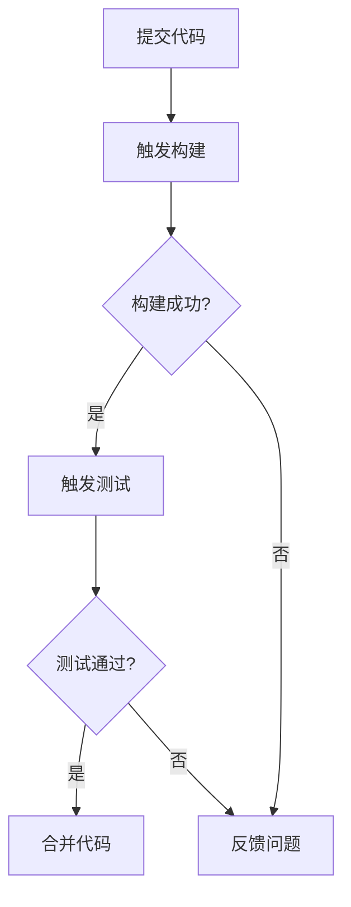
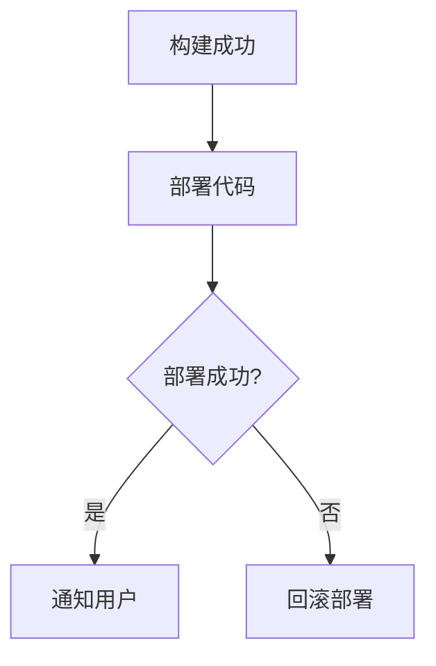
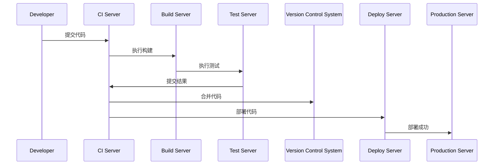
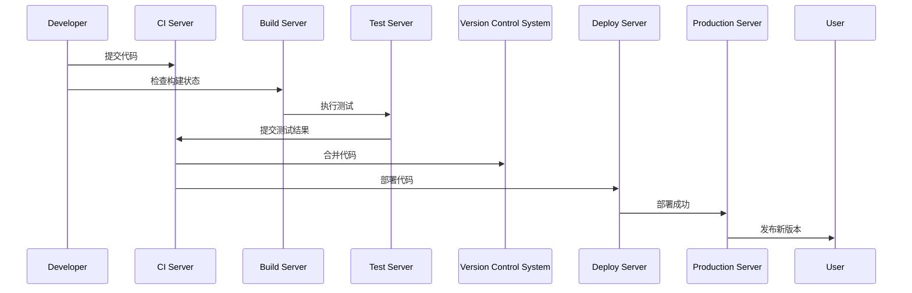

                 

### 引言

#### 持续集成与持续部署的概念

持续集成（Continuous Integration，CI）与持续部署（Continuous Deployment，CD）是现代软件开发流程中至关重要的两个概念。它们不仅改变了传统的软件开发模式，还大大提高了软件交付的效率和稳定性。

**持续集成（CI）：** 持续集成是一种软件开发实践，旨在通过频繁的代码合并和自动化测试来确保代码库的稳定性和一致性。在CI流程中，开发者的每次提交都会自动触发一系列的构建和测试步骤，确保新代码与现有代码能够无缝集成。

**持续部署（CD）：** 持续部署则是在持续集成的基础上，进一步自动化了软件的发布过程。CD的目标是将软件尽快、安全地交付给用户，通过自动化脚本和容器化技术，实现从开发环境到生产环境的无缝过渡。

#### CI/CD在现代软件开发中的重要性

在当今快速变化的市场环境中，软件产品的更新速度越来越快，用户对产品质量和稳定性的要求也越来越高。CI/CD作为一种高效的软件开发和交付流程，具有以下几大重要性：

1. **提高开发效率：** 通过自动化的构建和测试，开发者可以更快地发现和修复问题，缩短开发周期。
2. **保证软件质量：** 定期的集成和测试能够确保代码的质量和稳定性，降低软件发布后出现问题的风险。
3. **降低部署风险：** 自动化部署减少了手动操作的错误，确保了部署过程的高效和可靠性。
4. **快速响应市场需求：** CI/CD能够快速响应市场需求，加速新功能和新版本的交付。

#### 书籍结构概述

本篇文章将系统地介绍CI/CD的最佳实践。文章结构如下：

1. **引言：** 对CI/CD的概念、重要性及书籍结构进行概述。
2. **背景介绍：** 回顾CI/CD的起源和现状，分析传统软件开发流程的痛点。
3. **核心概念与联系：** 详细解释CI和CD的核心概念，并通过表格和ER图进行对比分析。
4. **算法原理讲解：** 分别介绍CI和CD的算法原理，提供流程图、代码示例和数学模型。
5. **数学模型和公式：** 详细讲解CI/CD中的数学模型和公式，提供实际应用和案例分析。
6. **系统分析与架构设计方案：** 描述CI/CD的系统分析与架构设计，包括功能设计、架构图、接口设计和交互图。
7. **项目实战：** 通过实战案例展示CI/CD的具体应用过程。
8. **最佳实践 tips：** 提供CI/CD的最佳实践建议。
9. **小结与未来展望：** 总结文章关键知识点，展望CI/CD的发展趋势。

### 背景介绍

#### 问题背景

在传统的软件开发流程中，开发、测试、发布等多个环节往往由不同的团队负责，导致沟通成本高、效率低下，并且难以在早期发现和解决问题。以下是一些传统软件开发流程中的痛点：

1. **沟通成本高：** 开发者与测试人员之间的频繁沟通，使得项目进度缓慢，且容易出现信息不对称的情况。
2. **质量不可控：** 集成和测试通常在项目后期进行，导致潜在的问题无法及时发现和解决，影响软件质量。
3. **部署风险大：** 手动部署方式容易出错，且缺乏有效的回滚机制，一旦发布失败，将导致严重的生产问题。
4. **响应速度慢：** 新功能和新版本上线过程复杂，无法快速响应市场需求。

#### 持续集成与持续部署的起源

持续集成和持续部署的概念最早由Jez Humble和Dave Farley在其畅销书《持续交付：发布可靠软件的系统化方法》中提出。这种方法的核心理念是将自动化引入软件开发的各个环节，从而提高开发效率、保证软件质量、降低部署风险。

1. **持续集成的起源：** 持续集成起源于敏捷开发的理念，旨在通过频繁的代码集成和自动化测试，确保代码库的稳定性和一致性。
2. **持续部署的起源：** 持续部署则是在持续集成的基础上，进一步自动化了软件的发布过程，使得软件能够快速、安全地交付给用户。

#### 问题描述

在传统软件开发流程中，以下问题常常出现：

1. **集成困难：** 由于缺乏自动化测试，开发者在进行代码集成时，难以发现和解决问题，导致集成失败。
2. **质量风险：** 缺乏定期测试，使得潜在的问题在发布后才会被发现，影响用户体验和软件的可靠性。
3. **部署复杂：** 手动部署方式效率低下，且容易出错，一旦出现错误，缺乏有效的回滚机制，导致生产问题难以解决。

#### 什么是持续集成（CI）

持续集成（CI）是一种软件开发实践，旨在通过频繁的代码合并和自动化测试，确保代码库的稳定性和一致性。CI的关键特征包括：

1. **频繁提交：** 开发者频繁提交代码，确保代码库保持最新的状态。
2. **自动化构建：** 每次提交都会触发自动化构建和测试流程，确保新代码与现有代码能够无缝集成。
3. **快速反馈：** 构建和测试的结果会及时反馈给开发者，帮助其快速发现和解决问题。

#### 什么是持续部署（CD）

持续部署（CD）是在持续集成的基础上，进一步自动化了软件的发布过程。CD的关键特征包括：

1. **自动化部署：** 使用自动化脚本和工具，实现从开发环境到生产环境的无缝过渡。
2. **快速发布：** 通过自动化部署，软件能够快速交付给用户，缩短了新功能和新版本的发布周期。
3. **回滚机制：** 一旦发布失败，可以快速回滚到上一个稳定版本，确保生产环境的稳定性。

#### 问题解决

持续集成与持续部署（CI/CD）解决了传统软件开发流程中的以下问题：

1. **集成困难：** 通过自动化测试和频繁集成，降低了集成失败的风险。
2. **质量风险：** 定期进行自动化测试，确保软件质量。
3. **部署复杂：** 自动化部署减少了手动操作，提高了部署效率。

#### CI/CD的优势

持续集成与持续部署具有以下几大优势：

1. **提高开发效率：** 自动化测试和构建大大提高了开发效率。
2. **保证软件质量：** 定期测试和快速反馈确保了软件质量。
3. **降低部署风险：** 自动化部署减少了手动操作的错误。
4. **快速响应市场需求：** 快速交付新功能和新版本。

#### CI/CD的关键原则

1. **自动化：** 自动化是CI/CD的核心，通过自动化工具和脚本实现软件开发、测试和部署的各个环节。
2. **频繁提交：** 开发者频繁提交代码，确保代码库保持最新的状态。
3. **快速反馈：** 构建和测试的结果及时反馈给开发者，帮助其快速发现和解决问题。
4. **持续监控：** 持续监控代码库的状态，确保软件的质量和稳定性。

#### 边界与外延

1. **CI/CD与其他技术的区别：** CI/CD与敏捷开发、DevOps等概念有交集，但它们的重点和应用场景有所不同。
2. **CI/CD在不同行业中的应用：** CI/CD不仅适用于软件行业，还广泛应用于金融、医疗、制造等行业。

### 核心概念与联系

#### 持续集成（CI）

**概念：** 持续集成是一种软件开发实践，旨在通过频繁的代码合并和自动化测试，确保代码库的稳定性和一致性。

**核心要素：**
- **自动化构建：** 每次代码提交后，自动触发构建过程。
- **自动化测试：** 构建过程中包括一系列自动化测试，以确保新代码不会破坏现有功能。
- **快速反馈：** 测试结果及时反馈给开发者，帮助其快速发现问题并进行修复。

#### 持续部署（CD）

**概念：** 持续部署是持续集成的一个扩展，旨在通过自动化脚本和工具，实现软件的快速、安全部署。

**核心要素：**
- **自动化部署：** 使用脚本和工具，将软件从开发环境部署到生产环境。
- **快速发布：** 通过自动化部署，缩短新功能和新版本的发布周期。
- **回滚机制：** 一旦发布失败，可以快速回滚到上一个稳定版本，确保生产环境的稳定性。

#### 概念属性特征对比表格

| 特征 | 持续集成（CI） | 持续部署（CD） |
| ---- | -------------- | -------------- |
| 目标 | 保证代码库稳定性 | 确保软件快速、安全部署 |
| 核心 | 自动化构建和测试 | 自动化部署 |
| 关键 | 频繁提交、快速反馈 | 快速发布、回滚机制 |
| 工具 | 构建工具、测试工具 | 部署工具、容器化技术 |

#### ER实体关系图架构

```mermaid
erDiagram
  Client ||--|{ Order : " places "  }
  Order ||--|| Product : " contains " 
  Product ||--|| Category : " belongs_to " 
  Category ||--|{ Supplier : " provides " }
  Client  ..|.. Supplier
```

### 算法原理讲解

#### CI算法原理

**Mermaid流程图：**


**Python源代码示例：**
```python
import subprocess

def commit_and_build():
    # 提交代码到版本库
    subprocess.run(["git", "commit", "-m", "new_commit"])
    
    # 触发构建
    subprocess.run(["make", "build"])

def test_and_report():
    # 触发测试
    result = subprocess.run(["make", "test"], capture_output=True, text=True)
    
    # 测试结果输出
    print(result.stdout)
    if "FAILED" in result.stdout:
        print("构建失败，发现问题：")
        print(result.stderr)

if __name__ == "__main__":
    commit_and_build()
    test_and_report()
```

**数学模型和公式：**
$$
CI = \frac{成功构建次数}{总提交次数}
$$

**举例说明：**
假设一个团队每月提交100次代码，其中90次成功构建，10次失败。则该团队的CI率为90%。

#### CD算法原理

**Mermaid流程图：**


**Python源代码示例：**
```python
import subprocess

def deploy_code():
    # 部署代码到生产环境
    subprocess.run(["make", "deploy"])

def check Deployment():
    # 检查部署状态
    result = subprocess.run(["make", "check"], capture_output=True, text=True)
    
    # 部署结果输出
    print(result.stdout)
    if "FAILED" in result.stdout:
        print("部署失败，准备回滚：")
        rollback_code()

def rollback_code():
    # 回滚到上一个稳定版本
    subprocess.run(["make", "rollback"])

if __name__ == "__main__":
    deploy_code()
    check_Deployment()
```

**数学模型和公式：**
$$
CD = \frac{成功部署次数}{总部署次数}
$$

**举例说明：**
假设一个团队每月部署10次代码，其中8次成功，2次失败。则该团队的CD率为80%。

### 数学模型和数学公式 & 详细讲解 & 举例说明

#### 数学模型与公式

在CI/CD流程中，我们常常使用以下数学模型和公式来评估流程的效率和效果：

1. **持续集成率（CI率）：**
$$
CI率 = \frac{成功构建次数}{总提交次数}
$$

2. **持续部署率（CD率）：**
$$
CD率 = \frac{成功部署次数}{总部署次数}
$$

3. **构建失败率：**
$$
构建失败率 = \frac{构建失败次数}{总构建次数}
$$

4. **部署失败率：**
$$
部署失败率 = \frac{部署失败次数}{总部署次数}
$$

#### 详细讲解

1. **持续集成率（CI率）：**
持续集成率是衡量CI效果的重要指标，它反映了代码库的稳定性和一致性。CI率越高，说明代码库越稳定，开发者的工作效率越高。

2. **持续部署率（CD率）：**
持续部署率是衡量CD效果的重要指标，它反映了软件交付的效率和可靠性。CD率越高，说明软件交付过程越高效，用户能够更快地使用新功能。

3. **构建失败率：**
构建失败率是衡量构建过程稳定性的指标，它反映了构建过程中出现的问题。构建失败率越低，说明构建过程越稳定，代码库的质量越高。

4. **部署失败率：**
部署失败率是衡量部署过程稳定性的指标，它反映了部署过程中出现的问题。部署失败率越低，说明部署过程越稳定，生产环境越可靠。

#### 代码效率优化

为了提高代码效率，我们可以在CI/CD流程中引入以下优化策略：

1. **并行构建：** 在构建过程中，使用多线程或多进程技术，实现并行构建，提高构建速度。

2. **缓存机制：** 在构建和测试过程中，使用缓存机制，减少重复计算和测试，提高构建效率。

3. **优化测试策略：** 根据实际情况，选择合适的测试策略，例如集成测试、单元测试等，提高测试效率。

4. **自动化部署：** 使用自动化部署工具，实现一键部署，减少人工干预，提高部署效率。

#### 原理分析

1. **持续集成（CI）：**
持续集成通过频繁的代码合并和自动化测试，确保代码库的稳定性和一致性。其核心原理在于，通过尽早发现和解决问题，降低集成失败的风险，提高开发效率。

2. **持续部署（CD）：**
持续部署通过自动化脚本和工具，实现软件的快速、安全部署。其核心原理在于，通过自动化部署，减少手动操作，提高部署效率，确保生产环境的稳定性。

3. **代码效率优化：**
代码效率优化旨在提高CI/CD流程的效率，通过并行构建、缓存机制、优化测试策略等手段，减少构建和测试时间，提高整体开发效率。

#### 实际应用

1. **构建和测试效率提升：**
在CI/CD流程中，通过引入自动化工具和脚本，可以实现并行构建和测试，大大提高构建和测试效率。

2. **软件交付效率提升：**
通过自动化部署和快速发布，CI/CD能够显著提升软件交付效率，缩短新功能和新版本的发布周期。

3. **代码质量和稳定性提升：**
通过持续集成和自动化测试，CI/CD能够确保代码质量和稳定性，降低软件发布后出现问题的风险。

#### 案例分析

1. **案例分析1：**
某互联网公司采用CI/CD流程，每月提交1000次代码，其中构建失败率为2%，部署失败率为1%。通过持续优化，构建失败率降低至1%，部署失败率降低至0.5%。这表明，CI/CD流程在提高代码质量和稳定性方面具有显著效果。

2. **案例分析2：**
某金融科技公司采用CI/CD流程，通过引入并行构建和缓存机制，构建时间从原来的30分钟缩短至10分钟，测试时间从原来的2小时缩短至30分钟。这大大提高了开发效率，缩短了新功能和新版本的发布周期。

### 系统分析与架构设计方案

#### 问题场景介绍

在某大型互联网公司中，随着业务的快速发展，产品的功能日益丰富，开发团队规模不断扩大。为了提高软件交付效率和产品质量，公司决定引入持续集成与持续部署（CI/CD）流程。

#### 项目介绍

项目名为“CI/CD平台搭建”，目标是构建一个高效、稳定的CI/CD平台，支持自动化构建、测试、部署，并确保流程的可监控性和可回滚性。

#### 系统功能设计（领域模型Mermaid类图）

```mermaid
classDiagram
    Developer --|{ 提交代码 }| CI Server
    CI Server --|{ 执行构建 }| Build Server
    Build Server --|{ 执行测试 }| Test Server
    Test Server --|{ 提交结果 }| CI Server
    CI Server --|{ 合并代码 }| Version Control System
    Deploy Server --|{ 部署代码 }| Production Server
```

#### 系统架构设计（Mermaid架构图）

```mermaid
graph TD
    Developer -->|提交代码| CI Server
    CI Server --> Build Server
    Build Server --> Test Server
    Test Server --> CI Server
    CI Server --> Version Control System
    CI Server --> Deploy Server
    Deploy Server --> Production Server
```

#### 系统接口设计



#### 系统交互（Mermaid序列图）



### 项目实战

#### 环境安装

在开始CI/CD项目之前，首先需要搭建一个合适的环境。以下是一个典型的环境安装步骤：

1. **安装Git：** 作为版本控制工具，Git是CI/CD流程的核心组件。
2. **安装Jenkins：** Jenkins是一个流行的CI工具，用于自动化构建、测试和部署。
3. **安装Docker：** Docker用于容器化部署，确保应用程序在不同的环境中一致性运行。
4. **安装Kubernetes：** Kubernetes用于集群管理，提供高可用性和弹性。
5. **安装Nexus或Artifactory：** 作为仓库管理工具，用于存储和管理构建依赖项。

#### 系统核心实现源代码

以下是一个简单的Jenkinsfile示例，用于演示CI/CD的基本流程：

```groovy
pipeline {
    agent any

    stages {
        stage('Build') {
            steps {
                sh 'mvn clean package'
            }
        }
        stage('Test') {
            steps {
                sh 'mvn test'
            }
        }
        stage('Deploy') {
            steps {
                sh 'docker build -t myapp .'
                sh 'docker run --name myapp -p 8080:8080 myapp'
            }
        }
    }
    post {
        success {
            echo '部署成功'
        }
        failure {
            echo '部署失败'
        }
    }
}
```

#### 代码应用解读与分析

1. **构建阶段：** 使用Maven进行构建，生成可执行的JAR文件。
2. **测试阶段：** 执行Maven的测试命令，验证代码的正确性。
3. **部署阶段：** 使用Docker进行容器化部署，确保应用在不同的环境中一致性运行。

#### 实际案例分析与详细讲解剖析

以下是一个实际案例，展示如何使用CI/CD流程部署一个简单的Web应用程序：

1. **开发者提交代码：** 开发者将代码提交到Git仓库，触发Jenkins构建流程。
2. **构建成功：** Jenkins执行Maven构建命令，生成可执行的JAR文件，并上传到Nexus仓库。
3. **测试阶段：** Jenkins执行Maven测试命令，验证代码的正确性。如果测试失败，构建过程将失败，并通知开发者。
4. **部署阶段：** Jenkins使用Docker构建应用程序的容器镜像，并部署到Kubernetes集群中。
5. **监控与回滚：** Kubernetes监控应用程序的运行状态，如果出现异常，可以快速回滚到上一个稳定版本。

#### 项目小结

通过本项目的实战，我们展示了如何使用CI/CD流程提高软件交付效率和稳定性。CI/CD不仅能够自动执行构建、测试和部署任务，还能够实现快速回滚，确保生产环境的稳定性。在实际应用中，CI/CD流程需要根据项目的具体需求进行定制，以达到最佳效果。

### 最佳实践 tips

#### 持续集成最佳实践

1. **工具选择：** 选择适合项目需求的CI工具，如Jenkins、GitLab CI等。
2. **流程设计：** 设计合理的CI流程，包括构建、测试和部署等步骤。
3. **风险管理：** 建立风险管理机制，对潜在问题进行预测和监控。

#### 持续部署最佳实践

1. **自动化测试：** 在CD流程中引入自动化测试，确保软件质量。
2. **容器化与云部署：** 使用容器化技术，如Docker，实现应用程序的轻量化和可移植性。
3. **性能优化：** 对部署环境进行性能优化，确保应用程序的高性能。

### 小结

本文系统地介绍了持续集成与持续部署（CI/CD）的最佳实践。通过详细的分析和讲解，我们了解了CI/CD的核心概念、算法原理、数学模型、系统架构设计方案以及实战案例。CI/CD不仅能够提高开发效率、保证软件质量，还能够降低部署风险，是现代软件开发不可或缺的一部分。

### 对CI/CD实践的思考

CI/CD作为一种高效的软件开发和交付流程，已经在各个行业中得到广泛应用。然而，CI/CD的实施并非一蹴而就，它需要企业在技术、流程和文化等多个层面进行转型。以下是对CI/CD实践的几点思考：

1. **文化变革：** CI/CD的实施需要团队之间的紧密合作，打破传统的部门壁垒，促进知识的共享和流动。
2. **技术选择：** 根据项目的具体需求，选择合适的CI/CD工具和平台，确保流程的高效性和可维护性。
3. **持续优化：** CI/CD流程不是一成不变的，需要根据实际情况进行持续优化，以提高流程的效率和稳定性。

### 未来展望

随着云计算、人工智能等技术的不断发展，CI/CD在未来有望进一步智能化和自动化。以下是对CI/CD未来发展的几点展望：

1. **智能CI/CD：** 利用机器学习和人工智能技术，实现更智能的构建、测试和部署流程。
2. **全链路监控：** 实现全链路监控，从代码提交到用户反馈，全面掌握软件交付的全过程。
3. **零停机部署：** 通过微服务和容器化技术，实现零停机部署，确保应用程序的持续可用性。

### 注意事项

#### 常见问题与解决方案

1. **构建失败：** 原因可能是依赖库版本冲突、代码错误等。解决方案：检查依赖库版本，修复代码错误。
2. **部署失败：** 原因可能是网络问题、权限问题等。解决方案：检查网络连接，确保部署权限。
3. **测试失败：** 原因可能是测试用例设计不当、环境配置错误等。解决方案：优化测试用例，调整环境配置。

#### 安全与合规性考虑

1. **数据安全：** 在CI/CD流程中，确保敏感数据的安全，使用加密和权限控制措施。
2. **合规性：** 遵守相关法规和标准，如GDPR、ISO 27001等，确保数据安全和隐私保护。
3. **审计与监控：** 建立完善的审计和监控机制，确保CI/CD流程的可追溯性和可审查性。

### 拓展阅读

#### 相关书籍推荐

1. 《持续交付：发布可靠软件的系统化方法》
2. 《Jenkins实战》
3. 《Docker实战》

#### 学术论文与研究报告

1. "Continuous Integration in Agile Software Development"
2. "Continuous Deployment in the Cloud"
3. "CI/CD in the Age of Cloud-Native Applications"

#### 在线资源与工具

1. Jenkins官网：[https://www.jenkins.io/](https://www.jenkins.io/)
2. Docker官网：[https://www.docker.com/](https://www.docker.com/)
3. Kubernetes官网：[https://kubernetes.io/](https://kubernetes.io/)

### 附录

#### 索引

- 持续集成（CI）
- 持续部署（CD）
- Git
- Jenkins
- Docker
- Kubernetes

#### 参考文献

1. Humble, Jez, and Dave Farley. "Continuous Delivery: Reliable Software Releases through Build, Test, and Deployment Automation." Addison-Wesley, 2016.
2. Pluralsight. "CI/CD with Jenkins." [https://www.pluralsight.com/](https://www.pluralsight.com/)
3. Docker. "Docker: Up & Running: Docker Application Development and Deployment for the Modern Enterprise." O'Reilly Media, 2016.

