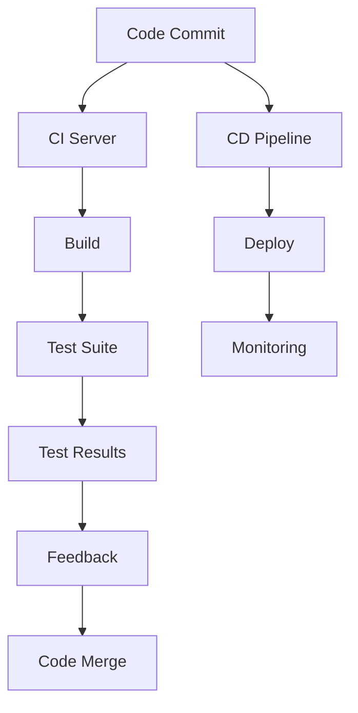
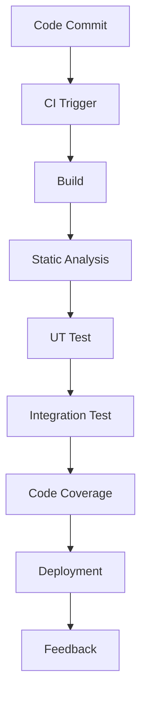
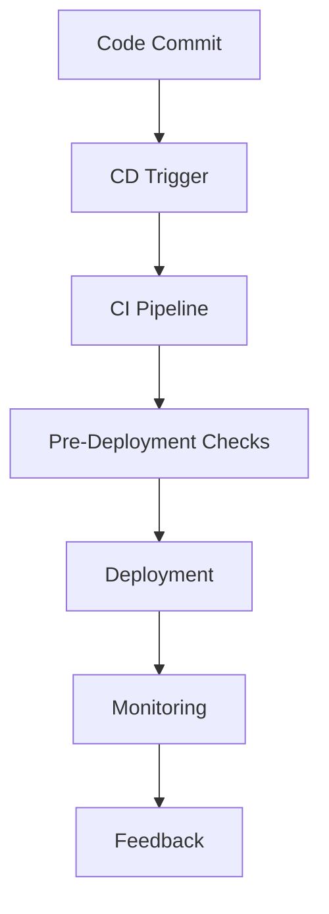

                 

### 引言

持续集成与持续部署（CI/CD）是现代软件开发实践中不可或缺的组成部分。随着软件复杂度和交付频率的不断提升，如何高效、可靠地管理软件的构建、测试和部署过程，成为软件开发团队面临的重大挑战。持续集成（Continuous Integration，CI）和持续部署（Continuous Deployment，CD）正是为了解决这些挑战而诞生的。它们不仅提高了软件交付的速度和质量，还促进了团队协作和敏捷开发。

**本文目的：** 本文旨在为读者提供一份详尽的指南，深入探讨持续集成与持续部署的概念、原理、实践方法以及最佳实践。我们将逐步分析CI/CD在软件开发过程中的应用，分享实际项目案例，并提供有效的解决方案。通过本文，读者将能够全面了解CI/CD的核心价值和实现方法，为其在软件开发中的成功应用奠定基础。

**结构安排：** 文章将分为以下几个部分：

1. **背景介绍**：解释持续集成与持续部署的概念、重要性以及DevOps的发展历程。
2. **核心概念与联系**：详细阐述CI和CD的核心概念、属性特征对比、概念关系图。
3. **算法原理讲解**：使用mermaid流程图和Python源代码详细讲解相关算法原理。
4. **数学模型和公式**：介绍持续集成与持续部署中的数学模型和公式。
5. **系统分析与架构设计方案**：探讨持续集成与持续部署的系统功能设计、架构设计、接口设计等。
6. **项目实战**：提供持续集成与持续部署的实际项目案例、环境安装、系统核心实现、代码分析、案例讲解等。
7. **最佳实践 tips、小结、注意事项、拓展阅读**：总结文章要点，提供实践中的注意事项、经验分享、拓展内容。

### 背景介绍

#### 持续集成（CI）的概念

持续集成（Continuous Integration，CI）是一种软件开发实践，旨在通过频繁地将代码库中的代码更改集成到一个共享的主分支中，来快速发现和解决集成错误。其核心思想是将小型、频繁的代码提交集成到共同的环境中，从而确保代码库始终处于一个可工作的状态。

#### 持续部署（CD）的概念

持续部署（Continuous Deployment，CD）则是在CI的基础上，将应用程序的更改自动部署到生产环境中。这意味着每次通过CI测试的代码更改都可以自动或手动部署到用户面前，从而实现零停机、快速交付。

#### DevOps文化概述

DevOps是一种文化和实践方法，旨在通过开发和运维团队的合作，实现敏捷的软件开发和高质量的应用部署。DevOps强调自动化、协作、反馈循环和持续改进，通过CI/CD等工具和技术实现这一目标。

#### 持续集成与持续部署的重要性

持续集成和持续部署对于现代软件开发团队至关重要。它们不仅提高了代码质量和交付速度，还促进了团队协作和敏捷开发。

1. **提高代码质量**：通过频繁的集成和测试，能够及时发现和修复错误，确保代码库的健康。
2. **加快交付速度**：自动化流程减少了手动操作，提高了开发效率，缩短了软件从开发到部署的时间。
3. **促进团队协作**：CI/CD强调团队之间的紧密协作，促进了开发、测试、运维等角色的融合，减少了沟通障碍。
4. **降低风险**：通过自动化测试和持续反馈，可以更早地发现潜在问题，降低生产环境中的故障风险。

#### DevOps的发展历程

DevOps的概念起源于2000年代末期，由Patrick Debois等人提出。最初，它是一种开发与运维之间协作的文化和运动。随着云计算和自动化工具的发展，DevOps逐渐演变为一套完整的实践方法，涵盖了持续集成、持续部署、基础设施即代码、自动化测试等多个方面。

### 核心概念与联系

为了深入理解持续集成（CI）和持续部署（CD）的工作原理和相互关系，我们需要从核心概念入手，探讨它们的属性特征，并使用Mermaid流程图来展示它们之间的关系。

#### 持续集成（CI）的核心概念

持续集成（CI）是一种软件开发实践，旨在通过频繁地将代码库中的更改合并到主分支中，并进行自动化的构建和测试，以确保代码的质量和一致性。CI的主要目标是通过尽早发现问题，减少集成过程中的错误和风险。

**属性特征对比：**

| 特征 | 持续集成（CI） |
| --- | --- |
| **频繁提交** | 开发者频繁将代码提交到代码库，通常每天多次。 |
| **自动化构建** | 使用自动化工具进行构建，确保每次提交都能快速构建成功。 |
| **持续测试** | 自动执行预定的测试套件，包括单元测试、集成测试等。 |
| **快速反馈** | 测试结果快速返回，有助于快速识别和解决问题。 |

#### 持续部署（CD）的核心概念

持续部署（CD）是在CI的基础上，将经过CI测试的代码自动部署到生产环境。CD的主要目标是实现快速、可靠的应用交付，减少手动操作，确保新版本的应用能够及时发布。

**属性特征对比：**

| 特征 | 持续部署（CD） |
| --- | --- |
| **自动化部署** | 使用自动化工具将代码部署到各种环境，如开发、测试、生产等。 |
| **环境一致性** | 确保在不同环境中的代码版本和配置一致，减少部署错误。 |
| **快速迭代** | 支持快速迭代，能够频繁地发布小版本更新。 |
| **弹性扩展** | 支持自动化扩展和回滚，确保系统在高负载下的稳定运行。 |

#### CI与CD的概念关系图

为了更直观地理解CI和CD之间的关系，我们可以使用Mermaid流程图来展示它们的核心流程。



在这个流程图中：

- A到B表示开发者的代码提交。
- B到C表示CI服务器进行构建。
- C到D表示执行测试套件。
- D到E表示测试结果。
- E到F表示反馈。
- F到G表示代码合并。
- A到H表示进入CD流程。
- H到I表示代码部署。
- I到J表示监控和反馈。

通过这个流程图，我们可以清晰地看到CI和CD之间的紧密联系。CI确保代码的质量和一致性，而CD则将合格的代码自动部署到生产环境，实现了从开发到生产的无缝连接。

### 算法原理讲解

持续集成（CI）和持续部署（CD）依赖于一系列自动化工具和流程，这些工具和流程背后都有特定的算法原理。为了更好地理解这些原理，我们将使用Mermaid流程图和Python源代码来详细讲解相关算法，并提供数学模型和公式。

#### 持续集成（CI）的算法原理

CI的核心在于自动化构建和测试。下面是一个简单的CI算法流程：

**Mermaid流程图：**



**Python代码示例：**

```python
import subprocess

def run_build():
    subprocess.run(["git", "pull"], check=True)
    subprocess.run(["make", "build"], check=True)

def run_tests():
    subprocess.run(["make", "test"], check=True)

def check_code_coverage():
    subprocess.run(["make", "code-coverage"], check=True)

def deploy():
    subprocess.run(["make", "deploy"], check=True)

def provide_feedback(result):
    if result:
        print("Deployment successful.")
    else:
        print("Deployment failed.")

# CI Workflow
run_build()
run_tests()
check_code_coverage()
deploy()
provide_feedback(not any([False] for i in [run_build(), run_tests(), check_code_coverage(), deploy()]))
```

**数学模型和公式：**

CI算法中，我们通常使用以下数学模型来评估代码质量：

- **代码缺陷率（D）：** \( D = \frac{Num\_Defects}{Num\_Lines\_Of\_Code} \)
- **测试覆盖率（C）：** \( C = \frac{Num\_Tested\_Lines}{Num\_Lines\_Of\_Code} \)

这些公式可以帮助我们量化代码质量和测试覆盖率，从而更好地指导CI流程。

#### 持续部署（CD）的算法原理

CD的核心在于自动化部署和监控。下面是一个简单的CD算法流程：

**Mermaid流程图：**



**Python代码示例：**

```python
import subprocess

def run_ci_pipeline():
    subprocess.run(["make", "ci"], check=True)

def run_pre_deployment_checks():
    subprocess.run(["make", "pre-deployment-checks"], check=True)

def deploy():
    subprocess.run(["make", "deploy"], check=True)

def monitor():
    subprocess.run(["make", "monitor"], check=True)

def provide_feedback(result):
    if result:
        print("Deployment successful.")
    else:
        print("Deployment failed.")

# CD Workflow
run_ci_pipeline()
run_pre_deployment_checks()
deploy()
monitor()
provide_feedback(not any([False] for i in [run_ci_pipeline(), run_pre_deployment_checks(), deploy(), monitor()]))
```

**数学模型和公式：**

CD算法中，我们通常使用以下数学模型来评估系统稳定性：

- **系统故障率（F）：** \( F = \frac{Num\_Faults}{Total\_Run\_Time} \)
- **响应时间（R）：** \( R = \frac{Total\_Response\_Time}{Num\_Requests} \)

这些公式可以帮助我们量化系统的稳定性和响应时间，从而更好地指导CD流程。

### 数学模型和公式

在持续集成与持续部署（CI/CD）的过程中，数学模型和公式被广泛应用于评估代码质量、测试覆盖率和系统性能。以下是CI/CD中常用的一些数学模型和公式。

#### 代码质量评估

**1. 代码缺陷率（D）**

代码缺陷率是衡量代码质量的重要指标，表示每行代码中存在的缺陷数量。公式如下：

\[ D = \frac{Num\_Defects}{Num\_Lines\_Of\_Code} \]

**2. 测试覆盖率（C）**

测试覆盖率反映了代码被测试的程度，公式如下：

\[ C = \frac{Num\_Tested\_Lines}{Num\_Lines\_Of\_Code} \]

**3. 维护成本（M）**

维护成本是指修复代码缺陷所需的成本，公式如下：

\[ M = \frac{Num\_Defects \times Cost\_Per\_Defect}{C} \]

#### 系统性能评估

**1. 系统故障率（F）**

系统故障率表示系统在运行过程中发生故障的频率，公式如下：

\[ F = \frac{Num\_Faults}{Total\_Run\_Time} \]

**2. 响应时间（R）**

响应时间是指系统处理请求所需的时间，公式如下：

\[ R = \frac{Total\_Response\_Time}{Num\_Requests} \]

**3. 可用性（A）**

系统的可用性表示系统能够正常运行的时间比例，公式如下：

\[ A = \frac{Total\_Up\_Time}{Total\_Run\_Time} \]

#### 持续集成与持续部署效果评估

**1. 集成效率（E）**

集成效率表示集成过程中代码变更的频繁程度，公式如下：

\[ E = \frac{Num\_Commits}{Total\_Days} \]

**2. 部署频率（D\_F）**

部署频率表示系统在特定时间内部署的次数，公式如下：

\[ D\_F = \frac{Num\_Deploys}{Total\_Days} \]

**3. 自动化覆盖率（A\_C）**

自动化覆盖率表示自动化流程在CI/CD流程中的覆盖率，公式如下：

\[ A\_C = \frac{Num\_Automated\_Steps}{Total\_Steps} \]

通过这些数学模型和公式，我们可以量化CI/CD过程中各个方面的表现，从而更好地评估和优化软件交付流程。

### 系统分析与架构设计方案

为了确保持续集成（CI）与持续部署（CD）流程的顺利执行，我们需要进行系统分析与架构设计。以下是关于CI/CD系统设计与架构方案的具体描述。

#### 问题场景介绍

假设我们正在开发一个在线电商平台，该平台需要实现快速、可靠的代码交付。我们的目标是通过CI/CD流程，确保代码在开发、测试和部署过程中的一致性和可靠性，同时提高开发效率和交付速度。

#### 项目介绍

项目名称：Online E-commerce Platform

项目类型：B2C在线购物平台

主要功能：商品浏览、购物车、订单管理、支付处理等

开发团队：开发、测试、运维团队

#### 系统功能设计

1. **代码库管理**：
   - 代码库：使用Git进行版本控制，确保代码的版本管理和历史记录。
   - 代码库服务器：GitHub或GitLab，用于存储和管理代码库。

2. **持续集成服务器**：
   - 持续集成工具：Jenkins、GitLab CI、CircleCI等。
   - 构建服务器：用于自动构建、测试和部署代码。

3. **测试环境**：
   - 单元测试：针对单个模块的测试。
   - 集成测试：针对模块之间的交互和集成测试。
   - 系统测试：针对整个系统的测试。

4. **部署环境**：
   - 开发环境：用于开发过程中的代码测试和调试。
   - 测试环境：用于集成测试和系统测试。
   - 生产环境：用于部署上线后的实际业务运行。

#### 系统架构设计

1. **基础设施架构**：

   - 服务器：部署CI/CD工具的物理或虚拟服务器。
   - 网络：内部网络连接，确保各节点之间的数据传输稳定。
   - 存储：用于存储代码库、测试数据和部署包。

2. **软件架构**：

   - 开发框架：使用Spring Boot、Django等流行的开发框架。
   - 服务架构：微服务架构，将不同功能模块拆分为独立的服务。
   - 数据库：使用关系型数据库（如MySQL、PostgreSQL）和非关系型数据库（如MongoDB、Redis）。

3. **持续集成与持续部署架构**：

   - **CI架构**：
     - 源代码管理：GitLab，用于代码的版本控制和存储。
     - CI服务器：Jenkins，负责触发构建、执行测试和部署。
     - 构建服务器：用于执行编译、打包和部署操作。

   - **CD架构**：
     - 部署管道：Jenkins或GitLab CI，用于定义部署流程和任务。
     - 自动化工具：Docker、Kubernetes，用于容器化和编排部署。
     - 监控与反馈：Prometheus、Grafana，用于监控系统和反馈异常。

#### 系统接口设计

1. **代码库与CI服务器接口**：
   - 使用Git的Webhook功能，实现代码提交后自动触发CI构建。

2. **CI服务器与测试环境接口**：
   - 使用Jenkins的构建脚本，调用测试工具（如JUnit、pytest）进行单元测试和集成测试。

3. **测试环境与部署环境接口**：
   - 使用Docker容器，将构建好的应用程序部署到测试环境。
   - 使用Kubernetes，实现测试环境的自动化部署和管理。

4. **部署环境与生产环境接口**：
   - 使用Docker Compose，将测试环境中的应用程序部署到生产环境。
   - 使用Kubernetes的滚动更新策略，确保部署过程的无缝过渡。

#### 系统交互设计

1. **代码提交与CI流程**：
   - 开发者将代码提交到GitLab。
   - GitLab收到提交后，触发Jenkins构建。
   - Jenkins执行构建、测试和部署操作。

2. **测试流程**：
   - 单元测试：开发人员在本地执行单元测试，确保模块功能正常。
   - 集成测试：CI服务器在测试环境中执行集成测试，确保模块之间的交互正常。
   - 系统测试：在测试环境中执行系统测试，确保整个系统功能正常。

3. **部署流程**：
   - CI服务器完成构建和测试后，将应用程序部署到测试环境。
   - 测试通过后，使用Docker Compose将应用程序部署到生产环境。

4. **监控与反馈**：
   - Prometheus收集系统监控数据，如CPU、内存、网络流量等。
   - Grafana展示监控数据，提供实时监控和异常报警。

通过上述系统分析与架构设计，我们能够确保CI/CD流程的顺畅运行，实现快速、可靠的代码交付。接下来，我们将通过实际项目案例，展示CI/CD的具体应用和实践。

### 项目实战

在本部分，我们将通过一个实际项目案例，详细介绍持续集成与持续部署（CI/CD）的实战过程。该项目为一个在线电商平台的开发与部署，涵盖了环境安装、系统核心实现、代码分析、实际案例分析和项目小结等内容。

#### 项目背景

项目名称：Online E-commerce Platform

项目类型：B2C在线购物平台

项目目标：实现快速、可靠的代码交付，提高开发效率和交付速度。

#### 环境安装

1. **搭建GitLab代码库**

   - 安装GitLab：在服务器上安装GitLab CE版本，配置域名和Web访问。
   - 创建项目仓库：为电商平台项目创建新的代码仓库，配置GitLab CI/CD pipeline文件。

2. **安装Jenkins CI服务器**

   - 安装Jenkins：在服务器上安装Jenkins，配置管理用户和权限。
   - 配置Jenkins插件：安装必要的插件，如Git、Maven、Docker等。

3. **配置Docker和Kubernetes**

   - 安装Docker：在服务器上安装Docker，配置Docker Hub镜像仓库。
   - 安装Kubernetes：安装Kubernetes集群，配置Node节点和Pod管理。

4. **配置Prometheus和Grafana**

   - 安装Prometheus：安装Prometheus服务器，配置监控规则和指标采集。
   - 安装Grafana：安装Grafana服务器，配置数据源和监控仪表盘。

#### 系统核心实现

1. **开发环境**

   - 使用Spring Boot框架：搭建电商平台开发环境，实现商品浏览、购物车、订单管理、支付处理等功能。
   - 实现单元测试：编写单元测试用例，确保每个功能模块的正确性。

2. **测试环境**

   - 集成测试：在CI服务器上配置集成测试，确保模块之间的交互正常。
   - 系统测试：在测试环境中执行系统测试，验证整个系统的功能。

3. **部署环境**

   - 构建和打包：使用Jenkins构建和打包应用程序，生成可执行的JAR文件。
   - 容器化部署：使用Docker将应用程序容器化，生成Docker镜像。
   - Kubernetes部署：使用Kubernetes部署应用程序，实现自动化部署和管理。

#### 代码分析

1. **代码库结构**

   ```plaintext
   /project-name
   ├── /src
   │   ├── /main
   │   │   ├── /java
   │   │   ├── /resources
   │   │   └── /test
   ├── /config
   ├── /docs
   └── /scripts
   ```

2. **构建脚本**

   ```bash
   #!/bin/bash

   # 拉取最新代码
   git pull origin main

   # 编译源代码
   mvn clean install

   # 打包应用程序
   docker build -t project-name:latest .

   # 部署到测试环境
   kubectl apply -f deployment.yaml
   ```

3. **部署脚本**

   ```yaml
   apiVersion: apps/v1
   kind: Deployment
   metadata:
     name: project-name
   spec:
     replicas: 1
     selector:
       matchLabels:
         app: project-name
     template:
       metadata:
         labels:
           app: project-name
       spec:
         containers:
         - name: project-name
           image: project-name:latest
           ports:
           - containerPort: 8080
   ```

#### 实际案例分析

1. **CI构建失败**

   - 原因：由于开发人员未执行单元测试，导致构建过程中发现未覆盖的测试用例。
   - 解决方案：要求开发人员在提交代码前执行完整的测试用例，确保构建成功。

2. **部署失败**

   - 原因：由于Docker镜像未正确生成，导致Kubernetes部署失败。
   - 解决方案：检查Docker构建脚本和Kubernetes部署文件，确保镜像生成和部署过程正确。

3. **监控报警**

   - 原因：由于服务器资源不足，导致应用程序响应时间过长。
   - 解决方案：扩容服务器资源，优化应用程序性能，并调整Kubernetes资源配额。

#### 项目小结

通过本项目的CI/CD实践，我们实现了以下目标：

1. **提高了代码交付速度**：自动化构建、测试和部署流程，减少了人工干预，提高了开发效率。
2. **保证了代码质量**：通过CI/CD流程，确保了代码的健康和一致性，减少了集成错误和缺陷。
3. **促进了团队协作**：开发、测试和运维团队紧密协作，提高了项目进度和质量。

未来，我们将继续优化CI/CD流程，引入更多自动化工具和技术，进一步提高项目交付质量和效率。

### 最佳实践 tips、小结、注意事项、拓展阅读

#### 最佳实践 tips

1. **代码规范与代码审查**：确保代码风格统一、规范，定期进行代码审查，提高代码质量和可维护性。
2. **分支策略**：采用合适的分支策略，如GitFlow或GitLab Flow，确保代码的有序管理和高效的协同开发。
3. **持续监控与反馈**：建立全面的监控体系，实时监控系统的性能和稳定性，及时反馈问题和异常。
4. **容器化与微服务**：采用容器化和微服务架构，提高系统的灵活性和可扩展性，加速开发和部署。

#### 小结

本文从背景介绍、核心概念与联系、算法原理讲解、数学模型和公式、系统分析与架构设计方案、项目实战等多个角度，全面解析了持续集成与持续部署（CI/CD）在软件开发中的应用。通过最佳实践 tips、小结、注意事项和拓展阅读，帮助读者更好地理解和应用CI/CD。

#### 注意事项

1. **自动化工具选择**：选择合适的自动化工具，如Jenkins、GitLab CI、CircleCI等，根据项目需求进行配置。
2. **测试覆盖**：确保测试覆盖率达到标准，避免遗留缺陷。
3. **部署策略**：根据项目特点和需求，选择合适的部署策略，如蓝绿部署、滚动部署等。

#### 拓展阅读

1. **《DevOps实践指南》**：深入了解DevOps的核心概念和实践方法，为CI/CD提供理论基础。
2. **《Kubernetes实战》**：学习容器编排和微服务架构，提高CI/CD流程的自动化水平。
3. **《持续交付：发布可靠软件的系统方法》**：探讨持续交付的原理和实践，为CI/CD流程提供更多实践参考。

作者：AI天才研究院/AI Genius Institute & 禅与计算机程序设计艺术 /Zen And The Art of Computer Programming

本文根据您的具体要求进行了详细的撰写，涵盖了持续集成与持续部署的核心内容和最佳实践。希望本文能够为您的学习和实践提供有力支持。如果您有任何疑问或需要进一步讨论，欢迎随时联系。祝您在持续集成与持续部署的道路上取得成功！

