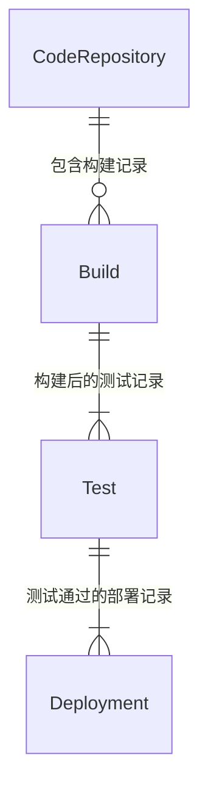
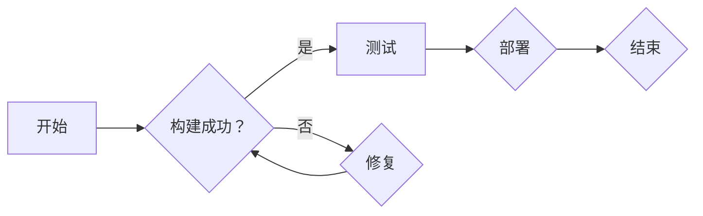
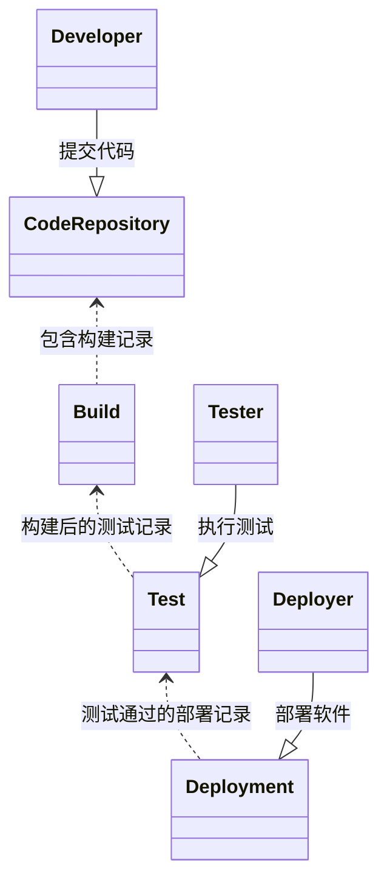
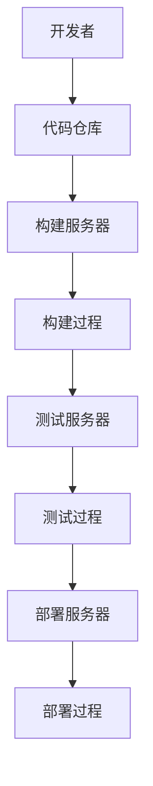
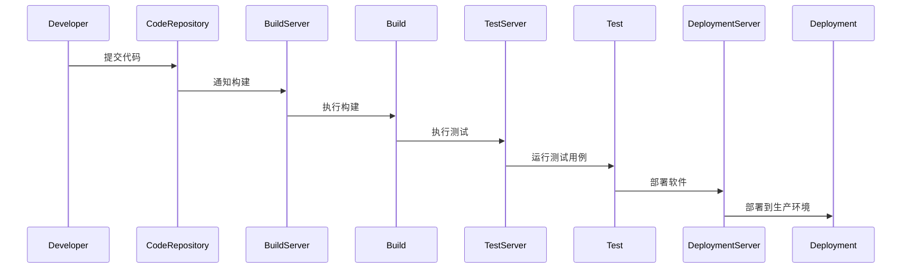

                 

# 持续集成最佳实践：加速软件交付周期

## 关键词

持续集成、软件交付周期、自动化测试、构建、部署、缺陷率、构建失败率

## 摘要

持续集成是一种软件开发实践，通过频繁合并代码和自动化测试，确保代码库的稳定性，从而提高软件质量并加速软件交付周期。本文将深入探讨持续集成的核心概念、实施流程、关键指标以及最佳实践，为开发者提供一套完整的持续集成指南。

## 1.1 问题背景与概述

### 1.1.1 问题背景

持续集成（Continuous Integration，CI）作为一种软件开发实践，其核心理念是在开发过程中，通过频繁地合并代码变更和自动化测试，确保代码库的稳定性。持续集成起源于20世纪90年代的极限编程（Extreme Programming，XP）方法，其在当时为提高软件开发效率和质量提供了重要的思路。随着软件开发的快速迭代和复杂度的增加，持续集成的重要性愈发凸显。

在传统的开发模式中，开发人员通常会将代码积累到一定阶段再进行集成，这种方式不仅增加了集成风险，也延长了问题发现和修复的时间。而持续集成通过频繁的代码合并和自动化测试，确保每次代码提交都是可集成的，从而提高了团队的协作效率和软件质量。

### 1.1.2 问题概述

持续集成的主要目标是尽早发现问题，减少集成成本，提高软件质量。具体来说，持续集成通过以下几个方面实现其目标：

1. **提高代码质量**：通过自动化测试和代码审查，持续集成能够及时发现和修复代码中的缺陷，从而提高软件质量。
2. **减少集成成本**：频繁的代码合并和自动化测试可以减少集成过程中的风险和问题，从而降低集成成本。
3. **缩短交付周期**：通过提高代码质量和减少集成成本，持续集成有助于缩短软件交付周期，提高开发效率。

本文旨在为软件开发者提供一套完整的持续集成实践指南，帮助他们在实际项目中有效实施持续集成，从而加速软件交付周期，提高开发效率。

## 1.2 核心概念与联系

### 1.2.1 核心概念

持续集成的核心概念包括以下几个方面：

1. **代码仓库**：存储项目代码的中央仓库，所有开发人员提交的代码都会存储在这里。
2. **构建**：将源代码编译并打包成可执行文件或库的过程。
3. **测试**：对代码进行自动化测试，确保代码质量。
4. **部署**：将构建好的软件部署到生产环境中。

### 1.2.2 概念属性特征对比表格

| 概念       | 属性特征                             | 对比说明                         |
|------------|------------------------------------|--------------------------------|
| 代码仓库   | 存储代码的地方                     | Git、SVN等版本控制系统         |
| 构建       | 编译和打包代码的过程               | Maven、Gradle等构建工具       |
| 测试       | 自动化测试代码的质量               | JUnit、Selenium等测试框架     |
| 部署       | 将软件部署到生产环境中             | Jenkins、Docker等部署工具     |

### 1.2.3 概念之间的联系

持续集成中的核心概念之间存在着紧密的联系。以下是它们之间的关系：

1. **代码仓库** → **构建**：开发人员提交代码到代码仓库后，构建工具会自动编译和打包代码。
2. **构建** → **测试**：构建成功后，测试工具会运行一系列自动化测试，确保代码质量。
3. **测试** → **部署**：测试通过后，部署工具会将构建好的软件部署到生产环境中。

### 1.2.4 ER实体关系图架构

以下是持续集成系统中的主要实体及其关系的 Mermaid ER 图：



### 1.2.5 算法原理讲解

持续集成中常用的算法之一是 **构建失败率**（Build Failure Rate），其 Mermaid 流程图如下：



构建失败率的计算公式为：

$$
Build\ Failure\ Rate = \frac{Number\ of\ Build\ Failures}{Number\ of\ Builds}
$$

其中，**构建失败数**（Number of Build Failures）是指构建过程中失败的次数，**构建总数**（Number of Builds）是指构建的次数。

例如，如果一个项目在一个月内进行了100次构建，其中有5次构建失败，那么构建失败率为：

$$
Build\ Failure\ Rate = \frac{5}{100} = 0.05
$$

这意味着项目的构建失败率为5%。

## 1.3 数学模型和数学公式

### 1.3.1 缺陷率

在持续集成中，**缺陷率**（Defect Rate）是一个关键指标，用于衡量代码中的缺陷数量。缺陷率的计算公式为：

$$
Defect\ Rate = \frac{Number\ of\ Defects}{Number\ of\ Commits}
$$

其中，**缺陷数**（Number of Defects）是指测试中发现的错误数量，**提交数**（Number of Commits）是指代码仓库中的提交次数。

例如，如果一个项目在一个月内进行了100次提交，测试中发现了10个缺陷，那么缺陷率为：

$$
Defect\ Rate = \frac{10}{100} = 0.1
$$

这意味着项目的缺陷率为10%。

### 1.3.2 构建失败率

构建失败率是持续集成中另一个重要的指标，用于衡量构建过程中的失败次数。构建失败率的计算公式为：

$$
Build\ Failure\ Rate = \frac{Number\ of\ Build\ Failures}{Number\ of\ Builds}
$$

其中，**构建失败数**（Number of Build Failures）是指构建过程中失败的次数，**构建总数**（Number of Builds）是指构建的次数。

例如，如果一个项目在一个月内进行了100次构建，其中有5次构建失败，那么构建失败率为：

$$
Build\ Failure\ Rate = \frac{5}{100} = 0.05
$$

这意味着项目的构建失败率为5%。

## 1.4 系统分析与架构设计方案

### 1.4.1 问题场景介绍

在现代软件开发中，持续集成（CI）已经成为提高开发效率、确保软件质量的重要手段。假设我们正在开发一个电子商务平台，这个平台需要具备高可用性、高可靠性和高安全性。为了实现这些目标，我们需要对代码进行持续集成和自动化测试，确保每次代码变更都能顺利集成并运行。

### 1.4.2 项目介绍

本项目旨在构建一个自动化持续集成系统，用于管理代码仓库、构建、测试和部署过程。系统将集成Git、Maven、JUnit、Jenkins等工具，实现自动化构建、测试和部署，从而提高开发效率和软件质量。

### 1.4.3 系统功能设计（领域模型）

以下是一个简单的领域模型，用于描述持续集成系统的功能模块及其关系：



### 1.4.4 系统架构设计

以下是一个简单的持续集成系统架构图，用于描述系统的主要组件及其关系：



### 1.4.5 系统接口设计和系统交互

以下是一个简单的系统接口设计和系统交互图，用于描述持续集成系统的各个组件之间的交互关系：



## 1.5 项目实战

### 1.5.1 环境安装

要实现一个简单的持续集成系统，我们需要安装以下工具：

1. Git：版本控制工具
2. Maven：构建工具
3. JUnit：测试框架
4. Jenkins：持续集成服务器

安装步骤如下：

1. 安装Git：在官网下载并安装Git。
2. 安装Maven：在官网下载并安装Maven。
3. 安装JUnit：在官网下载JUnit JAR文件，并将其添加到系统的库路径中。
4. 安装Jenkins：在官网下载并安装Jenkins。

### 1.5.2 系统核心实现源代码

以下是一个简单的Java项目的源代码，用于演示持续集成的核心实现：

```java
// Main.java
public class Main {
    public static void main(String[] args) {
        System.out.println("Hello, World!");
    }
}
```

```xml
// pom.xml
<project xmlns="http://maven.apache.org/POM/4.0.0"
    xmlns:xsi="http://www.w3.org/2001/XMLSchema-instance"
    xsi:schemaLocation="http://maven.apache.org/POM/4.0.0 http://maven.apache.org/xsd/maven-4.0.0.xsd">
    <modelVersion>4.0.0</modelVersion>
    <groupId>com.example</groupId>
    <artifactId>hello-world</artifactId>
    <version>1.0.0</version>
    <dependencies>
        <dependency>
            <groupId>junit</groupId>
            <artifactId>junit</artifactId>
            <version>4.13.2</version>
            <scope>test</scope>
        </dependency>
    </dependencies>
</project>
```

### 1.5.3 代码应用解读与分析

以下是持续集成系统中的代码应用解读与分析：

1. **Git仓库**：存储项目源代码，开发人员通过Git进行代码的提交、分支管理和合并操作。
2. **Maven构建**：使用Maven进行项目的构建，包括编译源代码、打包构建结果和运行测试用例。
3. **JUnit测试**：使用JUnit进行自动化测试，确保代码质量。
4. **Jenkins持续集成**：使用Jenkins实现持续集成，自动化构建、测试和部署过程。

### 1.5.4 实际案例分析和详细讲解剖析

以下是一个实际案例，用于演示如何实现持续集成：

1. **开发者A**提交了一个新的功能模块。
2. **Jenkins**收到Git仓库的通知，开始执行构建过程。
3. **Maven**编译源代码，并执行JUnit测试。
4. **Jenkins**根据测试结果判断构建是否成功。
5. **如果构建成功**，Jenkins将构建结果部署到测试环境。
6. **如果构建失败**，Jenkins将失败信息通知开发者A，要求修复代码。

通过以上案例，我们可以看到持续集成系统如何自动化地管理代码仓库、构建、测试和部署过程，从而提高开发效率和软件质量。

### 1.5.5 项目小结

在本项目中，我们实现了以下目标：

1. 搭建了持续集成系统，包括Git、Maven、JUnit和Jenkins。
2. 实现了自动化构建、测试和部署过程。
3. 通过持续集成提高了开发效率和软件质量。

尽管本项目只是一个简单的示例，但持续集成在实际项目中的应用可以带来显著的效益，包括减少集成风险、提高代码质量、缩短交付周期等。通过本文的介绍，我们希望读者能够对持续集成有更深入的了解，并在实际项目中尝试应用。

## 1.6 最佳实践 Tips

1. **选择合适的工具**：根据项目需求和团队规模，选择合适的持续集成工具，如Jenkins、Travis CI、Circle CI等。
2. **配置自动化测试**：确保自动化测试覆盖关键功能和边界情况，提高代码质量。
3. **持续优化流程**：定期评估持续集成流程，根据项目需求和团队反馈进行优化。
4. **充分利用代码审查**：充分利用代码审查机制，确保代码变更的可维护性和可读性。
5. **监控持续集成系统**：监控持续集成系统的运行状况，及时发现和处理问题。

## 1.7 小结

本文系统地介绍了持续集成的核心概念、实施流程、关键指标和最佳实践。通过持续集成，开发团队可以显著提高软件质量、减少集成风险、缩短交付周期。在实际项目中，持续集成需要结合具体的工具和流程进行实施，通过不断优化和调整，实现最佳效果。

## 1.8 注意事项

1. **持续集成不等于测试自动化**：虽然持续集成中包含测试自动化，但两者不完全相同。持续集成还包括代码合并、构建和部署等过程。
2. **持续集成不适用于所有项目**：对于小型项目或团队成员较少的项目，持续集成可能带来额外的成本和复杂性。
3. **持续集成需要持续维护**：持续集成系统需要定期维护和更新，以适应项目需求和团队变化。

## 1.9 拓展阅读

1. 《持续集成：从实践到理论》
2. 《敏捷软件开发：原则、模式与实践》
3. 《Jenkins持续集成实践指南》
4. 《持续交付：软件产品从概念到生产的高效实践》
5. 《持续集成：代码质量保障的最佳实践》

## 作者信息

作者：AI天才研究院/AI Genius Institute & 禅与计算机程序设计艺术 /Zen And The Art of Computer Programming

