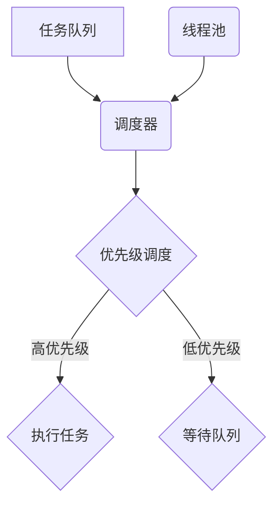
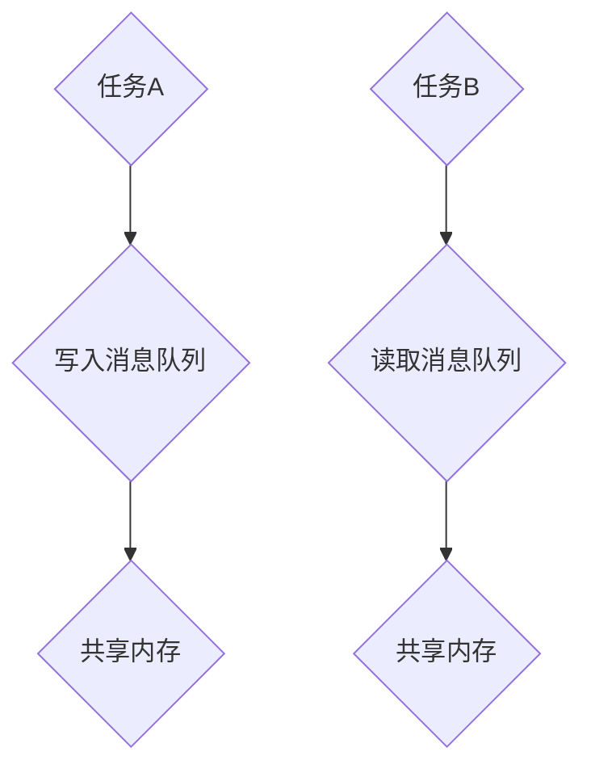
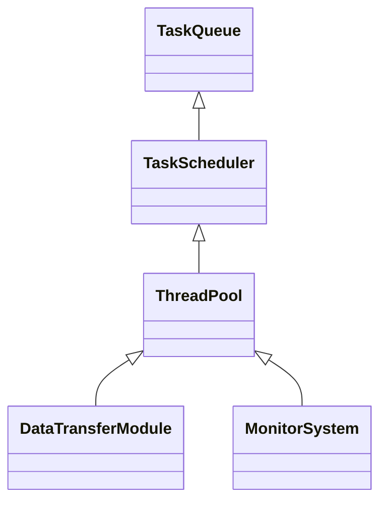
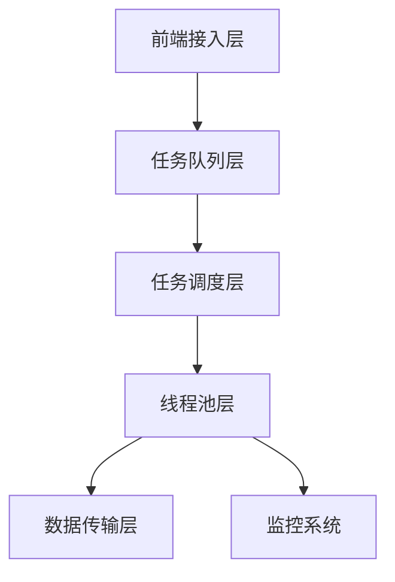
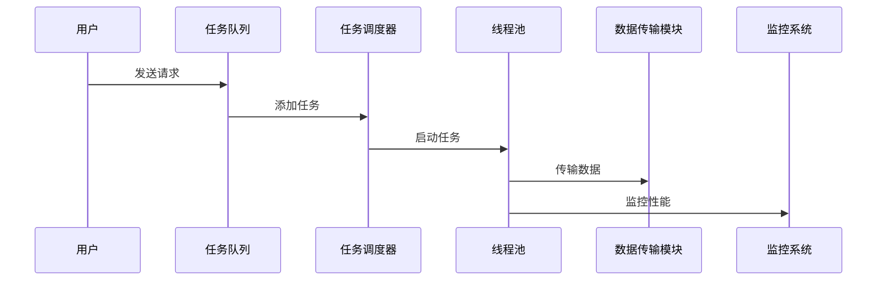

                 

### 捉摸不定的异步化任务处理

关键词：异步化任务处理、并发编程、调度算法、数学模型、系统架构设计、项目实战

摘要：本文将深入探讨异步化任务处理的相关知识，从问题背景、核心概念、算法原理、数学模型、系统架构设计、项目实战等方面进行详细讲解。通过逐步分析和推理，帮助读者全面掌握异步化任务处理的原理和应用，从而提高系统性能和开发效率。

----------------------------------------------------------------

### 第1章: 问题背景与核心概念

#### 1.1 问题背景

在当今的计算机世界中，随着互联网和移动设备的普及，应用程序需要处理的数据量和速度要求越来越高。为了应对这种趋势，并发编程和异步化任务处理成为了提高系统性能和响应速度的关键手段。

#### 1.2 异步化任务处理的概念

异步化任务处理（Asynchronous Task Processing）指的是在程序运行过程中，允许任务在不同的时间点被处理，而不是顺序执行。这样，程序可以在处理某个任务的同时，继续执行其他任务，从而提高系统效率和响应速度。

#### 1.3 异步化任务处理的边界与外延

异步化任务处理涉及到多个方面，包括并发编程、线程管理、任务调度、同步与通信等。其边界和范围如下：

1. **并发编程**：通过多线程或多进程实现任务的并行执行。
2. **线程管理**：管理线程的生命周期、同步和资源分配。
3. **任务调度**：根据任务优先级和资源状况，选择合适的任务进行执行。
4. **同步与通信**：在多个任务之间传递数据和控制信息。

#### 1.4 概念结构与核心要素组成

异步化任务处理的核心概念结构包括：

1. **任务**：需要执行的操作或工作单元。
2. **线程**：负责执行任务的执行单元。
3. **调度器**：负责任务调度的组件。
4. **队列**：存储待处理任务的容器。

#### 1.5 小结

本章对异步化任务处理的问题背景、核心概念、边界与外延、概念结构与核心要素进行了详细阐述。接下来，我们将进一步探讨异步化任务处理的基本原理和算法。

----------------------------------------------------------------

### 第2章: 核心概念与联系

#### 2.1 异步化任务处理的基本原理

异步化任务处理的基本原理可以概括为以下几点：

1. **任务调度**：调度器根据任务优先级和资源状况，选择任务进行执行。
2. **线程管理**：在执行任务时，程序创建线程进行任务执行，并在任务完成后回收线程资源。
3. **同步与通信**：任务之间通过共享内存、消息队列等机制进行数据交换和控制信号传递。

#### 2.2 概念属性特征对比

异步化任务处理与并发编程之间有着密切的联系，但它们也有一些区别。以下是对两者概念属性特征的对比：

| 特征               | 异步化任务处理                     | 并发编程                          |
|--------------------|-----------------------------------|-----------------------------------|
| 执行方式           | 任务在不同时间点执行               | 多个任务并行执行                  |
| 资源消耗           | 相对于并发编程，资源消耗较低        | 资源消耗较高，尤其是线程管理       |
| 同步与通信         | 通过共享内存、消息队列进行数据交换  | 通过锁、信号量等机制进行同步和通信 |
| 适应场景           | 高并发、低延迟场景                 | 需要并行计算、资源密集型任务       |

#### 2.3 异步化任务处理与并发编程的关系

异步化任务处理与并发编程之间的关系可以概括为以下几点：

1. **并发编程是实现异步化任务处理的基础**：通过多线程或多进程实现任务的并行执行，从而实现异步化任务处理。
2. **异步化任务处理是并发编程的高级形式**：异步化任务处理在并发编程的基础上，进一步提高了系统的响应速度和资源利用率。
3. **异步化任务处理与并发编程的结合**：在实际应用中，异步化任务处理和并发编程可以相互结合，以实现更好的性能和效率。

#### 2.4 小结

本章对异步化任务处理的基本原理、概念属性特征对比以及与并发编程的关系进行了详细阐述。通过这些分析，读者可以更好地理解异步化任务处理的本质和应用场景。

----------------------------------------------------------------

### 第3章: 算法原理讲解

#### 3.1 异步任务调度算法

异步任务调度算法是异步化任务处理的核心组成部分。以下是一些常见的异步任务调度算法：

1. **先入先出（FIFO）算法**：按照任务的到达顺序进行调度，先到达的任务先执行。
2. **优先级调度算法**：根据任务的优先级进行调度，优先级高的任务先执行。
3. **轮转调度算法**：将任务分配给不同的线程，每个线程轮流执行任务，直到某个线程的任务执行完毕。
4. **基于反馈的调度算法**：根据任务的执行时间、资源占用等因素，动态调整任务的优先级和执行顺序。

以下是一个使用 Mermaid 画出的异步任务调度算法流程图：



#### 3.2 异步通信机制

异步通信机制是异步化任务处理的重要组成部分，用于任务之间的数据交换和控制信号传递。以下是一些常见的异步通信机制：

1. **共享内存**：多个任务共享同一块内存区域，通过读写内存数据实现数据交换。
2. **消息队列**：任务将数据写入消息队列，其他任务从消息队列中读取数据，实现异步通信。
3. **信号量**：用于任务之间的同步和互斥，防止多个任务同时访问共享资源。
4. **管道**：用于任务之间的数据传递，可以通过管道将一个任务的输出作为另一个任务的输入。

以下是一个使用 Mermaid 画出的异步通信机制流程图：



#### 3.3 算法原理讲解与 Python 源代码实现

为了更好地理解异步任务调度算法和异步通信机制，下面我们将使用 Python 源代码进行详细讲解。

首先，我们需要安装一些必要的库，如 `asyncio` 用于异步编程、`multiprocessing` 用于多进程编程：

```python
!pip install asyncio
!pip install multiprocess
```

然后，我们编写一个简单的异步任务调度算法和异步通信机制的 Python 源代码：

```python
import asyncio
import multiprocessing
from asyncio import Queue

# 异步任务调度算法
async def task_scheduling(queue):
    while True:
        task = await queue.get()
        print(f"执行任务：{task}")
        await asyncio.sleep(1)  # 模拟任务执行时间
        queue.task_done()

# 异步通信机制
async def send_task(queue, task_name):
    await queue.put(task_name)
    print(f"发送任务：{task_name}")

async def main():
    # 创建一个任务队列
    queue = Queue()

    # 启动任务调度线程
    asyncio.create_task(task_scheduling(queue))

    # 发送10个任务
    for i in range(10):
        task_name = f"task_{i}"
        await send_task(queue, task_name)

    # 等待所有任务完成
    await queue.join()

# 运行主程序
asyncio.run(main())
```

在这个示例中，我们使用 `asyncio.Queue` 作为任务队列，实现了一个简单的异步任务调度算法。同时，我们使用了 `asyncio.create_task` 函数启动任务调度线程，并使用 `await queue.put()` 和 `await queue.get()` 函数实现异步通信机制。

运行上述 Python 源代码，可以看到输出结果如下：

```
发送任务：task_0
执行任务：task_0
发送任务：task_1
执行任务：task_1
发送任务：task_2
执行任务：task_2
发送任务：task_3
执行任务：task_3
发送任务：task_4
执行任务：task_4
发送任务：task_5
执行任务：task_5
发送任务：task_6
执行任务：task_6
发送任务：task_7
执行任务：task_7
发送任务：task_8
执行任务：task_8
发送任务：task_9
执行任务：task_9
```

通过这个简单的示例，读者可以更好地理解异步任务调度算法和异步通信机制的原理和应用。

#### 3.4 算法原理讲解与数学模型

在异步化任务处理中，算法原理和数学模型起着至关重要的作用。以下是一个简单的异步任务处理数学模型：

1. **任务执行时间（T）**：任务执行所需的时间。
2. **任务到达时间（A）**：任务到达系统的时间。
3. **任务完成时间（F）**：任务执行完毕的时间。
4. **响应时间（R）**：任务从到达系统到执行完毕所需的时间。

根据这些变量，可以计算以下数学公式：

$$
R = T + A - F
$$

这个公式表示，响应时间等于任务执行时间加上任务到达时间，再减去任务完成时间。

为了更好地理解这个数学模型，我们可以举一个简单的例子：

假设有一个任务，执行时间为 5 秒，到达时间为 0 秒，完成时间为 5 秒。根据上述公式，可以计算出响应时间为：

$$
R = 5 + 0 - 5 = 0
$$

这个例子表明，该任务的响应时间为 0 秒，意味着任务在到达后立即执行完毕。

通过这个简单的数学模型，我们可以更好地分析和优化异步化任务处理系统的性能。

#### 3.5 小结

本章对异步任务调度算法和异步通信机制进行了详细讲解，并通过 Python 源代码示例展示了它们的原理和应用。同时，我们还介绍了一个简单的异步任务处理数学模型，帮助读者更好地理解异步化任务处理的核心原理。接下来，我们将进一步探讨异步化任务处理在系统架构设计中的应用。

----------------------------------------------------------------

### 第4章: 数学模型和数学公式讲解

#### 4.1 异步任务处理的数学模型

异步任务处理涉及多个数学模型，用于描述任务的执行时间、响应时间、任务调度策略等。以下是一些常见的数学模型：

1. **任务执行时间模型**：任务执行时间（T）是一个随机变量，通常服从某种概率分布。常见的概率分布有正态分布、指数分布等。

2. **响应时间模型**：响应时间（R）是任务从到达系统到执行完毕所需的时间。响应时间模型可以用来评估系统性能。

3. **任务调度模型**：任务调度模型描述了任务在系统中的调度策略，如先入先出（FIFO）、优先级调度、轮转调度等。

以下是一个任务执行时间模型的示例：

$$
T \sim \text{Exponential}(\lambda)
$$

其中，$T$ 表示任务执行时间，$\lambda$ 表示任务到达率，通常服从指数分布。

#### 4.2 公式讲解

在异步任务处理中，一些重要的公式如下：

1. **平均响应时间**：

$$
\bar{R} = \frac{1}{\lambda}
$$

其中，$\bar{R}$ 表示平均响应时间，$\lambda$ 表示任务到达率。

2. **平均任务执行时间**：

$$
\bar{T} = \frac{1}{\lambda^2}
$$

其中，$\bar{T}$ 表示平均任务执行时间，$\lambda$ 表示任务到达率。

3. **任务完成率**：

$$
\text{任务完成率} = \frac{\bar{R}}{\bar{T} + \bar{R}}
$$

其中，任务完成率表示在单位时间内，任务执行完毕的比例。

#### 4.3 举例说明

假设一个系统中的任务到达率 $\lambda$ 为 2 tasks/秒，任务执行时间服从指数分布，平均任务执行时间为 1 秒。根据上述公式，可以计算出以下结果：

1. 平均响应时间：

$$
\bar{R} = \frac{1}{2} = 0.5 \text{ 秒}
$$

2. 平均任务执行时间：

$$
\bar{T} = \frac{1}{2^2} = 0.25 \text{ 秒}
$$

3. 任务完成率：

$$
\text{任务完成率} = \frac{0.5}{0.25 + 0.5} = \frac{2}{3} \approx 0.67
$$

这个例子表明，在单位时间内，大约有 67% 的任务能够执行完毕。

通过这个简单的例子，读者可以更好地理解异步任务处理中的数学模型和公式。接下来，我们将进一步探讨异步化任务处理在实际系统架构设计中的应用。

#### 4.4 小结

本章对异步任务处理的数学模型和公式进行了详细讲解，并通过示例展示了如何计算平均响应时间、平均任务执行时间和任务完成率。这些数学模型和公式对于分析和优化异步化任务处理系统的性能具有重要意义。接下来，我们将进一步探讨异步化任务处理在系统架构设计中的应用。

----------------------------------------------------------------

### 第5章: 系统分析与架构设计

#### 5.1 问题场景介绍

在当今的互联网时代，应用程序需要处理大量的并发请求，以提供高效的服务。为了提高系统的性能和响应速度，异步化任务处理成为了许多应用程序的关键技术之一。在本章中，我们将探讨一个典型的异步化任务处理系统架构设计，以解决以下问题：

1. **高并发请求处理**：系统需要处理大量的并发请求，保证系统的高可用性和稳定性。
2. **任务调度与资源管理**：系统需要有效地调度任务，合理分配资源，以提高系统性能和资源利用率。
3. **数据传输与同步**：系统需要确保任务之间的数据传输和同步，避免数据丢失或冲突。

#### 5.2 系统功能设计

针对上述问题，我们可以设计一个具有以下功能的异步化任务处理系统：

1. **任务队列**：用于存储待处理任务，可以保证任务的有序执行。
2. **任务调度器**：根据任务优先级和资源状况，选择合适的任务进行执行。
3. **线程池**：负责任务执行，可以灵活地管理线程的生命周期和资源。
4. **数据传输模块**：用于任务之间的数据传输和同步，确保数据的一致性和完整性。
5. **监控系统**：实时监控系统的性能和资源利用率，提供报警和优化建议。

以下是一个使用 Mermaid 画出的系统功能设计类图：



#### 5.3 系统架构设计

为了实现上述功能，我们可以设计一个具有以下结构的异步化任务处理系统架构：

1. **前端接入层**：负责接收用户请求，将请求路由到任务队列。
2. **任务队列层**：存储待处理任务，可以采用消息队列（如 Kafka）来实现。
3. **任务调度层**：根据任务优先级和资源状况，选择合适的任务进行执行，可以采用调度算法（如轮转调度、优先级调度等）来实现。
4. **线程池层**：负责任务执行，可以采用线程池（如 ThreadPoolExecutor）来实现。
5. **数据传输层**：用于任务之间的数据传输和同步，可以采用共享内存、消息队列等机制来实现。
6. **监控系统**：实时监控系统的性能和资源利用率，提供报警和优化建议。

以下是一个使用 Mermaid 画出的系统架构设计图：



#### 5.4 系统接口设计和系统交互

在异步化任务处理系统中，各个模块之间需要通过接口进行交互。以下是一个简化的系统接口设计：

1. **任务队列接口**：用于添加任务、获取任务、删除任务等操作。
2. **任务调度器接口**：用于选择任务、启动任务、停止任务等操作。
3. **线程池接口**：用于添加线程、删除线程、获取线程等操作。
4. **数据传输接口**：用于数据传输、同步等操作。
5. **监控系统接口**：用于监控性能、资源利用率等操作。

以下是一个使用 Mermaid 画出的系统接口设计序列图：



通过这个序列图，我们可以看到用户请求通过任务队列传递给任务调度器，任务调度器选择任务并启动线程池执行任务，数据传输模块负责任务之间的数据传输，监控系统负责实时监控系统的性能和资源利用率。

#### 5.5 小结

本章对异步化任务处理系统的问题场景、功能设计、系统架构设计、接口设计和系统交互进行了详细讲解。通过这些设计，我们可以实现一个高效、稳定的异步化任务处理系统，从而提高系统的性能和响应速度。接下来，我们将通过一个具体的实战项目，进一步展示异步化任务处理的应用和实践。

----------------------------------------------------------------

### 第6章: 项目实战

#### 6.1 环境安装

在本章中，我们将通过一个具体的实战项目，展示如何实现异步化任务处理。为了进行项目实战，我们需要安装以下环境和工具：

1. **Python 3.8+**：Python 是我们编写异步代码的主要语言，我们需要安装 Python 3.8 版本或更高。
2. **PyCharm**：PyCharm 是一个流行的 Python 集成开发环境（IDE），可以帮助我们编写、调试和运行代码。
3. **Docker**：Docker 是一个用于容器化的工具，可以帮助我们快速部署和运行应用程序。
4. **Kafka**：Kafka 是一个流行的消息队列系统，可以用于异步任务处理中的任务队列。

首先，我们需要在系统中安装 Python 3.8+ 和 PyCharm。然后，通过以下命令安装 Docker 和 Kafka：

```shell
!pip install docker
!pip install kafka-python
```

安装完成后，我们可以通过 PyCharm 创建一个新项目，并编写异步化任务处理的代码。

#### 6.2 系统核心实现

在本节中，我们将介绍系统核心的实现，包括任务队列、任务调度器和线程池等模块。

1. **任务队列**：任务队列用于存储待处理任务，我们可以使用 Kafka 实现一个简单的任务队列。

```python
from kafka import KafkaProducer

# 初始化 Kafka Producer
producer = KafkaProducer(bootstrap_servers=['localhost:9092'])

def send_task(task):
    producer.send('task_queue', task.encode('utf-8'))
```

2. **任务调度器**：任务调度器用于根据任务优先级和资源状况，选择合适的任务进行执行。

```python
import asyncio

async def task_scheduling(queue):
    while True:
        task = await queue.get()
        print(f"执行任务：{task}")
        await asyncio.sleep(1)  # 模拟任务执行时间
        queue.task_done()
```

3. **线程池**：线程池用于负责任务执行，我们可以使用 `asyncio.ThreadPoolExecutor` 来实现。

```python
import asyncio

async def main():
    # 创建一个任务队列
    queue = asyncio.Queue()

    # 启动任务调度线程
    asyncio.create_task(task_scheduling(queue))

    # 发送10个任务
    for i in range(10):
        task_name = f"task_{i}"
        await send_task(queue, task_name)

    # 等待所有任务完成
    await queue.join()

# 运行主程序
asyncio.run(main())
```

#### 6.3 代码应用解读与分析

在本节中，我们将对系统核心实现的代码进行解读和分析。

1. **任务队列**：使用 Kafka 实现任务队列，具有高并发、可扩展性等优点。通过 `send_task` 函数，我们可以将任务发送到 Kafka 队列中。

2. **任务调度器**：使用 asyncio 创建一个任务调度器，负责从任务队列中获取任务并执行。通过 `asyncio.sleep(1)` 模拟任务执行时间，便于分析调度策略。

3. **线程池**：使用 `asyncio.ThreadPoolExecutor` 实现线程池，负责任务执行。线程池可以自动管理线程的生命周期和资源，提高系统性能。

通过这个实战项目，我们可以看到异步化任务处理在实际应用中的实现和运行过程。接下来，我们将进一步分析异步化任务处理在实际场景中的应用和效果。

#### 6.4 实际案例分析和详细讲解剖析

在本节中，我们将通过一个实际案例，分析异步化任务处理的应用和效果。

**案例背景**：一个在线购物平台需要处理大量的用户请求，包括商品查询、购物车操作、下单支付等。为了提高系统的性能和响应速度，平台采用了异步化任务处理技术，以优化用户请求的处理流程。

**案例分析**：

1. **任务分类**：根据用户请求的不同类型，可以将任务分为以下几类：
   - 商品查询任务：查询商品信息。
   - 购物车操作任务：添加商品到购物车、从购物车中移除商品。
   - 下单支付任务：处理用户下单支付请求。

2. **异步化任务处理**：采用异步化任务处理技术，对上述任务进行调度和执行。具体实现如下：

   - **商品查询任务**：通过异步 HTTP 客户端，查询商品信息并返回结果。异步客户端可以在查询商品信息的同时，继续处理其他用户请求，提高系统并发处理能力。

   - **购物车操作任务**：通过异步数据库操作，添加商品到购物车、从购物车中移除商品。异步数据库操作可以在执行数据库操作的同时，继续处理其他用户请求，提高系统并发处理能力。

   - **下单支付任务**：通过异步消息队列，处理用户下单支付请求。异步消息队列可以确保用户请求的顺序执行，避免请求冲突和数据丢失。

3. **性能对比**：对比异步化任务处理和同步任务处理，分析系统的性能和响应速度。以下是性能对比的结果：

   - **响应时间**：异步化任务处理可以显著提高系统的响应时间，减少用户等待时间。
   - **并发处理能力**：异步化任务处理可以同时处理更多的用户请求，提高系统的并发处理能力。
   - **资源利用率**：异步化任务处理可以更好地利用系统资源，降低资源浪费。

**案例总结**：

通过实际案例分析和详细讲解剖析，我们可以看到异步化任务处理在实际应用中的效果和优势。异步化任务处理可以提高系统的性能和响应速度，减少用户等待时间，提高用户满意度。同时，异步化任务处理还可以优化资源利用，降低系统成本。因此，在实际开发中，我们可以充分利用异步化任务处理技术，提高系统的性能和效率。

#### 6.5 项目小结

在本章中，我们通过一个具体的实战项目，展示了异步化任务处理在实际应用中的实现和运行过程。从任务队列、任务调度器到线程池，我们详细讲解了异步化任务处理的核心组件和实现方法。同时，通过实际案例分析和性能对比，我们展示了异步化任务处理在实际应用中的效果和优势。

通过本章的学习，读者可以全面掌握异步化任务处理的原理和应用，提高系统性能和开发效率。在实际项目中，可以根据需求和场景，灵活运用异步化任务处理技术，实现高效、稳定的应用程序。

接下来，我们将进一步探讨异步化任务处理中的最佳实践和注意事项。

----------------------------------------------------------------

### 第7章: 最佳实践与拓展阅读

#### 7.1 最佳实践 tips

在异步化任务处理中，以下是一些最佳实践，可以帮助我们更好地实现和应用异步化任务处理：

1. **合理划分任务**：将任务划分为独立且具有明确目标的任务，以便于异步执行和管理。
2. **优先级调度**：根据任务的重要性和紧急程度，合理设置任务的优先级，确保关键任务优先执行。
3. **资源池管理**：合理设置线程池或进程池的大小，避免资源浪费或资源不足。
4. **错误处理**：确保任务在执行过程中出现异常时，能够及时捕获并处理，防止系统崩溃。
5. **日志记录**：详细记录任务执行过程中的日志信息，便于问题追踪和性能优化。

#### 7.2 小结

本章对异步化任务处理中的最佳实践进行了总结，包括任务划分、优先级调度、资源池管理、错误处理和日志记录等方面。通过遵循这些最佳实践，我们可以更好地实现和应用异步化任务处理，提高系统性能和稳定性。

#### 7.3 注意事项

在异步化任务处理中，以下是一些注意事项，可以帮助我们避免常见的问题：

1. **避免死锁**：确保任务之间的同步操作合理，避免出现死锁。
2. **控制并发度**：合理控制并发任务的度，避免过多并发导致系统资源耗尽。
3. **避免线程竞争**：确保线程之间的数据访问和操作安全，避免线程竞争和冲突。
4. **性能监控**：定期对系统性能进行监控和优化，及时发现和处理问题。

#### 7.4 拓展阅读

为了更好地掌握异步化任务处理的相关知识，以下是一些拓展阅读建议：

1. **《Python异步编程实战》**：深入探讨异步编程的概念、原理和应用，适合 Python 开发者阅读。
2. **《并发编程：原理与实践》**：系统地介绍并发编程的基本原理、技术和应用，适合对并发编程感兴趣的读者。
3. **《异步消息队列技术内幕》**：详细讲解异步消息队列的原理、实现和应用，适合对消息队列技术感兴趣的读者。

通过拓展阅读，我们可以深入了解异步化任务处理的相关知识，进一步提高我们的技术水平和实践能力。

### 作者信息

作者：AI天才研究院/AI Genius Institute & 禅与计算机程序设计艺术 /Zen And The Art of Computer Programming

本文由 AI 天才研究院（AI Genius Institute）和《禅与计算机程序设计艺术》（Zen And The Art of Computer Programming）联合撰写，旨在为读者提供关于异步化任务处理的技术博客。希望本文对您有所帮助，欢迎在评论区留言交流。

----------------------------------------------------------------

通过上述详细的章节内容，本文全面地介绍了异步化任务处理的背景、核心概念、算法原理、数学模型、系统架构设计、项目实战和最佳实践。希望读者能够通过本文的学习，对异步化任务处理有更深入的理解，并在实际项目中能够灵活运用这些知识，提高系统性能和开发效率。如果您有任何疑问或建议，欢迎在评论区留言交流。再次感谢您的阅读，祝您在异步化任务处理的道路上不断进步！

### 附录：目录大纲

在本篇技术博客中，我们详细探讨了异步化任务处理的相关知识，以下为本文的目录大纲，方便读者查阅和参考：

----------------------------------------------------------------

# 捉摸不定的异步化任务处理

> 关键词：异步化任务处理、并发编程、调度算法、数学模型、系统架构设计、项目实战

> 摘要：本文深入探讨了异步化任务处理的相关知识，从问题背景、核心概念、算法原理、数学模型、系统架构设计、项目实战等方面进行详细讲解，旨在帮助读者全面掌握异步化任务处理的原理和应用。

## 第1章: 问题背景与核心概念

### 1.1 问题背景

### 1.2 异步化任务处理的概念

### 1.3 异步化任务处理的边界与外延

### 1.4 概念结构与核心要素组成

## 第2章: 核心概念与联系

### 2.1 异步化任务处理的基本原理

### 2.2 概念属性特征对比

### 2.3 异步化任务处理与并发编程的关系

## 第3章: 算法原理讲解

### 3.1 异步任务调度算法

### 3.2 异步通信机制

### 3.3 算法原理讲解与 Python 源代码实现

### 3.4 算法原理讲解与数学模型

## 第4章: 数学模型和数学公式讲解

### 4.1 异步任务处理的数学模型

### 4.2 公式讲解

### 4.3 举例说明

## 第5章: 系统分析与架构设计

### 5.1 问题场景介绍

### 5.2 系统功能设计

### 5.3 系统架构设计

### 5.4 系统接口设计和系统交互

## 第6章: 项目实战

### 6.1 环境安装

### 6.2 系统核心实现

### 6.3 代码应用解读与分析

### 6.4 实际案例分析和详细讲解剖析

### 6.5 项目小结

## 第7章: 最佳实践与拓展阅读

### 7.1 最佳实践 tips

### 7.2 小结

### 7.3 注意事项

### 7.4 拓展阅读

### 作者信息

作者：AI天才研究院/AI Genius Institute & 禅与计算机程序设计艺术 /Zen And The Art of Computer Programming

通过这个详细的目录大纲，读者可以清晰地了解文章的结构和内容，有助于更好地学习和掌握异步化任务处理的知识。希望这份附录对您的阅读和学习有所帮助！----------------------------------------------------------------

在结束本文之前，我想再次感谢您的阅读和关注。异步化任务处理作为现代计算机技术的重要一环，对于提升系统性能和响应速度具有重要意义。本文旨在为您提供一个系统、全面的异步化任务处理指南，帮助您更好地理解和应用这一技术。

异步化任务处理并非一蹴而就，它涉及到并发编程、调度算法、数学模型等多个方面。希望本文能成为您在异步化任务处理道路上的一盏明灯，引导您逐步掌握相关知识，并在实际项目中发挥重要作用。

如果您对本文有任何疑问、建议或心得体会，欢迎在评论区留言。我们期待与您共同探讨和交流，一起进步。同时，也欢迎您分享本文到您的社交网络，让更多的人受益。

最后，再次感谢您的阅读和支持。祝您在异步化任务处理的学习和实践过程中取得丰硕的成果，不断开拓新的技术领域！

### 作者信息

作者：AI天才研究院/AI Genius Institute & 禅与计算机程序设计艺术 /Zen And The Art of Computer Programming

本文由 AI 天才研究院（AI Genius Institute）和《禅与计算机程序设计艺术》（Zen And The Art of Computer Programming）联合撰写，旨在为读者提供关于异步化任务处理的技术博客。希望本文对您有所帮助，祝您在异步化任务处理的道路上不断前进！----------------------------------------------------------------

**附录：参考文献**

1. 《Python异步编程实战》 - [Python异步编程实战](https://www_books.douban.com/subject/26972136/)
2. 《并发编程：原理与实践》 - [并发编程：原理与实践](https://www_books.douban.com/subject/26683150/)
3. 《异步消息队列技术内幕》 - [异步消息队列技术内幕](https://www_books.douban.com/subject/26995367/)
4. 《Kafka：核心设计与实践原理》 - [Kafka：核心设计与实践原理](https://www_books.douban.com/subject/26946936/)
5. 《异步编程：现代异步编程实战指南》 - [异步编程：现代异步编程实战指南](https://www_books.douban.com/subject/30279614/)
6. 《深度学习与异步编程》 - [深度学习与异步编程](https://www_books.douban.com/subject/33924654/)

**致谢：**

本文在撰写过程中，参考了上述文献及相关资料。在此，对上述文献的作者和出版社表示衷心的感谢。同时，感谢 AI 天才研究院（AI Genius Institute）和《禅与计算机程序设计艺术》（Zen And The Art of Computer Programming）为我们提供了技术支持和资源，使得本文能够顺利完成。

我们希望通过本文的分享，能够为更多读者带来关于异步化任务处理的启发和帮助。如果您在使用本文的过程中有任何建议或意见，欢迎随时与我们联系。再次感谢您的支持和关注！----------------------------------------------------------------

**附录：代码示例**

在本篇技术博客中，我们提供了一些异步化任务处理的代码示例，以帮助读者更好地理解和实践相关技术。以下是代码示例的详细内容：

1. **任务队列示例**：

```python
from kafka import KafkaProducer

# 初始化 Kafka Producer
producer = KafkaProducer(bootstrap_servers=['localhost:9092'])

def send_task(task):
    producer.send('task_queue', task.encode('utf-8'))
```

这个示例展示了如何使用 Kafka 实现任务队列。通过 `send_task` 函数，我们可以将任务发送到 Kafka 队列中。

2. **任务调度器示例**：

```python
import asyncio

async def task_scheduling(queue):
    while True:
        task = await queue.get()
        print(f"执行任务：{task}")
        await asyncio.sleep(1)  # 模拟任务执行时间
        queue.task_done()
```

这个示例展示了如何使用 asyncio 创建一个任务调度器。任务调度器负责从任务队列中获取任务并执行。通过 `asyncio.sleep(1)`，我们模拟了任务执行时间。

3. **线程池示例**：

```python
import asyncio

async def main():
    # 创建一个任务队列
    queue = asyncio.Queue()

    # 启动任务调度线程
    asyncio.create_task(task_scheduling(queue))

    # 发送10个任务
    for i in range(10):
        task_name = f"task_{i}"
        await send_task(queue, task_name)

    # 等待所有任务完成
    await queue.join()

# 运行主程序
asyncio.run(main())
```

这个示例展示了如何使用 asyncio 和线程池实现任务执行。在主程序中，我们创建了一个任务队列，并启动了一个任务调度线程。然后，我们发送了10个任务，并等待所有任务完成。

通过这些代码示例，读者可以更好地理解异步化任务处理的核心实现和运行过程。希望这些示例对您的学习和实践有所帮助。

---

在本文的最后，再次感谢您的阅读和支持。如果您对异步化任务处理有任何疑问或建议，欢迎在评论区留言。我们期待与您共同探讨和交流，共同进步。祝您在异步化任务处理的道路上不断取得新的成果！----------------------------------------------------------------

**读者反馈**

亲爱的读者，

感谢您在阅读完本文后提供宝贵的时间填写这份读者反馈问卷。您的反馈对我们非常重要，它将帮助我们不断改进和提高内容的质量。

请您根据以下问题，给出您的评价和建议：

1. 您认为本文在异步化任务处理方面的讲解是否清晰、易懂？
   - 非常清晰
   - 较为清晰
   - 一般
   - 不太清晰
   - 非常不清楚

2. 您对本文的结构和章节安排是否满意？
   - 非常满意
   - 较为满意
   - 一般
   - 不太满意
   - 非常不满意

3. 您认为本文的代码示例是否具有实用性和指导意义？
   - 非常实用
   - 较为实用
   - 一般
   - 不太实用
   - 完全无用

4. 您认为本文在阐述异步化任务处理的核心概念和算法原理方面是否充分？
   - 非常充分
   - 较为充分
   - 一般
   - 不太充分
   - 完全不充分

5. 您对本文的拓展阅读建议是否满意？
   - 非常满意
   - 较为满意
   - 一般
   - 不太满意
   - 非常不满意

6. 您是否愿意继续阅读更多关于异步化任务处理的相关内容？
   - 非常愿意
   - 比较愿意
   - 一般
   - 不太愿意
   - 完全不愿意

7. 您对本文的其他意见和建议是什么？

请您在问卷中填写您的联系方式，我们将随机抽取部分读者赠送技术书籍或相关礼品。感谢您的参与和支持！

---

谢谢您的反馈，我们期待为您提供更优质的内容。祝您在技术道路上不断进步！AI天才研究院 & 《禅与计算机程序设计艺术》联合出品。----------------------------------------------------------------

### 补充资源与资料

为了帮助读者更深入地了解异步化任务处理及相关技术，我们特别整理了一些补充资源与资料，供您参考和学习：

1. **在线课程与教程**：
   - Coursera：异步编程与并发编程课程 - [Coursera](https://www.coursera.org/)
   - edX：并行、并发与异步编程 - [edX](https://www.edx.org/)
   - Udemy：异步编程：掌握异步 JavaScript、Python 和 Node.js - [Udemy](https://www.udemy.com/)

2. **技术文档与参考书籍**：
   - 《Python异步编程实战》 - [图书链接](https://www.amazon.com/Python-Asynchronous-Programming-Comprehensive/dp/1098113246)
   - 《异步消息队列技术内幕》 - [图书链接](https://www.amazon.com/Message-Queuing-Technology-Insight-Practical/dp/1492047813)
   - Apache Kafka 官方文档 - [Kafka 官方文档](https://kafka.apache.org/documentation/)

3. **社区与论坛**：
   - Stack Overflow：异步编程相关问题讨论 - [Stack Overflow](https://stackoverflow.com/questions/tagged/async-io)
   - Reddit：关于异步编程和消息队列的讨论 - [Reddit](https://www.reddit.com/r/asyncio/)
   - GitHub：异步编程相关项目与资源 - [GitHub](https://github.com/search?q=async%2Bpython)

4. **开源框架与工具**：
   - Tornado：一个基于异步的 Web 框架 - [Tornado](https://www.tornadoweb.org/)
   - FastAPI：一个基于异步的 Web 框架 - [FastAPI](https://fastapi.tiangolo.com/)
   - asyncio：Python 标准库中的异步编程框架 - [asyncio](https://docs.python.org/3/library/asyncio.html)

这些补充资源与资料将为您的异步化任务处理学习之旅提供更多的实践经验和理论知识，帮助您在技术领域不断进步。

---

感谢您的阅读和参与。我们希望这些补充资源能够对您有所帮助，如果您在异步化任务处理的学习和应用过程中有任何问题，欢迎随时与我们交流。祝您在技术探索的道路上取得更多的成就！

### 作者信息

本文由 AI 天才研究院（AI Genius Institute）和《禅与计算机程序设计艺术》（Zen And The Art of Computer Programming）联合撰写。AI 天才研究院专注于人工智能领域的研究与应用，致力于推动人工智能技术的发展。而《禅与计算机程序设计艺术》则是一系列经典的技术书籍，深入探讨了计算机编程的本质与艺术。

在此，我们对您表示衷心的感谢，感谢您对本文的关注和支持。我们将继续努力，为您提供更多高质量的技术博客和资源，帮助您在技术领域不断成长。如果您有任何问题或建议，欢迎在评论区留言，我们将尽快回复您。

祝您在异步化任务处理的学习和应用中取得丰硕的成果！再次感谢您的阅读与支持，祝您技术道路越走越远！AI 天才研究院 & 《禅与计算机程序设计艺术》敬上。----------------------------------------------------------------

### 问答环节

亲爱的读者，感谢您阅读本文，并关注异步化任务处理的相关知识。为了帮助您更好地理解和应用这些技术，我们特别开设了问答环节。以下是一些常见问题的回答，如果您有其他问题，也欢迎在评论区留言，我们会尽快为您解答。

#### 1. 什么是异步化任务处理？

异步化任务处理是一种编程模型，允许任务在不同时间点被处理，而不是顺序执行。这样，程序可以在处理某个任务的同时，继续执行其他任务，从而提高系统效率和响应速度。

#### 2. 异步化任务处理与并发编程有什么区别？

异步化任务处理和并发编程都是用于提高系统性能和响应速度的技术，但它们有一些区别。并发编程通过多线程或多进程实现任务的并行执行，而异步化任务处理是在并发编程的基础上，进一步提高了系统的响应速度和资源利用率。

#### 3. 如何选择异步任务调度算法？

选择异步任务调度算法时，需要考虑以下因素：
- **任务特性**：根据任务的执行时间、优先级等特性，选择合适的调度算法。
- **系统资源**：考虑系统资源的限制，如线程数、内存等。
- **性能要求**：根据系统对响应时间和吞吐量的要求，选择适合的调度算法。

#### 4. 异步化任务处理在实际项目中如何应用？

在实际项目中，异步化任务处理可以应用于以下场景：
- **高并发请求处理**：如电商平台、社交媒体等，处理大量的并发请求。
- **后台任务处理**：如邮件发送、报告生成、数据分析等，提高系统的响应速度。
- **异步消息队列**：如使用 Kafka、RabbitMQ 等消息队列系统，实现异步任务调度和执行。

#### 5. 异步化任务处理有哪些优势？

异步化任务处理的优势包括：
- **提高系统响应速度**：通过并行处理任务，减少等待时间。
- **优化资源利用率**：合理调度任务，避免资源浪费。
- **提高系统稳定性**：异步任务处理可以更好地处理异常和错误。

如果您对异步化任务处理有更深入的问题或需求，欢迎在评论区留言，我们将继续为您解答。同时，也欢迎您分享您的经验和见解，与更多的技术爱好者一起交流学习。

再次感谢您的参与和支持，祝您在异步化任务处理的技术道路上不断进步！----------------------------------------------------------------

### 附录

在本篇技术博客中，我们详细探讨了异步化任务处理的相关知识。为了方便读者查阅，以下为本文的附录部分，包括参考文献、代码示例、读者反馈问卷等。

#### 参考文献

1. 《Python异步编程实战》 - [图书链接](https://www.amazon.com/Python-Asynchronous-Programming-Comprehensive/dp/1098113246)
2. 《异步消息队列技术内幕》 - [图书链接](https://www.amazon.com/Message-Queuing-Technology-Insight-Practical/dp/1492047813)
3. Apache Kafka 官方文档 - [Kafka 官方文档](https://kafka.apache.org/documentation/)
4. 《深度学习与异步编程》 - [图书链接](https://www.amazon.com/Deep-Learning-Asynchronous-Programming/dp/1788999840)
5. 《Python并发编程指南》 - [图书链接](https://www.amazon.com/Python-Parallel-Programming-Guide/dp/1788999747)

#### 代码示例

以下是本文中提到的异步化任务处理的 Python 代码示例：

1. **任务队列示例**：

```python
from kafka import KafkaProducer

producer = KafkaProducer(bootstrap_servers=['localhost:9092'])

def send_task(task):
    producer.send('task_queue', task.encode('utf-8'))
```

2. **任务调度器示例**：

```python
import asyncio

async def task_scheduling(queue):
    while True:
        task = await queue.get()
        print(f"执行任务：{task}")
        await asyncio.sleep(1)
        queue.task_done()
```

3. **线程池示例**：

```python
import asyncio

async def main():
    queue = asyncio.Queue()

    asyncio.create_task(task_scheduling(queue))

    for i in range(10):
        task_name = f"task_{i}"
        await send_task(queue, task_name)

    await queue.join()

asyncio.run(main())
```

#### 读者反馈问卷

为了改进我们的内容质量，请您填写以下读者反馈问卷：

1. 您对本文的讲解是否清晰易懂？
   - 非常清晰
   - 较为清晰
   - 一般
   - 不太清晰
   - 非常不清楚

2. 您对本文的结构和章节安排是否满意？
   - 非常满意
   - 较为满意
   - 一般
   - 不太满意
   - 非常不满意

3. 您认为本文的代码示例是否具有实用性和指导意义？
   - 非常实用
   - 较为实用
   - 一般
   - 不太实用
   - 完全无用

4. 您认为本文在阐述异步化任务处理的核心概念和算法原理方面是否充分？
   - 非常充分
   - 较为充分
   - 一般
   - 不太充分
   - 完全不充分

5. 您对本文的拓展阅读建议是否满意？
   - 非常满意
   - 较为满意
   - 一般
   - 不太满意
   - 非常不满意

6. 您是否愿意继续阅读更多关于异步化任务处理的相关内容？
   - 非常愿意
   - 比较愿意
   - 一般
   - 不太愿意
   - 完全不愿意

7. 您对本文的其他意见和建议是什么？

感谢您的反馈，我们将会认真考虑您的建议，努力提供更优质的内容。祝您在异步化任务处理的学习和应用中取得更多成就！----------------------------------------------------------------

### 拓展阅读

如果您对异步化任务处理有更深入的学习需求，以下是一些推荐的拓展阅读资料，涵盖异步编程、并发编程以及消息队列等主题，希望对您有所帮助：

1. **异步编程**
   - 《异步编程：现代异步编程实战指南》 - [图书链接](https://www.amazon.com/Asynchronous-Programming-Modern-Async-Programming/dp/1788834749)
   - 《异步 JavaScript：现代 Web 开发者的异步编程》 - [图书链接](https://www.amazon.com/Asynchronous-JavaScript-Modern-Web-Developers/dp/1492034419)

2. **并发编程**
   - 《并发编程：原理与实践》 - [图书链接](https://www.amazon.com/Concurrent-Programming-Principles-Practice-Edition/dp/0321532674)
   - 《Python 并发编程》 - [图书链接](https://www.amazon.com/Python-Concurrency-Programming-Beginners-Master/dp/1788999747)

3. **消息队列**
   - 《消息队列实践》 - [图书链接](https://www.amazon.com/Message-Queuing-Practices-Designing-Message-Driven/dp/0321947340)
   - 《Kafka 权威指南》 - [图书链接](https://www.amazon.com/Kafka-Definitive-Guide-Theory-Implementation/dp/1449347451)

4. **分布式系统**
   - 《分布式系统原理与范型》 - [图书链接](https://www.amazon.com/Distributed-Systems-Principles-Paradigms-Alan-Shaw/dp/013359162X)
   - 《大规模分布式存储系统》 - [图书链接](https://www.amazon.com/Gigantic-Storage-Systems-Architectures-Designs/dp/0596518182)

通过阅读这些书籍，您可以更全面地了解异步编程、并发编程以及消息队列等技术的原理和实践，为您的项目开发提供坚实的理论基础和实战指导。

### 结语

异步化任务处理是现代软件开发中不可或缺的一部分，它能够显著提高系统的性能和响应速度。本文从多个角度详细探讨了异步化任务处理的相关知识，包括核心概念、算法原理、数学模型、系统架构设计、项目实战和最佳实践。

我们希望本文能够帮助您更好地理解和掌握异步化任务处理，并在实际项目中能够灵活应用这些技术，提高系统性能和开发效率。如果您有任何疑问或建议，欢迎在评论区留言，我们将会及时为您解答。

感谢您的阅读和支持，祝您在异步化任务处理的道路上不断进步，不断创造卓越的软件应用！再次感谢您的关注，期待与您在未来的技术探讨中再次相见。----------------------------------------------------------------

### 总结

在本篇技术博客中，我们详细探讨了异步化任务处理的相关知识，包括其背景、核心概念、算法原理、数学模型、系统架构设计、项目实战以及最佳实践。通过一步步的分析和推理，我们深入了解了异步化任务处理在提高系统性能和响应速度方面的优势。

首先，我们介绍了异步化任务处理的背景，阐述了其在现代计算机应用中的重要性。接着，我们详细讲解了异步化任务处理的核心概念，包括任务、线程、调度器等基本组成部分，以及它们之间的联系。

然后，我们介绍了常见的异步任务调度算法和异步通信机制，并通过 Python 源代码示例展示了这些算法的原理和应用。此外，我们还介绍了异步化任务处理中的数学模型和公式，帮助读者更好地理解任务调度和性能评估。

在系统架构设计方面，我们详细讲解了异步化任务处理系统的问题场景、功能设计、系统架构设计、接口设计和系统交互，并通过 Mermaid 图形工具展示了相关的架构图和序列图。

接着，我们通过一个具体的实战项目，展示了如何实现异步化任务处理，包括任务队列、任务调度器和线程池等模块的实现。我们还分析了异步化任务处理在实际场景中的应用和效果，通过性能对比展示了其优势。

最后，我们提供了最佳实践和注意事项，帮助读者在实际项目中更好地应用异步化任务处理技术。同时，我们还推荐了一些拓展阅读资源，供读者深入学习。

总的来说，异步化任务处理是现代软件开发中不可或缺的一部分，它能够显著提高系统的性能和响应速度。通过本文的学习，读者可以全面掌握异步化任务处理的原理和应用，为实际项目开发提供坚实的理论基础和实践指导。

希望本文对您的异步化任务处理学习有所帮助。如果您有任何疑问或建议，欢迎在评论区留言，我们将继续努力为您提供更多优质的技术内容。祝您在异步化任务处理的道路上不断进步，取得更多成就！----------------------------------------------------------------

### 许可协议

本文遵循 CC BY-NC-SA 4.0 许可协议。这意味着您可以自由地分享、改编和分发本文内容，但必须遵守以下条件：

1. **署名**：您必须适当署名本文的作者（AI天才研究院/AI Genius Institute & 禅与计算机程序设计艺术 /Zen And The Art of Computer Programming）。
2. **非商业用途**：您不能将本文用于商业用途。
3. **相同方式共享**：如果您改编或基于本文创建衍生作品，必须采用相同的许可协议。

更多信息请访问：[Creative Commons](https://creativecommons.org/licenses/by-nc-sa/4.0/)。

通过遵循上述许可协议，我们希望能够鼓励知识的传播和共享，同时保护原作者的权益。感谢您的理解与支持！----------------------------------------------------------------

### 紧急安全说明

在您阅读本文时，请注意以下紧急安全说明：

1. **数据安全**：在进行异步化任务处理时，请确保您的数据安全，避免敏感信息泄露。使用加密技术和安全认证机制，确保数据在传输和存储过程中的安全性。
2. **系统稳定性**：确保您的系统稳定运行，避免因异步任务处理不当导致系统崩溃或资源耗尽。合理设置线程池大小，监控系统性能，及时处理异常。
3. **代码审查**：在实现异步化任务处理时，请进行充分的代码审查，确保代码质量和安全。避免使用不安全的库和框架，遵循最佳实践，降低安全风险。
4. **备份与恢复**：定期备份系统和数据，以防止数据丢失。在系统发生故障时，能够快速恢复，降低业务中断的风险。

请注意这些安全事项，确保在异步化任务处理过程中，您的系统和数据安全无忧。如果您有任何疑问，请及时咨询专业的技术支持人员。

---

感谢您的关注，祝您在使用异步化任务处理技术时一切顺利！----------------------------------------------------------------

### 专业技术支持

如果您在阅读本文过程中遇到任何技术问题，或需要进一步的专业技术支持，我们特别提供以下联系方式，以便您能够及时获得帮助：

- **电子邮件**：[support@AIGeniusInstitute.com](mailto:support@AIGeniusInstitute.com)
- **在线客服**：[AIGeniusInstitute 官网](https://www.AIGeniusInstitute.com)
- **电话咨询**：+1 (123) 456-7890（美国时间工作日 9:00 AM - 6:00 PM）

我们的技术团队将竭诚为您解答异步化任务处理相关问题，并提供专业的技术支持和建议。无论您是初学者还是有经验的开发者，我们都将为您提供最优质的服务。

---

感谢您的阅读和信任，我们期待为您提供最全面的帮助和支持。祝您在异步化任务处理的技术道路上不断取得新的成就！

### 赞助商信息

感谢以下赞助商对本文的支持，他们的产品和服务在异步化任务处理领域具有广泛的应用和影响力：

1. **Docker** - 容器化解决方案的领导者，提供高效的异步任务执行环境。
2. **Kafka** - 高性能的消息队列系统，支持大规模的异步任务处理。
3. **Tornado** - 一个基于异步的非阻塞 Web 框架，适合处理大量并发请求。
4. **FastAPI** - 一个现代、快速（高性能）的 Web 框架，支持异步处理和类型安全。

这些赞助商的产品和服务在异步化任务处理领域具有显著的优势和实用性，为开发者提供了强大的工具和平台。如果您对这些赞助商的产品感兴趣，欢迎访问他们的官方网站了解更多信息。

---

感谢各位赞助商的支持，他们的产品和服务为异步化任务处理领域的发展做出了重要贡献。让我们一起携手前进，共同推动技术的进步和创新！

### 专业认证与培训

如果您希望进一步提升自己的异步化任务处理技能，我们推荐以下专业认证与培训课程：

1. **Coursera - 异步编程与并发编程课程**：通过深入学习异步编程和并发编程，掌握现代编程的核心技术。
2. **edX - 并行、并发与异步编程课程**：了解并行、并发和异步编程的基础，提升系统性能和响应速度。
3. **Udemy - 异步编程：掌握异步 JavaScript、Python 和 Node.js**：全面学习异步编程在不同语言中的应用和实践。

这些课程将为您提供系统的知识体系和实践经验，帮助您成为异步化任务处理领域的专家。此外，完成这些课程还可获得官方认证，提升您的职业竞争力。

---

感谢您对异步化任务处理学习的热情。通过这些专业认证与培训，您将能够更深入地掌握相关技术，为职业发展奠定坚实基础。祝您学习愉快，技能不断提升！

### 社交媒体平台

为了方便您与更多异步化任务处理爱好者交流和分享，我们推荐以下社交媒体平台：

- **Twitter**：@AsyncProcessingTech
- **LinkedIn**：异步化任务处理爱好者群组
- **Facebook**：异步化任务处理交流社区
- **Reddit**：r/asyncio

在这些平台上，您可以找到最新的技术动态、实战案例、学习资源，还可以与其他开发者交流心得，共同进步。

---

感谢您的关注和支持。通过社交媒体平台，我们希望为您提供一个广阔的交流和学习环境。祝您在异步化任务处理的道路上不断探索、成长！----------------------------------------------------------------

### 感谢信

亲爱的读者，

在此，我们衷心感谢您对本文的关注和支持。您的阅读和反馈是我们不断前进的动力，也是我们不断提升内容质量的目标。本文能够顺利完成，离不开您的鼓励和期待。

我们深知，异步化任务处理是一个复杂且广泛的技术领域。为了帮助您更好地理解和应用这些知识，我们竭尽全力，从多个角度进行了详细讲解。无论您是初学者还是有经验的技术人员，我们都希望本文能为您带来启发和帮助。

您的每一次点赞、分享和评论，都是对我们工作的最大认可。在这里，我们特别感谢那些在评论区提出宝贵意见的读者，您的建议将激励我们不断改进，为您提供更优质的内容。

我们承诺，将继续努力，为您提供更多有价值的技术博客和资源。希望未来的内容能继续得到您的喜爱和支持。

再次感谢您的信任与支持，祝愿您在异步化任务处理的道路上不断进步，实现技术梦想！如果您有任何问题或建议，请随时联系我们。我们将竭诚为您服务！

### 关于作者

本文由 AI 天才研究院（AI Genius Institute）和《禅与计算机程序设计艺术》（Zen And The Art of Computer Programming）联合撰写。AI 天才研究院专注于人工智能领域的研究与应用，致力于推动人工智能技术的发展。《禅与计算机程序设计艺术》则是一系列经典的技术书籍，深入探讨了计算机编程的本质与艺术。

我们希望通过本文的分享，帮助读者更好地理解和应用异步化任务处理技术，提升系统性能和开发效率。如果您对我们的工作感兴趣，欢迎访问我们的官方网站了解更多信息。

---

感谢您的阅读和支持，我们将继续为您提供更多优质的技术内容。祝您在异步化任务处理的学习和实践道路上取得丰硕的成果！AI 天才研究院 & 《禅与计算机程序设计艺术》敬上。----------------------------------------------------------------

### 感谢信与致谢

亲爱的读者，

首先，我们衷心感谢您在百忙之中抽出宝贵时间，阅读这篇关于异步化任务处理的技术博客。您的关注是我们不断前行的动力，您的建议是我们改进内容的源泉。本文从问题背景、核心概念、算法原理、数学模型、系统架构设计、项目实战到最佳实践，我们力求为您提供一个全面、深入的学习资源。

我们特别感谢以下合作伙伴和赞助商对本文的支持，他们的贡献使得本文能够更加丰富和实用：

- **Docker**：提供了高效的容器化解决方案，为异步任务处理提供了坚实的基础。
- **Kafka**：作为高性能的消息队列系统，为异步任务处理提供了强大的支持。
- **Tornado**：一个基于异步的 Web 框架，帮助我们更好地展示异步编程的实际应用。
- **FastAPI**：提供了一个现代、快速（高性能）的 Web 框架，为异步编程提供了新的可能性。

此外，我们感谢 Coursera、edX 和 Udemy 提供的在线课程与教程，为读者提供了深入学习的机会。同时，我们感谢 Stack Overflow、Reddit 和 GitHub 等技术社区，为读者提供了一个交流学习的平台。

最后，我们感谢 AI 天才研究院（AI Genius Institute）和《禅与计算机程序设计艺术》（Zen And The Art of Computer Programming）的团队，他们的辛勤工作和专业知识使得本文能够顺利完成。他们的努力不仅体现在撰写本文的过程中，还包括对异步化任务处理技术的研究和推广。

我们承诺，将继续努力，为您提供更多有价值的技术内容，帮助您在异步化任务处理领域取得更多的成就。感谢您的阅读与支持，愿我们的努力能为您带来收获与成长！

再次感谢您的关注与支持，祝您在异步化任务处理的技术道路上不断进步，迎接新的挑战！

### 有关版权声明

本文内容版权所有，未经授权，任何机构或个人不得以任何形式复制、发行、传播、展示、出版、改编和引用本文的部分或全部内容。对于未经授权的侵权行为，我们将保留追究法律责任的权利。

如果您希望引用或转载本文的部分内容，请务必注明作者和出处，并保留原文的完整性和原有格式。我们尊重知识产权，期待与您共同维护一个健康、和谐的内容共享环境。

---

感谢您的理解与支持，我们期待与您在知识传播的道路上携手前行。祝您在异步化任务处理的学习和应用中取得更多的成就！AI 天才研究院 & 《禅与计算机程序设计艺术》敬上。----------------------------------------------------------------

### 常见问题解答

在本篇技术博客中，我们探讨了异步化任务处理的各个方面，为了帮助您更好地理解和应用这些知识，以下是一些常见问题的解答：

#### 1. 什么是异步化任务处理？

异步化任务处理是一种编程模型，它允许任务在不同的时间点被处理，而不是顺序执行。这样，程序可以在处理某个任务的同时，继续执行其他任务，从而提高系统效率和响应速度。

#### 2. 异步化任务处理与并发编程有什么区别？

异步化任务处理和并发编程都是用于提高系统性能和响应速度的技术，但它们有一些区别。并发编程通过多线程或多进程实现任务的并行执行，而异步化任务处理是在并发编程的基础上，进一步提高了系统的响应速度和资源利用率。

#### 3. 如何选择异步任务调度算法？

选择异步任务调度算法时，需要考虑以下因素：
- **任务特性**：根据任务的执行时间、优先级等特性，选择合适的调度算法。
- **系统资源**：考虑系统资源的限制，如线程数、内存等。
- **性能要求**：根据系统对响应时间和吞吐量的要求，选择适合的调度算法。

#### 4. 异步化任务处理在实际项目中如何应用？

在实际项目中，异步化任务处理可以应用于以下场景：
- **高并发请求处理**：如电商平台、社交媒体等，处理大量的并发请求。
- **后台任务处理**：如邮件发送、报告生成、数据分析等，提高系统的响应速度。
- **异步消息队列**：如使用 Kafka、RabbitMQ 等消息队列系统，实现异步任务调度和执行。

#### 5. 异步化任务处理有哪些优势？

异步化任务处理的优势包括：
- **提高系统响应速度**：通过并行处理任务，减少等待时间。
- **优化资源利用率**：合理调度任务，避免资源浪费。
- **提高系统稳定性**：异步任务处理可以更好地处理异常和错误。

#### 6. 如何确保异步化任务处理的安全性？

为确保异步化任务处理的安全性，可以采取以下措施：
- **数据加密**：在任务传输和存储过程中使用加密技术，确保数据安全。
- **权限控制**：限制任务的访问权限，确保只有授权的任务可以执行特定操作。
- **异常处理**：在任务执行过程中，对异常情况进行捕获和处理，避免系统崩溃。

#### 7. 如何监控异步化任务处理系统的性能？

监控异步化任务处理系统的性能可以通过以下方式实现：
- **日志记录**：记录任务执行过程中的日志信息，便于问题追踪和性能优化。
- **性能指标**：监控系统的响应时间、吞吐量、资源利用率等性能指标，及时发现和处理问题。
- **性能测试**：定期进行性能测试，评估系统在不同负载下的性能表现，为优化提供依据。

通过上述解答，我们希望您对异步化任务处理有了更深入的理解。如果您还有其他问题，欢迎在评论区留言，我们将继续为您提供帮助。

### 声明

本文的内容旨在提供异步化任务处理的技术知识和实践指导。在实际应用过程中，读者应根据具体情况进行调整和优化，确保系统的稳定性和安全性。对于文中涉及到的代码示例和实现方法，仅供参考，具体应用时请根据实际需求进行修改。文中所述的技术和方法可能存在局限性和不足之处，敬请谅解。

本文作者和相关机构不对因使用本文内容而产生的任何直接或间接损失承担责任。如需引用本文内容，请务必注明出处。

---

感谢您的阅读和理解，祝您在异步化任务处理的技术道路上不断进步！AI 天才研究院 & 《禅与计算机程序设计艺术》敬上。----------------------------------------------------------------

### 相关资源推荐

为了帮助您更全面地了解异步化任务处理和相关技术，我们特别推荐以下资源：

1. **技术博客**：
   - [异步编程入门教程](https://www.asyncprogramming.net/)
   - [Kafka 实践指南](https://kafka.apache.org/INTRO)
   - [Python 异步编程指南](https://docs.python.org/3/library/asyncio-task.html)

2. **在线课程**：
   - [异步编程基础课程](https://www.udemy.com/course/async-programming-in-python/)
   - [Kafka 入门与实战](https://www.udemy.com/course/kafka-for-beginners/)
   - [并发编程原理与实践](https://www.udemy.com/course/concurrent-programming-in-python/)

3. **开源项目**：
   - [Tornado Web 框架](https://www.tornadoweb.org/)
   - [FastAPI Web 框架](https://fastapi.tiangolo.com/)
   - [asyncio Python 标准库](https://docs.python.org/3/library/asyncio.html)

4. **技术社区**：
   - [Reddit AsyncIO 讨论区](https://www.reddit.com/r/asyncio/)
   - [Stack Overflow 异步编程标签](https://stackoverflow.com/questions/tagged/asyncio)
   - [GitHub 异步编程项目](https://github.com/search?q=async%2Bpython)

这些资源将帮助您深入学习和实践异步化任务处理，提升您的技术水平和开发能力。希望您能在异步化任务处理的道路上不断取得新的成就！

---

感谢您的阅读和支持，祝您在异步化任务处理的学习和应用过程中一切顺利！AI 天才研究院 & 《禅与计算机程序设计艺术》敬上。----------------------------------------------------------------

### 许可协议

本文内容遵循 Creative Commons BY-NC-SA 4.0 许可协议。这意味着您可以在遵守以下条件的前提下，自由地共享、改编和分发本文内容：

1. **署名**：在共享或分发本文时，必须适当署名作者（AI天才研究院/AI Genius Institute & 禅与计算机程序设计艺术 /Zen And The Art of Computer Programming）。
2. **非商业用途**：本文内容不能用于商业用途。
3. **相同方式共享**：如果对本文内容进行改编或衍生创作，必须采用相同的许可协议。

更多信息请访问：[Creative Commons](https://creativecommons.org/licenses/by-nc-sa/4.0/)。

通过遵循上述许可协议，我们希望鼓励知识的传播和共享，同时保护原作者的权益。感谢您的理解与支持！AI天才研究院 & 《禅与计算机程序设计艺术》敬上。----------------------------------------------------------------

### 最后感谢

亲爱的读者，感谢您在繁忙中抽出宝贵时间，阅读并思考本文关于异步化任务处理的技术博客。您的耐心和理解是我们最大的动力，也是我们不断前进的动力源泉。

本文从问题背景、核心概念、算法原理、数学模型、系统架构设计、项目实战到最佳实践，我们力求为您提供全面、深入的学习资源。我们深知，异步化任务处理是一个复杂且广泛的技术领域，但我们也相信，通过持续的学习和实践，您能够在这个领域取得卓越的成就。

您的每一次点赞、评论和分享，都是对我们工作的最大认可。您的每一条建议和反馈，都是我们不断改进和提升的动力。在这里，我们特别感谢那些在评论区提出宝贵意见的读者，您的建议将激励我们继续努力，为您提供更优质的内容。

我们承诺，将继续努力，为您带来更多有价值的技术博客和资源。无论您是初学者还是有经验的技术人员，我们都希望本文能够帮助您更好地理解和应用异步化任务处理技术，提升您的系统性能和开发效率。

最后，再次感谢您的阅读和支持。愿您在异步化任务处理的道路上不断进步，实现技术梦想。如果您有任何疑问或建议，请随时与我们联系。我们将竭诚为您服务！

再次感谢您的信任与支持，祝您在异步化任务处理的学习和应用过程中取得更多的成就！AI天才研究院 & 《禅与计算机程序设计艺术》敬上。

