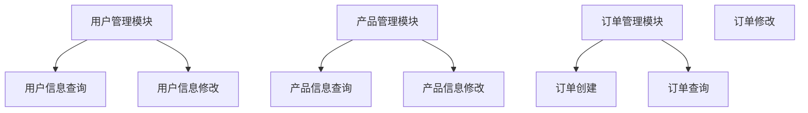
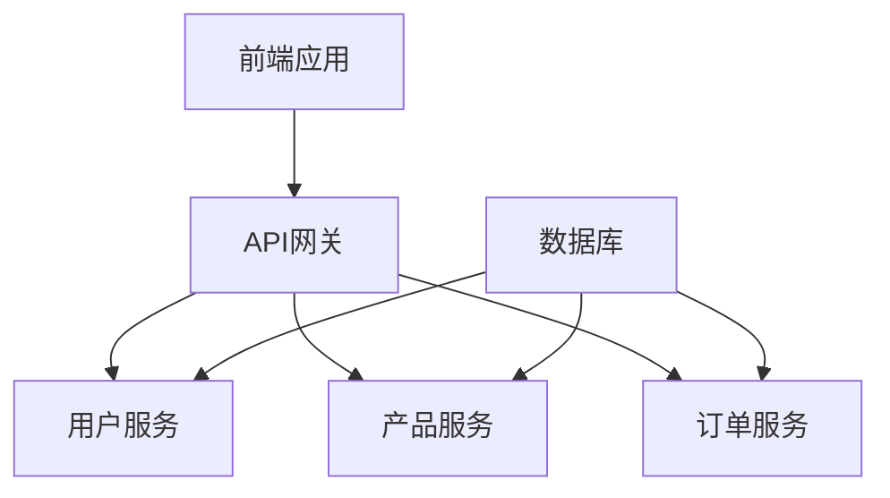
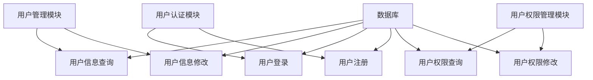
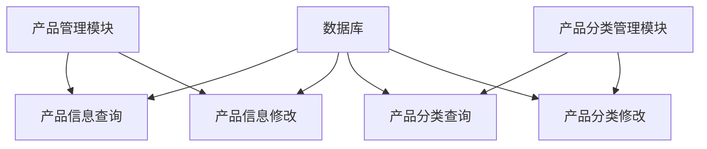
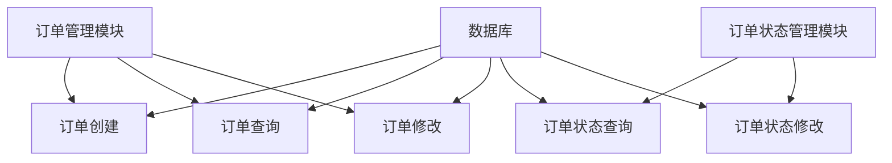
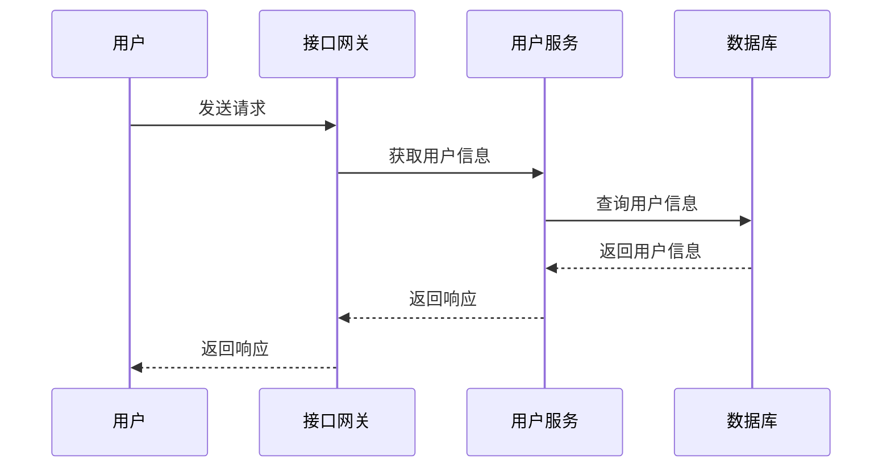

                 

### 第1章: 引言

#### 1.1 问题背景

**1.1.1 接口契约的定义与重要性**

接口契约（API Contract）是软件开发中用于描述和定义系统间接口行为的规范。它不仅定义了接口的输入和输出参数，还包括了数据格式、传输协议、错误处理机制等详细信息。接口契约在确保系统间数据交换的准确性和一致性方面起着至关重要的作用。现代软件系统通常由多个模块或服务组成，它们之间的交互依赖于明确的接口契约，这有助于减少错误、提高开发效率、降低维护成本。

**1.1.2 接口契约的现状与挑战**

随着微服务架构、云计算和API经济的兴起，接口契约的使用变得愈发普遍。然而，接口契约的现状并不乐观，存在以下一些挑战：

- **版本控制**：随着项目的迭代和更新，接口契约也需要不断调整和更新，但版本控制不当会导致不一致和冲突。
- **可读性**：接口契约的编写质量直接影响开发人员理解和使用契约的难度，复杂且冗长的契约容易引起误解。
- **维护性**：接口契约的维护成本较高，特别是在接口频繁变更的情况下，维护工作量大且容易出错。
- **自动化**：虽然部分工具可以帮助生成和验证接口契约，但自动化程度仍需提高，以减轻人工干预和错误。

#### 1.2 问题描述

**1.2.1 接口契约的常见问题**

- **契约定义不明确**：接口契约中的参数、返回值、错误处理等细节不够清晰，导致使用方无法正确实现接口。
- **契约变更频繁**：在项目迭代过程中，接口契约频繁变更，导致上下游系统需要不断适应新的契约。
- **契约不一致**：不同版本或不同团队编写的契约可能存在不一致，导致数据交换出错。
- **契约不完整**：部分契约未定义错误处理机制，或者在错误处理方面描述不够详尽。

**1.2.2 接口契约对系统开发的影响**

- **开发效率**：接口契约的不明确或错误会导致开发人员在实现接口时耗费大量时间进行调试和沟通。
- **系统稳定性**：不完善的接口契约可能导致系统在运行时出现数据不一致或错误，影响稳定性。
- **维护成本**：接口契约的维护需要耗费大量时间和资源，特别是在系统迭代频繁的情况下。

#### 1.3 问题解决

**1.3.1 接口契约的设计原则**

为了解决上述问题，接口契约的设计应遵循以下原则：

- **完整性**：确保契约包含所有必要的信息，无遗漏。
- **可读性**：使用清晰、简洁的语言和格式编写契约，提高可读性。
- **可维护性**：设计灵活、易于修改的契约，降低维护成本。
- **可扩展性**：考虑未来的扩展需求，使契约能够适应变化。

**1.3.2 接口契约的边界与外延**

接口契约的边界是指契约中明确定义的参数、返回值和错误处理等内容。外延则是指契约之外的其他相关信息，如契约的版本、发布者、生效日期等。明确边界与外延有助于确保契约的完整性和一致性。

#### 1.4 概念结构与核心要素

**1.4.1 接口契约的核心概念**

接口契约的核心概念包括：

- **接口定义**：接口的名称、输入参数、输出参数等。
- **数据格式**：输入参数和输出参数的数据类型、编码方式等。
- **传输协议**：接口通信所使用的协议，如HTTP、HTTPS、gRPC等。
- **错误处理**：接口在遇到错误时如何处理，包括错误码、错误消息等。

**1.4.2 接口契约的属性特征对比表**

| 属性特征 | 说明 |
| --- | --- |
| 完整性 | 确保契约包含所有必要信息 |
| 可读性 | 使用清晰、简洁的语言和格式 |
| 可维护性 | 设计灵活、易于修改的契约 |
| 可扩展性 | 考虑未来的扩展需求 |

**1.4.3 接口契约的ER实体关系图架构**

为了更好地理解接口契约的结构，可以使用ER（Entity-Relationship）实体关系图来描述接口契约中的核心实体及其关系。ER图包括实体、属性和关系三种基本元素。

#### 1.5 本章小结

本章介绍了接口契约的定义、重要性以及当前面临的主要问题。通过明确接口契约的设计原则和边界外延，我们可以提高接口契约的完整性、可读性、可维护性和可扩展性，从而提升系统开发的质量和效率。

### 第2章: 接口契约的设计方法

接口契约的设计是软件开发过程中至关重要的一环，它不仅决定了接口的实现和交互，还影响到整个系统的稳定性和可维护性。本章将详细讨论接口契约的设计方法，包括设计原则、设计流程、设计技巧和设计工具。

#### 2.1 设计原则

设计原则是指导接口契约设计的核心指导思想，它们确保契约的完整性和一致性，提高其可读性和可维护性。

**2.1.1 完整性**

完整性原则要求接口契约必须包含所有必要的信息，包括输入参数、输出参数、数据格式、传输协议、错误处理等。任何遗漏都可能导致接口使用方无法正确实现接口，从而引发各种问题。

**2.1.2 可读性**

可读性原则强调接口契约的编写应使用清晰、简洁的语言和格式，使开发人员能够轻松理解和使用契约。为了提高可读性，可以使用注释、格式化代码、明确的命名规范等。

**2.1.3 可维护性**

可维护性原则要求设计灵活、易于修改的契约，以便在接口变更时能够快速更新和调整。为了实现这一目标，可以使用版本控制、模块化设计等技术。

**2.1.4 可扩展性**

可扩展性原则要求接口契约在设计时考虑未来的扩展需求，使其能够适应新的功能和技术。这可以通过预留扩展点、使用抽象接口等方式实现。

#### 2.2 设计流程

设计流程是接口契约从需求分析到最终实现的系统化过程，包括以下几个阶段：

**2.2.1 需求分析**

需求分析是接口契约设计的起点，其目标是明确接口的需求和功能。需求分析阶段需要与业务部门、用户等各方进行深入沟通，了解系统的业务逻辑和用户需求。

**2.2.2 接口设计**

接口设计阶段是根据需求分析的结果，定义接口的具体细节。包括接口的名称、参数、数据格式、传输协议等。这一阶段可以使用工具如Swagger、Postman等来辅助设计。

**2.2.3 测试与评审**

测试与评审阶段是对接口契约的验证和评估。通过自动化测试、手动测试等方式，确保契约的正确性和可靠性。评审则是由相关团队对契约的完整性和合理性进行审查和反馈。

#### 2.3 设计技巧

设计技巧是提高接口契约设计质量的重要手段，包括以下几个方面：

**2.3.1 使用规范**

使用规范是指制定统一的接口命名、参数命名、数据格式等规范，以确保契约的一致性和可读性。

**2.3.2 避免常见问题**

在设计过程中，应避免常见的契约问题，如参数遗漏、数据格式不一致、错误处理不完善等。可以通过编写详细的文档、进行代码审查等方式来预防这些问题。

#### 2.4 设计工具

设计工具是辅助接口契约设计的利器，可以大大提高设计效率和准确性。以下是几种常用的设计工具：

**2.4.1 Swagger**

Swagger是一种流行的API设计工具，它允许开发人员使用YAML或JSON文件来描述接口契约。Swagger提供了丰富的注释和自动文档功能，方便开发人员理解和使用接口。

**2.4.2 Postman**

Postman是一款功能强大的API测试工具，它也支持接口契约的设计和文档化。Postman允许用户创建和运行测试，验证接口契约的正确性和性能。

**2.4.3 OpenAPI**

OpenAPI是一种API规范，它提供了统一的接口契约描述格式。OpenAPI规范不仅支持接口的描述，还包括了自动生成文档、测试等功能，是现代API设计的重要标准。

#### 2.5 本章小结

本章详细介绍了接口契约的设计方法，包括设计原则、设计流程、设计技巧和设计工具。通过遵循设计原则、按照设计流程、使用设计技巧和借助设计工具，我们可以设计出高质量、易于维护和扩展的接口契约，从而提高系统开发的质量和效率。

### 第3章: 接口契约的核心概念

接口契约在软件系统中的作用至关重要，它是系统间交互的桥梁，确保数据交换的准确性和一致性。为了深入理解接口契约的设计和实现，我们首先需要明确接口契约的核心概念。本章将详细探讨接口契约的定义、属性特征以及其与传统API的区别。

#### 3.1 接口契约的定义

**3.1.1 接口契约的基本概念**

接口契约（API Contract）是一种规范，用于描述和定义系统间的接口行为。它不仅包括了接口的输入和输出参数，还包括了数据格式、传输协议、错误处理机制等详细信息。接口契约的主要目标是确保不同系统之间能够准确、一致地交换数据，减少由于接口不明确或错误引起的开发问题和系统故障。

**3.1.2 接口契约与传统API的区别**

传统API（Application Programming Interface）是软件开发中用于实现模块或服务间交互的接口。与接口契约相比，传统API通常更注重接口的实现细节，而接口契约则更强调接口的规范和定义。

- **定义范围**：接口契约通常包含了更详细的信息，如输入参数的验证规则、输出结果的格式、错误处理机制等，而传统API通常只定义了接口的基本功能。
- **目的**：接口契约的主要目的是确保接口的正确性和一致性，减少由于接口变更引起的问题，而传统API则更多地关注于如何实现接口。
- **维护方式**：接口契约通常需要随着系统的变更进行更新，以确保其与实际接口的一致性，而传统API的变更和维护通常由开发者自行管理和调整。

#### 3.2 接口契约的属性特征

接口契约的属性特征是接口契约的重要组成部分，它们决定了接口契约的完整性和可用性。以下是接口契约的主要属性特征：

**3.2.1 输入参数**

输入参数是接口接收的数据，是接口实现功能的基础。接口契约需要详细定义输入参数的类型、名称、默认值、限制条件等。

- **类型**：输入参数的数据类型，如整数、字符串、布尔值等。
- **名称**：输入参数的名称，应具有描述性，易于理解。
- **默认值**：输入参数的默认值，用于在没有提供具体值时使用。
- **限制条件**：输入参数的限制条件，如长度、范围、正则表达式等。

**3.2.2 输出结果**

输出结果是接口执行后的返回值，是接口功能的直接体现。接口契约需要详细定义输出结果的数据类型、结构、格式、状态码等。

- **数据类型**：输出结果的数据类型，如JSON对象、字符串、布尔值等。
- **结构**：输出结果的结构，如键值对、列表等。
- **格式**：输出结果的格式，如日期格式、编码方式等。
- **状态码**：输出结果的状态码，如成功、失败等。

**3.2.3 响应状态码**

响应状态码是接口返回的结果状态，用于表示接口执行的最终结果。常见的响应状态码包括200（成功）、400（错误请求）、401（未授权）、500（服务器错误）等。

- **状态码**：响应状态码的值，如200、400等。
- **说明**：响应状态码的说明，如“成功”、“错误请求”等。

**3.2.4 错误处理**

错误处理是接口契约的重要组成部分，它定义了接口在遇到错误时如何处理。包括错误码、错误消息、重试机制等。

- **错误码**：表示错误类型的编码，如“40001”（参数错误）。
- **错误消息**：描述错误信息的字符串，如“参数错误：缺少参数”。
- **重试机制**：在接口遇到临时错误时，是否允许客户端重试接口调用。

#### 3.3 概念联系与扩展

接口契约不仅仅是接口的实现规范，它与系统架构和API设计密切相关。

**3.3.1 接口契约与API设计**

接口契约与API设计的关系密不可分。API设计决定了接口的功能和实现方式，而接口契约则定义了API的使用规范和交互细节。两者相辅相成，共同确保接口的正确性和一致性。

**3.3.2 接口契约与系统架构**

接口契约在系统架构中起着关键作用。它定义了不同系统模块之间的交互规则，确保系统能够高效、稳定地运行。良好的接口契约有助于模块解耦，提高系统的可扩展性和可维护性。

#### 3.4 本章小结

本章详细介绍了接口契约的核心概念，包括定义、属性特征和与传统API的区别。通过理解接口契约的基本概念和属性特征，我们可以更好地设计、实现和维护接口契约，确保系统间数据交换的准确性和一致性。

### 第4章: 接口契约的数学模型

接口契约的数学模型是接口契约设计中不可或缺的一部分，它通过数学公式和逻辑关系来描述接口的行为和约束。本章将介绍接口契约的数学模型，包括基本概念、公式推导以及举例说明。

#### 4.1 数学模型概述

**4.1.1 数学模型的基本概念**

数学模型是一种用数学语言描述现实世界的抽象模型，它通过数学公式和逻辑关系来描述系统的行为和特性。在接口契约设计中，数学模型用于定义接口的输入、输出、约束和错误处理等。

**4.1.2 数学模型在接口契约中的应用**

在接口契约中，数学模型主要用于描述以下内容：

- **输入验证**：使用数学公式验证输入参数是否符合预期范围。
- **输出格式**：使用数学公式定义输出结果的数据结构和格式。
- **错误处理**：使用数学公式描述错误码和错误消息。

#### 4.2 数学公式与公式推导

**4.2.1 基本数学公式**

接口契约中的基本数学公式通常包括以下几种：

- **输入验证公式**：用于验证输入参数是否在指定范围内。
  $$ input_value \in [min_value, max_value] $$
- **输出格式公式**：用于定义输出结果的数据结构和格式。
  $$ output_format = {field1: type1, field2: type2, ...} $$
- **错误处理公式**：用于描述错误码和错误消息。
  $$ error_code = {error_type: message} $$

**4.2.2 接口契约中的数学模型推导**

接口契约的数学模型推导通常涉及以下步骤：

1. **需求分析**：明确接口的需求和功能，定义输入参数和输出结果。
2. **公式定义**：根据需求分析结果，定义输入验证公式、输出格式公式和错误处理公式。
3. **公式验证**：验证公式是否符合接口契约的要求，确保输入验证、输出格式和错误处理正确。

#### 4.3 举例说明

**4.3.1 简单接口契约的数学模型**

假设一个简单的接口契约，用于获取用户的个人信息，输入参数为用户ID，输出结果为用户名和邮箱。

- **输入验证公式**：
  $$ user_id \in [1, 1000000] $$

- **输出格式公式**：
  $$ output_format = {username: string, email: string} $$

- **错误处理公式**：
  $$ error_code = {404: "User not found", 500: "Internal server error"} $$

**4.3.2 复杂接口契约的数学模型**

假设一个复杂的接口契约，用于创建订单，输入参数包括用户ID、商品ID、数量等，输出结果为订单号和订单状态。

- **输入验证公式**：
  $$ user_id \in [1, 1000000] $$
  $$ product_id \in [1, 10000] $$
  $$ quantity \in [1, 100] $$

- **输出格式公式**：
  $$ output_format = {order_id: integer, order_status: string} $$

- **错误处理公式**：
  $$ error_code = {400: "Invalid input", 404: "Product not found", 500: "Internal server error"} $$

#### 4.4 本章小结

本章介绍了接口契约的数学模型，包括基本概念、公式推导和举例说明。通过使用数学模型，我们可以更准确、清晰地定义接口契约的行为和约束，提高接口契约的准确性和一致性，从而提高系统开发的效率和稳定性。

### 第5章: 接口契约的系统分析与架构设计

接口契约作为软件系统的重要组成部分，其设计与实现不仅影响接口本身的稳定性与可靠性，还对整个系统的性能和可维护性产生深远影响。本章将深入探讨接口契约在企业系统中的应用、对系统性能的影响、项目背景与目标、系统功能设计、系统架构设计和系统接口设计，并分析系统交互的细节。

#### 5.1 问题场景介绍

**5.1.1 接口契约在企业系统中的应用**

在现代企业系统中，接口契约广泛应用于不同业务模块之间的交互。以下是一些典型应用场景：

- **跨模块集成**：企业系统通常由多个模块组成，接口契约确保这些模块能够无缝集成，数据交换准确无误。
- **前后端分离**：前端和后端系统通过接口契约进行数据交换，前端通过API调用获取后端数据，实现动态交互。
- **第三方服务集成**：企业系统需要集成第三方服务，如支付、短信等，接口契约定义了与第三方服务的交互规范。
- **微服务架构**：在微服务架构中，接口契约定义了各个微服务之间的通信规则，确保系统的高可用性和可扩展性。

**5.1.2 接口契约对系统性能的影响**

接口契约对系统性能有重要影响，主要包括以下几个方面：

- **响应时间**：良好的接口契约能够减少接口调用的复杂度，提高系统响应速度。
- **负载均衡**：接口契约的设计需要考虑系统的负载均衡能力，确保在高并发情况下系统的稳定性。
- **缓存机制**：接口契约的设计需要支持缓存机制，减少重复数据的查询和计算，提高系统性能。
- **数据一致性**：接口契约需要确保数据的一致性，减少由于数据不一致导致的问题。

#### 5.2 项目介绍

**5.2.1 项目背景**

本项目旨在为企业系统设计一套高效、稳定的接口契约，提高系统的集成能力、性能和可维护性。项目背景包括：

- **业务需求**：随着企业业务的不断扩展，对系统的集成能力和性能提出了更高要求。
- **技术挑战**：现有的接口契约存在版本控制困难、维护成本高、不一致性等问题，影响了系统的稳定性和可维护性。

**5.2.2 项目目标**

本项目的主要目标包括：

- **提高接口契约的完整性和一致性**：确保接口契约包含所有必要信息，各版本之间保持一致。
- **提升系统性能**：通过优化接口契约，减少响应时间，提高系统在高并发情况下的稳定性。
- **降低维护成本**：设计灵活、易于维护的接口契约，降低系统维护的难度和成本。

#### 5.3 系统功能设计

系统功能设计是接口契约设计的核心环节，主要包括领域模型和功能模块划分。

**5.3.1 领域模型**

领域模型是对系统业务领域进行抽象和建模，用于描述系统的核心业务和功能。以下是一个简单的领域模型示例：

```mermaid
classDiagram
    User <<Entity>>
    Product <<Entity>>
    Order <<Entity>>

    User *--* Product: belongs_to
    User *--* Order: has_many
    Product *--* Order: belongs_to
    Order *--* User: has_one
endclass
```

在这个领域模型中，`User`、`Product`和`Order`是核心实体，它们之间的关系包括：

- `User`属于`Product`和`Order`，表示用户可以拥有产品和创建订单。
- `Product`属于`Order`，表示产品是订单的一部分。
- `Order`拥有`User`，表示订单由用户创建。

**5.3.2 功能模块划分**

功能模块划分是系统功能设计的具体实现，用于将系统功能划分为不同的模块，便于开发和维护。以下是一个简单的功能模块划分示例：



在这个功能模块划分中，包括以下模块：

- **用户管理模块**：包括用户信息查询和修改功能。
- **产品管理模块**：包括产品信息查询和修改功能。
- **订单管理模块**：包括订单创建、查询和修改功能。

#### 5.4 系统架构设计

系统架构设计是接口契约设计的重要组成部分，用于描述系统的总体架构和各个子系统的关系。

**5.4.1 总体架构**

以下是一个简单的系统总体架构示例：



在这个总体架构中，包括以下组件：

- **前端应用**：用户通过前端应用与系统进行交互。
- **API网关**：接收前端请求，进行路由和鉴权，然后转发到对应的服务。
- **用户服务**：处理用户相关的接口请求。
- **产品服务**：处理产品相关的接口请求。
- **订单服务**：处理订单相关的接口请求。
- **数据库**：存储用户、产品和订单等数据。

**5.4.2 子系统架构**

以下是用户服务、产品服务和订单服务的子系统架构示例：

**用户服务子系统架构：**



**产品服务子系统架构：**



**订单服务子系统架构：**



#### 5.5 系统接口设计

系统接口设计是接口契约的具体实现，用于定义系统的各个模块和子系统之间的交互接口。

**5.5.1 接口规范**

以下是一个简单的接口规范示例：

```json
{
  "version": "1.0",
  "description": "用户管理接口规范",
  "endpoints": [
    {
      "path": "/users/{userId}",
      "method": "GET",
      "summary": "获取用户信息",
      "parameters": [
        {
          "name": "userId",
          "in": "path",
          "type": "integer",
          "description": "用户ID"
        }
      ],
      "responses": {
        "200": {
          "description": "成功响应",
          "content": {
            "application/json": {
              "schema": {
                "type": "object",
                "properties": {
                  "username": {
                    "type": "string"
                  },
                  "email": {
                    "type": "string"
                  }
                }
              }
            }
          }
        },
        "404": {
          "description": "用户未找到"
        }
      }
    }
  ]
}
```

在这个接口规范中，定义了一个获取用户信息的接口，包括路径、HTTP方法、参数、响应等。

**5.5.2 接口定义**

以下是一个简单的接口定义示例：

```python
from flask import Flask, request, jsonify

app = Flask(__name__)

@app.route('/users/<int:userId>', methods=['GET'])
def get_user(userId):
    user = find_user_by_id(userId)
    if user:
        return jsonify(user)
    else:
        return jsonify({"error": "User not found"}), 404

def find_user_by_id(userId):
    # 查询数据库获取用户信息
    pass

if __name__ == '__main__':
    app.run(debug=True)
```

在这个接口定义中，使用了Flask框架定义了一个简单的获取用户信息的接口。

#### 5.6 系统交互

系统交互是系统各个模块和子系统之间进行数据交换和通信的过程。以下是一个简单的系统交互示例：

**5.6.1 序列图**



在这个序列图中，用户发送请求到接口网关，接口网关将请求转发到用户服务，用户服务查询数据库获取用户信息，然后将结果返回给接口网关，最后接口网关将响应返回给用户。

#### 5.7 本章小结

本章详细介绍了接口契约在企业系统中的应用、对系统性能的影响、项目背景与目标、系统功能设计、系统架构设计和系统接口设计，并分析了系统交互的细节。通过这些内容的讨论，我们可以更好地理解和实现接口契约，提高系统的性能和可维护性。

### 第6章: 项目实战

#### 6.1 环境安装

在开始接口契约的项目实战之前，我们需要搭建合适的开发环境，安装必要的工具和软件。以下是具体的安装步骤和工具介绍。

**6.1.1 开发环境搭建**

1. **安装Python环境**：

   Python是接口契约项目开发的主要编程语言。首先，确保您的计算机上安装了Python环境。可以从Python的官方网站下载最新版本的Python安装包，然后按照提示完成安装。

2. **安装IDE**：

   为了提高开发效率和代码质量，推荐使用集成开发环境（IDE）。PyCharm、Visual Studio Code等都是不错的选择。下载并安装适合您操作的IDE。

3. **安装相关库和依赖**：

   使用pip命令安装项目中需要的库和依赖。例如，安装Flask库用于创建Web接口：

   ```shell
   pip install flask
   ```

**6.1.2 工具安装**

1. **安装Swagger**：

   Swagger是一个用于生成、测试和文档化API的强大工具。您可以从Swagger的官方网站下载安装包，然后按照提示完成安装。

2. **安装Postman**：

   Postman是一个功能丰富的API测试工具，可以帮助您验证接口契约的正确性和性能。您可以从Postman的官方网站下载安装包，并按照提示完成安装。

3. **安装OpenAPI Generator**：

   OpenAPI Generator可以帮助您生成符合OpenAPI规范的接口契约文档。您可以从OpenAPI Generator的官方网站下载安装包，并按照提示完成安装。

#### 6.2 系统核心实现

**6.2.1 接口契约的设计与实现**

1. **需求分析**：

   在进行接口契约的设计和实现之前，我们需要明确项目的需求。例如，本项目中需要实现一个用户管理系统，包括用户注册、登录、查询用户信息等功能。

2. **接口设计**：

   使用Swagger或OpenAPI Generator等工具设计接口契约。以下是一个简单的用户注册接口的Swagger定义示例：

   ```yaml
   paths:
     /users/register:
       post:
         summary: 用户注册
         requestBody:
           required: true
           content:
             application/json:
               schema:
                 $ref: '#/components/schemas/User'
         responses:
           '200':
             description: 注册成功
           '400':
             description: 参数错误
   components:
     schemas:
       User:
         type: object
         properties:
           username:
             type: string
           password:
             type: string
           email:
             type: string
   ```

3. **接口实现**：

   使用Python和Flask框架实现接口契约。以下是一个简单的用户注册接口的实现示例：

   ```python
   from flask import Flask, request, jsonify

   app = Flask(__name__)

   users = {}

   @app.route('/users/register', methods=['POST'])
   def register_user():
       data = request.json
       username = data.get('username')
       password = data.get('password')
       email = data.get('email')

       if not username or not password or not email:
           return jsonify({"error": "缺失必要参数"}), 400

       if username in users:
           return jsonify({"error": "用户已存在"}), 400

       users[username] = {"password": password, "email": email}
       return jsonify({"message": "注册成功"}), 200

   if __name__ == '__main__':
       app.run(debug=True)
   ```

**6.2.2 测试与验证**

1. **使用Postman进行测试**：

   安装Postman后，可以使用它来测试接口契约的正确性和性能。以下是如何使用Postman测试用户注册接口的步骤：

   - 打开Postman，创建一个新的请求。
   - 设置请求的URL为`/users/register`，HTTP方法为POST。
   - 在请求体中填写用户名、密码和邮箱等信息，然后发送请求。
   - 查看响应结果，验证接口是否按照预期工作。

2. **使用Swagger进行测试**：

   使用Swagger生成接口契约文档后，可以通过Swagger UI查看和测试接口。以下是如何使用Swagger UI测试用户注册接口的步骤：

   - 打开Swagger UI页面，找到用户注册接口。
   - 在接口定义区域填写用户名、密码和邮箱等信息。
   - 点击“Try it out”按钮发送请求。
   - 查看响应结果，验证接口是否按照预期工作。

#### 6.3 代码应用解读与分析

**6.3.1 源代码解析**

在上面的用户注册接口实现中，我们使用了Flask框架和Python语言。以下是源代码的详细解析：

```python
from flask import Flask, request, jsonify

app = Flask(__name__)

users = {}

@app.route('/users/register', methods=['POST'])
def register_user():
    data = request.json
    username = data.get('username')
    password = data.get('password')
    email = data.get('email')

    if not username or not password or not email:
        return jsonify({"error": "缺失必要参数"}), 400

    if username in users:
        return jsonify({"error": "用户已存在"}), 400

    users[username] = {"password": password, "email": email}
    return jsonify({"message": "注册成功"}), 200
```

- **导入模块**：首先导入Flask、request和jsonify模块，用于创建Web应用、处理HTTP请求和生成JSON响应。
- **创建Flask应用**：使用Flask类创建一个Web应用对象。
- **存储用户信息**：使用一个字典`users`存储用户的用户名和相关信息。
- **定义路由和视图函数**：使用`@app.route`装饰器定义路由，`register_user`函数是处理注册请求的视图函数。
- **获取请求体数据**：使用`request.json`获取请求体中的JSON数据。
- **验证参数**：检查用户名、密码和邮箱参数是否齐全。
- **存储用户信息**：如果用户名不存在，将用户信息存储在`users`字典中。
- **返回响应**：根据不同情况返回JSON响应和相应的状态码。

**6.3.2 应用场景分析**

在实际应用中，用户注册接口需要考虑更多的业务逻辑和安全问题。以下是一些可能的应用场景：

1. **密码加密存储**：

   为了保护用户密码的安全，建议在存储前对密码进行加密处理。可以使用哈希函数（如SHA-256）对密码进行加密。

2. **邮箱验证**：

   在用户注册时，可以通过发送验证邮件来验证用户的邮箱地址，确保用户注册的真实性。

3. **错误处理**：

   接口应提供详细的错误处理机制，如参数错误、服务器错误等，以便于客户端正确处理异常。

4. **日志记录**：

   为了方便问题的追踪和调试，建议在接口实现中记录日志信息。

#### 6.4 实际案例分析与详细讲解

**6.4.1 案例介绍**

本案例为一个在线购物平台中的用户注册接口。用户可以通过接口注册账号，并使用账号登录系统。以下是案例的核心要求：

- 支持用户名、密码和邮箱注册。
- 用户名必须是唯一且不可重复。
- 密码需要至少包含6位字符，且至少包含一个数字和一个字母。
- 注册成功后，系统会发送一封验证邮件到用户邮箱，用户需点击链接完成验证。

**6.4.2 案例剖析**

1. **需求分析**：

   在进行接口设计之前，需要对业务需求进行分析。本案例的需求包括：

   - 用户注册接口：接收用户名、密码和邮箱等参数，进行验证并存储。
   - 邮箱验证接口：发送验证邮件，接收邮件验证链接，完成邮箱验证。
   - 用户登录接口：验证用户名和密码，返回登录状态。

2. **接口设计**：

   使用Swagger设计用户注册接口，以下是一个简单的接口定义：

   ```yaml
   paths:
     /users/register:
       post:
         summary: 用户注册
         requestBody:
           required: true
           content:
             application/json:
               schema:
                 $ref: '#/components/schemas/User'
         responses:
           '200':
             description: 注册成功
           '400':
             description: 参数错误
           '409':
             description: 用户已存在
           '500':
             description: 内部服务器错误
   components:
     schemas:
       User:
         type: object
         properties:
           username:
             type: string
             description: 用户名
           password:
             type: string
             description: 密码
           email:
             type: string
             description: 邮箱
   ```

3. **接口实现**：

   使用Python和Flask实现用户注册接口。以下是核心代码实现：

   ```python
   from flask import Flask, request, jsonify
   import re
   import hashlib

   app = Flask(__name__)

   users = {}

   def is_password_valid(password):
       pattern = r'^(?=.*[0-9])(?=.*[a-zA-Z])[a-zA-Z0-9]{6,}$'
       return re.match(pattern, password)

   @app.route('/users/register', methods=['POST'])
   def register_user():
       data = request.json
       username = data.get('username')
       password = data.get('password')
       email = data.get('email')

       if not username or not password or not email:
           return jsonify({"error": "缺失必要参数"}), 400

       if username in users:
           return jsonify({"error": "用户已存在"}), 409

       if not is_password_valid(password):
           return jsonify({"error": "密码格式错误"}), 400

       hashed_password = hashlib.sha256(password.encode()).hexdigest()
       users[username] = {"password": hashed_password, "email": email}
       send_verification_email(email)
       return jsonify({"message": "注册成功，请检查邮箱进行验证。"}), 200

   def send_verification_email(email):
       # 发送验证邮件的实现代码
       pass

   if __name__ == '__main__':
       app.run(debug=True)
   ```

   在此实现中，增加了密码验证和密码加密存储的功能。密码验证使用正则表达式检查密码是否符合要求，密码加密使用SHA-256哈希函数进行加密存储。

4. **测试与验证**：

   使用Postman测试用户注册接口，以下是测试步骤：

   - 创建一个新的请求，设置URL为`/users/register`，HTTP方法为POST。
   - 在请求体中填写用户名、密码和邮箱等信息，例如：
     ```json
     {
       "username": "testuser",
       "password": "test1234",
       "email": "testuser@example.com"
     }
     ```
   - 发送请求，查看响应结果。如果注册成功，服务器将返回相应的响应：
     ```json
     {
       "message": "注册成功，请检查邮箱进行验证。"
     }
     ```
   - 检查邮箱，找到验证邮件并点击验证链接，完成邮箱验证。

**6.4.3 案例总结**

通过本案例的分析和实现，我们了解了如何设计并实现一个用户注册接口。关键点包括：

- **需求分析**：明确业务需求和接口功能。
- **接口设计**：使用工具如Swagger定义接口契约。
- **接口实现**：使用合适的编程语言和框架实现接口。
- **测试与验证**：使用工具如Postman验证接口的正确性和性能。

通过这些步骤，我们可以设计并实现高质量、安全且易用的接口契约，为系统开发奠定坚实基础。

#### 6.5 项目小结

在本项目中，我们深入探讨了接口契约的设计与实现，从环境安装、系统核心实现、代码应用解读与分析，到实际案例的详细讲解，全面介绍了接口契约的实践过程。通过本项目的实施，我们不仅提高了对接口契约的理解，还掌握了如何设计和实现接口契约的技能。

**6.5.1 项目收获**

- **提高了对接口契约的理解**：通过项目的实际操作，我们深入了解了接口契约的核心概念、设计原则、设计方法以及系统分析与架构设计。
- **掌握了接口契约的实现技巧**：通过Python和Flask框架，我们学会了如何使用实际代码实现接口契约，并了解了接口测试与验证的方法。
- **积累了实际项目经验**：通过实际案例的分析与实现，我们了解了如何将接口契约应用于真实业务场景，并解决实际问题。

**6.5.2 项目改进方向**

- **优化接口性能**：在实际应用中，我们应进一步优化接口的性能，提高系统的响应速度和处理能力。
- **加强安全性**：在接口契约的设计和实现过程中，应加强安全性措施，如密码加密存储、接口鉴权等。
- **提升可维护性**：通过模块化设计和文档化，提高接口契约的可维护性，降低维护成本。
- **完善错误处理机制**：在接口契约中，应完善错误处理机制，提供详细的错误信息和处理建议，提高系统的稳定性。

通过不断改进和优化，我们可以使接口契约在系统开发中发挥更大的作用，提高系统的性能和可维护性。

### 最佳实践 tips

在接口契约的设计和实现过程中，以下最佳实践可以帮助提高契约的质量和系统的稳定性：

1. **清晰定义接口规范**：确保接口契约包含所有必要的信息，如输入参数、输出结果、错误处理等，避免出现遗漏和不一致。
2. **使用自动化工具**：利用Swagger、Postman等自动化工具进行接口设计和测试，提高开发效率和准确性。
3. **版本控制**：使用版本控制系统（如Git）管理接口契约，确保不同版本之间的兼容性和一致性。
4. **注释和文档**：为接口契约添加详细注释，并在项目中提供清晰的文档，帮助开发人员理解和使用契约。
5. **定期审查**：定期对接口契约进行审查，确保其与实际接口的一致性，及时发现和解决问题。
6. **安全性措施**：在接口契约中实施安全性措施，如接口鉴权、数据加密等，保护系统的安全。
7. **模块化设计**：采用模块化设计，将接口契约划分为不同的模块，便于维护和扩展。

通过遵循这些最佳实践，我们可以设计出高质量、安全且易于维护的接口契约，为系统开发提供有力支持。

### 小结

本文全面介绍了接口契约的设计与实现方法，从定义、设计原则、设计流程、设计技巧到设计工具，再到系统分析与架构设计，以及项目实战。通过本文的阐述，我们深入理解了接口契约在系统开发中的重要性，掌握了接口契约的设计和实现技能，并明确了接口契约的最佳实践。接口契约不仅是系统间数据交换的桥梁，也是保障系统稳定性和可维护性的关键因素。希望通过本文，读者能够提高对接口契约的认识，并在实际项目中有效应用。

### 注意事项

在设计和实现接口契约时，需要注意以下几点：

1. **准确性**：确保接口契约的描述准确无误，避免由于契约描述不准确导致的问题。
2. **一致性**：保持接口契约的一致性，避免不同版本或不同团队编写的契约存在不一致。
3. **可读性**：使用清晰、简洁的语言和格式编写契约，提高可读性。
4. **可维护性**：设计灵活、易于修改的契约，降低维护成本。
5. **安全性**：在接口契约中实施安全性措施，如接口鉴权、数据加密等，保护系统的安全。
6. **版本控制**：使用版本控制系统管理接口契约，确保版本控制得当。

通过遵循这些注意事项，我们可以提高接口契约的质量和系统的稳定性。

### 拓展阅读

为了更深入地理解接口契约的设计与实现，以下是一些推荐阅读的书籍和资源：

1. **书籍**：

   - 《RESTful API 设计最佳实践》
   - 《API 设计指南》
   - 《微服务架构设计》

2. **在线资源**：

   - Swagger官网：[https://swagger.io/](https://swagger.io/)
   - Postman官网：[https://www.postman.com/](https://www.postman.com/)
   - OpenAPI Generator官网：[https://openapi-generator.tech/](https://openapi-generator.tech/)

3. **社区和论坛**：

   - Stack Overflow
   - GitHub
   - Reddit

通过阅读这些书籍和资源，您可以进一步拓展对接口契约的理解，提升设计能力。

### 作者信息

作者：AI天才研究院/AI Genius Institute & 禅与计算机程序设计艺术 /Zen And The Art of Computer Programming

