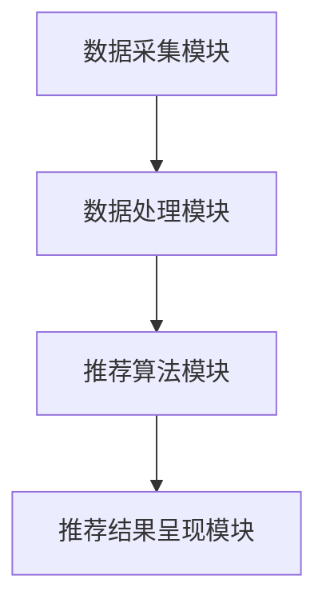
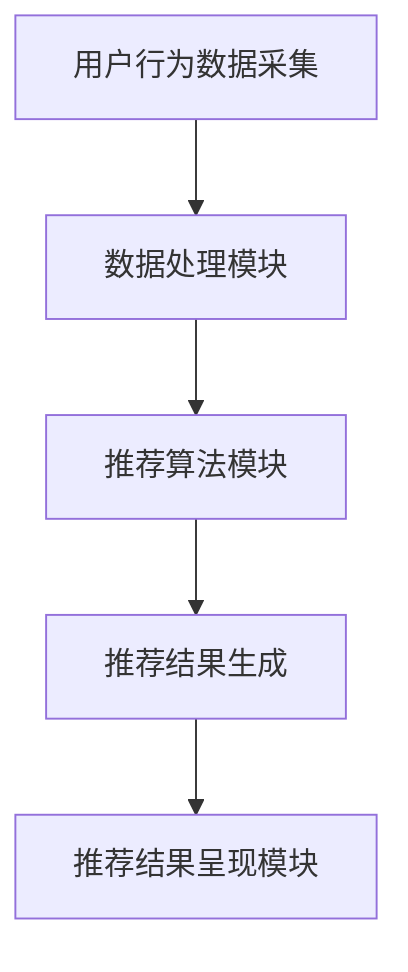

                 

### 第1章：推荐系统概述

#### 1.1 问题背景

**1.1.1 个性化服务的需求**

在互联网高速发展的今天，用户对个性化服务的需求日益增长。个性化推荐系统通过分析用户的兴趣和行为，为用户提供个性化的信息和服务，满足用户的需求。这种需求来源于信息过载的时代，用户希望在海量信息中快速找到自己感兴趣的内容。

**1.1.2 推荐系统的定义与作用**

推荐系统是一种信息过滤技术，通过对用户兴趣的理解和物品特征的挖掘，向用户推荐其可能感兴趣的内容。其作用在于提高用户的满意度，提升用户参与度，从而为企业和平台带来商业价值。

**1.1.3 推荐系统的历史与发展趋势**

推荐系统起源于20世纪90年代的电子商务领域，最初以协同过滤算法为主。随着互联网的发展，推荐系统逐渐应用于更多领域，如社交媒体、新闻资讯、在线视频等。未来，推荐系统将更加智能化、个性化，利用深度学习等技术实现更高的推荐效果。

#### 1.2 问题描述与解决

**1.2.1 推荐问题本质**

推荐问题的本质是预测用户对某一物品的偏好，从而为用户推荐感兴趣的内容。这个过程需要解决两个关键问题：一是用户兴趣建模，二是物品特征提取。

**1.2.2 推荐系统的挑战**

推荐系统的挑战主要包括数据噪声、稀疏性、实时性等。数据噪声会导致推荐结果不准确，稀疏性使得协同过滤算法效果受限，实时性要求推荐系统能够快速响应用户行为。

**1.2.3 推荐系统的价值**

推荐系统的价值在于提高用户满意度，提升用户体验，从而为企业和平台带来商业价值。例如，电商平台通过推荐系统提高转化率，社交媒体平台通过推荐系统增加用户活跃度。

#### 1.3 边界与外延

**1.3.1 推荐系统的适用场景**

推荐系统适用于各种需要个性化推荐的场景，如电子商务、社交媒体、新闻资讯、在线视频等。

**1.3.2 推荐系统的分类**

推荐系统主要分为基于内容的推荐、协同过滤推荐和混合推荐等类型。每种类型都有其适用的场景和特点。

**1.3.3 推荐系统的核心要素**

推荐系统的核心要素包括用户行为分析、物品特征提取和推荐算法。这些要素相互作用，共同实现个性化推荐。

#### 1.4 概念结构与核心要素组成

**1.4.1 用户行为分析**

用户行为分析是指通过分析用户的历史行为，如点击、购买、评论等，来了解用户的兴趣和偏好。

**1.4.2 商品或内容属性**

商品或内容属性是指物品的各类特征，如价格、品牌、类别、内容标签等。这些属性用于描述物品，帮助推荐算法进行特征提取。

**1.4.3 推荐算法**

推荐算法是指用于预测用户偏好并生成推荐结果的算法。常见的推荐算法包括协同过滤、基于内容的推荐和混合推荐等。

**1.4.4 推荐结果评估**

推荐结果评估是指对推荐结果的有效性进行评估，常用的评估指标包括准确率、召回率、F1值等。

#### 1.5 本章小结

本章对推荐系统进行了全面的概述，介绍了问题背景、定义与作用、问题描述与解决、边界与外延以及概念结构与核心要素组成。这些内容为后续章节的深入探讨奠定了基础。

### 第2章：协同过滤算法

协同过滤算法是推荐系统中最常用的算法之一，其核心思想是通过用户之间的相似性来预测用户对未知物品的偏好。本章将详细介绍协同过滤算法的基本概念、用户基协同过滤和项目介绍等内容。

#### 2.1 协同过滤概述

**2.1.1 协同过滤的基本概念**

协同过滤（Collaborative Filtering）是一种通过分析用户行为数据来预测用户偏好，进而实现个性化推荐的方法。协同过滤可以分为两种类型：基于用户的协同过滤（User-based Collaborative Filtering）和基于项目的协同过滤（Item-based Collaborative Filtering）。

**2.1.2 协同过滤的优点与不足**

协同过滤的优点在于其简单易实现，且在处理稀疏数据集时效果较好。但其不足之处在于容易受到数据噪声的影响，且在预测新用户或新物品时效果较差。

#### 2.2 用户基协同过滤

**2.2.1 基于用户的最近邻算法**

基于用户的最近邻算法（User-based K-Nearest Neighbors，UBKNN）是协同过滤算法中最简单的一种。该算法的核心思想是找到与目标用户最相似的K个用户，然后根据这K个用户的偏好来预测目标用户对未知物品的偏好。

**2.2.2 基于用户的K-means聚类算法**

基于用户的K-means聚类算法（User-based K-means Clustering）是另一种常用的用户基协同过滤算法。该算法首先将用户分为若干个聚类，然后针对每个聚类内部进行协同过滤。

#### 2.3 项目介绍

**2.3.1 协同过滤系统功能设计**

协同过滤系统主要包括用户注册、登录、物品注册、评分预测和推荐结果生成等功能。

**2.3.2 协同过滤系统架构设计**

协同过滤系统架构设计主要包括数据存储模块、用户行为分析模块、推荐算法模块和推荐结果呈现模块。

#### 2.4 算法实现与优化

**2.4.1 算法原理与流程**

协同过滤算法的实现主要包括用户相似度计算、评分预测和推荐结果生成等步骤。

**2.4.2 算法优化策略**

算法优化策略包括数据预处理、相似度度量优化、评分预测优化和推荐结果优化等。

#### 2.5 系统分析与架构设计方案

**2.5.1 问题场景介绍**

以电商平台的推荐系统为例，介绍协同过滤算法的应用场景和问题场景。

**2.5.2 系统功能设计**

系统功能设计主要包括用户行为分析、物品特征提取、评分预测和推荐结果生成等模块。

**2.5.3 系统架构设计**

系统架构设计主要包括数据存储、用户行为分析、推荐算法和推荐结果呈现等模块的架构设计。

**2.5.4 系统接口设计**

系统接口设计主要包括用户注册、登录、物品注册、评分预测和推荐结果生成等接口的设计和实现。

**2.5.5 系统交互设计**

系统交互设计主要包括用户行为分析、物品特征提取、评分预测和推荐结果生成等模块之间的交互设计。

#### 2.6 项目实战

**2.6.1 环境安装**

介绍协同过滤系统的环境搭建和安装过程。

**2.6.2 系统核心实现源代码**

提供协同过滤系统的核心实现源代码，并进行解读和分析。

**2.6.3 代码应用解读与分析**

对协同过滤系统的代码进行详细解读和分析，阐述算法原理和实现细节。

**2.6.4 实际案例分析与讲解**

通过实际案例分析，介绍协同过滤算法在实际应用中的效果和优化方法。

**2.6.5 项目小结**

对协同过滤系统的项目进行总结和评价，提出改进建议。

#### 2.7 最佳实践与拓展阅读

**2.7.1 协同过滤算法的最佳实践**

介绍协同过滤算法在实际应用中的最佳实践，包括数据预处理、相似度度量、评分预测和推荐结果优化等方面的实践经验。

**2.7.2 注意事项**

在应用协同过滤算法时，需要注意的一些问题和注意事项。

**2.7.3 拓展阅读资源**

推荐一些关于协同过滤算法的拓展阅读资源，包括相关书籍、论文和在线课程等。

#### 2.8 小结

本章对协同过滤算法进行了详细阐述，包括基本概念、用户基协同过滤、项目介绍、算法实现与优化、系统分析与架构设计方案、项目实战和最佳实践等内容。通过本章的学习，读者可以掌握协同过滤算法的核心原理和应用方法。

### 第3章：基于内容的推荐算法

基于内容的推荐算法（Content-Based Recommendation）是一种利用物品特征信息进行推荐的方法。本章将介绍基于内容的推荐算法的基本概念、工作原理、应用场景和实现方法。

#### 3.1 基本概念

**3.1.1 内容推荐的定义**

内容推荐是指根据用户对物品的兴趣特征，将相似的物品推荐给用户，从而提高用户满意度和参与度。

**3.1.2 内容推荐的特点**

内容推荐的特点包括：
- **基于物品特征**：内容推荐依赖于物品的内容属性，如文本、图像、声音等。
- **个性化**：通过分析用户的兴趣和行为，为用户提供个性化的推荐。
- **实时性**：内容推荐算法可以实时响应用户的兴趣变化。

#### 3.2 工作原理

**3.2.1 用户兴趣建模**

用户兴趣建模是内容推荐的关键步骤。通过分析用户的历史行为数据，如浏览、搜索、收藏等，提取用户的兴趣特征。

**3.2.2 物品特征提取**

物品特征提取是指从物品的内容中提取关键特征，如文本中的关键词、图像中的颜色、纹理等。

**3.2.3 相似度计算**

相似度计算是指通过计算用户兴趣特征与物品特征之间的相似度，筛选出最相似的物品。

**3.2.4 推荐生成**

根据相似度计算结果，生成推荐列表，将最相似的物品推荐给用户。

#### 3.3 应用场景

**3.3.1 社交媒体**

社交媒体平台可以通过内容推荐，将用户可能感兴趣的朋友、内容、话题推荐给用户，提高用户活跃度。

**3.3.2 新闻资讯**

新闻推荐系统可以根据用户的阅读习惯，将用户可能感兴趣的新闻推荐给用户，提高用户粘性。

**3.3.3 在线视频**

在线视频平台可以通过内容推荐，将用户可能感兴趣的视频推荐给用户，提高用户观看时长和平台收入。

**3.3.4 电子商务**

电子商务平台可以通过内容推荐，将用户可能感兴趣的商品推荐给用户，提高转化率和销售额。

#### 3.4 实现方法

**3.4.1 文本匹配**

文本匹配是内容推荐中最常用的方法之一。通过计算用户兴趣文本与物品文本之间的相似度，筛选出最相似的物品。

**3.4.2 文本分类**

文本分类是一种基于机器学习的方法，通过训练模型，将用户兴趣文本分类到不同的类别，然后为用户推荐属于同一类别的物品。

**3.4.3 图像识别**

图像识别是一种基于深度学习的方法，通过训练模型，识别图像中的关键特征，如颜色、纹理等，然后为用户推荐具有相似特征的物品。

**3.4.4 多媒体内容融合**

多媒体内容融合是将多种内容特征进行融合，提高推荐系统的准确性和多样性。

#### 3.5 项目实战

**3.5.1 环境搭建**

介绍内容推荐系统的环境搭建，包括开发工具、数据库和环境配置等。

**3.5.2 用户兴趣建模**

通过用户历史行为数据，建立用户兴趣模型，提取用户兴趣特征。

**3.5.3 物品特征提取**

从物品的内容中提取关键特征，如文本、图像、声音等。

**3.5.4 相似度计算与推荐生成**

实现相似度计算和推荐生成，生成用户感兴趣的内容推荐列表。

**3.5.5 实际案例分析**

通过实际案例分析，展示内容推荐系统的应用效果和优化方法。

**3.5.6 项目小结**

对内容推荐系统的项目进行总结和评价，提出改进建议。

#### 3.6 拓展阅读

**3.6.1 相关书籍**

- 《推荐系统实践》
- 《基于内容的推荐系统》

**3.6.2 论文**

- "Content-Based Image Retrieval: A Comprehensive Survey"
- "Context Aware Multimedia Content Recommendation"

**3.6.3 在线课程**

- "深度学习与推荐系统"
- "内容推荐系统实战"

#### 3.7 小结

本章介绍了基于内容的推荐算法的基本概念、工作原理、应用场景和实现方法。通过本章的学习，读者可以了解内容推荐算法的核心原理和应用实践，为构建高效的内容推荐系统奠定基础。

### 第4章：混合推荐算法

混合推荐算法（Hybrid Recommendation）结合了协同过滤算法和基于内容的推荐算法的优点，旨在提高推荐系统的准确性和多样性。本章将介绍混合推荐算法的基本原理、常用方法以及在实际应用中的优化策略。

#### 4.1 基本原理

混合推荐算法的核心思想是将协同过滤和基于内容的推荐算法相结合，通过融合两种算法的优势，实现更准确的推荐结果。

**4.1.1 融合方式**

混合推荐算法的融合方式主要有以下几种：
- **加权融合**：将协同过滤和基于内容的推荐结果进行加权平均，得到最终的推荐结果。
- **序列融合**：首先使用协同过滤算法生成初步推荐结果，然后基于这些推荐结果进行基于内容的推荐，逐步生成最终的推荐结果。
- **基于规则的融合**：根据用户兴趣和物品特征，设定一系列规则，将协同过滤和基于内容的推荐结果进行组合。

**4.1.2 优点**

混合推荐算法的优点包括：
- **提高准确性**：通过结合协同过滤和基于内容的推荐，可以弥补单一算法的不足，提高推荐结果的准确性。
- **增加多样性**：混合推荐算法可以提供更丰富的推荐列表，满足用户的多样性需求。

**4.1.3 缺点**

混合推荐算法的缺点包括：
- **计算复杂度较高**：混合推荐算法需要同时处理协同过滤和基于内容的推荐，计算复杂度相对较高。
- **模型调参复杂**：混合推荐算法的模型调参过程较为复杂，需要综合考虑协同过滤和基于内容的推荐参数。

#### 4.2 常用方法

**4.2.1 加权融合方法**

加权融合方法是最常用的混合推荐方法之一。该方法的基本思想是根据协同过滤和基于内容的推荐结果的重要性，设定不同的权重，进行加权平均。

**4.2.2 序列融合方法**

序列融合方法首先使用协同过滤算法生成初步推荐结果，然后基于这些推荐结果进行基于内容的推荐，逐步生成最终的推荐结果。该方法可以有效地提高推荐结果的多样性。

**4.2.3 基于规则的融合方法**

基于规则的融合方法根据用户兴趣和物品特征，设定一系列规则，将协同过滤和基于内容的推荐结果进行组合。这种方法可以根据具体场景灵活调整，提高推荐效果。

#### 4.3 实际应用中的优化策略

**4.3.1 数据预处理**

数据预处理是混合推荐算法优化的重要环节。通过数据清洗、去重、归一化等处理，提高数据质量，有助于提高推荐系统的准确性。

**4.3.2 相似度度量优化**

相似度度量是混合推荐算法的核心步骤。通过优化相似度度量方法，如余弦相似度、皮尔逊相关系数等，可以提高推荐结果的准确性。

**4.3.3 模型参数调优**

模型参数调优是混合推荐算法优化的关键。通过交叉验证、网格搜索等方法，优化协同过滤和基于内容的推荐参数，提高推荐效果。

**4.3.4 算法融合策略优化**

算法融合策略优化是提高混合推荐算法性能的重要手段。通过调整融合方式、权重分配等策略，优化推荐结果的多样性和准确性。

#### 4.4 项目实战

**4.4.1 环境搭建**

介绍混合推荐系统的环境搭建，包括开发工具、数据库和环境配置等。

**4.4.2 算法实现**

实现加权融合、序列融合和基于规则的融合方法，生成混合推荐结果。

**4.4.3 实际案例分析**

通过实际案例分析，展示混合推荐算法的应用效果和优化方法。

**4.4.4 项目小结**

对混合推荐系统的项目进行总结和评价，提出改进建议。

#### 4.5 拓展阅读

**4.5.1 相关书籍**

- 《混合推荐系统：理论与实践》
- 《推荐系统实战》

**4.5.2 论文**

- "Hybrid Recommender Systems: Survey and Experiments"
- "A Survey on Hybrid Recommender Systems: Models, Methods, and Applications"

**4.5.3 在线课程**

- "推荐系统与混合推荐算法"
- "混合推荐系统设计与实现"

#### 4.6 小结

本章介绍了混合推荐算法的基本原理、常用方法和实际应用中的优化策略。通过本章的学习，读者可以了解混合推荐算法的核心思想和应用实践，为构建高效、准确的推荐系统提供参考。

### 第5章：深度学习推荐算法

深度学习推荐算法是一种基于深度神经网络的学习方法，通过自动学习用户和物品的特征表示，实现个性化推荐。本章将详细介绍深度学习推荐算法的基本原理、常用模型以及在实际应用中的优化策略。

#### 5.1 基本原理

深度学习推荐算法的核心思想是通过神经网络模型自动提取用户和物品的特征表示，从而实现高效、准确的推荐。

**5.1.1 用户和物品特征表示**

在深度学习推荐算法中，用户和物品的特征表示是关键。通过嵌入向量（Embedding）技术，将用户和物品的原始特征（如用户ID、物品ID、文本等）映射到低维空间中，形成高维特征向量。

**5.1.2 深度神经网络模型**

深度学习推荐算法主要采用基于神经网络的模型，如多层感知机（MLP）、卷积神经网络（CNN）、循环神经网络（RNN）等。这些模型可以通过训练学习用户和物品的潜在特征，从而实现推荐。

**5.1.3 推荐生成**

通过深度神经网络模型，可以计算用户和物品之间的相似度，生成推荐列表。常见的推荐生成方法包括基于模型内嵌推荐（Model-In-the-Loop）和基于模型外推（Model-Out-the-Loop）两种方式。

#### 5.2 常用模型

**5.2.1 点积模型（Dot-Product Model）**

点积模型是一种简单的深度学习推荐模型，通过计算用户和物品特征向量的点积来生成推荐分数。该模型训练简单，适用于小型推荐系统。

**5.2.2 报告生成模型（Rating Prediction Model）**

报告生成模型是一种基于多层的感知机模型，通过学习用户和物品的特征表示，预测用户对物品的评分。该模型可以用于预测用户对未评分物品的评分，从而实现推荐。

**5.2.3 点积注意力模型（Dot-Product Attention Model）**

点积注意力模型是一种基于注意力机制的深度学习推荐模型，通过计算用户和物品特征向量的点积，并结合注意力机制，生成更准确的推荐分数。

**5.2.4 循环神经网络模型（RNN Model）**

循环神经网络模型是一种基于循环结构的深度学习推荐模型，通过学习用户的历史行为数据，预测用户对物品的偏好。该模型适用于处理时序数据，如用户的行为序列。

**5.2.5 图神经网络模型（Graph Neural Network Model）**

图神经网络模型是一种基于图结构的深度学习推荐模型，通过学习用户和物品的图结构，预测用户对物品的偏好。该模型可以处理复杂的关系网络，提高推荐效果。

#### 5.3 实际应用中的优化策略

**5.3.1 数据预处理**

数据预处理是深度学习推荐算法优化的重要环节。通过数据清洗、去重、归一化等处理，提高数据质量，有助于提高推荐系统的准确性。

**5.3.2 特征工程**

特征工程是深度学习推荐算法优化的关键。通过提取和组合用户和物品的特征，形成有效的特征表示，有助于提高推荐效果。

**5.3.3 模型调优**

模型调优是深度学习推荐算法优化的核心。通过调整模型参数、网络结构等，优化模型性能，提高推荐效果。

**5.3.4 模型融合**

模型融合是将多个深度学习模型的结果进行融合，生成最终的推荐结果。通过模型融合，可以提高推荐系统的准确性和多样性。

**5.3.5 模型部署**

模型部署是将训练好的深度学习模型部署到实际应用环境中，实现实时推荐。通过优化模型部署策略，可以提高推荐系统的响应速度和稳定性。

#### 5.4 项目实战

**5.4.1 环境搭建**

介绍深度学习推荐系统的环境搭建，包括开发工具、数据库和环境配置等。

**5.4.2 模型实现**

实现点积模型、报告生成模型、点积注意力模型、循环神经网络模型和图神经网络模型，生成深度学习推荐结果。

**5.4.3 实际案例分析**

通过实际案例分析，展示深度学习推荐算法的应用效果和优化方法。

**5.4.4 项目小结**

对深度学习推荐系统的项目进行总结和评价，提出改进建议。

#### 5.5 拓展阅读

**5.5.1 相关书籍**

- 《深度学习推荐系统》
- 《深度学习入门：基于Python的理论与实现》

**5.5.2 论文**

- "Deep Learning for Recommender Systems: A Survey and New Perspectives"
- "Neural Collaborative Filtering"

**5.5.3 在线课程**

- "深度学习推荐系统"
- "深度学习与推荐系统实战"

#### 5.6 小结

本章介绍了深度学习推荐算法的基本原理、常用模型以及在实际应用中的优化策略。通过本章的学习，读者可以了解深度学习推荐算法的核心思想和应用实践，为构建高效、准确的推荐系统提供参考。

### 第6章：推荐系统评价与优化

推荐系统的评价与优化是确保推荐效果和用户体验的关键环节。本章将探讨推荐系统的评价指标、优化方法以及实时优化策略。

#### 6.1 推荐系统评价指标

推荐系统的评价指标是评估推荐效果的重要手段。常见的评价指标包括：

**6.1.1 准确率（Accuracy）**

准确率是指推荐系统中正确预测的用户偏好与总预测数之比。准确率越高，说明推荐系统的预测效果越好。

**6.1.2 召回率（Recall）**

召回率是指推荐系统中正确预测的用户偏好与实际用户喜欢的物品数之比。召回率越高，说明推荐系统能够更多地覆盖用户实际喜欢的物品。

**6.1.3 F1值（F1 Score）**

F1值是准确率和召回率的调和平均值，用于综合评估推荐系统的性能。F1值越高，说明推荐系统的性能越好。

**6.1.4 精准度（Precision）**

精准度是指推荐系统中正确预测的用户偏好与推荐物品总数之比。精准度越高，说明推荐系统的推荐结果越精确。

**6.1.5 均方根误差（RMSE）**

均方根误差是指预测评分与实际评分之间的平均误差的平方根。RMSE值越小，说明预测评分越接近实际评分。

#### 6.2 推荐系统优化方法

推荐系统的优化方法主要包括以下几个方面：

**6.2.1 特征工程**

特征工程是推荐系统优化的重要环节。通过提取和组合用户和物品的特征，形成有效的特征表示，可以提高推荐系统的性能。

**6.2.2 算法优化**

算法优化是指对推荐算法进行改进，以提高推荐效果。常见的算法优化方法包括算法参数调优、算法融合和算法改进等。

**6.2.3 数据预处理**

数据预处理包括数据清洗、去重、归一化等步骤。通过提高数据质量，可以改善推荐效果。

**6.2.4 模型调优**

模型调优是指对训练好的模型进行调整，以提高模型性能。通过调整模型参数、网络结构等，可以优化推荐效果。

#### 6.3 实时优化策略

实时优化策略是推荐系统在动态环境中保持高效性能的关键。常见的实时优化策略包括：

**6.3.1 实时反馈**

实时反馈是指根据用户的新行为数据，实时调整推荐策略。通过不断学习用户的新兴趣，推荐系统可以更好地满足用户需求。

**6.3.2 动态权重调整**

动态权重调整是指根据用户和物品的特征变化，实时调整推荐权重。通过动态调整权重，推荐系统可以更好地平衡不同因素对推荐结果的影响。

**6.3.3 实时算法切换**

实时算法切换是指根据用户需求和环境变化，实时切换推荐算法。通过选择合适的算法，推荐系统可以更好地应对不同场景下的需求。

**6.3.4 模型在线更新**

模型在线更新是指在不中断服务的情况下，实时更新推荐模型。通过在线更新模型，推荐系统可以保持最新的推荐效果。

#### 6.4 项目实战

**6.4.1 环境搭建**

介绍推荐系统评价与优化的环境搭建，包括开发工具、数据库和环境配置等。

**6.4.2 评价指标实现**

实现准确率、召回率、F1值、精准度和RMSE等评价指标的计算。

**6.4.3 优化方法应用**

应用特征工程、算法优化、数据预处理和模型调优等方法，优化推荐系统。

**6.4.4 实时优化策略实施**

实施实时反馈、动态权重调整、实时算法切换和模型在线更新等实时优化策略。

**6.4.5 实际案例分析**

通过实际案例分析，展示推荐系统评价与优化的应用效果和优化方法。

**6.4.6 项目小结**

对推荐系统评价与优化的项目进行总结和评价，提出改进建议。

#### 6.5 拓展阅读

**6.5.1 相关书籍**

- 《推荐系统实战》
- 《实时推荐系统设计》

**6.5.2 论文**

- "Real-Time Recommendation Systems: The Current State of the Art and Future Trends"
- "Efficient Algorithms for Real-Time Personalized Recommendations"

**6.5.3 在线课程**

- "推荐系统与优化策略"
- "实时推荐系统设计与实现"

#### 6.6 小结

本章介绍了推荐系统的评价指标、优化方法和实时优化策略。通过本章的学习，读者可以了解推荐系统评价与优化的关键技术和实际应用，为构建高效、准确的推荐系统提供参考。

### 第7章：推荐系统在实践中的应用与挑战

推荐系统在电子商务、社交媒体、在线视频等各个领域得到了广泛应用，同时也面临着诸多挑战。本章将探讨推荐系统在实际应用中的效果和挑战，并分析可能的解决方案。

#### 7.1 应用效果

**7.1.1 电子商务**

电子商务平台通过推荐系统，可以大幅提高用户的转化率和销售额。例如，亚马逊利用协同过滤算法为用户推荐相关商品，提高了用户的购物体验和购买意愿。

**7.1.2 社交媒体**

社交媒体平台通过推荐系统，可以提升用户的参与度和活跃度。例如，Facebook利用基于内容的推荐算法，为用户推荐感兴趣的朋友、内容和广告，增加了用户粘性。

**7.1.3 在线视频**

在线视频平台通过推荐系统，可以增加用户的观看时长和平台收入。例如，YouTube利用深度学习推荐算法，为用户推荐相关视频，提高了用户的观看体验。

**7.1.4 新闻资讯**

新闻推荐系统通过分析用户的阅读习惯和兴趣，为用户推荐个性化的新闻内容，提高了用户的阅读量和网站流量。

**7.1.5 其他领域**

推荐系统还广泛应用于音乐、电影、旅游等领域，为用户提供个性化的内容和服务。

#### 7.2 挑战

**7.2.1 数据噪声**

数据噪声是推荐系统面临的一个主要挑战。噪声数据会导致推荐结果不准确，从而影响用户体验。为了解决这一问题，可以通过数据清洗、去噪等技术提高数据质量。

**7.2.2 稀疏性**

稀疏性是指用户与物品交互数据非常稀疏，导致协同过滤算法效果不佳。针对这一问题，可以通过基于内容的推荐算法、深度学习等方法来缓解稀疏性问题。

**7.2.3 实时性**

实时性是推荐系统面临的一个重要挑战。特别是在用户行为变化频繁的场景下，如何快速响应用户的需求，提供个性化的推荐结果，是一个难题。为了解决这一问题，可以采用实时计算、分布式架构等技术来提高系统响应速度。

**7.2.4 多样性**

多样性是推荐系统需要关注的一个重要问题。过于集中的推荐结果会使用户产生疲劳感，影响用户体验。为了提高推荐结果的多样性，可以通过随机化、多样化算法等方式来优化推荐结果。

**7.2.5 隐私保护**

隐私保护是推荐系统需要重视的一个问题。用户数据是推荐系统的重要资产，如何保护用户隐私，避免数据泄露，是一个重要的挑战。为了解决这一问题，可以采用差分隐私、联邦学习等技术来保护用户隐私。

#### 7.3 解决方案

**7.3.1 数据清洗与去噪**

通过数据清洗和去噪技术，可以提高数据质量，减少噪声数据对推荐结果的影响。

**7.3.2 深度学习与协同过滤结合**

结合深度学习和协同过滤算法，可以缓解稀疏性问题，提高推荐效果。

**7.3.3 分布式架构与实时计算**

采用分布式架构和实时计算技术，可以提高系统响应速度，快速响应用户需求。

**7.3.4 多样性算法**

通过多样化算法，如随机化、多样化排序等，可以提高推荐结果的多样性。

**7.3.5 隐私保护技术**

采用隐私保护技术，如差分隐私、联邦学习等，可以保护用户隐私，避免数据泄露。

#### 7.4 项目实战

**7.4.1 案例分析**

通过案例分析，展示推荐系统在实际应用中的效果和挑战。

**7.4.2 解决方案实施**

介绍推荐系统解决方案的实施过程，包括数据清洗、去噪、深度学习与协同过滤结合、分布式架构与实时计算、多样性算法和隐私保护技术等。

**7.4.3 实际效果评估**

对推荐系统解决方案的实际效果进行评估，包括评价指标、用户反馈等。

**7.4.4 项目小结**

对推荐系统在实践中的应用与挑战项目进行总结和评价，提出改进建议。

#### 7.5 拓展阅读

**7.5.1 相关书籍**

- 《推荐系统实战》
- 《深度学习推荐系统》

**7.5.2 论文**

- "Challenges in Recommender Systems"
- "The State of the Art in Recommender Systems"

**7.5.3 在线课程**

- "推荐系统应用与挑战"
- "深度学习推荐系统实战"

#### 7.6 小结

本章介绍了推荐系统在实际应用中的效果和挑战，并分析了可能的解决方案。通过本章的学习，读者可以了解推荐系统在实践中的应用和挑战，为构建高效、准确的推荐系统提供参考。

### 第8章：推荐系统架构设计

推荐系统架构设计是构建高效、可扩展和可维护推荐系统的关键。本章将详细介绍推荐系统架构设计的原则、系统架构设计、系统接口设计与交互等内容。

#### 8.1 架构设计原则

**8.1.1 可扩展性**

推荐系统需要具备良好的可扩展性，以应对用户规模和数据处理量的增长。在架构设计时，应采用分布式架构和微服务架构，确保系统可以水平扩展。

**8.1.2 可靠性**

推荐系统需要保证高可靠性，确保推荐结果稳定且准确。在架构设计时，应采用冗余设计、备份和容错机制，提高系统的可靠性。

**8.1.3 性能优化**

推荐系统需要具备高性能，以满足用户对实时推荐的期望。在架构设计时，应采用缓存技术、异步处理和优化算法等手段，提高系统性能。

**8.1.4 易维护性**

推荐系统需要具备良好的易维护性，以便于系统升级和维护。在架构设计时，应采用模块化设计、清晰的接口和日志记录等手段，提高系统的易维护性。

#### 8.2 系统架构设计

**8.2.1 推荐系统整体架构**

推荐系统整体架构包括数据采集模块、数据处理模块、推荐算法模块和推荐结果呈现模块。各模块之间的关系如下图所示：

**8.2.2 数据处理模块**

数据处理模块是推荐系统架构的核心，负责处理用户行为数据和物品特征数据。数据处理模块主要包括数据采集、数据清洗、数据存储和数据预处理等子模块。

**8.2.3 推荐算法模块**

推荐算法模块负责根据用户行为数据和物品特征数据生成推荐结果。推荐算法模块可以采用协同过滤、基于内容的推荐、深度学习等算法。推荐算法模块的主要功能是进行用户相似度计算、物品相似度计算和生成推荐列表。

**8.2.4 推荐结果呈现模块**

推荐结果呈现模块负责将推荐结果以友好的界面展示给用户。推荐结果呈现模块通常包括网页、APP、邮件等接口，以便用户随时查看推荐结果。

#### 8.3 系统接口设计与交互

**8.3.1 接口设计原则**

接口设计应遵循以下原则：
- **简洁性**：接口应简洁明了，易于理解和使用。
- **一致性**：接口应保持一致性，避免不同接口之间的差异。
- **可靠性**：接口应具备良好的可靠性，确保数据传输的正确性和安全性。

**8.3.2 接口实现与调用**

推荐系统的接口实现主要包括用户接口、数据接口和算法接口等。

- **用户接口**：用户接口用于用户与推荐系统的交互，如用户登录、注册、查看推荐结果等。
- **数据接口**：数据接口用于数据采集、存储和查询，如用户行为数据接口、物品特征数据接口等。
- **算法接口**：算法接口用于推荐算法的实现和调用，如协同过滤算法接口、基于内容的推荐算法接口等。

**8.3.3 系统交互设计**

系统交互设计主要包括用户行为数据的采集、处理和推荐结果的生成与呈现。系统交互设计可以采用以下流程：

#### 8.4 架构优化与扩展

**8.4.1 存储优化**

存储优化是提高推荐系统性能的重要手段。可以通过以下方法进行存储优化：
- **分布式存储**：采用分布式存储技术，如Hadoop、HBase等，提高数据存储和查询性能。
- **缓存技术**：使用缓存技术，如Redis、Memcached等，提高数据读取速度。

**8.4.2 算法并行化**

算法并行化可以提高推荐系统的处理速度。可以通过以下方法实现算法并行化：
- **数据并行化**：将用户行为数据和物品特征数据划分成多个子集，分别处理。
- **计算并行化**：将推荐算法的计算过程分解成多个任务，并行执行。

**8.4.3 负载均衡**

负载均衡可以确保推荐系统在高峰期稳定运行。可以通过以下方法实现负载均衡：
- **分布式负载均衡**：采用分布式负载均衡技术，如Nginx、LVS等，将请求均衡分配到不同的服务器。
- **缓存预热**：通过缓存预热技术，提前加载热门数据和推荐结果，降低服务器的负载。

#### 8.5 实际案例与讲解

**8.5.1 某知名电商平台的推荐系统架构**

以某知名电商平台的推荐系统为例，介绍其架构设计和优化方法。

**8.5.2 架构优化实践**

分析某知名电商平台推荐系统在架构优化方面的实践，如分布式存储、算法并行化和负载均衡等。

**8.5.3 案例分析**

通过案例分析，展示推荐系统架构优化在实际应用中的效果和挑战。

#### 8.6 小结

本章介绍了推荐系统架构设计的原则、系统架构设计、系统接口设计与交互以及架构优化与扩展等内容。通过本章的学习，读者可以了解推荐系统架构设计的关键技术和实际应用，为构建高效、可扩展的推荐系统提供参考。

### 第9章：推荐系统未来发展趋势与展望

推荐系统作为人工智能领域的重要应用，正在不断发展和完善。本章将探讨推荐系统未来发展的趋势和展望，包括技术创新、新应用场景、潜在挑战和未来发展方向。

#### 9.1 技术创新

**9.1.1 深度学习与强化学习**

深度学习和强化学习是推荐系统领域的重要研究方向。深度学习通过自动提取用户和物品的特征，提高推荐准确性。强化学习通过模拟用户的决策过程，实现更优化的推荐策略。

**9.1.2 联邦学习**

联邦学习是一种分布式学习方法，可以在保护用户隐私的前提下，实现跨平台的协同学习和模型更新。未来，联邦学习有望在推荐系统中广泛应用，提高数据安全和系统性能。

**9.1.3 自然语言处理**

自然语言处理（NLP）技术在推荐系统中有着广泛的应用前景。通过文本分析、情感分析和语义理解等技术，可以更准确地理解用户需求和意图，提高推荐效果。

**9.1.4 多模态融合**

多模态融合是将多种数据源（如文本、图像、声音等）进行融合，生成更丰富的特征表示。未来，多模态融合有望在推荐系统中提高推荐准确性和多样性。

#### 9.2 新应用场景

**9.2.1 智能家居**

智能家居领域中的推荐系统可以基于用户的生活习惯和偏好，为用户提供个性化的家居解决方案，如智能家电推荐、智能家居场景推荐等。

**9.2.2 医疗健康**

医疗健康领域中的推荐系统可以基于用户病史、基因信息等，为用户提供个性化的健康建议、药物推荐和医疗资源推荐。

**9.2.3 教育培训**

教育培训领域中的推荐系统可以基于学生学习行为和偏好，为教师和学生提供个性化的教学资源和学习方案，提高学习效果。

**9.2.4 金融理财**

金融理财领域中的推荐系统可以基于用户财务状况和风险偏好，为用户提供个性化的投资建议、理财产品推荐等。

#### 9.3 潜在挑战

**9.3.1 数据隐私**

随着用户对隐私保护意识的提高，如何在确保推荐效果的同时保护用户隐私，是一个重要挑战。

**9.3.2 模型解释性**

推荐系统的模型通常较为复杂，如何提高模型的可解释性，使其更容易被用户理解和接受，是一个挑战。

**9.3.3 实时性**

随着数据量和用户需求的增长，如何提高推荐系统的实时性，快速响应用户需求，是一个重要挑战。

**9.3.4 多样性**

如何保证推荐结果的多样性，避免用户产生疲劳感，是一个挑战。

#### 9.4 未来发展方向

**9.4.1 智能化**

未来推荐系统将更加智能化，通过不断学习和优化，提高推荐准确性和用户体验。

**9.4.2 个性化**

未来推荐系统将更加注重个性化，根据用户的个性化需求提供定制化的推荐服务。

**9.4.3 安全与隐私**

未来推荐系统将更加注重数据安全和用户隐私保护，采用先进的技术手段确保用户数据的安全。

**9.4.4 多模态融合**

未来推荐系统将采用多模态融合技术，整合多种数据源，提高推荐效果和用户体验。

**9.4.5 跨领域应用**

未来推荐系统将在更多领域得到应用，如智能家居、医疗健康、教育培训等，为用户提供个性化的服务。

#### 9.5 小结

本章对推荐系统的未来发展趋势和展望进行了探讨，包括技术创新、新应用场景、潜在挑战和未来发展方向。通过本章的学习，读者可以了解推荐系统的发展方向和挑战，为构建高效、准确的推荐系统提供参考。

### 全书总结

《推荐系统：个性化服务的算法与架构》旨在为读者提供一个全面、系统的推荐系统知识体系。从推荐系统概述、算法原理、架构设计到实践应用，本书涵盖了推荐系统的核心内容和技术要点。

**核心主题：**
- 推荐系统的基本概念和问题背景
- 协同过滤、基于内容和深度学习等推荐算法原理与实现
- 推荐系统架构设计原则、实现与优化
- 推荐系统在实际应用中的效果和挑战

**关键知识点：**
- 用户行为分析、物品特征提取、相似度计算
- 协同过滤算法、基于内容的推荐算法、混合推荐算法、深度学习推荐算法
- 数据处理模块、推荐算法模块、推荐结果呈现模块
- 推荐系统的评价与优化、实时优化策略

**学习方法：**
- 从基础概念出发，逐步深入到算法原理和实现
- 结合实际案例，学习推荐系统的应用场景和解决方案
- 实践与理论学习相结合，提高推荐系统开发能力

**后续学习路径：**
- 深入研究推荐系统相关的最新论文和技术动态
- 实际项目中应用推荐系统，积累实践经验
- 持续学习和探索推荐系统的前沿技术和应用领域

通过本书的学习，读者可以全面掌握推荐系统的理论知识和实践技能，为构建高效、准确的推荐系统奠定基础。同时，本书也鼓励读者不断探索和创新，为推荐系统领域的发展贡献自己的力量。

