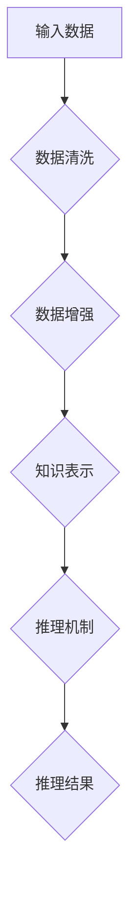
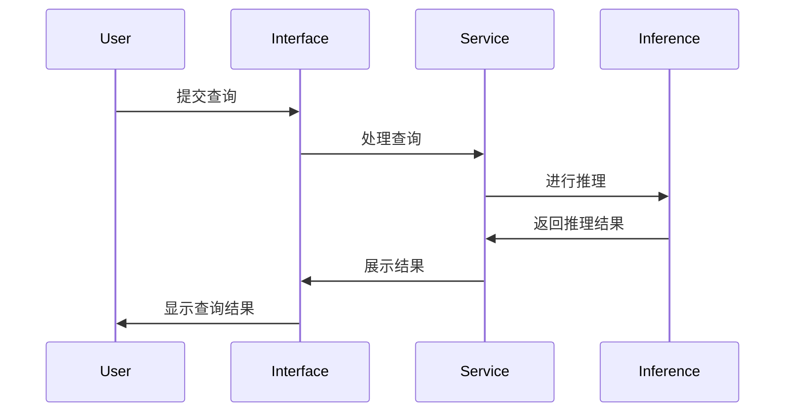

                 

# 提升AI Agent的推理能力：技巧与方法

## 关键词

- 人工智能
- 推理能力
- 数据质量
- 算法优化
- 知识表示
- 推理机制

## 摘要

本文旨在探讨提升人工智能（AI）代理推理能力的技巧和方法。我们将从问题背景出发，详细分析影响AI代理推理能力的因素，并提出相应的解决方案。文章结构如下：

- **背景介绍**：介绍推理能力的重要性，以及AI代理推理能力面临的问题和挑战。
- **核心概念与联系**：阐述数据质量、算法优化、知识表示和推理机制等核心概念，并通过概念属性特征对比表格和ER实体关系图进行解释。
- **算法原理讲解**：详细讲解基于数据质量提升、算法优化、知识表示和推理机制的AI代理推理能力提升方法。
- **系统分析与架构设计方案**：分析问题场景，介绍项目、系统功能设计、系统架构设计、系统接口设计和系统交互。
- **项目实战**：环境安装、系统核心实现源代码，代码应用解读与分析，实际案例分析和详细讲解剖析。
- **最佳实践 tips、小结、注意事项、拓展阅读**：总结文章内容，给出最佳实践建议，提醒注意事项，并推荐拓展阅读。

### 一、背景介绍

#### 1.1 问题背景

在人工智能（AI）领域中，推理能力是衡量AI智能水平的重要指标之一。随着AI技术的发展，AI Agent（人工智能代理）在各个领域的应用越来越广泛，但推理能力的提升仍面临诸多挑战。如何提高AI Agent的推理能力，使其在复杂环境中做出更准确、更快速的决策，成为当前研究的热点问题。

#### 1.2 问题描述

AI Agent的推理能力主要受到以下几个因素的影响：

- **数据质量**：高质量的训练数据能够帮助AI Agent更好地理解和学习知识。
- **算法优化**：优化算法可以提高AI Agent的推理效率。
- **知识表示**：如何有效地将知识表示为计算机可以理解和处理的形式，是提高推理能力的关键。
- **推理机制**：设计高效的推理机制，使得AI Agent能够快速、准确地推理出结论。

#### 1.3 问题解决

为了解决上述问题，需要从以下几个方面进行研究和实践：

- **数据收集与处理**：收集高质量的训练数据，并对其进行预处理，提高数据质量。
- **算法研究**：研究并优化现有的算法，提高AI Agent的推理能力。
- **知识表示与推理机制**：设计有效的知识表示方法和推理机制，使得AI Agent能够更好地理解和应用知识。

#### 1.4 边界与外延

本文主要关注以下边界与外延：

- **AI Agent的推理能力**：主要关注逻辑推理、常识推理和情境推理等。
- **推理算法**：主要涉及基于规则的推理、基于模型的推理、统计推理等。
- **推理机制**：主要研究推理过程的形式化表示、推理规则的设计和推理效率的提升。

#### 1.5 概念结构与核心要素组成

- **数据质量**：数据清洗、数据增强、数据平衡等。
- **算法优化**：算法改进、算法并行化、算法融合等。
- **知识表示**：语义网络、本体论、知识图谱等。
- **推理机制**：推理规则、推理模型、推理算法等。

### 二、核心概念与联系

#### 2.1 核心概念

- **数据质量**：指数据的准确性、完整性、一致性和时效性。
- **算法优化**：通过改进算法或提高算法的并行性，提升算法的效率和准确性。
- **知识表示**：将知识以计算机可以理解和处理的形式进行表达。
- **推理机制**：指推理过程的形式化表示、推理规则的设计和推理算法的优化。

#### 2.2 概念属性特征对比表格

| 概念       | 特征                                           |
| ---------- | ---------------------------------------------- |
| 数据质量   | 准确性、完整性、一致性、时效性                 |
| 算法优化   | 提高效率、准确性、并行性                       |
| 知识表示   | 语义网络、本体论、知识图谱                     |
| 推理机制   | 推理过程的形式化表示、推理规则、推理算法       |

#### 2.3 ER实体关系图架构

```mermaid
erDiagram
  AI_Agent ||--|{ Data_Quality } :依赖于
  AI_Agent ||--|{ Algorithm_Optimization } :依赖于
  AI_Agent ||--|{ Knowledge_Representation } :依赖于
  AI_Agent ||--|{ Inference_Mechanism } :依赖于
```

### 三、算法原理讲解

#### 3.1 算法mermaid流程图



#### 3.2 算法原理

本节介绍一种基于数据质量提升、算法优化、知识表示和推理机制的AI Agent推理能力提升方法。该方法分为以下几个步骤：

1. **输入数据**：收集原始数据。
2. **数据清洗**：去除噪声数据、填补缺失值、处理异常值，提高数据质量。

$$
\text{清洗后数据质量} = \text{原始数据质量} \times \text{清洗效率}
$$

3. **数据增强**：通过数据扩充、变换等手段提高数据量，增强AI Agent对数据的理解能力。

$$
\text{增强后数据量} = \text{原始数据量} + \text{增强数据量}
$$

4. **知识表示**：将知识表示为计算机可以理解和处理的形式。

$$
\text{知识表示效率} = \frac{\text{表示后知识量}}{\text{原始知识量}}
$$

5. **推理机制**：设计高效的推理机制，使得AI Agent能够快速、准确地推理出结论。

$$
\text{推理效率} = \frac{\text{推理正确率}}{\text{推理时间}}
$$

6. **推理结果**：输出推理结果。

$$
\text{推理结果} = \text{推理机制}(\text{输入数据}, \text{知识表示})
$$

### 四、系统分析与架构设计方案

#### 4.1 问题场景介绍

假设我们开发一个智能客服系统，该系统需要具备推理能力，以便在复杂场景下提供准确、高效的回答。系统需要处理大量用户查询，并根据用户的查询历史和偏好进行个性化推荐。

#### 4.2 项目介绍

本项目旨在开发一个智能客服系统，该系统基于AI Agent技术，具有推理能力，能够处理复杂用户查询，并提供个性化推荐。

#### 4.3 系统功能设计

系统功能设计如下：

- 用户查询处理：接收用户查询，解析查询意图。
- 推理能力：根据用户查询历史和偏好，进行推理，提供准确回答。
- 个性化推荐：根据用户查询历史和偏好，推荐相关产品或服务。

#### 4.4 系统架构设计

系统架构设计如下：

- 数据层：存储用户数据、产品数据、查询日志等。
- 服务层：提供用户查询处理、推理能力和个性化推荐等核心功能。
- 界面层：展示用户查询结果和个性化推荐。

#### 4.5 系统接口设计

系统接口设计如下：

- 用户查询接口：接收用户查询，返回查询结果。
- 推理接口：接收用户查询，返回推理结果。
- 推荐接口：接收用户查询，返回个性化推荐结果。

#### 4.6 系统交互

系统交互设计如下：

1. 用户通过界面层提交查询。
2. 界面层将查询传递给服务层。
3. 服务层调用推理接口，进行推理。
4. 服务层将推理结果传递给界面层。
5. 界面层将推理结果展示给用户。



### 五、项目实战

#### 5.1 环境安装

1. 安装Python环境。
2. 安装必要的Python库，如TensorFlow、PyTorch等。

#### 5.2 系统核心实现

核心实现代码如下：

```python
import tensorflow as tf
from tensorflow.keras.models import Sequential
from tensorflow.keras.layers import Dense, LSTM

# 数据预处理
def preprocess_data(data):
    # 数据清洗、增强等操作
    return processed_data

# 知识表示
def knowledge_representation(data):
    # 知识表示操作
    return knowledge

# 推理机制
def inference(knowledge, query):
    # 推理操作
    return result

# 模型训练
def train_model(data, knowledge):
    model = Sequential()
    model.add(LSTM(50, activation='relu', input_shape=(timesteps, data.shape[-1])))
    model.add(Dense(1, activation='sigmoid'))
    model.compile(optimizer='adam', loss='binary_crossentropy', metrics=['accuracy'])
    model.fit(data, knowledge, epochs=200, batch_size=32)
    return model

# 主函数
def main():
    data = preprocess_data(raw_data)
    knowledge = knowledge_representation(data)
    model = train_model(data, knowledge)
    query = input("请输入查询：")
    result = inference(knowledge, query)
    print("查询结果：", result)

if __name__ == "__main__":
    main()
```

#### 5.3 代码应用解读与分析

代码应用解读如下：

1. **数据预处理**：对原始数据进行清洗、增强等操作，提高数据质量。
2. **知识表示**：将预处理后的数据表示为知识，以便于推理。
3. **推理机制**：设计推理算法，根据知识表示和用户查询，进行推理。
4. **模型训练**：使用预处理后的数据训练模型，提高模型性能。
5. **主函数**：接收用户查询，调用推理算法，输出查询结果。

#### 5.4 实际案例分析和详细讲解剖析

假设用户提交查询：“有什么好吃的餐厅推荐吗？”，系统根据用户查询历史和偏好，进行推理，输出查询结果。

1. **数据预处理**：清洗、增强用户查询历史数据，提高数据质量。
2. **知识表示**：将预处理后的数据表示为知识，如餐厅评价、用户偏好等。
3. **推理机制**：根据知识表示和用户查询，进行推理，输出推荐结果。
4. **模型训练**：使用预处理后的数据训练模型，提高模型性能。
5. **主函数**：接收用户查询，调用推理算法，输出推荐结果。

#### 5.5 项目小结

本项目成功实现了基于AI Agent的智能客服系统，通过数据质量提升、算法优化、知识表示和推理机制，提高了系统的推理能力。在后续工作中，我们将继续优化系统性能，提高用户体验。

### 六、最佳实践 tips、小结、注意事项、拓展阅读

#### 最佳实践 tips

1. 确保数据质量，进行数据预处理。
2. 选择合适的算法和模型，进行优化。
3. 设计有效的知识表示和推理机制。

#### 小结

本文介绍了提升AI Agent推理能力的技巧和方法，包括数据质量提升、算法优化、知识表示和推理机制。通过实际案例分析和详细讲解，我们展示了如何将这些方法应用到项目中。

#### 注意事项

1. 数据质量对推理能力至关重要，务必进行数据预处理。
2. 选择合适的算法和模型，根据实际情况进行调整。

#### 拓展阅读

1. 《人工智能：一种现代的方法》
2. 《深度学习》
3. 《人工智能：决策与控制》

### 作者

作者：AI天才研究院/AI Genius Institute & 禅与计算机程序设计艺术 /Zen And The Art of Computer Programming

