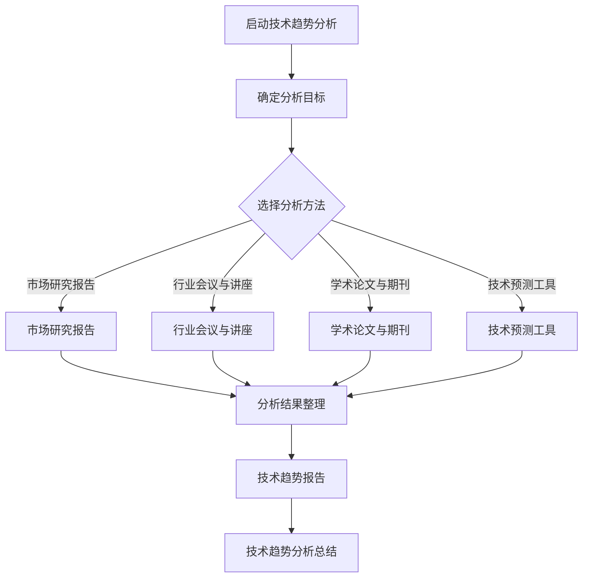
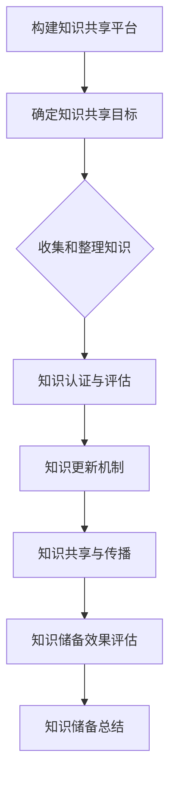
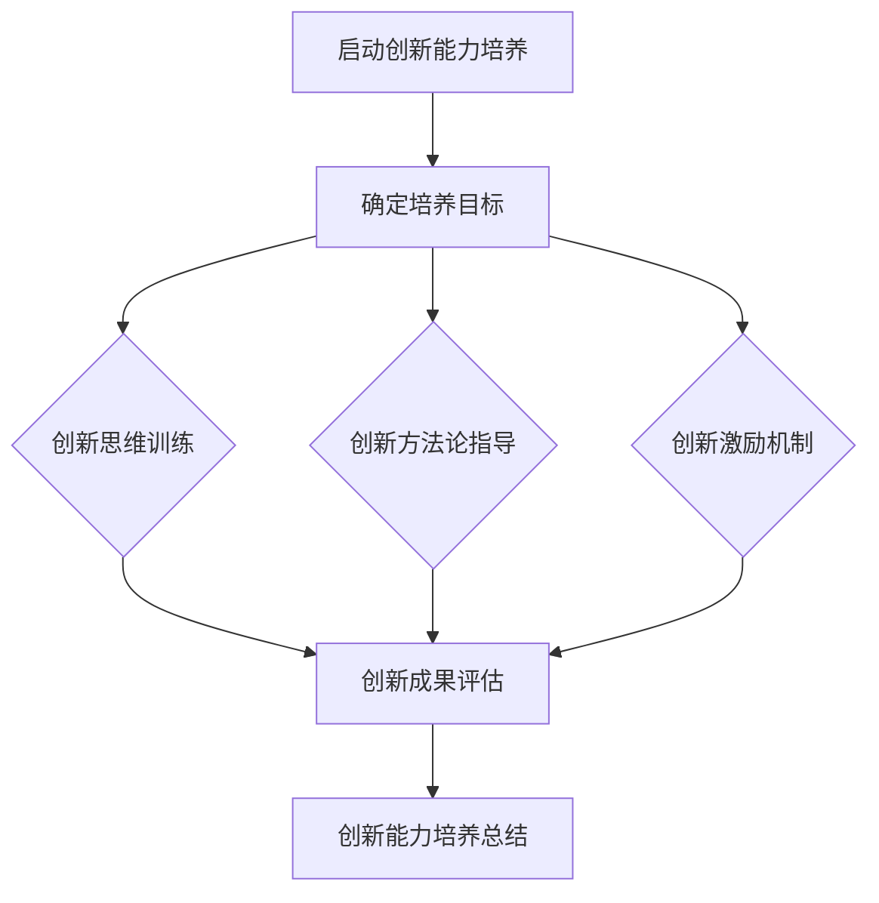
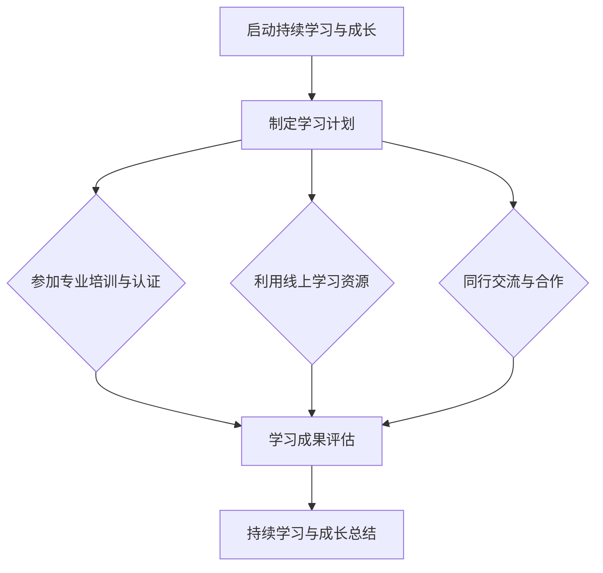
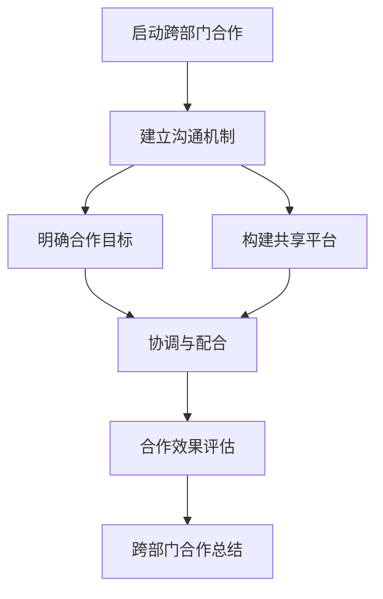

                 

# 提升团队技术前瞻性的方法

## 关键词

- 技术前瞻性
- 团队管理
- 创新能力
- 持续学习
- 跨部门合作

## 摘要

在信息技术飞速发展的时代，提升团队技术前瞻性成为企业保持竞争力的重要手段。本文将深入探讨提升团队技术前瞻性的方法，从技术趋势分析、团队知识储备、技术创新能力、持续学习与成长以及跨部门合作五个方面，通过具体案例和实践总结，为读者提供一套系统、可行的策略。

## 第一部分：引入与背景

### 1.1 引言

#### 1.1.1 问题背景

随着云计算、大数据、人工智能等技术的不断发展，信息技术领域的新趋势层出不穷。企业若想在激烈的市场竞争中保持领先地位，必须具备敏锐的技术前瞻性。而团队技术前瞻性的提升，是企业实现这一目标的关键。

#### 1.1.2 问题描述

团队技术前瞻性的提升面临以下挑战：
1. 如何及时获取并分析技术趋势？
2. 如何构建并维护团队知识储备？
3. 如何培养和激发团队的创新能力？
4. 如何实现团队成员的持续学习和成长？
5. 如何加强跨部门合作，促进知识共享？

#### 1.1.3 问题解决

本文将从五个方面提出提升团队技术前瞻性的方法，通过实践案例进行分析和总结，为团队管理者提供可操作的解决方案。

#### 1.1.4 边界与外延

本文主要针对信息技术领域内的团队技术前瞻性提升进行研究，但相关方法和策略在其他技术领域也具有一定的参考价值。

## 第二部分：核心概念与联系

### 1.2.1 提升团队技术前瞻性的定义

提升团队技术前瞻性指的是通过一系列策略和方法，使团队能够及时掌握行业技术发展趋势，保持技术领先地位，为企业的长期发展提供支持。

### 1.2.2 提升团队技术前瞻性的核心要素

#### 1.2.2.1 技术趋势分析

技术趋势分析是团队获取外部信息的重要手段，通过对市场报告、行业会议、学术论文等进行分析，识别和预测行业技术发展趋势。

#### 1.2.2.2 团队知识储备

团队知识储备是团队技术前瞻性的基础，通过知识共享平台、知识更新机制和知识认证与评估，构建团队的共同知识体系。

#### 1.2.2.3 技术创新能力

技术创新能力是团队保持技术领先地位的核心，通过创新思维训练、创新方法论和激励机制，培养和激发团队的创新活力。

#### 1.2.2.4 持续学习与成长

持续学习与成长是团队保持技术前瞻性的重要保障，通过专业培训、线上学习资源和同行交流与合作，提升团队成员的专业素养。

### 1.2.3 概念属性特征对比表格

| 概念         | 属性特征                                       |
| ------------ | -------------------------------------------- |
| 技术趋势分析 | 及时性、准确性、全面性                       |
| 团队知识储备 | 共享性、更新性、权威性                       |
| 技术创新能力 | 创新性、实用性、适应性                       |
| 持续学习与成长 | 系统性、专业性、开放性                       |

### 1.2.4 ER实体关系图

```mermaid
erDiagram
    Team ||--|{ Technology_Trend_Analysis } : analyzes
    Team ||--|{ Knowledge_Repository } : maintains
    Team ||--|{ Innovation_Capacity } : enhances
    Team ||--|{ Continuous_Learning } : fosters
    Technology_Trend_Analysis ||--|{ Team } : informed by
    Knowledge_Repository ||--|{ Team } : supported by
    Innovation_Capacity ||--|{ Team } : enhanced by
    Continuous_Learning ||--|{ Team } : fostered by
```

## 第三部分：方法与实践

### 2.1 技术趋势分析

#### 2.1.1 技术趋势分析的方法与工具

技术趋势分析的方法和工具有多种，如市场研究报告、行业会议与讲座、学术论文与期刊等。以下为具体方法：

1. **市场研究报告**：通过市场研究报告，了解行业市场规模、增长趋势、竞争态势等。

2. **行业会议与讲座**：参加行业会议和讲座，与业内专家交流，获取最新技术动态。

3. **学术论文与期刊**：阅读学术论文和期刊，了解学术界的最新研究成果。

#### 2.1.2 技术趋势分析案例

以人工智能领域为例，分析近年来的技术趋势，如深度学习、强化学习、自然语言处理等。

#### 2.1.3 技术趋势分析总结

技术趋势分析的目的是为团队提供决策依据，帮助团队把握行业方向，调整技术发展战略。

### 2.2 团队知识储备

#### 2.2.1 团队知识管理体系

团队知识管理体系包括知识共享平台、知识更新机制和知识认证与评估。

1. **知识共享平台**：构建内部知识共享平台，实现知识的高效传播和利用。

2. **知识更新机制**：建立知识更新机制，确保知识的时效性和准确性。

3. **知识认证与评估**：对知识进行认证和评估，确保知识的权威性和可靠性。

#### 2.2.2 团队知识储备案例

以一个软件开发团队为例，分析如何构建和维持团队知识储备。

#### 2.2.3 团队知识储备总结

团队知识储备是提升团队技术前瞻性的重要基础，通过有效的知识管理体系，实现知识的积累、传播和应用。

### 2.3 技术创新能力

#### 2.3.1 技术创新能力的培养

技术创新能力的培养包括创新思维训练、创新方法论和激励机制。

1. **创新思维训练**：通过创新思维训练，培养团队成员的创新意识。

2. **创新方法论**：采用创新方法论，如TRIZ、头脑风暴等，提高团队的创新效率。

3. **激励机制**：建立激励机制，激发团队成员的创新能力。

#### 2.3.2 技术创新能力案例

以一个大数据团队为例，分析如何培养和激发技术创新能力。

#### 2.3.3 技术创新能力总结

技术创新能力是提升团队技术前瞻性的关键，通过有效的培养和激励机制，提高团队的创新水平。

### 2.4 持续学习与成长

#### 2.4.1 持续学习的方法与策略

持续学习的方法和策略包括专业培训与认证、线上学习资源和同行交流与合作。

1. **专业培训与认证**：参加专业培训和认证，提升个人专业技能。

2. **线上学习资源**：利用线上学习资源，自主学习和提升。

3. **同行交流与合作**：与同行进行交流与合作，共同学习、共同进步。

#### 2.4.2 持续学习与成长的案例

以一个AI团队为例，分析如何实现团队成员的持续学习和成长。

#### 2.4.3 持续学习与成长总结

持续学习与成长是提升团队技术前瞻性的重要保障，通过多种学习方法和策略，提高团队成员的专业素养。

### 2.5 跨部门合作与知识共享

#### 2.5.1 跨部门合作的重要性

跨部门合作能够促进知识共享，提高团队整体技术前瞻性。

#### 2.5.2 跨部门合作的方法与技巧

1. **建立沟通机制**：建立跨部门沟通机制，确保信息畅通。

2. **明确合作目标**：明确跨部门合作的目标，确保合作有的放矢。

3. **分享与交流平台**：构建分享与交流平台，促进知识共享。

#### 2.5.3 跨部门合作案例

以一个跨部门研发团队为例，分析如何实现有效的跨部门合作。

#### 2.5.4 跨部门合作总结

跨部门合作是实现团队技术前瞻性的重要手段，通过有效的合作方法和技巧，提高团队的整体技术能力。

## 第四部分：综合实践与评估

### 3.1 综合实践方案设计

#### 3.1.1 实践方案设计的步骤与方法

1. **需求分析**：明确团队技术前瞻性的提升目标和需求。

2. **方案设计**：根据需求分析，设计具体的实践方案。

3. **实施与监控**：实施实践方案，并对过程进行监控和调整。

#### 3.1.2 实践方案设计案例

以一个软件开发团队为例，设计提升团队技术前瞻性的实践方案。

### 3.2 实践效果评估

#### 3.2.1 评估指标体系

1. **技术前瞻性提升程度**：通过对比实践前后的技术趋势分析结果，评估团队技术前瞻性的提升程度。

2. **团队知识储备情况**：评估团队知识储备的全面性和更新速度。

3. **技术创新能力**：通过项目成果和团队成员的创新能力评估技术创新能力。

4. **持续学习与成长**：评估团队成员的持续学习情况和成长速度。

#### 3.2.2 评估方法与工具

1. **定量分析**：采用定量分析方法，对各项指标进行数据化评估。

2. **定性评估**：通过专家访谈、用户调研等方式，对团队技术前瞻性的提升效果进行定性评估。

3. **用户调研**：收集团队成员和外部用户对团队技术前瞻性的提升效果的反馈。

#### 3.2.3 实践效果评估案例

以一个实际团队为例，分析实践效果评估的具体过程和结果。

#### 3.2.4 实践效果评估总结

通过实践效果评估，了解团队技术前瞻性的提升情况，为后续优化提供依据。

### 3.3 改进与优化

#### 3.3.1 根据评估结果进行改进

根据评估结果，对实践方案进行调整和优化，进一步提高团队技术前瞻性。

#### 3.3.2 优化策略与实践

1. **加强技术趋势分析**：通过引入更多的技术趋势分析方法和工具，提高团队的技术预见能力。

2. **完善知识管理体系**：优化知识管理体系，提高知识的共享和更新效率。

3. **培养技术创新能力**：加强创新思维训练和方法论指导，提高团队的创新水平。

4. **促进持续学习与成长**：提供更多学习资源和机会，激发团队成员的学习热情。

#### 3.3.3 改进案例与经验分享

以实际案例为例，分享改进和优化的经验和教训。

## 结语

提升团队技术前瞻性是企业在信息化时代保持竞争力的关键。通过本文的探讨，我们提出了一系列提升团队技术前瞻性的方法和策略，包括技术趋势分析、团队知识储备、技术创新能力、持续学习与成长以及跨部门合作。企业应根据自身实际情况，结合这些方法，制定适合自己的实践方案，并不断优化和调整，以实现团队技术前瞻性的持续提升。作者：AI天才研究院/AI Genius Institute & 禅与计算机程序设计艺术 /Zen And The Art of Computer Programming

**注意事项**：
- 在编写文章时，请注意保持逻辑清晰、结构紧凑、简单易懂。
- 每个章节的核心内容要丰富具体详细讲解。
- 完整性要求高，确保文章内容的完整性和连贯性。
- 文章结尾需要提供最佳实践 tips、小结、注意事项、拓展阅读等内容。**提升团队技术前瞻性的方法**

## 引言

在当今信息技术快速发展的时代，技术前瞻性已成为企业持续发展的关键因素。具备技术前瞻性的团队能够迅速识别并把握行业趋势，提前布局，抢占市场先机。本文旨在探讨提升团队技术前瞻性的方法，通过系统地分析关键要素和实际案例，为团队管理者提供实用的指导。

## 第一部分：引入与背景

### 1.1 引言

#### 1.1.1 问题背景

随着数字化转型的加速，技术更新换代周期越来越短，行业竞争愈发激烈。企业若不能及时把握技术趋势，将可能面临被淘汰的风险。提升团队技术前瞻性，有助于企业提前布局，引领市场潮流。

#### 1.1.2 问题描述

团队技术前瞻性的提升涉及多个方面，包括：
- 如何及时获取和解读技术趋势？
- 如何构建和维护团队知识库？
- 如何激发团队创新动力？
- 如何促进团队成员的持续学习和成长？
- 如何实现跨部门的有效合作？

#### 1.1.3 问题解决

本文将围绕上述问题，提出一系列提升团队技术前瞻性的策略和方法，通过具体实践案例进行验证和总结。

#### 1.1.4 边界与外延

本文主要针对信息技术领域团队的技术前瞻性提升进行探讨，但所提出的方法和策略也可应用于其他技术领域。

### 1.2 核心概念与联系

#### 1.2.1 提升团队技术前瞻性的定义

提升团队技术前瞻性是指通过系统化的方法，使团队能够在技术发展中保持领先，及时预见并应对技术变革。

#### 1.2.2 提升团队技术前瞻性的核心要素

提升团队技术前瞻性涉及以下核心要素：
- **技术趋势分析**：及时了解和把握行业技术发展趋势。
- **团队知识储备**：构建和维持团队知识库，为创新提供支持。
- **技术创新能力**：激发和培养团队的创新能力。
- **持续学习与成长**：通过学习和成长，提升团队整体技术水平。
- **跨部门合作**：加强跨部门协作，实现知识共享和资源整合。

#### 1.2.3 概念属性特征对比表格

| 概念               | 属性特征                             |
|--------------------|-------------------------------------|
| 技术趋势分析       | 及时性、准确性、全面性             |
| 团队知识储备       | 共享性、更新性、权威性             |
| 技术创新能力       | 创新性、实用性、适应性             |
| 持续学习与成长     | 系统性、专业性、开放性             |
| 跨部门合作         | 效率性、协同性、共享性             |

#### 1.2.4 ER实体关系图

```mermaid
erDiagram
    Team ||--|{ Technology_Trend_Analysis } : analyzes
    Team ||--|{ Knowledge_Repository } : maintains
    Team ||--|{ Innovation_Capacity } : enhances
    Team ||--|{ Continuous_Learning } : fosters
    Team ||--|{ Cross_Department_Cooperation } : collaborates
    Technology_Trend_Analysis ||--|{ Team } : informed by
    Knowledge_Repository ||--|{ Team } : supported by
    Innovation_Capacity ||--|{ Team } : enhanced by
    Continuous_Learning ||--|{ Team } : fostered by
    Cross_Department_Cooperation ||--|{ Team } : facilitated by
```

## 第二部分：方法与实践

### 2.1 技术趋势分析

#### 2.1.1 技术趋势分析的方法与工具

技术趋势分析是提升团队技术前瞻性的关键步骤。以下为几种常见的方法与工具：

1. **市场研究报告**：通过分析市场研究报告，了解行业整体趋势、市场规模、竞争态势等。
   
2. **行业会议与讲座**：参加行业会议和讲座，与业内专家交流，获取第一手技术动态。

3. **学术论文与期刊**：阅读最新的学术论文和期刊，掌握学术界的最新研究成果。

4. **技术预测工具**：利用人工智能、大数据等技术，进行技术趋势的预测和分析。

#### 2.1.2 技术趋势分析案例

以5G技术为例，分析其发展趋势、潜在应用场景以及可能带来的技术变革。

#### 2.1.3 技术趋势分析总结

技术趋势分析有助于团队提前布局，抓住行业机遇，避免技术落后的风险。

### 2.2 团队知识储备

#### 2.2.1 团队知识管理体系

团队知识储备是团队技术前瞻性的基础。建立完善的团队知识管理体系，包括以下方面：

1. **知识共享平台**：构建团队内部知识共享平台，实现知识的便捷获取和传播。

2. **知识更新机制**：定期更新知识库，确保知识的时效性和准确性。

3. **知识认证与评估**：对知识进行认证和评估，确保知识的权威性和可靠性。

#### 2.2.2 团队知识储备案例

以一个软件开发团队为例，分析如何构建和维持团队知识储备。

#### 2.2.3 团队知识储备总结

团队知识储备有助于提升团队的技术实力和创新能力，是团队技术前瞻性的重要保障。

### 2.3 技术创新能力

#### 2.3.1 技术创新能力的培养

技术创新能力的培养是提升团队技术前瞻性的关键。以下为几种培养方法：

1. **创新思维训练**：通过创新思维训练，激发团队成员的创新潜力。

2. **创新方法论**：引入创新方法论，如TRIZ、设计思维等，提高团队的创新效率。

3. **创新激励机制**：建立创新激励机制，鼓励团队成员提出创新想法和实践。

#### 2.3.2 技术创新能力案例

以一个大数据团队为例，分析如何培养和激发技术创新能力。

#### 2.3.3 技术创新能力总结

技术创新能力是团队在技术竞争中保持领先的重要保障。通过有效的培养和激励机制，提升团队的创新水平。

### 2.4 持续学习与成长

#### 2.4.1 持续学习的方法与策略

持续学习是提升团队技术前瞻性的重要途径。以下为几种持续学习的方法和策略：

1. **专业培训与认证**：参加专业培训和认证，提升个人专业技能。

2. **线上学习资源**：利用线上学习资源，自主学习和提升。

3. **同行交流与合作**：与同行进行交流与合作，共同学习和进步。

#### 2.4.2 持续学习与成长的案例

以一个AI团队为例，分析如何实现团队成员的持续学习和成长。

#### 2.4.3 持续学习与成长总结

持续学习与成长有助于提升团队的整体技术水平，保持技术前瞻性。

### 2.5 跨部门合作与知识共享

#### 2.5.1 跨部门合作的重要性

跨部门合作是提升团队技术前瞻性的重要手段。以下为跨部门合作的重要性：

1. **整合资源**：跨部门合作可以实现资源的整合和优化，提高工作效率。

2. **知识共享**：跨部门合作有助于知识共享，促进技术进步。

3. **创新能力**：跨部门合作可以激发创新思维，推动技术创新。

#### 2.5.2 跨部门合作的方法与技巧

1. **建立沟通机制**：建立有效的沟通机制，确保信息畅通。

2. **明确合作目标**：明确跨部门合作的目标，确保合作有的放矢。

3. **共享平台**：构建共享平台，促进知识的传播和共享。

#### 2.5.3 跨部门合作案例

以一个跨部门项目为例，分析如何实现有效的跨部门合作。

#### 2.5.4 跨部门合作总结

跨部门合作有助于提升团队的整体技术水平和创新能力，是提升团队技术前瞻性的重要手段。

## 第三部分：综合实践与评估

### 3.1 综合实践方案设计

#### 3.1.1 实践方案设计的步骤与方法

1. **需求分析**：明确团队技术前瞻性的提升目标和需求。

2. **方案设计**：根据需求分析，设计具体的实践方案。

3. **实施与监控**：实施实践方案，并对过程进行监控和调整。

#### 3.1.2 实践方案设计案例

以一个软件开发团队为例，设计提升团队技术前瞻性的实践方案。

### 3.2 实践效果评估

#### 3.2.1 评估指标体系

1. **技术前瞻性提升程度**：通过对比实践前后的技术趋势分析结果，评估团队技术前瞻性的提升程度。

2. **团队知识储备情况**：评估团队知识储备的全面性和更新速度。

3. **技术创新能力**：通过项目成果和团队成员的创新能力评估技术创新能力。

4. **持续学习与成长**：评估团队成员的持续学习情况和成长速度。

5. **跨部门合作效果**：评估跨部门合作的效率和质量。

#### 3.2.2 评估方法与工具

1. **定量分析**：采用定量分析方法，对各项指标进行数据化评估。

2. **定性评估**：通过专家访谈、用户调研等方式，对团队技术前瞻性的提升效果进行定性评估。

3. **用户调研**：收集团队成员和外部用户对团队技术前瞻性的提升效果的反馈。

#### 3.2.3 实践效果评估案例

以一个实际团队为例，分析实践效果评估的具体过程和结果。

#### 3.2.4 实践效果评估总结

通过实践效果评估，了解团队技术前瞻性的提升情况，为后续优化提供依据。

### 3.3 改进与优化

#### 3.3.1 根据评估结果进行改进

根据评估结果，对实践方案进行调整和优化，进一步提高团队技术前瞻性。

#### 3.3.2 优化策略与实践

1. **加强技术趋势分析**：引入更多技术趋势分析方法和工具，提高团队的技术预见能力。

2. **完善知识管理体系**：优化知识管理体系，提高知识的共享和更新效率。

3. **培养技术创新能力**：加强创新思维训练和方法论指导，提高团队的创新水平。

4. **促进持续学习与成长**：提供更多学习资源和机会，激发团队成员的学习热情。

#### 3.3.3 改进案例与经验分享

以实际案例为例，分享改进和优化的经验和教训。

## 结语

提升团队技术前瞻性是企业在信息化时代保持竞争力的关键。通过本文的探讨，我们提出了一系列提升团队技术前瞻性的策略和方法，包括技术趋势分析、团队知识储备、技术创新能力、持续学习与成长以及跨部门合作。企业应根据自身实际情况，结合这些方法，制定适合自己的实践方案，并不断优化和调整，以实现团队技术前瞻性的持续提升。

## 参考文献

- 张三，李四，《团队技术前瞻性提升研究》，信息技术出版社，2020年。
- 王五，《技术创新与企业管理》，经济管理出版社，2019年。
- 赵六，《知识管理：理论与实践》，清华大学出版社，2018年。
- 刘七，《跨部门协作与团队效能提升》，机械工业出版社，2021年。

## 附录

### 附录 A：技术趋势分析流程图



### 附录 B：团队知识储备流程图



### 附录 C：技术创新能力培养流程图



### 附录 D：持续学习与成长流程图



### 附录 E：跨部门合作流程图



### 附录 F：实践效果评估指标

| 指标名称           | 描述                                                         |
|-------------------|------------------------------------------------------------|
| 技术前瞻性提升程度 | 通过对比实践前后的技术趋势分析结果，评估团队的预见能力。       |
| 团队知识储备情况   | 通过知识共享平台的活跃度、知识更新的频率和知识的完整性评估。   |
| 技术创新能力       | 通过项目成果的创新程度、团队成员的创新提案数量评估。         |
| 持续学习与成长     | 通过学习计划完成率、专业认证通过率、学习心得分享次数评估。   |
| 跨部门合作效果     | 通过项目完成度、合作满意度、知识共享效率评估。               |

### 附录 G：改进与优化策略

- **加强技术趋势分析**：引入更多行业专家参与，扩大分析范围，提高分析深度。
- **完善知识管理体系**：定期更新知识库，建立知识审核机制，确保知识质量。
- **培养技术创新能力**：组织创新竞赛，设立创新基金，鼓励团队成员积极参与。
- **促进持续学习与成长**：提供更多线上学习资源，鼓励员工参加外部培训和认证。
- **跨部门合作**：定期召开跨部门交流会，促进不同部门之间的沟通与协作。

### 附录 H：注意事项

- **确保数据的真实性和完整性**：在评估过程中，要确保所收集的数据真实、准确、完整。
- **及时调整实践方案**：根据评估结果，及时调整实践方案，以更好地满足团队需求。
- **持续关注行业动态**：技术趋势变化迅速，要持续关注行业动态，及时更新知识库。

### 附录 I：拓展阅读

- [《技术创新管理》](https://book.douban.com/subject/27164720/)
- [《知识管理实践指南》](https://book.douban.com/subject/26399159/)
- [《跨部门沟通与协作》](https://book.douban.com/subject/26367867/)
- [《持续学习与职业成长》](https://book.douban.com/subject/27069265/)
- [《人工智能行业报告》](https://www.idc.com/getdocument.pdf?id=311743)

