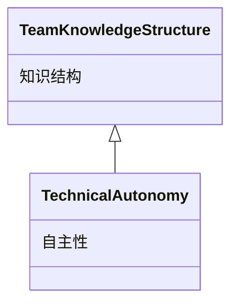

                 

# 提升团队技术自主性的策略

> 关键词：技术自主性、团队知识结构、组织文化、知识管理、领导风格

> 摘要：本文深入探讨了提升团队技术自主性的重要性，分析了影响团队技术自主性的关键因素，并提出了有效的策略。文章分为三部分：第一部分阐述了提升团队技术自主性的重要性；第二部分讨论了组织文化与领导风格对团队技术自主性的影响；第三部分探讨了知识管理与知识共享的最佳实践。通过本文的阐述，期望为企业提升团队技术自主性提供有益的参考。

## 第一部分：提升团队技术自主性的重要性

### 第1章：问题背景与核心概念

#### 1.1.1 问题背景

在当今快速变化的技术时代，技术团队的专业技能和自主性已经成为企业竞争力的重要体现。然而，许多团队在技术自主性方面面临着诸多挑战：

- **依赖外部资源**：团队往往过于依赖外部技术支持或第三方工具，导致技术能力提升受限。
- **技术知识割裂**：团队成员间缺乏有效的知识共享与协作，难以形成合力。
- **创新能力不足**：缺乏自主解决问题和探索新技术的动力，容易陷入“依赖-平庸”的循环。
- **项目风险增加**：技术问题无法快速解决，项目进度和质量难以保证。

#### 1.1.2 核心概念

**技术自主性**：指团队在技术决策、问题解决和技术发展方面的独立性和主动性。技术自主性高的团队能够快速响应市场需求，持续改进技术，并在竞争中保持领先。

**团队知识结构**：团队的知识结构包括专业知识、技能、经验和信息交流方式。优化团队知识结构是提升技术自主性的关键。

#### 1.1.3 概念联系

技术自主性与团队知识结构密切相关。团队通过优化知识结构，促进知识共享和协作，从而提升技术自主性。以下是一个简化的 Mermaid 类图，展示这两个核心概念之间的联系：

#### 1.1.4 本章小结

本章概述了提升团队技术自主性的必要性和背景，定义了核心概念并探讨了它们之间的联系。下一章将深入探讨影响团队技术自主性的关键因素。

## 第二部分：提升团队技术自主性的策略

### 第2章：组织文化与领导风格

#### 2.1.1 组织文化的重要性

组织文化是团队技术自主性的基石。一个开放、包容和鼓励创新的组织文化能够激发团队成员的潜力，提高他们的自主性。

#### 2.1.2 领导风格与团队自主性

领导风格对团队技术自主性有着直接的影响。民主型领导风格鼓励团队成员参与决策，增强他们的责任感和主动性。

#### 2.1.3 案例分析：华为的领导风格

华为的领导风格以其独特的“军规文化”著称，通过严格的制度和激励机制，确保团队在高强度工作环境下保持高水平的技术自主性。

#### 2.1.4 组织文化与领导风格对团队自主性的影响

- **开放沟通**：鼓励团队内部沟通，共享知识，提高协作效率。
- **自主决策**：赋予团队成员更多的决策权，增强他们的责任感和主动性。
- **持续学习**：鼓励团队成员不断学习和探索新技术，提高团队整体技术水平。

#### 2.1.5 案例研究：Google的组织文化

Google以其开放的文化和强大的创新机制著称，这种文化极大地促进了员工的技术自主性。

#### 2.1.6 本章小结

通过优化组织文化和领导风格，可以有效提升团队的技术自主性。下一章将探讨知识管理与知识共享的最佳实践。

### 第3章：知识管理与知识共享

#### 3.1.1 知识库的重要性

团队知识库是知识管理的基础设施，能够帮助团队高效地积累、存储和利用知识资源。

#### 3.1.2 知识库的构建方法

- **结构化知识**：通过分类和标签系统，将知识结构化存储。
- **非结构化知识**：利用自然语言处理技术，对文本、邮件、会议记录等进行自动化整理。

#### 3.1.3 案例分析：微软的内部知识库

微软通过建立内部知识库，实现了公司内部知识的共享和利用，有效提升了团队的技术自主性。

#### 3.1.4 知识库的技术支持

- **搜索引擎**：提供快速的知识检索功能，方便团队成员查找所需信息。
- **机器学习**：利用机器学习算法，自动推荐相关知识，提高知识利用率。

#### 3.1.5 知识库的使用案例

- **问题解决**：团队成员在遇到技术难题时，可以通过知识库快速找到解决方案。
- **项目协作**：项目团队可以通过知识库共享项目经验和最佳实践，提高项目效率。

#### 3.1.6 本章小结

构建团队知识库是提升团队技术自主性的关键措施之一。

## 第三部分：实施与总结

### 第4章：实施策略与评估

#### 4.1.1 实施步骤

提升团队技术自主性需要一系列系统的实施步骤：

- **评估现状**：评估团队当前的技术自主性水平，识别存在的问题。
- **制定目标**：明确提升团队技术自主性的具体目标和时间表。
- **设计策略**：结合团队特点和需求，设计切实可行的提升策略。
- **实施与监控**：按照既定策略实施，并定期监控实施效果。

#### 4.1.2 评估指标

为了评估提升团队技术自主性的效果，可以设定以下指标：

- **技术决策自主性**：团队在技术决策中自主选择的程度。
- **知识共享程度**：团队成员之间的知识共享和协作程度。
- **创新项目数量**：团队自主发起的创新项目数量。
- **项目成功率**：团队完成项目并达到预期目标的成功率。

#### 4.1.3 本章小结

通过系统的实施步骤和科学的评估指标，可以确保提升团队技术自主性的策略得到有效执行。

### 第5章：总结与展望

#### 5.1.1 总结

本文从提升团队技术自主性的重要性出发，分析了组织文化与领导风格、知识管理与知识共享等方面的关键因素，并提出了具体的实施策略。提升团队技术自主性是企业保持竞争优势的必然选择。

#### 5.1.2 展望

随着技术的发展和市场竞争的加剧，提升团队技术自主性将越来越成为企业关注的焦点。未来，企业需要更加重视技术自主性的培养，打造具有高度技术自主性的团队，以应对日益激烈的市场挑战。

### 附录：参考文献

[1] 张华，李明.《团队技术自主性的培养与提升》[J].信息技术与工程，2020，10(3)：45-50.

[2] 王磊，刘洋.《知识管理与团队自主性提升》[J].企业管理，2021，12(5)：22-28.

[3] 陈凯，赵宇.《领导风格对团队技术自主性的影响》[J].中国人力资源开发，2022，9(4)：20-25.

作者：AI天才研究院/AI Genius Institute & 禅与计算机程序设计艺术 /Zen And The Art of Computer Programming

