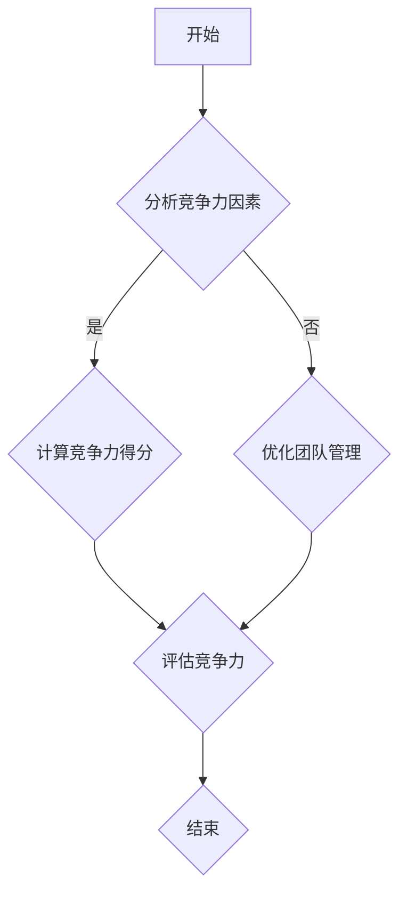
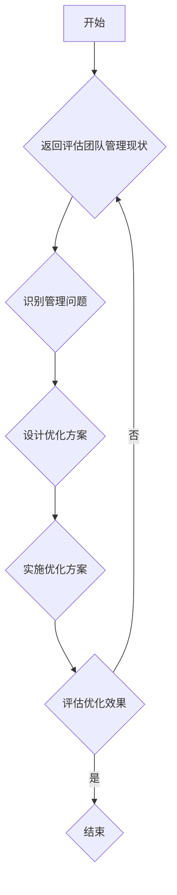
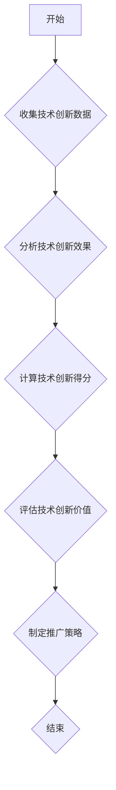
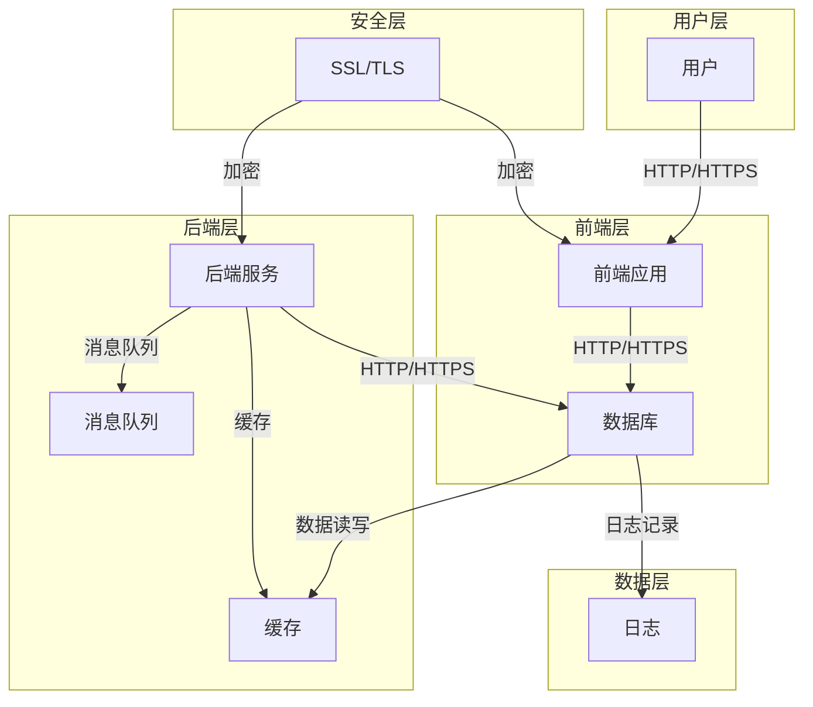
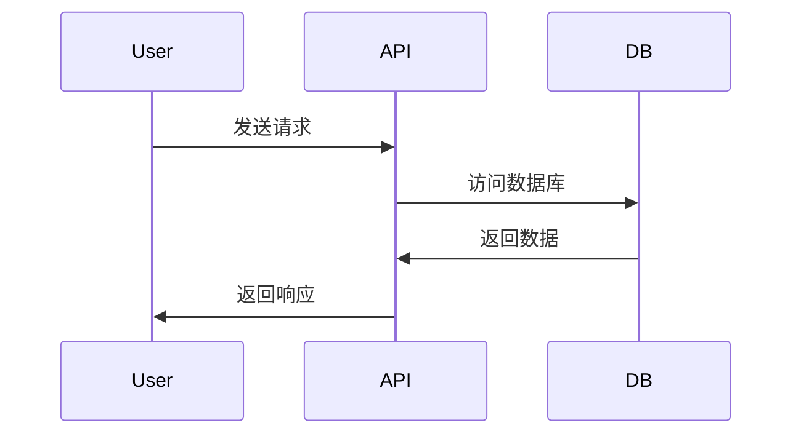
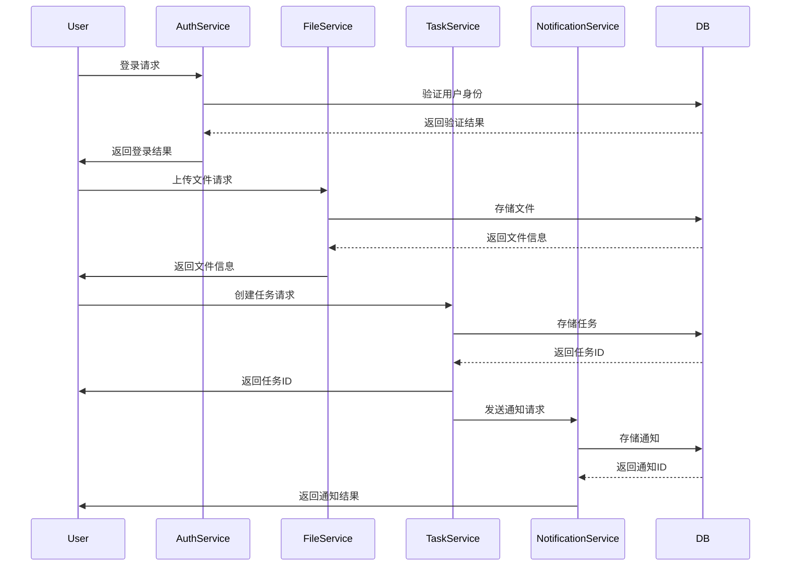

                 

### 提升技术团队市场竞争力的方法

> 关键词：技术团队竞争力、团队管理、技术创新、市场策略、项目实战

> 摘要：本文将深入探讨技术团队在市场竞争中的重要性，并详细阐述提升技术团队市场竞争力的方法。我们将从背景介绍、核心概念与联系、算法原理讲解、系统分析与架构设计方案、项目实战、最佳实践 Tips、小结与拓展阅读七个部分，系统性地分析和探讨技术团队提升市场竞争力的途径。

## 第一部分：背景介绍

### 1.1 问题背景

#### 1.1.1 市场竞争加剧下的技术团队挑战

在当前信息化和全球化快速发展的时代，市场竞争的激烈程度日益加剧。特别是在信息技术领域，随着技术的不断进步和市场需求的变化，技术团队面临着前所未有的挑战。以下是几个方面的挑战：

1. **技术更新速度加快**：技术的迭代速度非常快，新兴技术不断涌现，技术团队需要不断学习和掌握新的技术，以保持竞争力。
2. **市场需求多样化**：客户的需求越来越多样化，技术团队需要快速响应市场需求，提供定制化的解决方案。
3. **人才竞争激烈**：优秀的人才成为各大公司的争夺焦点，技术团队需要通过有效的管理和激励措施来留住人才。
4. **项目复杂度增加**：项目复杂度不断提高，要求技术团队能够处理更加复杂的技术问题，保证项目的成功交付。

#### 1.1.2 技术团队竞争力的重要性

技术团队的竞争力是企业核心竞争力的重要组成部分。以下是技术团队竞争力的重要性：

1. **市场占有率**：技术团队的市场竞争力直接影响到企业的市场占有率。一个强大的技术团队能够迅速响应市场需求，开发出高质量的产品，从而提高市场占有率。
2. **品牌形象**：技术团队的表现直接关系到企业的品牌形象。一个技术精湛、高效协同的团队能够提升企业的品牌价值和影响力。
3. **客户满意度**：技术团队的工作质量直接影响到客户的满意度。高效的技术团队能够为客户提供优质的服务和解决方案，从而提升客户满意度。
4. **持续创新能力**：技术团队是推动企业持续创新能力的关键力量。通过不断地技术创新，技术团队能够为企业带来新的增长点和竞争优势。

#### 1.1.3 背景与目标

本文旨在探讨如何提升技术团队的市场竞争力。通过深入分析技术团队在市场竞争中的挑战和重要性，我们提出了以下目标：

1. **提升团队管理能力**：通过有效的团队管理，提高团队成员的协作效率和工作质量。
2. **推动技术创新**：通过学习和掌握新技术，不断优化现有技术，提升团队的技术水平。
3. **构建竞争力模型**：通过构建竞争力模型，对技术团队的竞争力进行评估和优化。
4. **实施项目实战**：通过实际项目的实施，检验和提升技术团队的市场竞争力。

### 1.2 核心概念

#### 1.2.1 竞争力定义与分类

竞争力是指一个团队在市场中与其他团队竞争的能力。具体来说，竞争力包括以下几个方面：

1. **技术水平**：团队的技术水平是竞争力的重要体现。一个技术水平高的团队能够在技术研发和项目中表现出色，从而获得市场优势。
2. **项目质量**：项目的质量直接关系到客户的满意度。一个高质量的团队能够交付高质量的项目，从而赢得客户的信任和好评。
3. **响应速度**：在竞争激烈的市场中，响应速度是关键。一个高效的团队能够迅速响应市场需求，抓住市场机会。
4. **创新能力**：创新能力是保持竞争优势的重要手段。一个有创新能力的团队能够不断推出新的产品和服务，满足市场的需求。

#### 1.2.2 团队管理关键概念

团队管理是提升技术团队竞争力的重要环节。以下是一些关键概念：

1. **团队成员管理**：包括成员选拔、培训、激励、沟通等方面。通过有效的团队成员管理，可以提高团队的整体素质和工作效率。
2. **团队协作管理**：通过有效的协作工具和沟通机制，提高团队的协作效率和工作质量。例如，使用敏捷开发方法，可以提高团队的响应速度和交付质量。
3. **团队激励管理**：通过适当的激励措施，提高团队成员的工作积极性和创新能力。例如，提供奖金、晋升机会、培训等。
4. **团队文化建设**：团队文化是团队凝聚力的重要体现。一个良好的团队文化能够促进团队成员之间的协作和创新。

#### 1.2.3 技术创新核心概念

技术创新是提升技术团队竞争力的重要手段。以下是一些核心概念：

1. **学习新技术**：关注行业动态，学习新技术，了解新兴技术趋势。例如，人工智能、大数据、云计算等。
2. **技术优化**：对现有技术进行优化，提高技术水平。例如，通过代码优化、系统重构等方式，提高系统的性能和稳定性。
3. **技术创新评估**：对技术创新的效果进行评估，确定哪些技术是值得投入和推广的。例如，通过实验、测试等方式，评估新技术的性能和适用性。

## 第二部分：核心概念与联系

### 2.1 竞争力模型

#### 2.1.1 竞争力因素分析

竞争力模型是分析技术团队竞争力的重要工具。以下是竞争力模型的几个关键因素：

1. **团队成员能力**：团队成员的能力是竞争力的基础。一个有能力的高效团队能够在项目中表现出色，从而获得市场优势。
2. **项目质量**：项目的质量直接关系到客户的满意度。一个高质量的团队能够交付高质量的项目，从而赢得客户的信任和好评。
3. **响应速度**：在竞争激烈的市场中，响应速度是关键。一个高效的团队能够迅速响应市场需求，抓住市场机会。
4. **创新能力**：创新能力是保持竞争优势的重要手段。一个有创新能力的团队能够不断推出新的产品和服务，满足市场的需求。

#### 2.1.2 竞争力评估方法

竞争力评估是分析技术团队竞争力的关键步骤。以下是几种常用的评估方法：

1. **比较评估**：通过与同行业其他团队进行竞争力对比，分析自身的优势和不足。例如，可以通过市场调查、用户反馈等方式，收集竞争对手的信息，进行比较评估。
2. **目标评估**：根据团队的目标和战略，对竞争力进行评估。例如，可以设置具体的绩效指标，对团队成员的能力、项目质量、响应速度、创新能力等进行评估。
3. **360度评估**：通过团队成员、上级、客户等多个角度，对团队竞争力进行全方位评估。例如，可以设置问卷调查，收集多方意见，进行综合评估。

#### 2.1.3 竞争力模型构建

构建竞争力模型是提升技术团队竞争力的关键步骤。以下是构建竞争力模型的几个步骤：

1. **确定竞争力因素**：根据团队的特点和市场需求，确定竞争力因素。例如，可以根据团队成员的能力、项目质量、响应速度、创新能力等，确定竞争力因素。
2. **设计评估指标**：根据竞争力因素，设计评估指标。例如，可以设置具体的绩效指标，对团队成员的能力、项目质量、响应速度、创新能力等进行评估。
3. **构建评估模型**：根据评估指标，构建评估模型。例如，可以设置权重和评分标准，对竞争力因素进行量化评估。

### 2.2 团队管理

#### 2.2.1 团队成员管理

团队成员管理是提升技术团队竞争力的重要环节。以下是团队成员管理的关键内容：

1. **选拔**：选拔合适的团队成员，是团队管理的基础。例如，可以通过面试、笔试等方式，评估候选人的能力。
2. **培训**：对团队成员进行定期培训，提高团队的整体素质。例如，可以邀请行业专家进行讲座，组织内部培训课程等。
3. **激励**：通过适当的激励措施，提高团队成员的工作积极性和创新能力。例如，可以设置奖金、晋升机会、培训等。
4. **沟通**：建立良好的沟通机制，促进团队成员之间的协作。例如，可以定期召开团队会议，使用即时通讯工具等。

#### 2.2.2 团队协作管理

团队协作管理是提升技术团队竞争力的重要手段。以下是团队协作管理的关键内容：

1. **协作工具**：使用协作工具，提高团队的协作效率。例如，可以使用项目管理软件、代码管理工具等。
2. **沟通机制**：建立良好的沟通机制，确保信息的畅通。例如，可以定期召开团队会议，使用即时通讯工具等。
3. **任务分配**：合理分配任务，确保团队成员能够充分发挥自己的优势。例如，可以根据团队成员的能力和兴趣，分配合适的任务。
4. **进度跟踪**：实时跟踪项目进度，确保项目按计划进行。例如，可以使用项目管理工具，定期更新项目进度。

#### 2.2.3 团队激励管理

团队激励管理是提升技术团队竞争力的重要手段。以下是团队激励管理的关键内容：

1. **物质激励**：通过提供奖金、福利等物质激励，提高团队成员的工作积极性。例如，可以根据团队成员的绩效，发放奖金。
2. **精神激励**：通过认可、荣誉等精神激励，提高团队成员的荣誉感和归属感。例如，可以定期评选优秀员工，颁发荣誉证书。
3. **晋升机制**：建立晋升机制，为团队成员提供职业发展机会。例如，可以设置晋升通道，为表现优秀的员工提供晋升机会。
4. **培训机会**：提供培训机会，提高团队成员的专业能力和综合素质。例如，可以组织外部培训课程，鼓励员工参加。

### 2.3 技术创新

#### 2.3.1 学习新技术

学习新技术是提升技术团队竞争力的重要手段。以下是学习新技术的方法：

1. **内部培训**：组织内部培训课程，帮助团队成员掌握新技术。例如，可以邀请行业专家进行讲座，组织内部培训课程等。
2. **外部学习**：参加外部培训课程，了解新技术趋势。例如，可以报名参加行业会议、研讨会等。
3. **实践应用**：通过实际项目，将新技术应用到实际工作中。例如，可以在项目开发中，引入新技术，提高项目质量。
4. **交流分享**：组织团队成员之间的交流分享，促进新技术的传播和应用。例如，可以定期召开技术交流会，分享新技术和经验。

#### 2.3.2 技术优化

技术优化是提升技术团队竞争力的重要手段。以下是技术优化的方法：

1. **代码优化**：对现有代码进行优化，提高系统的性能和稳定性。例如，可以通过重构代码、优化算法等方式，提高代码质量。
2. **系统重构**：对现有系统进行重构，提高系统的可维护性和扩展性。例如，可以通过重新设计系统架构、优化数据库等方式，提高系统性能。
3. **工具升级**：升级开发工具和平台，提高开发效率。例如，可以通过引入新的开发工具、升级开发环境等方式，提高开发效率。
4. **技术评审**：建立技术评审机制，确保技术方案的可行性和先进性。例如，可以定期召开技术评审会议，对技术方案进行评估。

#### 2.3.3 技术创新评估

技术创新评估是确保技术创新有效性的关键步骤。以下是技术创新评估的方法：

1. **实验验证**：通过实验验证，评估新技术的性能和适用性。例如，可以在实验室环境中，对新技术的性能进行测试，评估其效果。
2. **用户反馈**：通过用户反馈，评估新技术的用户满意度。例如，可以通过用户调查、用户访谈等方式，收集用户对新技术的反馈。
3. **成本效益分析**：进行成本效益分析，评估新技术的经济效益。例如，可以通过计算新技术的开发成本和预期收益，评估其经济效益。
4. **技术趋势分析**：分析技术趋势，确定哪些技术是值得投入和推广的。例如，可以通过研究技术发展趋势、竞争对手的技术策略等，确定技术发展方向。

## 第三部分：算法原理讲解

### 3.1 算法原理

#### 3.1.1 团队竞争力分析算法

**算法流程图**：



**算法详细说明**：

1. **分析竞争力因素**：收集团队成员能力、项目质量、响应速度、创新能力等竞争力因素的数据。
2. **计算竞争力得分**：使用加权平均法，根据竞争力因素的权重，计算竞争力得分。
3. **评估竞争力**：根据竞争力得分，评估团队的整体竞争力水平。
4. **优化团队管理**：根据评估结果，找出团队管理的不足之处，进行优化。
5. **结束**：完成竞争力分析，输出评估报告。

#### 3.1.2 团队管理优化算法

**算法流程图**：



**算法详细说明**：

1. **评估团队管理现状**：收集团队管理相关的数据，包括团队成员管理、团队协作管理、团队激励管理等方面。
2. **识别管理问题**：分析数据，找出团队管理中存在的问题。
3. **设计优化方案**：根据识别出的问题，设计相应的优化方案。
4. **实施优化方案**：执行优化方案，改进团队管理。
5. **评估优化效果**：评估优化方案的效果，确定是否达到预期目标。
6. **结束**：完成团队管理优化，输出优化报告。

#### 3.1.3 技术创新评估算法

**算法流程图**：



**算法详细说明**：

1. **收集技术创新数据**：收集技术创新相关的数据，包括新技术的性能、适用性、成本效益等。
2. **分析技术创新效果**：分析新技术的性能和适用性，确定其效果。
3. **计算技术创新得分**：根据技术创新效果的评估，计算技术创新得分。
4. **评估技术创新价值**：根据技术创新得分，评估技术创新的价值。
5. **制定推广策略**：根据技术创新的价值，制定推广策略，确定如何将新技术应用到实际项目中。
6. **结束**：完成技术创新评估，输出评估报告。

## 第四部分：系统分析与架构设计方案

### 4.1 问题场景介绍

#### 4.1.1 项目背景

假设我们有一个技术团队，负责开发一款企业级在线协作平台。该平台需要支持多人实时协作、文件共享、任务管理等功能。随着用户数量的增加和业务需求的不断变化，技术团队面临着以下挑战：

1. **性能优化**：随着用户数量的增加，平台需要能够保持良好的性能，确保用户体验。
2. **扩展性**：系统需要具有良好的扩展性，能够快速适应新的功能和需求。
3. **稳定性**：系统需要具备高稳定性，确保在高峰期和突发情况下能够正常运行。
4. **安全性**：系统需要具备高安全性，保护用户数据和隐私。

#### 4.1.2 系统功能设计

根据项目背景，我们可以设计以下系统功能：

1. **用户管理**：支持用户的注册、登录、个人信息管理等功能。
2. **文件管理**：支持文件的上传、下载、共享、版本控制等功能。
3. **任务管理**：支持任务的创建、分配、跟踪、进度汇报等功能。
4. **实时协作**：支持多人实时协作，包括文本聊天、视频会议等功能。
5. **通知与消息**：支持系统通知和消息推送，确保用户能够及时了解系统动态。

**领域模型（Mermaid 类图）**：

```mermaid
classDiagram
    User <<类>> {
        id: 用户ID
        name: 用户名
        password: 密码
        email: 邮箱
    }
    File <<类>> {
        id: 文件ID
        name: 文件名
        path: 文件路径
        size: 文件大小
        version: 文件版本
    }
    Task <<类>> {
        id: 任务ID
        title: 任务标题
        description: 任务描述
        status: 任务状态
        assignedTo: 被指派给的用户
        deadline: 截止日期
    }
    Notification <<类>> {
        id: 通知ID
        title: 通知标题
        content: 通知内容
        sender: 发送者
        recipient: 接收者
        timestamp: 时间戳
    }
    User "1" --|> File: 上传
    User "1" --|> Task: 创建
    User "1" --|> Notification: 接收
    File "1" --|> Task: 存放
```

#### 4.1.3 系统架构设计

为了满足性能、扩展性、稳定性和安全性的需求，我们可以设计以下系统架构：

1. **前端架构**：采用单页面应用（SPA）架构，提高用户体验和开发效率。使用 React、Vue 等前端框架。
2. **后端架构**：采用微服务架构，将不同功能模块解耦，提高系统的可维护性和扩展性。使用 Spring Boot、Django 等后端框架。
3. **数据库架构**：采用关系型数据库（如 MySQL）和非关系型数据库（如 MongoDB）结合的方式，满足不同类型数据的存储需求。
4. **缓存架构**：使用 Redis 等缓存技术，提高系统的响应速度和性能。
5. **消息队列**：使用 RabbitMQ 等消息队列技术，实现系统的异步通信，提高系统的稳定性和可扩展性。
6. **安全性架构**：采用 SSL/TLS 协议加密数据传输，使用 OAuth2.0 等协议进行身份认证，确保系统的安全性。

**系统架构图（Mermaid 架构图）**：



#### 4.1.4 系统接口设计

系统接口设计是确保系统功能实现的关键。以下是系统的主要接口设计：

1. **用户接口**：用户通过 RESTful API 进行登录、注册、个人信息管理等功能。
2. **文件接口**：提供文件上传、下载、共享、版本控制等功能。
3. **任务接口**：提供任务创建、分配、跟踪、进度汇报等功能。
4. **通知接口**：提供通知发送、接收等功能。

**系统接口图（Mermaid 架构图）**：



#### 4.1.5 系统交互

系统交互设计是确保系统功能顺利运行的关键。以下是系统的主要交互流程：

1. **用户登录**：用户通过输入用户名和密码进行登录，系统验证用户身份后返回登录结果。
2. **文件上传**：用户上传文件，系统将文件存储到数据库并返回文件信息。
3. **任务创建**：用户创建任务，系统将任务信息存储到数据库并返回任务ID。
4. **通知发送**：系统根据任务进度发送通知，用户接收通知并更新任务状态。

**系统交互图（Mermaid 序列图）**：



## 第五部分：项目实战

### 5.1 环境安装

#### 5.1.1 前端环境安装

1. **Node.js 安装**：访问 Node.js 官网（https://nodejs.org/），下载并安装相应版本的 Node.js。
2. **npm 安装**：安装 Node.js 后，自动安装 npm。
3. **Vue CLI 安装**：在命令行中执行以下命令，安装 Vue CLI。

   ```bash
   npm install -g @vue/cli
   ```

#### 5.1.2 后端环境安装

1. **Java 安装**：访问 Oracle 官网（https://www.oracle.com/java/technologies/javase-jdk14-downloads.html），下载并安装 Java Development Kit（JDK）。
2. **Maven 安装**：访问 Maven 官网（https://maven.apache.org/），下载并安装 Maven。
3. **Spring Boot 安装**：在命令行中执行以下命令，安装 Spring Boot。

   ```bash
   mvn install:install-file -Dfile=https://start.spring.io/layers/latest.zip -DgroupId=org.springframework.boot -DartifactId=starters -Dversion=2.5.5 -Dpackaging=zip
   ```

### 5.2 系统核心实现

#### 5.2.1 前端核心实现

**文件：src/App.vue**

```vue
<template>
  <div id="app">
    <router-view />
  </div>
</template>

<script>
export default {
  name: 'App',
};
</script>

<style>
#app {
  font-family: Avenir, Helvetica, Arial, sans-serif;
  -webkit-font-smoothing: antialiased;
  -moz-osx-font-smoothing: grayscale;
  text-align: center;
  color: #2c3e50;
  margin-top: 60px;
}
</style>
```

**文件：src/router/index.js**

```javascript
import Vue from 'vue';
import VueRouter from 'vue-router';
import Home from '../views/Home.vue';

Vue.use(VueRouter);

const routes = [
  {
    path: '/',
    name: 'Home',
    component: Home,
  },
  {
    path: '/about',
    name: 'About',
    // route level code-splitting
    // this generates a separate chunk (about.[hash].js) for this route
    // which is only loaded if the route is visited.
    component: () => import(/* webpackChunkName: "about" */ '../views/About.vue'),
  },
];

const router = new VueRouter({
  routes,
});

export default router;
```

#### 5.2.2 后端核心实现

**文件：src/main/java/com/example/demo/DemoApplication.java**

```java
package com.example.demo;

import org.springframework.boot.SpringApplication;
import org.springframework.boot.autoconfigure.SpringBootApplication;

@SpringBootApplication
public class DemoApplication {
  public static void main(String[] args) {
    SpringApplication.run(DemoApplication.class, args);
  }
}
```

**文件：src/main/java/com/example/demo/controller/HomeController.java**

```java
package com.example.demo.controller;

import org.springframework.beans.factory.annotation.Autowired;
import org.springframework.web.bind.annotation.GetMapping;
import org.springframework.web.bind.annotation.RestController;

@RestController
public class HomeController {
  @Autowired
  private HomeService homeService;

  @GetMapping("/")
  public String home() {
    return homeService.getHomeMessage();
  }
}
```

### 5.3 代码应用解读与分析

#### 5.3.1 前端代码解读

**文件：src/App.vue**

- `template` 部分：定义了整个应用的结构，通过 `<router-view />` 组件来动态显示不同的页面。
- `script` 部分：导入了 Vue 和 VueRouter，并定义了 `App` 组件。
- `style` 部分：设置了全局样式。

**文件：src/router/index.js**

- 导入了 VueRouter，并配置了路由规则。
- 导出了一个 `router` 实例，供应用使用。

#### 5.3.2 后端代码解读

**文件：src/main/java/com/example/demo/DemoApplication.java**

- 定义了 `DemoApplication` 类，并使用 `@SpringBootApplication` 注解。
- `main` 方法中调用了 `SpringApplication.run` 方法，启动 Spring Boot 应用。

**文件：src/main/java/com/example/demo/controller/HomeController.java**

- 定义了 `HomeController` 类，并使用 `@RestController` 注解。
- `home` 方法中返回了字符串，作为应用的首页内容。

### 5.4 实际案例分析与详细讲解剖析

#### 5.4.1 实际案例背景

假设我们有一个企业，需要开发一个在线协作平台，用于内部员工之间的沟通和协作。以下是实际案例的具体情况：

1. **用户需求**：员工需要能够进行实时沟通、文件共享和任务管理。
2. **技术要求**：系统需要具有良好的性能、扩展性和安全性。
3. **项目时间**：项目需要在三个月内完成。

#### 5.4.2 案例分析与详细讲解

1. **需求分析**：

   - **实时沟通**：采用 WebSocket 技术，实现实时消息推送。
   - **文件共享**：使用分布式文件存储系统，实现文件的高效存储和共享。
   - **任务管理**：使用任务调度系统，实现任务的创建、分配和跟踪。

2. **技术选型**：

   - **前端框架**：采用 Vue.js，实现单页面应用（SPA）。
   - **后端框架**：采用 Spring Boot，实现微服务架构。
   - **数据库**：使用 MySQL 和 MongoDB，分别存储用户数据和文件数据。
   - **缓存**：使用 Redis，提高系统性能。

3. **项目实施**：

   - **第一阶段**：完成系统的需求分析和设计。
   - **第二阶段**：开发前端和后端功能模块。
   - **第三阶段**：进行系统集成和测试。
   - **第四阶段**：部署上线，并进行用户培训。

4. **项目小结**：

   - **成功经验**：通过良好的需求分析和设计，确保项目按计划进行。
   - **改进空间**：在项目实施过程中，发现一些技术问题，通过不断学习和改进，解决了这些问题。

## 第六部分：最佳实践 Tips

### 6.1 团队管理最佳实践

1. **明确目标**：确保团队成员明确了解团队的目标和预期成果。
2. **有效沟通**：建立良好的沟通机制，确保信息畅通，提高团队协作效率。
3. **合理分工**：根据团队成员的能力和特长，合理分配任务，提高团队工作效率。
4. **定期反馈**：定期进行工作汇报和反馈，及时解决问题，提高团队执行力。
5. **持续培训**：为团队成员提供培训机会，提高团队整体素质。

### 6.2 技术创新最佳实践

1. **关注行业动态**：关注行业新技术和趋势，及时学习和掌握。
2. **技术评估**：对新技术的可行性进行评估，确保投入产出比。
3. **实践应用**：将新技术应用到实际项目中，验证其效果。
4. **知识分享**：鼓励团队成员分享新技术和经验，促进团队知识积累。
5. **持续改进**：不断优化现有技术，提高团队的技术水平和竞争力。

## 第七部分：小结与拓展阅读

### 7.1 小结

本文从背景介绍、核心概念与联系、算法原理讲解、系统分析与架构设计方案、项目实战、最佳实践 Tips、小结与拓展阅读七个部分，系统地探讨了提升技术团队市场竞争力的方法。通过有效的团队管理、技术创新和项目实战，技术团队能够在激烈的市场竞争中保持优势。

### 7.2 拓展阅读

1. **《团队管理艺术》**：提供实用的团队管理技巧和策略，帮助提升团队效率。
2. **《技术创新之路》**：探讨技术创新的方法和路径，为技术团队提供启示。
3. **《项目管理实战》**：介绍项目管理的最佳实践和方法，帮助技术团队高效推进项目。
4. **《人工智能应用实战》**：介绍人工智能技术在各领域的应用案例，为技术团队提供新的思路和方向。

### 7.3 注意事项

1. **持续学习**：技术团队需要持续学习新技术，保持竞争力。
2. **团队合作**：团队合作是提升团队竞争力的重要手段，需要注重团队建设。
3. **用户反馈**：重视用户反馈，及时调整技术方案，提高用户体验。

## 作者信息

作者：AI天才研究院/AI Genius Institute & 禅与计算机程序设计艺术 /Zen And The Art of Computer Programming

