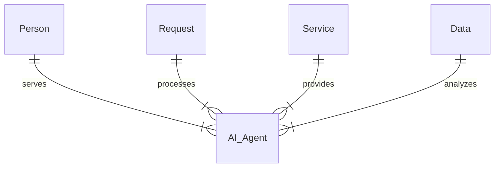

                 

### 政务AI Agent：提升公共服务效率

关键词：政务AI、公共服务、效率提升、技术与应用

摘要：本文深入探讨了政务AI Agent的概念、应用及其在提升公共服务效率方面的作用。首先，我们介绍了政务AI Agent的基本概念和其核心作用，并通过实例展示了AI在公共服务中的实际应用。接着，我们分析了政务AI Agent的技术基础和当前发展状况，探讨了不同类型的AI Agent及其在公共服务中的具体应用。文章随后详细讨论了政务AI Agent的设计和开发方法，包括核心技术和最佳实践。此外，我们还探讨了AI Agent的部署和管理策略，以及未来的发展趋势和面临的挑战。最后，我们对全文进行了总结，并提供了进一步学习和探索的建议。

### 引言：政务AI Agent的重要性

在当今数字化和智能化的时代，人工智能（AI）的应用正在逐步渗透到公共服务的各个领域。政务AI Agent，作为一种基于人工智能技术的智能化服务实体，正在成为提升公共服务效率的关键工具。政务AI Agent，通常是指由人工智能驱动的、专门为政府部门和公共服务机构设计的虚拟代理。这些代理能够自动处理各种任务，如信息查询、业务办理、数据分析等，从而大大提高服务的响应速度和效率。

#### 核心概念

政务AI Agent的核心概念可以归纳为以下几点：

1. **人工智能驱动**：政务AI Agent的核心在于其使用人工智能技术，特别是机器学习和自然语言处理（NLP）技术，来实现自动化和智能化。
2. **服务自动化**：政务AI Agent能够自动处理大量的公共服务任务，如回答常见问题、处理申请、数据分析等，从而减少人工干预。
3. **响应速度提升**：AI Agent能够24小时不间断地提供服务，响应时间比人工处理更加迅速。
4. **高效性**：通过自动化处理和智能分析，政务AI Agent能够显著提高公共服务的效率，减少等待时间和服务成本。

#### 重要性

政务AI Agent在提升公共服务效率方面的重要性体现在以下几个方面：

1. **服务质量提升**：AI Agent能够提供标准化、一致的服务，减少因人为因素导致的错误和服务质量波动。
2. **成本降低**：通过自动化处理，减少了人工成本，同时提升了工作效率，实现了成本和效益的双重优化。
3. **用户体验优化**：AI Agent能够提供实时、个性化的服务，提升用户的满意度和体验。
4. **数据分析能力**：AI Agent能够收集和分析大量的用户数据，为政府决策提供数据支持。

#### 内容概述

本文将按照以下结构展开：

1. **背景和核心概念**：介绍政务AI Agent的背景和发展，解释其核心概念和定义。
2. **AI Agent技术基础**：探讨AI Agent所依赖的关键技术，如机器学习和NLP等。
3. **AI Agent应用场景**：分析政务AI Agent在不同公共服务领域的应用，以及其带来的效益和挑战。
4. **设计和开发方法**：详细讨论政务AI Agent的设计和开发流程，包括技术和方法。
5. **部署和管理策略**：探讨政务AI Agent的部署和管理策略，以及数据隐私和安全问题。
6. **未来发展趋势和挑战**：预测政务AI Agent的未来发展方向，分析可能面临的挑战。
7. **总结与建议**：总结全文，提出进一步学习和探索的建议。

通过以上内容的深入探讨，我们希望能够全面了解政务AI Agent在提升公共服务效率方面的潜力和实际应用。

### 背景和核心概念

政务AI Agent的概念起源于人工智能技术在公共服务领域的广泛应用。随着大数据、云计算和物联网等技术的发展，政府部门开始意识到利用人工智能技术来提升服务效率和质量的重要性。政务AI Agent应运而生，成为公共服务智能化的重要工具。

#### 核心概念

政务AI Agent，即基于人工智能技术的虚拟代理，旨在为政府部门和公共服务提供高效、智能化的服务。它通过机器学习、自然语言处理（NLP）、计算机视觉等技术，实现自动化、智能化的任务处理和服务提供。

1. **虚拟代理**：政务AI Agent是一种虚拟的代理，它代表政府机构与公众进行交互，执行各种任务。
2. **自动化处理**：AI Agent能够自动处理大量的公共服务任务，如信息查询、业务办理、数据分析等，减少人工干预。
3. **智能化交互**：通过NLP技术，AI Agent能够理解用户的自然语言输入，并提供相应的回答和解决方案。
4. **高效数据分析和决策**：AI Agent能够对大量的数据进行分析，为政府决策提供科学依据。

#### 问题背景

在过去，公共服务的提供主要依赖于人工处理，这导致了服务效率低下、响应速度慢、服务质量不稳定等问题。随着公众对服务质量和效率的要求越来越高，传统的人工服务模式已经难以满足需求。而政务AI Agent的引入，则有望解决这些问题：

1. **效率低下**：传统的人工服务模式往往需要经过多个环节的审核和处理，导致服务流程冗长，效率低下。
2. **响应速度慢**：人工处理往往需要较长时间，尤其是在高峰期，服务响应速度慢，用户体验差。
3. **服务质量不稳定**：人工处理容易受到人为因素的影响，导致服务质量和效率波动较大。

#### 政务AI Agent的定义

政务AI Agent可以定义为一种基于人工智能技术的、专门为政府部门和公共服务机构设计的虚拟代理。它具有以下核心特征：

1. **高度智能化**：政务AI Agent通过机器学习和自然语言处理技术，能够自动理解和执行复杂的任务。
2. **高效自动化**：AI Agent能够自动处理大量的公共服务任务，减少人工干预，提高效率。
3. **个性化服务**：通过分析用户数据，AI Agent能够提供个性化的服务，提升用户体验。
4. **实时互动**：AI Agent能够与用户进行实时互动，回答问题、提供帮助，提高服务响应速度。

#### 边界与外延

政务AI Agent的应用边界和范围非常广泛，几乎涵盖了公共服务的各个方面。以下是一些常见的应用场景：

1. **政务咨询**：AI Agent能够提供各种政务咨询，如政策解读、法规查询等。
2. **行政审批**：AI Agent能够自动处理行政审批流程，如营业执照申请、房屋交易审批等。
3. **公共安全**：AI Agent能够协助政府部门进行公共安全管理，如交通监控、灾害预警等。
4. **公共服务查询**：AI Agent能够提供各类公共服务查询，如公交线路查询、医疗预约等。

#### 概念结构与核心要素组成

政务AI Agent的概念结构主要包括以下几个核心要素：

1. **数据输入**：政务AI Agent需要接收各种数据输入，包括文本、图像、语音等。
2. **数据处理**：AI Agent利用机器学习和自然语言处理技术对输入数据进行处理和分析。
3. **决策逻辑**：AI Agent根据处理结果，利用预设的决策逻辑生成相应的输出。
4. **输出反馈**：AI Agent将处理结果反馈给用户，提供相应的服务或解决方案。

通过以上核心要素的协同工作，政务AI Agent能够实现高效、智能化的公共服务提供。

### AI Agent技术基础

要理解政务AI Agent的工作原理和应用，首先需要了解其背后的技术基础。AI Agent的核心技术主要包括机器学习、自然语言处理（NLP）、计算机视觉等，这些技术共同构建了AI Agent的智能化和服务能力。

#### 机器学习技术

机器学习是AI Agent的核心技术之一，它使AI Agent能够通过学习大量数据来改进其性能。机器学习主要包括监督学习、无监督学习和强化学习等不同类型。

1. **监督学习**：监督学习是机器学习中的一种常见方法，它通过已有数据的标签来训练模型，以便对新数据进行预测。在政务AI Agent中，监督学习可以用于预测用户行为、分析公共事件等。
   $$ \text{预测函数} = f(\text{输入特征}, \text{标签}) $$
   
2. **无监督学习**：无监督学习不依赖于标签数据，通过发现数据中的模式和结构来训练模型。在政务AI Agent中，无监督学习可以用于聚类分析、异常检测等。

3. **强化学习**：强化学习是一种通过与环境的互动来学习最优策略的方法。在政务AI Agent中，强化学习可以用于自动化的决策过程，如交通管理、资源分配等。
   $$ \text{策略} = \pi (\text{状态}, \text{奖励}) $$

#### 自然语言处理（NLP）

自然语言处理是AI Agent理解和生成人类语言的关键技术。NLP技术包括文本分类、情感分析、问答系统等。

1. **文本分类**：文本分类是将文本数据归类到不同的类别中。在政务AI Agent中，文本分类可以用于自动分类政务信息、识别用户需求等。
   $$ \text{分类器} = \text{分类函数}(\text{文本}) $$

2. **情感分析**：情感分析用于判断文本的情感倾向，如正面、负面或中性。在政务AI Agent中，情感分析可以用于监测公众情绪、评估政策效果等。

3. **问答系统**：问答系统是一种能够理解用户问题并返回相应答案的技术。在政务AI Agent中，问答系统可以用于自动回答常见问题、提供政策解读等。

#### 计算机视觉技术

计算机视觉是AI Agent理解和解释图像和视频数据的关键技术。计算机视觉技术包括图像识别、目标检测、人脸识别等。

1. **图像识别**：图像识别是一种将图像映射到特定类别的方法。在政务AI Agent中，图像识别可以用于自动识别公共安全问题、监测交通状况等。

2. **目标检测**：目标检测是一种在图像中检测和定位特定对象的方法。在政务AI Agent中，目标检测可以用于监控公共安全、智能交通等。

3. **人脸识别**：人脸识别是一种通过人脸特征进行身份验证的方法。在政务AI Agent中，人脸识别可以用于身份认证、公共安全管理等。

#### 技术对比表格

为了更清晰地展示这些技术的特点和适用场景，我们可以通过以下对比表格来进行说明：

| 技术类型 | 特点 | 适用场景 |
| --- | --- | --- |
| 机器学习 | 通过数据学习改进性能 | 预测分析、自动化决策 |
| 自然语言处理 | 理解和生成人类语言 | 自动问答、情感分析 |
| 计算机视觉 | 理解和解释图像和视频 | 安全监控、交通管理 |

#### ER实体关系图

为了更好地理解政务AI Agent中的数据结构，我们可以使用ER（实体关系）图来表示其中的实体和关系。以下是政务AI Agent中的一些关键实体及其关系的ER图：

在这个ER图中，`Person`实体表示服务用户，`AI_Agent`实体表示政务AI代理，它们之间通过`serves`关系关联；`Request`实体表示用户请求，与`AI_Agent`通过`processes`关系关联；`Service`实体表示公共服务，与`AI_Agent`通过`provides`关系关联；`Data`实体表示数据，与`AI_Agent`通过`analyzes`关系关联。通过这种结构化的数据关系，政务AI Agent能够高效地处理和分析各种数据，为用户提供高质量的服务。

通过以上对机器学习、自然语言处理和计算机视觉技术的详细介绍，以及ER实体关系图的展示，我们可以更深入地理解政务AI Agent的技术基础及其在公共服务中的应用潜力。

### AI Agent应用场景

政务AI Agent在公共服务中的广泛应用已经得到了广泛的认可和接受。以下我们将探讨一些具体的AI Agent应用场景，并分析其带来的效益和挑战。

#### 情景一：政务服务咨询

在政务服务咨询方面，AI Agent可以充当虚拟咨询顾问，为公众提供政策解读、法律法规查询、办事指南等服务。通过自然语言处理技术，AI Agent能够理解用户的查询需求，并返回相应的答案。

**效益：**
1. **提升服务质量**：AI Agent能够提供标准化、一致的服务，减少因人为因素导致的服务质量波动。
2. **降低运营成本**：AI Agent可以处理大量查询，减少人工咨询的负担，从而降低运营成本。

**挑战：**
1. **知识库建设**：需要大量时间和资源来建立和维护AI Agent的知识库。
2. **用户体验**：AI Agent的智能程度和响应速度可能影响用户体验。

#### 情景二：行政审批

在行政审批领域，AI Agent可以自动处理各种审批流程，如营业执照申请、房屋交易审批等。AI Agent通过机器学习和数据挖掘技术，可以快速审核材料、生成审批结果，大大提高了审批效率。

**效益：**
1. **提高审批效率**：AI Agent可以自动化处理审批流程，缩短审批时间，提升工作效率。
2. **减少人为错误**：通过自动化处理，减少了人工干预，从而降低了人为错误的可能性。

**挑战：**
1. **数据安全和隐私**：审批过程中涉及大量的敏感数据，确保数据安全和隐私是一个重要挑战。
2. **政策适应性**：审批政策随时可能发生变化，AI Agent需要快速适应这些变化。

#### 情景三：公共安全监控

在公共安全监控方面，AI Agent可以用于交通监控、火灾预警、公共场所安全等。通过计算机视觉技术，AI Agent能够实时分析监控视频，发现异常情况并报警。

**效益：**
1. **实时监控**：AI Agent可以24小时不间断地监控公共安全，提高安全事件的响应速度。
2. **精确预警**：通过图像识别和目标检测技术，AI Agent能够精确地识别和预警潜在的安全威胁。

**挑战：**
1. **技术成熟度**：计算机视觉技术虽然发展迅速，但仍在一些复杂场景下存在准确性问题。
2. **法律法规**：公共安全监控涉及到隐私和法律法规问题，需要制定相应的规范和标准。

#### 情景四：公共服务查询

在公共服务查询方面，AI Agent可以为用户提供交通信息查询、医疗预约、教育咨询等服务。通过整合多种数据源，AI Agent能够提供实时、准确的服务。

**效益：**
1. **便捷服务**：用户可以通过AI Agent快速查询各种公共服务信息，方便快捷。
2. **降低等待时间**：AI Agent可以自动处理查询请求，减少用户的等待时间。

**挑战：**
1. **数据整合**：需要整合多种数据源，确保数据的准确性和实时性。
2. **用户隐私**：公共服务查询可能涉及用户隐私，需要确保数据安全和用户隐私保护。

通过上述应用场景的分析，我们可以看到政务AI Agent在公共服务中的广泛应用和巨大潜力。然而，要充分发挥其效益，仍需要克服各种挑战，不断提升技术成熟度和服务水平。

### 设计和开发AI Agent

设计和开发政务AI Agent是一项复杂且系统的工程，需要综合考虑技术、用户体验和实际应用场景。以下我们将详细讨论政务AI Agent的设计和开发方法，包括核心技术和最佳实践。

#### 设计步骤

1. **需求分析**：明确政务AI Agent的目标和需求，包括功能需求、性能需求和用户体验需求。这一步骤是整个设计和开发过程的基础，决定了后续设计的方向和深度。

2. **技术选型**：根据需求分析的结果，选择合适的技术栈和工具。常见的AI技术包括机器学习、自然语言处理（NLP）、计算机视觉等，而开发工具则包括Python、R等编程语言，TensorFlow、PyTorch等框架。

3. **架构设计**：设计政务AI Agent的系统架构，包括数据层、服务层、应用层等。架构设计需要考虑模块化、扩展性和可维护性，以确保系统能够应对未来可能的需求变化。

4. **模块开发**：按照架构设计，逐步开发各个模块，如数据采集模块、数据处理模块、预测模块、用户交互模块等。每个模块都需要经过详细的测试和验证，以确保其功能正确性和性能稳定性。

5. **集成测试**：将各个模块集成到一起，进行系统测试，确保系统整体功能完整、性能良好。集成测试需要覆盖各种可能的场景和异常情况，以确保系统的可靠性。

6. **用户测试**：邀请用户参与测试，收集用户反馈，进一步优化政务AI Agent的功能和用户体验。用户测试是确保政务AI Agent能够满足实际需求的重要环节。

7. **部署上线**：将政务AI Agent部署到实际环境中，进行上线运行。上线前需要进行详细的准备工作，如环境配置、数据准备、安全防护等。

#### 核心技术

1. **机器学习**：政务AI Agent的核心技术之一是机器学习。通过机器学习，AI Agent可以自动学习和改进其性能。常见的机器学习算法包括线性回归、决策树、随机森林、支持向量机、神经网络等。

2. **自然语言处理（NLP）**：NLP技术是政务AI Agent理解和生成人类语言的关键。NLP技术包括文本分类、情感分析、命名实体识别、问答系统等。常用的NLP工具和库包括NLTK、spaCy、TensorFlow、PyTorch等。

3. **计算机视觉**：计算机视觉技术用于政务AI Agent理解和解释图像和视频数据。计算机视觉技术包括图像识别、目标检测、人脸识别等。常用的计算机视觉库和框架包括OpenCV、TensorFlow、PyTorch等。

#### 最佳实践

1. **模块化设计**：将政务AI Agent拆分成多个模块，如数据采集模块、数据处理模块、预测模块、用户交互模块等，每个模块独立开发、测试和部署。这种模块化设计可以提高开发效率，降低系统复杂度。

2. **数据驱动**：政务AI Agent的性能依赖于数据质量。因此，需要建立完善的数据采集、处理和存储机制，确保数据的质量和完整性。同时，数据驱动的方法可以帮助AI Agent不断学习和改进。

3. **用户体验优先**：政务AI Agent的设计和开发需要优先考虑用户体验。通过用户测试和反馈，不断优化界面设计和交互流程，确保政务AI Agent能够提供便捷、高效的服务。

4. **安全性和隐私保护**：政务AI Agent涉及到大量的敏感数据，需要确保数据的安全性和用户隐私。在设计过程中，需要考虑数据加密、访问控制、安全审计等安全措施。

5. **持续迭代和优化**：政务AI Agent的开发是一个持续迭代和优化的过程。通过定期更新算法、改进模型、优化系统，确保政务AI Agent能够保持高性能和高质量的服务。

通过以上设计和开发方法，我们可以有效地构建和部署政务AI Agent，为公共服务提供高效、智能化的解决方案。然而，这需要不断学习和积累经验，以应对不断变化的需求和挑战。

### AI Agent的部署和管理策略

部署和管理政务AI Agent是确保其高效运行和持续优化的重要环节。以下是关于AI Agent部署和管理的详细策略。

#### 部署策略

1. **云部署**：云部署是一种流行的选择，它提供了弹性和可扩展性，可以轻松处理大量数据和高并发请求。通过云服务，AI Agent可以在不同的地区和环境中快速部署，提高服务可用性和可靠性。

2. **边缘计算**：在公共服务的某些场景中，如实时监控和紧急响应，使用边缘计算可以降低延迟，提高响应速度。边缘计算将数据处理和计算能力转移到网络边缘，从而减少对中心服务器的依赖。

3. **分布式架构**：采用分布式架构可以确保AI Agent的高可用性和可扩展性。通过将任务分配到多个服务器和节点，可以避免单点故障，同时支持大规模的数据处理和计算需求。

#### 管理策略

1. **自动化监控**：使用自动化监控工具可以实时监测AI Agent的性能和健康状况，包括处理速度、响应时间、资源使用等。自动化监控可以帮助及时发现和解决潜在问题，确保系统稳定运行。

2. **日志管理和分析**：记录和存储AI Agent的运行日志，并对日志进行分析和监控，可以提供宝贵的运行数据和问题诊断信息。日志管理可以帮助追踪错误、优化性能，并提供重要的参考数据。

3. **性能优化**：定期对AI Agent进行性能优化，包括算法改进、模型更新和系统调优等，可以确保其始终保持最佳运行状态。性能优化需要基于实际运行数据进行分析和调整，以提高效率和准确性。

4. **数据安全与隐私保护**：在部署和管理AI Agent的过程中，需要严格确保数据的安全性和隐私保护。这包括使用数据加密、访问控制、安全审计等安全措施，以防止数据泄露和未经授权的访问。

5. **用户体验反馈**：定期收集用户反馈，并根据用户反馈进行系统优化和改进。用户体验是衡量AI Agent服务质量的重要指标，通过持续优化，可以提升用户满意度和忠诚度。

#### 具体部署步骤

1. **环境配置**：在部署前，需要进行环境配置，包括安装所需的软件和依赖库，配置网络和存储资源等。确保所有硬件和软件环境满足AI Agent的运行需求。

2. **数据准备**：AI Agent的运行依赖于大量数据，因此需要在部署前准备好数据，包括数据采集、清洗、预处理等步骤。确保数据的完整性和准确性，以提高AI Agent的性能和可靠性。

3. **模型部署**：将训练好的模型部署到生产环境中，使用适当的框架和工具进行模型加载和部署。确保模型能够与实际数据和环境兼容，并能够高效地运行。

4. **监控和日志记录**：启动AI Agent的监控和日志记录功能，确保能够实时监测其性能和健康状况。收集和分析运行日志，及时发现和解决问题。

5. **测试和验证**：在部署后进行全面的测试和验证，包括功能测试、性能测试、安全测试等，确保AI Agent能够正常运行，并满足预期的性能和安全性要求。

通过以上部署和管理策略，我们可以有效地部署和管理政务AI Agent，确保其高效运行和持续优化，为公共服务提供稳定、可靠的支持。

### 未来发展趋势和挑战

#### 未来发展趋势

1. **技术进步**：随着人工智能、大数据、物联网等技术的不断进步，政务AI Agent的智能化水平和应用范围将进一步扩大。特别是在深度学习和强化学习等前沿技术的推动下，政务AI Agent将能够处理更复杂、更智能化的任务。

2. **智能城市的普及**：智能城市的发展为政务AI Agent提供了广阔的应用场景。在未来，政务AI Agent将集成到智慧交通、智慧医疗、智慧教育等领域，实现全方位的智能化服务。

3. **跨领域合作**：政务AI Agent的发展将推动不同领域之间的合作，如政府与企业的合作、政府与其他政府机构的合作等。跨领域合作将促进政务AI Agent的普及和应用，实现资源共享和协同发展。

4. **用户体验优化**：政务AI Agent将更加注重用户体验，通过个性化服务和自适应交互，提供更加贴心、便捷的服务。未来的政务AI Agent将能够根据用户的历史行为和偏好，提供定制化的服务和建议。

#### 挑战

1. **数据隐私和安全**：政务AI Agent处理大量敏感数据，如个人隐私、财务信息等，确保数据安全和隐私保护是一个重要挑战。未来的发展需要建立更加严格的数据保护机制和安全标准，以防止数据泄露和滥用。

2. **技术依赖和风险**：政务AI Agent的运行高度依赖人工智能技术，一旦技术出现故障或被恶意攻击，可能引发严重后果。因此，需要建立冗余机制和风险预警系统，确保政务AI Agent的稳定运行。

3. **法律和伦理问题**：政务AI Agent的广泛应用引发了法律和伦理问题，如责任归属、隐私权保护、算法偏见等。需要制定相应的法律法规和伦理规范，确保政务AI Agent的合法、合规运行。

4. **技术人才短缺**：政务AI Agent的开发和运维需要大量的技术人才，而目前我国相关人才储备不足，这将成为政务AI Agent普及和发展的一大瓶颈。未来的发展需要加大人才培养力度，提高技术人才的整体水平。

#### 结论

政务AI Agent在提升公共服务效率方面具有巨大的潜力和前景，但同时也面临着诸多挑战。未来，随着技术的进步和政策的支持，政务AI Agent将得到更加广泛的应用和发展。我们需要积极应对挑战，制定相应的策略和措施，确保政务AI Agent的健康、稳定和可持续发展。

### 总结与展望

通过本文的探讨，我们系统地了解了政务AI Agent的概念、应用及其在提升公共服务效率方面的作用。政务AI Agent作为一种基于人工智能技术的虚拟代理，能够自动处理各种公共服务任务，提高服务质量和响应速度，降低运营成本。从背景介绍、核心概念到技术基础、应用场景、设计和开发方法，再到部署与管理策略及未来发展趋势，我们全面分析了政务AI Agent的各个方面。

政务AI Agent的应用场景包括政务服务咨询、行政审批、公共安全监控、公共服务查询等，这些应用不仅提升了服务效率，还优化了用户体验，降低了服务成本。在设计和开发过程中，我们需要遵循模块化设计、数据驱动、用户体验优先等最佳实践，确保政务AI Agent的高效性和可靠性。同时，在部署和管理方面，需要采用自动化监控、数据安全与隐私保护等策略，确保系统的稳定运行。

展望未来，政务AI Agent的发展将受到技术进步、智能城市普及、跨领域合作等多方面因素的推动。然而，数据隐私和安全、技术依赖与风险、法律和伦理问题、技术人才短缺等挑战也需要我们积极应对。为此，我们呼吁政府、企业、学术界和公众共同努力，推动政务AI Agent的健康、稳定和可持续发展。

### 进一步阅读和探索

对于对政务AI Agent有兴趣的读者，以下是一些推荐书籍、学术论文和在线资源，以帮助您更深入地了解这一领域的最新进展和技术细节。

#### 推荐书籍

1. **《人工智能：一种现代的方法》（Artificial Intelligence: A Modern Approach）** - Stuart J. Russell 和 Peter Norvig 著。这本书是人工智能领域的经典教材，全面介绍了人工智能的基本概念和技术，包括机器学习、自然语言处理等。
2. **《深度学习》（Deep Learning）** - Ian Goodfellow、Yoshua Bengio 和 Aaron Courville 著。这本书详细介绍了深度学习的基本原理和应用，是深度学习领域的重要参考书籍。

#### 推荐学术论文

1. **“Speech recognition using large vocabulary continuous speech models”** - D. H. Graf et al.（1992）。这篇论文详细介绍了大规模语音识别系统的构建方法，对自然语言处理技术有重要意义。
2. **“Deep Neural Networks for Acoustic Modeling in Speech Recognition”** - D. Amodei et al.（2016）。这篇论文介绍了深度神经网络在语音识别中的应用，展示了深度学习技术在该领域的突破。

#### 推荐在线资源

1. **[TensorFlow官方文档](https://www.tensorflow.org/)**。TensorFlow是深度学习领域广泛使用的开源框架，官方文档提供了详细的技术指导和教程，适合初学者和专业人士。
2. **[GitHub上的AI项目](https://github.com/topics/ai)**。GitHub上有大量的AI项目，涵盖了机器学习、自然语言处理、计算机视觉等多个领域，是学习和实践的好资源。

通过阅读这些书籍、学术论文和在线资源，您可以进一步了解政务AI Agent的深度技术和实际应用，为未来在这一领域的工作和研究打下坚实基础。

