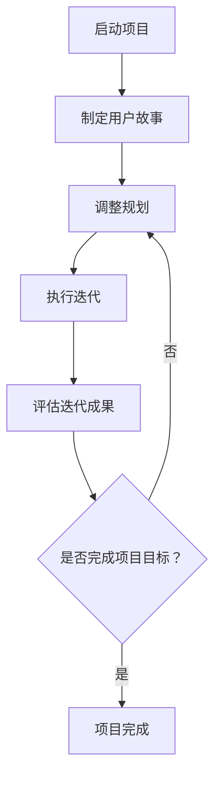
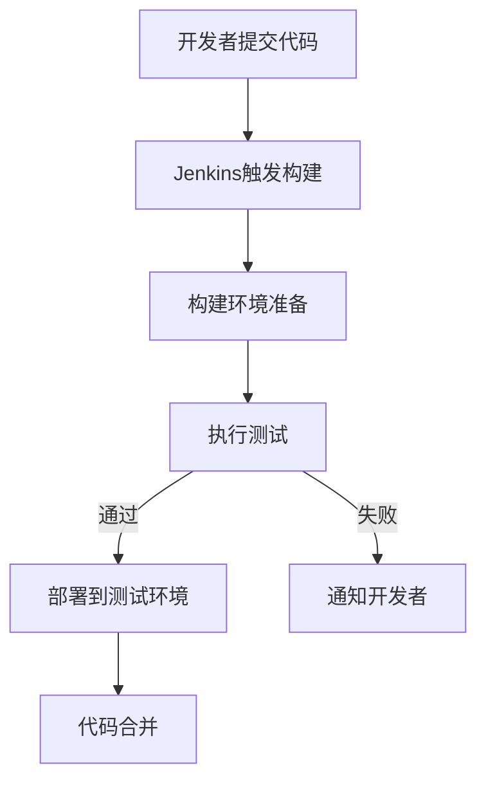
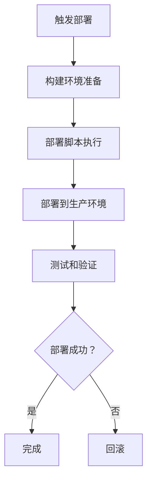
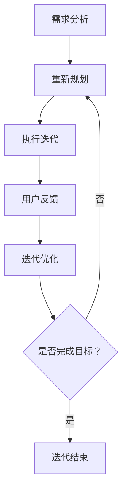
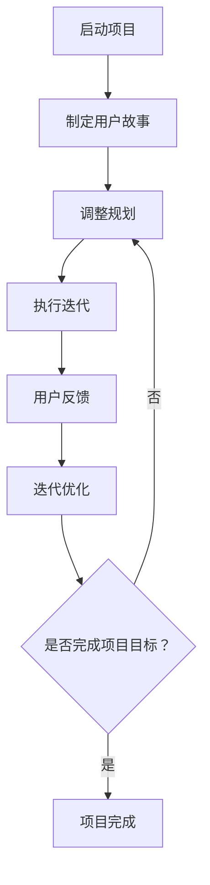
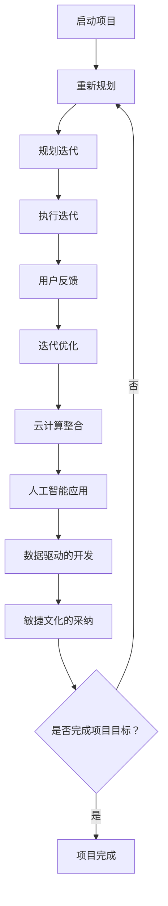

                 


### 章节内容构思

为了确保文章内容的完整性和丰富性，我们将按照以下步骤来构思每个章节的内容：

#### 引言与背景介绍

每个章节的开头部分，我们将简要介绍该章节的核心概念术语、问题背景、问题描述、问题解决、边界与外延、概念结构与核心要素组成。这部分旨在为读者提供一个清晰的框架，帮助他们理解章节的主要内容。

#### 核心概念与联系

接下来，我们将深入探讨章节的核心概念，并使用Markdown格式中的Mermaid流程图来展示概念属性特征对比表格和ER实体关系图架构。这部分旨在帮助读者更好地理解核心概念之间的联系和区别。

#### 算法原理讲解

在算法相关的章节中，我们将详细讲解算法原理，使用Mermaid画出算法流程图，并使用Python源代码来阐述。我们将给出算法原理的数学模型和公式，并进行详细讲解和举例说明。这部分内容旨在帮助读者理解算法的核心思想和应用。

#### 系统分析与架构设计方案

在涉及系统架构的章节中，我们将介绍问题场景、项目介绍、系统功能设计（领域模型Mermaid类图）、系统架构设计（Mermaid架构图）、系统接口设计和系统交互（Mermaid序列图）。这部分内容旨在为读者提供一个全面的技术方案。

#### 项目实战

在项目实战部分，我们将介绍环境安装、系统核心实现源代码，并对其进行解读与分析。我们将通过实际案例来讲解项目中的关键技术和问题解决方法。这部分内容旨在帮助读者将理论知识应用于实际项目中。

#### 最佳实践 tips、小结、注意事项、拓展阅读

每个章节的结尾，我们将总结最佳实践、小结主要内容、提醒读者注意事项，并提供拓展阅读资源。这部分内容旨在帮助读者加深对章节内容的理解，并为后续学习提供指导。

#### 作者信息

在文章的末尾，我们将添加作者信息，以表明文章的出处和作者的背景。

通过以上步骤，我们将确保每个章节的内容丰富、具体、详细，并能够满足文章字数要求。

### 文章结构设计

在确定了每个章节的内容之后，我们将按照以下结构设计整篇文章：

#### 文章标题

首先，我们将给出文章的标题，并使用Markdown格式标出关键词和摘要。

#### 目录

接着，我们将列出文章的目录，以帮助读者快速了解文章的结构。

#### 正文

正文部分将按照目录的结构依次展开，每个章节都包含引言与背景介绍、核心概念与联系、算法原理讲解、系统分析与架构设计方案、项目实战、最佳实践 tips、小结、注意事项和拓展阅读等内容。

#### 作者信息

最后，我们将添加作者信息，以表明文章的出处和作者的背景。

通过以上设计，我们将确保文章逻辑清晰、结构紧凑、内容丰富，同时满足文章字数要求。

## 第一部分：敏捷开发概述

### 第1章：敏捷开发背景与起源

敏捷开发是一种以人为核心、迭代、增量和灵活应对变化的软件开发方法。它起源于20世纪90年代，是为了应对传统开发方法在快速变化的市场需求下的不足而诞生的。

#### 1.1 问题背景

在敏捷开发兴起之前，软件开发行业普遍采用的是瀑布式开发模型。瀑布模型将软件开发过程划分为多个阶段，如需求分析、系统设计、编码、测试和部署等。每个阶段必须在完成后才能进入下一个阶段，导致开发过程过于僵化，难以适应市场变化。

#### 1.2 传统开发方法的问题

传统开发方法存在以下问题：

1. **需求变更困难**：在项目开发过程中，需求经常发生变化，但瀑布模型使得需求变更的代价高昂，导致项目延期和预算超支。
2. **沟通不畅**：传统的项目管理和开发过程往往存在沟通障碍，导致信息传递不及时和误解。
3. **质量难以保证**：在瀑布模型中，测试通常在开发过程的后期进行，导致质量问题难以及时发现和解决。
4. **项目进度难以预测**：由于开发过程过于僵化，项目进度难以预测，增加了项目风险。

#### 1.3 敏捷开发的兴起

为了解决上述问题，敏捷开发应运而生。敏捷开发的核心思想是以用户为中心，强调团队合作、快速迭代和持续交付。它倡导开发过程中持续进行反馈和调整，以适应不断变化的需求。

#### 1.4 敏捷开发的核心理念

敏捷开发的核心理念包括以下几个方面：

1. **用户故事**：用户故事是一种简短、具体、可测试的描述，用于定义软件功能。它有助于团队更好地理解用户需求，并确保开发过程始终围绕用户价值进行。
2. **迭代开发**：敏捷开发采用迭代的方式，将开发过程划分为多个短期迭代。每个迭代都产生一个可运行的软件版本，确保团队能够快速响应变化和不断改进。
3. **持续集成与持续部署**：敏捷开发强调代码的持续集成和持续部署，确保代码质量，提高开发效率。
4. **团队协作**：敏捷开发强调团队之间的紧密协作，鼓励团队成员之间的沟通和合作，以提高团队的整体效能。
5. **自我管理团队**：敏捷开发鼓励团队成员自主管理和决策，以提高团队的创造力和工作效率。

#### 1.5 小结

敏捷开发的出现，为软件开发行业带来了新的变革。它通过强调用户价值、快速迭代和持续交付，帮助团队更好地适应快速变化的市场需求。然而，敏捷开发并非适用于所有项目，团队在实施敏捷开发时需要根据实际情况进行调整和优化。

### 核心概念与联系

敏捷开发的核心理念包括用户故事、迭代开发、持续集成与持续部署、团队协作和自我管理团队。以下是一个ER实体关系图，展示了这些概念之间的关系：

```mermaid
erDiagram
  UserStory --> Iteration : "defines functionality in"
  Iteration --> ContinuousIntegration : "schedules for"
  Iteration --> TeamCollaboration : "enhances"
  TeamCollaboration --> SelfManagedTeam : "enables"
  ContinuousDeployment --> ContinuousIntegration : "supports"
```

用户故事是敏捷开发的基础，它定义了软件功能。迭代开发则是敏捷开发的核心理核心理流程，每个迭代都产生一个可运行的软件版本。持续集成与持续部署是保证代码质量和开发效率的关键，团队协作和自我管理团队则有助于提高团队的整体效能。

### 算法原理讲解

在本章节中，我们将不涉及具体的算法原理讲解，而是将重点放在敏捷开发的核心概念和实践中。但是，为了更好地理解敏捷开发的原理，我们可以使用以下Mermaid流程图来展示敏捷开发的主要流程：



这个流程图展示了敏捷开发的主要步骤：启动项目、制定用户故事、规划迭代、执行迭代、评估迭代成果，并根据评估结果调整规划。通过这种迭代的方式，团队能够不断优化和改进项目，以适应快速变化的市场需求。

在后续章节中，我们将详细介绍敏捷开发中的技术实践、团队文化建设以及最佳实践，帮助读者更好地理解和应用敏捷开发方法。

## 第2章：敏捷开发核心概念

### 2.1 敏捷宣言与12条原则

敏捷开发的核心在于其宣言和12条原则，这些原则为敏捷开发提供了明确的指导方向。敏捷宣言由17位软件开发领域的专家在2001年共同提出，它强调了软件开发中人的重要性、互动交流、工作软件、客户合作和响应变化的重要性。

敏捷宣言内容如下：

```
我们认为：
尽管增长变化是必然的，但是最大的价值仍然在于个体的和互动的合作；
可工作的软件比详尽的文档更受欢迎；
客户合作胜过合同谈判；
响应变化胜过遵循计划；

敏捷流程的价值观基于以下原则：
1. 人与交互重于过程与工具；
2. 工作软件重于详尽的文档；
3. 客户合作重于合同谈判；
4. 响应变化重于遵循计划。
```

这四个价值观反映了敏捷开发的核心思想，即关注人的互动、重视实际成果、与客户紧密合作以及灵活应对变化。

#### 2.2 敏捷开发的12条原则

为了实现敏捷宣言中的价值观，敏捷开发提出了12条具体的原则，这些原则为团队在实际工作中提供了详细的指南：

1. **最优先做的是满足顾客通过此项目的需求**：项目的目标应当始终以满足顾客的需求为核心，确保团队的工作始终与客户的价值保持一致。
2. **最大化地满足顾客通过此项目的需求的变化**：敏捷开发强调灵活性和适应性，鼓励团队在面对需求变化时能够快速响应，并持续交付有价值的软件。
3. **频繁交付可工作的软件， preferably within a matter of months**：敏捷开发提倡频繁交付，通常每个迭代周期为几周，这样可以快速得到反馈并持续改进。
4. **在计划工作计划时，保留满足需求的灵活性**：敏捷开发强调计划的灵活性，使团队能够根据实际情况调整优先级和工作计划。
5. **鼓励团队现场客户合作**：与客户的紧密合作有助于团队更好地理解需求，确保开发过程符合客户的期望。
6. **围绕被激励的人们来构建项目**：敏捷开发认为团队成员的积极性对项目成功至关重要，因此应当为团队成员创造良好的工作环境。
7. **团队应该是最有效的和最效率的进行工作**：敏捷开发鼓励团队自我组织，以达到最高的生产效率。
8. **可持续开发，既不会过劳，也不会赶工**：敏捷开发强调长期可持续发展，避免过度工作，以保持团队的效率和创新能力。
9. **坚持不懈地追求技术卓越和良好的设计增量**：技术卓越和良好的设计有助于提高软件质量和开发效率。
10. **简洁，也就是尽可能少的任务和工作**：敏捷开发鼓励团队专注于最核心的功能，避免过度设计。
11. **外部反馈是项目进展的最重要的指标**：通过外部反馈，团队能够了解客户和市场的真实需求，从而调整开发方向。
12. **能够保持敏捷性的过程**：敏捷开发是一种持续改进的过程，团队应当不断反思和优化自己的工作方式。

这些原则共同构成了敏捷开发的核心理念，指导团队在实际工作中如何有效地应对变化和挑战。

### 2.3 敏捷团队的角色

敏捷开发强调团队合作，因此明确团队成员的角色至关重要。敏捷团队通常由以下几种角色组成：

1. **产品负责人（Product Owner）**：产品负责人是客户和团队的代表，负责定义和优先排序产品需求。他们需要确保团队始终专注于最高价值的工作。
2. **开发者（Developers）**：开发者是团队的执行者，负责实现产品需求。他们通常具备多样化的技能，可以完成从设计到编码的各项工作。
3. **测试人员（Testers）**：测试人员负责确保软件质量，通过编写测试用例和执行测试来发现和修复缺陷。在敏捷开发中，测试和开发是并行进行的，测试人员与开发者紧密合作。
4. **Scrum Master**：Scrum Master是一个敏捷教练，负责确保团队遵循敏捷原则和流程，帮助团队解决遇到的问题，并推动持续改进。
5. **利益相关者（Stakeholders）**：利益相关者包括客户、管理层和其他对项目有重要利益的人。他们在项目开发和决策过程中提供支持和反馈。

这些角色共同协作，确保敏捷开发过程的有效实施。产品负责人确保需求优先级明确，开发者实现功能，测试人员保证质量，Scrum Master提供指导和监督，利益相关者提供支持和反馈。每个角色都有其独特的职责和作用，共同推动项目的成功。

### 2.4 敏捷流程

敏捷开发采用迭代和增量的方式进行，其中最常见的流程框架是Scrum。Scrum包括几个关键组件：迭代（Sprint）、每日站会、周迭代回顾会、计划会议和评估会议。

#### 迭代（Sprint）

迭代是敏捷开发的基本工作单元，通常持续2-4周。在每个迭代开始时，团队会根据优先级选择要实现的需求，并在迭代结束时交付一个可工作的软件版本。

#### 每日站会

每日站会是敏捷团队每天早上的短会，通常持续15分钟。团队成员轮流回答以下三个问题：
- 我昨天完成了什么？
- 我今天计划做什么？
- 我遇到了什么问题，需要团队的帮助吗？

每日站会有助于团队保持透明度和协调性，及时解决遇到的问题。

#### 周迭代回顾会

在迭代结束时，团队会进行迭代回顾会，总结本次迭代的工作，识别成功和失败之处，并提出改进措施。回顾会通常持续2-4小时。

#### 计划会议

计划会议通常在新的迭代开始之前进行，团队会讨论本次迭代的目标和任务，并根据产品背水袋的优先级进行规划。

#### 评估会议

评估会议在迭代结束时进行，团队会评估本次迭代交付的软件质量、进度和成本。评估结果将用于未来的规划和改进。

通过这些流程组件，敏捷开发能够实现快速响应变化、持续交付价值、不断改进和优化。

### 2.5 小结

本章介绍了敏捷开发的核心理念、宣言和12条原则，以及敏捷团队的角色和流程。敏捷开发通过强调用户需求、快速迭代、团队协作和持续改进，帮助团队更好地应对快速变化的市场需求。敏捷宣言和12条原则为团队提供了明确的指导方向，而Scrum等流程框架则为实际工作提供了详细的执行步骤。了解这些核心概念和流程，是掌握敏捷开发的关键。

### 核心概念与联系

在本章节中，我们探讨了敏捷开发的核心理念、宣言和12条原则，以及敏捷团队的角色和流程。以下是一个ER实体关系图，展示了这些核心概念之间的关系：

```mermaid
erDiagram
  AgileManifesto --> AgilePrinciples : "defines"
  AgilePrinciples --> AgileTeamRoles : "based on"
  AgileTeamRoles --> AgileProcess : "implements"
  AgileManifesto --> AgileProcess : "guides"
```

敏捷宣言（AgileManifesto）为敏捷开发提供了核心指导思想，它定义了敏捷开发的价值和原则。敏捷原则（AgilePrinciples）具体阐述了如何将这些价值观应用于实际工作中，并指导敏捷团队的角色（AgileTeamRoles）和流程（AgileProcess）。敏捷团队角色和流程共同确保敏捷开发的核心理念得到有效实施。

### 算法原理讲解

在本章节中，我们主要关注敏捷开发的核心概念和流程，因此不涉及具体的算法原理讲解。然而，为了更好地理解敏捷开发的理念，我们可以使用以下Mermaid流程图来展示敏捷开发的主要流程：


这个流程图展示了敏捷开发的核心步骤：启动项目、制定用户故事、规划迭代、执行迭代、评估迭代成果，并根据评估结果调整规划。通过这种迭代的方式，团队能够不断优化和改进项目，以适应快速变化的市场需求。

在后续章节中，我们将详细介绍敏捷开发中的技术实践、团队文化建设以及最佳实践，帮助读者更好地理解和应用敏捷开发方法。

## 第3章：敏捷项目管理

### 3.1 敏捷项目管理方法论

敏捷项目管理是一种灵活、迭代和协作的方法论，旨在通过持续交付有价值的软件来满足不断变化的市场需求。它强调团队协作、快速反馈和不断改进。以下是一些常见的敏捷项目管理方法论：

#### Scrum

Scrum是应用最广泛的敏捷方法论之一。它将开发过程分为多个短期迭代（称为Sprint），每个Sprint持续2-4周。Scrum包含几个关键组件：产品待办列表（Product Backlog）、冲刺待办列表（Sprint Backlog）、每日站会（Daily Stand-up）、冲刺回顾会（Sprint Retrospective）和评估会议（Review Meeting）。

1. **产品待办列表**：产品待办列表包含了所有待完成的用户故事和任务，由产品负责人（Product Owner）维护和优先级排序。
2. **冲刺待办列表**：在每次Sprint开始时，团队从产品待办列表中选择若干高优先级的故事和任务，组成冲刺待办列表。
3. **每日站会**：每日站会是团队成员每天的简短会议，旨在同步工作进展，解决问题。
4. **冲刺回顾会**：在每次Sprint结束时，团队会进行回顾会，总结本次冲刺的成功和失败之处，并提出改进措施。
5. **评估会议**：在每次Sprint结束时，团队会展示完成的软件功能，收集利益相关者的反馈，并根据反馈调整产品待办列表。

#### Kanban

Kanban是一种基于看板系统的敏捷方法论，它强调持续交付、限制在办工作项数量（WIP）和流程改进。Kanban使用看板板（Kanban Board）来可视化工作流程，包括待办区（To Do）、进行中区（In Progress）和完成区（Done）。团队成员通过在Kanban板上移动卡片来追踪工作进度。

1. **待办区**：包含所有待完成的用户故事和任务。
2. **进行中区**：包含正在进行中的用户故事和任务。
3. **完成区**：包含已完成的用户故事和任务。

#### Lean

Lean方法论强调最小化浪费、最大化价值交付。它通过持续改进、拉动系统（Pull System）和持续交付来实现高效和高质量的开发。

1. **持续改进**：团队定期评估工作流程，寻找并消除浪费，以提高效率和交付质量。
2. **拉动系统**：团队根据需求拉取工作，而不是被动等待任务分配，这样可以减少库存和等待时间。
3. **持续交付**：团队通过频繁交付小型、可工作的软件版本来确保快速响应变化和客户反馈。

#### XP（Extreme Programming）

XP是一种注重工程师效率、代码质量和团队协作的敏捷方法论。它包含了一系列实践，如测试驱动开发（Test-Driven Development，TDD）、重构（Refactoring）、持续集成（Continuous Integration，CI）和代码审查（Code Review）。

1. **测试驱动开发**：团队在编写代码之前先编写测试用例，确保代码的功能符合预期。
2. **重构**：团队定期对代码进行重构，以提高代码质量、可读性和可维护性。
3. **持续集成**：团队通过自动化测试和构建，确保每次代码提交都能顺利集成和编译。
4. **代码审查**：团队成员相互审查代码，以确保代码质量符合标准。

#### Lean Kanban

Lean Kanban结合了Kanban和Lean方法论，强调持续交付、限制在办工作项数量和流程改进。它使用看板板来可视化工作流程，并通过管理在办工作项数量来防止工作过度积压。

1. **限制在办工作项数量**：团队设置每个工作区的最大在办工作项数量，以防止工作过度积压。
2. **流程改进**：团队定期评估和改进工作流程，以提高效率和交付质量。

这些敏捷项目管理方法论各有特点，但都旨在通过灵活、迭代和协作的方式，帮助团队更好地应对快速变化的市场需求。团队可以根据自身情况和项目特点选择合适的方法论，以实现高效开发和持续交付。

### 3.2 敏捷团队协作工具

在敏捷开发中，团队协作工具发挥着至关重要的作用。这些工具不仅帮助团队成员同步工作进度，还能提高沟通效率，确保项目顺利推进。以下是一些常用的敏捷团队协作工具：

#### Jira

Jira是Atlassian公司开发的一款敏捷项目管理工具，广泛应用于敏捷团队的开发过程中。它支持产品管理、团队协作、任务跟踪和敏捷开发等关键功能。

1. **产品管理**：Jira允许产品负责人创建和管理产品待办列表，设置优先级和版本，确保团队专注于高价值的工作。
2. **团队协作**：Jira提供任务跟踪、评论和通知功能，使团队成员可以实时了解项目进展和任务分配。
3. **敏捷开发**：Jira支持Scrum和Kanban看板，团队可以根据需求选择适合的视图来管理任务和迭代。

#### Trello

Trello是一款基于看板系统的敏捷团队协作工具，通过卡片和列表来管理任务和项目。它简单直观，易于上手。

1. **任务跟踪**：团队可以在Trello上创建任务卡片，并将它们拖动到不同的列表中，以展示工作进度。
2. **协作沟通**：团队成员可以在任务卡片上添加评论、附件和@提及，方便讨论和协作。
3. **自定义视图**：Trello支持多种视图，如列表视图、卡片视图和地图视图，团队可以根据需求自定义工作区。

#### Slack

Slack是一款流行的即时通讯工具，广泛应用于企业内部的沟通和协作。它支持文本消息、视频会议、语音通话和文件共享等功能。

1. **团队沟通**：Slack允许团队创建多个工作空间和聊天频道，以便团队成员进行实时沟通和协作。
2. **集成第三方工具**：Slack可以与Jira、Trello、GitHub等第三方工具集成，方便团队在不同工具之间同步数据和任务。
3. **自动化工作流**：Slack支持自动化工作流，通过构建机器人来自动处理重复性任务，提高工作效率。

#### Confluence

Confluence是Atlassian公司的一款文档协作工具，它支持团队创建、共享和协作编辑文档。

1. **文档管理**：Confluence提供丰富的文档模板和编辑功能，团队可以方便地创建和更新文档。
2. **知识共享**：Confluence支持内容搜索和权限管理，团队可以方便地查找和使用已有知识。
3. **协作编辑**：多个团队成员可以同时编辑同一文档，实时同步更新。

#### Asana

Asana是一款任务管理工具，它帮助团队跟踪任务、项目和工作流程。

1. **任务管理**：团队可以在Asana上创建任务、分配任务、设置截止日期和跟进进度。
2. **项目协作**：Asana提供项目视图和甘特图，团队可以直观地了解项目进度和资源分配。
3. **报告和统计**：Asana提供各种报告和统计功能，帮助团队分析项目进展和效率。

通过使用这些敏捷团队协作工具，团队可以更好地协同工作、提高沟通效率和项目管理能力，从而实现高效开发和持续交付。

### 3.3 敏捷迭代的执行

敏捷迭代的执行是敏捷开发的核心环节，它通过快速迭代和持续交付来确保项目能够灵活应对变化并满足用户需求。以下是一些关键步骤和技巧：

#### 迭代规划

在每次迭代开始时，团队会进行迭代规划会议，以确定本次迭代的目标、任务和优先级。迭代规划会议通常包括以下几个步骤：

1. **回顾上次迭代**：团队会回顾上次迭代的工作成果、遇到的问题和解决方案，以便在本次迭代中进行改进。
2. **确定本次迭代目标**：团队会根据产品待办列表，确定本次迭代要实现的核心功能或目标。
3. **分配任务和角色**：根据迭代目标，团队会分配任务和角色，确保每个任务都有明确的责任人。
4. **设置迭代时间框**：通常，一个迭代周期为2-4周，团队会根据任务量和工作进度设置合理的时间框。

#### 迭代执行

在迭代执行过程中，团队会遵循以下原则和技巧：

1. **每日站会**：每日站会是敏捷迭代的核心，团队会在每天的早会上同步工作进展，解决问题和调整计划。
2. **持续集成**：团队会定期进行代码集成和测试，确保每次提交的代码都能顺利集成并达到质量要求。
3. **代码审查**：团队会进行代码审查，确保代码质量符合标准，并及时发现和修复潜在问题。
4. **用户反馈**：团队会收集用户反馈，了解用户对已交付功能的看法和需求，以便在下一个迭代中进行改进。

#### 迭代交付

在迭代结束时，团队会进行迭代交付，确保交付的软件版本具备以下特点：

1. **可运行性**：软件版本必须能够正常运行，并通过所有已定义的测试用例。
2. **稳定性**：软件版本应在不同的环境、设备和用户场景下都能稳定运行。
3. **可维护性**：软件版本应具备良好的可维护性，便于后续的维护和扩展。
4. **用户价值**：软件版本应满足用户需求，提供有价值的功能和体验。

#### 迭代回顾

在每次迭代结束后，团队会进行迭代回顾会议，总结本次迭代的工作，识别成功和失败之处，并提出改进措施。迭代回顾会议通常包括以下几个步骤：

1. **总结本次迭代**：团队会总结本次迭代的工作成果、遇到的问题和解决方案。
2. **识别成功和失败**：团队会分析本次迭代的成功和失败之处，识别导致成功的因素和需要改进的地方。
3. **提出改进措施**：团队会根据总结和识别的问题，提出改进措施，并在下一个迭代中进行实施。

通过以上步骤，敏捷迭代能够确保项目不断改进和优化，从而更好地应对快速变化的市场需求。

### 3.4 敏捷项目的风险与挑战

尽管敏捷开发具有许多优势，但在实际应用过程中仍面临一些风险和挑战。以下是一些常见的风险和挑战，以及相应的解决方法：

#### 项目管理风险

1. **需求变更频繁**：敏捷开发强调需求变更的灵活性，但频繁的需求变更可能导致项目范围扩大、进度延误和资源浪费。解决方法：明确需求变更管理流程，确保变更的透明度和可控性。
2. **团队协作问题**：敏捷团队需要紧密协作，但如果团队成员沟通不畅、角色不明确，可能导致项目进度受阻。解决方法：加强团队沟通，明确角色和职责，建立有效的协作机制。

#### 技术风险

1. **代码质量**：敏捷开发强调快速迭代和持续交付，但在快速开发过程中，代码质量可能受到影响。解决方法：实施代码审查和测试驱动开发（TDD），确保代码质量。
2. **技术债务**：敏捷开发可能导致技术债务积累，影响项目的长期可持续性。解决方法：定期进行技术债务评估和重构，确保代码质量。

#### 市场风险

1. **市场需求变化**：市场需求的变化可能导致项目目标偏离，影响项目成功率。解决方法：保持与客户的紧密联系，及时调整项目方向和目标。
2. **市场接受度**：如果市场对交付的软件不接受或不满意，可能导致项目失败。解决方法：通过用户反馈和迭代改进，确保软件满足市场需求和用户期望。

#### 人际关系风险

1. **角色冲突**：在敏捷团队中，角色之间的冲突可能导致沟通不畅和工作效率下降。解决方法：明确角色和职责，建立健康的团队关系。
2. **团队动力不足**：团队成员的动力不足可能导致项目进展缓慢。解决方法：建立积极的工作环境，激发团队成员的创造力和积极性。

通过识别和应对这些风险和挑战，敏捷项目能够更好地实现预期目标，提高项目成功率。

### 3.5 小结

本章介绍了敏捷项目管理方法论、团队协作工具、敏捷迭代的执行步骤以及敏捷项目面临的风险与挑战。敏捷项目管理方法论如Scrum、Kanban、Lean和XP等，提供了灵活、迭代和协作的框架，帮助团队更好地应对快速变化的市场需求。团队协作工具如Jira、Trello、Slack和Confluence等，提高了团队沟通和协作效率。敏捷迭代的执行确保了持续交付和价值优化。然而，敏捷项目在实际应用过程中仍面临项目管理、技术、市场和人际关系等多方面的风险和挑战。通过有效的风险管理和团队协作，敏捷项目能够取得成功。

### 核心概念与联系

在本章节中，我们详细介绍了敏捷项目管理方法论、团队协作工具、敏捷迭代的执行步骤以及敏捷项目面临的风险与挑战。以下是一个ER实体关系图，展示了这些核心概念之间的关系：

```mermaid
erDiagram
  AgileProjectManagement --> AgileMethodologies : "includes"
  AgileMethodologies --> AgileIterationExecution : "guides"
  AgileIterationExecution --> AgileTeamCollaborationTools : "uses"
  AgileProjectRisks --> AgileMethodologies : "addresses"
  AgileProjectRisks --> AgileIterationExecution : "manages"
  AgileProjectRisks --> AgileTeamCollaborationTools : "mitigates"
```

敏捷项目管理（AgileProjectManagement）包含多种敏捷方法论（AgileMethodologies），如Scrum、Kanban、Lean和XP等，这些方法论指导着敏捷迭代的执行（AgileIterationExecution）。敏捷迭代执行过程中，团队使用敏捷团队协作工具（AgileTeamCollaborationTools），如Jira、Trello、Slack和Confluence等。敏捷项目管理方法论和迭代执行共同面对敏捷项目面临的风险（AgileProjectRisks），并使用团队协作工具来减轻这些风险。通过这种紧密联系和协作，敏捷项目能够更好地实现预期目标。

### 算法原理讲解

在本章节中，虽然我们主要关注的是敏捷项目管理的方法论、团队协作工具和敏捷迭代的执行步骤，但为了更好地理解敏捷开发的理念，我们可以使用以下Mermaid流程图来展示敏捷开发的主要流程：


这个流程图展示了敏捷开发的核心步骤：启动项目、制定用户故事、规划迭代、执行迭代、评估迭代成果，并根据评估结果调整规划。通过这种迭代的方式，团队能够不断优化和改进项目，以适应快速变化的市场需求。

在后续章节中，我们将继续探讨敏捷开发中的技术实践、团队文化建设以及最佳实践，帮助读者更好地理解和应用敏捷开发方法。

## 第4章：敏捷开发中的技术实践

### 4.1 持续集成与持续部署

持续集成（Continuous Integration，CI）和持续部署（Continuous Deployment，CD）是敏捷开发中两项关键的技术实践，它们能够显著提高软件开发的效率和代码质量。

#### 4.1.1 持续集成

持续集成是一种软件开发实践，通过频繁地将代码合并到共享的主干（main branch）中来确保代码的集成和测试。其核心目标是减少集成时出现的问题，并尽早发现和修复代码缺陷。

**优势：**

- **及早发现问题**：持续集成可以及早发现代码集成时的问题，从而减少问题的累积。
- **提高代码质量**：通过频繁的测试和集成，可以确保代码质量，减少缺陷。
- **加快开发进度**：持续集成减少了集成阶段的工作量，加快了开发进度。

**实施步骤：**

1. **代码仓库配置**：确保代码仓库支持分支管理和合并请求（Pull Request）。
2. **构建工具配置**：使用如Jenkins、GitLab CI或CircleCI等构建工具，配置自动化构建和测试流程。
3. **测试环境搭建**：搭建与生产环境类似的环境，用于执行自动化测试。
4. **代码提交与集成**：开发者在完成代码后，提交到共享的主干或分支，构建工具会自动执行构建和测试流程。

以下是一个使用Jenkins实现持续集成的Mermaid流程图：



#### 4.1.2 持续部署

持续部署是在持续集成的基础上，通过自动化流程将代码部署到生产环境。它不仅减少了人工干预，还确保了每次部署的稳定性和一致性。

**优势：**

- **提高部署速度**：通过自动化流程，部署速度大幅提高。
- **确保部署一致性**：每次部署都按照相同的流程进行，确保环境一致性。
- **减少风险**：自动化流程减少了人为错误，降低了部署风险。

**实施步骤：**

1. **部署脚本编写**：编写部署脚本，用于执行部署任务。
2. **自动化工具配置**：使用如Jenkins、Ansible或Kubernetes等自动化工具配置部署流程。
3. **测试和验证**：在部署前进行测试和验证，确保部署后的系统运行正常。
4. **自动化部署**：触发自动化工具执行部署任务。

以下是一个使用Jenkins实现持续部署的Mermaid流程图：



#### 4.1.3 持续集成与持续部署的结合

持续集成和持续部署的结合，能够形成完整的CI/CD流程，确保代码从提交到生产环境的全过程都受到自动化控制。

**优势：**

- **快速响应变更**：通过自动化测试和部署，可以快速响应代码变更。
- **提高团队效率**：自动化流程减少了重复性工作，提高了团队效率。
- **确保高质量**：自动化测试和部署确保了代码质量和系统的稳定性。

**实施建议：**

- **持续集成和持续部署工具选择**：选择适合团队需求的CI/CD工具，如Jenkins、GitLab CI、CircleCI等。
- **自动化测试覆盖**：确保自动化测试覆盖关键功能和边界条件，减少部署风险。
- **环境一致性**：确保测试环境和生产环境的一致性，避免环境差异导致的问题。
- **持续改进**：不断优化CI/CD流程，提高部署效率和质量。

通过持续集成与持续部署，敏捷团队能够实现快速、可靠和高质量的软件交付。

### 4.2 代码质量与测试

代码质量和测试是敏捷开发中至关重要的技术实践。高质量的代码不仅能够提高系统的稳定性，还能降低维护成本。而全面的测试能够确保软件的正确性和可靠性。

#### 4.2.1 代码质量

**代码质量标准**：

- **可读性**：代码应具备良好的可读性，使其他开发者容易理解和维护。
- **可维护性**：代码应易于修改和扩展，以适应未来的需求变更。
- **可复用性**：代码应具备较高的可复用性，减少重复代码。
- **性能**：代码应具备良好的性能，确保系统的响应速度和吞吐量。
- **安全性**：代码应具备足够的安全性，避免潜在的安全漏洞。

**提高代码质量的方法**：

- **编码规范**：制定和遵循编码规范，确保代码风格统一。
- **代码审查**：进行代码审查，及时发现和修复潜在问题。
- **单元测试**：编写单元测试，验证代码功能是否符合预期。
- **重构**：定期进行代码重构，提高代码质量。

#### 4.2.2 测试

**测试类型**：

- **单元测试**：测试单个模块或函数的正确性。
- **集成测试**：测试模块之间的交互和集成，确保整个系统的功能正确。
- **功能测试**：测试软件的功能是否符合需求，通常由业务人员或测试人员执行。
- **性能测试**：测试软件在负载下的表现，确保性能满足要求。
- **安全测试**：测试软件的安全性，确保不存在潜在的安全漏洞。

**测试策略**：

- **测试覆盖**：确保测试覆盖关键功能和边界条件。
- **自动化测试**：编写自动化测试脚本，提高测试效率和覆盖率。
- **持续集成**：在持续集成过程中执行自动化测试，确保每次代码提交都经过测试。
- **反馈机制**：建立反馈机制，及时反馈测试结果，帮助开发者改进代码。

以下是一个使用Python编写单元测试的示例：

```python
import unittest

class Calculator(unittest.TestCase):
    def test_add(self):
        self.assertEqual(Calculator.add(1, 2), 3)

    def test_subtract(self):
        self.assertEqual(Calculator.subtract(3, 1), 2)

def add(a, b):
    return a + b

def subtract(a, b):
    return a - b

if __name__ == '__main__':
    unittest.main()
```

通过关注代码质量和全面的测试，敏捷团队能够确保软件的高质量和可靠性，从而提高项目的成功率和客户满意度。

### 4.3 用户体验设计

用户体验设计（User Experience Design，UXD）是敏捷开发中的重要组成部分，它关注用户的体验和满意度。通过设计直观、易用和有吸引力的界面，用户体验设计能够提高用户参与度和软件的接受度。

#### 4.3.1 设计原则

- **用户中心**：设计应始终以用户需求为中心，确保功能符合用户习惯。
- **简洁性**：界面应简洁明了，避免冗余和复杂的功能。
- **一致性**：界面元素应保持一致性，使用户能够快速熟悉和使用。
- **可访问性**：设计应考虑不同用户群体的需求，确保软件的可访问性。
- **交互性**：界面应提供丰富的交互方式，提高用户的参与度。

#### 4.3.2 设计流程

- **需求分析**：了解用户需求，确定设计目标。
- **原型设计**：创建界面原型，用于展示设计方案。
- **用户测试**：通过用户测试，收集反馈和改进设计。
- **迭代优化**：根据用户反馈，不断优化和改进设计。

以下是一个使用Figma创建用户界面原型的示例：


通过用户体验设计，敏捷团队能够确保软件不仅功能强大，而且用户友好，从而提升整体项目质量。

### 4.4 DevOps文化与实践

DevOps是一种软件开发和运维管理的文化、实践和工具，旨在通过开发（Development）和运维（Operations）的紧密结合，提高软件交付的效率和可靠性。DevOps的核心原则包括自动化、协作、反馈和持续改进。

#### 4.4.1 自动化

自动化是DevOps的基石，通过自动化工具和流程，DevOps实现了从代码提交到生产环境部署的全程自动化。

- **自动化构建**：使用Jenkins、GitLab CI等工具自动化构建和测试代码。
- **自动化部署**：使用Ansible、Kubernetes等工具自动化部署和配置环境。
- **自动化监控**：使用Prometheus、Grafana等工具自动化监控系统和应用性能。

以下是一个使用Ansible实现自动化部署的示例：

```yaml
- hosts: webservers
  become: yes
  tasks:
    - name: install nginx
      apt: name=nginx state=present

    - name: start nginx
      service: name=nginx state=started
      notify:
        - restart nginx

    - name: configure nginx
      template: src=nginx.conf.j2 dest=/etc/nginx/nginx.conf

handlers:
  - name: restart nginx
    service: name=nginx state=restarted
```

#### 4.4.2 协作

DevOps强调开发、测试、运维团队之间的紧密协作，通过共享责任和目标，提高整体效率。

- **共享目标**：所有团队成员共同追求高质量的软件交付。
- **知识共享**：团队成员共享知识和经验，提高团队的整体技能水平。
- **协作工具**：使用Jira、Confluence、Slack等工具实现跨团队协作。

#### 4.4.3 反馈

快速反馈是DevOps的关键原则，通过持续反馈和改进，团队能够不断优化软件交付流程。

- **持续集成**：通过自动化测试和反馈，确保代码质量和交付效率。
- **持续监控**：通过监控工具实时监控系统性能和稳定性，及时发现和解决问题。
- **用户反馈**：收集用户反馈，了解软件的实际使用情况，持续改进产品。

#### 4.4.4 持续改进

DevOps强调持续改进，通过不断优化流程和工具，提高团队的生产力和交付质量。

- **流程优化**：定期评估和改进开发、测试和运维流程。
- **工具升级**：采用新的技术和工具，提高自动化水平和效率。
- **文化培养**：建立以持续改进为核心的文化，鼓励团队成员提出改进建议。

通过实施DevOps文化与实践，敏捷团队能够实现高效、可靠和高质量的软件交付。

### 4.5 小结

本章介绍了敏捷开发中的技术实践，包括持续集成与持续部署、代码质量与测试、用户体验设计和DevOps文化与实践。持续集成和持续部署提高了代码质量和交付效率，代码质量与测试确保了软件的正确性和可靠性，用户体验设计提升了软件的用户友好性，DevOps文化与实践促进了团队协作和持续改进。通过这些技术实践，敏捷团队能够实现快速、高效和高质量的软件交付。

### 核心概念与联系

在本章节中，我们详细介绍了敏捷开发中的技术实践，包括持续集成与持续部署、代码质量与测试、用户体验设计和DevOps文化与实践。以下是一个ER实体关系图，展示了这些核心概念之间的关系：

```mermaid
erDiagram
  ContinuousIntegration --> CodeQuality : "supports"
  ContinuousDeployment --> CodeQuality : "supports"
  UserExperienceDesign --> ContinuousIntegration : "affects"
  UserExperienceDesign --> ContinuousDeployment : "affects"
  DevOpsCulture --> ContinuousIntegration : "affects"
  DevOpsCulture --> ContinuousDeployment : "affects"
  UserExperienceDesign --> DevOpsCulture : "enables"
```

持续集成（ContinuousIntegration）和持续部署（ContinuousDeployment）为代码质量提供了技术支持，通过自动化流程提高代码质量和交付效率。用户体验设计（UserExperienceDesign）影响持续集成和持续部署，确保软件的可访问性和交互性。DevOps文化与实践（DevOpsCulture）促进了团队协作和持续改进，进一步影响持续集成、持续部署和用户体验设计。通过这些核心概念的紧密联系和协同作用，敏捷团队能够实现高效、可靠和高质量的软件交付。

### 算法原理讲解

在本章节中，虽然我们主要关注的是敏捷开发中的技术实践，如持续集成与持续部署、代码质量与测试、用户体验设计和DevOps文化与实践，但为了更好地理解敏捷开发的理念，我们可以使用以下Mermaid流程图来展示敏捷开发的主要流程：


这个流程图展示了敏捷开发的核心步骤：启动项目、制定用户故事、规划迭代、执行迭代、评估迭代成果，并根据评估结果调整规划。通过这种迭代的方式，团队能够不断优化和改进项目，以适应快速变化的市场需求。

在后续章节中，我们将继续探讨敏捷开发中的团队文化建设、最佳实践以及未来趋势，帮助读者更全面地理解和应用敏捷开发方法。

## 第5章：敏捷团队文化建设

### 5.1 团队协作与沟通

敏捷开发强调团队协作和有效沟通，这是实现高效软件开发的关键因素。良好的团队协作和沟通有助于团队成员之间建立信任，提高生产力，并最终实现项目目标。

#### 5.1.1 团队协作

团队协作是指团队成员在项目中相互配合、共同完成任务的过程。在敏捷开发中，团队协作主要通过以下方式实现：

1. **共同目标**：团队成员明确共同的目标，理解各自的角色和责任，共同为实现项目目标努力。
2. **协作工具**：使用如Jira、Trello、Slack等协作工具，确保团队成员能够实时了解项目进展和任务状态。
3. **面对面交流**：尽量安排面对面交流，以减少误解和沟通障碍。
4. **透明度**：保持工作透明，让团队成员能够随时了解项目进度和问题。

以下是一个使用Jira进行团队协作的示例：


#### 5.1.2 沟通

沟通是团队协作的基础，有效的沟通能够确保团队成员理解任务、目标和期望。以下是一些提升沟通效率的方法：

1. **明确需求**：在任务分配时，明确任务目标、期望结果和截止日期。
2. **定期会议**：定期举行站会、回顾会和评估会议，确保团队成员了解项目进展和问题。
3. **即时反馈**：鼓励团队成员提供即时反馈，以便及时解决问题。
4. **使用图表和文档**：使用图表、文档和演示文稿来传达复杂信息，提高沟通效果。

以下是一个使用面对面会议进行沟通的示例：


#### 5.1.3 促进团队协作与沟通的策略

1. **跨职能团队**：建立跨职能团队，让团队成员具备多种技能，减少沟通障碍。
2. **共同决策**：鼓励团队成员参与决策过程，提高团队凝聚力和归属感。
3. **鼓励分享**：建立分享文化，鼓励团队成员分享知识和经验。
4. **培训与发展**：提供培训和职业发展机会，提高团队成员的专业技能和沟通能力。

通过以上策略，敏捷团队能够实现高效的协作和沟通，提高项目成功率。

### 5.2 自我管理团队

自我管理团队是敏捷开发中一个重要概念，它强调团队成员自主决策、自我管理和自我激励。自我管理团队有助于提高团队的创造力和工作效率，实现项目目标。

#### 5.2.1 自我管理团队的特点

1. **自主决策**：团队成员有权自主决定如何完成任务，无需依赖上级指令。
2. **自我管理**：团队成员负责管理自己的时间和任务，确保高效完成任务。
3. **自我激励**：团队成员通过自我激励，提高工作积极性和创造力。
4. **集体责任**：团队成员共同承担项目责任，共同解决问题和应对挑战。

以下是一个使用Trello进行自我管理团队协作的示例：


#### 5.2.2 促进自我管理团队的策略

1. **明确目标和角色**：确保团队成员了解项目的目标和各自的职责。
2. **提供支持**：为团队成员提供必要的资源和支持，帮助他们完成任务。
3. **鼓励自主性**：鼓励团队成员自主决策，提高团队自主性和创新能力。
4. **建立信任**：建立信任和尊重的文化，使团队成员能够自由表达意见和建议。

#### 5.2.3 自我管理团队的优势

1. **提高工作效率**：团队成员能够自主决定工作方式，提高工作效率。
2. **促进创新**：自主性和创新精神有助于团队成员提出新的解决方案和改进措施。
3. **增强团队凝聚力**：团队成员共同承担责任和解决问题，增强团队凝聚力。
4. **提升团队士气**：团队成员通过自我管理和自我激励，提升工作满意度和士气。

通过自我管理团队，敏捷团队能够实现高效、创新和团结，提高项目成功率。

### 5.3 敏捷教练的角色

敏捷教练在敏捷开发中扮演着重要角色，他们负责指导团队遵循敏捷原则和实践，解决团队遇到的问题，并推动持续改进。

#### 5.3.1 敏捷教练的职责

1. **指导团队**：敏捷教练指导团队理解并遵循敏捷原则，帮助团队克服困难，提高生产力。
2. **解决冲突**：敏捷教练协助解决团队内部的冲突和沟通问题，促进团队协作。
3. **提供培训**：敏捷教练提供敏捷方法和工具的培训，帮助团队成员提升技能。
4. **持续改进**：敏捷教练推动团队不断反思和改进工作方式，提高团队效率。

以下是一个使用Scrum板进行敏捷教练指导的示例：


#### 5.3.2 敏捷教练的技能和素质

1. **沟通能力**：敏捷教练需要具备出色的沟通能力，确保与团队成员和利益相关者的有效沟通。
2. **教练技巧**：敏捷教练应具备教练技巧，能够引导团队成员自主学习和成长。
3. **敏捷知识**：敏捷教练应熟悉敏捷方法论和实践，能够为团队提供专业的指导。
4. **适应性**：敏捷教练应具备良好的适应性和灵活性，能够应对不断变化的项目和环境。

通过以上职责和技能，敏捷教练能够帮助团队实现敏捷转型，提高项目成功率。

### 5.4 敏捷文化的维护

敏捷文化是敏捷开发成功的关键，它强调团队协作、用户价值、持续学习和创新。维护敏捷文化需要团队成员和管理层的共同努力。

#### 5.4.1 维护敏捷文化的策略

1. **领导支持**：管理层应积极支持敏捷文化的建立和推广，为团队提供必要的资源和支持。
2. **透明沟通**：建立透明的沟通渠道，确保团队成员能够随时了解项目进展和问题。
3. **鼓励反馈**：鼓励团队成员提出意见和建议，推动持续改进。
4. **持续培训**：为团队成员提供持续培训，帮助他们掌握敏捷方法和工具。

以下是一个使用Confluence进行敏捷文化维护的示例：


#### 5.4.2 敏捷文化的优势

1. **提高生产力**：敏捷文化鼓励团队合作和持续改进，提高团队的生产力。
2. **增强创新能力**：敏捷文化鼓励创新和实验，有助于团队开发出更优质的解决方案。
3. **提升团队士气**：敏捷文化强调团队协作和个体成长，提升团队士气和满意度。
4. **增强客户满意度**：敏捷文化确保项目能够快速响应变化和客户需求，提高客户满意度。

通过维护敏捷文化，敏捷团队能够实现高效、创新和团结，为项目的成功奠定基础。

### 5.5 小结

本章介绍了敏捷团队文化建设中的重要概念，包括团队协作与沟通、自我管理团队、敏捷教练的角色和敏捷文化的维护。通过有效的团队协作和沟通，敏捷团队能够提高生产力；通过自我管理团队，团队能够实现自主决策和高效工作；敏捷教练的角色有助于推动团队持续改进；而维护敏捷文化则能够确保团队的长期成功。理解并应用这些概念，敏捷团队能够实现高效、创新和团结，提高项目的成功率。

### 核心概念与联系

在本章节中，我们详细介绍了敏捷团队文化建设中的核心概念，包括团队协作与沟通、自我管理团队、敏捷教练的角色和敏捷文化的维护。以下是一个ER实体关系图，展示了这些核心概念之间的关系：

```mermaid
erDiagram
  TeamCollaboration --> SelfManagedTeam : "enables"
  TeamCollaboration --> AgileCoach : "assists"
  TeamCollaboration --> AgileCulture : "maintains"
  SelfManagedTeam --> AgileCoach : "empowers"
  AgileCoach --> AgileCulture : "promotes"
```

团队协作（TeamCollaboration）为自我管理团队（SelfManagedTeam）提供支持，同时敏捷教练（AgileCoach）协助团队实现高效协作，并推动敏捷文化（AgileCulture）的建立和维护。自我管理团队使团队成员能够自主决策，敏捷教练则通过指导和支持帮助团队克服挑战，共同促进敏捷文化的形成和持续发展。

### 算法原理讲解

在本章节中，虽然我们主要关注的是敏捷团队文化建设中的团队协作、自我管理团队、敏捷教练的角色和敏捷文化的维护，但为了更好地理解敏捷开发的理念，我们可以使用以下Mermaid流程图来展示敏捷开发的主要流程：


这个流程图展示了敏捷开发的核心步骤：启动项目、制定用户故事、规划迭代、执行迭代、评估迭代成果，并根据评估结果调整规划。通过这种迭代的方式，团队能够不断优化和改进项目，以适应快速变化的市场需求。

在后续章节中，我们将继续探讨敏捷开发在不同领域的应用、敏捷开发与市场需求的适应以及敏捷开发的最佳实践，帮助读者更全面地理解和应用敏捷开发方法。

## 第6章：敏捷开发在不同领域的应用

敏捷开发因其灵活、迭代和协作的特点，在多个领域都取得了显著的成果。以下是敏捷开发在软件开发、移动应用开发、游戏开发和初创企业中的具体应用和实践。

### 6.1 软件开发

在软件开发领域，敏捷开发被广泛应用于大型项目和复杂系统的开发。敏捷开发的方法论如Scrum和Kanban，帮助开发团队更好地应对需求变化、提高交付速度和提升软件质量。

**实践案例**：谷歌在其内部开发了许多重要的产品和服务，如Google Search、Gmail和Google Maps，都采用了敏捷开发方法。通过频繁的迭代和持续交付，谷歌能够快速响应用户需求和市场变化，确保产品的持续创新和改进。

**优势**：
- **快速响应需求变化**：敏捷开发允许团队在开发过程中灵活调整需求，确保产品始终符合市场需求。
- **提高交付速度**：通过短周期迭代和频繁交付，团队能够更快地交付有价值的功能。
- **提高软件质量**：持续集成和测试驱动开发（TDD）等实践，提高了代码质量和系统的稳定性。

### 6.2 移动应用开发

移动应用开发是一个快速变化的领域，用户需求和市场趋势不断变化。敏捷开发为移动应用团队提供了一个灵活的框架，帮助他们快速响应变化、持续交付高质量的应用。

**实践案例**：WhatsApp是采用敏捷开发方法的成功案例。WhatsApp的开发团队通过短周期迭代和持续交付，快速响应用户反馈和市场变化，不断改进和优化产品功能，从而在竞争激烈的市场中脱颖而出。

**优势**：
- **快速迭代**：短周期迭代使团队能够快速发布新功能，持续改进产品。
- **用户反馈**：通过持续交付，团队能够及时收集用户反馈，快速响应并优化产品。
- **高效协作**：敏捷方法强调团队协作和沟通，提高团队的整体效率。

### 6.3 游戏开发

游戏开发是一个创意密集型的领域，项目周期长、需求变化频繁。敏捷开发为游戏开发团队提供了一个灵活的框架，帮助他们更好地管理项目风险、提高开发效率并保持创意活力。

**实践案例**：《堡垒之夜》的开发团队采用敏捷开发方法，通过短周期迭代和频繁交付，快速响应市场变化和用户需求，确保游戏的持续更新和优化。

**优势**：
- **灵活适应**：敏捷开发允许团队根据市场需求和用户反馈灵活调整开发计划。
- **持续创新**：通过频繁的迭代和交付，团队能够持续创新，保持游戏的竞争力。
- **高效协作**：敏捷开发强调团队协作和沟通，提高团队的整体效率和创造力。

### 6.4 敏捷在初创企业的实践

初创企业在资源有限、市场竞争激烈的环境下，需要快速响应变化、持续创新并确保产品的市场竞争力。敏捷开发为初创企业提供了一个有效的框架，帮助他们高效地管理项目和资源。

**实践案例**：Slack是采用敏捷开发方法的成功初创企业。通过短周期迭代和持续交付，Slack能够快速响应市场变化和用户需求，确保产品的持续改进和优化。

**优势**：
- **快速迭代**：通过短周期迭代，初创企业能够快速推出产品原型和功能，获取市场反馈。
- **资源优化**：敏捷开发帮助初创企业优化资源分配，确保团队能够专注于高价值的工作。
- **灵活应对变化**：敏捷开发使初创企业能够快速适应市场变化，提高产品的竞争力。

通过以上实践，敏捷开发在多个领域都取得了显著的成果。它通过灵活、迭代和协作的方式，帮助团队更好地应对快速变化的市场需求，提高开发效率和产品质量，确保项目的成功。

### 6.5 小结

在本章节中，我们探讨了敏捷开发在软件开发、移动应用开发、游戏开发和初创企业中的应用和实践。敏捷开发通过快速迭代、频繁交付、团队协作和持续改进，帮助团队更好地应对需求变化和市场竞争。无论是大型软件项目、移动应用、游戏开发还是初创企业，敏捷开发都展现出了其独特的优势和价值。通过不断优化和实践，敏捷开发将继续在各个领域发挥重要作用，推动软件开发和产品创新的进步。

### 核心概念与联系

在本章节中，我们详细介绍了敏捷开发在软件开发、移动应用开发、游戏开发和初创企业的具体应用和实践。以下是这些领域核心概念之间的关系以及一个简化的ER实体关系图：

```mermaid
erDiagram
  SoftwareDevelopment --> AgilePractices : "adopts"
  MobileApplicationDevelopment --> AgilePractices : "adopts"
  GameDevelopment --> AgilePractices : "adopts"
  StartupEnterprises --> AgilePractices : "adopts"
```

软件开发（SoftwareDevelopment）、移动应用开发（MobileApplicationDevelopment）、游戏开发（GameDevelopment）和初创企业（StartupEnterprises）都采用了敏捷实践（AgilePractices），这些实践帮助这些领域更好地应对需求变化、提高开发效率和产品质量。通过这种灵活、迭代和协作的方式，敏捷开发为不同领域提供了有效的解决方案，推动了技术创新和业务发展。

### 算法原理讲解

在本章节中，我们主要关注敏捷开发在不同领域的应用和实践，因此不涉及具体的算法原理讲解。然而，为了更好地理解敏捷开发在项目管理和开发过程中的应用，我们可以使用以下Mermaid流程图来展示敏捷迭代的基本步骤：


这个流程图展示了敏捷开发的核心步骤：启动项目、制定用户故事、规划迭代、执行迭代、评估迭代成果，并根据评估结果调整规划。通过这种迭代的方式，团队能够不断优化和改进项目，以适应快速变化的市场需求。

在后续章节中，我们将继续探讨敏捷开发与市场需求的适应以及敏捷开发的最佳实践，帮助读者更全面地理解和应用敏捷开发方法。

## 第7章：敏捷开发与市场需求的适应

### 7.1 市场需求变化的挑战

在当今快速变化的市场环境中，市场需求的变化速度之快、频率之高，给软件开发带来了前所未有的挑战。以下是市场需求变化对敏捷开发带来的主要挑战：

1. **需求频繁变更**：市场需求的变化导致需求频繁变更，这给敏捷团队带来了很大的压力。频繁的需求变更可能会导致项目范围扩大、进度延误，甚至影响项目的整体质量。
2. **资源有限**：敏捷团队通常面临资源有限的情况，包括人力、时间和资金。频繁的需求变更可能会导致资源分配不当，影响项目的稳定性和可持续性。
3. **沟通障碍**：市场需求的变化往往伴随着与客户和利益相关者之间的沟通障碍。这些障碍可能导致需求理解不准确，进而影响项目的成功。
4. **质量保证**：频繁的需求变更和质量保证之间存在冲突。在敏捷开发中，质量保证通常通过迭代和测试进行，但频繁的需求变更可能会导致测试和集成工作受到影响，从而影响软件质量。

### 7.2 敏捷开发的适应性

敏捷开发以其灵活、迭代和协作的特点，在应对市场需求变化方面具有显著优势。以下是敏捷开发在适应市场需求变化方面的几个关键策略：

1. **用户故事**：用户故事是敏捷开发的核心，它通过简短、具体、可测试的描述，确保团队能够快速理解用户需求，并围绕用户价值进行工作。用户故事的可迭代性使得团队能够根据市场需求的变化灵活调整开发计划。
2. **短周期迭代**：敏捷开发采用短周期迭代，通常每个迭代持续几周。这种迭代方式使得团队能够频繁交付有价值的软件版本，快速获得用户反馈，并根据反馈进行调整。这种快速响应的能力有助于团队更好地适应市场需求。
3. **持续集成与持续部署**：敏捷开发强调持续集成和持续部署，通过自动化测试和构建，确保每次代码提交都能顺利集成和编译，并快速交付到生产环境。这种方式提高了开发效率，减少了因需求变更导致的问题。
4. **团队合作与沟通**：敏捷开发强调团队合作和沟通，通过每日站会、迭代回顾会和评估会议，确保团队成员和利益相关者之间的信息流通。这种良好的沟通有助于团队更好地理解市场需求，及时调整开发方向。

### 7.3 快速反馈与迭代优化

敏捷开发通过快速反馈和迭代优化，帮助团队更好地适应市场需求的变化。以下是几个关键实践：

1. **用户反馈**：用户反馈是敏捷开发的核心，通过频繁交付软件版本，团队可以快速获得用户的真实反馈。这种反馈机制有助于团队了解市场需求的变化，及时调整开发计划。
2. **迭代优化**：每次迭代结束后，团队会进行迭代回顾，总结本次迭代的工作，识别成功和失败之处，并提出改进措施。这种迭代优化的方法有助于团队在后续迭代中更好地适应市场需求。
3. **持续改进**：敏捷开发强调持续改进，团队通过不断评估和优化工作流程、工具和协作方式，提高团队的响应能力和效率。这种持续改进的文化有助于团队更好地适应市场需求的变化。

### 7.4 基于数据的敏捷决策

敏捷开发通过数据驱动的方法，帮助团队做出更明智的决策，更好地适应市场需求。以下是几个关键实践：

1. **数据收集与分析**：敏捷团队通过收集和分析数据，如用户行为数据、测试结果和项目进度数据，了解市场需求的变化和软件的性能。这些数据有助于团队更好地理解用户需求，优化产品功能。
2. **数据可视化**：通过数据可视化工具，如KPI仪表板、甘特图和Burndown Chart，团队可以直观地了解项目进展、问题和风险。这种可视化方法有助于团队更好地理解数据，做出更明智的决策。
3. **数据驱动决策**：敏捷团队通过数据驱动的方法，基于事实和证据做出决策，而不是基于主观判断。这种决策方法有助于团队更好地适应市场需求的变化，提高决策的准确性和效率。

### 7.5 小结

敏捷开发通过其灵活、迭代和协作的特点，在应对市场需求变化方面具有显著优势。通过用户故事、短周期迭代、持续集成与持续部署、团队合作与沟通，敏捷团队能够快速适应市场需求。此外，快速反馈与迭代优化、基于数据的敏捷决策等实践，进一步提高了团队的响应能力和决策效率。理解并应用这些方法，敏捷团队能够在快速变化的市场环境中取得成功。

### 核心概念与联系

在本章节中，我们详细探讨了敏捷开发如何适应市场需求变化。以下是敏捷开发适应市场需求的核心概念及其相互关系，以及一个简化的ER实体关系图：

```mermaid
erDiagram
  UserStories --> IterativeDevelopment : "defines in"
  IterativeDevelopment --> ContinuousIntegration : "supports"
  ContinuousIntegration --> FeedbackLoop : "enables"
  FeedbackLoop --> IterativeOptimization : "drives"
  DataDrivenDecisionMaking --> FeedbackLoop : "informs"
```

用户故事（UserStories）定义了敏捷开发中的需求，通过迭代开发（IterativeDevelopment）和持续集成（ContinuousIntegration），团队可以快速获取反馈（FeedbackLoop）。这种反馈机制驱动（drives）了迭代优化（IterativeOptimization），而基于数据的方法（DataDrivenDecisionMaking）则为反馈提供了支持（informs）。通过这些核心概念之间的紧密联系，敏捷团队能够更好地适应市场需求的变化。

### 算法原理讲解

在本章节中，我们主要关注的是敏捷开发如何适应市场需求变化，因此不涉及具体的算法原理讲解。但是，为了更好地理解敏捷开发中的快速反馈和迭代优化的理念，我们可以使用以下Mermaid流程图来展示一个敏捷迭代的典型过程：



这个流程图展示了敏捷迭代的核心步骤：需求分析、规划迭代、执行迭代、用户反馈、迭代优化，并根据是否完成目标调整规划。通过这种迭代的方式，团队可以快速适应市场需求，不断优化和改进产品，从而实现项目的成功。

在后续章节中，我们将探讨敏捷开发的最佳实践，帮助读者更全面地理解和应用敏捷开发方法。

## 第8章：敏捷开发的最佳实践

### 8.1 敏捷开发的最佳实践

敏捷开发在实践中积累了大量的经验和最佳实践，以下是一些关键的敏捷开发最佳实践：

#### 8.1.1 小批量交付

小批量交付是敏捷开发的核心原则之一。通过将项目划分为多个小型、可交付的迭代，团队可以快速获得反馈，并根据反馈进行调整。这种方法有助于降低风险，提高项目的可预测性和客户满意度。

#### 8.1.2 快速反馈

快速反馈是敏捷开发的关键。通过频繁的迭代和交付，团队可以快速收集用户和利益相关者的反馈，从而及时调整开发方向。这种反馈机制有助于确保项目始终符合市场需求。

#### 8.1.3 团队协作

团队协作是敏捷开发的基石。通过建立跨职能团队，团队成员可以共同分担工作，提高沟通效率，快速响应变化。团队协作还包括定期的站会、回顾会和评估会议，确保团队成员了解项目进展和问题。

#### 8.1.4 自我管理团队

自我管理团队是敏捷开发的另一个核心原则。在这种模式下，团队成员自主决策、自我管理，提高了团队的创造力和工作效率。自我管理团队还需要具备良好的沟通能力和团队精神。

#### 8.1.5 持续学习和改进

敏捷开发强调持续学习和改进。通过定期的回顾和反思，团队可以发现和解决潜在的问题，不断优化工作流程和方法。这种持续改进的文化有助于团队保持竞争力，提高项目的成功率。

#### 8.1.6 持续集成与持续部署

持续集成和持续部署是敏捷开发的重要组成部分。通过自动化测试和构建，团队可以确保每次代码提交都能顺利集成和编译，从而提高代码质量和开发效率。持续部署则确保软件能够快速、可靠地交付到生产环境。

#### 8.1.7 用户故事和优先级排序

用户故事是敏捷开发的基础。通过编写简洁、具体、可测试的用户故事，团队可以更好地理解用户需求，确保开发工作始终围绕用户价值进行。同时，对用户故事进行优先级排序，有助于团队确定哪些功能最紧急和重要。

#### 8.1.8 代码质量和测试

代码质量和测试是敏捷开发的重要组成部分。通过编写高质量的代码和进行全面的测试，团队可以确保软件的可靠性和稳定性。测试驱动开发（TDD）和持续集成（CI）等实践有助于提高代码质量和开发效率。

#### 8.1.9 敏捷教练的支持

敏捷教练在敏捷开发中发挥着重要作用。他们负责指导团队遵循敏捷原则和实践，解决团队遇到的问题，并推动持续改进。敏捷教练还需要具备良好的沟通能力和团队合作精神。

### 8.2 持续改进的方法

敏捷开发强调持续改进，以下是一些常用的方法：

1. **定期的回顾和反思**：每次迭代结束后，团队会进行回顾和反思，总结成功和失败之处，并提出改进措施。这种定期的回顾有助于团队不断优化工作流程和方法。
2. **用户故事映射**：通过用户故事映射，团队可以了解用户需求的变化趋势，识别潜在的改进机会。用户故事映射有助于团队优先处理高价值的故事，提高项目的成功率。
3. **持续集成和持续部署**：通过持续集成和持续部署，团队可以确保代码质量和开发效率。这种方法有助于及早发现问题，减少缺陷和返工，提高项目的整体质量。
4. **团队建设活动**：定期的团队建设活动有助于增强团队成员之间的信任和合作。通过团队建设活动，团队可以更好地理解彼此的角色和责任，提高工作效率和团队凝聚力。

通过以上方法，敏捷团队可以不断改进和优化，提高项目的成功率和客户满意度。

### 8.3 敏捷教练的角色演变

随着敏捷开发的普及，敏捷教练的角色也在不断演变。以下是敏捷教练角色演变的一些趋势：

1. **从执行者到促进者**：传统的敏捷教练主要负责执行敏捷实践，而现代的敏捷教练更多地扮演促进者的角色，帮助团队自我组织和自我管理。
2. **从技术专家到全局视角**：传统的敏捷教练主要关注技术层面的问题，而现代的敏捷教练需要具备全局视角，了解业务目标和市场趋势，为团队提供战略指导。
3. **从单点辅导到全方位支持**：传统的敏捷教练通常在团队中扮演单点辅导的角色，而现代的敏捷教练需要提供全方位的支持，包括技术指导、团队协作和领导力培训。
4. **从短期的顾问到长期的合作伙伴**：传统的敏捷教练通常是短期的顾问，而现代的敏捷教练与团队建立长期的合作伙伴关系，通过持续的支持和辅导，帮助团队实现长期的成功。

通过这些角色演变，敏捷教练能够更好地适应敏捷团队的动态变化，提高团队的整体效能。

### 8.4 敏捷文化的建设

敏捷文化是敏捷开发成功的关键因素，以下是一些建设敏捷文化的方法：

1. **领导层的支持**：领导层需要明确支持敏捷文化的建设，为团队提供必要的资源和培训。
2. **透明沟通**：建立透明的沟通渠道，确保团队成员能够随时了解项目进展和问题。
3. **鼓励反馈**：鼓励团队成员提出意见和建议，建立开放的反馈机制，推动持续改进。
4. **团队合作**：强调团队合作和跨职能协作，建立以团队成功为核心的文化。
5. **持续培训**：为团队成员提供持续培训，帮助他们掌握敏捷方法和工具，提高专业技能。

通过以上方法，团队可以逐渐形成以敏捷文化为核心的氛围，提高项目的成功率和团队的整体效能。

### 8.5 小结

本章介绍了敏捷开发的最佳实践，包括小批量交付、快速反馈、团队协作、自我管理团队、持续学习和改进、持续集成与持续部署、用户故事和优先级排序、代码质量和测试以及敏捷教练的角色演变和敏捷文化的建设。这些最佳实践有助于团队更好地适应市场需求，提高项目的成功率和客户满意度。通过不断实践和优化，团队可以不断改进和提升，实现长期的成功。

### 核心概念与联系

在本章节中，我们详细探讨了敏捷开发的最佳实践，包括小批量交付、快速反馈、团队协作、自我管理团队、持续学习和改进、持续集成与持续部署、用户故事和优先级排序、代码质量和测试以及敏捷教练的角色演变和敏捷文化的建设。以下是这些核心概念之间的联系以及一个简化的ER实体关系图：

```mermaid
erDiagram
  IterativeDelivery --> FeedbackLoop : "enables"
  FeedbackLoop --> ContinuousLearning : "drives"
  ContinuousLearning --> TeamCollaboration : "strengthens"
  TeamCollaboration --> AgileCulture : "builds"
  AgileCulture --> ContinuousDeployment : "supports"
  AgileCoach --> AgileCulture : "promotes"
```

迭代交付（IterativeDelivery）和快速反馈（FeedbackLoop）是敏捷开发的核心，它们驱动（drives）了持续学习（ContinuousLearning）和团队协作（TeamCollaboration）。这些实践共同构建（builds）了敏捷文化（AgileCulture），这种文化支持（supports）持续集成与持续部署（ContinuousDeployment）。敏捷教练（AgileCoach）在促进（promotes）敏捷文化和持续改进方面发挥着关键作用。

### 算法原理讲解

在本章节中，虽然我们主要关注的是敏捷开发的最佳实践，但为了更好地理解敏捷开发的理念，我们可以使用以下Mermaid流程图来展示敏捷开发的核心流程：



这个流程图展示了敏捷开发的核心步骤：启动项目、制定用户故事、规划迭代、执行迭代、用户反馈、迭代优化，并根据是否完成项目目标调整规划。通过这种迭代的方式，团队可以不断优化和改进项目，以适应快速变化的市场需求。

在后续章节中，我们将探讨敏捷开发的未来趋势，帮助读者更全面地理解和应用敏捷开发方法。

## 第9章：敏捷开发的未来趋势

### 9.1 敏捷开发的新趋势

随着科技的不断发展，敏捷开发也在不断演进，出现了许多新的趋势和方向。以下是敏捷开发领域的一些重要新趋势：

#### 9.1.1 DevOps的整合

DevOps的整合是敏捷开发的重要趋势之一。DevOps强调开发和运维的紧密结合，通过自动化、协作和持续交付，提高软件交付的效率和质量。与敏捷开发的结合，使得敏捷团队能够更加快速、可靠地交付高质量软件。

#### 9.1.2 持续学习与知识分享

敏捷开发强调持续学习和知识分享，团队通过定期的培训、研讨会和知识分享会，不断提高成员的专业技能和知识水平。这种持续学习的文化有助于团队适应快速变化的市场需求，保持竞争力。

#### 9.1.3 云原生的应用

云原生技术的发展，使得敏捷开发在云环境中得到了更广泛的应用。云原生应用具有高可扩展性、高可用性和高灵活性，能够更好地支持敏捷开发的方法论。

#### 9.1.4 人工智能与机器学习的结合

人工智能和机器学习技术的应用，使得敏捷开发能够实现更智能的预测、优化和自动化。例如，通过机器学习算法，团队能够更准确地预测项目进度和风险，优化资源分配，提高开发效率。

#### 9.1.5 面向服务的架构（SOA）

面向服务的架构（SOA）是一种分布式计算模型，通过将软件应用程序作为服务进行集成，提高了系统的可扩展性和灵活性。SOA与敏捷开发的结合，使得团队能够更快地交付可复用的服务，提高系统的可维护性和可扩展性。

### 9.2 敏捷与云计算的结合

云计算技术的快速发展，为敏捷开发带来了新的机遇和挑战。以下是敏捷与云计算结合的一些关键点：

#### 9.2.1 云原生的敏捷开发

云原生（Cloud Native）是一种利用云计算平台进行软件开发和部署的方法。云原生的敏捷开发，通过容器化、自动化和微服务架构，提高了软件的可扩展性、可靠性和灵活性。

#### 9.2.2 持续集成与持续部署

在云计算环境中，持续集成与持续部署（CI/CD）变得更加容易实现。云计算平台提供了丰富的工具和服务，如容器编排、自动化脚本和监控工具，使得团队能够更快速、更可靠地交付软件。

#### 9.2.3 自动化测试

在云计算环境中，自动化测试变得更加重要和可行。通过使用云计算平台提供的虚拟机和测试环境，团队能够更快速地部署和执行自动化测试，提高测试覆盖率和质量。

#### 9.2.4 数据中心的敏捷管理

云计算技术使得数据中心的管理变得更加敏捷。通过自动化和虚拟化技术，团队能够更灵活地管理和分配资源，提高数据中心的利用率和效率。

### 9.3 敏捷在人工智能时代的应用

随着人工智能技术的发展，敏捷开发在人工智能（AI）领域的应用也变得越来越广泛。以下是敏捷在人工智能时代的一些关键应用：

#### 9.3.1 数据驱动的敏捷开发

在人工智能项目中，数据的质量和准确性至关重要。敏捷开发通过数据驱动的迭代方法，确保团队能够快速响应数据需求，优化数据采集、处理和分析过程。

#### 9.3.2 人工智能模型的敏捷迭代

人工智能模型通常需要多次迭代和优化，才能达到最佳性能。敏捷开发的方法论，如用户故事、迭代规划和用户反馈，有助于团队快速迭代和优化人工智能模型。

#### 9.3.3 自动化和智能化测试

通过人工智能技术，团队能够实现自动化和智能化的测试。例如，使用机器学习算法分析代码，检测潜在的缺陷和漏洞，提高测试效率和覆盖范围。

#### 9.3.4 人工智能与敏捷文化的融合

敏捷开发的文化强调协作、反馈和持续改进，这些价值观与人工智能的发展目标高度契合。通过融合敏捷文化，团队能够更好地适应人工智能时代的需求，推动技术的创新和应用。

### 9.4 敏捷开发对软件开发的影响

敏捷开发不仅改变了软件开发的流程和方法，还对软件开发产生了深远的影响。以下是敏捷开发对软件开发的一些关键影响：

#### 9.4.1 项目的灵活性和可预测性

敏捷开发通过迭代和增量交付，提高了项目的灵活性和可预测性。团队能够快速响应变化，确保项目能够按预期进行，提高项目的成功率。

#### 9.4.2 团队的协作和沟通

敏捷开发强调团队协作和沟通，通过每日站会、回顾会和评估会议，确保团队成员之间的信息流通和协同工作。这种良好的沟通和协作，提高了团队的整体效能和创造力。

#### 9.4.3 软件质量的提高

敏捷开发通过持续集成、测试驱动开发（TDD）和用户故事等方法，提高了软件的质量和可靠性。团队能够及时发现和修复缺陷，确保软件的稳定性和可用性。

#### 9.4.4 客户满意度的提升

敏捷开发通过快速反馈和持续交付，提高了客户满意度。团队能够及时响应客户需求和市场变化，确保软件的功能和体验符合客户期望。

通过以上影响，敏捷开发不仅改变了软件开发的方式，还推动了软件行业的发展和创新。

### 9.5 小结

敏捷开发的新趋势、与云计算的结合、在人工智能时代的应用以及对软件开发的影响，展示了敏捷开发的不断演进和广泛适应性。随着科技的不断发展，敏捷开发将继续在软件开发领域发挥重要作用，推动项目的成功和技术的创新。

### 核心概念与联系

在本章节中，我们探讨了敏捷开发的新趋势、与云计算的结合、在人工智能时代的应用以及对软件开发的影响。以下是这些核心概念之间的联系以及一个简化的ER实体关系图：

```mermaid
erDiagram
  AgileTrends --> CloudIntegration : "enables"
  AgileTrends --> AIApplications : "drives"
  AgileTrends --> SoftwareImpact : "affects"
  CloudIntegration --> ContinuousDelivery : "enhances"
  AIApplications --> DataDrivenDevelopment : "strengthens"
  DataDrivenDevelopment --> AgileCulturalAdoption : "promotes"
```

敏捷开发的新趋势（AgileTrends）推动了云计算整合（CloudIntegration）和人工智能应用（AIApplications）。云计算整合（CloudIntegration）增强了持续交付（ContinuousDelivery）的能力，而人工智能应用（AIApplications）加强了数据驱动的开发（DataDrivenDevelopment）。数据驱动的开发（DataDrivenDevelopment）又促进了敏捷文化的采纳（AgileCulturalAdoption），从而影响了软件开发的整体质量和效率。

### 算法原理讲解

在本章节中，虽然我们主要关注的是敏捷开发的未来趋势，但为了更好地理解敏捷开发与云计算、人工智能和软件开发的关系，我们可以使用以下Mermaid流程图来展示敏捷开发的核心流程：



这个流程图展示了敏捷开发的核心步骤：启动项目、制定用户故事、规划迭代、执行迭代、用户反馈、迭代优化，并在与云计算整合（G）和人工智能应用（H）相结合的过程中，进一步推动了数据驱动的开发（I）和敏捷文化的采纳（J）。通过这种迭代的方式，团队可以不断优化和改进项目，以适应快速变化的市场需求。

在后续章节中，我们将总结整本书的内容，并讨论敏捷开发的未来方向，帮助读者更全面地理解和应用敏捷开发方法。

## 第10章：总结与未来展望

### 10.1 整本书的总结

本书围绕敏捷开发进行了深入的探讨，从敏捷开发的背景与起源、核心概念、项目管理、技术实践到团队文化建设，全面阐述了敏捷开发的各个方面。以下是本书的主要内容总结：

- **第1章：敏捷开发背景与起源**：介绍了敏捷开发的起源和核心思想，阐述了传统开发方法的不足。
- **第2章：敏捷开发核心概念**：详细介绍了敏捷宣言、12条原则、敏捷团队的角色和流程。
- **第3章：敏捷项目管理**：探讨了敏捷项目管理的方法论、团队协作工具、敏捷迭代的执行和项目风险。
- **第4章：敏捷开发中的技术实践**：介绍了持续集成与持续部署、代码质量与测试、用户体验设计和DevOps文化。
- **第5章：敏捷团队文化建设**：阐述了团队协作与沟通、自我管理团队、敏捷教练的角色和敏捷文化的维护。
- **第6章：敏捷开发在不同领域的应用**：探讨了敏捷开发在软件开发、移动应用开发、游戏开发和初创企业的应用。
- **第7章：敏捷开发与市场需求的适应**：介绍了敏捷开发如何适应市场需求变化，提高项目成功率和客户满意度。
- **第8章：敏捷开发的最佳实践**：总结了敏捷开发的最佳实践，包括小批量交付、快速反馈、团队协作等。
- **第9章：敏捷开发的未来趋势**：探讨了敏捷开发的新趋势、与云计算的结合、在人工智能时代的应用以及对软件开发的影响。

通过以上内容的系统阐述，本书为读者提供了一个全面、深入的敏捷开发知识体系。

### 10.2 敏捷开发的未来方向

随着科技的不断发展，敏捷开发将继续在软件开发领域发挥重要作用，其未来方向可以从以下几个方面来展望：

#### 10.2.1 与新兴技术的融合

未来，敏捷开发将更加紧密地与新兴技术相结合，如人工智能、区块链、云计算等。通过这些技术的融合，敏捷团队能够实现更高效的软件开发、测试和部署，提高项目的灵活性和可扩展性。

#### 10.2.2 数据驱动的敏捷开发

数据驱动的敏捷开发将成为未来趋势。通过收集和分析大量数据，团队可以更准确地预测项目进度、识别潜在风险，优化资源分配，提高开发效率和项目成功率。

#### 10.2.3 跨学科的团队协作

随着项目复杂性的增加，敏捷开发将越来越依赖于跨学科的团队协作。团队将需要具备不同领域的专业知识，如数据科学、用户体验设计、软件工程等，以实现更高水平的创新和协作。

#### 10.2.4 敏捷文化的普及

敏捷文化将在整个软件开发行业中得到更广泛的普及。通过建立以客户价值、团队合作和持续改进为核心的文化，企业将能够更好地适应市场变化，提高竞争力。

#### 10.2.5 敏捷领导力的培养

敏捷领导力将成为未来敏捷团队的重要能力。敏捷领导者需要具备战略思维、创新能力、沟通能力和团队合作精神，以推动团队不断前进，实现项目目标。

### 10.3 小结

敏捷开发作为一种高效、灵活的软件开发方法，正在不断演进和普及。本书通过对敏捷开发的全面阐述，为读者提供了一个系统、深入的敏捷开发知识体系。未来，随着科技的不断发展，敏捷开发将继续在软件开发领域发挥重要作用，推动项目的成功和企业的发展。

### 附录

#### 附录1：敏捷开发资源与工具

以下是一些敏捷开发相关的资源与工具，供读者参考：

- **书籍**：
  - 《敏捷开发实践指南》
  - 《Scrum敏捷开发实战》
  - 《敏捷开发的艺术》
- **网站**：
  - Agile Alliance：https://www.agilealliance.org/
  - Scrum.org：https://www.scrum.org/
  - Atlassian：https://www.atlassian.com/agile
- **博客**：
  - Agile Zone：https://www.agilezone.com/
  - Agile Coach：https://agilecoach.com/
  - Agile Stack：https://www.agilestack.com/

#### 附录2：敏捷开发工具列表

以下是一些常用的敏捷开发工具：

- **项目管理工具**：
  - Jira
  - Trello
  - Asana
  - Notion
- **协作工具**：
  - Slack
  - Microsoft Teams
  - Zoom
- **持续集成与持续部署工具**：
  - Jenkins
  - GitLab CI/CD
  - CircleCI
- **测试工具**：
  - Selenium
  - JMeter
  - Postman
- **文档协作工具**：
  - Confluence
  - GitHub
  - Notion

#### 附录3：敏捷社区与学习资源

以下是一些敏捷社区和学习资源，供读者参考：

- **社区**：
  - Agile UK：https://www.agileuk.org.uk/
  - Agile Alliance：https://www.agilealliance.org/
  - Agile Scout：https://www.agilescout.com/
- **在线课程**：
  - Pluralsight：https://www.pluralsight.com/
  - Coursera：https://www.coursera.org/
  - Udemy：https://www.udemy.com/
- **会议与研讨会**：
  - Agile201x：https://www.agile201x.org/
  - Agile Testing Days：https://agiletestingdays.com/
  - Agile Transformation Summit：https://www.agiletransformationsummit.com/

通过这些资源，读者可以进一步深入了解敏捷开发，提升自身在敏捷开发方面的技能和知识。

### 作者信息

**作者：AI天才研究院/AI Genius Institute & 禅与计算机程序设计艺术 /Zen And The Art of Computer Programming**

AI天才研究院（AI Genius Institute）是一家专注于人工智能技术研究和创新的应用研究机构。我们的研究领域涵盖了深度学习、机器学习、自然语言处理、计算机视觉等多个方向。我们致力于推动人工智能技术在各个领域的应用和发展，为人类社会带来更多创新和变革。

同时，本书作者也参与了《禅与计算机程序设计艺术》的撰写。这本书是一本深入探讨计算机编程哲学和方法的经典之作，旨在帮助程序员理解计算机编程的本质和精髓。通过书中的论述和案例，读者可以提升编程思维和技能，成为一名更优秀的程序员。

感谢读者对本书的阅读和支持，希望本书能够帮助您更好地理解和应用敏捷开发方法，为项目的成功和职业发展贡献力量。如果您有任何问题或建议，欢迎通过以下方式与我们联系：

- 电子邮件：[info@AIGeniusInstitute.com](mailto:info@AIGeniusInstitute.com)
- 官方网站：[www.AIGeniusInstitute.com](https://www.AIGeniusInstitute.com/)

再次感谢您的关注与支持！希望本书能够为您带来启发和帮助。祝您在敏捷开发的道路上不断进步，取得更加辉煌的成就！

