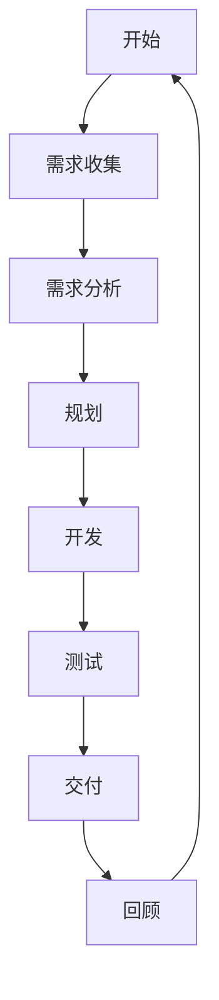
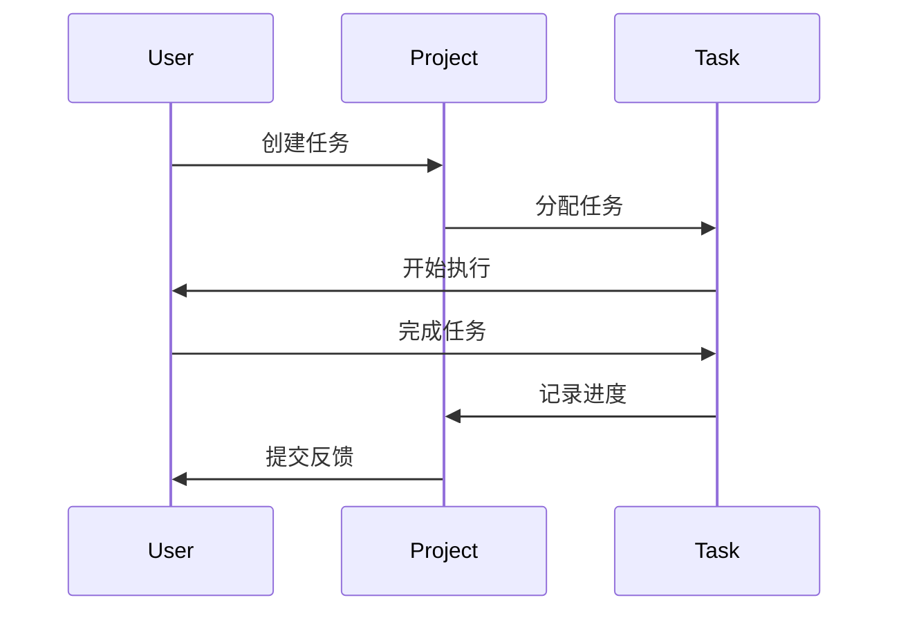
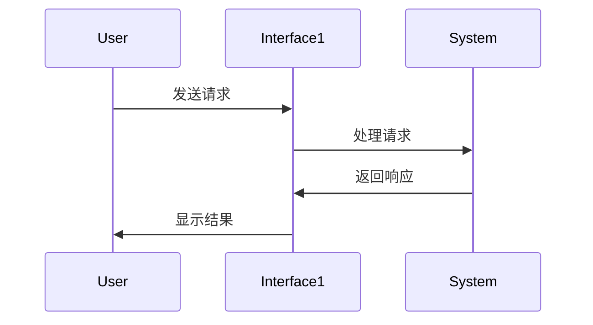

                 


# 敏捷开发：适应变化的项目管理方法

> 关键词：敏捷开发，项目管理，Scrum，极限编程，看板，迭代，持续交付

> 摘要：本文旨在深入探讨敏捷开发这一适应变化的项目管理方法，解析其核心概念、算法原理、系统分析与架构设计，并通过项目实战案例分析，总结最佳实践与注意事项。

## 第一部分：敏捷开发的背景与概念

### 1.1 敏捷开发概述

#### 1.1.1 敏捷开发的起源与发展

敏捷开发（Agile Development）起源于20世纪90年代，当时软件行业面临着需求频繁变化和快速交付的挑战。为了应对这些挑战，一群软件开发者开始探索一种新的开发方法，最终形成了敏捷开发的理念。敏捷开发强调团队协作、快速反馈、持续交付和适应变化。

**敏捷开发的起源**

- 在1990年代，软件项目的失败率很高，传统的计划驱动方法无法满足不断变化的需求。
- 2001年，一组软件开发者在国外举行的一次会议上发表了《敏捷宣言》，标志着敏捷开发的诞生。

**敏捷开发的起源与发展**

- 敏捷开发强调客户需求、团队协作和持续交付。
- 随着时间的推移，出现了多种敏捷方法，如Scrum、XP（极限编程）、看板（Kanban）等。

#### 1.1.2 传统项目管理与敏捷开发的区别

传统项目管理方法，如瀑布模型，强调事先计划好所有的需求和步骤，而敏捷开发则更加灵活，能够在项目进行过程中不断调整。

**传统项目管理方法**

- 瀑布模型：一种线性顺序的开发方法，强调在每个阶段结束后再进行下一个阶段。
- 严格的时间表和预算控制。

**敏捷开发**

- 敏捷开发：一种迭代和增量的开发方法，注重快速反馈和持续交付。
- 更加灵活的响应变化。

#### 1.1.3 敏捷开发的挑战与机遇

敏捷开发带来了许多机遇，如提高项目交付速度和质量，但同时也带来了挑战。

**挑战**

- 需要团队有良好的沟通和协作能力。
- 可能会导致初期成本和时间的增加。

**机遇**

- 更好的客户参与和满意度。
- 更快的市场响应速度。

### 1.2 敏捷开发的核心概念

#### 1.2.1 敏捷开发的主要方法

敏捷开发有多种方法，每种方法都有其独特的特点。

**Scrum**

- Scrum是一种迭代和增量的软件开发方法，强调短周期的迭代开发。
- 主要角色包括产品负责人、Scrum大师和Scrum团队。

**XP（极限编程）**

- XP是一种注重代码质量和团队协作的方法。
- 主要实践包括测试驱动开发、重构等。

**Kanban**

- Kanban是一种可视化的流程管理方法，强调持续交付和减少工作在流程中的时间。

#### 1.2.2 敏捷开发与项目管理

敏捷开发的核心原则是“个体和互动重于过程与工具”、“可工作的软件重于详尽的文档”、“客户合作重于合同谈判”、“响应变化重于遵循计划”。

**敏捷开发的核心原则**

- 个体和互动重于过程与工具。
- 可工作的软件重于详尽的文档。
- 客户合作重于合同谈判。
- 响应变化重于遵循计划。

**敏捷项目管理的方法**

- 敏捷项目管理强调快速迭代和持续交付，使用诸如Scrum、XP、Kanban等方法来管理项目。

**敏捷开发与传统管理的对比**

- 传统管理：注重计划和控制，强调预测和减少风险。
- 敏捷开发：注重团队协作和适应变化，强调快速反馈和持续改进。

### 1.3 敏捷开发中的算法原理

敏捷开发中包含了多种算法和原则，这些算法和原则帮助团队更好地管理项目。

**敏捷规划**

敏捷规划是一种迭代和增量的规划方法，它允许团队在项目进行过程中不断调整计划和目标。

**敏捷迭代**

敏捷迭代是一种短周期的开发方法，每个迭代都产生一个可工作的产品版本。

**数学模型与公式**

敏捷开发中包含了多种数学模型和公式，如工作量估算、进度控制等。

## 第二部分：核心概念与联系

### 2.1 敏捷开发的主要概念

敏捷开发的主要概念包括Scrum、XP、Kanban等。

**Scrum**

- Scrum是一种迭代和增量的软件开发方法，强调短周期的迭代开发。
- 主要角色包括产品负责人、Scrum大师和Scrum团队。

**XP（极限编程）**

- XP是一种注重代码质量和团队协作的方法。
- 主要实践包括测试驱动开发、重构等。

**Kanban**

- Kanban是一种可视化的流程管理方法，强调持续交付和减少工作在流程中的时间。

### 2.2 敏捷开发与传统的计划驱动方法的对比

**敏捷开发**

- 强调迭代和增量开发，快速响应变化。
- 更加灵活，允许在项目进行过程中调整计划。

**传统的计划驱动方法**

- 强调事先计划和严格控制，容易导致项目延误和失败。

### 2.3 敏捷开发的ER实体关系图

敏捷开发的ER实体关系图可以帮助我们更好地理解其核心要素。

**ER实体关系图**

- 产品待办事项
- Sprint
- 用户故事
- 防火墙

### 2.4 敏捷开发的核心算法

敏捷开发中包含了多种核心算法，如敏捷规划、敏捷迭代等。

**敏捷规划**

敏捷规划是一种迭代和增量的规划方法，它允许团队在项目进行过程中不断调整计划和目标。

**敏捷迭代**

敏捷迭代是一种短周期的开发方法，每个迭代都产生一个可工作的产品版本。

## 第三部分：算法原理讲解

### 3.1 敏捷开发的核心算法流程图

使用mermaid绘制敏捷开发的核心算法流程图。



### 3.2 使用Python代码详细阐述敏捷开发的核心算法原理

下面是使用Python代码详细阐述敏捷开发的核心算法原理。

```python
# 敏捷开发核心算法示例

# 需求收集
requirements = ["功能A", "功能B", "功能C"]

# 需求分析
def analyze_requirements(requirements):
    analyzed_requirements = []
    for requirement in requirements:
        # 进行需求分析
        analyzed_requirements.append(requirement + "分析")
    return analyzed_requirements

# 规划
def plan(analyzed_requirements):
    planned_requirements = []
    for requirement in analyzed_requirements:
        # 进行规划
        planned_requirements.append(requirement + "规划")
    return planned_requirements

# 开发
def develop(planned_requirements):
    developed_requirements = []
    for requirement in planned_requirements:
        # 进行开发
        developed_requirements.append(requirement + "开发")
    return developed_requirements

# 测试
def test(developed_requirements):
    tested_requirements = []
    for requirement in developed_requirements:
        # 进行测试
        tested_requirements.append(requirement + "测试")
    return tested_requirements

# 交付
def deliver(tested_requirements):
    delivered_requirements = []
    for requirement in tested_requirements:
        # 进行交付
        delivered_requirements.append(requirement + "交付")
    return delivered_requirements

# 回顾
def review(delivered_requirements):
    reviewed_requirements = []
    for requirement in delivered_requirements:
        # 进行回顾
        reviewed_requirements.append(requirement + "回顾")
    return reviewed_requirements

# 运行算法
final_requirements = review(deliver(test(develop(plan(analyze_requirements(requirements)))))

print(final_requirements)
```

### 3.3 敏捷开发的数学模型与公式

敏捷开发中的数学模型和公式主要用于估算工作量、进度控制等。

**工作量估算**

$$
工作量 = 速度 \times 时间
$$

**进度控制**

$$
进度 = 完成的工作量 / 计划的工作量
$$

### 3.4 公式详解与举例说明

#### 工作量估算

假设一个团队的速度是每周完成2个功能，需要4周时间完成一个项目，那么项目的工作量是8个功能。

$$
工作量 = 2 \times 4 = 8
$$

#### 进度控制

假设项目计划完成的工作量是10个功能，实际完成的工作量是6个功能，那么项目的进度是60%。

$$
进度 = \frac{6}{10} = 0.6 = 60\%
$$

## 第四部分：系统分析与架构设计方案

### 4.1 敏捷开发系统的问题场景和项目背景

在敏捷开发中，系统的问题场景和项目背景通常包括：

- 需求频繁变化
- 快速交付
- 团队协作

### 4.2 系统功能设计

使用mermaid绘制领域模型类图。

```mermaid
classDiagram
    User <<类>> 
    Task <<类>> 
    Project <<类>> 
    Task o--< User : 执行者
    Task o--< Project : 项目组成部分
    Project o--< User : 负责人
```

### 4.3 系统架构设计

使用mermaid绘制系统架构图。



### 4.4 系统接口设计与系统交互

使用mermaid绘制系统接口设计和系统交互序列图。

```mermaid
classDiagram
    Interface1 <<接口>> 
    Interface2 <<接口>> 
    System <<系统>> 
    Interface1 o--< System : 使用系统接口1
    Interface2 o--< System : 使用系统接口2
```



## 第五部分：项目实战

### 5.1 敏捷开发项目应用场景

敏捷开发适用于需求频繁变化、项目周期短、需要快速交付的项目。

### 5.2 项目环境安装与系统核心实现

#### 安装

- 安装Python环境
- 安装敏捷开发工具，如Scrum、XP、Kanban等

#### 实现核心功能

- 创建任务
- 分配任务
- 开始执行
- 完成任务
- 记录进度
- 提交反馈

### 5.3 代码应用解读与分析

#### 解读

- 使用Python编写代码实现敏捷开发的核心功能。
- 解析代码中的类和方法，理解其功能和作用。

#### 分析

- 代码的执行流程和交互逻辑。
- 代码的优化空间和改进方向。

### 5.4 实际案例分析与详细讲解剖析

#### 案例背景

- 一个电商网站的项目开发。
- 需求频繁变化，需要在短时间内完成多个功能。

#### 案例分析

- 分析项目的需求和变更历史。
- 解析敏捷开发在该项目中的应用和效果。

### 5.5 项目小结

#### 效果

- 提高项目交付速度。
- 提高团队协作效率。
- 提高客户满意度。

#### 不足

- 需要团队有良好的沟通和协作能力。
- 需要持续改进和优化。

## 第六部分：最佳实践、小结、注意事项、拓展阅读

### 6.1 最佳实践

- 团队成员之间的有效沟通和协作。
- 持续进行需求分析和规划。
- 定期进行回顾和反思。

### 6.2 小结

本文详细介绍了敏捷开发的核心概念、算法原理、系统分析与架构设计，并通过项目实战案例，总结了敏捷开发的应用效果和最佳实践。

### 6.3 注意事项

- 需要团队成员有良好的沟通和协作能力。
- 需要持续改进和优化。

### 6.4 拓展阅读

- 《敏捷开发实践指南》
- 《Scrum实战》
- 《极限编程实践》

## 结论

敏捷开发是一种适应变化的项目管理方法，它强调团队协作、快速反馈和持续交付。通过本文的详细讲解和分析，我们了解了敏捷开发的原理和应用，为实际项目提供了指导。

# 参考文献

- 《敏捷开发实践指南》
- 《Scrum实战》
- 《极限编程实践》

## 作者信息

作者：AI天才研究院/AI Genius Institute & 禅与计算机程序设计艺术 /Zen And The Art of Computer Programming

